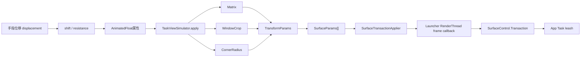
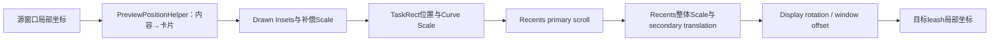

# 225 Android Quickstep TransformParams、TaskViewSimulator与手势逐帧Surface变换

> 源码版本：Android 11 / `android-11.0.0_r48`  
> 学习方式：macOS只读核源，不编译、不运行AOSP  
> 本章重点：手指位移怎样在Launcher进程内变成Task leash的matrix、crop、alpha和corner radius

## 1. 本章接着回答什么

上一章已经证明Recents协议里没有`setProgress(float)`：Launcher直接持有Task leash并逐帧提交SurfaceControl Transaction。

本章继续追这段“直接提交”的内部过程：一个手指向上移动的像素值，怎样经过progress、Recents布局模拟、多个坐标系矩阵、SurfaceParams和RenderThread帧屏障，最终改变真实App窗口的合成外观。

## 2. 先记住整条链

```text
MotionEvent位移
→ SwipeUpAnimationLogic.updateDisplacement
→ mCurrentShift
→ AnimatorControllerWithResistance
→ TaskViewSimulator中的fullscreenProgress / recentsViewScale / translation
→ TaskViewSimulator.apply
→ TransformParams.createSurfaceParams
→ SurfaceTransactionApplier.scheduleApply
→ RenderThread frame callback
→ SurfaceControl.Transaction
→ Task animation leash
```

这条逐帧主链都在Launcher进程，不经过ATMS/WMS Binder。

## 3. 五个核心对象

```text
RemoteAnimationTargets：保存并分类服务端交来的leash
TransformParams：一帧的公共参数与逐target构建策略
TaskViewSimulator：模拟TaskView/RecentsView几何，产出matrix/crop/radius
SurfaceParams：一条Surface需要应用的字段快照
SurfaceTransactionApplier：把多条Surface更新与Launcher View的RT frame对齐
```

## 4. 总体数据流图



## 5. targets从哪里来

`RecentsAnimationCallbacks`收到平台`RemoteAnimationTarget[]`后构造`RecentsAnimationTargets`。

它继承`RemoteAnimationTargets`，附加`homeContentInsets`和`minimizedHomeBounds`，并把目标mode固定为`MODE_CLOSING`。

## 6. 为什么targetMode是MODE_CLOSING

上滑进入Home/Overview时，当前运行App属于closing目标，正是需要从全屏缩成卡片的窗口。

Home/Recents目标通常是opening，默认保留或交给home proxy处理，而不是套同一个App缩放矩阵。

## 7. unfilteredApps与apps的区别

`RemoteAnimationTargets`保存两份视图：

```text
unfilteredApps：服务端传来的全部App targets
apps：只保留mode == targetMode的targets
```

逐帧生成SurfaceParams时必须遍历unfilteredApps，确保opening Home等非主目标也有明确alpha/layer策略。

## 8. hasRecents与isAnimatingHome

构造时扫描activityType是否包含RECENTS；`isAnimatingHome()`则扫描全部target是否包含HOME。

这两个布尔语义不同：独立Recents Activity设备与Home/Overview同Activity设备会走不同Launcher策略。

## 9. findTask只查过滤后的apps

`findTask(taskId)`遍历`apps`而不是unfilteredApps。

在Recents场景中它用于找到当前closing运行Task；若用Home taskId查询可能返回null，即使Home确实存在于unfilteredApps。

## 10. TransformParams是什么

它不是一个完整Matrix计算器，而是“一帧公共状态+为不同target选择Builder策略”的协调器。

核心字段：

```java
float mProgress;
float mTargetAlpha;
float mCornerRadius;
RemoteAnimationTargets mTargetSet;
SurfaceTransactionApplier mSyncTransactionApplier;
BuilderProxy mHomeBuilderProxy;
BuilderProxy mBaseBuilderProxy;
```

## 11. 默认值

构造后：

```text
progress = 0
targetAlpha = 1
cornerRadius = -1
home/base proxy = ALWAYS_VISIBLE
```

`-1`只是“未显式指定”的约定，最终是否自动插值取决于实际BuilderProxy；SurfaceParams不会自行理解这个哨兵。

## 12. PROGRESS和TARGET_ALPHA属性

两个`FloatProperty<TransformParams>`允许ObjectAnimator/PendingAnimation直接驱动TransformParams字段。

属性setter只更新数值，不会自动提交Surface；调用者仍需在动画update中创建并apply SurfaceParams。

## 13. setProgress的真实作用

Javadoc说progress从source 0到target 1，并可参与corner/current rect调整。

但当前r48 `TransformParams.setProgress()`本身只赋值；标准`TaskViewSimulator`主要读取自己的`fullScreenProgress`等AnimatedFloat，TransformParams progress还会被Assistant fade和自定义proxy读取。

## 14. 不要把两个progress混成一个

```text
mCurrentShift：手势从全屏App到Overview目标的位移归一化，可超过1
TaskViewSimulator.fullScreenProgress：1表示更接近全屏，0表示Overview卡片
TransformParams.mProgress：给target proxy使用的一般进度
SpringAnimation progress：从当前窗口形状到Home图标的0→1
```

它们在不同阶段可能方向相反。

## 15. targetAlpha何时使用

匹配targetMode且不是Home/特殊Assistant的App，TransformParams先执行：

```java
builder.withAlpha(getTargetAlpha());
```

标准上滑到Overview通常保持1；收缩到Home图标的Spring阶段会逐渐降到0。

## 16. cornerRadius由谁消费

TransformParams只保存值。

TaskViewSimulator标准Builder使用`getCurrentCornerRadius()`，不读`params.getCornerRadius()`；SpringAnimationRunner的自定义Builder才用后者。这是理解“同字段不同阶段”的关键。

## 17. BuilderProxy是什么

函数签名：

```java
void onBuildTargetParams(
    SurfaceParams.Builder builder,
    RemoteAnimationTargetCompat app,
    TransformParams params);
```

它让同一Target集合在“手势缩卡片、回Home、Fallback Home、锁屏”等场景复用筛选框架，却替换具体Surface字段算法。

## 18. 三类Proxy位置

```text
传给createSurfaceParams(proxy)的主proxy：处理匹配targetMode的普通App
mHomeBuilderProxy：处理匹配targetMode且activityType=HOME的target
mBaseBuilderProxy：处理mode不等于targetMode的其他target
```

默认Home/Base都只设alpha=1。

## 19. Assistant特殊淡出

若目标是Assistant且`isNotInRecents=true`，TransformParams不使用普通targetAlpha，而按限定到0..1的progress套`DEACCEL_2_5`并设置`alpha=1-interpolation`。

这样临时Assistant overlay在进入Overview时淡出，不留下无Recents卡片对应的窗口。

## 20. createSurfaceParams为何遍历全部App

每个unfiltered target都创建一个`SurfaceParams.Builder(app.leash)`。

即使非主目标不变，也显式通过base/home proxy保证可见性，避免上一帧或其他流程残留alpha影响它。

## 21. SurfaceParams是不可变快照

Builder完成后，构造器复制Matrix与Rect：

```java
this.matrix = new Matrix(matrix);
this.windowCrop = windowCrop != null ? new Rect(windowCrop) : null;
```

因此下一帧复用TaskViewSimulator里的临时Matrix/Rect不会篡改已提交给RT callback的上一帧参数。

## 22. flags为何重要

Builder每调用一个`withXxx()`就设置相应bit。

`applyTo(Transaction)`只写flags包含的字段；没设置matrix不等于把matrix重置为identity，没设置alpha也不等于自动恢复1。

## 23. SurfaceParams支持哪些字段

Android 11兼容实现包括：

```text
alpha、matrix、windowCrop、layer、relativeLayer
cornerRadius、backgroundBlurRadius、visibility
```

一次Transaction可为不同leash组合不同字段。

## 24. applyTo的执行顺序

源码依次检查matrix、crop、alpha、layer、corner、blur、visibility、relative layer。

SurfaceControl Transaction最终是状态更新集合，不能把Java调用先后机械理解成GPU逐步绘制八次。

## 25. 没有同步Applier时怎么办

TransformParams创建`TransactionCompat`，遍历params调用`applyParams()`，然后立即`t.apply()`。

这条fallback仍是一次合并Transaction，但不会与某个Launcher View的RenderThread frame number建立屏障。

## 26. 为什么通常设置SurfaceTransactionApplier

App Task leash和Launcher的RecentsView/图标属于不同Surface树。

若Launcher View新位置在一帧提交，而App leash矩阵在另一帧生效，卡片边缘会短暂错位；Applier尝试让两者对齐到同一Launcher渲染帧。

## 27. Applier何时创建

`BaseSwipeUpHandler.linkRecentsViewScroll()`调用：

```java
SurfaceTransactionApplier.create(mRecentsView, callback)
```

View已有有效ViewRoot时立即创建；尚未attach则注册OnAttachStateChangeListener，attach后再创建。

## 28. target View是同步锚点

Applier保存：

```text
ViewRootImplCompat
ViewRoot的Render SurfaceControl（barrier surface）
Handler
最后一次sequence number
```

它不以App leash自己的buffer帧作为锚点，而以Launcher目标View的渲染Surface为锚点。

## 29. scheduleApply做的第一件事

确认View仍存在，然后递增`mLastSequenceNumber`并`setCanRelease(false)`。

随后注册RT frame callback，最后`view.invalidate()`确保Launcher确实安排新帧。

## 30. 为什么参数传入后禁止修改

调用线程把SurfaceParams数组交给未来的RenderThread frame callback。

若继续修改共享Matrix/Rect，会产生UI线程与RT线程数据竞态；不可变副本是跨线程正确性的基础。

## 31. RT frame callback拿到什么

回调参数`frame`是Launcher渲染Surface的frame number。

Applier为每个有效target surface调用`deferTransactionUntil(target, barrierSurface, frame)`，再把该SurfaceParams写进同一Transaction。

## 32. deferTransactionUntil表达什么

它要求目标leash上的这批属性更新不要早于同步锚点到达指定frame。

目的是视觉时序对齐，不是等待该帧已经物理present后才开始，也不是CPU阻塞等待fence。

## 33. 为什么反向遍历params

Launcher实现从数组末尾到0写Transaction。

对于不同Surface，顺序通常不改变原子提交语义；真正Z序由layer/relativeLayer字段和Surface树决定，而不是数组遍历先后。

## 34. barrier无效时怎么办

若barrier SurfaceControl为null或invalid，Applier不提交这批Surface变化，只发送sequence完成消息。

它避免对已经detach/销毁的Launcher Surface建立无效同步关系。

## 35. sequence number解决什么

快速手势可能连续schedule多帧，旧RT callback的Handler完成消息可能晚于新请求。

只有消息sequence等于当前`mLastSequenceNumber`时才`setCanRelease(true)`，防止旧帧完成误判所有新Transaction都已安全离开客户端对象。

## 36. apply消息不是present回执

Handler消息是在`t.apply()`调用之后发送，表示客户端已把该批Transaction提交出去。

它不是SurfaceFlinger latch、HWC present fence或面板scanout完成通知；ReleaseCheck只防客户端过早release句柄。

## 37. RemoteAnimationTargets为何有ReleaseCheck

Recents结束时TaskAnimationManager会调用targets.release()释放每个Compat target持有的SurfaceControl引用。

若最后一笔RT callback还没读取leash，立即release会让回调操作invalid Surface，因此先等待所有ReleaseCheck安全。

## 38. release是幂等的

`mReleased=true`后再次调用直接返回。

若某check暂不可释放，就登记`this::release`回调；所有check最终变为true后重新尝试并真正释放App与wallpaper target句柄。

## 39. 释放句柄不等于删除服务端leash

客户端`target.release()`只释放本地SurfaceControl引用。

服务端SurfaceAnimator在Recents finish/cancel时负责reparent真实Task Surface并remove动画leash；两端各有自己的生命周期责任。

## 40. RectFSpringAnim也能作为ReleaseCheck

回Home图标的Spring动画仍会持续读取leash。

BaseSwipeUpHandler把它加入targets的release checks，动画结束/取消前不允许TaskAnimationManager把Surface句柄提前释放。

## 41. 手势位移怎样得到shift

`SwipeUpAnimationLogic.updateDisplacement()`先把移动方向取反，再把正向位移除以`mTransitionDragLength`。

```text
shift=0：手势起点，全屏App
shift=1：达到Overview目标位置
shift>1：继续上拉，进入阻尼区
```

负方向被clamp为0。

## 42. transitionDragLength从哪里来

`BaseActivityInterface.getSwipeUpDestinationAndLength()`结合DeviceProfile、目标Task rect和当前方向计算。

它不是固定屏幕高度；导航模式、Insets、横竖屏和设备布局都会改变达到Overview所需距离。

## 43. dragLengthFactor为何可能大于1

全手势导航允许拖到屏幕顶部，factor约为`heightPx / transitionDragLength`；双按钮模式用额外阻尼常量。

shift因此不是永远0..1，只有进入普通动画属性前才按需clamp。

## 44. AnimatedFloat怎样触发一帧

`mCurrentShift`创建时绑定`updateFinalShift`回调。

`updateValue()`只有数值真的变化才运行回调，避免同一个位移重复计算和提交完全相同的Surface参数。

## 45. updateFinalShift做哪些协作

BaseSwipeUpHandlerV2中它会更新live tile overlay、Overview阈值与触觉反馈、SystemUI flags，然后调用`applyWindowTransform()`并更新Launcher自身转场进度。

窗口leash和Launcher View动画由同一个shift源驱动。

## 46. AnimatorControllerWithResistance分两段

`setProgress(progress,maxProgress)`：

```text
0..1 → normal controller
1..maxProgress → resistance controller
```

normal progress被clamp；超过目标后的额外位移只驱动阻尼动画，不会让普通Overview布局无限线性缩放。

## 47. normal controller控制哪些值

`TaskViewSimulator.addAppToOverviewAnim()`添加：

```java
fullScreenProgress: 1 → 0
recentsViewScale: fullScreenScale → 1
```

动画名叫“App to Overview”，所以手势shift增大时fullscreenProgress反而减小。

## 48. PendingAnimation时长为何是dragLength*2

这里主要用它创建可手动seek的`AnimatorPlaybackController`，手势通过play fraction驱动。

数值提供动画时间轴尺度，不表示用户必须在`dragLength*2`毫秒内完成手势。

## 49. TaskViewSimulator为什么叫Simulator

它不依赖真实TaskView已经完成每次layout，而是使用与TaskView/RecentsView相同的size strategy、orientation handler、thumbnail matrix和fullscreen参数，在内存中重建“如果这个live window是卡片，现在应在哪里”。

这样真实App leash能与稍后绘制的TaskView卡片对齐。

## 50. Simulator的输入分四组

```text
设备：DeviceProfile、display/touch/recents rotation
目标窗口：screenSpaceBounds、contentInsets、window position
Recents布局：task rect、scroll、scale、secondary translation
过渡状态：fullscreenProgress、curve scale、drawn insets/radius
```

任何一组变化都可能让旧矩阵失效。

## 51. setPreview保存什么

从running target取：

```text
screenSpaceBounds → mThumbnailPosition
contentInsets → ThumbnailData.insets
屏幕left/top → mRunningTargetWindowPosition
```

这三者分别参与源内容尺寸、裁剪和Launcher/窗口坐标系转换。

## 52. 为何不用Task快照Bitmap

这里动画的是live Task leash，但几何计算复用了`PreviewPositionHelper`的缩略图布局算法。

把真实窗口bounds当作“thumbnail position”，可以让live Surface与Recents卡片里的快照布局遵循同一裁剪/旋转规则。

## 53. r48的windowingMode假设

`setPreviewBounds()`给临时ThumbnailData写：

```java
mThumbnailData.windowingMode = WINDOWING_MODE_FULLSCREEN;
```

源码旁有`TODO: What is this?`。这说明当前模拟器对输入窗口模式做了简化假设，不能据此声称所有分屏/自由窗几何都完整建模。

## 54. layout与scroll分开缓存

`mLayoutValid`覆盖Task size、thumbnail matrix、pivot、half sizes；`mScrollValid`覆盖screen center、插值和curve scale。

只改变scroll时不必重算旋转/thumbnail适配矩阵，降低每个MOVE事件的计算量。

## 55. 哪些操作使layout失效

`setDp()`、`setLayoutRotation()`、`setRecentsRotation()`、`setPreviewBounds()`都会把`mLayoutValid=false`。

因为设备尺寸、旋转或源窗口边界改变会重定义整条坐标映射。

## 56. setScroll只使scroll失效

scroll变化不会改变Task卡片本身的固有宽高或源thumbnail旋转，因此只重算Recents页中心插值和曲线缩放。

这是缓存粒度与数学依赖一致的例子。

## 57. getFullScreenScaleAndPivot

size strategy先算Overview中的`mTaskRect`，OrientationState再求把这个Task rect放大回全屏所需scale和pivot。

手势起点用该scale，终点回到scale=1的卡片尺寸。

## 58. PreviewPositionHelper做什么

它结合源窗口bounds、contentInsets、ThumbnailData rotation/scale、Task card宽高、DeviceProfile和当前Recents rotation，生成源内容到卡片内容的Matrix及被裁剪Insets。

横竖屏切换时还会旋转缩略图坐标。

## 59. PreviewPositionHelper的适配策略

源码以卡片宽度为主要fit基准；扣除Insets后的thumbnail宽/高按方向选择缩放。

若缩放后高度不足卡片，还记录底部clip位置，避免把不存在的内容拉伸填满。

## 60. FullscreenDrawParams的语义

它根据`fullscreenProgress`计算：

```text
mCurrentDrawnInsets
mCurrentDrawnCornerRadius
mScale（把逐渐画回的左右Insets重新容纳进preview宽度）
```

progress 0偏Task卡片，1偏全屏窗口。

## 61. Insets怎样插值

每条Inset乘fullscreenProgress。

从Overview到全屏时，卡片里原本裁掉的系统区域逐渐画回；从全屏上滑到Overview则反向逐渐裁掉这些区域。

## 62. 圆角怎样插值

从Task card corner radius插值到全屏window corner radius；多窗口模式的全屏目标半径设0。

结果还除以parentScale，因为Surface圆角在变换前的局部坐标中设置，要抵消父级缩放才能得到期望可见半径。

## 63. 左右Insets为何影响额外scale

thumbnail最初按“排除Insets后的内容”适配卡片宽度。

当fullscreenProgress把左右Insets重新画回，总宽度变大，需要用`previewWidth/(previewWidth+left+right)`稍微缩小，保持整体仍装入目标宽度。

## 64. 标准Matrix的第一层：thumbnail

`mMatrix.set(mPositionHelper.getMatrix())`先把源live window/thumbnail内容适配到Task card内容坐标。

随后postTranslate当前drawn Insets，再postScale FullscreenDrawParams的补偿scale。

## 65. 第二层：TaskView布局

把内容平移到`mTaskRect.left/top`，再围绕Task中心应用`mCurveScale`。

curve scale模拟Recents横向分页中非中心卡片沿曲线轻微缩放的视觉效果。

## 66. 第三层：Recents滚动

OrientationHandler用primary方向设置post translation。

横屏/竖屏下primary轴不同，代码不应把滚动永远硬编码成Matrix X或Y。

## 67. 第四层：RecentsView整体变换

围绕fullscreen pivot应用`recentsViewScale`，再沿secondary方向应用`recentsViewSecondaryTranslation`。

超过Overview目标后的阻尼主要通过这类整体scale/translation体现。

## 68. 第五层：Launcher到窗口坐标

最后补window offset、display rotation差和running target的屏幕left/top，使前面在Launcher布局空间构造的矩阵可用于目标leash的局部窗口坐标。

这一步错一个平移，live window就会与TaskView卡片整体错开。



## 69. applyWindowToHomeRotation的r48实现细节

方法签名接受`Matrix matrix`，但第一行写的是：

```java
mMatrix.postTranslate(mDp.windowX, mDp.windowY);
```

后两步才操作参数`matrix`。在`apply()`传入字段`mMatrix`时两者相同；外部传入另一个Matrix时行为不对称。应按r48源码记录这个实现边界，不能把三步都改写成操作参数后声称是原码。

## 70. rotation为何还要减running window position

Remote target leash的局部原点不一定是屏幕`(0,0)`。

最后postTranslate负的screenSpaceBounds.left/top，把全局/Launcher坐标变换还原为leash局部坐标。

## 71. crop为什么不能用最终Matrix的逆

Surface window crop是在目标Surface局部内容坐标中定义，然后再随matrix变换。

Simulator只用thumbnail position matrix的逆把“卡片当前可见区域”映回源窗口内容坐标，不能把Recents滚动和全局旋转也逆回crop。

## 72. crop怎样构造

先以Task card尺寸扩展当前drawn insets：

```text
left=-inset.left
top=-inset.top
right=taskWidth+inset.right
bottom=taskHeight+inset.bottom
```

再用`mInversePositionMatrix.mapRect()`映回源窗口坐标，最后`roundOut()`避免向内取整裁掉边缘像素。

## 73. roundOut为何重要

Matrix缩放/旋转后RectF边界通常是小数。

向外取整保证整数crop覆盖完整可见区域；普通四舍五入可能在右/下边缘少一列像素，手势中出现细线。

## 74. 圆角半径也要逆变换

屏幕上想看到的radius位于Task card空间，SurfaceControl corner radius却在leash局部空间解释。

Simulator把向量`(visibleRadius,0)`通过inverse position matrix，取两个分量绝对值最大者作为局部radius。

## 75. 为什么mapVectors而不是mapPoints

半径只受scale/rotation影响，不应叠加translation。

`mapVectors()`忽略平移；若用mapPoints，窗口位置会被错误加到radius中。

## 76. “优化不用平方根”的含义

源码注释说理想可求向量长度，但输入一维且主要是scale/rotation，取映射后两个分量绝对值最大值作为近似。

它是视觉足够的优化，不是任意仿射变换下严格保持圆的数学公式。

## 77. Builder最终写三项

TaskViewSimulator的标准`onBuildTargetParams()`：

```java
builder.withMatrix(mMatrix)
       .withWindowCrop(mTmpCropRect)
       .withCornerRadius(getCurrentCornerRadius());
```

alpha已由TransformParams在调用主proxy前设置。

## 78. 一帧为何要为所有target重建参数

主closing App要matrix/crop/radius，Home或非目标App可能只需alpha，Assistant又有特殊淡出。

`createSurfaceParams()`把它们装进同一数组，Applier再放进同一Transaction，保持跨窗口的一帧一致性。

## 79. applyWindowTransform触发点

`BaseSwipeUpHandler.applyWindowTransform()`先seek normal/resistance controller，再根据RecentsView scroll更新Simulator，最后`mTaskViewSimulator.apply(mTransformParams)`。

手指变化、Recents attach动画、页面滚动等都可能重新调用它。

## 80. 为什么scroll也要移动live window

进入Overview后用户横向滑任务列表时，当前live tile应与对应TaskView一起滚动。

若只滚Launcher View不改Task leash，卡片框会移动而真实App画面留在原地。

## 81. moveWindowWithRecentsScroll是策略门

不是所有阶段都强制把live window绑定到Recents滚动。

Handler根据手势状态决定是否链接，链接时OnScrollChangeListener调用`updateFinalShift()`重新计算Surface矩阵。

## 82. 回Home进入另一套几何

用户最终回Home图标时，不再只是全屏→Overview卡片的线性布局模拟，而是从当前可见Rect弹簧到图标Rect。

`createWindowAnimationToHome()`先冻结当前crop、matrix和radius作为Spring起点。

## 83. 起始Rect怎样转到Launcher空间

先用Simulator当前Matrix把crop映到窗口空间，再构造window↔home位置矩阵并求逆，把Rect映回Launcher空间。

RectFSpringAnim与浮动图标View都在Launcher空间计算，必须先统一坐标系。

## 84. Spring每帧产出什么

`RectFSpringAnim`回调给出`currentRect`和progress。

Runner把currentRect映到窗口空间，用`setRectToRect(cropRect,currentRect,FILL)`生成leash Matrix，并插值圆角和alpha。

## 85. setRectToRect的FILL含义

它分别缩放X/Y，让固定crop完整填入currentRect。

若起止宽高比变化，可能产生非等比缩放；这是窗口收束到图标形状时的设计选择。

## 86. 回Home alpha曲线

`getWindowAlpha(progress)`在0保持1，到progress 0.85已经降为0，使用`ACCEL_1_5`映射。

最后15%真实App窗口已透明，Launcher的FloatingIcon/shape reveal可接管终点视觉，减少矩形内容挤进图标的违和感。

## 87. 回Home圆角终点

起点使用Simulator当前可见radius，终点设为crop宽度一半，得到足够圆的形状。

这不是读取真实应用window corner；它为与圆形/圆角图标交接服务。

## 88. 为什么AnimationFactory还收到mapRadius

Surface leash用局部坐标radius；Launcher浮动图标View需要屏幕/Launcher空间可见radius。

Runner用当前Matrix的`mapRadius()`把局部radius转换后传给UI层，使两个不同Surface树的圆角视觉一致。

## 89. Home自身动画如何同步

Spring Runner同时调用`mHomeAnim.setPlayFraction(progress)`和`mAnimationFactory.update(...)`。

App leash缩小、Launcher workspace/hotseat状态以及浮动图标形状由同一Spring progress驱动，但真正提交路径分别是Surface Transaction与View渲染。

## 90. Applier为何对这种交接尤其重要

若App leash先缩到新Rect，而FloatingIcon View下一帧才到同一Rect，边缘会出现分离。

以Launcher Render Surface frame number defer外部leash Transaction，可以降低这类跨Surface树错帧。

## 91. 一帧时序图

```mermaid
sequenceDiagram
    participant IN as "InputConsumer / UI线程"
    participant SW as "Swipe Handler"
    participant TV as "TaskViewSimulator"
    participant TP as "TransformParams"
    participant AP as "SurfaceTransactionApplier"
    participant RT as "Launcher RenderThread"
    participant SF as "SurfaceFlinger"
    IN->>SW: "MOVE displacement"
    SW->>SW: "shift + controller seek"
    SW->>TV: "apply(params)"
    TV->>TV: "matrix + crop + radius"
    TV->>TP: "createSurfaceParams(all targets)"
    TP->>AP: "scheduleApply(params[])"
    AP->>RT: "registerRtFrameCallback + invalidate"
    RT->>RT: "Launcher View录制/绘制到frame N"
    RT->>SF: "defer target transaction until barrier frame N; apply"
    AP-->>AP: "sequence完成，允许安全release"
```

## 92. 这里的“同步”精确到哪里

它把Task leash属性事务关联到Launcher Render Surface的frame number，避免外部Surface明显早于锚点帧。

它不保证两个Surface的GPU工作耗时相同，也不直接证明HWC把两者在同一物理扫描时刻present；最终显示仍由SF/HWC调度。

## 93. Matrix顺序为何难读

Android Matrix的post操作是在现有变换后组合，且源码在方向Handler中抽象primary/secondary轴。

阅读时应拿一个点按“源窗口→卡片内容→Task位置→Recents滚动/缩放→Display旋转→leash局部”逐层验证，不要只凭postTranslate的代码行顺序猜屏幕效果。

## 94. 一个简化算例

假设源窗口800×1200，Overview Task rect 400×600，不考虑Insets/旋转/滚动：

```text
thumbnail适配scale约0.5
Overview端recentsViewScale=1
全屏端Task rect再绕pivot放大约2倍
```

完整实现还会叠contentInsets、window offset、curve scale和DeviceProfile pivot，所以不能直接把最终matrix写死为0.5。

## 95. crop与matrix的组合直觉

先在源窗口局部坐标裁出允许显示的区域，再用matrix把这块区域搬到Task卡片位置。

若只缩matrix不裁crop，状态栏/导航栏内容可能挤进卡片；若只裁crop不缩matrix，窗口仍停在全屏位置。

## 96. alpha为何与matrix分开

几何变换负责“在哪里、长多大、什么形状”，alpha负责不同Surface之间的视觉交接。

回Home时App内容可以在矩形尚未到图标终点前先淡出，让Launcher图标承担最后形态。

## 97. layer策略为什么不在TaskViewSimulator固定写

标准Simulator只写matrix/crop/radius。

多target的前后关系、Home/Fallback/Assistant或特殊启动场景由不同BuilderProxy按需要设置layer/relativeLayer，避免几何工具硬编码业务Z序。

## 98. immediate fallback的风险边界

没有Applier时TransformParams仍能正确修改leash，但外部Surface与Launcher View可能不在同一RT frame屏障。

这不是功能必然失败，只是跨Surface视觉同步保证较弱。

## 99. View detach竞态

scheduleApply开头若`getView()==null`直接返回；RT callback执行时也再次检查barrier validity。

Launcher Activity销毁/切换期间不能假设已排队的每一组参数都会真正提交，因此Recents finish/cancel仍需服务端恢复最终层级。

## 100. 为什么最终状态不能只靠最后一帧矩阵

最后一笔Surface Transaction可能因View detach、runner死亡或取消竞态未执行。

真正到Home或回App由IRecentsAnimationController.finish触发system_server重排Task并拆leash；客户端矩阵只负责过渡画面，不是持久窗口状态。

## 101. 源码中三个容易误读的“Surface完成”

```text
SurfaceTransactionApplier Handler sequence完成
  表示最后请求的Transaction已在客户端apply

RemoteAnimationTargets.release完成
  表示客户端句柄可释放

RecentsAnimation finish完成
  表示服务端控制权/层级正在收尾
```

三者都不能单独当成物理present fence signal。

## 102. 性能热点在哪里

每个输入更新可能进行Matrix组合、Rect映射、为所有targets分配SurfaceParams/Builder以及注册RT callback。

Simulator用layout/scroll缓存、临时Rect/Matrix复用和只在AnimatedFloat变化时回调来降低开销；SurfaceParams仍刻意复制可变几何以保证线程安全。

## 103. 为什么不能为了少分配共享Matrix引用

UI线程可能在RT callback消费前进入下一次MOVE并改写`mMatrix`。

若SurfaceParams不复制，旧frame会意外使用新frame几何，出现抖动或跳帧；这里的少量复制换取确定的一帧快照。

## 104. 旋转是最容易出错的分支

touch rotation、display rotation、Recents Activity rotation和Task snapshot rotation可能不同。

OrientationState与PreviewPositionHelper分别处理布局轴和源内容旋转，再由applyWindowToHomeRotation转换到leash坐标；漏掉任一层都会在横屏手势中暴露。

## 105. 多窗口边界

DeviceProfile可切到multi-window profile，fullscreen corner目标设0，Home bounds与Insets也可能来自上一章的minimizedHomeBounds。

但Simulator又强制临时ThumbnailData windowingMode为fullscreen并留有TODO，所以应把r48支持理解为特定路径适配，而非任意多窗口仿射都完备。

## 106. Fallback Launcher为何需要Home proxy

当当前Home不是同一个Launcher Activity或Overview采用独立组件时，Home target也可能需要缩放/alpha，而非永远保持可见。

`setHomeBuilderProxy()`让FallbackSwipeHandler单独描述Home leash，不污染普通closing App的TaskViewSimulator算法。

## 107. base proxy解决什么

mode不匹配的opening/其他App默认alpha=1，但某些场景需要跟随手势改变其scale、alpha或layer。

`setBaseBuilderProxy()`提供覆盖点，TransformParams仍保证所有target在同一Transaction批次中处理。

## 108. 常见误解纠正

| 误解 | 正确理解 |
|---|---|
| TransformParams自己算完整Matrix | 主要几何由TaskViewSimulator/自定义BuilderProxy计算 |
| 所有progress含义相同 | shift、fullscreenProgress、Transform progress、Spring progress方向和范围不同 |
| crop是屏幕坐标 | crop是leash局部源内容坐标，之后随matrix变换 |
| 圆角直接用屏幕px | 要逆scale换算成Surface局部radius |
| scheduleApply完成就是已显示 | 只是Transaction已提交并可安全释放客户端引用 |
| 最后一帧决定最终Task位置 | 最终状态由system_server finish/reorder决定 |

## 109. macOS只读练习一：画出progress关系

```bash
cd /Users/ninebot/androidSource
sed -n '35,125p' \
  packages/apps/Launcher3/quickstep/recents_ui_overrides/src/com/android/quickstep/SwipeUpAnimationLogic.java
sed -n '95,135p' \
  packages/apps/Launcher3/quickstep/src/com/android/quickstep/util/AnimatorControllerWithResistance.java
```

目标：解释shift从0→1时，为什么fullScreenProgress从1→0，而recentsViewScale从fullScreenScale→1。

## 110. macOS只读练习二：逐层标注Matrix

```bash
cd /Users/ninebot/androidSource
sed -n '220,320p' \
  packages/apps/Launcher3/quickstep/recents_ui_overrides/src/com/android/quickstep/util/TaskViewSimulator.java
```

在每个`postTranslate/postScale`旁写下输入与输出坐标系，并特别检查`applyWindowToHomeRotation()`里字段`mMatrix`与参数`matrix`的不对称。

## 111. macOS只读练习三：验证一帧同步

```bash
cd /Users/ninebot/androidSource
sed -n '35,145p' \
  packages/apps/Launcher3/quickstep/recents_ui_overrides/src/com/android/quickstep/util/SurfaceTransactionApplier.java
sed -n '1,145p' \
  packages/apps/Launcher3/quickstep/src/com/android/quickstep/RemoteAnimationTargets.java
```

目标：说明sequence number为什么防旧回调误放行，以及release check保护的是客户端Surface句柄而非硬件present。

## 112. macOS只读练习四：手算crop和radius

假设卡片可见rect为`[0,0,400,600]`，thumbnail position matrix只有0.5等比缩放，无旋转和平移，可见radius为20px。

逆矩阵scale为2，因此源窗口crop约为`[0,0,800,1200]`，局部corner radius约40px；应用0.5 matrix后屏幕可见radius重新约20px。

## 113. 源码阅读导航

```text
packages/apps/Launcher3/quickstep/src/com/android/quickstep/RemoteAnimationTargets.java
packages/apps/Launcher3/quickstep/src/com/android/quickstep/RecentsAnimationTargets.java
packages/apps/Launcher3/quickstep/recents_ui_overrides/src/com/android/quickstep/SwipeUpAnimationLogic.java
packages/apps/Launcher3/quickstep/recents_ui_overrides/src/com/android/quickstep/BaseSwipeUpHandler.java
packages/apps/Launcher3/quickstep/recents_ui_overrides/src/com/android/quickstep/BaseSwipeUpHandlerV2.java
packages/apps/Launcher3/quickstep/recents_ui_overrides/src/com/android/quickstep/util/TransformParams.java
packages/apps/Launcher3/quickstep/recents_ui_overrides/src/com/android/quickstep/util/TaskViewSimulator.java
packages/apps/Launcher3/quickstep/recents_ui_overrides/src/com/android/quickstep/util/SurfaceTransactionApplier.java
packages/apps/Launcher3/quickstep/recents_ui_overrides/src/com/android/quickstep/views/TaskThumbnailView.java
packages/apps/Launcher3/quickstep/recents_ui_overrides/src/com/android/quickstep/views/TaskView.java
frameworks/base/packages/SystemUI/shared/src/com/android/systemui/shared/system/SyncRtSurfaceTransactionApplierCompat.java
```

## 114. 本章复读后的精确结论

1. Quickstep把手势位移变成多个可seek属性，TaskViewSimulator再复用Recents真实布局算法计算Task leash几何。  
2. Matrix负责源窗口到卡片/图标的位置与缩放，crop保留在leash局部坐标，corner radius必须逆scale换算。  
3. TransformParams按target mode、Home、Assistant和base分派BuilderProxy，并把所有Surface字段冻结成一帧快照。  
4. SurfaceTransactionApplier用Launcher Render Surface的frame number延后外部leash Transaction，降低View与App Surface错帧。  
5. ReleaseCheck只保证最后的客户端Transaction不再使用句柄；最终Task层级与leash删除仍由system_server提交。

## 115. 检查题

1. 为什么RecentsAnimationTargets既保留unfilteredApps又保留apps？  
2. shift、fullscreenProgress和Spring progress的方向分别是什么？  
3. 为什么SurfaceParams必须复制Matrix和Rect？  
4. crop为什么用thumbnail matrix的逆，而不是最终全局Matrix的逆？  
5. 屏幕可见圆角20px在0.5倍Surface matrix下，为何局部radius应约40px？  
6. `deferTransactionUntil(..., frame)`能保证什么，又不能保证什么？

## 116. 下一章预告

下一章进入Quickstep手势判定与状态机：从InputConsumer、VelocityTracker和位移阈值开始，追GestureState、MultiStateCallback如何在Activity就绪、Recents targets就绪、手势结束、动画完成等异步条件之间选择HOME、RECENTS、NEW_TASK或LAST_TASK终点。
