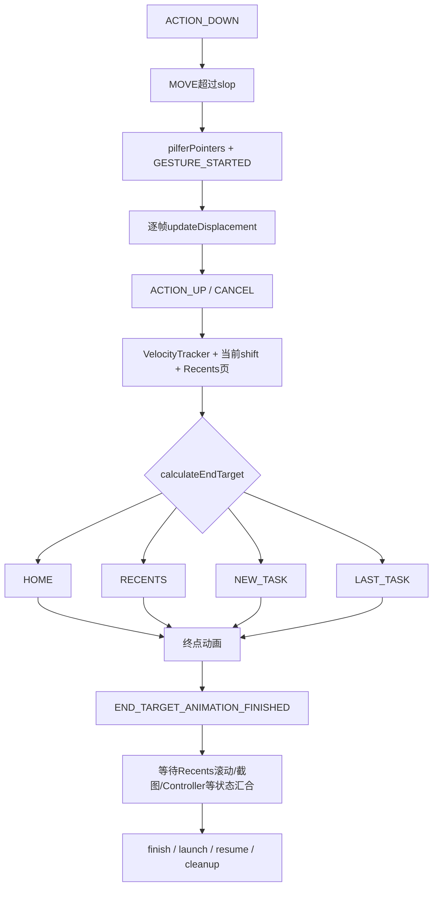
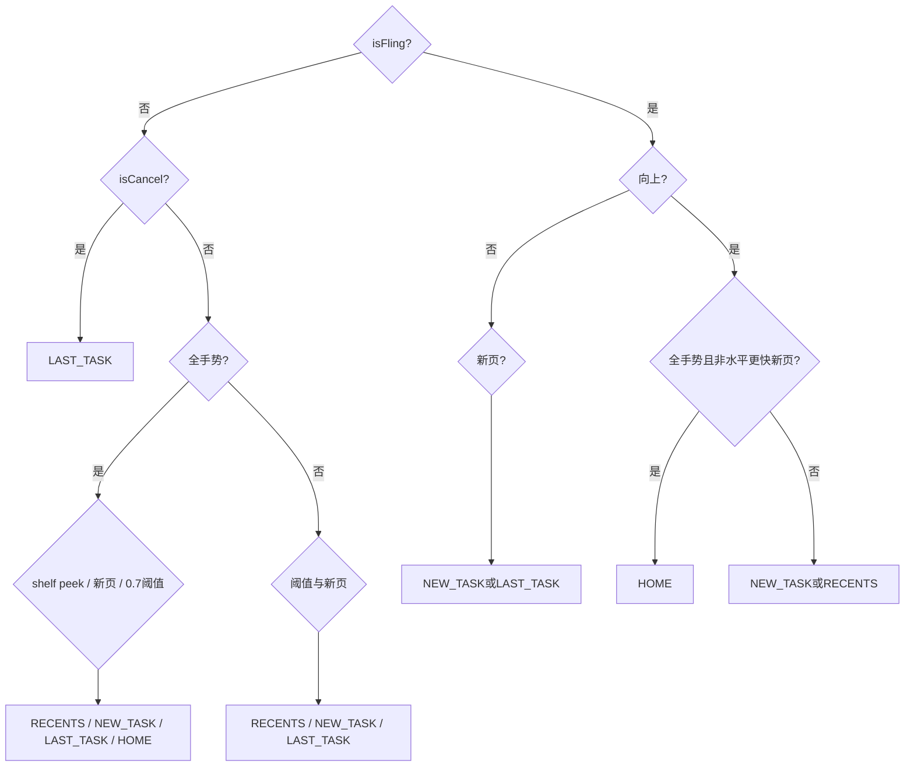
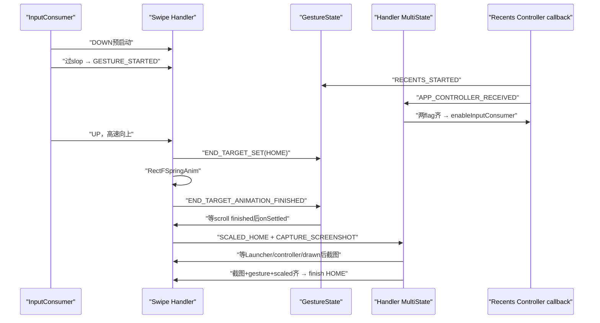

# 226 Android Quickstep手势判定、GestureState与MultiStateCallback异步状态机

> 源码版本：Android 11 / `android-11.0.0_r48`  
> 学习方式：macOS只读核源，不编译、不运行AOSP

## 1. 本章要解决什么

Task leash已经能跟手移动，但手指抬起时系统还要回答两个问题：最终去Home、停在Overview、打开另一Task，还是回原Task？Activity创建、Recents targets、截图、页面滚动和终点动画又以不同速度完成，谁来保证它们凑齐后才执行下一步？

## 2. 两套状态账

```text
GestureState
  跨TaskAnimationManager、Handler和新手势保存Recents生命周期与最终目标

BaseSwipeUpHandlerV2.mStateCallback
  当前Handler内部保存Launcher Activity、Controller、截图、终点动画与清理屏障
```

二者都用MultiStateCallback，但flag集合和生命周期不同。

## 3. 总体流程



## 4. 输入第一站

前景不是Launcher时，`OtherActivityInputConsumer`处理来自导航区域的MotionEvent，维护active pointer、down/last position、VelocityTracker、slop和MotionPauseDetector。

它不直接决定Task层级，而把有效手势交给`BaseSwipeUpHandler`。

## 5. 为何有两个slop

```text
mPassedWindowMoveSlop：超过普通touch slop后可以开始移动窗口
mPassedPilferInputSlop：超过更大方向判定slop后，正式抢走pointer stream
```

前者让窗口更早跟手，后者避免轻微点击/返回手势被Quickstep误接管。

## 6. 不同导航模式的slop倍率

全手势模式使用`2 * touchSlop²`阈值，双按钮模式使用`9 * touchSlop²`。

源码比较的是平方距离，所以倍率直接乘在`squaredTouchSlop`上，不等于距离分别是2倍和9倍。

## 7. 为什么DOWN就可能启动Recents Animation

非deferred目标在ACTION_DOWN调用`startTouchTrackingForWindowAnimation()`，给Launcher Activity和system_server更多准备时间。

这时手势尚未正式开始，后续未过slop就UP还要取消已经预热的Recents动画。

## 8. deferred down路径

若起点可能属于其他手势区域，直到通过真正pilfer slop才创建Handler和启动Recents Animation。

它减少误触时无意义的Home栈移动与Surface leash创建。

## 9. 多指边界

正式pilfer前若新增pointer不在允许的swipe-up区域，Consumer把事件临时改为ACTION_CANCEL并强制结束。

正式接管后，活动pointer抬起会切换到另一个pointer，并重算downPos以保持累计位移连续。

## 10. pointer切换为何调整downPos

新手指坐标与旧手指不同，若只替换pointerId，下一帧displacement会跳变。

源码用“旧累计位移”反推新downPos，让`lastPos-downPos`在切换前后保持一致。

## 11. likelyToStartNewTask怎样粗判

MOVE阶段比较水平距离与向上距离；水平更大时认为可能quick switch到另一Task。

继续上一次手势但本次尚未重新过slop时，也先按可能新Task处理，避免Recents被错误纵向拉走。

## 12. pilferPointers意味着什么

通过正式slop后调用`InputMonitorCompat.pilferPointers()`，现有pointer stream转交Quickstep，其他窗口收到取消。

随后关闭系统浮层/系统窗口，并通知Handler `onGestureStarted()`。

## 13. MotionPauseDetector的作用

全手势模式在上拉足够距离且不像水平quick switch时允许检测“停住”。

这个停顿可形成shelf/Overview语义；太靠近App或明显横滑时禁止pause。

## 14. ACTION_UP如何取速度

VelocityTracker以每秒1000单位计算并限制最大fling速度，得到X/Y分量。

沿导航栏到屏幕中心的主速度会根据底部、左边或右边导航栏转换符号，再传给Handler。

## 15. fling判定

Handler要求手势确实started，并且`abs(endVelocity)`超过资源`quickstep_fling_threshold_velocity`。

只有速度大不够；尚未过slop的DOWN/UP不能变成fling。

## 16. CANCEL固定回原Task

`onGestureCancelled()`先把displacement归零，设置GESTURE_COMPLETED，再用`isCancel=true`进入普通结束函数。

`calculateEndTarget()`在非fling cancel分支直接选择LAST_TASK。

## 17. 四种终点

```text
HOME：回Launcher workspace
RECENTS：停在Overview任务列表
NEW_TASK：切换/启动另一Task
LAST_TASK：回到手势开始或应恢复的App Task
```

名字描述业务终点，不是Activity生命周期状态。

## 18. GestureEndTarget的三个属性

每个枚举保存：

```text
isLauncher
日志containerType
recentsAttachedToAppWindow
```

HOME/RECENTS的`isLauncher=true`；NEW_TASK/LAST_TASK为false。

## 19. recentsAttachedToAppWindow并非等同isLauncher

HOME的该值为false，RECENTS、NEW_TASK、LAST_TASK为true。

它描述终点动画期间RecentsView是否视觉附着在App window，不是最终是否停留Launcher Activity。

## 20. goingToNewTask怎样算

有RecentsView和targets时，比较running task page与next page；不同则true。

没有targets时假设是延续已结束的上一手势，设true；没有RecentsView则false。

## 21. Overview阈值

`mCurrentShift >= 0.7`认为到达Overview阈值。

它影响非fling吸附方向，但快速fling会优先看速度和方向。

## 22. 全手势非fling决策

按源码顺序：

```text
Shelf正在peek → RECENTS
否则已横向选另一页 → NEW_TASK
否则未过0.7 → LAST_TASK
否则 → HOME
```

因此慢慢上滑超过阈值在全手势模式常直接回Home，而停Overview依赖shelf pause状态。

## 23. 双按钮非fling决策

```text
过0.7且手势已开始 → RECENTS
否则若选择另一页 → NEW_TASK
否则 → LAST_TASK
```

没有全手势模式的HOME分支。

## 24. fling先看主方向

`isSwipeUp = endVelocity < 0`。

斜向fling还比较`abs(velocity.x)`与`abs(endVelocity)`，水平分量更快且已选择新页时允许NEW_TASK优先。

## 25. 全手势向上fling

向上且不是“水平更快的新Task”时直接HOME。

若向上、水平新Task更强、且shelf未peek，则NEW_TASK。

## 26. 其他向上fling

非上述全手势Home分支时，若尚未过Overview阈值且水平更快的新Task成立，选择NEW_TASK；否则RECENTS。

## 27. 向下fling

若已选择另一Task则NEW_TASK，否则LAST_TASK。

向下速度表达返回App意图，但横向quick switch仍可胜出。

## 28. Overview禁用时的最终修正

若策略禁止Overview且初步结果是RECENTS或LAST_TASK，源码返回LAST_TASK。

这个条件对LAST_TASK是幂等，对RECENTS则强制回App。

## 29. 决策树



## 30. endShift为何只看isLauncher

结束普通shift动画时：

```text
HOME/RECENTS → endShift=1
NEW_TASK/LAST_TASK → endShift=0
```

NEW_TASK真正的横向页滚动由RecentsView处理，不靠纵向shift停在1。

## 31. 非fling时长

剩余shift距离乘`MAX_SWIPE_DURATION=350ms`和倍率，再上限350ms。

离终点越近，吸附动画越短；RECENTS使用轻微overshoot，其余默认decelerate。

## 32. fling起点前推一帧

源码用当前Y速度乘单帧时长/dragLength，估算下一显示帧应到的shift，并限定到`0..dragLengthFactor`。

这样手指抬起后动画不从上一采样位置重新起步，减少速度断裂。

## 33. fling时长怎样估算

剩余像素距离除以每毫秒速度得到基础时长，再约乘2匹配decelerate插值起点导数，最终不超过350ms。

速度或dragLength异常时保留默认值。

## 34. 双按钮RECENTS overshoot特例

满足最小fling速度时构造`OvershootParams`，可能修改endShift、interpolator和duration，并把时长限制在120..350ms。

这是视觉调参，不改变最终枚举终点。

## 35. RECENTS还要等待页面settle

Handler让RecentsView吸附到屏幕中心最近页，并把过长scroller时长压到350ms。

最终动画duration取窗口shift与页面scroll二者较大值，避免窗口先完成而任务列表仍在滑。

## 36. STATE_RECENTS_SCROLLING_FINISHED

RecentsView页面转场结束回调设置该GestureState flag；没有RecentsView时立即设置。

终点窗口动画完成与页面滚动完成是两条独立异步链。

## 37. animateToProgress为何等Recents start

它通过`runOnRecentsAnimationStart()`延后真正动画。

用户可能很快抬手，但Task leash尚未从system_server返回；先保存终点意图，等targets可用后再执行。

## 38. setEndTarget的atomic参数

`setEndTarget(target,false)`只设置END_TARGET_SET，不自动设置END_TARGET_ANIMATION_FINISHED。

Handler必须等ValueAnimator或Spring成功结束后显式置位，防止状态机提前launch/finish。

## 39. atomic=true何时有用

无需独立终点动画或需立即更正目标时，`setEndTarget(target)`会同时设置目标与动画完成flag。

它表达“目标选择和到达是一个原子事件”。

## 40. HOME用什么动画

HOME走上一章的`RectFSpringAnim`，把当前Task leash弹簧收束到图标；成功后设置END_TARGET_ANIMATION_FINISHED。

此时普通mCurrentShift ValueAnimator不再负责窗口终点。

## 41. 其他目标用什么动画

RECENTS/NEW_TASK/LAST_TASK用`mCurrentShift.animateToValue(start,end)`。

每帧AnimatedFloat回调继续更新TaskViewSimulator和leash，同时必要时强制不可见RecentsView计算scroll。

## 42. 动画结束前还会二次纠正目标

如果原判NEW_TASK但最终页面又回running Task且没有真的启动新Task，改为LAST_TASK。

若原判LAST_TASK但期间已经启动新Task，则改为NEW_TASK，确保最终把正确Task恢复到顶部。

## 43. 为什么不能只相信UP瞬间

终点吸附期间Recents页可能继续滚动，Task启动也可能异步发生。

二次纠正使用动画结束时的最新page和lastStartedTask状态，避免旧决策提交错误Task。

## 44. 中断时为何不置动画完成

动画listener发现`mRecentsAnimationController==null`就返回。

这说明Recents已被取消/清理，旧Handler不能继续推进终点状态机。

## 45. GestureState的生命周期flags

主要包括：

```text
END_TARGET_SET / END_TARGET_ANIMATION_FINISHED
RECENTS_ANIMATION_INITIALIZED / STARTED
RECENTS_ANIMATION_CANCELED / FINISHED / ENDED
RECENTS_SCROLLING_FINISHED
OVERSCROLL_WINDOW_CREATED
```

ENDED在cancel和finish两条路径都会设置。

## 46. initialized与started再区分

TaskAnimationManager发起Binder请求即INITIALIZED；收到Controller和targets并更新Manager后才STARTED。

`isRecentsAnimationRunning()`以“initialized且未ended”为准，所以准备期也算运行中。

## 47. canceled与finished为何分开

二者都结束控制，但业务含义不同：cancel可能携带截图并走恢复/交接，finish表示正常提交方向。

共同的ENDED方便只关心资源生命周期的监听器统一等待。

## 48. GestureState复制构造的含义

副本共享同一个MultiStateCallback和appeared Task集合引用，并复制当前字段。

它不是独立快照；用于延续/交接同一手势上下文时继续观察同一状态推进。

## 49. previouslyAppearedTaskIds

每次更新last appeared target就把taskId加入集合。

它帮助跨动态Task出现和连续手势记住哪些Task已被接管，避免只靠最后一个target丢失历史。

## 50. MultiStateCallback的核心模型

内部只有一个int bitmask：

```java
mState = mState | stateFlag;
```

每个`runOnceAtState(mask, callback)`代表一个AND门；mask所有bit都出现后，callback执行一次并从队列移除。

## 51. 它不是传统互斥状态机

LAUNCHER_PRESENT、GESTURE_STARTED、APP_CONTROLLER_RECEIVED可以同时为true。

这些bit描述独立事实，不是只能处于其中一个的枚举state。

## 52. runOnceAtState立即执行规则

注册时若mask已满足，callback同步立即运行；否则按相同mask放入LinkedList。

因此调用者不能假设注册函数一定先返回、callback才发生。

## 53. setState怎样触发回调

OR入新bit后遍历所有mask；满足的LinkedList从头poll并执行直到为空。

同mask可等待多个动作，按注册顺序执行。

## 54. 回调可以在回调中继续置位

执行Runnable期间可调用setState，产生嵌套状态推进。

设计依赖主线程串行使用来保持可推理性；跨线程入口应使用`setStateOnUiThread()`。

## 55. setStateOnUiThread

当前就是main looper则直接set；否则向MAIN_EXECUTOR Handler post async callback。

Binder回调和输入/辅助线程不会直接并发修改Handler状态表。

## 56. clearState的边界

clear只更新bit并通知持久change listeners，不会重新把已经执行的一次性callback放回队列。

所以runOnceAtState适合单调里程碑；需要反复on/off用addChangeListener。

## 57. change listener如何判边沿

对每个mask比较oldState与newState是否都满足全部bit，只在false↔true变化时回调。

它监听组合条件，不是每个单bit变化都无条件通知。

## 58. Handler自己的16个flags

可分为：

```text
Launcher：PRESENT / STARTED / DRAWN
控制器：APP_CONTROLLER_RECEIVED
手势：STARTED / CANCELLED / COMPLETED
视觉：SCALED_HOME / SCALED_RECENTS
截图：CAPTURE / CAPTURED / VIEW_SHOWN
动作：RESUME_LAST_TASK / START_NEW_TASK / CURRENT_TASK_FINISHED
终止：HANDLER_INVALIDATED
```

## 59. 为什么不用一个巨大if

Launcher Activity可能先创建或后创建，Controller可能先到或后到，用户也可能在任何时刻抬手。

以组合flag注册动作，不必为所有事件排列写N套分支。

## 60. Controller与gesture started汇合

只有`APP_CONTROLLER_RECEIVED | GESTURE_STARTED`都满足才enable Recents input consumer。

先收到Controller不会提前抢输入；先过slop也不会在Controller为空时调用Binder。

## 61. Launcher present与gesture started汇合

二者满足后执行`onLauncherPresentAndGestureStarted()`，准备与Launcher UI关联的手势工作。

这允许冷启动Launcher和已在Home两种时序复用同一逻辑。

## 62. Launcher drawn与gesture started汇合

只有Launcher首帧已drawn且手势有效，才初始化Launcher animation controller。

没有可绘制View树就提前seek Launcher属性会造成无锚点或状态丢失。

## 63. screenshot的四重门

`switchToScreenshot()`要求：

```text
LAUNCHER_PRESENT
APP_CONTROLLER_RECEIVED
LAUNCHER_DRAWN
CAPTURE_SCREENSHOT
```

缺任一项都继续等待，避免对不存在的Activity/View/Controller截图交接。

## 64. RECENTS完成门

结束到RECENTS需要：

```text
SCREENSHOT_CAPTURED
GESTURE_COMPLETED
SCALED_CONTROLLER_RECENTS
```

用户已抬手、窗口已到目标且截图已准备，才finish当前转场。

## 65. HOME完成门

HOME使用相同前两项加`SCALED_CONTROLLER_HOME`。

之后还等待CURRENT_TASK_FINISHED才reset，保证服务端Recents Controller的真实Task提交已经请求完成。

## 66. NEW_TASK完成门

END_TARGET动画和scroll settled后设置START_NEW_TASK与CAPTURE_SCREENSHOT；真正`startNewTask()`要求START_NEW_TASK和SCREENSHOT_CAPTURED。

先固定当前live tile画面，再启动目标Task，减少Surface交接闪烁。

## 67. LAST_TASK完成门

onSettled直接设置RESUME_LAST_TASK；真正resume要求再有APP_CONTROLLER_RECEIVED。

没有Controller就无法正确finish回App，状态机会等待而非空指针调用。

## 68. onSettledOnEndTarget是分流点

它等待：

```text
END_TARGET_ANIMATION_FINISHED
RECENTS_SCROLLING_FINISHED
```

然后按HOME/RECENTS/NEW_TASK/LAST_TASK设置Handler内部后续flags。

## 69. 为什么动画完还持续computeScroll

RecentsView不可见时View优化可能不主动计算scroll，但live window offset仍依赖scroll。

Handler用postOnAnimation循环，直到SCROLLING_FINISHED、失效或取消，确保状态账不是“动画结束但几何未settle”。

## 70. HOME分流动作

设置SCALED_HOME与CAPTURE_SCREENSHOT，并通知SystemUI swipe-to-home finished。

真正finish到Home仍由后续截图/Controller状态门完成。

## 71. RECENTS分流动作

同时设置SCALED_RECENTS、CAPTURE_SCREENSHOT和SCREENSHOT_VIEW_SHOWN。

Overview终点要让任务卡片UI接管live window显示。

## 72. NEW_TASK分流动作

设置START_NEW_TASK与CAPTURE_SCREENSHOT。

页面已经settle到目标Task后才启动，防止UP瞬间nextPage还在变化。

## 73. LAST_TASK分流动作

只设置RESUME_LAST_TASK，不要求截图。

用户回原App时可让服务端恢复真实Task Surface，无需先把live tile换成卡片截图。

## 74. Handler invalidated是什么

它表示当前手势Handler不再有权推进UI/Controller。

一旦置位执行invalidateHandler；若Launcher已present还做Launcher专属清理，若同时RESUME_LAST_TASK则通知转场取消。

## 75. 取消回调顺序

onRecentsAnimationCanceled先注销ActivityInitListener，异步置`GESTURE_CANCELLED | HANDLER_INVALIDATED`，然后才调用父类清Controller/targets。

注释说明先更新状态再清引用，让已注册屏障有机会看到取消事实。

## 76. 正常手势结束不等于交互完成

OtherActivityInputConsumer注释明确：ACTION_UP只结束touch tracking，后续吸附动画、页面scroll、截图、Task启动或服务端finish仍可运行。

因此不能在UP就回收Handler和targets。

## 77. 没过slop就UP

Consumer立即清理交互，并延迟100ms调用`cancelRecentsAnimation(restoreHomeStackPosition=true)`。

延迟用于规避SystemUI处理UP与Launcher已在DOWN预启Recents之间的竞态。

## 78. 继续上一手势

若TaskAnimationManager已有活跃Recents动画，新Consumer复用callbacks/controller，`continueRecentsAnimation()`替换GestureState监听器并把INITIALIZED|STARTED一起置位。

它不会重复向system_server创建第二套Task leash。

## 79. isRunningAnimationToLauncher

要求Recents仍运行、endTarget非null且`isLauncher=true`。

目标刚设为HOME/RECENTS但Recents已ENDED时返回false，避免旧目标枚举误导新手势。

## 80. 输入代理何时enable

确定终点`isLauncher=true`时启用InputConsumerProxy，把后续触摸交给OverviewInputConsumer/Launcher UI。

去NEW_TASK/LAST_TASK则不需要Launcher接管终点后的输入。

## 81. RECENTS attach状态

`recentsAttachedToAppWindow`结合shelf、新Task可能性和当前endTarget决定RecentsView是否视觉绑定App window。

attach动画过程中每帧重新applyWindowTransform，因为它会改变窗口受overscroll约束的方式。

## 82. 活动重启监听

终点属于Launcher时注册TaskStackChangeListener；若过渡中原运行Activity尝试restart，则取消当前窗口动画并用默认options从Recents重启Task。

这是少见竞态的安全回退。

## 83. 日志终点与真实提交

GestureEndTarget自带containerType用于统计；LAST_TASK日志pageIndex=-1，HOME/RECENTS/quick switch映射不同事件。

日志记录不能作为WMS已完成Task reorder的证据。

## 84. 状态时序示例：冷启动后快速回Home



## 85. MultiStateCallback的线程假设

类内部没有锁；Quickstep通过UI线程入口序列化大多数状态修改。

直接从Binder/后台线程调用`setState()`会破坏这一假设，跨线程应使用`setStateOnUiThread()`。

## 86. bit数量边界

GestureState用递增`1 << FLAG_COUNT`分配；Handler显式使用0..15位。

int最多安全表达32个独立bit，扩展状态时必须留意移位溢出与名称数组长度。

## 87. DEBUG_STATES=false的影响

生产默认不保存state name数组，也不打印每次转换，降低热路径日志开销。

行为仍由相同bitmask执行；调试名只是可观测性，不参与判断。

## 88. runOnce队列不删除key

回调执行后LinkedList变空，但SparseArray key仍可存在；之后同mask注册会复用空列表。

这是小型结构复用，不表示旧callback会再次运行。

## 89. 回调执行顺序边界

setState按SparseArray的key顺序扫描mask，不是全局注册时间顺序；只有同一mask内LinkedList保持注册顺序。

业务不应让不同mask回调依赖隐含遍历顺序，应通过额外flag建立显式因果。

## 90. 状态只说明软件事实

LAUNCHER_DRAWN、SCREENSHOT_CAPTURED、CURRENT_TASK_FINISHED等是Quickstep定义的里程碑。

它们不自动等于SurfaceFlinger present fence或屏幕扫描完成，不能用于精确物理显示测量。

## 91. 常见误解纠正

| 误解 | 正确理解 |
|---|---|
| 一个enum控制全流程 | enum只表示终点，异步进度由两套bitmask维护 |
| fling只看Y速度 | 斜滑还比较X与主速度并考虑是否选新页 |
| UP就结束Recents | 后面还有吸附、scroll、截图、launch/finish和清理 |
| setEndTarget就已到终点 | atomic=false时还要等动画完成flag |
| MultiStateCallback是互斥状态机 | 它是独立事实bit的AND汇合器 |
| clearState会重新武装runOnce | 一次性回调执行后不会自动恢复 |

## 92. macOS只读练习一：手算终点

分别判断：

```text
A. 全手势、非fling、shift=0.8、无shelf、没换页
B. 全手势、向上fling、水平速度较小
C. 双按钮、非fling、shift=0.8
D. 向下fling、已横向选另一页
E. ACTION_CANCEL
```

参考：A HOME，B HOME，C RECENTS，D NEW_TASK，E LAST_TASK。

## 93. macOS只读练习二：追输入门

```bash
cd /Users/ninebot/androidSource
sed -n '210,430p' \
  packages/apps/Launcher3/quickstep/recents_ui_overrides/src/com/android/quickstep/inputconsumers/OtherActivityInputConsumer.java
```

标出window-move slop、pilfer slop、pointer切换、velocity计算和未过slop延迟取消。

## 94. macOS只读练习三：为回调写布尔式

```bash
cd /Users/ninebot/androidSource
sed -n '205,275p' \
  packages/apps/Launcher3/quickstep/recents_ui_overrides/src/com/android/quickstep/BaseSwipeUpHandlerV2.java
```

把每个`runOnceAtState(A|B|...)`改写成自然语言AND条件，确认事件先后交换不会改变最终是否执行。

## 95. macOS只读练习四：验证runOnce语义

```bash
cd /Users/ninebot/androidSource
sed -n '35,190p' \
  packages/apps/Launcher3/quickstep/src/com/android/quickstep/MultiStateCallback.java
```

推演先set A、注册A|B、set B、clear B、再set B：原callback只执行一次；新注册A|B的callback会因条件已满足立即执行。

## 96. 源码阅读导航

```text
packages/apps/Launcher3/quickstep/src/com/android/quickstep/GestureState.java
packages/apps/Launcher3/quickstep/src/com/android/quickstep/MultiStateCallback.java
packages/apps/Launcher3/quickstep/recents_ui_overrides/src/com/android/quickstep/inputconsumers/OtherActivityInputConsumer.java
packages/apps/Launcher3/quickstep/recents_ui_overrides/src/com/android/quickstep/SwipeUpAnimationLogic.java
packages/apps/Launcher3/quickstep/recents_ui_overrides/src/com/android/quickstep/BaseSwipeUpHandlerV2.java
packages/apps/Launcher3/quickstep/src/com/android/quickstep/TaskAnimationManager.java
```

## 97. 本章复读后的精确结论

1. 输入Consumer先用两级slop区分“允许窗口跟手”和“正式pilfer整条pointer stream”，UP时再计算方向速度。  
2. 终点同时取决于导航模式、fling、纵横速度、0.7阈值、shelf pause和Recents当前页。  
3. GestureState保存跨组件生命周期，Handler MultiState保存当前Launcher UI/截图/动作屏障，不能合并为一个枚举。  
4. MultiStateCallback以bit OR累积事实、以mask AND触发一次性动作，使Activity、Controller、手势和页面滚动任意顺序到达都能汇合。  
5. ACTION_UP、终点动画完成、Recents finish和硬件present是四个不同完成点。

## 98. 检查题

1. window move slop与pilfer slop分别保护什么？  
2. 为什么全手势慢滑过0.7可能到HOME，而双按钮到RECENTS？  
3. NEW_TASK为什么可能在终点动画结束时被纠正为LAST_TASK？  
4. `setEndTarget(target,false)`后还缺哪个状态？  
5. 为什么END_TARGET_ANIMATION_FINISHED还要与RECENTS_SCROLLING_FINISHED汇合？  
6. runOnceAtState与addChangeListener分别适合什么场景？

## 99. 下一章预告

下一章进入Launcher/Overview的Task数据模型：RecentTasks如何从system_server取得任务列表，Task/TaskKey/ThumbnailData怎样缓存与失效，TaskView又如何把静态快照与Recents Animation的live tile对应到同一个taskId。
