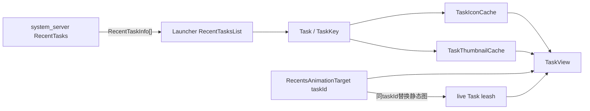
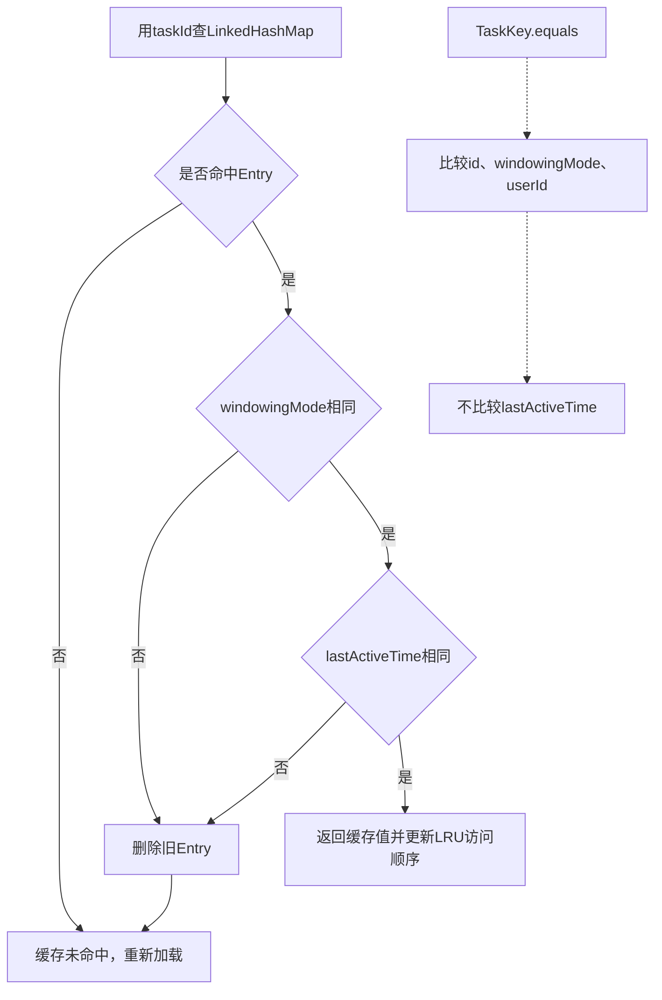
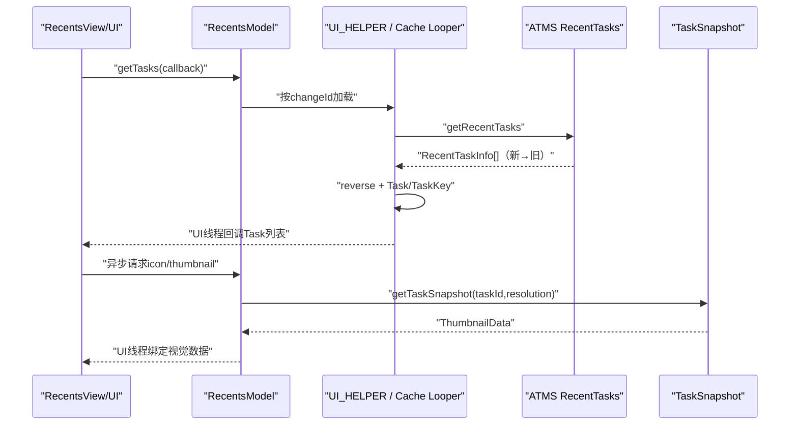

# 227 Android RecentTasks、TaskKey、ThumbnailData与Overview任务数据加载

> 源码版本：Android 11 / `android-11.0.0_r48`  
> 学习方式：macOS只读核源，不编译、不运行AOSP

## 1. 本章要解决什么

前几章的live Task leash只在手势期间存在。Overview长期展示的任务卡片还需要任务顺序、标题、图标、颜色和TaskSnapshot。本章追这些静态/半静态数据怎样从system_server进入Launcher，并与live target按taskId对齐。

## 2. 三条数据链先分开

```text
任务列表：RecentTasks → RecentTaskInfo → RecentTasksList → Task
缩略图：TaskSnapshotController → TaskSnapshot → ThumbnailData → TaskThumbnailCache
图标：TaskDescription / ActivityInfo → TaskIconCache → Drawable与无障碍描述
```

它们到达时间不同，TaskView必须允许先有卡片骨架、后补图标和缩略图。

## 3. 总体结构



## 4. Launcher统一入口RecentsModel

`RecentsModel`是主线程初始化的单例，内部持有：

```text
RecentTasksList
TaskIconCache
TaskThumbnailCache
TaskVisualsChangeListener列表
```

它不是system_server的任务权威，只是Launcher侧模型与缓存协调器。

## 5. 专用后台Looper

RecentsModel创建名为`TaskThumbnailIconCache`、后台优先级的Looper，图标和缩略图缓存共享它。

Binder/磁盘/PackageManager与Bitmap包装不应阻塞Launcher主线程。

## 6. getTasks回调线程

`RecentsModel.getTasks()`委托RecentTasksList，最终保证callback在UI线程调用。

后台加载结果进入主线程后，TaskView/RecentsView才能安全更新View层级。

## 7. system_server查询入口

Launcher的`ActivityManagerWrapper.getRecentTasks()`调用：

```java
ActivityTaskManager.getService().getRecentTasks(
    numTasks, RECENT_IGNORE_UNAVAILABLE, userId)
```

返回`ParceledListSlice<RecentTaskInfo>`，不是服务端Task对象本身。

## 8. 为什么用ParceledListSlice

任务列表可能较长，每个TaskInfo又含Intent、Configuration和TaskDescription。

Slice协议避免单个Binder Parcel无限膨胀；Launcher最终只拿到序列化副本，不能直接修改服务端Task。

## 9. ATMS先做用户与权限检查

Binder入口处理incoming user，并计算调用者是否有查看完整任务列表的资格，然后在全局锁内调用RecentTasks。

客户端传userId不能绕过跨用户边界。

## 10. 用户未解锁时返回空列表

RecentTasks要求目标user处于running且unlocked。

磁盘中的持久任务可能涉及credential-encrypted数据；锁定阶段不向Overview装载完整recents。

## 11. includedUsers不只当前用户

服务端取得当前user关联profile IDs并加上user自身。

工作资料Task可与主用户任务一起呈现，但仍受profile关系、锁定和策略过滤。

## 12. RecentTasks的顺序

服务端`mTasks`按最近到较旧遍历，返回也是most-recent到least-recent。

Launcher `loadTasksInBackground()`立即`Collections.reverse(rawTasks)`，让内部列表按较旧到最近排列，方便Recents分页布局把最新任务放在预期端。

## 13. 反转不是改变最近性

Task的`lastActiveTime`和服务端排序事实没有被改写，只改变Launcher数组下标方向。

排查“最近任务顺序反了”时要同时确认服务端顺序与UI坐标方向。

## 14. visible recent第一层门

RecentTasks先用`isVisibleRecentTask()`判断activity type、windowing mode等是否适合对用户展示，再用`isInVisibleRange()`处理最大可见范围和excluded任务。

不是所有`inRecents` Task都会无条件返回。

## 15. excluded任务与withExcluded

`FLAG_ACTIVITY_EXCLUDE_FROM_RECENTS`相关Task通常受可见范围逻辑限制；调用flags是否含`RECENT_WITH_EXCLUDED`会改变处理。

Launcher当前只传`RECENT_IGNORE_UNAVAILABLE`，没有请求全部excluded任务。

## 16. maxNum何时生效

源码先进行visible-range计数，再检查`res.size() >= maxNum`。

被权限、用户或available过滤掉的Task不占最终结果条数，但可见范围计数有自己的服务端语义。

## 17. 无完整GET_TASKS权限时

调用者只能看到自己的Task和Home Task。

Quickstep作为系统Recents通常有资格看完整列表；不能把它的结果范围推广给普通App调用者。

## 18. suspended Activity被过滤

`task.realActivitySuspended`为true直接跳过。

被暂停包不应在Overview提供可启动卡片，即使旧Task记录尚在。

## 19. autoRemoveRecents门

Task设置auto-remove且没有top non-finishing Activity时跳过。

这避免已完成的一次性Task残留空卡片。

## 20. unavailable门

Launcher传`RECENT_IGNORE_UNAVAILABLE`，因此`task.isAvailable=false`会被过滤。

包/组件暂不可用的持久任务不会进入当前Overview结果。

## 21. user setup门

`mUserSetupComplete=false`的Task不返回。

设备初始化期间启动的临时向导/系统Task不会污染正常用户的最近任务列表。

## 22. createRecentTaskInfo

服务端调用`Task.fillTaskInfo(rti, stripExtras=true)`，再补deprecated字段：运行中Task的`id=taskId`，非运行中旧`id=INVALID_TASK_ID`，`persistentId=taskId`。

Launcher的TaskKey使用现代`taskId`，不依赖deprecated `id`。

## 23. stripExtras的安全与体积意义

RecentTaskInfo用于展示，不需要把base Intent的所有extras原样跨Binder暴露/复制。

TaskKey保留定位组件所需Intent信息，但不应被当作原启动Intent的完整业务数据包。

## 24. RecentTasksList的两份缓存

```text
mResultsBg：后台线程最近加载结果
mResultsUi：已发布给UI的结果
mChangeId：服务端列表代际
```

双缓存减少主/后台相互覆盖，同时用代际防止旧结果冒充最新列表。

## 25. changeId怎样变化

初始为1；task stack改变、recent list更新、task移除、进入/退出PIP等事件调用`invalidateLoadedTasks()`并递增。

请求方可保存返回的id，之后用`isTaskListValid(id)`判断模型是否过期。

## 26. 为什么既监听stack changed又监听recent list updated

开机后某些持久Task已加载进recent list但不在活动Task层级；移除它们未必触发活动栈回调。

只监听onTaskStackChanged会复用陈旧列表，所以还要监听RecentTaskList专用更新。

## 27. invalidate的线程边界

UI缓存同步设为INVALID，后台缓存通过UI_HELPER_EXECUTOR任务设为INVALID，changeId在同步方法内递增。

后续已在飞行的旧加载仍可能回主线程，因此消费者还应使用request/change id验证是否接受。

## 28. cache hit也异步回调

即使mResultsUi有效，RecentTasksList也先同步复制列表，再post callback到下一主线程消息。

这样`getTasks()`能先返回requestId，调用者有机会记录代际后再收到结果。

## 29. 后台cache有效条件

TaskLoadResult匹配requestId，且：

```text
已有完整结果 → 可满足完整或keys-only请求
已有keys-only结果 → 只能满足keys-only请求
```

只有TaskKey的轻量结果不能冒充含颜色/TaskDescription的完整Task。

## 30. keys-only用途

缩略图预加载只需要最近taskId与版本键，因此`getTaskKeys(numTasks)`跳过完整Task视觉字段。

减少锁屏状态、TaskDescription等不必要工作。

## 31. 每个user锁定状态只查一次

完整加载用一个懒填充SparseBooleanArray，第一次遇到userId时调用KeyguardManager，后续同用户Task复用。

Task.isLocked影响是否能展示真实快照，不能只看主用户一次。

## 32. Task是什么

SystemUI shared的`Task`是Launcher可用数据模型，主要包含：

```text
TaskKey
icon、thumbnail
TaskDescription与颜色
topActivity、isDockable、isLocked
titleDescription等
```

它不是`com.android.server.wm.Task`。

## 33. 同名Task必须看包名

```text
com.android.server.wm.Task：真实WindowContainer与Activity层级
com.android.systemui.shared.recents.model.Task：跨进程结果的UI模型
```

两者通过RecentTaskInfo/TaskSnapshot关联，不共享Java对象身份。

## 34. TaskKey的身份字段

`equals/hashCode`只使用：

```text
taskId
windowingMode
userId
```

baseIntent、lastActiveTime、displayId和sourceComponent不参与TaskKey对象相等。

## 35. 为什么windowingMode参与相等

同一taskId从全屏进入分屏后，卡片布局、icon/thumbnail解释可能变化。

把windowingMode视为身份版本的一部分，可让依赖几何的缓存及时失效。

## 36. setWindowingMode必须重算hash

TaskKey允许修改windowingMode，并显式`updateHashCode()`。

若可变字段参与equals却不更新hash，会破坏Hash集合规则；源码避免了这一点。

## 37. sourceComponent怎样选择

有`origActivity`时使用它，常对应Activity alias；否则使用realActivity。

`baseIntent.getComponent()`与sourceComponent可能不同，图标/启动来源分析需明确想要alias还是实际组件。

## 38. getComponent与getPackageName边界

getComponent直接取baseIntent component；getPackageName在component为空时回退Intent package。

调用PackageManager加载ActivityInfo前仍要考虑component可能为null。

## 39. displayId不参与equals

TaskKey携带原Task displayId，但r48 equals/hash不含它。

跨Display缓存正确性更多依赖taskId全局身份与其他版本字段；不要自行声称displayId是TaskKey主键组成。

## 40. lastActiveTime虽不参与equals却很重要

TaskKeyLruCache不用TaskKey.equals作为唯一有效性判断，而是按taskId命中后比较windowingMode和lastActiveTime。

Task最近活动时间变化会让旧图标/缩略图缓存条目失效。

## 41. TaskKeyLruCache真正的Map key

内部`LinkedHashMap<Integer,Entry>`以taskId为key，并启用accessOrder实现LRU。

Entry再保存完整TaskKey，用于版本验证与按package/user批量移除。

## 42. getAndInvalidateIfModified

命中taskId后只在windowingMode和lastActiveTime都相等时返回value，否则删除条目并返回null。

注意它没有比较userId；实现依赖taskId不会与另一个用户的活跃缓存条目发生不安全复用这一系统约束。

## 43. LRU驱逐

`removeEldestEntry()`在size大于资源配置maxSize时移除最久未访问项。

缓存大小是性能/内存策略，不是RecentTasks最终能展示的最大数量。

下面这张图专门区分“逻辑TaskKey相等”与“缓存条目仍然有效”。两者看起来相近，却不是同一套判断：



因此，读源码时不能拿`TaskKey.equals()`去代替`TaskKeyLruCache`的有效性规则，也不能反过来推断TaskKey的对象相等语义。

## 44. RecentTasksList为何复制Task

向回调发布时构造新Task，复制Key与主要静态字段，不把缓存中的同一个Task可变实例直接交给多个View消费者。

icon和thumbnail本来会由独立缓存异步填充。

## 45. TaskKey仍被共享

copyOf创建新Task但传入原`t.key`引用。

Task对象隔离不等于TaskKey深拷贝；正常代码应把TaskKey当近似不可变版本标识，只通过专门方法改windowingMode。

## 46. ThumbnailData从哪里来

ActivityManagerWrapper调用ATMS `getTaskSnapshot(taskId, lowResolution)`，把TaskSnapshot包装为ThumbnailData。

它保留硬件Bitmap、Insets、rotation、scale和快照语义元数据。

## 47. GraphicBuffer正常路径

TaskSnapshot的buffer必须有`USAGE_GPU_SAMPLED_IMAGE`，然后通过`Bitmap.wrapHardwareBuffer(buffer,colorSpace)`零拷贝式包装为硬件Bitmap视图。

这不是把每个像素同步复制进Java heap。

## 48. 无法采样buffer的回退

r48遇到null或缺GPU sampled usage时记录错误，按Task size创建ARGB_8888黑色Bitmap。

这是防崩溃占位，不代表真实任务内容是黑屏。

## 49. ThumbnailData字段

```text
thumbnail、content insets
orientation、rotation
reducedResolution、scale
isRealSnapshot、isTranslucent
windowingMode、systemUiVisibility
snapshotId
```

TaskThumbnailView布局不能只看Bitmap宽高。

## 50. scale怎样计算

r48用`thumbnail.width / snapshot.taskSize.x`，假设宽高等比缩放；源码留有TODO希望直接传task size。

异常非等比输入下这个单轴推断不是严格真值。

## 51. reducedResolution是什么

它表示TaskSnapshot是否低分辨率版本。

低分图适合快速列表滚动和预加载，高分图适合Overview可见且滚动不快时提升清晰度。

## 52. isRealSnapshot边界

false可能是主题生成的占位快照，而非实际应用最后一帧。

此外TaskView还结合`Task.isLocked`决定是否把它视为可展示的真实内容。

## 53. snapshotId的用途

它标识快照代际，可用于判断内容是否更新。

不要把snapshotId与taskId混用：一个Task生命周期内可以产生多个快照。

## 54. TaskThumbnailCache结构

包含后台Handler、资源配置容量、TaskKeyLruCache、HighResLoadingState和是否允许预加载开关。

所有View可见性与加载请求入口断言UI线程。

## 55. 高分加载公式

```text
forceHighRes
  OR (Overview visible AND not flinging fast)
```

若设备不支持低分快照，forceHighRes恒true。

## 56. 为什么快速fling用低分图

卡片高速滚动时停留时间短，高分buffer带宽与解码/上传成本不划算。

滚动减速后状态回调再允许请求高分版本。

## 57. 已有thumbnail何时够用

若Task已有thumbnail，并且它是高分，或当前只请求低分，则直接回调。

当前要高分而Task只持有reduced版本时仍需后台加载。

## 58. 缓存命中也验证TaskKey版本

`getAndInvalidateIfModified(key)`检查windowingMode与lastActiveTime，再检查缓存图分辨率是否满足请求。

版本正确但只有低分图仍不能满足高分请求。

## 59. 后台请求取消语义

Binder获取快照完成后切回MAIN_EXECUTOR；若HandlerRunnable已cancel，不写缓存也不调用业务callback。

TaskView被回收时取消请求，可防旧结果写进新绑定卡片。

## 60. null缩略图不进入LRU

TaskKeyLruCache.put拒绝null key/value并记录错误。

ActivityManagerWrapper通常返回非null ThumbnailData占位对象，使UI能以明确“无图”状态继续，而不是把null当有效缓存。

## 61. snapshot change事件

RecentsModel收到`onTaskSnapshotChanged(taskId,snapshot)`，只更新已经存在的LRU条目，再通知所有TaskVisualsChangeListener。

监听器若返回匹配Task，Model同时写`task.thumbnail=snapshot`。

## 62. updateIfAlreadyInCache为何不新增

系统可能为大量不在当前Overview工作集的Task发快照变化。

只更新已有条目避免事件流无限扩张LRU并挤掉真正可见Task。

## 63. 后台预加载跳过running Task

task stack变化时，若开启预加载，Model取最近若干TaskKey，但跳过当前runningTaskId。

运行中App在下次进入Overview前通常还没生成最新离开快照，提前拉取只会缓存旧图。

## 64. 预加载开启条件

资源开关为true且HighResLoadingState的`mVisible=true`。

不是应用启动后永久预取；Overview不可见时避免后台快照压力。

## 65. TaskIconCache加载优先级

```text
TaskDescription自带icon Bitmap
→ ActivityInfo对应图标
→ 当前user的默认图标
```

每一步都在后台Looper执行。

## 66. 为什么优先TaskDescription icon

Activity可为某个文档Task提供专属图标，与应用默认图标不同。

Overview展示的是Task实例，优先尊重TaskDescription定制。

## 67. ActivityInfo取哪个组件

Icon cache调用`key.getComponent()`，即baseIntent component。

若Activity已卸载或解析失败，回退按user生成默认图标。

## 68. 多用户badging

LauncherIcons按TaskKey.userId生成badged icon；默认图标也按userId单独缓存。

工作资料与个人资料的同一包不能共享一个无用户标记的Drawable。

## 69. adaptive icon包装

源码传`Build.VERSION_CODES.O`作为target version，强制图标进入adaptive容器逻辑，并以Task primaryColor作为wrapper背景色。

同时禁用颜色提取，避免每次Task icon加载重复计算。

## 70. 无障碍描述按需加载

只有低内存Recents模式或AccessibilityManager启用时才额外解析ActivityInfo并生成badged content description。

普通路径省去PackageManager与字符串处理成本。

## 71. 包图标变化如何失效

IconProvider监听包图标变化，Model让TaskIconCache按package+user移除所有匹配TaskKey，并通知View监听器。

不能只按taskId移除，因为同包可能有多个文档Task。

## 72. Task移除清哪些缓存

构造仅含taskId的dummy TaskKey，分别从thumbnail和icon LRU按id移除。

remove实现只使用key.id，所以dummy的windowingMode/lastActiveTime不重要。

## 73. 内存压力策略

`TRIM_MEMORY_UI_HIDDEN`关闭thumbnail高分可见状态；`TRIM_MEMORY_RUNNING_CRITICAL`清空图标与缩略图缓存。

任务列表本身不等于大Bitmap缓存，清理策略可分层。

## 74. live target如何匹配静态Task

RecentsAnimationTarget含`taskId`，Task模型的`TaskKey.id`也是服务端taskId。

TaskAnimationManager/RecentsView用这一ID找到当前Task卡片，把静态thumbnail位置替换为live leash画面。

## 75. 为什么不能用数组下标匹配

RecentTasksList被反转、过滤并可能异步刷新；RemoteAnimation targets只含当前可见/受控Task，顺序还与窗口树有关。

两组数组既不等长也不同序，唯一可靠桥梁是taskId。

## 76. live tile不是更新ThumbnailData

Task leash直接显示应用Surface；ThumbnailData仍是TaskSnapshot模型。

手势取消/结束时可能切回snapshot，但不能把leash句柄塞进thumbnail缓存当作一张Bitmap。

## 77. snapshot与live内容可能不同

running Task的快照常落后一帧甚至更久，所以预加载明确跳过它；进入Recents时live leash提供当前画面。

结束控制后再用最新snapshot替换，需遵守上一章的截图交接屏障。

## 78. 一次完整加载时序



## 79. changeId防的竞态

请求A开始后Task栈改变，changeId递增并请求B；A仍可能先/后返回。

调用方用`isTaskListValid(A.id)`拒绝旧计划，不能仅因A callback最后到就覆盖B。

## 80. mResultsUi发布边界

后台结果切回主线程时直接赋给mResultsUi；其requestId保存在TaskLoadResult中。

后续新请求会按当前mChangeId验证，不匹配就不会把它当cache hit。

## 81. Task对象不保存所有TaskInfo

Launcher只抽取卡片需要的字段，完整configuration、Activity列表等仍在system_server。

需要启动/重排Task时用taskId再调用ATMS，不靠本地Task对象重建服务端层级。

## 82. 任务列表与TaskSnapshot一致性不是事务性的

RecentTaskInfo与ThumbnailData通过两次独立Binder请求取得。

两次之间Task可能继续运行或改变windowingMode，因此TaskKey版本检查、snapshot事件与View重新绑定都很必要。

## 83. lastActiveTime有效性边界

LRU用它识别Task活动代际，但图标包资源也可能在lastActiveTime不变时更新。

因此包图标监听另行按package+user主动失效，不能只依赖TaskKey时间。

## 84. windowingMode有效性边界

模式变化会使cache miss，但rotation、Insets和snapshotId并未全部进入TaskKey LRU版本条件。

缩略图内容变化主要靠onTaskSnapshotChanged事件与重新请求覆盖。

## 85. TaskKey equals与LRU有效性是两套规则

```text
equals/hash：id + windowingMode + userId
LRU validity：按id查找，再比windowingMode + lastActiveTime
```

阅读“key相同”时必须说明使用哪个语境。

## 86. 锁屏隐私边界

Task.isLocked来自每个user的Keyguard状态；TaskThumbnailView还会判断真实snapshot能否展示。

拿到RecentTaskInfo不等于有权展示该用户最后一帧内容。

## 87. reducedResolution不是模糊算法

它来自系统生成的低分TaskSnapshot版本，并非Launcher拿高分Bitmap现场做高斯模糊。

Launcher只选择请求哪一档和何时升级。

## 88. Bitmap.wrapHardwareBuffer生命周期

Bitmap包装底层HardwareBuffer供GPU采样；缓存与View持有它会占图形内存。

LRU与trim memory因此不仅优化Java对象数量，也控制图形buffer压力。

## 89. 常见误解纠正

| 误解 | 正确理解 |
|---|---|
| Launcher拿到服务端Task对象 | 只拿RecentTaskInfo副本并构造UI Task模型 |
| TaskKey所有字段都参与equals | 只有id、windowingMode、userId |
| LRU直接以TaskKey为Map key | 实际以taskId为key，再比模式和lastActiveTime |
| RecentTasks顺序就是UI数组顺序 | Launcher会reverse |
| live tile就是最新ThumbnailData | live是Surface leash，thumbnail是TaskSnapshot |
| 高分图一直优先 | 快速fling时优先低分，停稳后再升级 |

## 90. macOS只读练习一：追服务端过滤

```bash
cd /Users/ninebot/androidSource
sed -n '886,975p' frameworks/base/services/core/java/com/android/server/wm/RecentTasks.java
```

给一个“工作资料已锁定、包suspended、autoRemove且无Activity”的Task逐门判断为何不会返回。

## 91. macOS只读练习二：比较两种key规则

```bash
cd /Users/ninebot/androidSource
sed -n '55,160p' frameworks/base/packages/SystemUI/shared/src/com/android/systemui/shared/recents/model/Task.java
sed -n '20,100p' packages/apps/Launcher3/quickstep/src/com/android/quickstep/util/TaskKeyLruCache.java
```

解释“两个TaskKey equals为true”为什么仍可能因lastActiveTime不同导致LRU miss。

## 92. macOS只读练习三：推演分辨率升级

当前Task持有reduced thumbnail，Overview不可见时请求返回低分；随后Overview可见且停止快速fling，HighResLoadingState变true，再请求时为什么不能直接复用低分条目？

答案：缓存版本虽有效，但`reducedResolution && !lowResolution`不满足质量要求，会重新获取高分。

## 93. macOS只读练习四：画live/static交接

```bash
cd /Users/ninebot/androidSource
rg -n "findTask\(|taskId|thumbnail|switchRunningTaskViewToScreenshot" \
  packages/apps/Launcher3/quickstep/src \
  packages/apps/Launcher3/quickstep/recents_ui_overrides/src
```

目标：用taskId连接TaskKey、TaskView、RemoteAnimationTarget和取消时TaskSnapshot，标出哪些是Bitmap、哪些是Surface。

## 94. 源码阅读导航

```text
frameworks/base/services/core/java/com/android/server/wm/RecentTasks.java
frameworks/base/services/core/java/com/android/server/wm/ActivityTaskManagerService.java
frameworks/base/packages/SystemUI/shared/src/com/android/systemui/shared/system/ActivityManagerWrapper.java
frameworks/base/packages/SystemUI/shared/src/com/android/systemui/shared/recents/model/Task.java
frameworks/base/packages/SystemUI/shared/src/com/android/systemui/shared/recents/model/ThumbnailData.java
packages/apps/Launcher3/quickstep/src/com/android/quickstep/RecentTasksList.java
packages/apps/Launcher3/quickstep/src/com/android/quickstep/RecentsModel.java
packages/apps/Launcher3/quickstep/src/com/android/quickstep/TaskThumbnailCache.java
packages/apps/Launcher3/quickstep/src/com/android/quickstep/TaskIconCache.java
packages/apps/Launcher3/quickstep/src/com/android/quickstep/util/TaskKeyLruCache.java
```

## 95. 本章复读后的精确结论

1. system_server按用户/profile、可见范围、权限、包状态和Task生命周期过滤RecentTaskInfo；Launcher再反转为UI布局顺序。  
2. RecentTasksList以changeId管理列表代际，keys-only与完整结果有单向可复用关系。  
3. TaskKey equals和TaskKeyLruCache使用不同版本规则，后者额外比较lastActiveTime。  
4. ThumbnailData保留HardwareBuffer快照的Insets、rotation、scale、分辨率和真实性语义，高低分加载随Overview可见/滚动状态切换。  
5. 静态Task卡片与Recents live leash不是同一种数据，只通过taskId在手势期间对齐与交接。

## 96. 检查题

1. Launcher为什么反转RecentTaskInfo数组？  
2. keys-only结果为什么不能满足完整Task请求？  
3. TaskKey哪些字段参与equals，LRU又比较哪些字段？  
4. 为什么后台预加载跳过当前running Task？  
5. reducedResolution什么时候可以直接复用，什么时候必须升级？  
6. 为什么不能按targets数组下标与RecentTasks数组下标匹配？

## 97. 下一章预告

下一章深入TaskSnapshot服务端生产链：何时捕获、Snapshot/Theme两种模式、SurfaceControl截图、低分缩放、Insets/rotation元数据、内存与磁盘缓存，以及应用安全窗口和锁屏隐私如何阻止真实内容进入快照。
