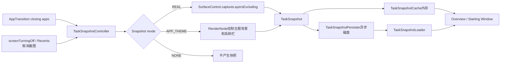
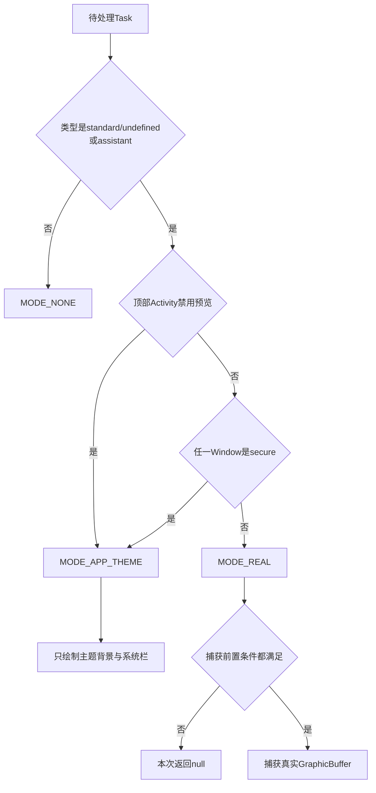
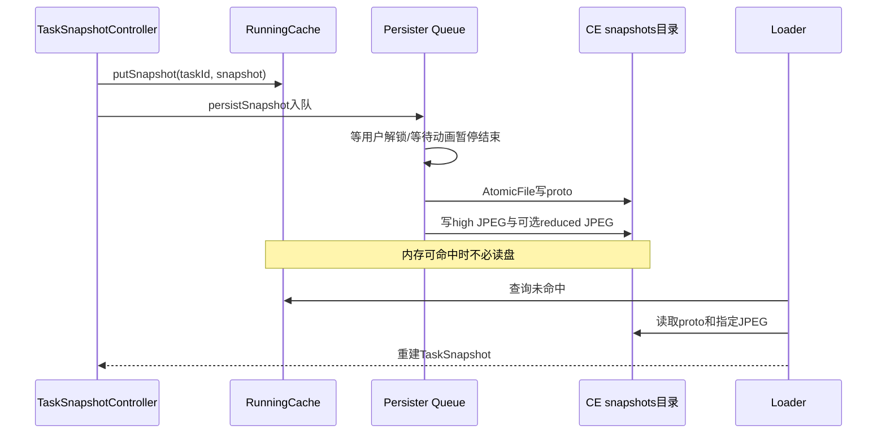

# 228 Android TaskSnapshotController捕获、缓存、持久化与安全隐私边界

> 源码版本：Android 11 / `android-11.0.0_r48`  
> 学习方式：macOS只读核源，不编译、不运行AOSP

## 1. 本章要解决什么

第227章看到Launcher如何消费`TaskSnapshot`。本章回到system_server，回答四个更根本的问题：

1. 系统在什么时机抓Task快照？
2. 快照是应用真实画面，还是主题生成的占位图？
3. 快照怎样进入内存、磁盘并重新加载？
4. `FLAG_SECURE`、设备策略、锁屏和多用户怎样限制内容泄露？

## 2. 先建立正确心智模型

TaskSnapshot不是持续录屏，也不是应用当前Surface的永久引用。

它是某个时间点把Task Surface子树捕获成`GraphicBuffer`，再附带Task尺寸、Insets、rotation等元数据形成的不可变快照对象。

## 3. 总体结构图



## 4. 关键对象分工

```text
TaskSnapshotController：决定何时抓、用哪种模式、组装元数据
TaskSnapshotCache：保存进程存活期内存快照，必要时转向Loader
TaskSnapshotPersister：后台队列写proto、高清JPEG和低清JPEG
TaskSnapshotLoader：从CE目录恢复TaskSnapshot
TaskSnapshotSurface：把快照作为starting window展示
```

不要把Controller、Cache和Persister合称成一个“截图缓存”；它们的锁、线程和失败边界不同。

## 5. 代码运行在哪

这些核心类都在`system_server`的WindowManager/ActivityTaskManager体系中。

`TaskSnapshotController`类注释明确要求访问它时持WMS global lock，但磁盘加载路径又明确要求不能持锁；源码会主动分段。

## 6. 三种线程上下文

常见执行点至少有三种：

```text
WMS/ATMS调用线程：判断Task、抓取Surface、更新内存缓存
TaskSnapshotController Handler：延迟处理screenTurningOff
TaskSnapshotPersister线程：后台写/删磁盘文件
```

Launcher请求则从Binder进入ATMS，可能在退出全局锁后同步读磁盘。

## 7. 普通捕获时机一：AppTransition开始

`onTransitionStarting(DisplayContent)`把`displayContent.mClosingApps`交给`handleClosingApps()`。

这里的“closing app”只是候选；Controller还要判断它所属的整个Task是否真的不可见。

## 8. 普通捕获时机二：无常规转场的隐藏

Activity可见性在常规AppTransition之外变为false时，`notifyAppVisibilityChanged()`也会构造单元素集合并走相同处理。

因此TaskSnapshot并非只服务于动画。

## 9. 为什么按Task而不是按Activity捕获

Overview卡片和Snapshot starting window代表的是Task。一个Task可以叠有多个Activity，抓单个Activity Surface可能漏掉同Task内可见层。

Controller最终对`Task.getSurfaceControl()`的子树做layer capture。

## 10. getClosingTasks的核心条件

源码逻辑可简化为：

```java
Task task = activity.getTask();
if (task != null && !task.isVisible()
        && !mSkipClosingAppSnapshotTasks.contains(task)) {
    outClosingTasks.add(task);
}
```

只有整个Task已不可见才加入，避免同Task中另一个Activity正在打开时抓到错误中间态。

## 11. ArraySet自动去重

多个closing Activity可能属于同一个Task，输出使用`ArraySet<Task>`。

这既去重，也说明抓图代价按Task计，而不是按closing Activity数量计。

## 12. mSkipClosingAppSnapshotTasks的作用

某些路径已经主动为Task抓过新快照，随后closing-app流程不应立即重复抓。

调用者先`addSkipClosingAppSnapshotTasks()`，下次处理closing集合后Controller会清空这个临时集合。

## 13. Skip不是永久隐私开关

这个集合只跳过“下一次closing apps处理”，不是Task级永久禁止截图。

隐私开关由Activity的`mDisablePreviewScreenshots`、secure window和设备策略参与模式选择。

## 14. TV、Wear和IoT直接禁用

`shouldDisableSnapshots()`在Android TV、Wear、Embedded/IoT设备返回true。

这是产品形态策略，不应推导成设备没有Surface或绝对不能截图。

## 15. 三种Snapshot mode

```text
SNAPSHOT_MODE_REAL      = 0：捕获真实Task Layer
SNAPSHOT_MODE_APP_THEME = 1：只画主题背景与系统栏装饰
SNAPSHOT_MODE_NONE      = 2：完全不生成
```

后两种不能混为一谈：主题快照仍会产生可展示、可持久化的TaskSnapshot。

## 16. 哪些Task直接NONE

`getSnapshotMode()`只允许standard/undefined和assistant Activity type继续。

Home、Recents等其他类型通常返回NONE；screen off有一条例外的临时Home捕获路径，后面单讲。

## 17. 真实图还是主题图由谁决定

Controller查看Task顶部Activity的`shouldUseAppThemeSnapshot()`：

```java
return mDisablePreviewScreenshots
        || forAllWindows(WindowState::isSecureLocked, true);
```

顶部Activity所属的任一窗口命中secure判断，就不捕获真实内容。这里的遍历范围是该`ActivityRecord`，不能擅自扩大成Task内所有Activity。

## 18. setDisablePreviewScreenshots是什么

隐藏API`Activity.setDisablePreviewScreenshots(true)`经ATMS Binder把标志写入对应`ActivityRecord`。

其契约只针对Activity停止后用作Overview表示的预览截图，不等价于全系统禁止所有截图。

## 19. FLAG_SECURE更广

`WindowState.isSecureLocked()`首先检查Window LayoutParams中的`FLAG_SECURE`。

它不仅影响Recents预览，还用于限制普通截屏、非安全显示等更广内容通路；本章只跟踪它对TaskSnapshot模式的影响。

## 20. 设备策略也进入secure判断

如果窗口没有显式`FLAG_SECURE`，`isSecureLocked()`还查询`DevicePolicyCache.isScreenCaptureAllowed()`。

所以企业策略禁止截屏时，TaskSnapshot同样退化为主题图，不应只搜索App是否设置flag。

## 21. 隐私决策流程图



## 22. Secure不是把真实图打码

r48主线不是先抓真实画面再模糊，而是在模式选择阶段转到`drawAppThemeSnapshot()`。

这减少了敏感像素先进入普通快照Buffer和磁盘文件的机会。

这道WMS门尤其重要：native SurfaceFlinger截图代码允许AID_SYSTEM为系统场景捕获secure layers，并把“不得持久化”的责任交给WindowManager。不能假设底层一定会替TaskSnapshot自动抹黑所有secure像素。

## 23. APP_THEME也可能返回null

如果顶部Activity或main Window不存在，主题路径仍会失败并返回null。

模式允许生成，不代表一定成功生成。

## 24. REAL也需要一组前置条件

`snapshotTask()`先调用`prepareTaskSnapshot()`，再调用`createTaskSnapshot()`。

前一步验证并收集元数据；后一步才真正请求SurfaceFlinger捕获Layer。

## 25. 屏幕必须仍为On

`prepareTaskSnapshot()`第一项检查`mPolicy.isScreenOn()`。

屏幕真正关闭后不再抓，所以screen-off流程必须在关屏完成回调前抢先捕获。

## 26. 必须找到适合截图的Activity

`findAppTokenForSnapshot()`从Task中寻找：

```text
Surface正在显示
存在main Window
至少一个Window Animator Surface shown且lastAlpha > 0
```

这会跳过只有记录但没有可见Surface的trampoline Activity。

## 27. isSurfaceShowing不等于用户已看到

它是WMS/SF层级可用性的条件，不是HWC present fence或面板扫描证据。

快照捕获关注可抓的Layer树，而不是证明人眼已经看过这一帧。

## 28. 已提交到动画leash时跳过

如果Activity `hasCommittedReparentToAnimationLeash()`，Controller认为它处于动画临时层级，拒绝抓图。

否则可能抓到变换中、被裁剪或坐标关系暂时改变的画面。

## 29. Fixed rotation transform时跳过

Activity带fixed-rotation transform时，其旋转可能暂时与Task不同。

r48选择返回false，而不是尝试把临时旋转变换烘焙进快照元数据。

## 30. main Window再次防御检查

find阶段要求main Window存在，prepare阶段仍重新取得并检查。

这是应对状态变化与保持局部代码安全的防御式做法，不能据此声称两次检查发生在不同线程。

## 31. 快照id的生成

真实与主题快照都用`System.currentTimeMillis()`作为id。

它是内容代际提示，不是Task id，也不是严格全局唯一、单调不回退的数据库序列。

## 32. contentInsets怎样算

r48对Window的contentInsets与stableInsets逐边取较小值，再加letterboxInsets。

源码TODO指出这些Insets相对window frame，而真正想要的是相对Task bounds；这是版本内已知近似。

## 33. 为什么不能只保存Bitmap尺寸

TaskView和Snapshot starting window还需知道：

```text
原Task逻辑尺寸
内容Insets
orientation与display rotation
windowingMode
systemUiVisibility
是否透明、是否真实、是否低清
```

否则无法正确缩放、裁剪和补系统栏背景。

## 34. 顶部组件元数据

Builder保存被选中Activity的`mActivityComponent`。

磁盘proto也保存其flatten字符串，加载时用`ComponentName.unflattenFromString()`恢复。

## 35. PixelFormat策略意图

当调用者传`UNKNOWN`时，如果产品启用16位快照、Activity填满父容器，且不是透明窗口同时显示wallpaper的情况，prepare选择`RGB_565`；否则选`RGBA_8888`。

这是策略层的“期望格式”。

## 36. isTranslucent怎样推导

只有格式带alpha，并且Activity没有填满父容器或主Window格式透明时，Builder才标记translucent。

这个元数据帮助展示端决定背景填充，不能单凭它判断所有像素alpha都小于255。

## 37. systemUiVisibility取谁

Controller找Task的top fullscreen Activity，再取其top fullscreen opaque Window的system UI flags。

找不到则保存0，说明它并非对Task所有Window flags做并集。

## 38. 真正捕获的根Layer

`createTaskSnapshot()`要求Task有SurfaceControl，并把Task bounds移动到局部坐标原点：

```java
task.getBounds(mTmpRect);
mTmpRect.offsetTo(0, 0);
```

捕获根是Task Surface，不是整个Display。

## 39. 为什么排除IME Layer

若Display上有Input Method Window，源码把其SurfaceControl放入exclude数组。

键盘可能在视觉上覆盖应用，但任务卡片不应把共享IME内容固化为某个App自己的快照。

## 40. 捕获调用

核心调用是：

```java
SurfaceControl.captureLayersExcluding(
        task.getSurfaceControl(), taskLocalBounds,
        scaleFraction, pixelFormat, excludeLayers);
```

它捕获根Layer及孩子，但排除指定Layer。

## 41. high-res scale不是固定等于1

scale来自资源`config_highResTaskSnapshotScale`，默认AOSP值为1.0，但OEM overlay可以在`(0, 1]`范围改变。

所以“high-res”表示相对于low-res的主版本，不保证与Task像素一比一。

## 42. Task size保存未缩放尺寸

`outTaskSize`记录局部crop的原始宽高，而GraphicBuffer尺寸已乘scale。

Launcher用两者推导`ThumbnailData.scale`。

## 43. 极小Buffer会被拒绝

buffer为null，或宽/高不大于1时，捕获返回null。

外层另有0尺寸防御，但正常通过此处的真实快照已排除了0和1像素结果。

## 44. r48格式参数的源码陷阱

Android 11 r48的`SurfaceControl.captureLayersExcluding()`签名接收`format`，但实现最后调用native时写的是：

```java
return nativeCaptureLayers(displayToken, layer.mNativeObject,
        sourceCrop, frameScale, nativeExcludeObjects,
        PixelFormat.RGBA_8888);
```

即传入参数没有继续下传，而是硬编码RGBA_8888。

## 45. 16-bit配置该怎样准确表述

因此本版本可以准确说：Controller存在565选择意图，Persister持有该产品配置，Loader也据此选择解码格式；但这条`captureLayersExcluding`真实捕获调用并未把所选format送给native。

不能简单写成“启用配置后所有实时Task捕获一定是RGB_565”。

## 46. ScreenshotGraphicBuffer带什么

捕获返回对象同时带`GraphicBuffer`和ColorSpace。

Builder把两者写入`TaskSnapshot`；丢失ColorSpace会让后续Bitmap包装和颜色解释不完整。

## 47. capture完成不等于硬件present

Layer capture得到的是SF可访问的合成输入/结果快照。

它不证明某一帧已经在物理屏幕完整扫描，也不等于应用下一帧停止更新。

## 48. snapshotTask的组装顺序

```text
prepareTaskSnapshot → 收集模式与元数据
createTaskSnapshot  → 捕获GraphicBuffer与ColorSpace
Builder.setSnapshot/setColorSpace
Builder.build       → TaskSnapshot
```

任一步失败都返回null，不会把半成品放入缓存。

## 49. 主题快照画什么

`drawAppThemeSnapshot()`不读取App真实Layer，而是：

```text
取TaskDescription backgroundColor并强制alpha=255
计算system bar Insets
创建RenderNode和RecordingCanvas
填充纯背景色
用SystemBarBackgroundPainter画状态栏/导航栏装饰
```

## 50. 主题图为什么强制不透明

源码把背景alpha设为255，并在构造TaskSnapshot时把`isTranslucent`设为false。

这样敏感App背后的内容也不会透过占位快照显露。

## 51. 主题图也使用高分scale

RenderNode宽高等于Task bounds乘`mHighResTaskSnapshotScale`，但TaskSnapshot中的taskSize仍保存原Task宽高。

它与真实捕获保持相同的几何元数据模型。

## 52. Requested Insets为什么要合并

主题路径复制main Window当前InsetsState，再把requested Insets sources覆盖/加入。

然后以Window frame计算system bars Insets，使占位图的栏背景更接近即将展示的窗口配置。

## 53. Hardware Bitmap转GraphicBuffer

主题图通过`ThreadedRenderer.createHardwareBitmap()`得到硬件Bitmap，再调用`createGraphicBufferHandle()`进入统一TaskSnapshot类型。

因此消费者无需为REAL和APP_THEME维护两套传输对象。

## 54. isRealSnapshot是语义字段

真实捕获Builder设true，主题快照构造时设false。

它告诉Launcher内容来源，不等于“buffer有效/无效”；主题buffer完全可以有效并正常展示。

## 55. Controller怎样提交结果

快照非null且尺寸有效后：

```java
mCache.putSnapshot(task, snapshot);
mPersister.persistSnapshot(taskId, userId, snapshot);
task.onSnapshotChanged(snapshot);
```

顺序是先内存，再异步排队持久化，再通知Task监听者。

## 56. onSnapshotChanged不是磁盘完成通知

调用`persistSnapshot()`只把工作入队，随后立即通知snapshot changed。

Launcher收到变化时，磁盘JPEG可能还没写完；通常可从运行缓存取得同一快照。

## 57. 非法尺寸的Buffer被destroy

外层发现0宽或0高会销毁GraphicBuffer并记录错误，不进入缓存和持久化。

这是一条句柄资源回收路径。

## 58. TaskSnapshotCache的两个Map

```text
mRunningCache：taskId → CacheEntry(snapshot, topApp)
mAppTaskMap：ActivityRecord → taskId
```

第二张表让top Activity移除或进程死亡时可以反查并清理对应运行缓存。

## 59. 内存缓存不是标准LRU

`TaskSnapshotCache`使用`ArrayMap`，没有容量和访问顺序驱逐逻辑。

它与Launcher侧`TaskKeyLruCache`完全不同，别被“Cache”同名误导。

## 60. put时替换关系

同taskId已有条目时，先从`mAppTaskMap`移除旧topApp，再登记当前top Activity和新快照。

这样旧Activity死亡不会误删后来已由另一个顶部Activity产生的映射。

## 61. 运行缓存优先

`getSnapshot()`先在WMS global lock内查`mRunningCache`；命中就直接返回，不关心请求的low-resolution参数。

所以内存中若有刚捕获的主快照，低清请求也可能得到这份主快照。

## 62. 未命中才决定读盘

`restoreFromDisk=false`时内存未命中立即返回null。

只有显式允许恢复，才退出global lock调用Loader；磁盘I/O不得放在WMS大锁内。

## 63. 清运行缓存不等于删磁盘

`clearSnapshotCache()`只调用`clearRunningCache()`。

磁盘proto/JPEG仍可在下一次`restoreFromDisk=true`请求中加载。

## 64. Activity移除或进程死亡

`onAppRemoved()`与`onAppDied()`都通过`mAppTaskMap`定位taskId，只删除running entry。

这不是Task从Recents永久移除，所以不会顺手删磁盘历史快照。

## 65. Task从Recents移除

`notifyTaskRemovedFromRecents()`同时：

```text
删除运行缓存
给Persister排入DeleteWriteQueueItem
```

后者异步删除proto、低清JPEG和高清JPEG。

## 66. 持久化目录属于CE存储

Controller用`Environment.getDataSystemCeDirectory(userId)`作为用户目录解析器，再追加`snapshots`。

概念路径是：

```text
/data/system_ce/<userId>/snapshots/
```

CE表示凭据加密存储，用户未解锁时不能假定文件可用。

## 67. 每个Task的三类文件

```text
<taskId>.proto          元数据
<taskId>.jpg            主分辨率图
<taskId>_reduced.jpg    可选低分辨率图
```

JPEG没有alpha通道，因此translucent等语义必须另存于proto。

## 68. Persister何时启动

`TaskSnapshotController.systemReady()`调用`mPersister.start()`，创建名为`TaskSnapshotPersister`的长期后台线程。

线程优先级被设为`THREAD_PRIORITY_BACKGROUND`。

## 69. 写队列为什么要异步

硬件Buffer转软件Bitmap、JPEG压缩和文件I/O可能明显耗时。

把这些工作移出WMS锁和转场关键路径，可避免截图持久化直接阻塞窗口动画。

## 70. 动画繁忙时暂停Persister

`WindowAnimator`检测App transition、screen rotation或recents等昂贵动画时调用`setPersisterPaused(true)`；动画结束再恢复。

暂停的是磁盘写线程，不是TaskSnapshot内存捕获本身。

## 71. Store队列深度限制

`MAX_STORE_QUEUE_DEPTH = 2`。新的store item入队后，如果store子队列超过2，源码从最老项开始移除。

高频快照时允许丢弃旧持久化任务，以新鲜度和系统流畅性优先。

## 72. 删除和清理项不受同一深度计数

深度限制针对`mStoreQueueItems`，不是整个`mWriteQueue`。

Delete和RemoveObsoleteFiles仍在总队列中，不能说“所有写请求最多只有两个”。

## 73. 用户未解锁时轮转等待

`StoreWriteQueueItem.isReady()`检查`UserManagerInternal.isUserUnlocked(userId)`。

未就绪项被放回队尾；这契合CE目录必须在用户解锁后访问的条件。

## 74. 队列每项间隔100ms

Persister处理非空项后sleep `DELAY_MS=100`。

这是一种简单节流；它不是对“截图必须100ms内落盘”的时限承诺。

## 75. proto使用AtomicFile

元数据通过`AtomicFile.startWrite/finishWrite`写入，失败调用`failWrite`。

Bitmap JPEG则直接使用`FileOutputStream`，两者原子性保证并不相同。

## 76. 任一部分失败就删整组

Store item先写proto再写buffer；任一步失败，最后调用`deleteSnapshot(taskId,userId)`清除对应三类文件。

这是避免留下元数据与图片不匹配的恢复策略。

## 77. 磁盘写图的数据变换

```text
GraphicBuffer
  → Bitmap.wrapHardwareBuffer
  → copy为ARGB_8888软件Bitmap
  → JPEG quality 95
  → 可选createScaledBitmap生成reduced JPEG
```

磁盘文件不是原始gralloc Buffer的逐字节持久化。

## 78. low-res比例怎样算

资源默认：high=1.0、low=0.5。Persister实际缩放因子为：

```text
lowResScaleFactor = config_lowResTaskSnapshotScale
                      / config_highResTaskSnapshotScale
```

因为输入Bitmap本身已经按high scale捕获。

## 79. 配置值的约束

构造器要求：

```text
0 <= low < 1
0 < high <= 1
high > low
```

low=0表示禁用低清文件，不是生成0像素图片。

## 80. 持久化与加载流程图



## 81. Loader为什么不能持WMS锁

它使用`Files.readAllBytes()`和`BitmapFactory.decodeFile()`，还要把软件Bitmap复制成hardware Bitmap。

这些都是不可预测耗时操作，所以ATMS先在锁内找到Task，退出锁后才调用`task.getSnapshot()`。

## 82. 外部请求的权限门

公开Binder入口`ATMS.getTaskSnapshot()`要求调用者是Recents，或具有`READ_FRAME_BUFFER`权限。

普通三方App不能仅凭知道taskId就读取其他Task快照。

## 83. Task存在性检查

ATMS用`MATCH_TASK_IN_STACKS_OR_RECENT_TASKS`寻找taskId；找不到返回null。

它既允许运行栈中的Task，也允许Recent模型中的Task，但仍不是任意历史文件读取API。

## 84. 请求low-res不保证一定低清

Controller只在Persister启用了低清文件时把low请求传给Cache；而Cache若命中running snapshot直接返回主快照。

所以`isLowResolution`是加载偏好，不是返回Buffer尺寸的绝对类型约束。

## 85. 磁盘恢复如何选文件

现代r48快照下：请求low就选`_reduced.jpg`，否则选高清JPEG；文件不存在直接返回null，不自动回退另一份。

升级旧版本快照时，Loader另有O/P/Q兼容比例和强制reduced规则。

## 86. 解码后为何再变Hardware Bitmap

JPEG先解为软件Bitmap，再`copy(Config.HARDWARE,false)`，回收软件图，最后创建GraphicBuffer handle。

这样恢复结果与实时捕获拥有相同的TaskSnapshot/GraphicBuffer消费接口。

## 87. Loader恢复哪些元数据

proto恢复id、顶部组件、orientation、rotation、Task size、Insets、是否真实、windowingMode、systemUiVisibility、透明性。

ColorSpace来自解码后的hardware Bitmap，不是proto单独保存的原始色彩空间描述。

## 88. r48 proto中的重复赋值

`writeProto()`连续两次执行：

```java
proto.insetTop = mSnapshot.getContentInsets().top;
```

这是无害的重复赋值，不会把其他边错误写入top；阅读时应记录实现瑕疵，但不夸大为数据损坏。

## 89. obsolete清理防竞态

Persister清理不在persistentTaskIds中的旧文件时，还会保护“自上次清理请求后新排队持久化”的taskId集合。

否则异步清理可能把刚生成、但Recent模型快照尚未同步进传入集合的文件删掉。

## 90. 文件名解析边界

只识别`.proto`和`.jpg`，并剥离`_reduced`后解析整数taskId；解析失败得到-1。

目录中的非快照文件不会被误认为某个合法Task id，但在当前清理循环中-1若不受保护仍可能被删除，目录应专用于快照。

## 91. screenTurningOff为什么单独处理

屏幕关掉后prepare会拒绝捕获，因此WMS在关屏完成前把工作post到Controller Handler：持锁收集所有visible Task，完成snapshotTasks后才调用`listener.onScreenOff()`。

finally确保即使异常也不会把关屏流程永久卡住。

## 92. secure Keyguard时允许临时Home快照

关屏路径在当前用户Keyguard secure时设置`allowSnapshotHome=true`，目的是从安全锁屏唤醒到Home时减少延迟。

这个Home快照走真实`snapshotTask()`，但被标为temporal：只放运行缓存。

## 93. temporal Home为何不落盘不通知

`snapshotHome`为true时外层跳过Persister和`task.onSnapshotChanged()`。

它只服务当前运行期唤醒体验，避免把Home临时捕获当成普通Recent内容长期保存或广播更新。

## 94. 这是否意味着锁屏一定抓Home

不一定。仍须满足屏幕On、Home可见、main Window/Surface有效、无fixed rotation/已提交动画leash等前置条件。

“允许”不是“保证成功”。

## 95. Recents交互中的主动截图

Recents Animation可调用Controller为指定Task即时`snapshotTasks()`，然后加入skip集合，避免随后closing处理重复抓。

取消并用截图替换leash的路径也复用同一TaskSnapshot对象。

## 96. Recents截图与持久快照的细微差别

普通`snapshotTasks(tasks)`会照常缓存、持久化并通知；之后Recents Controller用`restoreFromDisk=false`从运行缓存取刚抓结果。

而screen-off的temporal Home才明确跳过持久化和通知。

## 97. r48 screenshotTask的userId异常点

`IRecentsAnimationController.screenshotTask()`取快照时传入硬编码`userId=0`；另一条`screenshotRecentTask()`传`task.mUserId`。

因为刚捕获结果通常按taskId命中running cache，这个差异往往被遮蔽；但它仍是版本源码值得记录的边界，不能改写成两条路径完全一致。

## 98. TaskSnapshot的安全边界汇总

```text
生成端：顶部Activity的secure window/设备策略/禁用预览 → 不抓真实内容
访问端：Recents身份或READ_FRAME_BUFFER权限
存储端：按userId进入CE目录，未解锁不写
生命周期：Task移出Recents排队删除；obsolete任务定期清理
展示端：主题图isRealSnapshot=false；starting surface不会重新继承原Window的FLAG_SECURE
```

每一层解决的问题不同，不能只依靠其中一层。

## 99. TaskSnapshotSurface为何不继承FLAG_SECURE

r48把`FLAG_SECURE`列入`FLAG_INHERIT_EXCLUDES`，创建Snapshot starting window时会从原Window flags中剔除它，再额外加入`FLAG_NOT_FOCUSABLE | FLAG_NOT_TOUCHABLE`。

因此本链路不能把展示端Window flag当作第二道secure保证。关键隐私门在快照生产之前：只要顶部Activity所属任一Window为secure，Controller就只生成不含该Activity真实像素的APP_THEME快照。这里也说明为什么必须“先裁决、后捕获”，不能依赖展示端补救；同时要记住r48这一判断遍历的是top child Activity，不是整个Task所有Activity。

## 100. 四个常见误解

1. “TaskSnapshot就是实时Surface”——错，它是时间点Buffer和元数据。  
2. “FLAG_SECURE后Overview必为空白”——错，通常显示主题生成占位图。  
3. “persistSnapshot返回说明JPEG已完成”——错，只是入后台队列。  
4. “请求低清一定返回低清”——错，running cache主快照优先。

## 101. 从生产到消费的完整时间线

```text
Task整体变为不可见
  → closing apps筛选Task
  → REAL / APP_THEME / NONE
  → prepare并捕获，或RenderNode画主题
  → 运行缓存立即可见
  → Persister后台等解锁/等动画负载降低
  → 写proto和JPEG
  → Launcher按权限请求
  → 内存命中，或锁外Loader读CE文件
  → ThumbnailData包装并展示
```

## 102. 源码阅读时的锁检查法

遇到`getSnapshot()`先问：

```text
当前是否持mGlobalLock？
restoreFromDisk是否为true？
是否可能执行decodeFile？
调用者有没有在锁外做第二阶段？
```

这比只看方法名更容易发现系统卡顿风险。

## 103. 源码阅读时的数据形态检查法

沿链路标注每一步：

```text
SurfaceControl Layer树
ScreenshotGraphicBuffer
GraphicBuffer + ColorSpace
TaskSnapshot元数据对象
Hardware Bitmap / 软件Bitmap
JPEG + proto
恢复后的GraphicBuffer
Launcher ThumbnailData
```

“截图”二字覆盖了多种完全不同的内存与存储形态。

## 104. macOS只读练习一：追模式决策

```bash
cd /Users/ninebot/androidSource
rg -n "getSnapshotMode|shouldUseAppThemeSnapshot|isSecureLocked" \
  frameworks/base/services/core/java/com/android/server/wm
```

目标：画出`setDisablePreviewScreenshots`、`FLAG_SECURE`和DevicePolicy到APP_THEME的条件链。

## 105. macOS只读练习二：核对捕获参数

```bash
cd /Users/ninebot/androidSource
sed -n '300,370p' frameworks/base/services/core/java/com/android/server/wm/TaskSnapshotController.java
sed -n '2140,2170p' frameworks/base/core/java/android/view/SurfaceControl.java
```

目标：亲自确认Controller传入pixelFormat，但r48 `captureLayersExcluding`向native传RGBA_8888。

## 106. macOS只读练习三：推演磁盘文件

```bash
cd /Users/ninebot/androidSource
rg -n "SNAPSHOTS_DIRNAME|PROTO_EXTENSION|BITMAP_EXTENSION|LOW_RES_FILE_POSTFIX|writeProto|writeBuffer" \
  frameworks/base/services/core/java/com/android/server/wm/TaskSnapshotPersister.java
```

假设taskId=42、userId=10，写出三种概念文件路径，并说明用户未解锁时为何不能立即写。

## 107. macOS只读练习四：追一次Launcher请求

```bash
cd /Users/ninebot/androidSource
rg -n "getTaskSnapshot\\(" \
  frameworks/base/packages/SystemUI/shared/src/com/android/systemui/shared/system/ActivityManagerWrapper.java \
  frameworks/base/services/core/java/com/android/server/wm/ActivityTaskManagerService.java \
  frameworks/base/services/core/java/com/android/server/wm/Task.java \
  frameworks/base/services/core/java/com/android/server/wm/WindowManagerService.java \
  frameworks/base/services/core/java/com/android/server/wm/TaskSnapshotController.java
```

目标：标注Binder权限检查、Task查找、退出global lock、运行缓存和磁盘Loader五个节点。

## 108. 源码阅读导航

```text
frameworks/base/services/core/java/com/android/server/wm/TaskSnapshotController.java
frameworks/base/services/core/java/com/android/server/wm/TaskSnapshotCache.java
frameworks/base/services/core/java/com/android/server/wm/TaskSnapshotPersister.java
frameworks/base/services/core/java/com/android/server/wm/TaskSnapshotLoader.java
frameworks/base/services/core/java/com/android/server/wm/TaskSnapshotSurface.java
frameworks/base/services/core/java/com/android/server/wm/ActivityRecord.java
frameworks/base/services/core/java/com/android/server/wm/WindowState.java
frameworks/base/services/core/java/com/android/server/wm/ActivityTaskManagerService.java
frameworks/base/services/core/java/com/android/server/wm/RecentsAnimationController.java
frameworks/base/core/java/android/app/Activity.java
frameworks/base/core/java/android/view/SurfaceControl.java
frameworks/base/core/jni/android_view_SurfaceControl.cpp
frameworks/base/core/res/res/values/config.xml
frameworks/native/services/surfaceflinger/SurfaceFlinger.cpp
```

## 109. 本章复读后的精确结论

1. 普通快照在Task整体关闭/隐藏时抓取，screen off与Recents交互还有专用入口。  
2. secure或禁用预览不会抓真实内容再模糊，而会选择不透明主题快照；不支持类型则完全NONE。  
3. 实时捕获以Task Layer为根、排除IME，保存未缩放Task size和多种窗口元数据。  
4. 运行缓存即时可用；proto/JPEG由后台队列在用户解锁且动画负载合适时持久化。  
5. r48 `captureLayersExcluding`忽略传入format并向native硬编码RGBA_8888，不能把565配置意图写成该调用的真实捕获格式。  
6. 外部读取受Recents/READ_FRAME_BUFFER权限控制，文件位于按用户隔离的CE目录。

## 110. 检查题

1. 为什么closing Activity不一定导致其Task立刻截图？  
2. APP_THEME与NONE分别会产生什么结果？  
3. 为什么secure内容不应先抓后模糊？  
4. running cache命中时low-res参数怎样表现？  
5. proto为什么必须与JPEG配套？  
6. 哪些代码证据表明磁盘加载不能持WMS global lock？  
7. r48的16-bit格式链路有哪些“配置意图”和“真实实现”差异？

## 111. 下一章预告

下一章继续追TaskSnapshot作为starting window的消费端：`TaskSnapshotSurface`如何创建系统窗口、计算尺寸匹配、画Buffer与系统栏、报告drawn，并在真实App窗口出现后安全移除。
