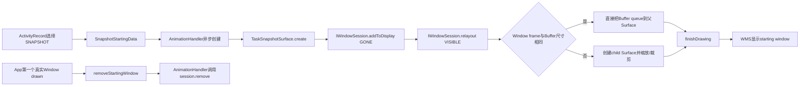
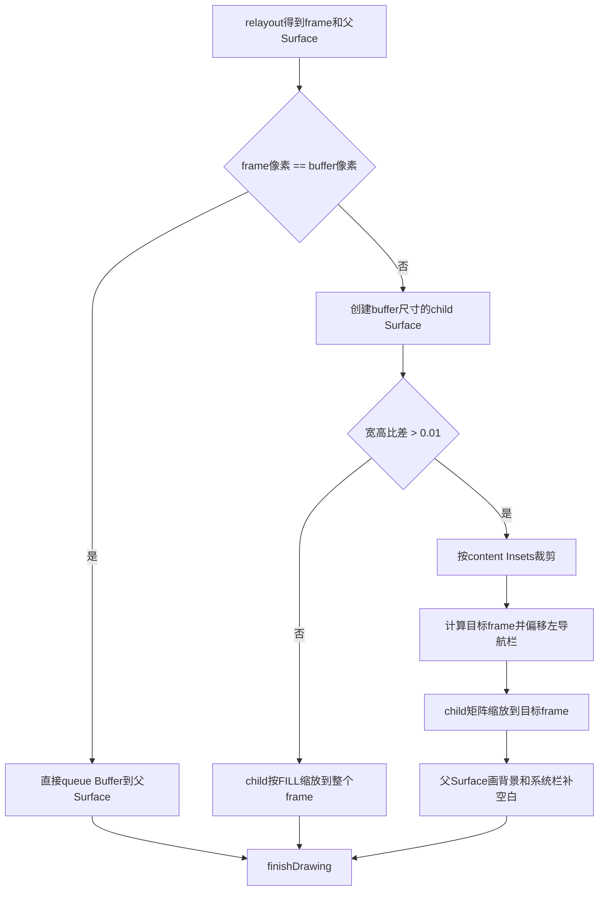
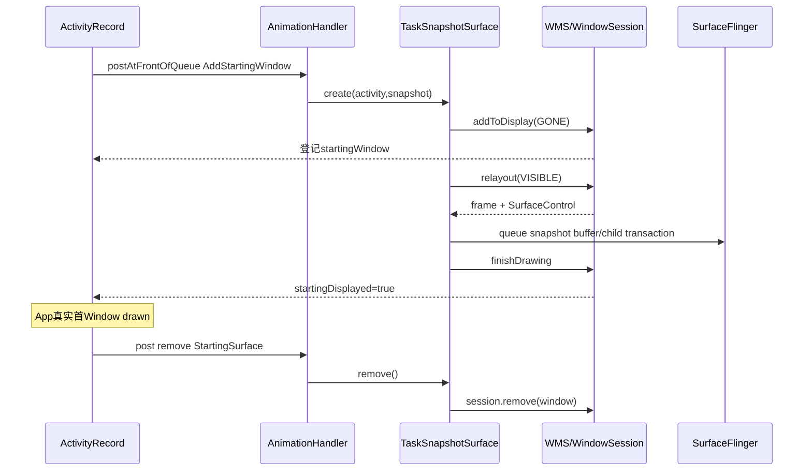

# 229 Android TaskSnapshotSurface创建、尺寸匹配、绘制与移除交接

> 源码版本：Android 11 / `android-11.0.0_r48`  
> 学习方式：macOS只读核源，不编译、不运行AOSP

## 1. 本章要解决什么

第228章产生了`TaskSnapshot`，但Buffer本身不会自动变成启动画面。本章继续追：

```text
SnapshotStartingData
  → TaskSnapshotSurface.create
  → WMS addWindow/relayout
  → 尺寸匹配或不匹配绘制
  → finishDrawing
  → 真实App首窗口出现
  → remove starting window
```

重点区分Window、SurfaceControl、Surface、GraphicBuffer与TaskSnapshot五种对象。

## 2. TaskSnapshotSurface是什么

它是system_server自己创建、类型为`TYPE_APPLICATION_STARTING`的系统管理窗口。

它不运行在目标App进程，也不是Launcher Overview中的`TaskThumbnailView`。

## 3. 总体结构



## 4. 上一章与本章的边界

```text
TaskSnapshotController：生产/缓存TaskSnapshot
TaskSnapshotSurface：把既有TaskSnapshot画成starting window
ActivityRecord：决定是否使用、维护starting状态、触发移除
WindowManagerService：登记WindowState并管理显示层级
```

TaskSnapshotSurface不负责重新选择REAL或APP_THEME。

## 5. starting window类型如何选

`ActivityRecord.getStartingWindowType()`的主要顺序是：

```text
new Task / 进程未运行 / task switch但Activity未创建 → Splash
否则task switch且允许snapshot，且rotation兼容 → Snapshot
Snapshot不兼容：非Home回Splash，Home为None
其他情况 → None
```

所以“已有Snapshot”不等于一定使用Snapshot。

## 6. 为什么冷启动更偏向Splash

新Task或进程未运行时，历史截图可能与本次启动状态差异过大。

r48选择主题Splash，而Snapshot主要用于已有Task切回前台的视觉连续性。

## 7. Snapshot兼容检查只看rotation

`isSnapshotCompatible()`计算Activity可能要求的目标rotation，再与snapshot rotation比较。

源码注释写“at least the rotation must be the same”，r48此方法没有进一步比较尺寸、Insets或windowingMode。

## 8. 尺寸不相等为何仍可使用

尺寸差异由`TaskSnapshotSurface`的size-mismatch绘制路径处理。

因此选择阶段不因Bitmap宽高与新Window frame不同就拒绝Snapshot。

## 9. Home Snapshot的额外限制

Home快照来自关屏时的临时运行缓存，只消费一次并立即从Cache移除。

只有AppTransition带`TRANSIT_FLAG_KEYGUARD_GOING_AWAY_NO_ANIMATION`时才真正创建，用于直接解锁到Home。

## 10. createSnapshot只保存StartingData

```java
mStartingData = new SnapshotStartingData(mWmService, snapshot);
scheduleAddStartingWindow();
```

这里还没有WindowState、SurfaceControl或Buffer queue。

## 11. 为什么异步创建

`scheduleAddStartingWindow()`把Runnable放到WMS AnimationHandler队头。

真正的`addToDisplay/relayout/draw`不在持有ActivityRecord调用路径的大锁阶段直接完成。

## 12. 加锁只拿状态快照

`AddStartingWindow.run()`先在global lock内检查`mStartingData`并复制引用，然后退出锁调用`createStartingSurface()`。

`TaskSnapshotSurface`类注释明确要求调用其方法时不要持WMS lock。

## 13. 异步取消竞态

如果真实窗口在Runnable执行前已就绪，`removeStartingWindow()`会把`mStartingData`清空。

Runnable随后在锁内看到null就直接返回，不再创建过期starting window。

## 14. 创建完成后的二次竞态检查

Surface可能在锁外创建期间被取消。创建完成后Runnable再次持锁检查`mStartingData`：

```text
仍存在 → 保存startingSurface
已清空 → 标记abort，并在锁外surface.remove()
```

这避免孤儿Window泄漏。

## 15. SnapshotStartingData只是桥

它只保存WMS与TaskSnapshot，`createStartingSurface()`委托：

```java
mService.mTaskSnapshotController.createStartingSurface(activity, mSnapshot)
```

Controller再调用`TaskSnapshotSurface.create()`。

## 16. create为何内部仍短暂加锁

类要求调用方不持锁，不代表内部永不加锁。

create先在global lock内读取Task、main Window、top fullscreen Window、flags、TaskDescription、bounds与InsetsState一致快照，随后退出锁进行Window Session调用。

## 17. 创建需要哪些Activity状态

至少要求：

```text
Activity仍属于Task
Task存在top fullscreen Activity
目标Activity存在main Window
top fullscreen Activity存在opaque Window
```

任一缺失就返回null。

## 18. main Window与top fullscreen Window用途不同

main Window提供packageName、windowAnimations和dimAmount。

top fullscreen opaque Window提供systemUiVisibility、flags、Insets行为、cutout模式和当前orientation。

## 19. rotation变化的提前处理

若top fullscreen Activity当前WindowConfiguration rotation与Snapshot rotation不同，create调用：

```java
handleTopActivityLaunchingInDifferentOrientation(...)
```

注释说明选择阶段已判断Activity将更新到Snapshot rotation，这里提前施加fixed rotation transform。

## 20. 这不与第228章“fixed rotation时不捕获”矛盾

生产端拒绝在临时fixed-rotation状态抓一张几何不可信的新图。

消费端则可能为旧快照和即将启动的新Activity预先设置旋转容器；两者时机与方向相反。

## 21. LayoutParams的type与token

```text
type  = TYPE_APPLICATION_STARTING
token = activity.token
width/height = MATCH_PARENT
```

因此WMS把它归到目标ActivityRecord，而不是独立系统Overlay。

## 22. Buffer格式怎样进入Window

`layoutParams.format`直接取`snapshot.getSnapshot().getFormat()`。

它是GraphicBuffer实际格式，不是再次根据产品资源推断。

## 23. 为什么不能原样继承Window flags

原App Window的输入、缩放、硬件加速或安全flag可能对system_server的占位窗口产生副作用。

r48用`FLAG_INHERIT_EXCLUDES`先剔除一批，再强制加入NOT_FOCUSABLE和NOT_TOUCHABLE。

## 24. FLAG_SECURE在这里被剔除

`FLAG_SECURE`明确属于继承排除项。

安全保证主要发生在快照生产端：secure顶部Activity转为APP_THEME。不能把starting window自身误写成必带secure flag。

## 25. 为什么必须不可聚焦、不可触摸

starting window只负责遮住启动空档，不是用户真正交互对象。

输入必须留给系统启动控制或随后到来的真实App Window，不能让占位Window拿焦点、触摸或IME连接。

## 26. private flags只继承一个

r48只保留`PRIVATE_FLAG_FORCE_DRAW_BAR_BACKGROUNDS`。

它帮助SystemBarBackgroundPainter判断栏背景可见性，其余private flags不应随意复制给starting window。

## 27. Insets配置也要复制

create复制：

```text
systemUiVisibility
Insets appearance与behavior
layoutInDisplayCutoutMode
fitInsetsTypes/sides/ignoringVisibility
```

这使系统栏补画和Window frame更接近原Task。

## 28. TaskDescription提供颜色

先创建默认背景白色的TaskDescription，再用Task当前描述覆盖保留隐藏字段。

背景、状态栏、导航栏颜色和contrast策略都可能影响补边绘制。

## 29. 第一次Window Session调用

create先执行：

```java
session.addToDisplay(..., View.GONE, displayId, ...)
```

初始可见性是GONE，避免Surface尚未画好就展示空内容。

## 30. WMS何时记录startingWindow

WMS addWindow成功、`win.attach()`并加入WindowMap后，若type为APPLICATION_STARTING：

```java
tokenActivity.startingWindow = win;
```

这使ActivityRecord的状态账与新WindowState建立关联。

## 31. addToDisplay失败

返回值小于0时create记录日志并返回null。

上层不会保存startingSurface，但App真实启动仍继续；starting window是体验优化，不是Activity启动必要条件。

## 32. 为什么RemoteException注释写Local call

TaskSnapshotSurface运行于system_server，Window Session实现在同一系统进程路径中。

接口形式仍是IWindowSession并声明RemoteException，但这里正常是本地Binder对象调用。

## 33. 第二次Window Session调用

构造TaskSnapshotSurface对象、绑定`Window.mOuter`后，再执行：

```java
session.relayout(..., View.VISIBLE, ..., surfaceControl, ...)
```

relayout返回Window frame、Insets、Configuration和可供绘制的SurfaceControl。

## 34. add与relayout为何分两步

add建立WMS WindowState与token层级；relayout按VISIBLE和MATCH_PARENT请求完成尺寸协商、Surface创建/返回。

这与普通App Window的add/relayout概念相同，但调用者变成system_server自己。

## 35. setFrames保存两组几何

```text
mFrame：starting Window最终frame
mSystemBarInsets：按frame和InsetsState计算的system bars Insets
```

Painter也同步收到systemBarInsets。

## 36. sizeMismatch的精确定义

```java
mSizeMismatch = frame.width  != buffer.width
             || frame.height != buffer.height;
```

它比较物理像素尺寸，不比较宽高比，也不直接比较snapshot.taskSize。

## 37. high-res scale小于1必然常走Mismatch

若Task frame为1080×2400，而产品high snapshot scale为0.8，Buffer约为864×1920。

即使宽高比完全相同，像素仍不等，所以进入size-mismatch分支。

## 38. 绘制分支图



## 39. drawSnapshot先取得Surface

`mSurface.copyFrom(mSurfaceControl)`让Java `Surface`指向relayout返回的父SurfaceControl。

之后才根据mSizeMismatch选择绘制方案。

## 40. 尺寸完全匹配路径

```java
mSurface.attachAndQueueBufferWithColorSpace(
        snapshot.getSnapshot(), snapshot.getColorSpace());
mSurface.release();
```

没有Canvas重绘，也没有创建child layer。

## 41. attachAndQueue不是像素复制承诺

它把现有GraphicBuffer与ColorSpace提交给Surface队列。

源码意图是复用Buffer，不能从一个Java方法名推导整条GPU/SF链绝对零拷贝。

## 42. 尺寸不匹配为什么需要child Surface

注释说明把尺寸不同的Buffer直接附到父Window Surface会失败。

因此创建与Buffer完全同尺寸的child SurfaceControl，再用SurfaceControl矩阵缩放到父Window坐标。

## 43. child Surface的父子关系

Builder设置：

```text
bufferSize = snapshot buffer尺寸
format = buffer format
parent = starting window的mSurfaceControl
```

child随父Window的层级、可见性和移除一起管理。

## 44. SurfaceSession的用途

Mismatch路径新建`SurfaceSession`来创建child SurfaceControl。

它不代表新的进程或新的WMS Window；child只是Surface层，不会新增WindowState。

## 45. 为什么先show child仍不会提前露出

源码在Transaction中show child，但注释说明父Surface此时仍隐藏。

子层show只是准备自身状态，最终是否可见仍受父层和starting Window draw state控制。

## 46. aspectRatioMismatch阈值

```java
abs(bufferWidth/bufferHeight - frameWidth/frameHeight) > 0.01f
```

这是比值的绝对差，不是百分比误差，也不是单边像素阈值。

## 47. 宽高比近似一致

源码不裁剪、不画补边：

```text
source = 整个Buffer
destination = 整个Window frame局部坐标
Matrix.ScaleToFit.FILL
```

极小比例差会被轻微非等比拉伸，注释认为用户难以察觉。

## 48. 宽高比明显不一致

先计算Snapshot坐标系crop，再计算Window坐标系目标frame。

child只显示裁剪后的应用内容，父Surface负责填剩余背景和system bars。

## 49. calculateSnapshotCrop的坐标系

初始Rect为整个Buffer像素：

```text
[0, 0, bufferWidth, bufferHeight]
```

contentInsets原本以Task逻辑坐标保存，必须乘scaleX/scaleY才能用于Buffer crop。

## 50. scaleX与scaleY分别计算

```java
scaleX = bufferWidth  / snapshot.taskSize.x
scaleY = bufferHeight / snapshot.taskSize.y
```

这里没有假设两个scale绝对相同，能容纳四舍五入或异常非等比输入。

## 51. 为什么顶部status bar可能不裁

只有Task bounds top和Window frame top都为0时，`isTop=true`，crop top保持0。

注释意图是：位于屏幕最顶部的Task保留状态栏区域，其余系统装饰从Snapshot裁掉。

## 52. 其他三边怎样裁

left、right、bottom始终按contentInsets乘对应scale向内收缩；top仅在非屏幕顶部时收缩。

这不是对stable Insets逐项重新计算，而是消费Snapshot生产时保存的contentInsets。

## 53. calculateSnapshotFrame做反向缩放

crop宽高除以scaleX/scaleY并加0.5后转int，恢复为Window坐标尺寸。

目标frame初始左上角为(0,0)。

## 54. 左侧导航栏为何要offset

源码只执行：

```java
frame.offset(mSystemBarInsets.left, 0);
```

为左侧导航栏留空间；右/下导航栏通过背景与栏Painter补画，而不是同样offset。

## 55. Window crop与position

Transaction对child设置：

```text
setWindowCrop(child, snapshot坐标crop)
setPosition(child, destination frame.left/top)
```

crop仍在child本地Buffer坐标，position在父Surface坐标。

## 56. Matrix为什么使用FILL

`setRectToRect(sourceCrop, destinationFrame, FILL)`把crop完整映射到目标frame。

因为目标frame本身按scale反算，正常情况下比例接近，不是在这里再做CENTER_CROP策略。

## 57. Transaction与queue的顺序

源码先`mTransaction.apply()`提交show/crop/position/matrix，再把GraphicBuffer attach并queue到child Surface。

应用Transaction不等于child已有内容；Buffer随后到达。

## 58. 父Surface何时需要Canvas

仅在aspectRatioMismatch=true时锁父Surface Canvas，调用`drawBackgroundAndBars()`。

宽高比一致但像素尺寸不同时，child缩放填满父frame，不需要父背景。

## 59. drawBackgroundAndBars先填空白

它判断Canvas是否在child目标frame右侧或下方还有空白，用TaskDescription backgroundColor填充。

随后调用SystemBarBackgroundPainter画状态栏与导航栏区域。

## 60. 右侧填充为何考虑status bar alpha

如果status bar color完全不透明，右侧背景从statusBarHeight以下开始，顶部留给栏Painter。

若状态栏透明，则从y=0填背景，避免透出未初始化像素。

## 61. 下方填充

若Canvas高度超过child frame.bottom，从frame.bottom到Canvas底部填整宽背景。

导航栏Painter之后可在这块底色上再画栏色。

## 62. r48的重复release

aspect mismatch分支在`unlockCanvasAndPost()`后连续两次调用`mSurface.release()`。

这是本版本可见的重复调用。记录它即可，不应无源码证据地声称第二次一定修复了某个资源泄漏或一定导致崩溃。

## 63. 绘制后更新时间账

在global lock内：

```java
mShownTime = SystemClock.uptimeMillis();
mHasDrawn = true;
```

shownTime从TaskSnapshotSurface完成本地绘制路径后开始，而不是Activity启动请求时开始。

## 64. reportDrawn调用什么

```java
mSession.finishDrawing(mWindow, null);
```

WMS把starting Window的draw state从DRAW_PENDING推进到COMMIT_DRAW_PENDING，后续SurfacePlacement再提交显示。

## 65. finishDrawing不等于物理上屏

它不代表：

```text
SF已经latch该Buffer
HWC validate/present已经完成
present fence已经signal
面板已经扫描完整帧
```

它只是WMS绘制协议中的完成回报。

## 66. 为什么绘完把mSnapshot设null

源码注释担心WindowManager泄漏TaskSnapshotSurface对象，主动不再持有GraphicBuffer引用。

几何计算已完成、Buffer已queue，后续只需移除或重复报告drawn。

## 67. resized回调中的reportDraw

内部`Window extends BaseIWindow`接收WMS `resized(..., reportDraw, ...)`。

若reportDraw为true，它不会重新画Snapshot，只把MSG_REPORT_DRAW发到静态Handler。

## 68. 重复finishDrawing为什么有条件

Handler先持global lock读取`mHasDrawn`，只有TaskSnapshotSurface确实完成初次绘制才再次`reportDrawn()`。

这样WMS要求重新报告时不会在Buffer准备前谎报完成。

## 69. 两个Handler不要混

```text
sHandler：Looper.getMainLooper，处理resized方向/重复reportDraw
mHandler：WMS mH Looper，处理450ms延迟remove
mAnimationHandler：ActivityRecord调度add/remove StartingSurface
```

同一对象涉及三条消息通路。

## 70. orientation改变时的回调

若merged configuration orientation与创建时不同，Window.resized把`mOuter.remove` post到sHandler。

旧Snapshot方向已不适合继续占位，应尽快移除并等待真实窗口。

## 71. “尽快移除”仍受450ms逻辑

post最终调用普通`remove()`；如果它是size mismatch、非Home且显示不足450ms，remove仍会再次延迟。

源码注释的ASAP不是绕过最小时长的专用强制删除API。

## 72. SystemBarBackgroundPainter输入

它保存：

```text
原Window flags/private flags/sysUiVis
TaskDescription栏颜色与contrast选项
InsetsState与systemBarInsets
scale
```

TaskSnapshotSurface使用scale=1；主题快照生产时则使用high snapshot scale。

## 73. 栏颜色怎样算

Painter复用`DecorView.calculateBarColor()`，综合translucent flag、TaskDescription颜色、light bar flag与contrast策略。

它不是简单把状态栏统一涂黑。

## 74. 新旧Insets模式分支

状态栏/导航栏颜色View是否可见，在非FULL新Insets模式下依据sysUiVis；FULL模式下依据InsetsState。

r48正处于Insets模型迁移期，读代码要保留这条版本分支。

## 75. 状态栏绘制范围

高度是`systemBarInsets.top * scale`。若已有child frame占据左侧，Painter可从`alreadyDrawnFrame.right`开始，只补未覆盖区域。

右侧还会减去right system bar inset。

## 76. 导航栏绘制范围

`DecorView.getNavigationBarRect()`根据Canvas宽高、systemBarInsets和scale计算左、右或底部导航栏Rect。

只有栏应可见、颜色alpha非0、Rect非空才绘制。

## 77. startingDisplayed何时变true

TaskSnapshotSurface调用finishDrawing后，WMS draw状态提交；ActivityRecord在`updateDrawnWindowStates()`看到startingWindow已drawn时：

```text
通知ActivityMetricsLogger starting window drawn
startingDisplayed = true
```

它不是TaskSnapshotSurface自己直接写这个Activity字段。

## 78. starting window不计入真实allDrawn

`updateDrawnWindowStates()`遇到`w == startingWindow`走专门分支，不把它作为真实App interesting/drawn Window计数。

所以占位图画好不能让Activity真实窗口集合提前allDrawn。

## 79. starting window怎样影响等待策略

`WindowState.requestDrawIfNeeded()`看到Activity已有active startingWindow时，不必为main Window加入同一批等待列表。

这是避免系统因真实App尚未画好而阻塞只需占位完成的显示阶段。

## 80. 真实首窗口出现时发生什么

`ActivityRecord.onFirstWindowDrawn()`：

```text
firstWindowDrawn = true
清理dead windows
若startingWindow存在，取消真实首Window自身动画
removeStartingWindow()
更新reported visibility
```

## 81. 为什么取消真实Window自身动画

源码解释：系统将通过starting window移除/转场揭示真实内容，不需要真实Window再执行一套自己的初始动画。

这避免视觉效果叠加。

## 82. removeStartingWindow的状态清理

持锁调用时先清：

```text
mStartingData
startingSurface
startingWindow
startingDisplayed
```

然后把捕获到的StartingSurface引用交给AnimationHandler异步remove。

## 83. 尚未创建就请求移除

若`startingWindow == null`但`mStartingData != null`，只清`mStartingData`。

前面的AddStartingWindow Runnable会在竞态检查中停止或删除刚创建的Surface。

## 84. 为什么add/remove用同一Handler

ActivityRecord注释要求使用与add相同线程remove，避免View/Window层级方法跨线程调用。

因此remove不是在真实首Window drawn的当前调用栈直接执行Session删除。

## 85. TaskSnapshotSurface.remove的450ms规则

只有同时满足：

```text
mSizeMismatch == true
当前显示时长 < 450ms
Activity type != HOME
```

才postAtTime延迟到`mShownTime + 450ms`。

## 86. 450ms不是所有Snapshot最小时长

尺寸完全匹配可立即移除；Home即使尺寸不匹配也可立即移除；已经显示超过450ms也立即移除。

不能写成“Snapshot starting window固定显示450ms”。

## 87. 为什么Mismatch需要最短展示

尺寸不匹配路径创建child、缩放/裁剪和补背景。如果刚出现就立刻消失，视觉上更像闪烁。

源码用短暂保持换取感知稳定性。

## 88. Home为何例外

注释要求解锁到Home时尽快显示最新真实内容。

Home临时快照主要遮住解锁空档，不应因450ms规则压住已准备好的桌面。

## 89. 延迟日志的r48细节

日志文本写“Defer removing ... in %dms”，传入值却是`now - mShownTime`，即已经显示的时长，而不是剩余延迟。

真正postAtTime目标仍正确，是日志参数语义不准确。

## 90. 最终Session删除

未延迟时调用：

```java
mSession.remove(mWindow);
```

WMS负责移除WindowState及其Surface层级，child Surface随父级生命周期结束。

## 91. App停止也会兜底移除

`notifyAppStopped()`销毁可销毁Surface后调用`removeStartingWindow()`。

避免Activity未正常走首窗口完成路径时遗留占位窗口。

## 92. Activity移除也会清理

Activity token移除、初始化Activity被取消、Window移除后的cleanup等路径都会检查并清starting window。

首窗口drawn是主交接点，但不是唯一回收入口。

## 93. Starting Window转移是另一条路径

ActivityRecord可把已有startingWindow/startingSurface从中转Activity转给目标Activity。

这用于避免trampoline启动产生重复占位；本章聚焦SnapshotSurface自身绘制，转移状态机已在第218章说明。

## 94. 完整交接时序



图中SF箭头表示Surface提交方向，不表示调用结束时已经物理present。

## 95. 五个“完成”点必须分开

```text
TaskSnapshotSurface本地drawSnapshot返回
IWindowSession.finishDrawing返回
WMS WindowState HAS_DRAWN/startingDisplayed
SF latch/compose
HWC present fence signal
```

本章源码只直接控制前三类中的部分状态。

## 96. 尺寸例题一：完全匹配

```text
frame 1080×2400
buffer 1080×2400
```

走父Surface直接queue，不创建child，不受450ms最短移除规则。

## 97. 尺寸例题二：同比低分

```text
frame 1080×2400，ratio=0.45
buffer 540×1200，ratio=0.45
```

size mismatch=true、aspect mismatch=false；创建child并FILL缩放到整个frame，不画父Canvas补边，非Home移除受450ms规则。

## 98. 尺寸例题三：比例变化

```text
frame 1080×2200，ratio≈0.491
buffer 1080×2400，ratio=0.45
差值≈0.041 > 0.01
```

进入crop/frame/background+bars路径；具体裁剪还受Snapshot contentInsets和Task是否位于屏幕顶部影响。

## 99. 常见误解纠正

1. “Snapshot直接贴到DecorView”——错，system_server创建独立APPLICATION_STARTING Window。  
2. “尺寸不同就放弃Snapshot”——错，child Surface负责缩放/裁剪。  
3. “finishDrawing就是用户看到”——错，后面还有SF/HWC。  
4. “450ms是所有Splash/Snapshot通用时限”——错，只是Mismatch Snapshot移除门。  
5. “starting window继承原FLAG_SECURE”——错，r48明确剔除。

## 100. macOS只读练习一：追创建竞态

```bash
cd /Users/ninebot/androidSource
sed -n '1835,1920p' frameworks/base/services/core/java/com/android/server/wm/ActivityRecord.java
```

目标：标出两次`mStartingData == null`检查，解释分别覆盖“执行前取消”和“锁外创建期间取消”。

## 101. macOS只读练习二：手算三种尺寸

```bash
cd /Users/ninebot/androidSource
rg -n "setFrames|aspectRatioMismatch|calculateSnapshotCrop|calculateSnapshotFrame" \
  frameworks/base/services/core/java/com/android/server/wm/TaskSnapshotSurface.java
```

使用本章96—98节数据，写出mSizeMismatch与aspectRatioMismatch结果。

## 102. macOS只读练习三：核对FLAG_SECURE

```bash
cd /Users/ninebot/androidSource
sed -n '95,125p' frameworks/base/services/core/java/com/android/server/wm/TaskSnapshotSurface.java
sed -n '210,235p' frameworks/base/services/core/java/com/android/server/wm/TaskSnapshotSurface.java
```

目标：确认FLAG_SECURE位于继承排除集合，而最终flags只强制加入不可聚焦/不可触摸。

## 103. macOS只读练习四：追真实首窗交接

```bash
cd /Users/ninebot/androidSource
rg -n "onFirstWindowDrawn|removeStartingWindow|SIZE_MISMATCH_MINIMUM_TIME_MS|finishDrawing" \
  frameworks/base/services/core/java/com/android/server/wm/ActivityRecord.java \
  frameworks/base/services/core/java/com/android/server/wm/TaskSnapshotSurface.java \
  frameworks/base/services/core/java/com/android/server/wm/WindowStateAnimator.java
```

目标：按线程标出App首Window drawn、AnimationHandler remove、450ms延迟与IWindowSession.remove。

## 104. 源码阅读导航

```text
frameworks/base/services/core/java/com/android/server/wm/ActivityRecord.java
frameworks/base/services/core/java/com/android/server/wm/StartingData.java
frameworks/base/services/core/java/com/android/server/wm/SnapshotStartingData.java
frameworks/base/services/core/java/com/android/server/wm/TaskSnapshotController.java
frameworks/base/services/core/java/com/android/server/wm/TaskSnapshotSurface.java
frameworks/base/services/core/java/com/android/server/wm/WindowManagerService.java
frameworks/base/services/core/java/com/android/server/wm/WindowState.java
frameworks/base/services/core/java/com/android/server/wm/WindowStateAnimator.java
frameworks/base/core/java/android/view/Surface.java
frameworks/base/core/java/android/view/SurfaceControl.java
```

## 105. 本章复读后的精确结论

1. Snapshot starting window是system_server创建的APPLICATION_STARTING Window，不是App View。  
2. add GONE建立WindowState，relayout VISIBLE取得frame和Surface，再根据Buffer像素尺寸选择直接queue或child缩放。  
3. 明显宽高比变化才裁content Insets并画背景/system bars；同比低分只缩放child填满。  
4. finishDrawing推进WMS draw协议，不代表SF latch或硬件present。  
5. App首个真实Window drawn触发异步移除；450ms只适用于size mismatch、非Home且显示不足阈值。  
6. r48 starting flags剔除FLAG_SECURE，隐私必须在TaskSnapshot生产端先阻止真实secure像素进入快照。

## 106. 检查题

1. Snapshot为什么不是冷启动首选？  
2. addToDisplay为何先使用GONE？  
3. size mismatch与aspect ratio mismatch有什么区别？  
4. 为什么同比低清Buffer不需要Canvas补背景？  
5. calculateSnapshotCrop为何可能保留top inset？  
6. 450ms从哪个时间点计算，哪些情况豁免？  
7. startingDisplayed为什么不等于真实Activity allDrawn？

## 107. 下一章预告

下一章转入Window Insets体系：从InsetsState、InsetsSource、InsetsSourceProvider到状态栏/导航栏/IME，理解WMS如何计算来源、控制可见性并把Insets分发给App窗口。
