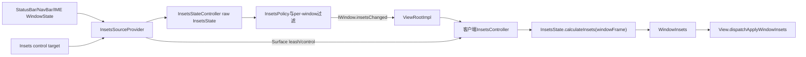
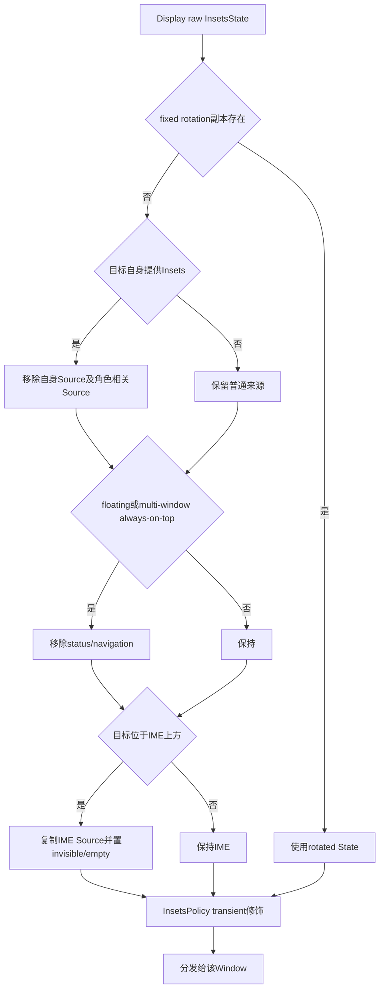
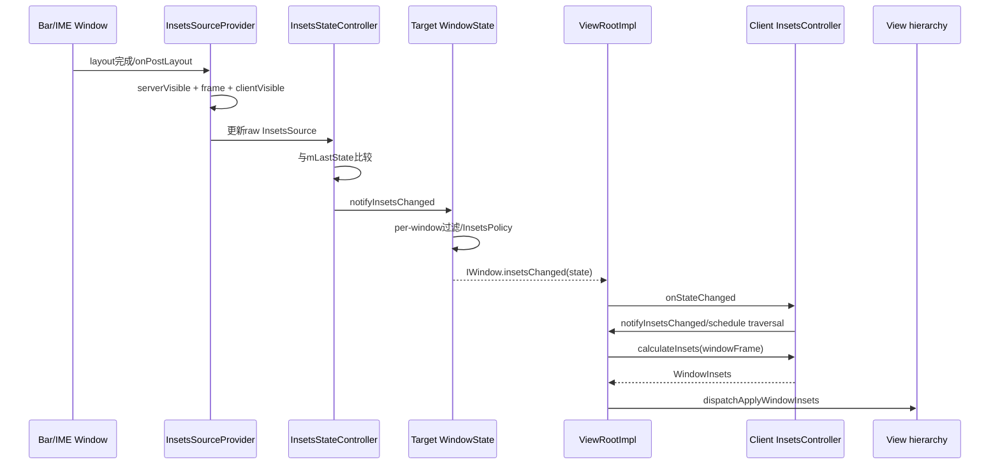

# 230 Android InsetsState、InsetsSourceProvider与系统栏Insets分发

> 源码版本：Android 11 / `android-11.0.0_r48`  
> 学习方式：macOS只读核源，不编译、不运行AOSP

## 1. 本章要解决什么

Android窗口为什么知道状态栏占顶部多少、导航栏在左/右/底部哪一侧、IME出现后底部要避让多少？

本章从WMS生产Insets来源开始，追到App View树收到`WindowInsets`，重点回答：

```text
InsetsSource怎样表示一块来源区域？
Provider怎样从真实Window算出source frame？
为什么同一Display上的不同Window收到不同InsetsState？
InsetsState怎样变成相对某个Window的四边Insets？
```

## 2. Insets不是简单的padding

Insets首先是一组系统来源的几何与可见性状态，再相对具体Window frame计算。

同一个状态栏Source，对全屏Window可能产生top inset；对完全不相交的浮动Window可能产生`Insets.NONE`。

## 3. 总体结构图



本章主讲状态与分发；control leash和逐帧动画放在第231章。

## 4. 四层对象先分清

```text
InsetsSource：一种内部类型的frame、visibleFrame与visible
InsetsState：Display frame + 最多20种内部Source
InsetsSourceProvider：服务端把WindowState变成Source并管理控制权
WindowInsets：客户端相对当前Window计算后的公开类型四边值
```

`WindowInsets`是计算结果，不是WMS原始账本。

## 5. internal type与public type不同

服务端r48有20个`ITYPE_*`槽位，而公开`WindowInsets.Type`使用bit mask聚合。

一个公开类型可能来自多个内部Source。

## 6. 状态栏的多来源映射

```text
ITYPE_STATUS_BAR
ITYPE_CLIMATE_BAR
    → WindowInsets.Type.STATUS_BARS
```

汽车等产品可以用额外climate bar贡献同一公开statusBars语义。

## 7. 导航栏的多来源映射

```text
ITYPE_NAVIGATION_BAR
ITYPE_EXTRA_NAVIGATION_BAR
    → WindowInsets.Type.NAVIGATION_BARS
```

公开API不要求应用理解每块系统装饰Window的内部名字。

## 8. Display cutout被拆成四个Source

left/top/right/bottom四个`ITYPE_*_DISPLAY_CUTOUT`都映射到公开`DISPLAY_CUTOUT`。

这样State计算时仍可按边处理，公开层再得到聚合结果。

## 9. Gesture来源更细

top/bottom/left/right gesture与mandatory gesture分别建Source。

mandatory结果还会额外合并进公开`SYSTEM_GESTURES`，体现“强制手势区域也是系统手势区域”。

## 10. 默认可见性

```java
return type != ITYPE_IME;
```

r48所有内部类型默认visible，只有IME默认隐藏。Provider和客户端请求后续再覆盖。

## 11. InsetsSource的三个核心字段

```text
mType：固定internal type
mFrame：来源在屏幕坐标中的Rect
mVisibleFrame：可选的实际可见区域
mVisible：当前是否参与普通Insets计算
```

type构造后不可改，frame和visible会随布局变化。

## 12. frame为什么是屏幕坐标

Source要服务Display上多个Window，必须先有共同坐标系。

客户端计算时再拿目标Window frame与Source frame相交，得到相对该Window的一边厚度。

## 13. visibleFrame是什么

若提供Window用`mGivenVisibleInsets`声明只有内部一部分可见，Provider据此生成visibleFrame。

它主要服务`calculateVisibleInsets()`；为空引用时等同使用普通frame。

## 14. visibleFrame为空Rect的控制含义

`InsetsSource.isUserControllable()`返回：

```text
visibleFrame == null，或visibleFrame非空 → 可控制
visibleFrame显式为空 → 不可做用户动画控制
```

“没有visibleFrame”与“有一个空visibleFrame”语义不同。

## 15. Source怎样计算Insets

```java
source.calculateInsets(relativeFrame, ignoreVisibility)
```

先处理visible，再求source frame与目标frame交集，然后判断交集贴住目标的哪一边。

## 16. 隐藏Source通常贡献0

`ignoreVisibility=false`且Source invisible时立即返回`Insets.NONE`。

`getInsetsIgnoringVisibility()`所需的max Insets则以true计算，不受当前显示/隐藏影响。

## 17. Caption bar是特殊规则

Caption Source不做普通相交归边，直接返回：

```text
top = sourceFrame.height
```

这是为了拖动/resize时App frame和caption位置更新不同步仍能稳定布局。

## 18. IME也有特殊规则

IME与目标frame相交后，无论几何边判断如何，都按交集高度贡献bottom inset。

源码TODO承认这是r48为非浮动IME/cutout问题保留的策略性假设。

## 19. 普通上下边判断

交集宽度等于目标Window宽度时：

```text
交集top == target.top       → top inset
交集bottom == target.bottom → bottom inset
```

若交集在中间悬浮，不产生四边Insets。

## 20. top==0的兼容hack

完整宽度交集既不贴目标top也不贴bottom，但其屏幕坐标top为0时，r48仍把它算作top inset。

注释说这是split primary被IME调整时的临时兼容规则。

## 21. 普通左右边判断

交集高度等于目标frame高度时，贴left产生left inset，贴right产生right inset。

来源只覆盖目标高度一部分时不会自动推断为左右Inset。

## 22. 一种Source只应占一边

`calculateInsets()`契约要求结果四个分量最多一边非0。

后续`getInsetSide()`和控制能力判断依赖这个假设。

## 23. 相交计算包含共边

`getIntersection()`用`<=`，共享边也算有intersection。

但得到的交集可能宽或高为0，最终贡献通常仍是0；布尔“相交”不等于有非零Inset。

## 24. InsetsState的固定槽位

`mSources`是长度`InsetsState.SIZE=20`的数组，以internal type直接当下标。

同一种internal type在一个State中最多一个Source。

## 25. getSource会创建

`getSource(type)`若不存在会创建默认Source并放入数组；`peekSource(type)`只查询，不产生副作用。

读条件分支时应优先注意调用的是哪一个。

## 26. InsetsState还保存Display frame

`mDisplayFrame`是Source共同参照的Display范围，也用于判断某Window能否控制某一侧Insets。

它不是当前App Window frame。

## 27. 浅拷贝与深拷贝

```java
new InsetsState(other)                // set(other)，默认共享Source引用
new InsetsState(other, true)          // 每个Source深拷贝
```

r48许多过滤路径先浅拷State，再只复制即将修改的Source，避免全量对象分配。

## 28. 修改浅拷贝的风险

如果直接修改浅拷贝中共享的Source，会连原State一起变。

源码需要改visibility时通常先`new InsetsSource(originalSource)`，再add回浅拷State。

## 29. calculateInsets的输出Map

State为每个公开type维护：

```text
typeInsetsMap：按当前可见性计算
typeMaxInsetsMap：忽略可见性计算
typeVisibilityMap：当前可见状态
```

最终共同构造`WindowInsets`。

## 30. 多Source怎样合并

映射到同一公开type的多个Source使用`Insets.max(existing, insets)`逐边取最大。

它不是求和。例如顶部status bar与climate bar重叠时不会简单把高度相加。

r48的`typeVisibilityMap`却不是同样取max或做OR：每处理一个Source都会直接给对应public type槽位赋当前`source.isVisible()`。因此多个internal Source映射到同一public type时，internal type遍历顺序靠后的Source会覆盖先前布尔值；数值聚合与可见性聚合并不对称。

## 31. IME没有max Insets

源码明确不把IME写入`typeMaxInsetsMap`，因为IME尺寸依赖当前EditorInfo/键盘形态。

因此不能把`getInsetsIgnoringVisibility(Type.ime())`当成稳定的“键盘最大高度”。

## 32. ignoringVisibilityState的用途

调用者可传另一份State计算max Insets，例如保留系统栏未受临时可见性改变影响的稳定几何。

传null则复用当前State，只在计算时忽略Source visible。

## 33. legacy soft input兼容

公开compat Insets默认包含system bars和display cutout；`SOFT_INPUT_ADJUST_RESIZE`时再包含IME。

旧Window flags含FULLSCREEN则从compat集合移除statusBars。

## 34. r48有三种新Insets模式

```text
NEW_INSETS_MODE_NONE：系统栏/IME仍走更多legacy路径
NEW_INSETS_MODE_IME：只对IME采用新模型
NEW_INSETS_MODE_FULL：系统栏与IME完整采用新模型
```

源码中大量条件必须结合`sNewInsetsMode`阅读，不能把后续Android版本行为倒灌进r48。

## 35. InsetsSourceProvider是什么

每个internal type在服务端对应一个Provider，它持有：

```text
共享InsetsSource
背后的WindowState
可选frameProvider/imeFrameProvider
serverVisible与clientVisible
控制目标、Surface leash与control信息
```

Provider是Window与State之间的活桥。

## 36. Provider何时创建

`InsetsStateController.getSourceProvider(type)`按需`computeIfAbsent`。

IME创建专用`ImeInsetsSourceProvider`，其他类型用普通Provider。

## 37. setWindow建立来源归属

DisplayPolicy识别状态栏/导航栏等Window后调用`DisplayContent.setInsetProvider()`，最终执行Provider.setWindow。

IME Window设置时也专门绑定ITYPE_IME Provider。

## 38. 旧提供Window被替换

Provider先解除旧Window的controllable provider，并取消其动画以回收可能已发出的control leash。

然后保存新Window与frame计算函数。

## 39. setWindow(null)怎样清空

```text
serverVisible=false
source.frame=empty
source.visibleFrame=null
```

Source槽位本身可以继续存在，但不再贡献有效几何与可见状态。

## 40. 哪些Source可控制

r48中：

```text
status/navigation/climate/extra-nav：仅FULL模式可控制
IME：IME或FULL模式可控制
gesture/cutout/caption等：普通Provider标为不可控制
```

“有Source”不等于App能拿Surface leash控制它。

## 41. Status bar怎样注册三个来源

同一个TYPE_STATUS_BAR Window同时提供：

```text
ITYPE_STATUS_BAR
ITYPE_TOP_GESTURES
ITYPE_TOP_TAPPABLE_ELEMENT
```

frameProvider把top设为0、bottom设为策略计算的状态栏高度。

## 42. 一个Window可支持多个Provider

每个internal type仍有独立Provider/Source，但它们的`mWin`可以指向同一个WindowState。

这就是“一个系统栏Window，多种Insets语义”。

## 43. Navigation bar提供更多来源

除NAVIGATION_BAR外，还可提供bottom/left/right gestures与bottom tappable element。

各自frameProvider根据导航模式、Display尺寸和触摸策略修正同一个Window frame。

## 44. Gesture Nav下导航栏frame为何重算

导航栏Window视觉/触摸frame可能比实际需要避让内容的navigation inset更大。

Provider把inOutFrame.top改到安全Display底部减导航栏高度，向App报告较小的布局Insets。

## 45. IME看到的导航栏frame可以不同

Navigation Provider保存单独`imeFrameProvider`，对IME分发时可使用regular Window frame。

这防止手势导航下IME与导航栏内容发生错误重叠。

## 46. Alternative bar的权限门

Window自定义`providesInsetsTypes`需要`STATUS_BAR_SERVICE`权限，并限制与Window type对应的主栏类型不能一次声明多个。

普通三方App不能把任意Window注册成系统状态栏Source。

## 47. updateSourceFrame何时计算

Provider注释要求在来源Window完成布局后调用。

`onPostLayout()`先更新serverVisible，再调用updateSourceFrame。

## 48. serverVisible条件

```java
wouldBeVisibleIfPolicyIgnored()
&& isVisibleByPolicy()
&& !mGivenInsetsPending
```

有Window对象但尚无可显示Surface、被Policy隐藏或given Insets仍pending时，不应向App报告有效frame。

## 49. server不可见时frame为空

Provider不会保留旧Window frame继续占位，而是把Source frame清空。

这防止一块尚未准备好的系统栏让其他Window提前错误布局。

## 50. 无自定义frameProvider时

先复制`mWin.getFrameLw()`，再按`mGivenContentInsets`向内收缩。

来源Window可用given content Insets声明真正产生Insets的内部区域。

## 51. 有frameProvider时

函数收到`DisplayFrames、WindowState、inOut Rect`并原地修改。

状态栏高度、手势区域和导航栏位置等Policy逻辑因此不必硬编码进通用Provider。

## 52. visibleFrame怎样生成

只要Window任一`mGivenVisibleInsets`非0，就以Window frame向内inset得到visibleFrame；全0则设null。

显式空Rect可能让客户端判断该Source当前不可用户控制。

## 53. 最终visible是两个维度相与

```java
source.visible = serverVisible
        && (isMirroredSource() || clientVisible);
```

服务端几何/Policy准备好与控制客户端请求显示是两本账。

## 54. clientVisible初始值

Provider构造时用type默认可见性：系统栏true、IME false。

控制目标通过requested InsetsState修改后，Provider更新clientVisible。

## 55. mirrored source例外

若背后Window的`providesInsetsTypes`数组包含ITYPE_IME，Provider忽略clientVisible，只要serverVisible就显示。

这是r48特殊镜像来源逻辑，不应泛化到所有普通系统栏。

## 56. 可见性变化为什么触发布局

`setClientVisible()`给WMS H发送`LAYOUT_AND_ASSIGN_WINDOW_LAYERS_IF_NEEDED`。

Insets变化不仅是通知字段，还可能要求重新布局Window并调整Surface层级。

## 57. InsetsStateController维护什么

```text
mState：当前Display原始InsetsState
mLastState：上次post-layout深拷贝
mProviders：type到Provider
control target双向映射
pending control changed集合
```

它是每个DisplayContent一份，不是全系统唯一实例。

## 58. onPostLayout更新Display frame

Controller先把`mDisplayContent.getBounds()`写入mState displayFrame，再让所有Provider post-layout。

所以Source几何与Display bounds在同一布局批次更新。

## 59. 怎样判断全局State变化

`mLastState.equals(mState)`比较Display frame和每个Source的type/frame/visibleFrame/visible。

变化时深拷当前State作为下一轮基线，并通知Insets changed。

## 60. State没变也可能要通知特定Window

Window Z序、是否位于IME上方等条件变化，会改变per-window过滤结果，却不改变raw State。

`mWinInsetsChanged`保存这类Window，post-layout时单独分发。

## 61. raw State不能直接广播给所有Window

`getInsetsForDispatch(target)`会根据目标身份和布局环境裁剪/改写。

同一Display上的状态栏Window、普通App、浮窗与IME拿到的State可能不同。



## 62. fixed rotation优先

若目标Window token有fixed-rotation transform InsetsState，直接返回旋转后的副本。

DisplayContent在raw visibility变化时还会同步更新这份rotated State的Source visible。

## 63. 提供者不接收自己的Source

目标Window自身是可控制Insets Provider时，分发State会remove该type。

状态栏不需要再因为自己的状态栏Source给自己产生top inset。

## 64. Navigation bar提供者还排除什么

Nav/extra-nav Window收到的State还移除：

```text
IME
status/climate bar
caption bar
```

源码注释称导航栏不受其他来源影响。

## 65. Status bar提供者排除caption

状态栏或climate bar自身不接收caption bar Source。

这是服务端按Window角色定制，而非客户端自行consume。

## 66. IME可得到override frame

当目标type为IME时，Controller遍历带`imeFrameProvider`的其他Provider，用其override frame替换相应Source副本。

同一个导航栏Source对普通App与IME可以报告不同几何。

## 67. 浮动Window的系统栏过滤

`WindowConfiguration.isFloating(windowingMode)`时移除status和navigation Source。

multi-window且always-on-top也做相同处理；浮窗不应按全屏系统栏方式被压缩。

## 68. 位于IME上方的Window

若目标Z序高于IME且IME Source当前visible，Controller复制IME Source后：

```text
visible=false
frame=empty
```

上层Window不会因自己下面的IME产生bottom inset。

## 69. InsetsPolicy再做一层修饰

`WindowState.getInsetsState()`实际先进入`InsetsPolicy.getInsetsForDispatch()`，它包裹StateController结果。

Transient system bars是其中最重要的额外状态。

## 70. transient bar为何对App报告invisible

系统栏可在不改变App稳定布局意图的情况下临时滑入。Policy对正在transient展示的Source复制后设visible=false再分发。

物理栏暂时可见，与App布局State把它当作隐藏可以同时成立。

## 71. fake control target的作用

Transient期间App可能不再拥有真实leash，但服务端仍给它fake control以观察show/hide意图。

若App明确请求show，Policy可中止transient状态并恢复正常控制关系。

## 72. Control target与State recipient不同

每个可见Window都可能收到InsetsState；只有被Policy选中的焦点/IME目标等才拿某类SourceControl。

“知道栏在哪里”与“能移动/隐藏栏Surface”是两种权限。

## 73. 为什么leash不能创建后立刻发

Provider创建SurfaceAnimator leash后把`mIsLeashReadyForDispatching=false`。

在准备leash的Surface Transaction真正apply前，若客户端先操作可能被服务端后提交状态覆盖。

## 74. afterPrepareSurfaces屏障

StateController把control-changed通知放到Animator `addAfterPrepareSurfacesRunnable`：

```text
先标所有Provider leash可分发
再notify各ControlTarget
```

这是Surface状态与Binder控制权交付的顺序屏障。

## 75. 屏障前会发什么

若目标查询到mControl但leash尚未ready，Provider返回同type/position、但`leash=null`的新Control。

客户端可以知道类型，却不能过早操作服务端尚未生效的Surface层。

## 76. Global State变化怎样广播

`InsetsStateController.notifyInsetsChanged()`调用DisplayContent，后者top-to-bottom遍历所有Window。

回调Consumer只对`w.isVisible()`的Window执行`w.notifyInsetsChanged()`。

## 77. fixed rotation State同步

广播前若有fixed-rotation launching App，DisplayContent逐type把raw State最新visible复制进rotated State。

几何仍保持旋转副本，visibility跟随当前系统栏/IME状态。

## 78. 服务端到客户端的Binder接口

WindowState执行：

```java
mClient.insetsChanged(getInsetsState());
```

`IWindow.insetsChanged(InsetsState)`是oneway式窗口回调链的一部分，参数是该Window定制后的Parcelable副本。

## 79. control变化使用另一回调

拿到或失去控制权时使用`insetsControlChanged(InsetsState, InsetsSourceControl[])`。

状态变化与control变化可分别发生，客户端必须支持两条入口。

## 80. Window首次add也带Insets

`IWindowSession.addToDisplayAsUser()`的输出参数包含`InsetsState`与`InsetsSourceControl[]`。

ViewRootImpl在setView初次add成功后立刻调用客户端InsetsController的`onStateChanged()`和`onControlsChanged()`，不用等下一次异步广播。

## 81. ViewRoot的IWindow回调线程

`ViewRootImpl.W`收到insetsChanged后调用`dispatchInsetsChanged()`，把处理切回ViewRoot主线程消息队列。

Binder回调到达不等于View树已经同步执行apply Insets。

## 82. 客户端有三份State

InsetsController维护：

```text
mLastDispatchedState：服务端最近下发
mState：应用本地消费/动画后的当前状态
mRequestedState：准备回报服务端的可见性请求
```

它们在动画或本地visibility override期间可以不同。

## 83. Caption Source为何客户端组装

客户端DecorView知道caption Insets高度，InsetsController可在本地给ITYPE_CAPTION_BAR设置frame。

因此State equals有“忽略caption Insets”选项，避免把客户端合成字段误判成服务端变化。

## 84. invisible IME frame也可忽略比较

状态通知判断可选择在IME隐藏时忽略其frame变化。

隐藏键盘几何变化不应总是触发App重新布局，但服务端最新State仍需妥善记录。

## 85. onStateChanged并非直接调View

它更新本地State、应用visibility override，若有效State变化则调用Host.notifyInsetsChanged。

ViewRootImpl把`mApplyInsetsRequested=true`并schedule traversal。

## 86. WindowInsets在何时计算

Traversal需要分发时，ViewRoot调用：

```java
mInsetsController.calculateInsets(
    isScreenRound, alwaysConsumeSystemBars, displayCutout,
    softInputMode, windowFlags, systemUiFlags)
```

计算使用当前Window frame，不是服务端预先给出的固定四边数字。

## 87. ViewRoot还计算legacy visibleInsets

`calculateVisibleInsets()`结果写入AttachInfo.mVisibleInsets；公开WindowInsets的system/stable值也回填旧AttachInfo字段。

r48仍需同时支持新Insets API与旧View布局兼容字段。

## 88. 最终怎样进入View树

```java
host.dispatchApplyWindowInsets(insets);
```

随后每个View按自己的listener、fitsSystemWindows或override继续消费/传递。

## 89. DisplayCutout可能先被consume

若Window布局模式不需要单独分发cutout，或status bar inset已经负责避让，ViewRoot会先`consumeDisplayCutout()`。

所以服务端State有cutout Source不保证每个子View都看到未消费的DisplayCutout。

## 90. 从Source到View的完整时序



## 91. 几何例题一：顶部状态栏

```text
target frame = [0,0,1080,2400]
status source = [0,0,1080,100], visible=true
```

交集满目标宽并贴top，结果`Insets.of(0,100,0,0)`。

## 92. 几何例题二：不相交浮窗

```text
target frame = [100,300,900,1600]
status source = [0,0,1080,100]
```

没有交集，结果NONE；此外服务端对floating window通常已先移除status/nav Source。

## 93. 几何例题三：底部IME

```text
target frame = [0,0,1080,2400]
IME source = [0,1500,1080,2400], visible=true
```

IME特殊规则返回bottom=900。

## 94. 几何例题四：中间悬浮Source

```text
target = [0,0,1080,2400]
source = [200,500,880,700]
```

虽有交集，但不覆盖完整宽或高、也不贴四边，普通Source返回NONE。

## 95. 常见误解纠正

1. “状态栏高度就是全局top padding”——错，要相对Window frame计算。  
2. “Source visible完全由系统Window是否有Surface决定”——错，是server/client两本账相与。  
3. “所有Window收到同一State”——错，有角色、窗口模式、Z序、旋转和transient过滤。  
4. “收到State就能控制系统栏”——错，还需Control与leash。  
5. “Binder回调后View立刻拿到新Insets”——错，通常在主线程Traversal中分发。

## 96. 为什么排查Insets先看Raw再看Dispatch

如果App拿到错误Insets，要分别检查：

```text
raw Source frame/visible是否正确
Provider server/client visible是否正确
getInsetsForDispatch是否移除/override
InsetsPolicy是否做transient改写
客户端Window frame和本地override是否正确
```

只dump App最终WindowInsets会丢失中间证据。

## 97. 进程与线程边界

```text
system_server的WMS布局/调用路径（通常持global lock）：Provider、StateController、per-window State
Binder IWindow回调：跨进程传Parcelable State
App主线程：ViewRoot/InsetsController更新与Traversal
Surface动画：Control leash由SF transaction和客户端逐帧参数协作
```

最后一项将在下一章展开。

## 98. macOS只读练习一：手算Source

```bash
cd /Users/ninebot/androidSource
sed -n '65,175p' frameworks/base/core/java/android/view/InsetsSource.java
```

用本章91—94节四组Rect逐行走`calculateInsets()`，写出命中的return分支。

## 99. macOS只读练习二：追系统栏Provider

```bash
cd /Users/ninebot/androidSource
sed -n '1095,1175p' frameworks/base/services/core/java/com/android/server/wm/DisplayPolicy.java
rg -n "setInsetProvider|updateSourceFrame|setServerVisible" \
  frameworks/base/services/core/java/com/android/server/wm/DisplayContent.java \
  frameworks/base/services/core/java/com/android/server/wm/InsetsSourceProvider.java
```

目标：列出status Window与navigation Window各自提供的internal types。

## 100. macOS只读练习三：比较四类目标Window

```bash
cd /Users/ninebot/androidSource
sed -n '115,245p' frameworks/base/services/core/java/com/android/server/wm/InsetsStateController.java
```

分别推演导航栏自身、状态栏自身、floating App和位于IME上方Window会被移除哪些Source。

## 101. macOS只读练习四：追到View

```bash
cd /Users/ninebot/androidSource
rg -n "notifyInsetsChanged|insetsChanged\\(|onStateChanged|dispatchApplyInsets|dispatchApplyWindowInsets" \
  frameworks/base/services/core/java/com/android/server/wm/WindowState.java \
  frameworks/base/core/java/android/view/ViewRootImpl.java \
  frameworks/base/core/java/android/view/InsetsController.java
```

目标：标出system_server、Binder回调和App主线程Traversal三个边界。

## 102. 源码阅读导航

```text
frameworks/base/core/java/android/view/InsetsSource.java
frameworks/base/core/java/android/view/InsetsState.java
frameworks/base/core/java/android/view/InsetsSourceControl.java
frameworks/base/core/java/android/view/InsetsController.java
frameworks/base/core/java/android/view/ViewRootImpl.java
frameworks/base/core/java/android/view/IWindow.aidl
frameworks/base/services/core/java/com/android/server/wm/InsetsSourceProvider.java
frameworks/base/services/core/java/com/android/server/wm/ImeInsetsSourceProvider.java
frameworks/base/services/core/java/com/android/server/wm/InsetsStateController.java
frameworks/base/services/core/java/com/android/server/wm/InsetsPolicy.java
frameworks/base/services/core/java/com/android/server/wm/DisplayPolicy.java
frameworks/base/services/core/java/com/android/server/wm/DisplayContent.java
frameworks/base/services/core/java/com/android/server/wm/WindowState.java
```

## 103. 本章复读后的精确结论

1. InsetsSource保存屏幕坐标来源区域；四边Insets必须相对目标Window frame计算。  
2. 一个系统栏Window可通过多个Provider贡献布局、gesture和tappable等不同内部类型。  
3. Provider最终visible通常是serverVisible与clientVisible相与，frame只在来源Window服务端可见且given Insets不pending时有效。  
4. StateController为提供者、浮窗、IME上下层、fixed rotation等目标生成不同State，InsetsPolicy还会改写transient bar可见性。  
5. 服务端通过IWindow回调State，客户端在ViewRoot主线程Traversal中计算WindowInsets并分发View树。  
6. State可见性与Surface控制权分离；Control leash必须等准备Transaction apply后才能交给客户端。

## 104. 检查题

1. internal type为什么比public type多？  
2. visibleFrame为null与显式empty有什么区别？  
3. 多个Source映射到同一公开type时为何取max而非求和？  
4. 为什么IME不提供稳定max Insets？  
5. serverVisible与clientVisible各由什么决定？  
6. 为什么导航栏Window不接收自己的导航栏Source？  
7. transient bar物理可见时为何可能向App报告invisible？  
8. IWindow.insetsChanged到View.onApplyWindowInsets之间还有哪些步骤？

## 105. 下一章预告

下一章深入Insets控制与动画：焦点Window怎样得到`InsetsSourceControl`和Surface leash，App调用show/hide或`controlWindowInsetsAnimation()`后，客户端怎样同步布局Insets、逐帧移动栏/IME，并把最终可见性回报WMS。
