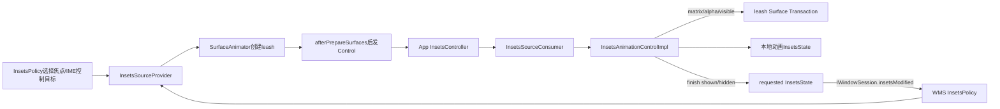
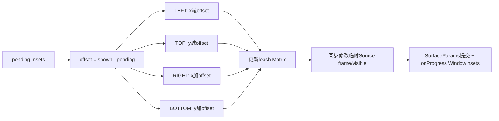
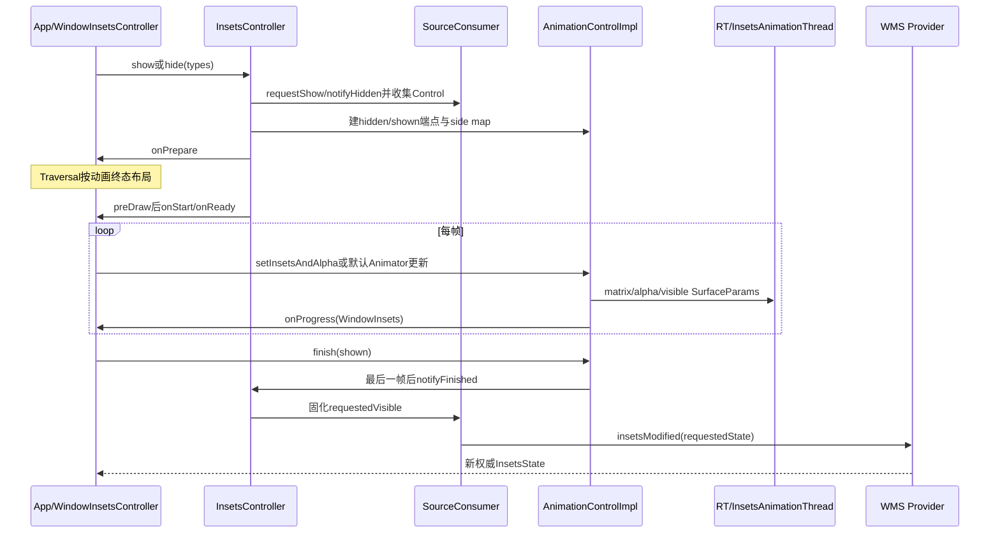

# 231 Android InsetsSourceControl、show/hide与WindowInsetsAnimation控制链

> 源码版本：Android 11 / `android-11.0.0_r48`  
> 学习方式：macOS只读核源，不编译、不运行AOSP

## 1. 本章要解决什么

第230章解决“App怎样知道系统栏/IME在哪里”。本章解决更动态的问题：

```text
谁有资格控制某个Insets Source？
Surface leash怎样安全交给App？
show/hide怎样变成逐帧位移和alpha？
动画结束怎样把requested visibility回报WMS？
IME为什么比普通系统栏多一层准备协议？
```

## 2. State与Control必须分开

`InsetsState`告诉所有相关Window来源几何和可见性。

`InsetsSourceControl`只交给当前控制目标，包含可以操作Surface的leash；知道状态不等于拥有控制权。

## 3. 总体控制闭环



## 4. 服务端谁选择控制目标

`InsetsPolicy.updateBarControlTarget()`根据焦点Window、WindowingMode、Keyguard、transient bars和remote controller策略，分别选status/nav目标。

IME则由DisplayContent根据IME target选择IME control target。

## 5. Starting Window不会抢系统栏控制

若focused Window类型是`TYPE_APPLICATION_STARTING`，InsetsPolicy直接返回，不更新bar control target。

占位窗口不能代表App长期的栏显示意图。

## 6. 一个目标可以控制多种internal type

status目标同时可对应STATUS_BAR和CLIMATE_BAR；nav目标可对应NAVIGATION_BAR与EXTRA_NAVIGATION_BAR。

StateController维护target→types和type→target双向映射。

## 7. Provider怎样创建leash

`updateControlForTarget()`给来源Window启动`ANIMATION_TYPE_INSETS_CONTROL`的SurfaceAnimator：

```java
mWin.startAnimation(transaction, mAdapter,
        !mClientVisible /* hidden */,
        ANIMATION_TYPE_INSETS_CONTROL);
```

ControlAdapter不跑计时动画，只截获SurfaceAnimator创建的leash。

## 8. ControlAdapter的startAnimation

它保存`animationLeash`并把leash position设到来源Window frame.left/top。

后续客户端以这个基础位置加平移，不必知道WindowState的父层级细节。

## 9. IME leash初始隐藏

r48对IME leash执行alpha=1并hide，源码TODO说明未来希望用alpha=0替代当前hide workaround。

这是创建阶段初态，不代表IME的最终requested visibility。

## 10. InsetsSourceControl携带什么

```text
internal type
可空SurfaceControl leash
leash基础surfacePosition
```

它不携带动画时长、Interpolator或WindowInsets四边值。

## 11. Control复制会复制Surface句柄

复制构造器用`new SurfaceControl(other.mLeash, "InsetsSourceControl")`创建同一底层Surface的新Java handle。

每个接收者必须在不再使用时release自己的引用。

## 12. leash为何允许为null

至少两种情况：

```text
真实leash的准备Transaction尚未apply
服务端给transient bars的fake control
```

null leash可以传递type/position和意图通道，但不能直接移动Surface。

## 13. 为什么不能创建后立即发送

如果客户端先提交leash状态，服务端稍后才apply创建/reparent Transaction，服务端可能覆盖客户端操作。

Provider先把`mIsLeashReadyForDispatching=false`。

## 14. afterPrepareSurfaces交付屏障

StateController把通知放入`addAfterPrepareSurfacesRunnable()`：

```text
先onSurfaceTransactionApplied → leash ready
再controlTarget.notifyInsetsControlChanged
```

这是跨进程控制权与Surface Transaction的顺序保证。

## 15. 屏障前查询Control

Provider返回同type和surfacePosition，但leash置null的新对象。

客户端因此不会在服务端准备操作之前改真实Surface。

## 16. 控制权撤销

目标变null或来源Window取消动画时，ControlAdapter.onAnimationCancelled：

```text
从StateController控制映射移除
mControl/mControlTarget/mAdapter清空
clientVisible恢复type默认值
```

客户端也会收到control=null。

## 17. Seamless rotation期间暂不控制

Provider在seamless rotating时拒绝更新control target，并取消旧leash。

旋转完成后可能把新leash Transaction defer到来源Window新方向frame，避免旧几何闪现。

## 18. 客户端onControlsChanged入口

InsetsController把activeControls暂存为type→Control，再：

```text
给所有现有Consumer更新Control，缺失视为撤销
为新Control创建Consumer
收集需要补跑的show/hide动画
通知controllable listeners
必要时重发requested State
```

## 19. 每种Source一个Consumer

普通类型用`InsetsSourceConsumer`，IME用`ImeInsetsSourceConsumer`。

Consumer持有requestedVisible、本地State与当前Control，是单类型状态机。

## 20. requestedVisible的默认值

构造时沿用Source默认：系统栏true、IME false。

它表示客户端意图，不保证当前Surface或服务端Source已经处于该状态。

## 21. 获得Control时为什么可能自动补动画

如果之前没有leash但App已调用show/hide，requestedVisible可能与本地Source visible不同。

`setControl()`把对应public type加入showTypes或hideTypes，onControlsChanged末尾启动动画。

## 22. 有Control但暂时无leash

Consumer发现需要动画却只有null leash时设置`mIsAnimationPending=true`。

之后收到真正leash，即使State表面已被本地override，也会按pending意图补跑动画。

## 23. 获得新leash但无需动画

Consumer仍调用`applyHiddenToControl()`同步show/hide状态，避免新leash保留服务端默认可见性。

这条路径直接Transaction apply，不走计时动画。

## 24. 丢失Control时恢复服务端State

Consumer用`mLastDispatchedState`取得服务器最近visibility；若本地动画State不同，就恢复Source并通知View重新计算Insets。

失去控制后客户端无权继续维持本地假象。

## 25. 旧Control何时release

`setControl()`完成新旧状态交接后，对lastControl调用release。

动画运行时使用的是复制后的Control句柄；ViewRoot Host还可把release排到RenderThread既有任务之后。

## 26. applyLocalVisibilityOverride

只有Consumer拥有Control时，requestedVisible才能覆盖本地Source visible。

没有Control时只更新legacy compat sysUi可见性回调，不能实际改State。

## 27. show/hide的第一层去重

show忽略“已经requested visible且无动画”或“正在SHOW”；hide对称忽略已hidden或正在HIDE。

Java中`&&`优先于`||`，读条件时要按括号语义理解。

## 28. public types转internal types

`InsetsState.toInternalType()`把status/nav/caption/cutout/IME等公开mask展开。

真正可动画集合还受是否有Consumer、Control、leash和Source可控性限制。

## 29. 默认show/hide不是直接show Surface

`applyAnimation(types, show, fromIme)`创建内部Animation listener，再进入统一`controlAnimationUnchecked()`。

系统默认动画与App自定义控制复用同一个InsetsAnimationControlImpl。

## 30. 默认时长

```text
系统栏show：275ms
系统栏hide：340ms
IME且App有animation callback：285ms
IME且无callback、异步线程：200ms
```

这些是r48客户端默认，不是所有OEM/后续版本永久常量。

## 31. 默认Interpolator

系统栏使用`PathInterpolator(0.4,0,0.2,1)`；IME根据有无callback和show/hide选择不同曲线。

ValueAnimator自身线性推进raw fraction，再把Insets fraction与alpha fraction分别过曲线。

## 32. 有无View动画Callback影响执行线程

有Callback时，动画与View `onPrepare/onStart/onProgress/onEnd`协调，并用主线程/Choreographer Insets Animation阶段。

无Callback的默认动画可交给`InsetsAnimationThreadControlRunner`，减少主线程负担。

## 33. 为什么show/hide相对Display frame

默认动画调用control时传`mState.getDisplayFrame()`，保证shown/hidden Insets端点不因当前App Window没覆盖整侧而错误。

用户自定义control则先检查当前Window frame不可控制的types。

## 34. 用户控制的不可控侧检查

`calculateUncontrollableInsetsFromFrame(mFrame)`判断Window是否覆盖对应Display整宽/整高。

若请求mask含不可控类型，listener立即`onCancelled(null)`，不会给半套Controller。

## 35. visibleFrame也可禁用户动画

服务端Source的visibleFrame显式empty时，客户端把对应public type放入disabled user animation集合。

正在运行的USER动画会取消，并post show恢复稳定状态。

## 36. 新动画先取消重叠旧动画

`cancelExistingControllers(types)`遍历running animations，凡type mask相交就cancel。

取消回调期间用mTypesBeingCancelled阻止同步重入启动同类型新动画。

## 37. collectSourceControls做什么

逐internal type：

```text
show先requestShow
hide先notifyHidden（非fromIme）
有Control则复制到本次runner
无Control的默认show/hide只更新requestedVisible
```

最终返回typesReady与imeReady。

## 38. 为什么Runner复制Control

客户端后续可能收到新Control并release旧对象；正在运行的Runner需要自己的leash handle保持本次动画稳定。

结束或取消后Runner释放这些副本。

## 39. IME show为什么可能延迟

普通App请求IME show时，即便目标意图明确，IME进程仍要确认focused editor、创建/预渲染窗口并取得Control。

ImeConsumer可能调用`InputMethodManager.requestImeShow()`并返回`IME_SHOW_DELAYED`。

## 40. IME show失败

没有可服务Editor等条件下IMM可返回false，结果为`IME_SHOW_FAILED`。

Controller跳过IME，但同一次多type请求中的其他已准备类型仍可继续动画。

## 41. pending IME control request

若IME尚未ready，Controller保存整个请求、listener、duration、Interpolator、CancellationSignal和layout mode。

IME之后从自身调用show(fromIme=true)时重新进入control流程。

## 42. 2秒pending超时

`PENDING_CONTROL_TIMEOUT_MS=2000`。

超时调用listener.onCancelled(null)并清请求；这是等待IME控制准备的超时，不是动画播放时长。

## 43. fromIme与App USER控制冲突

如果IME发来show，而App已经以USER动画控制IME，Controller跳过此次自动show，不取消App手势/自定义动画。

控制权优先级通过animation type显式表达。

## 44. layout Insets during animation

动画过程中View布局固定在一个端点，Surface再在其上移动：

```text
show动画 → 布局按shown
hide动画 → 布局按hidden
USER多type → 若任一当前hidden，通常选shown，否则hidden
```

避免View每帧重新measure/layout。

## 45. showDirectly/hideDirectly何时发生

Runner创建后、真正开始逐帧前，Controller先把本地Source visibility切到布局端点，触发Insets分发与pre-draw。

Surface仍由AnimationControl的matrix/alpha显示在起始视觉位置。

## 46. Callback顺序为什么有PreDraw

```text
dispatch onPrepare
改变布局端点并请求Traversal
在ViewTreeObserver下一次pre-draw执行onStart
标记ready并调用listener.onReady
```

App可在onPrepare记录旧布局，在onStart获得新布局，构建同步动画。

## 47. View不存在时的边界

ViewRoot Host的`addOnPreDrawRunnable()`在mView为null时直接return。

这意味着已detach ViewRoot不能继续完成标准ready交付，相关控制随后应由撤销/取消清理。

## 48. AnimationControlImpl初始化三套Insets

```text
currentInsets：初始State当前值
hiddenInsets：把本次controls设invisible后计算
shownInsets：把本次controls设visible后计算
```

它还生成internal type→side与side→Control映射。

## 49. 初始State必须深拷

`mInitialInsetsState = new InsetsState(state, true)`。

逐帧修改临时State的frame/visible不能污染作为几何基线的Source。

## 50. zero-insets IME特殊情况

浮动IME可能visible但对Window贡献bottom=0，普通算法无法从Insets判断side。

若控制types包含IME且shown bottom为0，r48强制把IME映射到BOTTOM，并用-80dp概念隐藏位置参与默认动画。

## 51. setInsetsAndAlpha是App逐帧入口

用户或默认Animator提交：

```text
目标Insets
alpha
fraction
```

方法只写pending值并安排apply，不直接保证Transaction当场present。

## 52. 输入怎样sanitize

alpha与fraction clamp到0..1；普通Insets clamp在hidden与shown端点之间。

zero-insets IME允许特殊范围，不执行普通Insets clamp。

## 53. 每帧offset怎样算

```text
offset = shownInsets - pendingInsets
```

show端offset=0；越接近hidden，来源越向对应屏幕外侧平移。

## 54. 四边平移方向

```text
LEFT   → x -= offset
TOP    → y -= offset
RIGHT  → x += offset
BOTTOM → y += offset
```

矩阵与临时Source frame同步offset。



## 55. 为什么同时改Surface和临时State

leash matrix/alpha负责视觉；临时State负责计算本帧`WindowInsetsAnimation.onProgress`传给View树的Insets。

只移动Surface会让View callback看到错误数值，只改State则屏幕内容不动。

## 56. 每帧SurfaceParams

每个非null leash生成：

```text
withAlpha(alpha)
withMatrix(translation matrix)
withVisibility(visible)
```

Host将多个Source参数在同一同步应用机制中提交。

## 57. visible怎样决定

普通来源以当前inset是否非0决定；zero-insets IME按show/hide动画类型和finished状态特殊处理。

因此alpha=0与visible=false不是同一个状态。

## 58. perceptible阈值

源码逐边判断`100 * currentInset >= 5 * (shownInset - hiddenInset)`，并要求alpha至少0.5。常见hidden=0时可理解为达到变化范围约5%；若hidden本身非0，不能擅自改写成`current-hidden`后的百分比。

状态变化时回调`reportPerceptible(types, boolean)`；IME再经IMM报告。

## 59. 有View Callback时如何同步Surface

ViewRoot Host使用`SyncRtSurfaceTransactionApplier`，硬件加速时把leash参数与RenderThread frame同步。

非硬件加速路径直接构造Transaction apply，源码TODO说明尚无逐frame同步。

## 60. 无View Callback的异步线程

InsetsAnimationThread runner直接创建SurfaceControl.Transaction、逐项applyParams、apply并close。

完成后post回App主Handler更新外层Controller状态。

## 61. onProgress怎样生成

主线程mAnimCallback复制当前State，让所有running control把pending变化应用到副本，再calculate WindowInsets。

随后向View树分发`dispatchWindowInsetsAnimationProgress(insets, runningAnimations)`。

## 62. 多动画为何先聚合

同一帧可能同时有状态栏和IME动画。Controller先让所有Runner修改同一State副本，再统一计算一次WindowInsets。

避免各动画分别给View发送彼此不一致的中间State。

## 63. USER动画为何可立即apply

`scheduleApplyChangeInsets()`遇到USER或onReady启动期，直接运行mAnimCallback，允许App主动setInsetsAndAlpha后及时看到状态。

默认系统动画则post到Choreographer的CALLBACK_INSETS_ANIMATION阶段合并。

## 64. finish(shown)做两步完成

AnimationControlImpl先标记mFinished，把pending端点设为shown或hidden并schedule最后一帧；同时调用用户listener.onFinished(this)。

最后一帧`applyChangeInsets()`真正执行后，再调用外层Controller.notifyFinished。

## 65. 两个finished不要混

```text
listener.onFinished：控制请求API回调
InsetsController.notifyFinished：移除running runner、固化本地visibility
Surface Transaction apply：参数提交
SF/HWC present：更下游显示完成
```

它们不是同一时刻。

## 66. Controller怎样固化终态

notifyFinished先移除Runner，再：

```text
shown → showDirectly(types)
hidden → hideDirectly(types, animationFinished=true)
```

Consumer更新requestedVisible与本地Source，并触发requested State回报。

## 67. requested State怎样回WMS

`updateRequestedState()`只处理当前仍有Control的Consumer，把本地Source副本放入mRequestedState。

ViewRoot Host调用oneway `IWindowSession.insetsModified(window,state)`。

## 68. 服务端怎样接收

Session在global lock内找到WindowState：

```text
windowState.updateRequestedInsetsState(state)
InsetsPolicy.onInsetsModified(windowState,state)
```

StateController只允许真实control target修改对应Provider clientVisible。

## 69. 请求回报后为何还会布局

Provider.setClientVisible发送WMS布局/层级消息并更新raw Source visible。

下一轮post-layout再向各Window分发权威State，闭合客户端预测与服务端事实。

## 70. finish不等于硬件present

即使requested State已回WMS、leash最后参数已apply，仍不能声称HWC present fence已经signal。

Insets API完成语义关注控制状态和动画回调，不提供物理面板完成证据。

## 71. cancel怎样处理

Control.cancel标记cancelled、调用listener.onCancelled，并release本次Runner复制的leash handles。

若ready尚未交付，listener收到null；否则收到controller对象。

## 72. Controller取消后的frame恢复

Consumer在动画中若服务端发来新Source frame，会先保存在pendingFrame，维持旧frame完成动画。

动画结束/取消移除Runner时`notifyAnimationFinished()`恢复pending frame并请求新Insets布局。

## 73. 为什么动画中冻结Source frame

直接切到新frame会让hidden/shown端点和当前matrix突然变化，产生跳帧。

先保存新几何、结束后切换可保持同一Runner的坐标基线一致。

## 74. Control被服务端撤销

Consumer通知InsetsController，Controller取消所有包含该public type的running animation。

IME还会取消pending control request，防止过期目标稍后突然弹键盘。

## 75. release为什么可能延迟到RT

旧leash也许已进入SyncRtSurfaceTransactionApplier工作队列。

硬件加速ViewRoot通过registerRtFrameCallback后release，保证排在既有RT操作之后。

## 76. default show/hide动画回调

InternalAnimationControlListener创建ValueAnimator，逐帧插值Insets与alpha，结束调用`controller.finish(show)`。

其`onFinished`仅记录debug；真正终态由finish→notifyFinished闭环完成。

## 77. 动画禁用时

`mAnimationsDisabled=true`时listener.onReady立即走onAnimationFinish，不启动ValueAnimator。

仍会通过Control finish固化终态，并非绕过状态回报直接show/hide。

## 78. IME Consumer为何特殊

它还负责：

```text
与InputMethodManager注册当前consumer
验证focused/pre-rendered Editor
请求IMM show
通知IME hidden与remove surface
报告perceptible
保存awaiting-control show意图
```

系统栏Consumer不需要这些跨进程输入法协议。

## 79. Window焦点与IME Consumer

ViewRoot焦点获得时向IMM注册ImeConsumer；失焦时注销并清`mIsRequestedVisibleAwaitingControl`。

旧Window失焦后不能继续凭pending意图弹出IME。

## 80. IME预渲染匹配

ImeConsumer比较focused Editor与pre-rendered Editor的imeOptions、inputType、packageName、privateImeOptions与extras。

匹配时可把show延到目标IME内容预渲染完成后执行。

## 81. r48 Editor extras null条件错误

源码写成：

```java
if ((info1.extras == null && info2.extras != null)
        || (info1.extras == null && info2.extras != null))
```

两个分支完全重复，漏掉`info1.extras != null && info2.extras == null`。

## 82. 这个错误可能导致什么

若info1.extras非null、info2.extras为null，前面未返回，后面会访问`info2.extras.hashCode()`，存在NullPointerException风险。

这是按源码控制流推导的版本缺陷，不是预渲染设计要求。

## 83. r48 Bundle equals对象也写错

```java
if (info1.extras.hashCode() == info2.extras.hashCode()
        || info1.extras.equals(info1))
```

第二项拿Bundle与EditorInfo对象比较，通常没有意义；合理意图很可能是比较两个extras，但文档只记录源码事实，不替源码擅自改结论。

## 84. Parcel比较没有显式recycle

最终fallback把两个extras写入Parcel比较byte array，但方法未在finally中recycle这两个Parcel。

这也是r48实现边界；不应模仿到业务代码。

## 85. IME hide完成的额外清理

`hide(animationFinished=true)`除更新requestedVisible，还调用notifyHidden与removeSurface。

IMM再通知InputMethodService并清理IME Surface，避免隐藏动画后遗留可见层。

## 86. Control为null时IME更保守

若失去Control且没有awaiting show，ImeConsumer主动hide并removeSurface。

这是防止无控制目标时IME“随机”残留的客户端兜底。

## 87. show/hide时序图



## 88. 用户自定义动画最小协议

```text
请求controlWindowInsetsAnimation
等待listener.onReady(controller, types)
逐帧controller.setInsetsAndAlpha(...)
最终controller.finish(true/false)
或响应onCancelled
```

onReady之前操作不存在有效Controller。

## 89. 多type控制的限制

代码TODO说明“一个Inset跨多个types”的复杂行为尚未完整实现。

side→Controls虽支持集合，但相同边多来源的数值/位移组合仍有版本限制。

## 90. Surface position变化

Provider post-layout发现control surfacePosition变化时，会强制重建Control并通知目标。

客户端收到新leash/position后释放旧句柄并重新同步visibility。

## 91. Fake Control能做什么

fake Control的leash为null，因此AnimationControl无法生成真实SurfaceParams。

它主要让InsetsPolicy观察App requested visibility，决定是否中止transient bars。

## 92. Appearance/Behavior不是同一接口效果

`setSystemBarsAppearance/Behavior`修改Window LayoutParams InsetsFlags并schedule traversal。

它们控制浅色图标、手势唤出行为等策略，不等于show/hide的Surface动画本身。

## 93. Legacy System UI flags怎样接入

ViewRoot在FULL模式把FULLSCREEN/HIDE_NAVIGATION等旧flag翻译成InsetsController.show/hide，并把light/immersive映射到appearance/behavior。

旧API与新Insets API最终汇入同一控制链，但仍有兼容状态账。

## 94. 四类完成边界

```text
API listener onFinished/onCancelled
InsetsController runner移除与requestedVisible固化
WMS接受requested State并重新布局/分发
SF/HWC实际latch与present
```

调试“动画结束但栏状态不对”时必须先判断卡在哪一层。

## 95. 常见误解纠正

1. “调用hide立刻把bar Surface设hidden”——错，通常启动控制动画。  
2. “有InsetsState就能动画”——错，需要Control，真实视觉还需要非null leash。  
3. “View每帧随IME重新layout”——错，布局固定端点，onProgress与leash逐帧变化。  
4. “finish回调就是屏幕present”——错，完成语义不含HWC fence。  
5. “IME show只是普通bar show”——错，还要IMM、Editor和Control准备。

## 96. macOS只读练习一：追leash交付

```bash
cd /Users/ninebot/androidSource
rg -n "updateControlForTarget|mIsLeashReadyForDispatching|getControl\\(|afterPrepareSurfaces" \
  frameworks/base/services/core/java/com/android/server/wm/InsetsSourceProvider.java \
  frameworks/base/services/core/java/com/android/server/wm/InsetsStateController.java
```

目标：说明null leash在“未ready”和“fake control”两种场景下的不同来源。

## 97. macOS只读练习二：追一次hide

```bash
cd /Users/ninebot/androidSource
rg -n "void hide|applyAnimation|controlAnimationUnchecked|collectSourceControls|notifyFinished|hideDirectly" \
  frameworks/base/core/java/android/view/InsetsController.java
```

目标：从公开hide写到requested State回WMS，标出动画前布局端点切换和最后一帧。

## 98. macOS只读练习三：手算BOTTOM位移

```bash
cd /Users/ninebot/androidSource
sed -n '125,310p' frameworks/base/core/java/android/view/InsetsAnimationControlImpl.java
```

假设shown.bottom=900、pending.bottom=300，算offset=600，并说明BOTTOM leash的y平移方向与临时Source frame变化。

## 99. macOS只读练习四：核对IME版本瑕疵

```bash
cd /Users/ninebot/androidSource
sed -n '185,245p' frameworks/base/core/java/android/view/ImeInsetsSourceConsumer.java
```

目标：找出重复null条件、`extras.equals(info1)`和未recycle Parcel三处实现边界，并写出可能影响。

## 100. 源码阅读导航

```text
frameworks/base/services/core/java/com/android/server/wm/InsetsPolicy.java
frameworks/base/services/core/java/com/android/server/wm/InsetsStateController.java
frameworks/base/services/core/java/com/android/server/wm/InsetsSourceProvider.java
frameworks/base/services/core/java/com/android/server/wm/Session.java
frameworks/base/core/java/android/view/InsetsSourceControl.java
frameworks/base/core/java/android/view/InsetsSourceConsumer.java
frameworks/base/core/java/android/view/ImeInsetsSourceConsumer.java
frameworks/base/core/java/android/view/InsetsController.java
frameworks/base/core/java/android/view/InsetsAnimationControlImpl.java
frameworks/base/core/java/android/view/InsetsAnimationThreadControlRunner.java
frameworks/base/core/java/android/view/ViewRootInsetsControllerHost.java
frameworks/base/core/java/android/view/SyncRtSurfaceTransactionApplier.java
frameworks/base/core/java/android/view/WindowInsetsAnimation.java
```

## 101. 本章复读后的精确结论

1. 服务端用SurfaceAnimator leash把Insets来源视觉控制权交给选定target，并在准备Transaction apply后才分发。  
2. Consumer把requestedVisible与权威State分开；无leash时保存动画意图，拿到真实Control后补跑。  
3. 默认show/hide和App USER控制共用AnimationControlImpl，以hidden/shown端点、side map和leash matrix驱动。  
4. View布局先固定到动画终态，逐帧WindowInsets通过onProgress分发，Surface参数与RT/专用动画线程协作。  
5. finish最后还要固化Consumer、oneway回报requested State、服务端布局和权威State再分发；不包含物理present。  
6. IME多出IMM/Editor/预渲染/2秒等待协议，且r48 EditorInfo extras比较存在明确源码瑕疵。

## 102. 检查题

1. State、Control和leash分别解决什么问题？  
2. 为什么Control可能存在但leash为null？  
3. show/hide为什么要先切View布局端点？  
4. shown=900、pending=300的BOTTOM来源怎样平移？  
5. listener.onFinished与WMS接受requested State差几步？  
6. IME show为什么有2秒pending，而系统栏通常没有？  
7. Control撤销后为什么要恢复lastDispatched visibility？  
8. r48 areEditorsSimilar的两个条件错误可能怎样影响控制流？

## 103. 下一章预告

下一章深入IME服务端目标选择与显示链：InputMethodManager、IMMS、InputMethodService、IME Window、InsetsSourceProvider和应用InputConnection怎样协作完成一次软键盘显示、输入与隐藏。
