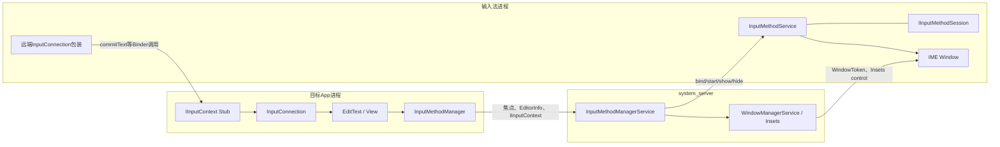
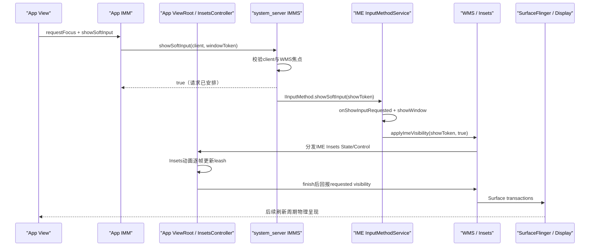

# 232 Android IMMS、InputMethodService与软键盘显示输入隐藏完整链

> 源码版本：Android 11 / `android-11.0.0_r48`  
> 学习方式：macOS只读核源，不编译、不运行AOSP

## 1. 本章要解决什么

用户点进一个`EditText`，软键盘出现；点击一个字母，文字进入编辑框；按返回键，键盘消失。表面只有三个动作，内部却横跨App、`system_server`和输入法三个进程。

本章要回答：

```text
谁决定哪个View是当前编辑器？
InputConnection为什么不是“输入法对象”？
IMMS怎样防止后台App冒充前台输入目标？
输入法服务、输入会话和IME窗口分别是什么？
showSoftInput返回true时，键盘究竟走到了哪一步？
输入法按键怎样反向写回App中的Editable？
```

## 2. 先记住一句总纲

IME系统不是“App直接弹出一个键盘View”，而是：

```text
App把编辑器协议交给系统
→ 系统选择并连接可信IME
→ IME在自己的进程创建TYPE_INPUT_METHOD窗口
→ Insets控制链显示这个窗口
→ IME通过InputConnection协议把编辑命令写回App
```

## 3. 三个进程、两条主方向



方向一是“App → 系统 → IME”：建立输入、显示/隐藏键盘。

方向二是“IME → App”：读取光标附近文本、设置组合文本、提交字符、执行编辑器动作。

## 4. 五个对象不要混为一谈

| 对象 | 所在进程 | 作用 |
|---|---|---|
| `InputMethodManager`（IMM） | App | 跟踪served View，发起start/show/hide，保存当前IME session |
| `InputMethodManagerService`（IMMS） | system_server | 验证调用方，选择/绑定IME，管理客户端、会话与可见请求 |
| `InputMethodService`（IMS） | IME | 输入法应用实现的Service基类，创建键盘UI并处理输入生命周期 |
| `InputConnection` | App | 当前编辑器向IME暴露的“编辑协议” |
| `IInputMethodSession` | IME，Binder句柄交给App | 每个IME客户端会话的事件/状态通道，尤其承接输入事件与编辑状态通知 |

`InputConnection`不是网络连接，也不是IME窗口；它是“如何编辑当前文本”的接口。

## 5. 本章源码地图

客户端主线：

```text
frameworks/base/core/java/android/view/inputmethod/InputMethodManager.java
frameworks/base/core/java/android/view/inputmethod/InputConnection.java
frameworks/base/core/java/com/android/internal/view/IInputConnectionWrapper.java
frameworks/base/core/java/com/android/internal/view/IInputContext.aidl
```

系统服务主线：

```text
frameworks/base/services/core/java/com/android/server/inputmethod/
    InputMethodManagerService.java
frameworks/base/core/java/com/android/internal/view/
    IInputMethodManager.aidl
    IInputMethodClient.aidl
    IInputMethodSession.aidl
```

IME与窗口主线：

```text
frameworks/base/core/java/android/inputmethodservice/InputMethodService.java
frameworks/base/core/java/android/inputmethodservice/IInputMethodWrapper.java
frameworks/base/services/core/java/com/android/server/wm/ImeInsetsSourceProvider.java
```

## 6. 第一个起点不是showSoftInput，而是焦点

只有当前窗口中的目标View成为served View，IMM才会把它当作编辑器。

`showSoftInput(view, ...)`调用前会执行`checkFocus()`；若这个View不是当前served对象，就直接返回false。

因此常见失败：View还没attach、Window还没获得焦点，或者刚调用`requestFocus()`但焦点同步尚未完成，就立即请求显示键盘。

## 7. Window焦点和View焦点是两层资格

View获得局部焦点，并不自动证明它所属窗口是系统当前IME目标。

系统还要结合WMS记录的窗口焦点，防止后台窗口仅靠伪造View状态抢输入法。

可以把资格理解为：

```text
View层：谁是这个View树里的编辑器？
Window层：谁是系统认可的IME目标窗口？
```

## 8. `canStartInput()`的含义

IMM检查served View通常要求它的Window拥有焦点；Android 11源码也为Autofill UI显示场景保留例外。

这说明“输入上下文是否能开始”与“一个View对象是否存在”不是同一个问题。

## 9. `startInputInner()`为何先取出View再释放锁

入口：

```java
boolean startInputInner(@StartInputReason int startInputReason,
        @Nullable IBinder windowGainingFocus, ...)
```

源码先在`mH`锁中取得served View，然后释放锁，再调用View代码。

原因是`View.onCreateInputConnection()`属于应用代码，可能复杂、重入或触发新的焦点变化；持有IMM内部锁调用它容易死锁并放大锁竞争。

## 10. 为什么必须回到View自己的线程

`startInputInner()`检查：

```java
Handler vh = view.getHandler();
if (vh.getLooper() != Looper.myLooper()) {
    vh.post(() -> mDelegate.startInput(startInputReason, null, 0, 0, 0));
    return false;
}
```

创建`InputConnection`会读取或操作View状态，必须在驱动该View树的Looper上执行。

这里返回false不是永久失败，而可能只是“本次调用已转投正确线程”。

## 11. 没有Handler意味着什么

如果`view.getHandler()`为null，通常说明View已脱离窗口或状态已改变。

IMM会关闭当前输入，避免旧IME继续停留在屏幕上却没有有效编辑器。

## 12. EditorInfo是谁填写的

IMM先创建`EditorInfo`并填入框架可以确认的字段：

```java
EditorInfo tba = new EditorInfo();
tba.packageName = view.getContext().getOpPackageName();
tba.autofillId = view.getAutofillId();
tba.fieldId = view.getId();
InputConnection ic = view.onCreateInputConnection(tba);
```

随后具体View会继续填充`inputType`、`imeOptions`、初始选区等编辑器信息。

## 13. 为什么是`getOpPackageName()`

源码注释明确：系统要检查上报包名与调用UID是否一致。

这不是仅供IME显示提示的字符串，它进入了system_server的安全校验。

## 14. EditorInfo与InputConnection的区别

`EditorInfo`是本次输入开始时的描述快照，例如：

```text
这是文本、数字还是密码字段
Enter键显示“搜索”“下一步”还是“完成”
初始选区在哪里
编辑器属于哪个package/field
```

`InputConnection`是持续可调用的操作接口，例如：

```text
读取光标前文本
设置composing text
提交最终文本
删除周围字符
移动选区
执行editor action
```

## 15. `onCreateInputConnection()`可以返回null

返回null表示这个View当前没有提供文本编辑协议。

Window仍可向系统报告焦点，但不会形成可供IME编辑的文本连接。这也是“窗口焦点存在”和“文本输入已建立”必须分开的原因。

## 16. 释放锁后为什么还要二次核对

调用应用代码期间，用户可能点了另一个View。

IMM重新进入锁后检查：

```java
if (servedView != view || !mServedConnecting) {
    return false;
}
```

这是一种典型的“锁外调用 + 锁内版本复核”。否则旧View晚返回的InputConnection可能覆盖新焦点。

## 17. INITIAL_CONNECTION不是“第一次显示键盘”

当`mCurrentTextBoxAttribute == null`时，IMM添加`INITIAL_CONNECTION`。

它描述输入连接的初始/重启语义，不描述IME窗口是否第一次可见。

## 18. 旧InputConnection为什么要deactivate

切换编辑器时，旧`ControlledInputConnectionWrapper`调用`deactivate()`，最终关闭连接。

之后IME即使保留旧Binder句柄，调用`commitText()`也会因为连接inactive而被拒绝，避免文字写入已失焦页面。

## 19. `ControlledInputConnectionWrapper`是什么

它继承`IInputConnectionWrapper`，把App内的普通`InputConnection`包装成`IInputContext` Binder端点。

其`isActive()`同时要求：

```java
return mParentInputMethodManager.mActive && !isFinished();
```

所以“Binder对象还活着”并不代表编辑连接仍有效。

## 20. InputConnection方法运行在哪个线程

如果具体InputConnection实现了`getHandler()`，IMM使用它的Looper；否则退回View Handler的Looper。

于是IME进程发来的Binder调用不会直接在App Binder线程池随意修改View，而会被`IInputConnectionWrapper`转成Message，投递到指定Looper。

## 21. missingMethods是兼容能力表

IMM通过`InputConnectionInspector.getMissingMethodFlags(ic)`记录实现缺失的方法。

系统把这些位传给IME，避免新IME把旧应用未实现的接口误当作可用能力。

跨显示且无法建立坐标变换时，IMMS还会把`REQUEST_CURSOR_UPDATES`标为缺失，防止光标锚点坐标被误用。

## 22. App进入system_server的主Binder调用

IMM调用：

```java
mService.startInputOrWindowGainedFocus(
        startInputReason, mClient, windowGainingFocus,
        startInputFlags, softInputMode, windowFlags,
        tba, servedContext, missingMethodFlags, targetSdkVersion);
```

这里同时提交窗口身份、客户端Binder、EditorInfo和IInputContext。

## 23. 为什么把“窗口获得焦点”和“开始文本输入”合在一个入口

同一次焦点切换可能只有Window变化，也可能同时有文本编辑器可用。

IMMS统一处理后，才能按`softInputMode`、前后窗口、是否文本编辑器和targetSdk进行一致决策。

## 24. IMMS第一道检查：WindowToken不能为null

无WindowToken就没有可验证的系统窗口身份，也无法建立IME target和show/hide归属。

因此入口立即返回空结果，而不是仅凭packageName继续。

## 25. 多用户不是取调用方字符串

若`EditorInfo.targetInputMethodUser`与调用用户不同，调用者必须有`INTERACT_ACROSS_USERS_FULL`，且目标用户正在运行。

普通App不能借EditorInfo把输入路由到任意用户的IME。

## 26. IMMS核对客户端登记

App初始化IMM时会向IMMS登记`IInputMethodClient`、`IInputContext`、UID、PID和self-reported display id。

之后每次start/show/hide都不能只相信本次参数，而要回到登记的`ClientState`。

## 27. self-reported display还要与WMS事实核对

Android可有物理屏、虚拟屏和嵌入式ActivityView。

IMMS验证调用UID是否允许出现在所报display，并通过WMS判断客户端是否真是该显示上的IME焦点。

## 28. 最关键的防抢焦点校验

IMMS调用：

```text
WindowManagerInternal.isInputMethodClientFocus(uid, pid, displayId)
```

后台App即使拿着自己的IMM Binder，也不能仅靠调用`showSoftInput()`让系统把当前IME交给自己。

## 29. 包名与UID再次核验

进入`startInputUncheckedLocked()`后：

```java
if (!InputMethodUtils.checkIfPackageBelongsToUid(
        mAppOpsManager, cs.uid, attribute.packageName)) {
    return InputBindResult.INVALID_PACKAGE_NAME;
}
```

App进程填写的EditorInfo仍是非可信输入，system_server必须校验。

## 30. IME显示在哪块屏

`computeImeDisplayIdForTarget()`检查目标显示是否可承载系统装饰和IME。

默认/无效显示回落到默认显示；不支持系统装饰或不满足安全条件的显示也会回落，而不是机械跟随客户端displayId。

## 31. 客户端切换时做什么

若`mCurClient != cs`，IMMS会解绑旧客户端，并在设备interactive时通知新客户端active。

同时序列号`mCurSeq`递增，帮助App拒绝旧的异步绑定结果。

## 32. 三种“已经连接”的快路径

当前IME ID和显示不变时：

```text
已有client session → 直接attachNewInputLocked
已有IME Binder、尚无session → 请求创建session，返回等待session
Service已bind、尚未拿到IME Binder → 返回等待binding
```

这解释了为何startInput可能立即拿到session，也可能异步稍后通过`onBindMethod()`收到。

## 33. InputBindResult不是简单成功/失败

重要结果包括：

```text
SUCCESS_WITH_IME_SESSION
SUCCESS_WAITING_IME_SESSION
SUCCESS_WAITING_IME_BINDING
ERROR_NOT_IME_TARGET_WINDOW
INVALID_PACKAGE_NAME
INVALID_DISPLAY_ID
NO_IME
```

把所有非null结果都当作“键盘已经显示”是错误的。

## 34. 为什么需要sequence

IME Service绑定和session创建都是异步过程。

用户可能在结果回来前切换Activity或View。`mCurSeq`/`mBindSequence`让客户端识别回调是否仍属于当前输入代际。

## 35. 选择哪个输入法

IMMS以当前用户设置中的`mCurMethodId`查`InputMethodInfo`。

该ID通常对应一个实现`android.view.InputMethod` Service的组件，不是任意前台Activity。

## 36. 绑定IME Service的Intent

源码创建：

```java
mCurIntent = new Intent(InputMethod.SERVICE_INTERFACE);
mCurIntent.setComponent(info.getComponent());
```

还附带系统输入法设置入口的`PendingIntent`与客户端标签。

## 37. IME WindowToken何时创建

Service bind成功发起后，IMMS创建`mCurToken`，并让WMS登记：

```java
mIWindowManager.addWindowToken(
        mCurToken, LayoutParams.TYPE_INPUT_METHOD, displayId);
```

IME之后只能用这个系统授予的Token创建输入法窗口。

## 38. 为什么show请求另建dummy token

IME WindowToken证明“这是当前IME服务”。

每次show/hide请求又创建独立token，并映射回发起请求的App Window。源码注释强调它是dummy token，避免IME把客户端WindowToken拿去向App窗口层级注入窗口。

## 39. Service连接只是拿到IInputMethod

`onServiceConnected()`取得`IInputMethod` Binder，记录IME UID，然后发送`MSG_INITIALIZE_IME`。

此时还不等于有了当前客户端session，也不等于输入法窗口已经创建或显示。

## 40. `initializeInternal()`交给IME什么

系统把IME WindowToken、目标displayId和受控的privileged operations接口交给IME。

IME可以通过这些特权操作报告状态或请求系统行为，但系统仍以Token校验它是否是当前IME。

## 41. 为什么每个客户端要创建Session

IMMS为客户端与当前IME创建一对`InputChannel`，再请求IME`createSession()`。

Session把“输入法服务整体生命周期”与“某个App客户端的输入交互”分开。

## 42. InputChannel不是commitText通道

InputChannel主要承载KeyEvent/MotionEvent等输入事件及完成回执。

`commitText()`这类文本编辑命令走`IInputContext` Binder。两条数据路径不能混成一条。

## 43. Session创建完成后的回路

IME回调`onSessionCreated()`后，IMMS：

```text
确认仍是当前IInputMethod
→ 保存SessionState(method/session/channel)
→ attachNewInputLocked()
→ IInputMethodClient.onBindMethod(InputBindResult)
```

如果期间已换IME或换客户端，废弃session并dispose其channel。

## 44. `attachNewInputLocked()`先bindInput

一个IME切换到新客户端时，IMMS先发送`MSG_BIND_INPUT`，把`InputBinding`交给IME。

`InputBinding`包含连接Binder及客户端UID/PID；它描述“当前绑定的是哪个客户端”。

## 45. bindInput与startInput不同

`bindInput()`是客户端级绑定。

`startInput()`是编辑器级开始。一个客户端内从搜索框切到消息框，可以仍是同一个bind，却发生新的start/restart input。

## 46. startInputToken解决什么问题

每次attach新输入时，IMMS创建新的`startInputToken`，记录它对应的目标窗口，并加入启动历史。

IME收到start时先通过privileged operations报告该Token，使系统可校验异步报告属于哪次输入启动。

## 47. IMMS怎样调用IME的startInput

主线程消息最终执行：

```java
session.method.startInput(startInputToken, inputContext,
        missingMethods, editorInfo, restarting, shouldPreRenderIme);
```

`inputContext`正是App侧`ControlledInputConnectionWrapper`的Binder接口。

## 48. IME侧startInput进入哪里

`IInputMethodWrapper`把Binder调用切到IME主线程，再进入`InputMethodService.InputMethodImpl.dispatchStartInputWithToken()`。

它根据`restarting`调用`startInput()`或`restartInput()`，最终触发输入法开发者熟悉的：

```text
onStartInput(EditorInfo, restarting)
onStartInputView(EditorInfo, restarting)
```

后者只有输入View真正开始时才发生。

## 49. `getCurrentInputConnection()`拿到的是什么

IME侧获得的是对App编辑器的远端包装，不是App View对象。

输入法不能跨进程直接持有`EditText`，只能通过InputConnection协议读取有限文本上下文并提交编辑命令。

## 50. 建立输入与显示键盘是两条相关状态机

可以建立InputConnection但不显示IME，例如硬件键盘存在、窗口策略要求隐藏，或仅报告文本焦点。

也可能已记录show请求，但IME Service尚在绑定，窗口暂时还没有出现。

## 51. `softInputMode`在哪里起作用

IMMS在窗口焦点变化时读取Window的`softInputMode`：

```text
STATE_UNSPECIFIED
STATE_UNCHANGED
STATE_HIDDEN / ALWAYS_HIDDEN
STATE_VISIBLE / ALWAYS_VISIBLE
ADJUST_RESIZE等adjust策略
```

它结合前向导航、是否真正文本编辑器、targetSdk和大屏/resize条件决定自动show/hide。

## 52. `STATE_VISIBLE`不是无条件显示

Android 11会检查目标窗口是否确实声明并获得文本编辑器焦点。

新版目标应用不能仅靠一个窗口属性，让非编辑窗口在获得焦点时任意拉起IME。

## 53. 为什么先start input再show

键盘显示后必须知道当前EditorInfo和InputConnection，才能选择布局、动作键和提交目标。

因此新窗口需要显示时，IMMS通常先建立输入，再发show；若需要隐藏旧IME，则会先处理旧窗口隐藏，避免显示状态串到新目标。

## 54. App显式调用`showSoftInput()`

客户端代码先做display fallback、`checkFocus()`和served View校验：

```java
if (!hasServedByInputMethodLocked(view)) {
    return false;
}
return mService.showSoftInput(
        mClient, view.getWindowToken(), flags, resultReceiver);
```

所以传入同窗口里另一个尚未served的View也可能失败。

## 55. IMMS如何验证show调用

若调用client不是当前`mCurClient`，IMMS不会立即允许，而是从已登记客户端中查找，并向WMS确认它当前确有IME焦点。

这允许“输入尚未完全建立但窗口已经获得焦点”的合法竞态，同时挡住后台客户端。

## 56. show标志怎样记账

`showCurrentInputLocked()`先设置`mShowRequested=true`。

标志规则：

```text
SHOW_FORCED → explicitly requested + forced
没有SHOW_IMPLICIT → explicitly requested
SHOW_IMPLICIT → 仅隐式请求
```

这些账会决定后续某种hide请求能不能抵消本次show。

## 57. 无障碍可以请求不显示软键盘

若`mAccessibilityRequestingNoSoftKeyboard`为true，IMMS拒绝show。

因此只从App/IME两端排查“为什么不弹键盘”可能漏掉系统策略层。

## 58. `mCurMethod != null`才真正派发show

IMMS拿到当前IME Binder后，才发送`MSG_SHOW_SOFT_INPUT`。

若Service仍在连接，可保留show requested；连接超时还可能强制unbind/rebind，但当前调用未必返回true。

## 59. show返回true准确表示什么

在r48中，当`mCurMethod != null`且消息被安排给IME时，IMMS设`mInputShown=true`并返回true。

它不保证：

```text
IME已经处理消息
IME接受onShowInputRequested
IME窗口已draw
Insets动画已完成
SurfaceFlinger已present该帧
```

## 60. 为什么可见时再做一次Service bind

IMMS用`mVisibleConnection`和更高的可见绑定优先级再次绑定当前IME Service。

这不是第二个IME实例，而是让进程管理知道当前IME对用户可见；隐藏时会撤销这层visible bind。

## 61. show消息在哪个线程执行

IMMS用Handler消息把操作放到自己的主线程，再通过`IInputMethod.showSoftInput()`跨Binder进入IME。

IME侧`IInputMethodWrapper`再投递到IME主线程，最终调用`InputMethodService.InputMethodImpl.showSoftInput()`。

## 62. 为什么每次show有showInputToken

IMMS创建token并记录`showInputToken → app windowToken`。

IME把该token带回`applyImeVisibility()`，system_server即可验证“这次可见请求是否仍属于当前合法目标”，避免过期IME请求操作新窗口。

## 63. IME可以拒绝show

`InputMethodService`调用：

```java
if (dispatchOnShowInputRequested(flags, false)) {
    showWindow(true);
    applyVisibilityInInsetsConsumerIfNecessary(true);
}
```

输入法的`onShowInputRequested()`可以根据硬件键盘、配置或自身策略返回false。

## 64. `showWindow(true)`做了哪些准备

大致顺序：

```text
防重入
→ prepareWindow：初始化、fullscreen模式、创建输入/候选View
→ startViews：必要时onStartInputView
→ 更新IME window status
→ onWindowShown
→ mWindow.show()请求IME窗口绘制
```

这仍是窗口和绘制请求阶段，不是硬件present确认。

## 65. IME UI什么时候创建

`prepareWindow()`第一次需要时调用`onCreateCandidatesView()`；输入View则由标准视图初始化/更新流程按需创建。

输入法Service已启动不等于键盘View早已完整创建。

## 66. `onStartInput()`与`onStartInputView()`的先后

先建立编辑器时触发`onStartInput()`。

只有决定显示输入View并开始它时，才触发`onStartInputView()`。因此输入法业务不要假设每次`onStartInput()`后键盘一定可见。

## 67. Android 11新Insets模式如何接管IME可见性

当新Insets模式启用，IMS调用privileged operation：

```java
mPrivOps.applyImeVisibility(showOrHideToken, setVisible);
```

system_server把请求交给WMS/IME Insets控制目标，随后走第230、231章的`ImeInsetsSourceConsumer`和动画控制链。

## 68. 旧模式与新模式的hide差异

`hideWindow()`中：

```text
新Insets模式 → Insets API负责client/server visibility，不直接mWindow.hide()
旧模式 → InputMethodService直接mWindow.hide()
```

所以看到`hideWindow()`没有调用`mWindow.hide()`，不能误判为Android 11键盘无法隐藏。

## 69. 从show到屏幕出现的完整时序



图中最早的true与最后的物理呈现之间，隔着多个进程、线程和帧边界。

## 70. ResultReceiver也不是present fence

IME处理show/hide后，根据处理前后`isInputViewShown()`等逻辑返回：

```text
RESULT_SHOWN
RESULT_HIDDEN
RESULT_UNCHANGED_SHOWN
RESULT_UNCHANGED_HIDDEN
```

它描述IME观察到的窗口/输入View状态变化，不是SurfaceFlinger硬件present时间戳。

## 71. hide客户端先校验WindowToken

`hideSoftInputFromWindow()`要求当前served View存在，且其WindowToken与调用参数完全相同。

旧Activity保存的token无法随意隐藏新Activity正在使用的IME。

## 72. HIDE_IMPLICIT_ONLY的精确语义

如果本次IME由显式请求或forced请求显示，带`HIDE_IMPLICIT_ONLY`的隐藏请求会被拒绝。

它适合取消自动弹出的键盘，不适合推翻用户/应用明确要求的显示。

## 73. HIDE_NOT_ALWAYS的精确语义

若当前是`SHOW_FORCED`，带`HIDE_NOT_ALWAYS`的请求不会隐藏。

注意r48历史标志的行为与后续Android版本可能变化，读其他版本时要重新核源。

## 74. 为什么`mInputShown`和`mImeWindowVis`会短暂不一致

`mInputShown`在IMMS安排show消息时已更新；`mImeWindowVis`要等IME进程异步报告。

源码注释说明，为兼容自Eclair以来的行为，只要`mInputShown`或IME_ACTIVE表明可能显示，就接受hide请求。

## 75. hide怎样进入IME

IMMS创建`hideInputToken`并发送`IInputMethod.hideSoftInput()`。

IME侧先调用`applyVisibilityInInsetsConsumerIfNecessary(false)`，非pre-render路径清理show flags并执行`doHideWindow()`。

## 76. hide立即清哪些system_server状态

IMMS撤销visible bind，并清理：

```text
mInputShown
mShowRequested
mShowExplicitlyRequested
mShowForced
```

但这依然可能早于IME处理IPC、Insets动画和屏幕呈现完成。

## 77. 输入法点击字母后走哪条路

键盘View的按键逻辑通常调用：

```java
getCurrentInputConnection().commitText(text, 1);
```

IME持有的远端包装把它转为`IInputContext.commitText()` Binder调用，进入App的`IInputConnectionWrapper`。

## 78. `commitText()`为什么不会在Binder线程直接改View

App侧Stub收到请求后：

```java
dispatchMessage(obtainMessageIO(DO_COMMIT_TEXT,
        newCursorPosition, text));
```

目标Looper处理`DO_COMMIT_TEXT`时再次检查连接active，然后调用真实`InputConnection.commitText()`。

## 79. 真实TextView如何修改Editable

TextView对应的`EditableInputConnection`/`BaseInputConnection`会处理组合区、替换文本与新光标位置。

修改Editable可能触发TextWatcher、布局和下一帧绘制；因此`commitText()`返回也不等于字符像素已经present。

## 80. composing text与commit text不同

拼音输入“zhong”时，IME可不断调用`setComposingText()`更新尚未确认的组合区。

用户选中“中”后再`commitText()`或结束组合。编辑器必须保留组合span语义，而不能把每次候选更新都当作最终文本。

## 81. editor action不是一定提交换行

键盘右下角“搜索/发送/完成”可能调用`performEditorAction()`。

App侧TextView会根据监听器和输入配置处理它；只有没有被业务消费且配置允许时，才可能退化为Enter/换行逻辑。

## 82. 文字回写完整时序

```mermaid
sequenceDiagram
    participant K as "IME键盘View"
    participant IMS as "InputMethodService"
    participant RIC as "远端InputConnection"
    participant STUB as "App IInputContext Stub"
    participant LOOP as "编辑器Looper"
    participant EIC as "EditableInputConnection"
    participant TV as "TextView / Editable"
    K->>IMS: 用户选择字符“中”
    IMS->>RIC: commitText("中", 1)
    RIC->>STUB: Binder IInputContext.commitText
    STUB->>LOOP: post DO_COMMIT_TEXT
    LOOP->>LOOP: 检查connection仍active
    LOOP->>EIC: commitText
    EIC->>TV: 替换组合区、移动光标
    TV-->>TV: TextWatcher / layout / draw
```

## 83. 查询文本为何常有异步回调

IME可能调用`getTextBeforeCursor()`、`getSelectedText()`等。

跨进程不能直接同步共享Editable对象；r48内部接口把查询投递到编辑器Looper，再用结果callback回IME，避免在错误线程读文本。

## 84. 密码字段的安全边界

IME本来就处在高度敏感的位置，可以接收当前编辑器协议和输入事件。

系统通过用户明确启用IME、当前IME选择、UID/WindowToken/焦点校验限制参与者；但用户仍应只启用可信输入法。`FLAG_SECURE`主要限制截图，并不能让IME无法看到用户在密码编辑器中的输入。

## 85. IME进程死亡会怎样

Binder调用可能抛`RemoteException`，IMMS的ServiceConnection也会断开。

系统清理当前method/session/channel并按当前焦点重新连接；App侧不能把一次拿到的`IInputMethodSession`当作永久对象。

## 86. App进程死亡会怎样

IMMS给客户端Binder注册死亡通知。

客户端死亡后移除`ClientState`、解绑输入并释放相关session/InputChannel，避免IME继续向不存在的编辑器发送命令。

## 87. 切换View时为何旧输入偶尔“晚到”

链路中有多个异步队列：App View Looper、App Binder线程、system_server主线程、IME Binder线程、IME主线程。

框架用served View复核、sequence、start/show/hide token、active connection和当前method Binder身份多重过滤过期消息。

## 88. 五个“完成”时刻

| 时刻 | 只能说明什么 |
|---|---|
| `startInputInner()`返回 | 本轮客户端启动逻辑已同步处理或已转投线程 |
| `InputBindResult.SUCCESS_WITH_IME_SESSION` | 客户端拿到当前IME session |
| `showSoftInput()`返回true | IMMS已接受并安排给当前IME |
| ResultReceiver收到`RESULT_SHOWN` | IME处理后观察到输入View状态已变为shown |
| Insets动画finish / Surface present | 动画逻辑结束 / 像素在后续显示周期真实呈现 |

这些时刻不能互相替代。

## 89. 常见误解一：`requestFocus()`后立即show一定成功

不一定。Window焦点、served View更新、InputConnection创建和IME绑定都可能仍在异步推进。

应优先让窗口生命周期与Insets API表达可见意图，而不是用固定延时猜系统状态。

## 90. 常见误解二：IME通过KeyEvent输入所有字符

现代软键盘主要通过InputConnection的composing/commit协议编辑文本。

KeyEvent仍用于硬件按键、兼容路径或特定控制键，但把中文候选输入理解成一串模拟KeyEvent会丢失组合文本语义。

## 91. 常见误解三：InputMethodService运行在system_server

通常不是。它是被选中输入法应用中的Service，运行在IME应用进程。

IMMS才在system_server，负责仲裁与桥接。

## 92. 常见误解四：IME Window是目标Activity的子View

不是。IME拥有独立`TYPE_INPUT_METHOD`窗口和Surface层级，由WMS按照IME target、Insets和动画进行定位。

它覆盖/挤压目标窗口，但不加入目标Activity的View树。

## 93. 常见误解五：hide返回后布局已恢复

hide请求接受、IME状态清理、Insets动画逐帧变化、App重新布局和最后一帧present之间仍有距离。

依赖键盘高度的业务应观察WindowInsets/animation回调，而不是只看hide方法布尔返回值。

## 94. 一条实用排查分层

```text
层1：View真有焦点且已attach吗？
层2：Window是WMS当前IME target吗？
层3：onCreateInputConnection返回非null吗？EditorInfo正确吗？
层4：IMMS是否选到并绑定IME、创建session？
层5：show是否被策略/无障碍/IME自身拒绝？
层6：IME Insets control是否交付、动画是否运行？
层7：Surface是否绘制与present？
```

按层排查比反复调用`showSoftInput()`更有效。

## 95. macOS只读练习一：画出进程边界

执行：

```bash
cd /Users/ninebot/androidSource
rg -n "startInputOrWindowGainedFocus|showSoftInput\(|hideSoftInput\(" \
  frameworks/base/core/java/android/view/inputmethod/InputMethodManager.java \
  frameworks/base/services/core/java/com/android/server/inputmethod/InputMethodManagerService.java \
  frameworks/base/core/java/android/inputmethodservice/InputMethodService.java
```

要求：给每个命中标注App、system_server或IME进程，并标出Binder边界。

## 96. macOS只读练习二：验证线程切换

执行：

```bash
cd /Users/ninebot/androidSource
sed -n '1850,2015p' \
  frameworks/base/core/java/android/view/inputmethod/InputMethodManager.java
sed -n '120,175p' \
  frameworks/base/core/java/com/android/internal/view/IInputConnectionWrapper.java
sed -n '330,352p' \
  frameworks/base/core/java/com/android/internal/view/IInputConnectionWrapper.java
```

要求：解释View Handler、Binder线程与`DO_COMMIT_TEXT`目标Looper各承担什么。

## 97. macOS只读练习三：手推等待binding/session

执行：

```bash
cd /Users/ninebot/androidSource
sed -n '2390,2645p' \
  frameworks/base/services/core/java/com/android/server/inputmethod/InputMethodManagerService.java
```

构造三种状态：`mCurMethod=null`、`mCurMethod!=null但curSession=null`、`curSession!=null`，分别写出返回的InputBindResult和后续回调。

## 98. macOS只读练习四：核对show/hide完成语义

执行：

```bash
cd /Users/ninebot/androidSource
sed -n '3160,3335p' \
  frameworks/base/services/core/java/com/android/server/inputmethod/InputMethodManagerService.java
sed -n '690,760p' \
  frameworks/base/core/java/android/inputmethodservice/InputMethodService.java
sed -n '2080,2265p' \
  frameworks/base/core/java/android/inputmethodservice/InputMethodService.java
```

要求：分别标出“IMMS接受”“IME处理”“Insets可见请求”“窗口状态变化”和“源码没有提供硬件present保证”的位置。

## 99. 自测题

1. 为什么View焦点和WMS确认的IME焦点都需要？
2. EditorInfo与InputConnection各自解决什么问题？
3. 为什么IME的`commitText()`不会直接在App Binder线程修改TextView？
4. `SUCCESS_WAITING_IME_BINDING`与`SUCCESS_WITH_IME_SESSION`有什么不同？
5. `showSoftInput()`返回true为什么不能证明键盘已出现在屏幕上？
6. bindInput、startInput和onStartInputView为何不是同一生命周期？
7. showInputToken与IME WindowToken分别防什么问题？
8. 新Insets模式下`hideWindow()`为什么可能不调用`mWindow.hide()`？

## 100. 自测题答案

1. View焦点确定App内部编辑器，WMS焦点确认系统当前合法目标，两层共同防状态竞态和后台抢占。
2. EditorInfo是编辑器能力/属性快照；InputConnection是持续的双向编辑协议。
3. IInputConnectionWrapper把Binder请求投递到InputConnection指定Handler或View Looper，并在执行前检查active。
4. 前者表示Service接口仍在异步绑定；后者表示当前客户端已拿到可用IME session和必要通道。
5. true只表示IMMS已接受并安排请求，后面还有IME策略、窗口、Insets动画、Surface提交和显示周期。
6. bindInput绑定客户端，startInput绑定当前编辑器，onStartInputView只在输入UI真正开始时触发。
7. WindowToken授权IME创建TYPE_INPUT_METHOD窗口；每次show/hide token把异步可见请求绑定到当前合法App窗口和请求代际。
8. 新模式由WMS/Insets Consumer控制IME Source与leash，直接隐藏Window会绕开统一动画与状态协议。

## 101. 复读后补强：最容易混淆的状态表

| 变量/信号 | 所在侧 | 含义 | 不保证什么 |
|---|---|---|---|
| `mServedView` | App IMM | 当前准备接受IME服务的View | WMS已认可它 |
| `mCurMethod` | IMMS/App IMM | 已拿到当前IME接口或session接口 | IME窗口可见 |
| `mShowRequested` | IMMS/IMS各有同名概念 | 已记录显示意图 | 请求已物理呈现 |
| `mInputShown` | IMMS | 已把show安排给IME的历史状态 | `mImeWindowVis`已同步 |
| `mImeWindowVis` | IMMS | IME上报的ACTIVE/VISIBLE状态 | Insets动画或present完成 |
| requested visibility | Insets客户端/服务端 | 当前控制目标希望显示/隐藏 | Source Surface此刻已到终点 |

同名或近义变量分布在不同进程，阅读时必须写出对象前缀。

## 102. 复读后补强：r48的几个版本边界

- 本章结论以Android 11 r48的新旧Insets并存实现为准，后续版本公开IME Insets API和show/hide限制已有演化。
- r48仍保留`SHOW_FORCED`、`HIDE_IMPLICIT_ONLY`、`HIDE_NOT_ALWAYS`等历史记账，不应把其他版本文档直接套到这里。
- `ResultReceiver`结果来自IME处理前后状态比较，不是WMS或SurfaceFlinger的present回执。
- `InputChannel`与`IInputContext`是两条不同通路：前者承载输入事件/session，后者承载文本编辑协议。

## 103. 本章结论

一次软键盘交互由两条相反方向的链闭合：

```text
显示链：
View焦点 → IMM创建EditorInfo/InputConnection
→ IMMS校验并选择/绑定IME → 创建Session与IME WindowToken
→ IMS创建IME窗口 → WMS/Insets动画显示

编辑链：
IME键盘操作 → 远端InputConnection/IInputContext Binder
→ App指定Looper → 真实InputConnection
→ Editable变化 → 布局、绘制与显示
```

真正掌握这一章的标志，不是背出类名，而是任何时候都能回答：当前状态属于哪个进程、哪个对象、哪个请求代际，以及它究竟只保证“请求已受理”，还是已经走到窗口、动画、Surface或物理呈现。

## 104. 下一章预告

下一章继续深入`InputConnection`、`IInputContext`、组合文本、批量编辑、光标锚点和编辑状态同步，专门解释IME与TextView之间的双向编辑协议。
