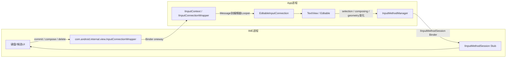
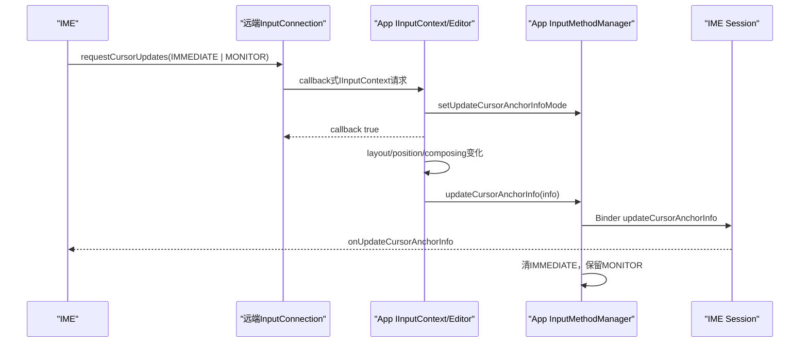

# 233 Android InputConnection、IInputContext与IME文本编辑命令回传链

> 源码版本：Android 11 / `android-11.0.0_r48`  
> 学习方式：macOS只读核源，不编译、不运行AOSP

## 1. 本章要解决什么

第232章已经把“焦点→IME绑定→键盘显示→文字写回”串成总链。本章只盯住其中最容易被低估的一段：IME与编辑器之间的双向协议。

需要回答：

```text
InputConnection为什么看起来像同步Java接口，跨进程后却多数是异步命令？
拼音候选期间的composing text怎样表示？
commitText的newCursorPosition为什么常传1？
删除一个emoji为什么不能总用deleteSurroundingText(1, 0)？
batch edit怎样抑制中间选区和绘制更新？
App怎样把新选区、组合区和光标几何反向通知IME？
图片等富内容如何获得临时URI读取权限？
```

## 2. 一句总纲

`InputConnection`是IME眼中的本地Java接口，背后实际上是：

```text
IME侧同步外观包装
→ oneway IInputContext Binder命令或带callback的查询
→ App侧IInputConnectionWrapper切换到编辑器Looper
→ 真实EditableInputConnection修改TextView/Editable
→ App再通过IInputMethodSession回报选区和光标状态
```

## 3. 绑定完成后，IMMS不在每个字中转

IMMS负责安全仲裁、IME绑定和端点交接。

当前会话建立后，稳定输入数据面主要是两条直接Binder链：



控制面仍由IMMS掌握，但不必让system_server复制每一次文字编辑。

## 4. 三个同名Wrapper先分清

源码中容易看到三个相近名字：

| 类 | 所在侧 | 作用 |
|---|---|---|
| `com.android.internal.view.InputConnectionWrapper` | IME | 把远端`IInputContext`包装成本地`InputConnection`外观 |
| `com.android.internal.view.IInputConnectionWrapper` | App | `IInputContext.Stub`，把Binder请求投递到真实InputConnection的Looper |
| `android.view.inputmethod.InputConnectionWrapper` | App/库代码 | 普通装饰器，把调用委托给另一个本地InputConnection |

本章前两个是跨进程主角，第三个通常只是应用内代理。

## 5. 源码地图

```text
frameworks/base/core/java/android/view/inputmethod/InputConnection.java
frameworks/base/core/java/com/android/internal/view/IInputContext.aidl
frameworks/base/core/java/com/android/internal/view/InputConnectionWrapper.java
frameworks/base/core/java/com/android/internal/view/IInputConnectionWrapper.java
frameworks/base/core/java/android/view/inputmethod/BaseInputConnection.java
frameworks/base/core/java/com/android/internal/widget/EditableInputConnection.java
frameworks/base/core/java/android/widget/TextView.java
frameworks/base/core/java/android/widget/Editor.java
frameworks/base/core/java/android/view/inputmethod/InputMethodManager.java
```

富内容权限再看：

```text
frameworks/base/core/java/android/view/inputmethod/InputContentInfo.java
frameworks/base/core/java/android/inputmethodservice/InputMethodService.java
frameworks/base/services/core/java/com/android/server/inputmethod/
    InputMethodManagerService.java
    InputContentUriTokenHandler.java
```

## 6. `InputConnection`的协议角色

它不是Editable本身，而是编辑器选择暴露给IME的一组操作。

自定义编辑器可以不用TextView，只要正确实现InputConnection语义、线程约束、选区同步和生命周期。

## 7. 为什么不能把Editable直接给IME

IME通常运行在另一个UID和进程：

```text
Java对象地址不能跨进程共享
Editable不是线程安全远端对象
编辑器必须限制可执行操作和可读取上下文
焦点变化后旧IME句柄必须立即失效
```

协议接口比共享对象更可控。

## 8. `IInputContext`是隐藏Binder协议

AIDL头部直接写着：

```java
oneway interface IInputContext {
    void commitText(CharSequence text, int newCursorPosition);
    void setComposingText(CharSequence text, int newCursorPosition);
    ...
}
```

所有方法的Binder事务都是oneway；需要结果的方法额外携带callback Binder。

## 9. oneway准确意味着什么

调用方把事务排入目标进程Binder队列后即可返回，不等待目标方法执行结束。

它不保证：

```text
App Binder线程已经收到
编辑器Looper已经处理Message
真实InputConnection仍active
Editable修改成功
UI完成布局绘制
字符像素已经present
```

## 10. 为什么InputConnection Java方法仍返回boolean

公开接口历史上定义了boolean成功值；同进程实现可以给出真实结果。

跨进程包装却无法从oneway命令同步取得真实返回值，因此往往在Binder调用未抛`RemoteException`时就返回true。

## 11. `commitText()`的IME侧实现

```java
public boolean commitText(CharSequence text, int newCursorPosition) {
    try {
        mIInputContext.commitText(text, newCursorPosition);
        notifyUserActionIfNecessary();
        return true;
    } catch (RemoteException e) {
        return false;
    }
}
```

这里的true更准确地读作“远端命令已成功发出”，不是“编辑器确认提交完成”。

## 12. 哪些操作属于单向写命令

典型包括：

```text
commitText / setComposingText / finishComposingText
setSelection
deleteSurroundingText
beginBatchEdit / endBatchEdit
performEditorAction / performContextMenuAction
sendKeyEvent / performPrivateCommand
```

它们在r48的远端包装中通常不等待编辑器结果。

## 13. 哪些操作必须把结果送回来

典型包括：

```text
getTextBeforeCursor / getTextAfterCursor
getSelectedText / getCursorCapsMode
getExtractedText
requestCursorUpdates
commitContent
```

AIDL仍是oneway，但参数带`I...ResultCallback`；App处理后通过另一次Binder回调返回值。

## 14. 查询为什么不能永久等

App编辑器Looper可能繁忙、卡死、切换焦点或进程死亡。

IME侧`InputConnectionWrapper`最多等待：

```java
private static final int MAX_WAIT_TIME_MILLIS = 2000;
```

超时或会话取消时返回null/0/false等默认值。

## 15. CancellationGroup解决旧会话等待

IME解绑输入时，关联`CancellationGroup`会`cancelAll()`，唤醒还在等查询结果的线程。

这样切换App后，不必让旧查询白等满2秒，也避免晚回调继续影响新会话。

## 16. 查询结果也可能在超时后到达

`hasValue()`注释明确说明：即使`await()`结束，值仍可能稍后从false变true。

调用者已返回默认值后，晚结果不应再被当成本轮业务的同步答案。

## 17. App侧Stub为什么要Handler

`IInputConnectionWrapper`保存创建时指定的Looper和Handler。

Binder入口只构造Message；若当前线程就是目标Looper可直接执行，否则发送到Handler。

## 18. 为什么不能直接在Binder线程改TextView

TextView、Editable span、Selection、Editor批处理状态与View失效绘制都属于编辑器线程状态。

让任意Binder线程并发写入会造成数据竞争、越界、View线程异常和难以复现的选区错乱。

## 19. dispatchMessage的快路径

```java
if (Looper.myLooper() == mMainLooper) {
    executeMessage(msg);
    msg.recycle();
    return;
}
mH.sendMessage(msg);
```

本地同进程或已经位于目标Looper时可以少一次排队；正常跨进程调用多从Binder线程转投Handler。

## 20. 执行前为何每次检查active

Message排队期间可能已切换编辑器。

大多数case先检查：

```java
if (ic == null || !isActive()) {
    return;
}
```

这是阻止旧IME晚命令写入新页面的最后一道客户端门。

## 21. finishComposingText为什么例外

`DO_FINISH_COMPOSING_TEXT`不检查`isActive()`，只要连接尚未finished且对象存在就允许执行。

源码解释：IME切换客户端后仍需要清理旧编辑器残留的composing状态；这是幂等清理性质的例外。

## 22. closeConnection也允许清理inactive对象

关闭时若真实InputConnection实现了`closeConnection()`就调用，然后把包装中的连接置null并标记finished。

后续普通编辑命令即使到达也无法再取得有效连接。

## 23. TextView什么时候创建EditableInputConnection

`TextView.onCreateInputConnection()`要求：

```text
onCheckIsTextEditor()为true
View enabled
内部文本是Editable
```

然后填EditorInfo并返回`new EditableInputConnection(this)`。

## 24. TextView填了哪些EditorInfo

包括：

```text
inputType、imeOptions、privateImeOptions
actionLabel/actionId、hintText、hintLocales
initialSelStart/initialSelEnd、initialCapsMode
initial surrounding text、target input method user
```

IME据此决定键盘布局和初始状态，不必启动后立刻查询所有信息。

## 25. 多行输入为何通常显示Enter

TextView检测多行inputType后添加`IME_FLAG_NO_ENTER_ACTION`，避免把换行能力错误替换为“完成”等动作键。

EditorInfo不是纯粹由XML原样拷贝，TextView会结合焦点导航和输入类型补充策略。

## 26. EditableInputConnection是什么

它继承`BaseInputConnection`并把`getEditable()`指向`TextView.getEditableText()`。

Base类提供组合span、替换、选区、删除等通用算法；子类补TextView批处理、EditorAction、提取文本、私有命令和光标更新。

## 27. composing text是什么

组合文本是IME正在构造、尚未最终确认的一段文本。

例如拼音输入：

```text
z → zh → zho → zhong → 候选“中”
```

中间串可以不断被替换，并带下划线或特殊样式；它不是五次最终提交。

## 28. 组合区怎样标记

`BaseInputConnection`使用静态`COMPOSING`对象和`SPAN_COMPOSING`标志给Spannable划定区间。

`getComposingSpanStart/End()`通过该marker取得范围。

## 29. 为什么还处理其他SPAN_COMPOSING

IME传入文本可能自带样式span。

`setComposingSpans()`把相关span统一改成`SPAN_EXCLUSIVE_EXCLUSIVE | SPAN_COMPOSING`，并添加框架自己的COMPOSING marker。

## 30. `setComposingText()`的替换目标

若已有组合区，替换整个组合区；否则替换当前selection。

新文本继续带composing标记，所以IME下一次调用能再次整体替换它。

## 31. `commitText()`的替换目标

规则同样优先替换已有组合区，否则替换当前selection；区别是新文本不再被标记为composing。

接口文档把它描述为`setComposingText()`再`finishComposingText()`的效果。

## 32. `finishComposingText()`做什么

它只移除组合标志与样式状态，保留现有文字，并且不应移动光标。

“结束组合”不等于删除未确认文字。

## 33. `setComposingRegion()`做什么

它把已有文本中的`start..end`指定为新的组合区。

Base实现会：

```text
先移除旧组合span
→ 允许start/end倒序并排序
→ 把端点裁到0..length
→ 添加默认组合样式和COMPOSING marker
```

## 34. `newCursorPosition`不是绝对下标

接口约定：

```text
> 0：相对“插入文本末尾 - 1”
<= 0：相对插入起点
```

因此最常见的`1`表示光标放在新文本末尾。

## 35. 为什么不用绝对下标

编辑器的InputFilter可能改变IME提交的文本长度或内容。

相对替换区的语义比IME猜整个文档绝对位置更稳，也明确不支持把光标定位到提交文本内部任意字符。

## 36. 用数字理解newCursorPosition

假设在旧光标位置5插入三字符文本：

```text
newCursorPosition = 1  → 最终在插入文本后，约为8
newCursorPosition = 0  → 最终在插入文本前，约为5
newCursorPosition = -1 → 最终尝试在插入起点前一位，约为4
```

最终还会被裁到`0..content.length()`，并受过滤器实际修改影响。

## 37. Base实现为何先设置Selection再replace

源码先根据旧替换区计算相对位置并设置Selection span，再执行`content.replace(a, b, text)`。

Spannable的span位置会随替换调整，这种顺序可以兼容InputFilter对新文本的修改。

## 38. selection与composing region是两套范围

selection可以是光标（start=end）或选区（start≠end）。

composing region表示IME当前组合范围。两者可以重叠，却不能用一对下标互相替代。

## 39. `setSelection()`不清除组合区

InputConnection文档明确：移动选区不应改变composing region。

若输入法需要结束组合，必须明确调用`finishComposingText()`。

## 40. 越界selection的r48行为

Base实现发现start/end越过文本或小于0时直接忽略，但返回true。

注释认为多半是IME掌握的文本状态已过期，随后需要通过状态更新重新同步。

## 41. deleteSurroundingText从哪里删

它以selection边界为中心，删除选区前`beforeLength`个UTF-16 code unit和选区后`afterLength`个code unit。

若存在composing区，Base实现先把删除基准扩到覆盖整个组合区，避免只删组合区内部一部分造成状态破裂。

## 42. 删除顺序为何要修正下标

先删除前方文本后，后方selection下标会左移。

源码用`deleted`记录前方删除数量，再调整`b`，否则第二次删除会偏右。

## 43. Java字符不是Unicode字符

Java `char`是UTF-16 code unit。许多emoji需要两个char组成一个surrogate pair。

所以“删除1个char”和“删除1个Unicode code point”可能不同。

## 44. emoji删除示例

文本为：

```text
A😀B
```

光标在😀后面时：

```text
deleteSurroundingText(1, 0)
```

按code unit可能只删低代理项，留下损坏的UTF-16；而：

```text
deleteSurroundingTextInCodePoints(1, 0)
```

会沿合法代理对边界删除整个😀。

## 45. code point删除如何防非法代理对

`findIndexBackward/Forward()`逐char识别高低surrogate顺序。

遇到孤立或顺序错误的代理项返回`INVALID_INDEX`，避免跨越非法编码继续删除。

## 46. 长度为负时怎么办

code point版本对before/after使用`Math.max(length, 0)`。

普通code-unit版本只在长度大于0时删除；负数不向相反方向解释。

## 47. `sendKeyEvent()`为什么不是主文字通道

InputConnection文档直接建议：普通文字输入应使用commitText家族，sendKeyEvent主要用于`TYPE_NULL`编辑器或兼容硬件键盘语义。

中文组合、样式与候选确认无法被一串简单KeyEvent完整表达。

## 48. BaseInputConnection的dummy mode

`fullEditor=false`时进入dummy mode，Base类维护一个临时Editable。

提交后尝试把单字符转成普通KeyEvent；不能转换时构造携带字符的特殊KeyEvent，然后清空临时缓冲。

## 49. `performEditorAction()`的默认实现

Base实现把动作转成带`FLAG_EDITOR_ACTION`的Enter down/up事件。

但`EditableInputConnection`覆盖它，直接调用`TextView.onEditorAction(actionCode)`，让TextView处理监听器、next focus、done等语义。

## 50. EditorAction与换行不能画等号

`IME_ACTION_SEARCH`、`SEND`、`NEXT`、`DONE`可能触发业务回调或焦点导航。

只有默认/兼容回退路径才可能模拟Enter，且多行字段通常设置NO_ENTER_ACTION保留换行键。

## 51. completion与correction不同

`commitCompletion()`提交编辑器此前提供的一项完整候选。

`commitCorrection()`描述自动纠错的旧文本、新文本和位置，TextView可用于视觉反馈或记录，不等同于普通commitText。

## 52. 私有命令的边界

`performPrivateCommand(action, data)`允许特定IME和编辑器定义扩展协议。

action必须使用拥有者package前缀；协议本身异步，返回true不证明编辑器理解了该action。

## 53. batch edit解决什么

IME一次候选确认可能包含：

```text
删除旧组合区
插入候选文本
移动选区
结束组合状态
```

若每一步都通知IME、刷新抽取文本和重绘，会产生中间态回调、闪烁和额外Binder流量。

## 54. batch edit允许嵌套

每次`beginBatchEdit()`都要配对一次`endBatchEdit()`。

只有最外层结束时，编辑器才统一执行内容更新、抽取文本回报、选区回报和必要重绘。

## 55. EditableInputConnection的嵌套账

它用`mBatchEditNesting`记录自己对TextView批处理层级的贡献。

大于等于0可begin；close后置为-1，禁止旧连接继续开启或结束批处理。

## 56. closeConnection为何强制补齐end

如果IME漏掉end或异步end尚未到达，直接销毁连接可能让TextView永远停在批处理态。

`closeConnection()`循环结束所有正嵌套，再置-1；迟到的end会被忽略。

## 57. Editor最外层结束时做什么

`Editor.finishBatchEdit()`：

```text
onEndBatchEdit + 结束undo批次
→ 内容变更则updateAfterEdit并reportExtractedText
→ 仅光标变更则invalidateCursor
→ sendUpdateSelection
→ 恢复可能被批处理阻塞的选择手柄
```

## 58. begin/end远端返回值不要依赖

IME侧包装发出oneway调用后直接返回true，无法知道App侧连接是否已关闭。

因此配对责任在IME自身逻辑，不能把远端boolean当作精确嵌套计数查询。

## 59. r48的endBatchEdit返回语义偏差

接口文档说：结束后若仍有嵌套才返回true。

但`EditableInputConnection.endBatchEdit()`只要调用前`mBatchEditNesting > 0`，即使从1减到0也返回true。跨进程包装本来也不会传回该真实值，因此r48上更不能依赖这个boolean判断是否仍在batch中。

## 60. App怎样把selection反向发给IME

TextView的Editor在批处理结束或选区变化后调用：

```java
imm.updateSelection(textView,
        selectionStart, selectionEnd,
        composingStart, composingEnd);
```

这里把普通选区和候选/组合区四个坐标一起发送。

## 61. updateSelection为何先更新本地缓存

IMM比较四个值，没变化就不发Binder。

有变化时先更新`mCursor...`缓存，再调用IME session；源码注释防止IME在`onUpdateSelection()`里反向修改文本却未移动光标时形成重复回调。

## 62. updateSelection走不走IMMS

当前App已经持有`IInputMethodSession`，所以`mCurMethod.updateSelection()`直接跨Binder到IME session。

system_server不必为每次光标移动中转。

## 63. IME收到哪些选区参数

`InputMethodService.onUpdateSelection()`通常收到：

```text
oldSelStart / oldSelEnd
newSelStart / newSelEnd
candidatesStart / candidatesEnd
```

IME据此判断用户是否手动移走光标、组合区是否被编辑器改变，并更新候选UI。

## 64. 选区同步是异步闭环

IME发`setSelection()`或`commitText()`返回时，反向`onUpdateSelection()`可能还没到。

IME必须允许命令和状态回报之间有延迟，不能立即把本地预测当成编辑器权威事实。

## 65. 完整的组合输入时序

```mermaid
sequenceDiagram
    participant UI as "IME候选UI"
    participant RIC as "IME InputConnectionWrapper"
    participant CTX as "App IInputContext Stub"
    participant LOOP as "App编辑器Looper"
    participant EIC as "EditableInputConnection"
    participant ED as "TextView Editor"
    participant SES as "IME IInputMethodSession"
    UI->>RIC: setComposingText("zhong", 1)
    RIC->>CTX: oneway Binder
    RIC-->>UI: true（仅发送成功）
    CTX->>LOOP: DO_SET_COMPOSING_TEXT
    LOOP->>EIC: 替换旧组合区并加SPAN_COMPOSING
    EIC->>ED: 最外层batch结束
    ED->>SES: updateSelection + composing range
    SES-->>UI: onUpdateSelection
    UI->>RIC: commitText("中", 1)
    RIC->>CTX: oneway Binder
    CTX->>LOOP: DO_COMMIT_TEXT
    LOOP->>EIC: 替换组合区并移除组合状态
    ED->>SES: 最终selection/composing=-1回报
```

## 66. `getTextBeforeCursor()`的请求链

IME侧创建一个`Completable.CharSequence`，把callback传给`IInputContext`，然后最多等待2秒。

App编辑器Looper读取真实Editable，再通过callback Binder把结果送回IME，Completable解除等待。

## 67. 查询为什么也要检查active

失焦后把旧编辑器上下文返回给IME既可能误导候选，也扩大隐私暴露。

App侧若连接inactive就回null或0，而不是继续读取旧文本。

## 68. styled text标志

`GET_TEXT_WITH_STYLES`要求保留CharSequence中的span；否则Base实现用`TextUtils.substring()`返回普通文本视图。

IME不需要样式时不应无谓请求复杂span数据。

## 69. getSelectedText何时返回null

Base实现中：无Editable、无有效selection或start=end时返回null。

空字符串与“没有选区”不应随意混用。

## 70. ExtractedText解决什么

全屏输入模式需要IME显示一份较完整的编辑器内容和选区。

`getExtractedText()`可带MONITOR标志；TextView保存request，后续内容变化通过`updateExtractedText()`推送增量或全量状态。

## 71. batch edit为何影响ExtractedText

Editor在批处理中累计`changedStart/End/delta/contentChanged`。

最外层结束才统一report，避免全屏IME看到每个中间替换步骤。

## 72. 光标位置与光标锚点不是一回事

`updateSelection()`只传文本下标。

`CursorAnchorInfo`还包含View到屏幕矩阵、插入标记top/baseline/bottom、可见性、RTL、组合文本和字符边界，可供候选窗贴近光标定位。

## 73. IME怎样请求CursorAnchorInfo

调用：

```text
requestCursorUpdates(CURSOR_UPDATE_IMMEDIATE)
requestCursorUpdates(CURSOR_UPDATE_MONITOR)
或两者按位组合
```

IMMEDIATE要求尽快发一次；MONITOR要求位置变化时持续发送。

## 74. 未知flag为何整单拒绝

`EditableInputConnection.requestCursorUpdates()`计算unknownFlags；只要出现r48不认识的位就返回false。

这避免旧系统误把未来flag当作无害并给出错误能力承诺。

## 75. IMMEDIATE怎样触发一次更新

若TextView不在layout中，源码调用`requestLayout()`，让后续布局/位置监听生成CursorAnchorInfo。

若正在layout，则等待本轮布局结束后的既有位置更新，不再嵌套请求布局。

## 76. Editor怎样构造坐标矩阵

大致为：

```text
TextView自身matrix
→ 加上getLocationOnScreen平移
→ 填入CursorAnchorInfo.Builder
```

随后加入selection、组合文字、每字符bounds和插入标记几何。

## 77. 可见/不可见标志为何可同时存在

插入标记top或bottom可能一部分在可视区域、一部分被裁剪。

源码分别检查两端：只要任一可见就加HAS_VISIBLE_REGION，只要任一不可见也加HAS_INVISIBLE_REGION，因此两位可以同时出现。

## 78. ActivityView跨显示坐标怎么处理

IMM若保存了ActivityView到宿主屏幕的额外矩阵，会用`CursorAnchorInfo.createForAdditionalParentMatrix()`再次变换后再交给IME。

若无法获得可靠跨显示矩阵，上一章看到IMMS会把requestCursorUpdates能力标为缺失。

## 79. IMMEDIATE位何时清除

IMM成功调用IME session的`updateCursorAnchorInfo()`后清掉IMMEDIATE位；MONITOR位保留。

所以IMMEDIATE是一次性需求，MONITOR是持续订阅。

## 80. 光标锚点完整回路



## 81. commitContent解决什么

IME可向编辑器提交图片、贴纸等由`content://` URI表示的内容。

EditorInfo的`contentMimeTypes`先声明编辑器接受哪些类型，双方仍需协作校验MIME与处理结果。

## 82. 为什么不能只把content URI字符串发给App

URI通常属于IME或其ContentProvider，目标App没有读取权限。

直接永久授权又过宽，所以框架使用可take/release的临时只读URI token。

## 83. grant flag触发什么

IME侧远端包装看到`INPUT_CONTENT_GRANT_READ_URI_PERMISSION`时，先调用`InputMethodService.exposeContent()`。

它要求传入InputConnection正是当前连接，然后向IMMS请求创建`IInputContentUriToken`并塞入InputContentInfo。

## 84. IMMS如何防伪造富内容授权

创建token时检查：

```text
URI scheme必须是content
调用IME的WindowToken仍是当前mCurToken
目标package必须等于当前EditorInfo.packageName
IME UID必须真实拥有对源URI进行授权的资格
```

随机IME不能借系统身份把任意Provider内容授权给任意App。

## 85. App何时真正取得权限

编辑器拿到InputContentInfo后调用`requestPermission()`，底层token `take()`才创建permission owner并授予临时只读权限。

使用结束调用`releasePermission()`撤销；只接收对象而不take不等于已经能打开URI。

## 86. commitContent为什么等待回调

与普通文字命令不同，IME需要知道编辑器是否接受富内容，所以包装最多等待2秒的int callback。

但接口文档仍允许编辑器在后台尚未加载内容前就返回true；“接受请求”仍不等于图片已显示。

## 87. missingMethods兼容表

App建立连接时，`InputConnectionInspector`通过反射判断旧实现是否缺少：

```text
getSelectedText、setComposingRegion、commitCorrection
requestCursorUpdates、code-point delete、getHandler
closeConnection、commitContent
```

IME侧包装收到位图后，对不支持的方法直接返回默认值。

## 88. BaseInputConnection为什么被视为全能力

Inspector看到`ic instanceof BaseInputConnection`直接返回0。

因为框架Base类已经给所有当前接口提供默认实现；某些默认实现可能只返回false，但方法本身存在，不属于“旧类缺方法”。

## 89. getHandler能力影响什么

IMM创建App侧Stub时优先采用真实InputConnection的Handler Looper。

若旧实现没有getHandler，则使用served View的Looper。它是线程归属能力，不是IME侧用来获取App Handler对象。

## 90. 连接失效的多层保护

```text
IME侧CancellationGroup取消查询
App侧ControlledInputConnectionWrapper检查IMM active
IInputConnectionWrapper检查finished和真实连接非null
closeConnection清理组合态与batch嵌套
IMM通过served View和binding sequence切换代际
```

异步协议必须依赖多层代际门，而不是假设队列里没有旧消息。

## 91. 常见误解一：commitText返回true等于文字已插入

跨进程时通常只等于oneway Binder未抛异常。

真实App可能已经失焦，Stub稍后会丢弃该命令。

## 92. 常见误解二：composing text只是下划线样式

样式只是表现；核心是可被IME整体替换、与最终提交区分的编辑状态。

清掉视觉下划线却保留错误组合marker，仍会导致下一次替换范围异常。

## 93. 常见误解三：所有下标都是Unicode字符数

多数Selection和`newCursorPosition`基于Java UTF-16下标/code unit。

只有名字明确写`InCodePoints`的删除API按Unicode code point计数，而且复杂emoji字素簇仍可能由多个code point组成。

## 94. code point也不等于用户看到的一个字形

肤色修饰、家庭emoji、国旗和组合音标可能由多个code point构成一个grapheme cluster。

`deleteSurroundingTextInCodePoints(1, 0)`保证不拆surrogate pair，却不保证一次删除完整用户感知字素。

## 95. 常见误解四：batch edit会把修改做成数据库事务

它主要抑制中间通知、重绘和抽取文本回报，不提供失败回滚或ACID保证。

某一步失败不会自动恢复batch开始前的文本。

## 96. 常见误解五：CursorAnchorInfo就是一个Rect

它是带坐标矩阵、selection、组合文本、字符bounds、插入标记与可见性信息的快照。

IME若忽略矩阵，嵌入式显示、缩放或旋转场景的候选窗会错位。

## 97. r48复读发现一：查询超时日志布尔命名反了

IME侧包装写成：

```java
final boolean timedOut = value.await(2000, MILLISECONDS);
...
logInternal(methodName, timedOut, defaultValue);
```

但`await()`文档/实现是“只有真正超时才返回false；正常完成或取消唤醒返回true”。因此普通超时可能被日志写成canceled，取消或中断且无值时反而可能写成didn't respond in 2000 msec。这个问题影响诊断文案，不改变默认值回退本身。

## 98. r48复读发现二：commitCompletion检查错位

IME侧`InputConnectionWrapper.commitCompletion()`先检查：

```java
isMethodMissing(MissingMethodFlags.COMMIT_CORRECTION)
```

它检查的是`commitCorrection`缺失位，而不是completion能力；Inspector甚至没有COMMIT_COMPLETION位，因为该方法是早期接口。结果是某个旧自定义连接若缺commitCorrection，即使能处理commitCompletion，远端包装也会提前返回false。这是r48具体实现瑕疵，不应推广成API设计规则。

## 99. macOS只读练习一：给AIDL方法分类

```bash
cd /Users/ninebot/androidSource
sed -n '20,100p' \
  frameworks/base/core/java/com/android/internal/view/IInputContext.aidl
sed -n '70,460p' \
  frameworks/base/core/java/com/android/internal/view/InputConnectionWrapper.java
```

要求：把方法分成“仅oneway命令”“callback查询”“callback确认”三类，并解释远端boolean的可信范围。

## 100. macOS只读练习二：手算组合区与光标

```bash
cd /Users/ninebot/androidSource
sed -n '620,700p' \
  frameworks/base/core/java/android/view/inputmethod/BaseInputConnection.java
sed -n '780,875p' \
  frameworks/base/core/java/android/view/inputmethod/BaseInputConnection.java
```

用文本`ab[XY]cd`把`XY`视为组合区，分别推演：

```text
setComposingText("zhong", 1)
commitText("中", 1)
commitText("中", 0)
```

写出替换区、组合marker和最终光标相对位置。

## 101. macOS只读练习三：比较两种删除

```bash
cd /Users/ninebot/androidSource
sed -n '210,445p' \
  frameworks/base/core/java/android/view/inputmethod/BaseInputConnection.java
```

用`A😀B`和一个含组合音标/ZWJ的字符串，对比code unit、code point和用户感知字素三层计数，指出源码保证到哪一层。

## 102. macOS只读练习四：闭合反向状态同步

```bash
cd /Users/ninebot/androidSource
sed -n '1690,1770p' frameworks/base/core/java/android/widget/Editor.java
sed -n '1900,1940p' frameworks/base/core/java/android/widget/Editor.java
sed -n '2180,2240p' \
  frameworks/base/core/java/android/view/inputmethod/InputMethodManager.java
sed -n '4430,4540p' frameworks/base/core/java/android/widget/Editor.java
```

要求：说明batch最外层结束、updateSelection去重、CursorAnchorInfo矩阵和IME session直连之间的关系。

## 103. 自测题

1. `IInputContext`是oneway，为什么`getTextBeforeCursor()`还能返回结果？
2. 跨进程`commitText()`返回true准确代表什么？
3. composing region与selection有什么区别？
4. `newCursorPosition=1`为何最常见？
5. code-point删除相对code-unit删除解决了什么，仍没解决什么？
6. batch edit最外层结束时Editor集中做哪些工作？
7. updateSelection为什么直接走App到IME session而不经过IMMS？
8. commitContent临时权限如何避免IME越权授权任意URI？

## 104. 自测题答案

1. 请求事务oneway发送，但携带另一个结果callback Binder；App处理后用反向事务填写IME侧Completable。
2. 通常只代表IInputContext Binder命令成功发出，没有同步获知编辑器实际执行结果。
3. selection是当前光标/选中范围；composing region是IME仍可整体替换的未确认文本范围。
4. 正值相对插入文本末尾减一计算，1恰好把光标放到插入文本之后。
5. 它避免拆开UTF-16 surrogate pair；仍不保证一次删除完整多code-point字素簇。
6. 统一内容更新/重绘、undo批次结束、ExtractedText回报、selection/composing回报和手柄恢复。
7. 建立会话时双方已拿到直接Binder端点，稳定数据面无需system_server逐字中转。
8. IMMS核对当前IME token、当前编辑器package、content scheme和IME对源URI的实际授权资格，再发可take/release的只读token。

## 105. 最容易混淆的“成功”表

| API/状态 | 跨进程时的准确含义 |
|---|---|
| `commitText()`返回true | oneway事务未抛RemoteException |
| App真实`EditableInputConnection.commitText()`返回true | App Looper已经执行通用替换逻辑 |
| `commitContent()`返回true | 编辑器callback表示接受，内容仍可后台加载 |
| `requestCursorUpdates()`返回true | 编辑器接受已知模式，不代表坐标已经回报 |
| `onUpdateSelection()`到达 | App回报新的逻辑文本状态，不代表对应像素present |
| `endBatchEdit()`返回 | 本次结束调用已处理；r48远端/真实boolean都不适合推断精确剩余嵌套 |

## 106. 本章结论

InputConnection协议的难点不在方法数量，而在四个边界：

```text
进程边界：本地Java外观背后是Binder
线程边界：真实编辑必须回到编辑器Looper
代际边界：焦点切换后旧命令和旧查询必须失效
语义边界：文字下标、组合区、选区、code point和字素不能混用
```

掌握本章后，应能看到任意`commitText()`、`setComposingText()`或`updateSelection()`就立刻说清：调用在哪个进程发出、是否等待结果、目标Looper是谁、修改哪个范围、状态如何反向同步，以及返回值究竟证明到哪一步。

## 107. 下一章预告

下一章进入Android输入事件分发与IME协作的另一条数据面，深入`InputChannel`、`InputEventReceiver`、`IInputMethodSession`、输入事件完成回执，以及软键盘文本命令与硬件KeyEvent路径为何不同。
