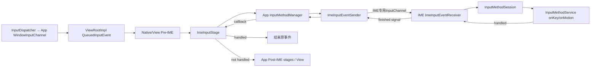
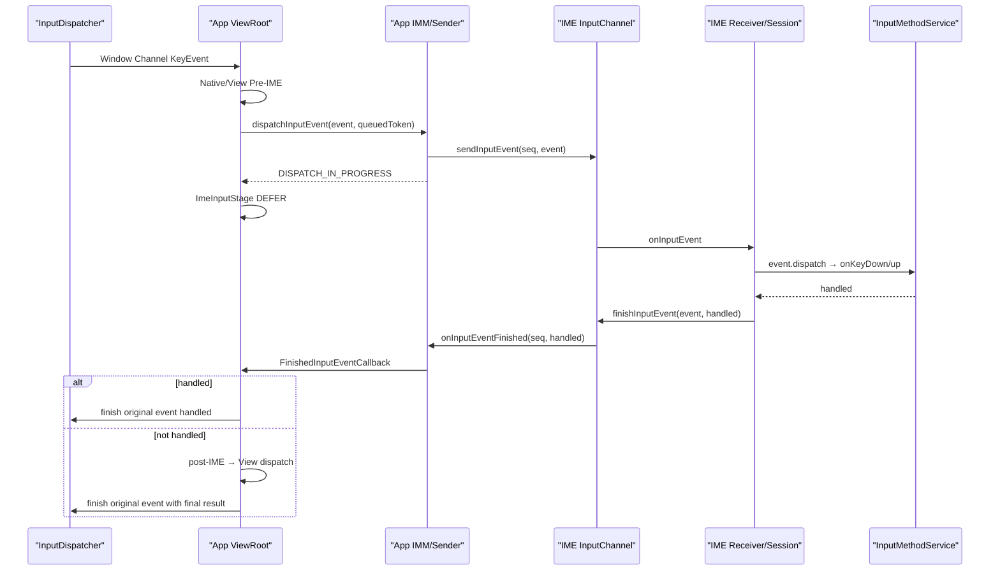
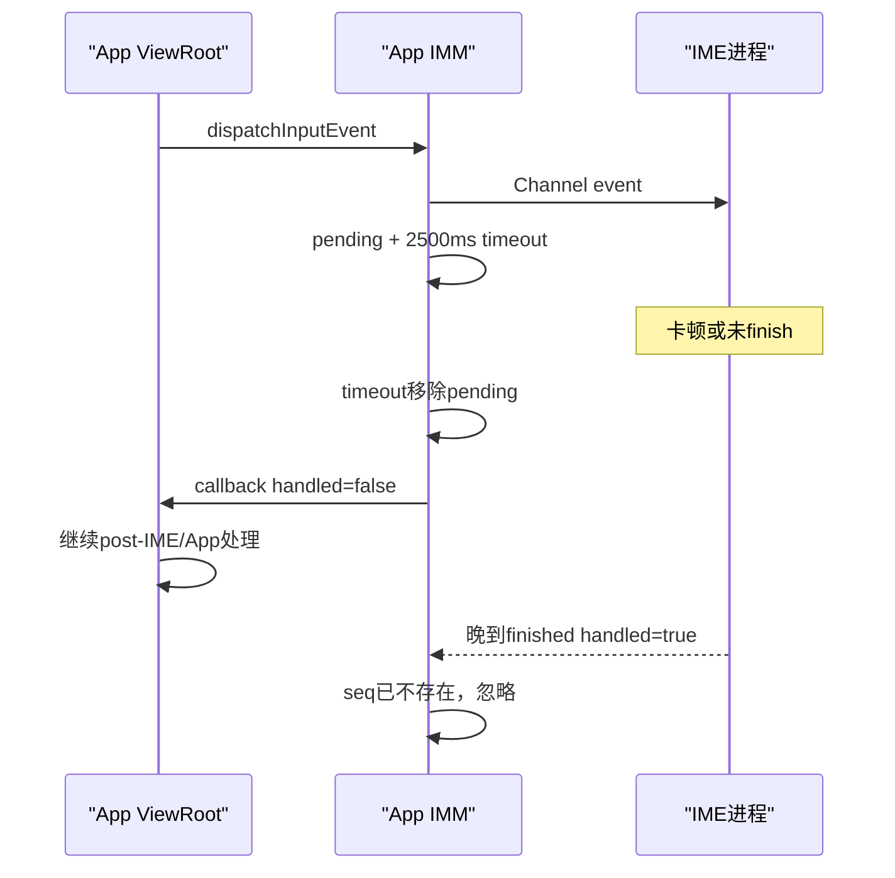

# 234 Android InputChannel、IInputMethodSession与IME输入事件分发完成回执链

> 源码版本：Android 11 / `android-11.0.0_r48`  
> 学习方式：macOS只读核源，不编译、不运行AOSP

## 1. 本章要解决什么

第233章解释了软键盘怎样通过`InputConnection.commitText()`写文字。本章研究另一条链：一个已经送到目标App窗口的硬件KeyEvent，为什么还要先让IME看一眼。

需要回答：

```text
ViewRootImpl把事件送IME之前和之后分别有哪些stage？
为什么原始事件不用IInputMethodSession AIDL逐个传？
专用InputChannel两端怎样创建并交给App和IME？
IME怎样返回handled，App为何必须等待完成回执？
2500ms超时后事件怎样继续？
触摸、trackball、rotary和generic motion哪些会经过IME？
IME反向sendKeyEvent为何不会再次进入IME形成死循环？
```

## 2. 一句总纲

IME输入事件链是目标App输入流水线中的异步过滤阶段：

```text
目标App收到窗口事件
→ View/InputQueue的pre-IME机会
→ IMM经专用InputChannel把事件交给当前IME Session
→ IME主线程决定handled
→ 完成信号沿Channel返回
→ handled则结束，未处理则继续App post-IME分发
```

## 3. 先和文字提交链分开

| 方向 | 数据 | 通道 |
|---|---|---|
| App → IME | 硬件KeyEvent、trackball/部分generic motion | `InputChannel` |
| IME → App | composing/commit/delete/selection命令 | `IInputContext` Binder |
| App → IME | selection、ExtractedText、CursorAnchorInfo等状态 | `IInputMethodSession` Binder |
| IME → App → post-IME | IME模拟/转发KeyEvent | `InputConnection.sendKeyEvent()`，再入ViewRoot |

不要因为都叫“输入”就把四条路径画成一条。

## 4. 总体数据流



## 5. 源码地图

App输入流水线：

```text
frameworks/base/core/java/android/view/ViewRootImpl.java
frameworks/base/core/java/android/view/ImeFocusController.java
frameworks/base/core/java/android/view/inputmethod/InputMethodManager.java
```

会话和IME侧：

```text
frameworks/base/core/java/com/android/internal/view/IInputMethodSession.aidl
frameworks/base/core/java/android/inputmethodservice/IInputMethodSessionWrapper.java
frameworks/base/core/java/android/inputmethodservice/AbstractInputMethodService.java
frameworks/base/core/java/android/inputmethodservice/InputMethodService.java
frameworks/base/core/java/android/inputmethodservice/IInputMethodWrapper.java
```

通道底层桥：

```text
frameworks/base/core/java/android/view/InputChannel.java
frameworks/base/core/java/android/view/InputEventSender.java
frameworks/base/core/java/android/view/InputEventReceiver.java
frameworks/base/core/jni/android_view_InputEventSender.cpp
frameworks/base/core/jni/android_view_InputEventReceiver.cpp
```

## 6. 这里有两对InputChannel

目标窗口本身有一对Window InputChannel，用于InputDispatcher→App ViewRoot。

当前IME Session又有一对专用InputChannel，用于App IMM→IME。原事件先进入App，随后才被App复制/发布到IME通道。

## 7. 为什么不让InputDispatcher直接把同一事件先发IME

是否需要IME、当前IME session是谁、窗口是否有IME焦点、local focus mode和pre-IME View处理都属于目标App/当前绑定状态。

把IME作为ViewRoot流水线中的异步stage，可以保持每个目标窗口自己的顺序和回退语义。

## 8. ViewRoot输入stage顺序

Android 11构建：

```text
NativePreImeInputStage
→ ViewPreImeInputStage
→ ImeInputStage
→ EarlyPostImeInputStage
→ NativePostImeInputStage
→ ViewPostImeInputStage
→ SyntheticInputStage
```

每层可返回forward、finish handled、finish not handled，异步层还可defer。

## 9. NativePreImeInputStage做什么

若根View接管了`InputQueue`且事件是KeyEvent，先交给native activity/input queue，并等待其完成回调。

它不处理pointer event。

## 10. ViewPreImeInputStage做什么

KeyEvent进入：

```java
mView.dispatchKeyEventPreIme(event)
```

因此应用View层在IME之前有一次拦截机会，典型是自定义输入控件观察Back键。

## 11. pre-IME处理true会怎样

事件直接`FINISH_HANDLED`，不会再送当前IME，也不会进入普通View KeyEvent分发。

名字里的pre表示顺序，不表示“仅记录、不能消费”。

## 12. ImeInputStage为何继承AsyncInputStage

事件要跨进程到IME主线程，再等完成信号回来，不能在App UI线程同步阻塞。

返回`DEFER`后，该`QueuedInputEvent`留在异步stage队列，回调到来再继续或结束。

## 13. ImeFocusController先检查资格

若窗口没有`mHasImeFocus`或设置`FLAG_LOCAL_FOCUS_MODE`，直接返回`DISPATCH_NOT_HANDLED`。

local focus窗口自己管理局部焦点，不参加系统IME事件路由。

## 14. 不是所有MotionEvent都送IME

`QueuedInputEvent.shouldSkipIme()`规定：

```java
return event instanceof MotionEvent
        && (event.isFromSource(SOURCE_CLASS_POINTER)
            || event.isFromSource(SOURCE_ROTARY_ENCODER));
```

触屏、鼠标等pointer和rotary encoder从post-IME stage开始，绕过pre-IME与IME链。

## 15. 为什么软键盘不先吃目标App触摸

触摸已经由InputDispatcher按窗口和触摸目标路由。

IME有自己的窗口时会直接收到落在IME窗口上的触摸；目标App窗口内的普通触摸不应再转发给IME过滤。

## 16. 哪些MotionEvent仍可能进入IME

非pointer、非rotary的MotionEvent可进入，例如trackball类或其他generic motion source。

IME侧再按`SOURCE_CLASS_TRACKBALL`区分`onTrackballEvent()`，其他走`onGenericMotionEvent()`。

## 17. FLAG_DELIVER_POST_IME是什么

带此标志的事件直接从`EarlyPostImeInputStage`开始。

它用于已经由IME产生/处理过的事件，避免再次进入pre-IME和IME阶段形成递归。

## 18. IMM的三个dispatch结果

```java
DISPATCH_IN_PROGRESS = -1;
DISPATCH_NOT_HANDLED = 0;
DISPATCH_HANDLED = 1;
```

ImeInputStage把它们映射为DEFER、FORWARD和FINISH_HANDLED。

## 19. SYM键的特殊处理

若是第一次按下`KEYCODE_SYM`，IMM直接显示输入法选择器并返回HANDLED。

该事件不必跨IME专用Channel。

## 20. 没有当前IME session怎么办

IMM的`mCurMethod == null`时返回NOT_HANDLED。

事件继续走App post-IME链，不会为了等待IME绑定而卡住当前按键。

## 21. 专用InputChannel何时创建

IMMS请求客户端session时：

```java
InputChannel[] channels = InputChannel.openInputChannelPair(cs.toString());
```

一端随`createSession()`交给IME，一端保存在MethodCallback，session创建成功后放入`SessionState`并复制给App。

## 22. system_server为何只负责交接

IMMS创建Channel pair并验证IME/客户端身份，之后事件数据直接在App与IME之间走Channel。

system_server不逐个读取、转发KeyEvent，减少Binder和系统服务主线程负担。

## 23. Channel句柄为什么有多次dup/dispose

跨Binder传递InputChannel时接收方获得底层端点的新句柄。

发送方对不再使用的本地Java句柄及时`dispose()`，不会关闭其他进程已复制的有效端点；真正生命周期由各自持有的引用共同决定。

## 24. IME创建Session时做什么

`IInputMethodWrapper.createSession()`切到IME主线程，调用输入法的`onCreateInputMethodSessionInterface()`。

返回的本地`InputMethodSession`和IME端Channel被包装成`IInputMethodSessionWrapper`。

## 25. IInputMethodSession有两个角色

Wrapper同时拥有：

```text
IInputMethodSession.Stub：接App的selection、cursor等Binder状态消息
ImeInputEventReceiver：接专用InputChannel里的原始输入事件
```

AIDL接口本身没有`dispatchKeyEvent()`，原始事件不走这组AIDL方法。

## 26. 为什么AIDL里看不到KeyEvent分发

`IInputMethodSession.aidl`列的是updateSelection、updateCursorAnchorInfo、displayCompletions、private command等控制/状态消息。

Key/Motion数据面由同一个session wrapper所持的InputChannel Receiver承接。

## 27. App拿到哪一端

`InputBindResult`把App端Channel交给IMM。

IMM的`setInputChannelLocked()`保存为`mCurChannel`，第一次发事件时创建`ImeInputEventSender`并绑定IMM主Looper。

## 28. 为什么Sender必须在指定Looper调用

`InputEventSender.sendInputEvent()`文档要求在它绑定的Looper线程调用。

因此`dispatchInputEvent()`若不在IMM主Looper，会发异步Message切回主Looper后再真正send。

## 29. 非IMM线程调用时为何立即返回IN_PROGRESS

它只把`PendingEvent`投递给IMM线程，无法同步知道Channel send是否成功。

最终若send失败，IMM仍通过FinishedInputEventCallback以handled=false回报ViewRoot。

## 30. PendingEvent保存什么

```text
原InputEvent引用
ViewRoot QueuedInputEvent token
发送时的IME id
完成callback及其Handler
handled结果
```

IME id主要用于超时日志，token让回调找回正确的ViewRoot队列项。

## 31. sequence number为何关键

IMM用`event.getSequenceNumber()`作为：

```text
InputEventSender发送seq
mPendingEvents的key
完成信号匹配key
超时Message参数
```

它把异步发送、回执和原事件关联起来。

## 32. Java seq与native dispatcher seq并非总是同一个

`InputEventReceiver`内部还有`mSeqMap`，把Java InputEvent sequence映射到Channel消费侧的dispatcher sequence。

finish时通过映射把正确底层seq交给native，不能仅凭对象地址确认事件。

## 33. `sendInputEvent()`返回true说明什么

InputEventSender文档：整个事件成功写入Channel。

可能因Channel缓冲区在全部样本发布前已满而返回false。true不表示IME已处理，更不表示handled=true。

## 34. send成功后才进入pending表

IMM先发布事件；成功后才：

```text
mPendingEvents.put(seq, pending)
→ 更新trace counter
→ 安排2500ms超时Message
→ 返回IN_PROGRESS
```

发送失败直接NOT_HANDLED，让App继续处理。

## 35. 为什么超时Message是asynchronous

IMM Handler可能存在同步barrier。

输入事件完成和超时不能被UI traversal barrier长期挡住，所以发送/超时相关Message都设为asynchronous。

## 36. r48的IME事件超时是多少

```java
static final long INPUT_METHOD_NOT_RESPONDING_TIMEOUT = 2500;
```

这是App侧等待IME处理一个转发事件的保护门，不等同于所有ANR类型的统一超时。

## 37. 超时后怎么处理

`finishedInputEvent(seq, false, true)`从pending表移除事件，记录IME id日志，然后回调ViewRoot `handled=false`。

ViewRoot把原事件继续送post-IME stages，而不是永久丢弃。

## 38. 迟到回执怎么处理

真正完成信号晚于2500ms到达时，pending表已没有该seq：

```java
if (index < 0) return;
```

它被视为spurious/already timed out，不会第二次完成同一个ViewRoot事件。

## 39. 为什么不能让迟到handled改判

超时后事件可能已经被App处理并产生副作用。

再接受IME迟到的handled=true会造成“一次事件既被App执行，又事后宣称被IME吞掉”的不可逆矛盾。

## 40. Channel更换时怎样清PendingEvent

`setInputChannelLocked()`发现端点变化：

```text
flushPendingEventsLocked
→ dispose旧Sender
→ dispose旧Channel
→ 保存新Channel
```

flush把所有旧事件异步按handled=false完成，使ViewRoot流水线能够继续。

## 41. flush为什么不直接在锁里跑callback

回调可能进入ViewRoot并继续复杂分发。

IMM先发`MSG_FLUSH_INPUT_EVENT`，后续移出pending并在合适Handler执行callback，避免锁内重入。

## 42. PendingEvent池为什么存在

硬件按键/事件频繁创建短命包装对象。

IMM用容量20的`SimplePool`复用PendingEvent，callback运行完后清空字段再回池，减少GC压力。

## 43. callback回哪个线程

ViewRoot调用IMM时传自己的`mHandler`。

IMM完成后若已经位于该Looper可直接run，否则发asynchronous Message回ViewRoot UI线程。

## 44. IME侧Receiver绑定哪个线程

`IInputMethodSessionWrapper`构造：

```java
mReceiver = new ImeInputEventReceiver(
        channel, context.getMainLooper());
```

所以标准IME输入事件回调运行在IME主Looper。

## 45. InputEventReceiver的硬性完成约束

文档明确：接收者处理后必须调用`finishInputEvent()`；在完成前不会收到新的输入事件。

完成回执既是handled结果，也是Channel背压/顺序协议的一部分。

## 46. IME Receiver为何也维护pending表

收到事件后先以seq保存InputEvent，再调用本地InputMethodSession分发。

本地Session可以同步或异步调用`EventCallback.finishedEvent(seq, handled)`；Wrapper届时找回原InputEvent并finish底层Channel。

## 47. Session已finish时收到事件怎么办

若`mInputMethodSession == null`，Receiver立即：

```java
finishInputEvent(event, false);
```

不能把事件悬挂，也不能让已销毁session继续消费。

## 48. KeyEvent怎样进入InputMethodService

默认`AbstractInputMethodSessionImpl.dispatchKeyEvent()`调用：

```java
event.dispatch(AbstractInputMethodService.this,
        mDispatcherState, this);
```

KeyEvent根据action进入Service的`onKeyDown`、`onKeyUp`、`onKeyLongPress`或`onKeyMultiple`。

## 49. DispatcherState做什么

它维护按键跟踪、long press和up事件是否属于此前tracking的down等状态。

IME默认Back处理依赖`startTracking()`和后续`event.isTracking()`，不能只看单个ACTION_UP。

## 50. 默认Back down逻辑

InputMethodService先让全屏ExtractEditText的文本选择ActionMode处理；否则`handleBack(false)`若可处理，就对事件`startTracking()`并返回true。

这一步常只登记追踪，不一定立即隐藏窗口。

## 51. 默认Back up逻辑

若up仍是tracking且未canceled，调用`handleBack(true)`真正执行收起候选/输入View等Back行为。

down被长按、取消或tracking丢失时，不应机械执行隐藏。

## 52. BackDisposition与回调返回值区别

源码文档明确：Android P以后默认`onKeyDown()`实现也不直接考虑`setBackDisposition()`标志。

自定义IME需让自己的Back回调处理与向系统声明的Back disposition保持一致。

## 53. fullscreen模式为何拦DPAD

横屏全屏输入时，IME显示`ExtractEditText`副本。

默认实现让其MovementMethod移动抽取文本光标，并总是吞掉DPAD方向键，避免底层App焦点同时移动到另一个字段。

## 54. 普通非Back KeyEvent默认怎样

非全屏/无特殊movement时，默认`onKeyDown/onKeyUp`通常返回false。

完成信号handled=false，原事件继续进入目标App普通KeyEvent分发。

## 55. trackball事件怎样处理

Receiver检测`SOURCE_CLASS_TRACKBALL`，调用`dispatchTrackballEvent()`，默认进入`InputMethodService.onTrackballEvent()`并返回false。

IME可覆盖它，handled=true时目标App不再处理该事件。

## 56. generic motion怎样处理

其余进入IME Channel的MotionEvent走`dispatchGenericMotionEvent()`和`onGenericMotionEvent()`。

但pointer与rotary前面已被ViewRoot `shouldSkipIme()`过滤，所以不是所有generic motion都会抵达这里。

## 57. local Session回调为何仍带seq

`InputMethodSession.EventCallback.finishedEvent(seq, handled)`允许输入法实现异步完成。

seq保证即使多个合成事件在队列中，完成回调也能匹配正确InputEvent。

## 58. 标准默认实现是同步完成

AbstractInputMethodSessionImpl调用Service回调得到boolean后，立即`callback.finishedEvent(seq, handled)`。

但接口设计允许自定义Session稍后回调，因此Wrapper和App两端都保留pending表。

## 59. IME finishedEvent回到哪里

IME Wrapper从pending表取事件并调用`InputEventReceiver.finishInputEvent(event, handled)`。

Java进入JNI，`InputConsumer.sendFinishedSignal()`把底层published sequence与handled写回Channel发送端。

## 60. App Sender怎样收到完成信号

JNI `InputPublisher.receiveFinishedSignal()`读回publishedSeq和handled，再回调Java：

```java
ImeInputEventSender.onInputEventFinished(seq, handled)
```

IMM据此移除PendingEvent并取消对应超时。

## 61. 正常完成为什么删除超时Message

`finishedInputEvent(... timeout=false)`调用：

```java
mH.removeMessages(MSG_TIMEOUT_INPUT_EVENT, p);
```

超时Message以PendingEvent对象作为obj，避免仅按what误删其他正在等待的事件。

## 62. handled=true回到ViewRoot后

ImeInputStage调用`finish(q, true)`，标记原QueuedInputEvent已处理，沿剩余stage只做完成传播，最终向窗口原InputChannel回执handled。

目标View不会再收到普通`dispatchKeyEvent()`。

## 63. handled=false回到ViewRoot后

ImeInputStage调用`forward(q)`，进入Early/Native/View Post-IME stages。

最终ViewPostImeInputStage才会进行Activity/View层的常规KeyEvent、MotionEvent等分发。

## 64. 完整KeyEvent时序



## 65. 2500ms超时时序



## 66. 2500ms不等于IME ANR弹窗时点

这里的逻辑首先保护当前App ViewRoot流水线并打印warning。

系统是否判定进程ANR还受InputDispatcher、应用/IME进程状态和其他超时机制影响，不能把这一常量直接当成所有IME ANR定义。

## 67. 输入事件完成也不是像素完成

finish只表示逻辑事件已消费或已继续处理。

若处理触发文本变化、窗口隐藏或动画，还要经历layout/draw、Surface提交和显示刷新，事件handled回执不是present fence。

## 68. IInputMethodSession状态消息在哪个线程

AIDL是oneway，Stub入口通过`HandlerCaller`投递到IME主线程。

updateSelection、updateCursorAnchorInfo和displayCompletions不会直接在IME Binder线程调用输入法业务。

## 69. 状态消息和Channel事件是否共享同一个Looper

标准Wrapper的HandlerCaller与ImeInputEventReceiver都面向IME主Looper。

它们来自不同IPC/FD队列，单个Looper串行执行，但跨队列的宏观到达顺序仍应按各自协议与代际理解，不能凭墙上时间猜绝对先后。

## 70. Session enabled/revoked是什么

IMMS切当前Session时先disable旧session、enable新session。

IME本地`AbstractInputMethodSessionImpl`维护`mEnabled/mRevoked`；revoke后永远不能再enable。

## 71. enabled flag是不是Channel硬防火墙

基类注释要求未enabled时不执行调用，但默认`dispatchKeyEvent()`本身没有再检查`isEnabled()`。

实际安全还依赖IMMS只把当前Channel交给正确客户端、切换时关闭/flush端点和finish session。不能把一个boolean当作唯一隔离层。

## 72. finishSession做哪些清理

IME Wrapper将本地session置null，dispose Receiver，再dispose IME端Channel。

此后Binder状态消息直接忽略；若还有事件进入Receiver路径，也不能再交给旧session。

## 73. App侧Channel dispose时机

清除绑定、换session或IME死亡时，IMM flush pending、dispose Sender和旧Channel。

仅把`mCurMethod`置null而遗留旧Sender会造成事件发往过期IME，因此清理必须成组。

## 74. system_server侧finishSession

IMMS调用`IInputMethodSession.finishSession()`，再清空SessionState里的session并dispose自己持有的Channel句柄。

三进程各自都要释放本地引用，不能指望另一个进程GC替自己收尾。

## 75. IME怎样把KeyEvent反向发给App

IME调用当前`InputConnection.sendKeyEvent()`。

它走第233章的`IInputContext` Binder到App编辑器Looper，BaseInputConnection最终调用IMM `dispatchKeyEventFromInputMethod()`。

## 76. 反向KeyEvent为何不走IME Channel

这是IME主动生成的事件，不是App请求IME先判断的原始硬件事件。

App把它送入ViewRoot时设置`FLAG_DELIVER_POST_IME`，直接从post-IME开始，避免：

```text
IME sendKeyEvent
→ ViewRoot再送IME
→ IME再次sendKeyEvent
→ 无限循环
```

## 77. App还会剥离FROM_SYSTEM标志

`ViewRootImpl`发现IME生成事件带`FLAG_FROM_SYSTEM`时主动清除。

第三方IME不能把自己构造的KeyEvent冒充系统硬件事件，从而获得错误信任语义。

## 78. 反向事件有没有原Window InputDispatcher回执

`dispatchKeyFromIme()`以receiver=null把合成事件入App本地队列，主要在App内分发。

它不是原始InputDispatcher正在等待的那一个硬件事件；不要把二者的sequence/完成链混在一起。

## 79. 为什么正常文字输入仍优先commitText

反向sendKeyEvent要经过KeyEvent兼容分发，难以表达中文组合、候选span、富文本和精确光标语义。

它适合`TYPE_NULL`、控制键或需要硬件按键语义的编辑器。

## 80. Back键在三层都可能被处理

```text
View.dispatchKeyEventPreIme
IME InputMethodService.onKeyDown/onKeyUp
App普通post-IME KeyEvent分发
```

前一层handled就不进入后一层。排查Back行为必须标明究竟哪层消费。

## 81. 输入法窗口自己收到的触摸走哪条链

触摸点落在IME窗口时，InputDispatcher直接路由到IME Window自己的InputChannel和ViewRoot。

这与“目标App窗口事件经IME专用session Channel过滤”是两条不同链。

## 82. IME专用Channel不是IME Window Channel

前者属于App客户端session，用于目标App→IME事件预处理。

后者属于IME窗口本身，用于用户直接点击键盘按键。名称都叫InputChannel，但端点、窗口归属和事件来源不同。

## 83. 为什么完成回执有两层

```text
第一层：IME专用Channel finished，恢复App ImeInputStage
第二层：App完成全部stage后，向原Window Channel/InputDispatcher finish
```

IME只完成自己作为过滤器的那一段，不直接替目标App完成原始窗口事件。

## 84. 事件被IME消费后原Window回执是谁发

ViewRoot收到IME handled=true后标记QueuedInputEvent finished，最终仍由App的WindowInputEventReceiver完成原始InputDispatcher事件。

IME不会拿到原Window Channel的完成权。

## 85. Channel缓冲满时为什么按未处理回退

事件没能完整送入IME，就没有可靠的IME处理结果。

让App继续处理比静默丢键更合理，同时打印包含IME id和事件的warning供诊断。

## 86. PendingEvent超时日志为何保存IME id快照

2500ms内用户可能切换IME，`mCurId`已经变化。

PendingEvent记录发送当时id，日志才能指出真正未及时响应的输入法，而不是超时时刻的新IME。

## 87. 事件对象何时回收

IME侧`InputEventReceiver.finishInputEvent()`完成底层信号后调用`event.recycleIfNeededAfterDispatch()`。

App侧PendingEvent callback运行完才清字段回对象池；原ViewRoot QueuedInputEvent最终完成时还会按窗口输入流水线规则回收原事件。

## 88. 不能提前recycle的原因

Pending表、超时日志、IME Channel发布和后续App post-IME分发仍可能引用事件。

对象池只复用包装PendingEvent，不代表可以提前回收底层InputEvent。

## 89. 常见误解一：IInputMethodSession用Binder传每个KeyEvent

不对。Session Binder传状态/控制，raw Key/Motion走Wrapper持有的专用InputChannel。

InputMethodSession本地接口负责处理Receiver已经取出的事件。

## 90. 常见误解二：IME是InputDispatcher之前的全局过滤器

不对。事件先按窗口路由到目标App，进入该ViewRoot的pre-IME/IME stage后才交当前IME。

pointer/rotary甚至直接跳过IME stage。

## 91. 常见误解三：IME返回false等于事件丢失

false表示IME未消费，ViewRoot继续post-IME分发给App。

只有后续也无人处理，最终才以not handled完成原窗口事件。

## 92. 常见误解四：2500ms后IME还能用handled=true撤回App行为

不能。超时已把事件按false继续，迟到seq被忽略。

这是一条单向决策门，避免重复消费。

## 93. 常见误解五：sendKeyEvent是把事件放回同一Channel

不是。它走IInputContext回App，再由ViewRoot以post-IME标志投递本地输入链。

这样既避免环路，也清除伪造FROM_SYSTEM标志。

## 94. 一个实用排查顺序

```text
事件是否被shouldSkipIme直接绕过？
窗口是否有IME focus或处于local focus mode？
IMM是否有mCurMethod和mCurChannel？
sendInputEvent是否因Channel失败返回false？
IME Receiver是否在主线程收到？
onKey/onMotion返回handled多少？
finished signal是否在2500ms内回来？
ViewRoot最后是finish还是forward到post-IME？
```

## 95. macOS只读练习一：重建ViewRoot stage

```bash
cd /Users/ninebot/androidSource
sed -n '1135,1165p' frameworks/base/core/java/android/view/ViewRootImpl.java
sed -n '5590,5690p' frameworks/base/core/java/android/view/ViewRootImpl.java
sed -n '7870,7910p' frameworks/base/core/java/android/view/ViewRootImpl.java
```

要求：画出KeyEvent、pointer MotionEvent和trackball MotionEvent各自从哪一stage开始、何时可能DEFER。

## 96. macOS只读练习二：追Channel pair所有权

```bash
cd /Users/ninebot/androidSource
sed -n '2685,2725p' \
  frameworks/base/services/core/java/com/android/server/inputmethod/InputMethodManagerService.java
sed -n '95,130p' \
  frameworks/base/core/java/android/inputmethodservice/IInputMethodWrapper.java
sed -n '20,90p' \
  frameworks/base/core/java/android/inputmethodservice/IInputMethodSessionWrapper.java
```

要求：列出system_server、App、IME分别持有哪一个本地Channel句柄，以及切换session时由谁dispose。

## 97. macOS只读练习三：手推三种完成结果

```bash
cd /Users/ninebot/androidSource
sed -n '2580,2745p' \
  frameworks/base/core/java/android/view/inputmethod/InputMethodManager.java
sed -n '220,275p' \
  frameworks/base/core/java/android/inputmethodservice/IInputMethodSessionWrapper.java
```

分别推演：

```text
IME 20ms返回handled=true
IME 20ms返回handled=false
IME 3000ms才返回handled=true
```

写出PendingEvent、超时Message、ViewRoot forward/finish和迟到seq的最终状态。

## 98. macOS只读练习四：验证反向KeyEvent防环

```bash
cd /Users/ninebot/androidSource
sed -n '2620,2660p' \
  frameworks/base/core/java/android/view/inputmethod/InputMethodManager.java
sed -n '5055,5088p' frameworks/base/core/java/android/view/ViewRootImpl.java
```

要求：指出`FLAG_DELIVER_POST_IME`和清除`FLAG_FROM_SYSTEM`分别解决哪一个安全/正确性问题。

## 99. 自测题

1. Window InputChannel与IME session InputChannel有什么区别？
2. 为什么`IInputMethodSession.aidl`里没有dispatchKeyEvent？
3. 哪两类MotionEvent在r48会直接跳过IME？
4. DISPATCH_IN_PROGRESS对ViewRoot意味着什么？
5. IME handled=false后事件去哪里？
6. 2500ms超时后迟到handled=true为何必须忽略？
7. IME生成的sendKeyEvent为何设置DELIVER_POST_IME？
8. IME finished signal与原窗口事件finish为何是两层回执？

## 100. 自测题答案

1. 前者承载InputDispatcher到目标窗口；后者承载目标App ImeInputStage到当前IME session的过滤事件。
2. raw event走session wrapper持有的InputChannel；AIDL负责selection/cursor等状态控制消息。
3. `SOURCE_CLASS_POINTER`与`SOURCE_ROTARY_ENCODER` MotionEvent。
4. 当前QueuedInputEvent在ImeInputStage异步DEFER，等待callback后才能finish或forward。
5. 进入Early/Native/View Post-IME阶段，最终由目标App常规处理。
6. App可能已处理并产生副作用，再改判会导致重复/矛盾消费。
7. 该事件已经来自IME，再送IME会形成递归；标志使它从post-IME开始。
8. 第一层只完成IME过滤子通道，第二层才由ViewRoot完成InputDispatcher交给目标窗口的原事件。

## 101. 五个“完成”时刻

| 时刻 | 只说明什么 |
|---|---|
| `sendInputEvent()`返回true | 事件完整写入IME Channel |
| IME `onKeyDown()`返回 | IME业务给出本次同步handled判断 |
| IME Receiver `finishInputEvent()` | 过滤子通道完成信号已发 |
| IMM FinishedInputEventCallback | App ImeInputStage可以恢复 |
| ViewRoot完成原QueuedInputEvent | 目标窗口输入链结束；仍不是像素present |

## 102. 复读后的版本边界

- r48的IME事件等待门是2500ms；其他Android版本要重新核对，不应把它当成稳定公开API。
- `IInputMethodSession`的“session”同时关联Binder状态接口和Channel Receiver，但raw事件不经过AIDL方法。
- pointer与rotary绕过IME是ViewRoot `shouldSkipIme()`的明确实现；IME窗口自己收到的触摸是另一条窗口路由。
- 默认Session同步回调finished，但接口和两端pending设计允许异步完成。
- enabled/revoked是会话契约状态，默认raw事件分发没有单独以`isEnabled()`作唯一硬门。

## 103. 本章结论

一枚硬件按键经过IME，不是一次普通Binder方法，而是一个带背压、序列号、超时和双层回执的异步过滤阶段：

```text
原Window事件进入App
→ pre-IME可先消费
→ 专用Channel交IME
→ IME主线程返回handled
→ finished signal恢复App stage
→ handled则结束，false/timeout则继续post-IME
→ ViewRoot最终完成原Window事件
```

掌握本章后，应能把“IME看见一个KeyEvent”和“IME向App提交一个字符”明确拆成InputChannel事件链与IInputContext编辑链，并能解释每一层完成回执到底释放了谁、超时后为何只能向前继续。

## 104. 下一章预告

下一章继续沿输入系统向下，深入InputDispatcher的焦点窗口、ANR等待队列、应用InputChannel完成回执和事件一致性，专门解释IME 2500ms局部门与系统输入ANR判定怎样相互衔接但不等价。
