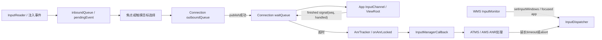
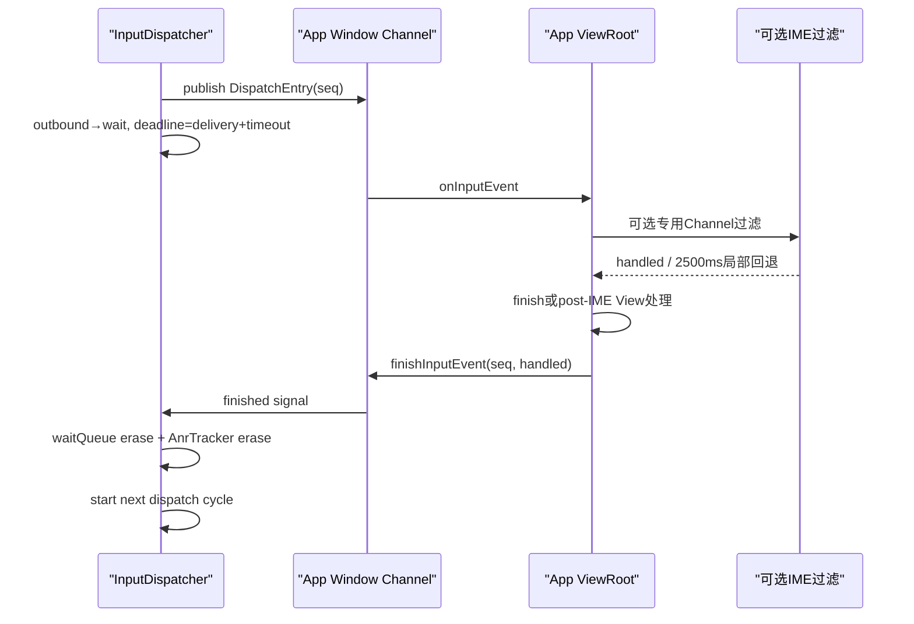
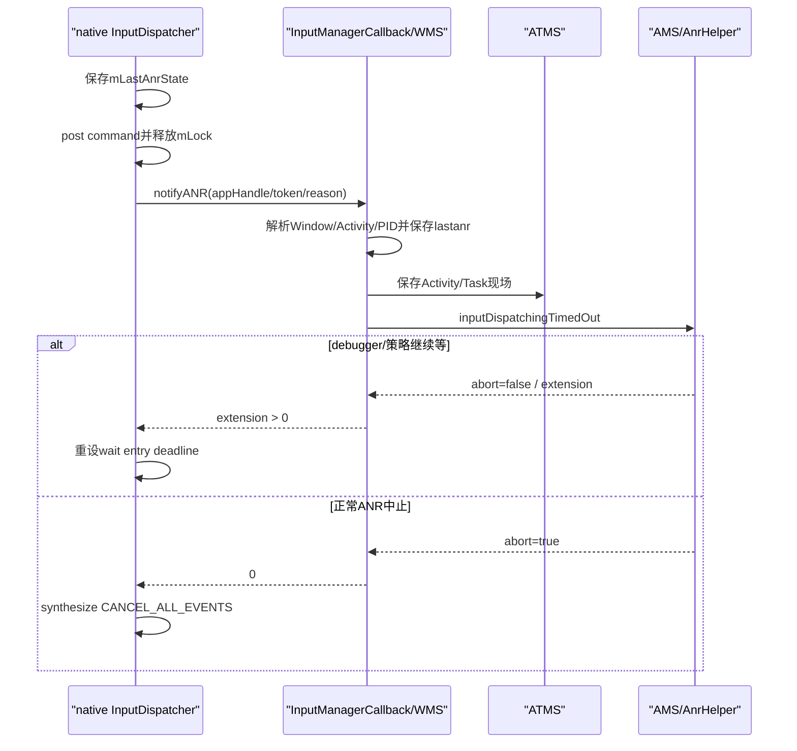

# 235 Android InputDispatcher焦点窗口、等待队列与输入ANR判定链

> 源码版本：Android 11 / `android-11.0.0_r48`  
> 学习方式：macOS只读核源，不编译、不运行AOSP

## 1. 本章要解决什么

上一章看到ViewRoot可为IME过滤一个KeyEvent等待2500ms。本章回到更外层：InputDispatcher把事件交给目标窗口后，怎样知道App是否“真的不响应”。

需要回答：

```text
focused application与focused window为什么是两套对象？
没有焦点窗口为何也可能触发输入ANR？
outboundQueue和waitQueue分别装什么？
5秒从事件产生、入队还是发布到目标时开始？
handled与finished/ack是什么关系？
InputDispatcher怎样选择罪责窗口、通知WMS/AMS并允许延长等待？
2500ms IME门和5秒输入分发门怎样相互影响但不等价？
```

## 2. 一句总纲

输入ANR不是“主线程某方法执行超过5秒”的简单秒表，而是：

```text
InputDispatcher已经把事件发布给某个连接
→ DispatchEntry进入waitQueue
→ 到该窗口的dispatching timeout仍未收到finished signal
→ native记录现场并异步问系统策略层
→ WMS/ATMS/AMS识别责任进程、取证并决定延长还是终止等待
```

另有一种兼容路径：focused application已经确定，但迟迟没有focused window。

## 3. 总体链路



## 4. 源码地图

native核心：

```text
frameworks/native/services/inputflinger/dispatcher/InputDispatcher.cpp
frameworks/native/services/inputflinger/dispatcher/InputDispatcher.h
frameworks/native/services/inputflinger/dispatcher/Entry.cpp
frameworks/native/libs/input/InputTransport.cpp
```

Framework策略与取证：

```text
frameworks/base/services/core/java/com/android/server/wm/InputMonitor.java
frameworks/base/services/core/java/com/android/server/wm/InputManagerCallback.java
frameworks/base/services/core/java/com/android/server/wm/WindowManagerService.java
frameworks/base/services/core/java/com/android/server/wm/ActivityRecord.java
frameworks/base/services/core/java/com/android/server/am/ActivityManagerService.java
frameworks/base/core/java/android/view/ViewRootImpl.java
```

## 5. InputDispatcher有独立线程

`start()`创建名为`InputDispatcher`的`InputThread`，循环调用`dispatchOnce()`。

它不是system_server Java主线程，也不是App主线程。

## 6. dispatchOnce的基本节奏

在native锁内：

```text
若无commands则dispatchOnceInnerLocked
→ 执行需要解锁回调policy的commands
→ processAnrsLocked算下一检查时刻
→ 解锁
→ Looper.pollOnce等待事件/回执/timeout
```

不能持有InputDispatcher锁跨Java策略层做慢调用。

## 7. WMS怎样提供窗口事实

每个Display的`InputMonitor`收集InputWindowHandle，包含：

```text
InputChannel token
窗口层级和visible/hasFocus
touchable region与变换
owner pid/uid
paused、flags、displayId
dispatching timeout
```

再通过input transaction/IMS把快照送InputDispatcher。

## 8. updateInputWindows为什么异步合并

窗口布局、可见性、层级和焦点会在一轮Surface placement中多次变化。

InputMonitor用pending标志和Handler合并更新；需要与Surface Transaction同帧一致时，也可立即生成并merge到传入Transaction。

## 9. focused application是什么

它表示系统当前认为哪个Activity/App应拥有焦点，即使该App的可接收输入窗口还未建好。

WMS调用`setFocusedApplication(displayId, InputApplicationHandle)`单独下发。

## 10. focused window是什么

InputDispatcher在当前Display窗口列表中选择第一个同时：

```text
hasFocus == true
visible == true
```

的顶层InputWindowHandle。

## 11. 为什么需要两套焦点

启动新Activity时，任务焦点可以先切到新App，但它的Window尚未add、尚未visible或窗口快照尚未下发。

若只有focused window概念，系统无法判断“现在暂时无窗口，但应该等某App创建”还是“本来就无人接收”。

## 12. 焦点窗口变化时做什么

旧焦点存在时：

```text
合成CANCEL_NON_POINTER_EVENTS
→ enqueue focus=false
→ 从focused map移除
```

新焦点存在时加入map并enqueue focus=true。

## 13. 为什么焦点离开要取消非pointer事件

旧窗口可能收到Key down但还没收到up。

焦点切走时发送取消语义，避免旧View保留“按键仍按下”、tracking或long-press状态。

## 14. 触摸窗口被移除时的取消不同

若正在触摸的WindowHandle从列表消失，InputDispatcher合成`CANCEL_POINTER_EVENTS`。

焦点键状态与触摸手势状态是两套连续性，取消类型不能混用。

## 15. focused app变化可取消无窗口等待

若当前正在等`mAwaitedFocusedApplication`创建焦点窗口，而focused app已切到另一个应用，InputDispatcher重置该计时器。

不能让旧App的无窗口超时误伤新前台App。

## 16. KeyEvent目标怎样找

焦点型事件调用`findFocusedWindowTargetsLocked()`，按事件Display读取focused window和focused application。

触摸事件则按坐标、touch region、层级、手势已有TouchState等选择窗口，不能简单套用焦点键目标。

## 17. 无focused window也无focused app

源码直接丢弃该焦点事件，并返回injection failed。

系统没有可等待的责任主体，因此不会凭空启动5秒ANR。

## 18. 有focused app但无window

这是兼容等待路径：系统推测App可能仍在启动并即将添加窗口。

只有真的出现一个待分发焦点事件时才开始计时，不是focused app一设置就立即倒计时。

## 19. 无窗口timeout从何而来

优先取`InputApplicationHandle`的dispatching timeout，缺省使用5秒。

记录：

```text
mNoFocusedWindowTimeoutTime = currentTime + timeout
mAwaitedFocusedApplication = focusedApplication
```

事件保持PENDING。

## 20. 无窗口ANR怎样取消

以下情形会重置：

```text
有效focused window出现
focused application换人
通过触摸开始与另一个应用交互的兼容路径
```

所以它不是“一旦开始必然报错”的不可撤销秒表。

## 21. 无窗口超时后的理由

`onAnrLocked(application)`构造：

```text
<application name> does not have a focused window
```

此时没有具体InputChannel token，责任锚点是InputApplicationHandle。

## 22. window paused时怎么办

若焦点WindowHandle的`paused`为true，事件保持PENDING。

WMS在`setInputFocusLw()`把一个可接收键的新窗口设焦点时会自动清该WindowToken的paused，防止忘记resume导致永久停发。

## 23. Key为何可能等前序Motion

点击按钮可能弹出新窗口，紧接着按下“A”。

若旧Motion尚未完成，立刻按旧焦点发送Key可能送错窗口。因此Key会给前序可能改变焦点的事件一个完成机会。

## 24. 这个额外等待是多少

r48：

```java
KEY_WAITING_FOR_EVENTS_TIMEOUT = 500ms
```

超过500ms仍有旧事件，日志告警后仍把Key发给当前焦点窗口；这不是输入ANR的5秒门。

## 25. inbound、outbound、wait三层队列

```text
inboundQueue：尚未完成全局目标选择的事件
Connection.outboundQueue：已为某连接准备、尚未成功发布的DispatchEntry
Connection.waitQueue：已发布给连接、等待finished signal的DispatchEntry
```

“队列里有事件”必须写出是哪一层。

## 26. EventEntry与DispatchEntry区别

一个EventEntry表示原始逻辑事件。

它可针对多个目标生成不同DispatchEntry，每个带自己的seq、target flags、坐标变换、deliveryTime和timeoutTime。

## 27. DispatchEntry seq怎样生成

用全局原子递增序列，0被保留并跳过。

目标进程finished signal带seq返回，InputDispatcher据此从该Connection waitQueue找到精确条目。

## 28. timeout何时开始

`startDispatchCycleLocked(currentTime, connection)`取当前窗口timeout，并设置：

```java
dispatchEntry->deliveryTime = currentTime;
dispatchEntry->timeoutTime = currentTime + timeout;
```

也就是准备向该Connection发布的时刻，不是硬件事件最初eventTime。

## 29. publish失败不会进入waitQueue

若Channel pipe满：

```text
waitQueue空却满 → 异常，abort broken cycle
waitQueue非空 → App落后，保留outbound等其完成旧事件
```

其他不可恢复错误也会走broken channel清理。

## 30. publish成功后的队列迁移

从outboundQueue移除，push到waitQueue。

若Connection仍responsive，把`timeoutTime + connection token`插入`mAnrTracker`。

## 31. AnrTracker解决什么

多个连接、多个wait entry有不同到期时刻。

Tracker维护最早timeout，使dispatch loop只需在最早检查点唤醒，而不必固定频率扫描全部队列。

## 32. 默认dispatch timeout是多少

```cpp
DEFAULT_INPUT_DISPATCHING_TIMEOUT = 5s;
```

但`getDispatchingTimeoutLocked(token)`优先取窗口自己的timeout，因此5秒是默认值，不是所有窗口绝对固定值。

## 33. instrumentation/debugger为何可能不同

应用/Activity的InputApplicationHandle可携带调整后的timeout；AMS在真正ANR决策时也会对debugger、instrumentation作特殊处理。

排查时应看dump里的实际dispatchingTimeout，而不是只背5秒。

## 34. processAnrsLocked先查什么

先查“focused app但无focused window”的独立计时器，再查AnrTracker最早Connection timeout。

两类ANR一个没有Channel，一个有具体waitQueue和Connection，理由及归责不同。

## 35. Connection到期时怎样标记

设置：

```text
connection.responsive = false
从AnrTracker移除该token
onAnrLocked(connection)
```

先停止为同一不响应Connection反复唤醒，再交策略层判断是否延长。

## 36. 为什么onAnr前再看waitQueue

策略回调、锁切换或完成信号可能让Connection恢复。

如果waitQueue已空，源码打印recovered并不再报ANR，避免用陈旧计时点误报。

## 37. ANR理由为什么引用oldest entry

理由包含Channel名、已等待毫秒和oldest event description。

源码注释承认：若窗口timeout动态变化，真正最先到期的可能是较新entry；但多数App线性处理，展示最早发送事件对诊断最有用。

## 38. 2秒慢事件日志不是ANR

r48另有：

```cpp
SLOW_EVENT_PROCESSING_WARNING_TIMEOUT = 2s;
```

事件最终finish时若处理超过2秒只写slow日志和统计；未达到实际窗口timeout就不等于ANR。

## 39. 10秒stale event也不是ANR

`STALE_EVENT_TIMEOUT = 10s`从事件自身eventTime衡量未及时分发的陈旧事件，可能直接丢弃。

Connection ANR从deliveryTime衡量“已经交给目标后多久没ack”，两者起点不同。

## 40. 500ms app-switch门也不同

HOME/ENDCALL等应用切换键到来时，InputDispatcher用500ms优化抢占旧事件。

这是切换延迟策略，不是目标窗口正常完成回执的dispatch timeout。

## 41. finished signal怎样返回native

App `ViewRootImpl.finishInputEvent()`调用Window InputEventReceiver。

JNI通过`InputConsumer.sendFinishedSignal(seq, handled)`写回Channel，InputDispatcher收到后创建完成command。

## 42. handled会影响是否移出waitQueue吗

无论handled true或false，只要finished signal有效，当前DispatchEntry都已完成，应从waitQueue移除。

handled用于后续策略/统计/回退语义，不是“只有处理了才ack”。

## 43. doDispatchCycleFinished的顺序

```text
按seq查wait entry
→ 算delivery到finish耗时并打慢日志/统计
→ afterKey/afterMotion策略
→ 再次确认entry仍存在
→ 从waitQueue移除并从AnrTracker删timeout
→ 必要时恢复responsive
→ release或重新入outbound
→ 启动下一dispatch cycle
```

## 44. 为什么要二次查waitQueue

afterKey/afterMotion可能解锁并触发其他清理，队列内容已变化。

持有旧iterator继续erase会产生use-after-free或删错事件，因此重新按seq查找。

## 45. Connection何时恢复responsive

若之前标为false，完成一个entry后扫描剩余waitQueue；没有任何`timeoutTime < now`的entry才恢复responsive。

仅收到一个晚回执不一定代表积压已全部健康。

## 46. native ANR不会直接弹框

`onAnrLocked()`先保存native InputDispatcher现场，再post一个command。

command执行时释放mLock，调用`mPolicy->notifyAnr()`进入Java策略层。

## 47. 为什么策略回调必须解锁

WMS/AMS可能取Java大锁、收集堆栈并做跨服务调用。

持有InputDispatcher锁等待它们会阻塞所有输入与finished signal，反而放大甚至制造系统级卡死。

## 48. native现场保存什么

`mLastAnrState`记录时间、reason、Window label，并dump当前dispatcher状态：

```text
焦点、窗口列表
inbound/pending事件
各Connection状态
outbound/wait队列与age
触摸状态等
```

这是`dumpsys input`诊断的重要快照。

## 49. Java policy入口

`InputManagerCallback.notifyANR(applicationHandle, token, reason)`运行在InputDispatcher相关回调线程上。

返回值单位是纳秒：大于0表示继续等这么久，0表示停止当前等待策略。

## 50. 为什么先做pre-dump

debuggable构建上，若WMS或AMS锁在限定时间内拿不到，后台线程先抓system_server及必要时SurfaceFlinger堆栈。

这样真正ANR路径稍后拿到锁时，早先的阻塞现场不会完全消失。

## 51. token怎样映射责任窗口

在WMS全局锁内用`mInputToWindowMap`查WindowState，再取得：

```text
ActivityRecord
window process pid
是否高于系统窗口层
窗口标题
```

## 52. embedded window怎样归责

若普通WindowState映射不到，继续查EmbeddedWindowController，取ownerPid和host window层级。

没有host时难以判断z序，源码选择尽量把ANR对话框放高。

## 53. 无窗口ANR怎样找到Activity

没有token时，使用InputApplicationHandle.token通过`ActivityRecord.forTokenLocked()`定位focused activity。

这与第21节的“focused app但无window”路径对应。

## 54. WMS保存哪些ANR状态

在窗口状态仍稳定时调用`saveANRStateLocked(activity, windowState, reason)`。

随后锁外让ATMS保存Activity/Task现场；`dumpsys window lastanr`可查看，r48默认保留两小时后清理。

## 55. 为什么调用AMS前释放WMS锁

ActivityManager ANR流程会获取AMS锁、查询进程并抓取堆栈。

若反向再需要WMS，持锁跨调用容易形成锁序死锁；源码明确把后续调用放在WMS锁外。

## 56. Activity窗口怎样交给AMS

`ActivityRecord.keyDispatchingTimedOut(reason, windowPid)`先判断窗口进程是否就是Activity进程。

若同进程走带Activity上下文的AM internal接口；若是另一个进程借Activity token加窗，则按真实windowPid走通用路径，避免错怪Activity宿主。

## 57. AMS正常进程怎样处理

构造`Input dispatching timed out (...)`注解并交`mAnrHelper.appNotResponding()`异步处理ANR取证/对话框/杀进程策略。

函数返回true表示应中止当前输入等待。

## 58. 正在debug为什么可继续等

若`ProcessRecord.isDebugging()`，AMS返回false，不立即按普通ANR中止。

InputManagerCallback把Activity的`mInputDispatchingTimeoutNanos`返回native，延长等待，方便断点调试。

## 59. instrumentation异常路径

有active instrumentation时，AMS结束instrumentation并返回true中止，而不是走普通用户ANR对话流程。

测试运行环境不能完全套用普通前台App表现。

## 60. 无Activity的Window进程

WMS调用`mAmInternal.inputDispatchingTimedOut(pid, aboveSystem, reason)`。

返回负数代表abort；非负毫秒数代表继续等待，policy转换成纳秒返回native。

## 61. 策略允许延长时native做什么

`extendAnrTimeoutsLocked()`：

```text
connection.responsive = true
newTimeout = now + extension
更新需要延长的wait entries timeoutTime
重新插入AnrTracker
```

这不是清空旧事件，而是给现有未完成事件新的截止点。

## 62. 无窗口ANR也能延长

若没有Connection但仍在等同一个focused application，重新设置：

```text
mNoFocusedWindowTimeoutTime = now + extension
```

因此policy返回值同时服务两类ANR路径。

## 63. 策略选择abort时native做什么

对具体Connection调用`cancelEventsForAnrLocked()`，合成`CANCEL_ALL_EVENTS`。

源码强调不会在这里直接break Channel；若策略最终关闭App，后续unregister InputChannel再做连接清理。

## 64. 为什么focused事件还可能堆积

不响应Connection上不再正常发送新pointer，但焦点事件可能继续排队。

输入ANR不是“所有队列瞬间冻结为空”，dump时要同时看outbound和wait积压。

## 65. App为什么会不回finished signal

常见根因：

```text
主线程长计算、死循环或Binder同步等待
主线程等待被其他线程持有的锁
View事件处理里执行慢I/O
system_server/WMS/AMS锁或Binder对端形成等待链
App在ImeInputStage等待卡住的IME
native InputQueue/自定义InputEventReceiver漏finish
```

ANR表象是输入ack没回来，根因不必在InputDispatcher。

## 66. IME 2500ms怎样嵌入5秒

原Window事件发布给App后已经进入InputDispatcher waitQueue。

ViewRoot到ImeInputStage时又在App内部等待IME专用Channel；这段2500ms发生在原窗口事件尚未finish期间，因此计入App Connection的总等待时间。

## 67. 两个计时器为什么不等价

```text
IMM 2500ms：App侧局部等待当前IME过滤，超时后按false继续App流水线
InputDispatcher通常5s：系统等待目标Window Connection完成整个事件
```

InputDispatcher看不到App内部是在等IME、执行View回调还是卡锁，只看到原finished signal未回来。

## 68. 超时不是简单2.5+5

5秒从事件发布给App开始；2.5秒是其内部的一段重叠时间。

若IME正好耗尽2.5秒，App常只剩大约余下窗口timeout处理post-IME逻辑，而不是再获得完整5秒。调度延迟和自定义timeout还会改变实际时间。

## 69. 2500ms后为何可能仍触发App输入ANR

IMM虽把事件按not handled继续，但App主线程若本身卡住，callback也无法及时恢复ViewRoot；或者恢复后View处理又很慢。

最终原Window finished signal仍可能越过InputDispatcher deadline。

## 70. IME卡顿应怪谁

InputDispatcher这条原Window Connection的token通常指向目标App窗口，因此外层reason可能表现为目标App未完成输入。

IMM另有“Timeout waiting for IME”日志能揭示内部原因；诊断必须结合两侧日志和线程栈，不能只看ANR进程名下结论。

## 71. 完整正常完成时序



## 72. Connection ANR与无焦点窗口ANR对比

| 条件 | 下一步 | 到期结果 |
|---|---|---|
| 有focused window | publish到Connection并进入waitQueue | deadline前无finished → Connection ANR |
| 无window、有focused application | 启动no-focused-window timer | 窗口出现/应用切换则reset；否则Application无焦点窗口ANR |
| window和application都没有 | 直接drop | 没有可归责主体，不启动这两类ANR |

## 73. ANR策略回调时序



## 74. 四类时间必须分账

| 时间 | 起点 | 用途 |
|---|---|---|
| 500ms key-wait | Key发现前序事件可能改焦点 | 给前序Motion改变焦点的机会 |
| 2s slow warning | deliveryTime | 完成后记录慢处理，不必ANR |
| 默认5s dispatch timeout | deliveryTime | 等目标Connection finished signal |
| 10s stale timeout | 原eventTime | 未及时分发的陈旧事件可丢弃 |

上一章2500ms IME门是第五套、位于App内部的计时。

## 75. handled=false也能证明响应

App可以迅速返回“我没处理”。

只要finish及时，Connection就是responsive；ANR关心是否按期完成协议，不要求业务必须消费事件。

## 76. handled=true也可能太晚

业务最终返回true，但超过deadline才finished，仍可能先触发ANR。

“处理结果正确”和“系统响应及时”是两项独立指标。

## 77. ANR reason为何写等待具体事件

reason示例语义：

```text
<channel> is not responding. Waited N ms for <event description>
```

在debuggable构建，KeyEvent description会包含更多keyCode/source等字段；非debug构建为隐私/日志量减少细节。

## 78. dumpsys应看什么

只读排查常用：

```text
dumpsys input
dumpsys window lastanr
dumpsys activity lastanr（具体版本命令以help为准）
traces中的main/Binder/RenderThread/锁等待
logcat的InputDispatcher、WindowManager、ActivityManager、InputMethodManager
```

本机macOS源码学习只核对生成路径，不实际运行设备命令。

## 79. waitQueue age怎样读

最老entry长时间未完成通常最关键，但要同时检查：

```text
它的deadline是否被自定义/延长
后续entry是否因timeout变化更早到期
Connection responsive标志
outbound是否因pipe满继续积压
```

不能只数waitQueue长度。

## 80. 焦点窗口为何必须visible

WMS可能短暂保留hasFocus状态，但窗口已不可见。

InputDispatcher只取首个hasFocus且visible窗口，避免把新Key交给已经退出视觉交互的旧Surface/Window。

## 81. FocusEvent本身也走Connection

焦点变化会enqueue FocusEntry，由InputChannel传给ViewRoot的`onFocusEvent()`。

WMS/InputDispatcher内部map更新与App真正收到focus event之间存在异步距离，阅读竞态时要区分“服务端已选焦点”和“客户端已处理通知”。

## 82. Channel broken与ANR不同

publish出现不可恢复错误或Channel对端死亡会通知`notifyInputChannelBroken()`，WMS按token移除Window。

ANR是Channel仍存在但事件长期未ack；broken是通信端点已不可用。

## 83. pause dispatch与ANR不同

paused Window会使目标选择保持PENDING，是系统明确暂停交付。

已publish后进入waitQueue才进入Connection ack超时语义；不能把pause等待直接说成App已收事件不处理。

## 84. 常见误解一：5秒从用户按下按键开始

不准确。Connection timeout在startDispatchCycle设置deliveryTime时开始。

事件此前可能在inbound、策略拦截、无焦点等待或Key等待中花费时间，另由stale等机制约束。

## 85. 常见误解二：waitQueue是尚未发给App的队列

相反，waitQueue表示已经publish、正等待finished signal。

尚未成功publish的是outboundQueue。

## 86. 常见误解三：主线程不处理事件一定是唯一根因

ViewRoot最终通常依赖主线程，但InputQueue/native receiver、Binder/锁等待、IME过滤和系统服务锁也可能阻断完成链。

应从waitQueue回执链向上找真正等待对象。

## 87. 常见误解四：报ANR后InputDispatcher立刻杀进程

InputDispatcher只通知policy并依据返回值延长或取消事件。

进程ANR取证、对话框和终止由AMS等上层策略决定。

## 88. 常见误解五：ANR之后Channel立即断开

abort路径先合成CANCEL_ALL_EVENTS，不直接break Connection。

若上层杀死/移除App，随后unregister channel才完成端点清理。

## 89. 常见误解六：2500ms IME timeout能保证不会输入ANR

它只避免ImeInputStage无限等IME。

callback回App主Looper、post-IME View处理和原Window finish仍可能超出整体dispatch deadline。

## 90. 实用诊断问答树

```text
reason是“does not have a focused window”吗？
  是 → 查Activity启动、Window add/visible/focus下发
  否 → 查具体Connection waitQueue

wait entry已经publish吗？
  是 → 查目标进程为何没finish
  否 → 查outbound pipe满/Channel broken

日志有“Timeout waiting for IME”吗？
  是 → 把IME 2500ms等待纳入App原事件总时长

AMS是否返回extension？
  是 → 查debugger、自定义timeout或策略为何继续等
```

## 91. macOS只读练习一：对比两类焦点ANR

```bash
cd /Users/ninebot/androidSource
sed -n '1440,1510p' \
  frameworks/native/services/inputflinger/dispatcher/InputDispatcher.cpp
sed -n '3685,3820p' \
  frameworks/native/services/inputflinger/dispatcher/InputDispatcher.cpp
```

要求：推演“focused app先到、2秒后窗口出现”和“5秒内一直无窗口”两种时序，指出timer何时启动/重置。

## 92. macOS只读练习二：跟踪outbound到wait

```bash
cd /Users/ninebot/androidSource
sed -n '2425,2620p' \
  frameworks/native/services/inputflinger/dispatcher/InputDispatcher.cpp
sed -n '4735,4810p' \
  frameworks/native/services/inputflinger/dispatcher/InputDispatcher.cpp
```

要求：列出publish成功、WOULD_BLOCK、finished signal三种情况下DispatchEntry所在队列、AnrTracker和responsive变化。

## 93. macOS只读练习三：闭合Java ANR决策

```bash
cd /Users/ninebot/androidSource
sed -n '175,275p' \
  frameworks/base/services/core/java/com/android/server/wm/InputManagerCallback.java
sed -n '19810,19890p' \
  frameworks/base/services/core/java/com/android/server/am/ActivityManagerService.java
```

要求：分别写出普通App、debugging App、instrumentation进程和无Activity Window进程返回给native的abort/extension语义。

## 94. macOS只读练习四：比较五个计时器

```bash
cd /Users/ninebot/androidSource
sed -n '75,110p' \
  frameworks/native/services/inputflinger/dispatcher/InputDispatcher.cpp
sed -n '485,540p' \
  frameworks/native/services/inputflinger/dispatcher/InputDispatcher.cpp
rg -n "INPUT_METHOD_NOT_RESPONDING_TIMEOUT" \
  frameworks/base/core/java/android/view/inputmethod/InputMethodManager.java
```

要求：给500ms、2s、2.5s、5s、10s分别写出起点、观察者、超时动作，禁止把它们相加成一个固定ANR公式。

## 95. 自测题

1. focused application和focused window分别表达什么？
2. 为什么无focused app/window时直接drop，有focused app无window时却等待？
3. outboundQueue与waitQueue的分界点是什么？
4. 默认5秒从何时开始？
5. handled=false为何仍能让Connection保持responsive？
6. native为何解锁后才调用Java policy？
7. policy返回extension和0时native分别做什么？
8. IMM 2500ms为什么会占用而不是叠加在InputDispatcher 5秒之后？

## 96. 自测题答案

1. 前者是期望获得输入的App/Activity，后者是当前已存在、visible且真正可接收输入的具体Window。
2. 前者没有责任主体；后者代表启动中的App可能即将建窗，需要兼容等待并可归责。
3. 事件成功publish到Connection后，从outbound移入wait并开始等finished signal。
4. `startDispatchCycleLocked()`给DispatchEntry设置deliveryTime和`timeoutTime=delivery+window timeout`时。
5. responsive要求按期完成协议，不要求业务消费；false也是及时有效的finished结果。
6. WMS/AMS回调可能很慢并拿其他大锁，持native锁调用会阻塞全部输入和回执甚至死锁。
7. extension重设现有deadline并重新追踪；0对具体Connection合成CANCEL_ALL_EVENTS，后续由上层决定进程/Channel清理。
8. 原Window事件进入App时5秒已开始，ViewRoot等待IME发生在事件尚未finish的内部阶段，两者时间重叠。

## 97. 复读后的易混状态表

| 状态 | 准确含义 | 不代表什么 |
|---|---|---|
| focused application | 预期拥有焦点的App | 已有可输入窗口 |
| focused window | 当前visible焦点InputWindowHandle | App主线程已处理focus通知 |
| outboundQueue | 等待publish到Connection | App已经收到 |
| waitQueue | 已publish，等待finished | App业务一定handled |
| responsive=false | 至少一个追踪deadline已到期 | Channel已经broken/进程已杀 |
| ANR policy extension | 系统决定继续等待 | 旧事件已完成或队列已清空 |

## 98. 本章结论

输入ANR的核心不是“5秒”这个数字，而是Connection级完成协议：

```text
WMS提供可见窗口、焦点App/窗口和timeout
→ InputDispatcher选目标并publish
→ DispatchEntry进入waitQueue
→ ViewRoot完成全输入流水线后回finished signal
→ 按seq移除wait并启动下一轮
```

deadline到期时，native只负责识别未ack连接、保存现场并向上询问；真正的责任进程判断、取证、延长和终止由WMS/ATMS/AMS共同完成。上一章IME 2500ms只是App输入流水线内部的一段等待，它能解释某些耗时，却不能替代外层Connection ANR模型。

## 99. 下一章预告

下一章继续研究InputDispatcher的触摸目标选择、TouchState、split touch、outside/wallpaper/spy窗口、pilfer与取消事件，解释一次多指手势怎样稳定绑定窗口并在窗口变化时保持一致性。
