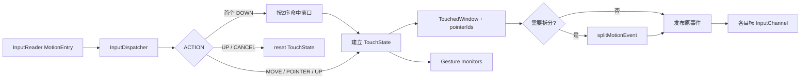
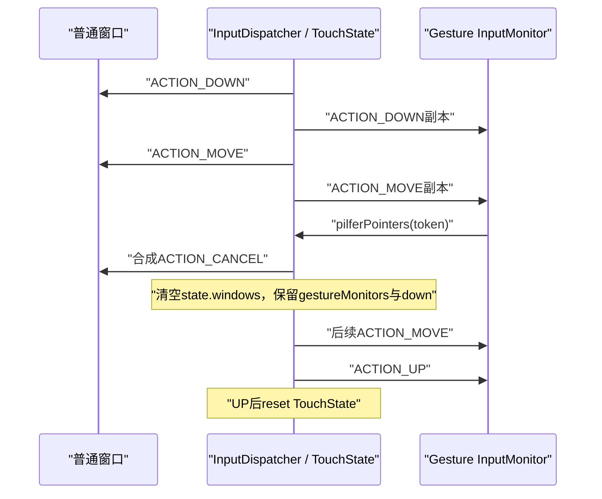

# 236 Android InputDispatcher触摸目标、TouchState、多指拆分与pilfer链

> 源码版本：Android 11 / `android-11.0.0_r48`  
> 学习方式：macOS只读核源，不编译、不运行AOSP

## 1. 本章要解决什么

上一章解释了InputDispatcher怎样把事件送进窗口连接并等待完成回执。本章向前补上最关键的一步：一个触摸屏事件究竟应该送给谁。

需要回答：

```text
为什么ACTION_DOWN之后，手指移出窗口仍通常发给原窗口？
NOT_TOUCHABLE、NOT_TOUCH_MODAL和touchableRegion怎样影响命中？
WATCH_OUTSIDE_TOUCH为什么只收到一次ACTION_OUTSIDE？
两个手指落在两个窗口时，原始MotionEvent怎样拆成两条自洽事件流？
TouchState为什么必须按Display持久保存？
FLAG_SLIPPERY为什么能在MOVE途中换目标？
壁纸和gesture monitor为什么也能收到同一手势？
pilferPointers“偷走手势”时，原窗口、监控者和TouchState分别发生什么？
```

## 2. 一句总纲

InputDispatcher不是对每个`MOVE`重新做一次窗口命中，而是：

```text
首个DOWN按当前窗口Z序和touchable region选定目标
→ 把目标、pointerId集合、设备/来源/Display和监控者记入TouchState
→ 后续事件沿这份状态继续投递
→ split touch按pointerId为不同窗口裁剪MotionEvent
→ UP/CANCEL、窗口移除或pilfer再显式结束/改写这份状态
```

这叫“手势流所有权”，不是“每一帧谁在手指下面谁就收”。

## 3. 总体链路



## 4. 源码地图

native核心：

```text
frameworks/native/services/inputflinger/dispatcher/InputDispatcher.cpp
frameworks/native/services/inputflinger/dispatcher/InputDispatcher.h
frameworks/native/services/inputflinger/dispatcher/TouchState.h
frameworks/native/services/inputflinger/dispatcher/TouchState.cpp
frameworks/native/services/inputflinger/dispatcher/TouchedWindow.h
frameworks/native/services/inputflinger/dispatcher/InputTarget.h
frameworks/native/include/input/InputWindow.h
```

Java入口与系统桥接：

```text
frameworks/base/core/java/android/view/InputMonitor.java
frameworks/base/core/java/android/view/IInputMonitorHost.aidl
frameworks/base/services/core/java/com/android/server/input/InputManagerService.java
frameworks/base/services/core/java/com/android/server/wm/InputMonitor.java
frameworks/base/services/core/java/com/android/server/wm/WindowState.java
```

可帮助验证语义的测试：

```text
frameworks/native/services/inputflinger/tests/InputDispatcher_test.cpp
```

## 5. 先区分三个层次

本章很容易把三个对象混在一起：

```text
InputWindowHandle：WMS交给InputDispatcher的一份窗口输入快照
TouchState：某Display当前整条触摸手势的路由账本
InputTarget：为当前这一个EventEntry生成的具体投递参数
```

窗口是候选者，TouchState是跨事件状态，InputTarget是一次投递计划。

## 6. InputWindowHandle不是Java View

InputDispatcher看不到Button、RecyclerView或Compose节点。

它只看窗口级信息，例如：

```text
displayId、visible、hasFocus
frame、touchableRegion、Z序
InputChannel token
ownerPid、ownerUid
WindowManager.LayoutParams flags
paused、hasWallpaper、globalScaleFactor
```

命中顶层窗口后，窗口进程内部才由ViewRootImpl和ViewGroup继续找具体View。

## 7. 窗口列表已经按前到后排列

`findTouchedWindowAtLocked()`取得当前Display的`windowHandles`，从第一个向后遍历。

源码注释直接写着：

```cpp
// Traverse windows from front to back to find touched window.
```

因此第一个满足条件的窗口就是视觉层级上最靠前的有效目标。

## 8. 不可见窗口不会成为触摸目标

核心判断首先要求：

```cpp
if (windowInfo->visible) {
    ...
}
```

这里使用WMS同步来的输入窗口可见状态，不等价于某个子View的`View.VISIBLE`。

## 9. FLAG_NOT_TOUCHABLE的含义

若窗口带`FLAG_NOT_TOUCHABLE`，它不会成为正常触摸目标。

注意：

```text
NOT_TOUCHABLE不是“收到事件但不处理”
而是InputDispatcher在目标选择阶段直接跳过它
```

事件可以继续命中它下面的窗口。

## 10. touch modal窗口为什么能吃掉边界外触摸

Android 11的判断是：

```cpp
bool isTouchModal =
        (flags & (FLAG_NOT_FOCUSABLE | FLAG_NOT_TOUCH_MODAL)) == 0;

if (isTouchModal || windowInfo->touchableRegionContainsPoint(x, y)) {
    return windowHandle;
}
```

一个既可聚焦、又没有声明`NOT_TOUCH_MODAL`的窗口被视作touch modal。

它即使坐标不在touchable region内，也能阻止触摸落到后面的窗口。

## 11. NOT_TOUCH_MODAL的准确理解

带`FLAG_NOT_TOUCH_MODAL`后，窗口只在自己的touchable region包含触点时被选中。

触点在区域外时，InputDispatcher继续向更低Z序窗口查找。

它不是“窗口永远收不到外部触摸”；是否额外收到`ACTION_OUTSIDE`还取决于`FLAG_WATCH_OUTSIDE_TOUCH`。

## 12. NOT_FOCUSABLE为何也影响touch modal

源码把`FLAG_NOT_FOCUSABLE`和`FLAG_NOT_TOUCH_MODAL`一起用于`isTouchModal`判断。

因此不可聚焦窗口默认不会仅靠modal属性吞掉整个Display上的触摸；它仍可在自己的touchable region内正常命中。

## 13. touchable region不一定等于窗口frame

WMS可为窗口提供非矩形Region。

例如窗口frame是一个大矩形，但只让其中一部分参与触摸命中。

所以分析命中问题不能只看`frameLeft/frameTop/frameRight/frameBottom`。

## 14. 命中使用整数坐标

目标选择中，触摸坐标从`PointerCoords`读取后转成`int32_t`：

```cpp
x = int32_t(entry.pointerCoords[pointerIndex]
                    .getAxisValue(AMOTION_EVENT_AXIS_X));
y = int32_t(entry.pointerCoords[pointerIndex]
                    .getAxisValue(AMOTION_EVENT_AXIS_Y));
```

这一步用于窗口命中；投递给客户端的MotionEvent仍保留浮点PointerCoords。

## 15. 鼠标使用cursor position

鼠标事件不直接用action pointer的X/Y，而使用：

```cpp
entry.xCursorPosition
entry.yCursorPosition
```

因为鼠标具有独立光标位置语义。

## 16. 哪些动作会发起“新目标选择”

源码将以下动作视作`newGesture`：

```text
ACTION_DOWN
ACTION_SCROLL
ACTION_HOVER_MOVE
ACTION_HOVER_ENTER
ACTION_HOVER_EXIT
```

另外，已经进入split模式时的`ACTION_POINTER_DOWN`也会为新指针寻找窗口。

## 17. 普通MOVE不会重新hit-test

这是本章最重要的结论。

除`FLAG_SLIPPERY`特殊路径外，`MOVE`进入Case 2，直接沿`tempTouchState`里已有窗口继续分发。

假设手指在A窗口按下后移动到B窗口上方：

```text
A收到 DOWN → MOVE → MOVE → UP
B通常什么也收不到
```

这样View才能得到完整且可解释的手势序列。

## 18. 为什么不能每次MOVE重新选择

如果每帧重新命中：

```text
A可能只收到DOWN和一半MOVE，却没有UP/CANCEL
B可能凭空从MOVE开始，没有DOWN
点击、拖拽、长按、VelocityTracker都会失去事件流不变量
```

TouchState就是为维护这条不变量存在的。

## 19. TouchState按Display保存

核心容器是：

```cpp
std::unordered_map<int32_t, TouchState> mTouchStatesByDisplay;
```

一个Display保存一条当前触摸状态。多显示器可以分别维护自己的目标与监控者。

## 20. TouchState的字段

Android 11定义：

```cpp
struct TouchState {
    bool down;
    bool split;
    int32_t deviceId;
    uint32_t source;
    int32_t displayId;
    std::vector<TouchedWindow> windows;
    std::vector<sp<InputWindowHandle>> portalWindows;
    std::vector<TouchedMonitor> gestureMonitors;
};
```

## 21. down表示什么

`down == true`表示该Display上有一条指针按下流尚未结束。

它不是窗口是否按下，也不是某个pointerId的单独状态；具体每个目标持有哪些pointerId由`TouchedWindow.pointerIds`表示。

## 22. deviceId、source、displayId是流身份

TouchState记录当前流来自哪个设备、哪类source和哪个Display。

这用于防止两个不兼容的指针流意外混进同一份状态。

## 23. 设备切换冲突

若已有设备的指针仍down，却收到另一设备不合适的事件，代码会拒绝或标记`outConflictingPointerActions`。

Android 11源码还留有TODO：

```cpp
// TODO: test multiple simultaneous input streams.
```

所以不要把这一版理解成“同一Display可无条件并行管理任意多设备触摸流”。

## 24. windows里不仅有前台窗口

`TouchState.windows`可以同时含：

```text
真正的FOREGROUND触摸目标
WATCH_OUTSIDE_TOUCH临时目标
wallpaper目标
slippery exit/enter目标
hover exit/enter目标
```

必须结合`targetFlags`理解每个元素的角色。

## 25. TouchedWindow保存什么

核心内容可抽象为：

```text
windowHandle：目标窗口
targetFlags：前台、分发模式、遮挡、坐标清零等
pointerIds：split模式下该窗口拥有的指针ID集合
```

## 26. 为什么用pointerId而不是pointerIndex

pointer index只是当前MotionEvent数组中的位置，可能随指针抬起而重排。

pointer ID在一条手势内稳定，适合表示“0号指针属于A，1号指针属于B”。

## 27. 先复制再修改的事务式设计

`findTouchedWindowTargetsLocked()`不会立刻改全局状态，而是：

```cpp
TouchState tempTouchState;
tempTouchState.copyFrom(*oldState);
```

所有目标选择先写临时副本。

## 28. 为什么不能边选边提交

后面还可能发现：

```text
没有有效窗口或gesture monitor
窗口paused
连接不存在
新手势目标已unresponsive
注入权限不足
设备流冲突
```

若前半段已污染全局TouchState，后续MOVE会沿一条从未成功投递DOWN的假手势继续发送。

## 29. 注入权限是提交门

源码注释明确说，出于安全原因，在确认事件注入被允许前暂缓更新触摸状态。

只有注入者通过权限检查，临时状态才可能写回全局。

## 30. 真实硬件事件也走相同路由算法

`InjectionState`主要描述软件注入者。

没有InjectionState不意味着跳过触摸目标选择；真实InputReader事件仍使用同一TouchState和窗口命中主链。

## 31. 新DOWN先重置旧临时状态

开始新手势时：

```cpp
tempTouchState.reset();
tempTouchState.down = true;
tempTouchState.deviceId = entry.deviceId;
tempTouchState.source = entry.source;
tempTouchState.displayId = displayId;
```

如果旧状态本来还down，又收到新DOWN，还会报告conflicting pointer actions。

## 32. paused窗口不会接收新触摸

命中窗口若`InputWindowInfo.paused == true`，代码把它清空，不向它开始新手势。

“paused”是窗口输入调度状态，不等价于Activity Java生命周期的`onPause()`字面含义。

## 33. 没有Connection也不能投递

窗口存在但找不到token对应`Connection`时，InputDispatcher不能找到可发布的InputChannel，因此取消这个新目标。

这常见于窗口快照与通道生命周期交界处。

## 34. unresponsive窗口不接新手势

若连接已被上一章的ANR机制标记为`responsive == false`，InputDispatcher不会向它开始新的触摸手势。

但已经在它那里的旧手势需要通过取消、窗口移除或恢复流程收尾，不能用这一句概括所有事件。

## 35. 没窗口但有监控者仍可成功

如果找不到普通触摸窗口，但当前DOWN命中了有效gesture monitor集合，目标选择仍可以成功。

所以“没有前台窗口”不必然等于“没有任何接收者”。

## 36. 前台目标的基础flag

正常命中窗口获得：

```cpp
FLAG_FOREGROUND | FLAG_DISPATCH_AS_IS
```

若允许拆分，再加`FLAG_SPLIT`。

## 37. FLAG_FOREGROUND不等于窗口焦点

它表示“这个窗口是本次触摸的主要目标”，用于注入权限和目标存在性判断。

触摸可以落到未持有键盘焦点的窗口，因此不能把它与`hasFocus`等同。

## 38. 遮挡标志在目标选择时计算

若目标上方有可视、不同进程、非trusted overlay、同Display的窗口覆盖触点：

```text
FLAG_WINDOW_IS_OBSCURED
```

若没有覆盖触点，但目标窗口其他区域与上层窗口相交：

```text
FLAG_WINDOW_IS_PARTIALLY_OBSCURED
```

## 39. trusted overlay为何不算安全遮挡

`canBeObscuredBy()`排除`otherInfo->isTrustedOverlay()`。

同token克隆层、同ownerPid、不可见或不同Display的窗口也不计入此遮挡判断。

## 40. frame与touchable region在这里角色不同

正常命中用`touchableRegionContainsPoint()`。

遮挡点判断却看上层窗口`frameContainsPoint()`；部分遮挡看窗口矩形是否overlap。

读源码时不要把这三种几何判断混为一种。

## 41. 遮挡结果怎样进入App

创建`DispatchEntry`时，target flag被翻译到MotionEvent flags：

```text
AMOTION_EVENT_FLAG_WINDOW_IS_OBSCURED
AMOTION_EVENT_FLAG_WINDOW_IS_PARTIALLY_OBSCURED
```

App可据此对敏感触摸做额外防护。

## 42. 版本边界：不要倒灌新版本opacity规则

本章基于Android 11 r48的`canBeObscuredBy + frame/overlap`逻辑。

后续Android版本围绕不受信任覆盖层、最大遮挡不透明度等还有演进，不能直接套回本章源码。

## 43. WATCH_OUTSIDE_TOUCH何时加入

`findTouchedWindowAtLocked()`只有在首个`ACTION_DOWN`传入`addOutsideTargets=true`。

遍历尚未命中的上层窗口时，如果它声明：

```text
FLAG_WATCH_OUTSIDE_TOUCH
```

就临时加入`FLAG_DISPATCH_AS_OUTSIDE`目标。

## 44. 它收到的是ACTION_OUTSIDE

投递阶段把该目标的动作改写为：

```cpp
AMOTION_EVENT_ACTION_OUTSIDE
```

它不是原始`ACTION_DOWN`，也不是手势的共同前台所有者。

## 45. 为什么只收到一次

成功输出本次目标后，代码调用：

```cpp
tempTouchState.filterNonAsIsTouchWindows();
```

仅保留`DISPATCH_AS_IS`或slippery enter目标。纯outside目标被从持续状态中删除。

因此后续MOVE/UP不会继续发给它。

## 46. outside窗口不能单独让手势成立

目标选择要求至少有一个foreground窗口或gesture monitor。

仅有`WATCH_OUTSIDE_TOUCH`观察者、却没有真正前台目标和监控者时，事件仍失败。

## 47. 跨UID为何清零坐标

若outside窗口ownerUid与实际前台目标ownerUid不同，TouchState为它增加：

```cpp
InputTarget::FLAG_ZERO_COORDS
```

这样只通知“外部发生了触摸”，不泄露另一应用精确触点。

## 48. ZERO_COORDS清什么

发布前为所有PointerCoords调用`clear()`，并不应用正常窗口偏移。

因此不要依靠跨UID`ACTION_OUTSIDE`中的坐标定位用户点击了别的App哪里。

## 49. 同UID窗口为何可保留坐标

同一应用可有多个顶层窗口，例如Dialog、Popup关联窗口。

同UID不存在同样的跨应用位置泄露边界，所以不会因这段规则自动清零。

## 50. split touch解决什么

假设同一触摸屏：

```text
pointer 0在A窗口DOWN
pointer 1在B窗口POINTER_DOWN
```

若A、B支持split，InputDispatcher可让两个窗口分别拥有自己的指针子集。

## 51. supportsSplitTouch从窗口flag得出

窗口的`InputWindowInfo::supportsSplitTouch()`检查相应layout flag。

是否拆分不是App在每个MotionEvent到来时动态返回的结果，而是WMS输入窗口快照中的能力。

## 52. 鼠标永不split

即使窗口支持拆分，源码仍明确：

```cpp
isSplit = !isFromMouse;
```

鼠标被视为单一光标流，不按多触点触摸语义拆分。

## 53. 第一个窗口决定是否进入split模式

首个DOWN命中的窗口支持split且不是鼠标时，`isSplit`变为true。

它的action pointer ID被记录到该窗口`pointerIds`中。

## 54. 新指针怎样选新窗口

已有split手势收到`ACTION_POINTER_DOWN`时，代码读取action index对应新指针坐标，再次调用窗口命中。

这次只是在为“新加入的pointer ID”选择归属，不是把旧指针重新分配。

## 55. 新窗口不支持split怎么办

如果已处于split模式，而新命中窗口不支持split，源码忽略这个新窗口。

随后尝试使用TouchState中第一个foreground窗口。

因此不会一半拆分后突然把整条流交给一个不支持拆分的新窗口。

## 56. pointerIds怎样合并

`addOrUpdateWindow()`发现相同窗口已存在时：

```cpp
touchedWindow.pointerIds.value |= pointerIds.value;
```

两个手指都落入A窗口时，A可以拥有多个ID，而不是出现两个A窗口目标项。

## 57. split状态怎样被持久化

只要target flags带`FLAG_SPLIT`，`addOrUpdateWindow()`就设置：

```cpp
split = true;
```

之后的POINTER_DOWN/MOVE/POINTER_UP均按拆分规则处理。

## 58. split不是复制完整MotionEvent

在`prepareDispatchCycleLocked()`中，如果目标有`FLAG_SPLIT`且目标ID数不等于原事件pointerCount，才调用：

```cpp
splitMotionEvent(originalMotionEntry, inputTarget.pointerIds)
```

输出事件只带该窗口拥有的PointerProperties和PointerCoords。

## 59. pointer数组怎样裁剪

函数遍历原始pointer数组，只复制ID在目标BitSet中的元素。

同时建立原index到新index的关系，为action index重写做准备。

## 60. POINTER_DOWN落在本窗口且它只有一个指针

原始全局动作可能是`ACTION_POINTER_DOWN`。

但对刚第一次看到该指针的B窗口，必须改写为：

```text
ACTION_DOWN
```

否则B会收到没有起点的事件流。

## 61. POINTER_UP是本窗口最后一个指针

全局`ACTION_POINTER_UP`对该窗口会改写为：

```text
ACTION_UP
```

这让每个窗口看到的局部流都符合DOWN到UP的配对。

## 62. 本窗口仍有其他指针

若发生变化的pointer属于本窗口，且本窗口拥有多个pointer，仍使用`POINTER_DOWN/UP`，但action index改为裁剪后数组中的新位置。

## 63. 变化的pointer不属于本窗口

例如B新增pointer 1时，A只拥有pointer 0。

对A而言没有自己的指针发生上下变化，所以动作改为：

```text
ACTION_MOVE
```

## 64. 两窗口拆分示例

```mermaid
sequenceDiagram
    participant HW as "原始触摸流"
    participant ID as "InputDispatcher"
    participant A as "窗口A: id0"
    participant B as "窗口B: id1"
    HW->>ID: "DOWN(id0 @ A)"
    ID->>A: "DOWN(id0)"
    HW->>ID: "POINTER_DOWN(id0,id1; action=id1 @ B)"
    ID->>A: "MOVE(id0)"
    ID->>B: "DOWN(id1)"
    HW->>ID: "MOVE(id0,id1)"
    ID->>A: "MOVE(id0)"
    ID->>B: "MOVE(id1)"
    HW->>ID: "POINTER_UP(id0,id1; action=id1)"
    ID->>A: "MOVE(id0)"
    ID->>B: "UP(id1)"
    HW->>ID: "UP(id0)"
    ID->>A: "UP(id0)"
```

## 65. 指针集合不一致会丢弃拆分事件

若BitSet预期的某pointer ID在原始MotionEntry中找不到，`splitMotionEvent()`返回空并记录警告。

这表示输入设备给出了破坏既有ID序列的不一致事件，继续投递反而会制造非法局部流。

## 66. 拆分事件获得新event ID

裁剪后的`MotionEntry`由`mIdGenerator.nextId()`生成新ID。

它仍保留原事件时间、设备、source、display、flags、精度、downTime等语义，并继承InjectionState引用。

## 67. POINTER_UP后何时移除归属

当前`POINTER_UP`先按旧TouchState投递，让对应窗口收到UP。

之后才遍历split窗口，清除此pointer ID；某窗口集合变空时从TouchState移除。

“先发结束事件，再忘记所有权”保证序列闭环。

## 68. 最终UP/CANCEL重置整条状态

收到：

```text
ACTION_UP
ACTION_CANCEL
```

会`tempTouchState.reset()`，清除windows、portalWindows、gestureMonitors及设备身份。

## 69. SCROLL为何不持久保存

滚轮`ACTION_SCROLL`会临时命中目标，但成功后不把临时TouchState写回全局。

它是一次性generic motion，不是从DOWN延续到UP的触摸流。

## 70. Hover有独立进入退出语义

当新hover窗口与`mLastHoverWindowHandle`不同：

```text
旧窗口补HOVER_EXIT
新窗口补HOVER_ENTER
```

之后清理临时状态，仅为仍在hover的设备保存身份。

## 71. hover窗口消失怎么办

`setInputWindowsLocked()`更新窗口快照时，如果找不到`mLastHoverWindowHandle`，就把它清空。

这避免后续向已移除窗口补发hover事件。

## 72. FLAG_SLIPPERY是MOVE重新命中的显式例外

只有满足：

```text
ACTION_MOVE
pointerCount == 1
TouchState中恰好一个foreground窗口
该窗口带FLAG_SLIPPERY
```

才会重新按当前坐标寻找窗口。

## 73. slippery旧窗口收到什么

当新旧目标不同且都存在，旧窗口加入：

```text
FLAG_DISPATCH_AS_SLIPPERY_EXIT
```

投递阶段把当前MOVE改写成`ACTION_CANCEL`。

## 74. slippery新窗口收到什么

新窗口加入：

```text
FLAG_DISPATCH_AS_SLIPPERY_ENTER
```

投递阶段把同一当前MOVE改写成`ACTION_DOWN`。

因此两边仍分别得到合法的结束和起始事件。

## 75. 为什么限制单指针

多指针转移需要决定每个pointer归属、重写多个局部动作和状态，语义复杂。

Android 11这条slippery路径只处理`pointerCount == 1`。

## 76. slippery状态怎样留下新目标

`filterNonAsIsTouchWindows()`会删除旧的slippery exit目标，并把slippery enter目标的分发模式归一为`DISPATCH_AS_IS`。

下一次MOVE便沿新窗口继续。

## 77. r48中的冗余赋值

slippery进入支持split的新窗口时，源码连续两次写：

```cpp
isSplit = true;
isSplit = true;
```

这是无行为差异的重复赋值，阅读时不要为第二句虚构额外语义。

## 78. wallpaper何时收到副本

首个`ACTION_DOWN`选出foreground窗口后，如果该窗口的`hasWallpaper`为true，InputDispatcher把同Display所有`TYPE_WALLPAPER`窗口加入目标。

它们在整条手势期间被锁定。

## 79. wallpaper目标为什么标记遮挡

壁纸窗口获得：

```text
WINDOW_IS_OBSCURED
WINDOW_IS_PARTIALLY_OBSCURED
DISPATCH_AS_IS
```

因为前台应用位于壁纸之上；壁纸收到副本不意味着它成了foreground触摸目标。

## 80. hover和scroll不收集wallpaper

源码注释说明Wallpaper Engine只支持touch事件；没有类似`View.onGenericMotionEvent`的机制处理这些事件。

因此这里只在首个DOWN收集壁纸。

## 81. portal window是什么

命中窗口如果把输入门户指向另一个Display，`findTouchedWindowAtLocked()`可递归到目标Display继续命中。

TouchState同时记录经过的portal windows，以便把嵌入Display上的gesture monitor也加入当前手势。

## 82. portal坐标偏移

为portal后面的gesture monitor构造目标时，使用门户frame左上角的负偏移：

```text
xOffset = -frameLeft
yOffset = -frameTop
```

这让监控者获得与其Display空间对应的坐标。

## 83. global monitor与gesture monitor不要混淆

InputDispatcher有两类monitor集合：

```text
mGlobalMonitorsByDisplay
mGestureMonitorsByDisplay
```

本章的TouchState、DOWN锁定与`pilferPointers()`针对gesture monitor；全局监控目标由另一条统一加入路径处理。

## 84. gesture monitor何时加入

只有首个`ACTION_DOWN`时调用：

```cpp
findTouchedGestureMonitorsLocked(...)
```

选出的响应式monitor被保存到TouchState，之后沿整条流持续收事件副本。

## 85. gesture monitor不收按键

AOSP测试明确验证gesture monitor不接收KeyEvent。

它面向当前Display的手势流，不是任意输入事件的通用监听器。

## 86. unresponsive monitor被排除新手势

代码调用`selectResponsiveMonitorsLocked()`，不向已无响应的gesture monitor开始新流。

monitor本身也有Connection、waitQueue和输入ANR语义，并非“旁路观察就不用回执”。

## 87. InputMonitor是受限系统能力

Java `InputMonitor`文档把它描述为privileged applications/components用于监控事件流的能力。

普通第三方App不能把它当作绕过窗口路由的公共监听API。

## 88. pilfer不是“从下一次DOWN开始抢”

`InputMonitor.pilferPointers()`针对当前正在发送给该monitor的pointer streams。

它可以在手势进行到一半时改变后续所有权。

## 89. Java到native的调用链

```text
InputMonitor.pilferPointers()
→ IInputMonitorHost.pilferPointers() Binder
→ InputManagerService.InputMonitorHost
→ nativePilferPointers
→ InputDispatcher::pilferPointers(token)
```

token是monitor InputChannel的connection token。

## 90. pilfer第一道校验

InputDispatcher先遍历`mGestureMonitorsByDisplay`，确认token属于已注册gesture monitor，并找出Display。

未注册token返回`BAD_VALUE`。

## 91. pilfer第二道校验

目标Display必须存在TouchState，而且该monitor必须在`state.gestureMonitors`中，`state.down`还必须为true。

所以仅仅注册了monitor，却没有参与当前DOWN，不能半途偷另一条它未收到的流。

## 92. pilfer向谁发送CANCEL

代码遍历`state.windows`，对仍存在InputChannel的每个窗口合成：

```text
CANCEL_POINTER_EVENTS
reason = "gesture monitor stole pointer stream"
deviceId、displayId限定为当前流
```

这包括TouchState中保留的普通窗口/壁纸等窗口目标。

## 93. pilfer不会取消调用者自己

gesture monitor存放在`state.gestureMonitors`，不在`state.windows`。

取消循环只遍历windows，因此调用pilfer的monitor继续拥有当前流。

## 94. pilfer后TouchState怎样变化

最后调用：

```cpp
state.filterNonMonitors();
```

它清空`windows`和`portalWindows`，保留`gestureMonitors`以及down/device/source/display状态。

于是后续MOVE/UP继续投给monitor，不再投给原窗口。

## 95. 多个monitor会怎样

`filterNonMonitors()`保留整组gesture monitors，而不是只保留发起pilfer的那个。

因此Android 11这段实现的精确语义是：取消窗口接收者，监控者集合仍继续收流；不要表述成“唯一归调用者独占”。

## 96. pilfer完整时间线



## 97. pilfer为何必须发CANCEL

如果窗口已经收到DOWN和若干MOVE，InputDispatcher直接停止发送会留下悬空手势。

合成CANCEL使ViewRoot、ViewGroup、GestureDetector、VelocityTracker等有机会清理pressed、drag和pointer capture相关局部状态。

## 98. pilfer返回成功不等于窗口已处理CANCEL

`synthesizeCancelationEventsForInputChannelLocked()`把取消事件加入分发链。

`pilferPointers()`返回`OK`表示native已接受并改写路由状态，不代表App已经消费、回执，更不代表UI已经完成下一帧显示。

## 99. Quickstep为什么需要pilfer

系统手势通常先观察DOWN和小幅MOVE，确认用户确实开始导航手势后才抢占。

在抢占前，App能获得正常触摸；越过阈值后monitor pilfer，App收到CANCEL，Launcher/Quickstep继续处理余下手势。

这与第226章的window-move slop、pilfer slop和`OtherActivityInputConsumer`正好衔接。

## 100. 窗口在手势中途被移除

`setInputWindowsLocked()`更新窗口列表时，会检查TouchState中的每个window。

若window handle不再存在：

```text
向仍存在的InputChannel合成CANCEL_POINTER_EVENTS
→ 从state.windows移除
```

## 101. 为什么窗口移除不一定清空整个TouchState

同一手势可能还有：

```text
另一个split窗口
wallpaper目标
gesture monitor
```

所以代码逐项删除失效窗口，而不是无条件reset整条Display状态。

## 102. monitor可在窗口移除后pilfer

AOSP测试覆盖了：窗口先从流中移除/释放channel，gesture monitor随后pilfer，后续UP仍由monitor接收。

这说明monitor的持续性不是依赖普通窗口仍活着。

## 103. addWindowTarget怎样转换坐标

窗口目标记录：

```text
xOffset = -frameLeft
yOffset = -frameTop
windowXScale、windowYScale
globalScaleFactor
```

后续发布阶段据source、ZERO_COORDS和scale决定实际PointerCoords处理。

## 104. 目标合并以InputChannel token为准

`addWindowTargetLocked()`先在本次`inputTargets`中按connection token查找已有目标。

同一通道不会因多种路径随意产生互相矛盾的独立连接投递；pointer信息可合入同一InputTarget。

## 105. dispatch mode怎样改写动作

`enqueueDispatchEntriesLocked()`按固定顺序尝试：

```text
HOVER_EXIT
OUTSIDE
HOVER_ENTER
AS_IS
SLIPPERY_EXIT
SLIPPERY_ENTER
```

创建DispatchEntry时分别解析为HOVER_EXIT、OUTSIDE、HOVER_ENTER、原动作、CANCEL、DOWN。

## 106. 一个原始事件可生成多个DispatchEntry

同一MotionEntry可能同时导致：

```text
前台窗口AS_IS
outside窗口OUTSIDE
wallpaper AS_IS
多个gesture monitor AS_IS
slippery旧窗口CANCEL和新窗口DOWN
```

因此EventEntry是一份事实，DispatchEntry才是“发给某连接的具体形态”。

## 107. resolved event ID为何可能变化

AS_IS动作通常保留原MotionEntry ID。

动作被变形为OUTSIDE、CANCEL、DOWN等，或事件被split时，会生成新ID，便于跟踪派生后的独立投递事实。

## 108. TouchState提交顺序

成功路径先把临时窗口和monitor转成当前`inputTargets`，再过滤一次性目标，最后根据动作更新down/pointer集合并写回map。

这让“当前事件应该发给谁”和“下一事件应记住谁”可以不同。

## 109. 当前事件与下一状态的典型差异

例子：

```text
ACTION_OUTSIDE接收者出现在当前inputTargets，却不留在下一TouchState
POINTER_UP的窗口收到当前UP，然后其最后pointerId才被移除
SLIPPERY旧窗口收到当前CANCEL，但下一状态只留下新窗口
ACTION_UP当前仍发给旧目标，之后整条状态reset
```

## 110. 目标选择失败后的权限细节

即使中途失败，代码仍会把尚未知的注入权限最终检查一次。

只有注入权限被授予时，才继续处理某些冲突状态写回；权限被拒绝时直接返回，避免未授权事件改变真实路由账本。

## 111. 常见误解一：触摸跟着手指跨窗口走

错误。

正常窗口在DOWN时取得流，MOVE不会因越界自动换目标；只有slippery、split新增指针、hover等明确机制例外。

## 112. 常见误解二：split把完整多指事件复制给每个窗口

错误。

每个窗口只获得自己拥有的pointer ID，并得到重写后自洽的局部action。

## 113. 常见误解三：WATCH_OUTSIDE参与整条手势

错误。

它只在首DOWN临时接收一次`ACTION_OUTSIDE`，随后从TouchState过滤掉。

## 114. 常见误解四：pilfer把事件从App队列里倒吸回来

错误。

已经发布的DOWN/MOVE不会被收回；InputDispatcher为窗口合成CANCEL，并修改后续路由。

## 115. 常见误解五：monitor不需要完成回执

错误。

monitor也有Connection和响应性；不完成事件可能触发输入ANR并被排除在新手势之外。

## 116. 常见误解六：遮挡标志就是系统已经阻止触摸

错误。

本章这条Android 11路径主要给目标MotionEvent附加obscured flags。是否拒绝敏感操作还要看上层组件策略；不要把标志和“事件必然被系统丢弃”画等号。

## 117. 用一个完整例子串起来

设顶层到下层依次为：

```text
O：NOT_TOUCH_MODAL + WATCH_OUTSIDE_TOUCH
A：支持split，hasWallpaper
W：TYPE_WALLPAPER
另有gesture monitor M
```

手指0落在A：

```text
O收到OUTSIDE（跨UID则坐标清零）
A收到DOWN并拥有id0
W收到遮挡标记的DOWN副本
M收到DOWN副本
O随后从TouchState删除
```

## 118. 第二根手指落到B

若B也支持split：

```text
A对全局POINTER_DOWN看到MOVE(id0)
B看到DOWN(id1)
W没有FLAG_SPLIT，因而收到包含id0、id1的原始POINTER_DOWN副本；它仍是锁定的非foreground目标
M作为monitor收到当前流
```

这里也说明split是逐目标属性：A、B按各自pointerIds裁剪，不代表同一事件的wallpaper和monitor副本也被自动裁剪。

## 119. M随后pilfer

InputDispatcher向A、B、W的通道合成pointer CANCEL，清空`state.windows`。

M和其他已加入的gesture monitors保留，继续收MOVE和最终UP；UP后TouchState reset。

## 120. 调试触摸路由应看哪些事实

优先按顺序确认：

```text
1. 当前Display窗口Z序
2. visible、flags、frame与touchableRegion
3. DOWN坐标和action pointer ID
4. TouchState是否down/split、当前windows与pointerIds
5. Connection是否存在、responsive、paused
6. 是否有outside/wallpaper/monitor附加目标
7. 是否发生slippery、窗口移除或pilfer CANCEL
8. 客户端是否及时finished
```

## 121. dumpsys只能反映观察时刻

输入路由是动态状态。

窗口层级、touchable region、焦点和TouchState可能在一次手势中变化；一份事后dump未必就是DOWN发生时的窗口快照。

所以日志、trace和事件时间线应与dump结合。

## 122. macOS只读练习一：手工追命中条件

```bash
cd /Users/ninebot/androidSource
sed -n '800,850p' \
  frameworks/native/services/inputflinger/dispatcher/InputDispatcher.cpp
```

逐行回答：不可见、NOT_TOUCHABLE、touch modal、touchable region、portal和WATCH_OUTSIDE分别在哪一层判断。

## 123. macOS只读练习二：画出TouchState生命周期

```bash
cd /Users/ninebot/androidSource
sed -n '1560,2005p' \
  frameworks/native/services/inputflinger/dispatcher/InputDispatcher.cpp
```

只读标出：copy、DOWN reset、目标加入、当前targets输出、过滤、POINTER_UP移除、UP/CANCEL reset和最终写回。

## 124. macOS只读练习三：手算split action

```bash
cd /Users/ninebot/androidSource
sed -n '2925,3040p' \
  frameworks/native/services/inputflinger/dispatcher/InputDispatcher.cpp
```

设原事件ID集合为`{0, 3}`，action pointer是3；分别计算目标集合`{0}`、`{3}`、`{0,3}`在POINTER_DOWN和POINTER_UP时看到的action。

## 125. macOS只读练习四：验证pilfer边界

```bash
cd /Users/ninebot/androidSource
sed -n '4429,4480p' \
  frameworks/native/services/inputflinger/dispatcher/InputDispatcher.cpp
sed -n '40,75p' \
  frameworks/base/core/java/android/view/InputMonitor.java
```

写下三项：谁有资格pilfer、谁收到CANCEL、哪几类TouchState字段被保留。

## 126. 复读后最容易不理解的地方

第一次读完最容易卡在四点：

```text
当前inputTargets与下一次TouchState不是同一集合
pointer ID与pointer index不是同一东西
FOREGROUND是触摸角色，不是键盘焦点
pilfer清窗口但保留monitor和down，才能继续当前流
```

## 127. 复读修订一：命中与持续分开发生

更清楚的记法是：

```text
DOWN解决“谁取得手势”
TouchState解决“以后仍属于谁”
InputTarget解决“这一帧以什么动作和坐标发给谁”
```

三个问题分开后，outside、slippery和split就不再矛盾。

## 128. 复读修订二：pilfer不是唯一monitor独占

口语中的“偷走”容易让人以为只剩调用者。

r48实际执行`filterNonMonitors()`，保留整个`gestureMonitors`集合；准确表述应是“窗口接收者被取消，已参与的gesture monitors继续接收”。

## 129. 复读修订三：wallpaper不是再次hit-test

壁纸不是因为DOWN坐标穿透前台窗口后才被命中。

它是在foreground窗口`hasWallpaper`成立后被显式加入副本目标，并锁定到手势结束。

## 130. 复读修订四：outside的坐标清零有条件

不是所有ACTION_OUTSIDE都必定为`(0,0)`。

这段r48源码只在outside窗口与foreground窗口ownerUid不同的情况下增加`ZERO_COORDS`。

## 131. 复读修订五：slippery是CANCEL加新DOWN

“MOVE转交给另一个窗口”过于含糊。

准确事件语义是：同一个原始MOVE派生出旧窗口CANCEL、新窗口DOWN，随后状态把新窗口归一为AS_IS目标。

## 132. 本章版本勘误

基于`android-11.0.0_r48`核准：

```text
slippery分支存在重复的isSplit = true，无额外效果
TouchState按Display只记录一组device/source身份，源码仍有多并行流TODO
pilfer保留所有gesture monitors，不是只保留调用者
遮挡判断采用r48规则，不套用后续版本的完整opacity安全模型
```

## 133. 本章检查清单

读完应能独立解释：

```text
[ ] 窗口如何按Z序、visible、flags和Region命中
[ ] 为什么普通MOVE不重新命中
[ ] TouchState与InputTarget的区别
[ ] outside为何一次性、何时清零坐标
[ ] split怎样按pointer ID重写局部动作
[ ] slippery怎样以CANCEL/DOWN合法转移
[ ] wallpaper和gesture monitor怎样加入
[ ] pilfer的资格、CANCEL对象和保留状态
[ ] 窗口移除为何合成pointer CANCEL
[ ] r48实现边界与后续版本概念不能混用
```

## 134. 本章小结

Android 11的触摸路由核心不是持续命中，而是状态化所有权：

```text
DOWN根据窗口快照建立TouchState
→ windows记录角色与pointer ID归属
→ InputTarget把同一原始事件变形为各连接需要的动作/坐标
→ split让每个窗口得到自洽局部多指流
→ outside、wallpaper、hover和monitor作为明确的附加角色
→ slippery、窗口移除和pilfer用CANCEL维持事件序列不变量
→ UP/CANCEL最终清空状态
```

把“谁拥有整条流”和“这一帧发成什么”分开，是读懂InputDispatcher触摸代码的关键。

## 135. 下一章预告

下一章继续追输入安全链：软件事件从Java/native怎样进入InputDispatcher，`INJECT_EVENTS`权限怎样按目标UID裁决，事件签名与`VerifiedInputEvent`究竟能证明什么，以及异步/等待结果的注入模式如何返回。
