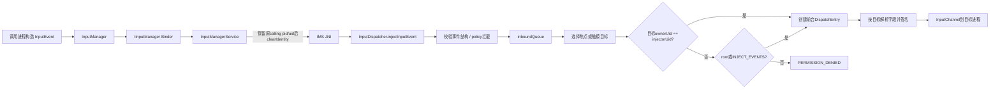
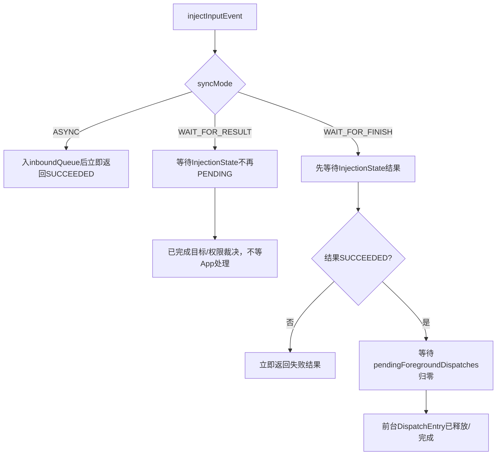
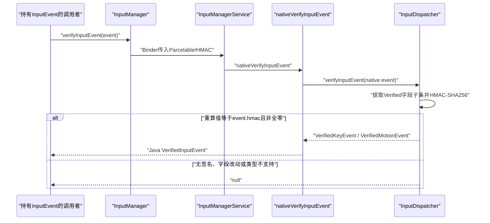

# 237 Android输入事件注入权限、注入模式与可信事件验证链

> 源码版本：Android 11 / `android-11.0.0_r48`  
> 学习方式：macOS只读核源，不编译、不运行AOSP

## 1. 本章要解决什么

上一章解释了真实或注入的MotionEntry怎样选择触摸目标。本章继续追“注入”本身：一个进程构造KeyEvent/MotionEvent后，系统如何校验、路由、等待和返回结果；App收到InputEvent后，又怎样验证其中一小部分字段没有被修改。

需要回答：

```text
INJECT_EVENTS权限是在Java入口检查，还是选出目标窗口后检查？
无此权限能否给自己的窗口注入？
ASYNC为什么总是先返回成功，却可能稍后在native日志中失败？
WAIT_FOR_RESULT和WAIT_FOR_FINISH究竟分别等到哪一步？
30秒注入timeout与窗口5秒输入ANR是什么关系？
软件注入事件的deviceId、HMAC和policy flags怎样处理？
InputDispatcher何时签名KeyEvent与MotionEvent？
VerifiedInputEvent为什么只返回字段子集？
验证成功能否证明事件一定来自物理键盘/触摸屏？
```

## 2. 一句总纲

Android 11把注入分成两条相互关联但不能混淆的安全链：

```text
授权链：记录Binder调用者PID/UID
→ 真正选出目标窗口
→ 同UID直接允许，跨UID要求INJECT_EVENTS

完整性链：InputDispatcher按最终目标动作/flags构造Verified字段子集
→ 用进程内随机密钥做HMAC-SHA256
→ App把收到的InputEvent交回系统重算
→ 匹配才返回VerifiedInputEvent
```

前者回答“谁可以把事件送给谁”，后者回答“系统保护的字段是否仍与分发时一致”。

## 3. 总体链路



## 4. 源码地图

Java与Binder：

```text
frameworks/base/core/java/android/hardware/input/InputManager.java
frameworks/base/core/java/android/hardware/input/IInputManager.aidl
frameworks/base/services/core/java/com/android/server/input/InputManagerService.java
frameworks/base/core/java/android/view/VerifiedInputEvent.java
frameworks/base/core/java/android/view/VerifiedKeyEvent.java
frameworks/base/core/java/android/view/VerifiedMotionEvent.java
```

JNI与native：

```text
frameworks/base/services/core/jni/com_android_server_input_InputManagerService.cpp
frameworks/native/services/inputflinger/dispatcher/InputDispatcher.cpp
frameworks/native/services/inputflinger/dispatcher/InjectionState.h
frameworks/native/services/inputflinger/dispatcher/InjectionState.cpp
frameworks/native/services/inputflinger/dispatcher/Entry.cpp
frameworks/native/include/input/Input.h
frameworks/native/libs/input/Input.cpp
frameworks/native/libs/input/InputTransport.cpp
```

## 5. 入口是隐藏系统API

`InputManager.injectInputEvent()`在Android 11带`@hide`和`@UnsupportedAppUsage`。

它不是普通第三方应用可稳定依赖的公开SDK能力，系统测试、Shell、无障碍/自动化相关受信组件通常通过各自受控入口使用底层注入能力。

## 6. Java入口先做参数校验

`InputManager`检查：

```text
event不能为null
mode只能是ASYNC、WAIT_FOR_RESULT、WAIT_FOR_FINISH
```

然后通过`IInputManager.injectInputEvent(in InputEvent ev, int mode)`进入system_server。

## 7. AIDL为什么写in InputEvent

`in`表示事件数据由调用者单向传给服务端。

它不会把native分发过程中改写后的对象原地回传给调用进程；结果只有一个boolean或SecurityException。

## 8. IMS重新校验参数

Binder入口`InputManagerService.injectInputEvent()`转到`injectInputEventInternal()`，再次检查null和mode。

服务端不能只相信客户端包装类，因为Binder调用者可能直接构造事务或来自不同版本代码。

## 9. 先保存真实Binder身份

IMS读取：

```java
final int pid = Binder.getCallingPid();
final int uid = Binder.getCallingUid();
```

这两个值之后写入`InjectionState`，是跨UID授权的主体身份。

## 10. clearCallingIdentity不会丢失注入者

IMS随后`Binder.clearCallingIdentity()`，以system_server自身身份进入native和策略回调，最后restore。

但原始pid/uid已经作为显式参数传给`nativeInjectInputEvent()`，所以安全检查没有被clearIdentity绕过。

## 11. Java固定30秒调用预算

Android 11 IMS常量：

```java
private static final int INJECTION_TIMEOUT_MILLIS = 30 * 1000;
```

该timeout传给native，供同步模式等待注入结果/完成使用。

## 12. Java还加入DISABLE_KEY_REPEAT

IMS传入的初始policy flag包含：

```text
WindowManagerPolicy.FLAG_DISABLE_KEY_REPEAT
```

注入一个按键DOWN不会自动启用与物理长按完全相同的系统按键重复生成行为。

## 13. JNI只接受KeyEvent或MotionEvent

`nativeInjectInputEvent()`判断Java对象类型：

```text
KeyEvent → 转换为native KeyEvent
MotionEvent → 取得native MotionEvent指针
其他InputEvent类型 → RuntimeException / FAILED
```

FocusEvent、DeviceReset等不是这个外部注入API支持的类型。

## 14. native先建立统一deadline

`InputDispatcher::injectInputEvent()`计算：

```cpp
endTime = now() + timeout;
```

WAIT_FOR_FINISH的“等目标选定”和“等前台处理完成”共享同一个30秒总预算，不是每阶段重新获得30秒。

## 15. 所有注入都标记INJECTED

native无条件加入：

```cpp
policyFlags |= POLICY_FLAG_INJECTED;
```

策略层可以据此区分注入事件与InputReader上报的普通事件。

## 16. TRUSTED与INJECTED不是反义词

如果注入者有全局注入权限，native还加入：

```cpp
POLICY_FLAG_TRUSTED
```

所以一个事件可以同时是`INJECTED | TRUSTED`。

`INJECTED`描述来源路径，`TRUSTED`描述策略层是否信任该注入者，两者不是互斥分类。

## 17. root被直接视为有注入权限

`hasInjectionPermission()`实现为：

```cpp
return injectorUid == 0 ||
        mPolicy->checkInjectEventsPermissionNonReentrant(pid, uid);
```

UID 0直接通过；其他UID回调Java Context权限检查。

## 18. 权限回调回到system_server Java

native policy通过JNI调用IMS：

```java
mContext.checkPermission(
        Manifest.permission.INJECT_EVENTS,
        injectorPid,
        injectorUid)
```

回调发生异常时native包装层清理异常并把结果当作false。

## 19. 为什么叫NonReentrant

InputDispatcher把需要触及Java策略/权限管理的调用放在不造成锁重入死锁的边界执行。

名字提醒实现者：不能在这条回调中以不可控方式重新进入持锁的InputDispatcher路径。

## 20. KeyEvent结构校验

native先检查action是否为可接受的KeyEvent动作。

无效动作直接返回`INPUT_EVENT_INJECTION_FAILED`，还没进入inboundQueue。

## 21. 注入KeyEvent的deviceId被重写

构造内部KeyEntry时使用：

```cpp
VIRTUAL_KEYBOARD_ID
```

不是盲目信任调用者填入的deviceId。

这避免软件伪装成某个具体物理键盘设备身份。

## 22. KeyEvent仍保留哪些调用者数据

保留/使用的主要字段有：

```text
event id、eventTime、source、displayId
action、flags、keyCode、scanCode、metaState
repeatCount、downTime
```

但Meta快捷键处理可能改写keyCode/metaState。

## 23. Meta快捷键可被加速改写

`accelerateMetaShortcuts()`会处理例如Meta+Backspace到BACK、Meta+Enter到HOME的替换，并维护DOWN/UP一致性。

因此注入参数不是简单原样穿过native。

## 24. VIRTUAL_HARD_KEY影响policy

若KeyEvent flags包含`AKEY_EVENT_FLAG_VIRTUAL_HARD_KEY`，InputDispatcher加入`POLICY_FLAG_VIRTUAL`。

这仍不改变其`POLICY_FLAG_INJECTED`身份。

## 25. policy可在入队前拦截Key

非`POLICY_FLAG_FILTERED`事件调用：

```text
interceptKeyBeforeQueueing
```

policy可修改policyFlags、消费或影响后续路由；调用过慢还会记录slow interception日志。

## 26. MotionEvent结构校验更多

`validateMotionEvent()`检查：

```text
action与actionButton是否合法
pointerCount是否合法
pointer ID/属性是否自洽
action index是否落在范围
```

非法多指结构不能进入TouchState。

## 27. 注入MotionEvent也重写deviceId

内部MotionEntry同样使用`VIRTUAL_KEYBOARD_ID`。

名称虽然叫keyboard ID，但在该版本中它也是软件注入输入的虚拟设备标识。

## 28. Motion保留坐标与历史样本

InputDispatcher复制：

```text
source、display、action、flags、meta/button/classification
edge flags、precision、cursor position、downTime
pointer properties、coords、x/y offset
历史sample eventTime与coords
```

每个历史sample被构造成一个MotionEntry入队。

## 29. Motion policy拦截入口

非filtered事件在持native锁前调用：

```text
interceptMotionBeforeQueueing(displayId, eventTime, policyFlags)
```

这与后面的窗口目标选择、INJECT_EVENTS裁决是不同阶段。

## 30. POLICY_FLAG_FILTERED是内部旁路语义

输入过滤器把事件重新送回InputDispatcher时会带`FILTERED`，避免再次进入同一个过滤/queueing policy回路。

普通调用者不能仅靠伪造MotionEvent字段获得此policy flag，它由受控内部入口参数提供。

## 31. InjectionState是什么

native为注入请求建立引用计数对象：

```cpp
struct InjectionState {
    int32_t injectorPid;
    int32_t injectorUid;
    int32_t injectionResult;
    bool injectionIsAsync;
    int32_t pendingForegroundDispatches;
};
```

## 32. 为什么不能只返回局部变量

调用线程可能在条件变量上等待，而InputDispatcher线程稍后才完成目标选择、投递和回执处理。

InjectionState跨线程、跨EventEntry和DispatchEntry共享这份结果账本。

## 33. 初始状态

构造时：

```text
injectionResult = PENDING
injectionIsAsync = false
pendingForegroundDispatches = 0
```

ASYNC模式再显式把`injectionIsAsync`设为true。

## 34. 事件怎样进入主分发循环

Key/Motion被包装成EventEntry并加入`mInboundQueue`。

若队列状态需要唤醒，调用`mLooper->wake()`，由InputDispatcher线程在正常`dispatchOnce()`循环中处理。

## 35. 注入不是直接调用View.dispatchTouchEvent

它仍经过：

```text
policy
inboundQueue
焦点/触摸目标选择
InputChannel
App ViewRoot输入流水线
finished signal
```

所以注入能复用真实系统路由语义，也会受到队列、焦点和ANR状态影响。

## 36. 权限为什么延迟到目标选择

是否需要`INJECT_EVENTS`取决于目标窗口ownerUid是否等于injectorUid。

目标可能由当前键盘焦点或DOWN坐标动态决定，因此Binder入口不能只看事件本身准确判断。

## 37. 同UID目标不要求全局权限

核心条件是：

```cpp
if (window == nullptr || ownerUid != injectorUid) {
    if (!hasInjectionPermission(pid, uid)) deny;
}
```

目标窗口ownerUid与注入者UID相同，就可通过该检查。

## 38. “自己的窗口”按UID而非PID

比较的是`ownerUid`，不是必须同进程。

共享UID场景中的另一个进程在这段检查上仍属于同一安全主体；现代应用一般不应依赖共享UID设计。

## 39. KeyEvent在焦点确定后检查

`findFocusedWindowTargetsLocked()`先取得目标Display的focused window，再调用`checkInjectionPermission(focusedWindow, injectionState)`。

焦点窗口属于其他UID且注入者无权限时返回`PERMISSION_DENIED`。

## 40. Pointer Motion对所有foreground目标检查

split touch可能同时有多个foreground窗口。

`findTouchedWindowTargetsLocked()`遍历临时TouchState中全部foreground目标，只要有一个跨UID且无权限，整次注入被拒绝。

## 41. outside与wallpaper不是权限主体

该触摸权限循环只检查带`FLAG_FOREGROUND`的TouchedWindow。

outside观察者和wallpaper副本不会单独要求注入者与其UID相同；真正的安全目标是前台手势接收者。

## 42. 无前台窗口时仍有最终权限检查

如果目标选择失败或只有monitor，代码可能调用：

```cpp
checkInjectionPermission(nullptr, injectionState)
```

`window == nullptr`时，没有全局权限的注入者不能借“无窗口/仅monitor”路径改变真实触摸状态。

## 43. PERMISSION_DENIED怎样回Java

同步模式拿到native结果后，IMS抛：

```text
SecurityException:
Injecting to another application requires INJECT_EVENTS permission
```

它不是普通false。

## 44. FAILED与TIMED_OUT怎样回Java

IMS映射为：

```text
SUCCEEDED → true
TIMED_OUT → warning + false
FAILED/其他 → warning + false
PERMISSION_DENIED → SecurityException
```

因此boolean false本身不能区分结构非法、无目标、状态冲突或超时；需结合日志与调用模式。

## 45. 三种同步模式总览



## 46. ASYNC的精确完成点

ASYNC在EventEntry已入inboundQueue并唤醒dispatcher后，直接把本次调用结果设为`SUCCEEDED`返回。

它没有等：

```text
目标选择
权限裁决
发布到InputChannel
App处理
finished signal
```

## 47. ASYNC为何“假定成功”

Java常量注释明确写：

```text
Never blocks. Injection is asynchronous and is assumed always to be successful.
```

这是调用协议的返回语义，不是系统保证最终事件一定送达。

## 48. ASYNC跨UID失败的特别陷阱

因为调用者已经拿到true，稍后目标选择发现权限不足只能由`setInjectionResult()`写native日志。

因此ASYNC不能用返回true证明自己拥有`INJECT_EVENTS`，也不能证明事件已到目标。

## 49. filtered异步事件为何少记结果日志

`setInjectionResult()`对`injectionIsAsync`且非filtered事件记录最终成功/失败/拒绝日志。

filtered内部回注路径被排除，避免输入过滤器正常工作产生重复噪声。

## 50. WAIT_FOR_RESULT等什么

调用线程等待条件变量：

```cpp
mInjectionResultAvailable
```

直到`injectionState->injectionResult`不再是PENDING，或总deadline耗尽。

## 51. result何时被设置

Key在`findFocusedWindowTargetsLocked()`返回目标结果后调用`setInjectionResult()`。

Motion在focused/touched目标选择完成后同样设置结果；若仍需等待窗口出现或paused状态，则保持PENDING。

## 52. WAIT_FOR_RESULT不等App finished

结果为SUCCEEDED说明InputDispatcher允许这次注入并找到了有效路由目标。

此时DispatchEntry可能刚入outboundQueue，App甚至还未读到事件。

## 53. 为什么要先等previous events

Key目标选择可能为前序未完成事件额外等待最多约500ms，因为前序触摸可能改变焦点。

所以WAIT_FOR_RESULT的耗时不仅是权限函数时间，还可能包含调度次序与焦点稳定等待。

## 54. WAIT_FOR_FINISH先复用RESULT阶段

WAIT_FOR_FINISH不是另一条独立算法。

它先等待`injectionResult`，只有结果为SUCCEEDED才进入第二个循环等待前台DispatchEntry计数归零。

## 55. 什么会增加pendingForegroundDispatches

每创建一个带foreground target的DispatchEntry：

```cpp
incrementPendingForegroundDispatches(newEntry);
```

一次事件若派生到多个foreground目标，计数可以大于1。

## 56. monitor和outside为何不阻塞WAIT_FOR_FINISH

计数只看`dispatchEntry->hasForegroundTarget()`。

global/gesture monitor、outside、wallpaper等非foreground副本即使仍未回执，也不属于这次注入的“前台完成等待”计数。

## 57. 计数何时减少

`releaseDispatchEntry()`在释放foreground DispatchEntry时调用：

```cpp
decrementPendingForegroundDispatches(eventEntry)
```

正常finished、连接清队列/断开等最终释放路径都能收回计数。

## 58. pending归零唤醒谁

计数变成0时通知：

```cpp
mInjectionSyncFinished.notify_all();
```

WAIT_FOR_FINISH调用线程才可结束第二阶段等待。

## 59. handled=false也算finish

App返回`handled=false`仍发送finished signal，DispatchEntry最终被释放。

所以WAIT_FOR_FINISH等待的是处理协议闭环，不要求业务层“消费成功”。

## 60. WAIT_FOR_FINISH不等界面显示

它不等待：

```text
下一次Choreographer traversal
RenderThread提交
SurfaceFlinger latch
HWC present fence
屏幕扫描显示
```

事件回执完成与视觉结果出现是两条时间线。

## 61. 注入30秒与窗口5秒ANR

窗口DispatchEntry仍使用目标自己的dispatching timeout，例如默认5秒，超时会走输入ANR处理。

注入调用线程则以IMS传入的30秒deadline决定自己最多等多久。

## 62. 两个timeout不是相加公式

不能简单写成“先5秒，再30秒”。

它们从不同对象、不同时间点并行约束：一个驱动窗口响应诊断，另一个限制同步注入调用的总等待。

## 63. ANR后WAIT_FOR_FINISH可能怎样结束

若系统取消/清理连接DispatchEntry，pending计数随释放归零，调用可能结束。

若在30秒总deadline前仍未归零，则注入结果变`TIMED_OUT`；这不要求ANR流程必须已经杀死App。

## 64. Motion历史样本的结果账本边界

r48把MotionEvent历史sample展开为多个MotionEntry，却只把同一个InjectionState挂到队列最后一个entry。

这使同步返回和foreground完成计数以最后样本为代表；不要把每个历史sample理解成各自拥有独立Java调用结果。

## 65. setInjectionResult也处理丢弃

事件若在inbound/pending阶段被清理，而InjectionState仍PENDING，`releaseInboundEventLocked()`会把它设为FAILED。

这样同步调用不会因队列被排空而永远睡眠。

## 66. 注入返回时对象生命周期

InjectionState由调用栈、EventEntry和派生DispatchEntry共同引用。

调用线程结束等待后`release()`自己的引用，其他队列对象尚存在时状态对象继续存活。

## 67. 接下来为什么还需要HMAC

InputEvent通过InputChannel进入App后，App代码可能复制或修改对象字段。

某些系统组件需要知道“这几个关键字段是否仍是InputDispatcher最终发布的值”，不能只相信调用者传回的普通Parcelable。

## 68. HMAC密钥在哪里生成

InputDispatcher构造`HmacKeyManager`时用`RAND_bytes`生成：

```text
128字节随机密钥
```

生成失败直接fatal，因为没有可靠密钥就无法提供此完整性保证。

## 69. 密钥不会随InputEvent发送给App

InputTransport只把32字节HMAC随事件发给客户端。

重算签名仍在持有秘密密钥的InputDispatcher中进行，App拿不到用于伪造任意已保护字段的密钥。

## 70. 密钥生命周期边界

密钥是InputDispatcher实例的内存状态，没有在本章路径中持久化。

system_server/input dispatcher重启后会生成新随机密钥，旧事件的HMAC不应期待跨重启继续验证。

## 71. 签名算法

实现调用OpenSSL：

```text
HMAC(EVP_sha256(), key, packed VerifiedEvent bytes)
```

输出固定32字节；全零`INVALID_HMAC`表示未签名或签名失败。

## 72. 为什么签packed struct

native `VerifiedInputEvent/Key/Motion`带`__attribute__((__packed__))`，并有结构布局测试。

HMAC直接覆盖结构字节，必须避免编译器padding差异让同样字段产生不稳定输入。

## 73. KeyEvent何时签名

InputDispatcher发布到目标InputChannel前调用：

```cpp
getSignature(keyEntry, dispatchEntry)
```

KeyEvent每次发布都会从最终解析后的字段构造VerifiedKeyEvent并签名。

## 74. 为什么使用resolvedAction/resolvedFlags

policy、取消合成或目标分发可能改变动作/flags。

签名必须覆盖客户端实际看到的值，因此覆盖`DispatchEntry.resolvedAction`和筛选后的`resolvedFlags`，而不是机械签最早的Entry原值。

## 75. Key可验证字段

公共基础字段：

```text
deviceId、eventTimeNanos、source、displayId
```

Key专属字段：

```text
action、downTimeNanos、受支持flags
keyCode、scanCode、metaState、repeatCount
```

## 76. Key flags只验证CANCELED

Android 11常量：

```cpp
VERIFIED_KEY_EVENT_FLAGS = AKEY_EVENT_FLAG_CANCELED;
```

其他KeyEvent flags不进入VerifiedKeyEvent可信结果。

## 77. getFlag为何返回Boolean而非boolean

`VerifiedKeyEvent.getFlag(flag)`：

```text
支持FLAG_CANCELED → true/false
不支持的flag → null
```

null表示“系统没有验证这个flag”，不是false。

## 78. Motion只签DOWN和UP

`getSignature(MotionEntry, DispatchEntry)`仅当最终masked action为：

```text
ACTION_DOWN
ACTION_UP
```

才生成签名。

纯MOVE被视为由其DOWN/UP序列约束，返回`INVALID_HMAC`。

## 79. POINTER_DOWN/POINTER_UP也不签

条件只比较`ACTION_DOWN`与`ACTION_UP`，不包含`ACTION_POINTER_DOWN/UP`。

因此多指中间动作通常无法通过`verifyInputEvent()`得到VerifiedMotionEvent。

## 80. 派生DOWN可能被签名

第236章的split或slippery enter可能把原始POINTER_DOWN/MOVE解析成某目标看到的`ACTION_DOWN`。

签名看`dispatchEntry.resolvedAction`，因此该目标实际收到的派生DOWN可以获得与其最终语义对应的HMAC。

## 81. Motion可验证字段

基础字段之外只包含：

```text
primary pointer rawX/rawY
actionMasked
downTimeNanos
受支持flags
metaState、buttonState
```

## 82. Motion没有验证哪些常见字段

VerifiedMotionEvent不包含：

```text
全部pointer列表与pointer ID/tool type
第二及后续指针坐标
pressure、size、orientation等axis
history samples
precision、edgeFlags、classification
action pointer index
```

不能从验证成功推断这些未返回字段也可信。

## 83. Motion flags只验证遮挡两位

Android 11常量为：

```text
FLAG_WINDOW_IS_OBSCURED
FLAG_WINDOW_IS_PARTIALLY_OBSCURED
```

这两位由InputDispatcher针对具体目标计算，适合安全敏感组件确认覆盖风险。

## 84. Motion flag的三态

`VerifiedMotionEvent.getFlag(flag)`同样返回：

```text
true：已验证且置位
false：已验证且未置位
null：这个flag不在验证集合
```

## 85. 为什么只取primary rawX/rawY

签名结构固定、小而稳定；Android 11只承诺主指针原始坐标的完整性。

这也是为什么VerifiedInputEvent明确叫InputEvent的“subset”，不是可替代原MotionEvent的完整副本。

## 86. 验证调用链



## 87. verify入口没有INJECT_EVENTS检查

验证不是向其他窗口发送事件，而是让系统检查调用者持有的InputEvent签名。

`IInputManager.verifyInputEvent()`没有本章注入权限裁决；能否验证取决于HMAC是否匹配。

## 88. 验证怎样重算

native按输入对象类型重新提取同一Verified字段结构，用当前HmacKeyManager签名，再比较：

```text
calculatedHmac != INVALID_HMAC
calculatedHmac == event.getHmac()
```

两者同时成立才返回结果。

## 89. 修改受保护字段会怎样

例如App改动已签名KeyEvent的keyCode、eventTime或metaState，重算HMAC不同，返回null。

它无法仅同步修改HMAC，因为不知道随机密钥。

## 90. 修改未保护字段会怎样

未进入Verified结构的字段不会影响重算。

验证仍可能成功，但返回对象也不会声称该字段可信。这正是“返回字段子集”而不是返回true/false的原因。

## 91. null不是“确定伪造”

Java文档明确提示：返回null不意味着事件一定不是系统来源。

正常原因包括：

```text
Motion MOVE/POINTER动作本来就没有签名
旧事件跨InputDispatcher重启，密钥已变化
事件类型不支持
HMAC是INVALID_HMAC
受保护字段被合法代码改写/重构
```

## 92. 验证成功也不等于物理硬件来源

InputDispatcher在最终发布阶段签名，软件注入事件也会走该发布函数。

因此成功准确表示“这些字段与本InputDispatcher签发的内容一致”，不能单凭它证明事件一定来自真实触摸屏而非获授权或同UID的软件注入。

## 93. deviceId可帮助但不是硬件证明

外部注入路径把deviceId改成`VIRTUAL_KEYBOARD_ID`，Verified结果会包含它。

调用者可把deviceId作为来源判断的一个信号，但安全结论仍应结合API身份、策略、事件来源及业务上下文，不能把某个整数当作密码学硬件证明。

## 94. HMAC不是加密

InputEvent字段和HMAC都通过InputChannel/Parcel以明文结构传输。

HMAC提供完整性与持钥方认证，不负责隐藏坐标、按键或时间数据。

## 95. HMAC也不是防重放token

Verified结构没有独立nonce、调用者身份或一次性消费记录。

同一已签名事件对象被再次提交验证，系统没有在这条代码里建立“只能验证一次”的账本。

## 96. event ID没有进入Verified结构

VerifiedInputEvent基础字段不含普通InputEvent ID。

所以验证成功不证明某个外部展示的event ID；可信字段必须以返回的Verified对象实际包含内容为准。

## 97. raw坐标与窗口局部坐标

签名Motion字段使用primary pointer的raw X/Y语义。

窗口投递时还可应用offset/scale生成局部坐标；VerifiedMotionEvent不是用于证明任意View局部坐标变换全过程。

## 98. 遮挡flag为何按目标签名

同一原始触摸可能发给前台、wallpaper或其他目标，各目标遮挡状态不同。

InputDispatcher在`DispatchEntry.resolvedFlags`形成后签名，确保App验证的是自己实际收到的遮挡判断。

## 99. split事件为何需要新签名

split可重写action、pointer集合和event ID。

签名不复用上游InputEvent自带HMAC，而是InputDispatcher按派生后可验证字段重新生成，避免把旧签名错误套在新语义上。

## 100. 注入输入的传入HMAC不会被信任

构造内部注入KeyEvent时显式使用`INVALID_HMAC`，MotionEntry发布时同样由InputDispatcher重新计算目标签名。

调用者不能携带一个旧HMAC让任意新注入内容自动成为Verified事件。

## 101. 签名失败怎样表现

HMAC调用失败或长度异常时返回全零`INVALID_HMAC`。

事件仍可按普通输入协议发布，但之后`verifyInputEvent()`返回null；完整性验证的不可用不必然等于分发本身失败。

## 102. 常见误解一：调用inject前先统一检查权限

错误。

IMS保留调用者身份，native先建事件并路由，到实际目标UID确定后才做关键跨UID权限裁决。

## 103. 常见误解二：没有INJECT_EVENTS完全不能注入

错误。

本章native检查允许注入者向同UID拥有的窗口注入；跨UID或无明确自身窗口的路径才需要全局权限。

## 104. 常见误解三：ASYNC返回true就是目标收到

错误。

它只表示已接受进入异步队列，后续仍可能因权限、无窗口、事件序列或策略失败。

## 105. 常见误解四：WAIT_FOR_RESULT等App处理

错误。

它等目标与权限结果；只有WAIT_FOR_FINISH进一步等foreground DispatchEntry完成。

## 106. 常见误解五：WAIT_FOR_FINISH等业务成功

错误。

`handled=false`也可正常完成回执；它更不等待绘制或硬件present。

## 107. 常见误解六：VerifiedInputEvent验证整个对象

错误。

只验证返回对象列出的字段子集；未知flag的`getFlag()`返回null正是在表达边界。

## 108. 常见误解七：验证成功就是物理事件

错误。

授权软件注入也经过InputDispatcher目标签名。HMAC证明系统签发字段完整性，不证明物理传感器来源。

## 109. 常见误解八：null一定是攻击

错误。

MOVE等事件在r48本来就用INVALID_HMAC，正常情况下也会验证为null。

## 110. 一条Key注入时间线

```text
调用者构造KeyEvent(display/source/time)
→ Binder把pid/uid留给IMS
→ native改用VIRTUAL_KEYBOARD_ID并打INJECTED
→ policy interceptKeyBeforeQueueing
→ inboundQueue等待前序事件/焦点稳定
→ focused window确定
→ 同UID或INJECT_EVENTS通过
→ injectionResult=SUCCEEDED
→ 前台DispatchEntry计数+1
→ 按最终action/flags构造VerifiedKeyEvent并签名
→ App收到并finished
→ DispatchEntry释放、计数-1
```

ASYNC在入队后就返回；WAIT_FOR_RESULT在目标成功处返回；WAIT_FOR_FINISH在计数归零后返回。

## 111. 一条Motion注入时间线

```text
调用者构造合法多指MotionEvent
→ native结构校验、deviceId重写、policy拦截
→ 入inboundQueue
→ DOWN根据坐标建立临时TouchState
→ 对全部foreground目标检查注入权限
→ 成功后提交TouchState并创建DispatchEntry
→ split目标按pointer ID派生动作
→ 仅最终DOWN/UP生成Motion HMAC
→ App finished并更新WAIT_FOR_FINISH计数
```

## 112. 安全敏感组件应怎样使用Verified结果

合理模式是：

```text
先判result是否null
→ 只读取Verified对象暴露字段
→ 对getFlag的null/false/true做三态处理
→ 结合调用者身份、deviceId、业务状态和防重放设计
```

不要验证成功后转而信任原MotionEvent中未覆盖的pressure、全部坐标或历史样本。

## 113. 注入调试检查清单

```text
1. Java mode是否正确、timeout是否耗尽
2. Binder calling pid/uid是谁
3. event type/action/pointer结构是否合法
4. policyFlags是否INJECTED/TRUSTED/FILTERED
5. target window ownerUid是否等于injectorUid
6. focused window/TouchState是否处于PENDING
7. injectionResult何时从PENDING改变
8. foreground DispatchEntry计数是否归零
9. App是否finished而非仅handled=true
```

## 114. 验证调试检查清单

```text
1. 是Key、Motion DOWN/UP，还是本来不签名的MOVE
2. InputEvent HMAC是否全零
3. 是否跨system_server重启
4. 哪个受保护字段被复制/修改
5. flag是否属于VERIFIED_*_EVENT_FLAGS
6. 代码是否误把null当作确定攻击
7. 代码是否误信任Verified对象未包含的字段
```

## 115. macOS只读练习一：追三种mode

```bash
cd /Users/ninebot/androidSource
sed -n '3274,3475p' \
  frameworks/native/services/inputflinger/dispatcher/InputDispatcher.cpp
```

分别标出ASYNC返回点、RESULT条件变量、FINISH计数循环和共用deadline。

## 116. macOS只读练习二：追跨UID权限

```bash
cd /Users/ninebot/androidSource
sed -n '2048,2080p' \
  frameworks/native/services/inputflinger/dispatcher/InputDispatcher.cpp
sed -n '1390,1470p' \
  frameworks/native/services/inputflinger/dispatcher/InputDispatcher.cpp
```

手写四格表：同UID/跨UID × 有权限/无权限，并解释为什么窗口为null时走全局权限检查。

## 117. macOS只读练习三：列出签名字段

```bash
cd /Users/ninebot/androidSource
sed -n '775,835p' frameworks/native/include/input/Input.h
sed -n '2610,2640p' \
  frameworks/native/services/inputflinger/dispatcher/InputDispatcher.cpp
```

不要抄整个InputEvent，只列出VerifiedKey与VerifiedMotion真正覆盖的字段，并圈出Motion动作限制。

## 118. macOS只读练习四：验证三态flag

```bash
cd /Users/ninebot/androidSource
sed -n '35,135p' \
  frameworks/base/core/java/android/view/VerifiedMotionEvent.java
sed -n '35,125p' \
  frameworks/base/core/java/android/view/VerifiedKeyEvent.java
```

解释`true`、`false`、`null`三种结果，写一个“不把null误判成false”的伪代码判断。

## 119. 复读后最容易不理解的地方

第一次读完最容易混淆四组概念：

```text
INJECTED与TRUSTED：可同时成立
RESULT与FINISH：目标允许投递 vs 前台回执闭环
30秒注入deadline与5秒窗口ANR：并行约束而非串行相加
系统签发完整性与物理硬件真实性：不是同一保证
```

## 120. 复读修订一：权限不是Binder入口“一刀切”

更准确的说法是：入口保存身份并预计算是否拥有全局权限；真正拒绝发生在目标窗口ownerUid已知之后。

这既允许同UID注入，也防止调用者利用动态焦点把事件送进其他应用。

## 121. 复读修订二：FINISH只数foreground

“等待事件全部接收者处理完”仍不准确。

r48的`pendingForegroundDispatches`不计monitor、outside和其他非foreground副本；应说“等待本注入关联的前台DispatchEntry释放”。

## 122. 复读修订三：HMAC签的是最终可验证语义

不是在InputReader或Java对象刚创建时对整个对象盖章。

签名在每个目标发布前形成，覆盖resolved action/flags与规定字段子集，所以不同目标派生语义可有不同签名结果。

## 123. 复读修订四：验证失败保持保守未知

`verifyInputEvent()`返回null应理解为“系统无法为该字段子集提供验证结果”。

安全策略可以拒绝未知，但诊断文字不应直接宣称“已证明事件伪造”。

## 124. r48版本细节：ACTION_MULTIPLE不能注入

`KeyEvent`公共常量中虽然存在`ACTION_MULTIPLE`，但本版InputDispatcher的`validateKeyEvent()`只接受：

```text
ACTION_DOWN
ACTION_UP
```

AOSP测试也明确断言注入`ACTION_MULTIPLE`返回FAILED。不要因为`KeyEvent.actionToString()`认识MULTIPLE，就推断注入入口也支持它。

## 125. 本章版本边界

本章结论限定Android 11 r48：

```text
IMS同步注入总timeout固定30秒
注入内部deviceId使用VIRTUAL_KEYBOARD_ID
Motion只为最终ACTION_DOWN/UP签名
Key只验证CANCELED flag
Motion只验证OBSCURED/PARTIALLY_OBSCURED flags
HMAC密钥为InputDispatcher实例内随机128字节
```

后续版本可能扩大字段、改变输入验证实现或收紧注入策略，必须重新核源。

## 126. 本章检查清单

读完应能独立解释：

```text
[ ] Binder calling identity怎样安全传到native
[ ] 同UID与跨UID注入权限的不同
[ ] INJECTED和TRUSTED为什么可同时存在
[ ] ASYNC、WAIT_FOR_RESULT、WAIT_FOR_FINISH的完成点
[ ] pendingForegroundDispatches怎样增减
[ ] 30秒调用deadline与输入ANR的关系
[ ] Key/Motion哪些字段进入HMAC
[ ] 为什么MOVE通常验证为null
[ ] Boolean flag三态如何使用
[ ] 验证成功为何不能证明物理硬件来源
```

## 127. 本章小结

Android 11的注入链没有绕过正常输入系统，而是把调用者身份带进同一套目标选择和Connection分发：

```text
Java/Binder保存真实PID/UID
→ native校验结构、标记INJECTED并进入inboundQueue
→ 目标确定后按ownerUid裁决INJECT_EVENTS
→ 三种mode分别停在入队、目标结果、前台回执三个层次
→ 发布前按最终目标语义提取Verified字段并做HMAC
→ App可把事件交回系统验证字段子集
```

最重要的边界是：权限决定“能不能送”，同步模式决定“等到哪里”，HMAC决定“哪些字段未被改”，三者不能互相替代。

## 128. 下一章预告

下一章继续输入控制权：从WMS/IMS的`transferTouchFocus()`进入InputDispatcher，解释已有触摸流怎样从一个InputChannel迁移到另一个、旧目标为何收到CANCEL或新目标怎样获得DOWN，以及它与pilfer、split touch和SurfaceView嵌入窗口的区别。
