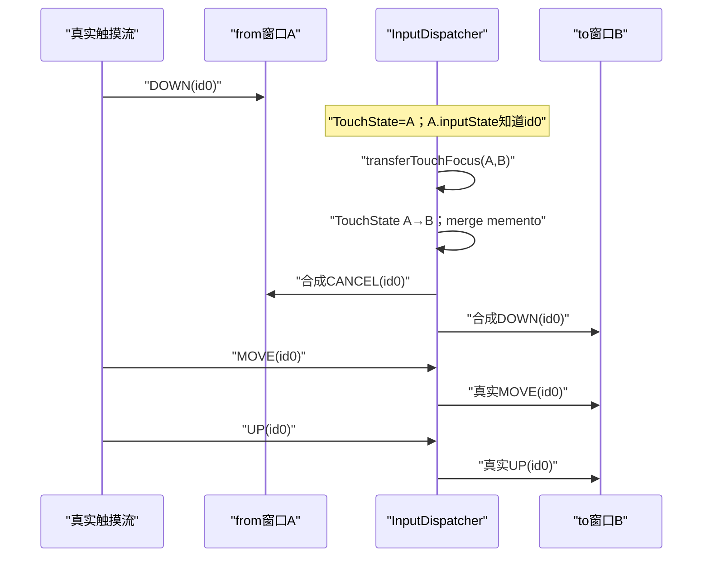
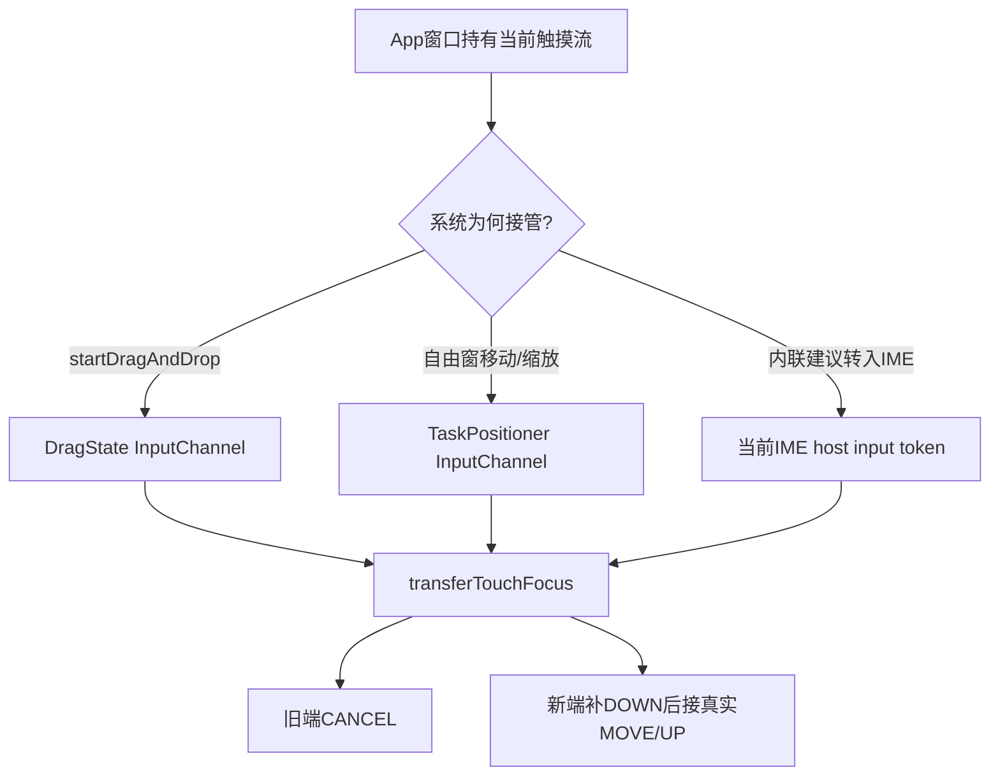

# 238 Android transferTouchFocus触摸流迁移、InputState补事件与系统接管链

> 源码版本：Android 11 / `android-11.0.0_r48`  
> 学习方式：macOS只读核源，不编译、不运行AOSP

## 1. 本章要解决什么

第236章看到gesture monitor可用`pilferPointers()`取消普通窗口并保留监控者。本章研究另一种“当前手势中途换接收者”的机制：`transferTouchFocus(fromToken, toToken)`。

需要回答：

```text
名字里的touch focus与键盘焦点是否相同？
迁移为什么要同时修改TouchState与Connection.inputState？
旧窗口收到CANCEL后，新窗口怎样凭空得到合法DOWN序列？
两指非split与两窗口split时，补事件有什么不同？
迁移会不会重新按坐标命中目标？
目标窗口为空touchable region为何仍能接管现有流？
拖拽、Task缩放和IME内联建议怎样使用它？
它与pilferPointers、slippery和普通split touch有什么区别？
返回true究竟保证到哪一步？
```

## 2. 一句总纲

`transferTouchFocus()`不是改变键盘焦点，也不是把同一MotionEvent简单转发，而是一次原子化触摸流交接：

```text
在TouchState中把from窗口的未来路由条目换成to窗口
→ 把from Connection已知的pointer memento合并到to Connection
→ 给from合成ACTION_CANCEL清理旧端状态
→ 给to补齐它尚未见过的DOWN/POINTER_DOWN序列
→ 后续真实MOVE/UP沿新的TouchState继续
```

两本状态账必须一起迁移，才能同时保证“未来发给谁”和“每个接收端看到的事件序列合法”。

## 3. 总体链路

```mermaid
flowchart LR
    SYS["WMS / IMMS内部调用者"] --> IMS["InputManagerService"]
    IMS --> JNI["nativeTransferTouchFocus"]
    JNI --> ID["InputDispatcher.transferTouchFocus"]
    ID --> CHECK["查from/to窗口、同Display、from在TouchState"]
    CHECK --> TS["TouchState: 删除from，加入/合并to"]
    TS --> MERGE["from.inputState → to.inputState合并pointer memento"]
    MERGE --> CANCEL["from合成ACTION_CANCEL"]
    CANCEL --> DOWN["to补DOWN / POINTER_DOWN"]
    DOWN --> NEXT["后续真实MOVE/UP发给to"]
```



## 4. 源码地图

native核心：

```text
frameworks/native/services/inputflinger/dispatcher/InputDispatcher.cpp
frameworks/native/services/inputflinger/dispatcher/InputDispatcher.h
frameworks/native/services/inputflinger/dispatcher/InputState.cpp
frameworks/native/services/inputflinger/dispatcher/InputState.h
frameworks/native/services/inputflinger/dispatcher/TouchState.cpp
frameworks/native/services/inputflinger/tests/InputDispatcher_test.cpp
```

Java/JNI入口与使用者：

```text
frameworks/base/services/core/java/com/android/server/input/InputManagerService.java
frameworks/base/services/core/jni/com_android_server_input_InputManagerService.cpp
frameworks/base/services/core/java/com/android/server/wm/WindowManagerInternal.java
frameworks/base/services/core/java/com/android/server/wm/DragState.java
frameworks/base/services/core/java/com/android/server/wm/DragDropController.java
frameworks/base/services/core/java/com/android/server/wm/TaskPositioningController.java
frameworks/base/services/core/java/com/android/server/inputmethod/InputMethodManagerService.java
frameworks/base/services/autofill/java/com/android/server/autofill/ui/RemoteInlineSuggestionViewConnector.java
```

## 5. touch focus不是键盘focus

这里的focus表示“当前触摸流归哪个InputChannel所有”。

它不修改：

```text
InputWindowInfo.hasFocus
mFocusedWindowHandlesByDisplay
WMS当前焦点窗口
App的View焦点或IME编辑焦点
```

所以更不易误解的中文是“触摸流所有权迁移”。

## 6. 为什么需要显式迁移

普通手势在ACTION_DOWN时锁定窗口，后续MOVE不会重新hit-test。

系统开始拖拽或窗口缩放时，希望后续MOVE交给系统专用InputChannel，而不是继续发给最初App；仅把新系统窗口放到最上层不够，因为手势所有权已经锁定。

## 7. API不是普通App的公开Binder接口

Android 11的主要入口位于`InputManagerService`及`InputManagerInternal.LocalService`。

调用者是WMS、IMMS等system_server内部受信组件，不是让任意App拿两个token迁移别人的触摸流。

## 8. 两种Java参数形式

IMS提供：

```text
transferTouchFocus(InputChannel from, InputChannel to)
transferTouchFocus(IBinder fromToken, IBinder toToken)
```

最终都只向JNI传两个InputChannel connection token。

## 9. 为什么用InputChannel token

触摸最终发布到Connection/InputChannel，而不是Java Window对象。

token让InputDispatcher能同时找到：

```text
InputWindowHandle：用于TouchState路由
Connection：用于实际通道及per-connection InputState
```

## 10. JNI只做薄转换

`nativeTransferTouchFocus()`：

```text
任一Java token为null → false
Java IBinder → native sp<IBinder>
调用InputDispatcher.transferTouchFocus
bool原样转JNI_TRUE/JNI_FALSE
```

没有在JNI重建MotionEvent。

## 11. 相同token的快速成功

native第一句检查：

```cpp
if (fromToken == toToken) return true;
```

相同源与目标被视为无需工作的trivial transfer。

## 12. 这个快速路径的边界

它发生在加锁和窗口存在性检查之前。

因此native直接调用时，即便同一个无效token也会true；正常Java JNI入口先拒绝null，但不会验证非null token是否注册。调用者不能把true一概理解为“完成了一次真实迁移”。

## 13. 迁移在InputDispatcher锁内完成

窗口查询、TouchState替换、Connection InputState合并、CANCEL与DOWN入队都在`mLock`保护下。

这样正常分发线程看不到只改了一半的中间状态。

## 14. from和to必须都在窗口快照中

通过`getWindowHandleLocked(token)`找任一失败即返回false：

```text
Cannot transfer focus because from or to window not found.
```

仅注册InputChannel还不一定足够；InputDispatcher还要能把token映射到当前InputWindowHandle。

## 15. 两窗口必须同Display

若`fromWindowHandle.displayId != toWindowHandle.displayId`，返回false。

Android 11此API不负责跨Display变换坐标、迁移TouchState map键或改变流的displayId。

## 16. 不会按to窗口坐标重新命中

代码不检查当前指针是否落在to的frame/touchableRegion。

to是受信系统调用者显式指定的接管目标，这与DOWN时的普通窗口hit-test完全不同。

## 17. to窗口可以touchableRegion为空

DragState的系统拖拽InputWindowHandle明确把touchableRegion设空，注释写“cannot receive new touches”。transfer本身不检查Region，所以这不妨碍它接管已有流。

但要注意r48实际命中条件：Drag窗口同时令`layoutParamsFlags=0`，InputDispatcher会把它视为touch-modal；touch-modal分支可不看Region直接命中。因此“空Region必然阻止任何新DOWN”不能仅凭这句注释成立，实际还依赖拖拽窗口只在当前手势期间短暂存在等时序约束。

## 18. from必须真的出现在TouchState

InputDispatcher遍历所有Display的TouchState及其中`state.windows`，查找windowHandle等于from。

找不到时返回false，并记录“from window did not have focus”。

这里说的focus仍是触摸所有权，不是`hasFocus`。

## 19. 只迁移指定窗口条目

找到from后只删除这一项：

```cpp
state.windows.erase(state.windows.begin() + i);
```

同一split手势中的其他窗口、wallpaper或其他保留目标不受影响。

## 20. 保存旧flags与pointerIds

删除前取出：

```text
oldTargetFlags
pointerIds
```

pointerIds表示split场景下from拥有的那部分指针集合。

## 21. 新目标只继承三类flag

代码保留：

```cpp
FLAG_FOREGROUND
FLAG_SPLIT
FLAG_DISPATCH_AS_IS
```

其他旧目标flag不会复制。

## 22. 为什么不继承所有flag

obscured、partially obscured、zero coords、outside、slippery等是针对旧窗口或当次分发模式计算的事实。

把它们机械套到to窗口会把旧目标几何/角色污染到新目标。

## 23. to已在TouchState中会合并

`state.addOrUpdateWindow(to, flags, pointerIds)`发现to已存在时：

```text
targetFlags按位OR
pointerIds按位OR
```

这正是split场景“B已有id1，再把A的id0交给B”的处理方式。

## 24. TouchState改写解决未来路由

迁移后，下一次真实MOVE/POINTER_UP/UP遍历的是更新后的`state.windows`。

因此from不再收到后续真实流，to以合并后的pointerIds成为目标。

## 25. 但只改TouchState仍不够

假设to从未收到DOWN，直接把下一次MOVE发给to：

```text
to Connection.inputState认为当前没有按下指针
trackMotion会判MOVE序列不一致并丢弃
App也无法理解没有DOWN的MOVE
```

所以还要迁移每个Connection已经观察到的输入状态。

## 26. Connection.inputState是什么

每个Connection有独立`InputState`，跟踪已成功排入该通道的：

```text
Key mementos
Motion mementos
fallback key关系
```

它用于验证序列一致性，以及在窗口移除、ANR、迁移时合成CANCEL或补事件。

## 27. TouchState与InputState不能混淆

```text
TouchState：InputDispatcher全局按Display记“以后应发给哪些窗口”
InputState：每个Connection记“这个接收端已经看过哪些DOWN/指针”
```

前者是路由账，后者是接收端协议账。

## 28. InputState的MotionMemento

它保存：

```text
deviceId、source、displayId
flags、precision、cursor position、downTime
pointerCount
每个PointerProperties与最后PointerCoords
hovering、policyFlags
firstNewPointerIdx
```

## 29. memento不是完整历史事件

它只保存构造合法后续/取消事件所需的当前状态，不保存整条MOVE历史。

所以迁移补出的DOWN不是重放原始事件字节流，而是依据当前memento重新合成协议起点。

## 30. 何时执行Connection迁移

TouchState找到并替换成功后，代码取得：

```text
fromConnection
toConnection
```

只有两者都非null，才执行InputState合并、旧端CANCEL和新端DOWN补齐。

## 31. mergePointerStateTo只迁移pointer类Motion

源InputState遍历MotionMementos，只处理：

```cpp
source & AINPUT_SOURCE_CLASS_POINTER
```

不会迁移Key memento、fallback key或非pointer joystick/trackball状态。

## 32. 为什么Key不迁移

API目标是当前触摸流所有权，不是键盘焦点转移。

把Key DOWN状态一并带走会让新通道凭空接管按键，与方法契约相悖。

## 33. memento匹配键

若to已有相同：

```text
deviceId + source + displayId
```

的MotionMemento，from的指针追加到其中。

这适配同一物理手势已因split分给两个窗口的情况。

## 34. to原本没有流

如果找不到匹配memento：

```text
from memento副本加入to
firstNewPointerIdx = 0
```

含义是：to对这些指针一个都不知道，稍后必须从第一个DOWN开始补。

## 35. to原本已有部分指针

合并前记录：

```text
firstNewPointerIdx = other.pointerCount
```

旧pointer位于该index之前，新追加pointer位于之后；稍后只为新增部分合成POINTER_DOWN。

## 36. 源InputState不会在merge中立即删除

`mergePointerStateTo()`是复制/追加语义。

源端状态要留到下一步生成准确CANCEL；CANCEL进入源Connection时，`trackMotion()`再删除对应memento。

## 37. 旧端怎样得到CANCEL

构造：

```cpp
CancelationOptions(CANCEL_POINTER_EVENTS,
    "transferring touch focus from this window to another window")
```

然后对fromConnection调用`synthesizeCancelationEventsForConnectionLocked()`。

## 38. CANCEL使用最后已知指针快照

InputState根据MotionMemento生成ACTION_CANCEL，包含当前pointerCount、properties和最后coords，并保留原downTime等关键流身份。

这让旧端所有GestureDetector/View pressed状态有机会统一清理。

## 39. CANCEL不是原始下一帧改写

它以`now()`为eventTime并获得新的InputDispatcher event ID。

所以迁移是主动插入一条合成事件，不是等待下一次硬件MOVE再把它变成CANCEL。

## 40. 新端怎样得到DOWN

调用：

```cpp
synthesizePointerDownEventsForConnectionLocked(toConnection)
```

它从to.inputState的`firstNewPointerIdx`判断哪些指针尚未被to观察。

## 41. to完全未知：先ACTION_DOWN

若`firstNewPointerIdx == 0`，第一个新指针生成：

```text
ACTION_DOWN
pointerCount = 1
```

第二、第三个新指针再依次生成POINTER_DOWN。

## 42. 两指非split迁移

from已拥有id0、id1，to原本没有任何memento：

```text
from收到CANCEL(id0,id1)
to收到DOWN(id0)
to收到POINTER_DOWN(id0,id1; actionIndex=1)
```

之后真实POINTER_UP/UP都发给to。

## 43. to已有部分指针：只补新增POINTER_DOWN

split场景中B已经收到id1的局部DOWN，A拥有id0。

A迁移到B后，B的memento先保留已知id1，再追加id0并把`firstNewPointerIdx`设为旧count。

## 44. split迁移的局部序列

假设B已知指针数组位置0是id1，新追加位置1是id0：

```text
A收到CANCEL(id0)
B不再补ACTION_DOWN
B只收到POINTER_DOWN(id1,id0; actionIndex=1)
```

测试只断言动作index为1；理解时应以目标memento里的实际数组顺序为准，不假定pointer ID按数值排序。

## 45. 三种迁移时间线



## 46. 补事件的eventTime与downTime

合成DOWN/POINTER_DOWN使用当前`now()`作为eventTime，但沿用memento原始downTime。

这表示“to从现在开始观察一条早已开始的手势”，不能把两者时间相等当作不变量。

## 47. 补事件保留哪些内容

主要保留：

```text
device/source/display
policyFlags、部分flags
precision、cursor position
原downTime
当前pointer properties/coords
```

## 48. 补事件重置哪些内容

构造时明确使用：

```text
actionButton = 0
metaState = AMETA_NONE
buttonState = 0
classification = NONE
edgeFlags = NONE
xOffset/yOffset = 0
```

它是序列修复事件，不保证复刻原始DOWN的每个附属字段。

## 49. 坐标怎样适配to窗口

合成事件Entry保存全局/原始pointer状态，入to Connection前创建InputTarget时按to窗口当前：

```text
-frameLeft/-frameTop
windowXScale/windowYScale
globalScaleFactor
```

设置目标坐标变换。

## 50. 补事件怎样更新to.inputState

先生成EventEntry列表并把`firstNewPointerIdx`复位为INVALID，再逐个调用`enqueueDispatchEntryLocked()`。

其内部`trackMotion()`按DOWN、POINTER_DOWN依次重建to的已知流，确保随后真实MOVE合法。

## 51. 为什么先merge再CANCEL再DOWN

逻辑依赖顺序：

```text
先merge：to获得当前pointer快照与“新增边界”
再CANCEL：from用尚存memento合成完整取消
再DOWN：to用合并状态补合法起点
```

调换顺序可能先清掉源状态或失去新指针边界。

## 52. 旧端与新端的事件是否同步处理完

否。

函数只是把合成事件排入各Connection并启动dispatch cycle，没有等待客户端finished signal。

## 53. 返回true的精确含义

通常表示：

```text
窗口/Display/TouchState检查通过
TouchState已改写
若两Connection存在，迁移补偿事件已排队
```

不表示旧端已经处理CANCEL、新端已经处理DOWN或下一帧已经显示。

## 54. Connection缺失的r48边界

TouchState替换成功后，如果fromConnection或toConnection任一为空，代码跳过merge/CANCEL/DOWN，却仍走到最终true。

因此返回值不是“两个通道已完成协议交接”的强保证；正常调用者应先建立并注册两端通道、同步窗口快照。

## 55. Connection状态也没有先验全面校验

迁移主函数没有要求两Connection都responsive、normal。

后续合成函数会对broken状态做自身防护，但调用成功语义仍应保持保守。

## 56. to是否paused/可触摸不在这里检查

这是显式系统迁移，不走普通新手势目标筛选，因此没有复用paused、touchable region或新手势unresponsive窗口选择逻辑。

调用者有责任选择已准备好的内部目标。

## 57. 迁移不做ownerUid权限裁决

`transferTouchFocus()`没有第237章的InjectionState/INJECT_EVENTS检查。

这是因为入口是system_server内部控制面；若把它暴露给不受信调用者，单靠native实现本身并不提供按UID授权边界。

## 58. 迁移后会唤醒Looper

离开锁后调用：

```cpp
mLooper->wake();
```

让InputDispatcher及时推进新排入的CANCEL/DOWN及重新作出后续分发选择。

## 59. 同一手势其他split窗口保持不变

Java注释明确说：多个窗口可因`FLAG_SPLIT_TOUCH`同时拥有touch focus，本方法只迁移指定from窗口的那部分。

其他窗口pointerIds和Connection状态不被取消。

## 60. from的pointerIds整体迁移

该API没有参数选择from窗口内部的某一个pointer ID。

它把TouchedWindow条目携带的整个BitSet交给to；粒度是“窗口所拥有的指针集合”。

## 61. to合并后可拥有全部指针

若A持id0、B持id1，A→B后TouchState中B的BitSet变成`{id0,id1}`。

后续splitMotionEvent对B裁剪时包含两者，相当于原本拆开的所有权重新汇聚。

## 62. flags中的SPLIT会保留

from目标带`FLAG_SPLIT`时，新目标也获得它。

这让后续仍按pointerIds裁剪，而不是突然把整条全局MotionEvent的其他未拥有指针也交给to。

## 63. FOREGROUND为何必须保留

它确保to继续作为真正手势目标，参与正常前台分发、注入语义和完成计数，而不是退化成wallpaper/monitor式副本。

## 64. AS_IS为何保留

未来真实事件应以自身动作继续分发。

旧目标若处于outside、hover或slippery一次性模式，不应把这些派生dispatch mode带到新目标。

## 65. InputState merge为什么按device/source/display

同一Connection可能跟踪不同设备或不同类型Motion流。

只有三项身份一致才是同一可合并pointer stream；否则作为新的memento加入to。

## 66. firstNewPointerIdx的核心意义

它不是action index，也不是pointer ID。

它是to memento数组中的分界：

```text
[0, firstNewPointerIdx) = to已知道
[firstNewPointerIdx, pointerCount) = 刚从from合并、需要补DOWN
```

## 67. pointer数组顺序可能变化

merge把from pointers追加在to pointers之后。

因此迁移后的局部MotionEvent数组顺序可以不同于原始全局事件顺序；业务代码应按pointer ID识别指针，不要长期缓存index身份。

## 68. 合成POINTER_DOWN action index

每加入一个新pointer，action为：

```cpp
ACTION_POINTER_DOWN |
    (i << ACTION_POINTER_INDEX_SHIFT)
```

其中`i`是当前memento数组位置。

## 69. AOSP测试覆盖单指针

测试验证：

```text
A先收DOWN
transfer A→B
A收CANCEL
B收DOWN
真实UP只到B
```

这是理解API的最小模型。

## 70. AOSP测试覆盖两指非split

测试验证B从未见过流时，补：

```text
DOWN
POINTER_DOWN(index=1)
```

之后B接真实POINTER_UP和最终UP。

## 71. AOSP测试覆盖两指split

测试先让A、B各拥有一指：

```text
A对第二指DOWN只看到MOVE
B看到自己的DOWN
```

transfer A→B后，A收CANCEL，B只补一个POINTER_DOWN，不重复补DOWN。

## 72. 为什么测试比函数名更重要

仅看`mergePointerStateTo()`很难确定合成动作序列。

测试把外部可观察协议写得很清楚，源码学习应将实现与测试相互验证，而不是只按方法名推理。

## 73. 系统拖拽的使用场景

App在已有触摸流中调用`performDrag()`后，WMS创建专用drag InputChannel和覆盖Display的InputWindowHandle。

然后把最初窗口的触摸流迁给drag receiver，后续MOVE用于更新drag shadow、目标窗口通知和DROP。

## 74. 三类系统接管者



## 75. Drag InputChannel pair

DragState创建：

```text
server channel：注册给InputDispatcher，token写入InputWindowHandle
client channel：DragInputEventReceiver在WMS线程读取
```

这与普通App窗口的server/client通道分工相同，只是接收者位于system_server。

## 76. Drag窗口的空Region意图与实际边界

源码注释的意图是用空touchableRegion避免它作为全屏顶层输入层截获新手势，当前拖拽则靠transfer进入。

然而按第236章r48公式，flags为0的窗口属于touch-modal，普通命中可绕过Region。更稳妥的结论是：当前拖拽手势确定由transfer接管；“绝不命中新手势”还依靠它随当前拖拽快速创建/销毁，不能只归因于空Region。

## 77. 为什么先syncInputWindows

DragState显示input surface后执行：

```text
Transaction.syncInputWindows()
apply(true)
```

注释明确说要确保InputWindowInfo在调用transfer之前已经送到InputDispatcher。

否则toWindowHandle查找失败，迁移返回false。

## 78. Drag注册失败怎样处理

`WindowManagerInternal.IDragDropCallback.registerInputChannel()`先注册DragState，再调用transfer。

返回false时`performDrag()`记录Unable to transfer touch focus并走失败清理，不继续假装拖拽已接管输入。

## 79. TaskPositioner使用场景

窗口自由形态移动/缩放开始时，WMS创建`TaskPositioner`专用InputChannel。

它把当前触摸从App主窗口或同Activity上层当前焦点窗口迁给positioner，避免App继续处理缩放拖动。

## 80. TaskPositioner失败回滚

迁移失败时：

```text
记录Unable to transfer touch focus
cleanUpTaskPositioner()
return false
```

系统不会在输入仍属于App时启动一半窗口拖动状态。

## 81. IME内联建议的使用场景

远程inline suggestion View被触摸后，可请求把source input token的当前流迁到IME host input token。

这让跨进程嵌入内容与IME窗口之间保持连续手势协议，而不是等待用户重新DOWN。

## 82. IMMS的目标校验

`transferTouchFocusToImeWindow(sourceToken, displayId)`在锁内要求：

```text
displayId == mCurTokenDisplayId
mCurHostInputToken != null
```

然后通过InputManagerInternal迁移到当前IME host token。

## 83. r48 IMMS留下的TODO

源码写：

```text
TODO: Check if Input Token is valid.
```

当前代码检查IME display/host token，却没有在这层充分验证传入source token的归属；native最终仍要求它对应当前TouchState中的窗口。

## 84. inline迁移失败怎样反馈

Autofill UI连接器发现迁移false时记录错误并触发`mOnErrorCallback`。

这说明调用者把bool当作控制流程结果，而不是忽略它。

## 85. 与pilferPointers的共同点

二者都可在手势中途：

```text
停止原窗口接收后续真实流
向原窗口合成CANCEL
保持整条硬件手势仍在进行
```

都不是等下一次DOWN才生效。

## 86. 与pilferPointers的关键不同

```text
pilfer：调用者必须是已参与当前流的gesture monitor；清空state.windows，保留monitor集合
transfer：明确指定from/to窗口；把一个TouchedWindow条目和pointerIds迁给to
```

transfer还会给to补合法DOWN序列；monitor本来已从首DOWN收到副本，pilfer无需补DOWN。

## 87. 与slippery的不同

slippery由单指MOVE坐标越出旧窗口触发，目标通过hit-test决定，并把当前MOVE派生为旧CANCEL/新DOWN。

transfer由系统显式token调用，可处理多指和split，不依赖当前坐标，也不要求`FLAG_SLIPPERY`。

## 88. 与普通split touch的不同

split是在新pointer DOWN时按各自坐标自然分配pointerId。

transfer是事后把某窗口已拥有的整个pointer集合迁给指定窗口，并用InputState补事件修复目标视角。

## 89. 与键盘焦点转移的不同

键盘焦点由WMS窗口状态、focused app/window和FocusEvent维护。

transfer不会让to接收后续KeyEvent；Key仍按当时focused window选择。

## 90. 与InputChannel转发的不同

它不是在from进程读到MotionEvent后再通过Binder发给to。

所有权在InputDispatcher内部切换，后续真实事件直接进入to Connection，少一层App参与，也能统一维护CANCEL/DOWN序列。

## 91. 合成事件也要正常回执

from的CANCEL、to的DOWN/POINTER_DOWN都成为正常DispatchEntry，进入outbound/waitQueue并要求finished signal。

接管动作不会绕过上一章的连接响应性和输入ANR机制。

## 92. 合成DOWN可能被HMAC签名

第237章看到最终ACTION_DOWN会由InputDispatcher按VerifiedMotion字段签名。

迁移补出的第一个DOWN走正常enqueue/publish链，可获得系统签发HMAC；POINTER_DOWN通常为INVALID_HMAC。

## 93. 合成CANCEL通常不签Motion HMAC

r48 Motion签名只覆盖最终ACTION_DOWN/UP。

迁移给from的ACTION_CANCEL仍正常分发，但`verifyInputEvent()`通常返回null，不能把null误判为CANCEL伪造。

## 94. 迁移与WAIT_FOR_FINISH没有直接调用关系

transfer本身不是inject API，也不创建InjectionState等待调用者。

InputState的MotionMemento不保存InjectionState，迁移新合成的CANCEL/DOWN也没有挂回原注入请求；它们不会扩展此前某次inject调用的`pendingForegroundDispatches`等待。本函数自身同样不提供同步等待模式。

## 95. InputState只代表已排队观察状态

`enqueueDispatchEntryLocked()`在真正publish前就调用`trackMotion()`并记memento。

因此Connection.inputState表示InputDispatcher承诺给该连接的序列状态，不严格等价于App主线程已经处理完成的状态。

## 96. 为什么这仍足以合成协议

Connection内事件保持dispatch顺序。

即使旧DOWN仍在waitQueue，后续排入CANCEL；客户端会按通道序列先看到DOWN再看到CANCEL。新端也按DOWN、POINTER_DOWN再到真实MOVE的顺序接收。

## 97. 迁移不撤回已发布事件

from在transfer前已经收到或排队中的DOWN/MOVE不会被删除重写。

系统用CANCEL结束它们的语义，只改变transfer之后的所有权。

## 98. Window移除竞态

窗口快照可能在调用前后变化。

锁内查找保证一次transfer内部一致；若to尚未同步或from已被移除则false。调用者如DragState必须先同步窗口并处理失败回滚。

## 99. Channel断开竞态

即使WindowHandle仍在，Connection也可能因通道生命周期已断开而为空。

r48会更新TouchState但跳过补偿事件并返回true，这是诊断“迁移返回成功但目标没收到DOWN”时必须检查的边界。

## 100. from==to为何不合成事件

同token时任何CANCEL/DOWN都会无意义地中断并重启相同接收端。

快速返回保持当前TouchState与InputState原样。

## 101. 常见误解一：transfer会改变键盘焦点

错误。

它只操作触摸TouchState和pointer InputState，不修改focused window。

## 102. 常见误解二：to必须在手指下面

错误。

显式迁移不hit-test；Drag窗口甚至故意拥有空touchableRegion。

## 103. 常见误解三：只需修改TouchState

错误。

没有InputState merge和补DOWN，新Connection会看到不合法的MOVE/UP起点。

## 104. 常见误解四：新端总会收到一个DOWN

错误。

若to在split流中已有指针DOWN，它只为从from新增的指针收到POINTER_DOWN，不重复首DOWN。

## 105. 常见误解五：迁移一个pointer ID

错误。

API迁移from TouchedWindow拥有的整个pointerIds集合，没有单ID参数。

## 106. 常见误解六：true表示客户端处理完成

错误。

true主要表示native控制面已接受/改写；CANCEL和DOWN仍异步经过InputChannel并等待回执。

## 107. 常见误解七：transfer等同pilfer

错误。

pilfer保留已从DOWN开始观察的monitor并删除窗口目标；transfer明确建立新的窗口目标，还需要补齐它的事件起点。

## 108. 常见误解八：合成DOWN等于重放原始DOWN

错误。

它使用当前pointer快照、当前eventTime和原downTime，并重置若干附属字段，只为重建合法接收端状态。

## 109. 调试检查清单

```text
1. fromToken与toToken是否相同/null/已注册
2. 两个InputWindowHandle是否已经同步到InputDispatcher
3. 是否同Display
4. from是否真的在当前TouchState.windows
5. from携带哪些pointerIds/flags
6. to是否已在TouchState中、已有哪些pointerIds
7. 两端Connection是否存在且状态正常
8. to.inputState firstNewPointerIdx如何设置
9. from CANCEL和to DOWN是否进入outbound/waitQueue
10. 后续真实MOVE/UP是否只到新目标
```

## 110. macOS只读练习一：追迁移主函数

```bash
cd /Users/ninebot/androidSource
sed -n '3947,4025p' \
  frameworks/native/services/inputflinger/dispatcher/InputDispatcher.cpp
```

逐行标注六个失败/快速返回边界，并圈出TouchState改写和Connection补偿之间的分界。

## 111. macOS只读练习二：手算firstNewPointerIdx

```bash
cd /Users/ninebot/androidSource
sed -n '250,390p' \
  frameworks/native/services/inputflinger/dispatcher/InputState.cpp
```

分别计算：to为空、to已有id1而from有id0、to已有两指而from有一指时，会合成哪些DOWN动作与action index。

## 112. macOS只读练习三：用测试反证直觉

```bash
cd /Users/ninebot/androidSource
sed -n '1250,1410p' \
  frameworks/native/services/inputflinger/tests/InputDispatcher_test.cpp
```

把单指、两指非split、两指split三组期望事件写成表格，重点比较新端是否补ACTION_DOWN。

## 113. macOS只读练习四：追系统调用者准备工作

```bash
cd /Users/ninebot/androidSource
sed -n '250,325p' \
  frameworks/base/services/core/java/com/android/server/wm/DragState.java
sed -n '165,205p' \
  frameworks/base/services/core/java/com/android/server/wm/TaskPositioningController.java
```

解释为何先创建/register InputChannel、建立InputWindowHandle并同步窗口，再调用transfer；列出失败清理路径。

## 114. 复读后最容易不理解的地方

第一次读完最容易卡在三点：

```text
TouchState与Connection.inputState是两本不同层级的账
firstNewPointerIdx是数组分界，不是pointer ID/action index
补DOWN的目标是协议连续，不是复刻历史
```

## 115. 复读修订一：所谓“原子”有边界

TouchState改写与合成事件入队在同一native锁内，对InputDispatcher状态是原子的。

但客户端异步处理CANCEL/DOWN，不存在跨两个进程“同一CPU时刻完成”的分布式原子性。

## 116. 复读修订二：true不是强交付保证

最容易写错的句子是“返回true说明迁移完成”。

更准确：状态检查通过并完成native侧路由改写；r48甚至在Connection缺失时跳过补偿事件仍返回true，客户端完成需另看队列与回执。

## 117. 复读修订三：split不是迁移障碍

transfer保留from的SPLIT和pointerIds，并可与to已有memento/BitSet合并。

它不会取消其他split窗口，只把指定from那一份所有权转给to。

## 118. 复读修订四：空Region注释不能脱离modal条件

Drag InputWindow“接管当前触摸”由transfer明确保证；“不能接收新触摸”则只是源码注释表达的意图，必须继续核对实际flags：

```text
transfer不检查touchableRegion，可直接接管当前流
普通新DOWN仍要结合touch-modal flags与窗口短生命周期判断
```

所以这里应保留“设计意图”和“实际r48条件”两层，而不能把空Region写成绝对安全门。

## 119. r48版本勘误与边界

基于源码复核：

```text
IBinder重载写Objects.nonNull(...)但未使用返回值；真正null仍由JNI返回false
from==to在窗口存在性检查前直接true
TouchState成功替换后两Connection任一缺失，仍返回true且不补CANCEL/DOWN
IMMS source token有效性仍有TODO
补事件会重置meta/button/classification/edge等字段
Drag窗口空Region的注释与flags=0所形成的touch-modal命中条件存在张力
```

这些是理解返回值和失败诊断的重要r48实现边界。

## 120. 本章检查清单

读完应能独立解释：

```text
[ ] touch focus与键盘焦点的区别
[ ] TouchState与Connection.inputState分别解决什么
[ ] from条目的flags/pointerIds怎样迁到to
[ ] 单指与多指新端怎样补DOWN
[ ] split时为何只补新增POINTER_DOWN
[ ] 旧端CANCEL怎样清理memento
[ ] Drag/TaskPositioner为何先建立并同步专用窗口
[ ] transfer与pilfer/slippery/split的不同
[ ] 返回true为何不等客户端完成
[ ] r48 Connection缺失、source token TODO等边界
```

## 121. 本章小结

`transferTouchFocus()`是一套维护事件流不变量的系统接管协议：

```text
显式token选择from/to，不重新hit-test
→ TouchState迁移未来路由和pointerIds
→ InputState合并每端已知pointer快照
→ from以CANCEL合法结束
→ to按未知指针边界补DOWN/POINTER_DOWN
→ 后续真实事件直接流向to
```

它让drag、窗口positioning和跨进程IME嵌入内容能在不等待新手势的情况下接管当前触摸，同时不破坏App端MotionEvent序列。

## 122. 下一章预告

下一章进入系统拖放完整链：从`View.startDragAndDrop()`、ViewRoot/WMS `performDrag()`开始，追DragState、drag InputChannel、Surface拖影、跨窗口`DragEvent` ENTERED/LOCATION/EXITED/DROP分发、URI权限授予以及结束清理。
