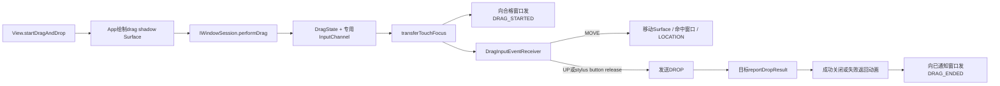
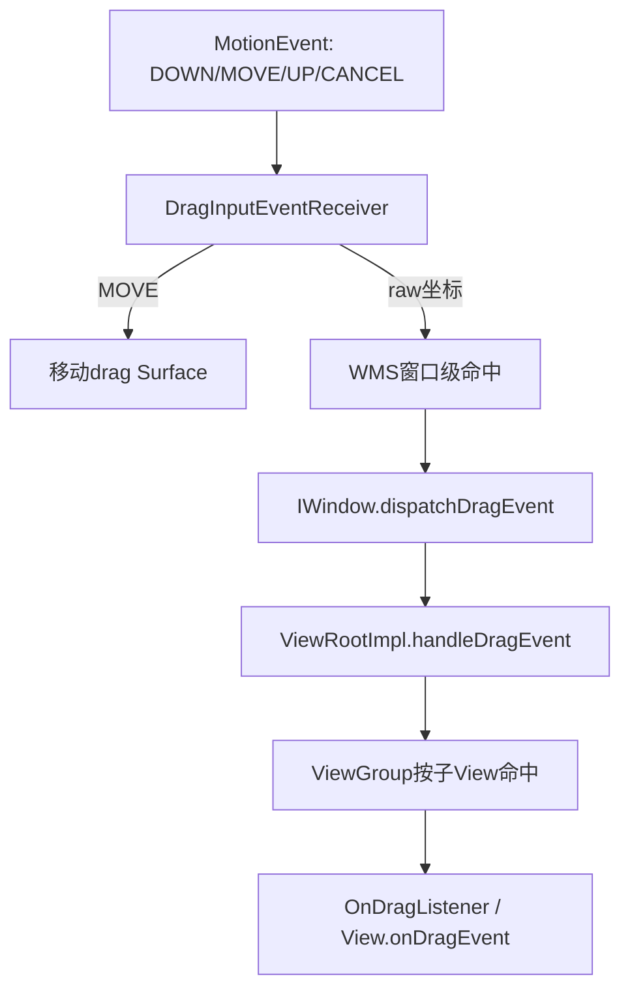
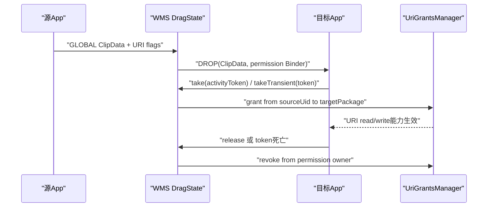

# 239 Android系统拖放、DragState、DragEvent跨窗口分发与URI权限链

> 源码版本：Android 11 / `android-11.0.0_r48`  
> 学习方式：macOS只读核源，不编译、不运行AOSP

## 1. 本章要解决什么

上一章看到WMS怎样把当前MotionEvent流迁给Drag专用InputChannel。本章补全业务层：App怎样创建拖影，WMS怎样把原始MOVE转换成跨窗口DragEvent，目标View怎样表达接收意愿，DROP结果和URI权限又怎样安全闭环。

```text
MotionEvent与DragEvent为什么同时存在？
local drag与global drag怎样限制接收窗口？
STARTED返回true为何决定后续资格？
ENTERED是谁生成的，为什么WMS代码里主要发LOCATION？
ClipDescription、ClipData和localState分别在何时、发给谁？
DROP后5秒等什么，是否等输入ANR？
URI权限何时创建、何时真正grant、怎样release？
拖影Surface失败时为何返回起点，成功时为何直接消失？
```

## 2. 一句总纲

Android拖放是两条链协作：

```text
控制链：当前MotionEvent经transferTouchFocus进入system_server DragInputEventReceiver
→ MOVE更新拖影与命中窗口，UP/手写笔按钮释放触发DROP

业务链：WMS向合格窗口广播STARTED
→ 当前窗口收LOCATION/EXITED，View层合成ENTERED
→ 目标收DROP并回报consumed
→ 所有已通知窗口收ENDED(result)
```

ClipData只在最终DROP交给目标，跨应用URI访问还要目标显式take权限。

## 3. 总体链路



## 4. 源码地图

```text
frameworks/base/core/java/android/view/View.java
frameworks/base/core/java/android/view/ViewRootImpl.java
frameworks/base/core/java/android/view/ViewGroup.java
frameworks/base/core/java/android/view/DragEvent.java
frameworks/base/core/java/android/view/DragAndDropPermissions.java
frameworks/base/core/java/android/app/Activity.java
frameworks/base/core/java/android/view/IWindowSession.aidl
frameworks/base/services/core/java/com/android/server/wm/Session.java
frameworks/base/services/core/java/com/android/server/wm/DragDropController.java
frameworks/base/services/core/java/com/android/server/wm/DragState.java
frameworks/base/services/core/java/com/android/server/wm/DragInputEventReceiver.java
frameworks/base/services/core/java/com/android/server/wm/DragAndDropPermissionsHandler.java
```

## 5. App入口

`View.startDragAndDrop(ClipData, DragShadowBuilder, localState, flags)`要求View已attach且ViewRoot Surface有效，否则返回false。

旧`startDrag()`只是deprecated包装。

## 6. 四个参数各管什么

```text
ClipData：最终可交给drop目标的数据
DragShadowBuilder：提供拖影尺寸、触点和绘制内容
localState：仅发起进程本地共享的任意对象，不跨Binder
flags：global、URI read/write/persistable/prefix、opaque等策略
```

## 7. ClipData出进程前准备

若data非null，调用：

```java
data.prepareToLeaveProcess((flags & DRAG_FLAG_GLOBAL) != 0)
```

它按是否global检查/准备URI等跨进程内容。

## 8. 拖影尺寸校验

`onProvideShadowMetrics()`提供shadow size和手指在拖影内的touch point。

负数直接抛IllegalStateException；零尺寸在兼容开关允许时改为1×1，因为SurfaceControl.Builder不接受零buffer尺寸。

## 9. 拖影在哪里绘制

App进程创建名为`drag surface`的SurfaceControl，初始parent是当前ViewRoot的SurfaceControl。

App lockCanvas、清透明背景、调用`DragShadowBuilder.onDrawShadow()`，再unlockCanvasAndPost提交buffer。

## 10. 拖影不是系统截图

内容由App回调自己画入独立Surface；WMS之后只移动、缩放、改alpha和重挂层级。

这与TaskSnapshot或ViewRoot主窗口buffer是不同Surface。

## 11. 起始坐标来自最后触点

ViewRoot保存最近触摸点与source。发起时调用：

```text
getLastTouchPoint
getLastTouchSource
```

连同shadow touch point传给WMS。

## 12. 跨Binder入口

```text
View
→ IWindowSession.performDrag
→ Session.performDrag
→ DragDropController.performDrag
```

Session先保存自身mPid/mUid参数并clearCallingIdentity，WMS仍显式知道来源进程和UID。

## 13. App怎样知道启动成功

WMS成功返回新dragToken；View缓存：

```text
mDragSurface
mDragToken
ViewRoot.mLocalDragState
```

token为null则销毁Surface并返回false。

## 14. localState为何不进WMS

`myLocalState`没有作为performDrag参数跨Binder。

ViewRoot只在本进程收到DragEvent消息时写入`event.mLocalState = mLocalDragState`；其他进程的ViewRoot没有这份对象，得到null。

## 15. WMS的第一组拒绝条件

```text
扩展回调prePerformDrag拒绝
已有drag进行中
发起IWindow无对应WindowState
窗口不能接收touch input
没有DisplayContent
```

任一条件使performDrag返回null并清理尚未接管的Surface。

## 16. r48仍有启动竞态TODO

源码明确留下：应验证input是否仍聚焦在发起窗口。

例如请求刚到时闹钟窗口抢到触摸，当前实现依赖后面transfer失败等路径，而不是在这一层完整预判。

## 17. DragState.mToken按阶段复用

`DragDropController`创建并返回源App的`dragToken`，开始阶段把它写入`mToken`，供`cancelDragAndDrop(dragToken)`校验。

发送DROP后，同一个`mToken`被覆盖为目标`IWindow` token，供`reportDropResult()`校验唯一回报窗口。构造DragState时另传入的临时Binder随即又被dragToken覆盖，在本版没有形成长期独立状态；阅读时应按阶段而不是想象成两个并存字段。

## 18. alpha策略

`DRAG_FLAG_OPAQUE`存在时原始alpha为1；否则使用半透明拖影常量。

WMS在overlay层显示拖影时应用alpha。

## 19. 建立专用输入接管者

DragState创建InputChannel pair、注册server端、在WMS Handler Looper上建立DragInputEventReceiver，并创建TYPE_DRAG InputWindowHandle。

随后按第238章调用transferTouchFocus，从发起窗口接管当前pointer流。

## 20. 为什么先同步InputWindow

显示全屏drag input surface后使用`syncInputWindows()`并同步apply，保证InputDispatcher先看到to window，再transfer。

否则目标handle不存在会失败。

## 21. transfer失败必须终止

无法迁移时WMS记录错误并返回null，finally关闭未进入progress的DragState。

它不会让拖影开始移动而Motion仍送给App。

## 22. STARTED广播何时发生

接管成功、保存ClipData后，DragState调用`broadcastDragStartedLocked(touchX,touchY)`遍历Display全部窗口。

不是只通知当前手指下的窗口。

## 23. 哪些窗口有资格收STARTED

必须：

```text
WindowState是potential drag target
满足local/global范围
满足跨profile策略
```

只有实际发送成功的窗口加入`mNotifiedWindows`。

## 24. local drag范围

没有`DRAG_FLAG_GLOBAL`时，只允许`mLocalWin == target.mClient.asBinder()`。

也就是拖放限定发起顶层窗口；同进程其他顶层窗口也不会仅因同PID自动获得资格。

## 25. global drag版本门

global drag目标限定：

```text
系统窗口（无ActivityRecord）
或targetSdk >= Android N的应用窗口
```

旧target应用不会被强行纳入新全局拖放协议。

## 26. 跨profile限制

源User若被`DISALLOW_CROSS_PROFILE_COPY_PASTE`限制，只能向相同userId窗口拖放。

判断发生在STARTED资格阶段，未授权profile窗口不会进入notified集合。

## 27. STARTED带什么

WMS发送：

```text
ACTION_DRAG_STARTED
窗口局部坐标
ClipDescription
不带ClipData
不带URI permission handler
result=false
```

目标可以看MIME描述决定是否感兴趣，却还拿不到实际数据。

## 28. 为什么STARTED不带ClipData

Display上可能有许多候选窗口；过早广播完整数据会扩大敏感内容暴露面。

真正ClipData只在最终DROP发给命中且有资格的窗口。

## 29. 新出现窗口也可能收STARTED

拖拽期间某Window后来变为可见，WMS调用`sendDragStartedIfNeededLocked()`。

只有未在`mNotifiedWindows`且仍满足资格才补发，结束后绝不再发STARTED。

## 30. DragInputEventReceiver只处理pointer Motion

非Motion、非SOURCE_CLASS_POINTER或已经mute的事件不处理，但finally仍`finishInputEvent()`。

这条专用Channel不处理KeyEvent业务。

## 31. transfer补来的DOWN为何“unexpected”

第238章transfer会给新Connection补ACTION_DOWN，以维持协议。

DragInputEventReceiver看到DOWN只写debug warning并返回；拖拽已经由performDrag的起始坐标初始化，不需把这个补DOWN再当MOVE。

## 32. MOVE怎样驱动拖拽

Receiver读取rawX/rawY，调用：

```text
handleMotionEvent(true,x,y)
→ DragState.notifyMoveLocked
```

后者移动拖影Surface到`x-thumbOffsetX,y-thumbOffsetY`并执行窗口命中。

## 33. UP怎样结束输入阶段

ACTION_UP把`mMuteInput=true`，调用`handleMotionEvent(false,x,y)`，进而`notifyDropLocked()`。

之后即使清理消息尚未执行，Receiver也不再重复驱动drag。

## 34. stylus按钮释放也可DROP

若首个观察事件中stylus primary button按下，之后MOVE发现按钮释放，也把mMuteInput设true并以当前坐标触发DROP。

不必等待触笔离开屏幕的UP。

## 35. CANCEL的r48行为

ACTION_CANCEL也mute并调用`handleMotionEvent(false,x,y)`。

从代码结果看它进入`notifyDropLocked()`，不是独立`cancelDragLocked()`；是否找到合格窗口决定后续DROP/失败结束。这一点应按源码而非凭“CANCEL必然无DROP”的直觉理解。

## 36. 两层事件的关系



MotionEvent只在system_server控制拖拽；App候选窗口收到的是DragEvent，不会同时拿原始接管后的MOVE。

## 37. WMS窗口级命中

`notifyLocationLocked(x,y)`调用：

```text
DisplayContent.getTouchableWinAtPointLocked
```

如果命中窗口没收过STARTED，就当作空区域，不发送LOCATION。

## 38. 离开旧窗口

新命中窗口与`mTargetWindow`不同且旧目标非null时，WMS向旧窗口直接发送ACTION_DRAG_EXITED，坐标为0。

这是窗口边界退出，不是每个子View的完整enter/exit算法。

## 39. 进入新窗口WMS发什么

WMS直接向新窗口发ACTION_DRAG_LOCATION，并在末尾把它记为mTargetWindow。

它没有在这段代码先发窗口级ACTION_DRAG_ENTERED；View级ENTERED由客户端层根据drag focus变化形成。

## 40. 坐标转换两次

WMS `obtainDragEvent()`先把Display坐标经WindowState翻译为窗口坐标。

ViewRoot还考虑Compatibility Translator、scrollY，ViewGroup继续转换为目标子View局部坐标。

## 41. ViewRoot收到哪些根事件

注释概括：root主要接收start/end/location；window boundary exited也可由WMS直接到达。

entered/exited的View层级细节由ViewGroup与`setDragFocus()`决定。

## 42. STARTED返回true为何关键

ViewGroup向可见children分发STARTED，并把返回true的View放入`mChildrenInterestedInDrag`。

未表示兴趣的分支不会成为LOCATION/DROP目标，但已感兴趣者最终都会得到ENDED。

## 43. Listener与onDragEvent优先级

View先调用启用状态下的OnDragListener；若listener返回true，就不再调用`onDragEvent()`。

listener不存在、View disabled或listener返回false时，再调用View.onDragEvent。

## 44. View怎样标记可接受

STARTED处理结果影响`PFLAG2_DRAG_CAN_ACCEPT`等私有状态，drawable state也随ENTERED/EXITED/ENDED刷新。

这既控制路由也允许控件呈现可放置高亮。

## 45. ViewGroup怎样找当前目标

LOCATION/DROP时调用`findFrontmostDroppableChildAt()`，从前到后寻找坐标下且曾接受STARTED的子View。

找不到child但ViewGroup自身感兴趣时，可由ViewGroup接收。

## 46. ENTERED/EXITED怎样生成

目标View变化时，`setDragFocus()`及兼容分发逻辑向旧View发EXITED、向新View发ENTERED。

ENTERED/EXITED不带有效位置，代码暂时把x/y设0、ClipData设null，再恢复原LOCATION/DROP内容。

## 47. Android N前后的层级兼容

pre-N应用采用cascaded enter/exit，保持整个包含层级的hover状态。

N及以后主要让最内层实际目标处于entered状态，父子传播规则不同；源码保留兼容分支。

## 48. App进程向WMS报告View焦点变化

ViewRoot发现`mCurrentDragView`变化时，通过WindowSession调用：

```text
dragRecipientExited(window)
dragRecipientEntered(window)
```

r48 WMS对应方法主要debug记录，并不据此重新决定DROP目标；DROP仍由WMS窗口命中。

## 49. DROP目标重新命中

UP时`notifyDropLocked()`再次用最终x/y寻找touchable WindowState，而不是无条件使用上一帧mTargetWindow。

它还要求目标在mNotifiedWindows中。

## 50. 无有效DROP目标

若目标没收过STARTED：

```text
mDragResult=false
立即endDragLocked
```

没有接收窗口，所以也不建立5秒DROP结果timeout。

## 51. DROP带什么

```text
ACTION_DROP
目标窗口局部坐标
完整ClipData
必要时IDragAndDropPermissions
ClipDescription由ViewRoot缓存补回
```

目标进程先`ClipData.prepareToEnterProcess()`再分发View树。

## 52. 跨User URI修正

sourceUserId与targetUserId不同时，WMS调用`mData.fixUris(sourceUserId)`，为URI加入正确user语义。

这发生在DROP前，不是STARTED广播时。

## 53. 何时创建permission handler

必须同时满足：

```text
GLOBAL drag
flags含URI read/write/persistable/prefix访问位
ClipData非null
```

否则DROP的permissions对象为null。

## 54. 创建handler不等于已经grant

构造器只收集ClipData中的URI并记录sourceUid、targetPackage、mode、source/target user。

真正授权要目标App显式调用take或takeTransient。

## 55. Activity绑定权限

目标Activity调用：

```java
requestDragAndDropPermissions(dropEvent)
```

包装IDragAndDropPermissions并`take(activityToken)`，系统查Activity对应permission owner后逐URI授权。

## 56. Activity权限生命周期

授权绑定Activity permission owner；Activity销毁时相应grant可随owner撤销。

应用也可显式调用`DragAndDropPermissions.release()`提前释放。

## 57. transient权限

`takeTransient()`新建名为`drop`的URI permission owner，并把本地transient Binder linkToDeath。

调用者必须release；进程死亡时binderDied也会release，避免永久泄漏。

## 58. grant怎样保持来源身份

Handler清除当前Binder identity后调用UriGrantsManager：

```text
permissionOwner
sourceUid
targetPackage
URI、mode
sourceUserId、targetUserId
```

不能由目标App自行把任意URI声明成来自源UID。

## 59. URI权限链



## 60. DROP返回值怎样上报

目标View的OnDragListener/onDragEvent返回boolean，经ViewGroup汇总到ViewRoot。

ViewRoot收到ACTION_DROP后调用`mWindowSession.reportDropResult(mWindow,result)`。

## 61. 只有DROP窗口能认领结果

WMS发送DROP后把`mToken`改为目标`IWindow.asBinder()`。

reportDropResult若token不匹配，抛IllegalStateException，防止其他已收STARTED窗口冒充成功目标。

## 62. DROP的5秒timeout

发送DROP后WMS以目标window token安排`MSG_DRAG_END_TIMEOUT`，延迟固定5000ms。

它等的是目标窗口通过reportDropResult回报，不是InputDispatcher finished signal。

## 63. 5秒不是普通输入ANR计时器

超时Handler设置`mDragResult=false`并结束drag，源码还留TODO“ANR the drag-receiving app”。

所以r48这里主要保证拖放状态不永久悬挂，并未直接复用第235章完整输入ANR责任链。

## 64. 正确结果会取消timeout

只要正确目标回报，WMS先remove对应timeout，即使随后WindowState查找失败也不让旧timeout误结束其他状态。

## 65. result=false的结果

目标拒绝DROP或timeout，无消费结果；DragState创建return animation，让拖影从当前点回到原始点，同时alpha减半。

动画结束后才close。

## 66. result=true的结果

`endDragLocked()`直接`closeLocked()`，不播放return动画。

拖影Surface解除parent并清理，表示内容被目标接受。

## 67. cancelDragAndDrop安全token

取消调用必须携带本次performDrag返回的dragToken。

无活动drag或token不匹配会抛IllegalStateException，防止旧token取消新drag。

一旦已发送DROP，`mToken`进入“目标窗口回报”阶段并被window token覆盖，此时再用最初dragToken取消也不会匹配；正常流程应等待DROP结果或5秒timeout。

## 68. skipAnimation语义

显式取消可要求跳过cancel animation；未进入progress或skip时直接close，否则播放cancel动画。

已有动画时重复end/cancel直接返回，避免双重结束。

## 69. ENDED发给谁

close时遍历`mNotifiedWindows`，也就是成功收到STARTED的WindowState，向每个发送ACTION_DRAG_ENDED。

并非只发给DROP窗口。

## 70. ENDED的result

`DragEvent.getResult()`在ENDED上表示最终DROP是否被目标消费。

没有发送DROP、目标返回false或timeout均为false。

## 71. 失败坐标只给源进程

若drag失败且被通知窗口与发起者PID相同，ENDED携带最终mCurrentX/Y；其他窗口坐标为0。

这减少向其他进程泄露未消费位置，并允许源App理解返回位置。

## 72. ViewRoot结束清理

收到ENDED后：

```text
mCurrentDragView=null
localState=null
dragToken=null
release mDragSurface
```

View/ViewGroup也清除drag hover和interest状态。

## 73. system_server结束清理

```text
异步在正确Looper销毁DragInputEventReceiver/channel
恢复鼠标pointer icon
移除drag input surface
把拖影SurfaceControl reparent到null
清空ClipData、token和内部字段
DragDropController.mDragState=null
```

## 74. 为什么InputChannel teardown异步

InputEventReceiver要求在创建/处理它的线程dispose，以避免Looper/fd竞态。

close只发`MSG_TEAR_DOWN_DRAG_AND_DROP_INPUT`，Handler再执行interceptor.tearDown。

## 75. Surface release的两端

App持有Surface包装并在ENDED释放；WMS持有SurfaceControl引用并在close解除层级。

两端引用生命周期不同，不能把一次release理解为底层对象立即从所有进程消失。

## 76. 常见误解一：DragEvent就是MotionEvent

错误。

Motion控制system_server拖影和命中；DragEvent是WMS发给候选窗口/View树的业务协议。

## 77. 常见误解二：所有窗口一开始拿到ClipData

错误。

STARTED只带ClipDescription；完整data只给最终DROP目标。

## 78. 常见误解三：STARTED返回值无所谓

错误。

返回true建立View兴趣资格，决定后续LOCATION/DROP和最终ENDED分发。

## 79. 常见误解四：WMS直接发每个View的ENTERED

错误。

WMS负责窗口级LOCATION/EXITED；客户端ViewRoot/ViewGroup按子View目标变化生成ENTERED/EXITED。

## 80. 常见误解五：拿到permission Binder就已能读URI

错误。

构造handler只是能力提议；目标必须take，系统才逐URI grant。

## 81. 常见误解六：DROP true等于文件已持久保存

错误。

它只是目标View声明消费；真实数据复制、数据库提交等是目标业务责任，WMS不验证。

## 82. 常见误解七：5秒DROP timeout就是输入ANR

错误。

它是DragDropController自己的结果等待门，r48超时只结束失败drag并留有ANR TODO。

## 83. 常见误解八：CANCEL一定走取消不DROP

按r48 Receiver代码，CANCEL也以`keepHandling=false`进入notifyDropLocked。

需记录实现事实，不能用一般Gesture语义替代这里的特殊状态机。

## 84. 调试检查清单

```text
1. View是否attached、Surface是否valid
2. shadow metrics/Canvas绘制是否成功
3. 是否已有drag、calling Window是否有效
4. drag InputWindow是否同步、transfer是否成功
5. 哪些Window进入mNotifiedWindows
6. global/targetSdk/profile门是否过滤目标
7. Motion是否被mute、最终动作是UP/CANCEL/stylus release
8. 最终Window是否收过STARTED
9. DROP token与report token是否相同
10. permission是否真正take/release
11. 5秒timeout是否被取消
12. ENDED和InputChannel/Surface是否清理
```

## 85. macOS只读练习一：追App创建拖影

```bash
cd /Users/ninebot/androidSource
sed -n '26326,26415p' frameworks/base/core/java/android/view/View.java
```

标出失败返回、Canvas提交、最后触点、performDrag、token成功缓存和Surface失败销毁。

## 86. macOS只读练习二：列STARTED资格表

```bash
cd /Users/ninebot/androidSource
sed -n '350,455p' \
  frameworks/base/services/core/java/com/android/server/wm/DragState.java
```

手算local/global、targetSdk M/N、同/跨profile限制的八种组合。

## 87. macOS只读练习三：画MOVE到DROP

```bash
cd /Users/ninebot/androidSource
sed -n '50,120p' \
  frameworks/base/services/core/java/com/android/server/wm/DragInputEventReceiver.java
sed -n '480,610p' \
  frameworks/base/services/core/java/com/android/server/wm/DragState.java
```

解释UP、CANCEL和stylus button release怎样到`notifyDropLocked()`，以及何时没有5秒timeout。

## 88. macOS只读练习四：追URI grant/revoke

```bash
cd /Users/ninebot/androidSource
sed -n '1,145p' \
  frameworks/base/services/core/java/com/android/server/wm/DragAndDropPermissionsHandler.java
```

分别写出Activity owner和transient owner的建立、grant、显式release与进程死亡回收路径。

## 89. 复读后最容易不理解的地方

```text
STARTED窗口资格、View返回兴趣和最终DROP命中是三道门
WMS窗口目标与ViewGroup子View目标是两层命中
permission handler存在与URI grant生效是两个时刻
InputDispatcher finished与DragDropController reportDropResult是两种回执
```

## 90. 复读修订一：ENTERED不在单一层生成

“WMS发送完整六种DragEvent”会误导。

r48 WMS跨窗口直接发STARTED/LOCATION/EXITED/DROP/ENDED；View级ENTERED以及细粒度EXITED由客户端drag focus逻辑补齐。

## 91. 复读修订二：localState不是跨进程数据

它只缓存在发起ViewRoot，收到任意DragEvent时本地填入。

跨进程交换必须用可Parcel的ClipData，不能把localState当共享对象通道。

## 92. 复读修订三：完成点分层

```text
finishInputEvent：Drag专用Motion已处理
reportDropResult：目标View已决定是否消费DROP
DRAG_ENDED：所有参与窗口得知业务结果
Surface transaction apply：发出视觉清理
硬件present：屏幕真正显示下一帧
```

五者不是同一完成点。

## 93. 复读修订四：Drag空Region边界沿用上一章

DragState注释称空touchableRegion阻止新触摸，但r48 flags=0形成touch-modal，普通命中可绕过Region。

本章只确认当前手势通过transfer进入；不要把注释扩大成单独由空Region提供的绝对安全保证。

## 94. r48版本边界

```text
同时只允许一个DragState
performDrag保留输入仍在发起窗口的TODO和multi-display TODO
DragState.mToken先存dragToken、DROP后复用为目标window token
global目标App要求targetSdk >= N
DROP结果timeout固定5秒，超时ANR仍是TODO
CANCEL走notifyDropLocked而非直接cancel
Drag URI权限由目标显式take，不自动grant
```

## 95. 本章检查清单

```text
[ ] 能区分Motion控制链与DragEvent业务链
[ ] 能解释drag shadow Surface如何创建/移交/清理
[ ] 能列出STARTED窗口资格
[ ] 能说明View STARTED返回true的作用
[ ] 能解释窗口级与View级enter/exit
[ ] 能从UP追到DROP和reportDropResult
[ ] 能说明5秒timeout不是普通输入ANR
[ ] 能闭合Activity/transient URI权限生命周期
[ ] 能解释成功/失败动画和ENDED result
[ ] 能指出r48 CANCEL、multi-display、空Region边界
```

## 96. 本章小结

Android 11拖放不是单一View API，而是App绘制Surface、WMS接管输入、窗口级筛选、View树兴趣路由、DROP回执与URI授权共同组成的跨进程协议：

```text
startDragAndDrop绘制拖影
→ performDrag建立DragState并transfer当前触摸
→ STARTED只广播描述和资格
→ MOVE移动Surface并向已通知窗口发LOCATION
→ View树生成细粒度ENTERED/EXITED
→ 最终DROP独占获得ClipData与可take权限
→ 目标5秒内回报结果
→ 成功关闭或失败返回动画
→ 全体参与窗口收到ENDED并清理
```

## 97. 下一章预告

下一章回到窗口输入同步：WMS怎样把WindowState的frame、touchableRegion、transform、Surface layer和InputChannel token打包为InputWindowInfo，并通过SurfaceControl Transaction与InputDispatcher保持同一帧视图。
