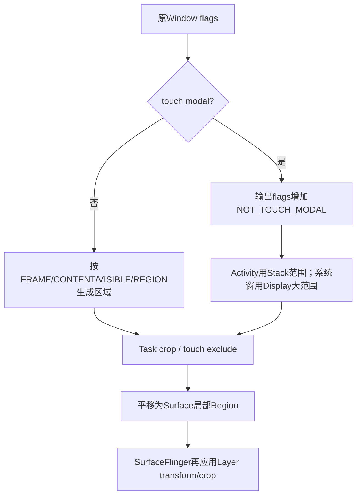
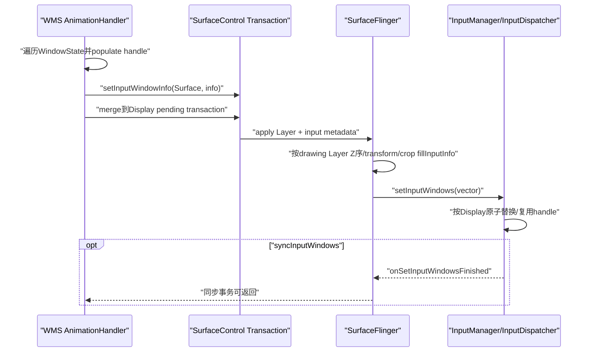

# 240 Android WMS InputWindowInfo构建、SurfaceControl同帧同步与窗口快照链

> 源码版本：Android 11 / `android-11.0.0_r48`  
> 学习方式：macOS只读核源，不编译、不运行AOSP

## 1. 本章要解决什么

前几章一直把InputDispatcher里的“当前窗口列表”当作已知事实。本章向上追这份事实怎样产生。

```text
WindowState哪些字段会进入InputWindowInfo？
为什么input info要挂在SurfaceControl上，而不是WMS直接发数组？
窗口Z序、crop、transform究竟由WMS还是SurfaceFlinger决定？
modal窗口为何会被改写成NOT_TOUCH_MODAL加大Region？
updateInputWindowsLw为什么异步合并，何时必须immediately/sync？
syncInputWindows等到哪一步，是否等App处理输入？
InputDispatcher怎样复用旧handle对象并清理焦点/触摸状态？
```

## 2. 一句总纲

Android 11把输入窗口快照与视觉Layer状态放进同一Surface事务：

```text
WMS从WindowState填写Java InputWindowHandle
→ Transaction.setInputWindowInfo把值复制到对应SurfaceControl
→ SurfaceFlinger应用Layer层级、crop、transform后按真实Z序生成InputWindowInfo列表
→ InputManager按Display包装handle
→ InputDispatcher原子替换窗口快照并处理焦点、hover与已触摸窗口移除
```

输入命中因此尽量基于“这一帧真正显示的Surface几何”，而不是另一条时序脱节的窗口数组。

## 3. 总体链路

```mermaid
flowchart LR
    WS["WMS WindowState"] --> IWH["Java InputWindowHandle"]
    IWH --> TX["SurfaceControl.Transaction.setInputWindowInfo"]
    TX --> SF["SurfaceFlinger Layer drawing state"]
    SF -->|"真实Z序/crop/transform"| INFO["vector InputWindowInfo"]
    INFO --> IF["InputManager / InputFlinger"]
    IF --> MAP["按display分组 BinderWindowHandle"]
    MAP --> ID["InputDispatcher.setInputWindows"]
    ID --> SNAP["mWindowHandlesByDisplay"]
```



## 4. 源码地图

```text
frameworks/base/services/core/java/com/android/server/wm/InputMonitor.java
frameworks/base/services/core/java/com/android/server/wm/WindowState.java
frameworks/base/core/java/android/view/InputWindowHandle.java
frameworks/base/core/java/android/view/InputApplicationHandle.java
frameworks/base/core/java/android/view/SurfaceControl.java
frameworks/base/core/jni/android_hardware_input_InputWindowHandle.cpp
frameworks/base/core/jni/android_view_SurfaceControl.cpp
frameworks/native/services/surfaceflinger/SurfaceFlinger.cpp
frameworks/native/services/inputflinger/InputManager.cpp
frameworks/native/services/inputflinger/dispatcher/InputDispatcher.cpp
frameworks/native/include/input/InputWindow.h
```

## 5. WindowState拥有长期Java handle

每个可输入WindowState创建`mInputWindowHandle`，生命周期随窗口。

打开InputChannel后，把server/client共有的connection token写入handle，并在WMS维护token→WindowState映射。

## 6. InputChannel token是连接主键

`InputWindowHandle.token`同时关联：

```text
窗口输入元数据
InputDispatcher注册的Connection
WMS反查责任WindowState
客户端/server InputChannel pair
```

它不同于Activity token、IWindow Binder和SurfaceControl handle。

## 7. Window关闭通道的顺序

WMS先向IMS unregister server channel，再dispose两端并清token映射。

注释说明先unregister可避免被误报broken channel。

## 8. InputWindowHandle是快照载体

Java对象公开字段不是App API，而是system_server/JNI之间的结构化数据容器。

每轮更新会重填同一对象的窗口事实。

## 9. application handle

Activity窗口关联`InputApplicationHandle`，包含应用标签与dispatching timeout等。

系统窗口可以没有application handle，但仍可有Window InputChannel。

## 10. populateInputWindowHandle的身份字段

WMS填写：

```text
name、type、flags
ownerPid、ownerUid
displayId
InputChannel token
InputApplicationHandle
```

这些用于日志、安全注入检查、多显示路由和ANR责任识别。

## 11. 调度状态字段

```text
dispatchingTimeoutNanos
visible
canReceiveKeys
hasFocus
paused
hasWallpaper
inputFeatures
```

其中visible/hasFocus组合决定InputDispatcher真正的focused window。

## 12. canReceiveKeys与hasFocus不同

`canReceiveKeys`表示窗口能力；`hasFocus`表示当前WMS选择结果。

一个窗口可具备接键能力但此刻没有焦点，也可因可见性变化使旧hasFocus快照不能被native采用。

## 13. frame字段

WMS写入WindowState当前frame四边和surfaceInset。

frame用于窗口局部坐标offset、遮挡判断和部分命中逻辑，但不是唯一几何来源。

## 14. scaleFactor的方向

若`child.mGlobalScale != 1`，handle写：

```java
scaleFactor = 1.0f / child.mGlobalScale;
```

屏幕上Surface被放大时，输入坐标需逆缩放回窗口内容坐标。

## 15. touchableRegion的四种来源

非modal窗口按`mTouchableInsets`选择：

```text
FRAME：整个frame
CONTENT：扣除givenContentInsets
VISIBLE：扣除givenVisibleInsets
REGION：App提供的givenTouchableRegion平移到窗口坐标
```

之后还可能裁到Task/Stack并减去touch exclude region。

## 16. touch exclude region

WMS的tap-exclude机制可从窗口可触摸区域中扣除部分Region，使这些位置不触发该窗口的聚焦、置顶和输入路由。它不是App公开的system-gesture-exclusion（导航返回手势排除矩形）；两条链只是在中文里都容易被简称为“触摸排除区”。

所以一个视觉覆盖区域不必全部属于该窗口的触摸目标。

## 17. modal窗口的特殊编码

WindowState先判断原flags是否touch modal。

若modal，`getSurfaceTouchableRegion()`反而给输出flags加`FLAG_NOT_TOUCH_MODAL`，再把Region扩大为Activity stack或Display范围。

## 18. 为什么看似把modal改成non-modal

传到InputDispatcher后，命中逻辑变成“只看显式Region”。

原modal的“区域外也挡住后窗”语义已编码为大Region，不再需要native依据modal flag无限吞触摸。



## 19. 这样做的价值

显式Region可以继续被SurfaceFlinger按父Layer crop、TaskOrganizer层级和变换裁剪。

如果只保留抽象modal flag，SF很难把实际可见Surface边界准确作用到输入几何。

## 20. Activity modal区域

有ActivityRecord时，外部触摸限制到Activity stack region，并减去touch exclude。

因此自由窗/分屏的modal窗口不会天然吞掉整个物理Display。

## 21. 系统modal区域

没有ActivityRecord时先用足够大的Display范围Region，以容忍窗口在Display移动。

后续Surface几何仍可裁剪它。

## 22. Region转为Surface局部坐标

完成WMS几何计算后执行：

```text
region.translate(-frame.left,-frame.top)
```

因为InputWindowInfo挂在窗口Surface上，SF再应用Surface树变换到屏幕空间。

## 23. touchableRegion crop handle

窗口可指定一个SurfaceControl作为Region crop边界。

例如Task需要裁到Stack Surface时，handle保存对该Surface的弱引用，JNI转为native layer handle。

## 24. replaceTouchableRegionWithCrop

它表示完全使用指定Surface（或当前Surface）bounds替换原Region，而不仅做交集。

TaskOrganizer管理的Task使用它，让输入crop跟随organizer控制的Surface层级。

## 25. 弱引用的意义

Java handle不应仅为输入Region永久强持有任意SurfaceControl。

JNI更新时尝试promote弱引用；对象已失效则不能假装crop handle仍有效。

## 26. 哪些Window会被遍历

DisplayContent按`traverseTopToBottom=true`遍历WindowState。

InputMonitor同时在适当层级插入navigation、PIP、wallpaper、recents animation等InputConsumer Surface。

## 27. 为什么WMS不轻易裁掉旧窗口

源码注释说只有native确定谁仍持有touch focus。

即使窗口不再是新DOWN候选，正在进行的TouchState仍可能需要它收到UP/CANCEL，所以输入窗口列表的剪枝必须谨慎。

## 28. cantReceiveTouchInput窗口

没有channel/handle、已removed或不能接touch的普通窗口通常跳过。

但有Surface时可能写入“invalid overlay input info”，帮助SF遮挡计算正确忽略/识别该Surface。

## 29. invalid overlay handle

它带：

```text
NO_INPUT_CHANNEL
NOT_TOUCHABLE | NOT_FOCUSABLE | NOT_TOUCH_MODAL
空Region、无token
```

它描述视觉overlay，却不会成为可接收输入的Connection目标。

## 30. 为什么纯视觉Layer也需input info

触摸安全需要知道上方哪些Surface会遮挡目标。

完全不提供信息可能使遮挡判断把系统视觉层当普通不可信窗口，或反之；overlay info用于明确角色。

## 31. InputConsumer的层级插入

InputMonitor遍历可在遇到某Window时show/reparent专用consumer到相应Surface层级。

因此Recents、PIP、导航输入区域与其视觉目标保持层级对应。

## 32. hasWallpaper的生成

当前Window是WallpaperController目标、Keyguard未显示且没有被private flag禁用wallpaper touch时设true。

第236章InputDispatcher据此在DOWN时锁定wallpaper副本目标。

## 33. drag期间的新窗口

Input窗口更新时若drag进行中且Window可见、位于默认Display，WMS顺便调用`sendDragStartedIfNeededLocked()`。

这保证拖拽期间后来出现的合格窗口有机会进入notified集合。

## 34. setInputWindowInfo是Transaction操作

WMS不立即调用InputDispatcher，而是：

```java
mInputTransaction.setInputWindowInfo(surfaceControl,inputWindowHandle)
```

把输入元数据绑定到具体SurfaceControl状态变更。

## 35. JNI在事务加入时复制Java字段

`nativeSetInputWindowInfo()`先`handle->updateInfo()`，将Java字段读入native `InputWindowInfo`，再调用Transaction.setInputWindowInfo。

后续Java对象再被修改，不会反向改变已经入事务的那份native值。

## 36. updateInfo复制哪些结构

除普通标量外还复制Region各Rect、applicationInfo、portal display、crop/replace标志和Surface crop handle。

Java弱对象已被GC时updateInfo可失败并释放channel。

## 37. 异步合并更新

`updateInputWindowsLw(false)`仅在needed时schedule；pending时不重复post。

多个焦点、布局、可见性变化可在AnimationHandler一轮合并为一次窗口快照生成。

## 38. force并非同步执行

`force=true`绕过“是否needed”判断，但正常路径仍是post Runnable。

force表示必须安排更新，不表示当前调用栈已把快照送到InputDispatcher。

## 39. Runnable为何持WMS全局锁

生成窗口列表需要WindowState层级、焦点、Surface和Activity状态一致。

在GlobalLock内遍历，避免一边生成一边窗口树被结构性修改。

## 40. 普通事务怎样提交

更新完成后把`mInputTransaction` merge到Display pending transaction，并scheduleAnimation。

输入info与同轮Surface position/layer/crop等在Surface placement事务中共同应用。

## 41. immediately路径

`updateInputWindowsImmediately(t)`取消pending Runnable、立刻生成mInputTransaction，再merge进调用者传入Transaction。

它仍可能等这个外部Transaction稍后apply，方法名表示立即生成/合并，不是立即硬件生效。

## 42. 为什么需要同一Transaction

若视觉Layer先移动而输入Region后一帧更新：

```text
用户看到按钮在新位置
InputDispatcher仍按旧位置命中
```

同一Surface事务减少这类“看得见但点不到/点到旧位置”的短暂错位。

## 43. SurfaceFlinger才知道最终Layer事实

WMS知道Window组织，但SF持有提交后的Layer树、parent transform、crop、layer stack和drawing state。

因此最终屏幕空间InputWindowInfo由SF的Layer `fillInputInfo()`产生。

## 44. SF何时刷新输入窗口

`updateInputFlinger()`在：

```text
mVisibleRegionsDirty
或mInputInfoChanged
```

时调用`updateInputWindowInfo()`。

可见区域或input metadata任一变化都可能需要新快照。

## 45. 最终Z序

SF对drawing state执行`traverseInReverseZOrder()`，对需要input info的Layer收集`fillInputInfo()`。

生成顺序就是InputDispatcher之后“front to back”命中依赖的顺序。

## 46. 为什么不能只信WMS遍历顺序

Surface reparent、relative layer、TaskOrganizer或动画leash可能改变最终Surface层级。

SF按真实Layer树再生成列表，才能让视觉Z序和输入Z序一致。

## 47. Layer fillInputInfo还做什么

它把Layer transform、screen bounds、crop、alpha/visibility等Surface事实作用到WMS提供的基础InputWindowInfo。

所以InputDispatcher收到的不是Java handle字段的原样逐字副本。

## 48. 输入快照与buffer latch的边界

input info属于Surface Transaction/Layer state。

它与某个App新buffer内容是否已经latch不是同一概念；同帧同步的是Layer几何/元数据提交关系，不保证像素绘制逻辑和命中内容语义完全一致。

## 49. SF到InputFlinger

SF调用：

```cpp
mInputFlinger->setInputWindows(inputHandles, listenerOrNull)
```

这里的inputHandles已经是native `vector<InputWindowInfo>`。

## 50. InputManager按Display分组

InputManager把每份Info包装为`BinderWindowHandle`，按`info.displayId`放进map，再调用InputDispatcher。

同一批可包含多个Display。

## 51. BinderWindowHandle不回读Java

它直接持有SF传来的InputWindowInfo，`updateInfo()`恒true。

这与早期Java NativeInputWindowHandle每次通过弱引用回读字段的对象不同。

## 52. syncInputWindows的含义

SurfaceControl.Transaction文档：等待input window变化已经从SF发送到InputFlinger后再返回。

它设置同步命令，并由SF在`setInputWindows`完成listener回调时解除等待。

## 53. 没有info变化也要完成sync

若调用者请求sync但`mVisibleRegionsDirty/mInputInfoChanged`均为false，SF直接调用`setInputWindowsFinished()`。

否则同步事务会在“没有变化可发送”时永久等待。

## 54. sync不等App输入回执

它不等待：

```text
用户产生下一事件
InputDispatcher选择目标
InputChannel发布
App finished signal
View绘制下一帧
```

只保证输入窗口状态已交到InputFlinger这一控制面边界。

## 55. onDisplayRemoved为何先sync

Display移除前先发空同步事务，确保先前pending setInputWindowInfo完成，避免清理后旧更新迟到。

随后调用IMS `onDisplayRemoved`直接清除对应native display状态。

## 56. InputDispatcher按锁替换

`setInputWindows()`持`mLock`逐Display调用`setInputWindowsLocked()`，完成后wake Looper。

分发线程不会看到某个Display列表只替换一半。

## 57. 空列表语义

某Display传空handles时，从`mWindowHandlesByDisplay`移除该Display列表。

这不是“保持旧列表不变”。

## 58. native再次校验handle

对每个handle检查：

```text
updateInfo成功
需要channel的窗口确有已注册Connection
displayId与本组匹配
```

不合法项不会进入新快照。

## 59. NO_INPUT_CHANNEL例外

纯overlay info可无registered channel，因为它明确带`INPUT_FEATURE_NO_INPUT_CHANNEL`且不可接收键/触摸。

portal window也可作为跨Display路由节点而无普通目标Connection。

## 60. canReceiveInput的native判断

只有同时不可触摸且不可聚焦才被视作不需channel的非输入窗口。

若仍可能收任一类输入却无channel，native记录并跳过，避免选中无法发布的目标。

## 61. 为什么复用旧handle对象

InputDispatcher的TouchState、hover等内部状态会保存`sp<InputWindowHandle>`指针。

若每次快照都换新对象，同一个逻辑窗口会被误判为移除。

## 62. 复用键

新旧handle拥有相同：

```text
InputWindowInfo id
以及InputChannel token
```

时，更新旧对象内容并把旧sp放进新列表。

## 63. 只同id不够

窗口/Layer id可能复用或token发生通道重建。

同时比较token避免把新Connection错误当作旧触摸流的延续。

## 64. Focus选择

新列表从前到后找第一个：

```text
hasFocus && visible
```

即使WMS意外标多个hasFocus，也只取最高Z序者。

## 65. 焦点变化的收尾

旧焦点通道存在时：

```text
合成CANCEL_NON_POINTER_EVENTS
发送FocusEvent(false)
```

新焦点发送FocusEvent(true)，并更新focused map。

## 66. 为什么焦点离开不取消pointer

触摸所有权由DOWN/TouchState决定，键盘焦点改变不应自动切断正在拖动的手势。

所以这里只取消non-pointer状态。

## 67. Hover窗口移除

新列表中找不到`mLastHoverWindowHandle`时直接清空引用。

避免下一hover事件向已经不存在的窗口派生EXIT。

## 68. 正在触摸窗口移除

遍历当前Display TouchState；某TouchedWindow不再存在时：

```text
向仍存在的channel合成CANCEL_POINTER_EVENTS
从state.windows删除该项
```

其他split窗口/monitor仍可继续。

## 69. 为什么必须在快照替换时做CANCEL

如果只从列表删除，旧App已经收到DOWN却永远没有UP/CANCEL。

快照生命周期变化必须主动闭合客户端手势协议。

## 70. 移除handle后releaseChannel

旧列表中不再出现的handle调用`releaseChannel()`，及时释放不再使用的通道引用。

否则可能等Java GC/handle析构才释放，拖长失效Connection生命周期。

## 71. 焦点application另有通道

`setFocusedApplication()`不是由这份窗口Layer列表隐式推导。

WMS另行告诉InputDispatcher哪个App应该获得焦点，用于“有focused app但窗口尚未出现”的ANR等待。

## 72. 三份状态不要混淆

```text
WMS WindowState：系统服务权威窗口模型
SF Layer drawing state：已提交视觉/几何模型
InputDispatcher window snapshot：输入线程当前路由模型
```

它们通过事务和回调逐步收敛，不是同一个内存对象。

## 73. 时序图



## 74. 普通更新不是强同步

绝大多数窗口变化只schedule、merge、随下一Surface transaction提交。

这是性能与一致性的折中：合并多次变动并与视觉帧对齐，而非每个字段变化都阻塞WMS。

## 75. 哪些场景需要sync

例如第239章Drag在transfer前必须确保新的drag input window已进入InputDispatcher；Display移除也要排空旧info。

这些控制流依赖“下一句代码立即查得到新窗口”，才使用同步屏障。

## 76. sync不是硬件present屏障

输入列表已送达InputFlinger时，Surface事务不等于面板已显示完成。

它更不是HWC present fence；不要把“输入快照同步”写成“用户已经看到对应像素”。

## 77. transform与raw/local坐标

SF把Layer transform影响纳入InputWindowInfo，InputDispatcher再保存每pointer的offset/scale，客户端MotionEvent同时保留raw与窗口局部语义。

多层转换应按坐标空间逐层追踪，不能只用`frameLeft`解释旋转/缩放窗口。

## 78. 遮挡判断为何依赖列表顺序

第236章`isWindowObscuredAtPointLocked()`只检查目标之前的handle。

如果输入Z序与Surface视觉Z序错位，安全遮挡flag也会错；这就是SF最终排序的重要安全意义。

## 79. Portal/嵌入Display

InputWindowInfo可携带`portalToDisplayId`，InputDispatcher命中portal后递归到目标Display。

因此快照不只是同Display平面窗口数组，也可表达嵌入Display输入路径。

## 80. 更新过慢的可观察问题

```text
焦点事件迟到
新窗口短暂点不到
旧Region仍命中
transfer找不到to handle
窗口移除后旧流未及时CANCEL
遮挡flag与画面短暂不一致
```

调试必须同时看WMS、SF transaction和InputDispatcher dump/trace。

## 81. 常见误解一：WMS直接把WindowState数组发给InputDispatcher

错误。

Android 11主链先把info挂到Surface事务，由SF结合Layer状态生成最终列表。

## 82. 常见误解二：Java InputWindowHandle就是native长期对象

错误。

JNI会复制为InputWindowInfo；SF到InputManager又包装BinderWindowHandle，InputDispatcher还会按id/token复用自己的旧handle。

## 83. 常见误解三：frame就是touchableRegion

错误。

Region可能来自content/visible/custom insets、modal大区、Task crop和exclude region，并经Surface transform。

## 84. 常见误解四：force更新立即生效

错误。

force通常只强制schedule；immediately才立即生成并merge，真正送达仍取决于Transaction apply。

## 85. 常见误解五：sync等App处理完输入

错误。

sync只等SF把窗口变化送到InputFlinger，不产生事件也不等finished signal。

## 86. 常见误解六：快照替换可直接丢旧窗口

错误。

焦点和pointer流需要分别合成non-pointer/pointer CANCEL，hover引用也要清理。

## 87. 常见误解七：每轮都换新handle无影响

错误。

TouchState按handle对象保持所有权；InputDispatcher必须按id+token复用旧sp，才能识别逻辑窗口连续性。

## 88. 调试检查清单

```text
1. Window是否有registered InputChannel/token
2. flags/modal语义最后怎样编码进Region
3. givenInsets、exclude、Task crop后的Region
4. handle关联哪个SurfaceControl
5. update是scheduled、immediate还是sync
6. Transaction是否merge/apply
7. SF Layer最终Z序/transform/crop
8. Info是否因无channel/display错组被native跳过
9. id+token是否让旧handle复用
10. focus/hover/touch移除是否合成正确CANCEL
```

## 89. macOS只读练习一：填写字段来源表

```bash
cd /Users/ninebot/androidSource
sed -n '265,335p' \
  frameworks/base/services/core/java/com/android/server/wm/InputMonitor.java
```

为每个InputWindowHandle字段写出WindowState来源及InputDispatcher消费者。

## 90. macOS只读练习二：手算modal Region

```bash
cd /Users/ninebot/androidSource
sed -n '2579,2655p' \
  frameworks/base/services/core/java/com/android/server/wm/WindowState.java
```

比较Activity modal、system modal、NOT_TOUCH_MODAL与自定义REGION四种输出flags/Region。

## 91. macOS只读练习三：追事务到SF

```bash
cd /Users/ninebot/androidSource
sed -n '443,560p' \
  frameworks/base/services/core/java/com/android/server/wm/InputMonitor.java
sed -n '2895,2940p' frameworks/native/services/surfaceflinger/SurfaceFlinger.cpp
```

画出setInputWindowInfo、Layer fillInputInfo、reverse Z遍历和setInputWindows。

## 92. macOS只读练习四：追快照替换收尾

```bash
cd /Users/ninebot/androidSource
sed -n '3615,3800p' \
  frameworks/native/services/inputflinger/dispatcher/InputDispatcher.cpp
```

标出handle复用键、focused选择、non-pointer CANCEL、pointer CANCEL、hover清理和releaseChannel。

## 93. 复读后最容易不理解的地方

```text
modal语义被编码为NOT_TOUCH_MODAL + 大Region
immediate表示立即生成/merge，不表示事务已apply
syncInputWindows只到InputFlinger，不到App或屏幕
同一逻辑窗口跨快照必须复用旧native handle对象
```

## 94. 复读修订一：所谓“同帧”是事务一致性

更准确的说法是InputWindowInfo与Layer几何在同一Surface transaction中提交。

它不证明App buffer内容、SF latch和HWC present都在同一CPU时刻完成。

## 95. 复读修订二：最终几何不是单方决定

WMS提供窗口语义、基础frame/Region和crop引用；SF提供实际Layer树、变换和最终Z序；InputDispatcher消费结果。

“WMS算完所有输入坐标”或“SF凭空生成窗口语义”都不准确。

## 96. 复读修订三：正常Window与Drag伪窗口不同

普通WindowState的modal路径会被`getSurfaceTouchableRegion()`重写flags并显式化Region。

第238/239章DragState手工创建InputWindowHandle，不经过该函数，所以其flags=0与空Region存在特殊张力，不能用普通窗口结论替它解释。

## 97. 复读修订四：删除列表项不等于删除Connection

Window handle快照、InputDispatcher Connection注册和InputChannel fd是关联但独立的生命周期。

setInputWindows可先停止路由/释放handle引用；真正unregister/dispose由窗口通道生命周期完成。

## 98. r48版本边界

```text
WMS InputWindowInfo经SurfaceControl/SF而非直接数组主链
普通modal窗口被转换为NOT_TOUCH_MODAL + 显式大Region
TaskOrganizer可replace region with Surface crop
sync listener在InputManager调用Dispatcher后回调
旧handle复用要求相同id与token
Display移除前用sync排空pending input info
```

## 99. 本章检查清单

```text
[ ] 能从WindowState字段追到InputWindowInfo
[ ] 能解释modal flags为何被改写
[ ] 能区分Region、frame与Surface crop
[ ] 能解释scheduled/immediate/sync三种时序
[ ] 能说明SF为何负责最终Z序/transform
[ ] 能说明sync的完成边界
[ ] 能解释InputManager按Display包装
[ ] 能解释InputDispatcher复用handle的必要性
[ ] 能闭合焦点/hover/touch窗口移除
[ ] 能指出Drag手工handle不走普通Region转换
```

## 100. 本章小结

Android 11把视觉窗口树变成输入快照的过程可以概括为：

```text
WMS赋予窗口输入语义和基础Region
→ Surface事务把语义绑定到具体Layer
→ SF按已提交Layer树应用Z序/transform/crop
→ InputManager按Display组织
→ InputDispatcher稳定复用handle并原子切换路由事实
→ 对旧焦点、hover和触摸所有权做协议化收尾
```

## 101. 下一章预告

下一章深入WindowState的touchable insets、Region运算、Task/Stack crop、系统手势exclude region与Surface transform，建立从App坐标到Display命中坐标的完整几何模型。
