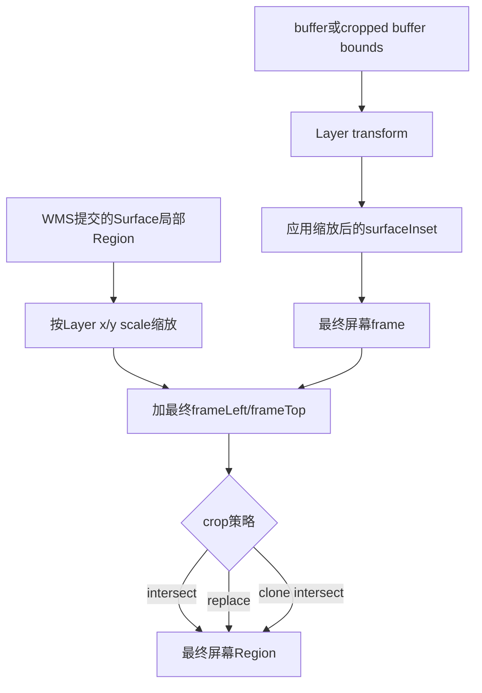
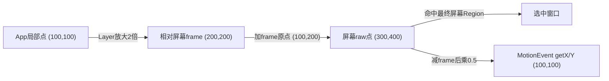

# 241 Android触摸Region、Touchable Insets、Task裁剪与Surface坐标变换链

> 源码版本：Android 11 / `android-11.0.0_r48`  
> 学习方式：macOS只读核源，不编译、不运行AOSP

## 1. 本章要解决什么

第240章已经知道，WMS会把输入窗口信息附着到Surface事务，再由SurfaceFlinger生成最终窗口快照。

这一章只盯住其中最容易出错的“几何”问题：

```text
App怎样声明窗口只有一部分可触摸？
FRAME、CONTENT、VISIBLE、REGION究竟是什么？
Region最初相对谁，什么时候变成屏幕坐标，又何时变回Surface局部坐标？
Task/Stack为什么既有Java Region裁剪，又有Surface crop裁剪？
Surface被缩放后，命中区域和App收到的getX()怎样保持一致？
getRawX()为什么通常仍保留原始屏幕点？
tap exclude是不是系统导航手势排除区？
```

## 2. 一句总纲

Android 11的触摸几何不是一次算完，而是分层归一化：

```text
App在窗口局部坐标声明InternalInsetsInfo
→ WMS把它换算成全局Region，并施加Task与tap-exclude策略
→ WMS再把Region平移回Surface局部坐标，随Layer事务提交
→ SurfaceFlinger应用Layer缩放、屏幕位置和Surface crop，得到最终屏幕Region/frame
→ InputDispatcher用屏幕点命中，并给目标附上frame负偏移与逆缩放
→ MotionEvent保留raw点，以scale+offset计算窗口局部getX()/getY()
```

## 3. 全链路图

```mermaid
flowchart LR
    APP["ViewTreeObserver监听器"] --> INFO["InternalInsetsInfo 窗口局部"]
    INFO --> VR["ViewRootImpl performTraversals"]
    VR --> BINDER["IWindowSession.setInsets"]
    BINDER --> WMS["WindowState given insets"]
    WMS --> REGION["全局touchable Region"]
    REGION --> LOCAL["平移为Surface局部Region"]
    LOCAL --> SF["SurfaceFlinger transform/crop"]
    SF --> SCREEN["屏幕坐标Region与frame"]
    SCREEN --> HIT["InputDispatcher命中"]
    HIT --> EVENT["MotionEvent scale/offset"]
```



## 4. 源码地图

```text
frameworks/base/core/java/android/view/ViewTreeObserver.java
frameworks/base/core/java/android/view/ViewRootImpl.java
frameworks/base/core/java/android/view/IWindowSession.aidl
frameworks/base/services/core/java/com/android/server/wm/Session.java
frameworks/base/services/core/java/com/android/server/wm/WindowManagerService.java
frameworks/base/services/core/java/com/android/server/wm/WindowState.java
frameworks/base/services/core/java/com/android/server/wm/InputMonitor.java
frameworks/base/core/java/android/view/InputWindowHandle.java
frameworks/native/services/surfaceflinger/Layer.cpp
frameworks/native/services/inputflinger/dispatcher/InputDispatcher.cpp
frameworks/native/libs/input/InputTransport.cpp
frameworks/native/libs/input/Input.cpp
frameworks/base/core/java/android/view/MotionEvent.java
```

## 5. 先分清四个几何对象

```text
Rect：一个轴对齐矩形
Region：多个矩形经并、交、差形成的区域，可有洞、可不连续
frame：窗口或Layer在某坐标系中的外接矩形
transform：把Layer局部坐标映射到屏幕坐标的变换
```

Region不是任意曲线路径。Android底层Region以一组轴对齐矩形表达。

## 6. Region为什么比Rect重要

一个输入窗口可能只有左右两个按钮可触摸，中间透明洞要把事件漏给后窗：

```text
可触摸： [左按钮]          [右按钮]
不可触摸：        中间空洞
```

一个Rect不能同时表达两个孤立岛，Region可以。

## 7. InternalInsetsInfo是App侧入口

`ViewTreeObserver.InternalInsetsInfo`包含：

```java
public final Rect contentInsets = new Rect();
public final Rect visibleInsets = new Rect();
public final Region touchableRegion = new Region();
int mTouchableInsets;
```

它是`@hide`接口，普通第三方App不能把它当作稳定公开API。

## 8. 四种Touchable Insets模式

```text
TOUCHABLE_INSETS_FRAME   = 0
TOUCHABLE_INSETS_CONTENT = 1
TOUCHABLE_INSETS_VISIBLE = 2
TOUCHABLE_INSETS_REGION  = 3
```

模式决定WMS以后取哪组数据计算命中区域。

## 9. FRAME模式

FRAME表示整个WindowState frame可触摸。

它是`reset()`后的默认值；监听器什么也不改时，窗口通常按frame命中。

## 10. CONTENT模式

CONTENT不是“content view真实可见像素”，而是frame扣掉App上报的四边`contentInsets`：

```text
left   = frame.left   + inset.left
top    = frame.top    + inset.top
right  = frame.right  - inset.right
bottom = frame.bottom - inset.bottom
```

## 11. VISIBLE模式

VISIBLE同理，只是使用`visibleInsets`。

它表达“窗口中后方内容被认为可见的内部边界”，不是SurfaceFlinger逐像素透明度检测结果。

## 12. REGION模式

REGION直接采用`touchableRegion`。

源码注释明确：这个Region相对窗口frame原点，而不是天然的屏幕坐标。

## 13. 这里的Insets不是WindowInsets

最常见误解是把两者混为一谈：

```text
InternalInsetsInfo.contentInsets/visibleInsets
    用于老式窗口内部布局与可触摸区域声明

WindowInsets / InsetsSource
    描述状态栏、导航栏、IME、cutout等系统占用
```

两者可能在某些窗口产生关联，但类型、传输链和语义都不同。

## 14. 监听器何时执行

ViewRootImpl在`performTraversals()`里判断：

```java
hasComputeInternalInsetsListeners()
        || mHasNonEmptyGivenInternalInsets
```

即使监听器刚被删除，只要旧值非空，也要再算一次把WMS中的旧值清回默认。

## 15. 为什么先reset

每次派发前：

```java
insets.reset();
dispatchOnComputeInternalInsets(insets);
```

这意味着监听器每次都应描述完整当前状态，不能假设上次Region还留着。

## 16. 多个监听器共享一个对象

监听器按注册数组顺序收到同一个`InternalInsetsInfo`。

后一个监听器能看到并修改前一个监听器的结果；框架不会自动做Region并集。

## 17. 只有变化才跨进程

ViewRootImpl比较`mLastGivenInsets.equals(insets)`。

当值未变化且没有`insetsPending`时，不重复调用WMS，避免每次Traversal都触发Surface placement。

## 18. Compatibility Translator

兼容模式下，ViewRootImpl先通过`mTranslator`转换content、visible和touchable area。

所以跨Binder的值未必还是App逻辑像素；可能已按兼容缩放转换。

## 19. Binder边界

调用链是：

```text
ViewRootImpl
→ IWindowSession.setInsets(oneway接口定义之外的普通Binder调用)
→ Session.setInsets
→ WindowManagerService.setInsetsWindow
```

Session只是把调用转给WMS，并未计算Region。

## 20. WMS保存四组状态

WindowState保存：

```text
mGivenContentInsets
mGivenVisibleInsets
mGivenTouchableRegion
mTouchableInsets
```

这些是“客户端给出的声明”，还不是InputDispatcher最终看到的Region。

## 21. globalScale提前作用于given值

若`mGlobalScale != 1`，WMS会缩放三组given值。

这一步处理size compatibility一类窗口逻辑尺寸与WMS尺寸的差异。

## 22. 更新为什么触发布局

保存后WMS调用：

```text
setDisplayLayoutNeeded()
performSurfacePlacement()
```

因为可触摸Region变化要进入下一份InputWindowInfo，并可能影响辅助功能窗口区域观察。

## 23. 从声明到全局Region

`WindowState.getTouchableRegion()`以当前`mFrame`为锚点。

FRAME直接复制frame；CONTENT/VISIBLE在frame内缩；REGION先复制given Region，再加frame左上角。

## 24. applyInsets的真实含义

核心公式是：

```java
outRegion.set(
    frame.left + inset.left,
    frame.top + inset.top,
    frame.right - inset.right,
    frame.bottom - inset.bottom);
```

因此四个inset值是“从各边向内扣多少”，不是四条绝对坐标。

## 25. REGION为何只做translate

App给出的Region已经描述局部形状。

WMS只需加`frame.left/top`，把窗口局部位置换成Display全局位置；兼容缩放此前已经处理。

## 26. 第一组数值例子

假设：

```text
frame = [100, 200, 500, 700]
contentInsets = [20, 30, 40, 50]
```

CONTENT结果：

```text
[120, 230, 460, 650]
```

注意右边是`500 - 40`，不是`100 + 40`。

## 27. REGION数值例子

若局部Region是：

```text
[10,20,110,120] ∪ [250,300,350,400]
```

加frame原点后成为：

```text
[110,220,210,320] ∪ [350,500,450,600]
```

两个岛仍然分离。

## 28. getTouchableRegion还不是最终Region

紧接着会做：

```text
cropRegionToStackBoundsIfNeeded
subtractTouchExcludeRegionIfNeeded
```

所以“App声明可触摸”不等于“系统最终允许它接收触摸”。

## 29. touch modality是另一维度

`getTouchableRegion()`只计算显式区域，不负责完整modal语义。

`getEffectiveTouchableRegion()`才会把touch-modal窗口视为Display范围，再做Stack crop和exclude。

## 30. normal input snapshot的modal编码

正常WindowState走`getSurfaceTouchableRegion()`时，modal窗口会：

```text
输出flags加FLAG_NOT_TOUCH_MODAL
显式Region扩大到Activity dim/letterbox/Stack范围，或系统窗口的大Display范围
```

这样native最终统一按Region命中。

## 31. 为什么区域要再减tap exclude

某些Window区域不应触发：

```text
切换焦点到该窗口
把该窗口所在Display移到顶层
把触摸发送给该窗口
```

WMS把这些局部区域从窗口touchable Region中做`DIFFERENCE`。

## 32. tap exclude的坐标

`mTapExcludeRegion`由窗口坐标提供。

`getTapExcludeRegion()`先把它裁到窗口本地bounds，再平移到屏幕坐标；注释说明无需在这里缩放，native层会处理。

## 33. tap exclude不是导航手势排除

名称相近但不能混用：

```text
Tap exclude：WMS内部窗口/Display点击、聚焦与路由排除机制
System gesture exclusion：App通过View API声明边缘返回手势排除，并受长度限制/策略约束
```

本章分析的是前者。后者应沿`systemGestureExclusionRects`与DisplayPolicy单独学习。

## 34. Region差集可能产生洞

设窗口Region是`[0,0,400,500]`，exclude是中间`[100,100,300,300]`。

差集不是一个较小Rect，而是包围中间洞的多个矩形条带。

## 35. Task裁剪的第一层：Java Region

`cropRegionToStackBoundsIfNeeded()`要求：

```text
窗口有Task
task.cropWindowsToStackBounds()为true
存在ActivityStack
Stack不是由TaskOrganizer创建
```

满足时，Region与Stack dim bounds求交。

## 36. 为什么TaskOrganizer跳过Java裁剪

当`stack.mCreatedByOrganizer`时，Java这里不把Region静态裁到dim bounds。

组织器管理的Surface几何可能由Layer crop动态决定，旧Java bounds不一定是权威视觉边界。

## 37. Task裁剪的第二层：Surface crop引用

`setTouchableRegionCropIfNeeded()`可把Stack的SurfaceControl放进InputWindowHandle。

SurfaceFlinger拿到后，使用该Layer最终`mScreenBounds`裁剪输入Region。

## 38. 两层裁剪不是简单重复

```text
Java裁剪：基于WMS当前Stack dim bounds，尽早约束Region
Surface裁剪：基于应用事务后的真实Layer screen bounds，贴近最终视觉状态
```

它们服务于不同的状态来源和时序。

## 39. freeform为什么特殊

freeform窗口不设置Stack Surface crop；Java还可能向外扩`RESIZE_HANDLE_WIDTH_IN_DP`。

这样阴影/调整尺寸手柄附近仍可被命中，而不是严格截在内容矩形。

## 40. modal Activity使用什么范围

优先顺序大体是：

```text
letterbox inner bounds
→ Task dim bounds
→ RootTask dim bounds
```

然后考虑freeform扩展与Stack裁剪。

## 41. WMS为何平移回Surface局部

完成全局Region、Task crop和exclude后：

```java
region.translate(-frame.left, -frame.top);
```

这是因为InputWindowInfo被附着到一个会移动/缩放的Surface；携带局部Region，SF才能随Layer变换重建最终屏幕位置。

## 42. 看似绕路其实在划分职责

```text
App局部 → WMS全局：方便与Task/exclude等Display策略求交
WMS全局 → Surface局部：让Region随Layer事务一起变换
SF局部 → 屏幕全局：按真实Layer树生成命中快照
```

每次转换都有明确的运算对象。

## 43. size-compat临时逆缩放

Android 11源码带有TODO：size-compat下frame已经post-scaling，旧逻辑又会让SF再缩放Region。

因此`getSurfaceTouchableRegion()`会在特定条件下先乘`mInvGlobalScale`，避免双重缩放。

## 44. 不要把TODO当通用公式

这段逆缩放只在：

```text
mActivityRecord.hasSizeCompatBounds()
且 mGlobalScale != 1
```

成立时执行，不能概括成“所有窗口交给SF前都逆缩放”。

## 45. SurfaceFlinger复制DrawingState

`Layer::fillInputInfo()`先复制：

```cpp
InputWindowInfo info = mDrawingState.inputInfo;
```

后续修改的是本次输出快照，不是回写WMS Java对象。

## 46. Layer transform的缩放分量

SF读取：

```cpp
ui::Transform t = getTransform();
const float xScale = t.sx();
const float yScale = t.sy();
```

当缩放不为1时，它同时处理命中Region和返回客户端的逆比例。

## 47. Region向屏幕视觉尺寸缩放

```cpp
info.touchableRegion.scaleSelf(xScale, yScale);
```

Layer放大2倍，局部可触摸岛也必须放大2倍，否则视觉按钮与命中区域错位。

## 48. windowXScale取逆数

```cpp
info.windowXScale *= 1.0f / xScale;
info.windowYScale *= 1.0f / yScale;
```

Surface在屏幕上放大2倍，App局部坐标应缩回一半，所以事件端使用`0.5`。

## 49. 零缩放的防护

当scale为0时，源码把对应window scale设为0，而不是除零。

这种Layer在几何上退化；不要用正常可交互窗口直觉推导它。

## 50. surfaceInset也随Layer缩放

`surfaceInset`先乘x/y scale并四舍五入，再被限制到Layer宽高的一半以内。

它用于从变换后的Layer bounds内缩输入frame，避免阴影或额外Surface边缘被当作内容原点。

## 51. frame由Layer bounds重建

SF取得buffer size；无效时退到cropped buffer size，再用transform映射到屏幕。

应用surfaceInset后，这个矩形成为最终：

```text
frameLeft/frameTop/frameRight/frameBottom
```

因此WMS先前填的frame会在这里按Layer真实几何重建。

## 52. Region重新平移到屏幕

SF执行：

```cpp
info.touchableRegion =
        info.touchableRegion.translate(info.frameLeft, info.frameTop);
```

到这一步，Region重新成为InputDispatcher可直接与屏幕触点比较的坐标。

## 53. crop的两种模式

若有crop Layer：

```text
replaceTouchableRegionWithCrop = false
    原Region ∩ crop Layer屏幕bounds

replaceTouchableRegionWithCrop = true
    忽略原Region，直接使用crop Layer屏幕bounds
```

后者常用于输入消费者等特殊Surface，不是普通WindowState默认路径。

## 54. null crop在replace模式下的含义

`replaceTouchableRegionWithCrop(null)`并非“没有范围”。

源码语义是使用当前Layer自身`mScreenBounds`替换Region。

## 55. clone还要再裁一次

若Layer是clone，SF把输入Region再与cloned root的屏幕bounds求交。

防止镜像/克隆画面外侧产生幽灵触摸区域。

## 56. SF阶段的几何图



## 57. 命中测试只看最终屏幕事实

InputDispatcher前到后遍历窗口，触点`(x,y)`与`touchableRegionContainsPoint(x,y)`比较。

此处x/y和Region都在Display屏幕坐标，因此无需知道App最初选择了CONTENT还是REGION。

## 58. touch-modal的native条件仍存在

native代码仍写着：

```cpp
isTouchModal = !(NOT_FOCUSABLE | NOT_TOUCH_MODAL);
```

但普通WindowState的modal语义已在WMS转换成NOT_TOUCH_MODAL加大Region；手工构造的InputWindowHandle仍可能走native modal分支。

## 59. 命中与坐标投递是两步

找到目标窗口后，Dispatcher才调用`addWindowTargetLocked()`生成目标坐标参数。

“点是否落在窗口里”和“App收到什么坐标”不可混成同一次Region变换。

## 60. InputTarget的偏移

普通窗口目标使用：

```cpp
xOffset = -windowInfo->frameLeft;
yOffset = -windowInfo->frameTop;
```

即先把屏幕原点平移到窗口frame左上角。

## 61. InputTarget的缩放

同时携带SF计算后的：

```text
windowXScale
windowYScale
globalScaleFactor
```

每个pointer ID都能保留自己的目标窗口偏移与缩放，支持split多指进入不同窗口。

## 62. publish时偏移也要乘scale

Dispatcher计算：

```cpp
xScale = dispatchEntry->windowXScale;
xOffset = dispatchEntry->xOffset * xScale;
```

所以客户端局部坐标公式是：

```text
localX = rawX × windowXScale + (-frameLeft × windowXScale)
       = (rawX - frameLeft) × windowXScale
```

## 63. 第二组完整数值例子

设最终SF frame左上角为`(100,200)`，Surface视觉缩放2倍，屏幕触点为`(300,500)`。

```text
windowXScale = windowYScale = 0.5
xOffset = -100 × 0.5 = -50
yOffset = -200 × 0.5 = -100
```

应用局部坐标：

```text
getX = 300 × 0.5 - 50  = 100
getY = 500 × 0.5 - 100 = 150
```

## 64. InputTransport传什么

`publishMotionEvent()`把原始pointer coordinates连同：

```text
xScale/yScale
xOffset/yOffset
global scale影响后的必要坐标副本
```

写进InputMessage，通过InputChannel发送给App进程。

## 65. InputConsumer怎样恢复MotionEvent

App侧`InputConsumer::initializeMotionEvent()`原样读出参数，传给native `MotionEvent::initialize()`。

并不是在Java层创建事件后再调用`offsetLocation()`。

## 66. raw与local同时存在的关键

native MotionEvent保存：

```text
原始PointerCoords
mXScale/mYScale
mXOffset/mYOffset
```

读取不同API时选择是否应用后两组参数。

## 67. getRawX的公式

`getRawAxisValue()`直接读取raw PointerCoords轴值。

对常规屏幕触摸，它通常就是窗口变换前的Display触点，例如上例中的`300`。

## 68. getX的公式

`getAxisValue(AXIS_X)`执行：

```cpp
return rawValue * mXScale + mXOffset;
```

因此上例`getX()`为100，而`getRawX()`仍为300。

## 69. globalScale为何特殊

若存在globalScaleFactor，Dispatcher会缩放传输的PointerCoords，但对X/Y暂不叠加window scale。

注释明确：window scale会作为参数送回客户端，在请求相对坐标时再应用，避免raw坐标被窗口比例污染或X/Y重复缩放。

## 70. 触摸面积轴的处理

`PointerCoords::scale()`中：

```text
X/Y使用windowXScale/windowYScale
TOUCH_MAJOR/MINOR、TOOL_MAJOR/MINOR使用globalScaleFactor
pressure、size不缩放
```

因为pressure/size是归一化量，触摸椭圆尺寸却带空间尺度。

## 71. 多指split下的坐标归一化

不同pointer可能属于不同窗口，因而拥有不同offset/scale。

创建单个DispatchEntry时，Dispatcher选第一个pointer的坐标系为规范坐标系，并先把其他pointer从各自窗口坐标归一到这一坐标系。

## 72. 为什么每pointer保存几何

如果A窗口缩放1倍，B窗口缩放2倍，而两根手指后来因目标合并要进入同一事件，只有每pointer保留原目标几何才能正确换算。

只在整个TouchState存一组scale是不够的。

## 73. 旋转为何不能只看sx/sy

`fillInputInfo()`使用完整`Transform`映射Layer bounds，但r48对touchable Region的显式处理主要是scale再translate/crop。

阅读复杂旋转、翻转或非轴对齐变换时，不能把本章的纯缩放公式当作任意矩阵的完整数学证明。

## 74. Region本身仍是轴对齐集合

即使视觉Layer旋转，最终供InputDispatcher查询的Region仍需落在屏幕轴对齐Region表达中。

边界可能通过变换后的bounds或矩形集合近似/裁剪，不能等同于GPU逐像素命中蒙版。

## 75. surfaceInset不是contentInset

```text
surfaceInset：Surface几何边缘与输入frame相关，SF参与计算
contentInsets：窗口frame内部的客户端声明，WMS用于CONTENT模式
```

名字都有inset，但作用层、来源和坐标阶段完全不同。

## 76. frame也有多个阶段

```text
WindowState mFrame：WMS布局阶段的屏幕窗口框
InputWindowHandle frame：WMS填入事务的基础值
SF fillInputInfo frame：按buffer、transform、surfaceInset重建的最终屏幕框
MotionEvent局部原点：最终frameLeft/frameTop经逆缩放得到
```

说“frame就是窗口位置”信息不够，必须说明是哪一阶段。

## 77. 一个带Region和缩放的完整推演

初始条件：

```text
WMS frame = [100,200,300,400]
App局部Region = [20,30,120,130]
Layer scale = 2
最终SF frame左上角 = [100,200]
```

WMS先得到全局`[120,230,220,330]`，策略裁剪后减frame原点，提交局部`[20,30,120,130]`。

SF缩放为`[40,60,240,260]`，再加最终frame原点，命中Region为`[140,260,340,460]`。

## 78. 推演命中点

屏幕点`(300,400)`落在最终Region内，因此命中窗口。

事件参数为scale `0.5`，offset `(-50,-100)`：

```text
localX = 300×0.5-50  = 100
localY = 400×0.5-100 = 100
```

局部点`(100,100)`也恰在App最初Region内。

## 79. 几何不变量图



## 80. 常见错误一：用视觉透明度推断命中

Surface某像素透明，不代表该处自动穿透。

输入只看InputWindowInfo flags、Region、遮挡信任等规则；除非窗口主动声明Region洞或系统扣除，否则透明像素仍可能接收触摸。

## 81. 常见错误二：REGION写屏幕坐标

`InternalInsetsInfo.touchableRegion`要求窗口局部坐标。

若App把frame.left/top提前加进去，WMS还会再平移一次，命中区会整体错位。

## 82. 常见错误三：把空Region都理解成不可触摸

对普通已转换成NOT_TOUCH_MODAL的窗口，空Region通常不能命中。

但若某手工InputWindowHandle仍是touch-modal，native可因modal条件在Region外也选中；必须同时检查flags和构造路径。

## 83. 常见错误四：把getRawX当物理传感器坐标

`getRawX()`文档称窗口调整前的屏幕位置，但它已经经过InputReader设备校准、方向映射、Display viewport等上游处理。

它不是触摸控制器未经校准的raw ABS_X数值。

## 84. 常见错误五：认为InputDispatcher改写唯一坐标副本

常规路径主要保留raw PointerCoords，再附带scale/offset。

客户端`getX()`按参数计算局部值，因此raw与local能同时从一个MotionEvent读取。

## 85. 常见错误六：Task crop等于窗口frame

Task/Stack crop来自容器Surface或dim bounds；窗口frame来自具体窗口/Layer。

子窗口可以大于容器，最终输入Region仍被容器裁掉。

## 86. 调试时先找哪份事实

建议按顺序核对：

```text
App listener输出的InternalInsetsInfo
WindowState mGiven*与mTouchableInsets
WindowState getTouchableRegion结果
SurfaceFlinger最终InputWindowInfo frame/Region/scale
InputDispatcher dumpsys中的窗口快照
App日志中的rawX与x
```

只看任意一层都可能漏掉后续裁剪或变换。

## 87. 只读验证命令：App到WMS

```bash
cd /Users/ninebot/androidSource
sed -n '220,330p' frameworks/base/core/java/android/view/ViewTreeObserver.java
sed -n '2985,3025p' frameworks/base/core/java/android/view/ViewRootImpl.java
sed -n '2025,2055p' \
  frameworks/base/services/core/java/com/android/server/wm/WindowManagerService.java
```

## 88. 只读验证命令：WMS Region

```bash
cd /Users/ninebot/androidSource
sed -n '2579,2668p' \
  frameworks/base/services/core/java/com/android/server/wm/WindowState.java
sed -n '3420,3518p' \
  frameworks/base/services/core/java/com/android/server/wm/WindowState.java
```

## 89. 只读验证命令：SF与Dispatcher

```bash
cd /Users/ninebot/androidSource
sed -n '2368,2465p' frameworks/native/services/surfaceflinger/Layer.cpp
sed -n '1999,2035p' \
  frameworks/native/services/inputflinger/dispatcher/InputDispatcher.cpp
```

## 90. 只读验证命令：MotionEvent

```bash
cd /Users/ninebot/androidSource
sed -n '1177,1200p' frameworks/native/libs/input/InputTransport.cpp
sed -n '404,448p' frameworks/native/libs/input/Input.cpp
```

## 91. macOS只读练习一：手算四种模式

给定：

```text
frame=[100,200,500,700]
contentInsets=[20,30,40,50]
visibleInsets=[0,80,0,120]
localRegion=[10,20,110,120]∪[250,300,350,400]
```

分别算出FRAME、CONTENT、VISIBLE、REGION的全局结果，再假设Stack bounds为`[150,250,480,650]`求交。

## 92. macOS只读练习二：追监听器清空

```bash
cd /Users/ninebot/androidSource
rg -n "computesInternalInsets|mHasNonEmptyGivenInternalInsets|setInsets\(" \
  frameworks/base/core/java/android/view/ViewRootImpl.java
```

回答：删除最后一个listener后，为什么还可能再调用一次`setInsets()`？

## 93. macOS只读练习三：手算缩放闭环

```bash
cd /Users/ninebot/androidSource
sed -n '2380,2455p' frameworks/native/services/surfaceflinger/Layer.cpp
sed -n '2495,2555p' \
  frameworks/native/services/inputflinger/dispatcher/InputDispatcher.cpp
```

自行设定frame、xScale=1.5、raw点，验证Region视觉放大与`getX()`逆缩放能回到同一App局部点。

## 94. macOS只读练习四：验证raw/local公式

```bash
cd /Users/ninebot/androidSource
sed -n '404,448p' frameworks/native/libs/input/Input.cpp
sed -n '2655,2715p' frameworks/base/core/java/android/view/MotionEvent.java
```

写出`getRawX()`与`getX()`各自读取的字段和公式，并说明raw为何不等于evdev原始ABS值。

## 95. 复读后最容易不理解的地方

```text
InternalInsetsInfo是窗口局部声明，不是WindowInsets
WMS曾把Region变成全局，又为了绑定Surface事务平移回局部
SF一边放大命中Region，一边给事件保存逆缩放
InputDispatcher命中使用屏幕坐标，客户端getX使用窗口局部坐标
rawX是窗口变换前的Display坐标，不是触控芯片原始读数
```

## 96. 复读修订一：content/visible不是自动测量结果

更准确地说，它们是客户端经internal-insets监听链上报、由WMS保存的四边inset。

WMS不会扫描View树或Surface透明像素自动推导CONTENT/VISIBLE命中形状。

## 97. 复读修订二：裁剪顺序要区分坐标阶段

Java阶段先在全局坐标对Stack bounds求交并减tap exclude；随后Region转回Surface局部。

SF阶段再根据最终Layer screen bounds做crop或replace。不能把两次裁剪写成同一份Region上的连续静态Rect运算。

## 98. 复读修订三：纯缩放算例有边界

本章的`(raw-frame)×inverseScale`适合解释常见平移+轴向缩放。

r48遇到旋转、clone、portal、size-compat TODO和退化transform时还存在额外规则，应以最终`fillInputInfo()`输出为准。

## 99. 复读修订四：tap exclude命名边界

本章`mTapExcludeRegion`是窗口/Display点击路由排除，不等同于公开的系统手势排除矩形。

因此第240章中笼统写成“系统手势、导航或其他策略”的表述，读到这里应收紧为WMS tap-exclude机制；导航手势仲裁需要另章分析。

## 100. Android 11 r48版本边界

```text
InternalInsetsInfo仍为@hide老式接口
size-compat Region双缩放以临时inverse-scale TODO规避
SF fillInputInfo显式处理scale、frame、surfaceInset与crop
TaskOrganizer创建的Stack跳过Java dim-bounds裁剪
普通WindowState modal被编码为NOT_TOUCH_MODAL+显式Region
MotionEvent用raw coords加scale/offset并存方式提供raw/local坐标
```

## 101. 本章检查清单

```text
[ ] 能区分Rect、Region、frame与transform
[ ] 能手算FRAME/CONTENT/VISIBLE/REGION
[ ] 能解释App局部→WMS全局→Surface局部→SF屏幕全局
[ ] 能区分Java Stack裁剪与SF Surface crop
[ ] 能区分intersect crop和replace crop
[ ] 能解释Layer放大时Region为何放大、windowScale为何取逆
[ ] 能写出localX=(rawX-frameLeft)×windowXScale
[ ] 能区分getRawX、getX与evdev ABS_X
[ ] 能区分tap exclude与system gesture exclusion
[ ] 能指出旋转与size-compat的版本边界
```

## 102. 本章小结

完整几何闭环是：

```text
App用窗口局部InternalInsetsInfo声明可触摸形状
→ WMS围绕WindowState frame转成全局Region
→ 应用Task/Stack与tap-exclude策略
→ 转回Surface局部并进入Layer事务
→ SF按最终Layer scale/frame/crop生成屏幕Region
→ Dispatcher用屏幕raw点命中
→ 以frame负偏移和逆scale让MotionEvent.getX/Y回到App局部坐标
```

输入区域和事件坐标走的是同一套几何的正变换与逆变换。只要两边使用同一份最终Layer状态，视觉按钮、命中区域与App局部坐标就能闭合。

## 103. 下一章预告

下一章深入Android 11的系统手势排除区域：从View设置exclusion rect、ViewRoot收集与坐标转换，到WMS长度限制、DisplayPolicy更新和边缘返回手势仲裁，并与本章的tap exclude彻底分开。
