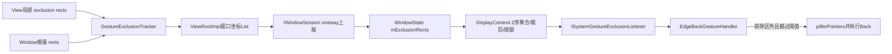
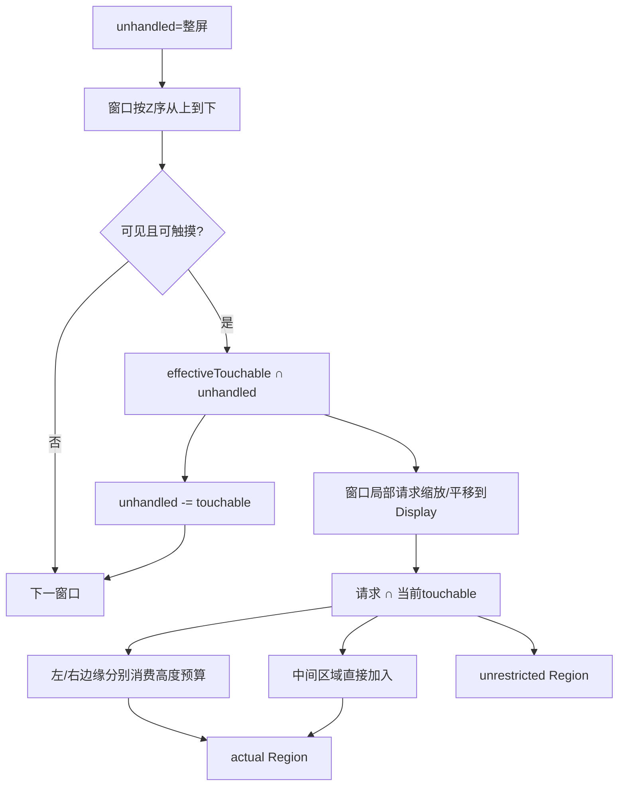
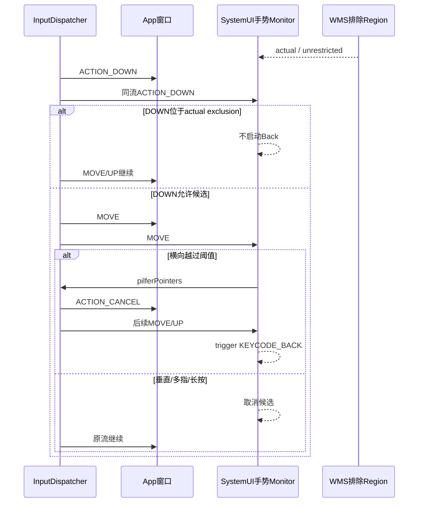

# 242 Android系统手势排除区域、边缘限制与导航手势仲裁链

> 源码版本：Android 11 / `android-11.0.0_r48`  
> 学习方式：macOS只读核源，不编译、不运行AOSP

## 1. 本章要解决什么

第241章把WMS的`mTapExcludeRegion`与公开的system gesture exclusion明确分开。

本章沿后一条链完整追踪：

```text
View.setSystemGestureExclusionRects传入的Rect相对谁？
View移动、被父View裁剪或隐藏后，排除区怎样更新？
Window级Rect和View级Rect怎样合并？
WMS为什么还要与窗口touchable region、上层窗口遮挡求交？
“最多200dp”究竟限制宽度、面积还是高度？
左右边缘共用还是分别计数？
IME、Home和沉浸式为什么例外？
SystemUI怎样根据最终Region决定返回手势，又在何时抢走App触摸流？
```

## 2. 一句总纲

系统手势排除区不是让App获得一块新触摸区域，而是让系统在App本来就能触摸的位置降低普通系统手势的优先级：

```text
View声明局部精细手势Rect
→ ViewRoot把可见部分映射到窗口坐标并合并
→ WMS按窗口Z序、真实touchable region和遮挡关系生成Display请求Region
→ 对左右系统手势边缘分别施加纵向高度预算
→ SystemUI接收最终Region
→ 边缘DOWN在Region内则不启动返回手势
→ Region外达到横向阈值后pilfer原触摸流并触发Back
```

## 3. 总体链路



## 4. 源码地图

```text
frameworks/base/core/java/android/view/View.java
frameworks/base/core/java/android/view/Window.java
frameworks/base/core/java/com/android/internal/policy/PhoneWindow.java
frameworks/base/core/java/android/view/GestureExclusionTracker.java
frameworks/base/core/java/android/view/ViewRootImpl.java
frameworks/base/core/java/android/view/IWindowSession.aidl
frameworks/base/services/core/java/com/android/server/wm/Session.java
frameworks/base/services/core/java/com/android/server/wm/WindowManagerService.java
frameworks/base/services/core/java/com/android/server/wm/WindowState.java
frameworks/base/services/core/java/com/android/server/wm/DisplayContent.java
frameworks/base/services/core/java/com/android/server/wm/WindowManagerConstants.java
frameworks/base/packages/SystemUI/src/com/android/systemui/statusbar/phone/EdgeBackGestureHandler.java
frameworks/base/core/java/android/view/WindowInsets.java
```

## 5. API解决的是手势冲突

典型冲突：

```text
App左边缘抽屉：从左向右拖
系统返回手势：从左向右拖
```

如果没有协议，系统和App会争夺同一个起始动作。

## 6. exclusion不是“禁止所有系统输入”

API文档使用的是“系统可选择放松自己的手势识别”。

它不保证屏蔽每一种系统级动作，更不允许覆盖mandatory system gestures。

## 7. exclusion也不创造触摸权

某Rect即使被App请求排除，如果那里不属于该窗口真实touchable region，WMS也不会采纳。

排除区只能在“App本来能接收触摸”的范围内改变手势优先级。

## 8. View API的坐标系

`View.setSystemGestureExclusionRects()`接收的是View的post-layout局部坐标。

例如一个宽300高100的SeekBar，其thumb附近Rect可写在`[0,0,300,100]`内部，而不是加上窗口位置。

## 9. 为什么强调post-layout

View尺寸和位置通常要到layout后才确定。

文档建议在`onLayout()`或`onDraw()`调用，保证Rect与最终内容几何一致。

## 10. List的所有权约定

文档要求调用后不要继续修改传入List。

r48的View实现直接保存该List引用，没有深拷贝每个Rect；调用者原地修改会绕过正常更新通知。

## 11. 传空List

空List会清掉View的排除声明，并移除RenderNode position listener。

若从未创建ListenerInfo且本来就是空，源码直接返回，避免无意义对象分配。

## 12. 为什么监听RenderNode位置

排除Rect是View局部的，但View可以因动画、translation或渲染节点位置更新而移动。

实现注册`RenderNode.PositionUpdateListener`，在`positionChanged`和`positionLost`时要求重新计算。

## 13. 回调线程不一定是UI线程

源码警告position callback可能由HWUI worker thread调用。

所以它不直接操作ViewRoot，而是向View Handler队首post `updateSystemGestureExclusionRects()`。

## 14. ViewRoot只记录“这个View脏了”

`updateSystemGestureExclusionRectsForView(view)`交给`GestureExclusionTracker`，再发送：

```text
MSG_SYSTEM_GESTURE_EXCLUSION_CHANGED
```

实际合并集中在ViewRoot消息处理线程。

## 15. Tracker为何使用WeakReference

它不应因为排除声明永久持有已脱离层级的View。

扫描时遇到View被回收、未attach或不可聚合显示，就移除对应info。

## 16. aggregated visibility

只有`isAggregatedVisible()`为true的View继续提供Rect。

父层隐藏导致子View虽自身visibility未改，排除区也应消失。

## 17. 局部Rect怎样映射到窗口

每个Rect复制后调用：

```java
p.getChildVisibleRect(excludedView, mappedRect, null)
```

该调用沿父层级映射坐标，并裁掉被祖先可见边界截掉的部分。

## 18. 完全不可见Rect会被丢弃

若`getChildVisibleRect()`返回false，不把该Rect加入新列表。

所以App声明一个超出View的Rect，并不意味着越界部分必然上报给WMS。

## 19. 部分可见Rect会被裁小

例如子View局部Rect为`[0,0,100,100]`，父容器只显示其右半边，映射后的窗口Rect只保留可见右半。

这与WMS之后按窗口touchable region求交是两层不同裁剪。

## 20. Window根级声明

`Window.setSystemGestureExclusionRects()`面向没有View层级、例如`takeSurface()`的场景。

PhoneWindow实现把根级List交给ViewRoot；它与各View提供的Rect相加，而不是替换View列表。

## 21. Window级坐标

Window API的Rect相对窗口坐标，已经不需要通过某个具体View父链映射。

Tracker创建结果列表时先放root rects，再追加各View映射后的rects。

## 22. 变化合并

`computeChangedRects()`只有检测到根列表、View列表或可见性变化，且最终List与旧结果不同，才返回新List。

返回null表示无需再次跨Binder上报。

## 23. r48 Tracker的可疑比较

`GestureExclusionViewInfo.update()`计算了`newRects`，但源码比较的是：

```java
if (mExclusionRects.equals(localRects)) return UNCHANGED;
mExclusionRects = newRects;
```

旧字段保存的是映射后Rect，右边却是View局部Rect。

## 24. 为什么要标成版本实现细节

当View不在窗口原点或被裁剪时，mapped rect与local rect不同，这个比较可能造成额外changed判断；反过来，某些位置/裁剪变化的识别也不能只靠这个等式直觉推导。

本章只记录r48源码事实，不把它推广成API保证。

## 25. ViewRoot上报内容

ViewRoot拿到变化List后调用：

```text
IWindowSession.reportSystemGestureExclusionChanged(mWindow, rects)
```

并把同一窗口坐标List通知`OnSystemGestureExclusionRectsChangedListener`。

## 26. AIDL是oneway

`reportSystemGestureExclusionChanged`在IWindowSession.aidl中声明为`oneway`。

App线程只把请求异步发送到system_server，不等待WMS完成聚合或SystemUI收到结果。

## 27. Session与WMS入口

Session先检查该Session持有的窗口，再转到WMS。

WMS通过`windowForClientLocked(session, window, true)`定位WindowState，避免客户端替别的窗口上报。

## 28. WindowState保存的是请求值

`mExclusionRects`保存客户端窗口坐标List。

相等时不触发重新计算；变化时清旧List、加入新项，再让DisplayContent更新。

## 29. 请求值不等于最终值

后续还有：

```text
窗口可见/可触摸资格
窗口局部到Display坐标变换
与effective touchable region求交
上层窗口遮挡
左右边缘高度预算
特殊窗口/沉浸模式豁免
```

因此App无法仅凭自己传入的List知道最终系统采纳Region。

## 30. 为什么聚合发生在DisplayContent

系统返回手势属于Display边缘，多个Window可以重叠。

只有DisplayContent拥有同一显示上的完整Z序、系统手势InsetsSource和可见窗口集合。

## 31. 没有listener时的优化

`updateSystemGestureExclusion()`发现没有注册的系统监听者，会直接返回false。

WindowState仍保存请求；当首个listener注册时，DisplayContent再计算整份Region。

## 32. SystemUI是主要消费者

手势导航启用时，`EdgeBackGestureHandler`向WMS注册`ISystemGestureExclusionListener`。

WMS把Display坐标的最终Region异步回调给SystemUI主执行器。

## 33. 两份Region

listener可能收到：

```text
systemGestureExclusion：应用限制后的实际Region
systemGestureExclusionUnrestricted：未施加边缘预算的请求Region
```

第二份主要用于调试、统计哪些请求被拒绝。

## 34. 计算从整屏unhandled开始

`unhandled`初始为整个Display。

DisplayContent按窗口从上到下遍历；每处理一个可触摸窗口，就从unhandled减去它的effective touchable region。

## 35. 上层窗口为什么先占地

若上层窗口覆盖某点，后层App即使在该点声明排除，也无法接收那里的初始触摸。

所以它也不应借排除声明影响系统手势。

## 36. 窗口资格过滤

以下窗口跳过：

```text
cantReceiveTouchInput()
不可见
FLAG_NOT_TOUCHABLE
或整个Display已没有unhandled区域
```

排除API不是给无输入窗口恢复触摸能力的后门。

## 37. effective touchable region

WMS使用`getEffectiveTouchableRegion()`，它包含touch modality、Stack crop和tap-exclude等结果。

这正是第241章两条机制的交点：system gesture exclusion会被tap-exclude之后的真实触摸范围限制，但两者仍不是同一个API。

## 38. 与unhandled求交

```text
touchableRegion = window effective touchable region ∩ unhandled
```

这样只保留当前窗口在Z序上实际暴露、能收到初始触摸的部分。

## 39. 普通窗口Rect转Display坐标

WMS先把List转为Region，然后：

```text
按WindowState mGlobalScale缩放
加Window frame.left/top
与当前touchableRegion求交
```

这条坐标链与第241章的窗口局部→Display全局模型一致。

## 40. 隐式全排除的旧应用

Android Q以前的目标SDK应用，在sticky immersive隐藏导航栏时，可由DeviceConfig兼容开关让整个touchable region隐式排除系统手势。

此时不读取其显式Rect列表。

## 41. 这不是所有沉浸应用的永久特权

需要同时满足：

```text
HIDE_NAVIGATION + IMMERSIVE_STICKY
兼容DeviceConfig开关为true
属于Activity窗口
targetSdk < Q
```

新应用不能依赖这条旧兼容路径。

## 42. system gesture edge来自InsetsSource

左右边缘不是硬编码固定像素宽度。

DisplayContent读取`ITYPE_LEFT_GESTURES`和`ITYPE_RIGHT_GESTURES` InsetsSource的frame，得到本Display当前手势边缘带。

## 43. 边缘限制到底限制什么

限制的是请求Region落入左/右edge frame部分的“纵向矩形高度总和”。

不是：

```text
不是每个Rect最多200dp
不是Rect宽度最多200dp
不是总面积最多200dp²
不是左右两边合计200dp
```

## 44. 左右分别拥有预算

源码初始化：

```java
int[] remainingLeftRight = {limit, limit};
```

左边缘和右边缘各自拥有完整纵向高度预算。

## 45. 默认最小200dp

`WindowManagerConstants`从DeviceConfig读取dp值，但用：

```java
Math.max(200, configuredValue)
```

所以r48至少200dp；设备配置可以把预算调得更大。

## 46. dp怎样转px

每个Display按：

```text
limitPx = limitDp × densityDpi / 160
```

计算实际预算。不同密度Display的像素数不同，但物理dp目标相近。

## 47. 预算是Display共享的

所有需要受限的可见窗口按Z序共同消费该Display左右两份预算。

不是每个Window各有200dp，也不是每个App进程各有200dp。

## 48. 为什么按Z序共享

上层窗口的可触摸区域先决定真实交互面。

如果每个窗口独立拿满额度，重叠窗口叠加后可以让整条边缘都失去系统返回能力。

## 49. 限额函数的输入

对左边缘：

```text
requested local Region ∩ leftEdge
```

对右边缘同理。Region中完全不碰边缘带的部分不消费边缘预算。

## 50. 中间区域不受这项限制

WMS用请求Region减去leftEdge和rightEdge，把剩下middle直接并入最终Region。

因为这项200dp规则专门保护边缘系统手势，不是限制App在屏幕中央的普通手势声明。

## 51. 为什么仍返回中间Region

system gesture类型不只“返回”，其他系统手势区域可能随设备策略变化。

聚合函数保留完整请求语义，具体SystemUI消费者再结合自己的触摸带判断。

## 52. Rect消费顺序

`forEachRectReverse()`的注释说明顺序是：

```text
bottom → top
同一纵向顺序下 right → left
```

所以在一个边缘上，靠下的Rect优先获得预算。

## 53. 部分Rect怎样截断

若当前Rect高度100px，但剩余预算只有30px：

```java
rect.top = rect.bottom - 30;
```

最终保留该Rect底部30px，顶部70px被拒绝。

## 54. 为什么保留底部

这是r48具体实现的优先顺序，不是由API文字承诺给App的排序契约。

App应提交真正必要的小范围，而不是依赖“我靠下所以一定获批”的实现细节。

## 55. 一组限额算例

假设左边缘预算200px，从下到上有三个互不重叠Rect：

```text
C高度80
B高度90
A高度100
```

消费结果：

```text
C获80，剩120
B获90，剩30
A只获底部30
最终获批总高度200
```

## 56. Region矩形高度求和的边界

Region会把重叠Rect规范化成不重叠矩形集合，再迭代高度。

不能简单把调用者List每个Rect.height相加推断消耗，重叠、合并和裁剪都会改变Region分解。

## 57. 限制适用于哪些窗口

一般App窗口在手势导航边缘需要限制，以保证用户总能找到可用返回区域。

源码通过`needsGestureExclusionRestrictions()`决定豁免。

## 58. sticky隐藏导航的豁免

当客户端请求导航栏不可见，且Insets behavior为`BEHAVIOR_SHOW_TRANSIENT_BARS_BY_SWIPE`，限制可被取消。

这样沉浸内容可优先处理边缘；系统仍可用专门的transient bar手势策略介入。

## 59. IME豁免

`TYPE_INPUT_METHOD`不受边缘高度预算限制。

输入法会根据`systemGestures()` Insets，在键盘左右边缘上报从visibleTop到根底部的排除Rect，避免返回手势干扰键盘边缘操作。

## 60. Notification Shade豁免

`TYPE_NOTIFICATION_SHADE`也跳过限制。

它属于系统UI受信窗口，不是普通第三方App可创建的类型。

## 61. Home豁免

Activity type为HOME的窗口跳过限制。

Launcher的系统导航交互是整体系统体验的一部分，源码给予特殊策略。

## 62. mandatory gesture不能排除

`WindowInsets.getMandatorySystemGestureInsets()`文档明确：mandatory system gestures不能被`setSystemGestureExclusionRects()`覆盖。

所以“IME/Home不受200dp限制”也不等于能夺走mandatory区域的系统优先权。

## 63. actual与unrestricted聚合

每个Window的local请求都并入`outExclusionUnrestricted`。

actual则依据是否受限，分别经过边缘预算或直接union。

## 64. r48 restricted标志的细节

函数最后用“左右剩余预算是否小于初始值”返回boolean。

这表示只要受限路径在某边消费过预算，就可能标记restricted，即使请求没有真正被截断、actual与unrestricted相同。

## 65. 与AIDL注释的张力

AIDL说unrestricted参数在“没有应用限制”时应为null。

r48实现的boolean更接近“受限规则路径是否使用过边缘预算”，不严格等同于两个Region是否真的不同；调试时应直接比较两份Region，不只看null。

## 66. 更新何时通知listener

若新的actual Region与缓存相同，`updateSystemGestureExclusion()`直接返回，不再广播。

这意味着仅unrestricted请求变化、但actual恰好不变时，r48这段早退可能不发送新调试差异。

## 67. 首个listener注册

首个监听者触发立即重算；若重算没有导致广播，注册函数会单独把当前缓存回调给它。

因此SystemUI启用手势导航后能立刻拿到当前Region，不必等待下一次App上报。

## 68. WMS聚合图



## 69. SystemUI保存两份Region

EdgeBackGestureHandler回调在主执行器中更新：

```text
mExcludeRegion = actual
mUnrestrictedExcludeRegion = unrestricted非null ? unrestricted : actual
```

第二份用于标记“用户从被预算拒绝的App请求区域完成了返回”。

## 70. 只有手势导航启用才工作

Handler要求导航栏已attach且当前模式是gestural。

启用时注册WMS listener、创建gesture InputMonitor/InputEventReceiver和边缘动画panel；禁用时逐项释放。

## 71. InputMonitor为何能同时看到事件

`monitorGestureInput("edge-swipe", displayId)`建立手势监视通道。

DOWN初期事件仍可发给正常App窗口，同时SystemUI监视并判断是否形成返回手势。

## 72. ACTION_DOWN决定候选资格

SystemUI在DOWN时检查：

```text
quickstep/系统flag是否禁用返回
是否有gesture-blocking Activity
是否位于底部手势区
是否足够靠左/右边缘
是否落在actual exclusion Region
```

不满足就不启动本次返回候选。

## 73. 底部手势区优先

若`y >= displayHeight - bottomGestureHeight`，边缘返回直接拒绝。

这是为了避免与底部Home/Overview手势区域冲突。

## 74. 边缘宽度不是exclusion limit

```text
edgeWidthLeft/right：SystemUI认为DOWN可启动返回的横向宽度
exclusion limit：WMS允许App在边缘排除的纵向高度预算
```

一个控制X方向候选带，一个控制Y方向可让出的总长度。

## 75. ML模型是额外候选判断

在最内侧必定候选宽度之外、但仍位于较宽边缘范围时，r48可用App/位置特征模型决定是否接受。

exclusion Region检查发生在候选范围判断之后，二者不是替代关系。

## 76. transient navbar状态

当导航栏以transient sticky方式显示时，SystemUI忽略mExcludeRegion的阻止效果，直接按withinRange决定。

这与WMS对sticky hide nav的限制豁免相互配合，但分别发生在聚合端和消费端。

## 77. actual排除命中的结果

若DOWN在`mExcludeRegion`内：

```text
SystemUI记录excluded统计
返回false
不把本次流交给边缘返回panel
不pilfer App触摸
```

App继续按正常View分发处理该流。

## 78. 被拒绝请求区域

若DOWN不在actual，却在unrestricted里，`mInRejectedExclusion=true`。

这说明App请求过，但因预算/策略未获实际保护；系统仍允许返回，并用不同统计类型记录。

## 79. DOWN通过还不立即抢流

SystemUI先把事件同时观察并交给边缘动画插件。

只有手势横向移动超过touch slop且横向量大于纵向量，才认定达到返回阈值。

## 80. pilfer发生的时刻

达到阈值后：

```java
mThresholdCrossed = true;
mInputMonitor.pilferPointers();
```

InputDispatcher向原App目标合成CANCEL，后续pointer流留给手势monitor集合。

## 81. 为什么不是DOWN就pilfer

边缘处仍可能只是点击或纵向滚动。

延迟到方向与距离明确后再抢占，可减少系统对App正常触摸的误伤。

## 82. 多指会取消返回

阈值前出现`ACTION_POINTER_DOWN`，SystemUI记录multi-touch未完成并cancel边缘插件。

r48的边缘返回状态机不把多指当作有效Back手势。

## 83. 长按会取消

MOVE到来时若距downTime超过long-press timeout，候选取消。

默认属性上限来自`gestures.back_timeout`，源码常量默认250ms。

## 84. 纵向优先也取消

若`dy > dx && dy > touchSlop`，判为垂直移动，不再抢流。

这保护靠边的垂直列表滚动。

## 85. Back最终怎样触发

边缘插件确认完成后回调`triggerBack()`。

SystemUI注入一对`KEYCODE_BACK` DOWN/UP，并通知OverviewProxy与统计链。

## 86. exclusion不是直接把事件送给某个View

它只让SystemUI不启动冲突的系统返回候选。

真正的App目标仍由InputDispatcher基于InputWindowInfo命中，窗口内部仍按ViewGroup规则选择子View。

## 87. 仲裁时序图



## 88. SeekBar为何自动声明

`AbsSeekBar`会把thumb bounds扩大到最小尺寸，放入排除Rect，再追加用户自定义Rect。

拖动边缘thumb属于需要精细水平手势的典型场景。

## 89. Text Editor也可能声明

Editor为某些可拖动文本选择/插入控件设置排除Rect。

框架控件自己使用该API，说明它不是只为导航抽屉设计。

## 90. 不应排除整个ScrollView

API文档明确不建议为宽泛区域或普通Button声明排除。

简单点击在system gesture insets内通常仍保证到达窗口；冲突主要发生在从边缘开始的连续方向手势。

## 91. system gesture Insets是什么

`WindowInsets.Type.systemGestures()`告诉App哪些边缘可能被系统手势优先处理。

App可据此只在真正相交的精细控件处声明排除，而不是猜固定边缘宽度。

## 92. mandatory Insets是什么

`Type.mandatorySystemGestures()`是不可通过exclusion覆盖的系统手势区域。

设计交互时应把关键控件避开，而不是试图声明更大的Rect。

## 93. tappable element Insets

文档还区分`tappableElement`：简单tap是否可交给窗口，与连续系统手势优先权不是同一概念。

三类Insets应分别理解，不能把“在系统手势边缘”误写成“所有触摸都被系统吃掉”。

## 94. 诊断actual和unrestricted

Pointer Location调试视图可注册同一listener，把actual与被拒绝差异画成不同颜色。

源码属性为：

```text
debug.pointerlocation.showexclusion
```

本课程在macOS不实际运行，只通过源码理解该诊断入口。

## 95. 常见错误一：200dp限制每个Rect

错误。

它是每个Display、每个左右边缘分别共享的总纵向预算；多个Window与多个Rect共同消费。

## 96. 常见错误二：Rect越宽越费额度

错误。

一旦与edge frame相交，预算计算看Region分解矩形的height；宽度影响是否落入边缘，但不作为额度单位。

## 97. 常见错误三：请求排除后App一定收到手势

错误。

请求还会被View可见裁剪、Window touchable Region、上层窗口遮挡、边缘预算和mandatory gesture策略限制。

## 98. 常见错误四：排除区在MOVE中动态切换所有权

EdgeBackGestureHandler主要在本次流的ACTION_DOWN用当前Region决定候选资格。

DOWN后Region变化不应被理解为能把已经开始的手势任意倒带重选。

## 99. 常见错误五：pilfer等于普通View拦截

pilfer是InputDispatcher层把触摸焦点从原窗口目标取消给手势monitor，原App收到CANCEL。

ViewGroup intercept只在同一窗口View树内部重新分配，层级完全不同。

## 100. 常见错误六：沉浸式永远无限制

源码区分新Insets行为豁免与pre-Q sticky immersive兼容全排除，两者条件不同。

是否显示transient navbar还会影响SystemUI消费端是否尊重exclusion。

## 101. macOS只读练习一：追View映射

```bash
cd /Users/ninebot/androidSource
sed -n '11420,11485p' frameworks/base/core/java/android/view/View.java
sed -n '25,155p' frameworks/base/core/java/android/view/GestureExclusionTracker.java
```

画出View局部Rect经父可见裁剪成为窗口Rect的步骤，并找出r48 mapped/local比较的可疑点。

## 102. macOS只读练习二：手算Z序与预算

假设左边缘预算200px：顶部窗口暴露Rect高度60；下层窗口暴露Rect从下到上分别为90、100。

按WMS窗口Z序和Region底到顶顺序，算每段实际获批高度；再说明若顶部窗口覆盖下层50px，为什么要先改`unhandled`。

## 103. macOS只读练习三：核对豁免

```bash
cd /Users/ninebot/androidSource
sed -n '4990,5150p' \
  frameworks/base/services/core/java/com/android/server/wm/DisplayContent.java
sed -n '790,825p' \
  frameworks/base/services/core/java/com/android/server/wm/WindowState.java
```

列出普通App、sticky hide nav、IME、notification shade、Home与pre-Q immersive各自是否受限及条件。

## 104. macOS只读练习四：追SystemUI接管

```bash
cd /Users/ninebot/androidSource
sed -n '545,615p' \
  frameworks/base/packages/SystemUI/src/com/android/systemui/statusbar/phone/EdgeBackGestureHandler.java
sed -n '647,710p' \
  frameworks/base/packages/SystemUI/src/com/android/systemui/statusbar/phone/EdgeBackGestureHandler.java
```

标出DOWN排除、bottom area、edge width、横纵方向、long press、多指、pilfer和Back触发各自的时机。

## 105. 复读后最容易不理解的地方

```text
排除区只是放松普通系统手势优先级，不创造App触摸范围
View Rect先变窗口坐标，WMS再变Display坐标
WMS先按Z序算真实暴露touchable区域，再做排除聚合
200dp是左右各自的纵向共享预算
actual决定是否阻止Back，unrestricted主要记录被拒请求
DOWN只是候选；达到横向阈值才pilfer原App触摸流
```

## 106. 复读修订一：API中的200dp不是固定唯一值

View文档写200dp是平台基线；r48服务端从DeviceConfig读取并保证最小200dp，设备可配置更高值。

所以准确表述是“默认/最小基线200dp的可配置每边缘预算”，不能写死所有设备永远等于200dp。

## 107. 复读修订二：unrestricted非null不必然证明发生截断

r48以“是否消费过受限边缘预算”设置restricted标志，而非最终比较actual与unrestricted是否不同。

分析拒绝量应做Region差集，不能只用第二参数是否null判断。

## 108. 复读修订三：限制高度不是List高度简单相加

客户端List先合并成Region，再经历View裁剪、window缩放/平移、touchable相交和Z序unhandled裁剪。

真正消费的是最终落入edge frame的Region矩形序列高度。

## 109. 复读修订四：App与SystemUI不是DOWN时二选一投递

手势InputMonitor可与正常App同时观察初期事件。

Region外的候选也不会在DOWN立即取消App；只有横向阈值成立、SystemUI调用pilfer后，App才收到CANCEL并失去后续流。

## 110. Android 11 r48版本边界

```text
View/Window exclusion API在客户端合并后以oneway上报
GestureExclusionTracker存在mapped结果与local列表比较的实现细节
WMS以有效touchable region和top-to-bottom unhandled聚合
每Display左右边缘分别使用最小200dp可配置纵向预算
IME、notification shade、Home和特定sticky隐藏导航路径豁免
pre-Q sticky immersive全排除受DeviceConfig兼容开关控制
SystemUI EdgeBack先监视，横向越阈值后才pilfer并最终发送KEYCODE_BACK
```

## 111. 本章检查清单

```text
[ ] 能说出View exclusion Rect的坐标系
[ ] 能解释父View可见裁剪与RenderNode位置更新
[ ] 能区分View级与Window根级List
[ ] 能说明oneway上报的完成边界
[ ] 能推演窗口Z序、touchable Region和unhandled
[ ] 能解释左右边缘各自共享的纵向预算
[ ] 能手算bottom-to-top部分截断
[ ] 能列出主要豁免条件
[ ] 能区分systemGestures与mandatorySystemGestures
[ ] 能解释SystemUI从DOWN候选到pilfer再到Back的时序
```

## 112. 本章小结

Android 11系统手势排除链可以概括为：

```text
App只声明真正需要精细边缘手势的View局部Rect
→ ViewRoot把可见部分汇总为窗口坐标List并异步上报
→ WMS按窗口真实触摸能力、Z序遮挡和Display手势边缘聚合
→ 左右各自用纵向预算保留一部分App优先区
→ SystemUI用actual Region在DOWN阶段排除返回候选
→ Region外先与App共同观察，横向意图明确后pilfer
→ App收到CANCEL，SystemUI完成动画并发送Back键
```

这套设计的核心不是简单“系统让App”或“App让系统”，而是先用几何限制App的声明能力，再把最终决定放在系统手势状态机的DOWN与阈值阶段。

## 113. 下一章预告

下一章深入触摸遮挡安全：InputDispatcher如何计算`WINDOW_IS_OBSCURED`与`WINDOW_IS_PARTIALLY_OBSCURED`，trusted overlay为何例外，View的`filterTouchesWhenObscured`怎样防御tapjacking，以及它与普通Z序命中、透明窗口和system gesture exclusion的边界。
