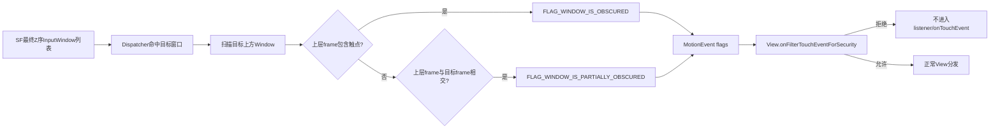
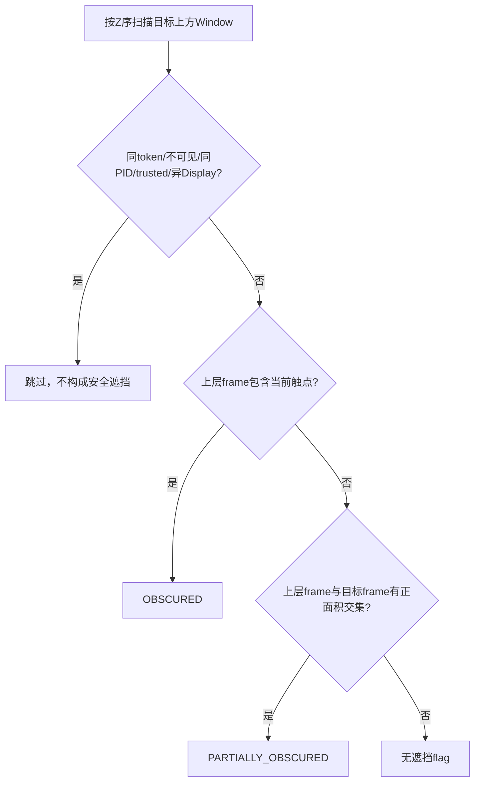
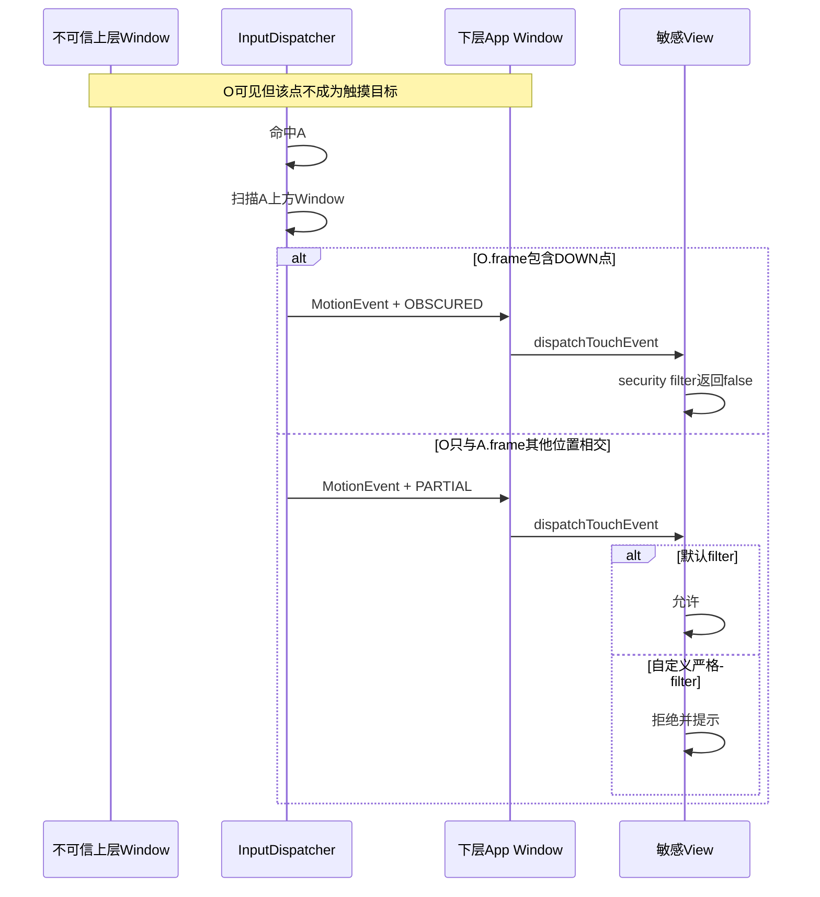

# 243 Android触摸遮挡、Trusted Overlay与Tapjacking防护链

> 源码版本：Android 11 / `android-11.0.0_r48`  
> 学习方式：macOS只读核源，不编译、不运行AOSP

## 1. 本章要解决什么

一个恶意悬浮窗可以把“允许”“安装”“授权”等按钮伪装成别的内容，诱导用户点到下层真实按钮，这类攻击通常称为tapjacking。

本章沿Android 11输入链回答：

```text
InputDispatcher怎样知道目标窗口上方还有Window？
OBSCURED与PARTIALLY_OBSCURED有什么精确差别？
判断用frame、touchableRegion还是像素alpha？
同进程窗口和trusted overlay为何不算安全遮挡？
普通TYPE_APPLICATION_OVERLAY是否可信？
filterTouchesWhenObscured为什么默认只检查一个flag？
安全页面怎样同时防当前触点遮挡、局部遮挡和悬浮窗出现？
```

## 2. 一句总纲

Android 11不靠App自己枚举悬浮窗，而是在InputDispatcher选择触摸目标时扫描其上方InputWindow：

```text
上层可见Window跨进程、非trusted、同Display
→ frame覆盖当前触点：给目标流加WINDOW_IS_OBSCURED
→ frame只在别处与目标frame相交：加WINDOW_IS_PARTIALLY_OBSCURED
→ 标志随MotionEvent送入App
→ View可用filterTouchesWhenObscured拒绝直接穿过遮挡点的事件
→ 更严格页面可自定义同时拒绝partial，或由受权系统窗口隐藏非系统overlay
```

## 3. 总体链路



## 4. 源码地图

```text
frameworks/native/services/inputflinger/dispatcher/InputDispatcher.cpp
frameworks/native/services/inputflinger/dispatcher/InputTarget.h
frameworks/native/services/inputflinger/dispatcher/TouchState.cpp
frameworks/native/include/input/InputWindow.h
frameworks/native/libs/input/InputWindow.cpp
frameworks/native/include/input/Input.h
frameworks/base/core/java/android/view/MotionEvent.java
frameworks/base/core/java/android/view/View.java
frameworks/base/core/java/android/view/ViewGroup.java
frameworks/base/core/java/android/view/VerifiedMotionEvent.java
frameworks/base/core/java/android/view/WindowManager.java
frameworks/base/services/core/java/com/android/server/wm/DisplayPolicy.java
frameworks/base/services/core/java/com/android/server/wm/WindowManagerService.java
```

## 5. 先理解攻击模型

假设支付App在下层显示“确认付款”，攻击App在上层放一个视觉上诱导点击的透明/半透明悬浮窗。

用户看到的语义与实际命中下层按钮的语义可能不一致。

## 6. 为什么下层还可能收到事件

若上层Window是`FLAG_NOT_TOUCHABLE`，或其touchable Region不含该点，InputDispatcher命中可继续穿过它找到下层窗口。

因此“上层Window存在”和“上层Window成为触摸目标”是两件事。

## 7. 安全标志解决什么

即使下层仍是合法目标，Dispatcher也能告诉它：

```text
这个触点经过了别的可见Window
或你的Window其他部分被别的Window盖住
```

敏感App再决定丢弃、提示或要求二次确认。

## 8. 两层内部flag

InputTarget先使用内部位：

```text
FLAG_WINDOW_IS_OBSCURED
FLAG_WINDOW_IS_PARTIALLY_OBSCURED
```

真正创建DispatchEntry时再映射成MotionEvent公开flags。

## 9. MotionEvent两个公开值

```java
FLAG_WINDOW_IS_OBSCURED = 0x1;
FLAG_WINDOW_IS_PARTIALLY_OBSCURED = 0x2;
```

它们可以被安全代码从`event.getFlags()`读取。

## 10. OBSCURED的精确定义

目标上方有符合条件的可见Window，并且其frame包含本次触点`(x,y)`。

MotionEvent文档称事件“directly passed through the obscured area”。

## 11. PARTIALLY_OBSCURED的精确定义

本次触点没有落在上层frame中，但目标Window的frame在其他位置与上层Window frame相交。

它描述目标Window整体安全环境，而不是当前像素路径。

## 12. 为什么需要两个标志

普通按钮常只关心“这次点是否穿过覆盖层”；极敏感授权页可能认为任何局部覆盖都会误导用户，因此连未被覆盖位置的点击也拒绝。

## 13. 初次目标选择的if/else

源码顺序是：

```cpp
if (isWindowObscuredAtPointLocked(...)) {
    OBSCURED
} else if (isWindowObscuredLocked(...)) {
    PARTIALLY_OBSCURED
}
```

普通目标在当前点被覆盖时只加OBSCURED，不同时再加PARTIAL。

## 14. 文档中的“partly or wholly”不要误读

OBSCURED文字说窗口可能部分或全部被遮挡，但关键条件仍是当前事件直接穿过遮挡区域。

PARTIAL的关键是当前点可以没被盖，只要窗口别处被盖。

## 15. 扫描依据是最终Z序

`getWindowHandlesLocked(displayId)`来自SF生成、InputDispatcher安装的前到后窗口快照。

扫描遇到目标handle就break，因为之后都是目标下方窗口，不可能遮挡它。

## 16. 只比较同Display

`canBeObscuredBy()`要求other与目标displayId一致。

另一个Display上的窗口不能给本Display触点打遮挡标志。

## 17. 不可见Window不算

`otherInfo->visible == false`时直接排除。

这里的visible是SF输入快照中的可输入/策略可见事实，不是App Java View的visibility。

## 18. 同token不算

先按InputChannel connection token判断`haveSameToken()`。

注释说明这样可避免clone Layer被当成另一个安全主体重复遮挡自己。

## 19. 同进程不算

若目标与上层Window的`ownerPid`相同，不生成遮挡标志。

源码理由是它们之间没有进程安全边界；同一进程本来就能控制目标UI和事件处理。

## 20. 注意是PID，不是UID

两个不同进程即使属于同一App UID，r48仍可能互相算遮挡。

不要把源码结论改写成“同UID窗口都可信”。

## 21. trusted overlay不算

`otherInfo->isTrustedOverlay()`返回true时，不把它当作可疑遮挡。

这让IME、状态栏、导航栏、无障碍系统覆盖层等正常系统UI不至于让所有敏感按钮失效。

## 22. r48 trusted由Window type决定

Android 11这里没有通用动态`trustedOverlay`布尔值，源码还有TODO要求未来替换。

`isTrustedOverlay()`硬编码检查一组LayoutParams type。

## 23. 可信类型列表

r48包括：

```text
INPUT_METHOD / INPUT_METHOD_DIALOG
MAGNIFICATION_OVERLAY
STATUS_BAR / NOTIFICATION_SHADE
NAVIGATION_BAR / NAVIGATION_BAR_PANEL
SECURE_SYSTEM_OVERLAY
DOCK_DIVIDER
ACCESSIBILITY_OVERLAY
INPUT_CONSUMER
TRUSTED_APPLICATION_OVERLAY
```

这是版本列表，不应假设未来Android完全相同。

## 24. 普通应用overlay不可信

`TYPE_APPLICATION_OVERLAY`不在列表内。

它即使拥有SYSTEM_ALERT_WINDOW能力，也会作为跨进程可疑覆盖层参与遮挡判断。

## 25. TRUSTED_APPLICATION_OVERLAY权限

该隐藏type需要`INTERNAL_SYSTEM_WINDOW`权限，由DisplayPolicy强制检查。

普通第三方App不能仅把type数值改成它就获得可信身份。

## 26. Accessibility overlay为何可信

无障碍覆盖层由已授权服务用于辅助交互，系统选择不让它触发通用遮挡过滤。

这是一项平台信任决策，不等于所有无障碍功能在任何威胁模型下都“绝对安全”。

## 27. IME为何可信

键盘经常覆盖App下半部；若一律标记partial，很多安全View会在输入法显示时无法点击。

Android把受系统选择与绑定的IME Window type列为trusted overlay。

## 28. 点遮挡用frameContainsPoint

源码判断：

```cpp
x >= frameLeft && x < frameRight
y >= frameTop  && y < frameBottom
```

右、下边界采用半开区间。

## 29. 不是touchableRegionContainsPoint

遮挡判断用上层Window的frame，不要求触点落在它的touchable Region。

这正好覆盖`FLAG_NOT_TOUCHABLE`悬浮窗：它不抢事件，但仍可能视觉误导。

## 30. 全局遮挡用frame overlap

`isWindowObscuredLocked()`调用`otherInfo->overlaps(windowInfo)`，条件是两个frame矩形相交。

不计算Region岛、透明洞或像素级形状。

## 31. overlap采用严格相交

两个frame仅边缘接触、没有正面积时，严格`<`/`>`条件不成立，不算partial overlap。

## 32. r48不检查alpha阈值

这段Android 11源码没有组合多个overlay透明度、再与maximum obscuring opacity比较的算法。

只要上层InputWindow标记visible并通过安全主体条件，其frame就可能触发标志。

## 33. 透明像素也不自动豁免

输入快照不读取每个GPU像素alpha做tapjacking判断。

一个Window视觉内容某处完全透明，只要frame覆盖触点，也可能算OBSCURED。

## 34. Window整体alpha也不是这里的门

是否最终进入`visible`快照由SF/策略状态决定；一旦visible为true，`canBeObscuredBy()`本身不再读取alpha数值。

因此不要把后续版本的opacity规则倒灌到r48解释。

## 35. NOT_TOUCHABLE仍可遮挡

`canBeObscuredBy()`没有检查`FLAG_NOT_TOUCHABLE`。

这是安全上合理的：不能通过声明“不接触摸”就让视觉覆盖层对下层安全页面隐身。

## 36. NOT_FOCUSABLE也不豁免

悬浮窗不需要键盘焦点就能误导用户。

遮挡判定不以焦点能力作为信任依据。

## 37. 命中与遮挡两套几何

```text
命中目标：visible、NOT_TOUCHABLE、modal、touchableRegion、Z序
判断遮挡：目标上方、visible、跨进程、非trusted、同Display、frame
```

两套规则故意不完全相同。

## 38. 一个直接遮挡算例

```text
目标frame=[0,0,1000,1000]
上层不可信frame=[100,100,400,400]
触点=(200,200)
```

上层frame含点，目标事件带OBSCURED。

## 39. 一个局部遮挡算例

同样两个frame，触点改为`(800,800)`。

上层不含触点，但两frame相交，目标事件带PARTIALLY_OBSCURED。

## 40. 一个无交集算例

上层frame为`[1100,0,1200,100]`，与目标frame没有正面积交集。

触点在目标内时不带这两个遮挡flag。

## 41. 一个trusted算例

上层IME frame覆盖目标底部，触点经过IME frame。

因为type为INPUT_METHOD，`canBeObscuredBy()`返回false，不给下层目标加通用tapjacking flag；通常该点本来也会由IME命中。



## 42. 目标何时计算标志

新触摸目标建立时，Dispatcher用当前pointer点计算OBSCURED/PARTIAL，并把结果放入TouchState的TouchedWindow targetFlags。

## 43. flags会随手势目标账保存

`TouchState::addOrUpdateWindow()`对同一窗口使用按位OR合并targetFlags。

普通MOVE不重新命中，因此一旦目标在本次流建立时带遮挡状态，后续DispatchEntry会继续继承这组目标flag。

## 44. 这不是每帧视觉重新扫描

不能理解成每个MOVE都根据动画后的overlay新位置重新算遮挡。

Android 11触摸路由强调gesture目标稳定；新pointer、slippery转移等建立新目标时才有相关重算入口。

## 45. split多指的边界

新pointer若命中新窗口，会用那个pointer当前位置为新目标计算遮挡。

不同TouchedWindow可拥有不同安全flag，随后各自生成DispatchEntry。

## 46. slippery转入

slippery窗口切换到新目标时，源码计算新点的OBSCURED。

r48这条分支没有同时调用全窗口partial检查，属于路径差异。

## 47. wallpaper被强制视为遮挡

当foreground目标要求把事件同时送wallpaper时，wallpaper target被显式加OBSCURED和PARTIALLY_OBSCURED。

wallpaper不是用户真正点击的前景安全目标，不能把其flags当作普通命中算法输出。

## 48. 从targetFlags到resolvedFlags

创建Motion DispatchEntry时：

```cpp
resolvedFlags = motionEntry.flags;
if target OBS → OR AMOTION_EVENT_FLAG_WINDOW_IS_OBSCURED
if target PARTIAL → OR AMOTION_EVENT_FLAG_WINDOW_IS_PARTIALLY_OBSCURED
```

同一原始事件发给不同窗口时，resolvedFlags可以不同。

## 49. 为什么必须per-target

同一个屏幕点对前景窗口可能不遮挡，对下层wallpaper却显然被遮挡。

把flag只放在全局MotionEntry上无法表达不同接收者的安全视角。

## 50. 标志进入InputTransport

`publishMotionEvent()`发送的是该DispatchEntry的resolved flags。

App侧InputConsumer构造MotionEvent后，Java可直接读取相同位。

## 51. 两个flag属于可验证子集

InputDispatcher为DOWN/UP生成HMAC时，把resolved flags与`VERIFIED_MOTION_EVENT_FLAGS`求交。

这个允许集合正好包含OBSCURED和PARTIAL。

## 52. verifyInputEvent能检查什么

`VerifiedMotionEvent.getFlag()`对这两个flag返回true/false；其他未验证flag返回null。

这让系统组件能确认标志属于Dispatcher签名的目标事件字段子集。

## 53. 验证不等于硬件来源

第237章已经说明，系统接受的软件注入事件也可能被Dispatcher签名。

HMAC证明字段经过系统Dispatcher保护，不证明手指来自物理触摸屏。

## 54. View安全过滤入口

每个View的`dispatchTouchEvent()`在OnTouchListener与`onTouchEvent()`之前调用：

```java
onFilterTouchEventForSecurity(event)
```

返回false就不继续正常触摸处理。

## 55. ViewGroup也先过滤

`ViewGroup.dispatchTouchEvent()`同样先调用安全过滤，再开始DOWN清理、intercept和TouchTarget分发。

若根ViewGroup拒绝，整棵子树都不会收到该事件。

## 56. filterTouchesWhenObscured的实现

View flag启用且事件带OBSCURED时：

```java
return false;
```

否则返回true。

## 57. 默认过滤不检查PARTIAL

这是非常关键的源码事实：

```java
(event.getFlags() & FLAG_WINDOW_IS_OBSCURED) != 0
```

默认方法没有把`FLAG_WINDOW_IS_PARTIALLY_OBSCURED`加入条件。

## 58. 为什么默认只拒当前点遮挡

一个无关的小浮窗盖住页面角落时，用户点击完全裸露的按钮，系统默认仍允许。

这是安全与可用性的折中；极敏感页面可以采用更严格策略。

## 59. XML开启方式

```xml
android:filterTouchesWhenObscured="true"
```

对应View属性位`FILTER_TOUCHES_WHEN_OBSCURED`。

## 60. 代码开启方式

```java
confirmButton.setFilterTouchesWhenObscured(true);
```

PackageInstaller、MediaProjection确认、VPN确认和设备管理授权等源码都使用过这种方式。

## 61. 只保护设置它的View

如果只给“确认”Button开启，兄弟View仍按自己的策略处理。

若整个敏感页面都不应在遮挡环境下交互，可给根ViewGroup开启或统一覆盖过滤方法。

## 62. 自定义严格策略

可重写：

```java
public boolean onFilterTouchEventForSecurity(MotionEvent e) {
    int unsafe = MotionEvent.FLAG_WINDOW_IS_OBSCURED
            | MotionEvent.FLAG_WINDOW_IS_PARTIALLY_OBSCURED;
    return (e.getFlags() & unsafe) == 0;
}
```

实际产品还应给用户清楚提示，而不是只让按钮“莫名没反应”。

## 63. OnTouchListener消费的另一种写法

WifiDebuggingActivity的确认按钮触摸listener同时检查两个flag；命中时消费事件，并在UP显示安全警告Toast。

这比默认View flag更严格，也提供用户反馈。

## 64. listener与安全filter的先后

View内建`onFilterTouchEventForSecurity()`在OnTouchListener之前。

若已因内建filter返回false，普通OnTouchListener不会看到该事件。

## 65. 返回false是否自动发CANCEL

View安全filter只是当前View分发层拒绝事件，不等同于InputDispatcher修改TouchState或跨进程发CANCEL。

后续同一流事件仍可能送达Window，再被View继续过滤。

## 66. 整流策略要保持一致

敏感控件最好从DOWN开始统一拒绝整条不安全流。

不要在DOWN允许、到UP才突然执行安全动作前忘记再次核对flags和业务状态。

## 67. flags不是overlay身份信息

MotionEvent只告诉接收者“存在可疑遮挡”，不公开遮挡App包名、UID或Window标题。

这减少信息泄露，也让安全决策基于事实而非App自建白名单。

## 68. 标志不保证检测所有UI欺骗

同进程窗口被豁免；trusted system overlay被豁免；攻击也可能不依赖Window覆盖，而用通知、辅助功能、仿冒页面等其他方式。

它是tapjacking缓解层，不是完整反欺诈系统。

## 69. 更强措施：隐藏非系统overlay

系统受权Window可设置：

```text
SYSTEM_FLAG_HIDE_NON_SYSTEM_OVERLAY_WINDOWS
```

当该Window可见时，WMS强制隐藏应用进程添加的Toast或需要SYSTEM_ALERT_WINDOW AppOp的窗口。

## 70. 谁能使用隐藏flag

这是`@SystemApi`，要求`HIDE_NON_SYSTEM_OVERLAY_WINDOWS`权限。

普通第三方App不能把它当作通用公开防护API。

## 71. WMS如何记账

WMS维护`mHidingNonSystemOverlayWindows`列表。

只要其中至少一个受权安全Window Surface显示，就遍历窗口并更新force-hide状态。

## 72. 为什么还保留触摸过滤

隐藏overlay与事件过滤是纵深防御：

```text
隐藏：尽量不让非系统overlay显示
过滤：若仍存在不可信可见上层Window，敏感动作拒绝事件
```

系统窗口源码常把两者组合使用。

## 73. MediaProjection确认示例

它给positive button开启`setFilterTouchesWhenObscured(true)`，并给Dialog Window增加隐藏非系统overlay的系统flag。

既保护确认按钮，也主动清理可疑覆盖环境。

## 74. trusted overlay与hide overlay不是一回事

trusted overlay决定Dispatcher是否给下层事件打遮挡flag。

hide-non-system-overlay决定WMS是否强制隐藏某类Window；一项是输入元数据，一项是可见性策略。

## 75. 遮挡与FLAG_SECURE不是一回事

`FLAG_SECURE`阻止截图/非安全显示等内容泄露。

它不会自动让View拒绝被overlay遮挡的触摸；tapjacking需要本章机制。

## 76. 遮挡与system gesture exclusion不是一回事

第242章的exclusion让SystemUI在边缘DOWN时放弃返回候选。

本章obscured flags让目标App知道上方是否有不可信可见Window；两者服务于完全不同的仲裁和威胁模型。

## 77. 遮挡与tap exclude不是一回事

第241章tap exclude从Window自己的touchable Region扣除位置。

本章扫描的是目标上方其他Window的frame；即使上层Window自身不可触摸，也仍能形成安全遮挡。

## 78. 遮挡与InputDispatcher命中不是同义词

上层touchable overlay若命中触点，下层根本收不到事件。

obscured flag最有价值的场景恰是事件穿过不接收该点的上层Window，仍送到下层目标。

## 79. 安全链时序图



## 80. 调试应查看哪些信息

```text
dumpsys input中的窗口Z序、frame、visible、ownerPid、type
dumpsys window中的WindowState/type/flags
App收到的MotionEvent flags
安全View是否真的设置filterTouchesWhenObscured
上层窗口是否属于trusted type或同PID
```

## 81. 只看视觉截图为什么不够

截图看不出Window type、ownerPid、InputWindow visible和connection token。

透明区域也无法证明Dispatcher不会按整个frame标记遮挡。

## 82. 常见错误一：任何上层Window都算

错误。

同token clone、不可见、同PID、trusted overlay和不同Display会被排除。

## 83. 常见错误二：同App一定不算

错误。

r48比较ownerPid；同UID但不同进程仍可算遮挡。

## 84. 常见错误三：NOT_TOUCHABLE就安全

错误。

NOT_TOUCHABLE只影响目标命中，遮挡扫描仍按visible frame识别它。

## 85. 常见错误四：半透明不会触发

错误。

r48的这条判定没有alpha阈值；visible且frame覆盖就可能触发。

## 86. 常见错误五：默认filter拒绝partial

错误。

View默认只检查OBSCURED；需要拒绝PARTIAL必须自定义或在listener中额外判断。

## 87. 常见错误六：flag每个MOVE实时更新

错误。

它通常在TouchedWindow建立时写入并在TouchState中保持；普通MOVE不重做全套命中与遮挡扫描。

## 88. 常见错误七：trusted意味着能任意创建

错误。

可信来自受控系统Window type与权限/服务角色；TYPE_TRUSTED_APPLICATION_OVERLAY还要求内部系统权限。

## 89. 常见错误八：filter等同于隐藏overlay

错误。

filter只拒绝事件；overlay仍可能可见。隐藏非系统overlay是额外受权限保护的WMS策略。

## 90. 一份安全View伪代码

```java
@Override
public boolean onFilterTouchEventForSecurity(MotionEvent event) {
    final int unsafe = MotionEvent.FLAG_WINDOW_IS_OBSCURED
            | MotionEvent.FLAG_WINDOW_IS_PARTIALLY_OBSCURED;
    if ((event.getFlags() & unsafe) != 0) {
        showOverlayWarningOnce();
        return false;
    }
    return super.onFilterTouchEventForSecurity(event);
}
```

这只是阅读练习示例，不在本地工程真正编译。

## 91. 何时只检查OBSCURED

若页面允许无关浮窗存在，只要求确认按钮本身没有被视觉覆盖，默认filter更平衡。

例如聊天气泡盖住屏幕角落，不必让远处普通操作全部失效。

## 92. 何时连PARTIAL也检查

设备管理授权、屏幕捕获同意、未知来源安装、金融确认等高风险动作，可以把页面任何遮挡视为用户认知不完整。

具体策略仍需结合产品风险和可访问性体验。

## 93. 如何避免无反馈

若安全策略拒绝事件，应使用非可伪造、可访问的方式解释“检测到其他应用覆盖，请关闭悬浮窗后重试”。

只让按钮无响应会让用户反复点击，反而降低安全可理解性。

## 94. macOS只读练习一：手算两个flag

```bash
cd /Users/ninebot/androidSource
sed -n '2075,2140p' \
  frameworks/native/services/inputflinger/dispatcher/InputDispatcher.cpp
```

自拟目标frame、两个上层frame和三个触点，分别算OBSCURED、PARTIAL和无flag；再把其中一个上层改成同PID、IME type验证结果。

## 95. macOS只读练习二：比较命中与遮挡

```bash
cd /Users/ninebot/androidSource
sed -n '805,845p' \
  frameworks/native/services/inputflinger/dispatcher/InputDispatcher.cpp
sed -n '2090,2135p' \
  frameworks/native/services/inputflinger/dispatcher/InputDispatcher.cpp
```

列出两段代码分别检查touchableRegion、frame、NOT_TOUCHABLE、visible、ownerPid和trusted type中的哪些字段。

## 96. macOS只读练习三：追到View

```bash
cd /Users/ninebot/androidSource
sed -n '2365,2385p' \
  frameworks/native/services/inputflinger/dispatcher/InputDispatcher.cpp
sed -n '14285,14365p' frameworks/base/core/java/android/view/View.java
```

回答：为什么同一MotionEntry发给不同窗口时flags可以不同？默认filter为什么允许PARTIAL？

## 97. macOS只读练习四：比较两种纵深防御

```bash
cd /Users/ninebot/androidSource
sed -n '145,170p' \
  frameworks/base/packages/SystemUI/src/com/android/systemui/media/MediaProjectionPermissionActivity.java
sed -n '7845,7875p' \
  frameworks/base/services/core/java/com/android/server/wm/WindowManagerService.java
```

分别说明Button过滤与Window隐藏非系统overlay的作用对象、所需权限和失败后果。

## 98. 复读后最容易不理解的地方

```text
命中用touchable Region，遮挡用上层frame
上层Window可不接触摸却仍造成安全遮挡
OBSCURED看当前点，PARTIAL看窗口其他相交处
同PID与trusted type被排除，普通application overlay不被排除
默认View过滤只检查OBSCURED
安全flag通常在目标建立时确定，不是每个MOVE逐帧重算
```

## 99. 复读修订一：这里的“透明”要说清楚

准确结论不是“所有alpha=0窗口永远遮挡”，因为完全不可见Layer可能不会以visible状态进入候选。

准确结论是：一旦上层InputWindowInfo在快照中`visible=true`，r48的`canBeObscuredBy()`与frame检查不再读取像素透明度或组合alpha阈值。

## 100. 复读修订二：PARTIAL不是OBSCURED的附加位

初次普通目标采用if/else-if：当前点遮挡时设置OBSCURED；只有当前点不遮挡但frame存在其他交集时设置PARTIAL。

分析日志不能假设OBSCURED事件必然同时含PARTIAL。

## 101. 复读修订三：filter只改变View分发结果

`onFilterTouchEventForSecurity=false`不回到InputDispatcher重新选择下层窗口，也不自动关闭覆盖层。

它只是拒绝让这个View处理事件；更强的窗口隐藏必须走受权WMS策略。

## 102. 复读修订四：信任边界是实现列表

r48的trusted overlay由Window type硬编码，且源码TODO表明设计准备演进。

学习时应记住判断函数与版本，不要把列表当作所有Android版本永恒契约。

## 103. Android 11 r48版本边界

```text
遮挡主体排除条件为同token、不可见、同PID、trusted type、不同Display
点遮挡使用上层frameContainsPoint
局部遮挡使用上层/目标frame overlap
不检查touchable Region、NOT_TOUCHABLE或组合透明度阈值
普通新目标以if/else-if设置OBSCURED或PARTIAL
target flags在TouchState中OR保存
View默认filter仅拒绝OBSCURED
两个flag属于Dispatcher HMAC可验证Motion子集
trusted overlay仍是硬编码type列表
```

## 104. 本章检查清单

```text
[ ] 能描述tapjacking的覆盖诱导模型
[ ] 能区分目标命中与安全遮挡两套规则
[ ] 能手算OBSCURED和PARTIAL
[ ] 能解释为什么NOT_TOUCHABLE仍可遮挡
[ ] 能说明r48不使用alpha阈值
[ ] 能列出同token/visible/PID/trusted/display条件
[ ] 能区分普通overlay与trusted application overlay
[ ] 能解释per-target resolved flags
[ ] 能说明默认View filter不检查PARTIAL
[ ] 能区分事件过滤与隐藏非系统overlay
```

## 105. 本章小结

Android 11的tapjacking输入防护可以概括为：

```text
SF提供最终Z序、frame和visible窗口快照
→ Dispatcher先按touchable规则找到正常目标
→ 再扫描目标上方跨进程、非trusted可见Window
→ 当前点被上层frame覆盖则OBSCURED
→ 仅目标其他部分相交则PARTIAL
→ 标志作为per-target MotionEvent字段发送并可被HMAC验证
→ View默认可拒绝直接遮挡触摸
→ 高风险页面自定义拒绝partial并提供提示
→ 受权系统页面还可请求WMS隐藏非系统overlay
```

核心思想是：事件“能够穿透到下层”不等于事件“值得信任”。命中负责找到接收者，遮挡flag负责把用户视觉认知可能被操纵的风险交给接收者处理。

## 106. 下一章预告

下一章深入InputDispatcher的InputTarget与DispatchEntry生成：同一MotionEntry怎样为foreground、outside、wallpaper、monitor和split窗口分别改写action、flags、pointer集合、坐标与HMAC，并解释为什么“一个输入事件”在分发阶段会展开成多份不同的接收者视图。
