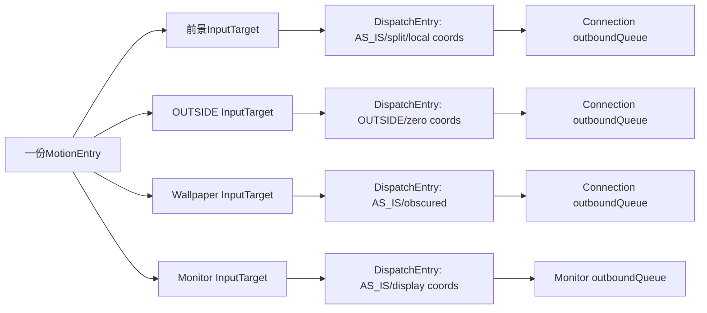
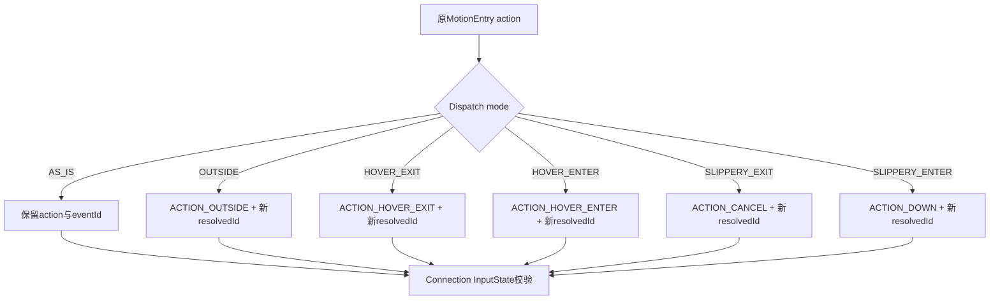
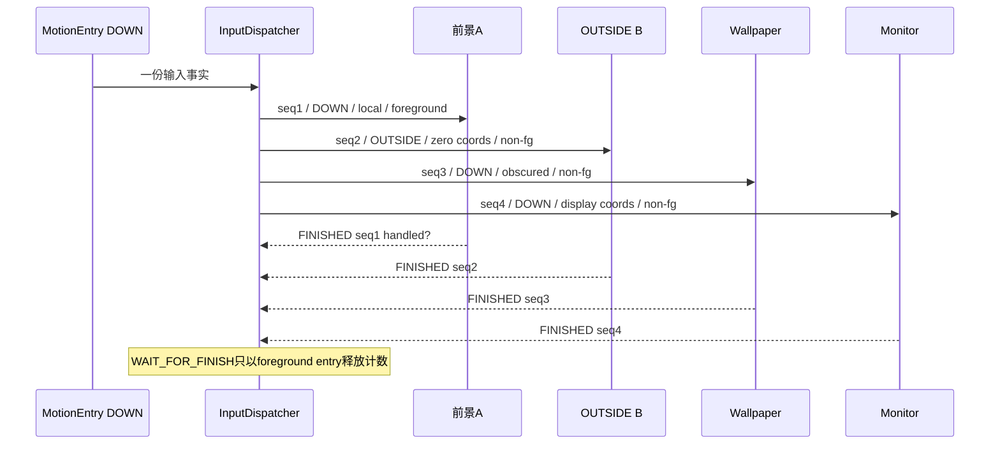

# 244 Android InputTarget、DispatchEntry与每目标事件改写链

> 源码版本：Android 11 / `android-11.0.0_r48`  
> 学习方式：macOS只读核源，不编译、不运行AOSP

## 1. 本章要解决什么

InputReader送来一份MotionEntry，最终却可能同时到达前景窗口、OUTSIDE观察窗、wallpaper和手势monitor，而且每个接收者看到的action、pointer集合、坐标、flags与eventId都可能不同。

本章解释中间的“展开器”：

```text
InputTarget与TouchedWindow是什么关系？
为什么一个Target可能生成多份DispatchEntry？
split在何时删pointer并改写POINTER_DOWN/UP？
OUTSIDE、HOVER、SLIPPERY怎样改action？
原始eventId、split id、resolvedEventId和channel seq是什么关系？
HMAC究竟按原始事件还是接收者最终视图签？
foreground为什么影响WAIT_FOR_FINISH，却不代表handled？
```

## 2. 一句总纲

```text
EventEntry描述一次输入事实
→ InputTarget描述每个接收者应看哪些pointer、采用何种坐标和投递模式
→ 必要时split生成接收者专属MotionEntry
→ 每个dispatch mode生成一笔DispatchEntry
→ DispatchEntry固化resolved action/flags/id、坐标与唯一channel seq
→ publish时按这份最终视图生成HMAC
→ FINISHED按seq释放该Connection的在途账
```

## 3. 总体对象图



## 4. 源码地图

```text
frameworks/native/services/inputflinger/dispatcher/InputTarget.h/.cpp
frameworks/native/services/inputflinger/dispatcher/Entry.h/.cpp
frameworks/native/services/inputflinger/dispatcher/TouchState.h/.cpp
frameworks/native/services/inputflinger/dispatcher/InputDispatcher.cpp
frameworks/native/services/inputflinger/dispatcher/InputState.cpp
frameworks/native/libs/input/InputTransport.cpp
frameworks/native/libs/input/Input.cpp
```

## 5. EventEntry是输入事实

MotionEntry包含设备、source、display、action、时间、全部pointer properties/coords及可选InjectionState。

它尚未表达“发给哪个窗口”。

## 6. InputTarget是接收者计划

InputTarget包含：

```text
目标InputChannel
foreground/安全/拆分/dispatch mode flags
pointer ID子集
每pointer offset与window scale
globalScaleFactor
```

它是一份路由计划，不是在途队列节点。

## 7. DispatchEntry是在途账

DispatchEntry绑定一条Connection，记录：

```text
引用的EventEntry
targetFlags
x/y offset与scale
resolvedEventId/action/flags
唯一seq
deliveryTime与timeoutTime
```

它会进入该Connection的outboundQueue，publish后进入waitQueue。

## 8. 三层对象不要混

```text
MotionEntry：发生了什么
InputTarget：这个接收者应该看到什么
DispatchEntry：这条Channel上正在投递哪一笔
```

一个MotionEntry可对应多个Target；一个Target也可能展开多个DispatchEntry。

## 9. target flag分三类

```text
角色：FOREGROUND、SPLIT、ZERO_COORDS
安全：WINDOW_IS_OBSCURED、PARTIALLY_OBSCURED
模式：AS_IS、OUTSIDE、HOVER_ENTER/EXIT、SLIPPERY_ENTER/EXIT
```

模式位决定action怎样改写。

## 10. FOREGROUND不是Z序形容词

它表示这笔投递属于真正负责处理事件的前景目标，参与注入完成记账。

OUTSIDE、wallpaper与monitor通常不是foreground，即使视觉层级很高。

## 11. SPLIT的含义

Target只接收`pointerIds`位图中的pointer。

若未设置SPLIT，空pointerIds表示使用原事件全部pointer，不是“零根手指”。

## 12. default PointerInfo

monitor或不可拆窗口使用空pointerIds，并把统一offset/scale存到`pointerInfos[0]`作为default。

这里的索引0是默认槽，不代表只发送pointerId 0。

## 13. per-pointer PointerInfo

split目标按pointerId索引保存：

```text
xOffset/yOffset
windowXScale/windowYScale
```

它不是按pointer数组index保存；pointerId与当前index必须区分。

## 14. addWindowTargetLocked

普通Window用：

```text
xOffset=-frameLeft
yOffset=-frameTop
windowScale=InputWindowInfo中的逆Layer scale
```

相同Connection再次加入时合并pointer集合，而不是重复创建Target。

## 15. monitor坐标

全局monitor通常使用Display坐标offset和scale=1。

gesture monitor可带portal/Display相关offset，但不自动变成目标Window局部坐标。

## 16. dispatchEventLocked逐Target处理

路由成功后遍历`inputTargets`，按connection token寻找注册Connection。

Connection已消失则只丢该目标投递，不让其他目标一起失败。

## 17. Connection状态门

`prepareDispatchCycleLocked()`发现Connection不是NORMAL，直接跳过，不再往broken/zombie通道堆新outbound entry。

## 18. split发生在模式展开前

若Target有SPLIT且pointer子集数量小于原事件pointerCount，先调用`splitMotionEvent()`。

得到接收者专属MotionEntry后，再展开OUTSIDE/AS_IS等mode。

## 19. 为什么数量相等时不复制

Target拥有原事件全部pointer时，不需要删数组或改action index，直接复用原EventEntry即可。

SPLIT flag仍可保留目标语义。

## 20. split按pointerId筛选

遍历原pointer数组，只复制Target位图包含的ID，并建立新的pointer数组顺序。

若期望ID在当前事件中缺失，认为输入序列破坏并丢弃这份split投递。

## 21. POINTER_DOWN/UP改写规则

动作pointer属于该Target时：

```text
子集仅1根：POINTER_DOWN→DOWN，POINTER_UP→UP
子集多根：保留POINTER动作，但action index改成子数组index
```

## 22. 无关pointer变化

若原POINTER_DOWN/UP操作的是另一个窗口的pointer，本Target看到的是MOVE。

因为对它而言自己的pointer集合没有增减。

## 23. split生成新eventId

新MotionEntry使用`mIdGenerator.nextId()`，不是沿用原id。

这表明“删pointer并改action后的事件视图”被视为新的逻辑事件。

## 24. InjectionState仍共享

split MotionEntry若来自注入，会引用同一InjectionState并增加refCount。

所以多份split视图仍属于同一次注入调用的结果/完成记账。

## 25. 多pointer坐标归一化

`createDispatchEntry()`若Target有per-pointer几何，会选Target位图中第一根pointer的offset/scale作为规范坐标系。

其他pointer先进入各自窗口局部、按scale比例换算，再回到第一根pointer的规范frame。

## 26. 为什么createDispatchEntry可能新建MotionEntry

不同pointer可能曾属于不同缩放/位置的窗口；单个MotionEvent只能携带一组最终x/y scale与offset。

因此先改写raw PointerCoords，让所有pointer在同一规范坐标系下可表达。

## 27. 归一化公式顺序

对每根pointer：

```text
复制原coords
加自己的offset，把自己的Window原点移到0
乘“自己的scale / 第一pointer scale”
减第一pointer offset，换回规范raw frame
```

最终DispatchEntry再携带第一pointer的offset/scale。

## 28. 归一化不会丢InjectionState

combined MotionEntry同样共享原InjectionState并增加引用。

临时combined entry交给DispatchEntry持有后释放创建者引用。

## 29. 模式展开的固定顺序

`enqueueDispatchEntriesLocked()`依次尝试：

```text
HOVER_EXIT
OUTSIDE
HOVER_ENTER
AS_IS
SLIPPERY_EXIT
SLIPPERY_ENTER
```

只有Target实际含该mode位时才创建DispatchEntry。

## 30. 为什么Target可有多个mode位

TouchState更新使用OR合并flags；同一轮状态转换可能要求一个Connection先结束旧协议状态、再进入新状态。

固定展开顺序保证接收者先收退出/外部通知，再收进入或原事件。

## 31. 每笔只保留一个mode

创建前把Target的整个DISPATCH_MASK清掉，再只OR当前mode。

因此DispatchEntry的targetFlags不会含多个互相冲突的action改写模式。

## 32. AS_IS

resolvedAction保持MotionEntry.action，resolvedEventId保持MotionEntry.id。

这是唯一不因mode改写而保留原逻辑id的普通路径。

## 33. OUTSIDE

resolvedAction改为`ACTION_OUTSIDE`。

它通常来自首个DOWN时带WATCH_OUTSIDE_TOUCH的上层/旁观窗口。

## 34. ZERO_COORDS

跨UID OUTSIDE为避免泄露全屏触摸轨迹，Target可带ZERO_COORDS。

publish前把所有PointerCoords clear；这与窗口offset不是同一机制。

## 35. HOVER_EXIT

当鼠标/触控笔hover目标改变，旧目标收到`ACTION_HOVER_EXIT`。

新目标则通过HOVER_ENTER模式收到`ACTION_HOVER_ENTER`。

## 36. 缺失HOVER_ENTER修复

若resolved action仍是HOVER_MOVE，但Connection InputState认为此前并未hover，Dispatcher自动改成HOVER_ENTER。

协议一致性比原action字面值优先。

## 37. SLIPPERY_EXIT

原始MOVE被改成`ACTION_CANCEL`发送旧窗口。

这表示原gesture所有权在窗口滑动边界上终止。

## 38. SLIPPERY_ENTER

同一原始MOVE对新窗口改成`ACTION_DOWN`。

新窗口必须从合法DOWN开始，不能凭空从MOVE进入手势。

## 39. action改写图



## 40. resolvedEventId默认哨兵

Motion分支先放一个InputReader不会生成的OTHER来源值。

mode改写后若仍是哨兵，就分配新id；AS_IS明确写回原motion id。

## 41. split id与resolved id是两层

```text
原Motion id
→ splitMotionEvent生成split id
→ 若再OUTSIDE/SLIPPERY改action，再生成resolved id
```

不能假设最终App eventId永远等于InputReader id。

## 42. channel seq又是另一编号

每个DispatchEntry构造时从原子计数器取非零`seq`。

seq用于这条Connection的FINISHED回执与waitQueue匹配，不表示逻辑事件身份。

## 43. 四类编号表

```text
原EventEntry id：输入事实身份
split MotionEntry id：pointer子集事件身份
resolvedEventId：接收者最终action视图身份
DispatchEntry seq：某Channel投递/回执身份
```

## 44. seq为何不能是0

0被协议保留；原子递增若回绕得到0，会继续取下一个值。

## 45. resolvedFlags

先复制MotionEntry.flags，再按目标安全视角加：

```text
WINDOW_IS_OBSCURED
WINDOW_IS_PARTIALLY_OBSCURED
```

同一MotionEntry给不同Target可得到不同resolvedFlags。

## 46. InputState校验

Action与flags确定后，Connection自己的InputState执行`trackMotion()`。

若这份接收者协议序列不一致，Dispatcher跳过该DispatchEntry，不向应用发破坏序列的事件。

## 47. trackMotion看的是resolved action

slippery新窗口用DOWN建立memento，旧窗口用CANCEL清理；若拿原MOVE跟踪就会错误。

所以action改写必须先于InputState记账。

## 48. pointer-down-outside-focus

resolved action若是pointer类DOWN，且目标token不是当前焦点，Dispatcher异步通知策略处理触摸导致的焦点变化。

SLIPPERY_ENTER改出的DOWN也可能进入这项判断。

## 49. foreground完成计数

DispatchEntry带FOREGROUND时，若EventEntry有InjectionState：

```text
pendingForegroundDispatches += 1
```

释放该entry时再减1，归零唤醒WAIT_FOR_FINISH。

## 50. monitor为何不拖住注入完成

monitor通常不带FOREGROUND。

WAIT_FOR_FINISH只等负责事件的前景目标，不因统计/观察者迟迟不回执而无限扩大语义。

## 51. foreground不等于handled

计数等待的是DispatchEntry生命周期完成，包括handled=false、broken清队列等释放路径。

它不要求应用返回“我处理了”。

## 52. OUTSIDE通常非foreground

旁观窗口收到ACTION_OUTSIDE只是通知，不负责本次触摸结果。

因此其完成一般不进入注入foreground计数。

## 53. wallpaper目标

wallpaper可收到与前景窗口同源的AS_IS事件，但被加遮挡flags且通常不带FOREGROUND。

它不改变真正前景目标的注入完成责任。

## 54. outboundQueue入队

创建并校验成功后，DispatchEntry进入Connection outboundQueue。

如果队列此前为空，立即调用startDispatchCycle尝试publish。

## 55. delivery/timeout何时赋值

构造时deliveryTime为0；只有真正从outbound队首publish时，才写deliveryTime与`timeoutTime=now+窗口timeout`。

因此排队时间与已交付等待ANR时间必须区分。

## 56. publish使用最终视图

传输参数来自：

```text
resolvedEventId/action/flags
DispatchEntry scale/offset
目标专属或split后的pointer数组
```

客户端看不到“先有原MOVE后被改成DOWN”的内部过程。

## 57. HMAC按什么签

Key/Motion签名使用DispatchEntry resolved action与resolved flags。

Motion只有最终DOWN/UP签名；纯MOVE、OUTSIDE、CANCEL等通常返回无效签名数组。

## 58. 为什么必须按resolved字段签

若同一原MOVE对新窗口改成DOWN，却仍按原MOVE签，验证结果与App实际收到内容不一致。

目标视图是安全验证的正确边界。

## 59. 一个事件多目标示例

首个DOWN可能展开：

```text
目标A：DOWN，foreground，窗口局部坐标
观察窗B：OUTSIDE，非foreground，跨UID时零坐标
wallpaper W：DOWN，非foreground，obscured+partial
gesture monitor G：DOWN，非foreground，Display坐标
```

四者共享来源事实，但不是四份完全相同的MotionEvent。

## 60. 多目标展开图



## 61. FINISHED按seq而非eventId

App侧回执携带InputTransport seq；Dispatcher从该Connection waitQueue找到对应DispatchEntry。

多个目标即使resolvedEventId相同，也有不同Connection/seq账。

## 62. handled的使用边界

Motion handled主要完成回执；Key handled=false还可能触发policy fallback。

不能把Key fallback结论套到MotionEvent。

## 63. 释放路径都要结foreground账

正常FINISHED、broken channel清队列、abort等最终都通过`releaseDispatchEntry()`。

它在delete前统一递减pendingForegroundDispatches，避免注入等待永久泄漏。

## 64. EventEntry引用计数

每个DispatchEntry构造时给EventEntry refCount加1，析构时release。

多目标展开不必复制所有原始数据，也能保证任何在途笔存在时底层事件不被回收。

## 65. 临时split/combined生命周期

临时MotionEntry创建后交给DispatchEntry增加引用，调用者随即release自己的引用。

最终由持有它的DispatchEntry逐笔释放。

## 66. 常见错误一：一个事件只对应一个seq

错误。

seq属于DispatchEntry；多Target、多mode会产生多笔seq。

## 67. 常见错误二：SPLIT只是删坐标

错误。

它还重建properties、action index、DOWN/UP语义，并生成新eventId。

## 68. 常见错误三：foreground就是最上层窗口

错误。

它是完成责任标志；Z序命中在更早阶段完成。

## 69. 常见错误四：resolvedAction只是客户端临时改写

错误。

Dispatcher在入outboundQueue前固化resolved action，并让InputState、HMAC与publish都使用它。

## 70. 常见错误五：monitor收到完全原样事件

通常monitor看Display坐标和AS_IS，但仍经过独立InputTarget、DispatchEntry、seq、队列与回执。

portal offset、取消合成或ZERO_COORDS等场景还可能改变其视图。

## 71. 常见错误六：WAIT_FOR_FINISH等所有Channel

错误。

它按InjectionState的foreground DispatchEntry计数；非foreground观察者不在这个完成条件中。

## 72. macOS只读练习一：画对象映射

```bash
cd /Users/ninebot/androidSource
sed -n '25,140p' \
  frameworks/native/services/inputflinger/dispatcher/InputTarget.h
sed -n '180,225p' \
  frameworks/native/services/inputflinger/dispatcher/Entry.h
```

分别写出EventEntry、InputTarget、DispatchEntry、Connection的1:N关系和生命周期所有者。

## 73. macOS只读练习二：手算split action

```bash
cd /Users/ninebot/androidSource
sed -n '2925,3035p' \
  frameworks/native/services/inputflinger/dispatcher/InputDispatcher.cpp
```

用pointer ID 2/7分别属于A/B，推演两次POINTER_DOWN和两次POINTER_UP在A、B子流中的action与action index。

## 74. macOS只读练习三：追mode展开

```bash
cd /Users/ninebot/androidSource
sed -n '2260,2428p' \
  frameworks/native/services/inputflinger/dispatcher/InputDispatcher.cpp
```

列出六种mode的展开顺序、resolved action、是否保留原id、InputState看到什么。

## 75. macOS只读练习四：追foreground完成

```bash
cd /Users/ninebot/androidSource
rg -n "incrementPendingForegroundDispatches|decrementPendingForegroundDispatches|releaseDispatchEntry" \
  frameworks/native/services/inputflinger/dispatcher/InputDispatcher.cpp
```

证明正常FINISHED和broken清队列最终都会释放foreground计数，并解释handled=false为何仍可完成WAIT_FOR_FINISH。

## 76. 复读后最容易不理解的地方

```text
InputTarget是计划，DispatchEntry才是在途笔
空pointerIds可表示“全部pointer使用默认几何”
split与mode改写是两层独立事件派生
resolvedEventId不同于channel seq
InputState跟踪resolved action
HMAC按接收者最终DOWN/UP视图签
foreground控制注入完成计数，不要求handled=true
```

## 77. 复读修订一：一个Target可展开多笔

准确说法不是“一Target必有一DispatchEntry”。

Target flags可能含多个dispatch mode；enqueue函数按固定顺序为每个命中mode分别建entry。

## 78. 复读修订二：per-pointer归一化不等于split

split决定哪些pointer留下及action怎样变；createDispatchEntry的归一化解决留下的pointer拥有不同offset/scale时，如何用一组MotionEvent参数表达。

两步可能连续发生，但目的不同。

## 79. 复读修订三：新ID有两个来源

删pointer形成split MotionEntry会生成新id；即使不split，只要dispatch mode改写action，也会生成新resolvedEventId。

最终channel seq还会再独立生成，三者不能合并理解。

## 80. 复读修订四：非foreground也必须回FINISHED

它们不参与注入WAIT_FOR_FINISH，并不代表无需回执。

每条Connection仍依赖FINISHED清waitQueue、维持背压和响应性；只是注入调用的同步完成范围更窄。

## 81. Android 11 r48版本边界

```text
InputTarget支持六种dispatch mode固定顺序展开
split缺失预期pointer ID时丢该目标事件
split MotionEntry与mode改写分别可生成新id
per-pointer几何归一到第一marked pointer
TouchState对同窗口target flags与pointerIds做OR
resolved安全flags按目标附加
foreground DispatchEntry控制InjectionState完成计数
channel seq为非零原子递增值
```

## 82. 本章检查清单

```text
[ ] 能区分EventEntry、InputTarget、DispatchEntry和Connection
[ ] 能解释空pointerIds的default语义
[ ] 能手算split action/index
[ ] 能解释per-pointer坐标归一化
[ ] 能列出六种dispatch mode与顺序
[ ] 能区分原id、split id、resolved id和seq
[ ] 能解释resolved flags为何per-target
[ ] 能说明InputState为何跟踪resolved action
[ ] 能解释HMAC按最终目标视图签名
[ ] 能说明foreground完成计数与handled无关
```

## 83. 本章小结

```text
输入事实只创建一次EventEntry
→ 路由阶段为每个接收者构造InputTarget
→ pointer子集不同时先split
→ 坐标系不同时归一raw coords
→ 每个dispatch mode创建一笔DispatchEntry
→ 固化接收者最终action/flags/id和独立seq
→ InputState校验后进入各Connection队列
→ publish、HMAC、ANR与FINISHED全围绕DispatchEntry工作
→ 只有foreground笔计入注入同步完成
```

Android输入分发并不是“复制同一个事件给很多人”，而是从同一事实派生多份受接收者协议、坐标、安全与完成责任约束的事件视图。

## 84. 下一章预告

下一章深入InputDispatcher的Connection outboundQueue、waitQueue、socket背压与FINISHED乱序处理，把第244章每一笔DispatchEntry从入队、publish、ANR计时到释放的完整生命周期再走一遍。
