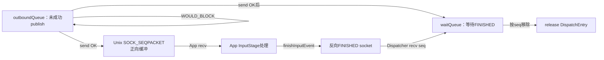
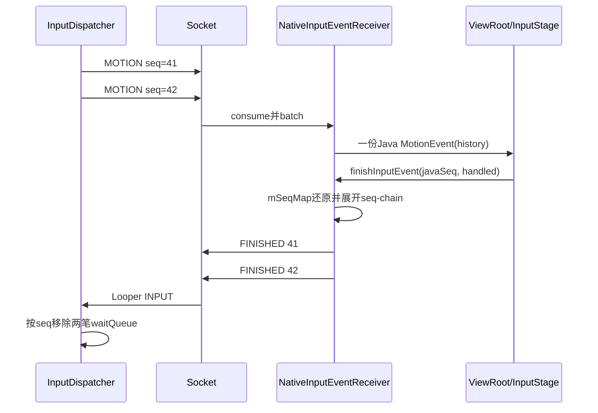
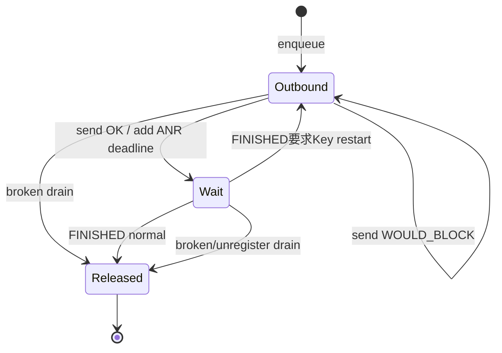

# 245 Android Connection队列、Socket背压与FINISHED释放链

> 源码版本：Android 11 / `android-11.0.0_r48`  
> 学习方式：macOS只读核源，不编译、不运行AOSP

## 1. 本章要解决什么

第244章把一份输入事实展开成每条Connection的一笔DispatchEntry。本章跟随其中一笔走完生命周期：

```text
outboundQueue与waitQueue分别表示什么？
DispatchEntry何时才算真正publish？
socket缓冲满时为什么不立即判ANR？
ANR计时从哪里开始？
App调用finishInputEvent后，FINISHED一定已经到Dispatcher了吗？
批处理一份Java MotionEvent怎样确认多个native seq？
FINISHED可以乱序吗，未知seq怎样处理？
broken、zombie、responsive恢复和注入完成怎样统一释放？
```

## 2. 一句总纲

```text
DispatchEntry先进入Connection.outboundQueue
→ 非阻塞send成功后才移到waitQueue并加入ANR索引
→ App从socket消费、完成View/IME/InputStage处理
→ Java sequence经mSeqMap还原为transport seq
→ FINISHED反向写socket，写满则客户端finishQueue等待可写
→ Dispatcher按seq从waitQueue移除、撤ANR索引并释放entry
→ 若有Key fallback则同一entry可能回到outbound队首重发
```

## 3. 三层缓冲图



## 4. 源码地图

```text
frameworks/native/services/inputflinger/dispatcher/Connection.h/.cpp
frameworks/native/services/inputflinger/dispatcher/Entry.h/.cpp
frameworks/native/services/inputflinger/dispatcher/InputDispatcher.cpp
frameworks/native/libs/input/InputTransport.cpp
frameworks/native/include/input/InputTransport.h
frameworks/base/core/jni/android_view_InputEventReceiver.cpp
frameworks/base/core/java/android/view/InputEventReceiver.java
frameworks/base/core/java/android/view/ViewRootImpl.java
```

## 5. Connection是什么

每个注册到InputDispatcher的InputChannel server端对应一个Connection。

它包含通道、InputPublisher、InputState、状态、响应性和两条DispatchEntry队列。

## 6. 三种Connection状态

```text
NORMAL：可继续投递
BROKEN：通道不可恢复损坏
ZOMBIE：通道已注销，但对象可能仍被暂时引用
```

新事件只向NORMAL Connection投递。

## 7. responsive与status不同

`responsive=false`表示已有waitQueue事件超时，暂时不应给它建立新的触摸目标。

Connection仍可能是NORMAL；迟到FINISHED后还可能恢复responsive。

## 8. outboundQueue的定义

源码注释：需要publish到Connection的事件队列。

它们尚未成功写入InputChannel，因此客户端还没有处理确认责任。

## 9. waitQueue的定义

源码注释：已publish但尚未收到App `finished`响应的事件。

只有waitQueue entry进入正式的输入处理等待/ANR账。

## 10. socket是第三层缓冲

send成功只表示InputMessage进入Unix socket内核缓冲，不表示Java回调已执行。

```text
outbound→wait：publish完成
socket→App：客户端消费开始
FINISHED回来：处理确认
```

## 11. 为什么用SOCK_SEQPACKET

InputChannel pair通过：

```cpp
socketpair(AF_UNIX, SOCK_SEQPACKET, 0, sockets)
```

创建。它保留消息边界，适合一包一个InputMessage。

## 12. 双向同一socket pair

server→client发送KEY/MOTION/FOCUS；client→server发送FINISHED。

两种方向各有内核缓冲和背压，不是单向Java队列。

## 13. socket buffer size

框架给两端设置SO_SNDBUF与SO_RCVBUF。

它是内核缓冲目标值，不能推导成固定可容纳N个事件；InputMessage大小与内核调整都会影响容量。

## 14. send是非阻塞的

`InputChannel::sendMessage()`使用：

```cpp
send(fd, cleanMsg, length, MSG_DONTWAIT | MSG_NOSIGNAL)
```

Dispatcher线程不会因慢App阻塞在send系统调用里。

## 15. sanitized copy

发送前复制成cleanMsg，仅保留当前消息类型的有效字段。

这避免把union未使用空间或栈残留字节泄露给对端。

## 16. EINTR重试

send/recv遇到EINTR会重新调用。

EINTR表示被信号打断，不等于socket满或peer死亡。

## 17. WOULD_BLOCK

EAGAIN/EWOULDBLOCK映射为`WOULD_BLOCK`。

它表示当前发送缓冲没空间，是可重试背压，不是必然的通道损坏。

## 18. DEAD_OBJECT

EPIPE、ENOTCONN、ECONNREFUSED、ECONNRESET等映射为DEAD_OBJECT。

这意味着对端关闭或连接不可用，不能只等稍后可写恢复。

## 19. 不接受半包

若send返回长度不等于完整InputMessage，框架视为DEAD_OBJECT。

不会让对端接收半个MotionMessage再拼接。

## 20. startDispatchCycle循环

只要Connection NORMAL且outbound非空，就反复尝试发送队首。

一次调用可连续把多笔写入socket并移到waitQueue，直到outbound空或出现错误/WOULD_BLOCK。

## 21. 尝试发送前写时间

每次处理队首会设置：

```text
deliveryTime = currentTime
timeoutTime = currentTime + window dispatch timeout
```

但只有send成功后，timeoutTime才插入ANR tracker。

## 22. WOULD_BLOCK时的时间边界

失败entry仍在outbound，未加入ANR tracker；下次重试会覆盖deliveryTime/timeoutTime。

所以有效ANR等待从成功publish那次尝试开始，不从第一次满socket开始。

## 23. publish成功后的迁移

send OK后：

```text
从outboundQueue删除DispatchEntry
push_back到waitQueue
若Connection responsive，把timeoutTime插入mAnrTracker
```

同一entry不会同时合法属于两队列。

## 24. waitQueue为何是deque

应用一般按InputChannel顺序消费，最早publish的entry最适合描述ANR现场。

但FINISHED查找按seq扫描，不要求只能确认队首。

## 25. socket满且wait非空

这是预期背压：已有已publish事件尚未完成，App没有及时消费/确认。

Dispatcher保留outbound队首并return，等回执后再启动发送。

## 26. socket满但wait为空

源码认为异常：没有已发未完成事件时，正向pipe通常不该满。

它会记录错误并abort broken dispatch cycle，而不是等待不存在的FINISHED。

## 27. 不能用outbound长度判ANR

outbound事件尚未成功publish，客户端可能完全不知道它们存在。

ANR索引只针对成功publish的waitQueue entry。

## 28. 每笔timeout可不同

Dispatcher按window token取得dispatch timeout，找不到时使用默认值。

策略变化后，同一Connection的新entry可能拥有不同deadline。

## 29. ANR tracker

它按timeoutTime和connection token维护最早超时索引，避免每轮扫描所有waitQueue。

entry完成或Connection删除时必须撤销对应项。

## 30. 变为unresponsive

某wait entry越过deadline后Connection标为不响应，停止为其继续安排ANR唤醒，并避免给它新的触摸gesture目标。

这不等于通道已经BROKEN。

## 31. ANR日志为何看oldest

真正触发最早deadline的可能是较新entry，例如timeout策略变化。

但App大多线性处理，使用waitQueue最老entry描述“卡在哪里”通常更有诊断价值。

## 32. 慢日志与ANR

FINISHED回来后，若`finishTime-deliveryTime`超过2秒，会记录slow processing。

它可能很慢但仍在窗口ANR deadline前完成。

## 33. App接收端

NativeInputEventReceiver监听client fd的`ALOOPER_EVENT_INPUT`，调用InputConsumer.consume，再创建Java InputEvent并触发dispatchInputEvent。

通常运行在ViewRoot绑定的UI Looper。

## 34. Java sequence不是transport seq

Java InputEvent有自己的sequence number。

Native receiver使用`mSeqMap`保存Java sequence→InputMessage seq映射，finish时还原。

## 35. 为什么需要mSeqMap

Java对象可能经过兼容转换、复制或包装；业务层不直接承担native channel seq身份。

映射把Java对象生命周期与InputTransport协议账连接起来。

## 36. InputEventReceiver契约

`onInputEvent()`完成后必须调用：

```java
finishInputEvent(event, handled)
```

不finish会让在途事件积累并最终触发背压/ANR。

## 37. ViewRoot何时finish

QueuedInputEvent走完InputStage、标出FINISHED/HANDLED后调用receiver.finishInputEvent。

异步IME stage会延迟它，直到回调、超时或post-IME处理完成。

## 38. handled的语义

View/IME/InputStage是否消费事件折叠成boolean handled。

handled=false仍必须FINISHED；否则Dispatcher无法释放waitQueue。

## 39. compatibility处理

事件若被兼容层修改，ViewRoot在finish前允许InputCompatProcessor反向转换processedEvent。

最终仍需找到原receiver与transport seq。

## 40. 不在progress中的event

Java finish发现mSeqMap没有该InputEvent sequence，只记录not in progress警告，不发送未知FINISHED。

重复finish不会正常确认两次。

## 41. receiver已dispose

`mReceiverPtr==0`时finish只记录警告。

通道清理由对端关闭/broken路径处理，不能假设这次Java调用仍能成功回执。

## 42. 客户端FINISHED也非阻塞

InputConsumer构造FINISHED消息写回同一InputChannel。

反向send同样可能返回WOULD_BLOCK。

## 43. finishQueue

NativeInputEventReceiver遇到回执写满，把`seq+handled`放进`mFinishQueue`，并让Looper监听`INPUT | OUTPUT`。

## 44. Java finish不等于server收到

反向socket满时，native把回执排队后向Java返回OK。

真正到达Dispatcher要等fd可写且finishQueue重试成功。

## 45. OUTPUT重试

fd可写时从finishQueue前到后发送；再次WOULD_BLOCK则保留未发部分并继续监听OUTPUT。

全部成功后清队列并恢复只监听INPUT。

## 46. 双向背压

正向socket满代表Dispatcher发不动事件；反向满代表client发不动FINISHED。

两者有独立排队点和重试机制。

## 47. batch seq chain

InputConsumer可把多笔连续MOVE合成一份带history的Java MotionEvent。

内部mSeqChains保存“最终交给Java的seq代表哪些原始InputMessage seq”。

## 48. 一次finish确认多笔

Java完成合批事件时，InputConsumer先沿chain发送前面seq的FINISHED，再发送最后seq。

Dispatcher因此逐笔移除多个waitQueue entry。

## 49. batch handled共享

一份Java合批事件的handled结果用于chain内每个FINISHED。

框架无法知道App是否想对某个history sample单独返回不同结果。

## 50. chain发送失败恢复

若中途某个FINISHED发送失败，InputConsumer重建尚未完成的seq chain，避免后续重试遗漏。

## 51. 回执链图



## 52. Dispatcher接收FINISHED

server fd注册`ALOOPER_EVENT_INPUT`。

回调循环receiveFinishedSignal，直到recv返回WOULD_BLOCK，一次唤醒可排空多份确认。

## 53. FINISHED内容

只携带：

```text
seq
handled(0/1)
```

Connection+seq足以定位DispatchEntry，无需回传eventId、action或window token。

## 54. 意外消息类型

server端期待FINISHED；收到其他InputMessage type返回UNKNOWN_ERROR并进入错误/断链处理。

协议两端角色不能互换。

## 55. broken/zombie忽略迟到finish

finishDispatchCycle发现Connection BROKEN或ZOMBIE就return。

其队列已由清理路径负责，不能再用迟到seq操作旧账。

## 56. 为什么post CommandEntry

收到FINISHED后先post `doDispatchCycleFinishedLockedInterruptible`。

Key fallback等策略调用可能释放Dispatcher锁，Command机制保护锁边界。

## 57. 按seq查找

`findWaitQueueEntry(seq)`线性扫描waitQueue。

找到哪笔就处理哪笔，不强制seq等于队首，所以可安全处理乱序FINISHED。

## 58. 未知seq

找不到就return。

它可能已完成、重复、迟到或队列已清；不会误删另一笔entry。

## 59. handled后的类型处理

先统计处理时长，再按事件类型调用afterKeyEvent或afterMotionEvent。

Key handled=false可能请求fallback restart；Motion通常不重启。

## 60. 为什么二次查seq

after*可能解锁调用policy；期间Connection队列可能被注销/清空。

重新加锁后必须再次find，不能沿用可能悬空的iterator。

## 61. 正常移除步骤

二次查找仍存在时：

```text
从waitQueue erase
从mAnrTracker erase(timeoutTime, token)
若此前unresponsive，重新评估剩余entry
```

随后release或restart。

## 62. Key fallback restart

若afterKey要求restart且Connection仍NORMAL，把同一DispatchEntry push_front回outboundQueue。

它随后重新publish并刷新delivery/timeout。

## 63. restart与seq

重用同一DispatchEntry意味着channel seq不变。

不要假设所有重新发送都必须分配新seq。

## 64. 普通释放

不restart时调用releaseDispatchEntry：

```text
若foreground，递减InjectionState pending count
delete DispatchEntry
析构释放EventEntry引用
```

## 65. WAIT_FOR_FINISH完成点

它不要求业务handled=true，而要求所有foreground DispatchEntry最终release、pending归零。

handled=false或broken清理也能结账。

## 66. responsive恢复

移除已完成entry后，若Connection此前不响应，则扫描剩余waitQueue。

只要没有entry的timeoutTime早于当前时间，就恢复responsive；不要求队列完全空。

## 67. FINISHED后再启动发送

处理末尾调用`startDispatchCycleLocked(now, connection)`。

此前因socket满留在outbound的队首获得重试机会。

## 68. 为什么通常已有正向空间

App发送FINISHED前已从client socket消费对应正向InputMessage，释放正向缓冲。

但两方向异步，不能把它当作严格一收一发锁步协议。

## 69. abort broken

不可恢复错误会drain outbound与wait，逐笔release，再把NORMAL改BROKEN并通知policy。

清理会闭合ANR、引用和foreground注入账。

## 70. ZOMBIE状态

显式unregister后Connection进入ZOMBIE并从活动映射移除。

已有异步Command仍可安全看到状态并忽略迟到回执。

## 71. monitor断链差异

monitor常随远端关闭自动注销，Dispatcher减少普通Window式的异常警告。

Window handle仍存在而client关闭通道时更值得通知WMS。

## 72. 队列状态机



## 73. 常见错误一：outbound就是App没处理

错误。outbound尚未publish，App可能不知道它存在。

## 74. 常见错误二：wait表示socket还没读

错误。消息可能在socket、JNI、IME、View业务中，甚至已经处理完但FINISHED反向排队。

## 75. 常见错误三：send OK等于onTouchEvent执行

错误。send OK只到内核缓冲。

## 76. 常见错误四：Java finish立刻结束ANR

错误。回执可能在client finishQueue；Dispatcher收到seq后才撤wait/ANR账。

## 77. 常见错误五：FINISHED只能确认队首

错误。Dispatcher按seq寻找任意wait entry。

## 78. 常见错误六：handled=false不用回执

错误。处理结果与协议完成是两维，false也必须FINISHED。

## 79. 常见错误七：合批只确认最后一笔

错误。Java finish一次，InputConsumer用seq chain补发每个原始transport seq的FINISHED。

## 80. macOS只读练习一：画三层队列

```bash
cd /Users/ninebot/androidSource
sed -n '40,70p' frameworks/native/services/inputflinger/dispatcher/Connection.h
sed -n '2456,2615p' frameworks/native/services/inputflinger/dispatcher/InputDispatcher.cpp
```

为outbound、socket、wait写出进入、退出条件及是否已有ANR deadline。

## 81. macOS只读练习二：推演双向背压

```bash
cd /Users/ninebot/androidSource
sed -n '270,365p' frameworks/native/libs/input/InputTransport.cpp
sed -n '120,220p' frameworks/base/core/jni/android_view_InputEventReceiver.cpp
```

说明正向和反向WOULD_BLOCK分别留在哪个队列、由什么事件重试。

## 82. macOS只读练习三：追合批回执

```bash
cd /Users/ninebot/androidSource
sed -n '1068,1130p' frameworks/native/libs/input/InputTransport.cpp
```

假设seq 10、11、12合成一份Java事件，推演finish 12的发送顺序及中途WOULD_BLOCK后的chain恢复。

## 83. macOS只读练习四：追乱序与恢复

```bash
cd /Users/ninebot/androidSource
sed -n '4728,4810p' frameworks/native/services/inputflinger/dispatcher/InputDispatcher.cpp
```

给waitQueue `[seq1超时, seq2未超时]`，先收到seq2再seq1，判断队列、ANR tracker与responsive。

## 84. 复读后最容易不理解的地方

```text
outbound、内核socket、wait是三层独立状态
有效ANR deadline只在publish成功后登记
Java finish与server收到FINISHED之间可能有反向finishQueue
一份Java batch要确认多个transport seq
FINISHED按Connection+seq定位，不按eventId
handled=false仍是合法完成
fallback可把同一DispatchEntry送回outbound
```

## 85. 复读修订一：deliveryTime赋值早于send

源码确实在send前写deliveryTime/timeoutTime；但WOULD_BLOCK时entry仍在outbound且未进ANR tracker，下次还会覆盖时间。

系统实际ANR记账边界仍是send成功并移到wait。

## 86. 复读修订二：socket满不必然ANR

wait非空时它只是背压；是否ANR由已publish entry自己的deadline决定。

只有满且wait为空被r48视为异常并abort。

## 87. 复读修订三：允许乱序不等于鼓励乱序

按seq查找让协议安全处理非队首确认；ViewRoot/InputConsumer正常路径仍尽量维持事件顺序。

## 88. 复读修订四：恢复不要求队列清空

Connection可在wait仍有未超时entry时恢复responsive。

判断条件是剩余entry都未越过当前deadline。

## 89. Android 11 r48版本边界

```text
InputChannel使用AF_UNIX SOCK_SEQPACKET pair
send/recv以MSG_DONTWAIT非阻塞执行
正向成功后outbound→wait并登记ANR tracker
client回执背压由finishQueue+OUTPUT重试
Motion batch通过SeqChain展开多个FINISHED
Dispatcher按seq线性查waitQueue，允许非队首完成
after*解锁后会二次查seq防悬空iterator
Key fallback可把同一DispatchEntry push_front重启
```

## 90. 本章检查清单

```text
[ ] 能区分outbound、socket与waitQueue
[ ] 能解释WOULD_BLOCK与DEAD_OBJECT
[ ] 能说明ANR deadline有效起点
[ ] 能解释wait为空但socket满为何异常
[ ] 能追Java sequence到transport seq
[ ] 能解释client finishQueue
[ ] 能说明batch seq chain
[ ] 能解释未知/乱序FINISHED
[ ] 能说明responsive恢复条件
[ ] 能闭合foreground注入完成计数
```

## 91. 本章小结

```text
每Connection独立排队、背压、ANR与回执
outbound代表尚未publish
send成功才进入wait并开始有效处理超时
App消费后仍要经过InputStage和异步组件
finish调用可能先进入反向回执队列
Dispatcher收到seq后才撤wait/ANR账
release同时释放引用和foreground注入计数
```

每个边界回答不同问题：有没有写进内核、App是否确认、是否该判慢、注入调用能否返回。

## 92. 下一章预告

下一章深入InputReader到InputDispatcher的NotifyArgs、policyFlags与入站队列：从Reader线程锁外flush，到Dispatcher线程唤醒、拦截、dropReason、pendingEvent和dispatchInProgress，建立进入Connection分发前的完整前半程。
