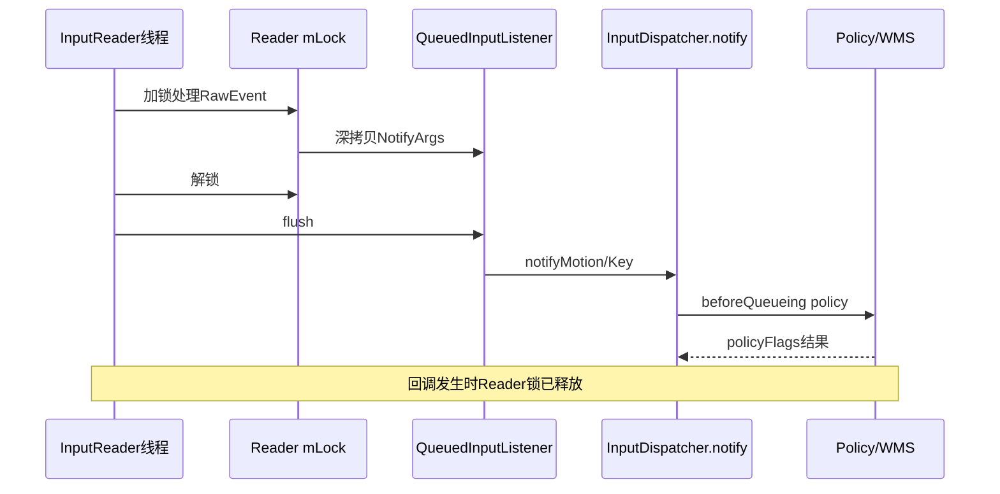
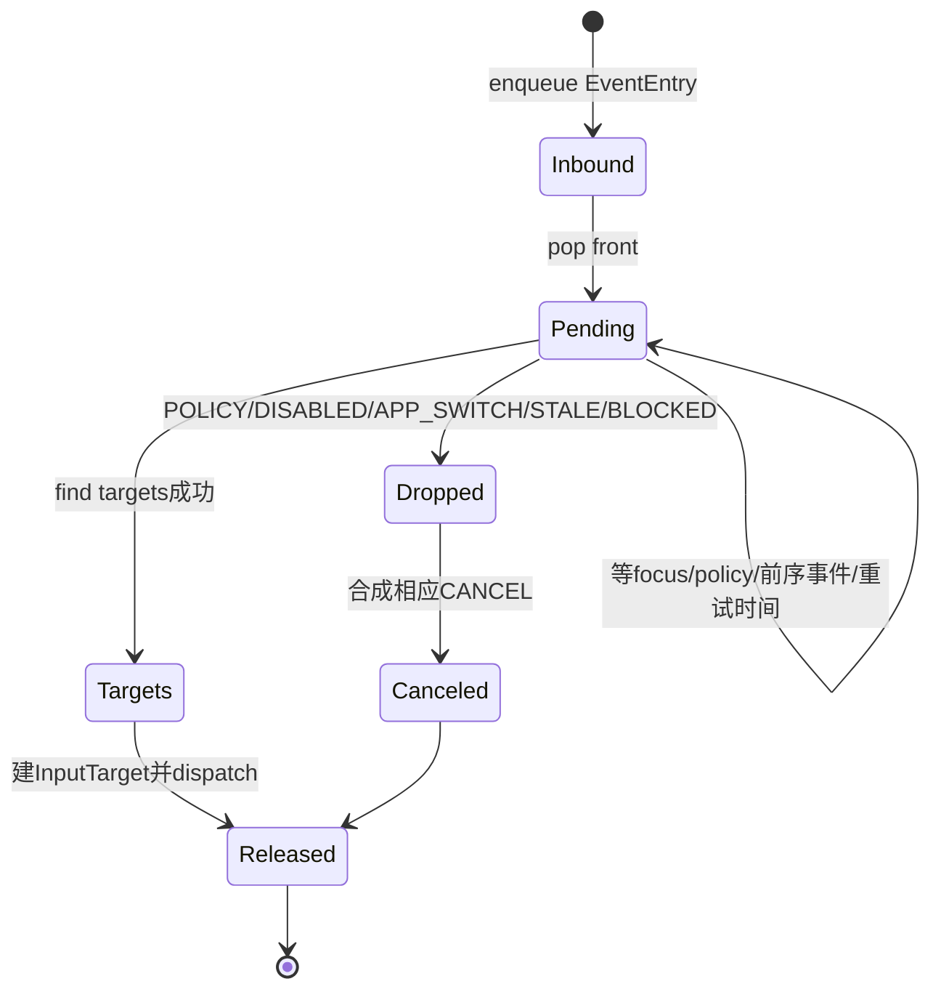

# 246 Android NotifyArgs、入站队列与dispatchOnce调度链

> 源码版本：Android 11 / `android-11.0.0_r48`  
> 学习方式：macOS只读核源，不编译、不运行AOSP

## 1. 本章要解决什么

第245章从DispatchEntry进入Connection开始分析。本章补齐它之前的前半程：

```text
InputMapper为什么先生成NotifyArgs而不是直接调用Dispatcher队列？
QueuedInputListener为何延迟到InputReader解锁后flush？
beforeQueueing policy真的在“队列之前”吗？运行在哪个线程？
NotifyArgs、MotionEntry和DispatchEntry的复制边界是什么？
什么时候需要wake InputDispatcher Looper？
mPendingEvent为何可以跨多轮dispatchOnce保留？
POLICY、DISABLED、APP_SWITCH、STALE、BLOCKED怎样决定丢弃？
丢事件为什么还要合成CANCEL？
```

## 2. 一句总纲

```text
Mapper在InputReader锁内生成NotifyArgs
→ QueuedInputListener深拷贝并保持生成顺序
→ Reader loop解锁后flush到Classifier/Dispatcher
→ Dispatcher在Reader线程做validate、beforeQueueing policy和可选InputFilter
→ 加锁复制成EventEntry进入mInboundQueue，必要时wake Dispatcher Looper
→ Dispatcher线程把队首提升为mPendingEvent
→ 可跨多轮等待policy/focus/ANR条件
→ 成功时生成InputTargets，失败时按dropReason取消已有协议状态
```

## 3. 全链路图


## 4. 源码地图

```text
frameworks/native/services/inputflinger/reader/InputReader.cpp
frameworks/native/services/inputflinger/InputListener.h/.cpp
frameworks/native/services/inputflinger/InputClassifier.cpp
frameworks/native/services/inputflinger/dispatcher/InputDispatcher.cpp
frameworks/native/services/inputflinger/dispatcher/Entry.h/.cpp
frameworks/native/services/inputflinger/reader/mapper/*InputMapper.cpp
```

## 5. Mapper输出不是MotionEvent

TouchInputMapper、KeyboardInputMapper、CursorInputMapper等产生的是`NotifyMotionArgs`或`NotifyKeyArgs`。

它们是native输入监听接口的数据对象，不是发给App的Java MotionEvent。

## 6. NotifyArgs公共身份

各种NotifyArgs都带唯一id与eventTime，并通过虚函数`notify(listener)`调用对应listener方法。

这让QueuedInputListener能在一个基类指针队列中保存不同事件类型。

## 7. NotifyKeyArgs字段

包括：

```text
device/source/display
policyFlags
action/flags/keyCode/scanCode/metaState
downTime
```

InputDispatcher之后会自己维护repeatCount。

## 8. NotifyMotionArgs字段

包括action、button、flags、classification、edge/meta/button状态、precision、cursor、downTime和全部pointer数组。

这是Mapper烹制后的Display坐标事实。

## 9. policyFlags与event flags不同

```text
policyFlags：系统内部路由/信任/唤醒/过滤等控制位
Key/Motion flags：最终事件语义位，如CANCELED、OBSCURED等
```

两者不能混成同一bitmask解释。

## 10. 为什么需要QueuedInputListener

InputReader处理RawEvent时持有`mLock`，Mapper可能连续生成多份NotifyArgs。

若直接回调Dispatcher/Policy，调用链可能反向查询Reader或形成跨线程锁环。

## 11. Queued listener做深拷贝

每个notify方法都执行类似：

```cpp
mArgsQueue.push_back(new NotifyMotionArgs(*args));
```

Mapper栈上的临时Args离开作用域后，队列副本仍有效。

## 12. 顺序保持

Args按生成顺序push_back，flush按index从0到末尾依次notify inner listener。

例如鼠标一次SYN_REPORT生成release、motion、press、hover、scroll时，顺序不会被类型分组打乱。

## 13. Reader loop锁区

`loopOnce()`在Reader锁内：

```text
处理EventHub批次
运行mapper与timeout
更新generation/设备列表快照
```

NotifyArgs只先积累，不立即跨组件执行。

## 14. flush在锁外

源码注释明确：listener实际是InputDispatcher，而Dispatcher会调用WMS，WMS有时又查询InputReader。

锁内flush可能形成Reader→Dispatcher→WMS→Reader死锁。

## 15. 锁外flush图



## 16. flush完成后删除Args

每个Args notify后delete，最后clear队列。

Dispatcher若要异步保存，必须再复制成自己的EventEntry，不能保留传入指针。

## 17. InputClassifier的位置

Motion可先经过InputClassifier，填入classification或异步结合video frame信息。

Key通常透明转发；最终inner listener仍是InputDispatcher。

## 18. notify运行在哪个线程

硬件Reader主链中，QueuedInputListener.flush直接调用Dispatcher.notify，因此beforeQueueing逻辑运行在InputReader线程，而不是Dispatcher dispatch thread。

## 19. notify先validate

Key校验action；Motion校验action、actionButton、pointerCount与pointer properties。

非法Args直接返回，不进入inboundQueue。

## 20. Key repeatCount归零

Dispatcher注释说明repeat由它自己追踪/生成，所以Reader通知进入时repeatCount固定为0。

驱动连续相同DOWN会在dispatchKey预处理时识别成硬件repeat。

## 21. VIRTUAL规范化

policy VIRTUAL或event `VIRTUAL_HARD_KEY`任一存在时，Dispatcher把两侧对应位都补齐。

系统内部身份与App事件标志保持一致。

## 22. FUNCTION meta

POLICY_FLAG_FUNCTION会给metaState加`AMETA_FUNCTION_ON`。

这发生在构造KeyEntry之前。

## 23. Reader事件被标TRUSTED

notifyKey/notifyMotion都会：

```cpp
policyFlags |= POLICY_FLAG_TRUSTED;
```

表示来自受系统信任的Reader监听链；软件注入走另一条入口和权限逻辑。

## 24. Meta快捷键加速

Key在beforeQueueing前可把Meta+Backspace改成BACK、Meta+Enter改成HOME，并调整metaState。

Policy看到的是改写后的KeyEvent视图。

## 25. interceptKeyBeforeQueueing

Dispatcher构造临时native KeyEvent，调用Policy：

```text
interceptKeyBeforeQueueing(event, byref policyFlags)
```

Policy可清/加PASS_TO_USER、唤醒等内部位。

## 26. interceptMotionBeforeQueueing

Motion入口只把displayId、eventTime与policyFlags交给Policy。

它不在这里做Window命中或传完整pointer数组给PhoneWindowManager。

## 27. beforeQueueing真的在入队前

Policy返回后才加Dispatcher锁并创建KeyEntry/MotionEntry。

因此名称与时序一致：它可决定该事件是否带PASS_TO_USER进入后续分发。

## 28. 慢拦截阈值

r48对beforeQueueing和beforeDispatching调用超过50ms记录警告。

这是慢日志阈值，不是自动中断Policy调用的硬超时。

## 29. 为什么Policy调用不持Dispatcher锁

notify主链尚未加`mLock`就调用beforeQueueing。

避免system_server策略回调与Dispatcher内部状态锁互相阻塞。

## 30. InputFilter检查需要锁

Dispatcher短暂加锁读取`mInputFilterEnabled`，若启用则解锁调用policy.filterInputEvent。

Filter可能跨JNI/Java变换或接管事件，不能在Dispatcher锁内执行。

## 31. FILTERED防循环

交给Filter前给policyFlags加FILTERED；Filter重新注入时，入口据此避免再次进入同一Filter形成循环。

## 32. Filter消费

`filterInputEvent()`返回false时notify直接结束，不创建EventEntry。

这不是Dispatcher dropReason路径，因此不从mInboundQueue合成CANCEL；Filter自身必须维持输入流一致性。

## 33. Motion临时对象

为了Filter，Dispatcher按scale=1、offset=0构造native MotionEvent，携带Args的全部pointer数据。

它仍处于Display坐标，不是某个目标Window局部坐标。

## 34. 二次复制成EventEntry

Filter允许通过后，Dispatcher加锁并new KeyEntry/MotionEntry，复制所有必要字段。

NotifyArgs随后由QueuedInputListener删除，EventEntry由引用计数独立管理。

## 35. NotifyArgs到Entry的边界

```text
NotifyArgs：Reader监听调用期间的传输副本
EventEntry：Dispatcher inbound/pending/多目标派生的长期输入事实
DispatchEntry：每Connection投递账
```

三个对象可能共享id，但生命周期不同。

## 36. enqueueInboundEventLocked

默认把EventEntry push_back到`mInboundQueue`，保持FIFO。

返回`needWake`告诉notify在解锁后是否调用Looper.wake。

## 37. 为什么只在必要时wake

初始值是“入队前inbound是否为空”。

队列本来非空时Dispatcher通常已经醒着或已安排处理，无需每个事件都写wake fd。

## 38. wake必须在解锁后

notify先释放mLock，再调用`mLooper->wake()`。

让Dispatcher线程醒来后能立刻取得锁，而不是先被唤醒再卡在通知线程持锁。

## 39. app-switch可强制wake

HOME、ENDCALL、APP_SWITCH等可信且PASS_TO_USER的Key UP若匹配此前DOWN，会设置：

```text
mAppSwitchDueTime = keyEventTime + 500ms
```

并令needWake=true，即使inbound原本不空。

## 40. Motion prune可强制wake

新pointer DOWN若证明用户正触摸另一个App，或有可响应gesture monitor能处理，而系统正等待无窗口的focused application，可把自己设成`mNextUnblockedEvent`并wake。

## 41. Key等待的打断

若有Key因前序事件可能改变焦点而等待，新的pointer DOWN会把`mKeyIsWaitingForEventsTimeout`推进到now。

防止Key永远被旧Motion处理拖住。

## 42. Dispatcher独立线程

`InputDispatcher::start()`创建名为InputDispatcher的InputThread，反复执行`dispatchOnce()`。

Reader入队只是生产者；真正命中窗口和建立Connection投递发生在Dispatcher线程。

## 43. dispatchOnce外层

每轮：

```text
加mLock
若commandQueue空则dispatchOnceInner
执行全部CommandEntry（可临时解锁）
处理ANR deadline
计算nextWakeupTime
解锁后Looper.pollOnce(timeout)
```

## 44. Command优先

若已有Command，本轮不先取新inbound，而是先完成Policy回调结果、FINISHED后处理等延续任务。

运行过Command就把下次poll设成立即醒。

## 45. pollOnce是统一睡眠点

它可能因：

```text
notify线程wake
InputChannel fd可读/错误
key repeat时间
policy延迟重试
focus/ANR deadline
```

返回。

## 46. dispatchFrozen

冻结时不处理timeout也不交付新事件，直接返回等待。

它不同于dispatchEnabled=false。

## 47. dispatchDisabled

未冻结但disabled时仍取出pending事件，并把普通Key/Motion标记`DropReason::DISABLED`后做协议化清理。

同时重置Key repeat。

## 48. mPendingEvent的作用

当没有pending时才从inboundQueue pop_front。

一旦成为pending，它可跨多轮dispatchOnce保留，直到目标出现、Policy延迟结束、失败或成功完成。

## 49. pending不是waitQueue

```text
mPendingEvent：尚在决定是否/发给谁
Connection waitQueue：已publish等App FINISHED
```

前者全局至多一笔，后者每Connection可多笔。

## 50. inbound空时Key repeat

若没有pending/inbound，但repeat timer到期，Dispatcher合成Key repeat作为pending。

若尚未到期，把nextRepeatTime并入下一唤醒时间。

## 51. user activity poke

新pending若带PASS_TO_USER，会安排user activity通知。

后面真正dispatchEvent时也有poke入口，Policy命令通过Command机制锁外执行。

## 52. 初始dropReason

```text
无PASS_TO_USER → POLICY
dispatch disabled → DISABLED
否则 NOT_DROPPED
```

后续Key/Motion再检查APP_SWITCH、STALE、BLOCKED。

## 53. 特殊事件不丢

CONFIGURATION_CHANGED、DEVICE_RESET、FOCUS会把dropReason强制回NOT_DROPPED。

它们维护系统协议状态，不能按普通用户输入策略丢弃。

## 54. app-switch优化

当500ms due time已到：

```text
真正app-switch Key到来 → 清pending状态并正常处理
其他Key/Motion → DropReason::APP_SWITCH
```

目标是优先让HOME等逃生操作穿过积压。

## 55. STALE门

Key/Motion的`currentTime-eventTime >= 10s`时标记STALE。

这是入站陈旧门，不等同于Window 5秒waitQueue ANR。

## 56. BLOCKED门

若`mNextUnblockedEvent`存在，所有排在它前面的普通Key/Motion都标记BLOCKED。

处理到那一笔本身时先把指针清空，它不再被BLOCKED条件丢掉。

## 57. prune的使用场景

系统在等待一个无focused window的App时，用户触摸另一个App；继续守着旧pending会让新交互也饿死。

新DOWN成为“解阻事件”，前面积压被取消，新流获得机会。

## 58. responsive gesture monitor

即使没有命中不同App，只要当前Display有可响应gesture monitor可能接管新DOWN，也可以prune。

例如系统边缘手势不应被一个启动卡死的App永久阻塞。

## 59. pending调度状态机



## 60. dispatchInProgress

Key/Motion首次进入dispatch函数时置true，记录日志并完成只应执行一次的预处理。

下一轮重试同一pending时不会重复初始化Key repeat或反复打印首发逻辑。

## 61. Key预处理

首次Key DOWN可能：

```text
识别驱动自带repeat
保存lastKeyEntry
安排框架repeat timer
repeatCount==1时加LONG_PRESS
```

非synthetic重复的其他情况会重置repeat状态。

## 62. beforeDispatching不同于beforeQueueing

Key到pending阶段、准备找focused目标前，还会异步调用Policy `interceptKeyBeforeDispatching`。

此时可以获得focused window token，适合系统快捷键/延迟决策。

## 63. Key policy结果状态

```text
UNKNOWN：尚未调用
CONTINUE：继续
SKIP：按POLICY丢弃
TRY_AGAIN_LATER：记录wakeup time，pending跨轮等待
```

## 64. 为什么beforeDispatching用Command

它需要解锁调用Policy，且结果回来后继续同一KeyEntry。

Dispatcher给KeyEntry增加引用并post Command，本轮返回done=false。

## 65. TRY_AGAIN_LATER

当前时间未到`interceptKeyWakeupTime`时，把它并入nextWakeupTime并保持pending。

到时重置为UNKNOWN，再请求Policy重新判断。

## 66. Key目标等待

focused application存在但focused window尚未出现、窗口paused或前序事件可能改变焦点时，`findFocusedWindowTargetsLocked`可返回PENDING。

pending Key不会被释放，后续由窗口更新、FINISHED或timeout唤醒重试。

## 67. Motion目标选择

pointer类走`findTouchedWindowTargetsLocked`；trackball等非pointer走focused window。

成功后再加入global monitor和portal display monitor。

## 68. conflicting pointer actions

若检测到同Display手势设备/source冲突，在正式dispatch前给所有Connection合成pointer CANCEL，先恢复协议一致性。

## 69. injection result

目标确定后写InjectionState结果：成功、权限拒绝、失败或仍pending。

POLICY drop对注入可记作SUCCEEDED，表示系统策略有意消费，并非路由故障。

## 70. done的含义

dispatchKey/Motion返回true表示本pending在入站阶段可以收尾，不表示App已FINISHED。

它可能已生成多份DispatchEntry进入Connection队列，真正处理完成属于第245章。

## 71. done=false

表示当前pending还要等待，并非自动放回inboundQueue。

它保持在`mPendingEvent`，下轮从状态字段继续。

## 72. done后的立即下一轮

完成后release pending，并把nextWakeupTime设为LONG_LONG_MIN。

Looper立即再轮转，快速处理下一个inbound或Command。

## 73. dropInboundEventLocked

根据DropReason记录日志，然后为所有Connection合成取消事件：

```text
Key → CANCEL_NON_POINTER_EVENTS
pointer Motion → CANCEL_POINTER_EVENTS
非pointer Motion → CANCEL_NON_POINTER_EVENTS
```

## 74. 为什么丢一笔还要全局CANCEL

如果某流中间事件被策略/陈旧/阻塞门丢掉，接收者InputState可能仍认为Key按下或gesture进行中。

CANCEL/UP清理比悄悄断流更安全。

## 75. 特殊事件若进入drop会fatal

FOCUS、CONFIGURATION_CHANGED、DEVICE_RESET不应调用dropInboundEvent；源码以LOG_ALWAYS_FATAL保护不变量。

## 76. releaseInboundEvent

若注入结果仍PENDING，释放前改成FAILED，防止注入调用无限等待。

然后清mNextUnblockedEvent引用、加入recent events并release引用计数。

## 77. recent events

Dispatcher保留有限数量最近EventEntry用于dump诊断。

加入recent会先加引用；超出上限时释放最旧项。

## 78. Focus事件插队

enqueueFocusEvent若已有pending，先把pending推回inbound前端并清pending。

新FocusEntry插到队列前部，但保持所有Focus事件之间的原顺序。

## 79. 为什么Focus优先

原pending Key应有机会使用新focused window重新选目标。

若Focus排在普通积压之后，Key可能投给已经失焦的旧窗口。

## 80. Focus仍走DispatchEntry

dispatchFocus找到channel，创建AS_IS InputTarget并进入正常per-Connection dispatch。

它不受普通用户输入drop门，但仍需要InputTransport seq/FINISHED清账。

不过完成路径比Key/Motion短：客户端native `NativeInputEventReceiver`消费到`AINPUT_EVENT_TYPE_FOCUS`后，先同步回调Java `onFocusEvent(hasFocus, inTouchMode)`，随后立即执行`finishInputEvent(seq, true)`。因此Focus会经过Connection的outbound/waitQueue，却不会进入ViewRoot的Key/Motion InputStage，也不要求业务View手动调用finish。

## 81. Device reset

设备reset事件不会发给App作为普通InputEvent，而是合成指定device的CANCEL_ALL_EVENTS，清理各Connection InputState。

## 82. Configuration changed

它通知Policy输入配置改变，用Command锁外执行，不作为Key/Motion投递到窗口。

## 83. 常见错误一：Reader直接写inboundQueue

错误。Mapper先写QueuedInputListener的ArgsQueue，Reader解锁flush后Dispatcher.notify才加自己的mLock入队。

## 84. 常见错误二：notify在Dispatcher线程

硬件Reader主链中notify发生在InputReader线程；Dispatcher线程只消费EventEntry。

## 85. 常见错误三：beforeQueueing持Reader锁

错误。Queued listener特意在Reader解锁后flush。

## 86. 常见错误四：pending等于已发给App

错误。pending尚在系统内决定drop、policy和targets，未必生成DispatchEntry。

## 87. 常见错误五：done等于App处理完成

错误。done只结束inbound pending阶段；App完成要等Connection FINISHED。

## 88. 常见错误六：丢事件只delete

错误。普通Key/Motion drop会先为已有接收者合成相应取消事件。

## 89. 常见错误七：所有事件都严格FIFO不能插队

通常FIFO，但Focus有专门前插规则；app-switch和next-unblocked机制也可丢弃前序积压以恢复关键交互。

## 90. macOS只读练习一：追锁外flush

```bash
cd /Users/ninebot/androidSource
sed -n '70,155p' frameworks/native/services/inputflinger/reader/InputReader.cpp
sed -n '235,290p' frameworks/native/services/inputflinger/InputListener.cpp
```

标出Reader锁持有区、Args深拷贝、解锁、Policy设备通知和flush顺序。

## 91. macOS只读练习二：比较Key/Motion入口

```bash
cd /Users/ninebot/androidSource
sed -n '3075,3245p' frameworks/native/services/inputflinger/dispatcher/InputDispatcher.cpp
```

列出validate、TRUSTED、beforeQueueing、Filter、Entry复制、wake的相同点与差异。

## 92. macOS只读练习三：手算dropReason

```bash
cd /Users/ninebot/androidSource
sed -n '533,685p' frameworks/native/services/inputflinger/dispatcher/InputDispatcher.cpp
```

为无PASS_TO_USER、dispatch disabled、app-switch overdue、11秒旧Motion、mNextUnblockedEvent前序Key分别判断最终DropReason。

## 93. macOS只读练习四：追pending Key

```bash
cd /Users/ninebot/androidSource
sed -n '1110,1225p' frameworks/native/services/inputflinger/dispatcher/InputDispatcher.cpp
```

画出Key从首次预处理、Command调用Policy、TRY_AGAIN_LATER、focused window等待到成功targets的多轮dispatchOnce状态。

## 94. 复读后最容易不理解的地方

```text
ArgsQueue与mInboundQueue是两个不同组件的队列
beforeQueueing运行在Reader线程但Reader锁已释放
InputFilter调用时Dispatcher锁也释放
mPendingEvent可跨多轮等待，不自动退回inbound
dropReason是入站收尾，不是Connection处理结果
done只代表pending阶段结束
```

## 95. 复读修订一：flush不是另起线程

QueuedInputListener没有自己的工作线程；`flush()`由InputReader loop直接调用。

所谓“异步边界”是先缓存、解锁后同步回调，而不是把Args投到另一个线程池。

## 96. 复读修订二：POLICY drop可视为注入成功

对InjectionState，策略明确消费事件时设置SUCCEEDED；这表示请求被系统接受并按策略终止。

它不表示任何App Window收到事件。

## 97. 复读修订三：STALE与ANR计时不同

STALE比较当前时间与原eventTime的10秒年龄，发生在inbound/pending。

ANR比较成功publish后的deliveryTime与窗口deadline，发生在Connection waitQueue。

## 98. 复读修订四：Focus插队会退回pending

它不是简单把Focus放到pending之后；现有pending先push_front回inbound，Focus按“所有Focus后、普通事件前”插入。

这样原事件下一次取出时能看到已经应用的新焦点事实。

### 复读补充：Focus也有回执，但由native自动完成

“Focus仍走FINISHED”只描述InputTransport清账协议，不代表它与Key/Motion拥有相同的客户端处理栈。

```text
FocusEntry → DispatchEntry → publishFocusEvent
→ NativeInputEventReceiver.onFocusEvent
→ ViewRootImpl.windowFocusChanged
→ native立即finishInputEvent(seq, true)
```

这里的`handled=true`只是自动确认该控制事件已经交给客户端焦点回调，不表示某个View消费了一次普通输入。

## 99. Android 11 r48版本边界

```text
Reader用QueuedInputListener在锁内复制、锁外flush
硬件notify入口统一添加POLICY_FLAG_TRUSTED
beforeQueueing慢于50ms只警告不强制中断
InputFilter在Dispatcher解锁状态调用
inbound初始FIFO，但Focus/app-switch/prune有特殊规则
mPendingEvent跨dispatchOnce保存等待状态
STALE门固定10秒，app-switch due为500ms
普通drop会合成全Connection pointer/non-pointer取消
```

## 100. 本章检查清单

```text
[ ] 能区分NotifyArgs、EventEntry和DispatchEntry
[ ] 能解释QueuedInputListener为何深拷贝
[ ] 能画出Reader锁外flush
[ ] 能指出notify/beforeQueueing线程
[ ] 能解释Filter的锁与循环边界
[ ] 能说明needWake条件
[ ] 能区分inbound与pending
[ ] 能列出五种DropReason
[ ] 能解释mNextUnblockedEvent
[ ] 能说明done与FINISHED完全不同
```

## 101. 本章小结

```text
Reader锁内只生产NotifyArgs副本
→ 解锁后按原顺序flush
→ Policy和Filter决定能否进入Dispatcher
→ EventEntry进入inbound并按需wake
→ Dispatcher线程一次只推进一个pending事实
→ pending可等待Policy、焦点、前序完成或timeout
→ 成功才展开每目标DispatchEntry
→ 丢弃则用CANCEL修复已有接收者协议
```

这条前半程的核心是锁隔离和状态持久化：Reader不带锁跨组件，Dispatcher不带锁进Policy，而一个尚未决定命运的事件又能安全跨多轮等待。

## 102. 下一章预告

下一章深入InputReader与InputDispatcher的线程模型、Looper wake、锁顺序和CommandEntry解锁回调规范，把前几章分散出现的“在哪个线程、持有什么锁、为什么不会死锁”整理成一套完整并发模型。
