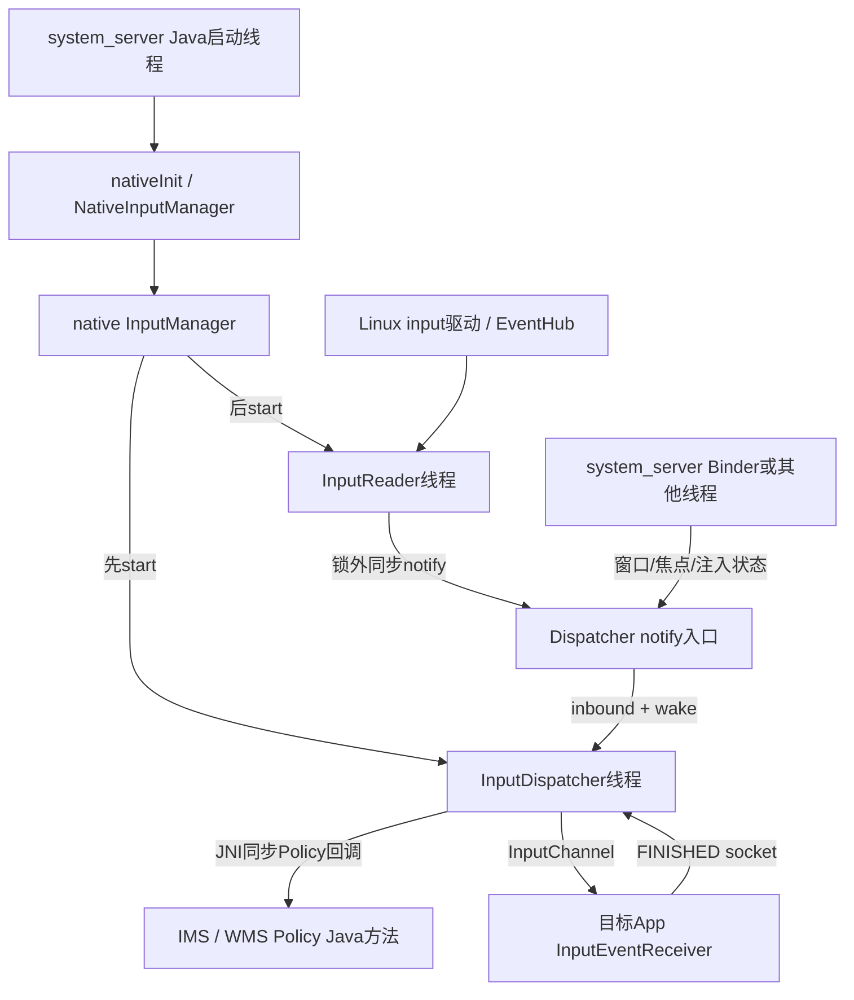
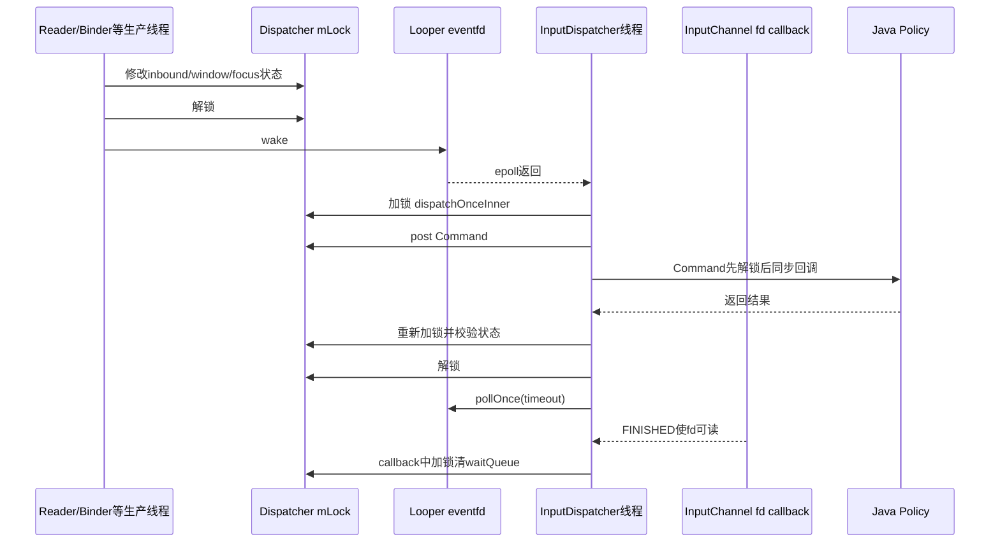

# 247 Android InputReader与InputDispatcher线程、Looper与锁顺序并发链

> 源码版本：Android 11 / `android-11.0.0_r48`  
> 学习方式：macOS只读核源，不编译、不运行AOSP

## 1. 本章要解决什么

前几章不断遇到“锁外调用”“wake”“Command”“Binder线程”，但如果没有统一并发模型，很容易把它们理解成一条串行调用链。

本章集中回答：

```text
InputReader和InputDispatcher在哪个进程、哪两条线程？
谁创建线程，线程何时真正开始？
Reader为什么不用Looper，而Dispatcher要用Looper？
EventHub wake pipe与Looper eventfd有什么区别？
notifyKey发生在Reader线程，为什么路由又在Dispatcher线程？
CommandEntry是不是另一个工作线程？
LockedInterruptible为什么必须允许状态在回调期间变化？
Java Policy回调会不会自动切到system_server主线程？
条件变量等待是否一直持锁？
Watchdog如何判断输入线程死锁？
应该怎样读源码中的锁顺序，而不是背一张虚假的总排序表？
```

## 2. 一句总纲

```text
system_server创建native InputManager
→ 先启动InputDispatcher线程，再启动InputReader线程
→ Reader在EventHub epoll上等待内核输入，持Reader锁解析，解锁后同步通知Dispatcher
→ Dispatcher短暂持锁把事件放入inboundQueue并写eventfd唤醒
→ Dispatcher线程在自己的Looper上醒来，持锁推进状态机
→ 需要跨Java/Policy的操作先保存稳定参数，再解锁同步回调，回来后重新校验状态
→ InputChannel FINISHED、定时器和显式wake最终都汇入同一个Dispatcher线程
```

## 3. 先纠正“输入系统是一个线程”

至少要区分：

```text
system_server启动/Java调用线程
InputReader native线程
InputDispatcher native线程
system_server Binder线程
DisplayThread等Java Handler线程
目标App主线程与其native InputEventReceiver
```

同在一个进程不等于同在一个线程，同在一条调用栈也不等于经过消息切换。

## 4. 进程归属

Android 11 r48中，`InputManagerService`在`system_server`内通过JNI创建`NativeInputManager`。

`NativeInputManager`再创建native `InputManager`、`InputDispatcher`、`InputClassifier`和`InputReader`。

因此本章主线的Reader与Dispatcher线程都在`system_server`进程，而不是两个独立守护进程。

## 5. inputflinger服务名不要误导

构造函数还会把native InputManager注册为名为`inputflinger`的Binder service。

“有Binder服务名”不等于“必然有独立Linux进程”；进程归属要看对象由谁在何处创建。

## 6. Java构造只做初始化

`InputManagerService`构造中调用：

```java
mPtr = nativeInit(this, mContext, mHandler.getLooper().getQueue());
```

这里建立native对象和全局引用，但线程真正启动是在后面的`start()`。

## 7. nativeStart入口

Java `InputManagerService.start()`调用`nativeStart(mPtr)`，JNI最终执行：

```cpp
im->getInputManager()->start();
```

这是两条输入线程的共同启点。

## 8. 为什么先启动Dispatcher

`InputManager::start()`顺序是：

```text
1. mDispatcher->start()
2. mReader->start()
```

Reader一旦开始就可能读到硬件事件并flush；先让消费者Dispatcher可运行，可避免生产者先产出而消费线程尚不存在的启动窗口。

## 9. Reader启动失败如何回滚

若Dispatcher已成功、Reader启动失败，InputManager会调用`mDispatcher->stop()`。

这保持“要么两条主线程都可用，要么不留下半启动Dispatcher”的生命周期不变量。

但要继续追一层：r48的`InputThread`构造函数调用`mThread->run(...)`后没有保存或向上传递status，Reader/Dispatcher的`start()`在创建InputThread后直接返回OK。因此InputManager写出了回滚意图，但底层线程创建失败未被这条封装完整上报；这是当前实现边界，不应仅凭上层分支断言所有启动错误都能回滚。

## 10. 停止顺序相反

`InputManager::stop()`先停止Reader，再停止Dispatcher。

先断开新的硬件事件生产，再关闭消费者，符合生产者—消费者的反向析构顺序。

## 11. 总体线程图



## 12. InputThread是通用壳

Reader和Dispatcher都用`InputThread`，它内部包装`utils::Thread`。

构造`InputThread`就立即调用`run()`，不是先保存任务等以后显式start。

## 13. loop函数重复执行

`InputThreadImpl::threadLoop()`调用一次传入的loop函数，然后返回true。

`utils::Thread`看到true会继续下一轮，直到收到退出请求。

## 14. 两条线程传入不同loop

```cpp
InputReader:     [this]() { loopOnce(); }
InputDispatcher: [this]() { dispatchOnce(); }
```

同一个线程壳，不同的每轮工作和睡眠机制。

## 15. 线程名字

源码显式使用：

```text
InputReader
InputDispatcher
```

在trace、tombstone、debuggerd线程列表或Perfetto中应按这两个名字定位。

## 16. 线程优先级

两者以`ANDROID_PRIORITY_URGENT_DISPLAY`启动。

这表达低延迟诉求，但不代表它们永远不会被阻塞，也不允许在回调里做无限耗时工作。

## 17. canCallJava=true

`InputThreadImpl`构造基类时传`Thread(/* canCallJava */ true)`。

`utils::Thread::run()`因此走`createThreadEtc`而非raw thread创建；AndroidRuntime启动注册阶段把该创建钩子替换为`javaCreateThreadEtc`，新线程先挂接JavaVM再进入输入loop。

所以Reader/Dispatcher native线程具备同步调用Java/JNI策略方法的条件；看到Java对象回调时不能假设发生了主线程切换。

## 18. stop不能由自己调用

Reader和Dispatcher的`stop()`都检查`mThread->isCallingThread()`。

若当前正是被停止线程，返回`INVALID_OPERATION`，避免线程自己等待自己退出形成自连接死锁。

## 19. InputThread析构三步

```text
requestExit
→ 调用传入wake函数打断阻塞等待
→ requestExitAndWait等待线程真正结束
```

只设置退出标志不足以结束一条卡在无限epoll/poll中的线程，所以wake是析构协议的一部分。

## 20. Reader的wake目标

Reader线程的wake函数是：

```cpp
[this]() { mEventHub->wake(); }
```

它打断`EventHub::getEvents()`里的`epoll_wait()`。

## 21. Dispatcher的wake目标

Dispatcher线程的wake函数是：

```cpp
[this]() { mLooper->wake(); }
```

它打断native Looper内部的`epoll_wait()`。

## 22. Reader为什么不使用Looper

Reader主要等待的是：

```text
/dev/input/event* fd
inotify设备增删
video device fd
显式wake pipe
Mapper内部timeout
```

EventHub已经用自己的epoll完整管理这些来源，所以Reader无需再套一层Looper。

## 23. EventHub拥有自己的锁

`EventHub::getEvents()`先取得EventHub的`mLock`，处理设备表、pending epoll结果和读取。

这把锁不同于InputReader的`mLock`，两者保护的状态域也不同。

## 24. Reader调用getEvents时不持Reader锁

`loopOnce()`先持Reader锁计算配置刷新与timeout，然后释放Reader锁，再调用：

```cpp
mEventHub->getEvents(timeoutMillis, ...)
```

等待内核事件时不霸占Reader状态锁，其他线程仍可查询设备状态或请求配置刷新。

## 25. EventHub也不带锁睡眠

`getEvents()`内部在真正`epoll_wait()`前执行：

```cpp
mLock.unlock();
epoll_wait(...);
mLock.lock();
```

因此漫长睡眠既不持Reader锁，也不持EventHub锁。

## 26. wake pipe结构

EventHub创建非阻塞pipe：

```text
mWakeWritePipeFd ← 其他线程写入"W"
mWakeReadPipeFd  ← 注册进EventHub epoll
```

读端可读会让epoll返回；EventHub随后把pipe中积累的字节读空。

## 27. pipe满不是致命错误

`EventHub::wake()`写1字节，若返回`EAGAIN`不报致命错误。

pipe已经满意味着读端本来就可读，唤醒事实已经建立，再多写一个字节没有必要。

## 28. wake不是输入事件

EventHub识别wake fd后只设置`awoken=true`并排空pipe，不构造Key/Motion RawEvent。

它的作用是让loop重新检查配置、timeout或退出状态。

## 29. timeout是建议值

EventHub源码注明：设备睡眠时不会仅为这个timeout唤醒系统。

因此Mapper timeout与“系统必定在精确纳秒醒来”不是同一个承诺。

## 30. EPOLLWAKEUP语义

输入设备fd注册`EPOLLWAKEUP`，让内核事件从待读取到再次进入epoll等待期间维持必要的唤醒保护。

这解决的是事件处理期间系统休眠竞态，不等于Java `PowerManager.WakeLock`对象。

## 31. Reader每轮的三段式

```text
A. 持Reader锁：算timeout/配置刷新
B. 不持Reader锁：EventHub getEvents等待并取RawEvent
C. 持Reader锁：Mapper处理、timeout、设备快照
D. 不持Reader锁：Policy设备通知与QueuedListener.flush
```

真正的并发设计藏在这些锁边界，而不只是函数名。

## 32. 为什么Mapper处理要持Reader锁

Mapper会改设备、按键状态、指针状态、全局meta、timeout和generation。

外部查询接口也可能并发读取这些对象，所以需要同一Reader锁保护一致快照。

## 33. listener不是线程安全的

`InputReaderInterface`注释说明：Reader接口自身必须线程安全，但input listener不是线程安全的，所有listener调用必须来自同一线程。

Queued listener最终都由InputReader线程flush，满足单生产调用线程约束。

## 34. Queued不表示工作线程

`QueuedInputListener`没有线程和Looper。

它只在Reader锁内深拷贝NotifyArgs，再由同一Reader线程在锁外按顺序同步调用inner listener。

## 35. Reader到Dispatcher的线程边界

`mQueuedListener->flush()`调用`InputDispatcher::notifyKey/notifyMotion`时没有自动切线程。

所以notify入口、`intercept*BeforeQueueing`和可选InputFilter，硬件主链上仍运行在InputReader线程。

## 36. 真正切到Dispatcher线程的位置

notify入口把独立EventEntry放进`mInboundQueue`，释放Dispatcher锁，然后按需`mLooper->wake()`。

Dispatcher线程下一轮`dispatchOnce()`取走它，这才是生产者到消费者的线程切换。

## 37. Reader锁外flush避免的锁环

若持Reader锁调用Dispatcher，Dispatcher再同步Policy/WMS，而WMS又查询InputReader，就可能形成：

```text
Reader锁 → Dispatcher/Policy/WMS → 再等Reader锁
```

先释放Reader锁打断了这个回环。

## 38. Reader Policy为何有例外

`refreshConfigurationLocked()`会在Reader锁内调用`getReaderConfiguration()`，`getPointerControllerLocked()`也可调用`obtainPointerController()`。

InputReaderPolicyInterface明确承诺这些方法不会重入InputReader，因此允许在Reader接口方法内调用。

## 39. 不要把“Policy都锁外”当规则

正确说法是：

```text
Dispatcher的一般Policy回调不得持Dispatcher内部锁；
Reader Policy接口以“不重入Reader”的独立契约允许部分锁内调用；
Reader对listener/设备变化通知仍主动放到Reader锁外。
```

## 40. Dispatcher的Looper构造

Dispatcher构造：

```cpp
mLooper = new Looper(false);
```

`false`表示不允许无callback的fd注册；InputChannel注册时提供`handleReceiveCallback`，所以符合要求。

## 41. Looper wake使用eventfd

native Looper创建非阻塞`eventfd`，把它加入自己的epoll。

`wake()`向64位计数器写1，`awoken()`读出累计值；多个wake可以合并成一次可读唤醒。

## 42. eventfd与pipe的共同点

两者都是：

```text
跨线程建立一个fd可读事实
→ 打断epoll_wait
→ 让拥有事件循环的线程重新检查共享状态
```

它们不是直接把C++对象内容从一个线程搬到另一个线程。

## 43. eventfd与pipe的差异

Reader EventHub使用pipe字节流；Looper使用eventfd计数器。

实现不同，但上层都只依赖“至少有一次唤醒尚未消费”的电平式效果，不依赖一一对应的wake次数。

## 44. Dispatcher Looper监听什么

```text
Looper wake eventfd
每个服务端InputChannel fd上的FINISHED/错误/HANGUP
dispatchOnce算出的下一时间点
Looper自身可能存在的Message
```

事件到达后，工作仍在同一InputDispatcher线程执行。

## 45. InputChannel如何注册到Looper

注册Connection时：

```cpp
mLooper->addFd(fd, 0, ALOOPER_EVENT_INPUT,
               handleReceiveCallback, this);
```

这里监听的是App→Dispatcher方向的完成信号，不是硬件RawEvent。

## 46. Looper内部锁不会包住fd callback

`pollInner()`收集response后释放Looper自身`mLock`，再调用`handleEvent()`。

所以`handleReceiveCallback`取得Dispatcher锁时，不是“Looper锁→Dispatcher锁”长期嵌套。

## 47. dispatchOnce睡前也释放Dispatcher锁

`dispatchOnce()`在花括号内持Dispatcher锁推进状态、执行Command、算ANR deadline；离开花括号后才：

```cpp
mLooper->pollOnce(timeoutMillis);
```

线程睡眠期间不持Dispatcher锁。

## 48. Dispatcher一轮图



## 49. nextWakeupTime是绝对时间

`dispatchOnceInnerLocked()`、Key repeat、Policy延迟和ANR检查共同缩小`nextWakeupTime`。

睡前统一换算为向上取整的毫秒timeout，避免过早醒来后反复空转。

## 50. 三个特殊时间值

```text
LONG_LONG_MAX：没有已知deadline，可无限等待
LONG_LONG_MIN：立刻下一轮
普通nsecs：在该绝对时间前后重新检查
```

理解这三个值比把`pollOnce(-1/0/N)`孤立记忆更可靠。

## 51. wake与timeout谁优先

`epoll_wait`既可能因fd可读提前返回，也可能到timeout返回。

所以“安排500ms后重试”不阻止新窗口、FINISHED或新事件在更早时间唤醒Dispatcher。

## 52. inbound为空才需要wake只是默认

notify入队时若原队列为空，默认需要wake；非空通常已有工作。

但app-switch和解阻pointer DOWN可强制wake，因为它们会改变已有pending/积压的优先处理条件。

## 53. wake应放在解锁后

大多数状态更新路径先释放Dispatcher锁再wake。

被唤醒线程可以直接取得锁，减少“刚醒又堵在锁上”的无效调度。

## 54. 少数持锁wake并不自动死锁

`monitor()`、`waitForIdle()`在持Dispatcher锁时调用Looper wake，但`Looper::wake()`只写eventfd，不获取Dispatcher锁。

紧接着条件变量wait会原子释放Dispatcher锁，让被唤醒线程进入。

## 55. mLock保护什么

Dispatcher的`mLock`覆盖：

```text
inbound/pending/recent/command队列
window/focus/touch state
Connection与outbound/waitQueue
ANR tracker和repeat状态
注入结果与前台计数
dispatch enabled/frozen/filter等配置
```

这些状态共同决定一次路由，不可按字段随意拆锁读取。

## 56. GUARDED_BY不是运行时锁

头文件中的`GUARDED_BY(mLock)`、`REQUIRES(mLock)`是线程安全注解，帮助静态分析和读者检查契约。

它们本身不会在运行时自动加锁。

## 57. Locked命名契约

普通`*Locked`方法要求调用者已经持锁，方法内部不会为了Policy回调随意解锁。

调用链上应能向上找到RAII锁或显式`mLock.lock()`。

## 58. LockedInterruptible命名契约

这类方法进入时持锁，但中途可以：

```text
保存必要对象/参数
→ mLock.unlock()
→ 调Policy
→ mLock.lock()
→ 重新检查Connection/queue/window是否还存在
```

“Interruptible”指锁保护连续性被打断，不是线程收到Unix signal。

## 59. 调用方向限制

头文件说明：

```text
LockedInterruptible可以调用Locked
Locked不能调用LockedInterruptible
```

否则一个声称锁保护连续的普通Locked函数，会被下层悄悄解锁，破坏上层不变量。

## 60. Dispatcher总原则

源码顶部写明：Policy可能阻塞或重入Dispatcher，因此Dispatcher一般不在持内部锁时调用Policy。

这里同时防止长时间占锁和重入同一非递归mutex。

## 61. beforeQueueing为何不用Command

硬件notify入口本来就在Reader线程，并且尚未持Dispatcher锁。

它可以直接同步调用`interceptKeyBeforeQueueing`，返回后再加锁入队，无需先进入Dispatcher commandQueue。

## 62. beforeDispatching为何需要Command

这个Policy判断发生在Dispatcher已持锁、已经找到候选焦点窗口的状态机内部。

它先给KeyEntry加引用、保存InputChannel，再post Command，在Command里解锁回调，回来写回intercept结果。

## 63. CommandEntry不是异步线程池

Command仍由InputDispatcher线程的`runCommandsLockedInterruptible()`执行。

它的价值是把“当前锁内状态机”切成两个安全阶段，而不是增加并发执行者。

## 64. Command优先级

`dispatchOnce()`发现已有Command时不先跑新的inbound状态机，而是先执行Command。

这样Policy结果、ANR决定、FINISHED后处理等前半段延续不会被新输入无限推迟。

## 65. Command可以继续产生Command

`runCommandsLockedInterruptible()`循环到队列为空。

Command回调回来后的逻辑可再post后续Command，本轮仍继续处理，随后强制下一次poll立即返回。

## 66. 解锁回调期间世界会变化

Dispatcher锁释放后，其他线程可以：

```text
移除InputChannel
替换窗口列表或焦点
禁用分发
完成/清空waitQueue
触发Connection死亡
```

因此回调返回时不能沿用所有旧指针和旧结论。

## 67. 强引用保护生命周期

CommandEntry常保存`sp<Connection>`、InputChannel或对EventEntry增加refCount。

这保证C++对象本身不被释放，但不保证对象仍注册、Connection仍NORMAL或队列位置不变。

## 68. 生命周期安全不等于状态有效

`sp`解决use-after-free；重新查map、状态和waitQueue解决业务事实是否仍成立。

并发源码中必须把这两类校验分开阅读。

## 69. FINISHED后二次查找

`doDispatchCycleFinishedLockedInterruptible()`先按seq找到waitQueue项，afterKey可能解锁调Policy。

回来后源码再次确认队列内容，因为回调期间Connection可能被清空或注销。

## 70. ANR回调后的重新定位

Dispatcher锁外调用`mPolicy->notifyAnr()`，回来依据token重新`getConnectionLocked()`。

若Connection已消失就直接返回；不能继续使用回调前“它一定存在”的假设。

## 71. fallback回调后的校验

未处理Key交给Policy生成fallback时也先解锁。

返回后先检查Connection仍为NORMAL，再修改InputState或重新投递，避免向已断开的通道写账。

## 72. 特殊的注入权限回调

`checkInjectEventsPermissionNonReentrant`接口明确承诺实现不重入且可在持其他锁时调用。

这是Dispatcher“通常Policy锁外”的有文档例外，不能推广到其他Policy方法。

## 73. 为什么名字带NonReentrant

目标选择时可能正持Dispatcher锁，又必须判断跨UID注入权限。

r48实现最终调用`Context.checkPermission(pid, uid)`，接口契约保证不会反向进入Dispatcher，才允许这个锁内检查。

## 74. Java回调在哪个线程

JNI `Call*Method`是同步调用；它不会因为目标对象是Java对象就自动post到Java主Looper。

因此：

```text
beforeQueueing：通常InputReader线程进入Java
beforeDispatching/notifyAnr/focus通知：InputDispatcher线程进入Java
Binder入口直接调用的Policy：可能是对应Binder线程
```

具体Java方法若自己post Handler，才发生第二次线程切换。

## 75. DisplayThread Looper不是Dispatcher Looper

InputManagerService构造时把`DisplayThread`的MessageQueue交给NativeInputManager，主要供pointer/sprite等需要Java显示线程Looper的对象使用。

InputDispatcher又单独`new Looper(false)`；两者不是同一个Looper。

## 76. 同步Java回调的性能后果

Policy回调慢50ms会记录slow interception警告，但不会自动迁移到后台线程或强制终止。

锁虽然已释放，当前Reader或Dispatcher线程本身仍被同步阻塞，输入延迟会继续增长。

## 77. notifySwitch的直接路径

Switch事件不进入普通Key/Motion inbound路由，而是notify入口直接调用Policy。

硬件主链上它同样在Reader线程执行；这说明“所有通知都必须Dispatcher线程处理”是错误的。

## 78. 外部状态更新来自哪些线程

窗口、焦点、dispatch mode、filter enable、InputChannel注册和注入可能由Binder线程或system_server其他线程进入native Dispatcher。

它们用同一`mLock`串行修改状态，再wake Dispatcher线程重新决策。

## 79. setInputWindows不是直接路由事件

调用线程只替换Dispatcher持有的窗口快照并wake。

真正让pending Key/Motion使用新快照继续目标选择的是后续Dispatcher线程轮次。

## 80. InputChannel回执回调线程

App写回FINISHED后，服务端Channel fd可读，native Looper在InputDispatcher线程调用`handleReceiveCallback`。

回调内取得Dispatcher锁、批量读取完成信号、更新waitQueue并运行后处理Command。

## 81. Looper callback返回值

`handleReceiveCallback`返回1表示继续监听fd；返回0让Looper移除callback。

未知fd、断链或注销路径会结束监听，不能把返回值理解成事件handled。

## 82. 条件变量为什么重要

注入同步等待、monitor、waitForIdle等需要一个线程等状态变化，但不能一直占着Dispatcher锁。

`condition_variable.wait/wait_for`会原子地释放mutex、睡眠，被通知后重新取得mutex再返回。

## 83. 注入等待不阻塞Dispatcher取锁

Binder注入线程持`unique_lock`检查结果，然后在`mInjectionResultAvailable.wait_for()`中释放锁。

Dispatcher线程因此能够取得同一锁、设置结果并`notify_all()`；若wait一直持锁，协议本身就无法完成。

## 84. 条件变量必须配合谓词

唤醒可能是spurious，也可能状态已被别的事件再次改变。

源码用循环重新检查`injectionResult`或`pendingForegroundDispatches`，而不是“被notify一次就认定完成”。

## 85. Reader活性条件

Reader每次从EventHub返回、重新取得Reader锁后调用`mReaderIsAliveCondition.broadcast()`。

monitor先取得Reader锁、wake EventHub，再wait；Reader能跑到广播点说明锁和loop至少仍可推进。

## 86. Dispatcher活性条件

Dispatcher在每次`dispatchOnce()`开头持锁后`mDispatcherIsAlive.notify_all()`。

monitor持锁wake再wait；wait释放锁，被唤醒的Dispatcher进入新一轮后通知。

## 87. Watchdog调用链

InputManagerService注册为Watchdog Monitor，心跳线程依次检查Java侧几个锁，然后JNI执行：

```text
InputReader.monitor()
InputDispatcher.monitor()
```

这帮助发现Reader、EventHub或Dispatcher锁/线程不再推进的系统级卡死。

## 88. monitor不是业务健康证明

线程能响应monitor，不代表某个App已处理输入、所有Window正确或硬件触摸没有故障。

它主要证明关键锁可取得、事件循环能从等待中醒来并到达活性点。

## 89. waitForIdle的100ms

Dispatcher的`waitForIdle()`wake后最多等100ms的`mDispatcherEnteredIdle`。

这是内部同步/测试便利门，超时只返回false，不应当成普通窗口5秒ANR或硬件显示完成定义。

r48这里使用一次不带谓词的`wait_for`，仅按返回值判断是否超时；从标准条件变量语义看，理论上的spurious wake也会得到`no_timeout`。因此它适合调试同步，不是可证明所有业务状态的强事务屏障。

## 90. idle通知条件

源码唯一直接条件是本轮算出的`nextWakeupTime == LONG_LONG_MAX`，Dispatcher才通知entered idle。

在正常未冻结路径中，这通常表示没有当前可推进的Command/pending/inbound和已登记deadline；但它不是“所有容器严格为空”的谓词。例如dispatch frozen可让入站事件留在队列却不安排处理时间，已经被标为unresponsive并从ANR tracker移除的Connection也可能仍有等待账。

所以这里的idle应读成“事件循环此刻没有安排下一次主动推进时间”，而不是“所有App已FINISHED、所有队列为空”。

## 91. 锁顺序图


## 92. 不要强行编一张全局锁总序

系统中还有NativeInputManager锁、WMS锁、Java对象锁、Looper锁和App端锁。

源码更多依赖“跨组件前主动解锁”“Policy不重入契约”“callback前释放Looper锁”和“回来重校验”，而不是所有模块永久遵守一条简单A→B→C排序。

## 93. 阅读锁的固定方法

每遇到共享字段，按以下顺序问：

```text
1. 哪把锁保护它？
2. 当前函数进入时是否已经持锁？
3. 是否调用外部组件/JNI/Binder？
4. 调用前有没有复制参数和加引用？
5. 回来后重新验证了哪些事实？
6. 睡眠或条件等待时锁是否释放？
7. 改状态后谁负责wake？
```

## 94. 常见错误一：notifyKey在Dispatcher线程

硬件主链错误。Reader解锁flush后同步进入notifyKey，直到EventEntry入队都通常还是InputReader线程。

## 95. 常见错误二：QueuedListener是异步队列

错误。它没有消费者线程；真正线程切换靠Dispatcher inboundQueue加Looper wake。

## 96. 常见错误三：Reader也用Looper

错误。Reader直接依赖EventHub epoll与wake pipe；Dispatcher才使用native Looper/eventfd。

## 97. 常见错误四：Command运行在别的线程

错误。Command由InputDispatcher线程执行，只是在函数中暂时释放Dispatcher锁同步调用Policy。

## 98. 常见错误五：解锁后原状态仍稳定

错误。对象可能因强引用仍活着，但注册关系、队列位置、Connection状态和焦点都可能已经改变。

## 99. 常见错误六：Java对象意味着Java主线程

错误。JNI同步调用运行在当前attached native线程；只有Java实现显式post才切Looper。

## 100. 常见错误七：wait会持锁睡眠

标准条件变量wait会释放锁并在返回前重取；否则生产状态的线程无法取得锁，等待永远不会完成。

## 101. 常见错误八：wake次数等于处理轮数

错误。pipe/eventfd可合并多次wake；共享状态与队列才是真正事实，wake只负责让消费者重新检查。

## 102. macOS只读练习一：追启动与退出

```bash
cd /Users/ninebot/androidSource
sed -n '315,365p' frameworks/base/services/core/java/com/android/server/input/InputManagerService.java
sed -n '1260,1285p' frameworks/base/services/core/jni/com_android_server_input_InputManagerService.cpp
sed -n '30,85p' frameworks/native/services/inputflinger/InputManager.cpp
sed -n '20,75p' frameworks/native/services/inputflinger/InputThread.cpp
```

写出Dispatcher先启、Reader后启、Reader先停、Dispatcher后停，以及析构为何必须wake。

## 103. macOS只读练习二：比较两个等待器

```bash
cd /Users/ninebot/androidSource
sed -n '85,150p' frameworks/native/services/inputflinger/reader/InputReader.cpp
sed -n '1025,1110p' frameworks/native/services/inputflinger/reader/EventHub.cpp
sed -n '45,80p' system/core/libutils/Looper.cpp
sed -n '175,285p' system/core/libutils/Looper.cpp
sed -n '388,420p' system/core/libutils/Looper.cpp
```

对比EventHub pipe与Looper eventfd、各自epoll监听对象、睡眠前释放哪把锁。

## 104. macOS只读练习三：追Command锁外回调

```bash
cd /Users/ninebot/androidSource
sed -n '60,95p' frameworks/native/services/inputflinger/dispatcher/InputDispatcher.h
sed -n '940,980p' frameworks/native/services/inputflinger/dispatcher/InputDispatcher.cpp
sed -n '4620,4775p' frameworks/native/services/inputflinger/dispatcher/InputDispatcher.cpp
```

选beforeDispatching或ANR，标出保存参数、unlock、Policy、lock和回后重校验五个位置。

## 105. macOS只读练习四：追FINISHED与活性监测

```bash
cd /Users/ninebot/androidSource
sed -n '2680,2755p' frameworks/native/services/inputflinger/dispatcher/InputDispatcher.cpp
sed -n '4300,4405p' frameworks/native/services/inputflinger/dispatcher/InputDispatcher.cpp
sed -n '5065,5110p' frameworks/native/services/inputflinger/dispatcher/InputDispatcher.cpp
sed -n '1870,1890p' frameworks/base/services/core/java/com/android/server/input/InputManagerService.java
```

说明Looper fd callback、Dispatcher锁、Command后处理、condition wait和Watchdog monitor怎样衔接。

## 106. 复读后最容易不理解的地方

```text
同进程不等于同线程
同步函数调用不等于消息切线程
Queued不等于异步
wake不携带业务数据
对象活着不等于状态仍有效
LockedInterruptible不是Unix signal可中断
Java回调不自动去主Looper
条件变量wait不是抱锁睡眠
```

## 107. 复读修订一：两个Looper不能混

NativeInputManager保存从Java DisplayThread MessageQueue取得的Looper，供pointer/sprite相关设施使用。

InputDispatcher内部另建`Looper(false)`监听Connection和自身wake；本章说“Dispatcher Looper”专指后者。

## 108. 复读修订二：Policy锁外规则有明确范围

Dispatcher一般Policy调用锁外，但注入权限接口以NonReentrant契约成为例外。

Reader Policy则明确承诺不重入Reader，故配置/PointerController调用可位于Reader锁内；不能把一个模块的锁规则机械套到另一个模块。

## 109. 复读修订三：callback线程仍是Dispatcher线程

Looper在fd就绪后没有另建callback线程。

它在InputDispatcher线程上调用`handleReceiveCallback`，而且调用前已释放Looper内部锁；callback随后自己取得Dispatcher锁。

## 110. 复读修订四：wake后的可见性来自锁

生产线程先在Dispatcher锁内写共享状态，解锁后wake；消费线程醒来再取得同一锁。

真正建立状态同步与内存可见性的是mutex的release/acquire关系，eventfd只负责打断睡眠。

## 111. 复读修订五：持锁wake不必一律判错

常规数据路径偏好解锁后wake以降低竞争；但monitor/waitForIdle的“持锁→wake→condition wait释放锁”是有意握手。

判断死锁必须看wake会不会取得同一锁，以及后续wait是否释放锁，不能只按表面顺序下结论。

## 112. Android 11 r48版本边界

```text
InputManager位于system_server并注册inputflinger Binder service
InputThread构造即启动，优先级为URGENT_DISPLAY，canCallJava=true
InputThread构造未向上传递Thread::run返回值，上层启动失败回滚意图存在但错误传播不完整
Dispatcher先启动、Reader后启动；停止顺序相反
Reader使用EventHub epoll+wake pipe，不使用Dispatcher Looper
Dispatcher使用独立native Looper+eventfd，并监听InputChannel FINISHED
Looper在调用fd callback前释放自己的内部锁
Dispatcher用std::mutex/condition_variable与线程安全注解
Reader仍使用utils Mutex/Condition风格
普通Dispatcher Policy锁外，注入权限NonReentrant接口是明确例外
waitForIdle超时为100ms，仅是内部同步门
waitForIdle使用无谓词wait_for，理论上还存在spurious wake边界
```

## 113. 本章检查清单

```text
[ ] 能指出Reader/Dispatcher所在进程
[ ] 能解释启动和停止顺序
[ ] 能区分EventHub pipe与Looper eventfd
[ ] 能说出notifyKey在哪个线程
[ ] 能指出真正的线程切换点
[ ] 能解释Command不是工作线程
[ ] 能解释Locked与LockedInterruptible
[ ] 能区分强引用安全和状态有效
[ ] 能说明Java Policy回调线程
[ ] 能解释condition wait的解锁语义
[ ] 能描述Watchdog monitor能证明什么
```

## 114. 本章小结

```text
Reader线程：在EventHub等待，锁内解析，锁外flush
Dispatcher入口：可由Reader/Binder等线程并发生产共享状态
Dispatcher线程：Looper统一接wake、FINISHED与deadline
Dispatcher锁：保证路由账本一致，而不是包住外部Policy
Command：同线程内把锁内决策拆成锁外回调与回来重校验
条件变量：让等待者释放锁，生产者才能推进结果
Watchdog：以wake+活性条件检查关键循环和锁是否还能前进
```

输入并发模型的关键不是“到处加锁”，而是把共享事实放在正确锁下，把跨组件调用移到锁外，并承认解锁期间世界会变化。读懂这三点，后续分析竞态、ANR和输入延迟才有可靠坐标系。

## 115. 下一章预告

下一章进入InputReader设备生命周期：EventHub扫描、Device/Mapper创建、配置generation、设备增删通知和reset取消链，观察一块输入硬件从`/dev/input/event*`出现到能产出稳定事件经历哪些状态。
