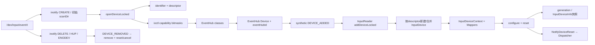
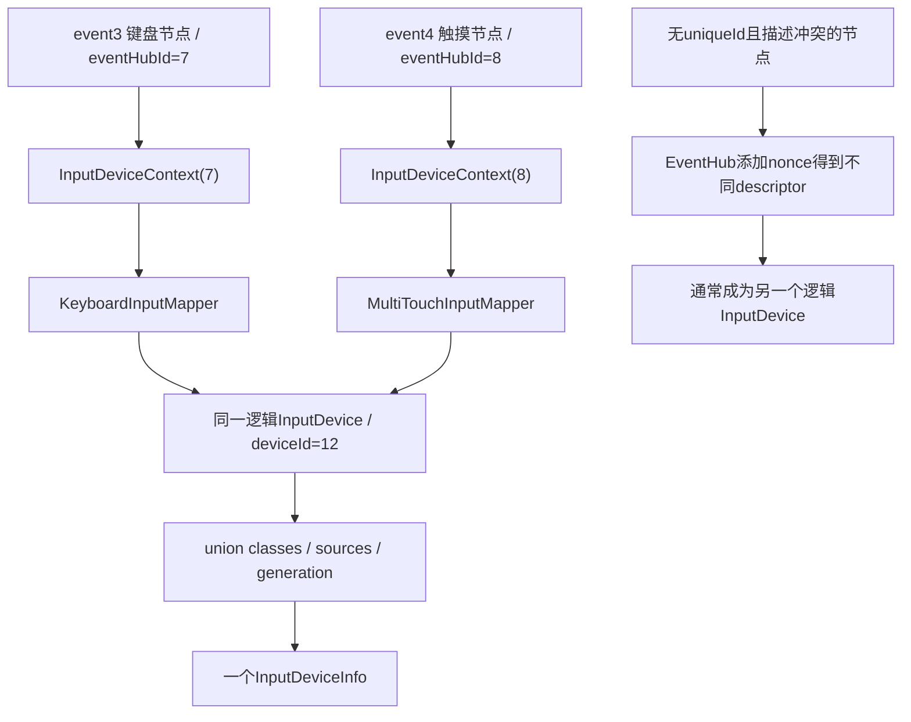
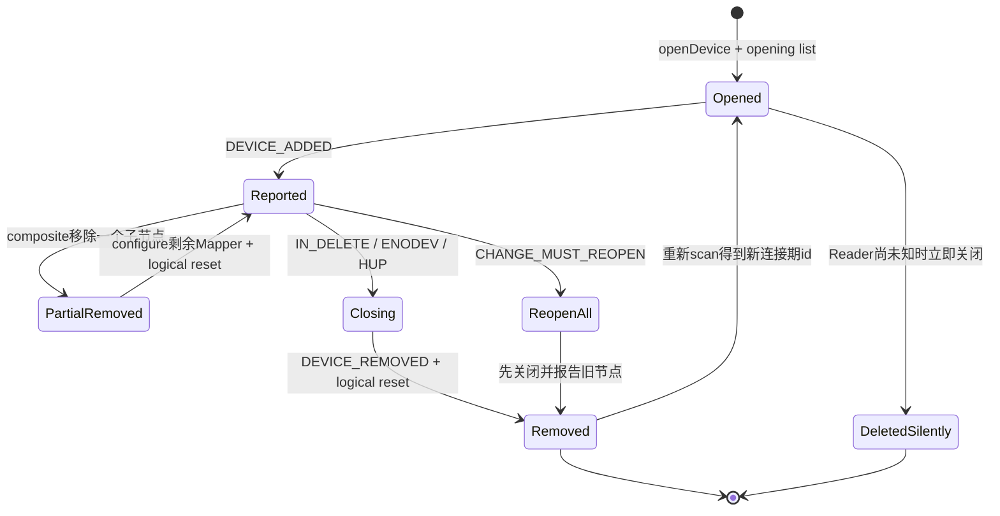

# 248 Android EventHub设备扫描、InputDevice与Mapper生命周期链

> 源码版本：Android 11 / `android-11.0.0_r48`  
> 学习方式：macOS只读核源，不编译、不运行AOSP

## 1. 本章要解决什么

第247章建立了Reader与Dispatcher并发模型，本章沿Reader内部继续向硬件方向走：

```text
/dev/input/event*是谁发现的？
初次扫描与热插拔有什么不同？
open一个event节点后读取了哪些ioctl能力？
EventHub Device和InputReader InputDevice是不是同一对象？
为什么一个逻辑设备能包含多个event节点？
eventHubId、deviceId、descriptor、generation各自解决什么问题？
INPUT_DEVICE_CLASS_*怎样决定Mapper类型？
configure、reset、NotifyDeviceReset分别做什么？
设备移除为什么还要发CANCEL？
SYN_DROPPED后为什么一直丢到下一个SYN_REPORT？
设备列表变化怎样通知到Java与应用？
```

## 2. 一句总纲

```text
EventHub以inotify发现节点、以epoll监听fd
→ open后用ioctl读取身份和能力bit，装载idc/kl/kcm并推导classes
→ 生成EventHub Device与节点id，按synthetic DEVICE_ADDED交给InputReader
→ Reader按descriptor决定新建还是合并逻辑InputDevice
→ 每个子节点创建InputDeviceContext和一组Mapper
→ configure汇总classes/sources并应用显示、启停、键盘布局与Mapper配置
→ reset清Mapper状态并向Dispatcher发设备级reset
→ generation变化生成全量设备快照，Reader锁外通知Java
→ 节点移除时先解除映射，再reset逻辑设备，Dispatcher用CANCEL清旧输入协议
```

## 3. 全生命周期图



## 4. 源码地图

```text
frameworks/native/services/inputflinger/reader/EventHub.cpp
frameworks/native/services/inputflinger/reader/InputReader.cpp
frameworks/native/services/inputflinger/reader/InputDevice.cpp
frameworks/native/services/inputflinger/reader/include/InputDevice.h
frameworks/native/services/inputflinger/reader/mapper/*InputMapper.cpp
frameworks/native/include/input/InputDevice.h
frameworks/base/services/core/jni/com_android_server_input_InputManagerService.cpp
frameworks/base/services/core/java/com/android/server/input/InputManagerService.java
```

## 5. EventHub构造时做什么

构造函数创建：

```text
epoll实例
/dev/input的inotify watch
可选/dev/v4l-touch的inotify watch
非阻塞wake pipe
```

inotify fd与wake pipe读端都注册进EventHub epoll。

## 6. 初始状态主动扫描

`mNeedToScanDevices`初始为true。

因此Reader第一次调用`getEvents()`时，即使还没有inotify新建通知，也会扫描当前已经存在的设备节点。

## 7. 监听目录

r48主输入目录常量是`/dev/input`，扫描其中各项并尝试`openDeviceLocked()`。

热插拔则由同一目录上的`IN_CREATE | IN_DELETE`事件驱动。

## 8. 初始扫描与热插拔统一入口

```text
初始：scanDirLocked → openDeviceLocked
新增：readNotifyLocked(IN_CREATE) → openDeviceLocked
删除：readNotifyLocked(IN_DELETE) → closeDeviceByPathLocked
```

发现机制不同，真正打开/关闭设备的核心函数相同。

## 9. 设备节点如何打开

源码使用：

```cpp
open(path, O_RDWR | O_CLOEXEC | O_NONBLOCK)
```

非阻塞便于事件循环批量读取；`CLOEXEC`避免fd泄漏到exec出的进程；读写权限也用于LED、震动等输出能力。

## 10. 打开失败不是系统崩溃

单个节点open或关键ioctl失败时关闭fd并返回错误，扫描继续其他节点。

只有epoll、inotify、wake pipe等EventHub基础设施创建失败才用fatal终止。

## 11. identifier的来源

EventHub通过evdev ioctl读取：

```text
EVIOCGNAME：name
EVIOCGID：bus/vendor/product/version
EVIOCGPHYS：物理location
EVIOCGUNIQ：设备提供的uniqueId
```

这些字段是身份与配置文件选择的原料，不是最终Android deviceId。

## 12. excluded devices门

读取name后先与配置中的excluded device name列表比较。

命中就关闭fd并忽略，不继续创建EventHub Device。

## 13. descriptor如何生成

EventHub拼接vendor/product，再优先使用uniqueId；若vendor/product均为0，还会回退加入name或location，最终计算SHA-1形式的opaque descriptor。

descriptor用于跨层识别“这是什么设备”，不等于当前连接期的整数id。

## 14. nonce解决同连接冲突

若设备没有uniqueId，而当前已有相同descriptor，EventHub递增nonce重新生成，直到本次连接集合内唯一。

这避免两块无法区分的同型号设备在当前运行期被当成一个节点。

## 15. descriptor并非绝对硬件序列号

源码希望它跨重启、重连和版本稳定，但注释也承认设备可能无法被唯一识别。

尤其依赖nonce时，值受同时连接设备及发现顺序影响，不能把它当密码学硬件身份。

## 16. 配置文件先装载

EventHub根据identifier查找并装载`.idc` PropertyMap。

后续`device.type`、touch calibration、port association等行为会受配置影响。

## 17. ioctl能力bitmask

EventHub读取：

```text
EV_KEY / EV_ABS / EV_REL / EV_SW
EV_LED / EV_FF
input properties
```

它不是按节点文件名猜设备类型，而是从驱动声明的实际能力组合推断。

## 18. keyboard class判定

普通键范围或gamepad/joystick按钮范围存在时，加入`INPUT_DEVICE_CLASS_KEYBOARD`。

这里的keyboard class很宽，手柄按钮也会借用KeyboardInputMapper做按键映射。

## 19. cursor class判定

同时具有`BTN_MOUSE`、`REL_X`和`REL_Y`才视为Cursor类。

因此“有相对轴”本身还不足以成为鼠标。

## 20. rotary encoder判定

它不是单靠evdev bit推导，而是读取idc中的：

```text
device.type = rotaryEncoder
```

这是配置参与分类的典型例子。

## 21. 多点触摸判定

存在`ABS_MT_POSITION_X/Y`，且有`BTN_TOUCH`或不像gamepad时，标记TOUCH与TOUCH_MT。

额外gamepad检查是为避开某些手柄轴编号与MT轴范围冲突造成的误识别。

## 22. 单点触摸判定

没有MT坐标，但具备`BTN_TOUCH + ABS_X + ABS_Y`时标记TOUCH。

后面会选择SingleTouchInputMapper，而不是MultiTouchInputMapper。

## 23. external stylus特殊判定

只有pressure或touch信号，却没有X/Y坐标的设备可标为EXTERNAL_STYLUS。

它的状态要与触摸屏坐标融合，因此源码还撤销KEYBOARD class，防止同一按钮被键盘Mapper抢走。

## 24. joystick判定

需要先有gamepad buttons，再检查至少一个绝对轴的usage可归入JOYSTICK。

这样可以与同样报告绝对轴的传感器类设备区分。

## 25. switch与vibrator

任何SW bit得到SWITCH class；支持`FF_RUMBLE`得到VIBRATOR class。

一个EventHub Device可以同时有多种class，而不是只能选一个主类型。

## 26. virtual key可能补keyboard

触摸设备若成功加载虚拟按键映射，还会加入KEYBOARD class。

因此屏幕下方内核虚拟键可由同一event节点额外创建KeyboardInputMapper。

## 27. key layout与key character map

KEYBOARD或JOYSTICK class会尝试加载key map：

```text
.kl：scan code/axis到Android key code或axis语义
.kcm：字符、meta组合与键盘类型
```

`.idc`、`.kl`、`.kcm`解决的问题不同。

## 28. alpha、dpad与gamepad再分类

key map加载后：

```text
能映射Q键 → ALPHAKEY
完整五向键 → DPAD
存在任一标准手柄按键 → GAMEPAD
```

这些派生class会进一步决定Android source与keyboardType。

## 29. 未识别节点直接丢弃

若最终`classes == 0`，EventHub删除Device并关闭fd，不加入epoll，也不会向InputReader发DEVICE_ADDED。

能open并不等于Android输入框架会接纳。

## 30. external与mic属性

被识别后还会判断设备是否外接、是否带麦克风，并追加EXTERNAL/MIC class。

这些更像设备属性，不一定各自产生一个事件Mapper。

## 31. controller number

同时满足JOYSTICK或DPAD且属于GAMEPAD的设备会申请controller number，并设置对应LED。

设备关闭时会释放编号，供其他控制器复用。

## 32. touch video配对

可选`/dev/v4l-touch*`节点按设备name与evdev设备配对。

视频节点先出现时暂存于`mUnattachedVideoDevices`，以后匹配；evdev先出现则打开时主动查暂存队列。

## 33. configureFd

成功识别后对fd做两项重要配置：

```text
键盘：用EVIOCSREP关闭内核key repeat，由Dispatcher统一生成repeat
全部设备：尝试EVIOCSCLOCKID切到CLOCK_MONOTONIC
```

后者让事件时间与输入系统使用的单调时钟一致。

## 34. 加入epoll

设备fd以`EPOLLIN | EPOLLWAKEUP`加入EventHub epoll；关联video fd也一起注册。

从此内核数据到达会唤醒Reader线程。

## 35. EventHub Device对象

它持有节点fd、path、identifier、capability bitmask、classes、key map、配置、controller number等节点级事实。

它不是Java `InputDevice`，也不是InputReader的逻辑`InputDevice`类。

## 36. eventHubId的分配

普通节点从`mNextDeviceId=1`递增分配连接期id。

关闭再打开通常会得到新的eventHubId；不要把这个整数当跨重启稳定身份。

## 37. 两个保留id

```text
-1：始终存在的Virtual Keyboard
 0：对外表示built-in keyboard
 1：END_RESERVED_ID，动态Reader id从它之后开始
```

EventHub内部built-in键盘仍可有正数节点id，但生成RawEvent时映射为0。

## 38. Virtual Keyboard没有真实fd

初次扫描结束时，若还没有id=-1的设备，EventHub创建`<virtual>`键盘，fd为-1，带VIRTUAL/KEYBOARD/ALPHAKEY/DPAD class并加载key map。

它用于合成/注入等框架语义，不代表一个`/dev/input/event*`节点。

## 39. built-in keyboard资格

第一个key map加载成功且满足内建键盘资格的节点记录为`mBuiltInKeyboardId`。

它关闭时映射清空并打印“apps will not like this”警告，因为公开id 0有特殊兼容意义。

## 40. addDeviceLocked暂不立即回调Reader

EventHub先把Device加入`mDevices`，再挂到`mOpeningDevices`链表。

下一次/当前`getEvents()`整理synthetic事件时才输出DEVICE_ADDED。

## 41. synthetic事件不是内核input_event

DEVICE_ADDED、DEVICE_REMOVED、FINISHED_DEVICE_SCAN是EventHub自己构造的RawEvent类型。

它们的type位于`FIRST_SYNTHETIC_EVENT`之后，InputReader不会把它们交给普通Mapper。

## 42. 初始扫描事件顺序

`getEvents()`大致按：

```text
先报告mClosingDevices
→ 执行需要的目录扫描
→ 报告mOpeningDevices
→ 报告FINISHED_DEVICE_SCAN
→ 再处理普通fd事件
```

这让Reader先建立设备对象，再消费该节点的普通RawEvent。

## 43. opening链表是头插

`addDeviceLocked()`把新Device插到`mOpeningDevices`头部，报告时也从头部取。

因此多个节点的DEVICE_ADDED顺序不应被当成目录遍历顺序的稳定API。

## 44. FINISHED_DEVICE_SCAN含义

它表示当前一轮设备增删扫描批次已报告完成。

InputReader收到后更新全局meta并排队`NotifyConfigurationChangedArgs`，不是说每个App已经收到设备列表回调。

## 45. InputReader的两张映射表

```text
mDevices：eventHubId → shared_ptr<逻辑InputDevice>
mDeviceToEventHubIdsMap：逻辑InputDevice → [eventHubId...]
```

第一张负责RawEvent找到处理者，第二张负责枚举每个逻辑设备一次。

## 46. 为什么值是shared_ptr

多个eventHubId可以指向同一个逻辑InputDevice。

删除一个子节点时，其余映射仍保持对象生命周期。

## 47. createDevice先按descriptor找

Reader遍历现有eventHubId映射，只要已存在逻辑设备descriptor与新identifier descriptor均非空且相等，就复用那个InputDevice。

否则创建新的逻辑设备。

## 48. composite device图



## 49. 哪些节点容易合并

只有EventHub最终descriptor完全相同才合并。

没有uniqueId的冲突descriptor会被nonce强制唯一，通常不会合并；多个节点确实报告相同非空uniqueId时，EventHub不会走nonce冲突消解，才更可能聚合。

## 50. 合并不是按name

Reader不以name相等直接合并。

同名键盘、同型号手柄并不因此共享deviceId；关键是最终descriptor。

## 51. Reader逻辑deviceId

新建InputDevice时：

```text
eventHubId < END_RESERVED_ID → 保留-1或0
普通正数eventHubId → 使用Reader自己的nextInputDeviceIdLocked()
```

所以普通设备的eventHubId与App看到的逻辑deviceId不能默认相等。

## 52. r48动态Reader id起点

`mNextInputDeviceId`初始为1，`nextInputDeviceIdLocked()`先自增再返回。

因此首个普通逻辑设备id从2开始；1是保留边界而不是首个动态id。

## 53. InputDeviceContext的作用

每个eventHub子节点拥有一个Context，把Mapper访问限制到自己的eventHubId：

```text
查询轴/键状态
读配置与key map
enable/disable fd
震动/LED
向共同Reader Context发通知
```

Mapper不必自己在全局EventHub中反复传错节点id。

## 54. class到Mapper的规则

每个子节点可按classes创建多种Mapper：

```text
SWITCH → SwitchInputMapper
ROTARY_ENCODER → RotaryEncoderInputMapper
VIBRATOR → VibratorInputMapper
KEYBOARD/ALPHA/DPAD/GAMEPAD → 一个KeyboardInputMapper
CURSOR → CursorInputMapper
TOUCH_MT → MultiTouchInputMapper
否则TOUCH → SingleTouchInputMapper
JOYSTICK → JoystickInputMapper
EXTERNAL_STYLUS → ExternalStylusInputMapper
```

## 55. MT与ST互斥

TOUCH_MT存在时只创建MultiTouchInputMapper；否则普通TOUCH才创建SingleTouchInputMapper。

不是同一节点同时让两个触摸Mapper重复消费坐标。

## 56. KeyboardInputMapper合成source

根据classes组合：

```text
KEYBOARD → SOURCE_KEYBOARD
DPAD → SOURCE_DPAD
GAMEPAD → SOURCE_GAMEPAD
ALPHAKEY → keyboardType ALPHABETIC
```

同一个KeyboardInputMapper可同时宣告多个source。

## 57. ignored的Reader定义

`InputDevice::isIgnored()`等价于Mapper数量为0。

它与EventHub的`classes==0`门不同：EventHub先剔除完全不认识的节点；Reader再以“有没有实际Mapper”判断是否出现在公开设备快照。

## 58. addEventHubDevice会bump设备generation

创建Context与Mapper、插入子节点后，InputDevice调用`bumpGeneration()`。

它把逻辑设备generation设为Reader下一全局generation值，表示设备内容有新版本。

## 59. configure第一步重新求并集

逻辑InputDevice每次configure先清零并重新汇总所有子节点：

```text
mClasses = union(subdevice classes)
mControllerNumber = 子设备控制器编号
mIsExternal / mHasMic
```

这正是composite device需要统一配置阶段的原因。

## 60. 初次配置合并PropertyMap

`changes == 0`表示首次/重建式配置，InputDevice清空逻辑配置并把所有子节点PropertyMap `addAll()`。

多个子节点配置键冲突时需要结合PropertyMap合并顺序读源码，不能假设天然无冲突。

## 61. keyboard layout overlay

非Virtual设备在初次配置或CHANGE_KEYBOARD_LAYOUTS时向Reader Policy取得overlay KCM，再下发所有子节点Context。

真正改变时bump设备generation，使上层能识别同id设备的版本变化。

## 62. alias配置

非Virtual设备在初次配置或CHANGE_DEVICE_ALIAS时查询用户别名。

alias变化同样bump generation，不需要分配新的deviceId。

## 63. enabled state

Reader configuration的`disabledDevices`按逻辑deviceId控制启停。

InputDevice会对所有子节点一起enable或disable，源码注释明确假设composite device的子节点启用状态一致。

## 64. enable与disable的reset顺序

```text
enable：先enable各fd → reset → bump generation
disable：先reset → 再disable各fd → bump generation
```

某些Mapper reset需要从仍开启的驱动查询当前状态，所以关闭前必须先reset。

## 65. display port关联

identifier.location可在port association表中映射到Display port，再找到对应Viewport。

声明了端口却找不到Viewport时，设备会被禁用，避免坐标投到错误显示屏。

## 66. 为什么初次配置最后才disable

首次`changes==0`时先让所有Mapper完成configure、读取开放fd上的轴范围等信息，再依据disabled list关闭。

如果一开始就关fd，触摸Mapper可能无法建立完整设备信息。

## 67. Mapper.configure输出sources

每个Mapper配置后，逻辑InputDevice把`mapper.getSources()`按位或到`mSources`。

EventHub classes是底层能力分类，Android sources是上层事件来源语义，两者不能混用。

## 68. reset做三件事

```text
逐个mapper.reset(when)
→ 更新Reader全局meta state
→ notifyReset生成NotifyDeviceResetArgs
```

它不是简单清C++内存，而是跨到Dispatcher的协议修复事件。

## 69. 新设备也会reset

`InputReader::addDeviceLocked()`顺序是：

```text
create/merge
→ configure
→ reset
→ 写两张映射表
→ bump Reader generation
```

新设备reset让Mapper从明确基线开始，并让下游清除同deviceId可能残留的状态。

## 70. DeviceReset到Dispatcher

InputDevice构造`NotifyDeviceResetArgs(id, when, logicalDeviceId)`交给QueuedInputListener。

Dispatcher收到DeviceResetEntry后不会把它当普通App事件，而是为该device合成`CANCEL_ALL_EVENTS`，清各Connection InputState。

## 71. reset与remove不是同义词

设备可以因启停、SYN_DROPPED、重配置或部分子节点变化而reset，但逻辑设备仍存在。

App设备列表的增删来自generation快照；Dispatcher reset只负责已有输入流状态一致性。

## 72. generation有两层

```text
InputReader::mGeneration：任意设备集合/属性变化的全局变更标尺
InputDevice::mGeneration：某个逻辑设备当前版本，写入InputDeviceInfo
```

它们都单调取自Reader的bump过程，但语义与保存位置不同。

## 73. generation不是事件数量

一次add可能在创建对象、添加Mapper和最终加入列表时多次bump。

上层只应把它当“不等则设备版本变了”的token，不能用差值推算发生了几次操作。

## 74. loopOnce如何聚合通知

Reader进入一轮前保存`oldGeneration`；处理整批RawEvent后若全局generation不同，只取一次当前完整InputDeviceInfo列表。

因此一批多个DEVICE_ADDED不会必然产生同数量的Java列表回调。

## 75. 公开快照按逻辑设备枚举

`getInputDevicesLocked()`遍历`mDeviceToEventHubIdsMap`，每个shared InputDevice只输出一次，并跳过isIgnored设备。

composite device即使有两个eventHubId，也只生成一个InputDeviceInfo。

## 76. Reader锁外通知Java

生成快照后释放Reader锁，再调用Policy `notifyInputDevicesChanged(inputDevices)`。

NativeInputManager把每个InputDeviceInfo转换成Java `InputDevice[]`并同步回调IMS。

## 77. Java侧再次合并

IMS在`mInputDevicesLock`内保存最新数组；若尚无pending消息才向DisplayThread Handler发送`MSG_DELIVER_INPUT_DEVICES_CHANGED`。

消息未执行期间的新快照只覆盖`mInputDevices`，不会无限堆相同消息。

## 78. old snapshot的用途

第一次post消息时把旧数组作为参数，Handler执行时与最新`mInputDevices`比较。

它据此识别新出现的完整键盘、检查布局，并向监听者发送`deviceId + generation`整数对数组。

## 79. 设备通知与reset flush顺序

Reader loop先在锁外调用`notifyInputDevicesChanged`，随后才`mQueuedListener->flush()`。

所以同一Reader批次中，Java设备列表入口先被同步调用，排队的NotifyDeviceReset/ConfigurationChanged后进入Dispatcher；但Java Handler最终何时投递监听者仍由DisplayThread调度决定。

## 80. 普通RawEvent如何找Mapper

InputReader按rawEvent.deviceId查`mDevices[eventHubId]`得到逻辑设备，再只让对应子节点的Mapper消费这笔RawEvent。

不会把event3的数据广播给同一composite device的event4 Mapper。

## 81. 为什么按单个RawEvent轮转Mapper

InputDevice不是把整批先交给Mapper A、再交给Mapper B，而是：

```text
对每个RawEvent
  按该子节点依次调用所有Mapper.process
```

键盘按钮与joystick轴等不同Mapper的副作用才能保持内核到达顺序。

## 82. Mapper顺序来自创建顺序

Switch、Rotary、Vibrator、Keyboard、Cursor、Touch、Joystick、ExternalStylus按源码push顺序保存。

一般不应依赖两个Mapper对同一RawEvent产生任意可交换结果；源码特意保留有序交织。

## 83. SYN_REPORT的角色

evdev把一组轴/按键变化用`EV_SYN/SYN_REPORT`收束。

多数Mapper/Accumulator在此把已积累的原始状态转换为一笔或多笔NotifyArgs，形成“硬件报告帧”边界。

## 84. SYN_DROPPED表示什么

内核evdev缓冲溢出时发送`SYN_DROPPED`，意味着用户空间漏掉了中间事件，当前增量状态不再可信。

InputDevice立即reset并设置`mDropUntilNextSync=true`。

## 85. 为什么丢到下一个SYN_REPORT

SYN_DROPPED之后同一残缺报告中的事件缺少可靠开头。

源码忽略它们，直到遇到下一个SYN_REPORT才清drop标志；后续完整报告重新建立可解释边界。

## 86. SYN_DROPPED reset的下游效果

Mapper reset可查询设备当前状态并清Accumulator，NotifyDeviceReset又让Dispatcher取消App端仍在进行的Key/Touch流。

它避免漏包后出现永不UP的键或永不结束的gesture。

## 87. 热拔插的三种发现

设备可能因：

```text
inotify IN_DELETE
read返回0或ENODEV
epoll HUP
```

进入close路径；不能只盯目录删除通知。

## 88. 为什么先处理fd再读inotify

EventHub注释要求先处理本轮其他epoll事件，再处理pending inotify。

这样删除节点前尽量读完仍在队列中的剩余输入，避免先关闭fd后丢掉已通知的数据。

### 节点关闭与逻辑设备恢复图



## 89. closeDevice先做什么

```text
从epoll注销输入/video fd
保存未随之删除的video节点
释放controller number
从mDevices移除
关闭fd
```

然后再决定立即删除对象还是排队DEVICE_REMOVED。

## 90. 刚打开就关闭的竞态

若Device还在`mOpeningDevices`，说明Reader尚未知道它存在。

close会把它从opening链摘下并直接delete，不再发送DEVICE_REMOVED，避免上层收到“只移除、从未添加”的幽灵生命周期。

## 91. 正常关闭延迟删除

已经报告过添加的Device被挂到`mClosingDevices`。

下一次`getEvents()`先构造DEVICE_REMOVED，再delete EventHub Device对象，确保读取identifier等结束后生命周期安全。

## 92. Reader移除第一步

按eventHubId找到shared InputDevice，先删除正向映射，再从反向eventHubId列表移除该id；列表空则删除反向项。

此后公开设备快照是否仍包含它，取决于是否还有子节点。

## 93. partial composite removal

若逻辑InputDevice仍有其他EventHub子节点：

```text
removeEventHubDevice
→ configure重新求classes/sources
→ reset整个逻辑InputDevice
```

重置整个逻辑设备比只清被拔节点更保守，可避免跨Mapper组合状态不一致。

## 94. last subdevice removal

最后一个子节点移除后不再configure，但仍调用`device->reset(when)`。

即使对象随后因shared_ptr离开而销毁，NotifyDeviceReset仍把该逻辑deviceId的旧App输入状态清掉。

## 95. 外接手写笔触发额外配置

增加或移除EXTERNAL_STYLUS class设备时，Reader刷新`CHANGE_EXTERNAL_STYLUS_PRESENCE`配置。

触摸Mapper需要知道是否有外部笔可融合，这不是孤立设备列表变化。

## 96. reopen all devices

CHANGE_MUST_REOPEN会让EventHub设置`mNeedToReopenDevices`。

下一次`getEvents()`关闭全部设备、设needScan并先返回；再下一轮先报告REMOVED、重新扫描、报告ADDED和FINISHED_SCAN。

## 97. reopen通常改变整数id

普通EventHub id由递增计数器分配，Reader逻辑动态id也继续递增。

即便descriptor稳定，重开后的eventHubId/deviceId通常不同；descriptor才用于判断物理身份连续性，generation用于同一当前id对象版本。

## 98. disable不同于remove

disable会从epoll注销并关闭/停用fd状态，但EventHub Device与Reader逻辑InputDevice仍存在，公开设备可保留为disabled。

remove则改变设备集合映射和列表生命周期。

## 99. 常见错误一：event节点等于Java InputDevice

错误。一个event节点先对应EventHub Device；一个或多个节点可聚合为InputReader逻辑InputDevice，最后才生成Java InputDevice快照。

## 100. 常见错误二：eventHubId就是deviceId

仅保留id特殊路径可能相等。普通动态设备使用Reader自己的逻辑id分配器。

## 101. 常见错误三：同name就会合并

错误。Reader按非空descriptor相等合并；没有uniqueId的冲突还会被EventHub nonce主动拆开。

## 102. 常见错误四：一个设备只有一个Mapper

错误。一个子节点可同时创建Keyboard、Cursor、Touch、Vibrator等多种Mapper；composite又可包含多个子节点。

## 103. 常见错误五：reset等于重新扫描

错误。reset清Mapper和下游输入协议；扫描/增删由EventHub设备生命周期控制。

## 104. 常见错误六：generation每次只加一

错误。一次高层变化可能触发多处bump；只比较是否变化，不解释数值差。

## 105. 常见错误七：设备回调逐节点立即发送

错误。Reader一轮生成一次完整快照，IMS又通过Handler合并pending通知。

## 106. macOS只读练习一：追初次扫描

```bash
cd /Users/ninebot/androidSource
sed -n '280,345p' frameworks/native/services/inputflinger/reader/EventHub.cpp
sed -n '847,925p' frameworks/native/services/inputflinger/reader/EventHub.cpp
sed -n '1110,1130p' frameworks/native/services/inputflinger/reader/EventHub.cpp
sed -n '1860,1890p' frameworks/native/services/inputflinger/reader/EventHub.cpp
```

标出needScan、scanDir、Virtual Keyboard、opening list与FINISHED_DEVICE_SCAN的先后关系。

## 107. macOS只读练习二：做能力到Mapper表

```bash
cd /Users/ninebot/androidSource
sed -n '1218,1618p' frameworks/native/services/inputflinger/reader/EventHub.cpp
sed -n '125,210p' frameworks/native/services/inputflinger/reader/InputDevice.cpp
```

为键盘、鼠标、多点触摸、手柄、旋钮、外接笔分别列出关键bit/idc条件、classes和Mapper。

## 108. macOS只读练习三：手算composite身份

```bash
cd /Users/ninebot/androidSource
sed -n '680,750p' frameworks/native/services/inputflinger/reader/EventHub.cpp
sed -n '187,290p' frameworks/native/services/inputflinger/reader/InputReader.cpp
sed -n '45,125p' frameworks/native/services/inputflinger/reader/include/InputDevice.h
```

假设两个节点descriptor相同，再假设无uniqueId发生nonce冲突，分别画eventHubId→InputDevice→deviceId映射。

## 109. macOS只读练习四：追移除与取消

```bash
cd /Users/ninebot/androidSource
sed -n '1760,1825p' frameworks/native/services/inputflinger/reader/EventHub.cpp
sed -n '220,270p' frameworks/native/services/inputflinger/reader/InputReader.cpp
sed -n '320,375p' frameworks/native/services/inputflinger/reader/InputDevice.cpp
sed -n '1025,1075p' frameworks/native/services/inputflinger/dispatcher/InputDispatcher.cpp
```

区分刚打开即关闭、部分子节点移除、最后节点移除和SYN_DROPPED四种reset/cancel路径。

## 110. 复读后最容易不理解的地方

```text
EventHub Device、Reader InputDevice、Java InputDevice是三层对象
eventHubId、logical deviceId、descriptor、generation是四种身份
class不等于source，source也不等于Mapper类型名
composite按descriptor，不按name
reset不等于remove
FINISHED_DEVICE_SCAN不等于Java回调完成
disable不等于从列表消失
```

## 111. 复读修订一：合并规则受nonce限制

只说“同descriptor合并”还不够：EventHub对缺少uniqueId的连接期descriptor冲突主动加nonce。

所以源码虽然支持composite，普通同名无唯一标识节点并不会轻易误合并；合并前提是最终identifier.descriptor真的相同。

## 112. 复读修订二：设备列表通知先于Dispatcher flush

Reader在一轮末尾先调用Policy设备列表通知，再flush QueuedInputListener。

但Java IMS把监听者通知post到DisplayThread，因此“JNI入口先发生”不能推导“所有Java监听者必然先于Dispatcher reset执行”。

## 113. 复读修订三：部分移除的generation边界

`removeDeviceLocked()`会bump Reader全局generation，但`InputDevice::removeEventHubDevice()`本身只erase子节点，没有直接bump该逻辑设备generation。

若composite仍存在，configure可能因其他属性变化再bump，也可能不bump；因此r48里“全局设备快照变化”不保证幸存逻辑设备的per-device generation一定随部分子节点移除而变化。这是按源码得出的实现边界。

## 114. 复读修订四：opening/closing顺序不是稳定API

opening和closing都使用单链表头插/头取，扫描目录顺序也不应依赖。

上层必须按id/descriptor和完整快照理解集合变化，不能把回调数组顺序当永久设备排序。

## 115. Android 11 r48版本边界

```text
EventHub初始needScan=true，热插拔用/dev/input inotify
设备fd以O_RDWR|O_NONBLOCK|O_CLOEXEC打开并注册EPOLLWAKEUP
descriptor使用SHA-1形式，缺uniqueId冲突时加入nonce
Virtual Keyboard id=-1，built-in keyboard公开id=0，普通Reader逻辑id从2开始
Reader按最终descriptor聚合composite InputDevice
一个子节点可拥有多个Mapper，MT优先于ST
配置时关闭内核key repeat并尝试切CLOCK_MONOTONIC
Reader一轮只因generation变化发送一次完整设备快照
IMS再用DisplayThread Handler合并监听通知
移除与SYN_DROPPED都会通过NotifyDeviceReset修复Dispatcher协议状态
部分composite移除未直接bump幸存InputDevice generation
```

## 116. 本章检查清单

```text
[ ] 能画出初始scan与inotify热插拔
[ ] 能解释identifier和descriptor生成
[ ] 能从能力bit推导主要classes
[ ] 能区分EventHub Device与Reader InputDevice
[ ] 能区分eventHubId/deviceId/descriptor/generation
[ ] 能解释composite合并与nonce限制
[ ] 能列出class到Mapper规则
[ ] 能说明configure与reset顺序
[ ] 能解释设备列表通知合并
[ ] 能说明移除为什么触发CANCEL
[ ] 能解释SYN_DROPPED恢复门
```

## 117. 本章小结

```text
文件节点只是起点
→ EventHub把驱动身份、能力和配置变成节点级Device
→ synthetic增删事件把节点生命周期交给Reader
→ Reader按descriptor建立逻辑设备并挂多子节点、多Mapper
→ configure把底层class翻译成Android source、范围和显示关联
→ generation把集合/版本变化交给上层
→ reset把不可信或终止的硬件状态变成下游CANCEL
```

这一链条的核心是“分层身份”和“协议化恢复”：节点可消失、id可重分配、数据甚至可因溢出丢失，但descriptor、generation、reset和CANCEL共同让上层看到可重新建立的一致输入世界。

## 118. 下一章预告

下一章深入触摸Mapper的数据生产：evdev ABS/MT slot、Accumulator、SYN_REPORT、校准与DisplayViewport坐标映射，直到NotifyMotionArgs形成。
