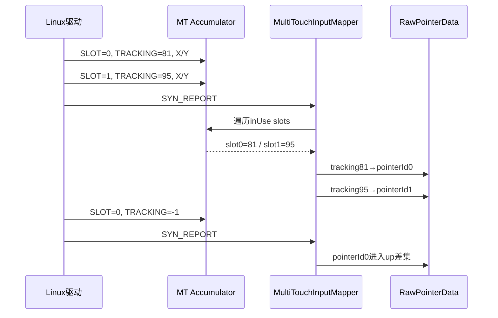
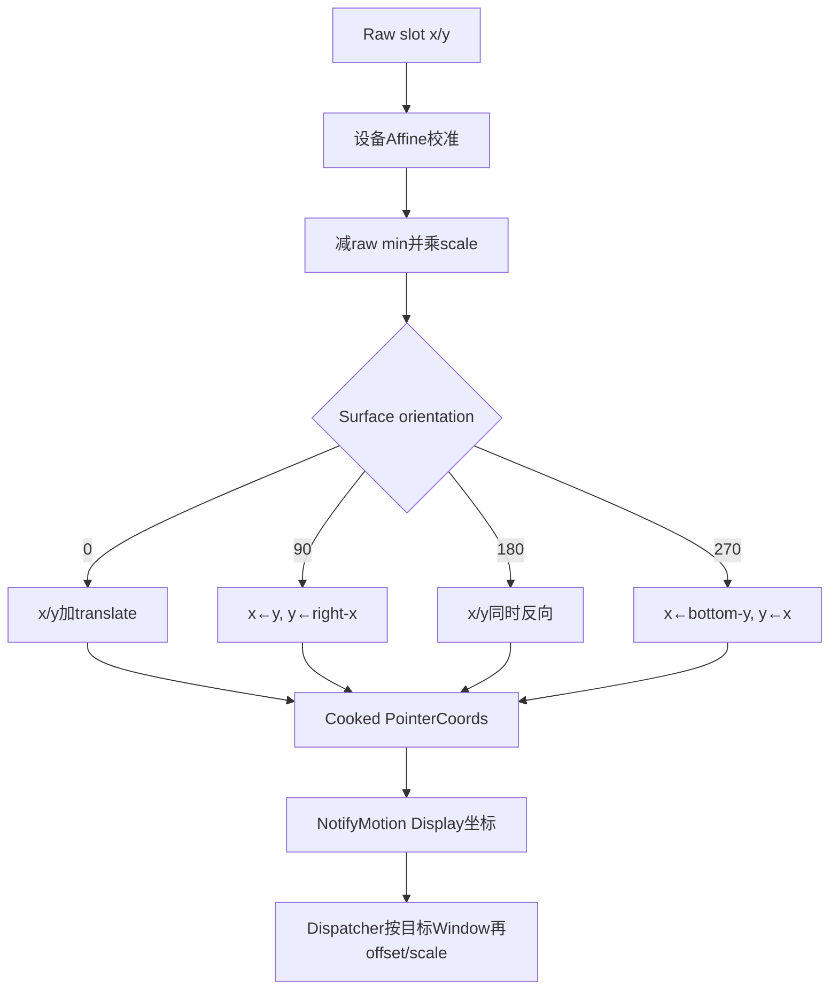

# 249 Android MultiTouchInputMapper、MT Slot与NotifyMotion坐标生产链

> 源码版本：Android 11 / `android-11.0.0_r48`  
> 学习方式：macOS只读核源，不编译、不运行AOSP

## 1. 本章要解决什么

第248章把触摸节点变成了MultiTouchInputMapper，本章继续追一帧触摸怎样被“做熟”：

```text
ABS_MT_SLOT与TRACKING_ID分别表示什么？
Linux slot、driver trackingId、Android pointerId、数组index有何区别？
Protocol A与Protocol B如何共存？
为什么必须等SYN_REPORT才形成RawState？
trackingId不可靠时Android怎样维持pointerId？
DisplayViewport、Affine、scale与rotation按什么顺序作用？
压力、尺寸、方向和hover怎样校准？
一帧同时有人抬起、移动和按下时，Action按什么顺序生成？
NotifyMotionArgs里哪些字段已经是最终Display坐标？
```

## 2. 一句总纲

```text
evdev ABS_MT事件按slot更新Accumulator
→ SYN_REPORT生成RawState
→ trackingId优先映射pointerId，失败则按同toolType最近距离匹配
→ raw state经过palm/virtual-key/外接笔门
→ Affine、校准、缩放与Display旋转形成cooked state
→ 对比last/current touchingIdBits生成UP、必要MOVE、DOWN
→ 按pointerId升序组装数组与action index
→ 构造NotifyMotionArgs交给QueuedInputListener
```

## 3. 全链路图

```mermaid
flowchart LR
    EV["EV_ABS / EV_KEY"] --> ACC["Button + MT Accumulators"]
    ACC --> SYN["EV_SYN / SYN_REPORT"]
    SYN --> RAW["RawState / RawPointerData"]
    RAW --> ID["trackingId或距离匹配pointerId"]
    ID --> GATE["virtual key / palm / stylus fusion"]
    GATE --> CAL["pressure size tilt orientation"]
    CAL --> XY["Affine → scale → rotation"]
    XY --> COOK["CookedPointerData"]
    COOK --> ACT["UP → MOVE → DOWN"]
    ACT --> ARG["NotifyMotionArgs"]
```



## 4. 源码地图

```text
frameworks/native/services/inputflinger/reader/mapper/MultiTouchInputMapper.cpp
frameworks/native/services/inputflinger/reader/mapper/MultiTouchInputMapper.h
frameworks/native/services/inputflinger/reader/mapper/TouchInputMapper.cpp
frameworks/native/services/inputflinger/reader/mapper/TouchInputMapper.h
frameworks/native/include/input/DisplayViewport.h
frameworks/native/services/inputflinger/InputListener.cpp
```

## 5. 本章主线限定

TouchInputMapper还能把触摸板翻译为鼠标指针和多指手势。本章以`DEVICE_MODE_DIRECT`触摸屏为主，pointer/navigation/unscaled模式只在差异处说明。

## 6. 什么是MT Slot

Linux Multi-touch Protocol B把每个并行接触点放在一个slot中。驱动先发`ABS_MT_SLOT=n`选择当前slot，后续POSITION、PRESSURE、TRACKING_ID等只修改这个slot。

## 7. slot不是手指身份

slot只是驱动状态表位置。手指离开后slot可被新手指复用，所以不能直接暴露成MotionEvent pointerId。

## 8. trackingId

`ABS_MT_TRACKING_ID >= 0`表示当前接触的驱动跟踪身份；Protocol B中负值表示该slot结束使用。同一接触生命周期内，合规驱动应保持它稳定。

## 9. Android pointerId

pointerId是当前手势中供应用跨MotionEvent追踪接触点的小整数。Mapper把trackingId映射为pointerId，但数值通常不相等。

## 10. pointer index

pointer index只是某一笔MotionEvent数组位置，并编码在POINTER_DOWN/UP action高位。它会随数组重排改变，跨事件追踪必须用pointerId。

## 11. 四种身份对照

```text
slot：驱动状态槽，可复用
trackingId：驱动对本次接触的身份
pointerId：Android手势内身份，通常0..31
pointer index：当前MotionEvent数组下标
```

## 12. Accumulator为何存在

一份硬件报告由多条`input_event`组成，X、Y、pressure可能分开发送。Accumulator先保存增量，直到同步边界才让Mapper读取一致快照。

## 13. Slot保存内容

包括inUse、position、touch/tool major/minor、orientation、trackingId、pressure、distance、tool type和若干have标志。缺minor时getter回退major。

## 14. slot上限

r48 Protocol B最多支持32个slot，驱动宣告更多时截到`MAX_SLOTS=32`并警告；实际输出还受`MAX_POINTERS`限制。

## 15. Protocol B检测

必须同时具备有效TRACKING_ID与SLOT axis，且slot min为0、max大于0。slotCount为`max+1`并受32上限裁剪。

## 16. Protocol A回退

不满足slot条件时分配MAX_POINTERS个临时slot，`usingSlotsProtocol=false`。每个`SYN_MT_REPORT`表示一个pointer描述结束，current slot加一。

## 17. Protocol A每帧清slot

它没有跨帧持久slot表，`finishSync()`在读取后`clearSlots(-1)`，下一帧从slot 0重新积累。

## 18. Protocol B保留slot

Protocol B的finishSync不清slot；驱动只报告变化字段，未变化字段沿用前一帧状态。

## 19. reset读不回完整slot

源码注明没有通用办法读取各slot完整初值。reset只能清本地slot，再查询当前`ABS_MT_SLOT`索引。

## 20. reset后的竞态

查询到的slot可能已不同于evdev缓冲最早事件的slot，极端情况下两个slot短暂混淆并出现跳点，直到下一条ABS_MT_SLOT纠正；但可避免stuck touch。

## 21. Slot更新规则

POSITION、尺寸、orientation、pressure、distance与tool type都标记inUse并更新当前slot；Protocol B负trackingId只清inUse，旧字段可留待后续覆盖。

## 22. Protocol A current slot

若current slot尚小于0，第一条EV_ABS置为0；每个SYN_MT_REPORT再递增。

## 23. 非法slot

current slot越界时字段更新被忽略，debug条件下警告，避免数组越界。

## 24. Mapper process顺序

`MultiTouchInputMapper::process()`先调用base处理button/scroll与最终SYN_REPORT，再让MT Accumulator处理RawEvent。对最终SYN_REPORT，Accumulator本就无操作；此前ABS与SYN_MT_REPORT均已进入Accumulator。

## 25. SYN_REPORT才生成RawState

`TouchInputMapper::process()`只在`EV_SYN/SYN_REPORT`调用`sync(when)`。此前轴值只是未封口增量，不能提前发MotionEvent。

## 26. slot与身份图



## 27. Pending RawState

每个SYN_REPORT在`mRawStatesPending`尾部新增并clear一个RawState，记录when。使用队列是因为外接笔融合可能暂缓一帧，同时后续触摸继续到达。

## 28. button与scroll同步

RawState合并TouchButtonAccumulator和CursorButtonAccumulator的buttonState，读取水平/垂直滚轮并finish scroll sync。

## 29. 遍历完整slot表

syncTouch遍历全部slot，把所有`isInUse()`项复制为当前触点集合，而不是只读取本帧改变的slot。

## 30. RawPointer字段

复制x/y、pressure、touch/tool major/minor、orientation、distance与toolType；本MT实现没有tilt X/Y时先写0。

## 31. toolType回退

优先用ABS_MT_TOOL_TYPE映射finger、pen、palm；未知时问TouchButtonAccumulator，仍未知则默认FINGER。

## 32. palm处理

PALM slot不作为普通pointer输出，并在尚未abort时调用`cancelTouch(when)`。abort会阻止其他仍按下手指重启手势，直到pointerCount归零。

## 33. hover判定

非mouse工具若button accumulator报告hover，或存在pressure axis且pressure<=0，则标为hover；touching与hovering ID bits分开保存。

## 34. trackingId优先

每轮先假设`mHavePointerIds=true`。非负trackingId先查上一轮相同tracking映射，找不到则分配首个空pointerId。

## 35. 数值不直传

驱动trackingId可为81、95，Android仍分配pointerId 0、1，保证受控ID空间。

## 36. mPointerIdBits

它记录当前映射占用的Android pointerId。sync结束替换为newPointerIdBits，离开的ID以后可以复用。

## 37. tracking映射失败

trackingId为负或无可分配ID会令`mHavePointerIds=false`并清整帧ID bits；base sync随后对全体pointer统一运行距离匹配。

## 38. driver contract

框架不能修复任意错误tracking序列。驱动不应让两个并行接触共享同一trackingId，映射以MT协议基本正确为前提。

## 39. 距离回退：无历史

上一帧0个pointer时，当前pointer按数组顺序分配id 0、1、2……。

## 40. 距离回退：单点

前后都只有1个pointer且toolType相同，直接沿用旧id，即使位置跳得较远。

## 41. 一般距离匹配

为当前×上一帧的同toolType组合计算raw坐标平方欧氏距离，建最小堆，按距离递增贪心选择未匹配current/last对并继承旧ID。

## 42. 为什么用raw坐标

匹配发生在cook与Display变换前；同一设备raw坐标足以比较距离，也避免显示旋转变化干扰身份。

## 43. toolType限制

finger只和finger匹配、stylus只和stylus匹配，但同toolType允许hover与touch转换时保持ID。

## 44. 贪心局限

这不是全局最优分配算法。多指高速交叉时可能交换身份，因此可靠trackingId优先级更高。

## 45. 未匹配点

当前仍未匹配的pointer取得usedIdBits中首个空ID，并写idToIndex及touching/hovering bits。

## 46. finishSync只在帧末收口一次

`syncTouch()`遍历所有slot、生成`RawPointerData`之后，只调用一次`mMultiTouchMotionAccumulator.finishSync()`。Protocol B在这里保留slot状态；Protocol A则清空临时slot，为下一个硬件帧重新从slot 0积累。它是帧边界收尾，不会再产生一份RawState。

## 47. Pending参照帧

队列只有一项时参照mCurrentRawState；已有多项时参照pending倒数第二项。即便外接笔融合延迟交付，身份仍按相邻硬件帧延续。

## 48. 外接笔融合可暂停

`assignExternalStylusId`需要等待Bluetooth stylus压力/按钮数据时停止drain并安排Reader timeout，所以SYN_REPORT不保证立即向下游发事件。

## 49. timeout恢复

超时后用保存状态合成带新stylus数据的cookAndDispatch，再继续处理。

## 50. disabled模式

DEVICE_MODE_DISABLED会clear current与pending RawState。轴缺失、关联Display/Viewport不可用等都可能令设备暂不可操作。

## 51. 设备类型

INPUT_PROP_DIRECT对应触摸屏，INPUT_PROP_POINTER对应触摸板；再结合idc与Reader配置决定模式。

## 52. 主要device mode

```text
DIRECT：绝对触摸屏，SOURCE_TOUCHSCREEN
POINTER：触摸板驱动光标/gesture，SOURCE_MOUSE等
NAVIGATION：SOURCE_TOUCH_NAVIGATION
UNSCALED：无关联显示的SOURCE_TOUCHPAD
DISABLED：不产出输入
```

## 53. DIRECT的Display关联

触摸屏需hasAssociatedDisplay并找到DisplayViewport。Viewport包含logical/physical区域、设备尺寸、orientation和displayId。

## 54. Viewport不只是宽高

它能描述面板physical crop到logical区域的映射；raw触控范围与logical显示范围未必简单等宽等高。

## 55. natural坐标

configureSurface先按Viewport orientation还原natural logical/physical/device尺寸，再计算raw surface与surface边界，逐点旋转留到cook。

## 56. X/Y scale

```text
xScale = rawSurfaceWidth / rawAxisWidth
yScale = rawSurfaceHeight / rawAxisHeight
```

`RawPointerAxes` 明确使用`maxValue - minValue + 1`计算rawAxisWidth/Height：最小值和最大值都是可取的设备单位，不能直接拿axis max作分母。例如0…4095一共是4096个单位，不是4095个。

## 57. translate

`mXTranslate=-mSurfaceLeft`、`mYTranslate=-mSurfaceTop`把面板范围映到目标logical surface。裁剪场景出现负坐标不必然是bug。

## 58. precision

基础precision为scale倒数；90/270度时oriented X/Y precision互换。它是设备单位映射粒度，不是准确率百分比。

## 59. Affine在前

逐点顺序是raw x/y → `mAffineTransform.applyTo` → `rotateAndScale` → cooked X/Y。

## 60. orientation 0公式

```text
x = (rawX - rawMinX) * xScale + xTranslate
y = (rawY - rawMinY) * yScale + yTranslate
```

## 61. 90度公式

```text
outX = yScaled + yTranslate
outY = surfaceRight - xScaled
```

Mapper已把点旋转到Display坐标，不等待View再旋转。

## 62. 180与270度

180同时反向X/Y；270交换轴并反向新的X。`orientationAware=false`则把surface orientation固定为0。

## 63. 坐标变换图



## 64. raw与Window local

DIRECT坐标已面向关联Display，但还不是目标Window局部坐标。Dispatcher命中InputTarget后才附加frame offset和window scale，客户端才建立raw/local两种视图。

## 65. surface变化要reset

Viewport或device mode变化时重算scale/range、bump generation并设置resetNeeded。非首次配置会发NotifyDeviceReset，避免一条gesture跨两套坐标系。

## 66. size校准

touch/tool major/minor可按GEOMETRIC、DIAMETER、BOX或AREA解释，再应用scale/bias。AREA取平方根，DIAMETER令minor等于major。

## 67. sizeIsSummed

若硬件报告多触点合计面积，配置为summed且touching count大于1时，源码按触点数分摊major/minor/size。

## 68. pressure

PHYSICAL或AMPLITUDE模式使用配置scale，没有显式scale时可按raw max归一化；没有有效pressure校准时hover输出0、接触输出1。

## 69. orientation校准

INTERPOLATED把raw值线性映射到约`[-π/2, π/2]`；VECTOR解码两个4-bit有符号分量求角度并调整major/minor，Display旋转再修正角度范围。

## 70. tilt与distance

同时有tiltX/Y时换算弧度并求orientation/tilt；distance按配置比例输出。缺失或配置NONE时通常为0或不宣告range。

## 71. coverage box

COVERAGE_BOX把toolMajor/toolMinor高低16位解释为raw边界，旋转后写GENERIC_1..4；普通模式写TOOL_MAJOR/TOOL_MINOR。

## 72. Cooked数据保持ID

cook改变坐标和轴语义，不改变已分配pointerId。PointerProperties保存id/toolType，PointerCoords保存X/Y、pressure、size、方向等。

## 73. virtual key门

`consumeRawTouches()`可把物理显示区外的内核虚拟键触摸转为Key。命中后清RawPointerData，不会再同时生成一套屏幕Motion。

## 74. initialDown与WAKE

上一RawState无pointer而当前有pointer视为initialDown；新button press也触发策略判断。配置`touch.wake`时加入POLICY_FLAG_WAKE。

## 75. showTouches

DIRECT模式开启showTouches时更新PointerController spots用于系统小圆点可视化，随后仍按正常dispatchTouches；它不是另一个App输入目标。

## 76. last/current状态

每次cook结束把current复制到last。下一帧Action由两份Cooked touchingIdBits集合差得出，而非Linux驱动直接发送Android Action。

## 77. ID集合相同

current与last IDs完全相等且非空时直接发ACTION_MOVE。Mapper不在这里批处理MOVE，后续listener/transport负责batch机会。

## 78. 集合变化公式

```text
up = last - current
down = current - last
move = last ∩ current
dispatched = last
```

一份SYN_REPORT可同时包含抬起、存活点移动与新点按下。

## 79. 先发UP

按pointerId升序发POINTER_UP并从dispatched删除。事件基础数组来自last，但先把存活pointer新坐标更新进去，使UP也携带同一时刻其他点位置。

## 80. 中间MOVE

存活pointer坐标/properties或buttonState变化时，UP之后补MOVE。应用通常在MOVE逻辑消费移动，不能只依赖UP附带的新坐标。

## 81. 最后发DOWN

新pointer按ID升序加入dispatched并发POINTER_DOWN，所以同一硬件帧固定展开为：所有UP → 可选MOVE → 所有DOWN。

## 82. downTime

加入新ID后若dispatched count为1，设置`mDownTime=when`。后续MOVE/POINTER事件沿用到最终UP。

## 83. DOWN/UP归一化

dispatchMotion发现changedId存在且输出pointerCount为1时，把POINTER_DOWN改DOWN、POINTER_UP改UP，满足Android首DOWN/末UP协议。

## 84. 数组排序与action index

dispatchMotion从BitSet32不断取最小ID，按pointerId升序复制数组；遇到changedId时把当前输出位置编码进action高位。

## 85. index会变化

ID0抬起后，ID1可能从index1变index0，但ID1不变。业务必须每笔使用`findPointerIndex(pointerId)`。

## 86. hover链

无touching但有hovering时首次发HOVER_ENTER、随后HOVER_MOVE；离开hover或开始touch前发HOVER_EXIT。

## 87. button与touch顺序

DIRECT非abort路径依次：BUTTON_RELEASE → HOVER_EXIT → touch actions → HOVER_ENTER/MOVE → BUTTON_PRESS。

## 88. pointerCount

dispatchMotion只复制idBits中的pointer。POINTER_UP仍包含抬起点，删除动作后的下一事件才不再包含它。

## 89. NotifyMotion身份

参数包括Reader event id、eventTime、逻辑deviceId、source、displayId与policyFlags。deviceId不是eventHub node id或slot。

## 90. NotifyMotion动作

包含action/actionButton、flags、meta/button state、edgeFlags和downTime。Dispatcher之后仍可因split和target mode生成每目标resolved action。

## 91. classification

Mapper写`MotionClassification::NONE`；启用InputClassifier时可在Mapper之后、Dispatcher之前补deep press等分类。

## 92. cursor position

仅POINTER模式从PointerController读取cursor X/Y；DIRECT通常使用INVALID_CURSOR_POSITION。

## 93. displayId

使用`getAssociatedDisplayId().value_or(ADISPLAY_ID_NONE)`。DIRECT通常来自Viewport，无关联模式不能伪装成默认Display。

## 94. TouchVideoFrame

Mapper取得关联视频帧，按surface orientation旋转后移入NotifyMotionArgs；普通App MotionEvent不直接暴露这些帧。

## 95. Args生命周期

dispatchMotion在栈上构造Args并同步调用listener，QueuedInputListener深拷贝后才允许跨Reader锁区保存。

## 96. Mapper完成点

NotifyMotion形成只表示Reader已生成Android输入事实，不表示Dispatcher已命中窗口、Channel已发送或App已处理。

## 97. 常见错误一：slot就是pointerId

错误。slot可复用；pointerId由Android映射。

## 98. 常见错误二：trackingId直接传App

错误。trackingId只是映射键，App看到受控pointerId。

## 99. 常见错误三：每条ABS都发Motion

错误。轴增量等SYN_REPORT封口才形成RawState。

## 100. macOS只读练习一：Protocol B slot

```bash
cd /Users/ninebot/androidSource
sed -n '25,220p' frameworks/native/services/inputflinger/reader/mapper/MultiTouchInputMapper.cpp
```

用slot0 tracking=81、slot1 tracking=95、随后slot0 tracking=-1，写出各SYN_REPORT后的inUse与ID集合。

## 101. macOS只读练习二：pointerId回退

```bash
cd /Users/ninebot/androidSource
sed -n '220,330p' frameworks/native/services/inputflinger/reader/mapper/MultiTouchInputMapper.cpp
sed -n '3680,3875p' frameworks/native/services/inputflinger/reader/mapper/TouchInputMapper.cpp
```

比较tracking映射、单点快速路径和多点距离贪心，说明slot/index/id如何变化。

## 102. macOS只读练习三：坐标旋转

```bash
cd /Users/ninebot/androidSource
sed -n '612,820p' frameworks/native/services/inputflinger/reader/mapper/TouchInputMapper.cpp
sed -n '2140,2255p' frameworks/native/services/inputflinger/reader/mapper/TouchInputMapper.cpp
sed -n '3620,3655p' frameworks/native/services/inputflinger/reader/mapper/TouchInputMapper.cpp
```

自选raw min/max与Viewport，分别手算0/90度的Affine、scale、translate和最终X/Y。

## 103. macOS只读练习四：展开动作

```bash
cd /Users/ninebot/androidSource
sed -n '1500,1625p' frameworks/native/services/inputflinger/reader/mapper/TouchInputMapper.cpp
sed -n '1850,1975p' frameworks/native/services/inputflinger/reader/mapper/TouchInputMapper.cpp
sed -n '3530,3595p' frameworks/native/services/inputflinger/reader/mapper/TouchInputMapper.cpp
```

假设last IDs={0,2}、current IDs={1,2}且ID2移动，列出UP、MOVE、DOWN及每笔数组/action index。

## 104. 常见错误四：Display旋转由View完成

错误。DIRECT点在Mapper内已转成Display坐标，View接收的是后续目标窗口坐标视图。

## 105. 常见错误五：一个SYN_REPORT只产一笔Motion

错误。一帧可展开多个UP、MOVE、多个DOWN及hover/button动作。

## 106. 常见错误六：MOVE只在坐标变化时发

ID集合相等且非空时dispatchTouches直接发MOVE，后续层可做batch。

## 107. 常见错误七：pointer index稳定

错误。数组随增删重组，只有pointerId承担跟踪身份。

## 108. 复读后最易混点

```text
slot不是手指ID
Protocol A每帧用SYN_MT_REPORT推进临时slot
trackingId优先但不直接暴露
距离匹配在raw坐标且是贪心
SYN_REPORT可因外接笔融合延迟交付
Affine先于scale/rotation
一帧可展开UP→MOVE→DOWN多笔
Display坐标仍不是Window local坐标
```

## 109. 复读修订一：process顺序

base process在最终SYN_REPORT先触发sync，随后Accumulator处理该事件；Accumulator只特殊处理SYN_MT_REPORT，所以此前MT数据没有漏掉。

## 110. 复读修订二：palm

palm不是只忽略一个点，而是CANCEL当前流并保持abort；其他仍按下手指不会立即形成新gesture，直到pointerCount归零。

## 111. 复读修订三：整帧身份策略

任何slot无法取得合法ID时清整帧bits，base为全体统一距离匹配，避免半tracking、半猜测。

## 112. 复读修订四：UP的数组

POINTER_UP基础数据来自last以保留抬起点，但源码先把交集pointer的新坐标复制进去，因此UP里其他手指可出现新位置。

## 113. 复读修订五：finishSync调用次数

二次对照`android-11.0.0_r48`本地源码后确认：`MultiTouchInputMapper::syncTouch()`末尾只有一次`finishSync()`。它对Protocol A清临时slot，对Protocol B为no-op；不存在“两次finishSync对应两个阶段”。

## 114. Android 11 r48版本边界

```text
Protocol B slot上限32
检测要求trackingId+slot有效、slot min=0且max>0
Protocol A用SYN_MT_REPORT并在finishSync清临时slot
reset只能读current slot，无法恢复完整slot表
palm触发整条当前gesture CANCEL
tracking失败后整帧回退同toolType raw距离贪心
syncTouch帧末只调用一次finishSync
坐标顺序Affine→scale/translate→rotation
同帧动作先UP、再必要MOVE、最后DOWN
classification初值NONE，可由Classifier补充
```

## 115. 本章检查清单

```text
[ ] 区分slot/trackingId/pointerId/index
[ ] 解释Protocol A/B
[ ] 手算trackingId映射
[ ] 说明距离算法与局限
[ ] 解释palm CANCEL
[ ] 画出Raw到Cooked
[ ] 计算Affine/scale/rotation
[ ] 用ID差展开Action
[ ] 解释DOWN/UP归一化
[ ] 列出NotifyMotion字段与完成边界
```

## 116. 本章小结

```text
slot保存驱动增量
→ SYN_REPORT形成快照
→ tracking或距离建立pointerId
→ 校准与Viewport变成Display点
→ ID集合差生成Android动作
→ ID升序数组决定action index
→ NotifyMotion交给Classifier/Dispatcher
```

多点触摸转换同时解决状态封口、身份连续、坐标标定和动作协议。任一层出错，都可能表现为跳点、串指、坐标偏移或手势永不结束。

## 117. 下一章预告

下一章整理TouchInputMapper剩余分支：idc模式与校准、Viewport选择、虚拟键、触摸板pointer gesture、外接Stylus融合和重新配置reset边界。
