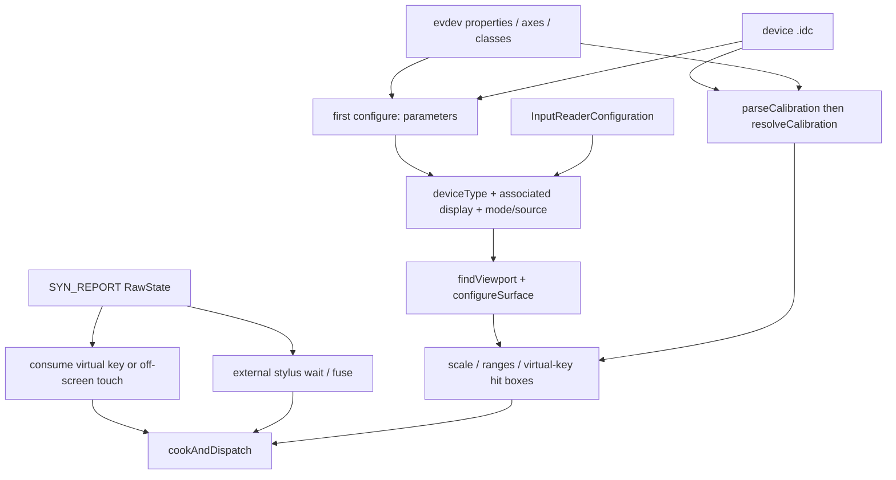
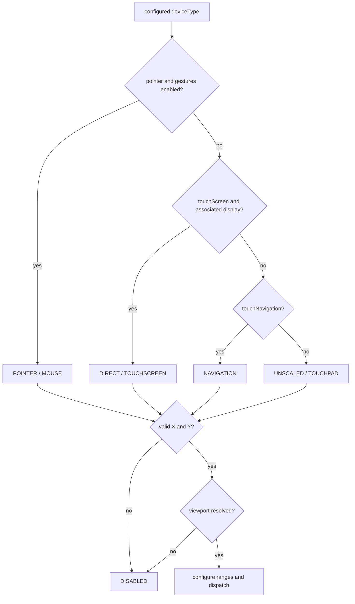
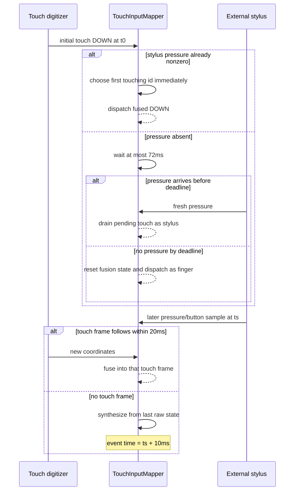

# 250 Android TouchInputMapper模式、校准、虚拟键与外接Stylus融合链

> 源码版本：Android 11 / `android-11.0.0_r48`  
> 学习方式：macOS只读核源，不编译、不运行AOSP

## 1. 本章要解决什么

第249章追了MT slot如何变成`NotifyMotionArgs`。这一章不再重复主动作链，而是补齐决定“这块触摸设备究竟怎样工作”的控制面和两条旁路：

```text
.idc和内核能力如何决定DIRECT/POINTER/UNSCALED/NAVIGATION？
DisplayViewport按port、pointer display、uniqueId、internal/external什么顺序选？
校准参数为什么要先parse再resolve？
size、pressure、orientation、tilt、distance和coverage怎样影响输出？
sysfs virtualkeys如何变成KeyEvent？
为什么从虚拟键滑回屏幕会重新开始Motion DOWN？
只报压力/按键而不报X/Y的外接笔，怎样与触摸屏坐标融合？
72ms、20ms和10ms三个时间常量分别解决什么？
```

## 2. 一句总纲

```text
设备能力 + 首次.idc参数
→ 选deviceType、关联Display和mode/source
→ 选Viewport并解析校准/range
→ 每个SYN_REPORT先处理virtual key与external stylus旁路
→ 再进入普通cook/dispatch
```

## 3. 总体分层图



## 4. 源码地图

```text
frameworks/native/services/inputflinger/reader/mapper/TouchInputMapper.cpp
frameworks/native/services/inputflinger/reader/mapper/TouchInputMapper.h
frameworks/native/services/inputflinger/reader/mapper/ExternalStylusInputMapper.cpp
frameworks/native/services/inputflinger/reader/mapper/ExternalStylusInputMapper.h
frameworks/native/services/inputflinger/reader/InputReader.cpp
frameworks/native/services/inputflinger/reader/InputDevice.cpp
frameworks/native/services/inputflinger/reader/EventHub.cpp
frameworks/native/libs/input/VirtualKeyMap.cpp
frameworks/native/include/input/VirtualKeyMap.h
frameworks/native/include/input/DisplayViewport.h
frameworks/native/services/inputflinger/tests/InputReader_test.cpp
```

## 5. 本章边界

触控板的九态pointer gesture已在第184章详述，第249章已详述MT帧、坐标和Action生成。本章只从mode选择解释为什么会进入pointer gesture，把篇幅留给配置、校准、virtual key和external stylus。

## 6. 四种输入事实不要混

```text
内核能力：INPUT_PROP_DIRECT/POINTER、ABS/REL轴、BTN能力
设备静态配置：.idc PropertyMap
Reader运行配置：DisplayViewport、pointerGesturesEnabled、showTouches等
运行帧状态：RawState、VirtualKeyState、StylusState
```

前三类决定怎样解读第四类。

## 7. 首次configure的特殊性

`TouchInputMapper::configure()`对`changes==0`的首次配置才执行：

```cpp
if (!changes) {
    configureParameters();
    mCursorScrollAccumulator.configure(getDeviceContext());
    mTouchButtonAccumulator.configure(getDeviceContext());
    configureRawPointerAxes();
    parseCalibration();
    resolveCalibration();
}
```

这些被当作设备开启期的静态能力与参数。

## 8. `.idc`不是每次刷新都重读

`InputDevice::configure()`也只在首次把各subdevice的PropertyMap合并到`mConfiguration`。因此仅修改磁盘上`.idc`文本并发一个Display change，不会让旧Mapper重新parse这些静态字段；通常需要设备reopen/重建或下次启动。

## 9. 动态变化有独立分支

```text
CHANGE_TOUCH_AFFINE_TRANSFORMATION → updateAffineTransformation
CHANGE_POINTER_SPEED → 速度曲线
DISPLAY_INFO / POINTER_GESTURE_ENABLEMENT / SHOW_TOUCHES /
EXTERNAL_STYLUS_PRESENCE → configureSurface
```

动态刷新不等于重做所有首次解析。

## 10. gestureMode默认值

`INPUT_PROP_SEMI_MT`表示设备不能稳定分辨每个多指位置，默认选`single-touch`展示；其他设备默认`multi-touch`。`.idc` `touch.gestureMode=single-touch|multi-touch|default`可覆盖。

## 11. deviceType的能力推导顺序

```text
INPUT_PROP_DIRECT                      → touchScreen
else INPUT_PROP_POINTER               → pointer
else have REL_X or REL_Y               → touchPad
else                                  → pointer
```

最后的默认pointer是对未标注触控板的兼容选择，不表示它真有鼠标相对轴。

## 12. `.idc` deviceType优先

`touch.deviceType` 可写`touchScreen`、`touchPad`、`touchNavigation`、`pointer`或`default`。合法非default值覆盖能力推导；非法字符串只记warning，保留先前推导。

## 13. orientationAware默认

只有`touchScreen`默认`orientationAware=true`，但`touch.orientationAware` 可覆盖。它决定是否把Viewport orientation应用到输出点，也会影响是否需要关联Display。

## 14. hasAssociatedDisplay的默认

以下任一成立就设为true：

```text
orientationAware
deviceType == touchScreen
deviceType == pointer
InputDevice通过input port关联到display port
```

`touchPad`/`touchNavigation`通常使用非Display viewport，但port关联可改变这一点。

## 15. external与unique display

touchScreen的`associatedDisplayIsExternal`默认来自设备是否external；`touch.displayId`可在`.idc`写Display uniqueId。这个字段只在deviceType为touchScreen时读入。

## 16. wake参数

外接触摸设备默认`wake=true`，内置屏默认false，避免口袋误触唤醒。`touch.wake` 可覆盖；它只在initial down或新button press时加`POLICY_FLAG_WAKE`，不是Mapper直接点亮屏幕。

## 17. mode选择不等于deviceType同名映射

```text
deviceType=pointer && pointerGesturesEnabled → DEVICE_MODE_POINTER
deviceType=touchScreen && hasAssociatedDisplay → DEVICE_MODE_DIRECT
deviceType=touchNavigation                  → DEVICE_MODE_NAVIGATION
其他                                      → DEVICE_MODE_UNSCALED
```

例如pointer设备在全局pointer gesture关闭时会落到UNSCALED，而不是POINTER。

## 18. DIRECT mode

用`AINPUT_SOURCE_TOUCHSCREEN`，并根据集成stylus与external stylus能力附加source bits。坐标绑定Viewport，产出的Motion直接参与Display窗口命中。

## 19. POINTER mode

基础source为`AINPUT_SOURCE_MOUSE`；原始手指不是作为触摸屏指针下发，而是驱动PointerController与gesture detector。集成笔可追加STYLUS source并取得最高pointer usage优先级。

## 20. NAVIGATION mode

使用`AINPUT_SOURCE_TOUCH_NAVIGATION`，不与可见屏幕做绝对坐标对齐，用于触摸导航类设备。它不自动进入鼠标pointer gesture。

## 21. UNSCALED mode

使用`AINPUT_SOURCE_TOUCHPAD`，保留触控板类坐标语义。普通未关联Display的设备会构造与raw X/Y大小相同的non-display viewport；若InputDevice通过port显式关联Display，`findViewport()`仍可返回真实Viewport，但configureSurface的UNSCALED分支仍以raw尺寸配置输出，不把它变成DIRECT触屏。

## 22. DISABLED mode

X或Y轴无效，或需要关联Display却找不到Viewport时，Mapper设为DISABLED。`processRawTouches()`会清`mCurrentRawState`和pending队列，而不是继续缓存到Display恢复。

## 23. source是运行结果

`InputDevice::configure()`每次先把`mSources=0`，再OR所有Mapper的`getSources()`。因此InputDevice source是当前各Mapper mode/能力的聚合，不是EventHub classes的原样拷贝。

## 24. mode决策图



## 25. Viewport优先级一：Display port

只要`hasAssociatedDisplay` 且InputDevice已由input port匹配display port，`findViewport()`立即返回`getAssociatedViewport()`的结果。若port存在但没找到Viewport，上层InputDevice还会把设备disable；这里不会改用内置屏。

## 26. Viewport优先级二：pointer display

POINTER mode优先按`mConfig.defaultPointerDisplayId`找窗口管理建议的pointer display。如果该id找不到，源码记warning后还会继续尝试uniqueId或display type，不是立即disabled。

## 27. Viewport优先级三：uniqueId

`.idc` `touch.displayId`非空时，直接返回`getDisplayViewportByUniqueId()`。注意：这一分支查找失败就返回nullopt，不再回退internal/external type。精确绑定失败应暴露配置错误。

## 28. Viewport优先级四：display type

外接touchScreen尝试EXTERNAL，找不到时warning并回退INTERNAL；预期INTERNAL而找不到时没有反向回退EXTERNAL。这个回退是非对称的。

## 29. 无关联Display的Viewport

`hasAssociatedDisplay=false`时不做窗口管理查找，而是用`rawWidth/rawHeight`构造non-display viewport。所以UNSCALED/NAVIGATION不会仅因物理Display还未就绪就disabled。

## 30. configureSurface的两道硬门

```cpp
if (!mRawPointerAxes.x.valid || !mRawPointerAxes.y.valid) {
    mDeviceMode = DEVICE_MODE_DISABLED;
    return;
}
std::optional<DisplayViewport> newViewport = findViewport();
if (!newViewport) {
    mDeviceMode = DEVICE_MODE_DISABLED;
    return;
}
```

deviceType推导成功不代表设备一定可操作。

## 31. PointerController何时建立

POINTER mode需要PointerController驱动鼠标；DIRECT只在`showTouches=true`时需要它画调试小圆点。其他情况会clear强引用，不是每块触摸设备都永久持有鼠标控制器。

## 32. 什么时候重算Surface

只有`viewportChanged || deviceModeChanged`时，大段重算才执行：X/Y scale、translation、motion ranges、virtual key hit boxes、各类校准scale和pointer gesture参数。

## 33. 重算后的协议边界

这一分支设`*outResetNeeded=true`并`bumpGeneration()`。非首次configure时上层还发`NotifyDeviceResetArgs`，令Dispatcher/App不要让一条手势横跨新旧坐标系或mode。

## 34. POINTER重算先abort usage

POINTER mode的参数变更时，源码先`abortPointerUsage()`，再设resetNeeded。这会按当前usage合成gesture/stylus/mouse的结束事件，避免只更改速度/缩放因子却保留半条旧gesture。

## 35. external stylus presence的r48细节

`CHANGE_EXTERNAL_STYLUS_PRESENCE`会调`configureSurface()`并重算`mSource`中是否有`AINPUT_SOURCE_BLUETOOTH_STYLUS`。但大段重算的门仍只是viewport/mode变化；若两者都没变，该Touch Mapper不会仅因source bit变化而自己bump generation或发reset。外设add/remove本身会使Reader全局设备列表generation变化。

## 36. 校准为什么分parse和resolve

parse只把`.idc`字符串转成enum/数值，保留`DEFAULT`；resolve再结合实际axis是否valid选默认，并把“配了但硬件无轴”降为NONE。这避免运行时进入需要轴却无轴的分支。

## 37. size可配模式

```text
default / none / geometric / diameter / box / area
touch.size.scale
touch.size.bias
touch.size.isSummed
```

`scale`/`bias`作用在touch/tool major/minor上，不是所有坐标轴的全局缩放。

## 38. size默认resolve

只要touchMajor或toolMajor任一valid，DEFAULT解析为GEOMETRIC；两者都无效则无论`.idc`是否试图配其他size mode，都强制为NONE。

## 39. major/minor轴回退

touch和tool major都有时各用各的；只有一组时，另一组复用它。minor轴缺失时用对应major代替，所以不会凭空保留旧minor。

## 40. GEOMETRIC

major/minor乘`mGeometricScale = avg(mXScale,mYScale)`，把raw长度粗略换成Display像素尺寸。当X/Y像素密度不等时这是平均近似，不是严格的椭圆仿射。

## 41. DIAMETER

不乘geometric scale，只把touchMinor置为touchMajor、toolMinor置为toolMajor，把设备值解释为圆直径形式。之后仍会应用size scale/bias。

## 42. AREA

对major取`sqrt`并把minor设为同值，把面积型读数换成类似线性尺寸。负值直接0；它不保留原始长宽比。

## 43. BOX

SIZE_CALIBRATION_BOX在普size分支没有额外几何变换，major/minor保持设备语义再用scale/bias。它与后面`touch.coverage.calibration=box`不是同一个enum，不要因为都叫box就混为一条路。

## 44. size scale/bias的clamp

`applySizeScaleAndBias()`顺序是先乘scale、再加bias、最后小于0则clamp到0。源码不把上限clamp到1或屏幕对角线，所以配置错误可导致很大的major/minor。

## 45. sizeIsSummed

若显式配true且touching pointer数大于1，major/minor和size都除以touching count。它是为“硬件报多指总量”的特殊设备准备，hover pointer不算在该count里。

## 46. `AXIS_SIZE`的单独归一化

`size`先取major或major/minor平均，最后乘`mSizeScale`；默认scale为`1 / touchMajor.max`，没有touchMajor时才用toolMajor.max。`.idc` `touch.size.scale/bias`并不用于`AXIS_SIZE`这个归一化值。

## 47. pressure parse与resolve

```text
default / none / physical / amplitude
touch.pressure.scale
```

有pressure axis时DEFAULT→PHYSICAL；无轴时强制NONE。PHYSICAL与AMPLITUDE在r48的cook公式都是`rawPressure * mPressureScale`，区别主要是语义和配置意图。

## 48. pressure默认scale

没有显式`touch.pressure.scale`且raw max非0时，用`1/rawMax`。显式scale时，MotionRange pressure max也设为`scale * rawMax`，可以大于1；源码不在cook时clamp压力。

这条Touch pressure公式也是`raw * scale`，不减raw axis min。所以默认归一化同样默认pressure轴从0开始；非0 min的特殊设备应用`.idc` scale与驱动合同仔细校验，而不要假设Mapper会自动减min。

## 49. pressure NONE不等于永返0

校准为NONE时，hover输出0，touching输出1。这给没有压感轴的普通触屏提供二值接触语义，不是把`AXIS_PRESSURE`从InputDeviceInfo中完全删除。

## 50. orientation parse与resolve

```text
default / none / interpolated / vector
```

有raw orientation axis时DEFAULT→INTERPOLATED，无轴时NONE。但若tiltX与tiltY两轴都valid，后面会直接由tilt计算orientation，优先于raw orientation calibration。

## 51. INTERPOLATED

raw max大于0时scale为`pi/2 / max`；否则raw min小于0时为`-pi/2 / min`。cook使用`raw * scale`，MotionRange宣告约`[-pi/2, pi/2]`。它是线性假设，不会自动知道厂商的非线性角度编码。

## 52. VECTOR

把raw orientation的高、低4 bit分别做有符号nybble，用`atan2(c1,c2)*0.5`算方向；向量长度还会放大major、缩小minor。这是“方向+置信度影响长宽”的编码，不是普通16-bit角度。

## 53. tilt成对才启用

只有tiltX和tiltY都valid才`mHaveTilt=true`。两轴先减各自min/max中心，按“度→弧度”比例转换，然后用三角函数得tilt和orientation；只有一根tilt轴不会半启用。

## 54. distance

有distance axis时DEFAULT→SCALED，默认`mDistanceScale=1`，显式`touch.distance.scale`才改变。无轴则NONE。MotionRange的min/max/fuzz都乘这个scale，resolution仍写0。

## 55. coverage box

`touch.coverage.calibration=box`把toolMinor高/低16 bit解为left/right，toolMajor高/低16 bit解为top/bottom，最后写入`GENERIC_1..4`。启用coverage box时不再写普通`TOOL_MAJOR/MINOR`。

## 56. coverage的一个r48 TODO

X/Y会先应用policy提供的Affine transform，但coverage raw box之前留有`TODO: Adjust coverage coords?`，只做surface rotation/scale。因此有非单位Affine校准时，coverage box和点X/Y可能不完全一致；不应文档化为“已保证一致”。

## 57. MotionRange是对外合同

Mapper把X/Y/pressure始终加入非disabled设备信息，size/orientation/distance/tilt按have标志附加，coverage box再加GENERIC_1..4。应用用`InputDevice.getMotionRange()`看到的是解析后合同，不是evdev raw axis的原样数值。

## 58. 校准顺序小结

```text
PropertyMap字符串
→ parse enum/scale/bias/isSummed
→ resolve against axis validity
→ configureSurface计算scale与public ranges
→ cookPointerData对每个pointer实施
→ surface orientation修正轴与角度
```

## 59. virtual key不在`.idc`里定义

r48从`/sys/board_properties/virtualkeys.<canonical-device-name>`读内核/板级暴露的virtual key map。`.idc`控制Touch Mapper参数，不是virtual key矩形文件。

## 60. sysfs文件何时加载

EventHub `openDeviceLocked()`推导出TOUCH class后尝试`loadVirtualKeyMapLocked()`。文件可读且parse成功时，设备还会增加KEYBOARD class，以便继续装载key layout把virtual scanCode映射为Android keyCode。

## 61. virtual key文件格式

```text
0x01:<scanCode>:<centerX>:<centerY>:<width>:<height>
```

后五个字段是冒号分隔整数；多个键可同行或跨行，`#`开始注释。不是`0x01`的type或字段缺失会使整张map加载失败，不是只忽略单条。

## 62. 定义坐标与命中坐标

`VirtualKeyDefinition`的center/width/height以display coordinates表达；`configureVirtualKeys()`根据`raw touch width / raw surface width`比例换算为raw touch hit box，再加raw X/Y min。运行命中在Affine/Display旋转之前的raw pointer上完成。

## 63. scanCode必须能映射

`configureVirtualKeys()`对每个definition调`mapKey(scanCode,...)`。映射失败就warning并drop该键；它不会把scanCode当keyCode直传给App。

## 64. hit box边界是包含的

`isHit()`使用`x >= left && x <= right && y >= top && y <= bottom`。因此right/bottom是可命中边界，与常见的Android `Rect` right/bottom排他语义不同，手算不要默认减1。

`findVirtualKeyHit()`按vector顺序返回第一个命中键，重叠hit box没有面积最小或距离中心最近的二次排序。

## 65. virtual key只在屏外initial down识别

`consumeRawTouches()`先要求last touching为空、current非空，再检查第一个pointer不在surface内。只有“一条新stroke从屏外开始”才查virtual key；手指从屏内滑到键区不会半路转成Key DOWN。

## 66. 必须恰好一指

屏外initial down只在touching count等于1时查hit box。多指同时从屏外开始不会挑一根手指当virtual key；只要当前帧仍被判定为off-screen initial state，该帧就被消费。若之后所有点进入surface，仍可从新Motion DOWN开始，所以不能笼统说“物理stroke后半永久丢失”。

## 67. 命中后的CurrentVirtualKeyState

```text
down=true
downTime=initial frame time
keyCode/scanCode=映射结果
ignored=InputReader全局quiet-time决策
```

即使ignored=true也保留down状态，以便持续消费这条物理stroke，只是不对外发Key DOWN/UP。

## 68. 按住键区

当前仍只有1个pointer且命中同一keyCode时直接返回true。caller会清RawPointerData，所以普通Motion链持续看不到这根手指。

源码比较的是`virtualKey->keyCode == mCurrentVirtualKey.keyCode`，不是scanCode或VirtualKey对象地址。如两个重叠/相邻定义映射成同一Android keyCode，滑到另一个仍会被视为按住原键。

## 69. 正常抬起

current touching变空时，清`down`；非ignored则发Key UP，flags为`FROM_SYSTEM | VIRTUAL_HARD_KEY`，不加CANCELED。KeyEvent downTime仍是初次命中时间。

## 70. 滑出键区或第二指加入

清`down`，非ignored则发带`AKEY_EVENT_FLAG_CANCELED`的Key UP，但本帧不立即return true。源码继续向下跑，让滑回屏幕的触摸可以重新进入Motion链。

## 71. 为什么滑回屏幕能产生新DOWN

之前每一帧virtual-key touch都被caller清空后才复制到`mLastRawState`，所以last仍是“无pointer”。手指滑到surface内的当帧不再被消费，cook看到last空/current非空，自然生成新Motion DOWN。它不需要伪造新Linux trackingId。

## 72. 屏外但不命中键

初始点在surface外却没命中virtual key时，函数仍返回true，丢掉当前帧RawPointerData。这不是把超出坐标clamp到屏幕边缘；它在手指停留屏外时继续消费，但之后进入surface仍可重开一条Motion流。

## 73. quiet time是Reader全局的

正常屏内touch到达`consumeRawTouches()`底部时，若`virtualKeyQuietTime>0`，调用`disableVirtualKeysUntil(when + quietTime)`。时间戳保存在`InputReader::mDisableVirtualKeysTimeout`，不是每个Touch Mapper一份；所以一块屏内触摸可短暂抑制另一块设备的virtual key。

## 74. ignored不是命中失败

quiet time内命中时，`shouldDropVirtualKey()`返回true，Mapper仍记录该键正按下并消费stroke，但不发KeyEvent。这是“识别到但抑制”，不是“根本没找到hit box”。

## 75. KeyEvent的source与display

`dispatchVirtualKey()`构造`NotifyKeyArgs`，source固定为`AINPUT_SOURCE_KEYBOARD`，displayId来自当前Viewport，policy flags额外OR `POLICY_FLAG_VIRTUAL`。它不是source=TOUCHSCREEN的特殊MotionEvent。

## 76. virtual key状态查询

`getKeyCodeState()`/`getScanCodeState()`对当前按下的virtual key返`AKEY_STATE_VIRTUAL`，对存在但未按的返UP，其他UNKNOWN。`markSupportedKeyCodes()`也会把virtual keys标为supported；这些实现没用`sourceMask`做进一步过滤。

## 77. reset如何收口virtual key

`TouchInputMapper::reset()`直接把`mCurrentVirtualKey.down=false`，不在该函数内单独发virtual Key UP。但`InputDevice::reset()`在所有Mapper reset后发设备级`NotifyDeviceReset`，Dispatcher以设备协议边界清理旧输入状态。

## 78. virtual key状态机文本版

```text
IDLE
  └─屏外单指initial down命中→ DOWN_TRACKED
       ├─quiet期：ignored=true，不发Key
       ├─非quiet：发Key DOWN
       ├─仍在同key区：持续消费
       ├─抬起：发普通Key UP→IDLE
       └─滑出/第二指：发CANCELED Key UP→允许Motion重开
```

## 79. external stylus要解决的缺口

某些蓝牙/外接笔设备只报笔尖压力、侧键和笔/橡皮工具类型，真正X/Y仍由触摸屏digitizer报告。Android需把两个独立evdev节点的信息合成一根带坐标、压力和按键的stylus pointer。

## 80. EventHub如何识别external stylus

这是touch class判定链的第三个`else if`：设备首先不能命中`ABS_MT_POSITION_X/Y`的MT分支，也不能命中`BTN_TOUCH + ABS_X/Y`的ST分支；然后在有`ABS_PRESSURE`或`BTN_TOUCH`、且无`ABS_X/ABS_Y`时，才标`INPUT_DEVICE_CLASS_EXTERNAL_STYLUS`。源码还会取消KEYBOARD class，避免笔键同时被KeyboardInputMapper抢走。

## 81. ExternalStylusInputMapper的输出

它不发`NotifyMotionArgs`，而是每个SYN_REPORT组装`StylusState`：

```cpp
mStylusState.when = when;
mStylusState.toolType = mTouchButtonAccumulator.getToolType();
mStylusState.pressure = float(pressure) / mRawPressureAxis.maxValue;
mStylusState.buttons = mTouchButtonAccumulator.getButtonState();
getContext()->dispatchExternalStylusState(mStylusState);
```

它是供Touch Mapper消费的旁带状态。

## 82. 无pressure axis的二值回退

若`ABS_PRESSURE`无效，但TouchButtonAccumulator认为笔工具active，pressure设1，否则0。toolType未知时默认STYLUS；若按键报告eraser则可保留ERASER。

## 83. 有pressure axis时的合同前提

源码在axis valid分支直接用`rawPressure / maxValue`：它不减min，不检查max是否0，也不clamp。因此“归一化到[0,1]”依赖驱动提供从0开始、max非0且raw不越界的正确pressure metadata；r48不会在这里修复坏轴。

## 84. StylusState是全Reader广播

`InputReader::dispatchExternalStylusState()`遍历`mDevices`中的eventHub-id表项，对其指向的InputDevice每个Mapper调`updateExternalStylusState()`。非Touch Mapper的基类实现为空；所有Touch Mapper都可收到状态。r48这里没有按Display、port或descriptor建立一对一配对表；而且composite逻辑InputDevice如果被多个eventHub id指向，还可在这段遍历中收到重复调用，因此消费者不应把每次回调当唯一物理笔身份。

## 85. presence与state是两件事

external stylus设备add/remove时，Reader发`CHANGE_EXTERNAL_STYLUS_PRESENCE`，Touch Mapper通过设备列表得到`mExternalStylusConnected`。每帧pressure/button变化则走`StylusState`广播。一个是能力/连接性，一个是时序数据。

## 86. 融合只在DIRECT mode

`assignExternalStylusId()`首先要求`mDeviceMode==DIRECT && hasExternalStylus()`。POINTER触控板、NAVIGATION、UNSCALED不走这条external fusion；它们也不会因为全局有一支外接笔就任意改写某个pointer压力。

## 87. 初始DOWN已有笔压

若last RawState无pointer、next有pointer，且最新external pressure非0，马上把`touchingIdBits.firstMarkedBit()`记为`mExternalStylusId`，不增加等待延迟。后续该touch id会被改成stylus/eraser工具并覆盖压力。代码没有另查touching bits一定非空，它依赖“external pressure非0时digitizer同时产生了touching id”的设备合同。

## 88. 初始DOWN没有笔压

若已连外接笔但pressure仍0，设`fusionTimeout = touchState.when + 72ms`，请求Reader timeout并返回true停止drain pending RawState。这72ms是“等笔数据判断initial touch是否来自笔”的最大额外延迟。

这个门无法在initial moment预先知道当前是笔还是手指：只要框架认为外接笔已连接且尚无笔压，普通手指initial DOWN也可能承受最多72ms判定延迟。这正是常量注释所说的“maximum latency to add to touch events”。

## 89. 72ms内笔数据到达

`updateExternalStylusState()`看到fusion timeout正活跃，设`mExternalStylusDataPending=true`并立即重跑`processRawTouches(false)`。此时新pressure非0，就选中touch id并交付之前被暂停的initial DOWN。

## 90. 72ms超时

timeout模式下初始DOWN仍没有pressure，源码调`resetExternalStylus()`清状态/id/timeout，然后把该touch当普通手指交付。稍后到达的笔压不会在这条已开始的finger stroke中途抢走id。

## 91. 多指初始的假设

融合不做距离匹配，因为external stylus没有X/Y；它取touching ID集中最小的第一个id。如果多指与笔尖真的同时initial down，r48只有“first marked id就是笔”的简化假设，没有更多传感器证据可用。

## 92. stylus id何时释放

已融合后，每个next RawState检查touching bits是否仍含`mExternalStylusId`。不含时立即设-1。释放依据是触摸屏pointer抬起，不是仅看external pressure变成0。

## 93. 外接笔按键融入时机

`cookAndDispatch()`刚清current cooked state后，在initialDown/policy/virtual key/cook之前，把external buttons OR进`mCurrentRawState.buttonState`。只有DIRECT、connected且stylus id有效才合并，避免游离笔按键作用到普通手指。

## 94. 压力/tool type覆写时机

先完成普通`cookPointerData()`，再在cooked pointer中找到stylus id。external pressure覆写`AXIS_PRESSURE`；external toolType非UNKNOWN时覆写PointerProperties的toolType。X/Y、size、orientation仍来自触摸屏digitizer。

## 95. 为什么pressure=0可能保留旧值

若stylus id当前仍在touching，external pressure却0，且last cooked也含该touch id，源码取上一帧cooked pressure代替0。这避免两节点时序差导致一帧突然掉到0；真正结束由touch id离开确认。

## 96. 笔数据先到、touch数据后到

已融合期间收到新StylusState会设`mExternalStylusDataPending`。如果此时没有新Raw touch帧可drain，安排`stylusState.when + 20ms`的timeout，给对应touch位置帧一个追上来的窗口。

## 97. 20ms内touch到达

pending RawState使用最新StylusState进行cook，`clearStylusDataPendingFlags()`清掉20ms timeout，不需要另造一笔Motion。事件时间以touch RawState为主，但如小于last raw time会被clamp为last time。

## 98. 20ms仍没touch时的合成帧

timeout分支复制`mLastRawState`，只用新的external pressure/button/tool type重做`cookAndDispatch()`。合成时间是：

```text
fusionTimeout - STYLUS_DATA_LATENCY
= stylusState.when + 20ms - 10ms
= stylusState.when + 10ms
```

因此10ms是无对应touch帧时人工Motion的时间偏移，不是另一次最长等待。

## 99. pending RawState为什么是队列

72ms初始判定可暂停第一帧，但后续触摸SYN_REPORT仍可到达。`mRawStatesPending`保留顺序，一旦笔数据到达或timeout，从头按帧drain；不会只保留最新坐标而丢掉中间动作。

## 100. timeoutExpired的mode分流

POINTER mode的timeout用于pointer gesture状态机；DIRECT mode才检查external stylus fusion timeout并调`processRawTouches(true)`。同一Mapper timeout回调不代表一定是stylus timeout，要先看mode与当前deadline。

## 101. 三个时间常量图



## 102. resetExternalStylus清什么

```text
StylusState.clear(): when=LLONG_MAX, pressure=0, buttons=0, toolType=UNKNOWN
mExternalStylusId=-1
mExternalStylusFusionTimeout=LLONG_MAX
mExternalStylusDataPending=false
```

它不把`mExternalStylusConnected` 改false；连接性只由重新查询external device list决定。

## 103. 设备移除的顺序

Reader在external stylus add/remove时发presence configuration change。`resolveExternalStylusPresence()`发现列表已空就调`resetExternalStylus()`，然后configureSurface重新计算source。已缓存的笔压/按键不应跨连接代际沿用。

## 104. 融合的能力边界

r48只合并pressure、buttons、toolType，不从external stylus获得X/Y、tilt、distance或唯一笔序列号。若产品需要多支笔精确配对、多Display路由或笔本身坐标，不能假设这个通用融合器已经提供。

## 105. dumpsys中怎样查

Touch Mapper dump会显示mode、Parameters、Virtual Keys、Raw Axes、Calibration、Affine、Viewport/Surface、各scale、last raw/cooked和Stylus Fusion状态。诊断时先看mode/viewport是否正确，再看calibration scale，最后看runtime state，避免一上来就把跳点归因于驱动。

## 106. 常见错误一：deviceType就是mode

错。deviceType是静态参数，mode还受pointerGesturesEnabled、associated display、X/Y轴和Viewport可用性影响。pointer deviceType可以落到UNSCALED，touchScreen也可因Viewport缺失变DISABLED。

## 107. 常见错误二：改`.idc`就会被动态Display refresh重读

错。parameters、raw axes和calibration parse/resolve仅首次configure执行。动态Display change只对已解析结果重做Surface/range等特定分支。

## 108. 常见错误三：virtual key是屏内View热区

错。r48 virtual key是sysfs板级定义，只在屏外initial down检查，命中后发source=KEYBOARD的NotifyKey。View的onTouch hit testing是另一层机制。

## 109. 常见错误四：external stylus独立产生带X/Y的Motion

错。ExternalStylusInputMapper仅广播StylusState，Touch Mapper把它与digitizer pointer id融合后才产生Motion。没有触摸屏坐标，这条通用路径无法独立定位笔尖。

## 110. 常见错误五：72ms、20ms、10ms可以相加成每帧固定102ms延迟

错。72ms只是initial touch等笔判定的上限；20ms是已融合后新笔数据等touch帧的窗口；10ms是20ms超时合成事件的timestamp offset。三者不是每帧依次sleep。

## 111. macOS只读练习一：mode与Viewport决策

```bash
cd /Users/ninebot/androidSource
sed -n '340,620p' frameworks/native/services/inputflinger/reader/mapper/TouchInputMapper.cpp
sed -n '612,790p' frameworks/native/services/inputflinger/reader/mapper/TouchInputMapper.cpp
```

分别推演：内置DIRECT屏、外接touchScreen、pointerGesturesEnabled=false的触控板、带port但找不到Viewport的设备，写出deviceType、hasAssociatedDisplay、mode、source和最终是否disabled。

## 112. macOS只读练习二：校准手算

```bash
cd /Users/ninebot/androidSource
sed -n '775,1030p' frameworks/native/services/inputflinger/reader/mapper/TouchInputMapper.cpp
sed -n '1110,1245p' frameworks/native/services/inputflinger/reader/mapper/TouchInputMapper.cpp
sed -n '2018,2275p' frameworks/native/services/inputflinger/reader/mapper/TouchInputMapper.cpp
```

设raw touchMajor max=255、当前major=64、X/Y scale为2/4，分别计算GEOMETRIC、DIAMETER、AREA的major/minor和AXIS_SIZE；再说明size scale/bias哪些值会受影响。

## 113. macOS只读练习三：virtual key状态机

```bash
cd /Users/ninebot/androidSource
sed -n '1632,1645p' frameworks/native/services/inputflinger/reader/EventHub.cpp
sed -n '79,155p' frameworks/native/libs/input/VirtualKeyMap.cpp
sed -n '1045,1095p' frameworks/native/services/inputflinger/reader/mapper/TouchInputMapper.cpp
sed -n '1725,1836p' frameworks/native/services/inputflinger/reader/mapper/TouchInputMapper.cpp
```

画出“屏外键区DOWN→按住→滑入屏内→Motion DOWN→UP”的NotifyKey/NotifyMotion序列，标出哪一笔Key UP带CANCELED。

## 114. macOS只读练习四：external stylus时间线

```bash
cd /Users/ninebot/androidSource
sed -n '30,110p' frameworks/native/services/inputflinger/reader/mapper/ExternalStylusInputMapper.cpp
sed -n '1455,1723p' frameworks/native/services/inputflinger/reader/mapper/TouchInputMapper.cpp
sed -n '375,410p' frameworks/native/services/inputflinger/reader/InputReader.cpp
```

分别推演：笔压先于touch DOWN、笔压晚30ms、笔压晚80ms、已融合后压力新帧先到但touch晚25ms。写出是否融合、是否等待、是否合成帧及合成eventTime。

## 115. 复读修订一：port/uniqueId回退不对称

初稿容易笼统写成“Viewport找不到就回退内置屏”。二次对照后限定：只有按EXTERNAL type查找失败才回退INTERNAL；port和uniqueId都是精确绑定，失败直接返回空。

## 116. 复读修订二：external presence不必然reset Touch Mapper

二次核对`configureSurface()`的大分支后确认：presence change虽会更新source，但只有viewport或mode变化才设`outResetNeeded`并bump mapper generation。不能把“进入configureSurface”等同于“必然NotifyDeviceReset”。

## 117. 复读修订三：virtual key hit box与Surface边界

virtual key `isHit()`的right/bottom为包含边界；`isPointInsideSurface()`也用`<= surfaceRight/bottom`。这是r48的实现事实，不能套用Java `Rect.contains()`常见的右下排他规则。

## 118. 复读修订四：10ms不是等待窗口

20ms timeout实际用于等touch数据；超时时合成event time设为`timeout-10ms`，即stylus sample后10ms。所以10ms是人工时间延迟常量，不是再调度一次10ms timer。

## 119. Android 11 r48版本边界

```text
parameters/raw axes/calibration仅首次configure解析
pointer + gestures disabled会落到UNSCALED
port/uniqueId精确Viewport查找失败不做type fallback
只有EXTERNAL type缺失才回退INTERNAL
size scale/bias不作用于AXIS_SIZE归一值
pressure和size不做统一上限clamp
coverage box未应用point Affine transform
virtual key只检查屏外initial single touch
virtual-key quiet time是Reader全局状态
external stylus广播无Display/descriptor一对一配对
initial fusion最多等72ms
ongoing stylus sample等touch最多20ms，合成event time为sample+10ms
```

## 120. 本章检查清单

```text
[ ] 区分deviceType、DeviceMode和source
[ ] 按正确优先级选Viewport
[ ] 说明静态首次配置与动态changes的边界
[ ] 手算size/pressure/orientation/distance校准
[ ] 区分size BOX与coverage BOX
[ ] 解释virtual key sysfs格式和raw hit box
[ ] 画出滑出virtual key后Motion重开
[ ] 区分quiet ignored与未命中
[ ] 解释external stylus为什么无法独立定位
[ ] 区分72ms、20ms和10ms
[ ] 列出reconfigure/reset/generation边界
```

## 121. 本章小结

```text
首次能力 + .idc
→ deviceType / display association / calibration
动态Reader config
→ mode / viewport / surface / ranges
off-screen initial touch
→ virtual key KeyEvent或丢弃
external pressure/buttons + digitizer X/Y
→ 受限时窗内的stylus fusion
```

TouchInputMapper不只是“坐标乘一个系数”。它同时是设备类型解释器、Display绑定器、传感轴语义转换器，还用两个小状态机处理virtual key和external stylus的跨设备时序。

## 122. 下一章预告

第251章转入包管理/资源/安装升级专题，首先整理`PackageManagerService`启动、`Settings`/packages.xml状态账本、系统包扫描阶段和服务ready边界。
