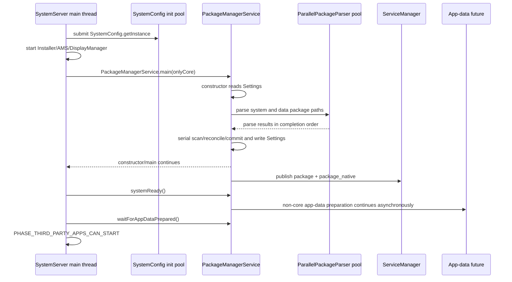
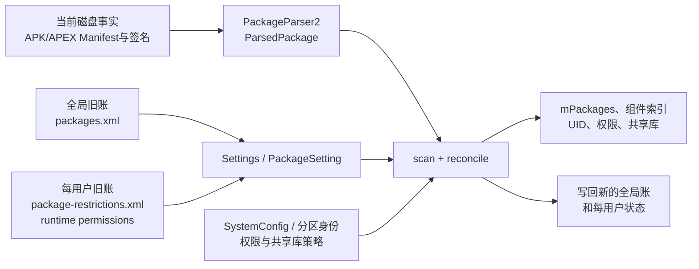
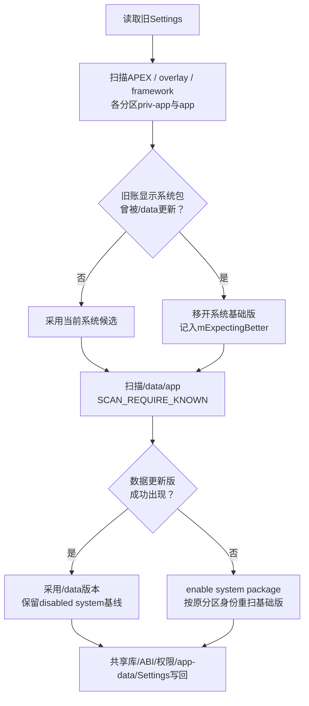

# 251 Android PackageManagerService启动、Settings账本与系统包扫描链

> 源码版本：Android 11 / `android-11.0.0_r48`  
> 学习方式：macOS只读核源，不编译、不运行AOSP

## 1. 本章要解决什么

Android开机时，PackageManagerService（下文简称PMS）要回答的不是“磁盘上有哪些APK”这么简单，而是：

```text
上次开机记住了哪些包、appId、签名和用户状态？
本次系统镜像、APEX挂载点和/data/app实际出现了什么？
系统预装包若被/data更新版覆盖，应当保留哪一个？
OTA删除、更新版损坏、包路径变化时，旧账怎样与磁盘调和？
PMS对象构造完成、Binder可查询、systemReady和应用数据就绪是否是同一时刻？
```

## 2. 一句总纲

```text
SystemServer准备依赖
→ PMS读取Settings旧账
→ 扫描APEX、overlay、framework和各系统分区
→ 扫描/data/app更新与普通应用
→ 调和旧账、系统基线、数据更新版和用户状态
→ 写回Settings
→ 发布Package Binder
→ 稍后systemReady，再等待异步应用数据准备
```

## 3. 为什么要先学启动链

安装一个APK只是PMS的增量事务；开机扫描却要重建全局内存事实。后续阅读安装、卸载、权限、Intent解析、shared UID、APEX和应用数据时，都默认这次重建已经完成。

若不知道启动阶段，就很容易把`PackageSetting`误当成Manifest解析结果，把`packages.xml`误当成包清单，或把`ServiceManager.addService()`误当成所有包数据都已准备完毕。

## 4. 本章边界

本章关注“服务启动、持久化账本、目录扫描与全局调和”。单个APK如何经过`PackageParser2`、`ScanRequest`、`ReconcileRequest`变成`PackageSetting`，留到第252章逐字段展开。

## 5. 源码地图

```text
frameworks/base/services/java/com/android/server/SystemServer.java
frameworks/base/services/core/java/com/android/server/pm/PackageManagerService.java
frameworks/base/services/core/java/com/android/server/pm/Settings.java
frameworks/base/services/core/java/com/android/server/pm/ParallelPackageParser.java
frameworks/base/services/core/java/com/android/server/pm/parsing/PackageParser2.java
frameworks/base/services/core/java/com/android/server/pm/PackageSetting.java
frameworks/base/services/core/java/com/android/server/pm/ApexManager.java
frameworks/base/core/java/android/content/pm/PackagePartitions.java
frameworks/base/core/java/com/android/server/SystemConfig.java
frameworks/base/core/java/android/os/ServiceManager.java
```

## 6. 先建立五个“完成点”

```text
A. PMS对象已构造
B. Settings已读取且启动扫描/调和已完成
C. package/package_native Binder已发布
D. PMS.systemReady()方法已执行完成
E. 异步应用数据已准备完，第三方应用可以启动
```

在r48中，A和B都发生在巨大构造函数返回前；C发生在`main()`尾部；D由SystemServer稍后调用；E还要等`waitForAppDataPrepared()`。

## 7. 启动里程碑总图



## 8. PMS运行在哪里

PMS的Java对象运行在`system_server`进程。启动构造和目录扫描的总控逻辑运行在SystemServer主线程；APK的“解析”可进入最多4条并行线程；PMS自己的`PackageHandler`则运行在单独`ServiceThread`中，处理延迟写盘、清理等后台消息。

## 9. SystemServer为何先预热SystemConfig

`startBootstrapServices()`先向初始化线程池提交：

```java
SystemServerInitThreadPool.submit(
        SystemConfig::getInstance, "ReadingSystemConfig");
```

`SystemConfig`会读取权限白名单、共享库、feature、carrier配置等大量XML。提前读可与其他bootstrap服务启动重叠。

## 10. 异步预热不等于依赖消失

`SystemConfig.getInstance()`在`SystemConfig.class`锁内创建单例。PMS构造函数稍后也会调用它；若后台读取仍未完成，PMS线程会在同一把类锁上等待。因此它是预取优化，不是“PMS可以在没有SystemConfig时继续”。

## 11. PMS之前为什么要有Installer

这里的`Installer`不是安装界面，而是system_server对`installd`的Java代理。PMS需要它创建/修复应用数据目录、处理dex和删除路径，所以SystemServer先启动Installer。

## 12. 默认Display也在PMS之前

SystemServer先启动DisplayManager并进入`PHASE_WAIT_FOR_DEFAULT_DISPLAY`。PMS会取默认显示的metrics用于部分资源和兼容处理，因此启动顺序本身就是依赖声明。

## 13. `onlyCore`从哪里来

加密设备处在最小Framework重启路径时，SystemServer可能设置`mOnlyCore=true`，再传给PMS：

```java
mPackageManagerService = PackageManagerService.main(
        mSystemContext, installer, mFactoryTestMode != FactoryTest.FACTORY_TEST_OFF,
        mOnlyCore);
```

## 14. `onlyCore`不是安全模式

`onlyCore`要求解析器只接受Manifest含`coreApp=true`的核心包，并跳过普通`/data/app`扫描及若干非核心准备。安全模式则主要限制第三方应用运行。两者原因、筛选位置和生命周期都不同。

## 15. SystemServer暂时停掉Watchdog当前线程监控

PMS首次扫描可能很慢。r48在调用`PackageManagerService.main()`周围暂停并恢复Watchdog对当前线程的监控，避免正常的长启动工作被误判成SystemServer主线程死锁。

这不代表PMS自己的后台Handler不受Watchdog观察；构造中会把`PackageHandler`注册给Watchdog。

## 16. `main()`先创建两把锁

```java
final Object lock = new Object();
final Object installLock = new Object();
```

随后Injector把同一组锁交给PMS、Settings、UserManager、PermissionManager和ComponentResolver，保证共享状态遵循统一锁协议。

## 17. `mLock`保护什么

`mLock`主要保护解析后的包状态、Settings、组件解析索引、shared user等内存数据。它非常繁忙，常规Binder查询也可能需要它，因此正常运行时应短持有。

## 18. `mInstallLock`保护什么

`mInstallLock`保护与`installd`和重磁盘I/O有关的安装操作。源码约束是：不要拿着`mLock`再去获取`mInstallLock`；允许持有`mInstallLock`时短暂进入`mLock`。

## 19. 方法后缀就是锁注释

```text
LI  → 调用方持有mInstallLock
LIF → 持有mInstallLock，且相关package已冻结
LPr → 持有mLock，只读
LPw → 持有mLock，可写
```

这不是Java语法保证，但阅读PMS时应把它当作并发合同。

## 20. 为什么启动构造能长时间同时持两把锁

构造函数在公开Binder发布之前，用`mInstallLock → mLock`顺序包住主要扫描与调和。此时还没有外部PackageManager客户端并发查询，能用较简单的一致性模型建立初始世界。

这不是日常安装路径可以随意照搬的长锁策略。

## 21. Injector的意义

Injector集中创建Settings、UserManagerService、PermissionManager、AppsFilter以及其他Local/System service依赖。除便于测试替换外，更重要的是让共享锁和循环依赖在可控顺序中装配。

## 22. 内部服务比公开Binder更早出现

PMS构造前段就执行：

```java
mPmInternal = new PackageManagerInternalImpl();
LocalServices.addService(PackageManagerInternal.class, mPmInternal);
```

这时尚未读取完Settings、也未扫描所有包。LocalServices消费者必须由SystemServer顺序保证不会过早读取完整包世界。

## 23. 公开Binder何时发布

`PackageManagerService.main()`先完整执行构造函数，再安装白名单系统包，最后：

```java
ServiceManager.addService("package", m);
final PackageManagerNative pmn = new PackageManagerNative(m);
ServiceManager.addService("package_native", pmn);
```

所以普通客户端能查到`package`服务时，首次扫描和构造内Settings写回已经结束。

## 24. `package`与`package_native`

`package`是Java侧`IPackageManager` Binder服务；`package_native`向native客户端提供较小的包管理接口。两者共享同一个PMS包世界，但接口面不同。

## 25. 构造前半段还做了什么

它会初始化UserManager、ComponentResolver、PermissionManager、Settings、内置shared UID、dex/ART协作对象、AppsFilter、InstantAppRegistry、共享库，以及SELinux安装策略。

启动扫描不是孤立的“文件遍历器”，它依赖这些对象把扫描结果变成权限、组件和UID状态。

## 26. 内置shared UID先占位

PMS为`android.uid.system`、phone、log、nfc、bluetooth、shell、se、networkstack等建立shared-user记录。这些平台身份必须在解析使用它们的系统包之前存在。

## 27. 扫描目录不是硬编码两个路径

PMS建立`mDirsToScanAsSystem`：先放静态系统分区，再追加当前活动APEX映射出的扫描分区。

静态系统分区由`PackagePartitions`描述。

## 28. 系统分区的基础顺序

r48的静态列表从通用、低优先级到更具体、高优先级：

```text
/system → /vendor → /odm → /oem → /product → /system_ext
```

并不是所有分区都一定支持`priv-app`或`overlay`子目录，代码通过分区属性判断。

## 29. 每个分区携带身份flag

`ScanPartition`不仅保存根目录，还映射`SCAN_AS_VENDOR`、`SCAN_AS_ODM`、`SCAN_AS_OEM`、`SCAN_AS_PRODUCT`、`SCAN_AS_SYSTEM_EXT`等flag。后续权限和包身份判断不能只看路径字符串。

## 30. APEX中的APK怎样获得分区身份

活动APEX挂载到新路径，但PMS会根据它的预安装APEX原始路径判断归属哪个基础系统分区，再创建以活动挂载点为根、带`SCAN_AS_APK_IN_APEX`的`ScanPartition`。

因此“APK现在位于APEX mount下”不会丢掉vendor/product等来源属性。

## 31. Settings是什么

`Settings`是PMS的持久化账本与内存索引管理器。它记录“系统上次认可的包状态”，而不是重新保存APK Manifest全文。

## 32. 全局文件在哪里

```text
/data/system/packages.xml
/data/system/packages-backup.xml
/data/system/packages.list
```

`packages.xml`是主账；backup用于写坏恢复；`packages.list`是给native/守护进程消费的扁平包与UID/数据目录信息。

## 33. 每用户文件在哪里

```text
/data/system/users/<userId>/package-restrictions.xml
/data/system/users/<userId>/package-restrictions-backup.xml
```

运行时权限还有独立的每用户持久化文件/状态，不能把所有权限都想象成在`packages.xml`里。

## 34. `packages.xml`主要记什么

它包含package setting、code/resource path、appId或shared UID、签名/keyset引用、安装权限、版本与构建指纹、renamed package、disabled system package等。

APK里的Activity、Service、Receiver、Provider和IntentFilter仍以当前APK解析为准。

## 35. `package-restrictions.xml`主要记什么

同一个包对不同用户可以有不同的：

```text
installed、stopped、notLaunched、hidden、suspended
enabled状态、组件enabled/disabled覆盖
domain verification/app-link状态、instant-app状态等
```

所以“全局存在这个包”不等于“每个用户都安装并可启动它”。

## 36. 三类事实图



## 37. 为什么不能只相信旧账

OTA会改变系统镜像；用户可能安装系统应用更新；掉电可能打断写盘；坏块或手工调试可能使APK缺失。旧账只是上一轮结论，必须与当前磁盘重新核对。

## 38. 为什么不能只相信目录

仅看目录无法恢复稳定appId、shared UID归属、签名演进、每用户installed/stopped状态、系统更新版关系等。若每次开机都重新随机分配UID，Linux沙箱和应用数据所有权会崩溃。

## 39. 读取Settings的入口

构造函数在两把锁内执行：

```java
mFirstBoot = !mSettings.readLPw(
        mInjector.getUserManagerInternal().getUsers(
                true, false, false));
```

这里`LPw`提示会在`mLock`下修改Settings。

## 40. backup为何优先

若`packages-backup.xml`存在，`readLPw()`优先打开backup，并删除普通`packages.xml`。含义是上次写新主文件时未走到“成功后删除backup”，新文件可能不完整，旧backup更可信。

## 41. 没有`packages.xml`怎样处理

如果主文件和backup都不存在，Settings把内部版本信息设到当前值并返回`false`。PMS据此得到`mFirstBoot=true`。

这比“捕获任意异常就是首次开机”精确得多。

## 42. XML读取前先清什么

Settings清理待解析package、签名池、key引用和installer package等临时集合，再按XML tag恢复package、shared-user、permission、updated-package、renamed-package、keyset和version信息。

## 43. shared UID为什么要延迟连接

`<package>`可能引用后面才出现的`<shared-user>`。读取时先把它放进pending列表，完成全局XML解析后，再按共享UID标识把PackageSetting连到SharedUserSetting。

这是一种“先反序列化节点，再解析引用”的常见模式。

## 44. 全局账后再读用户账

只有先知道全局有哪些PackageSetting，才能把每用户restriction应用到对应包。随后PermissionManager再读取每用户runtime permission状态，并生成内核需要的包映射。

## 45. 缺少某用户restriction文件

r48会对该用户把已有包初始化为`installed=true`、`stopped=false`等默认状态。这是兼容/首次建立用户账本的路径，不应解读成磁盘上的每个未知APK自动安装给该用户。

## 46. `readLPw()`异常边界

r48里，进入XML解析后的一些XML/IO异常会被catch、记录，然后方法继续走到最终`return true`。因此：

```text
mFirstBoot == !readLPw(...)
```

并不等价于“Settings有任何解析错误就算首次开机”。这是阅读此版本必须保留的实现边界。

## 47. 首次开机与升级不是一回事

读取旧账后，PMS取内部VersionInfo：

```java
final VersionInfo ver = mSettings.getInternalVersion();
mIsUpgrade = !Build.FINGERPRINT.equals(ver.fingerprint);
```

没有旧账通常是first boot；有旧账但构建指纹变化通常是upgrade。

## 48. `sdkUpdated`又是另一维

平台SDK版本变化用于决定权限升级等兼容工作；构建指纹变化范围更广。一次同API级别OTA可以`mIsUpgrade=true`而`sdkUpdated=false`。

## 49. 升级前为何保存`mExistingPackages`

PMS在扫描前保存上次已存在包名，以便扫描后判断某系统包是OTA新加入、原有包升级，还是已被移除。`systemReady()`末尾完成相关处理后才清空这份集合。

## 50. 启动扫描flag

基础扫描flag为：

```text
SCAN_BOOTING | SCAN_INITIAL
```

首次开机或升级还加`SCAN_FIRST_BOOT_OR_UPGRADE`。这些flag描述扫描上下文，不等于包所在分区的`SCAN_AS_SYSTEM`身份。

## 51. parse flag与scan flag别混

`PARSE_IS_SYSTEM_DIR`告诉解析层文件来自系统目录；`SCAN_AS_SYSTEM`、`SCAN_AS_PRIVILEGED`和分区flag告诉扫描/提交层怎样赋予系统身份和策略。它们作用阶段不同。

## 52. `PackageParser2`的`onlyCore`

PMS构造`PackageParser2`时传入`mOnlyCore`。底层`ParsingPackageUtils`会拒绝非`coreApp`包，所以过滤并不只是“后来扫描时不注册组件”。

## 53. APEX先于普通APK

PMS先让ApexManager扫描/获取APEX包元数据，再处理APEX内APK扫描分区。APEX影响可见路径、模块信息和系统包来源，必须在普通系统APK世界稳定前建立。

## 54. overlay为什么先扫

PMS先遍历各系统扫描分区的overlay目录，再扫framework和app目录。资源覆盖关系会影响后续系统资源/包处理，因此overlay配置不是最后随便补一遍。

## 55. overlay为何逆序扫描

静态分区列表从低优先级到高优先级；overlay循环按反方向走，使更具体/更高优先级分区先进入相关处理。不要把所有目录循环都假定为同一方向。

## 56. `/system/framework`是特殊阶段

PMS用system、privileged和`SCAN_NO_DEX`等flag扫描`/system/framework`。这里包含框架资源包和共享库相关APK，不是普通预装应用目录。

## 57. `android`包是硬前提

framework扫描后若找不到包名`android`，PMS抛`IllegalStateException`。这个包承载平台资源与核心身份；缺失时继续启动只会制造更难理解的错误。

## 58. 每个系统分区的应用顺序

对每个`ScanPartition`：

```text
若支持priv-app：先扫priv-app，附加SCAN_AS_PRIVILEGED
再扫app，保留系统及该分区身份flag
```

“位于系统分区”与“特权应用”不是同义词；只有priv-app路径获得privileged扫描身份。

## 59. OverlayConfig何时建立

系统目录扫描完成到一定阶段后，PMS初始化OverlayConfig，把静态overlay、分区优先级和配置整合起来。它依赖已发现的系统内容。

## 60. 为什么系统包扫描后不能马上扫完就算

PMS还要处理：

```text
旧账中存在但镜像上消失的系统包
被/data更新版覆盖的系统包
stub系统包
OTA新包与旧包
期待/data出现更好版本的包
```

目录遍历只是收集事实，调和规则才决定最终包世界。

## 61. 什么是updated system app

系统镜像中有基础版本，用户后来把更新版安装到`/data/app`。Settings会在disabled-system-package账中保留基础系统包信息；当前活动包通常是`/data`更新版。

“disabled system package”不是用户在设置页点了禁用，而是基础版本暂时被数据版替代的内部记录。

## 62. `mExpectingBetter`表达什么

系统扫描看见基础版本，同时旧账说明应有`/data`更新版时，PMS暂时从当前活动包集合移走系统基础版本，并把基础代码路径记入`mExpectingBetter`。

意思是：“先别采用旧系统版，我期待稍后在数据分区看到更好版本。”

## 63. `/data/app`何时扫描

仅在`!mOnlyCore`时，系统扫描和系统包预调和之后执行：

```java
scanDirTracedLI(sAppInstallDir, 0,
        scanFlags | SCAN_REQUIRE_KNOWN, 0,
        packageParser, executorService);
```

这里parseFlags为0，说明它不是系统目录。

## 64. `SCAN_REQUIRE_KNOWN`为什么重要

启动时`/data/app`中的包通常必须已经在Settings里，并且code/resource path与账本匹配。PMS不把开机目录扫描当作“发现任意陌生APK就自动安装”的入口。

更新系统应用的`mExpectingBetter`路径有相应放宽，否则数据版永远无法接替系统基线。

## 65. 无效数据包为何可能被删除

`scanDirLI()`遇到非系统目录里的解析/扫描失败，会调用`removeCodePathLI()`清理坏代码路径；系统目录错误则记录但不删除只读系统镜像。

因此在真实设备上随意往`/data/app`塞目录并重启，不是安全的源码学习实验。

## 66. 外置/adopted卷不都在这一步

本次内部数据扫描核心是`/data/app`。其他存储卷会通过StorageManager监听和后续卷挂载流程接入，不能从这里只看到一个路径就断言PMS永远不管理外置应用。

## 67. 并行解析器做了什么

`ParallelPackageParser`使用固定最多4个线程，线程优先级为foreground；其“已完成解析结果”的阻塞队列容量为30。`scanDirLI()`为候选APK目录提交parse任务，再从该结果队列取回结果。容量30限制的是尚未被调用线程消费的结果数，不能据此推断执行器内部待执行任务队列也只有30项。

## 68. 结果顺序不是目录顺序

结果通过阻塞队列按“完成先后”返回。体积小的后提交APK可能先解析完成，所以不能依赖文件枚举顺序决定最终覆盖关系；真正冲突由扫描/调和规则处理。

## 69. 并行解析不等于并行提交

工作线程主要把磁盘内容解析成`ParsedPackage`；SystemServer主线程每取一个结果，再执行`addForInitLI()`等扫描、校验和状态提交。全局`mPackages`、Settings和组件索引并不是4条线程随意并发修改。

## 70. 为什么这种分工合理

XML解析和证书读取可并行消耗CPU/I/O；包名冲突、shared UID、签名、权限和组件索引需要全局一致性。并行“生产候选”，串行“决定世界”能降低锁与回滚复杂度。

## 71. 解析异常怎样传播

预期的`PackageParserException`会放进结果并由调用线程记录/处理；工作线程若抛出意外`Throwable`，调用端会升级为`IllegalStateException`，因为线程池内部错误可能破坏启动可信度。

## 72. 线程池关闭也是一致性检查

所有目录扫描结束后，PMS关闭parser并`shutdownNow()`执行器。如果仍返回未完成任务列表，就抛`IllegalStateException`。

这防止主流程误以为扫描完成，而后台其实还有未消费包结果。

## 73. 系统与数据扫描调和图



## 74. “期待更好”成功时

数据扫描发现合法更新版，它成为`mPackages`里的活动包；Settings仍保留基础系统包，以便卸载更新或数据版消失时恢复。

## 75. “期待更好”失败时

若`mExpectingBetter`中的包最终未出现在`mPackages`，PMS记录：

```text
Expected better ... but never showed up; reverting to system
```

随后重新enable基础包，并根据其原路径恢复system、privileged和vendor/product等准确flag后重扫。

## 76. 为什么回退时要重新判断分区

若直接用普通system flag重扫，原priv-app或product/vendor身份可能丢失，进而改变权限。代码反向搜索`mDirsToScanAsSystem`，根据基础路径重建原扫描身份。

## 77. OTA删除系统基础包又是什么情况

旧账可能显示某系统包曾有更新版，但新系统镜像已经移除基础包。PMS会清除disabled-system记录；若数据版仍在，则按普通数据包重扫并撤销系统特权；若数据版也不存在，则最终删除包数据。

这和“基础包仍在，但期待的数据更新版坏了”是两条相反的分支。

## 78. stub系统包为何最后处理

stub APK是精简占位版本，可能需要解压/启用完整实现。PMS等正常系统与数据版本关系确定后才安装stub，确保真正版本优先；失败时保持stub禁用，避免占位包冒充完整功能。

## 79. 扫描结束后先修共享库

只有最终包集合确定后，PMS才能解析共享库提供者并为所有客户端重算library path。过早计算会把后来被数据版替换或被OTA移除的提供者写入结果。

## 80. shared UID还要修ABI和SEInfo

共享UID下多个包必须兼容ABI，并落入一致的SELinux域。PMS遍历SharedUserSetting，调整ABI、清理相应dex并调用`fixSeInfoLocked()`。

## 81. 权限更新也要等包世界稳定

PermissionManager根据最终包、声明权限、系统身份、平台版本变化和用户状态执行权限更新。系统包是否privileged、是否OTA新增，都可能改变结果。

## 82. usage和compiler stats不是包真相

PMS读取包使用时间与编译统计用于优化和决策；它们依附于已确认PackageSetting。缺少这些统计不会让APK Manifest消失，不能与核心Settings账混为一谈。

## 83. 应用数据准备为何分两段

构造内先同步调和system user的核心应用数据，返回可延后的非核心包，再向SystemServer初始化线程池提交`mPrepareAppDataFuture`，执行`installd fixupAppData`和剩余准备。

这样能缩短公开服务发布前的关键路径，同时在第三方应用真正启动前设置明确等待屏障。

## 84. OTA为何清code cache而保留profile

系统升级后旧编译产物可能与新Framework不兼容，所以清理code cache；profile记录真实使用热点，仍可用于新版本优化，保留它能避免丢失训练信息。

## 85. 构造内何时写Settings

完成扫描、权限/版本更新和主要调和后，PMS更新数据库版本并调用Settings写回。这样下次启动读取的是本轮最终结论，而不是扫描前旧世界。

## 86. `packages.xml`没有直接用AtomicFile

r48的`Settings.writeLPr()`手工实现备份协议：

```text
若旧backup不存在：把当前packages.xml重命名为backup
若backup已存在：保留更老backup并删除当前主文件
写新的packages.xml
flush + FileUtils.sync
成功后删除backup
失败则删除新主文件，留下backup供下次恢复
```

读源码时不要因为Android常见`AtomicFile`就想当然地套到这里。

## 87. 为什么backup已存在时不覆盖

backup存在说明更早一次写入可能未完成。此时当前主文件可信度较低；若再用它覆盖backup，可能把最后一个已知好版本也丢掉。

## 88. `sync`解决什么、不解决什么

`flush()`把Java缓冲交给内核，`FileUtils.sync()`请求把文件内容落盘；随后删除backup表示提交成功。它增强断电恢复，但不意味着所有相关文件构成一个跨文件原子事务。

## 89. 主账写完还会写什么

Settings随后更新kernel mapping、`packages.list`、所有用户的package restrictions和runtime permissions。每用户restriction也采用类似主文件/backup恢复协议。

## 90. `packages.list`的用途

它以便于native读取的形式列出包名、appId、debuggable、data path、seinfo、gids等。它不是`packages.xml`的完整替代品，也不含完整组件模型。

## 91. `PMS_READY`日志到底表示什么

构造函数在Settings写回附近记录`BOOT_PROGRESS_PMS_READY`。这表示PMS启动扫描关键阶段已完成，并不是Java方法`systemReady()`已经调用。

名字相似是典型误导点，应沿调用位置判断语义。

## 92. 构造函数退出前还有收尾

PMS还会初始化installer/verifier/controller包名、InstantApp相关对象、PackageInstallerService、DexManager等，退出大锁，初始化ModuleInfoProvider，解除PackageInfo缓存失效抑制并做GC。

所以“EventLog写了PMS_READY”也不等于构造函数下一行立刻返回。

## 93. 缓存为何先cork后uncork

批量扫描会反复改变包信息。构造开始关闭/抑制相关cache invalidation，完成全量状态建立后统一解除，可避免每加入一个包都触发昂贵的跨进程缓存抖动。

## 94. `installWhitelistedSystemPackages()`的位置

它在`new PackageManagerService(...)`返回后、公开Binder注册前执行。用于按系统配置处理白名单系统包的每用户安装状态。

因此公开查询看到的是这一步也已处理过的状态。

## 95. `systemReady()`何时调用

SystemServer启动更多核心/其他服务后，才调用：

```java
mPackageManagerService.systemReady();
```

这发生在公开Package Binder发布之后。Binder可获得与PMS完成SystemServer联动初始化不是同一屏障。

## 96. `mSystemReady`在方法开头就置true

r48的`systemReady()`先校验调用者，然后很早执行：

```java
mSystemReady = true;
```

接着才注册Observer、处理carrier/SKU应用、清理preferred activity、通知UserManager/PermissionManager、注册存储监听、恢复staged session等。

## 97. volatile标志不代表方法体已全部结束

其他Binder线程一旦看到`mSystemReady=true`，`systemReady()`后半段可能仍在SystemServer主线程运行。这个flag是阶段门，不是“所有后置动作完成”的Future。

## 98. `systemReady()`中的关键后置动作

包括但不限于：

```text
注册Settings/PackageVerifier相关ContentObserver
通知AppsFilter、UserManager、PackageInstaller、DexOptimizer
禁用不适用的carrier/SKU应用
清理失效preferred activity
注册StorageEventListener和外部存储策略
调和过期用户/应用数据
通知PermissionManager ready
注册广播
最后恢复/应用staged sessions
```

## 99. staged session为何靠后

staged安装可能影响APEX或系统组件，需要前面的包、用户、权限、存储和installer状态稳定后再恢复/应用。源码注释明确把它放在`systemReady()`末尾。

## 100. 应用数据屏障还在后面

SystemServer稍后调用：

```java
mPackageManagerService.waitForAppDataPrepared();
```

它等待构造期间提交的`mPrepareAppDataFuture`完成并清空引用。

## 101. 为什么要在第三方应用启动前等待

紧接着SystemServer才推进到`PHASE_THIRD_PARTY_APPS_CAN_START`。否则ActivityManager可能启动第三方进程，而其数据目录的owner、SELinux label或迁移尚未准备好。

## 102. 四个常被混淆的ready

```text
BOOT_PROGRESS_PMS_READY：构造内启动进度事件
ServiceManager已有package：公开Binder可查
mSystemReady=true：systemReady方法开头的阶段标志
waitForAppDataPrepared返回：异步应用数据屏障完成
```

它们在r48中既不同行，也不完全同义。

## 103. 查询可用不等于第三方应用可运行

Binder发布后，其他系统服务需要查询包信息，所以PMS必须较早可用；第三方进程启动则可以等更晚的boot phase和app-data屏障。这是把“控制面查询”与“应用执行安全”分阶段的设计。

## 104. 启动失败的三种强弱层级

```text
单个系统APK解析失败：通常记录错误，不能删除只读镜像
单个/data代码路径失败：记录并可能清理无效路径
核心android包缺失、解析线程意外Throwable、任务未收完：抛致命异常
```

错误策略取决于能否安全降级，而不是统一catch后继续。

## 105. 一条包的完整“启动认定”

以一个预装应用为例：

```text
Settings恢复旧PackageSetting/appId/签名关系
→ 系统分区发现当前APK
→ 并行解析Manifest和签名材料
→ 主线程按分区身份执行scan/reconcile
→ 判断是否应让位于/data更新版
→ 更新mPackages、组件、权限、共享库和用户状态
→ 必要时准备数据目录
→ 写回新Settings
```

任何单一步都不能代表完整认定。

## 106. 线程与锁速查

| 工作 | 主要线程 | 关键锁/屏障 |
|---|---|---|
| SystemServer调用PMS main | system_server主线程 | Watchdog当前线程监控暂时暂停 |
| 读取Settings、提交扫描结果 | system_server主线程 | 启动期`mInstallLock → mLock` |
| 解析多个APK | ParallelPackageParser最多4线程 | 不直接并发提交全局包世界 |
| PMS延迟写盘/后台消息 | PackageHandler线程 | 按具体LP/LI协议 |
| 非核心app-data准备 | SystemServer init pool | `mPrepareAppDataFuture` |
| 普通PackageManager查询 | Binder线程池 | 公开服务发布后，常短持`mLock` |

## 107. 磁盘、内存、服务三层速查

| 层 | 代表对象 | 含义 |
|---|---|---|
| 当前磁盘 | APK/APEX、Manifest、签名 | 本次开机实际代码事实 |
| 持久化旧账 | Settings、PackageSetting、用户restriction | 上次认定的身份与状态 |
| 本轮内存 | `mPackages`、ComponentResolver、权限/库索引 | 调和后的运行时真相 |
| 对外接口 | `IPackageManager`、`PackageManagerNative` | 查询/变更上述内存状态的服务面 |

## 108. 易错理解一：`packages.xml`就是安装包清单

错。它保存稳定身份、路径、签名关系和状态；当前组件声明必须从当前APK解析并与旧账调和。旧账不能凭空复活已经不存在的APK代码。

## 109. 易错理解二：扫描线程池并发安装四个包

错。r48主要并行parse；结果由调用线程按完成顺序串行进入`addForInitLI()`。这仍可能改变日志顺序，但不是四条线程并发改`mPackages`。

## 110. 易错理解三：先扫`/data/app`，再判断是不是系统更新

错。先建立系统基线与`mExpectingBetter`，再扫描`/data/app`。只有知道基础系统包，才能安全判断数据版是更新、普通应用还是异常路径。

## 111. 易错理解四：`systemReady()`之后所有数据必然就绪

错。其方法体本身有前后动作，且`mSystemReady`在开头置位；非核心应用数据Future还由SystemServer稍后显式等待。

## 112. 易错理解五：`onlyCore`只是跳过启动第三方应用

错。它直接影响PackageParser接受哪些包，也跳过`/data/app`扫描和部分准备。它改变PMS建立的包世界，不只是AMS启动策略。

## 113. 易错理解六：backup是主文件损坏后才尝试

错。r48只要发现backup存在，就优先采用它并删除普通主文件，因为backup未删除意味着前次提交没有完整确认成功。

## 114. 易错理解七：系统分区应用都拥有privileged权限

错。系统身份与privileged身份分开编码。普通`app`目录没有`SCAN_AS_PRIVILEGED`，只有支持的`priv-app`路径才加。

## 115. 易错理解八：APEX挂载路径决定全部身份

错。PMS回看预安装APEX位于哪个基础分区，把对应分区flag带到活动APEX扫描目录，再附加APK-in-APEX身份。

## 116. 第一次复读：最容易卡住的概念

“读取Settings”不是把旧世界原样装回内存，“扫描目录”也不是忽略旧账重建。最准确的词是“调和”：

```text
旧账提供连续身份
当前APK提供现行声明
分区与SystemConfig提供平台策略
每用户账提供用户差异
PMS把四者合成新的运行时结论
```

## 117. 第二次复读：启动顺序修订

不能写成“PMS发布Binder，然后后台慢慢扫描”。r48公开`package` Binder是在巨大构造函数完成扫描、主要调和和Settings写回之后发布；但`PackageManagerInternal`确实更早注册，且app-data与`systemReady()`后置工作仍可更晚完成。

## 118. 第三次复读：first boot修订

不能写成“`packages.xml`解析有错误就first boot”。代码的准确表达是`mFirstBoot = !readLPw()`；文件不存在/无起始tag等会返回false，而部分解析期异常被记录后仍可能最终返回true。分析故障必须以该版本具体控制流为准。

## 119. 第四次复读：并行边界修订

不能写成“扫描完全串行”，因为parse确有最多4线程；也不能写成“扫描并发提交”，因为全局状态变更回到主调用线程。推荐表述是“并行解析、完成序取回、串行调和提交”。

## 120. 第五次复读：ready边界修订

`BOOT_PROGRESS_PMS_READY`、公开Binder、`mSystemReady`、`systemReady()`返回、app-data Future完成与第三方应用boot phase是不同观察点。讨论“PMS ready”必须说明观察者和所需保证。

## 121. 版本边界

本章严格描述`android-11.0.0_r48`。新Android版本已重构包解析、Computer snapshot、PackageManagerService分层、APEX/模块化与Settings持久化；类名、锁方式和启动阶段可能变化。学习设计思想可以迁移，引用行级行为必须回到目标分支核对。

## 122. macOS只读练习1：画出公开服务发布边界

```bash
cd /Users/ninebot/androidSource
sed -n '2568,2650p' \
  frameworks/base/services/core/java/com/android/server/pm/PackageManagerService.java
```

标出构造、白名单处理、`package`与`package_native`注册顺序。回答：普通Binder客户端能看见服务时，构造函数是否已返回？

## 123. macOS只读练习2：验证Settings恢复协议

```bash
cd /Users/ninebot/androidSource
sed -n '2436,2535p' \
  frameworks/base/services/core/java/com/android/server/pm/Settings.java
sed -n '2982,3070p' \
  frameworks/base/services/core/java/com/android/server/pm/Settings.java
```

分别找出写前rename到backup、成功后删除backup，以及读取时backup优先的代码。思考：为什么backup存在是一条“上次提交未确认”的信号？

## 124. macOS只读练习3：核对系统与数据扫描顺序

```bash
cd /Users/ninebot/androidSource
sed -n '3060,3250p' \
  frameworks/base/services/core/java/com/android/server/pm/PackageManagerService.java
```

依次记录overlay、framework、priv-app、app和`/data/app`，再圈出`SCAN_REQUIRE_KNOWN`。不要只看调用名，还要记循环方向与flag。

## 125. macOS只读练习4：区分两个后置屏障

```bash
cd /Users/ninebot/androidSource
sed -n '21480,21690p' \
  frameworks/base/services/core/java/com/android/server/pm/PackageManagerService.java
sed -n '2170,2200p' \
  frameworks/base/services/java/com/android/server/SystemServer.java
sed -n '2338,2370p' \
  frameworks/base/services/java/com/android/server/SystemServer.java
```

找出`mSystemReady=true`、`systemReady()`调用、`waitForAppDataPrepared()`以及第三方应用boot phase。用一句话描述每个点保证了什么。

## 126. 自测题

1. 为什么稳定appId不能只靠本次目录扫描重新分配？
2. `packages.xml`与`package-restrictions.xml`分别记录全局还是每用户状态？
3. backup存在时，r48为什么不优先相信新的主文件？
4. `mFirstBoot`与`mIsUpgrade`如何分别计算？
5. 为什么overlay、framework、priv-app、app、data-app有明确顺序？
6. `SCAN_AS_SYSTEM`与`SCAN_AS_PRIVILEGED`有何差别？
7. `mExpectingBetter`如何避免坏掉的系统应用更新让应用彻底消失？
8. 为什么说ParallelPackageParser是“并行解析、串行提交”？
9. `PMS_READY`事件为何不等于`systemReady()`？
10. 为什么`systemReady()`返回后仍需要app-data等待屏障？

## 127. 自测题参考答案

1. appId决定Linux UID和数据所有权；旧Settings提供跨重启连续身份。
2. 前者主要是全局包/UID/签名/版本账，后者是每用户installed、stopped、enabled等差异状态。
3. backup未删除表明上次写新主文件没有完成提交协议，旧backup是最后已知好版本。
4. first boot取`!readLPw()`；upgrade比较Settings内部fingerprint与当前`Build.FINGERPRINT`。
5. 先建立平台资源、覆盖和系统基线，才能按优先级、身份和更新关系调和数据包。
6. 前者说明系统来源；后者仅用于priv-app等特权身份，两者不自动等价。
7. 先暂存基础路径等待数据版；数据版没成功进入最终集合时，按原分区flag重新enable并扫描基础版。
8. 工作池解析多个文件，主调用线程逐个消费结果并修改全局包状态。
9. 它是构造内boot progress事件；Java `systemReady()`由SystemServer稍后另行调用。
10. 非核心应用目录准备被放进异步Future，必须在第三方进程启动前显式等待。

## 128. 本章总结

PMS启动的本质是一场有恢复协议的全局调和：Settings旧账维持UID、签名关系和用户状态连续性；当前APK/APEX给出现行代码事实；SystemConfig和分区flag施加平台策略；PMS先扫描系统基线，再用`/data/app`更新与普通应用补全，遇到缺失更新还能回退系统版。解析可以并行，但全局认定在启动主线程上按锁协议提交。最后，构造完成、Binder发布、`systemReady()`和应用数据就绪是多个明确屏障，而不是一个模糊的“PMS ready”。

## 129. 下一章预告

第252章进入单包内部：`PackageParser2`怎样产出`ParsedPackage`，`ScanRequest`怎样携带旧PackageSetting与扫描flag，`ReconcileRequest`怎样裁决签名、shared UID与replace关系，最后如何提交新的PackageSetting和组件索引。
