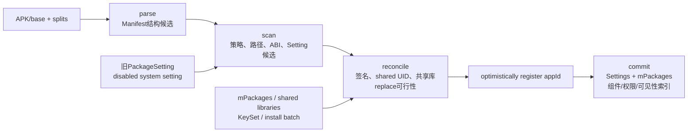
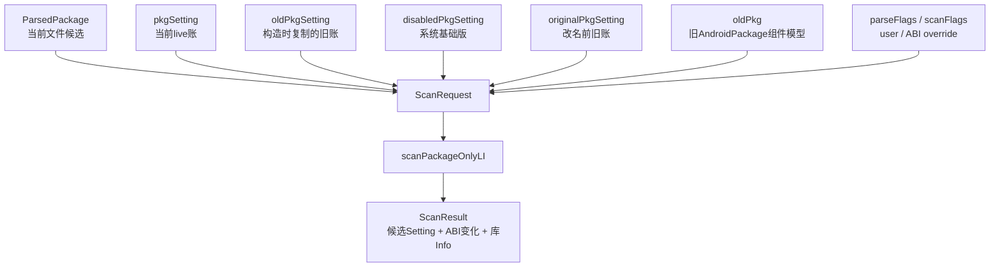
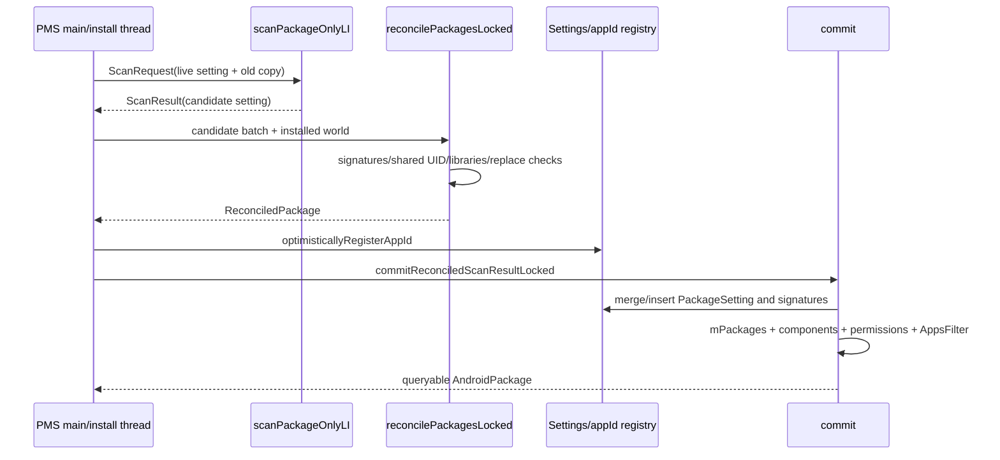

# 252 Android PackageParser2、ScanRequest、Reconcile与PackageSetting提交链

> 源码版本：Android 11 / `android-11.0.0_r48`  
> 学习方式：macOS只读核源，不编译、不运行AOSP

## 1. 本章要解决什么

第251章看到PMS按目录取回一个个解析结果。这一章把镜头缩到单个包：

```text
APK解析出的ParsedPackage与旧PackageSetting各代表什么？
签名为什么没有在普通Manifest parse阶段一次性完成？
ScanRequest为什么同时带live setting和old setting副本？
scanPackageOnlyLI究竟产生候选，还是已经改了系统？
reconcile比scan多判断了哪些全局冲突？
appId为何在commit前“乐观注册”？
PackageSetting、mPackages、组件索引和权限在哪一步真正可查询？
hideAsFinal是否真的把包对象变成不可变对象？
```

## 2. 一句总纲

```text
APK/APK目录
→ PackageParser2产出ParsedPackage候选
→ addForInitLI补证书并处理系统/数据版本关系
→ ScanRequest把候选与旧账快照装在一起
→ scanPackageOnlyLI派生新PackageSetting候选
→ reconcile在全局上下文裁决签名、shared UID与共享库
→ 注册appId
→ commit写入Settings、mPackages、组件/权限/可见性索引
```

## 3. 先区分五个核心对象

| 对象 | 主要含义 | 是否已对外可查 |
|---|---|---|
| `ParsedPackage` | 当前APK解析并继续被PMS补写的候选包模型 | 否 |
| `PackageSetting`旧记录 | 上次/当前已安装包的稳定身份和用户状态 | 可能属于旧版本 |
| `ScanRequest` | 当前候选 + 旧包/旧账 + flags + 用户/ABI上下文 | 否 |
| `ScanResult` | scan派生出的候选Setting、ABI变化和库声明 | 否 |
| `ReconciledPackage` | 已通过全局一致性裁决、可交给commit的数据包 | 尚未，直到commit |

## 4. 本章源码地图

```text
frameworks/base/services/core/java/com/android/server/pm/parsing/PackageParser2.java
frameworks/base/core/java/android/content/pm/parsing/ParsingPackageUtils.java
frameworks/base/core/java/android/content/pm/parsing/ParsingPackageImpl.java
frameworks/base/services/core/java/com/android/server/pm/parsing/pkg/PackageImpl.java
frameworks/base/services/core/java/com/android/server/pm/parsing/pkg/ParsedPackage.java
frameworks/base/services/core/java/com/android/server/pm/parsing/pkg/AndroidPackage.java
frameworks/base/services/core/java/com/android/server/pm/PackageManagerService.java
frameworks/base/services/core/java/com/android/server/pm/PackageSetting.java
frameworks/base/services/core/java/com/android/server/pm/Settings.java
frameworks/base/services/core/java/com/android/server/pm/KeySetManagerService.java
```

## 5. 本章边界

本章以开机`addForInitLI()`单包路径为主，并借用普通安装的批量`ReconcileRequest`解释设计。APK安装session、文件复制、冻结、回滚和广播将在后续安装章节展开。

## 6. 四阶段总图



## 7. parse回答什么

parse回答“文件里声明了什么”：包名、版本、组件、IntentFilter、权限声明、uses-library、进程、overlay、split等。它把XML和APK结构转换成PMS可操作的对象。

它还没有决定这个包能否替换设备上的旧包，也没有给它分配最终appId。

## 8. scan回答什么

scan把解析候选放入设备上下文：系统/privileged/vendor等身份、code/resource path、ABI/native library path、SEInfo、首次安装/更新时间、每用户初始状态和候选PackageSetting。

## 9. reconcile回答什么

reconcile把一个或一批ScanResult与现存世界合并预演，检查升级keyset或签名、shared UID签名谱系、共享库冲突/依赖，以及普通替换是否允许删除旧包。

## 10. commit回答什么

commit执行真正的内存发布：确认appId和最终签名，更新Settings、`mPackages`、ComponentResolver、AppsFilter、KeySet、权限定义、Instrumentation等。

因此“parse成功”与“包已经安装/可查询”隔着多个可能失败的阶段。

## 11. PackageParser2构造参数

```java
public PackageParser2(String[] separateProcesses, boolean onlyCoreApps,
        DisplayMetrics displayMetrics, File cacheDir, Callback callback)
```

`onlyCoreApps`控制最小启动包过滤；metrics用于资源解析；cacheDir决定能否用解析缓存；callback提供compat change与设备feature查询。

## 12. callback为何属于解析上下文

某些Manifest行为随target SDK、compat change或设备feature变化。解析不是完全脱离设备的通用XML反序列化，它需要PMS提供“当前平台怎样理解这项声明”。

## 13. `ThreadLocal`为什么出现

`PackageParser2`持有每线程的`ApplicationInfo`临时对象和`ParseTypeImpl`结果容器。第251章的并行parser让同一个Parser实例被多线程调用；ThreadLocal避免解析线程互相覆盖临时状态。

## 14. parse cache的入口

```java
if (useCaches && mCacher != null) {
    ParsedPackage parsed = mCacher.getCachedResult(packageFile, flags);
    if (parsed != null) return parsed;
}
```

只有调用方要求`useCaches`且构造时有cacheDir才会命中。普通单包`scanPackageLI()`传`useCaches=false`；开机并行扫描传true。

## 15. cache不是最终安装状态缓存

缓存的是parse结果，不是PackageSetting、appId、权限授予或组件索引。即使命中缓存，后续证书、scan、reconcile和commit仍要执行。

## 16. parse错误怎样表达

`ParsingPackageUtils.parsePackage()`返回`ParseResult<ParsingPackage>`；若`isError()`，PackageParser2把错误码、消息和异常包装成`PackageParserException`。

这样解析层可以累积结构化错误，PMS边界再转成`PackageManagerException`。

## 17. `hideAsParsed()`做什么

成功结果调用：

```java
ParsedPackage parsed =
        (ParsedPackage) result.getResult().hideAsParsed();
```

它把构建期接口收窄为PMS扫描期接口。名字里的“hide”主要是接口视图转换，不等同于深拷贝或冻结。

## 18. r48里其实是同一个对象

`PackageImpl`同时实现`ParsedPackage`与`AndroidPackage`：

```java
public ParsedPackage hideAsParsed() { return this; }
public AndroidPackage hideAsFinal() {
    // TODO: Lock as immutable
    return this;
}
```

因此两个阶段视图在r48底层仍可能是同一实例。

## 19. 为什么仍值得区分接口

接口表达允许哪些调用：ParsedPackage暴露`setUid()`、`setSeInfo()`、改包名等扫描期setter；AndroidPackage面向后续只读消费者。即使实现尚未强制不可变，设计意图仍能限制大多数调用点。

## 20. `close()`清什么

PackageParser2实现AutoCloseable，`close()`移除“创建它的当前线程”上的两个ThreadLocal值。并行工作线程会随短生命周期执行器释放；源码注释也承认对象整体回收通常足够。

## 21. parse后为何还要收集证书

普通Manifest/组件解析与APK Signing Block验证成本和缓存条件不同。`addForInitLI()`单独调用`collectCertificatesLI()`，把SigningDetails写回ParsedPackage，再进入签名相关策略。

## 22. 证书可以从旧账复用

若旧PackageSetting存在、codePath一致、时间戳一致、不强制收集，也不需要compat/recover signature处理，而且旧SigningDetails有效，PMS复制旧签名详情，无需重新读取完整签名材料。

## 23. 何时强制重收证书

系统分区在升级时强制；数据包则在`isApkVerificationForced(pkgSetting)`为真时强制，例如带特权语义的更新路径。精确条件以r48工具方法为准。

## 24. `skipVerify`不是跳过签名身份判断

系统分区或满足fs-verity等条件时，证书收集可跳过完整APK内容验证，只读取/验证必要Signing Block材料。之后reconcile仍会把新SigningDetails与旧设置比较。

“少做一次完整文件验证”不等于“任何证书都接受”。

## 25. 静态共享库先改合成包名

静态共享库允许同一manifest包名的多个库版本共存。PMS把运行时packageName改为：

```text
manifestPackageName + "_" + staticSharedLibraryVersion
```

其中分隔符来自r48的`STATIC_SHARED_LIB_DELIMITER = "_"`；同时保留manifestPackageName供唯一性与对外语义检查。

## 26. 为什么需要`addForInitLI()`外层

启动扫描不只是通用scan：它还要处理系统包与旧数据版竞争、旧包名迁移、系统镜像升级、profile清理和`mExpectingBetter`。所以它在通用`scanPackageNewLI()`外再包一层初始化策略。

## 27. `scanSystemPartition`怎样判断

```java
final boolean scanSystemPartition =
        (parseFlags & PackageParser.PARSE_IS_SYSTEM_DIR) != 0;
```

这里以parse flag判当前文件来源；后续`SCAN_AS_SYSTEM`则可能经disabled system setting传播给`/data`更新版。

## 28. renamed package的第一步

PMS用Manifest中的`realPackage`/`originalPackages`与Settings的renamed记录寻找旧PackageSetting。只有签名和shared UID等满足迁移条件，才能沿用旧名字与数据。

## 29. “原包名”不是任意改名

`getOriginalPackageLocked()`会验证更新兼容性；shared UID若不同则拒绝迁移。应用不能仅在Manifest写一个旧包名就接管另一个包的数据和UID。

## 30. 三种Setting不要混

```text
pkgSetting：当前活动/已安装版本的记录
disabledPkgSetting：被/data更新版覆盖的系统基础版本记录
originalPkgSetting：包名迁移时可沿用的旧名称记录
```

ScanRequest分别保存它们，因为三者解决不同连续性问题。

## 31. 系统镜像版比数据版更新

若系统分区当前APK换了路径且versionCode高于已安装数据版，PMS清理旧数据代码资源、重新enable系统包，让系统新版接管，但保留应用数据。

## 32. 系统镜像版不更好

若disabled system关系存在，而系统版versionCode小于或等于数据版，`addForInitLI()`抛PackageManagerException忽略这次系统候选，稍后仍由`/data/app`版本进入活动集合。

## 33. 新系统包与旧普通数据包同名

OTA可能新加一个系统包，而设备以前已安装同名普通数据包。PMS检查签名能力与版本：不兼容可删除数据包；系统版更高可接管；数据版不低则隐藏系统版，等后续数据扫描恢复它。

## 34. 为什么先做这些再通用scan

通用scan需要知道“旧Setting是谁、系统身份是否继承、哪个路径是活动版本”。若版本竞争尚未裁决，派生ABI、用户状态和权限flag都会基于错误前提。

## 35. `scanPackageNewLI()`先重新找账

它再次确定renamed/original、当前PackageSetting和disabled system setting，并调用`adjustScanFlags()`。看起来重复，是因为该方法也被普通安装/重扫等其他入口调用，不能依赖`addForInitLI()`局部变量。

## 36. `adjustScanFlags()`的价值

`/data`中的updated system app当前路径不是系统分区，但要继承基础版的：

```text
SYSTEM、PRIVILEGED、OEM、VENDOR、PRODUCT、SYSTEM_EXT、ODM等身份
```

这些来源从disabled system setting的旧flags恢复，不能单看当前文件路径。

## 37. 用户态flag也在这里调节

instant app、full app、virtual preload等scan flag也会按用户、当前Setting和请求上下文调整。scanFlags是一组“本次如何认定候选”的动态合同。

## 38. `applyPolicy()`会改ParsedPackage

它把scan身份写到ParsedPackage的system/privileged/vendor/product等字段，判断是否平台签名；非system包会清除`originalPackages`、`realPackage`和`adoptPermissions`等只允许系统使用的声明。

它还执行shared library backward compatibility修订。

## 39. Manifest声明不是最终权威

应用可以在Manifest写某些属性，但PMS会结合安装位置、签名和平台策略清理或重写。ParsedPackage是“可继续规范化的候选”，不是原始XML的逐字镜像。

## 40. `assertPackageIsValid()`应当无副作用

源码明确要求此方法只验证。它检查codePath、APEX包名冲突、KeySet合法性、重复包名、静态共享库限制、known path、provider/进程冲突、overlay策略与最低签名scheme等。

## 41. `android`包只能有一个

若平台包已建立，再出现名为`android`的包会以duplicate package拒绝。普通包名也必须在当前`mPackages`中唯一，除非这是带`SCAN_NEW_INSTALL`的合法replace流程。

## 42. APK不能冒充同名APEX

用户安装或首次开机/升级时，如果ApexManager已知同名APEX，APK候选会因duplicate package失败。模块身份不能被普通APK覆盖。

## 43. 静态共享库限制为何很严

静态库包需要target O以上，不能是instant app、shared UID、改名包，也不能声明Activity/Service/Provider/Receiver、权限、overlay target或动态库等。它是版本化代码提供者，不是普通可启动应用。

## 44. 静态库version与versionCode还要有序

同一静态库不同libraryVersion对应的包versionCode必须保持相同顺序，避免“库版本更高但APK版本反而更旧”破坏升级和选择逻辑。

## 45. `SCAN_REQUIRE_KNOWN`精确检查

除`mExpectingBetter`例外外，Settings必须已有同名包，且候选codePath必须同时等于旧`codePathString`与`resourcePathString`。否则以路径变化或未知安装位置拒绝。

## 46. 新安装provider冲突

带`SCAN_NEW_INSTALL`时，ComponentResolver检查新包声明的authority是否已被别的包占用。ContentProvider authority是全局路由名，不能两个包都声称拥有。

## 47. `<processes>`显式白名单

若包声明了显式process集合，那么application默认进程及所有Activity/Service/Receiver/Provider的processName都必须在该集合中，否则以`INSTALL_FAILED_PROCESS_NOT_DEFINED`拒绝。

## 48. privileged shared UID传播约束

普通非privileged包若加入已有privileged shared UID，通常被拒绝，防止借共享Linux UID间接获得特权；平台签名包存在r48兼容豁免。

## 49. overlay策略也在单包验证

系统overlay、可变/不可变overlay、vendor target SDK、非预装overlay最低Q或平台签名、与target签名关系等都在这里检查。路径身份和签名共同决定overlay能否接受。

## 50. 非系统包最低签名scheme

数据包必须使用满足其target SDK要求的最低APK签名方案。系统分区由verified boot等更上层信任链保护，此处不套完全相同的检查分支。

## 51. ScanRequest字段图



## 52. 为什么同时有`pkgSetting`和`oldPkgSetting`

ScanRequest构造时：

```java
this.pkgSetting = pkgSetting;
this.oldPkgSetting = pkgSetting == null
        ? null : new PackageSetting(pkgSetting);
```

前者指向待更新的现有Setting；后者保存进入scan前的副本，供用户状态差异、回滚式比较和commit判断使用。

## 53. `oldPkg`又是什么

`oldPkg`是旧版本解析后的AndroidPackage，包含组件与Manifest派生模型；`oldPkgSetting`是身份/路径/用户状态账。两者分别服务组件替换与Setting差异，不能互换。

## 54. ScanResult包含什么

```text
request、success、pkgSetting候选
existingSettingCopied
changedAbiCodePath
staticSharedLibraryInfo
dynamicSharedLibraryInfos
```

它还不是“安装成功回执”，只是scan阶段输出。

## 55. `existingSettingCopied`的真实含义

若原本已有pkgSetting，scan创建`new PackageSetting(pkgSetting)`深副本并在副本上更新，结果标true；commit时再把副本内容`updateFrom()`回live Setting。

若是全新包，则结果直接持有新Setting，标false。

## 56. `scanPackageOnlyLI()`真无副作用吗

源码注释先说“without any side effects”，紧接着承认“Not entirely true”，仍可能改到live PackageSetting相关状态。方法还会调用依赖对象、处理shared user等。

因此应把它理解成“努力把主要发布动作延后”，不能当作纯函数或可随意重试的事务预演。

## 57. shared user变化怎样处理

如果旧pkgSetting的sharedUser与当前解析得到的SharedUserSetting不同，scan记录问题并把局部pkgSetting置null，转为创建新Setting路径。后续reconcile仍会进行shared UID和签名一致性裁决。

这不是允许应用无条件换shared UID。

## 58. 新Setting怎样创建

`Settings.createNewSetting()`综合：

```text
包名/realName、original/disabled Setting
shared user、code/resource/native-lib path
ABI、version、system/private flags
安装用户、instant/full/virtual preload
static library依赖与MIME groups
```

## 59. 全新普通应用默认stopped

非system新包会为目标用户建立`installed`状态，同时设置：

```text
stopped=true
notLaunched=true
```

首次显式启动前，它不会像已运行应用那样接收所有隐式广播。

## 60. 全新包安装给哪些用户

未指定user通常沿默认值视为各用户安装；指定单用户只给该用户；`USER_ALL`还要排除被用户策略禁止ADB安装的用户。这里描述Setting初始状态，不代表每个用户数据目录已创建。

## 61. disabled system Setting怎样续UID

为updated system app创建新活动Setting时，PMS从disabled基础版复制appId、签名、权限状态和每用户组件enabled/disabled覆盖，保持系统包更新前后身份与用户选择连续。

## 62. original Setting怎样续旧名

合法包名迁移会基于original Setting复制，再重置签名对象避免覆盖原记录，并保存realName关系。commit阶段还会更新renamed package映射。

## 63. 现有Setting为何要先复制

scan会改路径、flags、ABI、版本、时间戳、库依赖和pkg引用。若直接修改live Setting，后续签名或库reconcile失败时，查询线程可能看见半成品。

副本减少风险，但r48源码仍不承诺scan完全无副作用。

## 64. `updatePackageSetting()`重置系统身份

它先清掉旧SYSTEM/PRIVILEGED/OEM/VENDOR/PRODUCT/SYSTEM_EXT/ODM位，再按当前候选重新写。这样包从系统变普通、从某分区迁移时不会残留过期特权。

## 65. codePath变化不等于换appId

合法更新或分区迁移会改code/resource path，同时保留PackageSetting身份与应用数据。稳定身份取决于同包、签名/shared UID和调和结果，不取决于路径永远不变。

## 66. SEInfo何时派生

scan根据ParsedPackage、shared user和compat配置计算基础SEInfo，再结合指定用户状态生成`seInfoUser`。最终应用数据label和进程域还会与installd/SELinux策略配合。

## 67. 系统组件可被SystemConfig改写

对system包，`configurePackageComponents()`读取SystemConfig按组件名覆盖enabled状态，覆盖Activity、Receiver、Provider和Service。平台设备配置可以在不改APK Manifest的情况下禁用特定预装组件。

## 68. ABI为何有“复用或重算”两路

首次开机/升级、stub或缺少Setting时重算ABI；普通无升级开机可复用Settings中的primary/secondary ABI，再计算native library path，避免每次开机重复昂贵推导。

## 69. `SCAN_NEW_INSTALL`的ABI又不同

普通新安装前面通常已完成提取/编译相关ABI决策；scan主要根据最终code path重建native library path。move场景还复用旧Setting里的ABI。

## 70. shared UID ABI在boot为何延后

非boot scan可立即调整同shared UID其他包ABI并返回受影响code path；boot时等所有包扫描后统一计算，避免扫描顺序导致反复调整和dex清理。

## 71. 平台包ABI特殊

包名`android`对应的进程/UID与Zygote配置紧密相关，scan强制其primary ABI匹配当前Runtime是64位还是32位，而不是普通地从APK native库推断。

## 72. factory test身份不是目录推断

只有处于factory test且包请求`FACTORY_TEST`权限，ParsedPackage才标factoryTest。声明权限只是条件之一，还要有当前系统模式。

## 73. 时间字段怎样更新

有明确currentTime时设置首次安装/更新时间；启动扫描currentTime为0时，首次记录退回文件时间戳；系统镜像文件时间变化时可更新lastUpdateTime。

## 74. scan最后统一候选Setting

它更新timestamp、`pkg`引用、flags/privateFlags、versionCode、volumeUuid、ABI/native path，并构造静态/动态SharedLibraryInfo，最后返回ScanResult。

## 75. scan成功为何仍不能commit

此时只验证了单包和局部状态。两个同时安装的包可能声明同一静态库版本；新签名可能不能替换旧签名；shared UID签名谱系可能冲突；替换旧包也可能无法安全删除。

## 76. ReconcileRequest为什么用Map

普通安装可能一次提交多个包，reconcile需要同时看全部incoming候选，避免逐包检查都通过、合在一起却冲突。开机`addForInitLI()`通常传只含当前包的singleton map。

## 77. ReconcileRequest的两类输入

```text
候选批次：scannedPackages、installArgs、installResults、preparedPackages
现存世界：allPackages、sharedLibrarySource、versionInfos、lastStaticSharedLibSettings
```

boot路径的安装专用Map为空，复用同一套核心裁决。

## 78. combinedPackages的覆盖规则

reconcile先复制已安装`allPackages`，再用incoming包按packageName覆盖同名旧对象。这是“若本批成功，提交后世界会长什么样”的预演视图。

## 79. incoming shared libraries先建批次索引

第一轮提取每个候选允许发布的共享库，放入`name → version → info`映射。同一批两次安装同一静态库版本会在commit前失败。

## 80. 动态库不是谁都能新增

动态shared library只能由符合system身份的包发布；updated system app不能借`/data`更新凭空增加系统镜像基础版未声明的新动态库，避免卸载更新后依赖世界断裂。

## 81. 普通replace先验证能否删除旧包

安装路径若是replace且不是system包，reconcile通过`mayDeletePackageLocked()`生成DeletePackageAction；不能删除旧版本就以`INSTALL_FAILED_REPLACE_COULDNT_DELETE`失败。

裁决在commit前完成，避免先删一半才发现不允许替换。

## 82. 签名检查有upgrade keyset分支

若KeySetManager判定应使用upgrade-key-set，就检查新包是否由允许升级的key签名。数据包不匹配会`INSTALL_FAILED_UPDATE_INCOMPATIBLE`；系统目录有更宽的OTA兼容处理并记录问题。

## 83. 普通签名分支

否则调用`verifySignatures()`，比较当前/disabled Setting与新SigningDetails，并考虑旧Android版本的compat/recover签名迁移。成功后采用新ParsedPackage的SigningDetails。

## 84. 签名轮换不是只比当前证书数组

SigningDetails可包含past signing certificates和capability。PMS需要判断旧签名是否授权新签名执行已安装数据接管、回滚等能力，而不是简单字符串相等。

## 85. shared UID签名谱系更严格

同一shared UID中的包共享Linux UID，必须保持签名信任一致。reconcile尝试合并新包与shared user的签名lineage；若本轮多个系统包给出不一致签名，可能升级为启动致命错误。

## 86. r48首API级别兼容边界

系统包shared UID签名不一致时，`ro.product.first_api_level <= 29`走ReconcileFailure；更高首发API设备走`IllegalStateException`，让系统整体硬失败。两者都不是“静默接受错误签名”。

## 87. 为什么系统包有时记录后保留数据

OTA确实可能改变平台预装包证书并通过受控兼容路径迁移。r48对系统目录某些签名失败允许记录“signature changed; retaining data”，但shared UID一致性、首发API等仍有额外硬门。

不能概括成“系统包不验签”。

## 88. boot时为何暂不解析库依赖路径

若`SCAN_BOOTING`或当前来自system dir，reconcile第二轮跳过逐包`collectSharedLibraryInfos()`；启动扫描完成后PMS对最终全部包统一更新共享库路径，避免依赖扫描顺序。

普通安装则必须当场确认依赖库可用，否则安装失败。

## 89. ReconciledPackage装什么

它把ScanResult与最终SigningDetails、允许发布的库、已解析依赖库、shared user签名变化、是否移除旧KeySet、InstallArgs、DeletePackageAction等收拢成commit输入。

## 90. reconcile与commit边界图



## 91. 为什么appId要在commit前注册

新PackageSetting可能`appId==0`。commit前调用`registerAppIdLPw()`分配并登记，先确保UID空间足够；若不能分配，以`INSTALL_FAILED_INSUFFICIENT_STORAGE`结束，不进入大规模状态发布。

## 92. shared UID包不一定新分appId

若Setting已从SharedUserSetting取得userId，register会登记已有appId而不是另分一个。多个shared UID包必须指向同一个appId。

## 93. “optimistically”是什么意思

appId登记发生在最终commit之前。调用方记录是否新建；在进入commit前的可捕获PackageManagerException路径失败时可移除这次appId登记，让号码重新可用。

这不是对整个commit的完整事务回滚保证。

## 94. 源码主动承认commit风险

`commitReconciledScanResultLocked()`注释写明：方法仍可能在commit中途抛异常，让系统处于不一致状态，未来应改成“一旦到此不再失败”。

所以parse/scan/reconcile/commit是降低风险的分层，不是r48已经拥有数据库级ACID事务。

## 95. commit先合并哪个Setting

若`existingSettingCopied=true`，使用原live `request.pkgSetting`，再`updateFrom(result.pkgSetting)`；否则采用新Setting，并处理renamed package映射。

这样外部长期引用的旧Setting对象可以保持对象身份，同时内容更新。

## 96. shared user成员关系在此落地

若旧shared user与新结果不同，先从旧SharedUserSetting移除；然后把最终Setting加入新shared user。reconcile得到的shared user签名变化也在commit写回。

## 97. 安装来源也在commit落账

普通安装带InstallArgs时，PMS保存initiating/originating/installing package等InstallSource，并把initiating package当时的签名快照写入，支撑后续来源审计。

boot重扫没有InstallArgs时沿用设备旧状态。

## 98. appId何时写入包对象

```java
parsedPackage.setUid(pkgSetting.appId);
final AndroidPackage pkg = parsedPackage.hideAsFinal();
```

因此parse阶段UID仍为无效/未定值，必须等最终PackageSetting身份确定后才写。

## 99. `hideAsFinal()`不是深拷贝

r48返回同一个PackageImpl，并有`TODO: Lock as immutable`。所以“final”在这一版主要是接口视图，不能据此推导对象在内存层面已经强制不可变。

## 100. 用户restriction差异写入的细节

commit调用`writeUserRestrictionsLPw(new, old)`逐用户比较。该方法先要求Settings已存在同名包；对全新包，此时尚未insert，可能直接返回，后续整体Settings/安装收尾负责持久化；对已有包则可按差异安排写入。

这是r48调用顺序边界，不要把这一行解读为所有场景都立即写文件。

## 101. 最终SigningDetails何时写

commit在reconcile成功后更新PackageSetting自己的签名；shared UID签名发生合法变化时也更新SharedUserSetting。旧KeySet兼容数据若需要移除，也在此处理。

## 102. adopt permission为什么只允许受控来源

系统包可声明从旧包接管permission定义，但commit仍调用`verifyPackageUpdateLPr()`验证关系后才transfer。普通非system候选的adopt声明已在`applyPolicy()`清除。

## 103. ABI变化可能触发旧dex清理

shared UID ABI调整返回changedAbiCodePath后，commit通过Installer对相应instruction set执行`rmdex`，避免旧ABI编译产物继续被使用。

## 104. `commitPackageSettings()`才建立查询世界

源码注释非常直接：方法结束后，包“available for query, resolution, etc.”。其核心写入是：

```java
mSettings.insertPackageSettingLPw(pkgSetting, pkg);
mPackages.put(pkg.getPackageName(), pkg);
mComponentResolver.addAllComponents(pkg, chatty);
mAppsFilter.addPackage(pkgSetting, isReplace);
```

## 105. Settings与mPackages分别是什么

Settings保存PackageSetting身份/状态账；`mPackages`保存当前活动AndroidPackage模型。查询一个包通常需要两者：Manifest/组件事实加用户/UID/安装状态。

## 106. ComponentResolver提交什么

它把Activity、Receiver、Service、Provider及IntentFilter加入解析索引。只有走到这里，`resolveActivity()`、queryIntentActivities等查询才会命中新组件。

## 107. AppsFilter提交什么

Android 11的包可见性规则会过滤调用方看不到的应用。`mAppsFilter.addPackage()`更新可见性关系；“mPackages里有”不保证任意UID都能查询到。

## 108. 权限定义何时加入

commit把permission groups与permissions交给PermissionManager。instant app不能定义新的权限组/权限，所以该分支只记录warning并跳过。

包请求了哪些权限与它定义了哪些权限是两件事；这里主要是把定义者加入全局权限表。

## 109. permission定义变化为何异步撤销

更新包可能改变权限组或storage scope，需要撤销其他包已有runtime permission并杀进程。若在`mLock`内同步回调到其他线程/AMS，可能死锁，所以PMS复制包名集合后交给AsyncTask执行撤销。

commit方法返回不意味着这些异步撤销副作用已经全部执行完。

## 110. 共享库客户端可能被杀

非boot更新库提供者时，PMS更新所有使用者的library path，并在锁外杀依赖应用，防止进程继续使用旧库。boot期间尚无普通应用运行，统一重建即可。

## 111. 非boot commit要求package frozen

若不是boot、没有`DONT_KILL_APP`或`IGNORE_FROZEN`豁免，`commitPackageSettings()`检查包已冻结。更新期间禁止旧进程继续启动，才能避免代码、组件索引与运行进程版本撕裂。

## 112. commit不等于磁盘持久化已完成

本方法主要完成内存状态发布。boot构造会在全量扫描后统一`Settings.writeLPr()`；普通安装路径也在更外层完成写盘、数据准备、广播和回调。

所以“PackageManager查询已看到新包”与“所有安装收尾/广播/持久化都完成”仍是不同点。

## 113. 启动单包路径的准确顺序

```text
ParallelPackageParser.parsePackage
→ addForInitLI版本竞争/证书/profile
→ scanPackageNewLI调整flags、applyPolicy、assert
→ scanPackageOnlyLI产生候选Setting
→ singleton ReconcileRequest签名与库裁决
→ register appId
→ commitReconciledScanResultLocked
→ commitPackageSettings进入全局索引
```

## 114. 普通安装与boot路径的差别

普通安装在进入这段前还有stage、校验、拷贝、dexopt、freeze、PrepareResult和InstallArgs；reconcile可以一次处理一批包，并当场验证共享库依赖/replace删除。boot则已在稳定分区目录中，很多跨包动作推迟到全量扫描后。

## 115. 易错理解一：ParsedPackage就是最终PackageInfo

错。ParsedPackage仍会被applyPolicy、ABI、SEInfo、UID、签名等补写；PackageInfo还要结合PackageSetting和具体user state生成。

## 116. 易错理解二：`hideAsFinal()`后对象不可改

错。r48实现直接返回`this`并标TODO。只能说调用方拿到较窄AndroidPackage接口，不能说底层对象已被冻结。

## 117. 易错理解三：scan成功就证明签名可升级

错。scan主要构造候选；旧/新签名、upgrade keyset和shared UID谱系由reconcile集中裁决。

## 118. 易错理解四：existing Setting在scan中直接改好

不完整。主要路径先复制PackageSetting，ScanResult用`existingSettingCopied`标记，commit才`updateFrom()`回live对象；但r48注释也承认scan并非绝对无副作用。

## 119. 易错理解五：appId来自Manifest

错。Manifest只可声明sharedUserId等请求；实际appId来自Settings旧账、SharedUserSetting或Settings新分配，commit前才写入ParsedPackage。

## 120. 易错理解六：系统目录所以完全不验签

错。verified boot改变了文件完整性信任路径，但PMS仍收集SigningDetails，并在版本竞争、reconcile、shared UID和平台能力中比较签名。

## 121. 易错理解七：commit返回就是安装全部结束

错。组件和查询索引已发布，但权限撤销可异步，Settings写盘、应用数据、广播和安装observer位于更外层阶段。

## 122. 第一次复读：对象关系修订

最容易混的是`pkgSetting`与`oldPkgSetting`。准确记法是：

```text
pkgSetting = live目标/现存记录引用
oldPkgSetting = ScanRequest构造时的旧状态副本
ScanResult.pkgSetting = scan后的候选记录
commit根据existingSettingCopied决定update live还是插入new
```

## 123. 第二次复读：纯函数边界修订

不要把parse、scan、reconcile画成三个完全无副作用函数。r48正在向“先计算、后提交”重构，但shared user创建、签名谱系处理和scan注释都暴露遗留副作用；commit自身也承认中途异常可能留下不一致。

## 124. 第三次复读：签名边界修订

证书收集负责得到当前SigningDetails；reconcile负责判断它能否继承旧身份；verified partition/skipVerify只优化完整性验证方式，不替代新旧身份比较。

## 125. 第四次复读：可查询边界修订

真正让包进入常规查询的是`commitPackageSettings()`把Setting、AndroidPackage、组件、权限和AppsFilter索引一起更新。仅有PackageSetting或仅有ParsedPackage都不是完整运行时包。

## 126. 第五次复读：持久化边界修订

commit是内存发布核心，不是跨文件原子持久化事务。boot在所有包完成后统一写Settings；普通安装还有外层收尾。分析崩溃窗口要继续沿调用方，而不能停在方法名`commit`。

## 127. 版本边界

本章严格对应`android-11.0.0_r48`，其中`ScanRequest`、`ScanResult`、`ReconcileRequest`和`ReconciledPackage`仍是PMS内部类。后续Android把包状态快照、扫描工具、Settings和commit进一步拆分；不要把新版本类布局反套到r48。

## 128. macOS只读练习1：验证parse视图并未冻结

```bash
cd /Users/ninebot/androidSource
sed -n '135,180p' \
  frameworks/base/services/core/java/com/android/server/pm/parsing/PackageParser2.java
sed -n '140,160p' \
  frameworks/base/services/core/java/com/android/server/pm/parsing/pkg/PackageImpl.java
```

回答：缓存命中后还会不会进入scan？`hideAsParsed()`与`hideAsFinal()`是否创建新对象？

## 129. macOS只读练习2：对照ScanRequest三份Setting

```bash
cd /Users/ninebot/androidSource
sed -n '10800,10920p' \
  frameworks/base/services/core/java/com/android/server/pm/PackageManagerService.java
sed -n '11414,11550p' \
  frameworks/base/services/core/java/com/android/server/pm/PackageManagerService.java
```

分别标出`pkgSetting`、`oldPkgSetting`、`disabledPkgSetting`，再找出现有Setting被复制而非直接复用的代码。

## 130. macOS只读练习3：追签名从收集到裁决

```bash
cd /Users/ninebot/androidSource
sed -n '9165,9210p' \
  frameworks/base/services/core/java/com/android/server/pm/PackageManagerService.java
sed -n '16470,16610p' \
  frameworks/base/services/core/java/com/android/server/pm/PackageManagerService.java
```

先圈出旧SigningDetails复用条件，再区分upgrade keyset、普通verify和shared UID lineage三条reconcile路径。

## 131. macOS只读练习4：找到真正可查询的时刻

```bash
cd /Users/ninebot/androidSource
sed -n '11105,11220p' \
  frameworks/base/services/core/java/com/android/server/pm/PackageManagerService.java
sed -n '12330,12490p' \
  frameworks/base/services/core/java/com/android/server/pm/PackageManagerService.java
```

按顺序写出appId、UID、Settings、mPackages、KeySet、组件、AppsFilter和权限的提交点，并指出哪些后续权限撤销是异步的。

## 132. 自测题

1. ParsedPackage和PackageSetting分别保存文件声明还是安装身份？
2. parse cache为什么不能跳过reconcile？
3. `skipVerify`为何不等于跳过新旧签名比较？
4. pkgSetting、disabledPkgSetting、originalPkgSetting有何差别？
5. `oldPkg`与`oldPkgSetting`各用来比较什么？
6. `existingSettingCopied=true`时commit怎样更新live Setting？
7. updated system app的系统/privileged flag从哪里恢复？
8. shared UID为什么同时影响appId、ABI、SEInfo和签名？
9. reconcile为何要把一批incoming包与现存世界合并查看？
10. 哪个方法结束后，源码才明确说包可被query/resolve？

## 133. 自测题参考答案

1. 前者是当前APK解析并规范化的声明模型；后者是稳定appId、路径、签名和每用户状态账。
2. 缓存只省Manifest解析，不能判断它与设备旧包、shared UID和共享库是否兼容。
3. 它只改变Signing Block/文件完整性验证成本，reconcile仍比较SigningDetails身份与能力。
4. 当前活动账、被更新版覆盖的系统基础账、合法包名迁移的旧名称账。
5. oldPkg比较旧组件/Manifest模型，oldPkgSetting比较旧身份和用户状态。
6. 使用原`request.pkgSetting`，调用`updateFrom(result.pkgSetting)`。
7. `adjustScanFlags()`从disabled system Setting的旧flags恢复。
8. shared UID把多个包放入同一Linux UID与安全域，必须统一这些身份和运行属性。
9. 防止候选彼此冲突，并在“提交后世界”中验证签名、库版本和依赖。
10. `commitPackageSettings()`；其注释明确包在完成后可供查询和解析。

## 134. 本章总结

一个APK成为Android认可的包，要经历“读声明、生成设备内候选、全局裁决、正式发布”。PackageParser2产出仍可修改的ParsedPackage；ScanRequest把它与当前、disabled、original Setting及旧状态副本绑定；scan派生路径、系统身份、ABI、SEInfo和候选PackageSetting；reconcile在现存世界与安装批次中裁决签名、shared UID、共享库和replace；最后注册appId并commit到Settings、mPackages、组件、权限和可见性索引。r48已明显在向计算与提交分离演进，但`hideAsFinal()`并未真正冻结、scan并非完全纯、commit也不是ACID事务，这些版本边界必须与理想架构同时记住。

## 135. 下一章预告

第253章继续追PMS的查询侧：`PackageInfo`/`ApplicationInfo`怎样把AndroidPackage、PackageSetting、PackageUserState和flags组合成“调用者这个用户所能看到的包快照”，以及AppsFilter为何让“系统里存在”不等于“当前App查得到”。
