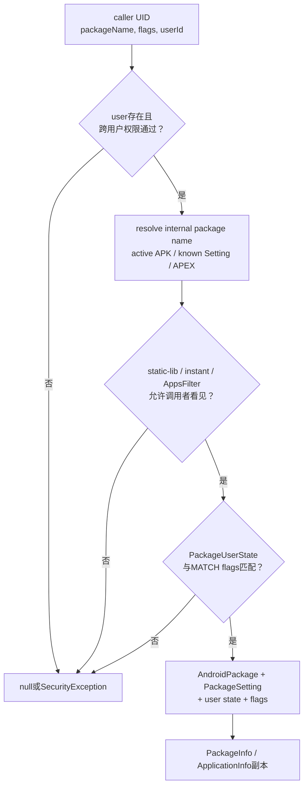
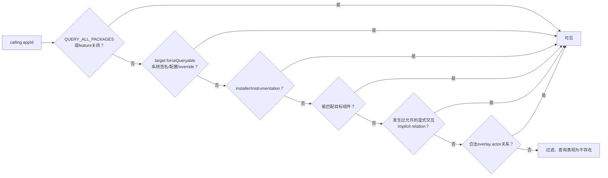
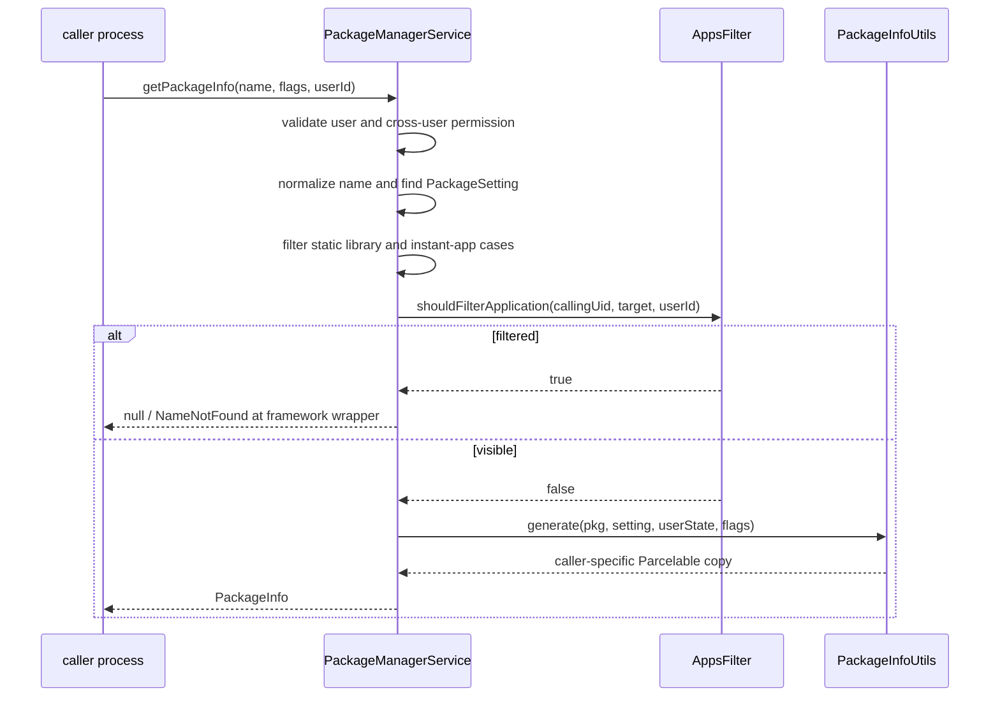

# 253 Android PackageInfo、ApplicationInfo、PackageUserState与AppsFilter查询可见性链

> 源码版本：Android 11 / `android-11.0.0_r48`  
> 学习方式：macOS只读核源，不编译、不运行AOSP

## 1. 本章要解决什么

第252章把包提交进`mPackages`、Settings和组件索引。本章反向研究“查询者最终能看到什么”：

```text
AndroidPackage为什么不能直接返回给App？
同一包对user 0和user 10为何生成不同ApplicationInfo？
包被disabled、hidden、stopped、suspended时分别影响什么？
MATCH_UNINSTALLED_PACKAGES、MATCH_ANY_USER和MATCH_KNOWN_PACKAGES怎样匹配？
跨用户权限与包可见性是不是同一道检查？
Android 11的<queries>怎样进入AppsFilter？
为什么包明明存在，getPackageInfo仍返回null？
PackageInfo里的组件、权限、签名和metadata为什么随flags变化？
```

## 2. 一句总纲

```text
Binder调用者UID + 目标userId + 查询flags
→ 用户存在与跨用户权限
→ 内部包名归一化/目标Setting查找
→ static-lib、instant-app与AppsFilter可见性
→ PackageUserState的installed/hidden/enabled/Direct Boot匹配
→ AndroidPackage + PackageSetting + user state按flags生成副本
→ 返回PackageInfo/ApplicationInfo，或用null模拟“不存在”
```

## 3. 五道门先记住

| 门 | 回答的问题 |
|---|---|
| 用户门 | 目标user是否存在，调用者能否跨user查询 |
| 名称/对象门 | 包名映射到哪个活动包、静态库版本或APEX |
| 可见性门 | 调用者是否允许知道目标包存在 |
| 用户状态门 | 目标包对该user是否installed/hidden/enabled且符合Direct Boot |
| 字段门 | flags要求PackageInfo携带哪些昂贵或敏感字段 |

## 4. 源码地图

```text
frameworks/base/services/core/java/com/android/server/pm/PackageManagerService.java
frameworks/base/services/core/java/com/android/server/pm/AppsFilter.java
frameworks/base/services/core/java/com/android/server/pm/PackageSetting.java
frameworks/base/core/java/android/content/pm/PackageUserState.java
frameworks/base/services/core/java/com/android/server/pm/parsing/PackageInfoUtils.java
frameworks/base/core/java/android/content/pm/parsing/PackageInfoWithoutStateUtils.java
frameworks/base/core/java/android/content/pm/PackageInfo.java
frameworks/base/core/java/android/content/pm/ApplicationInfo.java
frameworks/base/core/java/android/content/pm/PackageManager.java
```

## 5. 本章边界

本章聚焦`getPackageInfo()`、`getApplicationInfo()`与通用生成/可见性规则。Intent解析中的优先级、preferred activity和Resolver排序留到后续章节。

## 6. 总体查询图



## 7. 四类数据来源

```text
AndroidPackage：Manifest、组件、代码路径等包级事实
PackageSetting：appId、签名、ABI、共享库、安装时间等设备账
PackageUserState：某用户的installed/hidden/enabled/stopped等状态
调用上下文：callingUid、目标userId、flags与包可见性关系
```

PackageInfo是四者合成的查询快照，不是磁盘上的单一对象。

## 8. 为什么不能直接返回AndroidPackage

AndroidPackage属于system_server内部模型，含内部状态并缺少目标用户展开结果。Binder客户端需要Parcelable副本，且不能获得可继续修改PMS内部对象的引用。

## 9. PackageInfo与ApplicationInfo的关系

PackageInfo描述包整体，可按flags包含Activity、Service、Provider、Permission、SigningInfo等；其`applicationInfo`描述应用进程、UID、数据目录、enabled与ABI等。

单独`getApplicationInfo()`无需构造完整PackageInfo。

## 10. 查询入口保存真实调用者

公开接口把`Binder.getCallingUid()`传给内部方法：

```java
return getPackageInfoInternal(packageName, VERSION_CODE_HIGHEST,
        flags, Binder.getCallingUid(), userId);
```

内部可信调用即使稍后`clearCallingIdentity()`，也可显式传原`filterCallingUid`执行可见性过滤。

## 11. `filterCallingUid`与Binder callingUid不同职责

源码注释规定：`filterCallingUid`专用于“原调用者能看哪些包”；目标userId仍由方法验证，跨用户权限则使用当前Binder身份检查。只有可信内部代码能传入自定义filter UID。

## 12. 不存在的user直接怎样处理

`getPackageInfoInternal()`与`getApplicationInfoInternal()`开头若`!mUserManager.exists(userId)`，直接返回null。其他敏感API可能抛SecurityException，不能假定所有PMS查询的失败形式相同。

## 13. 跨用户权限是独立门

存在目标user后，PMS调用`enforceCrossUserPermission()`。同一包是否通过AppsFilter，与调用者有没有`INTERACT_ACROSS_USERS`是两件事：前者控制“看哪个包”，后者控制“看哪个用户”。

## 14. Recents的profile例外

`getApplicationInfoInternal()`允许满足`isRecentsAccessingChildProfiles()`的Recents路径跳过常规跨用户检查。这是受控系统角色例外，不是普通App只靠flags能取得。

## 15. flags会先规范化

`updateFlagsForPackage()`先处理`MATCH_ANY_USER`权限和managed-profile兼容逻辑，再由`updateFlags()`补Direct Boot匹配位。

调用者传入值不是后续实际使用flags的全部。

## 16. Direct Boot默认规则

若调用者没有明确指定aware/unaware：

```text
用户正在解锁或已解锁 → 同时MATCH_DIRECT_BOOT_AWARE与UNAWARE
用户仍锁定           → 只MATCH_DIRECT_BOOT_AWARE
```

这让锁屏前只能查询/解析可在DE环境运行的组件。

## 17. 显式Direct Boot flags优先

调用者若已给aware或unaware任一位，PMS尊重其明确意见，不自动补齐另一位。因此“没传”与“只传aware”在已解锁用户上可能返回不同集合。

## 18. `MATCH_ANY_USER`不是免费扩大范围

只要flags含`MATCH_ANY_USER`，即使给定userId恰好是调用者自己，r48也要求跨用户权限。flag描述匹配意图，不授予权限。

## 19. managed profile兼容补丁

system user调用者请求`MATCH_UNINSTALLED_PACKAGES`且存在managed profile时，r48可能自动补`MATCH_ANY_USER`，避免旧Launcher查不到工作资料应用；源码TODO明确这是历史兼容hack。

## 20. `MATCH_KNOWN_PACKAGES`的位组合

r48常量定义：

```java
MATCH_KNOWN_PACKAGES = MATCH_UNINSTALLED_PACKAGES | MATCH_ANY_USER;
```

所以它不仅意味着“Settings知道”，还会触发`MATCH_ANY_USER`的跨用户权限要求。

## 21. 包名先归一化

PMS在锁内调用`resolveInternalPackageNameLPr(packageName, versionCode)`，处理renamed package和静态共享库的内部合成名。外部名称不总等于`mPackages`键。

## 22. versioned查询为何重要

普通`getPackageInfo()`使用最高版本；`getPackageInfoVersioned()`可携带longVersionCode，使同一静态共享库manifest包名解析到指定内部版本。

## 23. 活动包优先

常规路径先查`mPackages`。找到AndroidPackage后，再取得对应PackageSetting，依次过静态库过滤与`shouldFilterApplicationLocked()`，最后生成PackageInfo。

## 24. known Setting兜底

若活动`mPackages`没有包，但flags含`MATCH_KNOWN_PACKAGES`，可从`mSettings.mPackages`找旧Setting。只有生成器认为该用户状态可匹配时才返回，不能把Settings里每条残留都泄露出去。

## 25. factory-only路径

`MATCH_FACTORY_ONLY`优先找disabled system Setting，表示查询系统镜像基础版而非`/data`更新版；若同时`MATCH_APEX`则由ApexManager查询factory APEX。

## 26. `MATCH_SYSTEM_ONLY`与factory-only不同

system-only只过滤非系统身份；factory-only明确要求原厂系统版本。updated system app的活动数据版仍具有system身份，但不是factory代码路径。

## 27. APEX是旁路

普通APK/Setting未命中且flags含`MATCH_APEX`时，PMS向ApexManager查询active APEX。ApplicationInfo的APEX生成在r48还有TODO，并不完全等价于普通APK生成。

## 28. `android`/`system`特殊别名

`getApplicationInfoInternal()`在普通包和APEX未命中后，对`android`或`system`返回`mAndroidApplication`。这是平台包的特殊兼容路径。

## 29. static shared library另有可见性门

静态共享库不是普通App。调用者通常只能看自己依赖的库；system/shell/root、安装器或带适当flag与权限的调用者有更宽范围。它在AppsFilter之前由`filterSharedLibPackageLPr()`单独处理。

## 30. 为什么库可见性不完全交给AppsFilter

静态库按manifest包名+版本共存，并由依赖关系暴露；普通应用枚举规则以appId/package为中心。两套语义不同，所以源码明确在更高层过滤static lib。

## 31. `shouldFilterApplicationLocked()`的目标

返回true表示“应对调用者隐藏目标”。查询API通常随后返回null，让未授权调用者无法区分“确实不存在”和“存在但不可见”。

这比抛“权限不足且包存在”的异常更能防枚举。

## 32. isolated UID先还原owner

若callingUid是isolated process，PMS先从`mIsolatedOwners`找真实宿主UID，再做same-app、instant与AppsFilter判断。否则每个isolated UID都会被当成没有Manifest可见性声明的陌生App。

## 33. same app永远先放行

目标PackageSetting与callingUid属于同一appId时不滤。多用户UID高位不同，但same-app判断关注应用身份；shared UID成员也共享appId带来的查询关系。

## 34. instant app规则先于普通AppsFilter

PMS先识别调用者/目标是否instant app，应用更严格的组件暴露、交互授权和`ACCESS_INSTANT_APPS`规则；双方都是普通installed app时才进入AppsFilter主路径。

## 35. instant调用者看另一个instant app

不同instant app之间直接过滤。instant app不能像普通安装应用那样枚举其他临时应用。

## 36. instant调用者看installed app

指定组件必须显式`visibleToInstantApps`，或与其instrumentation target关系匹配；只查应用时，目标包至少有暴露给instant app的组件。

## 37. installed调用者看instant目标

system/root/shell、具备相关权限/角色者可看；普通App查询具体instant组件会过滤，查询整个instant应用还需InstantAppRegistry记录显式交互授权。

## 38. instant权限列表还会再过滤

即使PackageInfo可见，`generatePackageInfo()`会从目标instant app已授予权限集合中移除非instant权限，并对异常状态记录安全EventLog。可见包不等于可看见不该属于它的授权。

## 39. 普通AppsFilter输入

PMS按calling appId从Settings取得`PackageSetting`或`SharedUserSetting`作为callingSetting，再调用：

```text
mAppsFilter.shouldFilterApplication(callingUid, callingSetting,
        targetPackageSetting, targetUserId)
```

## 40. Android 11为什么引入包可见性

完整已安装包列表可用于设备指纹、竞品探测、金融/健康应用识别。Android 11默认让应用只看与自身业务相关的包，并通过Manifest `<queries>`或受控例外扩大范围。

## 41. AppsFilter关系图



## 42. 低appId与same app快速放行

AppsFilter对system等低于`FIRST_APPLICATION_UID`的调用方、低appId目标以及caller/target同appId直接返回不滤。这也是很多adb/system_server实验看不到普通App限制的原因。

## 43. 全局feature可关闭

FeatureConfig从DeviceConfig和compat change决定过滤是否启用及某包是否受规则约束。关闭时AppsFilter返回不滤；它是平台迁移控制，不是普通应用自行关闭。

## 44. callingSetting缺失默认拒绝

非system UID若找不到Settings身份，AppsFilter记录wtf并过滤。安全策略在无法证明调用者声明了哪些`<queries>`时采取fail closed。

## 45. target `pkg==null`也拒绝

只有Setting但当前无AndroidPackage的目标，在AppsFilter内部被视为不可用并过滤。`MATCH_KNOWN_PACKAGES`的最小信息路径还受上层调用次序和例外处理约束。

## 46. `QUERY_ALL_PACKAGES`

调用包若拥有请求全部包的受控能力，AppsFilter放行所有目标。它不是在运行时flags里随手加一位，而是Manifest/权限与平台政策认定的调用者属性。

## 47. forceQueryable目标

某些目标对所有应用可见，例如配置允许的system app、Manifest标记、设备白名单、adb override或与平台完全签名匹配的系统包。AppsFilter按target appId维护`mForceQueryable`。

## 48. `<queries><package>`关系

调用包显式列出目标包名时，`mQueriesViaPackage`保存`callingAppId → targetAppId`。installer关系、双方instrumentation等也可能加入同一类直接可见映射。

## 49. `<queries><intent>`关系

AppsFilter把查询方的intent模板与其他包可导出组件的IntentFilter匹配，命中时加入`mQueriesViaComponent`。这是“我需要能处理某类动作的应用”，不是知道具体包名。

## 50. provider authority查询

`<queries><provider android:authorities=...>`也参与组件可见性计算，使调用者可看见提供相应authority的包。

## 51. protected broadcast为何触发重算

component query匹配会受protected broadcast语义影响。新包增加protected broadcast可能让以前计算的关系失效，AppsFilter标记`mQueriesViaComponentRequireRecompute`，首次需要时再全量重算。

## 52. implicit visibility方向

若应用A显式启动/绑定应用B，系统可记录“B可以反查A”。原因是B已经被A主动暴露了调用关系，B需要识别客户。它不是自动让A借交互看见任意B的所有包信息。

## 53. implicit关系按完整UID

`mImplicitlyQueryable`记录caller/target完整UID，因此包含userId；同一appId在user 0发生交互，不自动把user 10的关系也放开。

## 54. overlay actor关系

合法overlay actor需要管理目标/overlay包，AppsFilter通过OverlayReferenceMapper放行对应查询；shared UID调用者会逐个检查成员包是否是合法actor。

## 55. shared UID怎样合并queries能力

callingSetting若属于SharedUserSetting，AppsFilter遍历共享UID的所有成员。任一成员不受过滤、请求QUERY_ALL或具有合法关系，都可能让同一appId获得可见性。

这也是shared UID扩大安全边界的又一例子。

## 56. AppsFilter在包commit时更新

第252章`commitPackageSettings()`调用`mAppsFilter.addPackage(pkgSetting, isReplace)`。它把新包与所有现存包双向比较，更新force、package、component、instrumentation和overlay关系。

## 57. replace为何先remove

包更新可能删除旧`<queries>`或protected broadcast。`isReplace=true`时先移除旧关系，再按新Manifest重建，防止旧可见性残留。

## 58. systemReady前后的cache

AppsFilter的`mShouldFilterCache`在`onSystemReady()`前为null，查询会实时计算；`onSystemReady()`调用`updateEntireShouldFilterCacheAsync()`异步建立“完整UID→目标UID”的布尔缓存。因而方法返回后的短暂窗口仍可能走实时计算，cache发布后才走缓存快路。

## 59. cache缺项时fail closed

cache存在但找不到caller或caller→target项时，源码记录wtf/warning并返回过滤。缓存异常不能变成意外枚举放行。

## 60. cache不是唯一真相

包安装/删除/replace、用户变化和component规则重算都会更新或重建cache。真实规则仍来自Settings、Manifest queries、implicit关系和平台配置。

## 61. 可见性判断序列图



## 62. PackageUserState是一用户一份

字段包括`installed`、`stopped`、`notLaunched`、`hidden`、`suspended`、distraction、instant、enabled、组件覆盖、overlay paths、domain verification、install reason等。

同一AndroidPackage可对应多个完全不同的用户状态。

## 63. `installed`的含义

表示包对该用户安装。多用户共享同一APK代码，但每个用户有独立installed位；卸载“仅当前用户”可只把该位设false，而代码仍为其他用户保留。

## 64. `hidden`不是包可见性AppsFilter

PackageUserState.hidden通常表示owner/admin隐藏或用户安装状态限制；AppsFilter是调用者与目标之间的枚举权限。两者都可能导致查询null，但来源不同。

## 65. `stopped`不等于disabled

stopped用于首次安装未启动或用户强行停止后的运行/广播语义；enabled决定包/组件能否正常匹配和启动。一个包可以enabled但stopped。

## 66. `suspended`也不是disabled

suspended由管理/数字健康等策略阻止或限制交互，ApplicationInfo带`FLAG_SUSPENDED`；Manifest组件本身并未被改为disabled。

## 67. `isAvailable(flags)`公式

```java
return matchAnyUser
        || (installed && (!hidden || matchUninstalled));
```

默认要求目标用户已安装且未hidden；`MATCH_UNINSTALLED_PACKAGES`只放宽hidden，不单独让`installed=false`的普通包可用；`MATCH_ANY_USER`则直接放宽。

## 68. 系统已知包有额外兜底

组件/应用生成器允许system包在`MATCH_KNOWN_PACKAGES`或`MATCH_HIDDEN_UNTIL_INSTALLED_COMPONENTS`下，即使当前用户不可用也生成信息。这是系统镜像已知包的特殊语义。

## 69. hidden-until-installed

预装包可标记“安装前隐藏”。若当前用户未安装且调用者没带`MATCH_HIDDEN_UNTIL_INSTALLED_COMPONENTS`，生成器优先返回null，避免提前暴露占位系统组件。

## 70. 包级enabled覆盖顺序

PackageUserState.enabled若是DISABLED或DISABLED_USER，组件不匹配；DISABLED_UNTIL_USED需要对应match flag；DEFAULT再看Manifest包级enabled；显式ENABLED则越过包级默认。

## 71. 组件级覆盖优先Manifest

包级通过后，`enabledComponents`中的组件强制true，`disabledComponents`强制false，否则回到组件Manifest `enabled`。这正是`setComponentEnabledSetting()`持久化结果的查询应用点。

## 72. `MATCH_DISABLED_COMPONENTS`

带此flag时`PackageUserState.isEnabled()`直接返回true，允许管理/诊断查询disabled组件。它只改变结果匹配，不会真的启用组件。

## 73. ApplicationInfo查询与组件查询的差异

`getApplicationInfoInternal()`注释明确“不在入口用isEnabled过滤——总是返回info”；生成的ApplicationInfo通过`enabled=false`表达禁用状态。组件列表/Intent解析则用`ComponentParseUtils.isMatch()`把disabled组件滤掉，除非flags要求包含。

## 74. Direct Boot在组件级匹配

`isMatch()`最后要求组件的`directBootAware`与规范化后的aware/unaware flags至少一项相符。ApplicationInfo本身存在，不代表用户锁定时它的所有组件都能解析出来。

## 75. `MATCH_SYSTEM_ONLY`

PackageUserState匹配还检查包是否system。它是结果过滤条件，不让普通App通过伪造Manifest flag变成系统包；system身份来自scan/Setting。

## 76. PackageInfo生成入口

PMS取：

```text
state = ps.readUserState(userId)
p = ps.pkg
permissionsState = ps.getPermissionsState()
```

按需计算gids和已授予权限，再调用`PackageInfoUtils.generate(...)`。

## 77. `GET_GIDS`才计算GID

未请求时使用空数组，避免每次简单包名查询都计算权限派生的supplementary groups。flags既是信息权限/兼容合同，也是性能合同。

## 78. 已授予权限与requestedPermissions不同

AndroidPackage保存Manifest请求列表；PermissionsState保存某用户实际授予。PackageInfo生成需要两者对齐，才能填requestedPermissionsFlags等状态。

## 79. ApplicationInfo按用户初始化UID

`generateApplicationInfoUnchecked()`先从内部模型浅拷贝，再`initForUser(userId)`，把appId组合为`UserHandle.getUid(userId, appId)`，同时生成该用户的dataDir、DE/CE目录。

所以同一包跨用户ApplicationInfo.uid不同。

## 80. 用户状态怎样变成ApplicationInfo flags

```text
stopped   → FLAG_STOPPED
installed → FLAG_INSTALLED
suspended → FLAG_SUSPENDED
instant   → PRIVATE_FLAG_INSTANT
hidden    → PRIVATE_FLAG_HIDDEN
virtualPreload → PRIVATE_FLAG_VIRTUAL_PRELOAD
```

## 81. enabled怎样进入ApplicationInfo

user enabled=ENABLED时强制`ai.enabled=true`；DISABLED/USER时false；DISABLED_UNTIL_USED取决于查询flag；DEFAULT保留Manifest生成值。`enabledSetting`同时记录覆盖枚举值。

## 82. SEInfo也含用户部分

`ApplicationInfo.seInfo`综合包与Setting；`seInfoUser`根据PackageUserState计算。SELinux身份不仅由Manifest决定，也与instant等用户态属性有关。

## 83. overlay paths按用户注入

`resourceDirs = state.getAllOverlayPaths()`，把该用户启用的overlay及共享库overlay路径合并到ApplicationInfo。不同用户可以看到不同资源覆盖结果。

## 84. ABI与共享库来自Setting补充

PackageInfoUtils用PackageSetting覆盖/补充primary/secondary ABI、updated-system-app flag、uses-library文件与SharedLibraryInfo。解析模型与运行设备派生状态在这里再次合流。

## 85. metadata按需返回

没带`GET_META_DATA`时，ApplicationInfo与组件Info的`metaData`被置null。不是Manifest没写，而是调用者没请求，借此减少Parcel体积。

## 86. 共享库信息也按需

未带`GET_SHARED_LIBRARY_FILES`时清空`sharedLibraryFiles`和`sharedLibraryInfos`。不要用默认ApplicationInfo里的null推断应用没有uses-library。

## 87. 组件数组按各自GET flag

只有`GET_ACTIVITIES`、`GET_RECEIVERS`、`GET_SERVICES`、`GET_PROVIDERS`、`GET_INSTRUMENTATION`对应位存在，PackageInfo才分配并填充数组。

## 88. 请求组件后仍逐个match

即使带`GET_ACTIVITIES`，每个Activity仍要过installed/hidden、enabled、system-only和Direct Boot条件；结果数组长度可能小于Manifest组件数。

## 89. App Details Activity被特殊排除

生成activities数组时，PMS内部的`APP_DETAILS_ACTIVITY_CLASS_NAME`被跳过。它是包管理内部合成/特殊组件，不作为普通Manifest Activity结果暴露。

## 90. 签名字段随flag

旧`GET_SIGNATURES`填legacy signatures；`GET_SIGNING_CERTIFICATES`生成SigningInfo，保留多签名与证书轮换历史语义。默认查询不会无条件携带签名对象。

## 91. Provider URI patterns按需

ProviderInfo只有带`GET_URI_PERMISSION_PATTERNS`才保留`uriPermissionPatterns`。这是另一个“Info对象null不等于Manifest无声明”的例子。

## 92. 输出是浅拷贝再裁剪

ApplicationInfo由`toAppInfoWithoutState()`浅拷贝，组件Info新建并复制字段；随后按flags清空不需要的引用。客户端改返回对象不会直接改PMS内部PackageImpl。

“浅拷贝”仍要求生成器谨慎处理Bundle/数组等可变字段。

## 93. 外部包名最后恢复

内部可能使用renamed名或静态库合成名。生成后PMS用`resolveExternalPackageNameLPr()`改PackageInfo/ApplicationInfo.packageName，保证公开API看到稳定外部名称。

## 94. `ps.pkg==null`最小信息

当Settings知道包但当前没有AndroidPackage，且`MATCH_UNINSTALLED_PACKAGES`与state允许时，PMS手工构造最小PackageInfo：名称、版本、sharedUserId、时间、UID、ABI与flags。

它没有当前Manifest组件可填，所以不能期待activities/services等完整字段。

## 95. 最小信息为何有价值

卸载保留数据、卷暂不可用或known package管理界面仍可能需要显示包名、UID/版本等账本信息；这不代表代码当前可启动。

## 96. `isPackageAvailable()`更严格简洁

它只查活动`mPackages`、过可见性门，然后用`PackageParser.isAvailable(state)`判断，不接受任意PackageInfo flags。不要用getPackageInfo的扩展match语义替代“当前可用”判断。

## 97. `checkPackageStartable()`还多更多门

它要求目标用户installed、非不允许的safe-mode第三方包、不处于frozen，并在用户锁定时要求encryption aware。能查到PackageInfo远弱于“现在可以启动”。

## 98. 查询null的可能原因清单

```text
user不存在
包名/版本归一化后无目标
没有相应MATCH flag
static shared library对调用者不可见
instant app规则过滤
AppsFilter过滤
PackageUserState不available
hidden-until-installed或system-only/Direct Boot不匹配
```

定位时要按顺序排除，不能看到null就认定没安装。

## 99. SecurityException与null的边界

跨用户权限失败通常抛SecurityException；包枚举可见性失败通常伪装为null，Java PackageManager包装层再可能转为NameNotFoundException。前者隐藏不了“你请求了别的用户”，后者要隐藏目标包存在性。

## 100. 易错理解一：`MATCH_UNINSTALLED_PACKAGES`能看所有用户

错。它主要放宽hidden/卸载信息匹配；跨用户仍由userId与权限控制。r48 managed-profile自动补ANY_USER只是受限兼容hack。

## 101. 易错理解二：`MATCH_ANY_USER`就是权限

错。它反而触发强制跨用户权限检查。match flag表达查询范围，permission决定是否有权提出范围。

## 102. 易错理解三：disabled包getApplicationInfo一定失败

错。包级ApplicationInfo通常仍返回，`enabled=false`表达状态；组件解析默认不匹配disabled组件。

## 103. 易错理解四：stopped就是查不到

错。stopped主要影响启动/广播语义，ApplicationInfo会带FLAG_STOPPED；是否查询可见还要看installed、hidden与AppsFilter。

## 104. 易错理解五：同user已安装就必然可见

错。Android 11 AppsFilter仍可能因调用者未声明`<queries>`、无交互/角色关系而返回null。

## 105. 易错理解六：带GET_ACTIVITIES就返回Manifest全部Activity

错。它只请求该类字段；每个组件仍受用户状态、enabled、Direct Boot和system-only match。

## 106. 易错理解七：PackageInfo是PMS live对象

错。它是按调用者、用户与flags生成的Parcelable快照。返回后系统状态可能变化，旧对象不会自动刷新。

## 107. 第一次复读：两种“看不见”修订

必须区分：

```text
PackageUserState hidden/installed：目标对某user的安装状态
AppsFilter：某calling app是否有权枚举目标
```

前者是user→package，后者是caller→target→user关系。

## 108. 第二次复读：enabled修订

enabled不是PackageInfo存在门的简单同义词。应用级查询保留对象并写`ApplicationInfo.enabled`；组件匹配则把enabled作为过滤条件。这使设置页能看见并重新启用已disabled应用。

## 109. 第三次复读：flags修订

flags同时承担三种角色：选择返回字段、改变匹配范围、指定Direct Boot语义；但它不替代跨用户权限或AppsFilter授权。阅读某一位前先判断它属于哪一类。

## 110. 第四次复读：可见性cache修订

systemReady前AppsFilter没有全量cache并不代表不执行过滤，而是实时计算；systemReady后cache缺项反而fail closed。缓存改变性能，不改变设计上的允许关系。

## 111. 第五次复读：可启动边界修订

getPackageInfo成功只说明“在给定flags和调用身份下可生成信息”。真正启动还需组件enabled/Direct Boot匹配、包未frozen、safe mode、用户数据解锁和AMS/WMS等后续条件。

## 112. 版本边界

本章对应`android-11.0.0_r48`。新Android引入Computer快照、PackageStateInternal、PackageUserStateInternal和重构后的AppsFilter缓存；本章的五道门思想仍适用，但类名与锁内生成方式需按目标版本复核。

## 113. macOS只读练习1：手画getPackageInfo五道门

```bash
cd /Users/ninebot/androidSource
sed -n '4500,4590p' \
  frameworks/base/services/core/java/com/android/server/pm/PackageManagerService.java
sed -n '4350,4445p' \
  frameworks/base/services/core/java/com/android/server/pm/PackageManagerService.java
```

按源码顺序标出user、flags、跨用户、名称、static lib、AppsFilter、user state与generate，不要按自己的直觉换序。

## 114. macOS只读练习2：验证PackageUserState公式

```bash
cd /Users/ninebot/androidSource
sed -n '210,320p' \
  frameworks/base/core/java/android/content/pm/PackageUserState.java
```

为installed/hidden各取true/false，分别计算默认、MATCH_UNINSTALLED、MATCH_ANY_USER结果；再解释disabled为何不在`isAvailable()`里。

## 115. macOS只读练习3：追AppsFilter放行路径

```bash
cd /Users/ninebot/androidSource
sed -n '960,1190p' \
  frameworks/base/services/core/java/com/android/server/pm/AppsFilter.java
sed -n '520,625p' \
  frameworks/base/services/core/java/com/android/server/pm/AppsFilter.java
```

找出same app、QUERY_ALL、force、queries package、queries component、implicit与overlay actor，并记录映射使用appId还是完整UID。

## 116. macOS只读练习4：观察Info如何按flags裁剪

```bash
cd /Users/ninebot/androidSource
sed -n '80,235p' \
  frameworks/base/services/core/java/com/android/server/pm/parsing/PackageInfoUtils.java
sed -n '330,390p' \
  frameworks/base/core/java/android/content/pm/parsing/PackageInfoWithoutStateUtils.java
```

找出GET_ACTIVITIES、GET_META_DATA、GET_SHARED_LIBRARY_FILES，以及userId怎样进入UID/dataDir，最后解释为何两次不同flags查询不能复用同一结果对象。

## 117. 自测题

1. PackageInfo由哪四类事实合成？
2. 跨用户权限与AppsFilter分别保护什么？
3. MATCH_KNOWN_PACKAGES为何会要求跨用户权限？
4. installed、hidden、enabled、stopped分别影响什么？
5. 为什么disabled应用仍可能返回ApplicationInfo？
6. `<queries><package>`与`<queries><intent>`分别进入哪个映射？
7. implicit visibility为什么常是被调用方反查调用方？
8. PackageInfo.activities为何少于Manifest Activity数量？
9. `ps.pkg==null`时能返回怎样的信息？
10. 查询成功为何不等于应用现在可启动？

## 118. 自测题参考答案

1. AndroidPackage、PackageSetting、目标PackageUserState、调用UID/userId/flags与可见性上下文。
2. 前者控制是否可访问目标用户，后者控制调用应用能否知道目标包存在。
3. r48中它是UNINSTALLED与ANY_USER的按位组合，ANY_USER会触发权限检查。
4. 是否给该user安装、是否被管理隐藏、包/组件能否匹配、强停/首次未启动的运行与广播语义。
5. 管理和设置界面仍需看见对象；返回值用`enabled=false`表达，组件解析再默认过滤。
6. 前者`mQueriesViaPackage`，后者匹配后进入`mQueriesViaComponent`。
7. 调用方已向被调用方暴露身份，被调用方可能需要识别客户；关系仍按系统记录而非任意枚举。
8. 还要过enabled、installed/hidden、system-only、Direct Boot等逐组件匹配，并排除特殊App Details Activity。
9. 名称、版本、UID、ABI、flags、时间等Settings最小账本信息，没有当前完整组件模型。
10. 还需startable、用户解锁、frozen/safe mode、组件解析和进程启动等后续条件。

## 119. 本章总结

PMS查询不是“从HashMap取对象”，而是按调用者构造视图。目标用户必须存在且跨用户权限通过；外部包名要解析为活动APK、known Setting、静态库版本或APEX；instant与AppsFilter决定调用者是否有权知道目标存在；PackageUserState再决定该user的installed、hidden、enabled和Direct Boot匹配；最后PackageInfoUtils把AndroidPackage、PackageSetting和用户状态合成按flags裁剪的Parcelable副本。于是同一个包面对不同UID、不同userId、不同flags，可以合法得到完整信息、最小信息、不同组件集合或null。

## 120. 下一章预告

第254章进入Intent查询与解析：ComponentResolver怎样建立Activity/Receiver/Service/Provider索引，IntentFilter如何按action、category、data scheme/type匹配，PMS又如何叠加AppsFilter、用户状态、preferred activity和Resolver排序。
