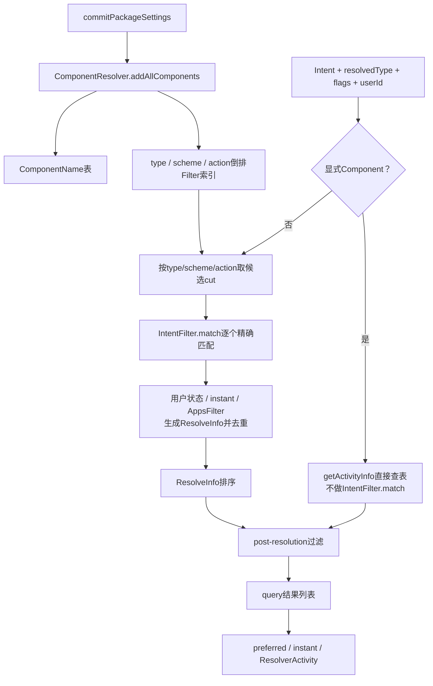
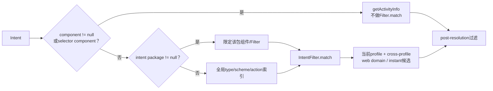
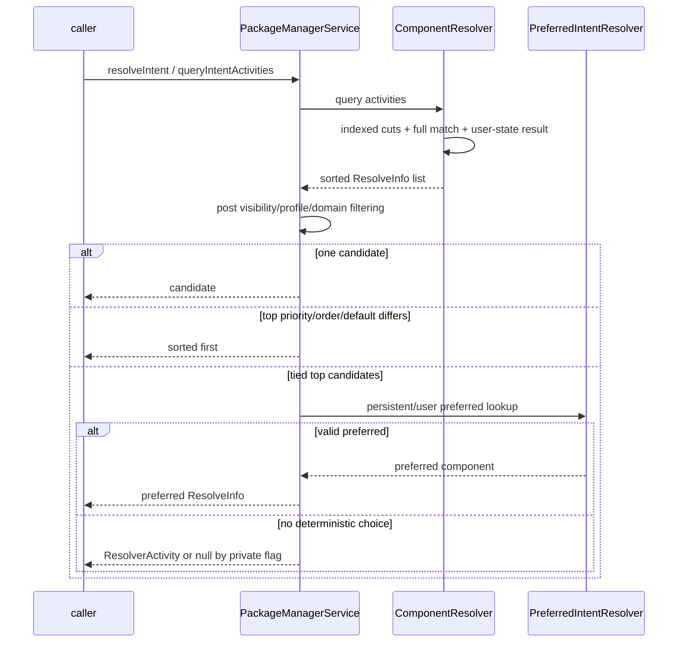

# 254 Android ComponentResolver、IntentFilter匹配与Activity查询排序链

> 源码版本：Android 11 / `android-11.0.0_r48`  
> 学习方式：macOS只读核源，不编译、不运行AOSP

## 1. 本章要解决什么

第253章解释“调用者是否看得见某个包”。本章继续回答：一个Intent为什么匹配某个组件，多个匹配结果又为什么选中其中一个？

```text
显式Component、setPackage和完全隐式Intent走同一条路吗？
ComponentResolver如何避免每次扫描所有组件？
action、category、MIME type、scheme、host、port、path怎样匹配？
CATEGORY_DEFAULT为什么不完全属于普通category match？
正数match值和filter priority哪个更先影响排序？
同一Activity有多个Filter命中时会出现几条结果？
包可见性、enabled、stopped、Direct Boot在哪一层过滤？
preferred activity、默认浏览器、ResolverActivity怎样介入最终选择？
query成功为什么仍不代表Activity一定能启动？
```

## 2. 一句总纲

```text
包commit时把组件和Filter注册到多类倒排索引
→ 查询先按显式Component / 指定package / 全局隐式分流
→ 用type、scheme或action索引取得少量候选Filter
→ IntentFilter完整匹配action + data/type + categories
→ 生成ResolveInfo并应用用户、enabled、Direct Boot、instant与AppsFilter门
→ 去重并按priority、preferredOrder、default、match、system、包名排序
→ resolve单结果时再检查preferred；必要时返回ResolverActivity
```

## 3. query与resolve先分开

```text
queryIntentActivities：返回所有允许看到且匹配的ResolveInfo列表
resolveIntent：在查询列表上选择一个最佳ResolveInfo
startActivity：拿选中组件继续做exported、permission、后台启动等执行检查
```

三个“成功点”不同。

## 4. 源码地图

```text
frameworks/base/services/core/java/com/android/server/pm/ComponentResolver.java
frameworks/base/services/core/java/com/android/server/pm/PackageManagerService.java
frameworks/base/services/core/java/com/android/server/IntentResolver.java
frameworks/base/core/java/android/content/IntentFilter.java
frameworks/base/core/java/android/content/Intent.java
frameworks/base/core/java/android/content/pm/ResolveInfo.java
frameworks/base/services/core/java/com/android/server/pm/PreferredActivity.java
frameworks/base/services/core/java/com/android/server/pm/PreferredIntentResolver.java
frameworks/base/services/core/java/com/android/server/pm/CrossProfileIntentFilter.java
```

## 5. 本章边界

本章以Activity查询/选择为主，兼顾Receiver、Service和Provider共用结构。ATMS真正启动Activity时的exported、permission、Task和进程调度另章展开。

## 6. 总体链路图



## 7. ComponentResolver运行在哪里

它是PMS在`system_server`内的组件索引器，与PMS共享`mLock`。查询通常发生在Binder线程，启动扫描注册发生在SystemServer主线程或安装线程。

## 8. 为什么与PMS共享锁

Resolver创建ResolveInfo时还要读取PackageSetting、用户状态和AndroidPackage。如果它使用独立锁，再回调PMS锁，容易形成锁层级死锁；r48直接共享同一锁以保证一致性。

## 9. 四套组件Resolver

```text
ActivityIntentResolver
ReceiverIntentResolver（复用Activity结构，但组件集合不同）
ServiceIntentResolver
ProviderIntentResolver
```

每套既有`ComponentName → ParsedComponent`表，也有IntentFilter倒排索引。

## 10. Provider还有authority表

除Provider的IntentFilter Resolver外，ComponentResolver另有`mProvidersByAuthority`。`content://authority/...`查Provider通常按authority直达，不必走IntentFilter动作匹配。

## 11. 组件何时进入索引

第252章commit调用：

```java
mComponentResolver.addAllComponents(pkg, chatty);
```

它依次加入Activity、Receiver、Provider、Service；更新/卸载则调用`removeAllComponents()`删除旧组件和Filter。

## 12. Activity注册了两类信息

`addActivity()`先把组件放入`mActivities`，再遍历其每个ParsedIntentInfo，组合为`Pair<ParsedActivity, ParsedIntentInfo>`交给通用IntentResolver的`addFilter()`。

## 13. 为什么Pair里既有组件又有Filter

一个Activity可声明多个IntentFilter。索引单位是Filter，但命中后要生成该Activity的ActivityInfo，因此候选同时携带组件与具体Filter。

## 14. Receiver复用Activity类的原因

Manifest中的Activity和Receiver很多解析字段相似，r48均使用ParsedActivity；ReceiverIntentResolver只覆写`getResolveList()`返回receivers，索引实例与activities仍分开。

## 15. Provider多authority细节

一个Provider authority字符串可用分号分隔多个名称。PMS逐个注册，重复authority跳过并记录已被哪个包占用；只有第一authority可保持syncable，后续副本清除syncable。

## 16. 注册后还会调整priority

Activity Filter加入索引后，ComponentResolver在锁外取得setup wizard和disabled system基础版信息，再执行`adjustPriority()`。Manifest写的priority不是最终一定保留的priority。

## 17. 普通应用正priority被封顶

非privileged应用的Activity Filter若priority大于0，r48会改为0，防止普通应用仅靠高priority劫持通用Intent。

## 18. protected actions更严格

`ACTION_SEND`、`SENDTO`、`SEND_MULTIPLE`、`VIEW`属于受保护动作；即便privileged应用，正priority通常也封顶0，setup wizard是源码列出的特殊例外。

## 19. 为什么protected filter延迟修正

扫描初期还不知道哪个包是setup wizard。PMS先暂存这些高priority Filter，系统包扫描完成后`fixProtectedFilterPriorities()`统一识别例外并把其他项降为0。

## 20. updated privileged app不能扩权

`/data`更新版若为预装privileged应用，只能保留系统基础版已有Activity/Filter范围内的priority；新增组件或action/category/scheme/authority范围会被降到0。

这里要严格按r48源码理解“Filter范围”：`adjustPriority()`先找同名系统Activity，再依次对action、category、scheme、authority做“更新版集合必须是某个系统Filter集合的子集”检查，最后把priority封顶到这些匹配系统Filter中的最大值。它并没有在这一段把MIME type、path等每个IntentFilter维度逐项做等价比较，不能泛化成“两个Filter全部字段必须完全相同”。

## 21. 倒排索引解决什么

设备可能有上万个IntentFilter。若每次解析Intent都遍历全部Filter，复杂度和锁持有时间太高。IntentResolver预先维护：

```text
完整MIME type → filters
base type / wildcard type → filters
scheme → filters
无data action → filters
有type action → filters
```

## 22. 索引只负责召回候选

scheme索引只知道`https`，不知道host/path是否匹配；type索引也未检查action/category。因此从索引得到的“cut”必须再调用`IntentFilter.match()`完整验证。

## 23. MIME索引的三层

例如查询`image/jpeg`：

```text
first cut  → 精确image/jpeg
second cut → image/*
third cut  → */*
```

查询`image/*`则从base与wild表召回该大类，并同样考虑`*/*`。

## 24. `*/*`查询先按action缩小

任意MIME会命中大量Filter。若Intent有action，r48先从`mTypedActionToFilter[action]`取候选，再做完整type匹配，避免遍历所有typed filters。

## 25. scheme索引

Intent有URI scheme时，从`mSchemeToFilter[scheme]`取候选。host、port、path、scheme-specific-part仍在`matchData()`中逐项精确判断。

## 26. 无type和scheme时按action

只有当`resolvedType==null`、scheme==null且action非null，才用`mActionToFilter[action]`作为第一cut。这张表对应“无data”的Filter候选。

## 27. 多个cut可能重复同一Filter

一个Filter可同时经type与scheme召回。Resolver在创建结果前调用`allowFilterResult()`；Activity版本按packageName+activity name查已有结果，避免重复添加同一组件。

## 28. 同一Activity多个Filter也只返回一条

第一个命中的Filter已产生ResolveInfo后，后续同Activity Filter被去重。因此默认结果代表组件，不是一Filter一行。

这也意味着保留下来的`ResolveInfo.filter`通常只是其中一个命中Filter。

## 29. 指定package仍可用全局索引

Intent有`setPackage()`时，通用IntentResolver的`buildResolveList()`会检查`isPackageForFilter()`，跳过其他包Filter；PMS也可直接拿该包的组件列表走`queryIntentForPackage()`。

## 30. `queryIntentForPackage()`怎样工作

它把目标包每个组件的Filters组成多个数组，调用`queryIntentFromList()`逐组匹配。它避免全局索引召回，但仍执行完整Filter匹配、去重、结果生成与排序。

## 31. 显式Component完全不同

Intent带ComponentName时，PMS直接`getActivityInfo(comp, flags, userId)`，不要求其任何IntentFilter匹配当前action/data/category。

显式Intent表达调用者已经指定准确组件。

## 32. selector的处理

若外层Intent没有component但有selector，PMS改用selector继续解析，并重新读取selector component。Selector用于把选择条件与外层Intent分开；最终Filter匹配看到的是selector内容。

## 33. 显式查询仍有过滤

显式ActivityInfo存在后，还会检查instant app暴露规则、普通AppsFilter（非resolveForStart查询场景）及post-resolution过滤。显式不等于绕过所有隐私规则。

## 34. `resolveForStart`与普通query的AppsFilter差别

明确启动目标时，调用者已经知道包/组件，PMS可在受控内部路径避免普通枚举过滤；但ATMS后续仍校验exported、组件permission和调用身份。

这是“能尝试启动”与“能枚举包”的不同威胁模型。

## 35. 三条查询分流图



## 36. `IntentFilter.match()`的顺序

```java
if (action不匹配) return NO_MATCH_ACTION;
int dataMatch = matchData(type, scheme, data);
if (dataMatch < 0) return dataMatch;
if (matchCategories(categories) != null) return NO_MATCH_CATEGORY;
return dataMatch;
```

action → data/type → categories，任一步失败即返回负码。

## 37. 四个负错误码

```text
NO_MATCH_TYPE     = -1
NO_MATCH_DATA     = -2
NO_MATCH_ACTION   = -3
NO_MATCH_CATEGORY = -4
```

这些值用于诊断，不是“越接近0就越接近成功”的排序分数。

## 38. action匹配方向

Intent有action时，Filter必须声明兼容action；否则`NO_MATCH_ACTION`。一个Filter可列多个action，命中任意一个即可。

## 39. Intent action为null的边界

r48的`match()`只在action非null时调用`matchAction()`。无action不会因Filter声明了action直接失败，但仍必须满足data/type与Intent所带categories。

业务上通常应给隐式Intent明确action，避免过宽且难懂的匹配。

## 40. category匹配方向最易写反

要求是“Intent里的每个category都必须在Filter里”。Filter拥有额外category不影响普通match；Intent多出一个Filter没有的category才返回`NO_MATCH_CATEGORY`。

## 41. Filter的DEFAULT为何特殊

`CATEGORY_DEFAULT`仍是普通category集合成员，但Activity query常额外带`MATCH_DEFAULT_ONLY`。此时即使普通action/data/category匹配，Filter若不含DEFAULT也不进入结果。

## 42. `MATCH_DEFAULT_ONLY`不修改Intent categories

它不是给Intent偷偷添加CATEGORY_DEFAULT，而是`buildResolveList()`在match成功后另行检查`filter.hasCategory(DEFAULT)`。

## 43. 为什么startActivity常要求DEFAULT

隐式启动需要选择“愿意作为默认处理者”的Activity；仅用于特殊显式/内部场景的Filter可以不声明DEFAULT，仍能被不带default-only的查询发现。

## 44. type由调用方解析后传入

PMS入口同时接收Intent与`resolvedType`。ContentResolver可能根据`Intent.type`或URI解析MIME；Resolver使用传入的resolvedType，不应只看`intent.getType()`猜测。

## 45. MIME精确与通配

Filter `image/jpeg`只匹配相应具体类型；`image/*`匹配image大类；`*/*`最宽。匹配成功返回的category通常以type为最高数据特异层级。

## 46. type与scheme需要共同满足

Intent同时有MIME和URI时，Filter的数据规则要兼容二者。仅action相同，或仅MIME相同，都不足以让完整match成功。

## 47. 无data规则的Filter

Filter既无MIME也无scheme时，通常只匹配同样没有type和data的Intent。给ACTION_VIEW附上https URI后，不会误命中只声明action的空data Filter。

## 48. scheme后的精度层级

成功值可包含：

```text
MATCH_CATEGORY_SCHEME
MATCH_CATEGORY_HOST
MATCH_CATEGORY_PORT
MATCH_CATEGORY_PATH
MATCH_CATEGORY_SCHEME_SPECIFIC_PART
MATCH_CATEGORY_TYPE
```

它表示最具体的数据匹配类别，并叠加adjustment。

## 49. match正数不是权限

正match只表示Filter语法匹配程度。组件仍可能因用户不存在、disabled、stopped排除、Direct Boot、instant、AppsFilter等被`newResult()`丢弃。

## 50. stopped包何时跳过

`buildResolveList()`若Intent设置排除stopped且`isFilterStopped()`为true，直接跳过候选。是否排除来自Intent flags规范化，不是Filter本身。

## 51. package限制在match前

Intent指定package时，非该包Filter在调用`IntentFilter.match()`前就跳过，既节省计算也避免其他包进入结果。

## 52. `newResult()`再次确认user

ActivityIntentResolver先确认user存在，再取当前AndroidPackage与PackageSetting。索引里即使有陈旧候选，只要包已不在活动状态，也无法生成结果。

## 53. enabled与Direct Boot复查

`PackageManagerInternal.isEnabledAndMatches(activity, flags, userId)`应用第253章的PackageUserState逻辑：installed/hidden、包/组件enabled、system-only与Direct Boot均需匹配。

## 54. ActivityInfo按用户生成

通过状态门后，PackageInfoUtils把AndroidPackage、ParsedActivity、PackageSetting和目标PackageUserState合成ActivityInfo，其中UID、数据目录、enabled、overlay资源都属于该user。

## 55. instant app过滤

Resolver根据`MATCH_INSTANT`、`MATCH_VISIBLE_TO_INSTANT_APP_ONLY`和`MATCH_EXPLICITLY_VISIBLE_ONLY`过滤临时应用及暴露Filter；instant更新可用时也可能丢弃本地Filter，转入instant resolution。

## 56. ResolveInfo保存哪些匹配信息

```text
activityInfo
priority、match、isDefault
label/icon
handleAllWebDataURI
system、isInstantAppAvailable
可选的resolved filter
```

`GET_RESOLVED_FILTER`未设置时`filter`通常为null，以减少Parcel内容。

## 57. `preferredOrder`的r48边界

Activity Resolver中给`ResolveInfo.preferredOrder`赋值的旧代码已注释，TODO写明该字段此前未写且无作用。因此常规结果多为默认0，但比较器仍保留此排序维度。

## 58. 结果去重发生在完整match前

`allowFilterResult()`在当前候选调用match之前检查目标是否已加入。若同一Activity较早Filter已经命中，后来的Filter不再比较；索引cut和遍历顺序可能决定保留哪个Filter元数据。

核心组件结果不重复，但不能假设总会保留该Activity“match分最高”的Filter。

## 59. Activity结果排序规则

`RESOLVE_PRIORITY_SORTER`按以下顺序降序/优先：

```text
1. priority更高
2. preferredOrder更高
3. isDefault=true
4. match值更高
5. system=true
6. packageName字典序
```

## 60. priority比match更先

更高priority的粗匹配可能排在priority较低但data match更具体的结果前。平台通过priority封顶、protected action规则和preferred机制限制其滥用。

## 61. `isDefault`参与两次

default-only查询先彻底排除无DEFAULT Filter；非default-only查询则两类都可进入，排序时`isDefault=true`优先。

## 62. system只是后置tie-breaker

system app不会无条件压过普通App。只有priority、preferredOrder、default、match均相同，system结果才优先。

## 63. packageName保证稳定尾序

前述字段完全相同时按包名字典序，避免结果完全依赖Hash/扫描遍历顺序。相同包不同组件若仍打平，比较器可能返回0并保留稳定排序输入顺序。

## 64. Service和Provider也用同一比较器

各Resolver的`sortResults()`均调用`RESOLVE_PRIORITY_SORTER`，最后tie-break分别取activityInfo/serviceInfo/providerInfo.packageName。

## 65. query列表还要过PMS post filter

ComponentResolver产出的列表回到PMS后，`applyPostResolutionFilter()`继续处理AppsFilter、instant app、dynamic split和调用者可见性。内部索引匹配不是公开结果的最后一步。

## 66. 为什么AppsFilter不直接塞进IntentResolver

IntentResolver是通用索引/语法匹配器；包可见性需要callingUid、userId、instant关系和安装状态。把两者分层可复用索引，同时对不同入口采用不同可见性策略。

## 67. 全局隐式查询还考虑cross-profile

未指定package时，PMS先检查“跳过当前profile”的CrossProfileIntentFilter，再查当前user候选，然后可能加入工作资料/父用户的转发ResolveInfo。

## 68. cross-profile结果不是目标Activity本体

它常是系统转发组件，携带targetUserId，后续由系统跨profile启动。调用者不会直接获得另一个user内任意组件的无权限访问。

## 69. web Intent另有domain选择

http/https候选还按domain verification、默认浏览器、parent profile和instant app可能性过滤。普通Filter匹配只是“语法能处理URL”，不等于域名已授权直接打开。

## 70. instant installer候选可能动态加入

本地结果不足且策略允许时，PMS可加入instant app installer ResolveInfo，触发远端/阶段二解析。它不是来自本地Manifest普通Activity Filter。

## 71. `sortResult`为何不是总为true

ComponentResolver内部已排序当前user结果；只有PMS再加入cross-profile/domain等候选，才需要重新用统一比较器排序。

## 72. query结束与resolve开始

`resolveIntentInternal()`取得查询列表后调用`chooseBestActivity()`。query的第一项通常最优，但多候选相同顶级属性时不能直接取index 0。

## 73. 单候选直接返回

列表大小为1时直接返回该ResolveInfo。仍然只是PMS解析结果；ATMS启动安全检查尚未执行。

## 74. 前两名有明显差异就直接选第一

若前两名的priority、preferredOrder或isDefault任一不同，`chooseBestActivity()`直接返回排序第一名，不再查询用户preferred activity。

## 75. 为什么只比较前两名

列表已按这些字段排序。如果第一与第二存在差异，第一已经严格优于其后全部候选；无需逐个比较。

## 76. 顶级属性相同才查preferred

PMS调用`findPreferredActivityNotLocked()`，依次查persistent preferred和用户`PreferredIntentResolver`，并要求保存项的match category与当前最佳质量一致。

## 77. persistent preferred是什么

设备/系统策略预设的持久默认项，优先于普通用户preferred。它与用户在Resolver里点“始终”产生的Settings记录不是同一来源。

## 78. PreferredActivity保存的不只Component

它保存IntentFilter、match category、当时的候选组件集合、目标Component以及`always`。候选集合用于判断以后安装/卸载新处理器后，旧默认是否仍安全有效。

## 79. match只比较category mask

PMS取当前查询结果最大match，再`& IntentFilter.MATCH_CATEGORY_MASK`与PreferredActivity保存值比较，忽略低位adjustment细节，要求数据匹配类型处于同一质量层。

## 80. `always`与last chosen

用户选“始终”记录`mAlways=true`；仅一次选择/last chosen可用非always记录。调用方要求always时，会跳过非always项。

## 81. preferred目标必须仍在当前query

PMS先取得目标ActivityInfo，再遍历本次ResolveInfo列表确认相同package+class。组件仍存在但已不匹配当前Intent，也不能被旧preferred强行返回。

## 82. 候选集合变小可以保留默认

若当前query只是当年候选集合的子集，且preferred目标仍在，PMS可删除过时组件并刷新PreferredActivity，继续使用旧默认。

## 83. 候选集合出现新竞争者

若当前集合不是旧集合的安全子集，always preferred可能被降为last chosen并返回null，要求用户重新确认，防止新安装应用永远没有竞争默认处理器的机会。

## 84. queryMayBeFiltered为何阻止修改preferred账

Android 11 AppsFilter可能让当前调用者看不全真实候选。若用这个残缺集合判断默认项“已失效”，会错误删除全局用户偏好，所以`queryMayBeFiltered`时避免修改集合。

## 85. Setup Wizard阶段也避免清理Home偏好

设备未provision时，Launcher可能尚未完整安装/可见。对HOME Intent，源码避免因临时缺失删除preferred activity。

## 86. preferred变更怎样持久化

在`mLock`内更新PreferredIntentResolver后，PMS调用`scheduleWritePackageRestrictionsLocked(userId)`，把每用户偏好异步写入package restrictions。

## 87. 没有preferred怎么办

PMS检查候选instant app特殊情况；仍无法唯一选择时，构造系统`mResolveInfo`副本，指向ResolverActivity，让用户选择。

## 88. `RESOLVE_NON_RESOLVER_ONLY`

内部调用若明确禁止返回ResolverActivity，多候选又无可用preferred时返回null。系统调用者可用它问“是否存在无需用户交互的确定目标”。

## 89. 全是浏览器时Resolver也标浏览器

若所有候选`handleAllWebDataURI=true`，合成ResolverInfo也标同属性，保持上层Web Intent策略语义。

## 90. 指定package且多Activity

若Intent限定同一包但内部多个Activity打平，Resolver使用该应用的label/icon而非通用Resolver资源，用户仍可能需要在同包组件之间选择。

## 91. resolve选择序列图



## 92. exported为什么没在Filter match中出现

IntentFilter说明组件愿意处理哪类Intent；`exported`说明其他UID能否调用。query API可为管理/诊断返回组件信息，真正start时ATMS还会按调用UID检查exported和permission。

## 93. permission也不是match维度

两个调用者对同一Intent可得到相同语法候选，但只有持有所需组件permission者能实际启动。不要把ResolveInfo列表当作可执行授权清单。

## 94. Intent flags与query flags不是同一组

```text
Intent flags：EXCLUDE_STOPPED、DEBUG_LOG_RESOLUTION、ACTIVITY_*等请求语义
PackageManager flags：MATCH_DEFAULT_ONLY、MATCH_DISABLED_COMPONENTS、GET_RESOLVED_FILTER等查询语义
```

两者都影响解析，但来源和位空间不同。

## 95. `FLAG_DEBUG_LOG_RESOLUTION`

Intent带此位时IntentResolver打印候选cut、每个Filter的失败原因、match值及最终列表。真实设备调试很有用，但本Mac只读学习不运行系统。

## 96. priority不是用户默认

priority来自Manifest Filter并受平台封顶；preferred来自每用户选择/策略。priority先用于结果排序，只有顶层打平时才查preferred，这是r48明确顺序。

## 97. match值也不是preferred

match表示action/data/category的匹配质量；PreferredActivity是持久化选择。二者通过match category校验关联，但不能互换。

## 98. ResolverActivity不是目标App的一部分

它是Framework/system_server配置的系统UI Activity，作为“多个候选需要用户决定”的合成ResolveInfo返回，用户选定后再启动真正目标。

## 99. 易错理解一：隐式Intent遍历所有Activity

错。先按type、scheme或action倒排索引召回少量Filter，再完整match。

## 100. 易错理解二：action相同就匹配

错。还要同时满足MIME/URI data和Intent全部categories；default-only还有额外DEFAULT门。

## 101. 易错理解三：Filter categories必须与Intent完全相等

错。Intent的每个category必须包含于Filter，Filter可有额外category。

## 102. 易错理解四：显式Intent也必须有匹配Filter

错。显式Component直接查ActivityInfo；Filter是隐式发现规则。

## 103. 易错理解五：match最具体的一定排第一

错。比较器先看priority、preferredOrder、isDefault，之后才看match。

## 104. 易错理解六：system应用一定优先

错。system只是match之后的tie-breaker；前面维度更重要。

## 105. 易错理解七：query结果第一项就是最终默认

不总是。resolve在顶级候选打平时还要查persistent/user preferred，或返回ResolverActivity。

## 106. 易错理解八：ResolveInfo存在就能start

错。exported、permission、AppOps、后台启动限制、用户/进程状态等仍在后续执行链。

## 107. 第一次复读：索引与match边界修订

倒排索引不是匹配结论，只是候选召回。最准确表述是：

```text
index cut降低遍历范围
IntentFilter.match给出语法结论
newResult给出用户态可用结论
PMS post filter给出调用者可见结论
```

## 108. 第二次复读：DEFAULT边界修订

不能写成“Intent没有CATEGORY_DEFAULT所以失败”。常见Activity解析是查询flags带`MATCH_DEFAULT_ONLY`，Resolver在普通match成功后检查Filter是否含DEFAULT；这是query策略，不是Intent category集合被修改。

## 109. 第三次复读：去重边界修订

同一组件多个Filter不会必然选match最高的Filter：`allowFilterResult()`在后续候选match前就可能因组件已有结果而跳过。对业务应依赖组件是否匹配，不应依赖ResolveInfo.filter一定代表最优Filter。

## 110. 第四次复读：排序与preferred边界修订

排序器先产生候选顺序；如果第一名在priority/order/default上严格胜出，preferred不介入。只有顶级候选这些字段打平，才查用户/持久preferred。

## 111. 第五次复读：可见与可启动边界修订

普通query应用AppsFilter防枚举；明确resolveForStart可以采用不同可见性策略，因为调用者已经知道目标，但后续ATMS安全检查不能省略。隐私门变化不等于执行权限放开。

## 112. 版本边界

本章严格对应`android-11.0.0_r48`。后续Android把ComponentResolver、Computer快照、DomainVerification和跨profile解析进一步重构；尤其Web链接默认选择规则变化较多，分析具体设备必须回到对应tag。

## 113. macOS只读练习1：观察Filter倒排索引

```bash
cd /Users/ninebot/androidSource
sed -n '350,680p' \
  frameworks/base/services/core/java/com/android/server/IntentResolver.java
```

画出`image/jpeg`、`image/*`、`*/*`、`https`和无data action分别会访问哪张Map，并说明为什么cut后还要match。

## 114. macOS只读练习2：手算IntentFilter结果

```bash
cd /Users/ninebot/androidSource
sed -n '1570,1665p' \
  frameworks/base/core/java/android/content/IntentFilter.java
sed -n '1800,1860p' \
  frameworks/base/core/java/android/content/IntentFilter.java
```

自拟一个`ACTION_VIEW + https://example.com/a + text/plain + BROWSABLE` Intent，依次修改Filter的action、type、host、path、category，记录`-1/-2/-3/-4`来自哪一步。

## 115. macOS只读练习3：验证显式与隐式分流

```bash
cd /Users/ninebot/androidSource
sed -n '7160,7370p' \
  frameworks/base/services/core/java/com/android/server/pm/PackageManagerService.java
```

标出Component、selector、package-null全局查询、package限定、cross-profile与post filter。回答：显式Component在哪一行调用了IntentFilter.match？

## 116. macOS只读练习4：验证排序与preferred

```bash
cd /Users/ninebot/androidSource
sed -n '90,130p' \
  frameworks/base/services/core/java/com/android/server/pm/ComponentResolver.java
sed -n '6640,6720p' \
  frameworks/base/services/core/java/com/android/server/pm/PackageManagerService.java
sed -n '6850,7065p' \
  frameworks/base/services/core/java/com/android/server/pm/PackageManagerService.java
```

先写出六级排序，再找出何时直接返回第一名、何时查preferred、何时候选集合变化会清理或降级旧默认。

## 117. 自测题

1. ComponentResolver为每类组件维护哪两类核心结构？
2. 倒排索引为何不是最终匹配结果？
3. 显式Component与`setPackage()`有何差别？
4. category匹配方向是什么？
5. `MATCH_DEFAULT_ONLY`如何生效？
6. 同一Activity两个Filter命中为何通常只有一条ResolveInfo？
7. ResolveInfo六级排序顺序是什么？
8. preferred activity为何只在顶级候选打平时检查？
9. AppsFilter可能如何影响preferred账本清理？
10. ResolveInfo为何不是启动授权？

## 118. 自测题参考答案

1. ComponentName到ParsedComponent表，以及以type/scheme/action等为键的IntentFilter倒排索引。
2. 索引只按部分字段召回，还没完整检查host/path/category、用户状态与调用者可见性。
3. 前者不做Filter匹配直接查组件；后者仍做Filter匹配，但候选限定在指定包。
4. Intent里的每个category都必须在Filter里，Filter可有额外category。
5. 普通match成功后，Resolver额外要求Filter包含CATEGORY_DEFAULT。
6. `allowFilterResult()`按package+class去重同一目标组件。
7. priority、preferredOrder、isDefault、match、system、packageName。
8. 若第一名在前三项已严格胜出，排序已给出确定答案；打平才需要用户持久选择。
9. 调用者可能看不全候选，PMS因此禁止用残缺结果集删除或改写全局preferred记录。
10. 真正启动仍需exported、permission、AppOps及ATMS策略检查。

## 119. 本章总结

ComponentResolver把组件表与IntentFilter倒排索引同时建立：显式Component直接查表，指定package仍在包内做Filter匹配，完全隐式Intent则从type、scheme或action索引召回候选。IntentFilter依次检查action、data/type和Intent categories，default-only在成功后另加DEFAULT门；匹配结果还要经过PackageUserState、Direct Boot、instant与AppsFilter才能生成ResolveInfo。列表按priority、preferredOrder、default、match、system和包名排序，resolve阶段只有在顶级候选打平时才查persistent/user preferred，否则直接取第一；仍不确定便返回ResolverActivity。整个链条解决“发现与选择”，并不替代ATMS的启动授权。

## 120. 下一章预告

第255章专门深入Web Intent：autoVerify声明、IntentFilterVerificationService、DomainVerification状态、默认浏览器、用户选择与App Links怎样决定URL直接进入App、跨profile处理还是弹出Resolver。
