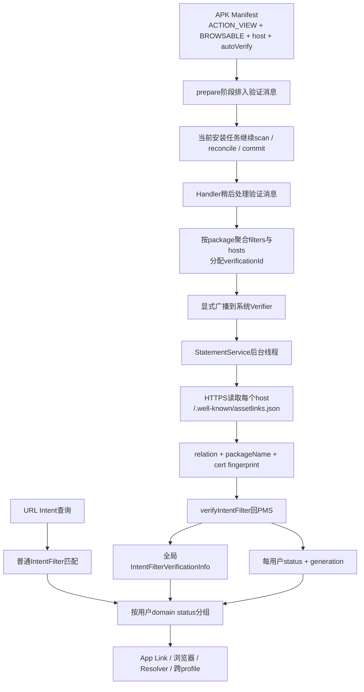
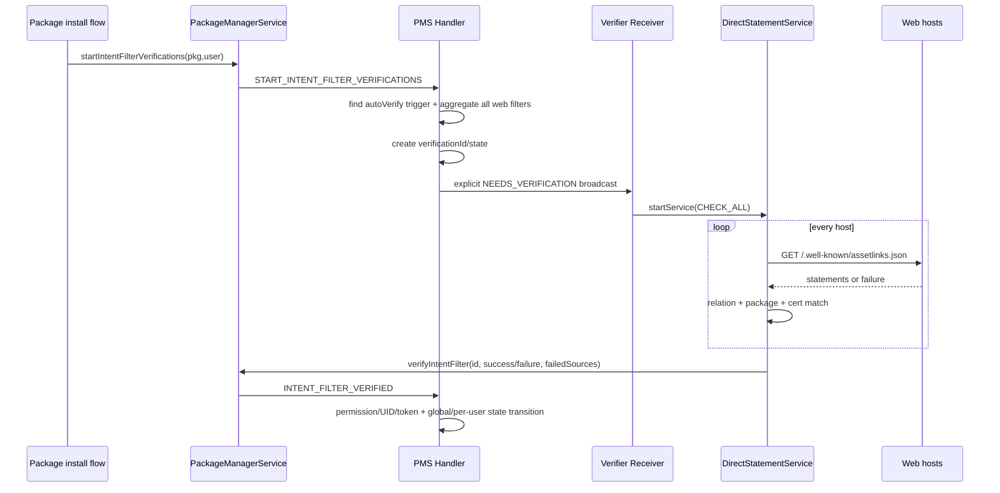
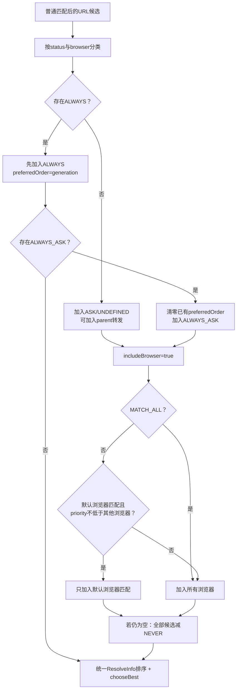

# 255 Android Web Intent、autoVerify、DomainVerification与默认浏览器选择链

> 源码版本：Android 11 / `android-11.0.0_r48`  
> 学习方式：macOS只读核源，不编译、不运行AOSP

## 1. 本章要解决什么

第254章已经解释普通隐式Intent如何匹配、排序和选择。本章专门把URL点击这一条特殊链拆开：为什么有时直接进入App，有时进入默认浏览器，有时弹出Resolver，有时又出现工作资料或Instant App候选？

```text
autoVerify=true到底只是声明，还是验证结果？
assetlinks.json怎样把网站、包名和签名证书绑在一起？
一个包声明多个host时，是逐host成功，还是全包一起成功？
ALWAYS、ASK、NEVER、ALWAYS_ASK分别怎样改变候选集？
默认浏览器为何不会无条件抢过已验证App Link？
多个ALWAYS应用为什么仍可能确定出一个第一名？
包升级增加或删除host时，旧状态怎样继承？
Android 11与新版本DomainVerification最大的模型差异是什么？
```

## 2. 一句总纲

```text
Manifest声明Web IntentFilter与autoVerify
→ 安装完成后PMS聚合包内待验证host并异步广播给系统Verifier
→ StatementService用HTTPS读取每个host的assetlinks.json
→ 校验relation + packageName + SHA-256签名指纹，整批得出成功/失败
→ PMS保存全局验证结果及每用户ALWAYS/ASK/NEVER/ALWAYS_ASK策略
→ URL查询先做普通IntentFilter匹配，再按域名策略分组候选
→ ALWAYS App Link优先；否则加入未定义App、跨profile与浏览器
→ 默认浏览器、generation排序、ResolverActivity完成最终选择
```

## 3. 先分清四类对象

```text
Web Intent：本次请求，通常是ACTION_VIEW + http/https URI
Web IntentFilter：Activity声明自己能处理哪些URL
验证事实：网站是否公开声明信任该包名和签名证书
用户策略：这个用户希望该包always、ask、never还是always-ask
```

验证事实和用户策略会相互影响，但不是同一个字段。

## 4. 源码地图

```text
frameworks/base/core/java/android/content/Intent.java
frameworks/base/core/java/android/content/IntentFilter.java
frameworks/base/core/java/android/content/pm/IntentFilterVerificationInfo.java
frameworks/base/services/core/java/com/android/server/pm/PackageManagerService.java
frameworks/base/services/core/java/com/android/server/pm/IntentFilterVerificationState.java
frameworks/base/services/core/java/com/android/server/pm/PackageSettingBase.java
frameworks/base/services/core/java/com/android/server/pm/Settings.java
frameworks/base/services/core/java/com/android/server/role/RoleManagerService.java
frameworks/base/packages/StatementService/src/com/android/statementservice/
frameworks/base/packages/StatementService/src/com/android/statementservice/retriever/
```

## 5. 本章版本边界

Android 11 r48仍使用旧`IntentFilterVerificationInfo`与包级状态。Android 12以后引入新的DomainVerificationService、逐域名状态与新版shell/API；不能拿新版本文档反推本章源码。

## 6. 安装验证不会阻塞APK安装结论

`preparePackageLI()`在非Instant App路径调用`startIntentFilterVerifications()`，这里只向PMS Handler排入消息；安装工作本身也运行在该Handler当前任务中，所以正常情况下要等当前安装任务完成commit并返回消息循环后，验证消息才会处理。网络慢或站点失败会影响以后URL解析策略，但不参与APK安装的同步投票，也不会回滚已经完成的安装事务。

严格说，消息是在prepare阶段排队，而不是在源码调用点已经commit；若多包安装后来失败，已排队消息仍可能被处理，但目标PackageSetting不存在时无法形成持久验证账。这也是“安装事务”与“安装后异步验证”并非同一原子操作的边界。

## 7. 总体链路图



## 8. `hasWebURI()`只检查URI scheme

`Intent.hasWebURI()`要求data非null，scheme非空且等于`http`或`https`。它不要求action为VIEW，也不要求BROWSABLE category。

## 9. `isWebIntent()`多检查ACTION_VIEW

```java
public boolean isWebIntent() {
    return ACTION_VIEW.equals(mAction) && hasWebURI();
}
```

它仍没有检查BROWSABLE。调用方若讨论“浏览器可从网页安全唤起”的语义，还应查看实际categories和Filter。

## 10. r48查询分支用的是`hasWebURI()`

`queryIntentActivitiesInternal()`在合并当前profile与跨profile候选时，只要`intent.hasWebURI()`就调用域名候选过滤。因此源码意义上的domain filtering范围比`isWebIntent()`略宽，不应把两者写成同义词。

## 11. 一个典型App Link Filter

```xml
<intent-filter android:autoVerify="true">
    <action android:name="android.intent.action.VIEW" />
    <category android:name="android.intent.category.DEFAULT" />
    <category android:name="android.intent.category.BROWSABLE" />
    <data android:scheme="https" android:host="www.example.com" />
</intent-filter>
```

DEFAULT服务默认隐式启动选择，BROWSABLE表达允许来自浏览器式上下文，host限定网站，autoVerify请求系统建立网站与应用的可信关联。

## 12. `autoVerify=true`不是“已经验证”

它只是Manifest请求位，解析后进入`IntentFilter.getAutoVerify()`。网络验证未运行、超时、站点JSON错误、签名不匹配时，它都不会自动变成可信结果。

## 13. `needsVerification()`的精确公式

```java
return getAutoVerify() && handlesWebUris(true);
```

`handlesWebUris(true)`要求ACTION_VIEW、CATEGORY_BROWSABLE、至少一个scheme，并且所有scheme只能是http或https。

## 14. 混合scheme Filter不能触发autoVerify

一个Filter同时声明`https`与自定义`myapp`时，`onlyWebSchemes=true`检查失败，即使写了autoVerify也不会成为触发验证的Filter。将Web与自定义scheme拆成不同Filter更清楚。

## 15. `hasValidDomains()`比`needsVerification()`宽一点

PMS代理把Filter加入验证批次前检查BROWSABLE以及至少有http/https scheme；而外围循环先用`handlesWebUris(false)`筛选，所以实际加入项仍要求ACTION_VIEW+BROWSABLE并至少含一个Web scheme，但可以同时声明非Web scheme。

## 16. 任一Filter触发，包内Web Filter一起聚合

PMS先扫描包内所有Activity：只要存在一个`needsVerification()==true`，`needToRunVerify`就为true。随后它再次遍历，将所有`handlesWebUris(false)`的Filter加入同一个verificationId，而不只验证写了autoVerify的那个Filter。

## 17. 为什么这是包级而非Filter级请求

`IntentFilterVerificationState`只保存一个packageName、一个userId、一组Filters和一组Hosts。一个安装版本通常对应一个验证token，最终成功/失败也作用于这批Filter和包级账本。

## 18. host从authority提取

每个ParsedIntentInfo的`getHostsList()`进入ArraySet去重。path、port和MIME不会成为Digital Asset Links站点身份；网站所有权边界以host为核心。

## 19. wildcard host会归一到根host请求

`*.example.com`写入状态时仍是Manifest host；生成验证请求字符串时会去掉`*.`，用`example.com`做HTTPS验证。它不表示网络层逐个枚举所有子域名。

## 20. Verifier组件怎样被选中

PMS用`ACTION_INTENT_FILTER_NEEDS_VERIFICATION`查询system-only Receiver，要求包持有`INTENT_FILTER_VERIFICATION_AGENT`权限，再选Filter priority最高者作为`mIntentFilterVerifierComponent`。

## 21. 为什么还要记Verifier UID

发现Receiver组件只确定发送目标。真正回调时`IntentFilterVerificationState.setVerifierResponse()`还要求Binder callerUid等于安装时记录的required verifier UID，避免另一个持同权限进程猜token提交结果。

## 22. 广播是显式且发给system user

PMS构造验证Intent后`setComponent()`，再`sendBroadcastAsUser(..., UserHandle.SYSTEM, ...)`。验证代理不是每个应用用户各启动一份的普通隐式广播竞争者。

## 23. 请求携带哪些字段

```text
verificationId
URI scheme
空格分隔hosts
packageName
```

`verificationId`把异步网络结果关联回PMS内存状态。

## 24. r48固定用HTTPS作为验证scheme

`IntentVerifierProxy.getDefaultScheme()`直接返回`https`。即使Filter只声明http，验证代理构造的Web Asset仍从HTTPS站点读取关联声明；不要理解成“按每个Manifest scheme分别请求”。

## 25. 临时白名单解决后台限制

发送广播前，PMS通过DeviceIdleInternal临时白名单验证器包，并给BroadcastOptions设置同一时长，确保安装后即使处于Doze/后台限制，Verifier仍有机会启动网络服务。

## 26. 这里复用了package verifier timeout配置

白名单时长取`getVerificationTimeout()`，默认至少10秒。但在这条旧App Link代码里没有看到对应verificationId的延迟失败消息；它主要约束白名单窗口，不应误写成“10秒后PMS必定把域名判失败”。

## 27. StatementService只是AOSP默认实现

PMS依赖的是受权限保护的Verifier Receiver协议。AOSP提供`com.android.statementservice`实现；设备厂商可放入更高priority、同样满足system-only和权限要求的实现。

## 28. Receiver不在主线程做网络

`IntentFilterVerificationReceiver`解析广播后启动`DirectStatementService`；Service创建后台优先级HandlerThread，真正抓取和JSON解析在该Looper执行，避免BroadcastReceiver主线程阻塞。

## 29. 一个请求最多10个host

AOSP StatementService的`MAX_HOSTS_PER_REQUEST=10`。超过后不发任何HTTP请求，直接向PMS返回整批失败。这是r48默认验证器实现限制，不是IntentFilter语法限制。

## 30. Web Asset的真实URL

Retriever对每个Web Asset计算：

```text
https://<host>/.well-known/assetlinks.json
```

读取结果受内容大小、连接超时、重试和HTTP缓存策略约束。

## 31. 关联relation固定为何值

```text
delegate_permission/common.handle_all_urls
```

它表达网站把处理全部匹配URL的能力委托给目标Android App，不是登录凭据、联系人或其他Digital Asset Links relation。

## 32. Android App身份不只有包名

Verifier通过PackageManager读取安装包签名证书的SHA-256指纹，目标Asset同时包含packageName与指纹列表。攻击者即使发布同包名APK，只要签名不同，也不能命中网站声明。

## 33. assetlinks.json核心形态

```json
[
  {
    "relation": ["delegate_permission/common.handle_all_urls"],
    "target": {
      "namespace": "android_app",
      "package_name": "com.example.app",
      "sha256_cert_fingerprints": ["AA:BB:...:FF"]
    }
  }
]
```

这里只是学习示意，真实指纹必须完整匹配安装包签名。

## 34. 检查方向是“网站声明信任App”

source是Web Asset，target是Android App Asset。Verifier从网站拉取Statement，寻找relation匹配且target matcher匹配包名和证书的记录。

## 35. 每个host都必须成功

DirectStatementService逐个source验证，只要一个host未找到关联、网络失败或解析异常，`allSourcesVerified=false`。因此r48默认实现对一个包的一批host给出整体成功/失败。

## 36. `failedDomains`没有形成逐域名状态

失败source列表会回传`verifyIntentFilter()`，PMS Handler把它打印到调试日志；`IntentFilterVerificationResponse.failedDomains`没有在后续写成逐host结果表。最终状态仍是一批Filters/一个包的成功或失败。

## 37. 回调先过权限门

Binder入口`verifyIntentFilter()`要求`INTENT_FILTER_VERIFICATION_AGENT`。通过后并不直接改Settings，而是把callerUid、code、failedDomains封装为消息发到PMS Handler串行处理。

## 38. 回调再过UID门

Handler找到verificationId状态后调用`setVerifierResponse(callerUid, code)`。callerUid不等required verifier UID时状态不会complete，也就不会进入`receiveVerificationResponse()`提交结果。

## 39. verification code只有成功和失败有明确定义

成功码映射STATE_VERIFICATION_SUCCESS，失败码映射STATE_VERIFICATION_FAILURE。其他code会让状态标记complete但内部state回到UNDEFINED，`isVerified()`为false，最终按失败路径处理。

## 40. 成功后Filter对象也被标记

`receiveVerificationResponse()`遍历本批ParsedIntentInfo调用`filter.setVerified(verified)`。不过URL候选过滤真正使用的是PackageSetting中的包/用户状态，不应把Filter内存位当成唯一持久事实。

## 41. r48 Filter verified位存在可疑实现边界

`IntentFilter.setVerified()`操作`STATE_VERIFIED`，而`isVerified()`读取的是`STATE_NEED_VERIFY`；两者常量不同。该返回值在IntentResolver中主要用于日志，域名选择依赖Settings账本，所以学习时应以包级状态链为准，并把这处视为r48源码缺口而非业务合同。

## 42. 验证时序图



## 43. 两张持久账必须分开看

```text
IntentFilterVerificationInfo：包级domains + main status，写入全局Settings
PackageUserState：每用户domainVerificationStatus + appLinkGeneration
```

前者描述自动验证主状态，后者允许每个用户有独立选择与相对优先级。

## 44. 主状态也只有一个包级值

`IntentFilterVerificationInfo`保存packageName、domains集合、mMainStatus。它不是`host → status` Map；domains只记录这个包公布了哪些host。

其`setStatus()`只接受UNDEFINED到NEVER（0—3），不接受ALWAYS_ASK（4）。ALWAYS_ASK是解析时可见的per-user策略，不会作为自动Verifier写入的main status。

## 45. per-user状态优先于主状态

URL解析路径的私有`getDomainVerificationStatusLPr()`先读PackageUserState打包long。只有高32位为UNDEFINED时，才回退到IntentFilterVerificationInfo的main status。不要与公开查询最终调用的`Settings.getIntentFilterVerificationStatusLPr()`混淆：后者直接返回per-user高位，不替调用者做这次fallback。

## 46. packed long怎样编码

```text
高32位：UNDEFINED / ASK / ALWAYS / NEVER / ALWAYS_ASK
低32位：appLinkGeneration，仅ALWAYS用于相对优先
```

因此打印或比较时不能把整个long直接当单一枚举。

## 47. 五种有效per-user status

```text
UNDEFINED 0：用户未明确设置；可回退全局验证状态
ASK 1：作为歧义候选询问
ALWAYS 2：优先作为该包声明域名的处理者
NEVER 3：从普通域名选择候选中排除
ALWAYS_ASK 4：即使存在ALWAYS也强制保留歧义选择
```

数值大小不完全代表优先级，NEVER虽然是3却最差。

## 48. 自动验证成功怎样更新主状态

成功时main status设为ALWAYS，失败时设为ASK，并异步写全局Settings。这个main status可作为尚无显式per-user状态用户的fallback。

## 49. 自动成功会把UNDEFINED/ASK用户提升到ALWAYS

对本次安装user，若per-user为UNDEFINED或ASK且验证成功，PMS调用`updateIntentFilterVerificationStatusLPw(ALWAYS)`，同时分配新的generation。

## 50. 自动失败怎样处理旧ALWAYS

如果此前per-user为ALWAYS而新版本验证失败，普通包会被降为UNDEFINED，随后解析可回退到全局ASK；但SystemConfig `<app-link>`列出的系统包不会因此被降级。

## 51. 显式NEVER与ALWAYS_ASK不会被自动结果覆盖

状态转换switch的default不更新这些值。用户/管理策略的明确决定高于以后自动验证成功或失败。

## 52. 安装给USER_ALL的特殊边界

main status仍更新，但源码明确记录`autoVerify ignored when installing for all users`，不为`USER_ALL`直接写某个用户的per-user状态。

## 53. generation是什么

每次把某包设为ALWAYS，Settings把该user的`mNextAppLinkGeneration`加1并记录到PackageUserState。解析候选时它被写入ResolveInfo.preferredOrder。

## 54. generation解决多个ALWAYS的相对选择

若多个包都处于ALWAYS，较新的generation拥有更高preferredOrder。第254章比较器把preferredOrder放在match之前，`chooseBestActivity()`看到前两名order不同会直接选第一。

## 55. generation不是验证时间戳

它只是每用户单调分配的相对序号，不是wall clock，也不证明网络验证比另一应用更新；shell/设置操作把包设为ALWAYS同样会得到新generation。

## 56. SystemConfig `<app-link>`是预置例外

系统配置可列出受信系统包。`primeDomainVerificationsLPw()`确认包为system、收集有效domains，把全局状态留为UNDEFINED、per-user直接设为ALWAYS。

## 57. 非system包不能借sysconfig预置

若`<app-link>`列出非system app，PMS只打印警告并跳过。这个入口是系统镜像策略，不是第三方APK自己能声明的权限。

## 58. 包升级先比较host集合

PMS读取旧IntentFilterVerificationInfo，构造新domains集合，并计算旧集合是否包含新集合。只要出现新host，`hostSetExpanded=true`。

## 59. ALWAYS且host未扩张可跳过重验

若仍请求autoVerify、当前per-user是ALWAYS，且新host集合是旧集合的子集，PMS更新domains后直接返回。删除host不会让已验证的剩余范围失去状态。

## 60. 增加host必须重新验证

新增host意味着旧网站证明不能覆盖新范围；即使此前ALWAYS也会重新发送验证批次。新批次任何host失败都可能触发旧ALWAYS降级。

## 61. 移除autoVerify时会清历史

包此前有验证账，但新版本不再有触发autoVerify的Filter时，PMS删除验证info；只有“host未扩张且当前ALWAYS”时可选择保留当前用户状态，否则也重置policy。

## 62. backup恢复可让新安装跳过网络

新安装若已从备份恢复IntentFilterVerificationInfo，`!replacing && previouslyVerified`直接返回。恢复状态是一条独立信任/迁移路径，不等于本次安装现场重新联网。

## 63. 设置状态的API有权限保护

`updateIntentVerificationStatus()`要求`SET_PREFERRED_APPLICATIONS`，跨用户读取也受权限控制；普通第三方App不能把自己任意改成ALWAYS。

## 64. shell只是受控管理入口

r48提供`pm set-app-link --user ... PACKAGE always|ask|always-ask|never|undefined`与`get-app-link`。本章Mac只读练习只看解析代码，不连接设备、不修改状态。

## 65. 域名状态不是普通PreferredActivity

普通preferred保存IntentFilter、候选集合和目标Component；App Link状态保存于PackageUserState并在Web候选过滤阶段改写候选集合/排序。两套机制入口与持久化对象不同。

## 66. 默认浏览器也不是普通PreferredActivity

Android 11由RoleManager的`ROLE_BROWSER`保存角色持有者。RoleManagerService向PermissionManagerService注册DefaultBrowserProvider，PMS解析时通过PermissionManagerInternal取得该user的角色持有包。

## 67. 老设置怎样迁移到Role

升级设备上，LegacyRoleResolutionPolicy读取并移除Settings里的legacy default browser package，再迁移成ROLE_BROWSER holder。新代码运行时不应继续把`mDefaultBrowserApp`当唯一真相。

## 68. 什么叫浏览器候选

`IntentFilter.handleAllWebDataURI()`满足任一：

```text
含CATEGORY_APP_BROWSER
或 ACTION_VIEW + BROWSABLE + http/https，且没有具体authority
```

它代表能泛化处理Web URI，而非某个网站专属App Link。

## 69. host专属App不是浏览器

声明`https://www.example.com` authority的Filter即使可处理网页，也不属于`handleAllWebDataURI`。它进入domain app分组，不进入浏览器`matchAllList`。

## 70. 浏览器标记来自命中的具体Filter

ComponentResolver生成ResolveInfo时把当前ParsedIntentInfo的`handleAllWebDataURI()`复制进去。同一Activity多个Filter命中又会按第254章规则提前去重，因此不应仅凭Activity整体声明推断保留结果的标记。

## 71. URL候选先完成普通Filter匹配

domain policy不会让未声明该action/scheme/host/path/category的App凭空进入结果。它只对ComponentResolver已经匹配出的ResolveInfo重新分组与筛选。

## 72. 五个候选桶

```text
alwaysList
undefinedList（包含UNDEFINED与ASK）
alwaysAskList
neverList
matchAllList（浏览器）
```

跨profile候选另由`CrossProfileDomainInfo`携带最佳状态。

## 73. 第一优先：有ALWAYS就先只放ALWAYS

只要alwaysList非空，初始result只加入ALWAYS App Link，不加入普通ASK/UNDEFINED App，也默认不加入浏览器。

## 74. 没有ALWAYS才加入ASK/UNDEFINED

这时result加入undefinedList，可能加入父profile转发候选，并把`includeBrowser=true`。用户看到的是网站App候选与浏览器之间的选择。

## 75. ALWAYS_ASK会打破ALWAYS直达

只要存在alwaysAskList，PMS把当前result中所有preferredOrder清0，再加入ALWAYS_ASK候选并允许浏览器。这样某个ALWAYS不会凭generation直接压过“始终询问”策略。

## 76. NEVER平时不进入result

NEVER候选被单独保存。它既不会与ALWAYS竞争，也不会作为普通ASK选项展示；只有最后fallback组装全部candidates时再显式removeAll(neverList)。

## 77. 默认浏览器何时被考虑

只有`includeBrowser=true`：也就是没有ALWAYS，或存在ALWAYS_ASK。正常纯ALWAYS App Link路径不会因为设置了默认浏览器就强行加浏览器。

## 78. `MATCH_ALL`会加入全部浏览器

查询flags含MATCH_ALL时，PMS把matchAllList全部加入，便于管理/诊断类调用获得完整集合，而非模拟正常用户点击时的默认浏览器收敛。

## 79. 普通点击优先只加入默认浏览器

非MATCH_ALL时，PMS在浏览器候选里找ROLE_BROWSER包的最高priority匹配。只有它的priority不低于浏览器候选中的最大priority，才只加入这一条。

## 80. 默认浏览器priority不足怎么办

若另一个浏览器Filter priority更高，或根本找不到默认浏览器匹配，PMS加入所有浏览器，让后续排序/Resolver处理，避免角色身份覆盖Manifest更高的匹配优先级。

## 81. `maxMatchPrio`从0开始的边界

r48实现把最大浏览器priority初始为0。若默认浏览器只提供负priority匹配，它不能满足`default.priority >= maxMatchPrio`，于是不会单独收敛，最终加入所有浏览器。

## 82. 空result的兜底

includeBrowser后若仍没有任何结果，源码把原始candidates全部加入，再删除neverList。这处理无默认浏览器、异常分类或其他边缘情况，保证合法候选不被无意全部清空。

## 83. ALWAYS列表为何还可能有多条

状态按package保存，一个包可有多个匹配Activity，多个包也可同时ALWAYS。过滤阶段不强制只留一个组件，而是靠preferredOrder、priority、match与chooseBestActivity继续选择。

## 84. 最近ALWAYS通常怎样胜出

候选过滤给每条ALWAYS ResolveInfo写generation到preferredOrder；随后PMS重新用六级比较器排序。generation不同通常使最新启用的包排第一，并在chooseBestActivity前三字段比较时直接返回。

## 85. 同包多个Activity仍可能弹Resolver

同一包的多个Activity共享domain status/generation。如果priority、preferredOrder、isDefault都相同，又没有适用普通preferred，chooseBestActivity仍可能返回ResolverActivity。

## 86. 默认浏览器只是浏览器桶内收敛

它不会替代域名所有权验证，也不会把某浏览器变成某host的ALWAYS App Link。它解决的是“需要浏览器时选哪个泛化处理器”。

## 87. App Link ALWAYS也不是永恒授权

包升级扩host需重验，验证失败可能降级，用户可改为NEVER/ALWAYS_ASK，卸载或清偏好也会删除状态。ALWAYS是当前Settings事实，不是写死在APK里的能力。

## 88. 跨profile URL候选

若工作资料允许`ALLOW_PARENT_PROFILE_APP_LINKING`，PMS在parent user查询同一Intent，忽略泛化浏览器，计算非浏览器App候选中的最佳domain status，并合成IntentForwarder ResolveInfo。

## 89. 跨profile的NEVER语义

若parent候选最佳状态仍为NEVER，返回null，不提供跨profile转发。`bestDomainVerificationStatus()`还显式把NEVER当作最差值，不能按枚举数值4>3>2简单比较。

## 90. 跨profile候选何时进入当前结果

当前user没有ALWAYS时，可把parent转发候选与ASK/UNDEFINED结果一起加入；若当前有ALWAYS，当前已验证App通常优先，不把普通parent选项混入。

## 91. Instant App在更早处决定是否尝试

`isInstantAppResolutionAllowed()`对Web Intent要求host非空且Web Instant Apps未禁用；如果本地非浏览器候选已是ALWAYS或ALWAYS_ASK，或已有匹配Instant App安装，则拒绝外部Instant解析。

## 92. 本地ALWAYS为何阻止Instant搜索

平台已经有用户认可/验证的确定处理策略，再访问远端Instant Resolver既增加延迟和隐私暴露，也可能破坏用户选择，因此直接停止外部发现。

## 93. URL选择不是单一if-else

完整顺序至少包含：普通Filter语法、用户/包可见性、current/cross profile、是否允许Instant、domain分桶、默认浏览器、统一排序、preferred与Resolver。只看`filterCandidatesWithDomainPreferredActivitiesLPr()`不能解释全部结果。

## 94. 候选过滤决策图



## 95. `ALWAYS_ASK`名字为何反直觉

它不是“永远选择这个App”，而是“这个App的存在永远造成歧义”。即使另一个App处于ALWAYS，也要保留对话框选择机会。

## 96. ASK与UNDEFINED为何进同一桶

在候选过滤阶段二者都不获得直达优先级，都作为可询问的App Link候选；差异主要来自状态来源和管理语义，而非此处展示顺序。

## 97. 自动失败不会直接写NEVER

验证失败把主状态设为ASK，并按旧状态规则降级。NEVER代表用户/策略明确不希望该App处理，而不是网络暂时失败。

## 98. 一个失败host会拖累整个包

这是r48包级模型最重要的工程后果：将互不相关、部署节奏不同的许多host放入同一包验证批次，会增加整批失败概率；而failedDomains并不会让其余host单独保持成功。

## 99. path不参与网站所有权验证

assetlinks证明host对App身份的委托；具体`/product/42`是否匹配仍由IntentFilter path规则决定。验证成功不能扩张Manifest声明的path，Manifest path也不能替代host所有权证明。

## 100. HTTP链接为什么仍走HTTPS验证

App可以处理http链接，但Digital Asset Links声明必须从可信HTTPS位置获取，避免明文网络被篡改后伪造网站授权。r48代理固定scheme正体现这层安全设计。

## 101. 重定向不是App Link状态本身

浏览器访问URL后服务器302到自定义scheme，是浏览器/网络导航行为；PMS对原始http/https Intent的domain验证只看当前Intent data和已保存状态，不追踪未来HTTP重定向链。

## 102. 签名轮换要同步网站声明

Verifier用当前安装包证书指纹构造target。应用换签或使用新证书而assetlinks.json未包含兼容指纹时，关联匹配失败，即使packageName没变。

## 103. 包可见性仍然存在

Android 11 query结果还会经过AppsFilter/post-resolution过滤。Domain状态决定Web候选偏好，不授予调用者枚举任意包的能力。

## 104. exported与permission仍在启动阶段

一个Activity通过Web Filter与Domain策略进入ResolveInfo，仍不意味着任意UID可成功start。ATMS后续继续检查exported、组件permission、用户状态和其他执行策略。

## 105. 易错理解一：autoVerify等于ALWAYS

错。autoVerify只是请求网络验证；成功后Settings状态才可能变成ALWAYS，显式用户NEVER/ALWAYS_ASK还会被保留。

## 106. 易错理解二：每个host独立保存结果

错。r48默认链聚合包内hosts，所有source共同决定一次成功/失败，IntentFilterVerificationInfo只有包级main status。

## 107. 易错理解三：默认浏览器总是打开所有URL

错。已有ALWAYS App Link且没有ALWAYS_ASK时，浏览器通常根本不进入最终候选集。

## 108. 易错理解四：NEVER数值3所以比ALWAYS 2更高

错。状态不是可直接按整数排序的优先级；源码明确把NEVER视为最差并从结果删除。

## 109. 易错理解五：验证成功绕过IntentFilter

错。先有普通action/category/scheme/host/path匹配，后有domain policy。ALWAYS不能召回Manifest未声明的URL。

## 110. 第一次复读：触发范围修订

最容易误写成“只验证autoVerify所在Filter”。r48真实行为是：一个合格autoVerify Filter触发后，包内所有`handlesWebUris(false)` Filter都进入同一批次。

## 111. 第二次复读：状态粒度修订

不能用新Android的逐domain状态解释r48。这里domains是包级集合，main/per-user status按包保存，failedDomains主要用于日志；这是本章所有候选行为的前提。

## 112. macOS只读练习1：手算Web Filter分类

```bash
cd /Users/ninebot/androidSource
sed -n '550,705p' \
  frameworks/base/core/java/android/content/IntentFilter.java
sed -n '11195,11230p' \
  frameworks/base/core/java/android/content/Intent.java
```

分别为“https+host”“http/https无host”“https+myapp混合scheme”“CATEGORY_APP_BROWSER”判断：`hasWebURI`、`isWebIntent`、`handlesWebUris(true/false)`、`needsVerification`和`handleAllWebDataURI`各返回什么。

## 113. macOS只读练习2：追安装验证批次

```bash
cd /Users/ninebot/androidSource
sed -n '1235,1480p' \
  frameworks/base/services/core/java/com/android/server/pm/PackageManagerService.java
sed -n '17938,18125p' \
  frameworks/base/services/core/java/com/android/server/pm/PackageManagerService.java
sed -n '20,145p' \
  frameworks/base/services/core/java/com/android/server/pm/IntentFilterVerificationState.java
```

标出token、Verifier UID、filter/host聚合、显式广播和回调状态。回答：为什么一个autoVerify Filter会让同包其他Web Filter也被验证？

## 114. macOS只读练习3：核对assetlinks验证

```bash
cd /Users/ninebot/androidSource
sed -n '45,220p' \
  frameworks/base/packages/StatementService/src/com/android/statementservice/IntentFilterVerificationReceiver.java
sed -n '120,285p' \
  frameworks/base/packages/StatementService/src/com/android/statementservice/DirectStatementService.java
sed -n '114,215p' \
  frameworks/base/packages/StatementService/src/com/android/statementservice/retriever/DirectStatementRetriever.java
```

找出最多host数、固定relation、HTTPS路径、packageName/证书指纹和allSourcesVerified。回答：failedSources为何没有变成PMS逐域名状态？

## 115. macOS只读练习4：手算URL候选集

```bash
cd /Users/ninebot/androidSource
sed -n '7685,7860p' \
  frameworks/base/services/core/java/com/android/server/pm/PackageManagerService.java
sed -n '731,790p' \
  frameworks/base/services/core/java/com/android/server/role/RoleManagerService.java
```

构造两个ALWAYS App、一个ASK App、一个ALWAYS_ASK App、一个NEVER App和两个浏览器，分别在有/无ALWAYS_ASK、MATCH_ALL开/关时写出最终候选，并用generation解释排序。

## 116. 第三次复读：默认浏览器边界修订

默认浏览器来自ROLE_BROWSER，只在includeBrowser路径尝试收敛浏览器桶；它不是域名验证结果，也不会压过正常ALWAYS App Link。

## 117. 第四次复读：timeout边界修订

验证广播使用`getVerificationTimeout()`设置临时白名单，但这段旧代码未安排同token的延迟失败消息。不能仅凭默认10秒推断PMS必然在10秒后提交ASK。

## 118. 自测题

1. `hasWebURI()`、`isWebIntent()`与`handlesWebUris(true)`各检查什么？
2. autoVerify为何不等于验证成功？
3. 为什么同包其他Web Filter也会进入验证批次？
4. assetlinks.json怎样绑定网站与APK身份？
5. r48失败域名为何不能独立保留其他域名成功？
6. per-user status为何优先于main status？
7. appLinkGeneration怎样影响多个ALWAYS候选？
8. ALWAYS_ASK怎样改变ALWAYS与浏览器候选？
9. 默认浏览器在什么条件下只保留一条？
10. 验证成功为何仍不等于一定能启动Activity？

## 119. 自测题参考答案

1. 前者只看http/https data；第二个再要求ACTION_VIEW；Filter方法要求VIEW+BROWSABLE且scheme全为Web scheme。
2. 它只是请求位，必须经过Verifier网络校验并写入Settings。
3. 一处合格autoVerify只负责触发，第二轮会聚合包内全部`handlesWebUris(false)` Filter。
4. HTTPS站点Statement用`handle_all_urls` relation指向packageName与SHA-256签名指纹。
5. 一批host共同产生一个success/failure，旧账本只存包级状态；failedDomains主要用于日志。
6. 用户明确选择应覆盖自动验证主结果；UNDEFINED才回退main status。
7. ALWAYS时generation写入preferredOrder，新generation通常先排序并被直接选中。
8. 清零已选结果order，加入ALWAYS_ASK并允许浏览器，迫使歧义选择。
9. includeBrowser、非MATCH_ALL、ROLE_BROWSER包有匹配，且其priority不低于其他浏览器最大值。
10. ATMS还要检查exported、permission、用户和其他启动策略。

## 120. 本章总结与下一章预告

Android 11的Web解析建立在普通IntentFilter匹配之上：autoVerify触发PMS按包聚合Web Filters与hosts，AOSP StatementService从HTTPS `assetlinks.json`核对`handle_all_urls`、包名和签名指纹，并以整批成功/失败回写包级主状态及每用户策略。解析URL时，PMS把非浏览器候选分入ALWAYS、ASK/UNDEFINED、ALWAYS_ASK、NEVER，再把泛化浏览器单独处理；ALWAYS通常排除浏览器，ALWAYS_ASK重新制造歧义，默认浏览器只在需要浏览器时收敛浏览器桶，generation则解决多个ALWAYS的相对顺序。下一章将进入第256章“Android PackageInstallerSession创建、参数校验与多阶段提交状态机”，从PackageInstaller客户端会话一路追到PMS安装入口。
