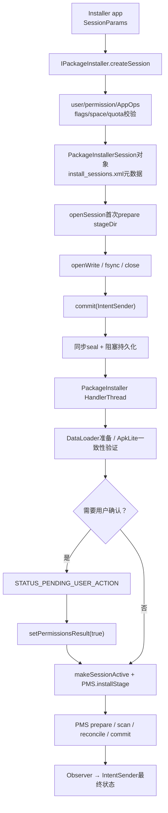
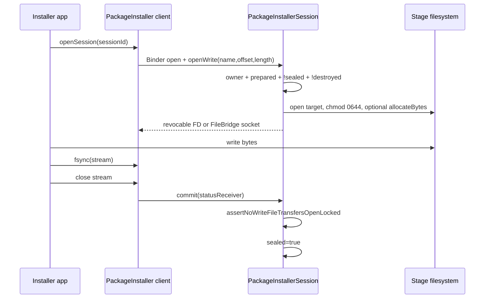
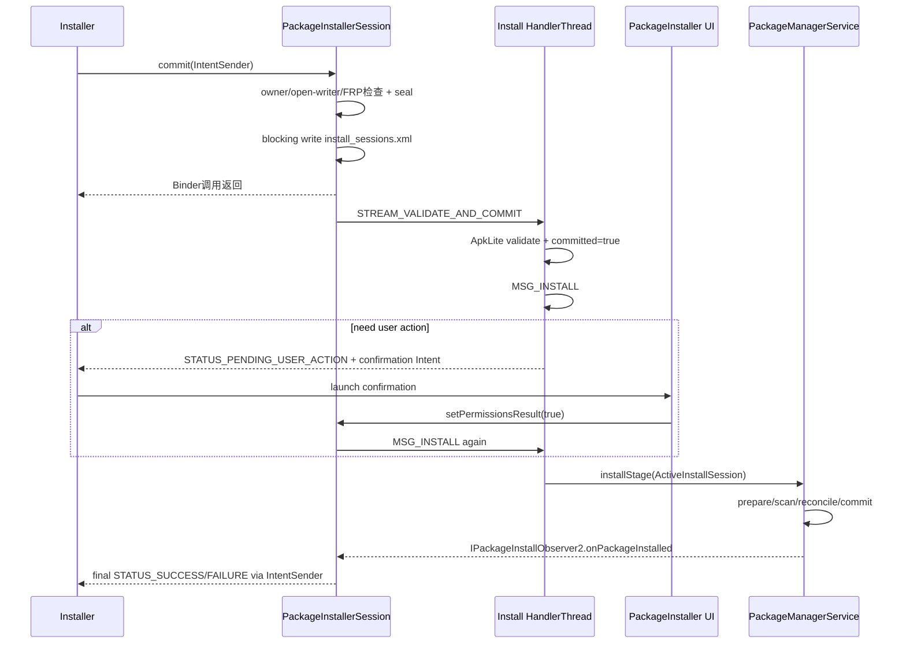

# 256 Android PackageInstallerSession创建、参数校验与多阶段提交状态机

> 源码版本：Android 11 / `android-11.0.0_r48`  
> 学习方式：macOS只读核源，不编译、不运行AOSP

## 1. 本章要解决什么

第252章从PMS内部解释scan、reconcile与commit。本章向外补齐另一半：安装器怎样先创建会话、写入APK，再把一个可恢复、可确认、可组合的Session交给PMS？

```text
createSession为什么还没创建stage目录？
SessionParams哪些字段会被系统改写，而不是照单全收？
openWrite返回的FD怎样阻止commit和写入同时发生？
sealed、committed、destroyed、active分别是什么意思？
commit为何先阻塞持久化sealed，再异步验证？
FULL与INHERIT怎样检查base/split/签名/版本一致性？
为什么验证Session成功后PMS仍可能拒绝升级？
用户确认为什么不是一次安装失败？
multi-package怎样做到“一子失败，全组停止”？
staged session的“成功”为什么还不等于包已经生效？
```

## 2. 一句总纲

```text
客户端构造SessionParams并Binder调用createSession
→ PackageInstallerService按调用UID净化flags、验权限/配额/空间并持久化Session元数据
→ openSession首次准备stage目录，客户端经受控FD写入APK
→ commit同步检查owner/FRP/开放写流并永久seal，阻塞写入install_sessions.xml
→ PackageInstaller独立Handler执行DataLoader准备与APK Lite一致性验证
→ 必要时返回PENDING_USER_ACTION，确认后重进MSG_INSTALL
→ 普通Session整理继承文件/so并转成ActiveInstallSession交PMS installStage
→ PMS安装Observer回Session，销毁stage并用IntentSender报告最终结果
→ staged Session则交StagingManager，跨重启达到ready/applied/failed终态
```

## 3. Session解决的不是“复制一个APK”

Session把安装拆成可管理对象：谁拥有、装给哪个user、FULL还是继承式更新、写入了哪些文件、是否需要用户确认、是否多包原子、是否跨重启、最终结果发给谁。

## 4. 源码地图

```text
frameworks/base/core/java/android/content/pm/PackageInstaller.java
frameworks/base/core/java/android/content/pm/IPackageInstaller.aidl
frameworks/base/core/java/android/content/pm/IPackageInstallerSession.aidl
frameworks/base/services/core/java/com/android/server/pm/PackageInstallerService.java
frameworks/base/services/core/java/com/android/server/pm/PackageInstallerSession.java
frameworks/base/services/core/java/com/android/server/pm/PackageManagerService.java
frameworks/base/services/core/java/com/android/server/pm/StagingManager.java
```

## 5. 进程与线程地图

```text
安装器进程：PackageInstaller客户端API、写OutputStream、接收IntentSender
system_server Binder线程：create/open/write/commit入口与同步权限检查
PackageInstaller HandlerThread：Session验证、安装调度、callback串行化
PMS安装链：mInstallLock下prepare/scan/reconcile/commit
installd/存储服务：stage目录、link/copy、native library等底层操作
```

## 6. 总体链路图



## 7. 客户端`PackageInstaller`只是Binder包装

`createSession()`调用`mInstaller.createSession(params, installerPackageName, userId)`；`openSession()`把服务端`IPackageInstallerSession`包装成客户端`Session`。安装事实始终由system_server维护。

## 8. SessionParams是请求，不是最终策略

调用方可填写mode、size、packageName、安装位置、installer、权限、staged/dataLoader等，但PackageInstallerService会根据Binder callingUid清除、增加或改写flags。

## 9. 第一道门是跨用户权限

`createSessionInternal()`用callingUid与目标userId执行full跨用户权限检查。Session最终属于一个user，不能仅靠传入数字跨到另一个用户安装。

## 10. 用户限制可直接禁止创建

目标user存在`DISALLOW_INSTALL_APPS`时立即抛SecurityException。此时尚未分配sessionId，也没有stage目录可清理。

## 11. DataLoader需要专门权限

`params.dataLoaderParams != null`要求`USE_INSTALLER_V2`。普通安装器不能借回调式DataLoader把任意远端内容接入system_server安装链。

## 12. 过长包名不是直接报错

若`appPackageName`超过`MAX_PACKAGE_NAME_LENGTH`，r48把它改为null，而不是拒绝Session。以后验证会从实际APK推导mPackageName。

## 13. label与icon会被防御性缩减

appLabel被裁到安全长度；appIcon若超过Launcher大图标尺寸两倍会被缩放。它们用于Session UI/通知，不应让不可信安装器把巨型数据写入系统账本。

## 14. installer有三种身份概念

```text
initiating installer：Binder调用者传入且须归属callingUid
requested installing package：params可请求的最终安装来源
originating package/UID：内容最初来源的审计线索
```

最终封装为InstallSource传向PMS。

## 15. AppOps确保包名确实属于UID

非system调用者提供installerPackageName时，`mAppOps.checkPackage(callingUid, installerPackageName)`防止冒充其他应用商店。

## 16. 改写installer需要权限或同UID归属

若requested installer与调用包不同，持有INSTALL_PACKAGES可设置；否则仍需AppOps证明requested包属于同一callingUid。

## 17. shell/root路径自动标记ADB

shell或root创建时增加INSTALL_FROM_ADB，并把installerPackageName置null，但initiating来源语义仍保留在InstallSource规则中。

## 18. 普通调用者的flags会被净化

非shell/root会清掉FROM_ADB、ALL_USERS、ALLOW_TEST，强制加REPLACE_EXISTING；未满足特权条件的VIRTUAL_PRELOAD也被移除。

## 19. downgrade不是调用者写了就算

debuggable build或system/shell/root会加ALLOW_DOWNGRADE；生产普通调用者会同时清ALLOW_DOWNGRADE与REQUEST_DOWNGRADE。真正版本兼容还会在PMS后续裁决。

## 20. 禁用验证是高权限选项

非system且不满足特定ADB开发组合时，INSTALL_DISABLE_VERIFICATION被清掉。SessionParams公开承载bit，不代表调用者获得其效果。

## 21. staged与APEX权限更严

staged或INSTALL_APEX都要求INSTALL_PACKAGES。APEX还要求设备支持APEX且Session必须staged；DataLoader安装APEX在Session构造中直接禁止。

## 22. staged installer还有白名单

非system/shell调用staged安装时，requested installer必须出现在SystemConfig允许集合，除非一次性bypass开关生效。

## 23. runtime permission自动授予有独立权限

非multi-package Session请求INSTALL_GRANT_RUNTIME_PERMISSIONS时，调用者还须持有同名授权能力，否则SecurityException。

## 24. 两种基本mode

```text
MODE_FULL_INSTALL：提交完整安装，必须包含base.apk
MODE_INHERIT_EXISTING：继承式更新已有包，只提供变化split并继承其余文件
```

其他mode在r48此入口被拒绝。

## 25. 安装位置在创建时预判

明确INSTALL_INTERNAL先检查内部空间；强制volume会归一成内部语义；未指定则清Binder身份后调用`PackageHelper.resolveInstallVolume()`综合size与存储策略选择volumeUuid。

## 26. 创建阶段空间判断不是最终保证

从create到write/commit之间空间仍可能变化；openWrite预分配、继承copy、native解压和PMS安装都可能再次因空间失败。

## 27. active Session有UID配额

持INSTALL_PACKAGES的UID最多1024个active Session；无该权限最多50个。这里active count是mSessions中未结束对象数量，不是某个Session的mActiveCount引用计数。

## 28. historical Session也有限额

每installerUid最多1048576条历史计数。这个巨大上限主要防止永久滥用，并不意味着历史全文都适合业务读取。

## 29. sessionId怎样分配

Service用SecureRandom生成1到Integer.MAX_VALUE-1的正数，检查本boot未分配；ID在一次启动内不复用，并持久化会话以跨重启保持稳定。

## 30. create时只计算stage位置

非multi-package内部安装得到类似`vmdl<id>.tmp`的stageDir；multi-package父Session没有自己的包文件stage。此刻并不一定已经mkdir和准备权限。

## 31. Session对象先进入mSessions

构造完成后以sessionId加入PackageInstallerService的SparseArray，staged Session再通知StagingManager创建对应记录，然后发SessionCreated callback并异步写XML。

## 32. create成功的完成点

返回sessionId只说明请求参数、身份、配额与初始位置可接受，绝不说明APK存在、可解析、签名一致或可安装。

## 33. `install_sessions.xml`保存什么

AtomicFile位于`/data/system/install_sessions.xml`，保存Session参数、owner、时间、stage路径、prepared/sealed/committed/destroyed、多包关系、staged状态等元数据。

## 34. 图标为什么另存目录

较重appIcon放在`/data/system/install_sessions/`单独文件，避免把大二进制塞进XML；systemReady会删除没有Session认领的孤儿图标。

## 35. stage数据与Session XML不是同一原子文件

XML原子写只保护元数据单文件。stage目录/APK字节、icon、staged manager状态分别持久化；开机需要reconcile清理无Session认领的stage。

## 36. 首次`open()`才prepare stage

`openSessionInternal()`先验owner，再调用`session.open()`。mActiveCount从0变1发active callback；若尚未prepared，才创建/准备stageDir并置mPrepared=true。

## 37. multi-package父Session无需stageDir

它只编排children，所以open时`params.isMultiPackage`可直接prepared；真正APK位于每个child的stage。

## 38. prepared持久化是异步的

首次准备后`onSessionPrepared()`调用`writeSessionsAsync()`。prepared很重要，但不如sealed要求同步阻塞落盘。

## 39. Session可多次open

mActiveCount是AtomicInteger引用计数。每次open加1、close减1，只有0↔1时通知active变化；active不等于committed或正在PMS安装。

## 40. 一个安全用法骨架

```java
int id = installer.createSession(params);
try (PackageInstaller.Session s = installer.openSession(id);
     OutputStream out = s.openWrite("base.apk", 0, apkLength)) {
    // 将APK字节复制到out
    s.fsync(out);
}
try (PackageInstaller.Session s = installer.openSession(id)) {
    s.commit(statusIntentSender);
}
```

commit前所有OutputStream必须close。

## 41. `openWrite()`没有把真实stage FD裸交给普通客户端

r48按开关使用RevocableFileDescriptor或FileBridge。服务端跟踪mFds/mBridges，既提供写通道，又能在销毁时撤销/强关，并知道是否仍有传输未结束。

## 42. 写入链路图



## 43. 文件名先做ext filename校验

stage name必须通过`FileUtils.isValidExtFilename()`，阻止`../`等路径逃逸。Session名称只是stage内标识，验证后APK会按base/split规范名重命名。

## 44. length用于预分配

lengthBytes大于0时调用StorageManager.allocateBytes，可按install flags清缓存/分配空间，减少写到一半才ENOSPC；未知长度-1则无法提前保证。

## 45. offset支持断点续写

服务端对目标FD执行lseek到offset。调用者仍需自己确认已有内容正确，Session不会替业务校验前缀hash。

## 46. `fsync()`与close不是同一件事

fsync要求内核把数据提交到稳定存储；close释放写通道并让commit通过“无开放传输”门。只fsync不close仍会被commit拒绝。

## 47. progress是80/20加权

客户端写入进度占0—0.8，内部安装进度占0—0.2；变化至少0.01才通常通知。它是UI进度模型，不是严格的时间百分比。

## 48. FULL Session可写任意临时名

客户端可用`foo.apk`，validate时解析splitName后统一重命名为`base.apk`或`split_<name>.apk`。最终身份来自APK内容，不来自输入文件名。

## 49. `removeSplit()`写零权限marker

INHERIT更新可创建`<splitName>.removed`标记并chmod 0。验证时读取marker列表，确认目标split确实存在于旧包。

## 50. DataLoader Session禁止普通openWrite

它通过addFile metadata/signature描述由DataLoader提供的文件，`assertCanWrite()`直接拒绝常规写FD；两种数据入口不能混用。

## 51. Session状态不是一个enum

核心布尔/计数至少包括：

```text
mPrepared
mSealed
mCommitted
mDestroyed
mRelinquished
mActiveCount
mStagedSessionReady/Applied/Failed
```

必须按组合推理，不能画成唯一线性枚举后忽略重试和staged分支。

## 52. prepared的含义

stage目的地已准备，可读写Session内容。它不表示APK已解析，甚至stage里可以还是空的。

## 53. sealed的含义

安装器承诺不再修改主要Session内容，系统可以创建硬链接、计算验证结论并跨重启恢复。commit和transfer都可能触发seal。

## 54. committed的含义

`streamAndValidateLocked()`已经成功完成，Session把client progress置1、增加active引用并设置mCommitted=true，随后才有资格进入MSG_INSTALL。

## 55. destroyed的含义

Session不可再使用，写通道被撤销，普通stage可清理；失败、abandon或PMS最终回调通常会进入destroy。

## 56. relinquished是“交给PMS后不再回头”

`makeSessionActiveLocked()`构造ActiveInstallSession前置mRelinquished=true。之后重复尝试会报Session relinquished，避免同一stage被并发交给PMS两次。

## 57. active只是引用计数

open客户端、正在commit等都会影响mActiveCount。Session committed时额外+1，即使客户端close，它仍显示active直到用户确认分支释放或最终结束。

## 58. commit第一门：child不能单独提交

有parentSessionId的child直接commit会IllegalStateException；必须提交multi-package parent，由parent统一seal和调度children。

## 59. commit第二门：owner与prepared

`markAsSealed()`要求当前Binder UID是installer owner或root、Session已prepared且未destroyed。

## 60. commit第三门：没有开放写传输

遍历Revocable FD和FileBridge；任何未revoke/未close都抛SecurityException“Files still open”。这把客户端close变成明确协议门。

## 61. Secure FRP也可阻断commit

Secure FRP mode开启且调用者不在允许范围时拒绝安装。这个门放在commit而非create，意味着长时间存在的Session在策略变化后仍会重新受控。

## 62. transferred Session有不同commit API

普通commit要求installerUid仍等于originalInstallerUid；已transfer会被拒绝。`commitTransferred()`要求INSTALL_PACKAGES且必须确实发生过owner变更。

## 63. statusReceiver可以在重试commit时更新

`markAsSealed()`先保存新的mRemoteStatusReceiver，再检查mSealed。已经sealed的可恢复Session再次commit时，可以更新最终结果接收者而无需重新seal。

## 64. seal先置位再检查multi-package一致性

`sealLocked()`先`mSealed=true`，再比较parent/children的isStaged与enableRollback。即使一致性失败，Session也保持封印并走失败销毁。

## 65. sealed为何必须阻塞落盘

`onSessionSealedBlocking()`同步取得mSessions锁并写AtomicFile。若只异步写，system_server在seal后崩溃可能从旧XML恢复成可写Session，攻击者就能修改系统已基于其内容建立的硬链接/验证结论。

## 66. 这是锁顺序设计

Session先在自身mLock内seal，然后退出mLock再回调Service持mSessions写盘，注释明确避免lock inversion。安全持久化不能以死锁为代价。

## 67. seal成功后才投递异步验证

`dispatchStreamValidateAndCommit()`向Session所属PackageInstaller HandlerThread发送MSG_STREAM_VALIDATE_AND_COMMIT；客户端Binder commit不在原线程执行APK解析和native解压。

## 68. `streamValidateAndCommit()`可重入

若mCommitted已true直接返回true；DataLoader暂不可用时返回false而不标committed，稍后状态回调可再次触发。抛PackageManagerException才是不可恢复验证失败。

## 69. 普通Session先验证后committed

`streamAndValidateLocked()`准备DataLoader（若有），非APEX走`validateApkInstallLocked()`，staged再做non-overlap检查；全部成功后才置mCommitted。

## 70. 验证失败会立刻destroy

`onSessionVerificationFailure()`调用destroyInternal、dispatchSessionFinished(error)并清理staged目录。sealed后的内容错误不能退回给安装器修改再提交。

## 71. validate使用`ApkLite`

它收集证书并读取包名、versionCode、splitName等轻量信息，解决Session内部一致性；完整Manifest语义、升级签名策略、shared UID与权限冲突仍由PMS后续处理。

## 72. 空Session不能commit成功

没有added APK也没有remove marker时抛INSTALL_FAILED_INVALID_APK，并在错误中记录sessionId与stageDir。

## 73. 同一split不能重复

stagedSplits是ArraySet，包括null代表base。两个APK声明相同splitName立即失败，不能靠文件名覆盖顺序决定。

## 74. 第一个APK建立一致性基线

首次解析设置mPackageName、mVersionCode、mSigningDetails；以后每个APK都经`assertApkConsistentLocked()`核对包名、version和签名。

## 75. params.appPackageName也是约束

若调用者明确指定包名，它必须等于APK真实packageName；但创建阶段过长包名被清null时，这项约束自然不存在。

## 76. FULL必须包含base

MODE_FULL_INSTALL若stagedSplits不含null，报“Full install must include a base package”。只给feature split不能构成新完整安装。

## 77. INHERIT必须找到旧包

`params.appPackageName`查询不到现存PackageInfo/ApplicationInfo时，MODE_INHERIT_EXISTING直接报Missing existing base package。

## 78. INHERIT会把旧base纳入一致性

若Session没提供新base，就把旧base设为mResolvedBaseFile并解析existingBase，继续核对package/version/signing，使新增split不能偷渡到另一个版本集合。

## 79. 未覆盖split会被继承

遍历旧split：不在stagedSplits且没有remove marker的文件加入mResolvedInheritedFiles，相关dex metadata也一起继承。

## 80. remove marker必须指向真实旧split

不存在的splitName会INSTALL_FAILED_INVALID_APK；remove不是“如果有就删”的宽松操作。

## 81. 文件会按内容规范化命名

base重命名`base.apk`，feature split重命名`split_<splitName>.apk`，Dex Metadata也按目标APK名重命名。PMS下游不依赖安装器任意文件名。

## 82. fs-verity签名要求全有或全无

一旦发现某staged文件有`.fsv_sig`，后续相关文件缺签名会报BAD_SIGNATURE；INHERIT时若旧base启用fs-verity，也会要求保持一致。

## 83. embedded dex另有对齐要求

base声明useEmbeddedDex时，所有resolved staged APK都必须让未压缩dex通过对齐审计，否则INVALID_APK。

## 84. splitRequired也会检查

base声明isSplitRequired而只有base时，返回INSTALL_FAILED_MISSING_SPLIT。Session内部一致不等于满足包自身拆分要求。

## 85. transfer只允许更新原installer自身

验证后若installerUid已变化，mPackageName必须等于originalInstallerPackageName；Session transfer不能成为通用的第三方APK投递通道。

## 86. Session验证不做完整升级兼容

源码注释明确“upgrade compatibility is still performed by PackageManagerService”。旧新签名谱系、降级、shared user、库冲突等留给第252章链。

## 87. 多包commit先seal全部children

parent创建ChildStatusIntentReceiver，逐个child调用markAsSealed；即使某个失败仍继续seal其余，最后统一停止，避免部分children继续可变。

## 88. 多包验证也是全遍历

parent与每个child分别`streamValidateAndCommit()`。一旦有不可恢复异常，parent和所有尚未失败children都调用onSessionVerificationFailure销毁。

## 89. multi-package一致性目前检查两项

parent/child必须在`isStaged`和`enableRollback`上一致。不要泛化成所有SessionParams必须相同；每个child本来就代表不同包。

## 90. allSessionsReady为false不等于最终失败

DataLoader尚未prepare可返回false而没有异常；handle方法不发MSG_INSTALL，等待后续DataLoader状态驱动重试。不可恢复异常才销毁整组。

## 91. 验证完成后进入MSG_INSTALL

只有parent和所有children ready，Session Handler才发送MSG_INSTALL。sealed、committed和真正调用PMS之间存在清晰异步边界。

## 92. 用户确认发生在`makeSessionActiveLocked()`

Session已经sealed和validated，才根据installer权限、目标是否自更新/更新、Device Owner以及FORCE_PERMISSION_PROMPT判断是否需要用户操作。

## 93. 哪些安装器可静默继续

INSTALL_PACKAGES、合格的INSTALL_SELF_UPDATES/INSTALL_PACKAGE_UPDATES、root/system，或可静默安装的Device Owner/关联Profile Owner可绕过普通确认；force prompt仍能强制询问。

## 94. commit与安装结果时序图



## 95. PENDING_USER_ACTION不是失败终态

Session把STATUS_PENDING_USER_ACTION与确认Intent发到statusReceiver，然后closeInternal(false)释放commit持有的active引用并返回null，不destroy、不清stage。

## 96. 接受后重进MSG_INSTALL

PackageInstaller UI调用`setPermissionsResult(true)`，置mPermissionsManuallyAccepted并再次发MSG_INSTALL；拒绝则destroy并以INSTALL_FAILED_ABORTED结束。

## 97. INHERIT文件在交PMS前link或copy

若源/目标文件系统允许，创建oat/lib目录后用installd linkFile；否则copy到临时文件、chmod 0644再rename。验证阶段记录集合，安装阶段才物化继承内容。

## 98. native library也在Session层准备

普通APK进入PMS前调用NativeLibraryHelper解压/复制so，INHERIT且策略允许时可保留旧native libs。失败映射为PackageManagerException。

## 99. point of no return是ActiveInstallSession

完成确认、继承与native准备后，Session构造PMS.ActiveInstallSession，设置mRelinquished=true。Observer约定PMS无论成功失败都回调并销毁Session。

## 100. ActiveInstallSession带什么

```text
packageName、stageDir、observer、sessionId
SessionParams、installerUid、InstallSource、target UserHandle、SigningDetails
```

它是Session世界向PMS安装世界的交接对象。

## 101. multi-package交给PMS列表

每个child变成ActiveInstallSession；若任何child转换失败，parent通过statusReceiver报告失败且不调用`mPm.installStage(list)`。全部成功才交PMS原子安装链。

## 102. PMS最终回调怎样回来

本地IPackageInstallObserver2的`onPackageInstalled()`调用destroyInternal，再`dispatchSessionFinished(returnCode,msg,extras)`；回调可能发生在PMS安装处理之后，不在原commit Binder栈。

## 103. public status与legacy status同时返回

IntentSender结果含packageName、sessionId、映射后的EXTRA_STATUS、消息、EXTRA_LEGACY_STATUS，冲突时还可能带OTHER_PACKAGE_NAME。调用方不要只解析文字消息。

## 104. staged Session的commit含义不同

MSG_INSTALL中若params.isStaged，交`mStagingManager.commitSession(this)`，随后以INSTALL_SUCCEEDED和“Session staged”结束本次提交；包/APEX要跨重启验证激活，之后才进入ready/applied/failed。

## 105. staged提交成功不等于已应用

SessionInfo还有`isStagedSessionReady/Applied/Failed`与error code/message。安装器必须观察这些状态，不能把最初statusReceiver SUCCESS当成系统分区内容已生效。

## 106. 非staged APEX被再次兜底拒绝

create已要求APEX必须staged；handleInstall仍检查非staged APEX并返回INTERNAL_ERROR，属于纵深防御和恢复旧状态保护。

## 107. Session结束后的Service清理

InternalCallback在install Handler上：非staged或失败Session从mSessions移除，dump文本加入historical，图标删除，再同步写Sessions XML。

## 108. 普通未完成Session开机最多保留3天

systemReady读XML时，非staged Session按createdMillis计算，达到`MAX_AGE_MILLIS=3天`转历史；源码TODO说明只在boot清理，未实现周期purge。

## 109. orphan stage在开机reconcile清理

Service枚举内部临时stage和data staging目录，移除当前mSessions已认领路径，其余在mInstallLock下调用PMS删除code path。

## 110. r48反直觉点：`removeSplit()`没有检查sealed

普通openWrite走`assertPreparedAndNotSealedLocked()`，但removeSplit只走`assertPreparedAndNotCommittedOrDestroyedLocked()`。因此seal已持久化、MSG验证尚未置committed的窄窗口仍可能创建remove marker；这是实现缺口，不能把它当成推荐API合同。

## 111. r48反直觉点：committed不是PMS成功

mCommitted只表示Session的stream/validate阶段完成，并开始保持active。PMS随后仍可因签名、降级、权限、shared UID、存储或安装事务错误失败。

## 112. macOS只读练习1：核对create参数净化

```bash
cd /Users/ninebot/androidSource
sed -n '496,735p' \
  frameworks/base/services/core/java/com/android/server/pm/PackageInstallerService.java
```

用普通App、shell、system三种callingUid手算FROM_ADB、ALL_USERS、ALLOW_TEST、REPLACE_EXISTING、ALLOW_DOWNGRADE、DISABLE_VERIFICATION最终值，并标出配额与stageDir分配位置。

## 113. macOS只读练习2：追write与seal

```bash
cd /Users/ninebot/androidSource
sed -n '730,1145p' \
  frameworks/base/services/core/java/com/android/server/pm/PackageInstallerSession.java
sed -n '1360,1555p' \
  frameworks/base/services/core/java/com/android/server/pm/PackageInstallerSession.java
```

标出owner、prepared、sealed、open FD/FileBridge、FRP、transfer和blocking persistence门。回答：为什么fsync后未close仍不能commit？

## 114. macOS只读练习3：手算FULL与INHERIT

```bash
cd /Users/ninebot/androidSource
sed -n '2035,2400p' \
  frameworks/base/services/core/java/com/android/server/pm/PackageInstallerSession.java
```

构造“仅feature split的FULL”“base+重复split”“INHERIT覆盖一个split并删除另一个”“签名不同split”四例，写出最先失败的检查，并列出mResolvedBase/Staged/InheritedFiles。

## 115. macOS只读练习4：追用户确认与PMS交接

```bash
cd /Users/ninebot/androidSource
sed -n '1700,1910p' \
  frameworks/base/services/core/java/com/android/server/pm/PackageInstallerSession.java
sed -n '3020,3330p' \
  frameworks/base/services/core/java/com/android/server/pm/PackageInstallerSession.java
```

标出STATUS_PENDING_USER_ACTION、setPermissionsResult、mRelinquished、ActiveInstallSession、Observer与最终Intent extras。说明commit返回、Session committed、PMS install success三个完成点。

## 116. 第一次复读：create/open完成点修订

create只建立身份与元数据，open才首次prepare stage，write才产生APK字节。不能用“Session创建成功”表达“stage已准备”或“APK已校验”。

## 117. 第二次复读：seal/commit完成点修订

seal是不可变承诺并阻塞持久化；mCommitted是Session内容验证完成；mRelinquished是已交PMS；最终SUCCESS才是普通安装完成。四者不是同义词。

## 118. 第三次复读：Session验证与PMS验证边界

Session检查同包、同版本、同签名、base/split结构与继承集合；PMS仍检查升级策略和全局系统一致性。两层重复部分是纵深防御，不应删成一次“统一校验”。

## 119. 自测题与参考要点

1. 为什么SessionParams会被净化？——调用者请求不能越过Binder身份与平台策略。
2. create与open各完成什么？——前者建账/分ID，后者prepare stage并计active。
3. commit为何要求关闭所有写流？——冻结验证输入，避免读写竞态。
4. sealed为何同步落盘？——防崩溃后恢复为可写状态。
5. FULL与INHERIT最大区别？——FULL必须自带base，INHERIT从已装版本补齐未覆盖文件。
6. mCommitted为何不等安装成功？——它只表示Session stream/validate完成。
7. PENDING_USER_ACTION后Session为何仍存在？——这是可恢复中间状态，等待确认重进MSG_INSTALL。
8. multi-package一子失败怎样处理？——parent和其他未失败child一起验证失败/销毁，不交PMS列表。
9. staged SUCCESS为何非最终？——只表示内容交StagingManager，跨重启还需ready/applied。
10. r48 removeSplit边界是什么？——只禁committed/destroyed，未显式禁sealed窄窗口。

## 120. 本章总结与下一章预告

PackageInstallerSession是安装器与PMS之间的持久化协议对象：create阶段按Binder UID净化参数、验权限/空间/配额并建账，open首次准备stage，受控FD完成写入；commit先检查开放传输、FRP与transfer身份，永久seal并同步落盘，再由独立Handler做DataLoader准备、ApkLite结构/签名/版本校验。通过后Session可能先返回用户确认，也可能整理继承文件和native库，最终以ActiveInstallSession交给PMS的prepare/scan/reconcile/commit；Observer才把最终状态送回IntentSender。multi-package把children作为一组推进，staged Session则把“已提交”与“重启后已应用”分成不同完成点。下一章进入第257章“Android DataLoader、Streaming Install、Incremental File System与按需安装链”，专门解释本章略过的Installer V2数据入口和IncFS状态机。
