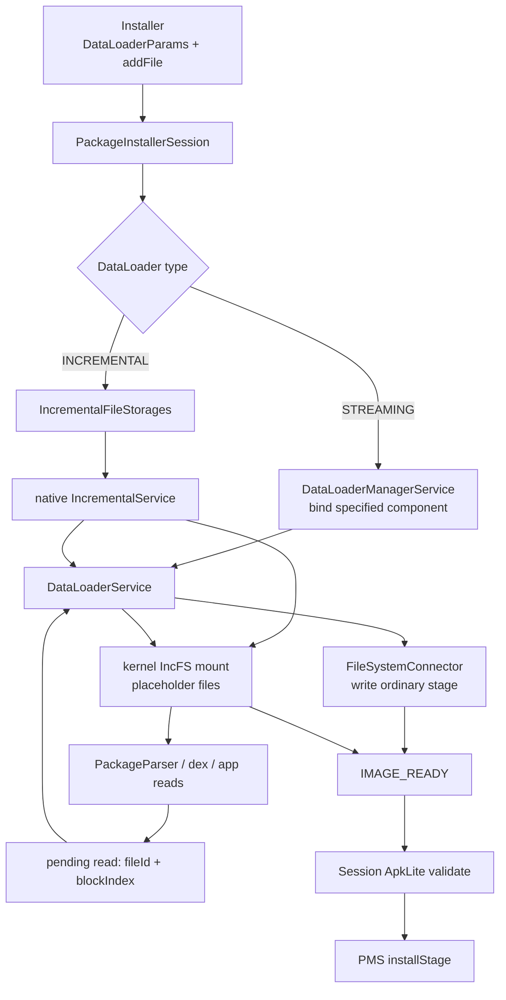
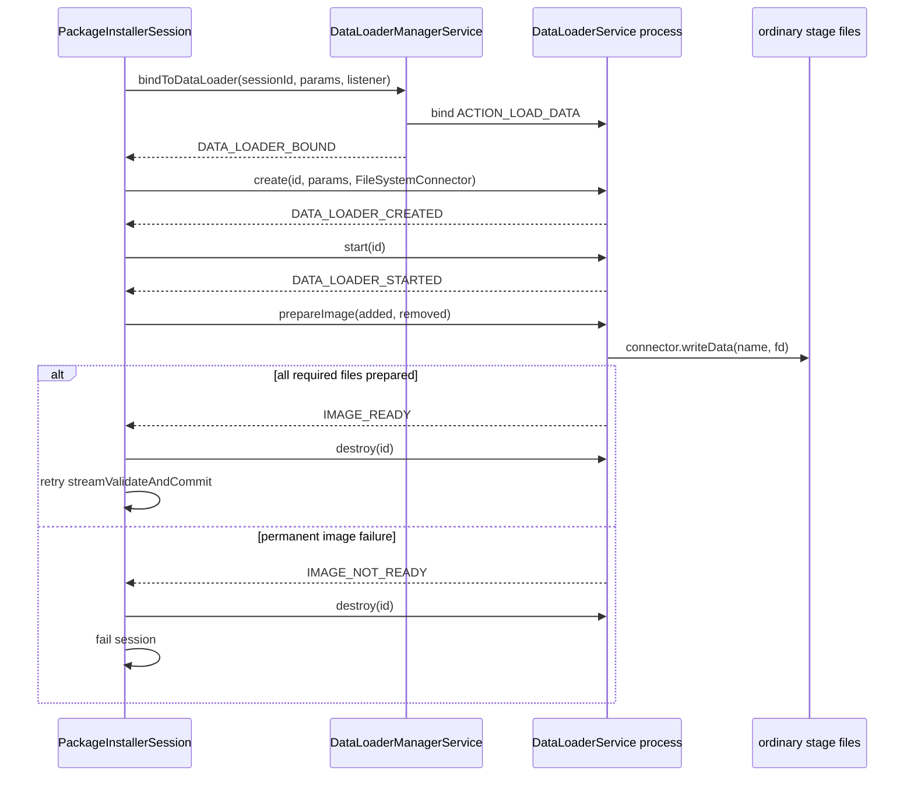
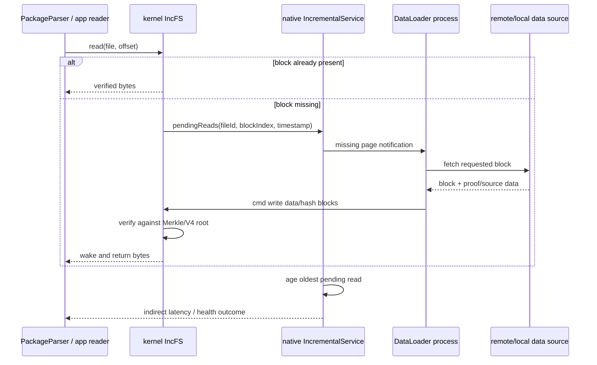

# 257 Android DataLoader、Streaming Install、Incremental File System与按需安装链

> 源码版本：Android 11 / `android-11.0.0_r48`  
> 学习方式：macOS只读核源，不编译、不运行AOSP

## 1. 本章要解决什么

第256章把DataLoader视为Session验证前的一道异步准备门。本章继续进入这道门内部：Installer V2怎样描述尚未写入的文件，Streaming与Incremental为何不是同一种“边下载边安装”，IncFS又怎样把一次文件读取变成远端数据块请求？

```text
addFile为什么只交metadata和signature，不交APK字节？
DataLoaderManager为何还要再次解析指定Service？
Streaming与Incremental谁负责create/start/destroy？
IncFS空壳文件为何能被PackageParser读取？
pendingReads、readLogs和cmd三个FD分别做什么？
V4签名与APK v2/v3签名有什么边界？
IMAGE_READY是否表示所有APK字节已经下载？
UNAVAILABLE、IMAGE_NOT_READY、UNRECOVERABLE为何后果不同？
健康状态READS_PENDING、BLOCKED、UNHEALTHY怎样形成？
安装成功后缺页长期得不到满足，系统怎样处理？
```

## 2. 一句总纲

```text
Installer用DataLoaderParams选择STREAMING或INCREMENTAL并addFile描述文件
→ Session commit后准备DataLoader而非读取普通stage文件
→ Streaming绑定指定Service，由Session手动create/start/prepareImage并写完整安装镜像
→ Incremental创建IncFS storage、占位文件和临时bind，native IncrementalService管理Loader
→ PackageParser/安装器读取缺失4 KiB块时，IncFS产生pending read
→ DataLoader按fileId+blockIndex取数据并经cmd FD填块，Merkle/V4信息校验内容
→ 安装所需页到齐后IMAGE_READY，Session继续ApkLite验证与PMS安装
→ 最终code path改成永久IncFS bind，剩余块可在运行期按需补齐
→ pending-read年龄触发健康状态，严重缺页可终止安装或卸载已装包
```

## 3. 先分清三种安装数据路径

```text
传统Session：客户端openWrite，把完整APK写进普通stage
Streaming：DataLoader主动把安装所需文件内容写入普通stage
Incremental：IncFS先呈现逻辑完整文件，缺少的数据块按读取请求补齐
```

三者最后都进入PackageInstallerSession验证和PMS安装，但“文件何时真正完整”不同。

## 4. 源码地图

```text
frameworks/base/services/core/java/com/android/server/pm/PackageInstallerSession.java
frameworks/base/services/core/java/com/android/server/pm/DataLoaderManagerService.java
frameworks/base/core/java/android/content/pm/DataLoaderParams.java
frameworks/base/core/java/android/content/pm/IDataLoader*.aidl
frameworks/base/core/java/android/service/dataloader/DataLoaderService.java
frameworks/base/core/java/android/os/incremental/IncrementalFileStorages.java
frameworks/base/core/java/android/os/incremental/IncrementalManager.java
frameworks/base/core/java/android/os/incremental/IncrementalStorage.java
frameworks/base/core/java/android/os/incremental/V4Signature.java
frameworks/base/services/incremental/IncrementalService.cpp
system/incremental_delivery/incfs/incfs.cpp
```

## 5. 进程与线程地图

```text
安装器进程：创建Session、addFile、commit、接收状态
system_server PackageInstaller线程：prepareDataLoaderLocked与Session状态推进
DataLoaderManager Binder/主线程：按Component绑定DataLoaderService
DataLoader应用进程：DataLoaderService Java/native实现与数据源访问
native IncrementalService进程：IncFS mount、Loader控制、健康监控
内核IncFS：缺页阻塞、pending read与块校验
```

## 6. 总体架构图



## 7. DataLoader是“内容提供者”，不是安装裁决者

它负责把Session声明的文件准备到可读状态；包名、split、版本、签名一致性由Session验证，升级与系统冲突仍由PMS裁决。

## 8. Installer V2的权限门

SessionParams带dataLoaderParams时，createSession要求`USE_INSTALLER_V2`。这是System API实验接口，普通应用商店不能默认使用。

## 9. 两种DataLoaderParams

```java
DataLoaderParams.forStreaming(component, arguments)
DataLoaderParams.forIncremental(component, arguments)
```

两者都保存type、目标package/class和自由格式arguments；arguments怎样解释由Loader实现决定。

## 10. ComponentName不是直接Binder

Session只持有目标服务名。commit时DataLoaderManagerService用`ACTION_LOAD_DATA`加显式Component查询`UserHandle.getCallingUserId()`，再bindServiceAsUser获取IDataLoader。这里取的是调用DataLoaderManager Binder的user，不是API显式传入的Session userId。

## 11. 显式Component仍要可解析

目标类存在但没有可被`ACTION_LOAD_DATA`查询出的Service时，resolveDataLoaderComponentName返回null，bind失败，Session报MEDIA_UNAVAILABLE。

## 12. r48只取第一个匹配Service

源码注释说包内应只有一个匹配provider；若查询结果多于一个，循环立即返回第一条，没有额外确定性冲突错误。

## 13. DataLoader ID复用sessionId

PackageInstallerSession以sessionId调用`bindToDataLoader()`。DataLoaderManager的SparseArray用这个ID保存ServiceConnection，使状态回调能关联原Session。

## 14. 重复bind会直接返回true

若mServiceConnections已有同ID，Manager不重新绑定，也不替换listener。这有利于恢复尝试，但调用者不能假设每次commit都会产生新Service实例。

## 15. `addFile()`只登记文件合同

InstallationFile包含location、name、size、metadata、signature。Session把它放入mFiles；真实字节稍后由DataLoader或IncFS提供。

## 16. name仍需安全校验

addFile验证location、文件名和metadata，拒绝重复；不能用`../`让Loader越过stage目录。

## 17. metadata是Loader路由信息

Framework不规定其业务格式。ADB Loader可编码远端文件位置/块映射，商店Loader也可编码自己的内容ID；IncFS同时要求fileId或metadata至少一项可建立文件身份。

## 18. signature不是普通APK签名字段

InstallationFile.signature在Incremental路径传给`IncrementalStorage.makeFile()`并按V4/IncFS签名结构校验；APK内部v2/v3签名仍由PackageParser/ApkSignatureVerifier收集。

## 19. location的r48实际支持边界

公开对象列DATA_APP、MEDIA_OBB、MEDIA_DATA，但`IncrementalFileStorages.initialize()`只接受LOCATION_DATA_APP，其他位置抛Unknown file location。

## 20. DataLoader Session不能openWrite/openRead

第256章的普通FD入口被禁用；DataLoader通过FileSystemConnector或IncFS控制面写数据，防止两套生产者竞争同一文件。

## 21. removeFile怎样表达

DataLoader Session把删除记录也放入mFiles，名称转成`.removed`语义；prepareDataLoaderLocked拆成addedFiles与removedFiles传给Loader。

## 22. commit第一次进入DataLoader门

Session已seal后执行`streamAndValidateLocked()`，先调用`prepareDataLoaderLocked()`。返回false表示镜像还没ready，本轮不做ApkLite验证、不置mCommitted。

## 23. `mDataLoaderFinished`不是下载完成率

它表示DataLoader准备阶段已给出可继续/终止结论，避免重复初始化；Incremental安装成功后文件仍可能有未下载块。

## 24. Streaming与Incremental的关键分叉

```java
boolean manualStartAndDestroy = !isIncrementalInstallation();
```

Streaming由PackageInstallerSession手动调IDataLoader生命周期；Incremental由IncrementalService在创建storage时接管。

## 25. Streaming状态序列

```text
BOUND → Session调用create
CREATED → Session调用start
STARTED → Session调用prepareImage
IMAGE_READY / IMAGE_NOT_READY
最后Session调用destroy
```

这是一条显式的控制协议，不是Service一绑定就自动下载。

## 26. `BOUND`意味着什么

ServiceConnection取得IDataLoader Binder并把连接放进Map，然后通知listener。它只说明跨进程连接建立，不说明Loader业务对象创建成功。

## 27. `create()`携带FileSystemControlParcel

Streaming构造的control.callback是Session内FileSystemConnector；Loader经它把某个已声明name的数据从incoming FD写入普通stage。

## 28. FileSystemConnector限制可写集合

内部保存addedFiles名称Set。Loader只能写Session先addFile登记的文件，不能在stage任意创建未声明内容。

## 29. DataLoaderService Java API很小

业务实现主要覆写：

```text
onCreateDataLoader(params)
DataLoader.onCreate(params, connector)
DataLoader.onPrepareImage(addedFiles, removedFiles)
```

生命周期状态由framework native桥统一上报。

## 30. 为什么DataLoaderService还有native层

JNI/`libdataloader`统一管理按id的Loader实例、状态通知与Incremental control FD，Java业务只实现创建/准备镜像逻辑。

## 31. `prepareImage()`不是解析APK

它要求Loader把安装所必需的addedFiles准备好、处理removedFiles，并返回能否继续；Session随后才读取这些文件做ApkLite一致性验证。

## 32. Streaming IMAGE_READY通常要求普通文件可完整读取

普通stage没有IncFS缺页机制。若Loader提前声称ready但文件仍截断，后续parseApkLite会失败并销毁Session。

## 33. Streaming完成后立即destroy Loader

IMAGE_READY或IMAGE_NOT_READY后manualStartAndDestroy路径调用`dataLoader.destroy(id)`。安装后App运行不依赖Streaming Loader继续在线。

## 34. Streaming不是IncFS

它仍可边网络下载边写stage，但Session只有在Loader报告镜像ready后才验证；安装后的code path是普通完整文件，不支持运行时缺页拉取。

## 35. Streaming序列图



## 36. Incremental先取得IncrementalManager

`IncrementalFileStorages.initialize()`从Context获取INCREMENTAL_SERVICE；设备无服务时IOException，Session映射INSTALL_FAILED_MEDIA_UNAVAILABLE。

## 37. IncFS是否可用还有全局门

Session构造Incremental类型时检查`IncrementalManager.isAllowed()`，受`incremental.allowed`属性/平台支持控制；不允许就拒绝创建恢复对象。

## 38. 系统/更新系统App资格检查的r48缺口

`isIncrementalInstallationAllowed(packageName)`的设计意图是：现存system或updated system package返回false，避免关键预装代码依赖未齐块。但Session构造时调用它传入`mPackageName`，此字段通常要到后续APK验证才赋值，此刻常为null；PackageSetting查询因此可能直接为空并返回true。不能把这个构造期检查描述成r48已经可靠执行的安全保证。

## 39. 创建storage的两条路

component package为`local`时，从arguments打开已有Incremental路径并临时bind到stage；其他Loader调用createStorage新建IncFS并配置Loader与健康监听。

## 40. `local`是r48内部约定

它不等于普通包名解析逻辑，而是IncrementalFileStorages按字符串特殊处理的已有storage复用入口。

## 41. 新storage使用临时bind

create mode包含CREATE与TEMPORARY_BIND：真实IncFS存储位于增量目录体系，stageDir只是安装期可见挂载点，重启不会靠这个临时bind永久恢复code path。

## 42. placeholder文件何时创建

initialize遍历addedFiles，对LOCATION_DATA_APP调用makeFile(name,size,metadata,signature)。目录中立即可见逻辑size正确的文件，即使数据块尚未全部存在。

## 43. 存在同名文件就不重复makeFile

`targetFile.exists()`为true时跳过创建，方便重试/恢复；正确性依赖既有IncFS storage与Session元数据一致。

## 44. IncFS块大小为4 KiB

r48这条入口只接受`LOG2_BLOCK_SIZE_4096_BYTES=12`和SHA-256 hashing info，还要求salt为空、root hash刚好32字节、additionalData不超过128字节。文件读取被拆成可独立请求、填充和校验的数据块；这些是Android 11/r48的具体限制，不应外推为所有IncFS/V4版本的永久规格。

## 45. 逻辑文件与物理块分离

stat可看到完整size，open也可成功；读取已有块立即返回，读取缺失块则在内核等待并产生pending read。这是“先安装后补数据”的基础。

## 46. 三个控制FD

```text
cmd：向IncFS提交数据块/哈希块等命令
pendingReads：消费内核正在等待的缺页请求
log：观察已发生读取，用于预取与优化
```

IncrementalService把dup后的控制FD交给DataLoader native桥。

## 47. pending read携带什么

IncFS封装为ReadInfo：fileId、blockIndex、boot clock时间戳与serial number。Loader据此定位数据源的准确文件块。

## 48. 读取线程为何可以阻塞

缺页读取等待Loader填块后由内核唤醒；上层仍像读普通文件。代价是Loader/网络延迟会直接成为PackageParser、dex加载或App IO延迟。

## 49. DataLoader怎样提供块

native Loader监听pendingReads，按fileId与block索引取得压缩/远端内容，再通过IncFS command接口写入数据和必要hash block；内核校验后满足等待读取。

## 50. metadata怎样关联fileId

makeFile要求UUID或metadata不能同时为null；IncrementalService可从metadata派生稳定FileId，确保pending read能回到Loader内容索引。

## 51. V4签名包含两组信息

```text
HashingInfo：SHA-256、4 KiB块、salt、Merkle root hash
SigningInfo：APK digest、certificate、public key、算法、signature
```

序列化`.idsig`版本在r48要求2。

## 52. Merkle树解决块级完整性

只下载一个4 KiB块时无法重新hash整个APK。块到root的Merkle路径证明该块属于签名覆盖的完整文件。

## 53. V4不能替代v2/v3安装身份裁决

V4优化增量块验证并携带APK digest/证书信息；Session仍执行PARSE_COLLECT_CERTIFICATES并核对各split SigningDetails，PMS继续做升级签名谱系检查。

## 54. `makeFile()`先验证V4结构

IncrementalStorage在Binder调用native service前`validateV4Signature()`；格式/算法/块大小不支持会IOException，而不是创建一个无法校验的文件。

## 55. startLoading启动什么

IncrementalStorage调用IIncrementalService.startLoading(storageId)。native IncrementalService确保对应DataLoader实例进入可接收pending read的状态。

## 56. Incremental生命周期不由Session手动驱动

`manualStartAndDestroy=false`时，Session不在BOUND/CREATED分别调用create/start，也不在IMAGE_READY立即destroy；IncrementalService持有control并管理Loader，使安装后仍可补块。

## 57. initialize为什么返回false给Session

它创建storage、placeholder并startLoading，但数据页异步到达。`prepareDataLoaderLocked()`保存mIncrementalFileStorages后返回false，让本轮commit等待状态回调。

## 58. 重试commit不会重建storage

若mIncrementalFileStorages已存在，直接`startLoading()`并返回false。这是公开文档允许DataLoader暂时失败后重新commit的实现基础。

## 59. IMAGE_READY怎样唤醒Session

listener置mDataLoaderFinished=true；child Session通知parent重新dispatch，独立Session通知自己重新发STREAM_VALIDATE_AND_COMMIT。第二轮看到finished后继续ApkLite验证。

## 60. IMAGE_READY只保证“安装所需镜像”

IDataLoader注释是“streamed everything necessary to continue installation”。Incremental文件其他未读取页可以仍缺失，不能把ready翻译成100%下载完成。

## 61. 哪些页属于安装所需

至少包括解析APK结构、证书、Manifest、必要native解压/校验所触达的数据；具体集合由读取行为形成，不是Framework预先写死一张固定offset列表。

## 62. Incremental安装后仍需Loader

App第一次加载尚未下载的dex、资源或其他页时会产生新pending read。Loader不可长期恢复会让运行期IO阻塞，最终触发健康处置。

## 63. code path怎样从stage变成正式目录

PMS重命名Incremental路径时，IncrementalManager打开stage storage，在目标父目录创建linked storage与PERMANENT_BIND，递归link文件后解除旧临时bind。

## 64. permanent bind为何重要

正式`/data/app/...`路径需要跨重启仍映射到IncFS真实storage；仅rename普通目录无法保留mount/Loader元数据关系。

## 65. 文件并没有因link复制全部内容

linked storage复用同一IncFS文件/块状态。安装提交移动的是命名与挂载关系，不是强制把所有缺失块下载一遍。

## 66. read logs与pending reads不同

pendingReads代表当前阻塞需求，必须服务；read logs记录访问历史，可用于预取/调优，也带来读取行为可观察性与隐私成本。

## 67. read logs可被永久关闭

IncrementalService创建`.readlogs_disabled`标记并setStorageParams(false)。关闭后不能再次启用，避免以后重新扩大观测面。

## 68. shell安装的read log策略

Session验证到base后，若installer是shell、Incremental storage存在，而APK既非debuggable也非profilableByShell，就调用disableReadLogs。

## 69. 为什么只针对shell显式处理

ADB增量Loader与调试工具关系特殊；生产不可调试App不应让shell持续获得代码页读取轨迹。

## 70. 四种健康状态

```text
HEALTH_STATUS_OK
HEALTH_STATUS_READS_PENDING
HEALTH_STATUS_BLOCKED
HEALTH_STATUS_UNHEALTHY
```

它们来自pending read等待年龄，不等同于DataLoader生命周期状态。

## 71. 健康计时参数

Session提供blockedTimeoutMs、unhealthyTimeoutMs和unhealthyMonitoringMs给IncrementalService。后者观察最老未满足read的boot-clock时间戳推进状态。

## 72. READS_PENDING的含义

已有缺页请求但等待尚短，Loader仍可能正常从网络取块。它是预警，不一定失败。

## 73. BLOCKED的含义

最老pending read超过blocked阈值但未达unhealthy阈值，说明关键读取已经明显卡住。

## 74. UNHEALTHY的含义

等待超过unhealthy阈值，IncrementalService继续按monitoring周期上报，表示数据源无法在可接受时间满足运行/安装读取。

## 75. 系统ADB Loader的预期特殊宽容

源码意图是：Loader component package为`android`时，安装前READS_PENDING/BLOCKED可继续等待；普通Loader这两种状态落入失败路径。但r48写成`packageName == SYSTEM_DATA_LOADER_PACKAGE`，使用对象引用比较而非`equals()`；是否命中依赖String对象同一性，不能把这项宽容当成稳定合同。

## 76. ADB也不能无限等

即使systemDataLoader，UNHEALTHY仍使mDataLoaderFinished=true并以MEDIA_UNAVAILABLE结束Session。特殊宽容只覆盖暂时等待。

## 77. 安装完成后的UNHEALTHY更严重

listener发现Session已destroyed或DataLoaderFinished后收到UNHEALTHY，会调用`onStorageUnhealthy()`；若mPackageName非空，异步请求PMS对system user全用户卸载该包。

## 78. 为什么要卸载已安装App

逻辑code path存在但关键块永远缺失，相当于不可恢复损坏。继续保留会导致重复启动/读取失败；r48选择删除包恢复系统一致性。

## 79. 该卸载路径的用户边界

代码调用`deletePackageX(... USER_SYSTEM, DELETE_ALL_USERS)`，意图全用户移除；失败只记日志，不把原Session重新变成失败结果。

## 80. DataLoader状态与健康状态是两条通道

生命周期listener报告BOUND/STARTED/IMAGE_READY等；IStorageHealthListener报告IncFS读取是否被满足。一个Loader可以仍STARTED，但storage已经BLOCKED。

## 81. UNAVAILABLE是可重试状态

Session不destroy、不commit，只向statusReceiver发送STATUS_PENDING_STREAMING与原因。调用者可在网络/Loader恢复后再次commit。

## 82. RemoteException也按可重试处理

状态处理调用IDataLoader发生RemoteException时同样sendPendingStreaming，而非立刻永久失败，允许进程重启或Binder恢复。

## 83. IMAGE_NOT_READY是终态失败

它表示Loader完成尝试但不能准备安装镜像：mDataLoaderFinished=true，dispatch verification failure，Streaming还destroy Loader。

## 84. UNRECOVERABLE更强

接口文档要求仅在所有恢复与重试耗尽时使用；Session将其映射MEDIA_UNAVAILABLE并销毁，已安装阶段还可能触发storage unhealthy卸载。

## 85. DESTROYED/STOPPED为何被忽略

PackageInstallerSession listener入口对这两个状态直接return。Manager断连时已销毁连接；恢复通常依赖调用者重新commit/bind，而不是把每次断开直接判永久失败。

## 86. 取不到IDataLoader会永久失败本轮Session

收到非忽略状态后`getDataLoader(id)==null`，Session置finished并dispatch failure。它与明确UNAVAILABLE分支不同，是控制面状态不一致。

## 87. bind失败也是不可继续初始化

`bindToDataLoader()`返回false时直接抛MEDIA_UNAVAILABLE。没有Service连接，就没有未来状态回调能自动唤醒本轮。

## 88. Pending streaming结果包含什么

IntentSender收到sessionId、STATUS_PENDING_STREAMING和“Staging Image Not Ready [cause]”消息；它不是PackageManager legacy INSTALL_FAILED码。

## 89. statusReceiver丢失的边界

sendPendingStreaming发现mRemoteStatusReceiver为null只记录错误。重试commit可更新receiver，这也是sealed Session允许再次commit的重要原因。

## 90. multi-package DataLoader怎样唤醒parent

child IMAGE_READY不直接安装自己，而是取parentSessionId并调用parent.dispatchStreamValidateAndCommit；parent重新检查全部children，保证整组ready才MSG_INSTALL。

## 91. 一个child UNAVAILABLE不会破坏全组

它只发pending状态并保持未committed；parent的allSessionsReady为false。恢复后重试仍可继续，而非销毁其他已ready children。

## 92. 一个child UNRECOVERABLE会破坏全组

验证异常进入第256章multi-package失败传播：parent和其他未失败children一起destroy，确保不向PMS提交部分列表。

## 93. IncFS数据读取图



## 94. 安装快不等于首次启动一定快

只要安装关键页齐全，IMAGE_READY便可推进；App启动若访问大量未下载资源，仍会触发网络缺页。Incremental优化“可用时间”，不是消除总下载量。

## 95. 预取为什么仍有价值

read logs或安装结构可预测启动热点。Loader提前补常用块可减少用户第一次操作遇到同步阻塞，但不能牺牲签名校验或文件身份。

## 96. 网络断开时的用户体验

若所需块已在本地，App仍可运行；访问缺失块会等待，随后可能超时/健康失败。不能笼统说Incremental App必须永远联网或完全离线可用。

## 97. IncFS与稀疏文件不同

普通稀疏文件缺洞读取返回零；IncFS缺块读取产生pending request并等待真实、可验证数据，不能用零填充冒充APK内容。

## 98. IncFS与FUSE职责不同

r48增量链依赖内核Incremental FS专用控制面、块索引和Merkle校验；不是Java进程逐次实现普通文件系统回调。

## 99. 安全边界一：Loader不决定文件名全集

Installer先addFile，Session/FileSystemConnector限定集合；Loader不能偷偷增加未声明APK让验证器看见。

## 100. 安全边界二：Loader不决定包身份

实际APK package/version/split/signing仍由framework解析。metadata声称“com.foo”不能覆盖Manifest和证书事实。

## 101. 安全边界三：块必须可验证

在V4 signing info后续也经过平台签名验证、Merkle root已经被信任的前提下，V4/Merkle使恶意网络或Loader无法仅替换某块而仍通过root校验。Merkle只证明“块属于这个root”，root的可信性仍来自签名链；APK v2/v3/SigningDetails另外负责包整体与升级身份。

## 102. user绑定边界并不等于Session user

DataLoaderManager确实使用`UserHandle.getCallingUserId()`查询和bind，但PackageInstallerSession是在system_server的异步Handler上发起内部调用，Binder身份通常是system UID/user 0。因此源码没有把Session的`userId`显式传入DataLoaderManager；不能声称Loader一定在目标安装用户内绑定。这是r48接口设计边界。

## 103. 易错理解一：Streaming就是Incremental

错。Streaming写普通完整stage并在ready后销毁Loader；Incremental留下IncFS code path，运行期仍可按块加载。

## 104. 易错理解二：IMAGE_READY等于100%

错。接口只保证可继续安装的必要内容；Incremental剩余页可延后。

## 105. 易错理解三：V4替代APK签名

错。V4服务块级增量验证，Session/PMS仍执行SigningDetails与升级证书规则。

## 106. 易错理解四：UNAVAILABLE就是失败

错。它返回PENDING_STREAMING并允许重新commit；IMAGE_NOT_READY/UNRECOVERABLE才进入销毁失败。

## 107. 易错理解五：安装成功后Loader可立即退出

只对Streaming成立。Incremental未齐页仍依赖Loader；永久不可恢复会使storage unhealthy甚至卸载包。

## 108. 第一次复读：两个“ready”边界修订

DATA_LOADER_STARTED只表示能接收缺页并供数；IMAGE_READY表示安装必要镜像已具备；PMS INSTALL_SUCCEEDED又是后一步。三者不可互换。

## 109. 第二次复读：数据完整与逻辑完整修订

IncFS placeholder从目录和stat看像完整文件，但物理数据块可缺失；只有读取过或确认装载的块可立即返回。文中凡写“文件存在”都不等于“全字节落盘”。

## 110. 第三次复读：失败语义修订

断连/STOPPED不自动等于终态；UNAVAILABLE与RemoteException可重试；IMAGE_NOT_READY和UNRECOVERABLE终止安装；安装后UNHEALTHY走卸载。这是四种不同恢复层级。

## 111. 版本边界

本章严格对应Android 11 r48早期Installer V2/IncFS实现，源码仍有多处TODO与SystemApi警告。后续Android重构DataLoader、增量安装资格、V4签名和健康策略，分析真实设备必须核对tag、内核IncFS与厂商Loader。

## 112. macOS只读练习1：比较Streaming与Incremental入口

```bash
cd /Users/ninebot/androidSource
sed -n '2752,2955p' \
  frameworks/base/services/core/java/com/android/server/pm/PackageInstallerSession.java
```

画出manualStartAndDestroy真假两条路径，标出BOUND/CREATED/STARTED/READY/UNAVAILABLE/UNRECOVERABLE每个分支对mDataLoaderFinished、destroy和Session重试的影响。

## 113. macOS只读练习2：追DataLoader跨进程绑定

```bash
cd /Users/ninebot/androidSource
sed -n '1,260p' \
  frameworks/base/services/core/java/com/android/server/pm/DataLoaderManagerService.java
sed -n '1,190p' \
  frameworks/base/core/java/android/service/dataloader/DataLoaderService.java
```

标出ACTION_LOAD_DATA、bind user、ServiceConnection Map、IDataLoader Binder和Java/native桥。回答：BOUND为什么不等于onCreate成功？

## 114. macOS只读练习3：观察IncFS文件与bind

```bash
cd /Users/ninebot/androidSource
sed -n '1,190p' \
  frameworks/base/core/java/android/os/incremental/IncrementalFileStorages.java
sed -n '80,270p' \
  frameworks/base/core/java/android/os/incremental/IncrementalManager.java
sed -n '90,230p' \
  frameworks/base/core/java/android/os/incremental/IncrementalStorage.java
```

追create/open storage、temporary bind、makeFile、startLoading与renameCodePath permanent bind，解释为什么正式安装不是普通目录rename。

## 115. macOS只读练习4：核对pending read与健康状态

```bash
cd /Users/ninebot/androidSource
sed -n '2000,2190p' \
  frameworks/base/services/incremental/IncrementalService.cpp
sed -n '930,1040p' \
  system/incremental_delivery/incfs/incfs.cpp
```

找出最老pending read时间、blocked/unhealthy阈值、Looper监听FD和ReadInfo字段。手算等待时间依次落入OK、READS_PENDING、BLOCKED、UNHEALTHY时Session的预期分支，并说明`systemDataLoader`使用`==`给实际命中带来的不确定性。

## 116. 第四次复读：read log隐私边界

pending read是满足正确性所需控制面，read log是优化观察面。r48对shell安装的非debuggable/非profilable App永久关read logs，不能把两者混成同一个FD或同一种权限。

## 117. 自测题

1. 传统、Streaming、Incremental三条数据路径最大区别是什么？
2. addFile的metadata与signature分别服务什么？
3. Streaming五步状态怎样推进？
4. IncFS placeholder为什么能先被看到？
5. pendingReads、cmd、log三FD各做什么？
6. IMAGE_READY为何不等于全量下载？
7. V4与APK v2/v3签名如何分工？
8. UNAVAILABLE和UNRECOVERABLE后果有何不同？
9. system ADB Loader预期有何特殊宽容，r48实现为何不可靠？
10. 安装后storage UNHEALTHY为何可能卸载包？

## 118. 自测题参考答案

1. 传统由客户端写完整stage；Streaming由Loader写完整普通stage；Incremental保留可缺页IncFS文件。
2. metadata定位Loader内容/fileId，signature承载IncFS/V4块验证信息。
3. BOUND→create，CREATED→start，STARTED→prepareImage，最后READY/NOT_READY并destroy。
4. makeFile先建立逻辑size与身份，缺块读取由内核挂起并请求Loader。
5. pendingReads输出缺页；cmd提交块；log记录访问用于预取/优化。
6. 只需安装必要页齐全，运行期其他页可继续按需拉取。
7. V4/Merkle校验独立块；v2/v3/SigningDetails校验APK与升级身份。
8. 前者发PENDING_STREAMING可重试，后者销毁并失败。
9. 预期READS_PENDING/BLOCKED可继续等、UNHEALTHY仍失败；但包名用`==`比较，宽容分支不构成稳定保证。
10. 正式code path永远缺关键页等同不可恢复损坏，平台选择全用户移除。

## 119. 本章总结

DataLoader把“谁提供安装字节”从PackageInstaller客户端抽象出来：Streaming绑定指定Service，由Session手动create/start/prepareImage，经受限FileSystemConnector写普通stage，ready后不再依赖Loader；Incremental则由IncrementalService创建IncFS placeholder、临时bind与控制FD，缺失4 KiB块在读取时生成pending read，Loader填入经V4/Merkle验证的数据，安装必要页齐全即可推进，剩余页可在正式permanent bind code path中继续加载。生命周期状态与storage健康状态是两张表：UNAVAILABLE可重试，NOT_READY/UNRECOVERABLE终止，安装后UNHEALTHY甚至触发卸载。

## 120. 下一章预告

第258章进入“Android PackageInstaller用户确认、InstallStart、未知来源授权与安装UI回传链”，详细追STATUS_PENDING_USER_ACTION生成的确认Intent如何进入PackageInstaller应用，怎样检查REQUEST_INSTALL_PACKAGES/AppOps、来源可信度与Session owner，并把接受/拒绝结果安全送回system_server。
