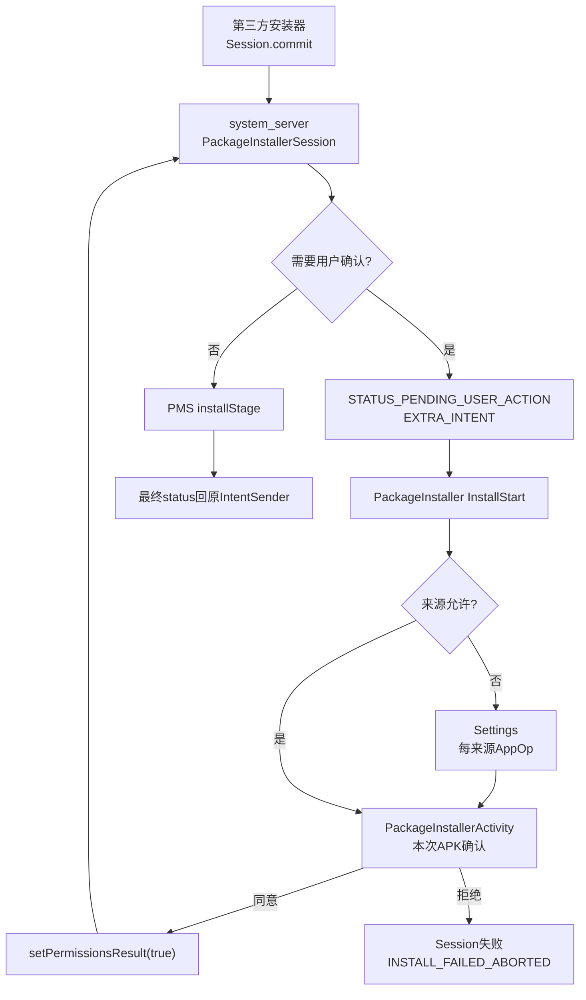
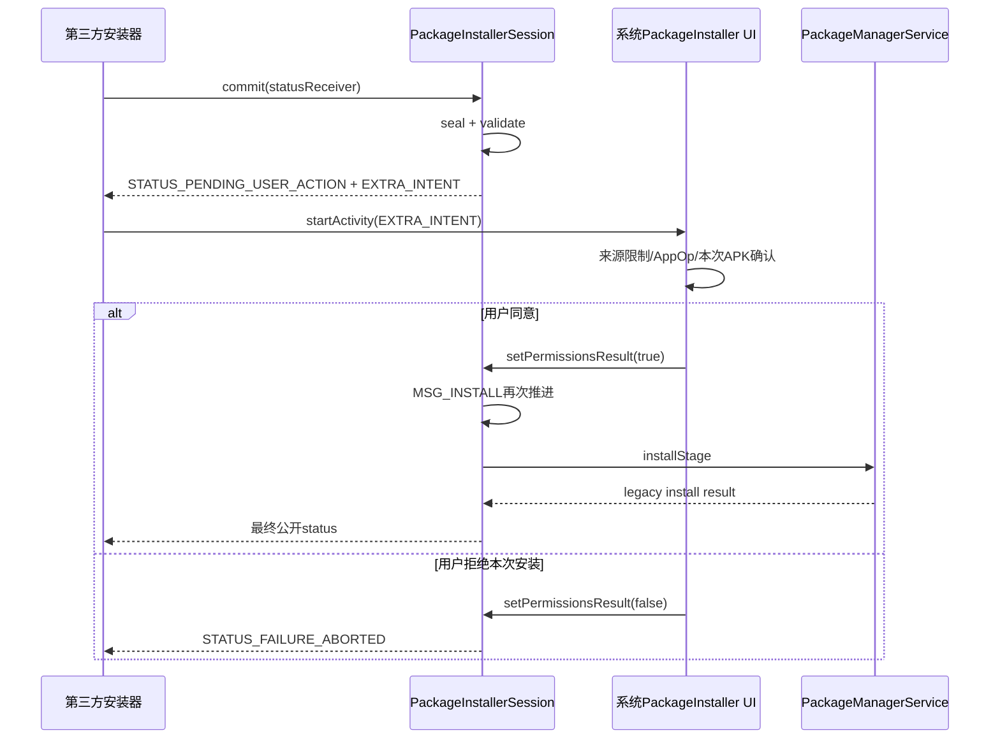
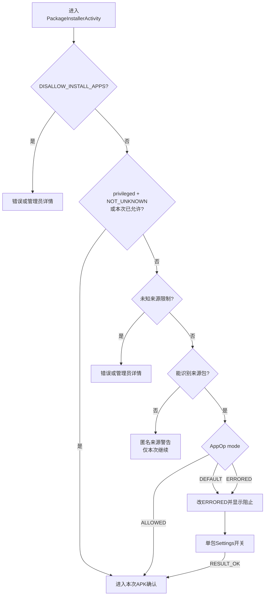

# 258 Android PackageInstaller用户确认、InstallStart、未知来源授权与安装UI回传链

## 1. 本章目标

本章回答一个看似简单、实际有三层状态的问题：应用提交APK后，为什么有时立刻安装，有时先收到`STATUS_PENDING_USER_ACTION`，又有时先跳到“允许来自此来源的应用”设置页？

读完后，你应该能从`PackageInstaller.Session.commit()`一路追到系统安装确认界面，再把用户同意、拒绝和最终安装成功/失败三个回程分开。

## 2. 先记住最终结论

Android 11中至少要区分三件事：

1. “该来源能否请求安装”由`REQUEST_INSTALL_PACKAGES`声明、AppOp和用户限制共同控制。
2. “用户是否同意安装这一个APK”由PackageInstaller确认界面控制。
3. “APK最终是否安装成功”由Session重新推进后PMS的验证与提交结果决定。

前两项通过，也不代表第三项必然成功。

## 3. 两条入口不能混为一谈

第一条是Session入口：应用商店创建并写好Session，`commit()`后framework发现需要人工确认，于是把一个确认Intent放进状态回调。

第二条是APK URI入口：文件管理器用`ACTION_VIEW`或`ACTION_INSTALL_PACKAGE`打开APK，系统PackageInstaller先做来源与确认UI，再由`InstallInstalling`新建自己的Session并提交。

## 4. 本章源码地图

```text
frameworks/base/services/core/java/com/android/server/pm/PackageInstallerSession.java
frameworks/base/services/core/java/com/android/server/pm/PackageInstallerService.java
frameworks/base/core/java/android/content/pm/PackageInstaller.java
frameworks/base/packages/PackageInstaller/AndroidManifest.xml
frameworks/base/packages/PackageInstaller/src/com/android/packageinstaller/InstallStart.java
frameworks/base/packages/PackageInstaller/src/com/android/packageinstaller/InstallStaging.java
frameworks/base/packages/PackageInstaller/src/com/android/packageinstaller/PackageInstallerActivity.java
frameworks/base/packages/PackageInstaller/src/com/android/packageinstaller/InstallInstalling.java
frameworks/base/packages/PackageInstaller/src/com/android/packageinstaller/EventResultPersister.java
packages/apps/Settings/src/com/android/settings/applications/appinfo/ExternalSourcesDetails.java
```

## 5. 进程与线程地图

```text
第三方安装器进程：创建/写入/提交Session，接收IntentSender状态
system_server PackageInstaller线程：验证Session、判断是否需确认、继续安装
com.android.packageinstaller主线程：InstallStart与确认/进度/结果Activity
com.android.packageinstaller AsyncTask线程：复制content URI或APK到Session
com.android.settings主线程：修改来源包的REQUEST_INSTALL_PACKAGES AppOp
```

## 6. 总体架构图



## 7. 三道门的直观比喻

可以把它想成进入机房：

- 来源授权是“这个快递员是否有资格送件”。
- 安装确认是“这一次送来的箱子你是否接收”。
- PMS最终安装是“安检、称重、登记后能否真正入库”。

只拿到快递员通行证，不能替代对具体箱子的确认和安检。

## 8. framework在哪里决定需要确认

入口是`PackageInstallerSession.makeSessionActiveLocked()`。非APEX、非multi-package父Session在进入`installStage`前，会调用`needToAskForPermissionsLocked()`。

它判断的是安装器身份是否具备静默安装资格，不是在此处重新计算APK请求的运行时权限。

## 9. 静默安装权限矩阵

`needToAskForPermissionsLocked()`检查：

- `INSTALL_PACKAGES`；
- 更新现有包时的`INSTALL_PACKAGE_UPDATES`；
- 安装器更新自身时的`INSTALL_SELF_UPDATES`；
- root或system UID；
- Device Owner或affiliated Profile Owner；
- `INSTALL_FORCE_PERMISSION_PROMPT`强制提示位。

普通第三方安装器即使能创建Session，通常仍要用户确认。

## 10. `INSTALL_PACKAGES`与`REQUEST_INSTALL_PACKAGES`不是同一权限

`INSTALL_PACKAGES`是`signature|privileged`的真正静默安装能力，普通第三方App拿不到。

`REQUEST_INSTALL_PACKAGES`表示“可以请求用户安装”，还要结合AppOp和UI；它不是把第三方App升级成静默安装器。

## 11. 更新权限只覆盖特定目标

`INSTALL_PACKAGE_UPDATES`只有在目标包已经存在时才算满足；`INSTALL_SELF_UPDATES`只有目标包UID等于安装器UID时才满足。

所以“具备有限更新权限”不能被理解为可静默安装任意新包。

## 12. targetPackageUid何时参与

Session此前已经解析出`mPackageName`，这里用目标user查询现有包UID。返回-1意味着是新安装，不满足“更新现有包”的条件。

这一步发生在Session内容验证之后，而不是createSession刚创建空目录时。

## 13. Device Owner例外还有用户约束

`isInstallerDeviceOwnerOrAffiliatedProfileOwnerLocked()`先要求Session user与安装器UID所属user相同，再让`DevicePolicyManagerInternal`判断能否静默安装。

跨用户安装不能仅凭另一个用户里的Device Owner身份绕过确认。

## 14. 强制提示优先级最高

即使安装器持有静默权限，只要`INSTALL_FORCE_PERMISSION_PROMPT`被保留，返回值仍是“需要询问”。

因此“有`INSTALL_PACKAGES`就永远不显示UI”并不准确。

## 15. 人工接受位防止重复询问

Session字段`mPermissionsManuallyAccepted`初始为false。用户同意后置true，再次执行`needToAskForPermissionsLocked()`便立即返回false。

它只记录本Session当前system_server进程中的确认结果，不会授予安装器永久静默安装权限。r48没有把这个字段写进`install_sessions.xml`；若尚未终结的Session跨system_server/设备重启恢复，不能假设这次内存确认仍被保留。

## 16. 提示发生前APK已经过初步验证

`makeSessionActiveLocked()`要求Session sealed，并检查`mPackageName`、`mSigningDetails`和`mResolvedBaseFile`非空。

因此确认页面对的是已能解析出身份的Session，不是任意未封口字节流。

## 17. framework构造的确认Intent

核心代码可以压缩为：

```java
Intent intent = new Intent(PackageInstaller.ACTION_CONFIRM_INSTALL);
intent.setPackage(mPm.getPackageInstallerPackageName());
intent.putExtra(PackageInstaller.EXTRA_SESSION_ID, sessionId);
sendOnUserActionRequired(context, statusReceiver, sessionId, intent);
```

`setPackage`把处理范围限制到系统配置的PackageInstaller包，但最终由其中的Intent Filter解析到`InstallStart`。

## 18. 状态回调是一个“信封”

framework不会直接从system_server启动UI，而是向安装器提供的`IntentSender`发送：

```text
EXTRA_SESSION_ID = 当前Session
EXTRA_STATUS = STATUS_PENDING_USER_ACTION
Intent.EXTRA_INTENT = 真正的ACTION_CONFIRM_INSTALL Intent
```

外层Intent是状态；内层Intent才是安装器应在合适时机展示的用户操作。

## 19. 为什么不由system_server强行弹界面

API文档允许安装器根据前台状态决定立即启动，或先发通知引导用户回来。

这样避免后台安装请求突然抢占用户界面，也让应用商店能管理自己的交互节奏。

## 20. `STATUS_PENDING_USER_ACTION`不是失败

值虽然是-1，但它是“暂停等待用户操作”的公开状态，不是`STATUS_FAILURE`。

Session已经sealed，仍可在用户同意后继续；调用方不能把所有非零status都当作终态。

## 21. 等待确认时为何关闭一次active引用

发送用户操作后，Session调用`closeInternal(false)`，释放commit保持的额外active引用，使Session对观察者表现为空闲。

它没有销毁stage，也没有撤销sealed状态。

## 22. 接受确认的Binder入口

确认UI调用`PackageInstaller.setPermissionsResult(sessionId, true)`，再跨`IPackageInstaller`到`PackageInstallerService.setPermissionsResult()`。

服务端要求调用者具有`INSTALL_PACKAGES`，所以第三方安装器不能自行伪造“用户已点同意”。

## 23. 为什么系统确认UI能回传

`com.android.packageinstaller`的Manifest声明`INSTALL_PACKAGES`，它是平台系统组件，能通过服务端权限检查。

安全模型不是“知道sessionId即可批准”，而是“受信任系统UI持权限并代用户回传”。

## 24. 用户同意后的第二轮安装

`setPermissionsResult(true)`在锁内将`mPermissionsManuallyAccepted=true`，向Session Handler发送`MSG_INSTALL`。

第二轮再次走`makeSessionActiveLocked()`，确认门这次放行，然后才继承文件、提取native库并进入PMS。

## 25. 用户拒绝的终态

`setPermissionsResult(false)`会`destroyInternal()`，再以`INSTALL_FAILED_ABORTED`和“User rejected permissions”结束Session。

安装器的原始`IntentSender`随后收到公开的失败状态，而不是只依赖Activity的`RESULT_CANCELED`。

## 26. “返回键”也是明确拒绝

当`PackageInstallerActivity`处理Session确认时，`onBackPressed()`会先调用`setPermissionsResult(false)`。

确认页上的取消按钮也走false，因此这两条路径会真正终结Session。

## 27. 并非所有关闭UI都等于拒绝Session

未知来源限制、Settings返回非OK或某些错误Dialog只是`finish()`，未必调用`setPermissionsResult(false)`。

r48中这种情况下Session可能仍保持sealed并等待后续处理；安装器应观察状态并提供重试或放弃入口，不能只看确认Activity是否消失。

## 28. 最终回调仍使用原IntentSender

用户同意不会更换`mRemoteStatusReceiver`。PMS完成后，Session仍把`EXTRA_STATUS`、`EXTRA_LEGACY_STATUS`、包名和消息送回commit时的接收器。

所以确认UI只是中途控制点，不是最终结果拥有者。

## 29. Session确认时序图



## 30. `InstallStart`是导流Activity

Manifest把它导出，并注册三组入口：

- APK content URI的`ACTION_VIEW`；
- `ACTION_INSTALL_PACKAGE`；
- framework内部`ACTION_CONFIRM_INSTALL`。

它使用透明主题，主要负责身份核验和选择下一个非导出Activity。

## 31. 真正确认页为何不导出

`PackageInstallerActivity`、`InstallStaging`和`InstallInstalling`均`exported=false`。

外部调用统一经过`InstallStart`，避免攻击者跳过来源身份整理，直接构造内部字段进入确认或安装阶段。

## 32. 如何识别Session入口

`InstallStart`只用action是否为`ACTION_CONFIRM_INSTALL`判断：

```java
boolean isSessionInstall =
        PackageInstaller.ACTION_CONFIRM_INSTALL.equals(intent.getAction());
int sessionId = isSessionInstall
        ? intent.getIntExtra(PackageInstaller.EXTRA_SESSION_ID, -1) : -1;
```

不要用URI是否为空来判断Session路径。

## 33. Session入口如何找安装器包名

从状态回调启动UI时，`getCallingPackage()`可能为空。`InstallStart`会读取`SessionInfo.getInstallerPackageName()`补回callingPackage。

来源判断因此绑定到Session记录的installer身份，而不是随便相信Intent中的字符串。

## 34. 普通APK Intent的callingPackage

如果Activity以可追踪方式启动，`getCallingPackage()`可提供调用包；否则代码会进一步向ActivityManager查询`getLaunchedFromUid(activityToken)`。

包名和UID是两类信息：包名用于展示/挑选shared UID包，UID用于权限与AppOp。

## 35. originating UID为什么敏感

Intent可携带`EXTRA_ORIGINATING_UID`，但普通调用者能伪造extra。

因此`InstallStart.getOriginatingUid()`默认不用它，而使用真实launching UID。

## 36. 只有两类中转者可转交原UID

持有`MANAGE_DOCUMENTS`的文档管理器，或系统Downloads Provider，可以把Intent里的originating UID传递下去。

这是因为它们本来就是代表其他App选择/下载文件的可信中转者。

## 37. Downloads Provider还要核对系统身份

代码解析authority为`downloads`的Provider，要求其ApplicationInfo是system app且UID匹配。

同名普通Provider不能仅靠占用authority获得信任。

## 38. shared UID下targetSdk取最大值

`getMaxTargetSdkVersionForUid()`遍历该UID的全部包并取最大targetSdk。

只要共享UID里有面向O及以上的包，就进入新来源声明规则；这比只看任意一个包更保守。

## 39. Android O起必须声明请求安装权限

当originating UID可确定且最大targetSdk至少26时，`InstallStart`要求该UID对应的某个包声明`REQUEST_INSTALL_PACKAGES`。

没有声明就直接取消导流，不进入未知来源设置或安装确认。

## 40. 这里检查的是“声明”而非AppOp已允许

`declaresAppOpPermission()`查询PermissionManager的app-op permission packages，再和各用户中的package UID比较。

永久允许状态稍后由`OP_REQUEST_INSTALL_PACKAGES`判断；声明与用户开关是两道不同条件。

## 41. `canRequestPackageInstalls()`的对应关系

公开API会检查调用包归属、targetSdk至少O、非instant app、声明`REQUEST_INSTALL_PACKAGES`、用户限制以及ExternalSourcesPolicy。

ExternalSourcesPolicy在r48由AppOpsService提供，只有AppOp为`MODE_ALLOWED`才返回true。

## 42. 默认AppOp为何不是“默认允许”

`OP_REQUEST_INSTALL_PACKAGES`的系统默认模式是`MODE_DEFAULT`。确认Activity首次遇到它时，会主动改为`MODE_ERRORED`并显示阻止Dialog。

所以“Manifest写了权限，首次就能直接安装”是错误理解。

## 43. trusted source旁路很窄

只有sourceInfo是privileged app，并且Intent显式带`EXTRA_NOT_UNKNOWN_SOURCE=true`，`InstallStart`才跳过O以后来源包的`REQUEST_INSTALL_PACKAGES`声明门，后续确认Activity也才跳过未知来源AppOp门。

普通App即使伪造同名extra，也会因缺少`PRIVATE_FLAG_PRIVILEGED`而失败。

## 44. trusted只旁路“来源门”

它不会自动替用户点击本次APK的“安装”按钮。直接APK入口仍会显示新装/更新确认；Session是否无需确认则由framework的静默权限矩阵决定。

不要把`EXTRA_NOT_UNKNOWN_SOURCE`解释成全链路静默安装开关。

## 45. `FLAG_ACTIVITY_FORWARD_RESULT`的作用

`InstallStart`把结果转交给下一个Activity，并保留read URI grant。

这样多层导流结束后，最初用`startActivityForResult`的调用者仍可收到结果，而透明trampoline自己立即finish。

## 46. content URI为什么先进入`InstallStaging`

源码明确把这条路径标为deprecated兼容路径，但仍会把内容复制到PackageInstaller自己的临时文件。

原因是外部ContentProvider中的字节可能在解析与安装间被修改，内部副本提供稳定快照。

## 47. 临时文件放在哪里

`TemporaryFileManager.getStagedFile()`在PackageInstaller的device-protected no-backup目录创建`package*.apk`。

它不是PMS最终`/data/app` code path，只是UI流程的可信输入副本。

## 48. 复制发生在后台线程

`InstallStaging.StagingAsyncTask`用ContentResolver打开输入流，以1 MiB缓冲写临时文件，并在取消时尽快停止。

主线程只展示staging进度视图，避免直接阻塞Activity。

## 49. staged副本怎样清理

复制成功后进入`DeleteStagedFileOnResult`，它以`startActivityForResult`打开确认页，回程时删除临时APK。

此外BOOT_COMPLETED会清理本次启动之前遗留在no-backup目录中的旧文件。

## 50. `package:` URI不是APK字节

如果scheme是`package`，`PackageInstallerActivity`通过包名查询已存在但可能未对当前用户安装的包；后续`InstallInstalling`调用`installExistingPackage()`。

它与从content/file读取新APK是两套数据来源。

## 51. 不支持的URI怎样结束

`InstallStart`只接受预期的content或package分支；其他情况返回`INSTALL_FAILED_INVALID_URI`。

内部确认页只处理经过导流后生成的file或package URI，不是一个通用URI解析器。

## 52. Session确认页从哪里取得APK

`PackageInstallerActivity`读取SessionInfo，要求Session存在、sealed且`resolvedBaseCodePath`非空，再把该路径包装成内部file URI解析图标与包信息。

它不是重新从第三方安装器取得原始content URI。

## 53. SessionInfo校验不是最终安全验证

UI只确认状态足以展示；真正签名、版本、split与安装冲突裁决仍在Session/PMS链路。

图标或label能显示，不代表APK已满足所有安装规则。

## 54. Wear设备的r48限制

手持式PackageInstallerActivity检测`DeviceUtils.isWear()`后显示不支持Dialog。

Wear有独立安装服务路径，本章的手持确认UI不能直接套到手表流程。

## 55. UI先解析PackageInfo

file URI调用`PackageUtil.getPackageInfo()`读取Manifest与权限元数据；解析失败显示Parse error并设置legacy invalid APK结果。

`package:`则查询现有PackageInfo与图标。

## 56. 来源包名与目标包名绝不能混

`mOriginatingPackage`表示“谁发起安装”；`mPkgInfo.packageName`表示“正在安装谁”。

未知来源AppOp记在前者，更新/新装确认展示的是后者。

## 57. shared UID来源包怎样选

`getPackagesForUid()`若返回多个包，代码优先选择等于`mCallingPackage`的那一个；找不到时记录日志并取数组第一项。

因此UID是安全主体，但AppOp仍按uid+packageName键记录，包名选择会影响设置页展示。

## 58. 第一层用户限制：禁止安装任何App

`checkIfAllowedAndInitiateInstall()`先检查`DISALLOW_INSTALL_APPS`。

系统基础限制显示错误；设备管理员限制跳转Admin Support详情。它比未知来源AppOp更早执行。

## 59. 第二层限制：禁止未知来源

随后分别检查`DISALLOW_INSTALL_UNKNOWN_SOURCES`和`DISALLOW_INSTALL_UNKNOWN_SOURCES_GLOBALLY`。

局部与全局限制的管理员来源分开处理，系统基础限制则直接显示不可用。

## 60. 用户限制与AppOp不是同一本账

AppOp允许某来源，不会覆盖DevicePolicy/UserManager限制；反过来，未设置用户限制也不等于AppOp已经允许。

`canRequestPackageInstalls()`与确认Activity都会组合这些条件。

## 61. 来源未知时的r48兼容处理

若无法得到`mOriginatingPackage`，r48显示Anonymous Source警告，并允许用户选择继续。

这不是永久授予某个包AppOp，因为系统连来源包名都没有；它只给当前Activity设置`mAllowUnknownSources`。

## 62. 已知来源进入AppOp判断

核心分支是：

```java
int mode = appOps.noteOpNoThrow(OP_REQUEST_INSTALL_PACKAGES,
        mOriginatingUid, mOriginatingPackage);
switch (mode) {
    case MODE_DEFAULT: setMode(..., MODE_ERRORED); // fall through
    case MODE_ERRORED: show blocked dialog; break;
    case MODE_ALLOWED: initiateInstall(); break;
}
```

它既记录一次请求，也取得当前用户选择。

## 63. 为什么把DEFAULT写成ERRORED

未选择与明确禁止最终都不能放行。写成ERRORED让后续Settings列表能把它识别为潜在来源，并明确显示“不允许”。

这也是`AppStateInstallAppsBridge.isPotentialAppSource()`会接受非DEFAULT项的原因。

## 64. 其他AppOp mode怎样处理

r48这里只接受DEFAULT、ERRORED和ALLOWED。若出现IGNORED等其他模式，代码记error并finish。

所以不能按通用AppOps经验假设“任何非errored都等于允许”。

## 65. 被阻止时打开哪个Settings页

Dialog构造`Settings.ACTION_MANAGE_UNKNOWN_APP_SOURCES`，data为`package:<originatingPackage>`，通过`startActivityForResult`启动。

带package scheme时，Settings解析到单个应用的`ExternalSourcesDetails`，不是所有来源App列表。

## 66. Settings页展示资格

`AppStateInstallAppsBridge`同时记录该包是否声明`REQUEST_INSTALL_PACKAGES`以及当前AppOp mode。

没有声明且仍是DEFAULT的普通App不是有效潜在来源，开关会被禁用。

## 67. 开关真正修改什么

`ExternalSourcesDetails.setCanInstallApps()`写：

```java
appOps.setMode(OP_REQUEST_INSTALL_PACKAGES, uid, packageName,
        allowed ? MODE_ALLOWED : MODE_ERRORED);
```

它没有调用`grantRuntimePermission`，也没有授予`INSTALL_PACKAGES`。

## 68. 关闭来源权限为何kill UID

用户把开关关掉时，Settings对非core UID调用`ActivityManager.killUid()`。

这样来源App正在运行的安装流程不能继续沿用旧状态；core UID则被保护，不执行kill。

## 69. Settings如何把“刚允许”返回确认页

当单包Settings Activity中的开关发生实际变化，代码设置`RESULT_OK`或`RESULT_CANCELED`。

确认页只在request code匹配且结果为OK时设置`mAllowUnknownSources=true`并继续。

## 70. 只是按返回键不会被当作允许

`onActivityResult()`对非OK分支直接finish。

因此打开Settings却不打开开关，不能靠返回确认页继续安装。

## 71. 返回后为什么还note一次AppOp

成功允许后，确认页再次`noteOpNoThrow`，记录“来源已被允许并继续请求安装”的使用事件。

这是审计/统计动作，不是第二次授权。

## 72. `mAllowUnknownSources`只属于当前Activity

它会写入savedInstanceState以跨配置重建保存，但不替代AppOps的持久状态。

真正供以后`canRequestPackageInstalls()`查询的是MODE_ALLOWED。

## 73. 来源授权决策图



## 74. 通过来源门后还要识别新装或更新

`initiateInstall()`先处理canonical旧包名，再用`MATCH_UNINSTALLED_PACKAGES`查询现有ApplicationInfo。

只有`FLAG_INSTALLED`为真才当作更新，否则仍按新安装展示。

## 75. 系统App更新提示不同

已有目标包若带`FLAG_SYSTEM`，显示“更新系统应用”文案；普通已安装包显示更新文案；不存在则显示安装文案。

这只是UI警示差异，系统包能否被更新仍由PMS规则决定。

## 76. Android 11确认页不再展示权限清单

r48的`install_content_view.xml`只有新装、更新、更新系统App三类简短问题，没有逐项权限列表。

源码里“new application with no permissions”这句注释不能当成目标APK没有声明权限的事实：`startInstallConfirm()`没有根据`requestedPermissions`选择这段文案，真实布局也没有权限列表。

## 77. 防覆盖点击第一层：隐藏非系统Overlay

Activity给Window添加`SYSTEM_FLAG_HIDE_NON_SYSTEM_OVERLAY_WINDOWS`。

系统在该窗口显示期间隐藏非系统悬浮层，降低恶意App覆盖“安装”按钮诱导点击的风险。

## 78. 防覆盖点击第二层：过滤obscured触摸

安装按钮调用`setFilterTouchesWhenObscured(true)`。即使触摸被标记为被遮挡，也不会触发确认。

它与第243章的InputDispatcher obscured flag链直接对应。

## 79. onPause时主动禁用安装按钮

Activity暂停时把OK设为disabled，resume后再依据`mEnableOk`恢复。

这减少Settings切换、窗口覆盖或生命周期交接期间按钮仍可点击的时间窗。

## 80. 默认焦点放在取消按钮

非触摸模式下，代码让negative button先获得焦点。

电视、键盘或无障碍导航场景中，不会因回车默认落在“安装”而意外批准。

## 81. Session入口点击安装做什么

若`mSessionId != -1`，positive button只调用`setPermissionsResult(true)`并finish。

它不会把resolvedBaseCodePath再复制进一个新Session，也不会直接调用`installExistingPackage()`。

## 82. 直接APK入口点击安装做什么

若`mSessionId == -1`，positive button调用`startInstall()`，启动`InstallInstalling`。

这时此前只有UI临时文件，还没有真正提交给PMS的安装Session。

## 83. 这就是两条入口最关键的分叉

```text
已有Session：确认 -> setPermissionsResult -> 原Session继续
APK URI：确认 -> InstallInstalling -> 新建系统安装器Session -> 写入并commit
```

把APK URI路径画成“第三方Session继续”会多出一个不存在的Session。

## 84. `InstallInstalling`为何能静默提交自己的Session

这个Session的installer UID是系统`com.android.packageinstaller`，它持有`INSTALL_PACKAGES`。

用户确认已在创建Session之前完成，所以commit阶段`needToAskForPermissionsLocked()`通常无需再弹一次相同UI。

## 85. 直接路径创建哪些Session参数

它创建FULL_INSTALL，设置非instant、originating/referrer URI、originating UID、installerPackageName和`INSTALL_REASON_USER`。

随后用`parsePackageLite`尽量填packageName、installLocation和预计安装大小。

## 86. 解析失败为何仍尝试创建Session

Lite解析或大小计算失败时，代码记录日志并退化为文件长度。

真正写入与framework校验仍可能给出更准确失败；UI不会仅因预计size计算失败立即中止。

## 87. APK复制到Session发生在AsyncTask

后台打开临时file，调用`session.openWrite("PackageInstaller", 0, size)`，以1 MiB缓冲写入，并累加staging progress。

结束前显式`session.fsync(out)`，再把Session对象返回主线程。

## 88. 复制阶段可以取消

用户点击取消会cancel AsyncTask；若Session已创建，则`abandonSession()`。

这发生在commit前，尚可安全放弃stage。

## 89. commit后为何禁用取消

`onPostExecute()`调用commit后禁用取消按钮并禁止点击窗口外结束。

Session已经sealed并进入系统安装流程，简单关闭Activity不能被当作可靠撤销协议。

## 90. 结果接收器为什么用显式广播

`InstallInstalling`创建只发给自身包的PendingIntent广播，action为`ACTION_INSTALL_COMMIT`，并携带独立`installId`。

Manifest中的`InstallEventReceiver`还要求发送方有`INSTALL_PACKAGES`，减少伪造结果广播。

## 91. sessionId与installId不是同一个ID

sessionId由PackageInstallerService分配，标识stage和安装事务；installId由`EventResultPersister`分配，只用于把广播结果匹配到当前UI观察者。

二者生命周期与命名空间不同。

## 92. 为什么需要`EventResultPersister`

安装可能在Activity配置变化或进程重建期间完成。接收器若没有在线observer，就把status、legacyStatus和message写入AtomicFile。

新Activity重新注册同一installId时，可立即拿到已保存结果。

## 93. pending user action在结果持久器里是特殊项

`EventResultPersister.onEventReceived()`遇到`STATUS_PENDING_USER_ACTION`时直接启动`Intent.EXTRA_INTENT`，不把它存为最终EventResult。

因为它不是终态；只有成功/失败才应唤醒结果观察者。

## 94. 这条自动启动路径的适用边界

AOSP系统安装器自己的Session通常已具`INSTALL_PACKAGES`，所以一般不会再pending；强制提示等特殊情形才可能触发。

第三方安装器应按公开API自行处理内层Intent，不能假设系统替所有应用自动启动。

## 95. SessionCallback只负责进度显示

`InstallSessionCallback.onProgressChanged()`把0到1的float映射到ProgressBar。

`onFinished()`为空，最终成功/失败由带详细status的IntentSender广播处理；两种回调不能混为一个。

## 96. 最终状态有公开码与legacy码

Session把内部`INSTALL_*`结果转换成`PackageInstaller.STATUS_*`，同时附带`EXTRA_LEGACY_STATUS`和message。

UI用公开码选择成功/失败类别，用legacy码在`EXTRA_RETURN_RESULT`路径回给旧Intent API调用者。

## 97. 成功UI的两种模式

若调用方要求`EXTRA_RETURN_RESULT`，`InstallSuccess`立即设置`RESULT_OK`和`INSTALL_SUCCEEDED`后finish。

否则显示“完成/打开”，并只在目标包存在可启动Activity时启用“打开”。

## 98. 失败UI的两种模式

要求返回结果时，`InstallFailed`返回`RESULT_FIRST_USER`和legacy失败码；否则按blocked、conflict、incompatible、invalid或通用失败显示解释。

存储不足还会提供进入应用管理的入口。

## 99. Activity result不是Session status的替代品

Session API的权威结果送到commit的`IntentSender`；APK Intent兼容API才主要通过Activity result回调用者。

调试时先确认自己走哪条入口，再决定监听广播/PendingIntent还是`onActivityResult`。

## 100. “允许此来源”不是对APK签名的信任

AppOp键是originating uid+packageName，表达用户允许这个来源App发起安装。

它不记录某个下载网址、某张证书或某个目标APK的白名单。

## 101. 来源授权也不是永久不可撤销

用户可在Settings“安装未知应用”里把来源改回MODE_ERRORED；Settings还会kill非core来源UID。

之后`canRequestPackageInstalls()`返回false，新请求重新被阻止。

## 102. 安装确认不授予运行时权限

用户点“安装”只是允许PackageInstaller继续包安装事务。

APK声明的dangerous权限仍遵循运行时授权、默认权限授予或角色策略；不能把安装按钮理解成一次性批准Manifest全部权限。

## 103. 来源允许不等于静默安装

第三方来源即使`canRequestPackageInstalls()==true`，它仍通常缺少`INSTALL_PACKAGES`。

因此Session commit仍会返回`STATUS_PENDING_USER_ACTION`，或直接APK路径仍显示具体APK确认页。

## 104. 确认成功不等于安装成功

确认之后还可能因签名冲突、版本降级、split不一致、空间不足、verifier阻止或PMS策略失败。

应用商店必须继续等待最终status，而不能在UI消失时显示“安装完成”。

## 105. 用户拒绝与策略阻止不同

明确点击取消对应`INSTALL_FAILED_ABORTED`；设备策略限制通常显示管理员详情或blocked语义；未知来源未授权则可能只关闭UI、让Session继续等待。

这三者的恢复方式分别是重新创建/提交、联系管理员、去Settings授权或放弃Session。

## 106. 直接APK路径的数据不可变策略

content URI先复制到PackageInstaller私有临时文件，确认后又写入PackageInstallerSession stage。

这是两次不同目的的复制：前者防外部Provider换内容，后者进入PMS受控安装事务。

## 107. 安全边界汇总

本链同时依赖：

- system_server不直接相信安装器回传“已同意”；
- InstallStart不相信任意originating UID extra；
- 内部Activity不导出；
- 来源AppOp按uid+package保存；
- 用户限制优先；
- Overlay隐藏和obscured触摸过滤；
- 最终PMS仍验证包身份。

任何一层都不能单独替代其余层。

## 108. 第一次复读：两个“允许”已拆开

“允许来自此来源”写的是来源App的AppOp；“安装”按钮写的是当前Session的`mPermissionsManuallyAccepted`。前者可跨请求保留，后者只属于一个Session。

## 109. 第二次复读：两个Session路径已拆开

第三方Session确认后继续原Session；content/file APK确认后由系统PackageInstaller新建Session。正文中凡出现`InstallInstalling`，都只属于后一条直接APK路径。

## 110. 第三次复读：三个回传渠道已拆开

`SessionCallback`用于生命周期/进度，commit的`IntentSender`用于Session权威status，Activity result用于老式APK Intent UI回程。它们可能同时出现，但语义不相同。

## 111. 版本边界

本章严格对应Android 11 `android-11.0.0_r48`中framework内置`frameworks/base/packages/PackageInstaller`。后续Android把安装器模块、Session约束、PendingIntent可变性、未知来源UI和后台启动限制继续调整；厂商也可能替换PackageInstaller包。分析设备时必须核对真实package、Manifest与tag。

## 112. macOS只读练习1：手算是否需要确认

```bash
cd /Users/ninebot/androidSource
sed -n '500,550p' +  frameworks/base/services/core/java/com/android/server/pm/PackageInstallerSession.java
sed -n '1785,1830p' +  frameworks/base/services/core/java/com/android/server/pm/PackageInstallerSession.java
```

分别为普通商店、新装；持`INSTALL_PACKAGE_UPDATES`的新装；持该权限的更新；Device Owner同用户；带FORCE_PROMPT的system UID手算返回值。每例写出哪个布尔项生效。

## 113. macOS只读练习2：追外层status与内层Intent

```bash
cd /Users/ninebot/androidSource
sed -n '3235,3270p' +  frameworks/base/services/core/java/com/android/server/pm/PackageInstallerSession.java
sed -n '145,275p' +  frameworks/base/core/java/android/content/pm/PackageInstaller.java
sed -n '40,145p' +  frameworks/base/packages/PackageInstaller/src/com/android/packageinstaller/InstallStart.java
```

画出`IntentSender -> EXTRA_STATUS -> Intent.EXTRA_INTENT -> ACTION_CONFIRM_INSTALL -> EXTRA_SESSION_ID`，解释为什么收到pending后不能立刻当作失败。

## 114. macOS只读练习3：核对未知来源授权

```bash
cd /Users/ninebot/androidSource
sed -n '420,510p' +  frameworks/base/packages/PackageInstaller/src/com/android/packageinstaller/PackageInstallerActivity.java
sed -n '60,145p' +  packages/apps/Settings/src/com/android/settings/applications/appinfo/ExternalSourcesDetails.java
sed -n '25410,25465p' +  frameworks/base/services/core/java/com/android/server/pm/PackageManagerService.java
```

列出Manifest声明、targetSdk、instant-app、UserManager限制、AppOp五项条件，并说明Settings开关为什么不是运行时权限grant。

## 115. macOS只读练习4：比较两条安装入口

```bash
cd /Users/ninebot/androidSource
sed -n '300,590p' +  frameworks/base/packages/PackageInstaller/src/com/android/packageinstaller/PackageInstallerActivity.java
sed -n '45,430p' +  frameworks/base/packages/PackageInstaller/src/com/android/packageinstaller/InstallInstalling.java
```

分别从`mSessionId != -1`和`mSessionId == -1`开始画图，标出哪条调用`setPermissionsResult`、哪条创建Session、哪条复制APK，以及最终结果由谁接收。

## 116. 第四次复读：r48关闭UI不总是终结Session

确认页明确取消/返回会`setPermissionsResult(false)`；但来源设置取消、用户限制Dialog等多条路径只finish。阅读日志时应同时看Session是否destroyed及原status receiver是否收到终态，不能用“安装器界面消失”代替服务端状态。

## 117. 自测题

1. `STATUS_PENDING_USER_ACTION`的外层和内层Intent分别装什么？
2. `INSTALL_PACKAGES`与`REQUEST_INSTALL_PACKAGES`有什么区别？
3. 用户允许某来源后，为什么仍可能看到安装确认？
4. InstallStart怎样防止伪造originating UID？
5. MODE_DEFAULT为什么会被改成MODE_ERRORED？
6. Session入口点“安装”后会不会创建新Session？
7. content URI为何先复制临时文件？
8. installId与sessionId各自做什么？
9. 用户点安装后为何仍要等待最终status？
10. r48中哪些关闭UI路径可能不等于拒绝Session？

## 118. 自测题参考答案

1. 外层是pending状态和sessionId，内层是可启动的ACTION_CONFIRM_INSTALL。
2. 前者是系统静默安装能力；后者只是声明可请求，并受AppOp、限制和UI控制。
3. 来源授权针对发起者，安装确认针对当前APK/Session。
4. 默认使用真实launching UID，只信任文档管理器或系统Downloads转交的extra。
5. 默认也不能放行，写ERRORED让拒绝状态明确且能进入潜在来源列表。
6. 不会；它给原Session调用setPermissionsResult(true)。
7. 防止外部Provider在解析与安装之间替换字节。
8. sessionId标识PMS安装事务，installId匹配PackageInstaller UI的持久化广播结果。
9. PMS后续仍可能在签名、版本、split、存储或策略处失败。
10. Settings非OK返回、来源/用户限制和部分错误Dialog只finish；要看Session服务端终态。

## 119. 本章总结

Android 11安装确认链不是一个Dialog，而是framework与两个系统应用协作的状态机。PackageInstallerSession先根据安装器权限、目标是否已安装、root/system/Device Owner和FORCE_PROMPT决定能否静默；需要用户时，经commit的IntentSender发送`STATUS_PENDING_USER_ACTION`与内层`ACTION_CONFIRM_INSTALL`。InstallStart核准真实来源UID、O及以上的`REQUEST_INSTALL_PACKAGES`声明并导流；PackageInstallerActivity再组合用户限制、每来源AppOp、Settings单包开关与当前APK确认。已有Session同意后回传`setPermissionsResult(true)`继续原事务，直接APK URI则由InstallInstalling创建特权Session、复制、commit并以持久化广播接收结果。来源允许、Session确认和最终安装成功始终是三本账。

## 120. 下一章预告

第259章进入“Android APK安装Verifier、PACKAGE_NEEDS_VERIFICATION广播、超时与最终放行链”，继续沿用户确认后的验证阶段，区分required verifier、sufficient verifier、integrity verification、timeout和最终放行。
