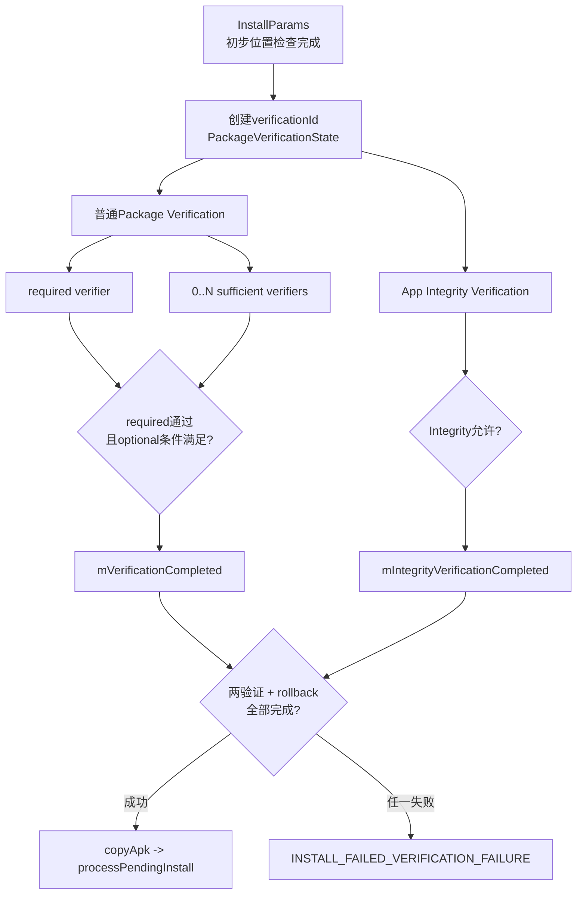
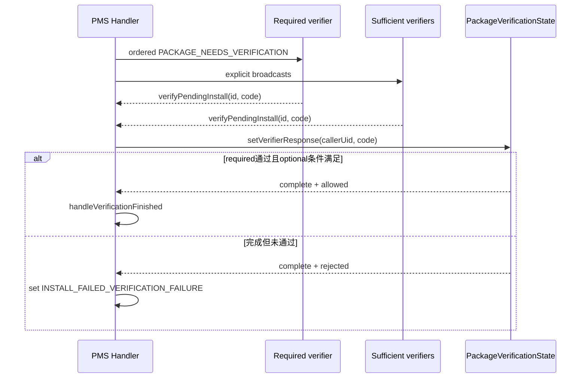
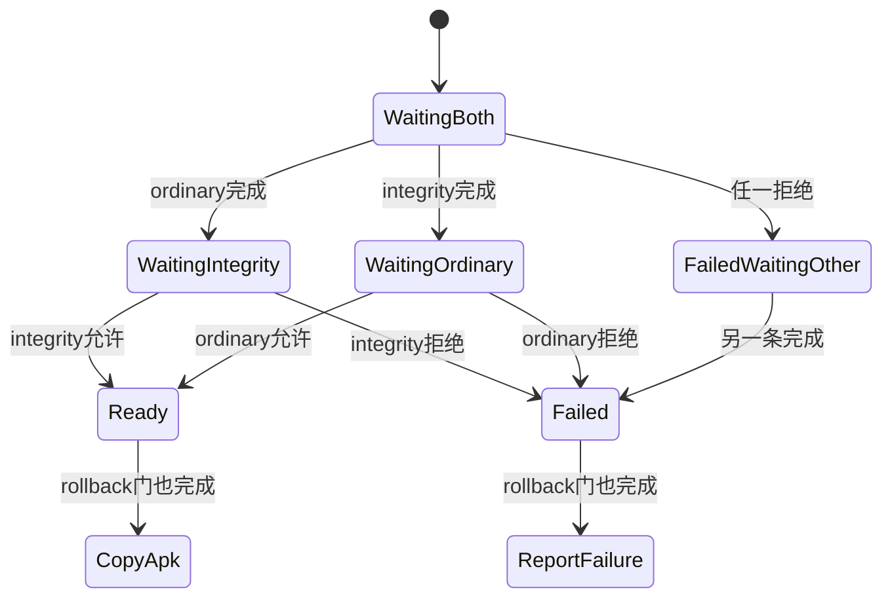

# 259 Android APK安装Verifier、PACKAGE_NEEDS_VERIFICATION广播、超时与最终放行链

## 1. 本章目标

本章继续第258章：用户已经同意安装，Session也进入PMS，但APK仍不会立刻复制到最终安装位置。我们要追清普通Package Verifier、App Integrity、timeout和`InstallParams`汇合门。

## 2. 最重要的结论

Android 11有两条并行验证：

- package verification：required verifier加零个或多个sufficient verifier；
- integrity verification：system_server内AppIntegrity规则引擎。

只有两条都完成，且没有把返回码改成失败，安装才继续。

## 3. 不要和域名验证混淆

`ACTION_PACKAGE_NEEDS_VERIFICATION`验证“这个APK能否安装”；第255章的`ACTION_INTENT_FILTER_NEEDS_VERIFICATION`验证“某包能否默认打开Web域名”。

它们虽共享部分timeout配置代码和“verification”命名，却使用不同状态类、权限、结果码与业务后果。

## 4. 本章源码地图

```text
frameworks/base/services/core/java/com/android/server/pm/PackageManagerService.java
frameworks/base/services/core/java/com/android/server/pm/PackageVerificationState.java
frameworks/base/core/java/android/content/pm/PackageManager.java
frameworks/base/services/core/java/android/content/pm/PackageManagerInternal.java
frameworks/base/services/core/java/com/android/server/integrity/AppIntegrityManagerServiceImpl.java
frameworks/base/services/core/java/com/android/server/integrity/engine/RuleEvaluationEngine.java
frameworks/base/services/core/java/com/android/server/integrity/engine/RuleEvaluator.java
frameworks/base/services/core/java/com/android/server/integrity/model/IntegrityCheckResult.java
```

## 5. 进程与线程地图

```text
system_server PMS Handler：创建verificationId、发广播、收响应、处理timeout
required verifier应用进程：接收有序广播，异步扫描并回verifyPendingInstall
sufficient verifier应用进程：接收显式普通广播并投票
system_server AppIntegrity HandlerThread：解析APK、组装metadata、运行规则
system_server安装线程/Handler：两条验证及rollback门齐后copyApk并继续安装
```

## 6. 总体结构图



## 7. 验证位于安装流程什么位置

`InstallParams.handleStartCopy()`先取得`PackageInfoLite`、检查推荐安装位置并创建`InstallArgs`，随后才启动验证。

这里还没有执行`mArgs.copyApk()`；验证门的目的之一就是阻止未放行内容进入下一复制/安装阶段。

## 8. 哪些安装不创建验证状态

代码只在`!origin.existing`时创建`PackageVerificationState`。move现有安装位置等`origin.existing`路径不重新广播APK验证。

“每次PMS操作都走Verifier”因此不准确。

## 9. verificationId是什么

`mPendingVerificationToken++`生成进程内递增ID，作为两类广播和回调共同关联键。

它与PackageInstaller sessionId不同；PMS用`mPendingVerification[verificationId]`找到对应`InstallParams`。

## 10. 为什么两类验证共享一个ID

普通Verifier和Integrity检查的是同一份安装候选。共享ID与State能让任意到达顺序都落到同一事务，并在双方完成后移除。

它不是说两类Verifier使用相同结果码。

## 11. `PackageVerificationState`保存什么

它持有：

- required verifier UID及完成/通过位；
- sufficient verifier UID集合及完成/通过位；
- timeout是否延长；
- integrity是否完成；
- 对应`InstallParams`。

## 12. InstallParams还有另一组完成位

`InstallParams`维护`mVerificationCompleted`、`mIntegrityVerificationCompleted`和`mEnableRollbackCompleted`。

State主要负责投票聚合与pending表清理；InstallParams完成位真正决定何时`handleReturnCode()`。

## 13. 两套账不能混用

`PackageVerificationState.areAllVerificationsComplete()`只决定能否从`mPendingVerification`删除。

即使某个r48边界让State未能标成complete，`handleVerificationFinished()`仍可能把InstallParams门置为完成；分析卡住或泄漏时必须同时看两套字段。

## 14. required verifier怎样在开机时选出

PMS以`ACTION_PACKAGE_NEEDS_VERIFICATION`和APK MIME查询system user中的system-only、Direct Boot aware/unaware Receiver。

恰好一个匹配时记录其packageName为`mRequiredVerifierPackage`。

## 15. “required but not really required”的含义

方法名`getRequiredButNotReallyRequiredVerifierLPr()`很诚实：

- 0个匹配：记录error并设为null，系统仍可启动；
- 1个：采用；
- 多于1个：抛RuntimeException。

所以AOSP允许完全没有普通required verifier的产品配置。

但“PMS能启动”不等于普通安装验证能自然完成：若required包为null而本次ordinary verification仍enabled，r48既不会发送required有序广播，也不会安排其timeout，State的required complete可能一直为false。产品若选择0个Verifier，还必须配套关闭/旁路普通验证；不能只看到开机未报错就认为链路完整。

## 16. required verifier按目标用户取UID

安装时根据verifier user查询`mRequiredVerifierPackage`的UID。`INSTALL_ALL_USERS`被改用system user验证。

State记录的是实际UID，后续回调不仅检查权限，还必须由这个UID投票才算required响应。

## 17. 普通验证默认开启

r48编译常量`DEFAULT_VERIFY_ENABLE=true`。但`isVerificationEnabled()`还会结合ADB、disable flag、instant app和设置项。

“默认开启”不代表任何安装类型绝无旁路。

## 18. ADB下`ENSURE_VERIFY_APPS`优先

若用户限制要求确保验证，ADB安装直接返回enabled。

即使开发者请求disable verification，也不能越过该用户策略。

## 19. 普通ADB由全局设置控制

没有强制限制和特殊disable分支时，读取`PACKAGE_VERIFIER_INCLUDE_ADB`，默认1。

因此常规ADB安装在r48默认也参与普通Verifier。

## 20. ADB disable flag不是任意跳过

带`INSTALL_DISABLE_VERIFICATION`时：

- 新装包仍强制验证；
- 更新现有包时，只有待装APK是debuggable才跳过；
- 非debuggable更新仍验证。

这是避免用disable flag给全新或release包开通道。

## 21. 非ADB disable flag更直接

非ADB安装只要保留`INSTALL_DISABLE_VERIFICATION`，`isVerificationEnabled()`返回false。

但调用者能否设置并保留这个内部flag，前面还有PackageInstallerService权限与flag净化，不能把它当普通App公开开关。

## 22. Instant App的窄旁路

非ADB instant install中，若instant installer包就是required verifier包，并且AppOps`checkPackage(installerUid, package)`确认身份，普通验证可跳过。

这是避免同一可信组件既安装又给自己发重复验证。

## 23. Incremental + V4的特殊旁路

即使普通验证enabled，只要安装是Incremental且签名方案版本为V4，r48有意跳过安装前普通Verifier。

Integrity检查仍会运行；安装成功后还会给Verifier发送带root hash的完成通知。

## 24. 为什么只有同时满足Incremental与V4才跳

普通Streaming、传统stage或缺少V4的Incremental仍照常验证。

V4块可验证与Incremental按需安装组合，才触发这条“先安装、后通知root”的特例。

## 25. 普通验证请求Intent

PMS构造`ACTION_PACKAGE_NEEDS_VERIFICATION`，data是内部origin路径的file URI，type为APK MIME，并添加foreground和read URI grant。

Receiver得到的是受控安装候选，不是原始网络URL。

## 26. 广播携带哪些事实

主要extra包括verificationId、installFlags、packageName、versionCode/longVersionCode、initiating installer package，以及可用时的originating URI、referrer、originating UID和installer UID。

这些是Verifier风险决策输入，不替代其读取APK内容。

## 27. 先查询当前用户的live Receiver

PMS用`queryIntentReceiversInternal()`按verifier user查询当前启用、可见的匹配Receiver。

开机选出的required包名只是产品身份；安装时仍要从当前用户状态解析具体Component。

## 28. required请求为什么用有序广播

PMS把Intent显式指向required verifier Component，再用`sendOrderedBroadcastAsUser()`发送，并要求Receiver持有`PACKAGE_VERIFICATION_AGENT`。

有序广播的最终Receiver用于在目标Receiver执行结束后才开始timeout。

## 29. timeout不是从send调用瞬间开始

只有ordered broadcast链返回后，final receiver才向PMS Handler排`CHECK_PENDING_VERIFICATION + delay`。

Verifier的`onReceive()`调度时间不会直接吃掉后面的完整响应窗口，但onReceive本身仍受广播ANR约束。

## 30. 临时电量白名单

PMS按verification timeout给Verifier临时power-save whitelist，并在BroadcastOptions中设置相同临时白名单时长。

这让Doze中的Verifier有机会运行；不意味着它可无限后台执行。

## 31. required Receiver的权限边界

`PACKAGE_VERIFICATION_AGENT`是`signature|privileged`。请求广播还显式要求这个权限，回调API也再次enforce。

普通第三方Receiver即使声明相同action，不能成为可信required响应者。

## 32. sufficient verifier从哪里声明

`PackageInfoLite.verifiers`来自待安装APK Manifest中的`<package-verifier>`声明，包含verifier包名与预期public key。

它表达“这个APK额外要求某些已安装验证者参与”，不是系统全局Verifier列表。

## 33. sufficient先匹配Receiver

PMS要求声明的包在当前`ACTION_PACKAGE_NEEDS_VERIFICATION`查询结果中有Receiver；否则跳过该候选。

只安装了同名包但没有可用Receiver还不够。

## 34. 再匹配单签名public key

`getUidForVerifier()`要求已安装Verifier恰好一张当前签名，并比较签名公钥编码与APK声明的public key。

多签名、证书解析失败或公钥不一致都会忽略，防止同名恶意包冒充。

## 35. sufficient最终仍按UID记账

通过Component和公钥校验后，PMS把Verifier UID加入`mSufficientVerifierUids`。

回调时用Binder calling UID删除/更新这一项，不能只靠verificationId替别人投票。

## 36. 声明了optional但一个都匹配不到

若`pkgLite.verifiers`非空，`matchVerifiers()`返回空List，PMS立即把返回码设为`INSTALL_FAILED_VERIFICATION_FAILURE`。

这不是“没有optional就忽略”，而是“APK明确要求却无可信实现”。

## 37. sufficient请求为何是显式普通广播

PMS对每个已核准Component复制Intent、setComponent并`sendBroadcastAsUser()`。

它们可并行响应，不需要按顺序串行；公钥和UID账本承担身份约束。

## 38. required投`VERIFICATION_ALLOW`

State将required complete与passed都置true，但不会清空sufficient集合。

若APK声明了额外Verifier，仍要至少一个sufficient允许或全部返回后得出失败。

## 39. required投`ALLOW_WITHOUT_SUFFICIENT`

这是一项隐藏的required专用结果码。State先清空sufficient UID集合，再按ALLOW处理required。

于是required可以明确表示“不必再等optional”。

## 40. required拒绝

任何非ALLOW/ALLOW_WITHOUT_SUFFICIENT码都把required passed设false。

若sufficient仍未完成，State可能继续等它们；最终`isInstallAllowed()`仍因required失败而拒绝。

## 41. sufficient允许

任意一个sufficient返回`VERIFICATION_ALLOW`，立即设置sufficient complete和passed。

后续其他optional响应不再影响已经成立的“至少一个允许”条件。

## 42. sufficient拒绝不是立刻总失败

非ALLOW响应只删除该UID。如果还有其他sufficient候选，继续等待。

只有全部候选耗尽且从未有人ALLOW，complete才成立而passed仍为false。

## 43. 完成条件的真值表

```text
required未响应：未完成
required完成 + 无sufficient要求：完成
required完成 + 至少一个sufficient允许：完成
required完成 + sufficient仍有人未响应：未完成
required完成 + sufficient全部耗尽且无人允许：完成但不通过
```

## 44. 放行条件比完成条件更严格

`isInstallAllowed()`先要求required passed；若sufficient阶段完成，则还要求sufficient passed。

“所有人都回了”只能说明可做决定，不等于决定为允许。

## 45. State聚合代码的核心

```java
if (!mRequiredVerificationComplete) return false;
if (mSufficientVerifierUids.size() == 0) return true;
return mSufficientVerificationComplete;
```

要结合`isInstallAllowed()`阅读，不能只截这一段得出“集合空就通过”。

## 46. 普通Verifier完整时序



## 47. Verifier如何回调

Verifier调用`PackageManager.verifyPendingInstall(id, code)`，跨Binder进入PMS。

服务端先enforce`PACKAGE_VERIFICATION_AGENT`，再把code与`Binder.getCallingUid()`封成`PackageVerificationResponse`送到PMS Handler。

## 48. 有权限也不能替别人投票

Handler调用`state.setVerifierResponse(response.callerUid, response.code)`。

UID既非required也不在sufficient集合时返回false，不改变状态；verificationId泄露本身不足以批准安装。

## 49. 重复响应怎样处理

sufficient UID第一次响应后就从集合删除，第二次不再匹配。required没有单独防重复：后来的required响应可再次覆盖passed位，但通常State完成后很快被移除。

调用方不应把重复投票当作可靠更新协议。

## 50. 未知verificationId

pending表找不到State时，Handler只记录warning并忽略。

这可能是迟到响应、已完成清理或无效ID，不会重新创建安装事务。

## 51. 普通默认timeout是10秒

`DEFAULT_VERIFICATION_TIMEOUT=10*1000`。`Settings.Global.PACKAGE_VERIFIER_TIMEOUT`只能把它调大，`Math.max`不允许调小。

这是为了避免通过把timeout设为0变相禁用Verifier。

## 52. timeout默认响应通常允许

`DEFAULT_VERIFICATION_RESPONSE=VERIFICATION_ALLOW`，并可由`PACKAGE_VERIFIER_DEFAULT_RESPONSE`设置覆盖。

因此普通Verifier超时在默认产品配置中是fail-open，不是必然失败。

## 53. `ENSURE_VERIFY_APPS`改变timeout策略

若目标用户有该限制，`getDefaultVerificationResponse()`直接返回REJECT。

也就是说它不仅强制ADB参与验证，还让普通验证超时变为fail-closed。

## 54. timeout结果仍会发`ACTION_PACKAGE_VERIFIED`

默认允许或拒绝后，PMS广播verificationId、结果、URI和DataLoader type给持`PACKAGE_VERIFICATION_AGENT`的接收者。

这是结果通知，不是再次请求投票。

## 55. r48普通timeout的callerUid缺口

`CHECK_PENDING_VERIFICATION`在PMS Handler处理，却用`Binder.getCallingUid()`调用`state.setVerifierResponse()`。此时通常得到system UID，而非required verifier UID。

若required verifier不是system UID，State可能无法把required标成complete。

## 56. 为什么安装决策仍可能继续

timeout分支不依赖`setVerifierResponse()`返回值：默认拒绝时直接设置安装失败码，随后无条件调用`params.handleVerificationFinished()`；默认允许时也直接把普通完成位置true。

所以缺口主要造成`PackageVerificationState`与pending表清理不一致，不一定阻塞InstallParams继续。

## 57. pending State可能残留

如果错误UID未让ordinary complete，即使integrity已完成，`areAllVerificationsComplete()`仍为false，pending表条目不会在这些分支被移除。

这是r48实现边界；不能据此反推安装一定仍在等待。

## 58. Verifier可以延长一次timeout

持权限者可调用`extendVerificationTimeout(id, codeAtTimeout, delay)`。State全局只有一个`mExtendedTimeout`布尔位，因此同一verificationId只有第一次延长生效。

它不是每个Verifier各有一次配额。

## 59. 延长上限为1小时

delay小于0钳到0，大于`MAXIMUM_VERIFICATION_TIMEOUT`钳到60分钟。

原10秒消息到达后看到`timeoutExtended=true`便不处理；新的`PACKAGE_VERIFIED`消息在延迟后模拟响应。

## 60. 延长者身份被保存

延迟响应对象保存调用`extendVerificationTimeout()`时的Binder UID。

若它不是State认可的required/sufficient UID，延迟到期也不会形成有效投票。

## 61. r48非法code规范化顺序缺口

源码先用原`verificationCodeAtTimeout`构造`PackageVerificationResponse`，随后才把非法局部变量改为REJECT。

延迟消息仍携带构造时的原值；对required而言default分支最终仍是不通过，对sufficient也视为非ALLOW，但“对象已被规范化为REJECT”的说法不准确。

## 62. ordinary完成后如何改InstallParams

Handler在State complete时：

- allowed：发`ACTION_PACKAGE_VERIFIED`；
- rejected：`setReturnCode(INSTALL_FAILED_VERIFICATION_FAILURE)`；
- 两者都调用`handleVerificationFinished()`。

`setReturnCode()`只在原`mRet`仍是成功时写失败，避免覆盖更早错误。

## 63. `ACTION_PACKAGE_VERIFIED`不是安装成功

它只表示普通Verifier阶段允许/默认处理完成。Integrity、rollback、copy、scan、reconcile和commit仍可能失败。

名字中的“PACKAGE_VERIFIED”不能翻译成“package installed”。

## 64. Integrity验证与ordinary并行启动

创建State后，PMS先`sendIntegrityVerificationRequest()`，再`sendPackageVerificationRequest()`。

两者回调顺序不固定；InstallParams用两个完成位汇合。

## 65. Integrity服务在哪里

`SystemServer`启动`AppIntegrityManagerService`。其实现创建独立`AppIntegrityManagerServiceHandler`线程，并动态注册integrity广播Receiver。

它仍在system_server进程，不是外部Verifier APK。

## 66. Integrity请求只发给`android`包

Intent action是`ACTION_PACKAGE_NEEDS_INTEGRITY_VERIFICATION`，setPackage("android")，并带registered-only、foreground和read URI grant。

动态Receiver属于framework/system_server的android包，外部应用不会竞争解析。

## 67. Integrity也是有序广播

有序广播结束后才排`CHECK_PENDING_INTEGRITY_VERIFICATION`。

Receiver本身迅速把工作post到专用Handler，避免在BroadcastReceiver回调里同步做证书和规则IO。

## 68. Integrity请求extra

包含verificationId、packageName、versionCode/longVersionCode，以及与ordinary相同的installer/origin/referrer信息。

规则引擎据此建立目标包、安装器与来源stamp的联合metadata。

## 69. 电量白名单与timeout的r48不对称

Integrity分支给临时白名单时调用的是`getVerificationTimeout()`，默认10秒；真正Integrity timeout使用`getIntegrityVerificationTimeout()`，默认30秒。

因此不能说两者默认时长完全相同。

## 70. Integrity timeout至少30秒

`APP_INTEGRITY_VERIFICATION_TIMEOUT`也只能增大，不能低于`DEFAULT_INTEGRITY_VERIFICATION_TIMEOUT=30s`。

它没有普通Verifier的“一次延长”公开API。

## 71. Integrity超时固定拒绝

`getDefaultIntegrityVerificationResponse()`硬编码REJECT，并明确不暴露用户可配置设置。

所以普通Verifier默认超时fail-open，而Integrity默认超时fail-closed。

## 72. AppIntegrity先核准安装器身份

它从extra取得installer包名与UID，确认该UID的包列表确实包含该包。

不能验证时改成UNKNOWN_INSTALLER；ADB没有installer包名时标成ADB。

## 73. 系统PackageInstaller只是中转来源

直接APK路径中installer往往显示为系统PackageInstaller。Integrity代码会用originating UID找真正发起来源包，并在shared UID时取列表第一项。

这与第258章来源追踪链衔接。

## 74. AppIntegrity重新解析APK

`getPackageArchiveInfo()`读取安装路径，取得当前签名证书、ApplicationInfo metadata等。

若解析结果为null，r48记录warning并ALLOW；这是兼容/容错选择，后续PMS解析仍可能失败。

## 75. 收集目标与安装器证书

代码对目标当前signers和可识别安装器证书计算SHA-256指纹。

规则可按包名、版本、App证书、安装器名和安装器证书组合判断。

## 76. 包名过长会规范化

包名UTF-8长度超过32字节时，Integrity用SHA-256十六进制摘要代替。

目标与安装器名都走相同规范化，规则提供者必须采用一致表示。

## 77. allowed installers metadata

Integrity还能从目标APK metadata读取允许的installer包/证书对，加入`AppInstallMetadata`。

它是Integrity规则输入，不直接等价于PackageInstaller的`InstallSource`账本。

## 78. Source Stamp也参与

代码对单APK或目录内APK运行`SourceStampVerifier`，记录stamp是否存在、已验证、可信及证书hash。

Source Stamp不同于APK v2/v3签名：它补充分发来源证明，不替代APK内容签名。

## 79. 规则引擎输入总览

```text
target package/name/version/certificates
installer name/certificates
是否预装
APK声明的allowed installers
source stamp状态与证书hash
```

## 80. 规则如何求值

`RuleEvaluationEngine`读取与当前metadata相关的规则，再交给`RuleEvaluator`。

规则公式先筛出所有matched rules，之后按effect优先级合并。

## 81. FORCE_ALLOW优先

只要有任一匹配`FORCE_ALLOW`规则，立即返回ALLOW并保留这些命中规则。

即使同时有DENY命中，FORCE_ALLOW也先返回。

## 82. DENY次之

没有FORCE_ALLOW时，只要存在任一匹配DENY规则就返回拒绝。

多个DENY可一起记录，便于日志解释原因。

## 83. 无规则命中默认允许

没有FORCE_ALLOW和DENY时返回空规则列表的ALLOW。

规则引擎不是“必须命中白名单才可安装”，除非部署的规则明确构造这种策略。

## 84. Integrity异常策略不是统一fail-open

`handleIntegrityVerification()`区分：

- 输入非法/疑似欺骗：REJECT；
- 内部实现普通Exception：ALLOW；
- APK无法解析返回null：ALLOW；
- 正常规则DENY：REJECT。

分析日志必须看异常类型。

## 85. 为什么输入非法要拒绝

例如安装路径为空、签名缺失等`IllegalArgumentException`表示PMS传入事实异常或有人试图欺骗系统。

r48在此选择fail-closed，而规则文件IO/实现故障选择可用性优先。

## 86. Integrity怎样回到PMS

AppIntegrity通过本地`PackageManagerInternal.setIntegrityVerificationResult(id, result)`发Handler消息`INTEGRITY_VERIFICATION_COMPLETE`。

这里不跨外部Binder，也不需要`PACKAGE_VERIFICATION_AGENT`。

## 87. State为何不保存Integrity通过位

`PackageVerificationState.setIntegrityVerificationResult(code)`只把complete设true，参数code未保存。

真正的允许/拒绝由PMS Handler读取response并在拒绝时写`INSTALL_FAILED_VERIFICATION_FAILURE`；State只负责“是否结束”。

## 88. 两条验证汇合图



## 89. 回调先后不影响汇合

ordinary先完成时只在Integrity已完成才调用`handleReturnCode()`；Integrity先完成时做对称判断。

两个Handler消息最终都在PMS受控线程更新完成位，避免并发直接推进两次。

## 90. pending表何时移除

每条完成分支都检查`state.areAllVerificationsComplete()`，只有ordinary和Integrity都标成complete才remove。

这只是ID账本清理点；InstallParams还要等待rollback门。

## 91. rollback是第三个并行门

若`INSTALL_ENABLE_ROLLBACK`置位，PMS还发送`ACTION_PACKAGE_ENABLE_ROLLBACK`并等待完成或timeout。

`handleReturnCode()`要求verification、integrity和rollback三个完成位都为true。

## 92. rollback失败默认不阻断本章主链

r48注释明确“若不能enable rollback，考虑是否停止安装”仍是TODO；timeout后通常继续安装。

它与Verifier拒绝会写安装失败码的策略不同。

## 93. 所有门齐后才`copyApk()`

若`mRet`仍为成功，`handleReturnCode()`调用`mArgs.copyApk()`；否则跳过复制并直接`processPendingInstall()`报告错误。

这里的copy不是安装器写Session stage，而是PMS安装参数进入后续位置的复制步骤。

## 94. 验证失败公开成什么

PMS内部设置`INSTALL_FAILED_VERIFICATION_FAILURE`；r48的`installStatusToPublicStatus()`明确把它转换为`PackageInstaller.STATUS_FAILURE_ABORTED`，并通过legacy status保留更具体的-22原因。

Verifier阶段本身不直接操作安装器UI。

## 95. Incremental V4成功后的通知

由于安装前普通Verifier被旁路，commit成功后PMS重新生成一个verificationId，计算base/split root hash字符串并广播`ACTION_PACKAGE_VERIFIED`。

这是一条事后通知，没有对应`mPendingVerification`投票事务。

## 96. 事后通知不等于事后可否决

代码已完成package commit，广播结果固定为`VERIFICATION_ALLOW`并附root hash。

Verifier可获知内容身份，但本条链没有“收到后再回REJECT撤销本次安装”的回路。

## 97. Incremental仍受Integrity检查

旁路条件只包住`sendPackageVerificationRequest()`中的ordinary request。`sendIntegrityVerificationRequest()`在此前独立调用。

所以“V4 Incremental完全不验证”是错误结论。

## 98. 普通Verifier不替代APK签名

Verifier可以做信誉、恶意样本、来源策略判断；PMS后续仍用SigningDetails执行APK内容签名与升级身份校验。

Verifier ALLOW不能让签名冲突包通过reconcile。

## 99. Integrity也不替代APK签名

规则读取证书指纹和Source Stamp用于策略，但最终包签名合法性仍由APK签名验证链负责。

规则ALLOW只是“未被Integrity策略阻止”。

## 100. 与用户确认的边界

第258章回答用户是否同意；本章回答系统策略/Verifier是否放行。

用户点击安装不能覆盖Verifier REJECT，Verifier ALLOW也不能伪造用户确认。

## 101. 与未知来源AppOp的边界

来源AppOp控制某App是否可发起安装请求；Integrity的installer metadata可以再次把来源身份用于规则判断。

两者输入可能相同，但存储、执行者和结果完全不同。

## 102. 与域名Verifier的边界

域名验证失败最多影响Web Intent默认路由；Package verifier失败直接使当前安装返回verification failure。

不要用`IntentFilterVerificationState`解释`PackageVerificationState`的required/sufficient投票。

## 103. required与sufficient的信任来源不同

required来自系统产品中唯一system Receiver；sufficient来自目标APK声明，但要用已安装Verifier签名公钥反向核准。

一个是平台指定必选裁判，一个是APK请求的额外裁判。

## 104. 广播URI授权边界

请求带`FLAG_GRANT_READ_URI_PERMISSION`，让被选Verifier读取内部候选；Component/权限或签名匹配限制接收者。

Verifier不应保留URI并假设安装结束后仍长期可读。

## 105. installer extras不是绝对可信字符串

PMS从Session的InstallSource/VerificationInfo填充；Integrity仍用installer UID的package列表复核包名，并对PackageInstaller中转重新追originating UID。

这是“传事实再核身份”，不是只信extra。

## 106. timeout策略是安全与可用性的选择

普通Verifier默认ALLOW避免网络/服务故障阻断所有安装；Integrity固定REJECT强调本地规则链必须完成；企业`ENSURE_VERIFY_APPS`又把普通timeout改成REJECT。

同一个“超时”在不同门上后果不同。

## 107. 诊断时最小状态表

遇到安装卡住，至少记录：

```text
verificationId是否仍在mPendingVerification
required UID / sufficient UID集合
ordinary complete / passed
integrity complete与PMS返回码
InstallParams三个completed位
是否收到timeout或extend
```

## 108. 第一次复读：optional逻辑修订

sufficient不是“全部通过”，而是“至少一个ALLOW”；但全部拒绝/耗尽才失败。required的`ALLOW_WITHOUT_SUFFICIENT`还能主动清空optional等待。

## 109. 第二次复读：timeout账本修订

普通timeout默认可继续，却不保证`PackageVerificationState`被正确清理；r48 Handler使用`Binder.getCallingUid()`可能不是required UID。决策门和pending账本必须分开观察。

## 110. 第三次复读：Incremental边界修订

只有Incremental+V4旁路安装前ordinary verifier；Integrity仍在前置门中，成功后普通Verifier收到的是带root hash的事后ALLOW通知。

## 111. 版本边界

本章严格对应Android 11 r48。App Integrity、Incremental verification、Verifier角色、广播限制和超时策略在后续版本持续重构；AOSP无GMS产品还可能没有required verifier。真实设备必须核对`mRequiredVerifierPackage`、Settings.Global、企业限制和厂商规则提供者。

## 112. macOS只读练习1：手算required/sufficient真值表

```bash
cd /Users/ninebot/androidSource
sed -n '1,205p' +  frameworks/base/services/core/java/com/android/server/pm/PackageVerificationState.java
```

分别演算：无optional；两个optional一允一拒；两个都拒；required拒绝；required ALLOW_WITHOUT_SUFFICIENT。每一步写集合大小、complete和allowed。

## 113. macOS只读练习2：追普通广播与timeout

```bash
cd /Users/ninebot/androidSource
sed -n '15310,15455p' +  frameworks/base/services/core/java/com/android/server/pm/PackageManagerService.java
sed -n '1810,1865p' +  frameworks/base/services/core/java/com/android/server/pm/PackageManagerService.java
sed -n '13855,13910p' +  frameworks/base/services/core/java/com/android/server/pm/PackageManagerService.java
```

标出有序required、并行sufficient、10秒消息、一次延长和callerUid。解释两个r48实现缺口为何主要影响响应/清理账。

## 114. macOS只读练习3：核对Integrity规则

```bash
cd /Users/ninebot/androidSource
sed -n '250,380p' +  frameworks/base/services/core/java/com/android/server/integrity/AppIntegrityManagerServiceImpl.java
sed -n '35,120p' +  frameworks/base/services/core/java/com/android/server/integrity/engine/RuleEvaluator.java
```

列出metadata字段并手算FORCE_ALLOW+DENY同时命中、只有DENY、无命中三种effect；再比较IllegalArgumentException与普通Exception后果。

## 115. macOS只读练习4：比较普通、Integrity与Incremental

```bash
cd /Users/ninebot/androidSource
sed -n '15150,15310p' +  frameworks/base/services/core/java/com/android/server/pm/PackageManagerService.java
sed -n '16940,16995p' +  frameworks/base/services/core/java/com/android/server/pm/PackageManagerService.java
```

画出传统APK、Incremental无V4、Incremental+V4三条路径，标明哪条发前置ordinary、哪条发Integrity、哪条在commit后带root hash通知。

## 116. 第四次复读：完成、通过与安装成功

verification complete只表示投票够做决定；allowed表示普通门通过；两类验证完成且返回码仍成功才进入copy；scan/reconcile/commit完成才是安装成功。正文所有“完成”都应带上所属层级。

## 117. 自测题

1. required和sufficient怎样组合才允许？
2. 0个required verifier时系统能否启动，普通验证又有什么风险？
3. ADB disable flag何时仍必须验证？
4. sufficient身份为何既查Component又查public key？
5. 普通与Integrity默认timeout各是多少、默认结果是什么？
6. extend timeout为何只有一次？
7. AppIntegrity收集哪些关键metadata？
8. FORCE_ALLOW与DENY同时命中谁优先？
9. Incremental+V4究竟旁路了什么？
10. 为什么`ACTION_PACKAGE_VERIFIED`不等于安装成功？

## 118. 自测题参考答案

1. required必须通过；有optional时至少一个sufficient ALLOW，除非required用ALLOW_WITHOUT_SUFFICIENT。
2. 可以，PMS记录error并把required包设null；但ordinary仍enabled时没有required响应或timeout，可能一直不完成。多于一个则启动时报错。
3. 新装始终验证；更新仅debuggable可跳，ENSURE_VERIFY_APPS又强制验证。
4. Component证明可接收，public key证明已安装同名Verifier正是APK预期身份。
5. ordinary至少10秒且默认ALLOW；Integrity至少30秒且固定REJECT。
6. State只有一个全局mExtendedTimeout位，首个调用者占用。
7. 目标包/版本/证书、安装器/证书、预装状态、allowed installers和Source Stamp。
8. FORCE_ALLOW先返回。
9. 仅旁路安装前ordinary package verifier；Integrity仍执行，成功后发root hash通知。
10. 它只是Verifier阶段结果，后面仍有Integrity/rollback/copy/scan/reconcile/commit。

## 119. 本章总结

Android 11的安装Verifier是一套并行屏障。PMS为非existing安装创建verificationId与PackageVerificationState：平台选出的required verifier必须允许，APK用包名+public key声明的sufficient verifier若存在则至少一个允许；普通timeout至少10秒，默认ALLOW但企业ENSURE_VERIFY_APPS改为REJECT，并有一次最长1小时延长。与此同时，system_server内AppIntegrity HandlerThread解析目标与安装器证书、allowed installer、Source Stamp等metadata，按FORCE_ALLOW优先、DENY次之、无命中ALLOW求值，至少30秒timeout且固定REJECT。两条完成位再与rollback门汇合，成功才copyApk。r48还存在普通timeout callerUid与延长response构造顺序的窄缺口；Incremental+V4只旁路前置ordinary verifier，Integrity仍执行，commit后再广播root hash。

## 120. 下一章预告

第260章进入“Android InstallArgs、copyApk、installd dex/native准备与processPendingInstall提交前链”，继续追Verifier放行后APK怎样进入安装位置、何时调用installd，以及失败清理如何回到Session结果。
