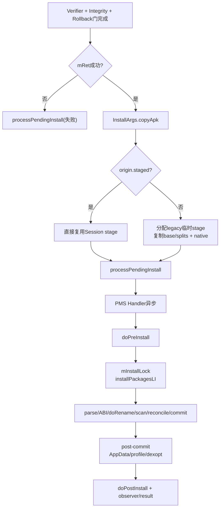
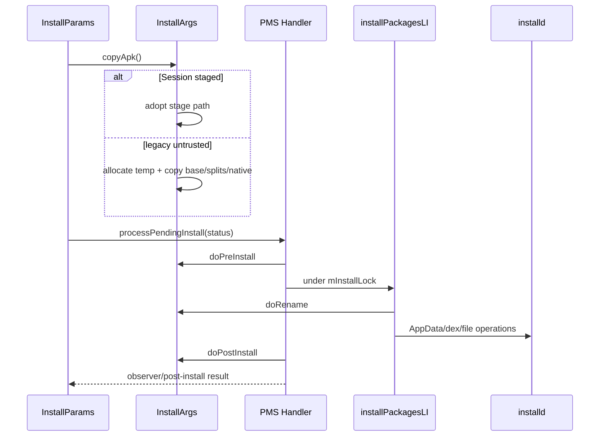
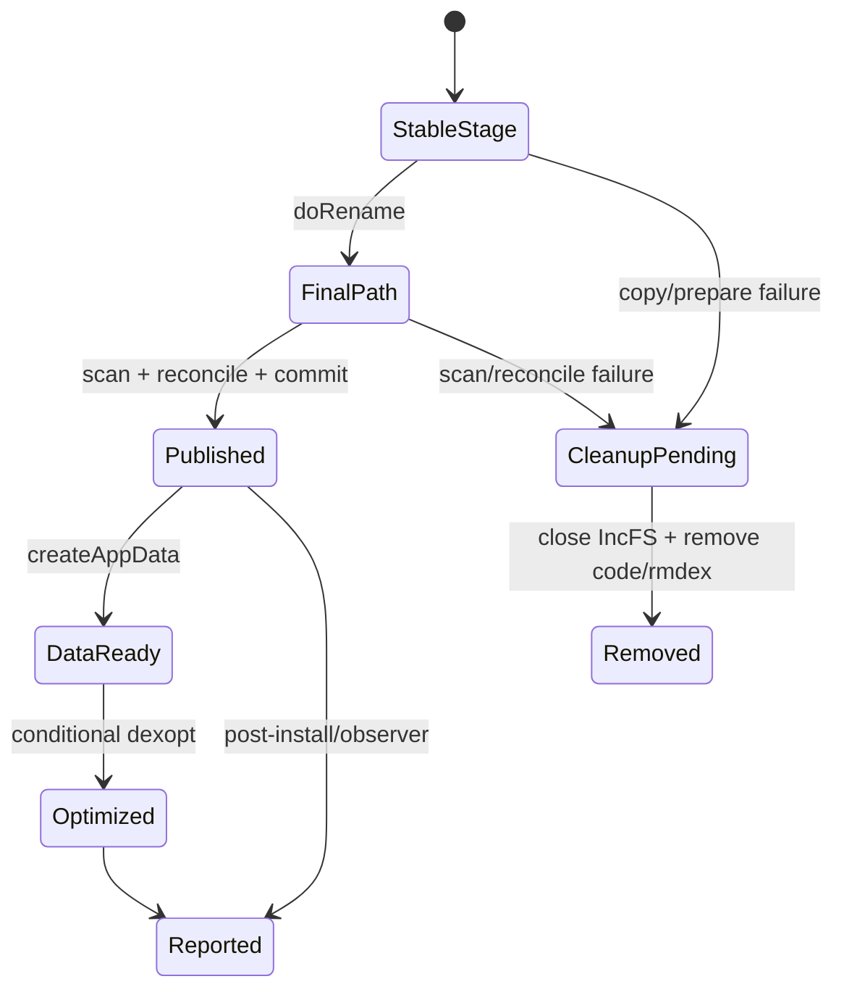

# 260 Android InstallArgs、copyApk、installd、dex/native准备与processPendingInstall提交前链

## 1. 本章目标

第259章停在Verifier、Integrity与rollback三道门都完成。本章继续回答：PMS此时为何调用`copyApk()`，Session明明已有stage为何又叫copy，临时目录怎样改名为`/data/app/~~随机/包名-随机`，AppData、native库和dexopt分别在哪个阶段准备。

## 2. 先记住四层完成点

```text
安装器写Session stage：候选字节已进入受控目录
InstallArgs.copyApk：必要时把legacy来源复制到PMS临时stage
doRename：把临时code path切换为最终随机code path
post-commit：创建AppData、准备profile并按条件dexopt
```

四层都可能被口语称为“安装文件准备”，但源码语义不同。

## 3. 本章最容易误解的结论

现代PackageInstaller Session进入PMS时`origin.staged=true`，`FileInstallArgs.copyApk()`直接复用stage并跳过字节复制。真正调用`PackageManagerServiceUtils.copyPackage()`的主要是legacy未staged来源。

## 4. 本章源码地图

```text
frameworks/base/services/core/java/com/android/server/pm/PackageManagerService.java
frameworks/base/services/core/java/com/android/server/pm/PackageManagerServiceUtils.java
frameworks/base/services/core/java/com/android/server/pm/PackageInstallerService.java
frameworks/base/services/core/java/com/android/server/pm/Installer.java
frameworks/base/core/java/com/android/internal/content/NativeLibraryHelper.java
frameworks/base/services/core/java/com/android/server/pm/PackageDexOptimizer.java
frameworks/base/services/core/java/com/android/server/pm/dex/ArtManagerService.java
system/vold/binder/android/os/IInstalld.aidl
frameworks/native/cmds/installd
```

## 5. 进程与线程地图

```text
system_server PMS Handler：InstallParams完成门、processPendingInstall排队
system_server安装线程/Handler：copy、parse、prepare、scan与结果汇总
system_server mInstallLock临界区：installPackagesLI串行修改安装世界
installd Binder线程：moveCompleteApp、createAppData、dexopt等特权文件操作
ART/dexopt子链：根据ABI、profile和compiler filter生成优化产物
```

## 6. 总体流水图



## 7. `OriginInfo`是理解copy的入口

它同时记录`file`、`staged`、`existing`和规范化路径。来源可由四个工厂方法构造：

- nothing；
- untrusted file；
- existing installed path；
- staged file。

## 8. `staged`表达什么

注释定义为“内容已经stage，下游不必防御性复制”。它不是“安装已经成功”，只是来源目录已经由PackageInstaller/PMS控制。

## 9. `existing`表达什么

它表示正在移动一个已安装应用，而非装入新APK。Verifier不再针对它创建新State，`MoveInstallArgs`也走installd整体搬迁。

## 10. untrusted file为何必须复制

外部路径可能在PMS解析、验证、扫描之间被修改。复制到PMS分配的stage后，后续读取面对稳定副本。

这与第258章content URI先复制到PackageInstaller私有临时文件目的相似，但发生层级不同。

## 11. Session怎样变成staged Origin

`InstallParams(ActiveInstallSession)`明确执行：

```java
origin = OriginInfo.fromStagedFile(activeInstallSession.getStagedDir());
```

所以Session路径到`copyApk()`时，数据并不来自未知外部路径。

## 12. copy何时才被调用

`InstallParams.handleReturnCode()`要求ordinary verification、integrity verification和rollback enable三个完成位都为true。

只有`mRet == INSTALL_SUCCEEDED`时才调用`mArgs.copyApk()`。

## 13. 前置失败不会再复制

Verifier拒绝、位置检查失败或Integrity失败已经把`mRet`改成错误码时，直接进入`processPendingInstall()`。

这避免为注定失败的候选创建额外目录和文件。

## 14. `InstallArgs`是一份安装执行快照

它把Origin、MoveInfo、flags、InstallSource、volume、user、ABI override、预授予权限、restricted权限白名单、签名、installReason、DataLoader type和observer集中起来。

后续阶段不必反复访问PackageInstallerSession可变对象。

## 15. 两个主要子类

`FileInstallArgs`处理新装/更新的代码目录；`MoveInstallArgs`处理已安装应用跨volume移动。

两者都实现copy、pre-install、rename、post-install和cleanup，但实际语义差异很大。

## 16. codeFile与resourceFile

r48的FileInstallArgs通常让两者都指向同一个目录。历史上代码与资源可能分开，抽象仍保留两个getter和独立清理判断。

不要假设字段同名就一定是单个APK文件。

## 17. staged路径的`doCopyApk()`

```java
if (origin.staged) {
    codeFile = origin.file;
    resourceFile = origin.file;
    return INSTALL_SUCCEEDED;
}
```

这是指针/路径接管，不是文件内容copy。

## 18. 为什么Session stage已经足够

Session seal前禁止开放写FD，验证阶段已经解析base/split并核对签名，stage目录由系统创建。

再次逐字节复制只增加空间和时间，不能提供新的信任收益。

## 19. staged路径native库何时准备

第256章的`makeSessionActiveLocked()`在进入PMS前调用`extractNativeLibraries(stageDir, ...)`，Incremental则还有异步native准备。

因此FileInstallArgs staged短路并不意味着忘记native库。

## 20. legacy路径先分配临时stage

非staged来源调用`PackageInstallerService.allocateStageDirLegacy(volumeUuid, isEphemeral)`。

它分配一个legacy sessionId，构造`vmdl*.tmp`式目录并执行`prepareStageDir()`。

## 21. 分配失败怎样映射

`allocateStageDirLegacy()`抛IOException时，`doCopyApk()`返回`INSTALL_FAILED_INSUFFICIENT_STORAGE`。

该映射比较粗：目录创建的多种IO原因都被归到空间类失败。

## 22. `copyPackage()`先重新解析PackageLite

它从source路径找baseCodePath、splitNames和splitCodePaths，再按规范目标名复制。

这不是简单递归复制整个来源目录，未知附加文件不会自动进入stage。

## 23. 目标文件名被规范化

base固定写为`base.apk`；split写为`split_<splitName>.apk`。

文件名先经过`FileUtils.isValidExtFilename()`，降低路径穿越与非法名字风险。

## 24. 实际复制使用文件描述符

目标用`Os.open(O_RDWR|O_CREAT, 0644)`创建并chmod，再由`FileUtils.copy(sourceFD, targetFD)`搬运。

权限为0644不代表任意App可穿过`/data/app`父目录读取；目录和SELinux仍控制访问。

## 25. copy不会在这里显式fsync每个文件

`copyFile()`主要打开、复制、关闭。Session客户端的`fsync`合同属于更早写stage阶段。

更精确地说，r48这个helper的finally只显式关闭source FileInputStream，没有对`Os.open()`得到的target raw FileDescriptor执行`Os.close()`；open flags也没有`O_TRUNC`。正常前提是目标位于刚创建的空stage、进程稍后回收FD，但这仍是资源管理和“目标必须全新”的实现假设，不能把它描述成严密的独立文件事务。

## 26. parse/copy异常为何也报空间不足

`copyPackage()`捕获PackageParserException、IOException与ErrnoException后统一返回`INSTALL_FAILED_INSUFFICIENT_STORAGE`。

r48因此可能把某些格式/IO问题表现成空间类legacy错误；日志中的原异常更准确。

## 27. legacy复制后才抽取native库

PMS以新codeFile创建`NativeLibraryHelper.Handle`，调用`copyNativeBinariesWithOverride()`写入`lib/<abi>`。

这一步只在非staged分支内。

## 28. ABI override在哪里使用

`abiOverride`影响选择哪套`lib/<abi>`二进制；null则由包和设备ABI规则推导。

它不会改变APK内Java/Kotlin dex的指令集。

## 29. Handle必须关闭

无论成功还是异常，`IoUtils.closeQuietly(handle)`都在finally执行。

Handle可能持有APK/zip相关FD，泄漏会阻碍目录清理和资源回收。

## 30. native复制失败的返回值

Helper可返回具体安装错误；创建Handle或IO异常被映射为`INSTALL_FAILED_INTERNAL_ERROR`。

copy APK成功不等于`copyApk()`整体成功，native阶段也属于其返回码。

## 31. `isIncremental`参数的窄边界

legacy刚分配的普通stage通常不是IncFS，`isIncrementalPath(codeFile)`多为false。

真正Incremental Session走staged短路，native异步策略主要在Session/Incremental链中完成。

## 32. copy结束后不是直接调用installPackages

`handleReturnCode()`把结果交给`processPendingInstall(args, mRet)`。

单包与multi-package从这里开始分流。

## 33. 单包怎样包装结果

单包先创建`PackageInstalledInfo`，只写当前returnCode，uid为-1、pkg和removedInfo为空。

真正包名、UID、更新信息要在prepare/scan/commit过程中填充。

## 34. 为什么要异步post

`processInstallRequestsAsync()`向PMS Handler post Runnable，避免在Verifier/回调当前栈上直接执行耗时安装。

名字“Async”指消息队列异步，不代表每个步骤都在独立线程池并行。

## 35. 成功和失败的分路

只有传入`success=true`才执行`doPreInstall -> installPackagesLI -> doPostInstall`。

前置失败跳过安装核心，直接进入统一restore/post-install结果回程。

## 36. `doPreInstall()`对File路径很简单

状态失败就`cleanUp()`；成功原样返回。

但外层`processInstallRequestsAsync()`只有在传入`success=true`时才调用这个钩子，此时初始result通常已经是成功。因此copy阶段先失败、外层success=false的普通回程会整段跳过pre/post hook；这里的failure cleanup不能被当作覆盖所有前置失败的可靠保证，遗留stage还要依赖Session/legacy stage回收等外围清理。

## 37. `mInstallLock`保护什么

`installPackagesTracedLI()`在`synchronized(mInstallLock)`中执行，串行化涉及目录、installd和包安装世界的关键操作。

它不同于`mLock`：后者主要保护PMS内存包/Settings结构。

## 38. 双锁不是整段同时持有

安装流程会在需要时进入`mLock`做Settings/包表操作，也会在锁外执行耗时IO。

源码用prepare、scan、reconcile、commit和post-commit分段，降低大锁持有时间。

## 39. `doPostInstall()`的File语义

最终status失败就cleanup，成功则保留最终code path。

因此copy成功但prepare/scan/reconcile失败，临时目录仍会在后置钩子清走。

## 40. 统一结果回程从`restoreAndPostInstall`开始

无论前面是否进入安装核心，每个InstallRequest最终都会调用它。

成功新装且允许backup时可能先走restore；否则排`POST_INSTALL`，再通知observer/Session。

## 41. copy到结果的时序图



## 42. prepare阶段为什么再次解析

`preparePackageLI()`对`args.getCodePath()`使用`PackageParser2.parsePackage()`生成完整`ParsedPackage`。

前面的PackageLite只够位置、base/split和轻量属性；组件、权限、库、ABI等需要完整模型。

## 43. 重复解析不是重复信任

Session验证得到的SigningDetails可直接注入ParsedPackage；若InstallArgs没有提供，prepare再读取签名。

每次解析服务不同阶段的数据需求，最终仍由同一安装事务裁决。

## 44. dex metadata也在此校验

parse后调用`AndroidPackageUtils.validatePackageDexMetadata(parsedPackage)`。

`.dm`等dex metadata与APK路径/结构不一致会在进入scan前失败。

## 45. 初始scan flags

默认包含`SCAN_NEW_INSTALL | SCAN_UPDATE_SIGNATURE`；move额外`SCAN_INITIAL`，DONT_KILL、instant、full、virtual preload继续转换为scan flag。

Install flag和scan flag属于不同阶段，不能按相同位值理解。

## 46. Instant App先做额外门

外部volume不允许instant；targetSdk至少O；不能声明sharedUserId；签名方案至少v2。

这些是在rename与commit前的PrepareFailure。

## 47. testOnly需要显式允许

ParsedPackage标记testOnly但install flags没有`INSTALL_ALLOW_TEST`时，返回`INSTALL_FAILED_TEST_ONLY`。

Verifier允许不会覆盖这一平台约束。

## 48. 更新身份在prepare再确认

PMS根据正式包名、renamed package和`INSTALL_REPLACE_EXISTING`判断replace。

这是从候选文件进入当前已安装世界的第一次深度对照。

## 49. targetSdk权限模型不能倒退

已有包targetSdk大于22，而更新包退回22及以下时，抛`INSTALL_FAILED_PERMISSION_MODEL_DOWNGRADE`。

避免更新借旧权限模型绕过runtime permission语义。

## 50. persistent App更新限制

非staged安装不能更新persistent应用。

staged安装保留例外，是因为关键系统更新需要更强的跨重启原子流程。

## 51. 签名在scan前快速失败

prepare用upgrade keyset或`verifySignatures()`先核对现有PackageSetting。

后续reconcile还会从全局组合世界复核；这里是尽早退出，减少破坏性准备。

## 52. 重定义权限也在prepare拦截

新包若声明了已由其他非android包拥有且签名不兼容的permission，抛`INSTALL_FAILED_DUPLICATE_PERMISSION`，并记录冲突包/权限。

这发生在最终目录与Settings提交之前。

## 53. ABI推导与native复制不是同一件事

native文件可能此前已抽出；`derivePackageAbi()`负责确定primary/secondary ABI及native library paths，并写回ParsedPackage。

一个准备物理文件，一个生成包模型中的ABI事实。

## 54. move路径沿用原ABI

MoveInstallArgs不重新抽库，而从现有PackageSetting复制primary/secondary ABI。

因为移动的是完整已安装应用，不是重新选择APK内容。

## 55. 为什么加`SCAN_NO_DEX`

prepare对move和普通安装都加`SCAN_NO_DEX`，避免旧scan阶段顺手dexopt。

r48把安装时dexopt集中到commit之后的`executePostCommitSteps()`。

## 56. `doRename()`才建立最终code path

copy/stage目录仍是`vmdl*.tmp`等临时名字。prepare在ABI推导后调用`args.doRename()`。

rename成功前，不应把临时目录写成正式PackageSetting codePath。

## 57. 最终路径为何有两层随机名

`getNextCodePath()`生成：

```text
/data/app/~~<randomA>/<packageName>-<randomB>
```

两段16字节随机值经URL-safe Base64编码，降低路径可预测性与命名冲突。

## 58. 方法本身不创建目录

`getNextCodePath()`只选择不存在的第一层并返回File对象。

`doRename()`随后用`makeDirRecursive(parent, 0775)`真正建立父目录。

## 59. 普通文件系统怎样切换

普通stage调用`Os.rename(before, after)`。同一filesystem内rename避免再次复制整包，切换成本远小于字节搬运。

失败被包装为rename失败并最终映射空间类PrepareFailure。

## 60. Incremental不能直接`Os.rename`

IncFS code path需要`IncrementalManager.renameCodePath()`，内部建立永久bind并处理storage路径。

这承接第257章temporary bind到正式code path的转换。

## 61. SELinux标签何时恢复

普通路径rename后执行`SELinux.restoreconRecursive(afterCodeFile)`；失败则prepare失败。

目录mode正确不等于SELinux label正确，两者缺一不可。

## 62. r48 Incremental的restorecon TODO

源码明确暂未对Incremental目录启用同样递归restorecon。

不能把普通路径标签步骤无条件套到IncFS。

## 63. ParsedPackage路径也要重写

rename后不仅更新`codeFile/resourceFile`，还重写ParsedPackage的codePath、baseCodePath和splitCodePaths。

否则后续scan/dexopt会继续指向已不存在的临时路径。

## 64. canonical path失败也会终止

设置ParsedPackage codePath前调用`getCanonicalPath()`。IOException使`doRename()`返回false。

rename可能已发生但模型更新失败，后续cleanup必须面对这种部分推进状态。

## 65. fs-verity在rename之后设置

`setUpFsVerityIfPossible(parsedPackage)`使用最终路径准备verity。

失败返回`INSTALL_FAILED_INTERNAL_ERROR`，说明最终路径出现还不等于已对查询世界可见。

## 66. App Links验证只是异步启动

非instant包在此调用`startIntentFilterVerifications()`，但域名验证不会阻塞APK安装commit。

它与第259章阻塞式Package verifier完全不同。

## 67. PackageFreezer保护更新窗口

prepare在进一步替换操作前`freezePackageForInstall()`，防止旧进程/包状态在删除、scan和commit间继续变化。

freezer生命周期跨越后续安装结果，不等于仅持一把Java锁。

## 68. prepare、scan、reconcile、commit四段

`installPackagesLI()`先为每个请求prepare，再scan候选，统一reconcile签名/库/replace，最后在`mLock`内commit。

第252章讲的是包模型提交；本章关注进入这四段前后的文件路径与副作用。

## 69. rename发生在全局reconcile之前

r48在`preparePackageLI()`中先doRename，再进入后续scan/reconcile。

所以reconcile失败时已经存在最终随机路径，需要`doPostInstall(failure)`清理。

## 70. 为什么不能把rename叫commit

rename只改变文件位置；`mPackages`、PackageSetting、权限、组件表与packages.xml尚未全部提交。

文件路径成为“最终形状”不等于包管理世界已经承认它。

## 71. commit后才执行昂贵外部步骤

`executePostCommitSteps()`注释说明：内存/磁盘包状态commit后、释放package锁，再执行需要installd或耗时的工作。

主要包括AppData、code cache、profile、dexopt和通知。

## 72. AppData准备针对已安装用户

`prepareAppDataAfterInstallLIF()`遍历非dying用户，仅对PackageSetting标记installed的用户创建/修复目录。

不是新装一次就无条件给所有用户创建CE/DE数据。

## 73. 用户运行状态决定DE/CE

用户已unlocking/unlocked：准备DE+CE；仅running但未解锁：只准备DE；未运行：跳过。

Direct Boot状态因此直接影响安装当下可创建的目录集合。

## 74. external app data另走StorageManager

用户已解锁时，内部AppData完成后还调用`StorageManagerInternal.prepareAppDataAfterInstall()`，主要处理外部存储/OBB相关目录。

它不是installd`createAppData()`的同一个Binder接口。

## 75. `createAppData`的关键参数

PMS传volumeUuid、packageName、userId、DE/CE flags、appId、seInfo和targetSdkVersion给installd。

installd据此创建所有权与SELinux语义正确的数据目录，并返回CE inode。

## 76. seInfo来自包与用户状态

`AndroidPackageUtils.getSeInfo(pkg, ps)`再拼接`seInfoUser`。

UID相同也不代表SELinux域/类别相同，不能只用Linux owner解释AppData隔离。

## 77. system AppData失败会尝试恢复

系统包create失败时，PMS记录critical log、销毁对应AppData后再创建一次。

它以可恢复系统一致性为优先，但可能清掉损坏数据。

## 78. 第三方AppData失败不会自动wipe重试

普通第三方包失败只记录error。

源码避免为了修复ownership而擅自删除用户App数据；这与系统包恢复策略不同。

## 79. CE inode写回PackageSetting

当CE被请求且installd返回有效inode，PMS把它记到对应user的PackageSetting。

注释仍有“mark dirty/persist”TODO，说明该字段持久化时机需结合后续Settings写入理解。

## 80. profile准备必须在dexopt之前

`mArtManagerService.prepareAppProfiles(... updateReferenceProfileContent=true)`在安装时dexopt之前调用。

这样随包提供的profile/dex metadata可影响install compiler filter。

## 81. install-time dexopt有三个主要排除条件

默认仅当：

1. 非instant，或显式开启instant dexopt；
2. 包非debuggable；
3. code path不在Incremental；

三者同时满足才执行。

## 82. 为什么debuggable默认跳过

开发调试包代码变化频繁，install-time优化收益较低；后续运行/JIT或后台dexopt仍可处理。

跳过不代表dex不可执行。

## 83. 为什么Incremental跳过

代码页可能尚未全部到达，安装时完整dexopt会触发大量缺页并失去按需安装收益。

因此r48把它排除，运行与后台阶段再逐步处理。

## 84. Instant默认跳过的用户体验取舍

源码注释明确：dexopt可能长时间卡在进度中间，instant优先快速可用，首次运行承担额外成本。

`INSTANT_APP_DEXOPT_ENABLED`可覆盖默认。

## 85. layout预编译是可选步骤

系统属性`PRECOMPILE_LAYOUTS`开启时，先由ViewCompiler编译layout资源。

它不是所有Android 11设备安装必做项。

## 86. dexopt使用REASON_INSTALL

Options包含`DEXOPT_BOOT_COMPLETE | DEXOPT_INSTALL_WITH_DEX_METADATA_FILE`；设备restore/setup安装还加`DEXOPT_FOR_RESTORE`。

reason与flags影响compiler filter、调度优先级和profile使用。

## 87. 为什么不走公开`performDexOpt()`

注释指出候选pkg此时可能尚未稳定存在于`mPackages`访问路径，因此直接调用`mPackageDexOptimizer.performDexOpt()`并传真实PackageSetting。

这是commit后内部对象交接的窄窗口。

## 88. dexopt失败不使安装失败

源码明确“不因dexopt失败让App安装失败”。返回值没有改写installResult。

App仍可通过解释/JIT/后续后台优化运行；安装耗时优化不是包可用性的硬门。

## 89. BackgroundDexOptService仍会收到变化

无论本次是否install-time dexopt，成功包都会`notifyPackageChanged(packageName)`。

曾因编译失败进入黑名单的包可在更新后重新评估。

## 90. Incremental native还有一个post-commit等待

post-commit收集所有IncrementalStorage，循环末调用`NativeLibraryHelper.waitForNativeBinariesExtraction()`。

这说明Incremental的native准备可能异步延续到commit后，不可套用legacy同步抽取时序。

## 91. 等待发生在所有包post步骤之后

代码先逐包准备AppData/profile/dex条件，再统一等待Incremental native storages。

multi-package中不是每处理一个包就立刻单独阻塞等待。

## 92. MoveInstallArgs的copy其实是整体搬迁

`copyApk()`调用installd`moveCompleteApp(fromUuid,toUuid,...)`，搬的是完整应用代码与相关内部数据。

名称沿用抽象接口，不是只复制base.apk。

## 93. move目标路径保留原目录名

完成后用原`fromCodePath`最后一级名字，在目标volume的`data/app`下构造codeFile。

`doRename()`对move直接返回true，不重新生成随机路径。

## 94. move成功后清理源volume

`doPostInstall(success)`清理fromUuid；失败则清理toUuid。

这构成“成功保目标、失败保源”的补偿策略。

## 95. move cleanup同时处理AppData和code

对所有用户调用installd`destroyAppData`清DE+CE但保ART profiles，再`removeCodePathLI`。

外部storage flag被刻意排除，注释说明移动范围只针对内部数据。

## 96. 这不是数据库式原子事务

目录rename、installd调用、内存commit、Settings写入和post步骤分段发生。

Android依靠freezer、锁、状态机和失败cleanup恢复一致性，而不是单一ACID事务回滚。



## 97. multi-package怎样等齐copy结果

每个child完成`processPendingInstall`后，`MultiPackageInstallParams.tryProcessInstallRequest()`把args→status放入Map。

未收齐全部child时不进入installPackages；任一非成功使整组使用同一失败status。

## 98. `INSTALL_UNKNOWN`为何继续等待

tryProcess发现任一状态仍为`INSTALL_UNKNOWN`就return。

UNKNOWN在这里是中间/不完整结果保护，不能直接当作最终通用失败。

## 99. 整组失败不会安装成功child

收齐后若某child失败，构造每个InstallRequest时统一使用completeStatus，`success=false`跳过核心安装。

multi-package原子性由整组汇合保证，不是各child先后独立commit。

## 100. File cleanup怎样识别IncFS

`cleanUp()`若codePath属于Incremental，先`mIncrementalManager.closeStorage(codePath)`，再删除code path。

只递归删目录而不关闭storage可能遗留mount/bind资源。

## 101. resourceFile为何额外判断contains

若resourceFile不位于codeFile内部，还单独delete。

r48常见路径二者相同，这段保留对历史/特殊布局的兼容。

## 102. 清理dex文件需要instructionSets

`cleanUpResourcesLI()`先尽力parse PackageLite收集所有code path，再将ABI instruction set转换为dex code instruction set，调用installd`rmdex`。

instructionSets为null且确实有code path时会抛IllegalStateException。

## 103. parse失败时cleanup仍继续

无法枚举PackageLite时，allCodePaths保持空，但目录`cleanUp()`仍执行。

这是best-effort：包格式坏了也不应阻止删除整个临时code path。

## 104. `doPostDeleteLI(delete)`的r48疑点

FileInstallArgs注释直接问“难道不该尊重delete flag吗”，实现无论参数都`cleanUpResourcesLI()`并返回true。

这是明确的历史债务，阅读调用方不能按参数名推断行为。

## 105. copy与rename的完成语义

copy成功：有可用于prepare的稳定目录；rename成功：目录已采用最终随机路径；二者都不表示组件/权限/Settings已提交。

只有commitPackages完成才进入查询可见世界。

## 106. rename与AppData的完成语义

rename只准备code path；AppData按用户、解锁状态另行创建。

看到`/data/app`目录不能推断`/data/user/<id>/<pkg>`已准备完毕。

## 107. installd边界汇总

system_server负责策略、包模型和时序；installd负责需要高权限的文件系统动作，如create/destroy AppData、moveCompleteApp、rmdex和dexopt。

Binder返回成功只证明该文件动作完成，不自动提交PMS内存状态。

## 108. 第一次复读：staged的“copy”修订

Session路径`copyApk()`只是采用现有stage；legacy路径才分配新stage、复制base/splits并同步抽native。正文不再笼统写“Verifier后再次复制APK”。

## 109. 第二次复读：native时间线修订

Session普通stage在`makeSessionActiveLocked`前置抽库，legacy在`doCopyApk`抽库，Incremental可能到post-commit统一等待。三条路径不可共用一个时间点。

## 110. 第三次复读：dexopt完成语义修订

dexopt发生在包状态commit后的昂贵步骤，且失败不使安装失败；它不是scan的一部分，也不是“安装成功”的必要证明。

## 111. 版本边界

本章严格对应Android 11 r48。后续版本对`/data/app/~~`布局、Incremental native、ART Service、dexopt、staging和PackageManager安装架构有显著重构。真实设备必须核对tag、filesystem、installd接口与ART实现。

## 112. macOS只读练习1：比较三种Origin

```bash
cd /Users/ninebot/androidSource
sed -n '14630,14920p' +  frameworks/base/services/core/java/com/android/server/pm/PackageManagerService.java
sed -n '15705,15790p' +  frameworks/base/services/core/java/com/android/server/pm/PackageManagerService.java
```

画出untrusted、staged、existing三种Origin，标明是否verify、是否copyPackage、是否抽native、最终使用FileInstallArgs还是MoveInstallArgs。

## 113. macOS只读练习2：手算copy与rename

```bash
cd /Users/ninebot/androidSource
sed -n '916,965p' +  frameworks/base/services/core/java/com/android/server/pm/PackageManagerServiceUtils.java
sed -n '15730,15845p' +  frameworks/base/services/core/java/com/android/server/pm/PackageManagerService.java
```

以一个base+两个split为例，写出legacy临时文件名、最终随机目录形状、普通rename与Incremental rename的不同调用，并列出任一步失败的cleanup对象。

## 114. macOS只读练习3：追AppData到installd

```bash
cd /Users/ninebot/androidSource
sed -n '22900,23025p' +  frameworks/base/services/core/java/com/android/server/pm/PackageManagerService.java
sed -n '160,220p' +  frameworks/base/services/core/java/com/android/server/pm/Installer.java
```

选择“用户已解锁、仅running未解锁、未running”三种状态，手算DE/CE flags、是否调用外部storage准备，以及system/third-party create失败的恢复差异。

## 115. macOS只读练习4：核对dexopt硬门

```bash
cd /Users/ninebot/androidSource
sed -n '17015,17125p' +  frameworks/base/services/core/java/com/android/server/pm/PackageManagerService.java
```

分别判断普通release、debuggable、instant默认、instant开关开启、Incremental五种包是否install-time dexopt，并解释dexopt失败为何不改安装status。

## 116. 第四次复读：文件完成不等于包完成

stage存在、copy成功、rename成功、AppData创建、dexopt结束、Settings提交和observer成功是七个不同事实。排查时必须写出当前codePath、PMS返回码和所在阶段，不能只用“文件已经在/data/app”判断安装完成；还要确认当前失败是否真正经过doPostInstall，不能仅因InstallArgs定义了cleanup钩子就假定它已执行。

## 117. 自测题

1. Session路径为何`copyApk()`通常不复制？
2. legacy`copyPackage()`会复制目录里所有文件吗？
3. native抽取三条路径分别在何时完成？
4. copy成功与rename成功有什么区别？
5. Incremental rename为何不能用`Os.rename`？
6. AppData的DE/CE flags怎样由用户状态决定？
7. install-time dexopt的三个主要排除条件是什么？
8. dexopt失败为何不导致安装失败？
9. multi-package怎样避免部分child先安装？
10. `doPostDeleteLI(delete)`有什么r48疑点？

## 118. 自测题参考答案

1. ActiveInstallSession把受控stage标成origin.staged，下游直接采用路径。
2. 不会；重新parse PackageLite，只按base.apk和规范split名复制。
3. 普通Session在激活阶段；legacy在doCopyApk；Incremental可能到post-commit统一等待。
4. copy只得到稳定候选目录；rename才切到最终随机code path，两者都未必已commit包状态。
5. IncFS需要把临时bind转换为永久code path bind并维护storage。
6. unlocked准备DE+CE，仅running准备DE，未running跳过。
7. instant默认、debuggable、Incremental；满足任一通常跳过。
8. ART仍可解释/JIT或以后后台优化，源码明确不让优化失败否决包安装。
9. Map收齐全部child状态，任一失败就整组success=false，跳过installPackages。
10. 实现无视delete参数，总会cleanup，源码自身留有质疑注释。

## 119. 本章总结

Verifier放行后，InstallParams只有在三道完成门齐且mRet仍成功时才调用InstallArgs.copyApk。PackageInstaller Session的Origin已经staged，因此FileInstallArgs只是接管现有目录；legacy未staged来源才分配vmdl临时stage、按base/split规范名复制并同步抽取native，MoveInstallArgs则让installd整体搬迁。processPendingInstall把结果异步交给PMS Handler，成功组在mInstallLock下prepare、完整parse、签名/权限/ABI核验，并把临时目录普通rename或IncFS永久bind到随机最终code path；之后scan/reconcile/commit才发布包状态。锁外post-commit再按用户状态创建DE/CE AppData、准备profile并按非instant/非debuggable/非Incremental条件dexopt，优化失败不否决安装。进入核心安装后的失败通常由doPostInstall、IncFS close与rmdex补偿；copy本身先失败时外层会跳过pre/post hook，仍需外围stage回收。多包则先收齐全部child状态再整体进入安装。

## 120. 下一章预告

第261章进入“Android Package替换安装、PackageFreezer、旧进程终止、旧代码删除与用户数据保留链”，专门追更新安装如何在新旧PackageSetting与code path之间安全交接。
