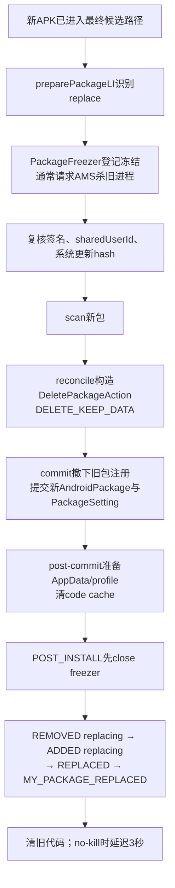
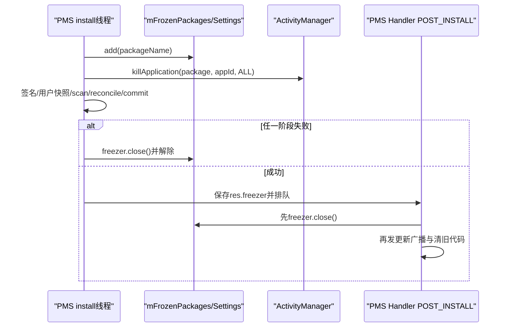
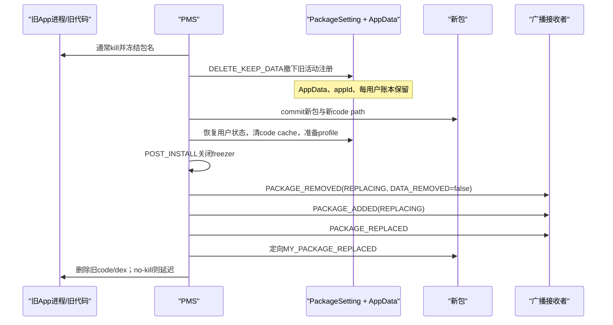

# 261 Android Package替换安装、PackageFreezer、旧进程终止、旧代码删除与用户数据保留链

## 1. 本章目标

第260章已经把候选APK送进`prepare → scan → reconcile → commit`。本章只盯住“更新已有应用”这一条分支：为什么新APK能替换旧APK，原来的账号、数据库、SharedPreferences和多数权限状态却仍然存在；旧进程、旧代码和更新广播又分别在什么时候处理。

## 2. 先记住一句话

更新不是普通意义上的“完整卸载再首次安装”，而是一次受保护的替换事务：冻结并通常杀死旧进程，用`DELETE_KEEP_DATA`撤下旧包的活动注册和旧代码，把新包提交为当前版本，最后发送带`EXTRA_REPLACING`的广播并清理旧代码。

## 3. 五类对象不要混在一起

```text
旧进程：AMS管理的运行实例
旧代码：旧base.apk、split APK、native/dex相关文件
PackageSetting：PMS持久化的包、appId和每用户状态账本
AppData：/data/user*下的数据库、SP、files、cache等
新AndroidPackage：本次解析、扫描并准备提交的新包模型
```

更新时它们的命运并不相同。

## 4. 本章源码地图

```text
frameworks/base/services/core/java/com/android/server/pm/PackageManagerService.java
frameworks/base/services/core/java/com/android/server/pm/PackageSetting.java
frameworks/base/services/core/java/com/android/server/pm/PackageSettingBase.java
frameworks/base/core/java/android/content/pm/PackageManager.java
frameworks/base/core/java/android/content/Intent.java
```

核心方法是`preparePackageLI()`、`reconcilePackagesLocked()`、`commitPackagesLocked()`、`executeDeletePackageLIF()`、`removePackageDataLIF()`和`handlePackagePostInstall()`。

## 5. 本章先回答三个问题

1. 为什么替换期间不允许旧进程继续启动或读取旧世界？
2. 为什么“删除旧包”没有删除用户数据和appId账本？
3. 为什么旧代码不一定在commit瞬间删除？

抓住这三问，后面的类名就不会散。

## 6. 替换安装总图



## 7. `replace`最早怎样确定

`preparePackageLI()`解析候选包后，会根据安装flag、现有包和重命名关系判断这是新装还是替换。只有请求允许替换且系统中存在相同包身份，才进入`replace`分支。

所以“包名相同”只是必要线索，不等于一定允许覆盖。

## 8. 为什么还要在prepare再次查旧包

从Session校验到真正安装之间，系统包世界可能变化。prepare在`mLock`下重新取得`mPackages`中的旧`AndroidPackage`和`mSettings.mPackages`中的`PackageSetting`，不能只信前一阶段的快照。

## 9. 新旧包的角色

`oldPackage`描述当前活动版本；`parsedPackage`描述候选版本；`ps`保存旧包的持久状态；`disabledPs`在更新系统应用时指向只读分区上的工厂基线。

后续代码正是靠这四者决定“普通App替换”和“系统App更新”两种路径。

## 10. 为什么先做`doRename()`再冻结

r48中候选stage先被改名或绑定到最终随机code path，随后设置fs-verity、启动App Links验证，才创建`PackageFreezer`。

这里的“最终路径”不等于“已对查询者生效”；真正替换全局包世界仍在commit。

## 11. `PackageFreezer`是什么

它是PMS内部的`AutoCloseable`保护对象。真实freezer在构造时把包名加入`mFrozenPackages`，并向AMS请求杀死对应包进程；`close()`时把自己加入的冻结标记移除。应用启动前的`checkPackageStartable()`也会拒绝仍在该集合中的包。

它不是文件锁，也不是Linux freezer cgroup。

## 12. 为什么更新需要冻结

替换会改变代码路径、组件、资源、权限声明和类加载世界。若旧进程在中途继续启动Activity或加载资源，就可能同时看见旧进程内存与新PMS元数据，形成混合版本。

冻结的目标是让这段“包手术”期间不能重新启动该包。

## 13. 创建freezer时先登记还是先杀

源码在`mLock`下先执行`mFrozenPackages.add(packageName)`，再从Settings取得appId并调用`killApplication()`。

因此其他PMS提交路径检查冻结状态时，已经能看到该包处于冻结集合。

## 14. 杀进程调用跨过哪个边界

PMS调用`ActivityManager.getService().killApplication(...)`，从system_server中的PMS逻辑进入AMS服务接口。虽然二者通常同在system_server，仍通过`IActivityManager`接口表达进程管理职责；本地Binder对象并不必然发生一次跨进程传输。

PMS不直接向Linux PID发送signal。

## 15. 为什么要清除Binder调用身份

`killApplication()`先`Binder.clearCallingIdentity()`，最终再restore。这样AMS看到的是系统服务自己的身份，不会把安装器或其他外层Binder调用者误当成执行杀进程的主体。

## 16. 不要把“请求kill”理解成事务回滚点

PMS侧`killApplication()`捕获并忽略`RemoteException`，没有把杀进程失败转换成安装失败；AMS入口也只是向自己的Handler投递`KILL_APPLICATION_MSG`。所以构造freezer返回只代表“冻结标记已建立、kill已请求”，不证明旧进程已经退出。冻结集合同时阻止新的启动，二者共同缩小混合版本窗口。

## 17. `INSTALL_DONT_KILL_APP`的freezer

如果安装flag包含`INSTALL_DONT_KILL_APP`，`freezePackageForInstall()`返回一个空壳`PackageFreezer`：不加入冻结集合，也不杀进程。

这是一条显式放宽一致性的特殊路径。

## 18. 空壳freezer为什么仍要close

空壳也打开`CloseGuard`并实现相同生命周期。调用者无需写两套释放逻辑；失败或POST_INSTALL时统一`close()`即可。

## 19. `close()`为什么可重复

`AtomicBoolean mClosed.compareAndSet(false, true)`保证真正移除动作只发生一次。失败清理、正常POST_INSTALL和finalize兜底即便碰到一起，也不会重复解除。

## 20. `CloseGuard`解决什么

它在freezer被遗忘时发出资源泄漏警告，`finalize()`还会尝试close。但finalize时机不可预测，所以它只是兜底，不是正常控制流。

## 21. 重要版本边界：它不是引用计数

r48的`mFrozenPackages`是`Set<String>`。构造器记录`mWeFroze = set.add(name)`，只有第一次加入者在close时remove。

不要把它讲成“嵌套freezer引用计数”。若多个真实freezer生命周期异常重叠且首次加入者先关闭，集合可在另一个对象仍存活时被移除。

## 22. 正常安装怎样降低上述风险

prepare把唯一的freezer存进`PackageInstalledInfo.freezer`，成功时贯穿scan、reconcile、commit和post-commit；失败时统一关闭。主安装链并不有意创建同包的多层freezer。

## 23. freeze检查发生在哪里

`commitPackageSettings()`在非boot、非`SCAN_DONT_KILL_APP`、非忽略冻结的普通提交中调用`checkPackageFrozen(pkgName)`。

它发现集合中没有包名时执行`Slog.wtf`，用于暴露破坏一致性的调用路径。

## 24. `checkPackageFrozen()`不是安全权限检查

它验证内部协议是否被遵守，不判断调用者有没有安装权限，也不阻止恶意APK。安装授权、签名和policy门在其他阶段完成。

## 25. 签名为什么在替换分支复核

保留旧AppData意味着新代码将读取旧应用私有数据并继续使用原appId。只有签名谱系或upgrade keyset允许的新版本，才应获得这种连续身份。

## 26. upgrade keyset优先路径

若旧Setting声明需要按upgrade keyset检查，PMS调用`checkUpgradeKeySetLocked()`。不满足就以`INSTALL_FAILED_UPDATE_INCOMPATIBLE`拒绝。

## 27. 默认签名能力检查

否则要求新签名对旧签名具有`INSTALLED_DATA`能力，或旧签名对新签名具有`ROLLBACK`能力。它比简单比较当前证书字节更能表达签名轮换和回滚关系。

## 28. 为什么能力名叫`INSTALLED_DATA`

这一能力直接表达“新签名能否继承旧版本已经安装的数据”。它把本章的数据保留与签名安全联系起来，而非仅仅判断两个APK是不是同作者。

## 29. 系统包`restrictUpdateHash`

若旧系统包带有更新hash限制，PMS对新base和所有split按顺序计算SHA-512，必须与旧包记录完全一致，并把限制复制到新解析对象。

签名通过并不自动绕过这一产品级限制。

## 30. sharedUserId为什么不能变

新旧包的`sharedUserId`必须相同。改变它会重写UID共享、权限和数据访问边界，因此PMS返回`INSTALL_FAILED_SHARED_USER_INCOMPATIBLE`。

## 31. Full App不能被Instant App覆盖

对目标用户，原来不是Instant的完整应用不能在替换中变成Instant App。PMS会检查所有受影响用户或指定用户，避免把既有完整安装降成另一套隔离语义。

## 32. 为什么先快照所有用户

PMS记录`allUsers`、旧包已安装用户`installedUsers`和未安装用户`uninstalledUsers`。同一APK可对用户0已安装、对用户10卸载但保留全局包代码，更新不能把所有人粗暴改成相同状态。

## 33. `origUsers`的作用

`res.removedInfo.origUsers = installedUsers`。post-install用它把新版本用户分成“第一次看到包”和“原本就有、这次是更新”两组。

## 34. 安装原因也要保留

每个旧已安装用户的`installReason`被放进`removedInfo.installReasons`，例如设备策略、用户请求或系统来源。更新不应把原始归因覆盖成本次安装器的统一原因。

## 35. 卸载原因也要保留

旧未安装用户的`uninstallReason`同样被快照。否则一次全局代码更新可能让某个用户“为什么未安装”的账本丢失。

## 36. Freezer与prepare生命周期图



## 37. 为什么freezer从prepare返回

prepare的`finally`总把对象写入`res.freezer`。只有prepare失败才立即关闭；成功则把`shouldCloseFreezerBeforeReturn`设为false，让保护跨越后续阶段。

## 38. 扫描成功不释放freezer

scan只产生新包、组件、Setting候选和派生信息；它还没把完整世界提交。此时释放会留下“候选已扫描但旧包仍活动”的窗口。

## 39. reconcile失败怎样处理

`installPackagesLI()`的finally在整组未成功时遍历请求，关闭存在的freezer，并把仍标成成功的结果改为`INSTALL_UNKNOWN`。

多包事务失败也不会把某个子包永久冻住。

## 40. 什么是`DeletePackageAction`

它是reconcile预先生成的删除计划，保存旧PackageSetting、disabled系统Setting、`PackageRemovedInfo`、删除flags和用户范围。

commit只执行已裁决的动作，尽量不在修改世界时才发现可预见错误。

## 41. 为什么只为非系统替换构造它

普通App旧版本可以走通用删除机制；系统App还涉及只读系统分区的工厂版和`disabled-system-packages`账本，commit里有独立分支。

## 42. 替换的关键删除flags

源码核心是：

```java
final int deleteFlags = PackageManager.DELETE_KEEP_DATA
        | (killApp ? 0 : PackageManager.DELETE_DONT_KILL_APP);
```

`DELETE_KEEP_DATA`不是附属优化，而是更新区别于完整卸载的核心开关。

## 43. `killApp`怎样推导

若scan flags没有`SCAN_DONT_KILL_APP`，`killApp=true`；而prepare会把`INSTALL_DONT_KILL_APP`转换成`SCAN_DONT_KILL_APP`。

因此安装flag、冻结策略、删除flag和广播extra使用的是同一条“是否杀进程”意图链。

## 44. `mayDeletePackageLocked()`做什么

它先要求旧Setting存在；若是系统App，还检查`DELETE_SYSTEM_APP`、用户范围和disabled工厂基线等约束。不能合法撤下旧包时返回null。

## 45. 删除计划失败怎样映射

reconcile得到null会抛`INSTALL_FAILED_REPLACE_COULDNT_DELETE`。这发生在commit之前，避免新包已经发布后才发现旧包不能删。

## 46. commit为何要先保存时间

替换时新Setting继承旧`firstInstallTime`，`lastUpdateTime`设为当前时间。用户看到的是“最初安装时间不变，最近更新时间刷新”，而不是一次全新首装。

## 47. 广播白名单为何在删除前计算

`mAppsFilter.getVisibilityWhitelist()`依赖旧/新包世界。commit在撤下旧包前计算`removedInfo.broadcastWhitelist`，供稍后的REMOVED和REPLACED通知按包可见性过滤。

## 48. 普通App commit先做什么

它调用：

```java
executeDeletePackageLIF(deletePackageAction, packageName,
        true, allUsers, false, parsedPackage);
```

这里的delete是替换过程内部撤下旧版本，不是用户在设置页点击完整卸载。

## 49. `removePackageLI()`撤掉什么

`removePackageDataLIF()`先调用`removePackageLI()`，把旧包从活动`mPackages`及组件/共享库等运行期结构中移除。

这一步让旧版本不再作为当前可解析包存在。

## 50. `DELETE_KEEP_DATA`让什么代码不执行

在`removePackageDataLIF()`中，只有未设置KEEP_DATA才调用`destroyAppDataLIF()`、`destroyAppProfilesLIF()`，并把`dataRemoved`设为true。

替换路径因此保留DE/CE/external AppData和现有profile。

## 51. KEEP_DATA也保留PackageSetting身份账

只有非KEEP_DATA分支才从Settings删除package、释放appId、移除keyset数据并以null包更新权限。替换不会走这些完整卸载动作。

所以新版本能继续使用原appId和每用户状态。

## 52. 保留Setting不等于所有状态永远不变

commit新包时仍会根据新Manifest重新协调组件、权限、共享库和包信息。KEEP_DATA保住连续身份与数据，不保证已删除的权限声明或组件还继续存在。

## 53. 用户数据库为什么还在

数据库、SharedPreferences和files通常位于包的CE/DE数据目录。替换没有调用destroyAppData，随后`prepareAppDataAfterInstallLIF()`只是确保目录和标签适配新版本，因此原内容继续存在。

## 54. 更新为什么仍可能丢业务数据

Framework只保证不主动完整删除目录。新版本自己的数据库迁移、首次启动逻辑、签名相关加密设计或应用Bug仍可能修改、清空或无法读取数据。

## 55. cache是否完全保留

普通数据目录保留，但`PrepareResult`在replace时把`clearCodeCache=true`。post-commit调用`clearAppDataLIF(... FLAG_CLEAR_CODE_CACHE_ONLY)`清理代码缓存。

所以“KEEP_DATA等于每个字节都不动”是错误结论。

## 56. 为什么更新要清code cache

旧版本生成的代码缓存可能依赖旧APK、类结构或优化结果。清除可重建缓存，比让新代码误用旧产物更安全。

## 57. ART profile怎样处理

替换删除阶段因KEEP_DATA不销毁profile；post-commit又为新code path准备应用profile，并通知DexManager包已更新。

profile会参与新版本优化，但具体内容是否可复用由ART链继续判断。

## 58. 旧代码目录何时登记为待删

`deleteInstalledPackageLIF()`在要求删除code/resource时，用旧code path、resource path和instruction sets构造`InstallArgs`，保存到`removedInfo.args`。

它没有在持有PMS核心锁的commit中立刻递归删除目录。

## 59. 为什么删除动作被包装成InstallArgs

`FileInstallArgs.cleanUpResourcesLI()`会先尽力解析旧PackageLite收集所有code paths，再删code目录并调用installd移除对应dex文件。

复用InstallArgs让普通目录、容器或历史安装形态走各自清理实现。

## 60. commit之后怎样发布新包

旧包撤下后，`commitReconciledScanResultLocked()`把新包及Setting提交到全局结构，`updateSettingsLI()`恢复和更新每用户状态，随后写Settings。

这才是“当前包版本”从旧切换为新的中心点。

## 61. 用户安装状态怎样恢复

`updateSettingsLI()`把prepare保存的旧已安装用户集合投影回新Setting。`USER_ALL`安装不会顺手把原来对某用户卸载的包重新启用。

## 62. 安装原因怎样恢复

它逐项把`removedInfo.installReasons`写回旧已安装用户；仅对本次真正新增的用户使用新的installReason。

## 63. 卸载原因怎样恢复

旧未安装用户的uninstall reason也写回；对当前已经安装的用户，uninstall reason统一变为UNKNOWN，因为这些用户现在并未处于卸载状态。

## 64. 首次时间与每用户状态是两层账

`firstInstallTime/lastUpdateTime`是包级时间；installed、enabled、instant、installReason等是每用户状态。更新逻辑必须同时维护，不能只看一个packages.xml字段。

## 65. 系统App更新为何不同

系统App原始APK位于只读system/product/vendor等分区，OTA外的普通安装不能真正删掉它。数据分区上的更新版只是覆盖活动版本，工厂版仍作为disabled system package基线。

## 66. 首次覆盖工厂版

commit先`removePackageLI(oldPackage)`，再`disableSystemPackageLPw(oldPackage)`。若成功，说明这是第一次把活动工厂版压到disabled账本，`removedInfo.args=null`。

工厂APK在只读分区，本来就不能由普通FileInstallArgs删除。

## 67. 再次更新系统App

若`disableSystemPackageLPw()`返回false，说明活动旧版本本身已是数据分区更新版，工厂基线早已被禁用保存。此时PMS为旧更新版code path创建清理args，稍后删除它。

## 68. 系统属性flags怎样继承

新系统更新版继承旧包的system、privileged、oem、vendor、product、odm和systemExt扫描属性。数据分区路径不会让它失去系统身份来源。

## 69. 卸载系统更新与本章的边界

“安装一个更新版”会让新APK覆盖工厂版；“卸载更新”则删除数据分区更新并重新扫描/恢复工厂版。两条链都使用disabled system Setting，但方向相反。

## 70. 外置/ASEC旧包的特殊通知

普通替换若旧包位于external storage，commit会先发送资源不可用通知，让使用者释放资源，然后继续切换。更新结束后新外置包还会发送资源可用通知。

## 71. `mOldCodePaths`是什么

r48 commit把旧base/split路径写入新`PackageSetting.mOldCodePaths`，注释称为内存中的previous code paths副本。

但在本版本源码树中，它几乎没有后续消费点，也没有常规持久化语义，不能把它当成可靠的旧代码删除队列。

## 72. r48的可疑flag比较

这段代码检查的是`installFlags & PackageManager.DONT_KILL_APP`，而正式安装flag是`INSTALL_DONT_KILL_APP`；两者值和语义不同。

真实旧代码延迟删除判断在post-install使用正确的`INSTALL_DONT_KILL_APP`推导出的`killApp`，不要让这处可疑账本代码改变主链结论。

## 73. `removedForAllUsers`为何更新中也存在

`PackageRemovedInfo`会记录旧包是否已从活动包表对所有用户消失。更新的REMOVED广播仍需要描述中间撤下事件，但`EXTRA_REPLACING=true`告诉接收者后面会回来。

## 74. 为什么更新也发PACKAGE_REMOVED

系统先表达旧版本被撤下，再表达新版本加入。接收者可用`EXTRA_REPLACING`区分更新和真正卸载，不能看到REMOVED就立刻永久清理业务状态。

## 75. `EXTRA_DATA_REMOVED`在更新中是什么

KEEP_DATA路径没有设置`dataRemoved=true`，因此REMOVED广播的`EXTRA_DATA_REMOVED=false`。

这是公开信号：代码版本被撤下，但应用数据没有作为完整卸载被删除。

## 76. `EXTRA_DONT_KILL_APP`怎样产生

post-install从`INSTALL_DONT_KILL_APP`得到`killApp`，`PackageRemovedInfo`放入`EXTRA_DONT_KILL_APP = !killApp`。

它告诉广播接收者是否应避免默认重启/杀进程处理。

## 77. `EXTRA_REPLACING`怎样产生

`removedInfo.isUpdate=true`，REMOVED广播因此带REPLACING；随后ADDED广播在update分支也带REPLACING。

两个广播共同构成“先撤旧、再加新”的成对语义。

## 78. 为什么不发FULLY_REMOVED

只有`dataRemoved`为true且不是系统更新撤回时才发`ACTION_PACKAGE_FULLY_REMOVED`。替换保留数据，因此不会把它公告成完整卸载。

## 79. UID是否被移除

KEEP_DATA不从Settings释放appId，普通替换不应被理解为获得了一个新UID。新版本继续使用相同appId，并按userId组合出各用户UID。

## 80. 广播对哪些用户发送

post-install比较`res.origUsers`与`res.newUsers`：原来已有且现在仍有的是update users；新出现的是first users；Instant App用户另分数组。

同一次全局包更新，对不同用户可能产生“更新”或“首次加入”的不同通知。

## 81. 数据、代码、进程和广播时序



## 82. POST_INSTALL第一件与本章相关的事

Handler取出`PostInstallData`后，先关闭`res.freezer`，再执行`handlePackagePostInstall()`。

因此广播发生时包已经不在PMS冻结集合，但新包已经commit，旧进程通常也早已被杀。

## 83. 为什么不是发完广播才解冻

广播接收者可能需要启动新版本组件。若仍保持冻结，接收者和新应用自身可能无法正常被拉起。

## 84. 更新为何通常不走Backup restore

`restoreAndPostInstall()`仅在成功、非更新且应用允许备份时尝试普通Backup Manager restore。更新已有数据，不把它当成一次空目录首装恢复。

## 85. Rollback restore是另一条可能等待

成功更新且可能降级时，PMS会询问Rollback Manager是否需要恢复/快照相关用户数据。若异步工作接管，POST_INSTALL会等待回调后再执行。

这不改变普通KEEP_DATA主线，但会延长freezer生命周期。

## 86. REMOVED广播何时发送

`handlePackagePostInstall()`在成功分支开头调用`res.removedInfo.sendPackageRemovedBroadcasts(killApp)`，之后才处理新包权限授予和ADDED/REPLACED广播。这里描述的是PMS的发送/入队顺序，不表示前一个广播的所有接收者已经执行完毕才发送下一个。

## 87. 权限授予为何在ADDED之前

如果安装器请求并获准预授运行时权限，PMS先完成restricted白名单和grant，再广播新包加入。接收者观察到的是更接近最终状态的新版本。

## 88. ADDED在更新中也会发

对update users，PMS发送`ACTION_PACKAGE_ADDED`并设置`EXTRA_REPLACING=true`。它不是只用于第一次安装。

## 89. REPLACED广播面向谁

`ACTION_PACKAGE_REPLACED`发送给可见范围内的其他接收者，也定向通知installer和required verifier等特定包。

包可见性白名单会影响普通广播接收范围。

## 90. `MY_PACKAGE_REPLACED`的不同

它以新包自身为`targetPackage`，没有package data URI和额外extras。新版本可注册它，在自己被覆盖更新后执行迁移或重新调度。

## 91. 不要在旧进程等待MY_PACKAGE_REPLACED

正常更新已请求杀死旧进程。该广播的意义是让系统按新版本组件定义启动接收器，而不是在旧进程内热切换ClassLoader。

## 92. 旧代码为什么放到广播后清理

到post-install时新包已稳定发布，系统也完成了主要通知。旧资源不再需要作为当前包，但延后到核心锁外清理能缩短锁区并避免复杂I/O阻塞包查询。

## 93. kill路径怎样清旧代码

若`killApp=true`且`removedInfo.args`存在，PMS在`mInstallLock`下同步调用`args.doPostDeleteLI(true)`，普通File路径最终删除旧目录并清dex。

## 94. no-kill为何不能立即删

旧进程可能仍把旧APK映射为代码或资源，甚至在ApplicationInfo传播完成前启动新Activity。立刻删路径会制造资源/类加载故障。

## 95. no-kill延迟多久

r48的`DEFERRED_NO_KILL_POST_DELETE_DELAY_MS = 3 * 1000`。PMS Handler延迟3秒处理`DEFERRED_NO_KILL_POST_DELETE`，再在`mInstallLock`下删除。

这是经验性缓冲，不是进程已确认停止的协议。

## 96. no-kill observer也会延迟

成功更新且no-kill时，安装observer回调延迟500ms；旧代码清理延迟3秒。observer收到成功时，旧目录可能仍为兼容而暂存。

## 97. 安装成功不等于旧文件已经消失

成功语义的中心是新包已提交并完成post-install通知。尤其no-kill路径，物理旧目录清理可以稍后发生。

## 98. 3秒后一定安全吗

源码只是定时消息，没有逐进程mmap、Resources或ClassLoader引用确认。它“缓解问题”，并不证明所有旧引用都已消失。

## 99. `doPostDeleteLI(true)`实际做什么

普通`FileInstallArgs`调用`cleanUpResourcesLI()`：尝试解析旧PackageLite收集code paths，移除code目录，再按instruction set调用installd `rmdex`清理优化文件。

## 100. 解析旧包失败会怎样

解析只是为了更完整收集dex路径；失败被忽略，仍继续删主code目录。源码注释表达的是“尽力枚举”。

## 101. `delete`参数的r48疑点

`FileInstallArgs.doPostDeleteLI(boolean delete)`无论参数是什么都执行清理，并留有“是否应该尊重delete flag”的TODO式注释。

本章路径传true，所以不影响正常替换结论，但阅读通用接口时要看到实现边界。

## 102. 没有旧清理args时为什么请求GC

系统工厂APK不可删等情况下`removedInfo.args=null`。PMS请求一次并发GC，希望释放旧资源对象；这不是同步保证，也不删除只读分区文件。

## 103. 失败发生在commit前

prepare/scan/reconcile失败时，新包没有成为活动版本，freezer会关闭，临时安装路径走失败清理。旧包与旧数据仍应作为当前世界保留。

## 104. commit为何声称只剩不可避免错误

源码注释要求可预见失败尽量在prepare/reconcile解决。commit要修改全局状态，若此处才频繁失败，很难提供真正数据库式回滚。

## 105. 这是不是ACID事务

不是。它借助锁、预裁决、freezer、原子Settings写和阶段化清理提高一致性，但没有通用undo log把所有文件、进程、Binder通知和外部服务恢复到某个快照。

## 106. 更新期间查询的关键切换点

在commit撤旧并提交新包的锁区内，外部查询不能穿过`mLock`看到任意中间组合。锁释放后，查询应看到新包；广播和旧文件物理删除仍可稍后完成。

## 107. 应用开发者最该理解什么

系统保留数据目录，却不会替应用完成schema迁移。新版本第一次启动和`MY_PACKAGE_REPLACED`处理必须能面对旧版本数据、跨版本任务和可能被系统重启的执行环境。

## 108. 第一次复读：修正“freezer等于kill”

真实freezer同时登记冻结和请求kill；`INSTALL_DONT_KILL_APP`却返回完全空壳，既不kill也不冻结。因此两者相关但不是同义词。

## 109. 第二次复读：修正“KEEP_DATA只保目录”

它还阻止Settings package/appId/keyset/权限账的完整卸载分支。更新连续身份来自“目录 + PackageSetting + appId”共同保留，而非只剩几个文件。

## 110. 第三次复读：修正“commit立即删旧APK”

commit只产生并保存旧资源清理args；真正`doPostDeleteLI()`在post-install广播之后执行，no-kill还会再延迟3秒。

## 111. 版本边界与可疑点汇总

- 本章严格基于Android 11 `android-11.0.0_r48`的单体PMS实现；新版本已拆分多个helper/service。
- freezer集合不是引用计数。
- `mOldCodePaths`在r48缺少清晰消费链，且附近比较了可疑的`PackageManager.DONT_KILL_APP`常量。
- no-kill的500ms observer和3秒旧代码清理是固定延迟，不是资源引用ACK。
- 安装事务不是通用ACID回滚。

## 112. macOS只读练习1：核对freezer

```bash
cd /Users/ninebot/androidSource
sed -n '23090,23190p' frameworks/base/services/core/java/com/android/server/pm/PackageManagerService.java
rg -n "checkPackageFrozen|mFrozenPackages" frameworks/base/services/core/java/com/android/server/pm
```

回答：DONT_KILL空壳做了哪两件“没有做”的事？为什么`mWeFroze`不能解释成引用计数？

## 113. macOS只读练习2：追KEEP_DATA

```bash
cd /Users/ninebot/androidSource
sed -n '16435,16470p' frameworks/base/services/core/java/com/android/server/pm/PackageManagerService.java
sed -n '18790,18910p' frameworks/base/services/core/java/com/android/server/pm/PackageManagerService.java
```

列出KEEP_DATA跳过的AppData、profile、Settings、appId和权限清理动作。

## 114. macOS只读练习3：比较系统与普通App

```bash
cd /Users/ninebot/androidSource
sed -n '16735,16820p' frameworks/base/services/core/java/com/android/server/pm/PackageManagerService.java
rg -n "disableSystemPackageLPw|disabled-system" frameworks/base/services/core/java/com/android/server/pm
```

画出“首次覆盖工厂版”和“再次覆盖数据分区更新版”的旧代码去向。

## 115. macOS只读练习4：核对广播与延迟删除

```bash
cd /Users/ninebot/androidSource
sed -n '2085,2280p' frameworks/base/services/core/java/com/android/server/pm/PackageManagerService.java
sed -n '2325,2430p' frameworks/base/services/core/java/com/android/server/pm/PackageManagerService.java
rg -n "DEFERRED_NO_KILL.*DELAY" frameworks/base/services/core/java/com/android/server/pm/PackageManagerService.java
```

写下REMOVED、ADDED、REPLACED、MY_PACKAGE_REPLACED顺序，以及observer与旧代码清理的延迟值。

## 116. 第四次复读：最容易混淆的四个“保留”

更新通常保留appId、AppData、每用户安装账和firstInstallTime；它不会保留旧活动包模型、旧组件解析结果、旧code cache，也最终不会保留可删除的旧APK目录。

## 117. 自测题

1. PackageFreezer怎样同时解决旧进程和重新启动问题？
2. 为什么更新能读取旧私有数据？
3. `DELETE_KEEP_DATA`还保留哪些身份账？
4. 系统工厂APK为什么没有旧代码清理args？
5. no-kill路径为何延迟删旧代码？
6. 更新广播如何区别于完整卸载？
7. freezer在广播之前还是之后close？
8. 更新是否等价于ACID事务？

## 118. 自测题参考答案

1. 真实freezer先把包名加入PMS冻结集合，再请求AMS杀旧进程；提交时还检查包处于冻结状态。
2. 新旧签名身份通过后，替换使用KEEP_DATA，不销毁CE/DE目录，并保留appId/Setting连续身份。
3. PackageSetting、appId、每用户installed/reason等状态以及相关权限连续账；新Manifest仍会重新协调它们。
4. 工厂APK在只读系统分区，只需把基线放入disabled system账本，不能按普通数据目录删除。
5. 旧进程可能仍映射或加载旧代码/资源；r48用3秒经验性缓冲降低混合版本故障。
6. REMOVED的DATA_REMOVED=false、REPLACING=true，随后还有带REPLACING的ADDED、REPLACED和定向MY_PACKAGE_REPLACED。
7. POST_INSTALL先close freezer，再进入广播处理。
8. 不等价；它是锁、预裁决、冻结、持久化和补偿清理组成的阶段化协议。

## 119. 本章总结

替换安装的真正核心不是“把新APK覆盖到同名文件”，而是保住可信身份和用户数据，同时切换活动包世界：签名能力允许新代码继承旧数据；PackageFreezer保护手术窗口；`DELETE_KEEP_DATA`撤旧而不完整卸载；commit恢复appId、用户状态和首次安装时间；post-install用成对广播公布更新，再按kill/no-kill策略清理旧代码。

## 120. 下一章预告

第262章继续读安装后的权限处理：`PermissionManagerService.updatePermissions()`怎样对比新旧Manifest，保留或撤销install/runtime权限，shared UID、restricted permission、permission tree和GID变化又怎样影响进程与用户状态。
