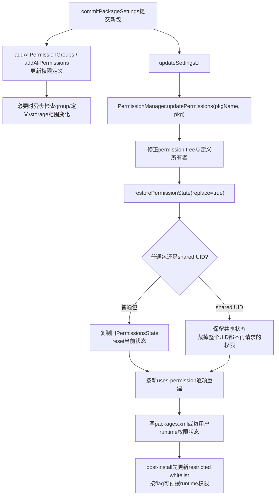
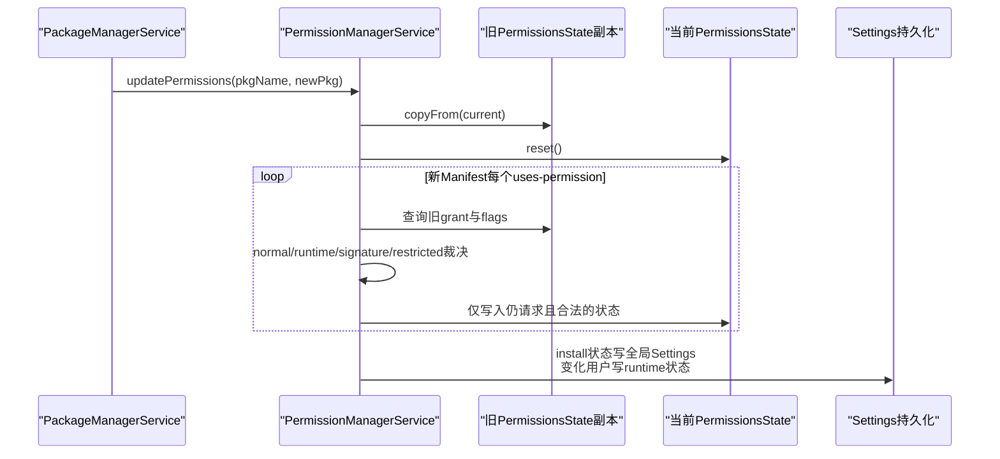
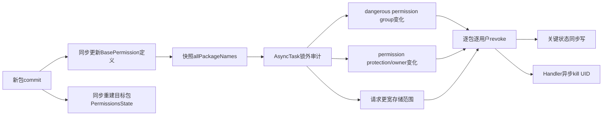

# 262 Android PermissionManager安装后权限更新、运行时权限继承、撤销、shared UID与GID变化链

## 1. 本章目标

第261章解释了更新如何保留`PackageSetting`和AppData。本章继续追其中最敏感的一部分：旧版本已获得的权限如何进入新版本；新Manifest删除、增加或改变权限后，PMS怎样重建状态；shared UID为什么不能按单包清空；权限带来的Linux GID变化又怎样影响运行进程。

## 2. 先记住核心结论

普通包替换时，PermissionManager不是把旧权限对象原样留着，而是“复制旧状态 → 清空当前状态 → 只按新Manifest请求列表重建”。仍请求的运行时权限按用户恢复原grant与flags，不再请求的权限不会进入新状态；新危险权限不会仅因更新自动授予现代App。

## 3. 三层权限不要混用

```text
权限定义：<permission>，谁拥有、protectionLevel/group/gids是什么
权限请求：<uses-permission>，某包声明自己想使用什么
权限状态：某包或shared UID当前是否grant、每用户flags是什么
```

更新定义者和更新使用者会触发不同的安全动作。

## 4. 本章源码地图

```text
frameworks/base/services/core/java/com/android/server/pm/PackageManagerService.java
frameworks/base/services/core/java/com/android/server/pm/permission/PermissionManagerService.java
frameworks/base/services/core/java/com/android/server/pm/permission/PermissionsState.java
frameworks/base/services/core/java/com/android/server/pm/permission/BasePermission.java
frameworks/base/services/core/java/com/android/server/pm/permission/PermissionSettings.java
frameworks/base/services/core/java/com/android/server/pm/Settings.java
frameworks/base/data/etc/platform.xml
```

## 5. 先建立对象模型

`BasePermission`表示系统已知的一项权限定义；`PermissionSettings`维护权限、permission tree、group和AppOp权限包集合；`PermissionsState`属于`PackageSetting`或`SharedUserSetting`，记录install permission、每用户runtime permission、flags和全局GID。

## 6. 更新后的权限总流程



## 7. PMS从哪里调用权限更新

`commitPackagesLocked()`先提交新包，再调用`updateSettingsLI()`；其内部在`mLock`下执行：

```java
mPermissionManager.updatePermissions(pkgName, pkg);
```

随后才写包Settings并完成安装结果。

## 8. 为什么不是安装结束后再算

包查询一旦看见新Manifest，就必须同时看见与它相容的权限状态。若先公布新包、很久以后才裁掉已删除权限，调用者会短暂获得Manifest已经不再请求的能力。

## 9. 权限定义在更早一步进入系统

`commitPackageSettings()`把新包放入`mPackages`并注册组件时，还调用`addAllPermissionGroups()`和`addAllPermissions()`，让本包声明的`<permission-group>`与`<permission>`先进入权限定义表。

## 10. 为什么定义要先于请求恢复

恢复`<uses-permission>`时必须找到对应`BasePermission`，才能知道它是normal、dangerous、signature、restricted还是携带GID。若定义尚未更新，请求就无法正确裁决。

## 11. `updatePermissions()`的两个任务

源码Javadoc明确列出：先重新考虑permission ownership，再更新权限的grant和flags。它不只是遍历本包`uses-permission`。

## 12. 更新与删除传参不同

包更新传`packageName + 非null pkg`，flags为`UPDATE_PERMISSIONS_REPLACE_PKG`；删除传`packageName + null`，还增加`UPDATE_PERMISSIONS_ALL`，因为被删除包可能曾定义其他应用正在使用的权限。

## 13. `REPLACE_PKG`不是APK replace flag

这里是PermissionManager内部的更新范围位，告诉`restorePermissionState()`按“旧状态可能与新Manifest不同”重建目标包。不要与PackageInstaller的`INSTALL_REPLACE_EXISTING`混为一谈。

## 14. volume为什么参与replace判断

代码只在目标包volume UUID与`replaceVolumeUuid`相等时把`replace=true`传下去。全量权限恢复可按某个volume处理挂载或升级场景，避免把不相关volume都当成刚被替换。

## 15. 什么时候会升级成全量重算

若permission tree或普通权限定义的source package发生变化，PermissionManager把`UPDATE_PERMISSIONS_ALL`加上。权限所有者变化会影响哪些包有资格获得signature权限，不能只重算当前包。

## 16. 全量重算怎样避免重复目标包

遍历所有包时先跳过`pkg == changingPkg`，最后单独处理changing package。这样既能给其他包传不同的replace语义，也不重复恢复目标。

## 17. background permission映射

首次更新时会缓存background→foreground权限映射。源码假设background permission只由系统定义，因此该映射只构建一次。

这是Android 11权限模型的版本假设，不是任意第三方动态可改的表。

## 18. `restorePermissionState()`的真实含义

名字叫restore，因为它同时服务两种场景：开机从磁盘状态恢复，以及应用更新时从旧版本状态恢复。它不是“全部恢复成grant”，而是根据新包重新投影旧状态。

## 19. install permission是什么

normal和通过策略允许的signature权限属于install permission，对所有设备用户共享；状态使用`UserHandle.USER_ALL`记录。

这里的“install”描述授予时机，不代表它只存在安装器Session里。

## 20. runtime permission是什么

现代App请求dangerous权限时，grant与flags按Android用户分别记录。用户0允许相机，不代表用户10也允许。

## 21. legacy App的危险权限为什么特殊

targetSdk低于M的App不支持现代请求UI。Android 11在内部把危险权限表示为每用户runtime grant，并用`REVIEW_REQUIRED`、`REVOKED_COMPAT`等flags维持旧兼容与首次使用审查语义。

## 22. `PermissionsState`保存哪些内容

它用permission name映射到`PermissionData`，其中可同时表示grant与flags；还保存global GIDs、缺失状态标记和是否需要permission review的用户集合。

## 23. grant与flags为什么必须分开

一个runtime permission可以处于“未授予但USER_FIXED”“已授予且POLICY_FIXED”“已授予但APPLY_RESTRICTION”等状态。只存boolean无法表达用户选择和策略来源。

## 24. 更新先处理missing状态

若某用户运行时权限状态因回滚等原因缺失，PermissionManager为该用户生成合理默认：对平台runtime权限处理restricted upgrade豁免；legacy App还会grant并标记review/revoked compat。

## 25. shared UID的missing输入

shared UID会汇总该UID下所有包的requested permissions，并取这些包最小targetSdk。共享权限世界不能只看当前更新包。

## 26. 普通包replace的关键四行

```java
origPermissions = new PermissionsState(permissionsState);
permissionsState.reset();
```

前者深复制旧grant与flags作为参考，后者清空当前对象，后续只把新Manifest仍有资格的项目放回来。

## 27. 为什么要“清空再重建”

若在旧Map上只添加新权限，很容易遗漏新Manifest已经删除的请求、权限类型转换和旧flags清理。以新请求列表为白名单重建更容易保证最小权限。

## 28. 删除一个uses-permission会发生什么

该名字不会进入新包遍历，因此不会被写回已reset的`permissionsState`。无论旧状态是granted还是denied，它都不再属于新包权限状态。

## 29. 仍请求的runtime grant怎样继承

代码从`origPermissions.getRuntimePermissionState(perm, userId)`读取旧状态。对现代App，只有旧state存在且`isGranted()`时，才向新`permissionsState`重新grant；旧拒绝不会变成允许。

## 30. flags怎样继承

每个用户先从旧`permState`读取flags，处理review、compat和restriction变化后，用`updatePermissionFlags(... MASK_ALL, flags)`写入新状态。

所以“更新后权限还在”同时包含grant和用户/策略flags的连续性。

## 31. 新危险权限为何不会自动grant

新Manifest第一次请求dangerous权限时，`origPermissions`没有已grant state。现代App走`GRANT_RUNTIME`却不调用grant，最多建立需要的flags，等待用户或受权安装器另行授予。

## 32. 普通权限怎样处理

`bp.isNormal()`直接选择`GRANT_INSTALL`。若旧状态中同名权限曾以runtime形态存在，代码先撤掉runtime表示和flags，再授为install permission。

## 33. signature权限怎样处理

它先调用`grantSignaturePermission()`检查定义者签名谱系、platform签名能力、privileged/OEM白名单、工厂系统基线等规则；允许后才进入`GRANT_INSTALL`。

更新同包并不意味着所有signature权限自动保留。

## 34. unknown permission怎样处理

若找不到`BasePermission`或定义source setting，当前请求被跳过，只在debug条件下记录日志。Manifest写了名字不等于系统一定存在该权限。

## 35. runtime-only对legacy App

`runtimeOnly`权限要求应用支持M后的runtime模型。targetSdk低于M时直接拒绝，不用旧兼容自动grant兜底。

## 36. `installPermissionsFixed`解决什么

它表示非runtime的install权限选择已经固定，避免普通已有第三方包在非replace的重新扫描中无条件捡到新能力。replace开始时会临时清为false，重新按新包做一次合法裁决，结束再固定。

## 37. 系统与updated system App的差异

系统包受签名、privapp XML、OEM配置等额外规则；数据分区更新版还会参考disabled工厂包是否曾获该privileged/OEM权限，不能靠更新APK自行扩大工厂授权。

## 38. pre-M升级到M+的权限迁移

若旧状态把dangerous权限表示成install permission，而新targetSdk进入runtime模型，选择`GRANT_UPGRADE`：撤旧install grant，再按用户建立runtime grant并迁移flags。

## 39. 为什么迁移通常给所有用户

旧install permission原本对所有用户共同有效。切换表示模型时必须把这份既有能力投影到每个用户，否则升级targetSdk会无故丢失旧权限。

restricted规则仍可能阻止某个用户获得hard restricted权限。

## 40. modern降为legacy不应被当普通升级

安装链还有targetSdk与downgrade策略门；权限恢复代码虽能处理runtime→install形态，不能据此推导任意应用都允许降低targetSdk或绕过安装降级检查。

## 41. restricted permission的三组概念

hard restricted通常在无豁免时不能持有；soft restricted可保留grant但以受限方式使用；system/upgrade/installer三类exempt flags共同决定是否豁免restriction。

## 42. 普通包权限状态重建时序



## 43. hard restricted无豁免时

在PermissionPolicy已初始化的用户上，如果旧grant存在，代码会从新state撤销，并设置`FLAG_PERMISSION_APPLY_RESTRICTION`。

这说明“旧版本曾获授权”不能压过当前restricted policy。

## 44. soft restricted无豁免时

代码不必撤grant，但会设置APPLY_RESTRICTION。后续PermissionPolicy/AppOps可据此限制实际能力。

权限grant和最终操作是否放行仍是两层。

## 45. policy尚未初始化时

源码暂不按restricted policy做最终剥夺，等待PermissionPolicy初始化后重新评估。安装阶段不凭一个尚未就绪的策略对象做不可逆判断。

## 46. exemption恢复时

若权限已不restricted或当前具有任一豁免，会清APPLY_RESTRICTION；legacy App清限制后还会重新标记REVIEW_REQUIRED。

## 47. 安装器restricted whitelist何时应用

post-install先调用`setWhitelistedRestrictedPermissions()`，更新installer exemption flags；若flags变化，再以`replace=false`重跑`restorePermissionState()`，让hard/soft restricted状态立即重新收敛。

## 48. whitelist不是grant

它只是让某项restricted权限“可被授予/可不受该限制”，并不自动把现代runtime permission设为granted。真正grant仍需用户、默认策略或受权安装器路径。

## 49. 取消whitelist为何可能杀进程

代码保存旧已grant restricted权限，重评后若发现能力丢失，就调用`onPermissionRevoked()`；默认callback同步写关键状态并异步kill UID，避免进程继续使用旧能力。

## 50. `INSTALL_GRANT_RUNTIME_PERMISSIONS`

安装flag存在时，PMS在post-install调用`grantRequestedRuntimePermissions()`。这发生在restricted whitelist更新之后、PACKAGE_ADDED广播之前。

## 51. 预授范围不是任意字符串

实现只遍历新包自己的requested permissions；`grantedPermissions`非null时还要求名字在该数组内。安装器不能借此给包塞入未声明权限。

## 52. 预授还检查哪些门

目标必须是runtime或development权限；Instant App只能获instant允许权限；legacy App不能获runtime-only；现代App的SYSTEM_FIXED和POLICY_FIXED状态不能被安装器覆盖。

## 53. hard/soft restricted仍不能绕过

底层`grantRuntimePermissionInternal()`再次检查hard restriction exemption和soft restriction policy。即使安装flag要求grant，也不是越过权限策略的万能开关。

## 54. legacy App的“预授”语义

legacy App本来以兼容方式持有危险权限。安装器请求全部grant时，代码清`REVIEW_REQUIRED`和`REVOKED_COMPAT`，而不是按现代App再次调用runtime grant。

## 55. shared UID为什么不能reset

同一个`PermissionsState`由多个包共同使用。若更新包A时清空整个对象，包B请求并持有的权限也会被误删。

因此shared UID replace保留原对象，走并集裁剪。

## 56. shared UID先计算什么

`revokeUnusedSharedUserPermissionsLocked()`遍历该SharedUserSetting下所有包，把每个包仍请求且定义存在的权限加入`usedPermissions`集合。

## 57. shared UID install权限怎样裁

遍历共享state中的install permission；名字不在used集合时撤销，并清USER_ALL上的全部permission flags。

## 58. shared UID runtime权限怎样裁

对所有用户遍历runtime permission state；若整个shared UID没有任何包请求该名字，就撤grant、清flags，并把用户加入changed列表。

## 59. 一个包删权限为何可能仍然保留

若同shared UID的另一个包仍声明同一`uses-permission`，used集合仍包含它，共享UID继续拥有该权限。这是shared UID权限并集语义，不是撤销失败。

## 60. shared UID最小targetSdk

missing状态修复时取所有共享包的最小targetSdk。一个legacy包可能让整个共享权限状态继续使用更保守的兼容语义，这也是shared UID难以演进的原因之一。

## 61. shared UID裁剪为何要求同步写

若撤销了共享runtime权限，`runtimePermissionsRevoked=true`传给callback。源码注释要求同步持久化，避免系统崩溃后旧授权从磁盘复活。

## 62. 普通变化通常怎样写

`onPermissionUpdated(userIds, sync=false)`最终为这些用户安排异步runtime权限写入；200ms防抖，连续变化最多推迟约2000ms。

## 63. install permission写在哪里

install grant属于全局Package/SharedUser账，随`mSettings.writeLPr()`写入全局Settings。runtime grant和flags则按用户单独持久化。

## 64. runtime权限文件的内容

持久层按用户分别收集普通package permissions和sharedUser permissions，每项保存permission name、granted和flags，并带version/fingerprint。

## 65. 为什么按用户写

运行时授权是用户决策；工作资料、次用户和主用户可有不同相机、位置、联系人许可。全局packages.xml无法单独表达这些选择。

## 66. 同步写为什么只用于关键撤销

普通grant丢一次写入，应用最多需要再次请求；撤销若未落盘，重启后能力可能错误恢复。因此默认callback对明确revoke和shared UID裁剪使用更强持久化语义。

## 67. permission listener何时收到变化

显式grant/revoke callback会调用`OnPermissionChangeListeners`；restore流程对`updatedUserIds`还调用另一组runtime-permission-state监听通知。两类listener和不同更新子路径的通知粒度并不完全相同。

## 68. GID从哪里来

某些权限定义携带Linux supplemental GIDs。`PermissionsState.computeGids(userId)`从global GIDs开始，合并该用户所有已grant权限的GID。

## 69. GID不是Android UID

UID决定进程主体，supplementary GID提供对特定内核资源或文件组的附加访问。授权一个权限可能保持UID不变，却改变进程启动时的groups列表。

## 70. grant/revoke怎样报告GID变化

`PermissionsState.grantPermission()`和`revokePermission()`在权限含GID时比较操作前后计算结果；长度改变就返回`PERMISSION_OPERATION_SUCCESS_GIDS_CHANGED`。

## 71. 默认callback怎样处理GID变化

`onGidsChanged(appId, userId)`向PermissionManager Handler投递`killUid(... KILL_APP_REASON_GIDS_CHANGED)`。旧进程的supplementary groups不能原地可靠改写，重启最清晰。

## 72. 权限撤销为何也杀UID

显式`onPermissionRevoked()`先同步写Settings，再异步kill UID。否则进程已经拿到的Binder能力、打开的资源或旧GID可能在内存中继续存活。

## 73. restore重建是否逐项触发GID callback

本章这条`restorePermissionState()`路径主要通过`onPermissionUpdated()`持久化变化，没有为每次内部grant/revoke调用`onGidsChanged()`。正常替换已由PackageFreezer请求杀旧进程；DONT_KILL更新则必须认识到运行进程不会原地获得新的groups。

## 74. 新进程怎样获得最新GID

PMS查询PackageSetting的`permissionsState.computeGids(userId)`，AMS在后续启动进程时使用新的UID/GID参数。权限state正确不等于已经运行的Linux进程groups自动变化。

## 75. 更新包自己定义权限时还有一条链

如果本包声明`<permission>`，`addAllPermissions()`调用`BasePermission.createOrUpdate()`更新owner、protection、group和定义信息，并收集`permissionDefinitionChanged`的名字。

## 76. 删除自定义权限定义

`updatePermissionSourcePackage()`发现原owner更新后不再声明该permission，会移除定义；runtime权限会遍历所有包、所有用户尝试撤销，但helper会跳过targetSdk低于M的legacy App；非runtime install grant则从各PackageSetting撤下。

## 77. owner变化为何触发全量权限恢复

signature permission能否授予取决于使用者与定义者的签名关系。owner一变，已有grant的合法性也可能变化，所以只重算定义者自身不够。

## 78. permission group变化为何危险

系统或PermissionController可能基于“同组已有授权”给出联动体验。若危险权限从旧group迁到新group而保留grant，可能借现有授权影响新group的能力。

## 79. group变化怎样撤销

commit保存全部包名快照，锁外异步比较新旧定义。若新危险权限的group非null且与旧group不同，就遍历所有用户和包，尝试撤销当前持有者；底层runtime revoke对targetSdk低于M的legacy App会提前返回。

## 80. 为什么异步执行

撤销callback可能kill应用，而kill链又可能在其他线程需要PMS包锁。源码明确把group/definition/storage检查放入`AsyncTask.execute()`，避免持`mPackages`锁产生死锁。

## 81. 异步意味着什么完成边界

包commit成功和基础permission state恢复完成，不代表跨所有包的定义变化撤销已经跑完。该安全修正会在锁外继续执行，并通过revoke callback持久化和kill受影响UID。

## 82. permission definition升级撤销谁

当权限owner变为系统或protection升级成runtime等敏感变化时，遍历所有用户和应用包；跳过system UID范围，并保留SYSTEM_FIXED、POLICY_FIXED、GRANTED_BY_DEFAULT或GRANTED_BY_ROLE等受保护grant。

## 83. 普通第三方grant怎样处理

若仍granted且没有上述固定/默认/role flags，就调用`revokeRuntimePermissionInternal()`尝试撤销，记录EventLog；对支持runtime权限的应用，成功撤销后默认callback会kill对应UID，legacy App则在内部提前返回。

## 84. 定义变化与使用者重建并行关系



## 85. storage scope扩大检查

若新包从未请求legacy storage变为请求，且不是因targetSdk升级产生的兼容变化；或targetSdk从Q及以上降到Q以下，代码把它视为试图获得更宽存储视图。

## 86. 发生扩大时撤销什么

遍历新包请求列表，对READ/WRITE等`STORAGE_PERMISSIONS`逐用户调用runtime revoke。应用必须在新模型下重新获得合法授权，不能靠更新扩大文件访问。

## 87. split permission是什么

平台演进会把旧权限拆成新权限。`platform.xml`例如把旧fine location映射到coarse/background location，把READ_EXTERNAL_STORAGE映射到ACCESS_MEDIA_LOCATION，并带targetSdk边界。

## 88. 新隐式权限怎样识别

解析器把兼容推导的新权限放入`pkg.getImplicitPermissions()`。restore发现旧state从未请求该新名字时，将它收集为`newImplicitPermissions`。

## 89. 新权限怎样继承旧状态

`setInitialGrantForNewImplicitPermissionsLocked()`建立new permission→source permissions映射。只要任一source原本granted，新权限就grant；flags按“最宽松grant优先”的规则合并。

## 90. 为什么加`REVOKE_WHEN_REQUESTED`

大多数隐式新增权限被标记此flag：当应用后来显式请求它、且没有阻断性固定flags时，系统可撤掉兼容自动grant，让它进入正常runtime请求流程。

## 91. Activity Recognition为何另有特例

它即使不再是parser意义的implicit permission，也会根据旧split permission的install grant尝试迁移，解决Q把活动识别从旧权限模型拆出的兼容问题。

## 92. background location为何不能简单照搬

源码注释明确通用继承函数“不处理foreground/background permissions”。后台位置还有专门policy和targetSdk语义，不能只凭同组或source grant推断完整结果。

## 93. legacy storage AppOp同步

replace且新包请求legacy external storage并声明READ/WRITE时，`checkIfLegacyStorageOpsNeedToBeUpdated()`把所有用户标为updated，促使PermissionPolicy同步`OP_LEGACY_STORAGE`。

## 94. 权限grant不等于AppOp允许

尤其存储、位置和soft restricted能力，还可能受AppOps模式限制。本章PermissionState重建只是授权层；PermissionPolicyService会把权限与AppOps继续同步。

## 95. 安装广播前看到什么状态

基础permission恢复在commit/updateSettings期间完成；installer restricted whitelist与可选runtime预授在post-install中、PACKAGE_ADDED之前完成。因此接收新增广播时通常已接近最终权限状态。

## 96. 异步定义撤销例外

group、definition和storage scope的跨包审计异步执行，可能晚于包commit乃至部分安装通知。源码用最终revoke+kill收敛，而不是把这类全局遍历放在核心锁区。

## 97. 为什么不直接复制旧PermissionsState

直接copy会错误保留不再请求的权限、旧protection形态和过期restricted flags；完全丢弃又会破坏用户选择。复制作为“参考”，再重建为“结果”，兼顾安全与连续性。

## 98. 为什么新Manifest增加normal权限会生效

normal permission按install grant自动授予，这是平台定义的低风险权限语义。用户不会弹runtime对话框，但它仍必须是有效定义且通过install权限固定/平台兼容规则。

## 99. 为什么新Manifest增加dangerous权限不会生效

modern App没有旧grant，重建只记录合法请求和flags，不产生用户同意。需要运行时请求，或受权安装器使用明确的grant flag及权限列表。

## 100. 为什么删权限通常是安全收缩

普通包reset后不再写回；shared UID只有其他共享包仍请求时才保留；定义者删掉权限还会从其他使用者撤销。三层分别处理“本包请求”“共享身份”“全局定义”。

## 101. 更新时进程为何通常早已被杀

第261章的PackageFreezer在权限重建之前已向AMS请求kill并阻止新启动。新进程启动时使用新PermissionsState和GID，降低旧能力驻留风险。

## 102. DONT_KILL为什么更难推理

这条特殊路径既没有真实freezer，也可能让旧进程继续运行。Java层权限检查会读取新state，但进程已持有的GID、FD或缓存能力不能原地回收；调用者必须接受较弱的一致性窗口。

## 103. 锁关系

PMS commit持`mLock`调用PermissionManager；PermissionManager内部也使用注入的外部锁/自身同步保护定义表和state。会引发kill的全局撤销刻意异步到锁外。

## 104. 这是不是一次权限数据库事务

不是单文件事务：全局install状态、每用户runtime状态、AppOps同步、listener和进程kill分属不同阶段。实现依靠同步关键撤销、异步防抖写和重启恢复来收敛。

## 105. 第一次复读：修正“保留运行时权限=不处理”

普通包其实先reset，再按旧state逐用户重grant和复制flags。结果看似“保留”，内部是一次基于新Manifest的重建。

## 106. 第二次复读：修正“删除uses-permission就总会撤shared UID”

shared UID权限属于整个UID。只有所有共享包都不再请求时才裁掉；另一个包仍请求就必须保留。

## 107. 第三次复读：修正“权限变化都会同步kill”

显式revoke和GID变化callback会kill；基础restore主要持久化，正常更新依赖PackageFreezer已杀旧进程；异步定义/group审计则在真正revoke时再kill。

## 108. r48可疑点一：成功grant的变化标记

现代`GRANT_RUNTIME`恢复旧grant时，源码在`grantRuntimePermission(...) == PERMISSION_OPERATION_FAILURE`时才把`wasChanged=true`，与常见成功判断方向相反。grant本身仍会成功写入新state，但该行对`updatedUserIds`的记账很可疑。

## 109. r48可疑点二：GID比较只看长度

`PermissionsState`用`oldGids.length != newGids.length`报告GID变化，没有直接比较数组内容。单项grant/revoke通常导致长度变化，但不能把返回值解释成对GID集合内容的完整等价校验。

## 110. r48可疑点三：group变为null

group变化撤销条件要求`newPermissionGroupName != null`。从旧group移到null不会走该分支；阅读安全注释时要以真实条件为准。

## 111. 版本边界汇总

- 本章基于Android 11 `android-11.0.0_r48`的`PermissionManagerService`，不是新版本PermissionManager模块化实现。
- runtime权限按用户持久化，shared UID按共享身份持久化。
- normal/signature是install权限；dangerous对现代App是runtime权限。
- restricted whitelist不是grant，Permission grant也不等于AppOp允许。
- definition/group/storage跨包撤销是commit后的异步收敛。

## 112. macOS只读练习1：观察reset重建

```bash
cd /Users/ninebot/androidSource
sed -n '2625,3198p' frameworks/base/services/core/java/com/android/server/pm/permission/PermissionManagerService.java
rg -n "origPermissions|permissionsState.reset|GRANT_RUNTIME" frameworks/base/services/core/java/com/android/server/pm/permission/PermissionManagerService.java
```

画出旧grant、旧拒绝、新增dangerous、删除dangerous四种输入的结果。

## 113. macOS只读练习2：比较普通包与shared UID

```bash
cd /Users/ninebot/androidSource
sed -n '2700,2735p' frameworks/base/services/core/java/com/android/server/pm/permission/PermissionManagerService.java
sed -n '4060,4140p' frameworks/base/services/core/java/com/android/server/pm/permission/PermissionManagerService.java
```

假设A与B共享UID，仅A删除CAMERA请求，分别推演B仍请求和B也删除两种结果。

## 114. macOS只读练习3：追定义变化撤销

```bash
cd /Users/ninebot/androidSource
sed -n '12390,12540p' frameworks/base/services/core/java/com/android/server/pm/PackageManagerService.java
sed -n '2275,2470p' frameworks/base/services/core/java/com/android/server/pm/permission/PermissionManagerService.java
```

回答：哪些检查同步发生，哪些放入AsyncTask；为什么不能在PMS包锁内直接kill所有受影响应用？

## 115. macOS只读练习4：核对持久化与GID

```bash
cd /Users/ninebot/androidSource
sed -n '300,380p' frameworks/base/services/core/java/com/android/server/pm/permission/PermissionManagerService.java
sed -n '575,725p' frameworks/base/services/core/java/com/android/server/pm/permission/PermissionsState.java
sed -n '5290,5485p' frameworks/base/services/core/java/com/android/server/pm/Settings.java
```

区分install/runtime权限的写入位置，并解释为什么GID变化需要重启UID进程。

## 116. 第四次复读：一句话判断四个例子

- 更新后仍请求且用户已允许CAMERA：按用户恢复grant与flags。
- 新增RECORD_AUDIO：现代App默认不grant。
- 删除LOCATION：普通包新state不再包含；shared UID还要看其他包。
- 新增normal权限：定义合法且策略允许时自动成为install grant。

## 117. 自测题

1. 为什么普通包replace要copy旧state再reset？
2. 新危险权限为什么不会随更新自动grant？
3. shared UID删权限为何必须计算所有包请求并集？
4. pre-M升级到M+时dangerous权限怎样迁移？
5. hard restricted whitelist与grant是什么关系？
6. permission group变化为何异步撤销所有持有者？
7. GID变化为什么需要kill UID？
8. install与runtime权限分别怎样持久化？

## 118. 自测题参考答案

1. 以旧grant/flags为参考，只把新Manifest仍请求且合法的权限写回，自动丢弃过期状态。
2. 旧state没有grant证据；现代runtime权限需要用户或受权安装器的明确授权。
3. 权限state属于共享UID而非单包，另一个共享包仍请求时UID仍需该能力。
4. 撤掉全局install表示，再为各用户建立runtime grant与flags，并受restricted policy约束。
5. whitelist只提供restriction exemption，使权限具备可授条件；实际grant是另一动作。
6. group改变可能改变同组联动授权语义；锁内revoke+kill可能与PMS包锁死锁，所以锁外审计。
7. 已运行进程的supplementary groups不会随Java对象原地改变，重启才能使用新groups。
8. install状态随全局Settings；runtime grant/flags按用户写runtime权限持久层，shared UID另按共享身份记录。

## 119. 本章总结

应用更新保留的是“用户对仍然有效请求作出的决定”，不是旧权限表的原样副本。PermissionManager先更新权限定义与owner，再以新Manifest重建普通包state；shared UID则按所有共享包请求并集裁剪。normal/signature走install裁决，modern dangerous沿用旧的每用户grant/flags但不自动授新权限，restricted、split permission和storage scope另做兼容与安全收敛。关键撤销会持久化并kill UID，正常替换还依靠PackageFreezer保证新进程使用新GID世界。

## 120. 下一章预告

第263章继续深入运行时权限的日常控制链：App调用`requestPermissions()`后怎样进入PermissionController UI，grant/revoke Binder入口如何校验fixed flags、AppOps怎样同步，以及Android 11一次性权限与自动撤销怎样回收长期不用的能力。
