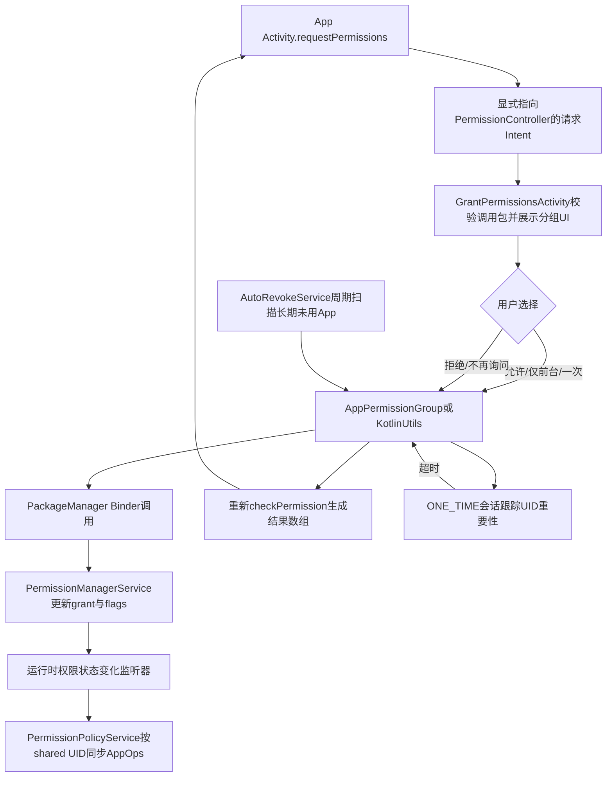
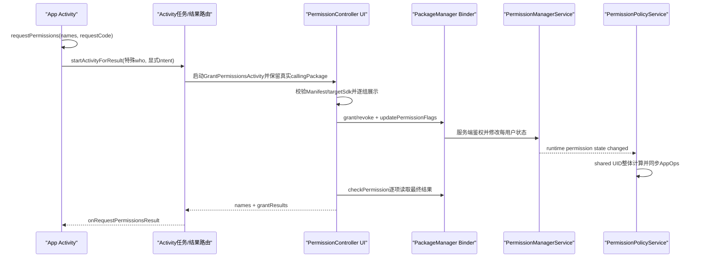
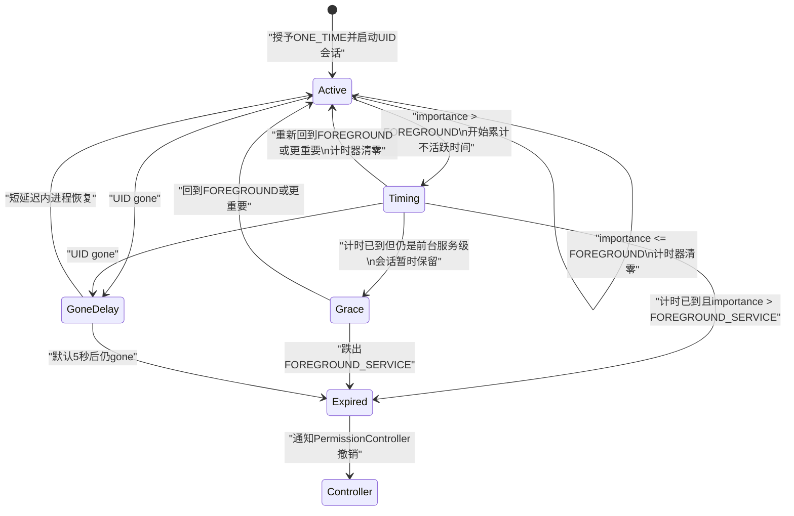

# 263 Android运行时权限请求UI、grant/revoke、AppOps同步、一次性权限与自动撤销链

## 1. 本章目标

第262章讲的是安装或更新后，PermissionManager怎样重建权限状态。本章转入应用运行期间：App调用`requestPermissions()`以后，系统权限界面怎样确认真正的调用包；用户点击“仅在使用中允许”“仅限这一次”或“拒绝”后，谁修改grant、flags和AppOps；一次性权限何时真正失效；长期不用App的权限又怎样被自动撤销。

## 2. 本章源码版本与边界

本文只解释本地`android-11.0.0_r48`。Android 12以后权限界面、近似位置、自动重置兼容范围和后台限制继续演进，因此不能把新版本现象倒推到这里。练习全部是在macOS上只读搜索源码，不要求编译AOSP，也不要求连接设备。

## 3. 先记住总模型

一次运行时权限变化至少涉及四本账：

```text
Manifest请求：应用声明想要哪些权限
Permission grant：某用户下，该包/UID是否获得权限
Permission flags：USER_SET、USER_FIXED、ONE_TIME、AUTO_REVOKED等原因和策略
AppOps mode：实际访问某类受控资源时是ALLOWED、FOREGROUND还是IGNORED
```

只看到`PERMISSION_GRANTED`，并不等于已经理解完整状态。

## 4. 五个参与者

调用端通常是App进程中的`Activity`；权限弹窗运行在独立的系统`PermissionController`应用；真正的permission grant保存在`system_server`内的`PermissionManagerService`；权限与AppOps的持续对齐由`PermissionPolicyService`完成；UID重要性则由ActivityManager提供给一次性权限计时器。

## 5. 本章源码地图

```text
frameworks/base/core/java/android/app/Activity.java
frameworks/base/core/java/android/content/pm/PackageManager.java
frameworks/base/core/java/android/app/ApplicationPackageManager.java
frameworks/base/services/core/java/com/android/server/pm/permission/PermissionManagerService.java
frameworks/base/services/core/java/com/android/server/pm/permission/OneTimePermissionUserManager.java
frameworks/base/services/core/java/com/android/server/policy/PermissionPolicyService.java
packages/apps/PermissionController/AndroidManifest.xml
packages/apps/PermissionController/.../ui/GrantPermissionsActivity.java
packages/apps/PermissionController/.../model/AppPermissionGroup.java
packages/apps/PermissionController/.../utils/KotlinUtils.kt
packages/apps/PermissionController/.../service/AutoRevokePermissions.kt
```

## 6. 先分开“请求”和“授予”

`Activity.requestPermissions()`没有直接调用`grantRuntimePermission()`。它启动系统权限Activity，让用户作决定；只有PermissionController处理结果时，才通过PackageManager/Binder请求system_server改变状态。这种分层使普通App没有机会伪造“用户已经点击允许”。

## 7. 先分开“一次性撤销”和“长期不用自动撤销”

一次性权限从用户点击“仅限这一次”开始，依据当前UID的重要性和连续不活跃时间结束，通常是分钟级会话。自动撤销则由周期Job扫描长期未使用应用，Android 11默认门槛是90天、检查频率15天。它们共用部分撤销工具，但触发器和标志完全不同。

## 8. 先分开permission与AppOp

permission决定身份是否具备某项能力；AppOp是运行时访问开关。以前台/后台位置为例，前台权限已授而后台权限未授时，permission相关AppOp应是`MODE_FOREGROUND`，不是简单的全允许或全拒绝。

## 9. 一张总览图

请求UI、状态写入、AppOps同步和两种自动撤销是相连但不同的链：



## 10. `requestPermissions()`的第一个校验

`requestCode`必须大于等于0，否则`Activity`直接抛`IllegalArgumentException`。这个编号只用于把异步结果路由回当前Activity或Fragment，不参与权限裁决。

## 11. 同一Activity同一时刻只允许一组请求

`Activity`用`mHasCurrentPermissionsRequest`记录是否已有请求。若再次调用，它不会再弹第二个权限窗口，而是立刻给新请求回调两个空数组，源码注释把这定义为cancellation。

```java
if (mHasCurrentPermissionsRequest) {
    onRequestPermissionsResult(requestCode, new String[0], new int[0]);
    return;
}
```

## 12. 这个限制不是进程全局锁

字段属于Activity实例，并非整个包或整个UID的全局互斥量。多个Activity的并发行为还会受任务栈、系统UI及权限控制器自身调度约束，不能把这一个boolean解释成系统范围“同时只能有一个权限请求”。

## 13. 请求Intent怎样构造

`PackageManager.buildRequestPermissionsIntent()`拒绝null或空数组，构造`ACTION_REQUEST_PERMISSIONS`，把权限名放入`EXTRA_REQUEST_PERMISSIONS_NAMES`，最后调用`setPackage(getPermissionControllerPackageName())`。

## 14. 为什么必须显式指定PermissionController包

若只发隐式Intent，其他App可能注册同action并伪造权限界面。指定系统选定的PermissionController包后，不经过普通应用选择器，也不会让任意第三方Activity接管这条安全交互链。

## 15. `startActivityForResult()`的特殊who前缀

Activity不是用普通who启动，而是传`@android:requestPermissions:`前缀。结果回来时`dispatchActivityResult()`识别此前缀，再把结果送给Activity或对应Fragment的权限回调，而不是普通`onActivityResult()`。

## 16. 请求状态跨重建保存

`mHasCurrentPermissionsRequest`会写入Activity instance state并恢复。这避免旋转屏幕或配置变化后，原权限窗口尚未结束，重建的Activity却误以为可以立刻发第二组请求。

## 17. PermissionController如何声明入口

`AndroidManifest.xml`中的`GrantPermissionsActivity`注册`android.content.pm.action.REQUEST_PERMISSIONS`，使用防触摸欺骗主题，排除最近任务，并对instant app可见。它是权限交互UI，不是PMS本身。

## 18. 防覆盖攻击的系统窗口标志

`GrantPermissionsActivity.onCreate()`首先给窗口加`SYSTEM_FLAG_HIDE_NON_SYSTEM_OVERLAY_WINDOWS`。目标是显示敏感选择时隐藏非系统overlay，降低悬浮窗视觉诱导风险；它与View层的obscured touch过滤属于相邻但不同的防线。

## 19. 为什么缓存`getCallingPackage()`

源码说明calling package只能在`onCreate`等有效时机读取，因此立刻保存到`mCallingPackage`。后续展示应用名、读取Manifest、grant/revoke和构造结果都围绕这个系统提供的调用方，而不是相信Intent里自报的包名。

## 20. 触摸窗口外不会取消

`setFinishOnTouchOutside(false)`使用户不能靠点弹窗外侧模糊地结束流程。系统仍可能因进程、配置、任务或其他中断结束Activity，因此调用端仍必须处理空结果和拒绝结果。

## 21. 权限数组为空怎么办

若Intent没有权限名，控制器把它规范成长度0数组，设置结果并结束。正常SDK入口会更早拒绝空数组，但服务端组件仍做防御性处理，因为组件入口不能假设所有调用都来自标准Java API。

## 22. 控制器重新读取调用包Manifest

它用`GET_PERMISSIONS`读取真正调用包的`PackageInfo`。找不到包、没有`requestedPermissions`或请求表为空时直接结束。传入一个字符串并不证明应用Manifest真的请求过对应权限。

## 23. pre-M应用不能走现代请求UI

若调用包`targetSdkVersion < M`，控制器把请求数组改成空数组并结束。旧应用的危险权限兼容依赖安装/审查和AppOps机制，不允许用现代API临时弹出运行时授权窗口。

## 24. 调用UID从PackageInfo取得

控制器取`callingPackageInfo.applicationInfo.uid`并由它得到`UserHandle`。运行时权限按用户存储，因此包名相同但处于不同Android用户时，授权状态并不共用。

## 25. UI实现会按设备形态选择

手机、电视、Wear与Automotive使用不同的`GrantPermissionsViewHandler`。视图布局和交互细节可以不同，但最终仍汇入同一个结果处理模型；不要把手机按钮布局误当成权限服务协议本身。

## 26. 为什么权限按group展示

控制器把请求权限映射到`AppPermissionGroup`和`GroupState`，按组逐步展示。用户看到“位置”或“相机”这样的组，而底层结果数组仍按原始permission name逐项返回。

## 27. group不是grant存储的最小键

底层状态仍按单个权限名记录。group主要承担UI、前景/背景关联和批量策略。一个group的UI选择可以影响多项permission，但不能因此说PMS只存一个“组授权boolean”。

## 28. 前景与背景是两个状态层

具有background permission的组会区分foreground和background `GroupState`。用户选“仅在使用中允许”时，foreground被授予、background被撤销；选“始终允许”才可能两边都授予。

## 29. “仅限这一次”的组合

Android 11把一次性选择处理为：授予foreground权限，标记一次性；同时不授予background权限。`AppPermissionGroup.setOneTime()`也明确跳过background permission。

## 30. 五类关键UI结果

源码关键常量包括`GRANTED_ALWAYS`、`GRANTED_FOREGROUND_ONLY`、`GRANTED_ONE_TIME`、`DENIED`和`DENIED_DO_NOT_ASK_AGAIN`。按钮文字可能因设备和权限组不同，但最终语义可归入这些状态。

## 31. “始终允许”怎样落地

若同时存在foreground与background state，控制器分别以`granted=true, isOneTime=false`处理两者。后台位置等权限是否允许在当前页面直接选择，还受目标SDK和专门UI流程影响，不能仅凭这个switch推导所有按钮必然可见。

## 32. “仅在使用中”怎样落地

foreground调用grant路径，background调用revoke路径。最后AppOps同步会把有关op变成`MODE_FOREGROUND`，这正是“权限有一部分被授予，但访问只在前台有效”的运行时表达。

## 33. “拒绝”和“不再询问”的差别

两者都会撤销grant；后者把`doNotAskAgain=true`传给组模型，最终影响`USER_FIXED`。普通拒绝通常是`USER_SET`而非`USER_FIXED`，系统是否还展示下一次请求由flags、请求历史及UI策略共同决定。

## 34. `USER_FIXED`不是permission denied本身

未授予是grant状态；`USER_FIXED`说明拒绝被用户固定，常对应“不再询问”。把二者混成一个boolean，会无法解释“当前拒绝但仍可再次弹窗”和“当前拒绝且不再弹窗”的区别。

## 35. 一次性选择先写模型再grant

`onPermissionGrantResultSingleState()`先`setOneTime(true)`，再`grantRuntimePermissions(...)`。`AppPermissionGroup`延迟并持久化组合变化，使grant和ONE_TIME标志最终作为同一次用户决策被处理。

## 36. 普通允许会清除一次性状态

当用户改成普通允许时，控制器调用`setOneTime(false)`。否则旧的一次性flag可能让一个本应长期保留的grant仍被计时器自动撤销。

## 37. 拒绝也会清ONE_TIME

revoke后再`setOneTime(false)`，表示当前是明确拒绝，而不是等待一次性会话超时。一次性会话和拒绝原因不能同时模糊存在。

## 38. `AppPermissionGroup`是什么

它是PermissionController侧对一个应用权限组的可变模型，汇总每项权限的grant、flags、AppOp、前后台关系和目标SDK，并通过PackageManager API持久化。它不是system_server中的权威权限表。

## 39. 为什么UI层会主动操作AppOps

旧模型的`persistChanges()`不仅grant/revoke permission，也调用`allowAppOp()`或`disallowAppOp()`。这样用户点击后能快速形成一致状态；与此同时system_server的`PermissionPolicyService`还会监听并再次按全局规则收敛。

## 40. 两次同步不等于重复授权

PermissionController的直接AppOp调整和PermissionPolicyService的监听同步承担不同角色。前者服务当前用户操作，后者处理包变化、shared UID、restriction以及外部AppOp变化后的全局一致性；设置函数会比较旧mode，避免无条件重复写。

## 41. 现代App的grant调用

`KotlinUtils.grantRuntimePermission()`确认不是system-fixed、instant/runtime-only条件允许且目标支持runtime后，调用：

```kotlin
app.packageManager.grantRuntimePermission(
    group.packageInfo.packageName, perm.name, user)
```

真正安全校验仍在system_server。

## 42. 现代App的revoke调用

已授予且目标支持runtime时，控制器调用`PackageManager.revokeRuntimePermission()`。随后还会把关联AppOp设为不允许；撤销能力可能使进程仍持有已打开资源，所以相关路径会考虑终止UID。

## 43. legacy App为何主要改AppOp

targetSdk低于M的应用不理解运行时grant变化。控制器对可映射AppOp的旧应用通过AppOp模拟关闭，并设`REVOKED_COMPAT`；为了让旧进程重新观察状态，AppOp改变时可能kill UID。

## 44. grant时flags怎样更新

轻量模型会清`REVOKED_COMPAT`和`REVIEW_REQUIRED`，清`USER_FIXED`，设`USER_SET`，并清`ONE_TIME`和`AUTO_REVOKED`。若上层要授一次性权限，旧组模型会在组合持久化时把ONE_TIME重新带入最终flags。

## 45. revoke时flags怎样更新

`userFixed`决定是否设置`USER_FIXED`。普通主动拒绝设置`USER_SET`并清ONE_TIME；轻量工具中的`oneTime=true`分支则清USER_SET、设ONE_TIME。无论哪种交互变化，都会清旧`AUTO_REVOKED`，避免把用户新决定误标成长期未用自动处理。

## 46. flags更新使用mask

`updatePermissionFlags()`只修改PermissionController负责的位，不应覆盖`SYSTEM_FIXED`、`POLICY_FIXED`等不属于此次用户选择的位。读源码时必须同时看mask和values，不能只看传入的flags值。

## 47. system-fixed为何不能碰

若权限由系统固定，控制器的轻量grant/revoke直接返回原状态。UI层不是最高策略权威，不能覆盖系统映像或核心安全策略已经固定的决定。

## 48. policy-fixed也要在服务端检查

PermissionManagerService会检查调用者是否具备覆盖策略固定权限的特权。客户端或PermissionController侧的预检查只是减少无效调用，Binder服务端仍必须以调用身份、用户和flags重新裁决。

## 49. grant的Binder路径有版本性不对称

Android 11中`ApplicationPackageManager.grantRuntimePermission()`仍调用`IPackageManager.grantRuntimePermission()`；`PackageManagerService`为兼容再转给PermissionManager服务AIDL。源码注释说这个便利入口尚未清理。

## 50. revoke已直接走PermissionManager Binder

同一类里revoke调用`mPermissionManager.revokeRuntimePermission(...)`。因此不要仅凭Java API同属PackageManager，就假设grant与revoke在r48的Binder第一跳完全相同；最终权威逻辑都进入PermissionManagerService。

## 51. 服务端grant的关键校验

PMS检查目标用户存在、跨用户权限、调用者是否能grant、包是否对调用者可见、permission是否存在且被Manifest请求、类型是否runtime/development、fixed/restricted/instant/targetSdk条件等。UI传来的包名和permission名都不是无条件可信输入。

## 52. 服务端revoke为何可能kill进程

权限被撤回后，运行进程可能仍持有基于旧授权取得的资源或Binder句柄。PMS在状态更新与持久化后通过回调安排kill；PermissionController也可能因legacy AppOp变化kill UID。两条路径的原因相近，但触发层次不同。

## 53. grant结果不是按钮文本

权限UI结束时，不是直接把“用户刚才点击的枚举”塞给App。控制器对最初请求数组逐项调用`PackageManager.checkPermission(permission, callingPackage)`，以最终系统状态生成`grantResults`。

## 54. 为什么要重新check

一组选择可能受system-fixed、policy-fixed、restricted、前后台依赖或无效permission影响。用最终权威状态回报，可以避免按钮意图与实际落盘结果不一致。

## 55. 请求与回调完整时序



## 56. `RESULT_OK`不是“全部允许”

PermissionController正常完成流程时调用`setResultAndFinish()`并设置`RESULT_OK`，但数组中仍可混有`PERMISSION_DENIED`。Activity的权限专用回调关注逐项`grantResults`，不要把Activity result code当作授权结论。

## 57. `RESULT_CANCELED`也不是逐项拒绝码

`finish()`会在尚未设置结果时以`RESULT_CANCELED`构造结果，但仍可能携带当前逐项check结果。若PermissionController进程崩溃或返回data为null，Activity才以两个空数组作best effort回调。

## 58. 原请求顺序得到保留

结果Intent中的names使用`mRequestedPermissions`，grantResults按相同索引逐个check。调用端应按名字或相同索引解释，不能按权限组UI顺序自行重排。

## 59. `checkPermission()`只告诉grant视图

回调中`PERMISSION_GRANTED`并不直接告诉调用端该访问是永久、一次性还是只限前台。应用若要理解产品语义，还要结合自身生命周期、API行为和系统再次撤销后的检查，不能缓存这一次回调永远有效。

## 60. 为什么权限变化后还需要PermissionPolicyService

一些runtime permission有对应AppOp；两个permission还可能共享switch op；soft restricted权限可能有extra op；shared UID又让多个包共同影响同一UID mode。单次UI操作无法覆盖所有后续包更新与策略变化，因此system_server维护持续同步器。

## 61. PermissionPolicyService启动时注册三类观察

它观察包added/changed/removed，注册runtime permission state changed listener，还对危险权限对应switch op及部分extra AppOp注册mode watcher。无论permission侧还是AppOp侧先变，都能触发重新收敛。

## 62. 为什么AppOp变化也反向触发同步

若其他系统组件直接改了相关AppOp，permission与op可能不一致。`mAppOpsCallback.opChanged()`安排包级同步，并检查该UID是否还请求AppOp型permission，让策略重新建立可解释状态。

## 63. 异步同步怎样去重

`mIsPackageSyncsScheduled`以`Pair<packageName,userId>`记待执行任务。同一包同一用户已有同步消息时不重复排队，最终在`FgThread`上执行后移除标记。

## 64. 为什么不同用户不能共用一次同步

runtime grant和flags按用户记录，包在用户0和用户10的授权可不同。去重键必须包含userId，用户上下文中的PackageManager查询也必须对应目标用户。

## 65. shared UID必须整体同步

源码注释强调：共享UID的所有包必须一起同步。包级入口先加入目标包，再通过`getSharedUserPackagesForPackage()`把同UID包加入同步器，因为最终AppOp UID mode会共同作用于它们。

## 66. 为什么只同步当前包会出错

假设A和B共享UID，A请求并获位置权限，B不请求。若B更新时只看B，就可能把UID位置op改成IGNORED，连A一起失效；反过来只看A也可能给不应独立获得能力的共享身份留下更宽状态。

## 67. 同步器先收集、后写AppOps

`addPackage()`在持有包锁的调用上下文中只读取包和permission事实、把待变更项放入四个列表；`syncPackages()`随后才调用AppOps。源码特别警告持包锁时不要回调AppOps，避免锁顺序和重入问题。

## 68. 哪些包被跳过

取不到PackageInfo/AndroidPackage、没有ApplicationInfo或requestedPermissions的包直接返回。root UID和system UID也被跳过，因为它们总能通过permission检查，修改其AppOps可能破坏兼容性。

## 69. permission怎样映射到op

同步器先用`permissionToOpCode()`，再取`opToSwitch()`。例如细粒度与粗粒度位置可能共享控制op，因此最终不能机械地“一项permission写一个独立mode”。

## 70. `REVIEW_REQUIRED`为何暂不改op

若permission flags仍有`FLAG_PERMISSION_REVIEW_REQUIRED`，`addPermissionAppOp()`直接返回。旧应用等待用户审查时有专门兼容流程，此处不应提前把AppOp硬收敛成普通现代状态。

## 71. 无AppOp的permission怎么办

若映射结果是`OP_NONE`，同步器不处理。background permission本身通常没有独立AppOp，它通过foreground permission的`backgroundPermission`关联决定同一个op应为ALLOWED还是FOREGROUND。

## 72. `shouldGrantAppOp()`第一关

它先调用`checkPermission(permissionName, packageName)`。未grant就返回false，最终候选mode为IGNORED。注意这是包视图的permission检查，写入时则主要使用UID mode。

## 73. `REVOKED_COMPAT`第二关

即使旧应用permission表面上仍是granted，只要flags含`REVOKED_COMPAT`，AppOp就不应放行。这正是legacy运行时撤销借AppOps实现的关键。

## 74. restricted permission第三关

hard restricted且`APPLY_RESTRICTION`生效时不授AppOp；soft restricted则交给`SoftRestrictedPermissionPolicy.mayGrantPermission()`。因此permission grant与资源实际可用之间可能存在策略层差异。

## 75. 前后台如何变成三态

foreground permission未grant时是`MODE_IGNORED`；foreground已grant但关联background未grant时是`MODE_FOREGROUND`；前后台都满足时是`MODE_ALLOWED`。

## 76. 最宽模式优先原则

`syncPackages()`按allow、foreground、ignore、ignore-if-not-allowed顺序处理，并用`uid+op`去重。若多个permission或shared UID包对同一op给出不同候选，先写的更宽模式获胜：`ALLOWED > FOREGROUND > IGNORED`。

## 77. 这不是简单的最后写入获胜

若按包遍历顺序直接写，结果会依赖包名或集合顺序。先分桶再按权限宽度处理，使共享op的结果由安全模型决定，而不是偶然的遍历顺序决定。

## 78. 为什么主要写UID mode

runtime permission本身按UID身份生效，shared UID尤其要求同一mode。同步器用`setUidModeFromPermissionPolicy()`写入；若既有package-specific mode压住了目标值，还把该package mode重置为op默认值。

## 79. 什么叫package mode干扰

AppOps可同时有UID级和包级覆盖。同步器写UID mode后会重新读取raw mode；若仍不是目标mode，说明包级值在干扰，于是把package mode恢复默认，让权限策略的UID决定重新生效。

## 80. 未再请求的AppOp permission怎样清理

包改变或移除后，服务汇总该UID所有包的requestedPermissions。某个`PROTECTION_FLAG_APPOP`权限已无人请求时，把相关UID和package mode恢复为该op默认值，防止Manifest已删但旧开关残留。

## 81. AppOps同步不是permission授予器

PermissionPolicyService以permission状态计算AppOp，不会因为一个op偶然是ALLOWED就无条件grant危险权限。它的主方向是“已有permission/flags/策略 → 合理AppOp”，AppOp watcher只负责发现漂移并重新同步。

## 82. AppOp mode改变为何可能回调自己

服务把自己的`mAppOpsCallback`传给内部set接口，并且任务有去重及旧值比较。读这类双向观察代码时应寻找收敛条件，而不是把“监听变化又写变化”直接判成无限循环。

## 83. 一次性权限的三个组成部分

一次性权限不是只有`FLAG_PERMISSION_ONE_TIME`：还需要permission当前确实granted、PermissionController启动会话，以及system_server持续观察该包UID的重要性。缺任一部分都不能完整实现自动失效。

## 84. 一次性会话在哪里启动

`AppPermissionGroup.persistChanges()`发现组是one-time且runtime permission已grant时，调用`PermissionManager.startOneTimePermissionSession()`；若包已无任何一次性权限，则调用stop。计时器不在权限弹窗Activity里运行。

## 85. 一次性权限状态机

默认reset阈值是`IMPORTANCE_FOREGROUND`，keep-alive阈值是`IMPORTANCE_FOREGROUND_SERVICE`。ActivityManager importance数值越小表示越重要：



## 86. 默认超时是一分钟但不是固定寿命

PermissionController的`Utils.ONE_TIME_PERMISSIONS_TIMEOUT_MILLIS`默认是60秒，可由DeviceConfig的`one_time_permissions_timeout_millis`覆盖。它表示连续处于计时条件的时长，不是从点击按钮开始无论如何60秒后撤销。

## 87. 前台时为什么不计时

当importance小于等于`IMPORTANCE_FOREGROUND`时，`mTimerStart`被设回inactive。用户持续使用App时，一次性权限保持；离开前台后才从新的时间点重新累计。

## 88. 前台服务为何形成中间态

importance处于foreground与foreground-service之间时，timer可以开始，但alarm暂不设置；若超时后仍有前台服务，会话继续保留。之后一旦重要性跌出keep-alive阈值，按已累计时间可能立刻到期。

## 89. UID消失为何等5秒

进程升级、崩溃恢复或快速重启会短暂表现为gone。`one_time_permissions_killed_delay_millis`默认5000ms；延迟后若importance仍比`IMPORTANCE_CACHED`更差才结束会话，减少瞬时重启导致的误撤销。

## 90. 计时器使用哪种时钟

r48把`mTimerStart`记为`System.currentTimeMillis()`，并用`AlarmManager.RTC_WAKEUP`在`timerStart + timeout`设置精确alarm。这是Android 11当前实现事实，不要擅自改写成`elapsedRealtime`模型。

## 91. 同一个UID只保存一个监听器

`OneTimePermissionUserManager`用`SparseArray`按UID索引`PackageInactivityListener`。如果已有活动会话，新start既不新建也不更新现有timeout和阈值；源码Javadoc明确写出这一点。

## 92. shared UID下要谨慎理解包名

监听生命周期按UID，而回调保存创建监听器时的packageName。共享UID包会共享重要性事实，第二个同UID会话又会被忽略，因此不能把一次性权限会话想成严格的“每包独立秒表”。这是r48数据结构直接带来的边界。

## 93. 谁有权启动会话

PermissionManagerService要求调用者持有`MANAGE_ONE_TIME_PERMISSION_SESSIONS`，清除Binder calling identity后再取得每用户manager。普通App不能自行把任意包注册成一次性会话，也不能擅自停止别人的会话。

## 94. 用户维度如何隔离

PMS为每个userId维护一个`OneTimePermissionUserManager`，并用该用户Context查package UID。相同包名在不同Android用户中有各自会话和权限状态。

## 95. 卸载时怎样清监听器

manager注册`ACTION_UID_REMOVED`接收器，找到对应UID listener后cancel并从Map删除。cancel同时移除三个importance listener和alarm，避免卸载后继续回调不存在的包。

## 96. 超时者不直接改permission

`onPackageInactiveLocked()`结束监听后调用`PermissionControllerManager.notifyOneTimePermissionSessionTimeout(packageName)`。system_server计时模块只判定会话结束，把具体权限组撤销交还PermissionController。

## 97. PermissionController超时回调做什么

它重新读取包的requestedPermissions，创建`AppPermissionGroup`，收集仍标记one-time的组。若组当前仍grant就撤销，随后`setUserSet(false)`并以“一次性权限已撤销”原因持久化。

## 98. 为什么超时后清USER_SET

一次性授权结束不是用户此刻点了“拒绝”。清USER_SET能区分会话自然到期与显式拒绝，使以后请求UI和统计可以按正确来源解释。

## 99. 自动撤销由谁调度

PermissionController的`AutoRevokeOnBootReceiver`在启动广播后用JobScheduler安排`AutoRevokeService`周期任务。Android 11默认检查频率15天，可由DeviceConfig `auto_revoke_check_frequency_millis`覆盖。

## 100. 哪些设备和用户不自行调度

Automotive设备直接不安排自动撤销。若当前用户是profile也不自行安排，注释称由primary user处理；后续扫描仍逐用户检查解锁状态和豁免条件。

## 101. 为什么设置`SKIP_NEXT_RUN`

调度周期Job时系统可能很快执行一次。接收器先把进程内静态`SKIP_NEXT_RUN=true`，第一次`onStartJob()`只清标记并结束，避免刚建立基准时间就立刻做完整扫描。它不是持久化数据库字段。

## 102. “90天未使用”怎样计算

默认unused threshold为90天，可由`auto_revoke_unused_threshold_millis`覆盖。候选最后可见时间取以下事实的最大值：同UID所有包的`UsageStats.lastTimeVisible`、目标包firstInstallTime、PermissionController保存的firstBootTime；跨profile包还取其他用户同包最后可见时间。

## 103. 为什么同UID所有包要合并使用时间

权限和进程身份可能由shared UID共同承担。若共享UID中的B昨天被使用，不能因为A自己90天没显示就按A单包视图撤掉共享身份能力，因此源码对`uidPackages`取最大lastTimeVisible。

## 104. firstInstallTime和firstBootTime的保护

刚安装的App即使没有UsageStats，也必须至少等阈值；PermissionController第一次初始化并持久化的`first_boot_time`也作为下界，防止系统更新或该组件首次启用后，因历史统计不足立刻大批撤销。它是组件偏好中的基准，不是每次开机都会重置的时间。

## 105. 缺失UsageStats的用户怎样处理

若某用户不在`UsageStatsLiveData`结果中，代码把该用户从候选Map移除，而不是把“没有统计”当成“从未使用”。这是保守策略：证据不足时不自动撤销。

## 106. 永久豁免有哪些

实现会豁免承载输入法、通知监听、无障碍、壁纸、语音交互、注意力、文本分类、打印、Dream、网络推荐、Autofill、设备管理等受绑定权限保护服务的包；carrier privileged包也豁免；disabled user或work profile在该检查中同样返回永久豁免。

## 107. 用户可覆盖豁免怎样表示

它读取`OPSTR_AUTO_REVOKE_PERMISSIONS_IF_UNUSED`。mode为DEFAULT时，targetSdk小于等于Q的包默认豁免，除非teamfood允许pre-R；显式`MODE_ALLOWED`表示允许自动撤销，其他非默认mode表示用户或installer豁免。

## 108. 不是所有已授权限都会撤

每个组还要满足：非前台/后台fixed、存在真正可用且不在特定豁免列表中的grant、不是default grant、不是role grant、属于user sensitive。普通normal权限和固定策略权限不在这一批量撤销范围。

r48这里还有一个很窄但容易读错的细节：`EXEMPT_PERMISSIONS`里的`ACTIVITY_RECOGNITION`只在判断“本组是否存在可触发撤销的grant”时被排除；一旦同组因其他permission满足条件，后面构造的`revocablePermissions`仍是`group.permissions.keys`。所以不能把这张列表解释成最终逐项撤销过滤器。

## 109. 运行中的App为何再次跳过

真正操作前读取包importance，只有`packageImportance > IMPORTANCE_TOP_SLEEPING`才撤销。importance数值越大越不重要；正在顶层或接近顶层的包会跳过本轮，避免扫描恰好撞上用户正在使用。

## 110. 自动撤销如何写状态

先撤background，再撤foreground runtime permissions，参数`userFixed=false, oneTime=false`。随后逐项把`FLAG_PERMISSION_AUTO_REVOKED`设true、`FLAG_PERMISSION_USER_SET`设false。这样未来UI能知道它是系统因长期不用自动重置，不是用户刚按拒绝。

## 111. 撤销后用户能看到什么

只要本轮至少撤销一个包，Job结束前发布低重要性通知，点击进入`ACTION_MANAGE_AUTO_REVOKE`管理页，并预加载自动撤销包列表。`onStopJob()`取消协程且返回true，请求系统日后重试。

## 112. macOS只读练习一：追请求入口

在源码根目录执行：

```bash
rg -n "requestPermissions\(|dispatchRequestPermissionsResult|buildRequestPermissionsIntent" \
  frameworks/base/core/java/android/app/Activity.java \
  frameworks/base/core/java/android/content/pm/PackageManager.java
```

手动画出`requestCode`、特殊who前缀、Intent extra、回调数组四者的对应关系，并标出“第二次并发请求”和“data为null”各返回什么。

## 113. macOS只读练习二：追用户一次选择

执行：

```bash
rg -n "GRANTED_ALWAYS|GRANTED_FOREGROUND_ONLY|GRANTED_ONE_TIME|DENIED_DO_NOT_ASK_AGAIN|setResultIfNeeded" \
  packages/apps/PermissionController/src/com/android/permissioncontroller/permission/ui/GrantPermissionsActivity.java
```

任选`GRANTED_ONE_TIME`，沿调用写出foreground grant、background revoke、ONE_TIME flag、最终`checkPermission()`回报的先后顺序。

## 114. macOS只读练习三：手算AppOps

执行：

```bash
sed -n '633,748p' \
  frameworks/base/services/core/java/com/android/server/policy/PermissionPolicyService.java
```

设A、B共享UID并映射到同一op：A前景已授/背景未授，B未授。分别把它们放入foreground和ignore列表，再按`syncPackages()`顺序手算最终mode，解释为何不是B的IGNORED。

## 115. macOS只读练习四：对比两种自动撤销

执行：

```bash
rg -n "mTimerStart|IMPORTANCE_CACHED|notifyOneTimePermissionSessionTimeout|DEFAULT_UNUSED_THRESHOLD_MS|lastTimeVisible|FLAG_PERMISSION_AUTO_REVOKED" \
  frameworks/base/services/core/java/com/android/server/pm/permission/OneTimePermissionUserManager.java \
  packages/apps/PermissionController/src/com/android/permissioncontroller/permission/service/AutoRevokePermissions.kt
```

做一张两列表：触发器、默认时间、调度者、flags、是否依赖UsageStats、是否跟踪UID importance。确保不再把“一次性权限”写成“90天自动撤销”。

## 116. 常见误解一：用户点允许后PMS直接回调App

不准确。用户选择先由PermissionController转成grant/revoke和flags，PMS更新权威状态，PermissionController再逐项check并通过Activity result路由回App。AppOps同步还可能异步收敛。

## 117. 常见误解二：permission granted就能永远访问

不准确。AppOp可能是FOREGROUND或IGNORED，restricted policy也可能限制；一次性会话或长期未用Job还会在未来撤销。应用每次敏感操作都应按公开API处理当前权限与失败，而不是永久缓存第一次结果。

## 118. 常见误解三：一次性权限点击一分钟后必撤

不准确。一分钟是默认连续不活跃阈值；回到foreground会清零，foreground service可在超时点继续保活，UID gone另有默认5秒重启缓冲。它是UID重要性驱动的状态机，不是按钮点击后的墙钟倒计时。

## 119. 复读后补上的精确边界

第一，自动撤销的“最后使用”按shared UID包取最大值，并受安装时间、组件基准时间和跨profile使用保护；第二，Q及更旧目标包在AppOp为DEFAULT时默认豁免，`EXEMPT_PERMISSIONS`又不是最终逐项过滤表；第三，一次性监听器按UID而非包名建Map，新start不会更新旧会话；第四，PermissionPolicyService按shared UID整体、以最宽mode优先同步，而非按最后遍历包覆盖。

## 120. 本章小结与下一章

运行时权限请求是一条跨App、PermissionController与system_server的安全协议：标准API只发起显式系统UI，控制器依据真实calling package和Manifest展示分组选择，再经Binder让PermissionManagerService修改每用户grant与flags；PermissionPolicyService以shared UID为整体把状态收敛到ALLOWED、FOREGROUND或IGNORED AppOps；一次性权限由UID重要性状态机结束，长期未用权限则由周期UsageStats扫描自动重置。下一章进入权限持久化与备份恢复，继续追`runtime-permissions.xml`、异步写盘、版本升级、PermissionController备份/恢复和延迟恢复链。
