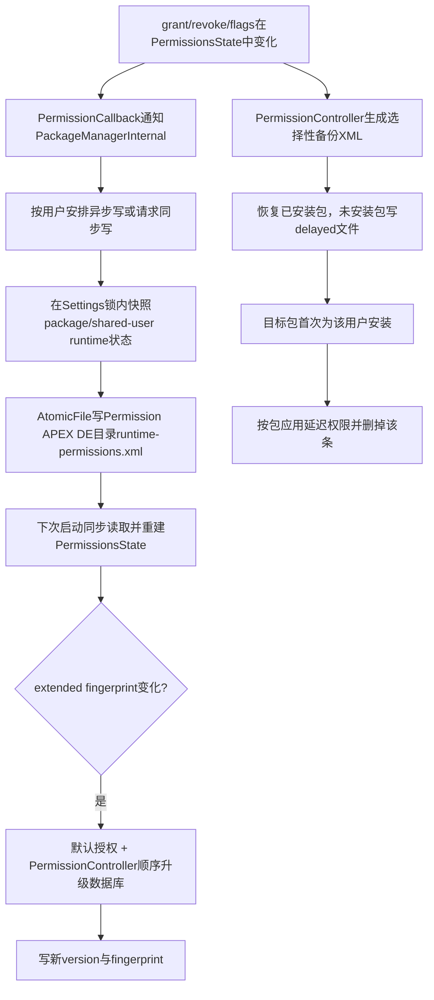
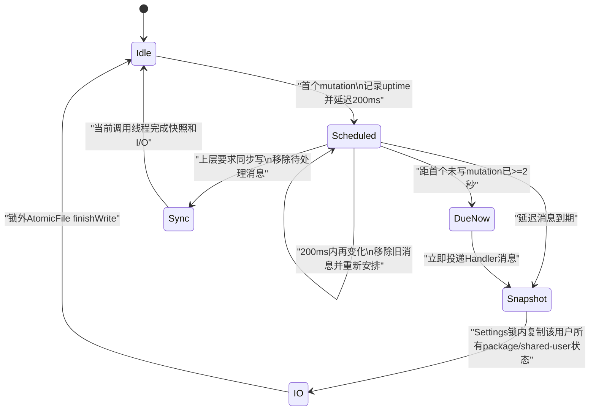
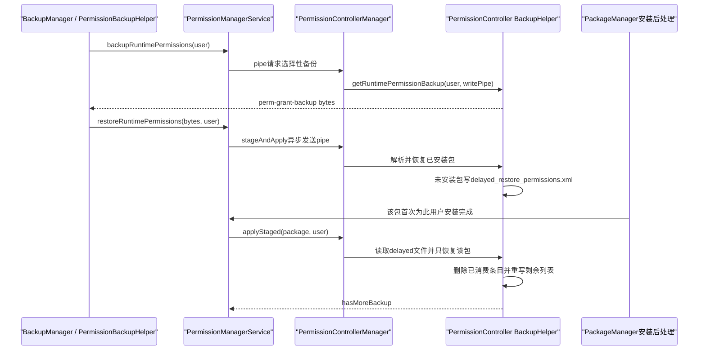

# 264 Android运行时权限持久化、runtime-permissions.xml、异步写盘、版本升级、备份恢复与延迟恢复链

## 1. 本章目标

第263章追到用户点击权限UI后，内存中的grant、flags和AppOps怎样改变。本章回答设备重启和换机恢复的问题：运行时权限怎样从`PermissionsState`写入每用户XML；频繁变化为何不会每次立即刷盘；Android与PermissionController升级后怎样迁移数据库；备份为什么不能直接复制本机XML；恢复时目标App尚未安装又怎样暂存并在安装后补做。

## 2. 源码版本与学习边界

本文基于本地`android-11.0.0_r48`。Android 12以后Permission模块、Auto Revoke和备份格式继续改变，本文中的路径、版本8升级步骤及几个实现疑点只对r48负责。练习均为macOS只读命令，不要求编译或启动Android系统。

## 3. 先记住最重要的区分

Android 11至少有两种完全不同的“权限XML”：

```text
本机持久化 runtime-permissions.xml：system_server重启后恢复权威grant与flags
备份负载 perm-grant-backup XML：跨备份/恢复迁移用户可迁移的选择
```

二者路径、schema、筛选规则、所有者和用途都不同，绝不能互相替代。

## 4. 本机持久化解决什么

运行时权限在内存中属于`PackageSetting`或`SharedUserSetting`的`PermissionsState`，并按userId分层。若system_server或设备重启，只靠内存就会丢失，因此Settings为每个用户保存runtime grant、flags、数据库version和扩展fingerprint。

## 5. 备份负载解决什么

备份面向另一台设备或恢复后的新系统。它不能原样复制所有系统固定、策略固定和默认授权，否则可能把旧设备策略强加给新设备；因此PermissionController只挑选用户实际改变过、值得迁移的状态。

## 6. 本章源码地图

```text
frameworks/base/services/core/java/com/android/server/pm/Settings.java
frameworks/base/apex/permission/service/java/com/android/permission/persistence/
    RuntimePermissionsPersistence.java
    RuntimePermissionsPersistenceImpl.java
    RuntimePermissionsState.java
frameworks/base/services/core/java/com/android/server/pm/permission/PermissionManagerService.java
frameworks/base/services/core/java/com/android/server/policy/PermissionPolicyService.java
frameworks/base/core/java/com/android/server/backup/PermissionBackupHelper.java
frameworks/base/core/java/android/permission/PermissionControllerManager.java
frameworks/base/core/java/android/permission/PermissionControllerService.java
packages/apps/PermissionController/.../service/RuntimePermissionsUpgradeController.kt
packages/apps/PermissionController/.../service/BackupHelper.java
```

## 7. 三个不同的“version”不要混用

`packages.xml`有PackageManager数据库/SDK版本；`runtime-permissions.xml`有PermissionController维护的权限数据库版本；BackupManager的Blob helper又有`STATE_VERSION=1`，备份XML根节点还携带platform version。它们不是同一计数器。

## 8. fingerprint也不是APK签名指纹

运行时权限文件的fingerprint是`Build.FINGERPRINT + "?pc_version=" + PermissionController长版本号`。它用来判断系统构建或权限控制器策略是否变化，不是应用证书SHA-256，也不是文件内容hash。

## 9. 总体持久化与恢复图



## 10. 权威内存状态在哪里

普通包的runtime permission存于它的`PackageSetting.getPermissionsState()`；shared UID包不各存一份，而使用`SharedUserSetting.getPermissionsState()`。持久化时必须保持这个归属，否则重启后会把共享身份拆成互相矛盾的包状态。

## 11. Android 11的新持久化接口

Settings内部的`RuntimePermissionPersistence`负责调度和内存转换，真正XML I/O通过Permission APEX提供的System API `RuntimePermissionsPersistence`完成。接口明确说明read、write、delete都是同步I/O，是否异步由外层Settings决定。

## 12. 文件的真实位置

实现用：

```java
ApexEnvironment.getApexEnvironment("com.android.permission")
    .getDeviceProtectedDataDirForUser(user)
```

再拼`runtime-permissions.xml`。典型逻辑路径是`/data/misc_de/<userId>/apexdata/com.android.permission/runtime-permissions.xml`。

## 13. 为什么放Device Protected目录

系统必须在用户输入锁屏凭据前恢复权限策略，不能依赖Credential Encrypted目录已经解锁。ApexEnvironment注释还说明该目录随对应APEX rollback回滚，使模块代码与其内部数据有一致的回滚边界。

## 14. Android 10及更早的旧路径

Settings仍保留`/data/system/users/<userId>/runtime-permissions.xml`的legacy读取器。它是迁移输入，不是r48正常新写路径；新实现优先读取APEX DE文件。

## 15. 新文件不存在时怎样迁移

`readForUser()`返回null后，Settings调用`readLegacyStateForUserSyncLPr()`读取旧XML，再安排一次异步新格式写入。该方法本身没有删除旧文件，因此“成功写新文件”不能直接推导“旧文件已在此处删除”。

## 16. 新文件的根节点

根是`<runtime-permissions>`，带`version`和可选`fingerprint`。下面分别放`<package name="...">`和`<shared-user name="...">`，其子项是`<permission name="..." granted="..." flags="十六进制">`。

## 17. 一个简化示例

```xml
<runtime-permissions version="8" fingerprint="build...?pc_version=...">
    <package name="com.example.camera">
        <permission name="android.permission.CAMERA"
                    granted="true" flags="1" />
    </package>
    <shared-user name="com.example.shared">
        <permission name="android.permission.ACCESS_FINE_LOCATION"
                    granted="false" flags="3" />
    </shared-user>
</runtime-permissions>
```

实际顺序来自内存Map遍历，业务逻辑不应依赖XML元素排序。

## 18. 为什么denied权限也要写

未grant仍可能有`USER_SET`、`USER_FIXED`、`POLICY_FIXED`、`AUTO_REVOKED`或restriction flags。若只保存granted=true项，重启后“不再询问”和系统自动撤销来源都会消失。

## 19. flags为什么用十六进制字符串

flags本质是位掩码，写成`Integer.toHexString()`便于紧凑保存；读取用基数16解析。调试时看到`flags="3"`要按bit定义拆解，不应把3理解成枚举编号。

## 20. 每个普通包都会有节点吗

写快照时遍历`mPackages`，只要包不属于shared user，就把该用户的runtime permission list放进`packagePermissions`，即使list为空也保留Map项。这样“已知包但当前无runtime状态”和“文件完全缺少该包”可被区分。

## 21. shared UID为何单独成表

属于shared user的PackageSetting不会进入普通包状态表；Settings再遍历`mSharedUsers`，以shared user name写一次共享权限。重启后所有成员继续看到同一UID状态。

## 22. 写出的最小权限记录

`getPermissionsFromPermissionsState()`只取目标userId的runtime permission states，每项复制name、`isGranted()`与flags。install permission仍由`packages.xml`等全局包设置保存，不在这个每用户文件重复记录。

## 23. 一次性权限的特殊落盘规则

序列化时不是直接写`permissionState.isGranted()`，而是：

```java
granted = permissionState.isGranted()
        && (permissionState.getFlags() & FLAG_PERMISSION_ONE_TIME) == 0;
```

只要是ONE_TIME，磁盘上的granted就强制为false。

## 24. 为什么不能让一次性grant跨重启复活

一次性授权依赖当前UID importance会话。system_server或设备重启后，原会话计时上下文已不存在；把grant写成false可保证重启不会把临时能力变成永久能力。ONE_TIME flag仍被保存，用于后续状态解释和清理。

## 25. 写盘入口的sync参数

`Settings.writeRuntimePermissionsForUserLPr(userId, sync)`在sync=true时立即调用同步写；否则进入异步去抖队列。上层`PackageManagerInternal.writePermissionSettings(userIds, async)`会取反传参，因此阅读调用点时要小心双重否定。

## 26. grant为何通常允许异步

默认PermissionCallback把grant描述为“not critical；丢失时应用重新请求”，调用`writeSettings(true)`安排PackageManager设置写。写packages.xml成功后还会对所有用户安排runtime permission异步写。

## 27. revoke为何被标为critical

撤销回调注释认为撤销后应用不应再拥有权限，因此调用`writeSettings(false)`并安排kill UID。这里的`false`使主`packages.xml`同步写，但`Settings.writeLPr()`末尾仍通过`writeAllRuntimePermissionsLPr()`安排每用户权限文件异步写。

## 28. 一个容易忽略的崩溃窗口

因此r48的“critical revoke”并不等于runtime-permissions.xml在回调返回前已fsync；它仍受200ms到2秒去抖窗口影响。正常运行中内存状态与进程终止立即生效，但若在新XML落盘前异常掉电，旧磁盘grant存在理论恢复窗口。这是按调用链得出的实现边界。

## 29. flags批量更新怎样写

`updatePermissionFlagsForAllApps()`若确有改变，直接调用`writePermissionSettings(..., async=true)`，即明确使用异步权限写。恢复、升级等批量操作还会把需要同步和可异步的用户分开汇总。

## 30. 异步写的第一条变化

第一次未写mutation记录当前`SystemClock.uptimeMillis()`，给该userId发延迟200ms的Handler消息，并设`mWriteScheduled=true`。

## 31. 200ms不是固定写入延迟

若200ms内又发生变化，代码移除旧消息并重新安排，试图把一串快速grant/flags变化合并成一次快照。这样权限UI按组连续更新多项权限时不会每一项都单独刷文件。

## 32. 为什么还有最大2秒

纯粹不断后移会导致高频变化永远不落盘。代码保存第一条尚未写mutation的时间，若累计达到`MAX_WRITE_PERMISSIONS_DELAY_MILLIS=2000`，就立即发消息；否则本次延迟取200ms与剩余最大窗口的较小值。

## 33. 计时为什么用uptime

去抖关注system_server实际运行期间的调度时间，源码使用`SystemClock.uptimeMillis()`而非墙钟。修改日期或时区不会影响这200ms/2秒窗口；uptime在深度睡眠时停止累计，所以深睡时间不计入该上限。

## 34. 不同用户各自去抖

`mWriteScheduled`、`mLastNotWrittenMutationTimesMillis`都以userId为key，Handler message的what也直接放userId。用户0持续变化不会把用户10已经安排的文件写无限延后。

## 35. 异步写状态机



## 36. Handler运行在哪个线程

`MyHandler`使用`BackgroundThread.getHandler().getLooper()`。异步文件I/O不占PackageManager或system_server主线程；但它仍需取得Settings持久化锁完成一致快照。

## 37. 快照与I/O怎样分锁

`writePermissionsSync()`在`mPersistenceLock`内清scheduled标记、读取version/fingerprint并复制所有包与shared user权限，构造不可变用途的`RuntimePermissionsState`；退出锁后才调用APEX persistence写XML。

## 38. 为什么必须先完整快照

若边遍历活Map边做慢磁盘I/O，其他权限变化可能让一个文件同时含新旧状态，或长期占用PackageManager锁。先复制再写，使单次文件内容对应某一完整锁内观察点。

## 39. 同步写仍可能持外层锁

虽然`writePermissionsSync()`内部在快照后退出`mPersistenceLock`，`PackageManagerInternal.writePermissionSettings()`调用它时外层仍包在` synchronized(mLock)`中。Java锁可重入，因此同步路径的实际I/O可能仍处在外层包锁范围；异步Handler路径才自然在快照后释放锁。

## 40. AtomicFile怎样保护旧文件

实现用`startWrite()`取得输出流，序列化成功后`finishWrite()`；任何异常都会`failWrite(outputStream)`恢复备份。不能只看到最终文件名，就误以为它是普通truncate覆盖。

## 41. 写失败怎样处理

异常被`Log.wtf`记录并调用`failWrite`，方法不向调用者重新抛出。内存权限仍是新状态，磁盘保留旧的可恢复版本；后续变化或全量settings写可能再次安排写盘。

## 42. 开机读取的顺序

Settings先从`packages.xml`建立PackageSetting、SharedUserSetting和权限定义，再为每个已知用户同步读取runtime state。否则XML中的包名和permission名没有内存对象可附着。

## 43. 读取grant与flags

每项先查`BasePermission`；找不到就告警并跳过。granted=true时先grant runtime permission，再用`MASK_PERMISSION_FLAGS_ALL`恢复flags；granted=false时也恢复flags，但不grant。

## 44. 文件里未知包怎样处理

新实现解析为Map后，是遍历当前`mPackages`去取同名entry，不会遍历文件中的孤儿包主动创建PackageSetting。因此已卸载或当前未知包的文件项不会凭空恢复应用状态。

## 45. 当前包在文件中缺项怎么办

非Android R升级场景下，普通非shared包或shared user缺少对应状态会被标`PermissionsState.missing=true`，后续`restorePermissionState()`生成合理默认。升级到R时暂不标missing，避免格式迁移期间把新出现的表项误判成状态丢失。

## 46. 为什么文件缺version表示P升级

新parser把缺失version读成`RuntimePermissionsState.NO_VERSION=-1`，Settings再转成内部`UPGRADE_VERSION=-1`。旧legacy parser也以-1为默认。PermissionController据此执行从Android P开始的顺序迁移。

## 47. 新用户为什么从0开始

文件不存在且没有legacy状态时，`getVersionLPr()`默认0。UpgradeController把0解释为fresh user，而不是“来自P”，所以某些只为旧设备保留既有授权的grandfather步骤不会对新用户无条件执行。

## 48. 一个API注解矛盾

`PermissionManager.getRuntimePermissionsVersion()`文档明确说可能返回-1，但方法又标`@IntRange(from=0)`。PMS的getter只校验userId非负，并会返回Settings中的-1。读r48时应以实现和文档共同判断，不能被该静态注解单独误导。

## 49. 扩展fingerprint怎样生成

PMS在扫描出必需PermissionController包后读取其`longVersionCode`，Settings拼成：

```text
Build.FINGERPRINT?pc_version=<PermissionController versionCode>
```

系统OTA或模块/控制器版本变化都能触发策略升级检查。

## 50. `isPermissionUpgradeNeeded()`的默认值

`mPermissionUpgradeNeeded.get(userId, true)`在没有明确记录时返回true，采取保守升级。读取的旧fingerprint与当前extended fingerprint不同也会把对应用户标为需要升级。

## 51. 为什么systemReady先补默认权限

PermissionManagerService在`systemReady()`收集需要升级的用户，先执行`DefaultPermissionGrantPolicy.grantDefaultPermissions(userId)`，确保核心拨号、短信等系统角色的基础授权在后续权限策略启动前可用。

## 52. 用户启动时谁执行数据库升级

`PermissionPolicyService.onStartUser()`调用`grantOrUpgradeDefaultRuntimePermissionsIfNeeded()`。若fingerprint变化，它绑定该用户的PermissionController，并同步等待`grantOrUpgradeDefaultRuntimePermissions`结果，再进行全量AppOps同步。

## 53. 为什么升级放在PermissionController

数据库迁移不仅是XML字段转换，还需要理解permission group、restricted whitelist、前后台权限关系和当前已安装包。PermissionController拥有这些产品策略模型，system_server则保留底层状态与升级是否完成的账本。

## 54. r48最新数据库版本

`RuntimePermissionsUpgradeController.LATEST_VERSION=8`。它读取当前version，在IPC coroutine中按0→1→…→8顺序执行，不能跳步；源码注释要求新增迁移时同时提高LATEST_VERSION。

## 55. -1到0做什么

当前version小于等于-1时标记`android P upgrade`并先改为0。这一布尔信息会留给后续背景位置扩展步骤，区分老设备OTA与全新用户。

## 56. 0到1迁移

它为SMS和Call Log组中的restricted权限生成upgrade whitelist，使旧系统已有的相关状态在新restricted模型下获得迁移豁免。新用户也从0经过此步，但具体只对已请求的权限构造whitelisting。

## 57. 1到3为何像空步骤

r48中1→2和2→3只是递增，注释说明原逻辑被移动到后续步骤以修复dogfooding期间的错误状态。版本迁移历史可能保留空槽，不能因当前无操作就重新编号。

## 58. 3到4迁移背景位置

为请求`ACCESS_BACKGROUND_LOCATION`的包生成upgrade whitelist，并在内存视图中模拟`RESTRICTION_UPGRADE_EXEMPT`，让后续是否扩展background grant的判断基于即将生效的白名单状态。

## 59. 5到6迁移存储权限

它把restricted storage权限加入内部system upgrade whitelist。源码注释说明不希望installer在安装后修改这类存储白名单，因此选择内部系统豁免来源。

## 60. 6到7扩展背景位置grant

只在确实从P升级时考虑：foreground位置已授、存在background组，且background没有USER_SET、SYSTEM_FIXED、POLICY_FIXED、USER_FIXED，才生成background grant。用户或策略已有明确决定时不会覆盖。

## 61. 7到8扩展媒体位置

非新用户且包请求`ACCESS_MEDIA_LOCATION`、已有合适的READ_EXTERNAL_STORAGE状态时加载storage组；若该新权限未USER_SET、未系统/策略固定、尚未grant，生成grant以维持升级兼容。新用户不会继承这项旧存储能力。

## 62. 升级数据为什么先一次性加载

Controller用LiveData聚合全部包、预装包、平台runtime permission定义及真正需要的location/storage组，等待都初始化后再算迁移。源码明确说数据只加载一次且不会在本次计算中动态更新，减少不同步骤观察到不同包快照。

## 63. whitelist与grant为什么顺序执行

先把预装包及升级需要的restricted whitelist逐项应用，再执行grant。restricted permission若没有豁免，直接grant可能被底层策略拒绝；顺序本身就是迁移正确性的一部分。

## 64. 为什么不并行应用

源码注释记录测量结果：并行反而更慢，因此whitelisting和grant都顺序调用平台。这里是性能选择，不意味着Binder或PackageManager API天然只能串行。

## 65. 怎样提交新version

若最终从旧version走到8，Controller通过`PermissionManager.runtimePermissionsVersion=8`写回；Settings更新`mVersions`并安排异步权限文件写。若升级计算没到LATEST_VERSION，代码`wtf`后抛RuntimeException。

## 66. fingerprint何时更新

PermissionPolicyService只有在Controller回报成功后才调用`updateUserSensitive()`，然后让PackageManagerInternal把当前extended fingerprint写入该用户状态并异步持久化。fingerprint相当于“这套构建+控制器策略已处理”的完成标记。

## 67. version和fingerprint职责不同

version控制结构化迁移步骤，例如0到8；fingerprint检测同一数据库版本下系统构建或PermissionController包更新。只有version而无fingerprint，会漏掉策略代码变化；只有fingerprint又无法知道该补哪一步数据变换。

## 68. 升级失败为何很严重

PermissionPolicyService把失败视为undefined permission state，记录`wtf`并抛IllegalStateException，让Rescue Party有机会建议恢复措施。系统宁愿暴露一致性失败，也不继续用半迁移权限启动所有AppOps策略。

## 69. `CLEAR_RUNTIME_PERMISSIONS_ON_UPGRADE`

Settings有“构建fingerprint变化时删除所有用户runtime文件”的调试/产品开关，但r48常量明确是`false`。正常OTA走迁移和fingerprint机制，不是每次系统更新都清空用户授权。

## 70. 本机文件和备份文件为何不能合并

本机文件要精确重建fixed、role/default/restricted/one-time等内部位；跨设备恢复只应迁移用户选择，并要适配新平台的split permission和当前Manifest。相同schema反而会鼓励错误地恢复设备策略。

## 71. BackupManager怎样进入权限备份

system_server的`PermissionBackupHelper`继承`BlobBackupHelper`，state schema version是1，key是`permissions`。获取payload时调用`PermissionManagerInternal.backupRuntimePermissions(user)`；恢复payload时调用对应restore。

## 72. 备份工作为什么不能在主线程

PermissionManagerService注释禁止主线程调用，并用`CompletableFuture`等待PermissionController结果，超时上限60秒。备份要枚举包、读每项grant/AppOp并写XML，不能阻塞system_server主Looper。

## 73. 备份数据怎样跨进程传输

PermissionControllerManager通过`RemoteStream.receiveBytes()`建立ParcelFileDescriptor pipe，远端PermissionController把XML写入pipe，system_server收成byte数组。大块数据不直接塞进单个Binder Parcel。

## 74. 服务端仍校验权限

manager本地先检查`GET_RUNTIME_PERMISSIONS`以尽早失败；PermissionControllerService Binder入口又检查真实calling permission。恢复则要求`GRANT_RUNTIME_PERMISSIONS`或`RESTORE_RUNTIME_PERMISSIONS`之一，防止普通App导出或灌入全用户权限状态。

## 75. PermissionController Binder线程是否直接枚举包

入口创建latch，调用实现后等待；`PermissionControllerServiceImpl`再用`AsyncTask.execute()`执行真正BackupHelper工作，完成后countDown。这样重活不在Binder回调代码直接执行，但该Binder调用会等异步任务关闭pipe。

## 76. 一个误导性的timeout日志

PermissionControllerService中的`latch.await()`没有传timeout；catch到的是`InterruptedException`，日志却写“timed out”。真正可见的60秒超时在system_server的`CompletableFuture.get(timeout)`。复读时应以API参数为准，不要只信日志文本。

## 77. 备份XML根结构

PermissionController写`<perm-grant-backup version="...">`，里面是`<rt-grants>`、每包`<grant pkg="...">`和逐项`<perm name="..." g/set/fixed/was-reviewed>`。false属性通常省略而不是显式写false。

## 78. 哪些状态绝不备份

permission flags包含`POLICY_FIXED`或`SYSTEM_FIXED`时返回null。它们属于设备/管理员/系统策略，恢复到另一环境可能不合法，必须由目标系统重新计算。

## 79. 默认授权为何通常不备份

permission未USER_SET且`isGrantedByDefault()`时跳过。目标设备的默认拨号、短信、角色或系统映像可能不同，应由目标DefaultPermissionGrantPolicy重新授予，而不是由旧设备备份决定。

## 80. 现代App什么状态值得备份

对targetSdk>=M，默认是denied；因此实际permission+AppOp有效grant属于偏离默认状态，需要保存。即使未grant，只要USER_SET或USER_FIXED也要保存用户拒绝。

## 81. legacy App的默认方向相反

pre-M应用默认看起来是granted，运行时关闭主要靠AppOp。因此备份器把“permission或AppOp不再有效”视为偏离默认，并保存`wasReviewed = !REVIEW_REQUIRED`，以便恢复旧应用是否已完成审查。

## 82. 为什么备份看`isGrantedIncludingAppOp`

只看permission grant会把legacy App的`REVOKED_COMPAT + AppOp denied`错误备份成允许。备份器要求permission已grant且关联AppOp允许，才把`g=true`写入迁移状态。

## 83. background permission为什么显式补遍历

`AppPermissions.getPermissionGroups()`不直接包含背景子组，BackupHelper遍历foreground组后，若存在background permissions，再显式收集背景组。否则“始终允许位置”等选择会在换机后丢掉后台部分。

## 84. 空包为何不进备份

若一个包没有任何需要迁移的permission，`BackupPackageState.fromAppPermissions()`返回null。备份只保留非默认用户状态，减少负载，也避免把“没有条目”误作一个需要强制清空目标状态的指令。

## 85. platform version用于什么

恢复解析每个旧permission时，会查看系统的`SplitPermissionInfo`。若备份platform version早于某次split的targetSdk且旧名匹配，就把相同grant/flags语义展开到新permission列表，维持升级兼容。

## 86. r48写平台版本的遗留边界

`writePkgsAsXml()`中只要`BuildCompat.isAtLeastQ()`就固定写`VERSION_CODES.Q`，旁边还有“STOPSHIP remove compatibility code”注释。在Android R的r48上条件仍为true，所以备份根节点写29而非30；读者不能按设备API 30想当然地解释该属性。

## 87. 备份与延迟恢复时序



## 88. 初始restore为什么叫stageAndApply

它先尽量应用当前已安装包，又把未安装包写入staged delayed文件。不是所有备份必须等应用安装齐后一次提交，也不是收到payload后只暂存完全不应用。

## 89. 初始restore是异步完成

PermissionManagerService清除该用户“没有延迟备份”的内存缓存后，调用`stageAndApplyRuntimePermissionsBackup()`；manager通过RemoteStream异步发bytes，只在发送错误时记录日志，没有把最终每包恢复结果同步返回给BackupManager调用栈。

## 90. 已安装包怎样识别

BackupHelper按备份里的package name调用目标用户PackageManager的`getPackageInfo(GET_PERMISSIONS)`。存在就立即构造当前AppPermissions恢复；`NameNotFoundException`则把完整BackupPackageState加入later列表。

## 91. 延迟文件存在哪里

`delayed_restore_permissions.xml`通过该用户PermissionController Context的`openFileOutput(MODE_PRIVATE)`保存，是PermissionController自己的每用户私有文件，而非Permission APEX的权威runtime-permissions.xml。

## 92. 第二次restore会怎样

`writeDelayedStorePkgsLocked()`以MODE_PRIVATE重写文件，只包含当前payload里未安装的包。它不是把多次restore payload自动合并成历史队列；新一次完整restore可能覆盖旧的pending集合。

## 93. 延迟文件是否AtomicFile

r48这里使用普通`openFileOutput`和serializer，不是AtomicFile。写失败会记录错误，但没有显式旧文件回滚协议；它的可靠性级别低于权威runtime-permissions.xml。

## 94. `sLock`保护什么

BackupHelper用进程级静态`sLock`串行修改delayed文件，注释说确保一次只有一个用户改变延迟权限。它保护PermissionController进程内读改写，不是跨进程文件锁，也不是system_server的Settings锁。

## 95. 什么时候重试某个包

PMS在包对某个用户首次安装的post-install工作中调用`restoreDelayedRuntimePermissions(packageName, user)`。更新已有安装通常不是这条“new user install”触发点。

## 96. 为什么按包重试而不全表扫描

安装事件已经告诉系统哪个包刚变得可用。Controller读取pending列表，只寻找同名条目并恢复，消费后重写剩余项，避免每安装一个包都对所有待恢复包重复查询和操作。

## 97. `hasMoreBackup`缓存的含义

Controller返回pending列表是否仍非空。PMS只有收到false才把`mHasNoDelayedPermBackup[userId]=true`；以后该用户安装包可快速跳过Binder调用，直到新的完整restore删除此缓存项。

## 98. 远端重试错误怎样处理

PermissionControllerManager在apply staged发生错误时回调true，也就是保守声称“仍有更多备份”。这样PMS不会错误缓存“全部完成”，下一次包安装仍有机会重试。

## 99. 文件不存在会发生什么

`restoreDelayedState()`打开文件失败会记录“could not parse”并返回false，PMS随后缓存没有剩余。对确实从未stage过恢复的用户，这是快速收敛；若文件因I/O问题暂时不可读，本次进程生命周期内也可能停止自动重试。

## 100. restore前先适配split permission

解析备份时，一个旧permission可展开成旧名加多个new permissions，且复制原来的granted、USER_SET、USER_FIXED和review状态。真正恢复时仍要求目标App当前能找到对应group/permission；不存在就告警跳过。

## 101. 恢复不会覆盖当前用户新决定

`BackupPermissionState.restore()`只有在目标permission当前`!perm.isUserSet()`时才grant或revoke。若用户已在新设备上主动允许或拒绝，旧备份不会反向覆盖较新的本地选择。

## 102. fixed组为何不恢复

若group system-fixed或policy-fixed，恢复直接返回。目标设备系统和管理员策略优先于旧用户备份；备份阶段虽已排除这些flags，恢复端仍再次防御检查。

## 103. review flag处理的细节

若备份说legacy permission已review，代码先`unsetReviewRequired()`，然后才检查group是否fixed。也就是说fixed组虽然不进行grant/revoke，review-required模型位仍可能被修改并在包级persist时写出；这是r48的精确执行顺序。

## 104. 为何先恢复foreground再background

每包恢复循环跑两遍：第一遍只处理非background，第二遍处理background。pre-M模型无法表达“背景已授但前景被拒”，先建立前景基础可避免中间态违反前后台依赖。

## 105. granted组为什么清USER_FIXED

恢复完后遍历前景与背景组：只要runtime permissions已经grant，就`setUserFixed(false)`。USER_FIXED语义用于固定拒绝，“已授予且不再询问”不是合理最终组合。

## 106. 最终怎样真正写入平台

BackupPackageState最后调用`appPerms.persistChanges(true)`，让AppPermissionGroup通过PackageManager grant/revoke、更新flags和AppOps；参数允许因AppOps改变而kill进程。随后system_server正常权限持久化链再把新状态写入权威runtime XML。

## 107. 延迟条目何时被删除

只要找到同名包并调用`pkgState.restore()`，就从later列表移除并重写文件。即使其中某个permission因当前Manifest没有group或被fixed而跳过，也不会保留整包条目无限重试。

## 108. 备份里有没有应用签名

PermissionController的这份XML只写package name和permission状态，没有写应用证书、versionCode或installer。备份系统其他层可能有包身份与安装恢复规则，但仅审查`BackupHelper`不能声称它自己做了签名匹配。

## 109. 备份能恢复全部flags吗

不能。它只保存granted、USER_SET、USER_FIXED和legacy reviewed语义；ONE_TIME、AUTO_REVOKED、GRANTED_BY_ROLE、restriction exemptions等不按原位完整搬迁。目标系统要重新计算默认、角色和策略来源。

## 110. 本机复制XML为何不是换机方案

权威XML含shared user name、完整内部flags、数据库version和构建fingerprint，且位于受保护APEX数据目录。直接拷到另一系统会绕开split适配、当前Manifest、fixed策略和用户新决定保护，既不兼容也不安全。

## 111. 一次恢复的最终一致性

备份恢复先改变PermissionController模型，经PackageManager进入PMS内存，再由PermissionPolicyService同步AppOps，最后异步写本机runtime-permissions.xml。因此“备份payload已接收”“某包延迟项已消费”“磁盘权威XML已落盘”是三个不同完成点。

## 112. macOS只读练习一：画出权威XML

执行：

```bash
sed -n '5492,5551p' frameworks/base/services/core/java/com/android/server/pm/Settings.java
sed -n '201,264p' frameworks/base/apex/permission/service/java/com/android/permission/persistence/RuntimePermissionsPersistenceImpl.java
```

根据代码手写一个普通包和一个shared user的最小XML，并解释ONE_TIME已grant项为何在文件里显示`granted=false`。

## 113. macOS只读练习二：手算去抖时间

执行：

```bash
sed -n '5454,5490p' frameworks/base/services/core/java/com/android/server/pm/Settings.java
```

设同一用户从0ms开始每100ms发生一次mutation，一直持续到1900ms。逐次观察旧消息被移除、新消息被安排，并说明1900ms那次为何只能把写入安排到2000ms，而不能继续延到2100ms。

## 114. macOS只读练习三：追版本升级

执行：

```bash
rg -n "LATEST_VERSION|currentVersion ==|sdkUpgradedFromP|isNewUser|runtimePermissionsVersion" \
  packages/apps/PermissionController/src/com/android/permissioncontroller/permission/service/RuntimePermissionsUpgradeController.kt
```

分别从-1和0开始走到8，列出背景位置和媒体位置grant步骤哪些只对P升级、哪些排除新用户。

## 115. macOS只读练习四：模拟延迟恢复

执行：

```bash
sed -n '217,243p' packages/apps/PermissionController/src/com/android/permissioncontroller/permission/service/BackupHelper.java
sed -n '327,373p' packages/apps/PermissionController/src/com/android/permissioncontroller/permission/service/BackupHelper.java
```

假设备份含A、B、C，当前只安装A；先写出首次restore后的delayed列表，再模拟安装C、安装B，记录每次返回的`hasMoreBackup`和PMS缓存何时变为true。

## 116. 常见误解一：所有权限都在packages.xml

不准确。install permission与包全局设置在packages.xml体系；每用户runtime grant和flags由Permission APEX DE目录的runtime-permissions.xml保存。`writeLPr()`最终还会另行安排所有用户runtime文件写。

## 117. 常见误解二：备份就是复制runtime-permissions.xml

不准确。PermissionController重新构造选择性`perm-grant-backup`，排除系统/策略固定和未被用户改变的默认grant，使用AppOp有效状态，并在恢复时处理split permission、fixed策略、现有USER_SET及前后台顺序。

## 118. 常见误解三：restore返回就全部完成

不准确。初始stageAndApply异步传输；未安装包进入delayed文件；包安装后才按包消费；每项恢复又会触发PMS内存、AppOps和权威XML异步落盘。必须先说清所指的是哪一个完成点。

## 119. 复读后补上的r48窄边界

第一，ONE_TIME grant持久化时强制写denied，避免临时授权跨重启；第二，critical revoke仍通过全量Settings写尾部的异步runtime文件调度，存在最大2秒磁盘窗口；第三，R上的备份platform version因遗留`isAtLeastQ`分支仍写Q；第四，PermissionController的latch无timeout却打印timeout文案；第五，delayed文件不是AtomicFile，第二次完整restore会重写而非合并pending列表。

## 120. 本章小结与下一章

Android 11把每用户runtime grant/flags从普通PackageManager设置中分离到Permission APEX的DE `runtime-permissions.xml`：Settings用200ms去抖、2秒上限、锁内快照与AtomicFile维护它，开机再按package/shared-user恢复；version与扩展fingerprint驱动DefaultPermissionGrantPolicy和PermissionController的0到8顺序迁移。跨设备备份则生成另一份选择性XML，只迁移用户状态，适配split权限并尊重目标fixed/USER_SET；未安装包保存在PermissionController私有delayed文件，首次为用户安装后逐包补做。下一章进入默认权限与角色授权，追DefaultPermissionGrantPolicy、SystemConfig exceptions、Dialer/SMS/Browser、RoleManager和`GRANTED_BY_DEFAULT/ROLE` flags链。
