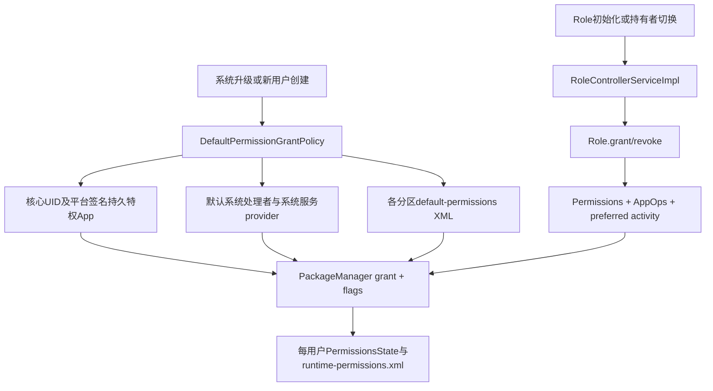
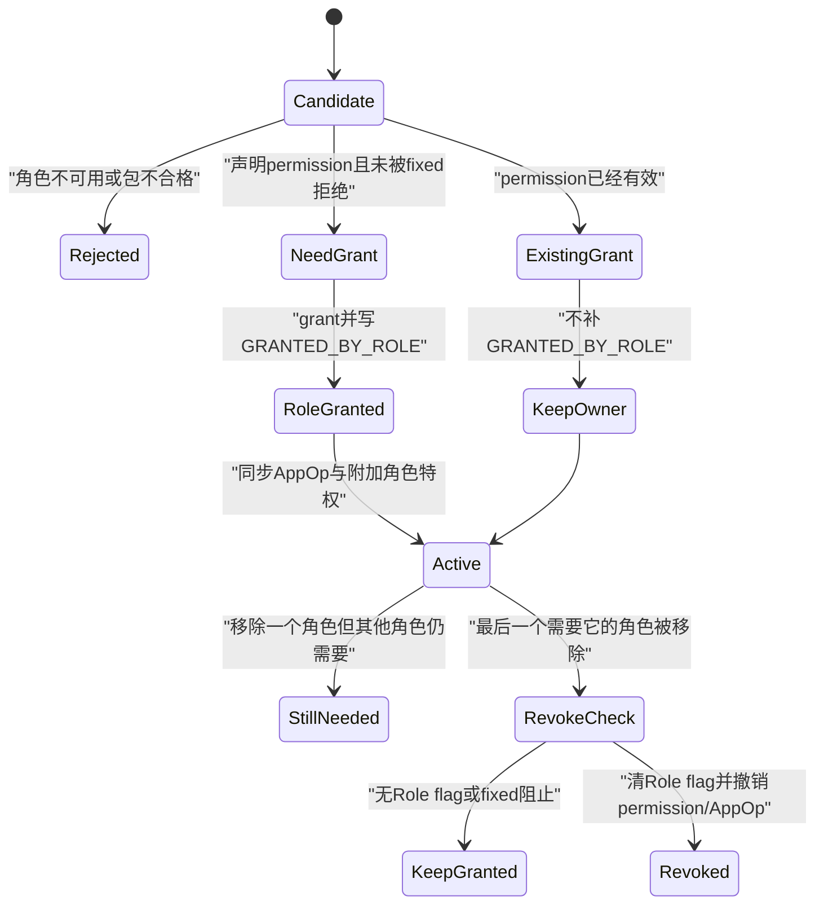
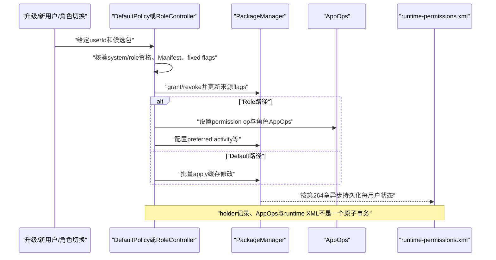

# 265 Android默认运行时权限、DefaultPermissionGrantPolicy、SystemConfig exceptions、Role授权与权限来源标志链

## 1. 本章目标

第264章解释了运行时权限怎样持久化；本章继续追“第一次开机、新建用户或选择默认电话应用时，权限为何会自动出现”。重点区分两条容易混淆的链：`DefaultPermissionGrantPolicy`负责系统预置和默认处理者授权，PermissionController的Role模型负责Dialer、SMS等角色权限及AppOps。最终要能从一个grant反推是谁授予、能否被用户撤销、角色变化后是否应回收。

## 2. 源码版本与边界

本文基于本地`android-11.0.0_r48`。Android 12以后角色、Permission模块和受限权限策略持续演化；本文特别指出的缓存行为、解析细节和事务缺口只对r48负责。练习都是macOS只读命令，不编译AOSP，也不要求连接Android设备。

## 3. 先记住两套授权器

```text
DefaultPermissionGrantPolicy：系统组件、系统默认处理者、default-permissions XML
PermissionController Role：角色持有者的permission、AppOp、preferred activity和附加行为
```

两者最终都调用PackageManager改变同一份每用户运行时权限状态，但“授权来源标志”和后续撤销规则不同。

## 4. 为什么不能统称为默认应用授权

“默认电话应用”在产品体验上是一个概念，在实现上却可能同时经过Telecom默认包provider、旧式default grant和RoleManager角色。若只看最终`CAMERA=granted`，看不出这是系统初始策略、角色、用户手动选择还是管理员策略，分析撤销时就会得出错误结论。

## 5. 本章源码地图

```text
frameworks/base/services/core/java/com/android/server/pm/permission/
    DefaultPermissionGrantPolicy.java
    PermissionManagerService.java
frameworks/base/core/java/android/content/pm/PackageManager.java
frameworks/base/services/core/java/com/android/server/telecom/TelecomLoaderService.java
frameworks/base/services/core/java/com/android/server/location/LocationManagerService.java
packages/apps/PermissionController/res/xml/roles.xml
packages/apps/PermissionController/src/com/android/permissioncontroller/role/
    model/Role.java
    model/Permissions.java
    model/*RoleBehavior.java
    service/RoleControllerServiceImpl.java
```

## 6. 五个必须分开的flag

`USER_SET`表示用户作过选择；`USER_FIXED`通常对应固定拒绝；`POLICY_FIXED`由设备策略固定；`SYSTEM_FIXED`由系统强制固定；`GRANTED_BY_DEFAULT`和`GRANTED_BY_ROLE`记录授权来源。前四个主要约束“还能不能改变”，后两个主要回答“为什么获得以及移除来源时要不要回收”。

## 7. 来源flag不是grant本身

`checkPermission()`看的是grant状态；flag是附加元数据。可能出现“当前已拒绝但仍带SYSTEM_FIXED”，也可能permission已经由用户授予而不带`GRANTED_BY_ROLE`。因此调试必须同时读取granted、flags、AppOp三层。

## 8. 默认授权的三个阶段

`grantDefaultPermissions(userId)`创建延迟写入的PackageManager包装器，依次执行：系统组件和特权持久App授权、默认系统处理者授权、产品XML例外授权，最后统一`apply()`。顺序会影响已有flag和后续来源重叠。

## 9. 总体调用图



## 10. 系统升级何时触发默认授权

`PermissionManagerService.systemReady()`遍历所有userId，仅对`isPermissionUpgradeNeeded(userId)`为真的用户调用默认策略。若没有用户需要升级，则异步预读default-permissions exceptions，避免以后创建用户时才在关键路径读多分区XML。

## 11. 新用户何时触发

`PermissionManagerServiceInternalImpl.onNewUserCreated(userId)`直接调用`grantDefaultPermissions(userId)`，随后全量更新权限。默认授权是逐用户状态，不是只给system user跑一次后让所有用户共享。

## 12. 为什么系统服务提供默认包

DefaultPermissionGrantPolicy不应自己实现Telecom或Location的业务选择。TelecomLoaderService注册SMS、Dialer、SIM Call Manager provider；LocationManagerService注册位置provider包数组。策略在授权时回调这些provider，取得该用户当前候选包。

## 13. provider未准备好会怎样

Telecom provider会先检查服务连接；尚未连接可能返回null，SIM Call Manager还会记录待处理userId。故“策略已经执行”不必然表示所有动态默认包已经拿到权限，相关服务连接后可通过专用入口补授权。

## 14. 为什么要有延迟PackageManager缓存

一次默认初始化可能对几十个包、上百项permission反复查询和更新。`DelayingPackageManagerCache`先缓存PackageInfo、grant与flags变化，最后批量应用，减少跨Binder和中间持久化开销。

## 15. 延迟不等于事务

缓存能合并操作，却没有数据库事务式的全成或全败。`apply()`逐UID、逐permission执行真实调用，捕获部分`IllegalArgumentException`后继续；若中途发生其他异常，前面已经落入PMS的修改不会自动回滚。

## 16. 第一阶段选哪些系统组件

策略枚举system user已安装或可见的包。只要appId小于`FIRST_APPLICATION_UID`，或者包是privileged、persistent且由平台签名，就按系统组件处理，授予它Manifest请求的全部runtime permissions，并打`SYSTEM_FIXED`。

## 17. 更新后的系统App怎样判断persistent

若当前包是更新过的system app，代码还检查disabled system package，也就是system image里的工厂版本是否persistent。不能仅因/data上的更新APK改变了Manifest标记，就把普通更新误当成可信核心组件。

## 18. 平台签名为何仍不单独够用

普通平台签名App若既非低appId，又非privileged+persistent，不进入这条“全runtime权限固定授予”路径。这里是多个条件共同收窄攻击面，不是看到platform signature就无条件全授。

## 19. READ_PRIVILEGED_PHONE_STATE的兼容处理

特权App若请求`READ_PRIVILEGED_PHONE_STATE`，策略还会固定授予普通runtime的`READ_PHONE_STATE`。这是把特权电话状态能力和运行时权限模型衔接起来，不代表所有privileged App都获得整组PHONE权限。

## 20. `isSystemPackage`是另一层分类

后续默认处理者辅助函数要求包位于system image，但特意排除刚才的核心系统组件。原因是核心组件已经在第一阶段“全部固定授权”，默认处理者阶段主要处理可替换的系统App，二者不能机械当作同一个集合。

## 21. 默认处理者有哪些

策略覆盖安装器、验证器、Setup Wizard、相机、录音、媒体/下载/存储provider、Dialer、SMS、日历、联系人、浏览器、语音、位置、音乐、Home、Watch和打印等。每类权限集合及fixed程度不同，不存在一个通用的“默认App权限包”。

## 22. 权限集合只是候选

PHONE、CONTACTS、SMS、CAMERA、MICROPHONE、LOCATION、STORAGE等静态集合只说明策略愿意授予什么；最终仍要与目标APK当前Manifest实际请求列表相交。未声明的permission不会凭策略凭空加入包。

## 23. 普通默认处理者为何常不system-fixed

Dialer、SMS等可由用户替换。初始授予通常带`GRANTED_BY_DEFAULT`但不带`SYSTEM_FIXED`，因此用户仍可在权限页面撤销。安装器、验证器、核心provider等系统不可缺能力则更常固定。

## 24. 浏览器的特殊位置权限

DefaultPermissionGrantPolicy会给默认浏览器前台位置权限；`roles.xml`中的Browser角色本身没有permission列表。于是“浏览器得到位置”不能简单归因于Browser Role，必须沿具体授权入口和flag核实。

## 25. 动态默认处理者专用入口

策略暴露给默认SIM Call Manager、默认浏览器、Use Open Wi-Fi App等单独的grant方法。系统运行期间默认对象变化时可定向补权限，不必重跑所有用户的完整默认初始化。

## 26. 更新system app的工厂基线

正常默认授权对updated system app会取工厂版本请求权限作为安全基线：只有工厂APK也请求的权限才自动授予。这样/data更新不能只靠新增一个危险权限声明，就继承“系统默认应用”的自动授权特权。

## 27. `ignoreSystemPackage`改变什么

某些路径允许忽略工厂基线，直接按当前包声明处理，主要用于用户明确选择的默认电话/SMS等场景。这个参数还会影响是否越过USER_SET/USER_FIXED，因此名字看似只与system package有关，实际语义更宽，阅读调用点必须谨慎。

## 28. split permission也会扩展

若包targetSdk较旧，策略按平台split-permission表把旧权限展开为新增权限，再参与授权。它保证旧App在平台把一个能力拆成多项后仍能维持兼容，不等于新targetSdk App可借旧名自动获得新权限。

## 29. 预期的前后台排序

背景位置权限只有在前景位置已授予时才合理。DefaultPermissionGrantPolicy构造了把foreground放前面的`sortedRequestedPermissions`，表达了正确意图。

## 30. r48排序实现的实际问题

后续for循环却遍历原始`requestedPermissions`，构造出的排序数组再未使用。因此不能从变量名推断r48真正保证了前景先于背景；这是本章复读源码时确认的死代码边界。

## 31. fixed flag检查矩阵

默认授权通常跳过`USER_SET`、`USER_FIXED`、`POLICY_FIXED`和已有`SYSTEM_FIXED`。允许override时可越过用户选择；系统固定授权可调整自己管理的system-fixed状态；但`POLICY_FIXED`始终优先，不应被产品默认策略覆盖。

## 32. 用户拒绝为何通常受保护

若用户曾主动拒绝并留下USER_SET或USER_FIXED，普通开机重跑默认策略不会重新grant。否则每次升级都能把用户关闭的麦克风、位置重新打开，“运行时权限由用户控制”将失去意义。

## 33. 默认角色兜底为何可能override

RoleController为缺失的默认/后备Dialer、SMS持有者授权时会传`overrideUserSetAndFixed=true`。源码TODO承认静默覆盖用户决定并不理想，但为避免设备失去通话或短信基本能力，r48仍保留此行为。

## 34. restricted permission白名单

授予hard/soft restricted权限前必须加入相应exemption。默认策略在需要时设置`FLAG_PERMISSION_RESTRICTION_SYSTEM_EXEMPT`；Role工具则主要为系统Dialer/SMS相关CallLog和SMS权限维护system whitelist。白名单只允许grant，不等于permission已经grant。

## 35. 新flag怎样组成

默认授权至少加入`GRANTED_BY_DEFAULT`，若调用者要求固定再加入`SYSTEM_FIXED`；受限权限可能再带system exemption。真实grant与flag写入是两步，调试中看见grant成功却flag更新异常，要继续检查延迟缓存。

## 36. 已经grant时还会怎样

权限已授予并不表示策略完全跳过；它仍可能补来源、fixed或restriction flag。反过来，角色工具对“已经有效授予”的permission通常不补`GRANTED_BY_ROLE`，用来保存原有用户或default来源，这一点与默认策略不能混写成同一规则。

## 37. 固定与非固定来源冲突

源码注释规定：同一permission既有fixed默认来源又有non-fixed默认来源时，较弱的non-fixed应胜出，即清掉SYSTEM_FIXED，让用户仍可控制。因为没有来源引用计数，策略只能靠执行顺序和flag修正近似表达。

## 38. 延迟缓存不能正确清bit的疑点

`DelayingPackageManagerCache.updatePermissionFlags()`只做`newFlags |= flagValues & flagMask`，没有先按mask清除旧位。于是调用者想清SYSTEM_FIXED时，缓存内可能仍保留该位；`apply()`虽支持清位，前面的缓存状态却没算出清除结果。这是r48值得重点核对的实现缺口。

## 39. exemption flag可能串到后项

默认grant核心循环把`newFlags`定义在permission循环外，处理某项时又把已有restriction exemption OR进去。后续permission可能继承前一项的exemption bits，即使后项自身原来没有。这不会自动grant受限权限之外的能力，但会污染来源元数据。

## 40. 第三阶段：产品例外XML

设备厂商可用`default-permissions/*.xml`为特定system package列出危险权限，并配置`fixed`等属性。它适合无法由通用“默认处理者”规则表达的预装系统功能，但不是给任意第三方App偷偷预授权的通道。

## 41. XML搜索哪些分区

代码依次收集system、vendor、odm、product、system_ext下的`etc/default-permissions`；OEM目录只在embedded设备特性下加入。只处理可读、后缀为`.xml`的文件。

## 42. 文件顺序有没有稳定保证

每个目录通过`listFiles()`枚举，r48没有在这里显式排序。若多个文件对同一包同一permission给出不同fixed意图，不应依赖文件名字典序决定结果；产品配置应避免冲突。

## 43. XML中的包必须满足什么

包必须存在于system image并符合system package条件，targetSdk还要高于Lollipop MR1；每个permission在解析/应用时必须是dangerous。普通/data第三方包即使同名，也不能仅凭该XML获得默认授权。

## 44. 一个简化例外

```xml
<exceptions>
    <exception package="com.example.systemfeature">
        <permission name="android.permission.CAMERA" fixed="false" />
    </exception>
</exceptions>
```

`fixed=true`意味着加入SYSTEM_FIXED，用户不能正常控制；产品文件中的固定授权应经过严格安全评审。

## 45. `whitelisted`属性的真实传参

解析出的`whitelisted`被传到grant核心的`ignoreSystemPackage`位置，而受限权限system exemption又由另一个固定为true的参数控制。因此它不只是“把restricted permission加入白名单”，还可能放宽工厂基线并允许越过用户set/fixed；属性名很容易误导。

## 46. 证书摘要属性的边界

部分产品XML示例带`sha256-cert-digest`，但本类的r48解析器没有读取或校验证书摘要。安全约束主要来自“目标必须是system image包”；不能声称DefaultPermissionGrantPolicy在这里完成了证书digest核验。

## 47. 标签判断的宽松实现

permission子标签判断使用`TAG_PERMISSION.contains(parser.getName())`而不是相等比较。正常配置仍写`permission`，但从严格解析角度看，某些恰好是该字符串子串的异常标签也可能被接受。

## 48. 默认撤销的前提

`revokeRuntimePermissions()`只处理当前包确实请求、且带`GRANTED_BY_DEFAULT`的项。它拒绝越过POLICY_FIXED；只有调用者明确允许systemFixed时才撤销SYSTEM_FIXED项。

## 49. 撤销只清哪个来源位

执行revoke后只清`GRANTED_BY_DEFAULT`，并不顺手清SYSTEM_FIXED。于是可能留下“denied + SYSTEM_FIXED”，表示该权限仍被系统固定在拒绝态，而不是恢复成用户可自由grant的普通状态。

## 50. 为什么没有来源引用计数

flags只是bit，不记录“默认Dialer规则A”和“XML规则B”各占一次。源码注释要求system-fixed授予者尽量唯一；若多个来源交叠，撤销一个来源时无法像引用计数那样准确知道另一个是否仍需要grant。

## 51. 角色模型解决的不只是permission

`roles.xml`还能声明AppOp permission、裸AppOp、preferred activities、排他性、可请求性、默认和fallback holder、所需组件及behavior类。角色是“系统职责包”，运行时permission只是其中一类特权。

## 52. Dialer角色包含什么

Android 11的Dialer角色通常汇集PHONE、CONTACTS、SMS、MICROPHONE、CAMERA等权限集，并配置电话相关AppOps和Intent首选项。具体授予仍要求持有者Manifest请求相应permission。

## 53. SMS角色包含什么

SMS角色覆盖PHONE、CONTACTS、SMS、STORAGE、MICROPHONE、CAMERA，还含`write_sms`、后台执行、设备标识等AppOps和preferred activities。把它理解为“只给READ_SMS/RECEIVE_SMS”会漏掉角色承担的完整职责。

## 54. Browser角色为什么看起来很轻

roles.xml中的Browser没有权限集合，主要通过能够处理全部Web URI、preferred resolution等资格与系统行为成为默认浏览器。它需要的某些默认权限可能来自DefaultPermissionGrantPolicy，而不是Role permission清单。

## 55. 角色持有者先要通过资格检查

通用Role逻辑检查包存在、启用、不是instant app、不是声明shared-library的包，并验证角色要求的Activity/Service/Provider组件；`systemOnly`角色还要求system app。具体behavior可再覆盖可用性与资格。

## 56. Browser怎样判断资格

BrowserRoleBehavior用HTTP、BROWSABLE Intent查询`MATCH_ALL`候选，并只接受`ResolveInfo.handleAllWebDataURI=true`的包。若未指定holder且恰好只有一个合格浏览器，它可作为fallback。

## 57. Dialer角色何时可用

DialerRoleBehavior要求设备`isVoiceCapable()`，并在UI中标识系统Dialer。它还用加密未解锁提示mixin给用户确认信息；角色存在于配置不代表任何设备、任何用户上都可用。

## 58. SMS角色何时不可用

工作资料和restricted profile不提供SMS角色；普通设备还要求`isSmsCapable()`。汽车存在配置例外：即使能力报告不支持SMS，只要配置了默认holder，角色仍可用。

## 59. SMS fallback的安全边界

优先取配置的默认holder；若没有，r48会取第一个合格包。源码TODO明确警告，这可能让第三方App突然成为默认SMS并获得敏感权限，因此产品应配置可信默认包，而不是依赖候选顺序。

## 60. Role.grant的五类动作

`Role.grant()`先授予permission，再设置AppOp-permissions、裸AppOps、preferred activities，最后执行behavior特权。任何一项变化都可能构成角色切换的副作用；只查看runtime permission列表不足以判断旧holder是否完全失去角色能力。

## 61. 角色权限怎样与Manifest相交

`Permissions.grant()`先展开split permissions，再只保留角色清单和当前APK `requestedPermissions`的交集。roles.xml表达角色上限，Manifest表达该包请求意愿；缺少任一边都不会grant。

## 62. Role为什么忽略工厂APK基线

Role调用`Permissions.grant()`时传`overrideDisabledSystemPackage=true`。角色持有者可能是用户安装的第三方包，也可能是更新系统App；既然用户或系统明确让“当前版本”承担角色，就按当前Manifest而非disabled工厂APK裁剪。

## 63. Role的前后台排序是真正生效的

角色工具构造`sortedPermissionsToGrant`后确实遍历该数组：前景permission放前部，background放后部。它与第30节默认策略的死排序形成鲜明对比，阅读相似代码时不能只凭结构类比。

## 64. 有效grant不只看PackageManager

角色工具判断permission是否有效时，同时看runtime grant、review-required flag和对应AppOp。前景AppOp为`MODE_ALLOWED`或`MODE_FOREGROUND`可视为有效；背景能力要求前景op达到`MODE_ALLOWED`，因为`MODE_FOREGROUND`只在前台放行。

## 65. 背景权限的额外守门

准备授予background permission时，代码查它对应的foreground permissions；至少一项已有效grant才继续。即使排序正确，若前景因POLICY_FIXED拒绝或AppOp不允许，背景也不会被孤立授予。

## 66. Role怎样处理fixed拒绝

普通用户发起的角色选择可以按调用参数决定是否override USER_SET/USER_FIXED；POLICY_FIXED永远阻止修改，SYSTEM_FIXED也不能被普通Role越过。默认/fallback补位的override主要针对用户标志，而不是管理员政策。

## 67. 新授予时怎样写flag

若permission原本没有有效授予，Role执行grant，并设置`GRANTED_BY_ROLE`；若允许override，还会通过mask清USER_SET和USER_FIXED。Role来源因此能在角色移除时被定向识别。

## 68. 已有grant为何不补Role flag

若用户早已手动授予，或DefaultPermissionGrantPolicy已经使它有效，Role不会再添加`GRANTED_BY_ROLE`。这样移除角色时不会把角色并未真正提供的用户/default grant一并撤销。

## 69. 这也不是完整来源账本

“已有grant不加role位”减少误撤销，却无法记录角色也依赖该权限。若default来源以后先撤销，权限可能被收回，即便包仍持有角色；角色刷新会再评估，但两次操作间可出现顺序敏感窗口。

## 70. permission与AppOp怎样同步

许多危险权限有对应AppOp。Role grant不仅调用PackageManager grant，还把AppOp调到合适模式；前景权限通常对应foreground能力，背景权限可能把同一op提升到ALLOWED。最终能力是两者共同结果。

## 71. 没有AppOp时的changed返回疑点

`grantPermissionAndAppOp()`先可能成功改变permission，随后若查不到对应AppOp却直接返回false；即使存在AppOp，赋值而不是OR也会让“permission改变、AppOp未改变”被报告为false；revoke无AppOp时也有类似问题。真实状态已经改变，但上层“是否变化”的布尔值可能丢失，进而影响是否主动kill旧进程等后续决策。

## 72. AppOp permission与裸AppOp

角色模型把两者分开：AppOp permission先围绕某个permission及其op处理，裸AppOp则可直接按operation name设置模式。不能从`dumpsys package`的permission flags推导角色附带的所有AppOps。

## 73. preferred activity的意义

角色可把相应Intent resolution配置给holder，例如让电话或短信Intent稳定落到默认应用。这是PackageManager的解析偏好，不是权限；即使runtime permission都相同，preferred activity仍会改变用户操作流向。

## 74. 角色授权状态图



## 75. Role.revoke先查询其他角色

移除holder前，`Role.revoke()`从RoleManager取得该包仍持有的其他角色，把那些角色需要的permissions、AppOp permissions和裸AppOps从待撤列表减掉。这是角色之间的集合保护，避免从Dialer移除时破坏仍由另一个角色要求的能力。

## 76. 只撤Role真正授予的permission

调用`Permissions.revoke(... onlyIfGrantedByRole=true)`后，每项先检查`GRANTED_BY_ROLE`。没有该位，就认为权限来源属于用户、default或其他机制，不因角色消失而revoke。

## 77. 撤销时先清来源位

代码先清`GRANTED_BY_ROLE`，再检查当前grant与fixed条件。这样即使POLICY_FIXED或SYSTEM_FIXED阻止实际revoke，角色来源也已移除，剩余固定状态由对应政策负责。

## 78. 为什么先撤background

revoke排序把background permission放前面。否则先撤前景但背景仍grant会产生非法中间态；撤掉背景后，对应前景AppOp可从ALLOWED降为MODE_FOREGROUND，而不必立刻完全关闭前台访问。

## 79. 前景为何可能暂不撤

若对应background permission仍有效，前景permission必须保留，Role revoke会跳过它。这体现权限依赖方向：背景建立在前景之上，不能留下只有背景、没有前景的状态。

## 80. restricted白名单怎样回收

Role撤销系统restricted permission时，只有该permission不再带`GRANTED_BY_DEFAULT`才移除system whitelist。若default仍是来源，保留exemption；这是一处显式处理default与role重叠的保护。

## 81. preferred activity为何没有撤销

`Role.revoke()`在r48明确留下TODO，没有清理preferred activities。注释理由包括多数角色有fallback holder，以及清理会触发其他系统组件的preferred activity变化监听。新holder grant会重配，但短暂或失败路径需谨慎分析。

## 82. 何时kill应用

Role revoke在permission或对应AppOp被报告改变、且调用者没有要求`dontKillApp`时显式kill包。Role grant的显式kill还多一个条件：目标不支持M起的runtime permission模型，也就是主要照顾legacy App；现代App的权限变更由平台正常权限语义处理。再加上第71节changed返回可能漏报，不能把“代码有kill分支”理解成每次状态变化必然由Role类主动kill。

## 83. RoleController启动时做什么

控制器发布可用角色，并逐个检查已有holder是否仍合格。合格者重新grant以修复缺失特权，但传`overrideUserSetAndFixed=false`，所以用户仍可撤销角色授予的runtime permission；不合格者被移除。

## 84. 没有holder怎样补位

先找角色配置的default holder，再找behavior给出的fallback。候选仍必须通过资格检查。若成功补位，以override模式授予；SMS和Dialer这类核心角色因此尽量不会长期空缺。

## 85. 排他角色怎样收敛

若exclusive角色意外有多个holder，初始化会保留RoleManager返回列表中的第一个，移除其余。这里的“第一个”是当前存储/返回顺序，不应被产品当作稳定优先级算法。

## 86. 用户添加holder的主链

服务先验证调用flags、角色存在与可用、目标包合格；排他角色先移除当前holder；然后调用`role.grant()`，最后才调用`RoleManager.addRoleHolderFromController()`写holder记录。

## 87. 用户移除holder的主链

服务先调用`role.revoke()`回收特权，再调用`removeRoleHolderFromController()`删除holder记录，之后必要时添加fallback。授权状态和角色记录不是在同一个原子事务中修改。

## 88. 添加失败的事务缺口

若permission/AppOps已经grant，但`addRoleHolderFromController()`返回失败，没有回滚刚才特权。最终可能是“数据库没有holder，包却暂时拥有角色特权”，直到后续角色刷新或其他修复路径收敛。

## 89. 移除失败的事务缺口

若特权已经revoke，但删除holder记录失败，记录仍显示它持有角色，实际能力却已缺失。下次控制器刷新可能为仍合格holder重做grant，但失败窗口真实存在。

## 90. 排他切换失败更复杂

切换exclusive角色先撤旧holder，再授新holder。若新holder写记录失败，旧holder已经被移除且权限已撤，新holder可能只拿到部分特权却没记录；不能把整次切换当作数据库事务。

## 91. Default与Role的共同终点

两条链最后都通过PackageManager APIs更新每用户permission grant/flags，并进一步影响AppOps、进程和第264章的`runtime-permissions.xml`。磁盘只保存结果，不保存完整“哪个方法在何时作了决定”的历史日志。

## 92. 两条链的关键差异表

|问题|DefaultPermissionGrantPolicy|Role模型|
|---|---|---|
|主要触发|升级、新用户、系统默认对象补权|角色初始化、添加、移除、刷新|
|来源位|GRANTED_BY_DEFAULT|GRANTED_BY_ROLE，仅新grant时写|
|工厂系统APK基线|通常限制在工厂已请求权限|角色持有者按当前Manifest|
|额外能力|主要runtime permission|permission、AppOps、preferred activity、behavior|
|移除保护|按DEFAULT位与fixed规则|按ROLE位并扣除其他角色需求|

## 93. 用户手动grant与Role的交互例子

用户先手动给App相机权限，随后把它设为Dialer。Role发现相机已经有效，不写ROLE位；以后移除Dialer，因无ROLE位而保留相机。这正是“角色不夺取用户grant所有权”的设计意图。

## 94. Default先grant再成为Role的例子

系统默认策略先给预装Dialer麦克风并写DEFAULT；Role初始化发现已有效，不写ROLE。移除Role时不撤麦克风；若后续动态默认策略撤销DEFAULT，才可能真正revoke。必须结合holder和default对象变化的顺序分析。

## 95. Role先grant再出现Default的例子

第三方Dialer通过Role新获麦克风并写ROLE；若之后某条default路径也补DEFAULT，状态可能同时带两位。由于没有来源计数，某些撤销函数只认自己的bit，留下还是回收取决于具体实现，而不能仅凭“还有另一位”作抽象推断。

## 96. SYSTEM_FIXED与来源位是正交的

`SYSTEM_FIXED`回答系统是否固定当前决定，DEFAULT/ROLE回答来源。常见组合是granted+DEFAULT+SYSTEM_FIXED，也可能denied+SYSTEM_FIXED；不要把SYSTEM_FIXED翻译为“系统已经授予”。

## 97. POLICY_FIXED为何最高优先

Device Policy代表管理员对工作设备或资料的安全要求。默认体验、角色必要性和用户选择都不能绕过它。两套授权工具都把POLICY_FIXED作为硬边界，是分析企业设备权限异常时的第一检查项。

## 98. USER_FIXED不是永久不可变

它约束普通自动授权和UI重询问，但系统在明确override路径、清除应用数据或权限重置等场景可以清理。准确说法是“当前用户选择被固定”，不是不可逆地写进APK身份。

## 99. 权限页面看到允许仍可能不可用

Role的有效grant检查提醒我们：runtime grant为true但AppOp是IGNORED，能力仍可能被挡；legacy review-required也会改变有效性。定位时应同时查看`dumpsys package`、`appops get`及角色holder，而不是只看Settings UI文案。

## 100. 权限被撤仍可能保留角色其他能力

用户可以撤销非fixed的角色runtime permission，但包仍可能是角色holder，仍保有preferred activity或某些裸AppOps。角色是多维职责，不是“把一组permission全开”的别名。

## 101. 调试一个自动grant的推荐顺序

先确认userId和包Manifest；再读grant与所有flags；检查对应AppOp；查询RoleManager holder；搜索default-permissions XML；最后检查该包是否是系统provider返回的默认对象或核心系统组件。顺序能快速缩小来源。

## 102. 不要只搜索`grantRuntimePermission`

它只能找到最终动作，找不到“为什么这个包被选中”。应向上搜索`grantDefaultPermissions`、各`PackagesProvider`、`Role.grant`和roles.xml；对AppOp还要追`setUidMode`或角色AppOp模型。

## 103. 不要把XML叫SystemConfig解析

这些文件位于多个system分区，常被宽泛称为系统配置，但本章目标类自己枚举目录并用XmlPullParser读取。除非调用链确实经过`SystemConfig`对象，否则文档应说“default-permissions分区XML”，避免误认所有etc XML都由同一单例解析。

## 104. `fixed=true`的产品风险

它不仅让首次开机方便，还会使用户不能在常规权限设置里撤销。对CAMERA、MICROPHONE、LOCATION等敏感能力，产品若没有不可替代的核心功能理由，应优先non-fixed并保留用户控制。

## 105. default exceptions的缓存范围

`mGrantExceptions`在策略对象内读取一次后跨用户复用，因为文件是设备级静态配置；实际grant仍逐userId执行。运行时修改文件既不属于正常只读system image模型，也不会自动让已缓存对象热更新。

## 106. PackageInfo缓存cork的边界

`apply()`会cork PackageInfo cache，批量执行后uncork，减少每项更新触发缓存失效传播。r48没有用`finally`包住整个解cork；若出现未捕获异常，理论上可能留下cork状态，正常成功路径则会解开。

## 107. 多用户必须逐个验证

角色holder、默认Dialer/SMS、权限grant与flags都可能按用户不同；工作资料甚至没有SMS角色。只检查user 0不能代表user 10。所有命令和日志分析都应显式记录userId。

## 108. 新用户与升级不是同一事件

新用户没有历史用户选择，运行完整默认初始化；升级用户先从磁盘恢复旧grant/flags，再仅在`isPermissionUpgradeNeeded`时重跑默认策略，并受USER_SET、fixed等旧状态约束。相同策略代码面对的初始条件不同。

## 109. 来源链与持久化链的衔接

Default或Role改变内存状态后，PermissionManager回调会安排运行时权限持久化；重启时只恢复grant和flags。RoleController仍需从角色存储恢复holder并重新核验资格、AppOps和其他特权，不能只靠runtime XML重建完整角色。

## 110. 一张端到端时序图



## 111. 阅读源码时的断言清单

每看到一个自动grant，都问六件事：目标包如何选出；是否仅限system image；工厂Manifest是否作基线；能否越过USER_SET；写DEFAULT还是ROLE；移除来源时谁负责revoke。六项答不全，就还没有真正读懂该调用点。

## 112. macOS只读练习一：追默认授权入口

执行：

```bash
rg -n "systemReady\(|onNewUserCreated|grantDefaultPermissions\(" \
  frameworks/base/services/core/java/com/android/server/pm/permission/{PermissionManagerService.java,DefaultPermissionGrantPolicy.java}
```

画出“升级用户”和“新用户”两条入口，标注何时预读exceptions、何时逐用户真正grant，并解释为什么普通开机不一定重跑所有用户。

## 113. macOS只读练习二：核对例外XML

执行：

```bash
find device vendor product -path '*/default-permissions/*.xml' -type f 2>/dev/null | head -n 20
rg -n "sha256-cert-digest|fixed=|whitelisted=" device vendor product 2>/dev/null | head -n 60
```

选一个真实exception，回到`readDefaultPermissionExceptionsLocked()`核对哪些属性真正被r48读取；特别说明证书摘要与`whitelisted`不能凭名字推断语义。

## 114. macOS只读练习三：对比两种排序

执行：

```bash
sed -n '1145,1305p' frameworks/base/services/core/java/com/android/server/pm/permission/DefaultPermissionGrantPolicy.java
sed -n '78,240p' packages/apps/PermissionController/src/com/android/permissioncontroller/role/model/Permissions.java
```

分别找到两个`sorted...`变量和真正for循环对象，证明Default路径的排序结果未使用而Role路径实际使用，并写出它对background location授权的影响边界。

## 115. macOS只读练习四：模拟角色切换

执行：

```bash
sed -n '650,790p' packages/apps/PermissionController/src/com/android/permissioncontroller/role/model/Role.java
sed -n '300,410p' packages/apps/PermissionController/src/com/android/permissioncontroller/role/service/RoleControllerServiceImpl.java
```

假设A是旧Dialer、B是新Dialer：逐步记录旧holder revoke、新holder grant、holder记录写入、fallback和kill的顺序；再分别模拟“新增记录失败”和“删除记录失败”，写出权限与holder数据库可能不一致的状态。

## 116. 常见误解一：系统预装App都会自动获得危险权限

不准确。核心组件路径有低appId或privileged+persistent+平台签名等条件；默认处理者还需属于对应系统候选并声明权限；XML exception也要求system image包和dangerous permission。仅有`FLAG_SYSTEM`不是全权限通行证。

## 117. 常见误解二：成为角色就一定打ROLE flag

不准确。只有Role实际把未有效授予的permission新grant时才写`GRANTED_BY_ROLE`；用户或default已经授予的项保留原来源。移除角色只会按ROLE位定向撤销。

## 118. 常见误解三：SYSTEM_FIXED就是系统授权

不准确。它表示系统固定当前状态，可与granted或denied组合。真正来源还要看DEFAULT/ROLE等位，真正可用性还要结合AppOp和review状态。

## 119. 复读后补上的r48窄边界

第一，Default策略构造前后台排序却遍历原列表；第二，延迟flag缓存只OR不清bit，使清SYSTEM_FIXED意图可能失效；第三，循环外`newFlags`可能把restriction exemption带到后项；第四，exception的`whitelisted`被当成更宽的override参数，证书摘要未在本类校验，标签判断还用了`contains`；第五，Role变更先改特权再改holder记录，没有失败回滚，且无AppOp permission的changed返回可能漏报。

## 120. 本章小结与下一章

Android 11的自动授权不是单一白名单：DefaultPermissionGrantPolicy在升级、新用户和动态默认对象场景中，为核心组件、系统处理者和分区XML例外写`GRANTED_BY_DEFAULT`及可选SYSTEM_FIXED；PermissionController Role则按holder资格，用当前Manifest授予新能力并写`GRANTED_BY_ROLE`，同时管理AppOps、preferred activity和behavior。用户、系统、管理员与两种来源flag彼此正交，又因缺少完整来源引用计数和跨服务事务而存在顺序边界。下一章进入第266章：权限组、前景/背景位置、AppPermissionGroup模型、一次请求为何拆成多种授权状态，以及PermissionController UI怎样组织组级决策。
