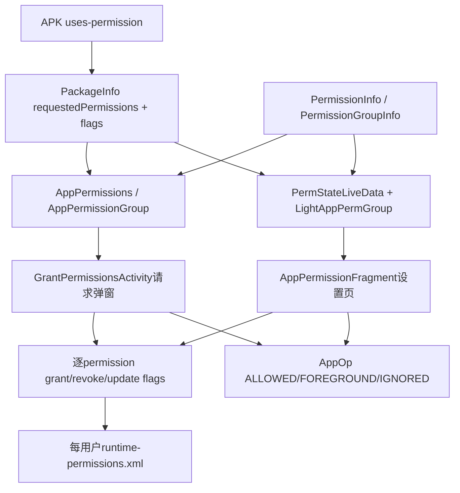
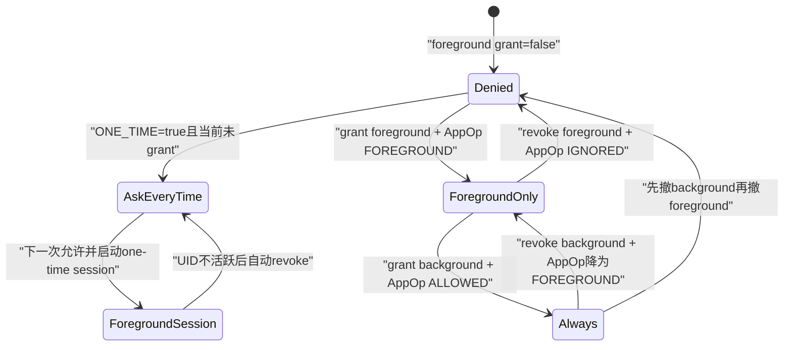
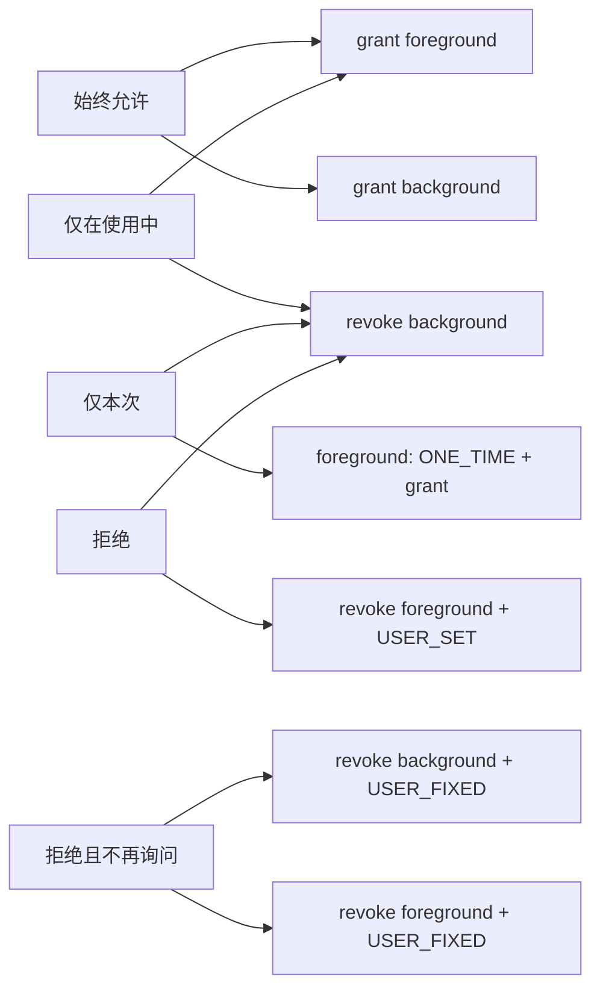

# 266 Android权限组、AppPermissionGroup、前景/背景权限、组级UI与逐permission持久状态链

## 1. 本章目标

第263章追过一次运行时请求，第265章又解释自动授权来源；本章专门拆开“用户看到一个权限组按钮，系统内部却保存多项permission”的中间模型。重点读懂`Permission`、`AppPermissionGroup`、`LightAppPermGroup`、前景/背景子组、AppOps有效状态，以及请求弹窗和设置页怎样把组级选择翻译成逐项grant、revoke与flags。

## 2. 源码版本与学习边界

本文基于本地`android-11.0.0_r48`。Android 12以后精确/模糊位置、仅本次授权UI和权限模型继续变化；本章按钮矩阵、R目标版本分流与实现疑点只对r48负责。所有练习均为macOS只读命令，不编译AOSP。

## 3. 第一条核心结论

权限组主要是用户体验和策略聚合单位，不是PackageManager持久化中的单一grant位。一个组内每个permission仍各有`granted`、USER_SET、USER_FIXED、DEFAULT、ROLE、restriction等flags，并可能共享或关联AppOp。

## 4. 第二条核心结论

“允许”“仅在使用中允许”“始终允许”“每次询问”“拒绝”不是底层枚举。UI把它们翻译成前景permission、背景modifier permission、ONE_TIME flag和AppOp mode的组合。

## 5. 本章源码地图

```text
packages/apps/PermissionController/src/com/android/permissioncontroller/permission/
  model/Permission.java
  model/AppPermissionGroup.java
  model/AppPermissions.java
  model/livedatatypes/{LightPermission,LightAppPermGroup,PermState}.kt
  data/{PermStateLiveData,LightAppPermGroupLiveData}.kt
  utils/KotlinUtils.kt
  ui/GrantPermissionsActivity.java
  ui/model/AppPermissionViewModel.kt
  ui/handheld/AppPermissionFragment.java
frameworks/base/core/res/AndroidManifest.xml
```

## 6. 两套UI模型先分清

运行时`requestPermissions()`弹窗主要构造Java版`AppPermissions/AppPermissionGroup/Permission`；系统设置中的单App权限页主要观察Kotlin轻量模型`LightAppPermGroup/LightPermission`，由`AppPermissionViewModel`和`KotlinUtils`修改。它们表达相同平台状态，却不是同一个对象树。

## 7. 为什么需要两套模型

请求弹窗要按一批显式permission顺序展示、保存GroupState并立即返回结果；设置页要长期响应包、permission和策略变化，适合LiveData快照。不能因类名相似就把一个类的方法调用套到另一条UI链上。

## 8. 总体对象与数据流



## 9. Permission对象装了什么

Java `Permission`保存PermissionInfo、name、背景permission名、AppOp名、grant、AppOp允许态、flags、instant/runtime-only属性，以及前景与背景Permission对象的链接。它是PermissionController内存快照，不是system_server的权威`BasePermission`。

## 10. grant与有效grant不同

`isGranted()`只读permission grant；`isGrantedIncludingAppOp()`还要求关联AppOp允许且没有REVIEW_REQUIRED。于是Settings UI显示的“已允许”更接近功能是否可用，而非仅看PackageManager位。

## 11. background permission是什么

前景permission的`PermissionInfo.backgroundPermission`指向背景modifier。例如FINE/COARSE LOCATION都指向`ACCESS_BACKGROUND_LOCATION`。背景permission对象反向保存它修饰的一个或多个foreground Permission。

## 12. 背景不是独立资源组

`ACCESS_BACKGROUND_LOCATION`本身不代表另一种传感器；它修改已授予位置权限在App退到后台后的可用范围。没有前景位置基础，单独背景grant不应产生有意义能力。

## 13. AppPermissionGroup装了什么

它代表“某包、某用户请求的某权限组”，包含组名、声明包、label、图标、请求文案、目标包信息及Permission Map。背景permission不放在主Map，而是放进同名的`mBackgroundPermissions`子组。

## 14. 主组与背景子组的关系

主组保存普通和foreground permissions；背景子组只保存background permissions。对主组调用grant/revoke不会自动操作背景子组，调用者必须显式分别处理，这正是“仅在使用中”和“始终允许”能被区分的基础。

## 15. `hasPermissionWithBackgroundMode`不等于请求背景

只要组内某个已请求前景permission在PermissionInfo中声明了backgroundPermission，这个位就为true；目标App可能并未在Manifest请求那个背景permission。UI可因此显示前景模式，但不能让它获得未声明的背景能力。

## 16. `getBackgroundPermissions()!=null`才说明什么

只有目标包实际请求了背景permission、对象又成功进入模型时，才创建背景子组。位置组有背景模式但背景子组为null，表示App最多只能获得前景访问。

## 17. AppPermissions怎样去重组

它遍历目标包`requestedPermissions`，若某permission尚未在permission→group缓存中，就从它创建整个组；随后把主组和背景子组的每个permission都写入缓存。后续遇到同组permission便不会重复建组。

## 18. 三张索引各做什么

`mGroups`只列主组；`mGroupNameToGroup`按组名找主组；`mPermissionNameToGroup`可指向主组或背景子组。请求`ACCESS_BACKGROUND_LOCATION`时能直接得到背景Group，而按LOCATION组名取得的仍是主组。

## 19. create只收危险权限

入口要求目标Permission已安装、未removed且base protection为DANGEROUS；建组时又只收目标APK实际请求、且属于该组的dangerous permissions。normal、signature等不进入运行时权限UI模型。

## 20. 无group的危险权限怎样展示

若PermissionInfo没有group，就把PermissionInfo本身当作groupInfo，模型仍可生成单permission“组”，label、description和图标来自该permission或默认资源。UI聚合不要求Manifest一定声明permission group。

## 21. 组信息与权限信息来自谁

平台组通常由`android`包声明，第三方也能声明自有dangerous permission/group。PermissionController加载安全label和description；但对legacy App的非平台自定义组有额外限制，避免仅靠AppOps伪装完整runtime控制。

## 22. pre-M第三方组为何被过滤

targetSdk不高于L MR1且组声明包不是`android`时，Java模型跳过其中permission；Light模型也直接给出空组。legacy App没有现代runtime permission合同，第三方自定义组通常又没有平台AppOp兼容闸门。

## 23. 初始grant从哪里读

Java模型使用`PackageInfo.requestedPermissionsFlags[i]`的`REQUESTED_PERMISSION_GRANTED`。这是一份构造时快照；包权限变化后要refresh或重建模型，不能把对象长期当成自动更新的权威状态。

## 24. 初始flags从哪里读

每项通过`PackageManager.getPermissionFlags(permission, package, user)`读取。grant与flags分开采集，随后封装到Permission，因此组内不同permission可以分别处于USER_SET、SYSTEM_FIXED或DEFAULT等状态。

## 25. Java模型怎样读取AppOp

只有平台permission才用`permissionToOp()`映射；普通/前景项raw mode为ALLOWED或FOREGROUND都先记为appOpAllowed。背景对象随后根据对应前景op是否为ALLOWED修正：ALLOWED代表连后台也可用。

## 26. 为什么前景的FOREGROUND也算allowed

对前景permission而言，MODE_FOREGROUND就是预期有效状态：App在前台可访问。对背景permission而言则不够，必须看到对应前景op为MODE_ALLOWED，才能说背景能力有效。

## 27. 受限权限怎样从组里隐藏

hard restricted且不在任何允许whitelist中的普通/前景项不加入主组；soft restricted是否显示由`SoftRestrictedPermissionPolicy`决定。请求弹窗遇到Manifest确实请求但模型里没有的项，会记录“ignored restricted permission”。

## 28. LightPermission是什么

它是不可变data class，保存轻量包信息、轻量PermissionInfo、功能grant、flags和前景permission名列表，并派生policy/system/user fixed、one-time、DEFAULT、ROLE、restricted、auto-revoked等布尔值。每次修改返回新对象而非就地改字段。

## 29. PermStateLiveData的输入

它合并LightPackageInfo和组元数据，逐项读取PackageInfo grant flag及PackageManager permission flags，并监听该UID的permission变化。输出仍是`permissionName -> PermState`，不是一个组布尔值。

## 30. Light模型“including AppOp”的实际边界

字段名写`isGrantedIncludingAppOp`，但r48的`PermStateLiveData.loadDataAndPostValue()`没有现场查询AppOps，只用PackageInfo grant并排除REVOKED_COMPAT。对PermissionController自己保持同步的常规状态通常成立；若外部单独改AppOp，LiveData快照可能不能完整反映即时有效性。

## 31. Java模型与Light模型的差别不能忽略

Java创建路径显式读取raw AppOp，Light数据路径主要依赖permission状态和compat flag。分析设置页显示异常时，应沿实际Light LiveData查；分析请求弹窗时再看Java AppPermissionGroup，不能拿一条路径的读取保证替另一条背书。

## 32. LightAppPermGroup怎样拆子组

先从每个前景PermissionInfo收集`backgroundPermission`名字；Map key若不在这批背景名字中就归foreground，背景名字存在于Map的项归background。前景和背景各生成`AppPermSubGroup`。

## 33. 子组的“已授予”也是any

`AppPermSubGroup.isGranted`使用`permissions.any { isGrantedIncludingAppOp }`，Java版`areRuntimePermissionsGranted()`也只要任一项有效便返回true。组级“允许”不是所有成员全为grant，特别在允许单项控制的产品上要看明细。

## 34. 组flag查询也是any或OR

`isUserFixed()`、`isPolicyFixed()`、`isSystemFixed()`等只要组内一项命中就为true，`getFlags()`更是把所有项flags按位OR。它适合保守禁用组级按钮，却会丢失“究竟是哪一项fixed”的精度。

## 35. individually controlled开关

只有产品overlay打开`config_permissionsIndividuallyControlled`时，SMS、PHONE、CONTACTS组的指定permission才支持单项细控；AOSP默认false。此时组页显示已撤销数量并提供进入“All permissions”明细页的链接。

## 36. 组级UI为何仍可能是混合态

即使默认产品按组控制，历史升级、策略固定、默认授权或单项API都可能让组内状态不齐。UI用any、fixed合并和详情文案近似表达，底层从未禁止同组成员状态不同。

## 37. 功能状态组合图



## 38. 普通组的允许

没有background模式时，现代App grant对应permission，并把关联AppOp设为ALLOWED；设置USER_SET、清USER_FIXED、ONE_TIME、AUTO_REVOKED和REVIEW_REQUIRED。UI显示一个普通“允许”。

## 39. 仅在使用中允许

主组前景permission为grant，对应AppOp为MODE_FOREGROUND；背景permission未grant。ActivityManager/AppOps根据UID进程状态动态放行，所以“使用中”不是PermissionController持续轮询前后台。

## 40. 始终允许

先确保前景permission grant，再grant背景modifier，并把对应前景AppOp提升到MODE_ALLOWED。背景permission可能没有独立AppOp名，但它通过反向链接修改一个或多个前景ops。

## 41. 从始终允许降级到使用中

撤销背景permission时不撤前景grant，而把仍有效的前景op降到MODE_FOREGROUND。用户继续在前台使用资源，后台访问被切断。

## 42. 完全拒绝

撤销前景permission并把普通/前景AppOp设为IGNORED；若同时有背景，调用者通常先撤背景再撤前景。否则短暂留下背景grant配无前景基础的非法中间组合。

## 43. 每次询问的真实状态

设置页点击“每次询问”调用`REVOKE_BOTH`，前景revoke时传`oneTime=true`：当前permission是拒绝态、ONE_TIME置位、USER_SET清除。下次App请求可再次展示；它不是“永久保持grant但每次访问弹窗”。

## 44. 仅本次允许的真实状态

运行时弹窗选择one-time时先给前景permission设置ONE_TIME，再grant前景，背景保持拒绝。PermissionManager启动一次性会话；UID不再满足活跃条件后由第263章的one-time服务撤销。

## 45. 同一个ONE_TIME为何有两种表象

会话内是`granted=true + ONE_TIME`，设置页可能显示已选中的“每次询问/本次”；会话结束后是`granted=false + ONE_TIME`，表示下次再问。第264章落盘还会把一次性grant强制序列化为denied，避免重启复活。

## 46. Camera和Microphone的前台特殊UI

r48源码TODO承认它们尚未真正像Location那样建背景modifier，设置页仍将其视为foreground-only特殊组。普通App显示“仅在使用中”，具备特定前台外能力的助手、carrier、sound trigger等可显示“始终允许”式文案，这是UI/能力策略映射，不是新背景permission。

## 47. foreground-capable App为什么改按钮

某些系统职责即使只持有前景permission，也可能在App看似后台时因服务身份或系统规则继续访问。ViewModel隐藏无意义的foreground选项、禁用ask，并用详情解释，以免界面承诺一个系统无法严格提供的边界。

## 48. 特殊Location provider的组状态

系统位置provider或额外location controller包的组级grant不直接由逐permission决定，而映射到位置开关或controller启用状态。Java `areRuntimePermissionsGranted()`和Light LiveData都设有此特殊分支。

## 49. 这不代表permission位不存在

特殊包仍有Manifest和permission状态；只是UI回答“该系统组件现在是否可用”时优先采用系统功能开关。调试底层访问失败仍应分别检查位置总开关、permission、AppOp和provider身份。

## 50. Storage为何又是三态

Android 11的Storage设置页把普通媒体权限与`MANAGE_EXTERNAL_STORAGE`的全文件访问AppOp组合展示。后者通过`OPSTR_MANAGE_EXTERNAL_STORAGE`设ALLOWED或ERRORED，不是传统runtime group成员；不能把“所有文件”当成READ/WRITE_EXTERNAL_STORAGE的背景模式。

## 51. Java模型的grant算法

逐项过滤目标permission，跳过instant/runtime-only等不允许项；现代App遇SYSTEM_FIXED即停止，先把模型AppOp设允许，再设grant和用户flags。legacy App保持permission grant，只切AppOp和REVOKED_COMPAT，并可能kill UID让旧进程重新取状态。

## 52. grant的USER_SET规则

`setByTheUser=true`且不是fixedByUser时设置USER_SET并清USER_FIXED；fixedByUser路径反而设USER_FIXED、清USER_SET。正常“允许”不会fixed，运行时弹窗的`doNotAskAgain`只在拒绝分支实际有意义。

## 53. Java模型的revoke算法

现代App清grant；普通拒绝设USER_SET、清USER_FIXED，“不再询问”则清USER_SET、设USER_FIXED；有关AppOp的项标为不允许。legacy App不清install-time grant，只切AppOp并设REVOKED_COMPAT。

## 54. system-fixed为何直接阻止

grant/revoke循环见到SYSTEM_FIXED会把结果标为未全部成功并`break`。PermissionController不应通过普通用户UI修改第265章系统固定状态；UI通常预先禁用按钮，模型仍做最后防线。

## 55. break带来的部分修改边界

如果组内前面的permission已在内存模型改变，后面才遇SYSTEM_FIXED，循环不会回滚前项；非delay模式仍会`persistChanges()`。因此方法返回false不代表“什么都没改”，组内混合fixed状态可能产生部分提交。

## 56. filterPermissions为何重要

请求弹窗只应处理本次请求及兼容扩展出的affected permissions，不应无条件改变组内所有成员。grant/revoke都接收过滤数组；设置页组级按钮才通常遍历完整foreground或background子集。

## 57. AppOp为什么在grant前准备

Java注释要求先启用AppOp再grant，避免permission已grant而op仍拒绝的短暂状态。由于两次跨服务调用仍不是原子事务，这只是缩短/选择更安全的中间态，不是事务保证。

## 58. allowAppOp的三种分支

普通permission设ALLOWED；有背景能力的foreground在背景未grant时设FOREGROUND、已grant时设ALLOWED；background permission则把已授予的关联foreground ops提升为ALLOWED。

## 59. disallowAppOp的三种分支

普通和foreground设IGNORED；background不把前景完全关闭，而把仍grant的foreground ops降为FOREGROUND。AppOp mode因此承担“能力范围”，permission grant承担“是否具备基础资格”。

## 60. 设置页KotlinUtils的对应关系

它不修改Java Permission对象，而是立刻调用PackageManager和AppOps，计算新flags并返回新的LightPermission/LightAppPermGroup快照。多项操作仍按循环顺序逐个提交，最后LiveData监听真实平台变化再刷新UI。

## 61. Kotlin grant清哪些flag

设置页明确grant时清REVOKED_COMPAT、REVIEW_REQUIRED、USER_FIXED、ONE_TIME和AUTO_REVOKED，并设USER_SET。它不会清DEFAULT、ROLE、SYSTEM_FIXED或restriction exemption，因为`PERMISSION_CONTROLLER_CHANGED_FLAG_MASK`没有包含这些来源/策略位。

## 62. Kotlin revoke怎样表达拒绝

普通拒绝清USER_FIXED、设USER_SET、清ONE_TIME；“每次询问”则清USER_SET、设ONE_TIME；若要求“不再询问”才设USER_FIXED。无论哪种用户动作都清AUTO_REVOKED，说明新状态来自当前交互而非旧自动撤销。

## 63. policy-fixed为何主要由UI挡

Kotlin单项grant/revoke只在内部硬挡SYSTEM_FIXED，没有再次检查POLICY_FIXED；`AppPermissionViewModel`先通过`isForegroundFixed/isBackgroundFixed`阻止生成change。分层意味着不能绕过ViewModel私自把KotlinUtils当成公开无条件安全API。

## 64. Java persistChanges做什么

对每项把模型grant同步到PackageManager，按mask更新USER_SET、USER_FIXED、REVOKED_COMPAT、POLICY_FIXED、REVIEW_REQUIRED、ONE_TIME和AUTO_REVOKED，再按关联关系设置AppOp。最后可选择因AppOp变化kill UID、触发LocationAccessCheck和启停one-time session。

## 65. 为什么只更新部分flags

DEFAULT、ROLE、SYSTEM_FIXED、restriction whitelist、user-sensitive等由其他政策管理，权限UI不应把未理解的位覆盖掉。update mask只包含PermissionController当前动作有权改变的字段。

## 66. AUTO_REVOKED为何总被清

persist mask包含AUTO_REVOKED，但新flags从不加入它；用户或恢复流程一旦明确处理该permission，就清除“因长期不用自动撤销”的来源标记。否则UI会把当前用户决定误显示为旧自动撤销结果。

## 67. REVIEW_REQUIRED的单向边界

Java persist在permission当前不需要review时才把REVIEW_REQUIRED加入mask，从而允许清除；当前需要review时mask反而不含该位，因此这条普通持久化路径不会主动新设review，只保留平台已有值。构造的`flags`虽可能含该位，也不会凭此写入。

## 68. delayed changes是什么

`mDelayChanges=true`时，grant/revoke只改模型，调用`AppPermissions.persistChanges()`才按主组后背景组写平台。它减少中间刷新，却仍逐permission、逐组调用，没有跨PackageManager与AppOps的原子提交。

## 69. 请求弹窗通常是否delay

GrantPermissionsActivity用四参数构造`AppPermissions`，最终`delayChanges=false`。所以用户点一次按钮时，foreground Group和background Group分别即时persist；“同一个对话框”不等于一次数据库事务。

## 70. 设置页为何也不是事务

`requestChange()`按固定顺序执行：需要时先撤背景、再撤前景、再grant前景、最后grant背景。每个KotlinUtils调用直接改平台；中途失败或进程死亡可能留下已完成的前半段。

## 71. 这个顺序的安全意图

降级时先移除更强的背景能力；升级时先建立前景基础，再增加背景modifier。即使不能原子化，中间状态也尽量朝“权限更少”或“依赖已满足”的方向变化。

## 72. one-time session何时启动

Java persist结束时，若当前子组含ONE_TIME且组有效grant，就调用PermissionManager.startOneTimePermissionSession，传超时及FOREGROUND重置、FOREGROUND_SERVICE保活阈值；若整个包已经无one-time permissions，则stop session。

## 73. 为何按包而非按组启停

一次性跟踪器按UID/包管理活跃会话。处理某组时不能因该组已非one-time就停止另一个组仍在使用的会话，所以停止前调用`Utils.hasOneTimePermissions(context, packageName)`做全包检查。

## 74. 背景位置后的二次提醒

若新获得FINE LOCATION且背景已有效，或新获得BACKGROUND LOCATION且FINE有效，模型设置`mTriggerLocationAccessCheckOnPersist`；持久化后安排LocationAccessCheck，未来再提醒用户审视后台位置是否仍合理。

## 75. 不是所有位置组合都触发

源码特意检查FINE与BACKGROUND的配对，只有从未有效到有效的跃迁才设置。单独COARSE、已有背景状态重复persist或尚无FINE的背景项，不应被概括为每次位置grant都提醒。

## 76. 请求弹窗的入口快照

GrantPermissionsActivity缓存真实calling package，读取请求permission数组与目标PackageInfo；空请求、包不存在、Manifest无请求或targetSdk<M会直接结束。它还隐藏非系统overlay并禁止点外部关闭，降低tapjacking风险。

## 77. 请求项必须在Manifest里

Activity之前的系统链已校验，UI仍通过AppPermissions只建目标APK请求过的permission。无法映射到模型的项被报告IGNORED；restricted而被模型隐藏的项记录专门的IGNORED_RESTRICTED结果。

## 78. affected permissions为何会扩展

请求一个旧permission可能因split-permission兼容带出新permission；targetSdk不高于N MR1时，还会扩成这些permission所在主/背景组里的全部成员，复现旧版“组内一项授权带动整组”的兼容语义。

## 79. 新App是否仍整组自动grant

不会。targetSdk高于N MR1时，affected集合通常只含显式请求与适用split新增项。UI仍用组文案聚合展示，但写入时通过filter只改变affected permissions。

## 80. Device Policy自动处理

PERMISSION_POLICY_AUTO_GRANT会直接grant目标项、设POLICY_FIXED并标记已允许；AUTO_DENY设POLICY_FIXED并标记拒绝；PROMPT才进入用户UI。策略动作按permission过滤，不是看到一个组就固定所有成员。

## 81. 已有组权限为何可自动跳过

默认policy下，若该Group的`areRuntimePermissionsGranted()`为true，新增请求项会被自动grant并跳过UI。这依赖组级any语义，是旧组模型方便兼容扩展的行为，不能解读为用户已经逐项确认新能力。

## 82. `isFirstInstance`为何影响SKIPPED

只有首次创建Activity时把自动处理的GroupState改成SKIPPED；旋转等重建要保持原组数量和状态顺序，避免已显示的多组对话框因重新计算而索引跳动。

## 83. 背景请求必须有前景基础

建完GroupState后，若背景组既没有已grant的主组，也没有同批foreground GroupState，背景项标SKIPPED并报告IGNORED。它再次防御“只请求背景即可获得资源”。

## 84. target R的额外请求限制

若targetSdk>=R，本次数组长度大于1且其中包含background Group，Activity记录错误并finish：R App必须先有前景权限，再把背景permission单独请求。前景与背景一起塞进一次request不再得到旧式组合弹窗。

## 85. target R请求背景为何跳设置页

R及以上只缺background时，GrantPermissionsActivity调用`sendToSettings()`打开`ACTION_MANAGE_APP_PERMISSION`，让完整组设置页处理“始终允许”。应用内弹窗不直接提供后台位置一键升级。

## 86. R App首次同时缺前景和背景

按正常API合同这不应到达；代码在无特殊foreground capability时直接返回false，有特殊能力则也送设置页。日志注释明确写“Shouldn't be reached”，所以不能把它当成受支持的常规流程。

## 87. target小于R的组合弹窗

旧App同时缺前景与背景时可显示背景请求文案，并提供“仅在使用中”；只缺背景时显示upgrade文案，按钮表达升级或保持当前前景状态。compat UI保留旧App的可用迁移路径。

## 88. 多权限请求怎样排队

一次请求可形成多个GroupState，Activity逐个展示。排序只把支持one-time grant的组优先，其他相对顺序来自集合；当前state处理完成才进入下一组，最终结果仍按原请求数组逐项检查。

## 89. 前景和背景为何只显示一次

若同组foreground GroupState仍需要展示，background GroupState被`shouldShowRequestForGroupState()`隐藏；当前对话框根据两者的need状态组合按钮，用户选择再同时映射回两个state。

## 90. 弹窗按钮到状态的映射



## 91. 点击始终允许的执行

`GRANTED_ALWAYS`先对foreground state执行grant、清one-time，再对background state执行相同动作。只有对应GroupState存在且仍UNKNOWN才处理，已经SKIPPED或完成的项不会重复写。

## 92. 点击仅在使用中的执行

foreground grant，background revoke。若App根本没请求背景，background state为null，只执行前景；结果仍能称foreground-only，因为该App没有获得后台modifier。

## 93. 点击仅本次的执行

foreground先setOneTime(true)再grant，background走revoke并setOneTime(false)。因此one-time只属于可实际使用资源的主/前景permission，不会错误附着到背景modifier。

## 94. 点击拒绝的执行

前景与背景分别`revokeRuntimePermissions(false)`，形成USER_SET拒绝；随后都清ONE_TIME。点击“不再询问”改为传true，从而设USER_FIXED、清USER_SET。

## 95. USER_SET何时切换到USER_FIXED

请求UI用本次已有USER_SET决定展示普通拒绝还是“拒绝且不再询问”。第一次拒绝通常USER_SET；再次请求后再拒绝变USER_FIXED。`shouldShowRequestPermissionRationale()`还会结合背景位置compat change与fixed flags计算。

## 96. 从请求页跳设置但用户没操作

`sendToSettings()`回调若没有`EXTRA_RESULT_PERMISSION_INTERACTED`，会把当前组从无选择推进为USER_SET，已有USER_SET则推进USER_FIXED，并把组加入skip。它把“离开设置未选择”计入请求频率，防止App反复骚扰。

## 97. 设置页的按钮状态来自什么

ViewModel观察LightAppPermGroup，按是否有background mode、实际请求background、前/背景grant、ONE_TIME、fixed和特殊foreground capability，构造ALLOW、ALLOW_ALWAYS、ALLOW_FOREGROUND、ASK、DENY等每个按钮的shown/enabled/checked状态。

## 98. fixed前后景组合为何复杂

前景和背景可分别被SYSTEM_FIXED或POLICY_FIXED。两者都fixed时全禁；背景fixed为grant而前景可变时，用户只能在“连背景一起生效”和“仅关前景”间切；背景fixed为拒绝时禁用always但仍可控制前景。

## 99. fixed摘要不代表同一来源

ViewModel先用system-fixed组合修按钮，再用policy-fixed组合；详情若有管理员显示admin文案，否则可显示system fixed。组内any合并可能让一个按钮受某一项影响，必须进入逐permission详情才能确认精确项。

## 100. 默认授权撤销为何要确认

设置页若要撤销GRANTED_BY_DEFAULT、legacy App权限或install→runtime split权限，会先显示系统/旧SDK警告。它提醒用户功能或兼容风险，但确认后普通non-system-fixed default grant仍可撤销。

## 101. Role授权为何没有同类警告

这段确认条件显式检查GRANTED_BY_DEFAULT而非GRANTED_BY_ROLE。角色permission若非system/policy fixed，设置页可以按普通用户选择撤销；第265章Role刷新也明确不覆盖用户set/fixed。

## 102. 设置页“允许”怎样改变状态

普通ALLOW调用GRANT_FOREGROUND；ALLOW_ALWAYS调用GRANT_BOTH；ALLOW_FOREGROUND调用“grant foreground + revoke background”。ViewModel先跳过fixed子组，再按撤销→授予顺序调用KotlinUtils并记录SafetyNet/Stats日志。

## 103. 设置页“每次询问”怎样改变状态

ASK调用`requestChange(setOneTime=true, REVOKE_BOTH)`。背景普通revoke，前景revoke携带oneTime；按钮选中条件是前景未grant且组含ONE_TIME。当前已在one-time会话中时另用只读ASK_ONCE按钮显示。

## 104. 设置页“拒绝”为何返回DO_NOT_ASK结果

AppPermissionFragment设置页不是应用首次请求弹窗，它的Deny按钮调用普通USER_SET revoke，但给外层Activity结果使用`DENIED_DO_NOT_ASK_AGAIN`，用于告诉从请求页跳转的调用方“本次不要再弹”。不要把这个result枚举直接等同底层一定写USER_FIXED。

## 105. 默认授权确认后的状态变量疑点

`onDenyAnyWay()`先OR背景是否DEFAULT，随后处理前景时却用赋值覆盖`hasDefaultPermissions`。若只有背景项带DEFAULT而前景不带，两者一起撤销后可能丢掉“已经确认default撤销”的记忆，导致同一ViewModel后续再次警告。

## 106. Java grant/revoke的返回值别误读

它返回“所有目标permission是否都可处理”，不是“是否发生变化”。已经处于目标状态仍可返回true；遇SYSTEM_FIXED会返回false，而且如第55节所述可能已有前项改变。

## 107. group granted也别误读

`areRuntimePermissionsGranted()`和Light子组`isGranted`采用any。它回答UI是否至少有一项功能grant，不保证filter中的每项都允许；请求结果最终仍回到每个原permission的`checkPermission()`。

## 108. AppOp和permission更新的观察延迟

PackageManager permission listener驱动PermStateLiveData刷新，但它没有直接监听所有AppOp变化。设置页自己的KotlinUtils会返回新Light对象用于连续计算，随后真实LiveData再收敛；外部单独改变AppOp可能出现显示更新滞后或不完整。

## 109. 多服务写入没有统一回滚

一次按钮可能先revoke background permission、改AppOp，再grant foreground、写flags，还触发kill与one-time session。任一步抛错都没有跨PMS、AppOps、ActivityManager的统一事务；安全顺序与后续监听修复是主要一致性手段。

## 110. 端到端持久化边界

permission grant/flags进入PMS每用户PermissionsState并按第264章异步写runtime XML；AppOp进入AppOps独立内存/持久化体系；ONE_TIME session是运行时跟踪；UI GroupState只活在Activity。设备重启不会从一个“组级按钮值”原样恢复所有层。

## 111. 阅读本章源码的检查清单

遇到一个组级状态，依次问：主组有哪些实际permission；是否存在背景子组；组函数是any还是all；目标SDK触发哪些compat扩展；AppOp是ALLOWED、FOREGROUND还是IGNORED；哪些flags会改、哪些来源位会保留；当前走Java弹窗模型还是Light设置模型。

## 112. macOS只读练习一：手工拆位置组

执行：

```bash
sed -n '970,1020p' frameworks/base/core/res/AndroidManifest.xml
sed -n '300,410p' packages/apps/PermissionController/src/com/android/permissioncontroller/permission/model/AppPermissionGroup.java
```

画出FINE、COARSE、BACKGROUND三项的前后向链接，分别推演App只声明FINE、声明FINE+BACKGROUND时主组和背景子组各含什么。

## 113. macOS只读练习二：手算五种按钮

执行：

```bash
sed -n '206,368p' packages/apps/PermissionController/src/com/android/permissioncontroller/permission/ui/model/AppPermissionViewModel.kt
sed -n '320,390p' packages/apps/PermissionController/src/com/android/permissioncontroller/permission/ui/handheld/AppPermissionFragment.java
```

为Denied、Ask every time、one-time会话中、Foreground only、Always五种状态填写foreground grant、background grant、ONE_TIME和AppOp mode，再核对哪个按钮shown/checked。

## 114. macOS只读练习三：追R背景位置请求

执行：

```bash
sed -n '360,455p' packages/apps/PermissionController/src/com/android/permissioncontroller/permission/ui/GrantPermissionsActivity.java
sed -n '700,830p' packages/apps/PermissionController/src/com/android/permissioncontroller/permission/ui/GrantPermissionsActivity.java
```

分别模拟target 29和target 30：首次同时请求FINE+BACKGROUND、已有FINE后单独请求BACKGROUND，记录是弹窗、skip、finish还是跳设置页。

## 115. macOS只读练习四：核对逐项提交

执行：

```bash
sed -n '1382,1486p' packages/apps/PermissionController/src/com/android/permissioncontroller/permission/model/AppPermissionGroup.java
sed -n '430,840p' packages/apps/PermissionController/src/com/android/permissioncontroller/permission/utils/KotlinUtils.kt
```

列出Java persist与KotlinUtils各自更新的grant、flag mask、AppOp和kill条件，并找出AUTO_REVOKED被清、DEFAULT/ROLE被保留及background revoke降AppOp到FOREGROUND的位置。

## 116. 常见误解一：一个权限组只有一个grant布尔值

不准确。组内逐permission保存grant/flags；主组与背景子组分开；组查询常用any聚合。按钮只是把多项状态压缩成人能理解的选项。

## 117. 常见误解二：允许后台就是把位置AppOp设ALLOWED

不完整。目标App还必须声明并grant背景modifier，且前景位置permission已grant；然后对应前景AppOp才从FOREGROUND提升到ALLOWED。三层缺一不可。

## 118. 常见误解三：每次询问表示每次资源访问都弹系统框

不准确。稳定态通常是permission denied + ONE_TIME，App下一次调用requestPermissions时系统允许再次询问；资源API调用本身不会无条件弹权限框。

## 119. 复读后补上的r48窄边界

第一，组grant/fixed查询多为any或OR，不能代表全组一致；第二，Light字段称including AppOp但PermStateLiveData不现场查AppOps；第三，Java grant/revoke遇SYSTEM_FIXED会break而非回滚，返回false仍可能部分提交；第四，review flag普通persist主要只能清不能新设；第五，设置页Deny的Activity result不等底层USER_FIXED；第六，`onDenyAnyWay`处理前景时覆盖而非累积background DEFAULT记忆；第七，Kotlin `allowAppOp/disallowAppOp`在多foreground循环中用短路`wasChanged || setOpMode(...)`，一旦前项改变，后项的`setOpMode`可能根本不执行。

## 120. 本章小结与下一章

Android 11把用户可理解的权限组建立在逐permission状态之上：Java AppPermissionGroup服务运行时请求弹窗，LightAppPermGroup和LiveData服务设置页；两者都把background modifier拆成同名子组，用permission grant建立资格、用AppOp区分前台/后台范围、用flags记录用户和来源。按钮映射有安全顺序但没有跨服务事务，组级any聚合又会隐藏混合状态，调试时必须落回单项。下一章进入第267章：PermissionManager、split permissions、权限定义缓存、动态权限与permission tree的注册和所有权链。
