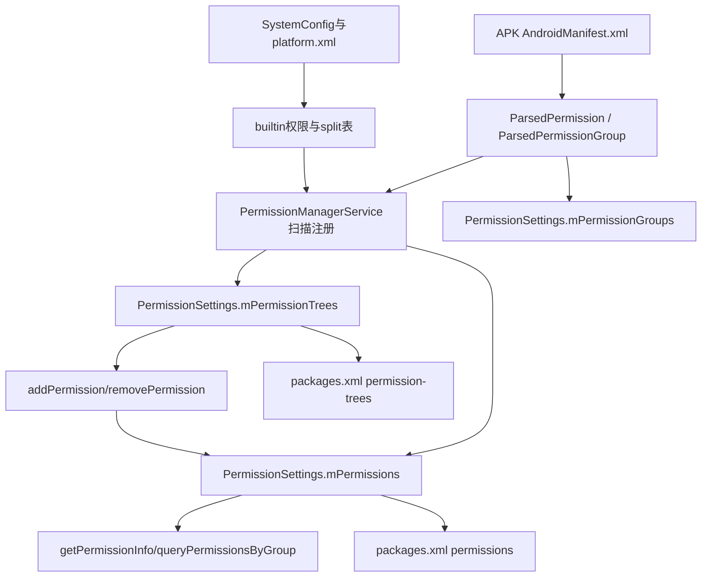
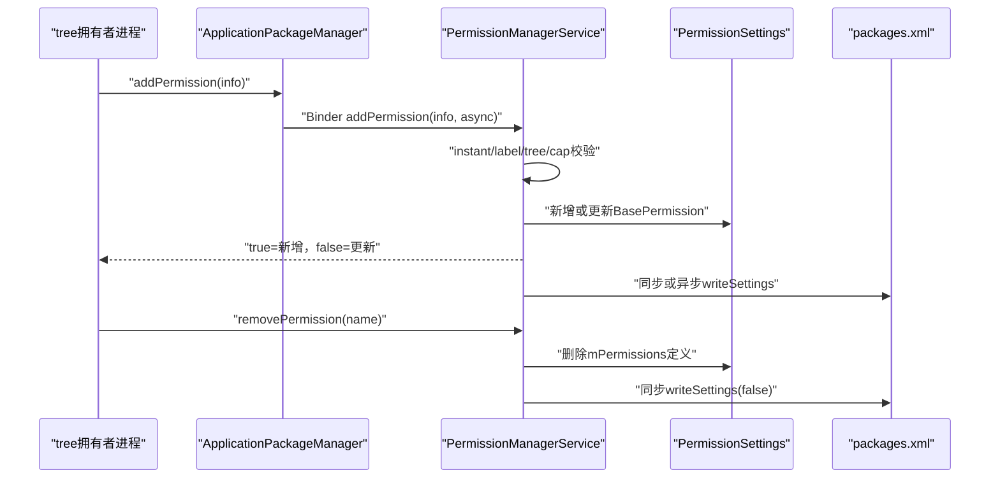
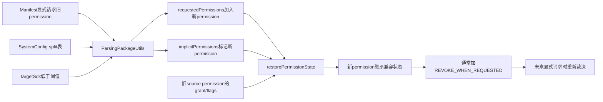

# 267 Android PermissionManager、split permissions、动态权限、permission tree、定义缓存与所有权链

## 1. 本章目标

前几章一直在回答“某应用有没有获得某项权限”；本章换到另一张表，回答“系统里这项权限是谁定义的、定义是什么、旧应用为何会被补出新权限、运行时创建的权限怎样归属”。读完应能区分权限定义、应用请求和用户授权三种完全不同的数据，并能追踪静态权限、动态权限、permission tree与split permission的生命周期。

## 2. 源码版本与阅读边界

本文基于本地`android-11.0.0_r48`。Android 12以后PermissionManagerService继续拆分，permission数据模型和XML位置也发生过变化；本文只解释r48。macOS练习只读源码，不编译、不刷机，也不假装动态API适合普通业务应用日常使用。

## 3. 先记住三层数据

第一层是“定义”：`android.permission.CAMERA`是谁声明、protectionLevel是什么、属于哪个group。第二层是“请求”：某APK的`uses-permission`以及解析器为兼容性补入的implicit permission。第三层才是“状态”：某包、某用户是否grant及有哪些flags。把三层混在一起，是阅读权限源码最常见的根因错误。

## 4. 再加两张辅助表

permission group是面向展示和策略聚合的元数据；permission tree是动态扩展名字空间的所有权声明。它们都与“用户是否允许某应用”不同。最终可用五本账理解本章：定义、group、tree、请求列表、逐用户授权状态。

## 5. 本章源码地图

```text
frameworks/base/core/java/android/permission/PermissionManager.java
frameworks/base/core/java/android/app/ApplicationPackageManager.java
frameworks/base/core/java/android/content/pm/PackageManager.java
frameworks/base/core/java/android/content/pm/parsing/ParsingPackageUtils.java
frameworks/base/core/java/com/android/server/SystemConfig.java
frameworks/base/data/etc/platform.xml
frameworks/base/services/core/java/com/android/server/pm/permission/
  PermissionManagerService.java
  PermissionSettings.java
  BasePermission.java
frameworks/base/services/core/java/com/android/server/pm/Settings.java
```

## 6. PermissionManager扮演什么角色

应用侧`android.permission.PermissionManager`是面向权限子系统的客户端门面：它提供split permission列表、权限检查缓存以及许多系统隐藏API。它不是system_server的权威数据库；真正的定义、tree和授权判断仍经Binder进入`PermissionManagerService`。

## 7. ApplicationPackageManager为何也出现

公开的`PackageManager.getPermissionInfo()`、`queryPermissionsByGroup()`、`addPermission()`等通常由`ApplicationPackageManager`实现，再委托`IPermissionManager`。所以类名叫PackageManager不等于请求一定进入PackageManagerService；r48已经把不少权限接口路由到独立permission Binder服务。

## 8. 服务端真正的入口

`PermissionManagerService`同时处理定义查询、动态定义增删、grant/revoke、flags、权限恢复和兼容迁移。类很大，阅读时必须先问当前方法操作的是`BasePermission`定义，还是`PackageSetting.PermissionsState`授权，否则很容易沿错分支。

## 9. PermissionSettings的四张核心索引

`mPermissions`按名字保存普通权限定义；`mPermissionTrees`单独保存tree；`mPermissionGroups`保存解析后的group；`mAppOpPermissionPackages`把带AppOp的permission映射到请求它的包集合。四张Map共用`mLock`，但含义和持久化方式并不相同。

## 10. BasePermission是什么

`BasePermission`是system_server对“一项已知权限定义”的内部包装。它保存名字、来源包、类型、protectionLevel、拥有者UID、GID、`ParsedPermission perm`、待恢复的`pendingPermissionInfo`以及“定义已变化”等状态。它不是某个应用的grant记录。

## 11. 三种BasePermission类型

`TYPE_NORMAL`包含Manifest静态声明的普通permission；`TYPE_BUILTIN`用于系统配置先注册、之后可能由包接管的内建定义；`TYPE_DYNAMIC`是tree拥有者通过API在运行时添加的定义。这里的NORMAL是BasePermission来源类型，不等同于`PROTECTION_NORMAL`保护级别。

## 12. ParsedPermission与PermissionInfo的区别

`ParsedPermission`是包解析后的服务端组件对象，保留声明包、group、flags等上下文；`PermissionInfo`是可跨进程返回或由调用者提交的Parcelable描述。动态添加时调用者给`PermissionInfo`，服务端会复制并结合tree拥有者重建`ParsedPermission`，不是直接信任来路对象。

## 13. 权限定义全景图



## 14. 应用请求列表放在哪里

包解析结果`AndroidPackage.getRequestedPermissions()`保存目标包请求的名字；`getImplicitPermissions()`额外标记因平台兼容规则自动补入的请求。它们属于包模型，不在`BasePermission`里，也不代表任何用户已经授权。

## 15. grant状态又放在哪里

普通包或shared UID的`PermissionsState`保存install permission以及各用户runtime permission的grant和flags。第262至266章讲过的USER_SET、DEFAULT、ROLE、ONE_TIME均属于这层。删除或修改一项定义可能触发状态清理，但定义对象本身没有“给包A已授权”的字段。

## 16. 扫包时先注册group

PMS提交包设置时会先调用`addAllPermissionGroups()`。若名字尚不存在，或者当前定义就是同一个包的更新，新group写入Map；若已有另一个包占用同名group，新声明只记录warning并被忽略。

## 17. group同名冲突为何不同于普通类重名

group是全局名字索引，不按应用隔离。先到的非系统group不会在这里被任意第三方覆盖；同包升级可刷新元数据。不要从“APK内写了permission-group”推导出系统查询必然返回它，冲突时真实Map仍保留原拥有者。

## 18. group不写入packages.xml

`PermissionSettings`提供permission和tree的read/write，却没有把`mPermissionGroups`写进Settings XML的对称方法。group主要依赖开机/扫包重新解析Manifest恢复；权限定义的骨架则会写入`packages.xml`。这解释了两类元数据的恢复路径不同。

## 19. legacy包的group链接被故意忽略

`addAllPermissions()`只对targetSdk大于L MR1的定义，把`ParsedPermission`链接到当前已知`ParsedPermissionGroup`。注释明确指出：旧时代group没有现代授权语义，不能因两个包碰巧用了同组，就产生意外的组级grant行为。

## 20. 未知group不会抹掉permission

现代包若声明一个当前不存在的group，调试开关下会打印提示，但permission定义仍可进入`mPermissions`。因此“查询不到group”和“查询不到permission”是两种状态；UI可能把无有效组的dangerous permission当作独立项处理。

## 21. 静态permission注册入口

`addAllPermissions()`遍历包声明的permission和permission-tree，先清掉其`FLAG_INSTALLED`假设，再分别从`mPermissions`或`mPermissionTrees`取旧对象，交给`BasePermission.createOrUpdate()`决定是否安装、拒绝冲突或更新定义。

## 22. FLAG_INSTALLED表示什么

只有定义实际被系统接受时，解析对象才重新加`PermissionInfo.FLAG_INSTALLED`。它表达“这条定义进入系统有效集合”，不是某个请求方安装成功，更不是授权状态。冲突定义仍存在于包的解析材料中，却可能没有installed位。

## 23. 普通同名定义的所有权规则

已有`BasePermission`来自别的包时，普通第三方新声明不会夺权；若现有对象未绑定ParsedPermission，也只有来源包匹配时才能补上。系统包有更高优先级：可以接管无主builtin，或覆盖当前非系统拥有者。

## 24. 系统包覆盖的安全后果

若系统包覆盖非系统定义，或者一项原非runtime权限变成runtime，`mPermissionDefinitionChanged`会被置位。稍后系统不是简单保留所有历史grant，而会对非固定来源的运行时授权执行清理，防止借名字接管继承用户能力。

## 25. permission tree是什么

Manifest中的`<permission-tree>`声明一个可扩展的权限名字空间。拥有者随后能用`addPermission()`创建树下具体名字，例如tree为`com.example.feature`，动态项可为`com.example.feature.camera`。tree本身不等于一项可grant的叶子权限。

## 26. tree前缀匹配很严格

`findPermissionTree()`要求候选名以tree名开头、长度更长，而且紧接的字符必须是`.`。所以`com.foo`可包含`com.foo.bar`，不能包含`com.foobar`，也不把`com.foo`本身当成子项。这个点号边界避免简单字符串前缀越权。

## 27. tree拥有权按appId检查

`enforcePermissionTree()`把tree保存的UID与`UserHandle.getAppId(callingUid)`比较。调用者来自哪个user并不改变应用身份部分；共享同一appId/shared UID的包也可能拥有相同管理能力。它不是逐packageName做所有权判断。

## 28. 静态定义也受tree约束

包扫描静态permission时同样查已有tree。若名字落入别人的tree且来源包不同，定义被忽略。tree因此不只保护动态API，也防止另一个APK靠Manifest抢占受保护名字空间。

## 29. 动态权限公开合同

`PackageManager.addPermission()`文档要求调用包先声明相应permission-tree，动态项会跨重启记住；再次添加同名项是更新。该API服务的是可扩展权限名字空间，不是“App想临时申请一个平台权限”的替代品。

## 30. addPermission的第一层校验

instant app不能调用；`PermissionInfo`必须提供`labelRes`或`nonLocalizedLabel`，否则抛SecurityException；名字必须落在调用UID拥有的tree中。三项校验发生在真正修改Map前。

## 31. 新增动态定义

若`mPermissions`没有同名项，服务端先检查容量，再创建`TYPE_DYNAMIC`的`BasePermission`。source package取tree拥有者，不接受调用者在`PermissionInfo.packageName`里随意伪造的来源。

## 32. 更新已有动态定义

同名项存在时必须已经是dynamic，否则抛异常，防止用动态API改写静态平台permission。设计上`addToTree()`应把规范化后的info与tree拥有者结合；但本地r48实际只复制info并改其protectionLevel，随后直接`new ParsedPermission(tree.perm)`，没有把info副本传入构造器。内部BasePermission的name仍是叶子名，`perm`元数据却暂时是tree副本，这是本章必须保留的源码异常。

## 33. 返回值不是changed

`addPermission()`返回局部变量`added`：新建返回true，更新已有项返回false。即使更新确实改变label或protection并已安排写盘，也仍返回false。调用方不能把false解释为失败或“没有任何变化”。

## 34. addPermissionAsync异步的是什么

同步版和async版都先在服务端内存Map完成修改。差别只在`writeSettings(async)`的落盘安排；async调用成功返回后，新定义已能被当前进程查询，但如果写盘前异常重启，持久化可能丢失。

## 35. protectionLevel会被规范化

服务端调用`PermissionInfo.fixProtectionLevel()`，再把修正值写入复制对象。不要假设调用者提交的任意bit组合会原样保存；系统首先把保护级别规整到平台认可的表示。

## 36. 动态权限容量限制

新增第三方动态permission前会计算文本footprint，上限常量为32768；system UID豁免。`calculateFootprint()`大体把权限名长度与ParsedPermission的信息占用相加，目的是阻止tree拥有者无限膨胀全局定义表。

## 37. 容量按拥有者UID汇总

r48检查当前`mPermissions`中与tree相同拥有者UID的定义，并不只统计当前tree前缀。因此同一UID拥有多棵tree时共享容量预算；shared UID包也共享。这是代码实现比“每棵树各有上限”的直觉更严格之处。

## 38. 更新路径没有再次检查容量

容量检查只在`added == true`分支执行。更新已有动态permission可以改变文本元数据，却不会重新调用cap检查，理论上可让已有集合超过按新增路径计算的上限。这是r48实现边界，不应包装成API保证。

## 39. addToTree如何判断changed

它先比较protectionLevel、是否已有ParsedPermission、UID、来源包以及一组PermissionInfo字段，只要不同就返回changed，服务端据此决定写Settings。可随后赋值只更新BasePermission protection与UID，并把`perm`设为tree副本；局部`info = new PermissionInfo(info)`虽被修正却未再消费。由于tree副本的name通常不等于叶子info.name，后续更新也容易持续判断为changed。

## 40. 哪些动态字段参与比较

比较函数让icon、logo、protectionLevel、name、nonLocalizedLabel、packageName等参与；注释明确说group、nonLocalizedDescription、labelRes、descriptionRes当前没有存进Settings，因此不纳入持久恢复的一致性比较。不过r48新增/更新之后保存的`perm`是tree副本，比较“想判断哪些字段变化”和“最终真正存入哪些字段”又发生脱节，动态定义更不能视为完整Parcelable逐字段复刻。

## 41. 动态增删与持久化流程



## 42. removePermission的设计意图

公开文档说它移除先前动态添加的permission。服务端仍先拒绝instant app，并要求名字落在调用UID拥有的tree里；查不到定义直接返回。按合同，静态定义不应该通过这条API删除。

## 43. r48的类型判断疑点

实际代码却在`bp.isDynamic()`为true时打印“Not allowed to modify non-dynamic permission”，条件与文案明显相反，而且只`Slog.wtf`不抛异常。紧接着无论动态还是静态都从`mPermissions`移除并同步写Settings。

## 44. 这个疑点能造成什么

只要调用UID拥有覆盖该名字的tree，r48路径可能连树下静态permission定义也删掉；真正动态项反而只多打一条wtf日志后照样删除。本文把它记录为版本缺陷/窄边界，不能据此建议业务依赖这种行为。

## 45. remove没有在本方法里逐包revoke

该方法直接删定义并写Settings，没有像定义删除扫描路径那样遍历所有包、所有用户撤销runtime grant，也没有显式发权限变更callback。后续包权限重算可能清理悬空状态，但“remove返回”这一完成点只证明定义Map和Settings写入已处理。

## 46. packages.xml为何要保存定义

Settings写入顶层`<permission-trees>`和`<permissions>`两个区域，各自遍历BasePermission写`<item>`。这让系统在完整扫包完成前也能恢复来源与保护级别骨架，并让动态定义跨重启存在。

## 47. 静态定义写了哪些字段

至少有name、source package及非NORMAL时的protection。TYPE_NORMAL不代表protection一定NORMAL；XML的`type="dynamic"`只在动态定义且存在Parsed或pending info时写。静态完整label/group等仍以重新解析APK为主。注意item的name取BasePermission叶子名，而动态icon/label却从当前`perm`取，两者在上述r48异常下可能来自不同对象语义。

## 48. 动态定义写了哪些额外字段

动态item会写`type="dynamic"`，并可写icon和nonlocalized label。正常恢复格式只包含packageName、name、icon、label与protection；group、资源label、description等不完整。更具体地说，r48刚调用`addToTree()`后`perm`是tree副本，writeLPr会把tree的icon/label写到叶子item，调用者提交的叶子icon/label可能根本未进入XML。

## 49. 重启后怎样恢复动态ParsedPermission

`BasePermission.readLPw()`先留下pending info；`updatePermissionSourcePackage()`处理定义时，对dynamic项调用`updateDynamicPermission()`。它重新找到当前有效tree，并以tree的ParsedPermission、tree来源包和pending info构造真实ParsedPermission，UID也回到tree UID。

## 50. tree没恢复时会怎样

找不到匹配tree或tree还没有有效ParsedPermission时，pending info无法转成完整`perm`。BasePermission骨架可能暂时仍在Map，但后续悬空来源检查会根据来源包与包设置清理。动态项的可用性最终依赖tree定义仍真实存在。

## 51. permission与tree分开读写的意义

同名空间逻辑不同：tree决定谁可扩展，普通permission是可查询、请求和授权的叶子定义。`PermissionSettings.transferPermissions()`因此明确循环两遍，分别处理`mPermissionTrees`和`mPermissions`，不能只迁移其中一张Map。

## 52. adopt-permissions是什么

新系统包可在Manifest请求接管旧包定义的permissions。PMS提交包设置时读取`getAdoptPermissions()`，找到原PackageSetting并通过`verifyPackageUpdateLPr()`确认它是可信更新关系，才调用transfer，而不是任意包写一个旧包名就能接管。

## 53. transfer具体重置什么

BasePermission来源包改成新包，`perm`清空，pending info若存在也更新packageName，UID归零，GID清除。后续新包扫描再把真实ParsedPermission和UID接回。这个中间态表示“所有权已迁移，等待新声明重新绑定”。

## 54. transfer没有复制用户grant表

它操作的是定义所有权，不是逐应用授权。已有请求包的PermissionsState仍是另一套账；之后是否保留、重算或撤销，取决于定义性质、包更新和`updatePermissions()`规则。

## 55. 查询PermissionInfo的链路

应用调用`getPermissionInfo(name, flags)`后，ApplicationPackageManager把调用包名一并传给permission服务。服务端从`mPermissions`找BasePermission，调整可见的protection flags，再生成PermissionInfo；查不到返回null。

## 56. 为什么能生成“最小PermissionInfo”

若BasePermission暂时没有`perm`，`generatePermissionInfo()`仍会构造name、source package、以名字作nonLocalizedLabel以及protectionLevel的最小对象。于是“查询有结果”不保证完整Manifest元数据已经绑定。

## 57. protection flags的可见性规则

signature权限始终返回完整保护flags；system/root/shell也看全部。非signature权限对targetSdk小于O的合法查询包只返回base protection bits；O及以上且查询包appId与调用UID匹配时看完整flags。

## 58. 查询包名异常时的反直觉边界

r48若标准化后的package不存在、PackageSetting缺失或appId不匹配，方法多处直接返回原始完整protectionLevel，而不是遮蔽flags或抛错。这是源码真实控制流；不能把传入packageName理解成严格可靠的隐私鉴权门。

## 59. instant app的定义查询限制

服务端发现calling UID属于instant app时，`getPermissionInfo()`和`getPermissionGroupInfo()`返回null，`getAllPermissionGroups()`返回空列表，`queryPermissionsByGroup()`返回null。动态增删也直接抛SecurityException。

## 60. queryPermissionsByGroup怎样筛选

非null groupName若不在group Map中，整体返回null；已知组则遍历所有普通permission定义，选择`perm.getGroup()`等于该名字的项。它不遍历permission tree，也不从请求包或授权状态反推成员。

## 61. groupName为null的特殊语义

null不是“所有组”。`BasePermission.generatePermissionInfo(null, flags)`只返回没有有效group的permission，包括`perm == null`的最小定义。要查询所有组元数据应使用`getAllPermissionGroups()`，两者用途不同。

## 62. 已知空组与未知组不同

已知group即使没有任何permission成员，也返回空`ParceledListSlice`；未知非null group返回null。这可帮助调用方区分“组存在但无成员”和“组名本身不存在”。

## 63. group删除不自动删除permission

group Map来自包扫描，permission Map单独维护。某group来源消失或冲突变化，不等于其成员定义必然同时移除；permission还会依据自身来源包清理。查询和UI必须处理定义存在但group链接为空的状态。

## 64. split permission不是动态permission

名字相似但机制完全不同。动态permission是tree拥有者运行时创建新定义；split permission是平台升级兼容表，告诉解析器：旧App请求旧权限时，还应隐式请求哪些拆分后的新权限。split表不向`mPermissions`现场创建定义。

## 65. split表从哪里来

`SystemConfig`读取各允许声明permission配置的分区XML，AOSP主表在`frameworks/base/data/etc/platform.xml`。每条`<split-permission name="旧名" targetSdk="阈值">`包含一个或多个`<new-permission name="新名"/>`。

## 66. 分区读取受allowPermissions控制

SystemConfig不会无条件接受每个目录里的任意权限配置；调用读取分区文件时携带允许类别flags。分析厂商设备的split表，既要搜索XML，也要核对所在分区是否获准加载permissions类配置。

## 67. r48平台表里的典型例子

FINE_LOCATION和COARSE_LOCATION会为targetSdk低于29的包补`ACCESS_BACKGROUND_LOCATION`；READ_EXTERNAL_STORAGE会为targetSdk低于29补`ACCESS_MEDIA_LOCATION`；READ_CONTACTS在targetSdk低于16时补READ_CALL_LOG。不同旧权限也能指向同一个新权限。

## 68. 没写targetSdk并非不生效

`readSplitPermission()`在属性缺失时使用`CUR_DEVELOPMENT + 1`。判断条件是应用targetSdk小于阈值，因此它对当前平台所有正常targetSdk都可生效。错误数字会记录警告并跳过整条配置。

## 69. 空new-permission列表会怎样

解析器忽略未知子标签和空名字，只有至少收集到一个新permission才把SplitPermissionInfo加入列表。所以“看见split-permission起始标签”不代表运行时表一定含有该项。

## 70. targetSdk阈值怎样读

兼容条件是`pkg.targetSdkVersion < split.targetSdk`，不是小于等于。例如threshold为29，target 28获得隐式新权限，target 29不会。阈值表达“从这个target版本开始，开发者必须显式适配拆分”。

## 71. 客户端为何缓存split列表

`PermissionManager.getSplitPermissions()`第一次经Binder取Parcelable列表，转换后写进实例字段`mSplitPermissionInfos`；后续直接返回。SystemConfig在一次开机期间基本静态，这种无失效缓存符合数据生命周期。

## 72. 包解析时怎样应用split

`ParsingPackageUtils.convertSplitPermissions()`取得列表，逐条检查旧permission是否已在requestedPermissions中及targetSdk是否低于阈值。满足时把每个未重复的新permission同时加入requestedPermissions与implicitPermissions。

## 73. implicitPermissions为何必须单独记录

系统不仅要知道“这个包现在请求了新权限”，还要知道它不是开发者显式写入Manifest。以后应用升级并显式请求、或者targetSdk跨过阈值时，授权迁移与撤销策略需要这个来源信息。

## 74. Manifest文件没有被改写

补权限只修改内存中的解析包模型，不会编辑APK内的二进制Manifest。用反编译工具看原APK可能找不到`ACCESS_BACKGROUND_LOCATION`，但PMS的requestedPermissions仍可能包含它；两者并不矛盾。

## 75. split从解析到授权的完整链



## 76. convertNewPermissions是另一张兼容表

解析代码还会处理`NEW_PERMISSIONS`：某些平台版本新增permission时，对旧target应用隐式补请求。它同样写requested和implicit列表，但数据源不等于SystemConfig的split XML。阅读日志要区分“旧权限拆分”与“平台新权限兼容”。

## 77. 新隐式权限如何继承grant

恢复权限状态时，`setInitialGrantForNewImplicitPermissionsLocked()`构建“新permission→旧source permissions”映射。如果新项是implicit且相关旧source已有合适状态，系统把旧能力迁移给新项，避免系统升级后旧App突然失去原有功能。

## 78. 多个source如何合流

例如粗略位置和精确位置都可能指向后台位置。映射值不是单个字符串，而是一组source；系统会结合包实际请求与旧状态决定继承。不能只搜索split表第一条，就断言新权限唯一来自哪个旧权限。

## 79. REVOKE_WHEN_REQUESTED的意义

新隐式权限通常会带`FLAG_PERMISSION_REVOKE_WHEN_REQUESTED`。它表示当前grant主要为旧版兼容保留；当应用未来把这项权限变成显式请求时，平台可以撤销兼容grant，让它进入现代请求流程，而不是永久白送。

## 80. ACTIVITY_RECOGNITION为何例外

r48对ACTIVITY_RECOGNITION有专门迁移兼容，继承时不按普通路径设置REVOKE_WHEN_REQUESTED，并检查旧的install permission状态。这是历史升级修复，不能外推为所有split权限的通用规则。

## 81. 不再implicit时怎样清理

`revokePermissionsNoLongerImplicitLocked()`发现某权限过去以兼容方式隐式存在、现在成为显式或不再符合隐式条件时，可撤销grant并清相关flags。这样targetSdk升级不会无条件保留旧平台为兼容偷偷补出的能力。

## 82. 固定来源会阻止自动撤销

上述清理受`BLOCKING_PERMISSION_FLAGS`保护，r48常量包含SYSTEM_FIXED、POLICY_FIXED和GRANTED_BY_DEFAULT。命中这些来源时不能简单因implicit身份变化而撤销。这里的阻塞表与定义变化清理使用的flagMask并不完全相同。

## 83. 显式请求不等于立即弹框

解析后从implicit变成explicit，只说明请求来源变化。是否当场撤销、能否再请求、UI展示什么，还要结合旧grant、flags、目标版本和PermissionController策略；split转换本身既不弹UI，也不直接给用户选择结果。

## 84. 定义变化怎样被发现

`BasePermission.createOrUpdate()`记录旧定义是否非runtime，以及所有者是否被系统包替换。如果更新后成为runtime且发生上述敏感变化，加入definitionChanged列表；安装提交阶段再调用专门清理方法，而非在持锁注册定义时立刻遍历所有包。

## 85. 定义变化撤销的范围

系统遍历所有用户和包，只处理当前仍为runtime的该permission；UID小于`FIRST_APPLICATION_UID`的系统主体跳过。普通应用若当前grant且没有固定来源flags，服务端调用runtime revoke。

## 86. 哪些来源保护历史grant

定义变化清理的mask包含SYSTEM_FIXED、POLICY_FIXED、GRANTED_BY_DEFAULT和GRANTED_BY_ROLE。USER_SET本身不阻止撤销，因为用户当初同意的是旧定义/旧拥有者；安全上不能把那次同意自动转给新定义。

## 87. 清理完成后重置标记

每项定义遍历完成后`setPermissionDefinitionChanged(false)`。标记是一次更新周期的待处理信号，不是永久审计记录；想分析历史变化应结合日志/EventLog，而不能只看当前BasePermission字段。

## 88. 删除来源包的普通清理

`updatePermissionSourcePackage()`检查定义来源包更新或删除。如果包不再声明某permission，runtime定义会遍历包与用户执行revoke；非runtime定义则清install状态，随后从Map移除或更新。这个路径比动态API的直接remove更完整。

## 89. 所有权变化为何触发全包重算

permission或tree来源变化后，`updatePermissions()`追加`UPDATE_PERMISSIONS_ALL`。因为signature permission能否授予取决于定义拥有者签名，改变一个定义的owner可能影响许多请求包，不能只恢复正在安装的那一个包。

## 90. dynamic项在更新循环中的位置

扫描`mPermissions`时先对dynamic调用`updateDynamicPermission()`，再检查其source package是否还存在、是否仍匹配。pending XML骨架在这里与当前tree重新接合，所以分析开机恢复顺序时不能只看Settings读XML那一刻。

## 91. r48 tree悬空清理的可疑调用

`updatePermissionTreeSourcePackage()`首轮迭代可直接`iterator.remove()`；第二轮发现来源包/PackageSetting缺失时，却调用`mSettings.removePermissionLocked(bp.getName())`，删除的是普通permission Map而非tree Map。多数已匹配删除场景前一轮已移除tree，但该调用仍是值得记录的窄边界，不能声称所有悬空tree都可靠由它清掉。

## 92. AppOp permission请求索引是什么

当定义带APPOP flag，系统维护`permission name → requesting package names`集合。包声明和请求变化时增删这个索引，供AppOps同步等策略寻找受影响包。它是反向索引，不是AppOp mode本身，也不表示包已获grant。

## 93. 移除包时索引怎样更新

`removeAllPermissions()`既遍历包定义，移除它对自身AppOp permission的声明关联，也遍历requestedPermissions，从相应集合删除包名，空集合再删key。定义者和请求者两个身份都可能影响索引。

## 94. 权限定义和授权持久化不要混淆

`packages.xml`中的`<permissions>`/`<permission-trees>`主要保存全局定义骨架；普通包/shared user的install授权也在Settings不同节点，runtime授权则由第264章的每用户`runtime-permissions.xml`保存。同名“permissions”标签不代表同一层数据。

## 95. 用一个例子手算五张账

包Owner声明tree `com.owner.feature`并动态添加`.scan`；包Client在Manifest请求`.scan`，用户10允许它。定义Map有`.scan` BasePermission，tree Map有根，Owner包模型有声明，Client请求列表有`.scan`，Client用户10的PermissionsState才有grant。删除任何一张账都不能用其余四张直接替代。

## 96. shared UID对tree权限的影响

tree所有权按appId比较，因此shared UID中的另一个包可能调用动态API；容量也按UID汇总。安全审计不能只看哪个包声明tree，还要查谁共享该UID、安装签名约束及调用实际来自哪个成员。

## 97. packageName为何不是唯一安全身份

定义查询中的packageName用于targetSdk与flags可见性调整，动态管理则以Binder calling UID/appId加tree为核心。一个字符串包名本身不能证明调用者身份；服务端需要从不可伪造的Binder身份和PackageSetting关系完成绑定。

## 98. label校验不等于内容可信

动态API强制存在label，是为了让权限可向用户解释；它不保证文字准确友善。系统仍要通过tree所有权隔离谁能定义该名字，UI还应安全加载label，不能只因字段非空就视为平台背书。

## 99. permission tree不是Java包名注册局

名字通常采用反向域名以减少冲突，但系统真正执行的是已安装tree定义和appId所有权，不会联网验证域名归属。应用签名、安装更新关系和共享UID才是本机信任链的重要部分。

## 100. protection base与flags要分开读

`protectionLevel`把NORMAL/DANGEROUS/SIGNATURE base与PRIVILEGED、APPOP、INSTANT等flags编码在一个int中。查询可见性会只保留base bits；`fixProtectionLevel()`也会规范化组合。日志里只打印“dangerous”可能遗漏关键附加语义。

## 101. BasePermission默认SIGNATURE的含义

构造时保护级别保守初始化为SIGNATURE，再由解析/XML/动态添加覆盖。短暂未绑定完整定义时宁可按更严格语义处理，不能因字段初值就断言Manifest真的声明了signature。

## 102. split列表缓存与权限检查缓存不同

split列表是PermissionManager实例字段，缓存开机静态配置；权限检查使用静态`PropertyInvalidatedCache`，结果会随包/权限状态改变而失效。两者恰好都在PermissionManager里，却不能用同一套失效逻辑解释。

## 103. UID权限检查缓存忽略PID

`PermissionQuery`对象保存permission、pid、uid，重算时也把pid传给uncached检查，但`equals()`和`hashCode()`有意不计pid。注释直接写“N.B. pid doesn't count toward equality”。因此同permission+uid的不同pid共享缓存项，这是平台认为常规权限结果按UID决定的优化。

## 104. packageName检查缓存的key

另一张`PackageNamePermissionQuery`按permName、pkgName、uid三者相等命中，用于`checkPackageNamePermission()`。它与UID检查各有最多16项的PropertyInvalidatedCache，但共享`cache_key.package_info`失效键。

## 105. system_server为何禁用本地检查缓存

PermissionManagerService构造阶段让PackageInfo缓存失效，并调用disablePermissionCache与disablePackageNamePermissionCache，使system_server本进程绕开这两张客户端缓存。权威服务执行检查时不应被自己进程内的旧结果遮住。

## 106. 共享失效键意味着什么

包信息或权限状态变化触发对应property invalidation后，各进程下一次查询重新计算。缓存不是固定TTL，也不是每次grant直接逐进程清Map；它依赖跨进程generation式失效机制。调试时“同进程第二次很快”不能证明Binder没有参与过第一次。

## 107. getPermissionInfo没有复用这两张cache

上述cache只包装权限检查方法。ApplicationPackageManager的permission定义查询仍直接委托permission Binder服务；不要因看见PermissionManager有缓存，就推断`getPermissionInfo()`也必定缓存PermissionInfo对象。

## 108. 锁与写盘完成点

定义Map通常在`mLock`下修改；add在解锁后按changed写Settings，remove则在锁内调用同步writeSettings。锁保护内存一致性，不代表磁盘I/O一定已完成；async参数更明确把“内存生效”和“持久化完成”拆开。

## 109. 静态定义端到端时间线

APK解析得到group、tree和permission；PMS先注册group，再用createOrUpdate登记tree/叶子定义；定义owner或类型敏感变化加入待清理表；更新权限阶段处理悬空来源、dynamic重建和全包授权恢复；Settings最终写定义骨架。任何一步都不等同于用户点击了允许。

## 110. 动态定义端到端时间线

tree先随包扫描成为有效定义；调用者经Binder用UID证明所有权；服务端校验label、前缀、类型、容量并更新BasePermission；定义Map立刻有叶子key，但r48的`perm`暂为tree副本，查询出的PermissionInfo不一定正确代表叶子；Settings按同步/异步策略落盘，重启读成pending info后再依靠仍存在的tree重建。由于初次写盘也可能取了tree icon/label，重建并不能找回此前未保存的调用者元数据。

## 111. 阅读本章源码的检查清单

看到一个permission名字时依次问：它是否在`mPermissions`有定义？是否落入某tree？定义owner是谁？目标包是显式还是implicit请求？哪个用户的PermissionsState有grant？是否另有AppOp门？回答齐全后，才有资格说“这个应用拥有这项能力”。

## 112. macOS只读练习一：核对五张Map

```bash
cd /Users/ninebot/androidSource
sed -n '35,125p' frameworks/base/services/core/java/com/android/server/pm/permission/PermissionSettings.java
rg -n 'mPermissions|mPermissionTrees|mPermissionGroups|mAppOpPermissionPackages' \
  frameworks/base/services/core/java/com/android/server/pm/permission
```

目标：给四张PermissionSettings索引分别写一句“key、value、是否代表grant”，再补上PackageSetting的PermissionsState作为第五张授权账。

## 113. macOS只读练习二：手算tree匹配与动态增删

```bash
cd /Users/ninebot/androidSource
sed -n '400,485p' frameworks/base/services/core/java/com/android/server/pm/permission/BasePermission.java
sed -n '600,690p' frameworks/base/services/core/java/com/android/server/pm/permission/PermissionManagerService.java
```

目标：对tree `com.demo.sensor`判断`com.demo.sensor`、`com.demo.sensor.read`、`com.demo.sensors.read`是否匹配；再指出add返回false与remove打印wtf分别真正代表什么。

## 114. macOS只读练习三：追split配置到解析模型

```bash
cd /Users/ninebot/androidSource
rg -n 'split-permission|ACCESS_BACKGROUND_LOCATION|ACCESS_MEDIA_LOCATION' \
  frameworks/base/data/etc/platform.xml frameworks/base/core/java/com/android/server/SystemConfig.java
rg -n 'convertSplitPermissions|addImplicitPermission' \
  frameworks/base/core/java/android/content/pm/parsing
```

目标：任选一条split，写出旧permission、target阈值、新permission，并分别推演target等于阈值减一和等于阈值时的requested/implicit列表。

## 115. macOS只读练习四：核对XML恢复字段

```bash
cd /Users/ninebot/androidSource
sed -n '500,610p' frameworks/base/services/core/java/com/android/server/pm/permission/BasePermission.java
sed -n '2498,2516p' frameworks/base/services/core/java/com/android/server/pm/Settings.java
rg -n 'updateDynamicPermission|transferPermissions' \
  frameworks/base/services/core/java/com/android/server/pm/permission
```

目标：列出dynamic item真正落盘的字段、明确未落盘的group/description等字段，并画出`pendingPermissionInfo → tree → ParsedPermission`恢复箭头。

## 116. 常见误解一：Manifest写了permission就一定成为有效定义

错误。全局同名冲突、别人tree的名字空间、来源包状态都可能让声明未安装。应看BasePermission Map、FLAG_INSTALLED和系统日志，而不是只看APK文本。

## 117. 常见误解二：split permission等于系统直接给新权限

错误。第一步只是解析模型补请求并标记implicit；后续恢复逻辑才可能继承旧grant，还受targetSdk、source状态、fixed flags和特殊迁移规则影响。它不是无条件grant API。

## 118. 常见误解三：动态permission就是临时permission

错误。dynamic描述“定义由运行时API创建”，而非“授权只活一会儿”。它默认会写packages.xml跨重启；一次性权限的ONE_TIME则是某包某用户grant状态的生命周期，两者分属定义层和状态层。

## 119. 复读后补上的r48窄边界

复读时重点修正了七处容易讲错的地方：add返回false表示更新而非失败；async只延迟持久化；容量按owner UID汇总且更新不复查；`addToTree()`复制的info未被消费而让`perm`成为tree副本；remove类型判断/文案反向却仍删除；动态XML只保留部分且可能取错来源的PermissionInfo；tree第二阶段悬空清理调用了普通permission删除方法。另明确PID虽然参与uncached参数，却不进入权限检查cache key。

## 120. 本章小结与下一章

本章把权限系统从“grant视角”翻到“定义视角”：Manifest静态定义经BasePermission建立全局owner，tree用点号名字空间和appId约束动态扩展，packages.xml只保存必要骨架；split表则在包解析期为旧target补requested+implicit权限，再由恢复逻辑迁移grant。下一章继续读第268章，进入权限检查从Context/PackageManager到UID、shared UID、instant/isolated UID与跨用户裁决的完整链。
