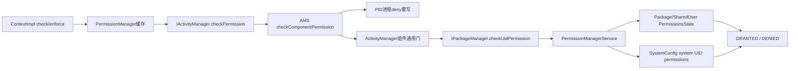
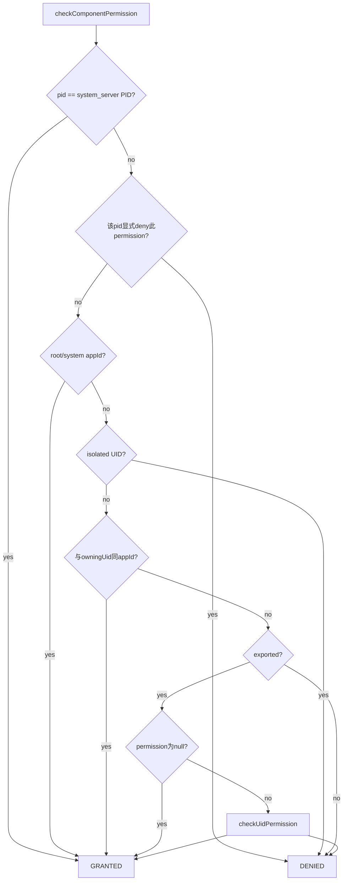
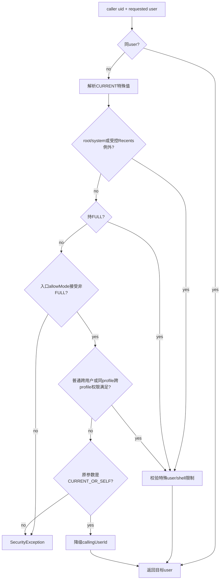

# 268 Android权限检查、Context/PackageManager、UID与PID、shared/isolated UID及跨用户裁决链

## 1. 本章目标

本章回答最基础却最容易被说错的问题：代码调用`checkPermission()`时到底在检查谁？我们从Context四种入口追到ActivityManager、PackageManager和PermissionManagerService，拆开Binder调用身份、UID/PID、shared UID、isolated process、instant app、组件exported门与跨用户门。

## 2. 源码版本与边界

本文只解释本地`android-11.0.0_r48`。本章聚焦“Manifest/runtime permission位”的基础裁决；AppOps、PermissionChecker的preflight/data-delivery、attribution chain留到第269章。所有练习为macOS只读，不编译系统。

## 3. 第一条结论

普通权限grant主要按UID及其PermissionsState判断，但权限检查不等于永远只看UID。组件检查还看exported与owner；r48支持按进程声明denied permission，因此PID也可能改变结果；跨用户访问又有独立门。

## 4. 第二条结论

`Binder.getCallingUid()`代表当前Binder事务的直接调用者。服务端一旦`clearCallingIdentity()`，后续calling UID变成自己的身份；异步切线程也不会自动携带原调用者。鉴权必须在身份仍有效时完成或显式保存可信的uid/pid。

## 5. 本章源码地图

```text
frameworks/base/core/java/android/app/ContextImpl.java
frameworks/base/core/java/android/app/ActivityManager.java
frameworks/base/core/java/android/app/ApplicationPackageManager.java
frameworks/base/core/java/android/permission/PermissionManager.java
frameworks/base/core/java/android/os/{Binder,UserHandle}.java
frameworks/base/core/java/android/content/pm/parsing/component/ParsedProcessUtils.java
frameworks/base/services/core/java/com/android/server/am/{ActivityManagerService,UserController,ProcessList}.java
frameworks/base/services/core/java/com/android/server/pm/permission/PermissionManagerService.java
```

## 6. UID怎样编码用户和应用

多用户开启时，`UserHandle.getUid(userId, appId)`大致用`userId * PER_USER_RANGE + appId`组合；`getUserId(uid)`取用户部分，`getAppId(uid)`去掉用户部分。相同App在user 0和user 10拥有不同完整UID，但appId通常相同。

## 7. PID与UID各回答什么

PID标识当前Linux进程，进程死亡重启会变化；UID标识安全主体，多个进程乃至shared UID多个包可共享。权限grant通常附着到UID对应的包/共享状态，而PID适合定位“这一次是哪个进程发起”。

## 8. Binder calling identity从哪里来

Binder驱动把事务发送者的pid/uid交给接收线程；`Binder.getCallingPid/Uid()`在处理入站事务时读取它们。若当前线程并不处于入站Binder事务，API返回本进程pid/uid，而不是某个历史调用者。

## 9. 直接调用者不等于业务起源

若App A调用服务B，B再调用服务C，C默认看见的是B，不是A。权限不会自动沿任意代理链传播。B若代表A操作，要在自己的入口先鉴权、使用受控委托协议，或使用平台专门的attribution/token机制。

## 10. Context四种检查入口总览

`checkPermission(permission,pid,uid)`检查显式身份；`checkSelfPermission()`固定本进程；`checkCallingPermission()`只接受真正的外部Binder caller；`checkCallingOrSelfPermission()`在外部事务中查caller，本地调用时查自己。名字只差几个词，安全语义差很大。

## 11. checkPermission显式检查

ContextImpl拒绝null参数，然后调用`PermissionManager.checkPermission(permission,pid,uid)`。调用者自己提供pid/uid，所以这只是查询工具；未经验证的普通参数不能替代`Binder.getCallingUid()`作为服务入口身份。

## 12. checkSelfPermission

它用`Process.myPid()`和`Process.myUid()`，永远检查当前进程自身。App常用它判断自己是否已获运行时权限；系统服务若拿它保护Binder入口，会错误地检查system_server自己。

## 13. checkCallingPermission的防误用设计

ContextImpl先取callingPid；只有callingPid不等于myPid时才查callingUid。若是本地调用或未处于外部事务，它直接DENIED，而不奖励自己的权限。这样可避免“本想只允许外部有权调用者，内部误调用却因本服务权限而通过”。

## 14. checkCallingOrSelfPermission

它不做pid相等拒绝，直接检查Binder calling pid/uid。外部Binder事务中等于caller；普通本地调用中Binder API返回self，因此自己也可能通过。只有明确希望“调用者或本服务自己都可用”时才合适。

## 15. check与enforce的区别

check返回`PERMISSION_GRANTED`或`PERMISSION_DENIED`，由调用者决定分支；enforce包装相同检查，失败直接抛SecurityException并带消息。enforce不是更强的权限模型，只是把失败策略固定成异常。

## 16. Context到权限状态的主链



## 17. PermissionManager的客户端缓存

Context基础检查先进入静态`PropertyInvalidatedCache`，最多16项，共享`cache_key.package_info`失效代际。首次miss才向AMS发Binder查询；包或权限状态使代际失效后重新计算。

## 18. uncached为何先找ActivityManager

`checkPermissionUncached()`调用`ActivityManager.getService().checkPermission()`，不是直接调PermissionManagerService。AMS先应用组件通用规则和进程级deny，再由PackageManager的UID检查进入权限服务。

## 19. ActivityManager缺失时的保守回退

极早启动或测试场景若拿不到AMS，root/system appId被假定GRANTED，其他UID被假定DENIED并记录warning。该回退不是正常运行主链，也不证明system UID在每个具体服务政策中永远豁免。

## 20. 缓存key为何保存PID却不比较PID

`PermissionQuery`字段有permission、pid、uid，recompute也传pid；但equals/hash故意只比较permission+uid。注释认为实际安全检查按UID，所以不同pid共享结果。稍后会看到r48实现与这条假设存在冲突。

## 21. AMS公开checkPermission

AMS先拒绝null permission，再调用自己的`checkComponentPermission(permission,pid,uid,-1,true)`。owningUid=-1、exported=true表示这次不检查具体组件owner/export状态，但仍复用root/system、isolated、进程deny和UID permission逻辑。

## 22. system_server自身PID先通过

AMS版本的`checkComponentPermission()`第一行若`pid == MY_PID`直接GRANTED。这比后面的permission定义检查更早，代表system_server进程内部调用的特殊信任。显式传入错误PID会改变结果，所以服务不应信任外部自报pid。

## 23. 进程级deniedPermissions

若permission非null，AMS按pid查询`sActiveProcessInfoSelfLocked`；该进程的`ProcessInfo.deniedPermissions`包含此项时立即DENIED，甚至先于owner/root/system等后续放行。比较逻辑本身是通用字符串集合，但r48解析器实际只会把INTERNET放进集合；注释承认deny会让本来因owner关系可访问的调用也被否决。

## 24. deny-permission从Manifest哪里来

r48解析`<processes>`和其`<process>`子项中的`<deny-permission>`/`<allow-permission>`，可建立默认并由具体process调整；但`parseDenyPermission/parseAllowPermission`都显式只处理`android.permission.INTERNET`，其他名字被跳过。它是进程网络能力收缩，不是用户设置页的通用拒绝flags表。

## 25. ProcessInfo怎样进入AMS

PMS根据解析包生成`ProcessInfo`；ProcessRecord建立时按进程名取得配置，AMS把有配置的活动pid登记到静态Map。进程退出时移除，因此PID复用前不会故意永久继承旧ProcessInfo。

## 26. deny还会影响Linux附加组

ProcessList启动非isolated进程时先取包permission GIDs，再对该进程deniedPermissions逐项取得denyGids并从集合移除，之后才传给Zygote。r48实际集合只有INTERNET，因此主要是同时去掉网络相关附加组，让Java检查与内核网络能力尽量一致。

## 27. PID缓存矛盾怎样出现

假设同一UID有主进程P1和子进程P2，P2 deny INTERNET。每个进程各有自己的cache，所以P1/P2各自只查self时不会跨地址空间共享；但同一个检查进程若先代表P1查询INTERNET，再代表P2查询同permission+UID，会因key忽略目标pid复用第一项结果，产生错误。

## 28. 典型受影响者是谁

普通App多半只查self，两个进程各有独立地址空间，问题不易出现；system_server或管理工具可能在同一进程连续替不同pid检查同一UID，此时第一个结果可污染第二个。PermissionManagerService构造会在system_server禁用这张本地cache，降低主系统服务风险，但其他同进程检查者仍需谨慎。

## 29. ActivityManager组件门的顺序

通过AMS进程deny后，进入`ActivityManager.checkComponentPermission()`：先root/system appId，再isolated，再same-app owner，再exported，再null permission，最后才查UID是否持有具名permission。顺序本身就是安全语义。

## 30. root与system的组件级豁免

root或system appId在通用组件helper中直接GRANTED。注意AMS外层进程deny发生得更早，源码注释甚至说root/system能通过per-process deny拒绝自己；所以不能只背“system永远通过”而忽略包装层顺序。

## 31. isolated进程默认没有包权限

通用helper在owner/export之前就拒绝`UserHandle.isIsolated(uid)`。isolated UID不继承创建它的宿主App UID权限；需要的访问应通过受控Binder接口、FD或能力token提供，而不是把宿主grant自动复制过去。

## 32. same-app owner为何可访问自己的组件

若owningUid有效且`UserHandle.isSameApp(uid,owningUid)`，helper直接GRANTED，不再要求组件声明permission或exported。一个UID内部的组件边界不是强安全隔离，shared UID成员也被视为同一安全主体。

## 33. exported门早于permission

非同app调用者访问`exported=false`组件时直接DENIED；即使它拥有组件声明的permission也无效。exported回答“外部能否进入”，permission回答“允许哪些外部主体进入”，必须先过前者。

## 34. 组件permission为null

在组件已exported且调用者非isolated时，permission为null直接GRANTED。这里null表示组件没有额外具名权限门；而AMS公开`checkPermission(null,...)`会在进入helper前DENIED，两处null语义不能互换。

## 35. 具名permission最终按UID查

最后通过`AppGlobals.getPackageManager().checkUidPermission(permission,uid)`进入包管理Binder，再由PermissionManagerService判断。PID到这里不再参与；除前述process deny外，grant表主要按完整UID对应的用户状态查。

## 36. 组件检查决策树



## 37. PermissionManagerService的UID入口

`checkUidPermission(permName,uid)`先拒绝null，再由完整UID提取userId并确认用户存在。随后可经过测试/委托delegate，正常进入`checkUidPermissionImpl()`。

## 38. UID怎样映射到包

服务端调用`mPackageManagerInt.getPackage(uid)`取得代表包。普通UID通常得到该包；shared UID可能返回其中一个代表包，但它背后的PackageSetting指向共享PermissionsState。找不到包则改查SystemConfig为特殊UID配置的权限集合。

## 39. shared UID为何共享权限

多个同签名包声明同一sharedUserId后拥有相同appId/UID，并由SharedUserSetting持有共享PermissionsState。任一成员请求并符合授予条件的权限，都可能成为整个UID的能力；运行在该UID下的其他成员进程也通过UID检查。

## 40. shared UID不是“每包先查再取交集”

权限恢复会按共享成员请求并集维护state，而基础检查只看共享state是否有permission。服务端不可能仅凭Linux UID区分当前执行的是shared UID中的哪一个包，所以安全设计不应把互不信任的应用放入同一shared UID。

## 41. 用户维度仍保留

runtime permission查询用完整UID提取userId，`PermissionsState.hasPermission(name,userId)`读取对应用户状态。同appId在user 0获grant，并不自动让user 10获grant；install permission虽对包安装状态更全局，仍要结合该用户是否存在/安装。

## 42. 不存在的user立即拒绝

无论按package还是UID检查，若UserManagerInternal认为userId不存在，直接DENIED。系统不会为一个伪造的未来用户构造UID后沿appId误命中当前用户状态。

## 43. 按packageName检查的入口

`PackageManager.checkPermission(perm,pkg)`由ApplicationPackageManager调用`PermissionManager.checkPackageNamePermission(perm,pkg,getUserId())`。服务端`checkPermission(perm,pkg,userId)`查目标包和该用户的授权，而不是查Binder caller本身是否持有该permission。

## 44. package查询先做可见性过滤

服务端找到目标AndroidPackage后调用`filterAppAccess(pkg,callingUid,userId)`；若调用者按Android 11 package visibility规则不该看见该包，权限查询也返回DENIED。它把“包不可见”伪装成“没有权限”，减少信息泄露。

## 45. DENIED不总能区分原因

null、用户不存在、包不存在、包被visibility过滤、定义未授予、instant限制都可能得到相同DENIED。调用方不应根据一个返回值推断目标包必然存在或必然显式拒绝过用户请求。

## 46. UID路径对shared UID的可见性分支

`checkPermissionInternal(pkg,false,...)`若代表包没有sharedUserId，仍做filterAppAccess；若是shared UID，则不按单一成员包做同样过滤，但instant调用者直接DENIED。代码是在“一个UID对应多个包，选哪个包过滤”与隐私之间做特殊处理。

## 47. instant调用者与instant目标是两件事

前一节是查询者能否观察shared UID；真正检查目标instant UID的grant时，`checkSinglePermissionInternal()`还要求permission定义带INSTANT flag。普通permission即使PermissionsState显示存在，也不会因此对instant app生效。

## 48. 单项grant判断

`checkSinglePermissionInternal()`先问PermissionsState在目标user是否有该permission；没有立刻false。有则检查目标UID是不是instant app，普通App直接true，instant App还要`mSettings.isPermissionInstant(permissionName)`。

## 49. fuller permission兼容映射

直接项失败后，服务端查询`FULLER_PERMISSION_MAP`：持有FINE_LOCATION可满足COARSE_LOCATION，持有INTERACT_ACROSS_USERS_FULL可满足INTERACT_ACROSS_USERS。映射方向是“更强满足较弱”，反向不成立。

## 50. fuller映射不是split permission

它发生在每次check时，不改requestedPermissions、implicit列表或grant表；split发生在包解析/恢复阶段。一个是实时蕴含关系，一个是版本兼容请求迁移，数据结构和生命周期完全不同。

## 51. package与UID检查的主要区别

package检查明确指定名字、做包可见性过滤并取得该PackageSetting；UID检查从UID反查包，shared UID时落到共享state，特殊UID无包时还可查SystemConfig。两者结果常相同，却不是可随意替换的API。

## 52. 特殊UID的SystemConfig权限

若UID无法映射AndroidPackage，`checkSingleUidPermissionInternal()`在`mSystemPermissions`按uid查集合。该集合来自SystemConfig的assign-permission等配置，用于native daemon或其他没有APK PackageSetting的系统主体。

## 53. 特殊UID没有“包名grant”

native UID可通过UID检查命中SystemConfig，但按packageName检查没有目标AndroidPackage便DENIED。权限属于Linux UID主体，不代表存在一个同名Java应用包。

## 54. isolated UID为何也会走到DENIED

组件helper已显式拒绝isolated；若直接走UID permission服务，isolated UID通常没有映射包，`mSystemPermissions`也没有相应条目，因此仍DENIED。两条路径都体现“不继承宿主”，但实现落点不同。

## 55. root/system豁免要按入口分析

ActivityManager组件helper显式放行root/system；PermissionManager的“AMS缺失”回退也放行；PermissionManagerService的包/UID查询则按包状态或SystemConfig走自己的逻辑。某业务服务还可能加AppOps、用户限制或参数所有权，因此不能凭UID名字跳过完整入口。

## 56. PackageManager客户端参数名的r48小混乱

`PackageNamePermissionQuery`第三个字段名叫`uid`，uncached方法也叫uid，但ApplicationPackageManager传入的是`getUserId()`，服务端接口第三参同样语义为userId。阅读这段必须以调用值和AIDL合同为准，不能被局部变量名带偏。

## 57. package检查缓存key是什么

该客户端cache用permName、pkgName和上述userId字段共同命中，最多16项，共享package_info失效键。它没有把Binder callingUid放进key；每个进程cache独立，通常同进程调用身份固定，但身份代理场景需理解这一假设。

## 58. clearCallingIdentity为何会影响可见性

服务端若在同一Binder线程先以外部caller查询package，filterAppAccess按外部UID裁决；清身份后再查，callingUid变system_server，可能看到更多包。身份清除必须发生在已完成入口授权之后，并明确后续动作代表系统而非原caller。

## 59. 基础permission check不含AppOps

PermissionsState有grant只说明Manifest/runtime permission层通过。CAMERA、LOCATION等操作还可能被AppOps mode、前后台状态、传感器隐私开关和具体服务策略挡住。`checkSelfPermission()==GRANTED`不保证下一次资源访问一定成功。

## 60. 也不自动检查调用参数归属

调用者可能持有某permission，却传入别人的packageName、UID、token或userId。安全服务必须同时验证“有权执行此类操作”和“参数确实属于该调用者/允许的委托对象”，单个checkPermission不能完成对象级授权。

## 61. 组件例子：exported=false+强权限

App B即使持有组件要求的signature permission，访问App A的非导出Service仍在exported门被拒绝；App A自己的同UID进程则在same-app门提前通过。权限强度不能覆盖非导出边界。

## 62. 组件例子：shared UID成员

包A和包B共享UID，A的非导出组件对B从Linux安全主体视角也是same appId，通用helper会提前允许。shared UID因此不仅共享grant，也弱化组件间exported隔离。

## 63. isSameApp忽略userId的细节

`UserHandle.isSameApp(uid1,uid2)`只比较appId，不比较userId；同一应用在两个用户也返回true。组件helper本身不承担跨用户边界，调用它的上层必须先解析/限制目标user。脱离上层单看helper会误以为跨用户也无条件允许。

## 64. 跨用户是独立维度

拥有目标组件permission不等于可访问另一个user的数据。许多AMS入口先调用`UserController.handleIncomingUser()`，PermissionManager的变更API则调用自己的`enforceCrossUserPermission()`。跨用户门与业务permission通常是AND关系。

## 65. handleIncomingUser先看同用户

callingUid提取出的callingUserId若已经等于请求userId，直接返回，无需INTERACT_ACROSS_USERS。否则先把USER_CURRENT/USER_CURRENT_OR_SELF解析为当前前台用户，再开始权限判断。

## 66. USER_CURRENT只是动态别名

`unsafeConvertIncomingUser()`把CURRENT类特殊值换成读取到的currentUserId，注释承认与用户切换存在竞态。它代表检查时刻的当前用户快照，不是跨整个长事务冻结的用户身份。

## 67. root/system跨用户特殊处理

UserController中callingUid为0或SYSTEM_UID跳过普通跨用户permission分支，但之后仍要处理special user值和shell限制等通用校验。它是核心服务便利，不等同于所有目标操作都自动安全。

## 68. Recents同profile组例外

受信任Recents调用者若目标在同一profile group，可由专门身份判断放行。这是系统UI任务体验所需的受控例外，不是普通App仅因运行在前台就获得跨profile能力。

## 69. INTERACT_ACROSS_USERS_FULL

FULL检查通过时不受同profile限制，可跨用户执行入口允许的操作。许多敏感管理API把allowMode设为FULL_ONLY；普通`INTERACT_ACROSS_USERS`无法替代。

## 70. 非FULL权限受allowMode约束

若入口允许`ALLOW_NON_FULL`，持INTERACT_ACROSS_USERS即可；若只允许profile内非FULL，则还要求calling与target属于同一profile group。是入口决定接受哪种强度，不是permission名字自己决定所有场景。

## 71. INTERACT_ACROSS_PROFILES

部分同profile-group操作可通过PermissionChecker preflight检查该权限和调用包归属。它比跨所有users更窄，并且只在入口选择`ALLOW_ALL_PROFILE_PERMISSIONS_IN_PROFILE`等模式时参与。

## 72. USER_CURRENT_OR_SELF的友好降级

调用者请求CURRENT_OR_SELF但没有访问当前用户的权限时，handleIncomingUser不会抛异常，而把target改回callingUserId。普通USER_CURRENT或明确数字则失败抛SecurityException。名字中的OR_SELF就是这条回退。

## 73. allowAll控制特殊user值

跨用户权限通过后，若`allowAll=false`仍调用`ensureNotSpecialUser(targetUserId)`，防止USER_ALL等特殊值进入只接受具体用户的后续代码。有跨用户权限也不代表可把任意负数user常量传给所有API。

## 74. shell还受用户限制

shell访问具体用户时，若该user设置`DISALLOW_DEBUGGING_FEATURES`，handleIncomingUser可再次抛SecurityException。adb shell的系统调试身份不是绕过Device Policy/UserManager限制的万能钥匙。

## 75. PermissionManager自己的跨用户门

权限grant/revoke/flags等服务端方法使用`enforceCrossUserPermission()`：拒绝负userId，可选检查shell restriction，比较callingUserId和target，并按参数要求FULL或接受普通跨用户permission。

## 76. 同用户有时也要求特权

其`requirePermissionWhenSameUser`参数可让同一user调用也不能自动通过。这适用于“即使操作本用户权限数据库也必须是受信任管理者”的API。不能把跨用户helper理解成只在user不同才有意义。

## 77. 跨profile版本的额外路径

`enforceCrossUserOrProfilePermission()`先试FULL/普通跨用户，再在同profile group时用PermissionChecker检查INTERACT_ACROSS_PROFILES。它需要取得callingUid对应包名，表明跨profile权限还带包身份和可能的AppOps语义。

## 78. isolated调用跨profile的窄边界

该方法直接使用`mPackageManagerInt.getPackage(callingUid).getPackageName()`；若一个无法映射包的UID走到这条分支，存在空对象风险。正常受控入口通常先阻止isolated/异常caller，但读代码不能把该表达式当成普适安全查询模板。

## 79. 跨用户裁决图



## 80. clearCallingIdentity的正确语义

Binder文档说它重置当前线程入站IPC身份，并返回opaque token供restore。常见正确模式是：先用原caller完成权限和参数归属检查，保存必要值，再clear，以system_server身份调用内部服务，finally restore。

## 81. 为什么必须finally restore

Binder线程池线程会复用。异常路径若漏restore，后续同线程代码看到错误身份，可能造成越权或误拒。opaque token也不能跨不相关事务随意复用，应遵守严格栈式作用域。

## 82. 先clear再enforce的典型漏洞

Binder入口一开始clear，然后调用`enforceCallingOrSelfPermission()`，此时calling identity已是system_server，检查很可能靠系统自身权限通过。日志还会误报system UID。入口鉴权顺序比API名字更重要。

## 83. checkCallingPermission本地调用陷阱

一个既有Binder入口又有内部直接调用的公共实现方法若使用checkCallingPermission，内部调用会DENIED。正确做法常是Binder stub只负责caller鉴权，再调用不重复读Binder身份的私有实现；不要用OrSelf悄悄掩盖结构问题。

## 84. OrSelf的便利与风险

OrSelf适合明确允许system_server内部调用同一路径的API，但也使误清身份、异步执行或本地代理调用更容易凭self权限通过。代码评审要找调用位置和clear identity范围，而不能只看一行enforce。

## 85. 异步任务没有原Binder身份

把Runnable投到Handler/Executor后，执行线程通常不再处于原事务，`getCallingUid()`返回该进程自身。需要基于caller做后续策略时，应在入口保存callingUid、callingPid和经验证的package/user，并把它们作为不可被客户端替换的内部参数传递。

## 86. 保存UID也不是永久授权票

UID可能在包卸载后被重用，PID更会快速变化。长时间异步任务若安全敏感，应结合包签名、安装代际、token生命周期或重新验证，而不是数小时后只凭旧int UID执行不可逆操作。

## 87. checkPermissionWithToken解决哪类代理

Context隐藏重载可调用AMS的`checkPermissionWithToken()`。AMS在某些间接Binder调用期间把原始Identity存入ThreadLocal，并为它配token；只有callerToken匹配时才把待检查pid/uid调整回保存身份。

## 88. token不匹配不会任意改身份

客户端不能仅传一个自造IBinder就声称代表别人。AMS要求当前线程确有对应ThreadLocal Identity且token对象相等，才使用保存的pid/uid；否则按传入/当前正常路径检查。

## 89. openContentUri类间接调用为何需要它

系统可能代表原App转发一次调用，后续组件再请求权限检查。如果只看中间系统服务，权限会被错误提升；受控token让AMS在限定调用栈和时段恢复原始caller，而不是建立通用永久代理权。

## 90. 参数pid/uid仍需可信来源

平台内部API允许显式传pid/uid，是为了系统服务替已知调用者检查。若普通Binder方法把客户端提交的整数原样交给`checkPermission()`，客户端可填system UID或system_server PID。必须从Binder、ProcessRecord或受控token取得。

## 91. callingPackage要与UID核对

shared UID下一个UID对应多个包，普通UID也可能伪报字符串。凡AppOps、visibility、attribution或跨profile检查需要packageName时，服务端应验证`packageName`属于callingUid，不能只因caller持有某permission便信任字符串。

## 92. shared UID让包级归因更困难

基础permission位是共享的，但AppOps可存在UID mode和package mode，审计标签也属于具体包。服务要先明确自己授权的是“UID能力”还是“某包行为”；shared UID使二者不能自然一一对应。

## 93. instant app的双重限制

目标instant app只能使用带INSTANT flag的已授permission；作为查询者又受package visibility和shared UID观察限制。instant不是一种特殊runtime flag，它会同时影响包可见性、组件暴露和权限定义适用性。

## 94. isolated与instant不要混为一谈

instant app仍有自己的包和UID，只是安装/可见性/能力受限；isolated process使用临时isolated UID，通常没有PackageSetting权限继承。一个描述应用分发形态，一个描述进程安全沙箱身份。

## 95. system UID进程也可有per-process deny

AMS先查pid deniedPermissions，再调用ActivityManager helper放行system/root，因此特定system进程配置可主动放弃某权限。最小权限原则不仅靠是否grant，也可在进程拆分时减少能力与GID。

## 96. 权限定义不存在时会怎样

普通PermissionsState不含该名字，SystemConfig集合也不含时DENIED；检查API通常不会因未知名字抛NameNotFoundException。需要区分“未知定义”和“已知但未授予”时，应另查`getPermissionInfo()`，并接受包可见性限制。

## 97. 运行时撤销如何让缓存更新

权限变更路径最终调用`PackageManager.invalidatePackageInfoCache()`等失效机制，使共享key代际变化。下一次客户端check重新走AMS/PMS；它不是逐个找到所有App进程并直接清Java Map。

## 98. delegate可插入检查链

PermissionManagerService在package和UID检查前读取`mCheckPermissionDelegate`，存在时把原始实现作为函数传入delegate。测试、Shell permission identity delegation等机制可在不改权威state的情况下包装结果；排查异常要确认delegate是否启用。

## 99. delegate不是普通App hook

它是system_server内部受控机制，普通应用不能注册任意回调改写全局权限。源码中看见delegate分支不等于权限检查结果可被应用侧插件随意篡改。

## 100. fuller permission也经过instant约束

直接permission失败后检查更强permission，仍调用相同single检查；若目标是instant app，更强定义也必须允许instant。不能用FINE满足COARSE的蕴含关系绕开instant flag。

## 101. 权限位与组件owner是两种放行理由

same-app owner可以在根本不查permission位时通过组件helper；UID permission则基于PermissionsState。日志只显示“组件访问成功”时，不能反推调用UID一定被授予组件声明permission。

## 102. exported与跨用户也是正交门

跨用户权限允许选择另一个user，不会自动把该user下的非导出组件变成exported；反过来组件exported也不提供跨用户资格。完整访问通常需要target user合法、组件可见/导出、permission通过以及业务策略通过。

## 103. 检查时刻与使用时刻

权限可能在check后被用户撤销，目标进程也可能死亡。对一次同步Binder调用，服务通常在操作入口检查并立即执行；长事务或资源持续使用还需AppOps active/finish、死亡监听或服务自己的会话状态，不能把一次check当永久租约。

## 104. PID存在并不代表进程仍可信

PID可在进程退出后复用。AMS的active ProcessInfo Map随ProcessRecord登记/移除降低误命中，但外部模块若长期缓存pid再检查，仍可能检查到新进程。安全主体优先用Binder token/UID与生命周期绑定对象。

## 105. SecurityException消息不是权威审计

enforce消息使用检查时的callingUid/pid和自定义func，身份清除或代理会改变它们。诊断应同时看调用栈、Binder入口、保存身份、包映射和user参数，不能只凭异常文本判断原始业务App。

## 106. 一个安全Binder入口模板

入口立即读取callingUid/pid；校验permission；若有packageName则核对归属；用handleIncomingUser解析target user；校验对象token/组件owner；保存验证后身份；必要时clear identity调用内部服务；finally restore；异步任务只接收已验证的内部参数。

## 107. 一个常见反例

入口接收clientUid、clientPid和userId，先clear identity，再`checkPermission(permission,clientPid,clientUid)`，随后直接访问目标user。这里三个参数均可伪造，跨用户门缺失，检查又在系统身份作用域内；即使代码“调用了权限API”也没有真正建立可信授权链。

## 108. package检查端到端

App的PackageManager用当前Context user构造查询，经每进程cache进入permission Binder；服务端验证用户存在、解析目标包、按真实Binder caller过滤包可见性，读取目标Package/SharedUser PermissionsState，应用instant和fuller规则后返回结果。它检查目标包，不是检查查询者。

## 109. Context检查端到端

Context从显式/self/calling身份构造query，经客户端cache到AMS；AMS先处理system自身PID和process deny，再处理core/isolated/组件owner/exported，最后按UID进入PMS；PMS由UID反查包或SystemConfig，读目标user授权。基础结果仍不包含AppOps。

## 110. 跨用户端到端

业务服务先从Binder获得callingUser，再把特殊target user转换为具体值，依据入口allowMode选择FULL、普通跨用户或同profile权限，处理CURRENT_OR_SELF降级与shell restriction；之后才在目标user查询组件/包/权限。把顺序倒过来可能泄露其他user信息。

## 111. 阅读权限检查的固定清单

依次问：pid/uid来自Binder还是客户端参数？是否已clear identity？按package还是UID查？目标user怎样解析？是否shared/isolated/instant？是否有process deny？组件是否exported且owner是谁？是否另查AppOps、对象归属和package visibility？

## 112. macOS只读练习一：对比四种Context检查

```bash
cd /Users/ninebot/androidSource
sed -n '1950,2055p' frameworks/base/core/java/android/app/ContextImpl.java
sed -n '280,370p' frameworks/base/core/java/android/os/Binder.java
```

目标：分别写出外部Binder事务和普通本地调用下，checkCalling、OrSelf、Self实际使用的pid/uid及失败行为。

## 113. macOS只读练习二：手算组件决策树

```bash
cd /Users/ninebot/androidSource
sed -n '6150,6210p' frameworks/base/services/core/java/com/android/server/am/ActivityManagerService.java
sed -n '4205,4250p' frameworks/base/core/java/android/app/ActivityManager.java
```

目标：分别推演system pid、isolated UID、same-app非导出组件、外部已授权但非导出组件、exported无permission五种结果，并标出在哪一行结束。

## 114. macOS只读练习三：追package/UID/shared状态

```bash
cd /Users/ninebot/androidSource
sed -n '885,1030p' frameworks/base/services/core/java/com/android/server/pm/permission/PermissionManagerService.java
rg -n 'FULLER_PERMISSION_MAP|filterAppAccess|mSystemPermissions' \
  frameworks/base/services/core/java/com/android/server/pm/permission/PermissionManagerService.java
```

目标：画出普通包UID、shared UID、native UID、instant UID四条分支，并解释FINE为何能满足COARSE而反向不行。

## 115. macOS只读练习四：推演跨用户与身份清除

```bash
cd /Users/ninebot/androidSource
sed -n '1857,1965p' frameworks/base/services/core/java/com/android/server/am/UserController.java
sed -n '4530,4630p' frameworks/base/services/core/java/com/android/server/pm/permission/PermissionManagerService.java
rg -n 'clearCallingIdentity|restoreCallingIdentity' \
  frameworks/base/services/core/java/com/android/server/am/UserController.java
```

目标：对user 10调用者访问user 0、同profile、CURRENT_OR_SELF、shell受限用户分别手算；再写出“鉴权→clear→内部操作→finally restore”的伪代码顺序。

## 116. 常见误解一：Android权限检查完全不看PID

错误。grant账主要按UID，但AMS可按PID应用process deniedPermissions并在进程启动时移除相关GID；system_server自身PID也有特殊放行。更准确的说法是“基础grant按UID，包装检查可加入PID策略”。

## 117. 常见误解二：checkCallingOrSelf总比checkCalling安全

错误。OrSelf允许本地/清身份后的服务自身通过，适用面更宽；若入口只应信任外部caller，checkCalling的self-deny反而能暴露结构错误。安全取决于业务授权合同。

## 118. 常见误解三：有INTERACT_ACROSS_USERS就能访问所有用户

错误。入口可能要求FULL_ONLY，普通权限在某些模式只允许同profile，INTERACT_ACROSS_PROFILES更窄；USER_ALL、shell restriction、组件exported和业务permission仍是额外门。

## 119. 复读后补上的r48窄边界

复读重点确认：PermissionQuery缓存key忽略PID，但AMS真实执行per-process deny，代表多目标pid查询可被缓存误复用；system_server禁用本地cache只缓解自身；packageName cache第三字段名叫uid实际传userId；`isSameApp`只比appId所以组件helper必须依赖上层跨用户门；跨profile检查直接解引用callingUid包；AMS process deny早于root/system/owner放行。

## 120. 本章小结与下一章

权限检查不是一句“查Manifest”：Context先确定self或Binder caller，AMS叠加PID/组件规则，PermissionManagerService再读UID对应Package/SharedUser或SystemConfig状态，instant、visibility和fuller映射继续修正；跨用户、对象归属和identity清除又是独立安全维度。下一章进入第269章，专门解释PermissionChecker、AppOps preflight/data delivery、attributionSource与“permission已grant但操作仍被拒绝”的链路。
