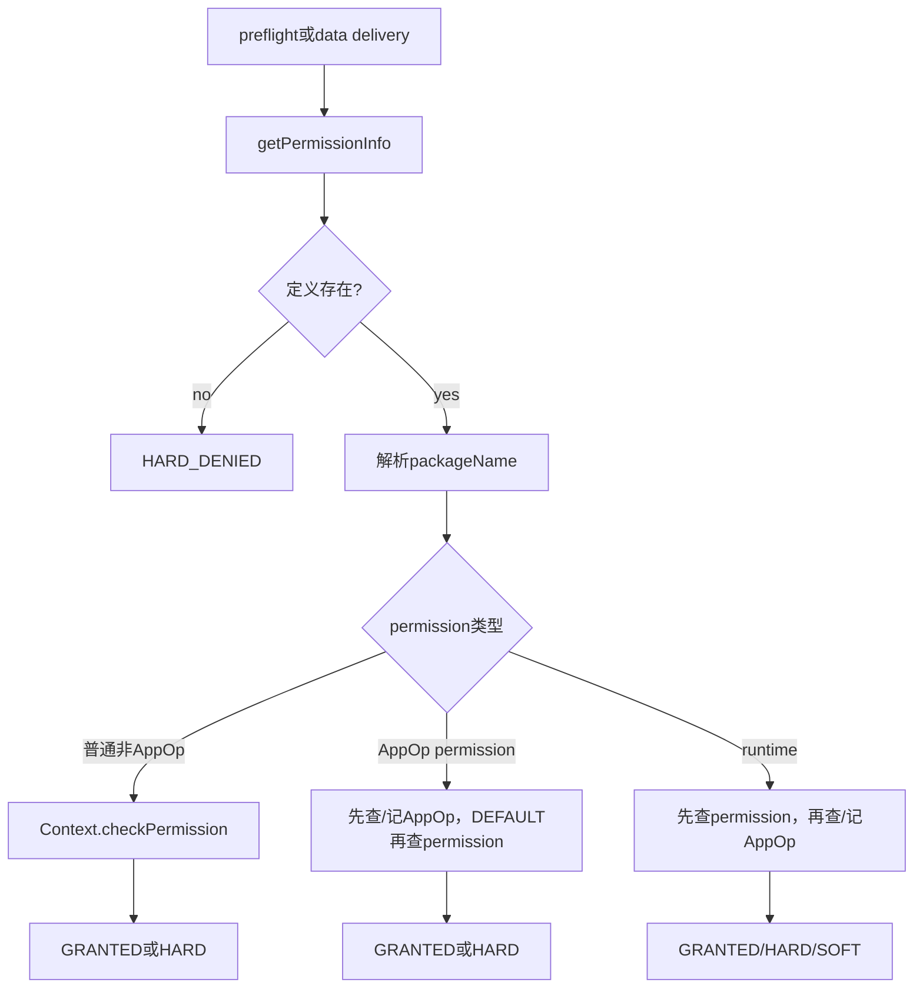
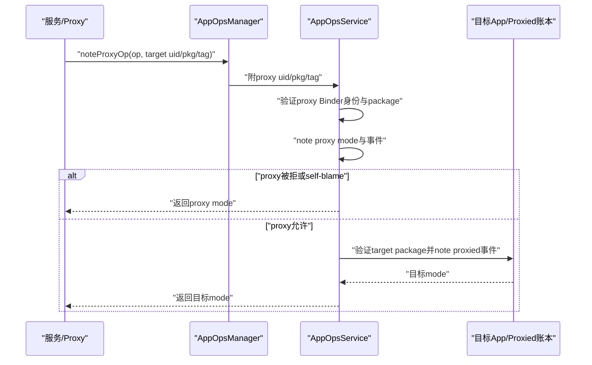
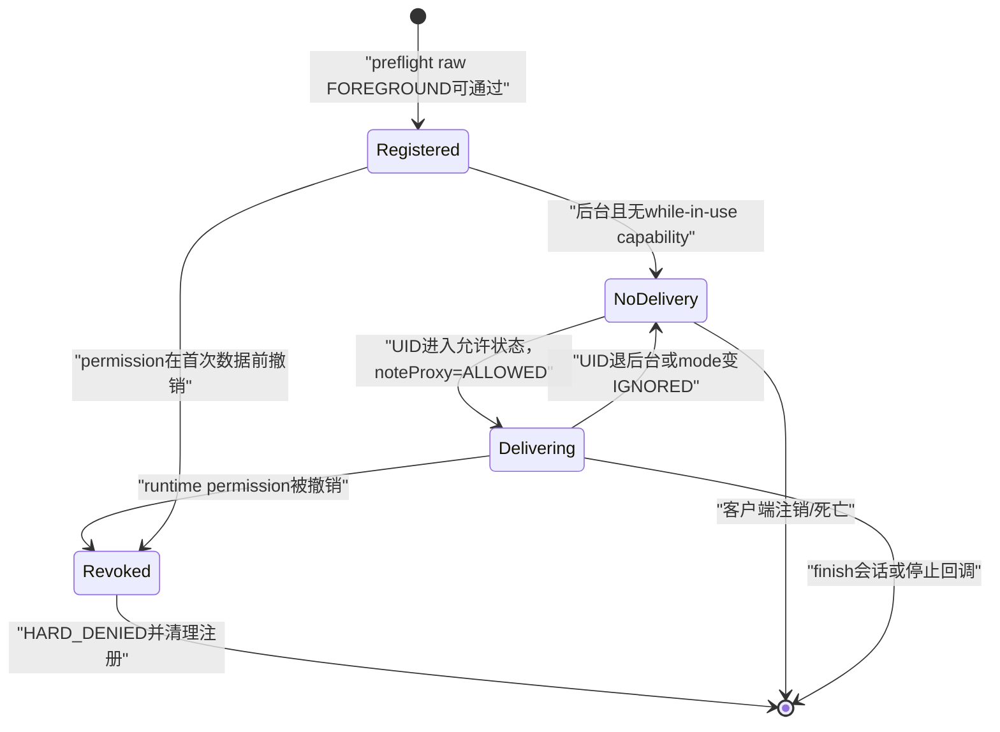

# 269 Android PermissionChecker、AppOps preflight/data delivery、attributionTag与代理归因链

## 1. 本章目标

第268章的`Context.checkPermission()`只回答基础permission位。本章继续解释为什么它已返回GRANTED，位置、相机或麦克风仍可能被拒绝；并读懂“注册监听前预检查”和“真正交付敏感数据时记账”为什么必须使用不同AppOps入口。

## 2. Android 11版本纠偏

本地`android-11.0.0_r48`没有后续Android版本的`android.content.AttributionSource`链式对象，也没有PermissionChecker的链式start/finish data-delivery API。本章严格使用r48已有的`attributionTag`、`noteProxyOp`和单跳proxy/proxied模型，必要处才说明后来模型不应倒灌。

## 3. PermissionChecker解决什么问题

现代runtime permission可能被真正revoke；pre-M兼容应用的危险权限位却可能继续GRANTED，只靠对应AppOp禁用功能。服务若只查permission位，会错误地向已被用户关闭能力的legacy App交付数据；PermissionChecker把两层结果组合起来。

## 4. 三层门先分开

permission grant回答“静态/用户授权是否具备”；AppOp mode回答“此操作现在是否允许”；data delivery note还回答“是否真的发生过一次数据访问并留下记录”。三者不是同一个布尔值。

## 5. 本章源码地图

```text
frameworks/base/core/java/android/content/PermissionChecker.java
frameworks/base/core/java/android/app/AppOpsManager.java
frameworks/base/core/java/android/content/Context.java
frameworks/base/core/java/android/app/ContextImpl.java
frameworks/base/core/java/android/content/pm/parsing/component/
  ParsedAttribution.java
  ParsedAttributionUtils.java
frameworks/base/services/core/java/com/android/server/appop/AppOpsService.java
frameworks/base/core/java/com/android/internal/app/IAppOpsService.aidl
```

## 6. 三种PermissionChecker结果

`PERMISSION_GRANTED`与PackageManager的GRANTED相同；`PERMISSION_HARD_DENIED`等于普通DENIED；`PERMISSION_SOFT_DENIED`是DENIED减一。调用方必须按三值处理，不能只写`result != GRANTED`后完全丢失拒绝类型。

## 7. HARD_DENIED表示什么

非AppOp permission的基础权限被拒；未知permission；需要映射AppOp却找不到op/package；runtime permission位本身未grant；或纯AppOp permission的mode明确拒绝，都会形成hard deny。通常不应继续尝试交付。

## 8. SOFT_DENIED表示什么

只用于runtime permission：permission位已经grant，但对应AppOp当前不允许。它表达“授权合同存在，运行政策暂时或兼容性地挡住”，服务可静默返回空数据、等待前台状态变化或按API合同给可恢复错误。

## 9. preflight是什么

preflight用于尚未交付隐私数据的时刻，例如注册listener、预判能否安排工作。它读取raw AppOp mode，不更新访问时间、次数或隐私使用记录，也不把`MODE_FOREGROUND`按当前UID状态立刻拒绝。

## 10. data delivery是什么

data-delivery检查必须紧邻真实敏感数据交付。r48 PermissionChecker用`noteProxyOpNoThrow()`评价当前状态并记录一次访问/拒绝；即使前几秒preflight成功，交付前仍要重新检查。

## 11. 位置监听例子

注册位置listener时App可能在后台，但稍后进入前台便有资格接收，所以preflight可接受raw FOREGROUND；每次准备发送Location时，data delivery按最新UID state求值，后台则拒绝并记账，前台才交付。

## 12. 公共分派入口

`checkPermissionCommon()`先取得PermissionInfo，再在packageName为空时按UID取包数组第一个元素；之后按定义分类：`isAppOp()`走纯AppOp permission，`isRuntime()`走runtime+AppOp，其他直接调用Context基础检查。

## 13. PermissionInfo每次都查询

源码TODO明确希望缓存平台AppOp/runtime权限定义，但r48这里仍调用PackageManager.getPermissionInfo。PermissionChecker自身没有为PermissionInfo另建专用缓存；性能分析不能把AppOps Binder当成唯一IPC。

## 14. 未知permission直接hard deny

getPermissionInfo抛NameNotFoundException时返回HARD_DENIED，不把未知名字当“无AppOp的普通permission”继续检查。拼写错误因此安全失败。

## 15. packageName为空怎样补

它调用`getPackagesForUid(uid)`并选数组第一项。普通UID通常唯一；shared UID可能多个，数组顺序不代表业务调用包。安全与归因敏感代码最好提供已验证的明确packageName。

## 16. shared UID第一包歧义

permission位可由shared state共享，但AppOps既可有UID mode也可有package mode，attributionTag又属于具体包。自动选第一个包可能把操作记到错误成员，甚至得到不同package mode；“同UID”不能解决包级归因。

## 17. permission定义分类顺序

代码先测`isAppOp()`，再测`isRuntime()`。若某dangerous定义同时带APPOP flag，会走纯AppOp分支而不是runtime分支。分析返回HARD/SOFT时应按真实if顺序，不只看base protection。

## 18. PermissionChecker总体流程



## 19. 普通非AppOp permission

这条分支直接返回Context.checkPermission结果，没有AppOps查询，也不产生访问记录。并非每项permission都能映射AppOp，PermissionChecker不会为它们虚构一条操作日志。

## 20. 纯AppOp permission的第一步

`checkAppOpPermission()`先用`AppOpsManager.permissionToOp()`找op；op或packageName为空直接HARD_DENIED。它没有先要求permission位GRANTED，而是先让AppOp mode决定。

## 21. 纯AppOp的ALLOWED/FOREGROUND

preflight raw mode或data-delivery返回ALLOWED/FOREGROUND时，PermissionChecker直接GRANTED。这里AppOp可作为主要裁决；不要把所有带APPOP flag的permission都套用“permission与AppOp必须同时true”。

## 22. 纯AppOp的MODE_DEFAULT

只有mode为DEFAULT时，代码回退`context.checkPermission()`：基础位GRANTED才GRANTED，否则HARD_DENIED。DEFAULT不是统一等于允许或拒绝，它要求调用层按该op合同选择默认语义。

## 23. 纯AppOp其他mode

IGNORED、ERRORED及其余非允许值都HARD_DENIED。纯AppOp分支不会产生SOFT_DENIED，因为该结果专门描述runtime permission已grant但操作受限。

## 24. runtime分支先查permission

`checkRuntimePermission()`首先调用Context检查，基础位DENIED立即HARD_DENIED，连AppOp都不继续note。这避免把根本无授权的访问当作正常数据交付进行记账。

## 25. runtime没有映射op

permission位已grant，而`permissionToOp()`返回null或packageName为空时，代码直接GRANTED。后者看起来宽松，是因为无法进行包级AppOp；调用者应尽量传正确包名，不能故意用null绕过后再声称完成归因。

## 26. runtime的允许mode

对应op结果为ALLOWED或FOREGROUND时返回GRANTED。preflight raw可直接看到FOREGROUND；data delivery的note通常已按当前UID state把foreground mode评价成ALLOWED或IGNORED，但switch仍兼容FOREGROUND返回值。

## 27. runtime其他mode全是soft deny

IGNORED、ERRORED、DEFAULT等都SOFT_DENIED，因为permission位已通过。特别是DEFAULT没有像纯AppOp分支那样再回退基础位；基础位已经检查过，但r48实现仍把DEFAULT归入soft deny。

## 28. 为什么soft不能一律当成功

soft只说明拒绝原因不是缺少runtime grant，不允许继续交付数据。它可让服务选择兼容的空结果或延迟，而不是越过AppOps。把SOFT_DENIED当GRANTED会绕过用户/前后台策略。

## 29. preflight具体调用raw check

两种permission分支在`forDataDelivery=false`时调用`unsafeCheckOpRawNoThrow(op,uid,package)`。AppOpsService验证op、解析包归属、检查限制，然后返回保存的raw UID/package mode，不把FOREGROUND转换成当前允许/拒绝。

## 30. raw为什么保留FOREGROUND

注册阶段看见FOREGROUND表示“在合适进程状态下可能允许”。若此刻直接评价后台状态并拒绝注册，App稍后进入前台也收不到数据；preflight只筛掉不可能或明确禁用的请求。

## 31. data delivery具体调用noteProxy

`forDataDelivery=true`时用`noteProxyOpNoThrow(op,proxiedPackage,proxiedUid,tag,message)`。调用PermissionChecker的服务/进程成为proxy，目标App成为proxied；AppOpsService既检查代理端mode，也检查目标端mode并留下代理信息。

## 32. 为什么不是普通noteOp

系统服务代表客户端访问传感器/数据，若只note服务自己的android包，会把隐私使用算给错误主体；若只伪装成客户端普通note，又丢失是谁代理。proxy note同时表达“谁代办”和“数据归谁”。

## 33. Self/Calling/OrSelf包装方法

PermissionChecker同样提供Self、Calling、CallingOrSelf的preflight/data-delivery组合。Calling版本若callingPid等于myPid直接HARD_DENIED；OrSelf本地时补Context package/attributionTag，外部调用则允许packageName为空后解析。

## 34. Calling版本为何拒绝self

它继承第268章Context.checkCallingPermission的防误用思想：只用于正在处理的外部IPC。本地调用若靠服务自身权限通过，会掩盖调用结构错误。

## 35. OrSelf如何选择包名

本地调用使用`context.getPackageName()`；外部调用传null，让common按callingUid查第一个包。shared UID Binder caller最好由上层传入并验证显式包名，否则归因仍有歧义。

## 36. Self如何取得attributionTag

Self data-delivery传`context.getPackageName()`和`context.getAttributionTag()`；如果Context是通过`createAttributionContext(tag)`创建，访问记录就落到该tag。普通Context则tag为null，表示默认归因。

## 37. attributionTag是什么

它是同一包内区分“哪项功能/模块使用敏感能力”的字符串，例如LocationService或CountryDetector。它不是另一个UID、不是permission名字，也不是不可伪造的调用者身份。

## 38. createAttributionContext做什么

ContextImpl创建一个携带新`mAttributionTag`的Context视图，包、UID和LoadedApk不变。后续AppOps调用从Context取tag。创建Context本身不等于开始访问，也不自动note任何op。

## 39. Manifest attribution声明

包可在Manifest顶层写`<attribution android:tag="..." android:label="...">`。解析器要求tag和label，tag最长50字符；整个包最多1000项且tag必须唯一。

## 40. inherit-from的意义

attribution可列历史tag进行继承，用于重命名/迁移归因。校验要求inherit-from不能同时还是当前声明tag，且同一个旧tag不能被多个新tag重复继承，避免历史数据归属歧义。

## 41. 无效组合会让包解析失败

ParsingPackageUtils在完成组件解析后调用`ParsedAttribution.isCombinationValid()`；超过数量、重复tag或继承冲突都会返回解析错误。它不是AppOps运行时才随便接受的一组label。

## 42. AppOps运行时怎样验证tag

`verifyAndGetBypass(uid,package,tag)`先验证package真实属于uid，再遍历包声明的attributions。null tag总有效；找不到声明tag时r48只打印error，TODO写着未来改成enforcement，当前并不因此拒绝op。

## 43. 未声明tag仍可能被记账

由于只记录日志，调用者使用未声明tag后，Ops仍可把它加入knownAttributionTags并建立AttributedOp。这是r48兼容边界，不代表最佳实践；正式代码应声明tag并提供用户可读label。

## 44. attributionTag不是安全边界

服务端不能因tag等于`trusted_feature`就授予更多权限。真正身份仍是Binder uid+package归属，tag用于细分审计与历史。r48未强制声明更说明它不适合作鉴权凭证。

## 45. r48没有AttributionSource链

本章只能记录proxy Context的一项tag和proxied App的一项tag，AppOps事件也保存一层proxyUid/package/tag。A→B→C多跳来源链、链token和统一start/finish属于后续版本模型，不能引用到r48控制流。

## 46. noteProxy传入哪些身份

AppOpsManager从参数取得proxiedUid/package/tag；proxyUid固定`Process.myUid()`，proxy package固定Context的opPackageName，proxy tag取Context attributionTag。客户端不能通过这条封装随意伪造proxy身份。

## 47. AppOpsService先验证proxy UID

`noteProxyOperation()`调用`verifyIncomingUid(proxyUid)`，确保传入proxyUid与Binder caller匹配，除非调用者具备相应管理能力。随后校验op code并解析proxy package是否属于该UID。

## 48. trusted proxy怎么判定

proxy UID拥有`UPDATE_APP_OPS_STATS`、满足r48受信任voice service特殊条件，或Binder caller UID等于proxiedUid时，被标为trusted；否则是untrusted proxy。信任影响事件flags和异步采集，不会跳过双方mode裁决。

## 49. 为什么有voice service特例

源码注释明确这是R QPR无法新增API时的workaround，只对当前语音识别器同时是voice interactor、且op为RECORD_AUDIO开放trusted proxy。它不是所有语音服务或所有AppOp的通用白名单。

## 50. 代理端先被note

服务先对proxy UID/package执行`noteOperationUnchecked()`，用TRUSTED_PROXY或UNTRUSTED_PROXY flag记账。proxy mode不是ALLOWED时立即返回，proxied端根本不再note。系统服务自身也必须满足该op策略。

## 51. self-blame为何不双记

若Binder callingUid等于proxiedUid，代码在proxy note后直接返回，避免同一UID既作为proxy又作为proxied重复记录。这常见于进程检查自身但调用了proxy接口的兼容路径。

## 52. 目标端再验证package

proxy允许后，服务用proxiedUid解析proxiedPackage；不匹配或无法解析返回IGNORED。正确提供UID但伪造另一个包名不能把隐私访问嫁祸给别人。

## 53. 目标端事件保存proxy信息

proxied `AttributedOp.accessed()`同时接收proxyUid、proxyPackage和proxyAttributionTag，形成`OpEventProxyInfo`。查询AppOps历史时可看到目标访问背后的单跳代理来源。

## 54. trusted/untrusted flags

代理事件用TRUSTED_PROXY/UNTRUSTED_PROXY，目标事件用TRUSTED_PROXIED/UNTRUSTED_PROXIED。历史统计和隐私报告可据此区分可信系统代办与普通代理，而不是只有一个“访问过”计数。

## 55. 代理note时序图



## 56. AppOp五种常见mode

DEFAULT使用op默认/上层回退语义；ALLOWED允许；IGNORED静默拒绝；ERRORED通常表示身份/策略错误并可能被throwing API转SecurityException；FOREGROUND表示只在UID状态与capability满足时允许。

## 57. raw与evaluated mode

`checkOperationRaw()`返回保存的FOREGROUND；普通`checkOperation()`和note/start会调用UidState.evalMode，将它按当前进程状态转成ALLOWED或IGNORED。preflight需要raw，真实交付需要evaluated。

## 58. UidState不只看“有没有前台进程”

evalMode会考虑可见AppWidget、pending-top UID、UID state阈值以及PROCESS_CAPABILITY_FOREGROUND_LOCATION/CAMERA/MICROPHONE。前台服务是否能访问while-in-use能力取决于capability传播，不是所有foreground service都自动满足。

## 59. CAMERA/MIC即使raw ALLOWED也有额外门

r48 UidState.evalMode对OP_CAMERA和OP_RECORD_AUDIO在mode为ALLOWED时仍检查pending-top、临时FGS while-in-use allowlist或对应capability，否则返回IGNORED。不要把ALLOWED字面理解为所有状态无条件允许。

## 60. LOCATION的FOREGROUND评价

当mode为FOREGROUND且UID不是TOP但仍在op允许的较前台state范围，位置类op还要求FOREGROUND_LOCATION capability；没有则IGNORED。进程状态与capability共同决定while-in-use。

## 61. package mode与UID mode优先级

note时先查switch op；若UidState有该switchCode的非默认UID mode，它优先于package mode。否则取目标package的Op mode。第266章PermissionPolicy常同步UID mode，原因正是shared UID和前后台权限需要统一裁决。

## 62. switch op是什么

多个细分op可映射到同一个控制switch，例如相关操作共用设置开关。AppOpsService用`opToSwitch(code)`找到策略mode，却仍把访问事件记在原始code的AttributedOp上。控制粒度和审计粒度可以不同。

## 63. restriction早于mode允许

设备级user restriction、包挂起、音频限制等可让`isOpRestricted...`返回IGNORED，即使保存mode是ALLOWED。AppOp最终结果是多种策略合成，不是只读一格XML。

## 64. check不留下访问记录

unsafeCheckOpRaw用于预判，只返回mode；不会更新last access、reject count或proxy info。若服务拿它代替真实delivery note，隐私仪表盘和审计历史会漏掉实际数据使用。

## 65. note留下瞬时访问或拒绝

noteOperationUnchecked允许时调用`AttributedOp.accessed()`，拒绝时调用`rejected()`并通知watcher；它记录一个瞬时事件，不表示资源持续占用。PermissionChecker data delivery正适合“一次发送一份数据”。

## 66. message有什么用

data-delivery API接收说明原因的message，system UID或异步noted-op收集模式可把它用于运行时访问消息/采样。message是审计描述，不参与permission或mode放行。

## 67. async noted op收集

AppOpsManager会根据collectionMode选择SELF、SYNC或ASYNC收集；异步模式message为空时可生成格式化stack trace。服务端再把事件投给noted-op观察者或运行时访问采样，和核心mode返回并行。

## 68. start/finish适合持续操作

AppOpsManager另有`startOpNoThrow()`与`finishOp()`：start建立in-progress event并通过clientId绑定死亡，finish累计duration并结束active状态。相机预览、录音会话等持续使用比单次note更适合这套协议。

## 69. PermissionChecker r48不会替你start

本章data-delivery方法只调用noteProxyOp，没有startProxy/finishDataDelivery。长时服务若只在开始时调用PermissionChecker，会留一次note却没有持续duration；具体子系统仍需自己使用start/finish或周期性delivery note。

## 70. r48没有startProxyOp

IAppOpsService有noteProxyOperation，但startOperation只处理self UID/package，事件注释也写startOp events不支持proxy。后续版本新增的代理持续交付协议不能假设在r48存在。

## 71. start时MODE_DEFAULT参数

startOp带`startIfModeDefault`，允许调用合同选择DEFAULT是否启动；noteOperation没有同样参数。PermissionChecker runtime分支把DEFAULT视为soft deny，不能直接拿start的默认策略替它解释。

## 72. finish参数必须完全一致

AppOpsManager文档要求op、uid、package、attributionTag与start一致，服务端还用同一个clientId定位。参数错会打印“op/attribution not found”或无法结束，导致active记录直到Binder死亡清理。

## 73. Binder death怎样收尾

in-progress event把clientId注册死亡监听；客户端进程死亡会finish并释放记录，避免永久active。它是异常清理，不替代正常finally调用finish。

## 74. active watcher看什么

start/finish边沿会通知active watchers；note只产生noted watcher/历史事件。SystemUI隐私指示器需要理解瞬时访问和持续活动的差别，不能只监听一种回调覆盖所有API。

## 75. legacy App为什么更依赖AppOps

targetSdk低于M的危险权限不会像现代App那样简单revoke，否则旧代码可能崩溃；用户关闭后平台常保持permission位并把AppOp置IGNORED。PermissionChecker能返回SOFT_DENIED，让服务提供no-op/空数据兼容行为。

## 76. 现代App也不能跳过AppOps

现代runtime grant仍可能因“仅使用中”、Device Policy、传感器隐私、自动策略或用户单独AppOp设置而受限。permission位是必要但不总充分条件。

## 77. permissionToOp映射可能为空

不是所有dangerous permission都有AppOp，也可能有AppOp不对应公开permission。映射为空时runtime分支只看permission；直接操作AppOp的服务则必须使用明确op，不能期待PermissionChecker自动覆盖所有平台政策。

## 78. checkOpNoThrow与unsafe raw别混

普通checkOperation评价UID state；AppOpsManager某些`checkOpNoThrow`包装还会把FOREGROUND翻成ALLOWED以适配旧API。PermissionChecker明确选择`unsafeCheckOpRawNoThrow`，就是为了preflight保留FOREGROUND信号。

## 79. check也会验证UID/package

AppOpsService的checkOperation解析package并调用verifyAndGetBypass；不匹配时捕获SecurityException并返回该op默认mode，note则通常返回ERRORED/IGNORED。预检查不是完全不做身份验证，但失败表现与note不同。

## 80. root package验证特例

verifyAndGetBypass对ROOT_UID为兼容性跳过packageName检查。root工具可用非标准包名操作AppOps；普通UID不能据此伪造归因。

## 81. invalid attributionTag只日志的风险

包名不属于UID会抛SecurityException，tag未声明却只Slog.e；两者强度不同。安全审计发现未知tag时应视作元数据质量问题，不能误判成包身份已被伪造。

## 82. inherit-from不是运行时权限继承

它只迁移attribution历史语义，不把一个tag的permission或AppOp mode授给另一个tag。mode主要仍按UID/package/switch op控制；tag用于AttributedOp细分。

## 83. attribution label面向用户

Manifest要求label资源，是为了隐私UI能解释包内哪项功能访问。label不会被PermissionChecker读取来决定结果，也不能代替message：前者是稳定功能名，后者是这次访问原因。

## 84. 选择错误tag的后果

访问通常仍可进行，但历史会分到错误/未知Attribution bucket，用户看到的功能归因可能失真，迁移inherit-from也失效。它是可观察的隐私质量缺陷。

## 85. proxy Context的tag代表谁

`mContext.getAttributionTag()`是代理服务自身功能tag；PermissionChecker参数的attributionTag是目标App tag。两者分别写进proxyInfo和目标AttributedOp，不能用同一个变量含糊传递。

## 86. packageName自动选择的安全边界

common先选UID第一包，noteProxy随后验证该包确属UID，所以不会嫁祸给别的UID；但shared UID多个合法包间仍可能选错。验证“属于UID”不等于验证“就是发起业务请求的成员”。

## 87. 代理服务也可能被AppOp拒绝

noteProxy先评价proxy mode，意味着一个自身被限制的服务不能单靠目标App允许就代办。排查data delivery soft/hard deny时要分别查看proxy与proxied两边AppOps记录。

## 88. 返回的是哪一边mode

proxy拒绝时返回proxy mode；proxy允许且非self时返回proxied mode。因此单个IGNORED不告诉调用者是哪一端失败，需结合AppOps dump中TRUSTED_PROXY/PROXIED事件、uid/package和reject记录定位。

## 89. PermissionChecker把proxy拒绝怎样分类

纯AppOp permission把非允许mode变HARD；runtime permission基础位已grant时把同样mode变SOFT。分类依据permission定义分支，不依据拒绝发生在proxy还是proxied。

## 90. preflight不会先检查proxy mode

preflight直接查目标uid/package的raw op，没有用noteProxy评价当前服务自身；真正delivery时proxy也必须允许。因此preflight成功只是目标未来可能允许，不承诺整个代理链已可交付。

## 91. 注册成功不保证第一次回调

App注册listener通过preflight后，可能一直后台、AppOp被用户关闭、服务proxy受限或包被挂起。服务可以保留注册但跳过数据；API应明确这种状态，而不是把注册返回值当永久授权。

## 92. 每次delivery都应重新评价

UID state和AppOp mode随前后台、设置与policy变化。高频数据可按服务设计批次/会话合理检查，但不能只在注册时永久缓存GRANTED；权限撤销后继续发送是严重隐私问题。

## 93. check与note之间仍有竞态

即使data delivery紧邻发送，mode也可能在note后、真正写Binder/共享内存前变化。平台通常接受一次原子边界附近的检查，并通过持续AppOps、回调、会话终止进一步收敛；不存在跨所有层绝对无竞态的布尔快照。

## 94. soft deny的调用方策略

监听型API可暂不回调，查询型API可返回空/模糊结果或平台规定错误，持续资源应停止会话。具体策略由服务合同决定，但共同点是不能交付完整受保护数据。

## 95. hard deny的调用方策略

通常拒绝注册、抛SecurityException或返回明确权限错误；legacy兼容API也可能选择空结果。PermissionChecker只分类，不替业务方法决定异常还是错误码。

## 96. 不要重复note同一份数据

调用链多层服务若每层都对同一交付noteProxy，历史会重复计数。应明确哪一层是实际数据交付边界，其他层只做preflight或使用受控归因协议。r48没有完整多跳链，更需人工约定。

## 97. ContentProvider是实际范例

r48 ContentProvider transport接收calling package与attributionTag，先做读写permission/URI grant，再对配置的read/write AppOp调用noteProxyOp。它展示组件permission与AppOps data note如何在真实数据入口组合。

## 98. URI grant不能替代AppOps

ContentProvider可能因临时URI grant允许路径访问，但若Provider配置read/write AppOp，仍要note并根据mode拒绝或降级。对象级grant、组件permission和AppOp依旧正交。

## 99. preflight端到端

服务在注册入口保存可信uid/pid/package，PermissionChecker取定义、补包名、基础检查runtime grant，再raw check目标AppOp；FOREGROUND视为“未来可能”，不写访问记录，返回GRANTED/HARD/SOFT供注册策略使用。

## 100. data delivery端到端

发送数据前重新取可信身份，先验证基础permission，再noteProxy；AppOps验证proxy Binder身份与双方包归属，评价proxy与proxied当前mode/restriction/UID state，写attribution/proxy访问或拒绝事件，最终结果通过后才发送数据。

## 101. 持续操作端到端

开始资源前permission+AppOp评价，通过后`startOp`建立active event；会话期间监听mode/进程死亡并停止数据；结束或异常finally调用finish；Binder death兜底清理。r48 proxy持续归因能力有限，具体服务常维护自己的客户端账。

## 102. 结果真值表

runtime位拒绝→HARD；runtime位允许且op ALLOWED/有效FOREGROUND→GRANTED；runtime位允许但op其他→SOFT。纯AppOp定义：mode ALLOWED/FOREGROUND→GRANTED，DEFAULT再看permission，其他→HARD。普通定义只看permission。

## 103. 前后台状态变化图



## 104. 调试第一步看定义类型

先用getPermissionInfo确认base protection和APPOP flag，再查permissionToOp。若一开始分支判断错，后面把HARD/SOFT、DEFAULT回退和note行为都解释反。

## 105. 调试第二步拆双方账本

对代理访问分别记录proxy uid/package/tag、proxied uid/package/tag、raw mode、evaluated mode、UID state/capability、restriction和permission grant。只看目标App设置页不足以解释proxy端拒绝。

## 106. 调试第三步确认检查时机

注册失败看preflight；注册成功无回调看delivery note与UID state；隐私记录缺失看是否误用unsafeCheck；持续指示器不消失看start/finish配对与client death。

## 107. 审计message与tag不能代替身份

两者都可改善说明和归因，但放行仍依赖uid/package/permission/mode。服务必须先从Binder验证包归属，不能信任客户端自报“我是导航模块”tag或“为了紧急任务”message。

## 108. r48与后续版本的迁移提醒

阅读新分支看到AttributionSource、next链、registered token、startDataDelivery/finishDataDelivery时，应重画链式信任与持续归因；不要反向修改本章。r48的一层proxy模型无法表达完整多跳责任链。

## 109. 代码评审清单一：入口

调用的是preflight还是data delivery？是否真的即将交付？uid/pid/package是否来自可信Binder身份？packageName为空是否遇到shared UID？Calling版本是否在本地调用中意外hard deny？

## 110. 代码评审清单二：结果

是否区分HARD与SOFT？FOREGROUND在preflight与delivery含义是否分开？DEFAULT在纯AppOp与runtime分支是否按不同代码处理？失败后有没有继续发送缓存/共享内存数据？

## 111. 代码评审清单三：归因生命周期

tag是否Manifest声明、属于哪一端？proxy与proxied是否各记一次？瞬时note还是持续start/finish？异常和Binder death能否收尾？是否误把Android 12 AttributionSource API套到r48？

## 112. macOS只读练习一：手算三值结果

```bash
cd /Users/ninebot/androidSource
sed -n '395,490p' frameworks/base/core/java/android/content/PermissionChecker.java
rg -n 'PERMISSION_(GRANTED|SOFT_DENIED|HARD_DENIED)' \
  frameworks/base/core/java/android/content/PermissionChecker.java
```

目标：为普通permission、纯AppOp permission、runtime permission分别填写ALLOWED/FOREGROUND/DEFAULT/IGNORED结果表。

## 113. macOS只读练习二：对比raw与delivery

```bash
cd /Users/ninebot/androidSource
sed -n '2868,2950p' frameworks/base/services/core/java/com/android/server/appop/AppOpsService.java
sed -n '500,610p' frameworks/base/services/core/java/com/android/server/appop/AppOpsService.java
```

目标：对后台UID的LOCATION、CAMERA、MICROPHONE手算raw FOREGROUND/ALLOWED经过evalMode后的结果，并指出capability参与点。

## 114. macOS只读练习三：追单跳proxy记账

```bash
cd /Users/ninebot/androidSource
sed -n '7570,7635p' frameworks/base/core/java/android/app/AppOpsManager.java
sed -n '3000,3055p' frameworks/base/services/core/java/com/android/server/appop/AppOpsService.java
```

目标：画出proxy先note、目标后note的短路顺序，列出trusted判定、四种proxy/proxied flags及self-blame不双记分支。

## 115. macOS只读练习四：验证attribution与持续操作

```bash
cd /Users/ninebot/androidSource
sed -n '35,145p' frameworks/base/core/java/android/content/pm/parsing/component/ParsedAttributionUtils.java
sed -n '3885,3960p' frameworks/base/services/core/java/com/android/server/appop/AppOpsService.java
sed -n '7935,8060p' frameworks/base/core/java/android/app/AppOpsManager.java
```

目标：列出tag解析约束、未声明tag的r48行为，并写一段start成功后finally finish的只读伪代码；说明为何PermissionChecker noteProxy不能替代持续active记录。

## 116. 常见误解一：permission GRANTED就能交付数据

错误。runtime AppOp、UID前后台/capability、proxy端mode、目标端mode、user restriction和包挂起都可能拒绝。基础permission只是完整裁决的一层。

## 117. 常见误解二：preflight成功应记入隐私历史

错误。注册或预判尚未发生数据访问，故用raw check且不留delivery记录；真正发送时才note。反过来用preflight发送数据会造成漏记和前后台误判。

## 118. 常见误解三：Android 11已有AttributionSource多跳链

错误。r48只有attributionTag和一层noteProxy，持续startOp也不支持proxy。看到新版本类名时必须按版本重读，不能把后来的责任链协议套入本章。

## 119. 复读后补上的r48窄边界

复读确认：分类先isAppOp后isRuntime；runtime的MODE_DEFAULT归SOFT而纯AppOp DEFAULT回退permission；null包取shared UID第一包；preflight不检查proxy端；未声明tag只日志不拒绝；CAMERA/MIC raw ALLOWED仍可能被while-in-use capability评价为IGNORED；noteProxy先记proxy、self-blame不双记，且r48无startProxy/AttributionSource链。

## 120. 本章小结与下一章

PermissionChecker用三值结果把permission与AppOps组合：preflight保留raw FOREGROUND且不记数据，delivery通过单跳noteProxy评价双方当前状态并留下attribution/proxy历史；持续操作仍要独立start/finish。下一章进入第270章，继续读取AppOpsService的mode存储、UID/package优先级、watcher、历史持久化与用户限制完整状态机。
