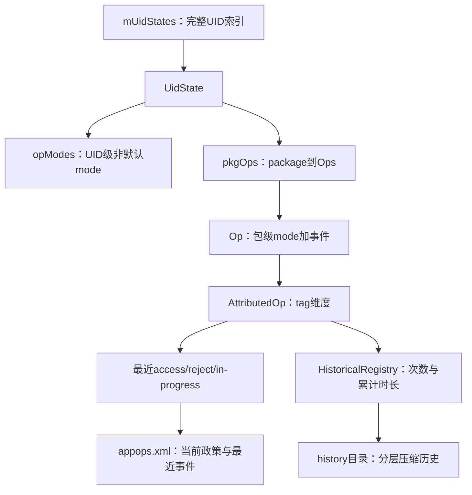
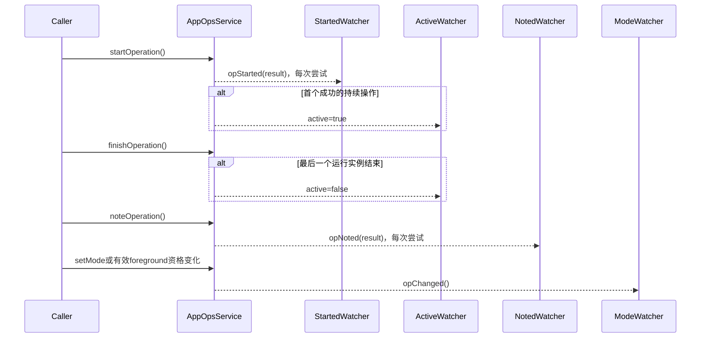
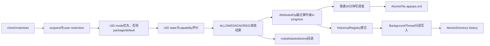

# 270 Android AppOpsService：mode存储、UID/package优先级、watcher、历史持久化与用户限制状态机

## 1. 本章目标

第269章从调用者一侧看了PermissionChecker如何把permission与AppOp组合。本章进入`AppOpsService`内部，回答五个更底层的问题：mode究竟存在哪里；UID级与package级规则谁优先；四类watcher各在观察什么；`appops.xml`和history目录分别保存什么；用户限制、应用挂起与foreground mode怎样参与最终裁决。

## 2. 版本与阅读边界

本文只描述本地`android-11.0.0_r48`。Android 11已有attributionTag、UID state/capability和分层历史，但没有后续版本拆出的独立`AppOpsCheckingService`，也没有多跳`AttributionSource`持续代理链；因此不要拿新版本类名反推本章源码。

## 3. 先建立“三本账”模型

第一本是“政策账”：UID或package对某个switch op保存的mode。第二本是“最近事件账”：每个attributionTag、UID state和flags组合的最近允许、最近拒绝、持续时长及proxy。第三本是“历史统计账”：按时间区间压缩的访问次数、拒绝次数和累计时长。三者服务不同问题，不能把“允许不允许”和“过去访问过几次”混成一张表。

## 4. 当前状态不等于完整历史

`appops.xml`虽然也写最近访问/拒绝时间，却只保留每个key的最后事件；`/data/system/appops/history`则保存聚合统计并随时间降低精度。前者适合恢复当前政策和最近证据，后者适合回答某段时间内的次数与时长。

## 5. 本章源码地图

```text
frameworks/base/services/core/java/com/android/server/appop/
  AppOpsService.java
  HistoricalRegistry.java
  AudioRestrictionManager.java
frameworks/base/core/java/android/app/AppOpsManager.java
frameworks/base/core/java/com/android/internal/app/IAppOpsService.aidl
frameworks/base/core/java/com/android/internal/app/
  IAppOpsCallback.aidl
  IAppOpsActiveCallback.aidl
  IAppOpsStartedCallback.aidl
  IAppOpsNotedCallback.aidl
```

## 6. 最外层索引mUidStates

`SparseArray<UidState> mUidStates`以完整Linux UID为key，所以user 0的appId 10001与user 10的同一appId是两条记录。多用户隔离不是在package map末端补一个user字段，而是从顶层UID索引就分开。

## 7. UidState不只是进程前后台

它同时保存`state/pendingState`、`capability/pendingCapability`、widget可见性、package状态`pkgOps`、UID级mode `opModes`，以及foreground watcher的派生信息。名字叫UidState，实际是“某UID所有AppOps政策和运行态的根对象”。

## 8. pending状态为何存在

UID从前台降到后台时并非所有变化都立即提交，服务用settle time避免界面短暂切换造成敏感能力抖动。升到更重要状态通常要及时生效，降级则可延迟；所以调试时应同时看current与pending，不能只盯一个procState快照。

## 9. pkgOps与opModes的分工

`UidState.opModes`保存“整个UID”的非默认switch-op mode；`UidState.pkgOps`是`packageName -> Ops`，继续保存包级mode和事件。shared UID内多个包会共享前者，但各自仍可拥有后者和各自的attributionTag。

## 10. Ops对象是什么

`Ops extends SparseArray<Op>`，key是op code；它还绑定packageName、所属UidState、限制绕过属性`bypass`以及manifest已知attributionTag缓存。一个Ops可理解为“某UID下某package的AppOps抽屉”。

## 11. Op对象保存两类内容

每个`Op`既有package级`mode`，又有`attributionTag -> AttributedOp`事件集合。政策通常按switch op读取，事件却按原始op记录；例如多个细分操作可以受同一个总开关控制，但仍分别留下访问痕迹。

## 12. AttributedOp的三组容器

`mAccessEvents`保存最近成功访问，`mRejectEvents`保存最近拒绝，`mInProgressEvents`保存尚未finish的持续操作。前两者按`makeKey(uidState, flags)`索引，运行中事件按客户端Binder token索引，因此同一tag可同时容纳不同调用来源和不同生命周期。

## 13. 三本账与主对象关系图



## 14. switch op是政策归并键

入口先用`AppOpsManager.opToSwitch(code)`把原始op映射到控制它的switch op。`setMode()`、`setUidMode()`和check政策都围绕switch code；note/start仍把原始code写入事件，这就是“一个旋钮控制一组动作，但审计还能区分动作”的实现。

## 15. default mode不是固定ALLOWED

没有显式记录时返回`opToDefaultMode(code)`，不同op的默认值可能不同。`MODE_DEFAULT`又是一个可返回的mode语义，不能一概把“表中没有条目”“默认mode字段”和`MODE_DEFAULT`常量当成同一回事。

## 16. raw检查与evaluated检查

`checkOperationRaw()`要求返回存储政策，`checkOperation()`则对UID运行态求值。raw看到`MODE_FOREGROUND`仍是FOREGROUND；evaluated可能根据widget、pending-top、UID state与capability变成ALLOWED或IGNORED。

## 17. check的第一道门：包解析与身份验证

服务先解析packageName，再用UID/package关系校验。解析失败直接IGNORED；身份不匹配抛出的SecurityException在unchecked层被捕获后返回该op默认mode并记录错误。源码诊断必须区分“策略拒绝”与“包身份本身不可信”。

## 18. 应用挂起比mode更早

`isOpRestrictedDueToSuspend()`先判断目标package是否被suspend；r48的`OPS_RESTRICTED_ON_SUSPEND`包括音频播放、录音和相机等。命中后直接IGNORED，不再让UID/package mode把它放行。

## 19. 用户限制也在mode之前

`isOpRestrictedLocked()`遍历所有restriction token，只要任一客户端对该用户/op设限且package不在例外列表，就返回IGNORED。它是外层强制门，不是写一条package mode，所以reset mode不会清除用户限制。

## 20. UID级mode优先于package级mode

检查顺序非常明确：若`UidState.opModes`存在该switch code，立即使用它；只有UID层没有显式项，才找package的Op mode。shared UID中一个UID mode因此覆盖所有成员包的package差异。

## 21. package项不存在怎么办

`getOpLocked(..., edit=false)`找不到package或op时不创建对象，直接返回op默认mode。只读check本身不会为了“查一次”污染状态；note/start等编辑路径才会建立对象并安排写盘。

## 22. 最小裁决伪代码

```java
if (suspended || userRestricted) return MODE_IGNORED;
switchCode = opToSwitch(code);
if (uidState.opModes contains switchCode) {
    return raw ? uidMode : uidState.evalMode(code, uidMode);
}
Op op = findPackageOpWithoutCreating(switchCode);
if (op == null) return opToDefaultMode(switchCode);
return raw ? op.mode : op.evalMode();
```

注意评价UID mode时传入的是原始`code`，因为不同原始op的foreground capability规则可能不同。

## 23. MODE_FOREGROUND的第一组放行条件

widget可见、AMS认定为pending-top，或UID state达到TOP，都直接ALLOWED。这几条体现“用户正在看见或马上看见该应用”的临时资格，不要求再查location/camera/microphone capability。

## 24. 第一无限制UID状态

若进程不在TOP但仍不劣于`resolveFirstUnrestrictedUidState(op)`，普通op可放行；位置、相机、麦克风则继续要求对应process capability。于是“前台服务”不是天然拥有所有while-in-use能力，进程状态和能力位必须组合判断。

## 25. 三类process capability

位置看`PROCESS_CAPABILITY_FOREGROUND_LOCATION`，相机看FOREGROUND_CAMERA，录音看FOREGROUND_MICROPHONE。能力由AMS/OomAdjuster根据组件、绑定和权限语义传播给UID，AppOps只消费最终位，不自行重新推导组件图。

## 26. MODE_ALLOWED也不总是最终允许

r48对CAMERA和RECORD_AUDIO还有while-in-use保护：即使存储mode是ALLOWED，UID若既非pending-top、也无合适临时allowlist/能力，评价后仍可IGNORED。这是第269章“raw ALLOWED仍可能被挡住”的服务端根源。

## 27. 为什么要保留raw API

设置页、策略同步和preflight常常需要知道“配置是什么”，而不是“这一毫秒进程是否前台”。若只提供evaluated结果，MODE_FOREGROUND在后台会看起来像永久IGNORED，调用方将无法区分可随状态恢复的限制。

## 28. setUidMode的授权边界

同进程调用可通过；profile owner只可更改自己user内目标UID；其他调用者需要`MANAGE_APP_OPS_MODES`。这条授权只允许改mode，不会绕过后续UID/package合法性、用户限制或挂起门。

## 29. setUidMode先归并到switch code

入口先`verifyIncomingOp(code)`，随后`code = opToSwitch(code)`。因此为一组中的任意成员设置UID mode，实际写入同一个switch key；回调时再根据listener flags决定报告switch还是受影响成员。

## 30. UID层只保存非默认项

目标mode等于该switch op默认值时会删除`opModes`条目；整个SparseIntArray空后设为null。这样“恢复默认”不是再存一条default，而是移除覆盖，让下层package mode重新有机会生效。

## 31. previousMode的细节

UID从未建立或`opModes==null`时，`previousMode`记为`MODE_DEFAULT`。但若数组非空而目标key缺失，r48直接调用无默认参数的`SparseIntArray.get(code)`，得到0，也就是`MODE_ALLOWED`；这不一定等于该op真实默认值。还有一个不对称：全新UidState设置默认值会直接return，已有UidState但`opModes==null`时设置默认值虽不写盘，却仍走通知。`previousMode`只是这条实现传给同步消费者的值，不能当可靠的“此前有效mode”查询结果。

## 32. setUidMode为何用普通延迟写

它调用`scheduleWriteLocked()`，默认延迟30分钟；短时间内多次改变可合并。进程内状态立即生效，延迟的只是磁盘持久化，而不是裁决延迟30分钟。

## 33. runtime permission兼容标志联动

非PermissionPolicy回调触发的setUidMode会调用`updatePermissionRevokedCompat()`。它遍历该switch映射的权限，把mode映射到`FLAG_PERMISSION_REVOKED_COMPAT`，帮助legacy授权位与AppOps禁用状态表达一致。

## 34. background permission的特殊映射

有backgroundPermission时，后台权限只在mode为ALLOWED时不标兼容撤销；前台权限在ALLOWED或FOREGROUND时都可保持。因为FOREGROUND表达“前台仍可用、后台不可用”，不能把前后景两层权限一起标成撤销。

## 35. shared UID第一包边界

`updatePermissionRevokedCompat()`取得`getPackagesForUid(uid)`后只选择`packageNames[0]`检查和改flag。UID mode本来覆盖整个shared UID，但兼容permission flag联动只落第一包，是阅读源码时必须记录的实现边界，不能宣称所有成员逐包同步。

## 36. 现代targetSdk不鼓励用mode代替撤权

若支持runtime permission的应用仍持有危险权限，却通过setUidMode制造不一致，源码会警告应真正revoke runtime permission。AppOps可承担兼容策略，却不是现代权限状态的任意替代品。

## 37. UID mode变化怎样通知包

服务查询该UID全部package，把op watcher和各package watcher合并去重，再异步投递。因为UID政策会影响shared UID全部成员，只通知调用时传入的一个包会遗漏真实影响面。

## 38. 同步StorageManager通知

mode变化还调用`StorageManagerInternal.onAppOpsChanged()`。这条LocalServices回调是同步的，与Handler异步mode watcher不同；分析延迟或锁风险时应分别看本地同步消费者和Binder callback消费者。

## 39. setMode是包级覆盖

它同样先验权、校验op并转switch code，然后严格验证UID/package关系并获取restriction bypass属性。身份不匹配会记录`Cannot setMode`并返回，避免给伪造包名创建政策。

## 40. setMode为何快速写盘

包级mode改变调用`scheduleFastWriteLocked()`，固定10秒；若已有普通写任务，会移除并替换为快写。用户在设置界面改变单包权限期望更快持久化，这和访问事件自然合并的30分钟策略不同。

## 41. 包级恢复默认会尝试裁剪

当新mode等于`opToDefaultMode(op.op)`，源码调用`pruneOpLocked()`；只有该Op没有其他有价值事件/运行信息时才真正删除。恢复政策默认不代表必须删除最近访问证据。

## 42. UID层会遮住包层但不删除包层

先有package=IGNORED，再设UID=ALLOWED时，评价使用UID ALLOWED，package记录仍在；删除UID覆盖后，旧package IGNORED重新显现。这种“遮蔽而非覆盖写坏”是排查mode突然恢复时的重要思路。

## 43. resetAllModes不是清空所有数据

它只重置允许reset的UID/package政策，不清最近访问、历史统计、用户restriction或应用suspend状态。方法名容易让人误解为“AppOps恢复出厂”，实际范围只是可重置mode。

## 44. reset先处理user与package范围

`ActivityManager.handleIncomingUser()`规范化目标用户；若指定package，还解析该用户中的UID。随后只扫描匹配范围，避免一个用户的设置重置波及另一个用户同appId的状态。

## 45. opAllowsReset是硬过滤器

不是每个op都允许普通reset。UID `opModes`和package Op都要通过`AppOpsManager.opAllowsReset(code)`才恢复默认；某些包级op还会由`DevicePolicyManagerInternal.supportsResetOp()`接管并延后处理。安全审计时不能仅凭reset调用成功就假定所有特殊策略已经同步消失。

## 46. reset的通知是先收集后投递

服务在锁内收集`ChangeRec(op, uid, pkg, previousMode)`并修改/裁剪，锁外经Handler发送mode回调，再同步通知StorageManager。这样避免在AppOps主锁内执行外部Binder代码。复读还发现一个r48实现缺口：局部变量`changed`只在包级mode被重置时置true；若本次只删除UID级`opModes`，内存和回调会变化，却不会由这次reset安排fast write，必须等待以后别的写任务才落盘。

## 47. 四类watcher先按“问题”区分

mode watcher问“政策或有效资格变了吗”；active watcher问“某持续操作现在是否处于活动”；started watcher问“有人尝试start，结果是什么”；noted watcher问“有人尝试note，结果是什么”。它们不是同一事件的四种名字。

## 48. mode watcher的两个索引

`mOpModeWatchers`按switch op索引，`mPackageModeWatchers`按包名索引，`mModeWatchers`按callback binder保存唯一回调对象。注册可同时指定op和package，通知时集合去重，避免同一callback收到重复消息。

## 49. r48 mode watcher的权限缺口

`startWatchingModeWithFlags()`源码直接写着TODO：应有特权权限保护，但当前没有。它把`watchedUid`初始化为-1，因此不能套用其他三类watcher“无WATCH_APPOPS只看自己UID”的结论；这是Android 11该实现的明确边界。

## 50. OP_NONE与CALL_BACK_ON_SWITCHED_OP

监听OP_NONE表示所有op；默认回调可报告受switch影响的原始op，特定flags则要求以switch op回调。写listener时应先决定消费的是“策略旋钮”还是“具体动作”，否则同一变化会出现意外code。

## 51. WATCH_FOREGROUND_CHANGES

UID state或capability变化可能使MODE_FOREGROUND的有效结果改变，却没有修改存储mode。只有请求该flag的mode watcher才接收这类前后台有效性变化，从而把“配置变更”和“运行态评价变化”区分开。

## 52. active watcher观察边沿

`AttributedOp.started()`仅在整个父Op原先不running时安排`active=true`；`finished()`在最后一个运行中事件消失且父Op不再running时安排`active=false`。它观察0→1和1→0，不为每次嵌套start都重复通知。

## 53. 嵌套start怎样计数

同一clientId重复start会增加`numUnfinishedStarts`；每次finish减一，归零才移除事件、计算持续时长并可能发inactive。一次finish不能结束两次start，客户端死亡则把该token的计数压为1后走统一finish清理。

## 54. started watcher不是active watcher

每次start尝试，无论最后ALLOWED、IGNORED还是其他结果，服务都会安排`opStarted(code, uid, package, result)`。即使被拒且从未进入running，也可被started watcher看到；active watcher则不会发true。

## 55. noted watcher观察瞬时尝试

每次note完成裁决后安排`opNoted(..., result)`，允许和拒绝都报告。它是实时事件通知，不是历史查询；listener掉线期间的旧note应从持久化/历史接口查，而不是期待callback补发。

## 56. watcher语义对照图



## 57. active/started/noted的可见UID限制

这三类注册先检查`WATCH_APPOPS`；没有权限时把`watchedUid`固定为callingUid，有权限才用INVALID_UID观察更广范围。回调分发再次比较目标UID，注册参数本身不能绕过权限扩大视野。

## 58. Binder death自动清理

四类callback对象都linkToDeath；客户端进程死亡会调用对应stopWatching并从索引移除。active/started/noted同一binder下按op保存对象，停止时逐个unlink，避免失效listener长期滞留系统服务。

## 59. 回调为何clearCallingIdentity

通知在system_server内执行，但触发者可能是权限较少的远端进程。源码投递前`Binder.clearCallingIdentity()`，避免同进程消费者在回调中继承触发者身份而意外权限失败；finally恢复身份。

## 60. 回调走Handler的意义

服务在锁内只收集callback集合并发消息，真正Binder调用在Handler上执行。这样既避免外部代码持锁回调，也使状态改变与通知存在短暂时间差；listener收到事件时应重新查询，而不要把回调参数当事务快照。

## 61. async-noted是另一套设施

应用还可收集自己包的`AsyncNotedAppOp`，服务为未转发消息设上限10。它不等于全局noted watcher：前者面向应用侧异步归因消息与丢失缓冲，后者是系统观察者接口。

## 62. current状态文件在哪里

AppOpsService构造时接收storagePath并创建AtomicFile；常规系统路径是`/data/system/appops.xml`。本章在macOS源码机只读代码，不假设本地有设备运行数据，也不尝试生成或修改该文件。

## 63. 两种写盘延迟

`WRITE_DELAY`正常为30分钟；fast write固定10秒。`scheduleWriteLocked()`只在尚未安排时发任务，`scheduleFastWriteLocked()`会移除普通任务并提速。两者都只控制落盘，不改变内存中的即时裁决。

## 64. note/start为何也能安排写盘

`getOpLocked(..., edit=true)`无论是新建还是取到已有Op都会调用`scheduleWriteLocked()`。因此访问/拒绝时间及finish后的duration最终会进入current XML；并非只有setMode才写`appops.xml`。

## 65. AtomicFile保证什么

`startWrite()`写临时版本，成功`finishWrite()`提交，IOException走`failWrite()`恢复备份。它提高单个current文件抗半写能力，但不能让`appops.xml`与独立history目录跨文件原子提交。

## 66. writeState先做快照

它调用`getPackagesForOps(null)`取得package/event快照，再在主锁内克隆各UID的`opModes`，随后锁外序列化。这样减少长时间持有AppOps主锁，但两次快照并非同一个全局原子时刻。

## 67. UID级XML结构

根为`<app-ops v="1">`；顶层`<uid n="...">`内每个`<op n="..." m="...">`代表UID级非默认mode。因为内存只存非默认项，XML无需为每个UID写完整op矩阵。

## 68. package级XML结构

`<pkg n="包名">`下可有多个`<uid n="完整UID">`，再下是`<op n="code" [m="mode"]>`。package mode等于该op默认值时省略`m`，但只要还有事件，Op节点仍可存在。

## 69. st节点如何编码维度

每个`<st>`的`id`是attributionTag，`n`是UID state与op flags组合key，`t`最近允许时间，`r`最近拒绝时间，`d`最近持续时长。`pp/pc/pu`分别保存proxy包、proxy attributionTag与proxy UID。

## 70. 拒绝事件不保存proxy

源码明确注释“Proxy information for rejections is not backed up”。内存拒绝事件也用null proxy，因此重启后不能从current XML还原“谁代理了一次被拒访问”；诊断报告要坦白这个信息缺口。

## 71. 零值事件会被跳过

若accessTime、rejectTime、duration都无有效值且proxy为空，writer不输出st。duration只在大于0时写；极短持续操作可能有access/start证据，但不能据XML缺少`d`断言从未持续运行。

## 72. 正在运行的操作怎样快照

查询OpEntry时，运行中事件会按start到当前elapsed时间形成可读duration快照，但内存中的正式完成记录仍要等finish。写盘只是一刻的观察，不替客户端完成协议；重启也不会让旧Binder token继续running。

## 73. readState的锁顺序

读取先锁`mFile`再锁AppOpsService，并在解析前清空`mUidStates`。其他涉及current文件的路径应保持相同顺序，避免文件锁与服务锁反向造成死锁。

## 74. 解析失败是全量回退为空

无论IllegalStateException、数字/XML/IO错误或越界，只要未成功，finally都会再次`mUidStates.clear()`。r48不保留“前半段成功记录”；坏文件的后果是本次内存current state整体为空，而AtomicFile备份只处理写入中断场景。

## 75. current XML版本升级

`CURRENT_VERSION=1`。旧文件无version时，升级把RUN_IN_BACKGROUND的非默认UID/package mode复制给RUN_ANY_IN_BACKGROUND，然后安排fast write；这是迁移政策，不是复制所有事件。

## 76. readUidOps调用setUidMode的微妙处

读取顶层UID项没有直接put，而是调用公开逻辑`setUidMode()`。system_server同进程可通过授权，早期启动PackageManager可能为null而跳过兼容联动；调用仍可能安排写盘、评价foreground并触发内部通知。不要把readState想成完全无副作用的纯反序列化。

## 77. 最近事件为何不是统计次数

`AttributedOp.accessed()`对同一key用`reinit()`覆盖旧NoteOpEvent，所以current容器只保留最后一次。次数另送HistoricalRegistry递增；只解析`appops.xml`无法还原一天访问了100次还是1次。

## 78. HistoricalRegistry的目录边界

长期历史使用`AtomicDirectory`管理`/data/system/appops/history`，与current AtomicFile分离。一个目录内可原子切换版本集合，但仍无法与current文件形成跨两套存储的共同事务。

## 79. 默认历史参数

r48默认模式是`HISTORICAL_MODE_ENABLED_ACTIVE`，基础快照间隔15分钟，压缩倍率10。Settings.Global的`APPOP_HISTORY_PARAMETERS`可同时设置mode、base interval和multiplier；三项不完整或格式错误不会按半套参数生效。

## 80. 为什么到systemReady才初始化

构造阶段SettingsProvider尚未可靠可用。`systemReady(ContentResolver)`注册全局设置观察者、读取参数，并初始化Persistence；在此之前若收到采集调用，源码记录“Interaction before persistence initialized”并返回。

## 81. ACTIVE模式的准确含义

正常note/start/finish会自动调用`incrementOpAccessedCount()`、`incrementOpRejected()`和`increaseOpAccessDuration()`。三者只有在mode等于ACTIVE时修改当前历史批次，因此ACTIVE才是完整开启自动采集。

## 82. PASSIVE不是低频采集

PASSIVE保留历史API和持久化能力，却不自动记录应用实际AppOp；内容只能经专用`addHistoricalOps()`等接口注入，主要用于测试。把它解释成“仍采集但更省电”是错误的。

## 83. DISABLED会做什么

切换到DISABLED时`setHistoryParameters()`调用`clearHistoryOnDiskDLocked()`；查询API也视为关闭。它不只是停止未来采集，还清除磁盘历史，因此调试设备上改变此参数是有损操作，本章只读练习不会执行。

## 84. 历史的内存当前批次

HistoricalRegistry维护一个正在增长的`HistoricalOps`及`mNextPersistDueTimeMillis`。到基础区间边界后，旧批次进入pending writes，新批次从下一窗口开始，后台线程再持久化；调用线程不直接同步写整个历史目录。

## 85. access、reject与duration分别记账

一次允许note增加access count；一次拒绝增加reject count；成功start也先增加access count，finish再把elapsed duration累加。次数与时长是不同指标，持续30分钟的单次相机访问不是1800次访问。

## 86. wall clock与elapsed time分工

事件展示需要wall clock，持续时间用elapsedRealtime避免手动改时间造成负duration。HistoricalRegistry还比较上次持久化wall time并记录offset，用于系统重启或时钟变化后的时间轴调整。

## 87. 时间回拨怎样处理

若时间轴需要负向偏移，历史会整体offset并裁剪落在“未来”的记录。它尽量保持时间区间可查询，但无法凭空恢复用户改时钟前的绝对真实时间；审计时应结合系统time-change证据。

## 88. 分层压缩的直觉

越近的数据使用基础15分钟粒度，越旧的层级覆盖区间按倍率10扩大。目标是长期保留趋势而不是永久保留每个精细窗口；注释称历史可长期保存，但fidelity会随年龄降低。

## 89. 历史层级里的业务维度

每个时间片继续按UID→package→attributionTag→op→`uidState+flags`聚合，并保存access count、reject count和duration。时间压缩会合并相邻窗口，但不会故意抹掉这些身份维度。

## 90. 查询为何要合并三处

查询区间可能横跨当前内存批次、尚未写盘队列和磁盘层级。HistoricalRegistry分别过滤后合并，并把内部相对时间重基准到epoch返回；只读磁盘文件会漏掉最新尚未落盘部分。

## 91. 历史锁顺序

涉及磁盘时先拿`mOnDiskLock`再拿`mInMemoryLock`；共享服务状态时还要遵守AppOps锁关系。源码注释与嵌套synchronized是理解死锁风险的关键，不能随意在回调里反向获取这些锁。

## 92. 历史参数改变会重采样

base interval或compression multiplier改变会新建Persistence并调用resample，将旧数据对齐到新时间层级。重采样可能降低精细度，不是简单改两个字段后原文件原样继续。

## 93. clearHistory的两个范围

无参`clearHistory()`清磁盘、pending和当前批次并重置调度时间；`clearHistory(uid, package)`只清目标身份，但r48仅在ACTIVE模式执行该局部清理。调用API前应确认mode，否则“成功返回”不代表局部数据真被删。

## 94. 历史损坏的恢复取舍

持久化读取异常时实现倾向于丢弃/清理不可用历史，保证服务继续工作。历史是审计辅助而非权限裁决的唯一真相；坏history不应让AppOps mode检查停止，但会造成统计证据缺口。

## 95. 用户限制由token持有

`mOpUserRestrictions`以客户端Binder token映射`ClientRestrictionState`。一个客户端可为多个user和多个op设限，并给每个user配置excludedPackages；多个token的限制是“任一命中就拒绝”。

## 96. USER_ALL如何展开

设置USER_ALL时，源码读取当前live users并逐个写入boolean数组，并不是存一个永远自动覆盖未来用户的通配符。之后新建用户是否继承，要看上层策略是否再次下发，不能仅从旧token状态推断。

## 97. 例外包只绕过对应token

`hasRestriction()`先确认该user/op为true，再判断package是否位于该token该user的excludedPackages。若另一个token没有排除它，另一条限制仍会拒绝；例外列表不是全局白名单。

## 98. restriction默认态会裁剪

取消最后一个true后删除该user数组；所有user均空时状态成为default并可从全局map移除。excludedPackages只在restriction存在时有意义，取消限制会同步清理无效例外容器。

## 99. token死亡会撤销限制并通知

ClientRestrictionState linkToDeath。binderDied时从map移除token，对它曾限制的每个op安排`notifyWatchersOfChange(code, UID_ANY)`，再unlink；这样临时策略客户端崩溃不会留下永久幽灵限制。

## 100. 设置用户限制需要什么权限

外部`setUserRestriction()`要求`MANAGE_APP_OPS_RESTRICTIONS`。跨用户时r48接受`INTERACT_ACROSS_USERS_FULL`或`INTERACT_ACROSS_USERS`任一权限；这和某些只接受FULL的服务不同，必须按当前源码写。

## 101. Bundle批量接口更严格

`setUserRestrictions(Bundle, token, userHandle)`只允许system UID，并把系统user restriction键通过`opToRestriction()`映射到各AppOp。它服务系统政策批量桥接，不是普通管理App可随意提交Bundle的快捷入口。

## 102. removeUser的清理面

仅system UID可调用。它从所有ClientRestrictionState删除该user的限制/例外，并删除`mUidStates`中属于该user的UID状态；用户移除后不应留下同appId旧政策被未来用户复用。

## 103. system bypass不是“系统永远不受限”

`opAllowSystemBypassRestriction(code)`为少数op返回条件，随后还要求目标package的`RestrictionBypass`属性匹配，例如双方均privileged，或满足录音限制特例。仅凭UID看起来像system并不会无条件穿透所有restriction。

## 104. suspend、restriction、mode三者生命周期不同

suspend来自PackageManager包状态；restriction来自带死亡生命周期的政策token；mode来自AppOps current持久化。它们都可导致IGNORED，却有不同设置者、持久化位置与清理入口，排障必须先找拒绝来自哪一层。

## 105. 从setMode到回调的完整时序

调用者通过授权与包校验后，服务写内存package mode、重算foreground watcher信息、必要时裁剪、安排10秒写盘；锁外再发异步mode callbacks，并同步通知StorageManager。回调先到还是文件先落盘没有绝对保证，消费者应查询服务状态而非直接读XML。

## 106. 从note到两本事件账

note先用switch政策与当前UID state裁决，然后把结果写入原始op的AttributedOp：允许覆盖最近access并增加历史access count，拒绝覆盖最近reject并增加历史reject count；最后发noted watcher。current是“最后一次”，history是“累计”。

## 107. 从start到finish的完整账

成功start建立clientId对应InProgressStartOpEvent、增加访问次数，并在父Op首次运行时发active=true；finish归零后用elapsed计算duration，写最近完成事件、累加历史时长，并在父Op最后停止时发active=false。started watcher则在每次尝试后都收到result。

## 108. 状态、事件、持久化时序图



## 109. 一份拒绝排查顺序

先验证UID/package与原始op；再查包是否suspend；再查user restriction及例外/bypass；再查switch op的UID mode；UID层无项才查package/default；最后看raw mode是否被UID state、pending-top、widget与capability评价成IGNORED。按此顺序才能对应真实早返回。

## 110. 一份“回调没来”排查顺序

先确认注册的是mode、active、started还是noted；再看op code是否原始/switch匹配、是否缺`WATCH_APPOPS`而被限到callingUid；active还要确认是否真的发生0↔1边沿；最后查callback Binder是否死亡及Handler是否拥堵。

## 111. 本章只读验证清单

读完应能手画`mUidStates -> UidState -> Ops -> Op -> AttributedOp`；能解释UID mode为何遮蔽package mode；能区分四类watcher；能说清current XML与history目录；能按suspend→restriction→UID/package mode→UID state顺序推演结果。

## 112. macOS只读练习一：追mode优先级

```bash
cd /Users/ninebot/androidSource
sed -n '2880,2960p' frameworks/base/services/core/java/com/android/server/appop/AppOpsService.java
sed -n '500,575p' frameworks/base/services/core/java/com/android/server/appop/AppOpsService.java
```

用纸写出五个早返回：包解析失败、suspend、user restriction、UID mode、package/default；再标出raw与evaluated从哪一行分叉。不要修改源码，也不需要编译。

## 113. macOS只读练习二：对照四类watcher

```bash
cd /Users/ninebot/androidSource
rg -n "startWatchingMode|startWatchingActive|startWatchingStarted|startWatchingNoted|scheduleOpActiveChanged|scheduleOpStarted|scheduleOpNoted" \
  frameworks/base/services/core/java/com/android/server/appop/AppOpsService.java
```

做一张四列表：触发条件、是否报告拒绝、是否只报0↔1边沿、无`WATCH_APPOPS`时的UID范围。特别圈出mode watcher源码TODO，避免把其他三类规则复制过去。

## 114. macOS只读练习三：读current XML协议

```bash
cd /Users/ninebot/androidSource
sed -n '4097,4485p' frameworks/base/services/core/java/com/android/server/appop/AppOpsService.java
rg -n 'out\.attribute\(null, "(v|n|m|id|t|r|d|pp|pc|pu)"' \
  frameworks/base/services/core/java/com/android/server/appop/AppOpsService.java
```

手写一个最小XML树，分别放一条UID mode、一条package mode和一条带tag的最近访问。只根据writer/read方法解释字段，不在Mac上伪造设备`/data/system`文件。

## 115. macOS只读练习四：核对历史三种模式

```bash
cd /Users/ninebot/androidSource
sed -n '300,350p' frameworks/base/core/java/android/app/AppOpsManager.java
sed -n '440,545p' frameworks/base/services/core/java/com/android/server/appop/HistoricalRegistry.java
```

逐字总结ACTIVE、PASSIVE、DISABLED：谁自动采集、谁只允许显式注入、谁清磁盘。再追access count、reject count、duration三个入口，确认它们都只在ACTIVE执行。

## 116. 易混点一：mode变化不等于访问发生

mode watcher收到的是政策或有效foreground资格变化；noted/started/active才描述操作尝试或运行边沿。设置页改成IGNORED可以触发mode callback，却不应伪造一次reject历史；一次被拒note会写reject并发noted callback，却未必改变mode。

## 117. 易混点二：XML有时间不等于XML有完整历史

`appops.xml`的`t/r/d`是每个维度最后事件；HistoricalRegistry才有次数与累计时长。两边写盘节奏、原子边界也不同，文件内容暂时不一致是可能的，不能用单文件做跨账本强一致证明。

## 118. 易混点三：FOREGROUND不是一个固定结果

它是存储政策，必须结合widget、pending-top、UID state、first unrestricted state和process capability评价。甚至CAMERA/MIC的ALLOWED也可能再受while-in-use能力门约束；raw配置与实时结果必须分别记录。

## 119. 复读后的纠偏结论

本章复读后重点修正了四处容易误导的说法：PASSIVE完全不自动采集而非低频采集；mode watcher在r48没有像其他三类一样按`WATCH_APPOPS`限域；reset只重置可重置mode，不清restriction/history；current XML确实含最近事件，但仍不是聚合历史。另记录了UID数组缺key时`previousMode`意外为0、仅重置UID mode未安排fast write、shared UID兼容flag只处理第一包、拒绝proxy不备份及readUidOps复用setter等版本边界。

## 120. 本章小结与下一章

AppOpsService的核心不是一张`package -> mode`表，而是UID根状态、package政策、attribution事件、运行态评价、四类观察者和两套持久化共同组成的状态机。牢记真实裁决顺序“外层限制→UID覆盖→package/default→前台能力评价”，再把最近事件与聚合历史分开，就能读懂一次AppOp为何被允许、怎样被观察、以及重启后能恢复多少证据。下一章继续追AppOps与PermissionPolicyService如何在权限授予、升级、角色与one-time permission变化之间保持同步。
