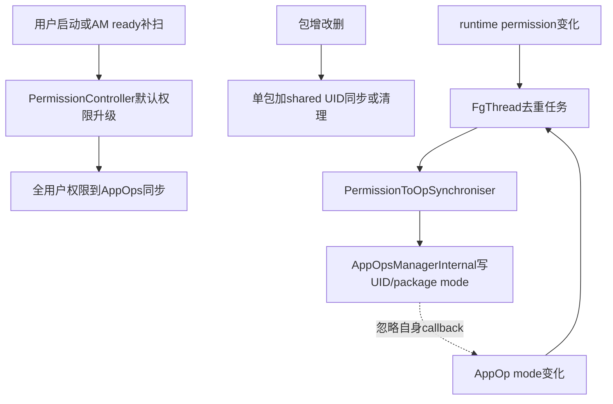
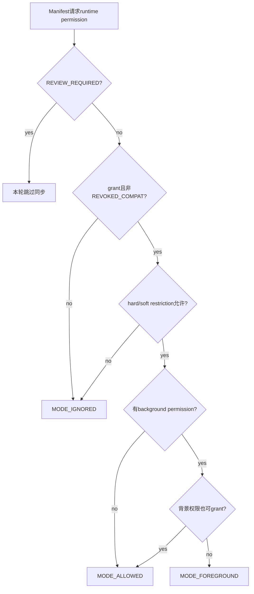
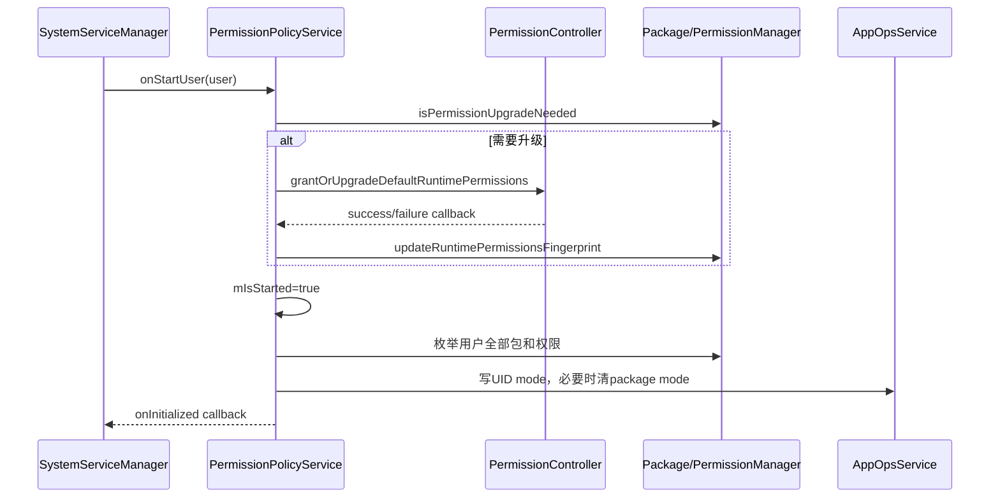

# 271 Android PermissionPolicyService：权限与AppOps同步、启动初始化、角色及一次性权限协作链

## 1. 本章目标

本章解释`PermissionPolicyService`为什么存在：permission grant、permission flags和AppOp mode分别由不同模块保存，但runtime permission最终必须映射为正确AppOp。我们将追每用户初始化、事件触发、shared UID合并、ALLOWED/FOREGROUND/IGNORED优先级、防回调环，以及它与Role和one-time permission的真实边界。

## 2. 版本边界

本文只读本地Android 11 `android-11.0.0_r48`。后续版本的权限控制器、角色和AppOps结构已有变化；本章不把新版本类或AttributionSource链倒灌到r48。

## 3. 它是协调器而非数据库

PermissionManager保存权限grant/flags，AppOpsService保存mode与访问事件，PermissionController执行可更新策略。PermissionPolicyService自己不拥有另一份权威权限表，而是监听变化、读取两侧状态并推动收敛。

## 4. 双向依赖不是双向复制

注释说同步permission与app ops“and vice versa”，但主算法以permission和flags推导AppOp；AppOp变化主要作为重新同步触发器，并通过`FLAG_PERMISSION_REVOKED_COMPAT`等已有状态避免盲目反写grant。它不是两张表字段逐项互拷。

## 5. 本章源码地图

```text
frameworks/base/services/core/java/com/android/server/policy/
  PermissionPolicyService.java
  PermissionPolicyInternal.java
  SoftRestrictedPermissionPolicy.java
frameworks/base/services/core/java/com/android/server/pm/permission/
  PermissionManagerService.java
  OneTimePermissionUserManager.java
frameworks/base/services/core/java/com/android/server/appop/AppOpsService.java
frameworks/base/core/java/android/app/AppOpsManagerInternal.java
```

## 6. SystemService身份

它由system_server启动，继承`SystemService`，主要工作跑在FgThread。构造时立即向LocalServices发布`PermissionPolicyInternal`，而`onStart()`才安装包、权限和AppOps监听器。

## 7. mLock保护什么

`mIsStarted`记录每个user是否已初始化；`mIsPackageSyncsScheduled`去重package/user同步；`mIsUidSyncScheduled`去重UID清理；初始化callback也在锁下。锁不保护PackageManager或AppOps权威数据。

## 8. mAppOpPermissions是什么

它收集带`PROTECTION_FLAG_APPOP`且能映射AppOp的permission，用于包改变/移除后清理“不再被shared UID任何包请求”的AppOp。它与dangerous runtime permission列表用途不同。

## 9. onStart取得三项依赖

服务从LocalServices取`PackageManagerInternal`、`PermissionManagerServiceInternal`，并从ServiceManager取`IAppOpsService`。前两者同进程调用，后者虽是Binder接口，在system_server中通常仍是本地Binder对象。

## 10. 五类触发源

包增加/改变/删除、runtime permission state改变、AppOp mode改变、user启动、boot phase补扫都能触发同步。多个入口最终汇聚到“同步一个shared UID相关包集合”或“同步某用户全部包”。

## 11. 总体协作图



## 12. PackageListObserver的added路径

包加入后，若该user已经started，立即同步该包及shared UID成员。它使用PackageManager内部包列表观察者，不依赖公开PACKAGE_ADDED广播才保证核心mode同步。

## 13. changed路径多一步清理

包改变既同步当前请求权限，也调用`resetAppOpPermissionsIfNotRequestedForUid(uid)`。Manifest可能删除APPOP permission，仅重新处理仍请求的权限不会清掉旧mode，所以需要反向清理。

## 14. removed路径为何只清理

被删包已无法读取并同步，但同UID可能仍有其他shared包；服务重新收集该UID剩余成员请求集，再把无人请求的APPOP permission恢复默认。

## 15. 未started用户不响应包事件

三个PackageListObserver分支都先`isStarted(userId)`。该用户尚未完成权限升级时不做局部同步，随后`onStartUser()`会全量扫描，避免用未迁移状态提前写AppOps。

## 16. runtime permission监听

PermissionManager内部listener给出packageName和userId，服务调用异步同步。grant、revoke或flags变化都可能改变shouldGrantAppOp，因此不只监听“grant布尔值”。

## 17. AppOps mode监听

服务为每个runtime permission对应switch op注册mode watcher；soft restricted permission还注册extra AppOp。APPOP flag permission也注册其op，以便外部mode更改后重新校准或清理。

## 18. 为什么监听switch op

FINE/COARSE等多个permission可能共享控制op。`getSwitchOp()`先permission→op，再`opToSwitch()`，使监听键与AppOpsService真正政策键一致。

## 19. r48 mode watcher权限背景

第270章已确认r48 `startWatchingMode()`尚无特权权限保护TODO。PermissionPolicyService位于system_server，本身可信，但不能由此反推该公开Binder入口在r48已实施同等权限门。

## 20. callback做两件事

`opChanged()`既安排package/user权限同步，也安排UID“不再请求APPOP permission”清理。前者针对runtime/soft restricted映射，后者针对Manifest请求集合缩减后的残余mode。

## 21. 异步package任务如何去重

`Pair(packageName,userId)`先加入ArraySet，只有首次加入才向FgThread发消息；任务真正开始时先remove。变化密集时可合并排队前事件，但任务运行期间的新事件又能排下一次，避免永久丢失尾部变化。

## 22. UID清理任务如何去重

`mIsUidSyncScheduled`以完整UID为key。第一次事件置true并发消息，执行入口先delete；同样允许执行期间再次排队，符合“最终收敛”而非“一次事务完成全部世界变化”。

## 23. FgThread不是主线程

异步任务发给`FgThread.getHandler()`，避免直接在PermissionManager/AppOps callback栈中进行大量包查询和mode写入。它仍是共享高优先级线程，算法必须去重并避免无界阻塞。

## 24. 启动阶段的补扫

到`PHASE_ACTIVITY_MANAGER_READY`，服务遍历所有user；已running却没收到`onStartUser`的用户被显式调用一次。这是生命周期事件可能遗漏时的幂等补偿。

## 25. onStartUser第一道幂等门

若`mIsStarted`已为true直接返回。boot phase补扫和正常SystemService回调即使都到达，也不会重复执行整套升级与全量同步。

## 26. 默认权限升级先于started

`grantOrUpgradeDefaultRuntimePermissionsIfNeeded(userId)`在写`mIsStarted=true`之前执行。升级期间包/权限事件被忽略，完成后全量同步统一吸收最终状态。

## 27. fingerprint决定是否需要升级

PackageManagerInternal的`isPermissionUpgradeNeeded(userId)`比较runtime permission fingerprint。只有需要时才调用PermissionController，成功后更新user sensitive标记并写新fingerprint。

## 28. PermissionController为何参与

默认权限、迁移版本和可更新策略位于PermissionController模块，不应硬编码在system_server协调器。PermissionPolicyService负责启动时序和成功门，具体grant/upgrade由Controller完成。

## 29. AndroidFuture等待细节

源码注释说“完成或超时”，实际调用无超时参数的`future.get()`。Controller不回调会阻塞执行`onStartUser()`的system_server线程；源码旁注明确此处在main thread，并特意让PermissionControllerManager把工作调到FgThread。失败回调则完成exception并抛IllegalStateException，这是r48注释与实现不一致的诊断边界。

## 30. 失败为何如此严格

默认权限升级失败会`Slog.wtf`并进入异常，注释认为系统处于undefined state，应让Rescue Party推动恢复。它不是可以静默跳过、稍后随便补一次的普通后台任务。

## 31. started标志的准确完成点

升级成功后，服务在锁内标记started并取callback；随后执行全用户权限/AppOps同步；最后才调用`callback.onInitialized(userId)`。所以`isInitialized()`为true可能略早于全量同步完成，但外部callback在同步之后。

## 32. onStopUser只清started

停止用户时删除`mIsStarted`。r48没有在这里清两个scheduled集合或取消FgThread已排消息；已入队任务也不在执行入口重新检查started，存在user stop与旧任务交错的窄窗口。

## 33. 全量同步怎样枚举

构造`PermissionToOpSynchroniser`后，PackageManagerInternal `forEachPackage`逐个addPackage，最后统一`syncPackages()`。收集和写入分阶段，避免在包管理锁回调内调用AppOps。

## 34. 单包同步为何带shared UID

先读取目标PackageInfo，再取得其shared user全部包名并加入同一个Synchroniser。注释明确要求shared UID所有包必须一起同步，因为UID mode对成员共同生效。

## 35. shared包集合不是可选优化

若只看发生变化的一个包，它撤销某权限就可能把UID mode设IGNORED，尽管同UID另一个包仍获grant。同步整个集合才能求出该UID最宽的合法结果。

## 36. addPackage的输入检查

PackageInfo、AndroidPackage、ApplicationInfo或requestedPermissions缺失都跳过。它同时需要公开快照和内部解析包：前者读用户态permission，后者提供soft restriction策略所需Manifest/包属性。

## 37. root与system UID例外

UID为0或1000时直接跳过。注释说明它们总能通过permission检查，为兼容性不触碰其AppOps；不能把普通应用同步公式机械应用到system_server。

## 38. 只处理requestedPermissions

算法遍历PackageInfo的Manifest请求列表，再从runtime权限定义表判断。没请求的权限不会进入正向同步；APPOP flag permission的残余由独立reset算法处理。

## 39. Synchroniser为何预载危险权限定义

构造时把所有dangerous PermissionInfo放进map，以permission name快速查询。即使列表由`getAllPermissionsWithProtection(DANGEROUS)`取得，后续仍用`isRuntime()`过滤特殊定义。

## 40. 收集与应用分离

`addPackage()`只向四个`OpToChange`列表加入候选；`syncPackages()`才调AppOpsManager。源码特别警告add阶段可能持package lock，不可跨入AppOps造成锁序和回调问题。

## 41. 四个候选列表

分别是allow、foreground、ignore、ignore-if-not-allowed。前三个代表确定目标；最后一个只在当前不是ALLOWED时压到IGNORED，避免soft restriction覆盖用户/系统已有的显式允许。

## 42. 最宽mode优先顺序

sync严格按ALLOW→FOREGROUND→IGNORE→IGNORE_IF_NOT_ALLOWED执行，并用`IntPair(uid,op)`去重。shared UID成员或两个permission映射同switch op发生冲突时，最宽权限获胜。

## 43. 为什么packageName不进去重key

真正写的是UID mode，影响整个UID；因此key只含uid和op。OpToChange仍保留packageName，用来做raw查询和必要的包级残余清理。

## 44. permission review required

若permission flags含`FLAG_PERMISSION_REVIEW_REQUIRED`，`addPermissionAppOp()`直接返回，不主动同步该op。legacy review流程需要用户先确认，协调器不能提前把AppOp塑造成正常grant结果。

## 45. background permission没有独立op

注释指出background permission通常不映射单独AppOp。前景permission的PermissionInfo带`backgroundPermission`，算法据其grant状态决定同一个op是ALLOWED还是FOREGROUND。

## 46. 前景已授、背景已授

前景shouldGrant为true，且背景PermissionInfo存在、背景shouldGrant也为true，则目标MODE_ALLOWED，表示前后台均可通过该政策层。

## 47. 前景已授、背景未授

前景可用但背景不可用时目标MODE_FOREGROUND。之后AppOpsService再结合UID state/capability实时评价，不是协调器在同步瞬间判断应用是否正前台。

## 48. 前景不可授

无论permission未grant、REVOKED_COMPAT、hard restriction生效或soft policy不允许，目标MODE_IGNORED。它表达权限状态不支持操作，而非一次访问事件被拒。

## 49. shouldGrant第一门：实际grant

`PackageManager.checkPermission()`必须GRANTED。仅Manifest请求或permission flags存在都不够；同步从当前用户的最终授权事实出发。

## 50. 第二门：REVOKED_COMPAT

即使grant位仍为true，`FLAG_PERMISSION_REVOKED_COMPAT`也让shouldGrant返回false。这正是pre-M兼容App保留permission位、用AppOps模拟撤销的桥梁。

## 51. 第三门：hard restricted

hard restricted permission若带`FLAG_PERMISSION_APPLY_RESTRICTION`便不可grant对应AppOp；有合法exemption时该flag不应用，才继续允许。

## 52. 第四门：soft restricted策略

软限制交给`SoftRestrictedPermissionPolicy.forPermission(...)`，调用`mayGrantPermission()`。结果可依targetSdk、包属性、存储策略等上下文，不能只看一个通用flag。

## 53. 普通runtime permission

不是hard/soft restricted且已grant、未REVOKED_COMPAT，就返回true。USER_SET、USER_FIXED等主要决定谁能改授权，并不在这里直接改变已经形成的grant结果。

## 54. runtime权限到mode图



## 55. soft restriction extra AppOp

某些软限制除permission本身对应op外，还控制一个额外op。策略返回extra code，并分别给出mayAllow、mayDenyIfGranted，从而加入ALLOW、IGNORE或条件IGNORE列表。

## 56. ignore-if-not-allowed的保护

它先raw检查当前mode；当前ALLOWED则保持不动，其他非IGNORED才写IGNORED。返回是否已占用去重key，确保后续候选处理符合优先次序。

## 57. raw检查为什么必要

同步比较的是持久政策，而不是这一刻UID前后台评价。若用evaluated check，FOREGROUND在后台可能看成IGNORED，协调器会误判配置并反复写mode。

## 58. 写UID mode前先比oldMode

目标与raw old相同就不写，减少写盘和callback风暴。注意raw查询遵循UID优先、package其次，因此它读到的是当前有效存储层级，而非单独UID表字段。

## 59. package mode为何会挡路

写完UID mode后再次raw查询；若仍不是目标，源码认为存在不正确package mode干扰，便把该package mode恢复op默认值。注释称runtime permission相关AppOp本不应有这种包级覆盖。

## 60. 第270章优先级带来的疑问

AppOpsService正常是UID mode优先，但目标恰为该op默认值时，setUidMode会删除UID覆盖，旧package mode便重新显露；所以二次raw检查并清package mode确有实际用途。非默认UID目标写入后它也兼作防御性验证，不能因“UID优先”而删去。

## 61. 防回调环的callbackToIgnore

协调器调用`setUidModeFromPermissionPolicy(..., mAppOpsCallback)`；AppOpsService通知时移除该callback，避免自己写mode→自己收到变化→再同步的直接反馈环。其他观察者仍会收到变化。

## 62. 防环不等于没有并发

权限listener、包observer或别的AppOps变化仍可在任务运行期间到来并排下一轮。系统依赖幂等目标和去重集合最终收敛，不是用一把跨服务大锁制造全局事务。

## 63. setUidMode的兼容flag旁路

AppOps内部PermissionPolicy专用setter带callback参数，因非null而跳过普通`updatePermissionRevokedCompat()`。否则“由permission推mode”又反改permission flags，容易制造循环和状态污染。

## 64. 清理APPOP permission的请求并集

reset算法先获取UID所有package，收集每个包requestedPermissions并集。shared UID只要任一成员仍请求某APPOP permission，就不恢复该op默认值。

## 65. 三个明确排除项

ACCESS_NOTIFICATIONS、MANAGE_IPSEC_TUNNELS不进入清理列表；REQUEST_INSTALL_PACKAGES也排除，因为Settings允许即使Manifest状态特殊时继续由用户控制非默认AppOp。排除体现产品合同，不是遗漏。

## 66. 无人请求时恢复两层

对每个UID成员包raw检查；若不是default，先把UID mode设default，再把该包package mode也设default。这样清掉UID覆盖和逐包残余，而不是只处理当前触发包。

## 67. default按op定义取得

算法使用`opToDefaultMode(appOpCode)`，不假设默认ALLOWED。恢复默认是回到平台为该op定义的基线。

## 68. package不存在时直接结束

UID已没有任何package时`getPackagesForUid()`为空，reset返回。包卸载的AppOps对象生命周期还有PMS/AppOps自身清理路径，此函数只负责“剩余成员不再请求”的权限语义。

## 69. onStart中的第二个广播观察器

服务还注册PACKAGE_ADDED/CHANGED广播，用于让PermissionController更新`user sensitive`标记。它与PackageListObserver的AppOps同步是两条不同链，不能因action相同合并概念。

## 70. setup未完成时延迟

若`USER_SETUP_COMPLETE`为0，UID加入一个初始容量200但没有200上限的List并去重；setup完成后下一次相关广播会批量update并清空。这不是定时器，若无后续广播，队列不会因设置值变化自动醒来。

## 71. user sensitive是什么

它帮助权限UI判断哪些权限对用户敏感，并由PermissionController计算。PermissionPolicyService只安排全量或单UID更新，不在system_server里复刻判定规则。

## 72. 每用户PermissionControllerManager缓存

广播receiver按UserHandle缓存manager，用相应user context构造，确保更新目标用户。系统启动后还为system user安排60秒延迟的全量`updateUserSensitive()`。

## 73. setup状态读取边界

receiver注册给ALL users，但读取`Settings.Secure.USER_SETUP_COMPLETE`使用服务默认context而非显式`getIntForUser`。分析secondary user行为时应把这是r48代码路径记为边界，不能宣称逐user读取已显式保证。

## 74. Role在本类中的真实职责

PermissionPolicyInternal的activity启动检查拦截旧“修改默认拨号/短信”action。targetSdk Q及以上必须改用`RoleManager.createRequestRoleIntent()`；本类并不实现Role holder授权算法。

## 75. 旧应用兼容路径

targetSdk低于Q仍允许旧action，并把`Intent.EXTRA_CALLING_PACKAGE`写入Intent，让RequestRoleActivity知道来源。它是API迁移门，不是默认应用最终选择器。

## 76. callingPackage为空

Internal只有callingPackage非null时才调用removed-action检查。调用方应在上层验证package归属；该方法本身主要按传入UID/user读取ApplicationInfo和targetSdk。

## 77. checkStartActivity的调用效果

返回false表示上层应静默取消Activity启动，并记录Action Removed日志。它不抛SecurityException，也不更改permission/AppOp。

## 78. Role授权发生在哪里

RoleController/RoleManager和PermissionController负责holder资格及权限、AppOp等特权授予。PermissionPolicyService会因这些权限变化收到listener，再做一般同步，但不是Role状态的权威拥有者。

## 79. 一次性权限不在本类计时

`OneTimePermissionUserManager`由PermissionManagerService按user创建，跟踪UID importance、timeout与gone delay。PermissionPolicyService没有session表或Alarm；它只会在最终permission state改变后被listener唤醒。

## 80. one-time结束的协作链

计时器到期通知PermissionController，Controller撤销/调整一次性permission，PermissionManager发runtime state listener，PermissionPolicyService再把对应UID AppOp收敛为IGNORED或其他正确mode。

## 81. 为什么职责要分开

进程重要性计时属于权限会话生命周期；用户决策和撤权策略属于PermissionController；permission→AppOp一致性属于PermissionPolicyService。分开后每个模块只维护自己权威状态。

## 82. PermissionPolicyInternal的三个API

`checkStartActivity()`做旧action门；`isInitialized(userId)`返回started；`setOnInitializedCallback()`保存单个callback。它不是公开Binder接口，只供system_server内部服务协作。

## 83. callback不是历史重放

注释明确：若user注册callback前已经initialized，不会补调。消费者必须先查`isInitialized()`再决定是否等待，不能只注册后无限等待。

## 84. 单callback覆盖语义

字段只有一个`mOnInitializedCallback`，后一次set会覆盖前一次，并非listener列表。调用者数量和注册顺序由system_server架构约束。

## 85. 初始化时序图



## 86. 这不是跨服务事务

读PackageInfo后到写AppOps之间，包或权限仍可能变化。算法通过变化listener再排队、幂等比较和最宽mode归并恢复一致，而不是回滚此前所有写入。

## 87. 快照混合风险

单包同步同时取PackageInfo与内部AndroidPackage，二者若跨更新代际可能短暂不一致；空值保护会跳过，本轮不做危险猜测，后续包changed事件再收敛。

## 88. shared UID的用户维度

同步以目标user context读取PackageInfo，UID是包含userId的完整值；同appId在另一user拥有独立grant与AppOps。shared user包列表也传入userId。

## 89. ALLOW优先的安全解释

对同一个shared UID，任一成员合法持有permission时基础UID permission检查本就可能通过共享state；AppOps若取更窄结果会与权限层矛盾。因而按UID求最宽mode是共享身份语义，不是随意偏袒某包。

## 90. package级归因仍存在

UID mode决定共同政策，但note事件仍按package/tag记录。PermissionPolicy清理不意味着shared UID各包审计记录被合并成一个包。

## 91. REVIEW_REQUIRED跳过的后果

“跳过”意味着保留当前AppOp而非强制IGNORED。legacy review流程的其他组件负责初始mode与用户确认；读本函数不能独自推导所有review状态。

## 92. soft restriction不是单一表格

策略对象可能为permission本身和extra op给出不同结果。调试存储类权限时应同时检查grant、APPLY_RESTRICTION、targetSdk以及extra AppOp，不能只看主op。

## 93. 同步写入会安排AppOps持久化

AppOpsManagerInternal最终进入第270章的setUidMode/setMode，内存立即生效并按普通/快速策略写`appops.xml`。PermissionPolicyService本身不直接操作XML。

## 94. callback到达不代表文件落盘

mode observer可在内存变化后很快收到通知，磁盘仍延迟。PermissionPolicy比较服务raw状态而不是读文件，避免把持久化延迟误判为写入失败。

## 95. 为什么不直接revoke permission

协调器的任务是让AppOp匹配已有permission合同。真正revoke涉及用户选择、fixed flags、角色、设备策略与Controller UI，不能由发现mode不一致的服务擅自执行。

## 96. 为什么也不无条件尊重手工AppOp

runtime permission相关AppOp是permission语义的一部分；外部修改后mode callback会触发重同步。若希望永久改变能力，应通过正确权限/策略入口，否则协调器可能恢复一致状态。

## 97. APPOP flag permission例外说明产品选择

REQUEST_INSTALL_PACKAGES保留Settings控制的非默认mode，说明“permission→AppOp一致”不是无例外铁律。每个排除项都应按源码与API合同分析。

## 98. 排障：grant后仍IGNORED

依次查REVIEW_REQUIRED、REVOKED_COMPAT、APPLY_RESTRICTION、soft policy、background permission；再查user是否started、异步任务是否排队、UID/shared包是否纳入，最后查AppOps raw与package残余。

## 99. 排障：撤权后仍ALLOWED

先确认另一个shared UID成员是否仍合法grant同switch op；再看两个permission是否共享switch；检查权限变化listener是否触发，及PermissionPolicy写UID mode时是否忽略了自己callback但实际写成功。

## 100. 排障：包删后mode残留

检查UID是否还有成员请求该APPOP permission、该permission是否在三个排除项、raw mode是否其实为op default。若UID无包，本函数直接返回，应追AppOps/PMS卸载清理链。

## 101. 排障：用户启动卡住

若栈停在`AndroidFuture.get()`，核对PermissionController grant/upgrade是否回调。r48没有实际timeout；日志里的默认权限升级失败或Controller绑定问题比AppOps写盘更早。

## 102. 排障：初始化callback没来

先查callback是否在user已初始化后才注册；再查是否被另一个调用者覆盖；最后看默认权限升级或全量同步是否阻塞。`isStarted=true`与callback之间还隔着全量sync。

## 103. 排障：用户停止后仍见任务

onStopUser只清started，不取消已排FgThread消息。检查任务入队时间与user停止竞态；后续新事件不会再排，但旧任务可能完成一次。

## 104. 性能热点

全用户同步遍历所有包、每包逐requested permission并多次查flags/grant；mode写前后还raw检查。它被放在初始化与去重后的FgThread，而不是每次permission check热路径。

## 105. mIsStarted的双重语义风险

字段注释称“started but not stopped”，Internal方法却名为`isInitialized`。它既作生命周期门又作初始化标志；调用者需知道stop后返回false，即使该用户过去完成过升级。

## 106. getUserContext可能返回null

创建跨用户package context若NameNotFound会返回null，部分调用点随后直接使用。system_server自身包正常应存在，但代码层仍有异常路径；这不是通用可空Context API范例。

## 107. user sensitive的60秒任务范围

onStart末尾只为`Process.myUserHandle()`构造manager并延迟全量更新，也就是system user；其他用户依赖包广播的按UID更新或其Controller流程。不能说每个user启动都在此安排60秒全量任务。

## 108. 本章完整心智模型

启动时先升级权限版本，再全量收敛；运行时包/permission/AppOp事件异步触发局部收敛；shared UID作为共同计算单元；mode按ALLOW→FOREGROUND→IGNORE选最宽；专用setter忽略自身callback以防环；Role和one-time只从边界协作。

## 109. 与第263章的分工

第263章从权限UI和一次性/自动撤销看用户选择如何产生；本章专注选择形成后，system_server如何把grant、flags、restriction转换成AppOps并在包生命周期中修复残余。

## 110. 与第270章的分工

第270章解释AppOpsService如何存储、评价、回调与持久化；本章解释谁依据permission政策调用其内部setter、为什么用UID mode、何时清package mode以及如何避开反馈环。

## 111. 阅读完成检查

应能回答：为什么user启动先升级再sync；为什么shared UID必须整组；为什么ALLOW优先；REVOKED_COMPAT和background permission如何影响mode；专用callback怎样防环；Role与one-time为何不属于本类核心状态。

## 112. macOS只读练习一：画启动顺序

```bash
cd /Users/ninebot/androidSource
sed -n '320,455p' frameworks/base/services/core/java/com/android/server/policy/PermissionPolicyService.java
```

标出upgrade、started=true、全量sync、initialized callback四个完成点，并圈出`future.get()`没有timeout参数。只读源码，不编译。

## 113. macOS只读练习二：手算shared UID最宽mode

```bash
cd /Users/ninebot/androidSource
sed -n '451,705p' frameworks/base/services/core/java/com/android/server/policy/PermissionPolicyService.java
```

假设同UID包A位置前景+背景均grant，包B只前景grant，包C撤权；按列表执行顺序算最终switch op mode，并解释去重key为何不含package。

## 114. macOS只读练习三：追限制与额外op

```bash
cd /Users/ninebot/androidSource
sed -n '705,850p' frameworks/base/services/core/java/com/android/server/policy/PermissionPolicyService.java
rg -n "mayGrantPermission|mayAllowExtraAppOp|mayDenyExtraAppOpIfGranted" \
  frameworks/base/services/core/java/com/android/server/policy/SoftRestrictedPermissionPolicy.java
```

分别写出hard restricted、soft restricted主op和extra op的输入；不要把extra op误当background permission的独立op。

## 115. macOS只读练习四：验证防环与职责边界

```bash
cd /Users/ninebot/androidSource
sed -n '845,910p' frameworks/base/services/core/java/com/android/server/policy/PermissionPolicyService.java
rg -n "startOneTimePermissionSession|OneTimePermissionUserManager|ACTION_CHANGE_DEFAULT" \
  frameworks/base/services/core/java/com/android/server/{pm/permission,policy}
```

画出PermissionPolicy专用setter携带callbackToIgnore的闭环，再标出one-time计时和旧Role action门分别属于哪个类。

## 116. 易混点一：AppOp变化不总被尊重

runtime permission相关mode若与permission状态冲突，watcher会触发重新同步；REQUEST_INSTALL_PACKAGES等明确例外才保留独立用户控制。判断前先看permission类型和排除表。

## 117. 易混点二：started不完全等于同步完成

`mIsStarted=true`写在全量sync前，Internal的`isInitialized()`立即可见；但初始化callback在sync后。需要强完成通知的消费者应使用正确callback并处理“已完成不补发”的合同。

## 118. 易混点三：本类不管理one-time会话

它只消费一次性撤权后的permission变化。UID importance、60秒默认timeout、gone delay和PermissionController timeout通知都在PermissionManagerService/OneTimePermissionUserManager链。

## 119. 复读纠偏记录

复读后修正六点：双向依赖不等于双向字段复制；mode列表按ALLOW→FOREGROUND→IGNORE求UID最宽结果；review required是跳过而非强制拒绝；默认权限Future实际无timeout；onStopUser不取消已排任务；Role在本类仅做旧action迁移门。另记录setup complete未显式按广播user读取、system user才有60秒全量sensitive更新及getUserContext可空边界。

## 120. 本章小结与下一章

PermissionPolicyService用“先升级、再全量同步；事件到来、异步局部收敛”的方式连接三套权威模块。它以shared UID为计算单元，把grant、compat/restriction flags和背景权限转换为最宽合法UID mode，并借专用setter避免自激回环。下一章继续读取受限权限策略，重点拆`SoftRestrictedPermissionPolicy`、存储权限兼容、legacy external storage与额外AppOp。
