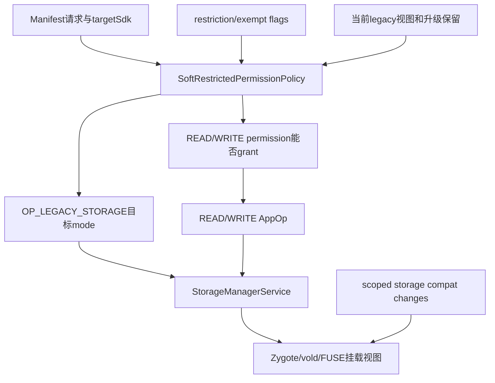
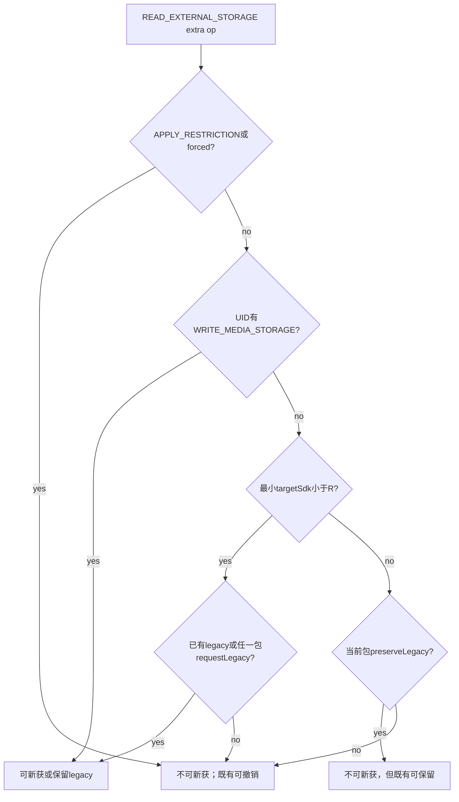
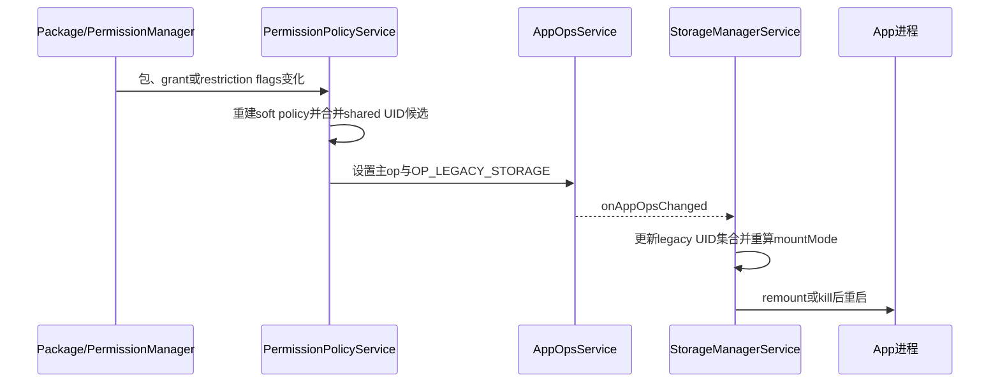

# 272 Android SoftRestrictedPermissionPolicy：存储权限兼容、legacy external storage与额外AppOp策略链

## 1. 本章目标

第271章看到了PermissionPolicyService调用`SoftRestrictedPermissionPolicy`，但还没有解释策略本身。本章将把“存储permission能否授予”“READ/WRITE AppOp是否允许”“进程是否得到legacy外部存储视图”三件事拆开，并追到StorageManagerService的挂载模式与remount。

## 2. Android 11版本边界

本文严格基于`android-11.0.0_r48`。Android 11正处于scoped storage迁移期，后续版本弱化旧READ/WRITE_EXTERNAL_STORAGE并加入新的媒体权限；不能用Android 13的照片、视频、音频权限解释r48。

## 3. soft restricted不是“软拒绝”

它是permission定义的限制属性：未满足政策时，permission可能不能grant，或只能得到受限能力。这里的soft与PermissionChecker的`PERMISSION_SOFT_DENIED`不是同一个枚举，也不是同一层状态。

## 4. r48只特化两个permission

本类switch只对`READ_EXTERNAL_STORAGE`和`WRITE_EXTERNAL_STORAGE`返回特殊策略；其他名字走DUMMY_POLICY，`mayGrantPermission()`恒true且无extra AppOp。不要把类名泛化成所有soft restricted permission都有复杂分支。

## 5. 本章源码地图

```text
frameworks/base/services/core/java/com/android/server/policy/
  SoftRestrictedPermissionPolicy.java
  PermissionPolicyService.java
frameworks/base/services/core/java/com/android/server/pm/permission/
  PermissionManagerService.java
frameworks/base/services/core/java/com/android/server/StorageManagerService.java
frameworks/base/core/java/android/os/Environment.java
frameworks/base/core/java/android/os/storage/StorageManager.java
frameworks/base/core/java/android/content/pm/parsing/ParsingPackageUtils.java
frameworks/base/core/java/com/android/internal/os/Zygote.java
```

## 6. 同名twin为何存在

注释说明它与PackageInstaller/PermissionController侧的SoftRestrictedPermissionPolicy互为twin。system_server和可更新权限UI都要作一致判断，但本章只证明frameworks/base这份实现，不能假定另一份永远逐行同步。

## 7. 三个核心问句

`mayGrantPermission()`回答危险权限能否grant；`getExtraAppOpCode()`返回除permission主op外还需维护的op；`mayAllowExtraAppOp()`与`mayDenyExtraAppOpIfGranted()`分别回答能否新获、何时可夺走既有extra op。

## 8. 为什么需要“获得”和“失去”两套条件

存储迁移必须避免升级后突然看不见旧文件。一个App可能不再满足“新取得legacy”的条件，却仍因升级保留既有legacy视图；所以获取条件与撤销条件故意不完全对称。

## 9. 三层状态先分开

权限位由PermissionManager保存；主读写AppOp由PermissionPolicy同步；`OP_LEGACY_STORAGE`是没有对应Manifest permission的额外政策；最终挂载还结合compat change、FUSE/isolated storage和特殊UID。

## 10. 总体关系图



## 11. 三种exempt flag

SYSTEM_EXEMPT、UPGRADE_EXEMPT、INSTALLER_EXEMPT按位OR成`FLAGS_PERMISSION_RESTRICTION_ANY_EXEMPT`。任一存在即视为whitelisted；它们表示豁免来源，不等于用户grant，也不等于AppOp ALLOWED。

## 12. APPLY_RESTRICTION是另一位

`FLAG_PERMISSION_APPLY_RESTRICTION`表示当前要实际应用限制。豁免位和apply位可能同时出现在flags中，具体策略有的先看豁免、有的直接看apply；不能只凭一个总称“白名单”推断所有分支。

## 13. 权限白名单API的授权

查询system whitelist需要`WHITELIST_RESTRICTED_PERMISSIONS`；upgrade/installer whitelist还允许installer of record。修改接口把公开whitelist类型映射为三个内部exempt flags，并触发权限更新。

## 14. 策略对象是输入快照

`forPermission()`先把flags、targetSdk、legacy状态等读成final局部变量，再返回匿名对象。后续调用方法不会重新查询系统；状态改变后必须重新构造策略才能得到新结论。

## 15. appInfo为空的保守默认

READ/WRITE分支在appInfo为空时把whitelist=false、targetSdk=0及各种legacy条件设false。READ的`shouldApplyRestriction`反而是false；这个空上下文策略主要用于发现extra op，不适合代替真实包裁决。

## 16. 最小targetSdk的shared UID规则

`getMinimumTargetSDK()`枚举同UID全部包并取最小值。一个shared UID只要还有旧target成员，整个身份就按更旧兼容级别计算，避免不同成员争抢同一个UID AppOp。

## 17. NameNotFound怎样处理

枚举shared UID成员时若某包ApplicationInfo查不到便跳过，不让短暂包变化使整次策略构造失败。最低值至少保留当前appInfo自身targetSdk。

## 18. READ和WRITE的grant公式相同

两者`mayGrantPermission()`都是：任一restriction exempt，或者shared UID最小targetSdk大于等于Q。target低于Q且无豁免时不能经现代grant入口获得这个soft restricted permission。

## 19. 公式为何看起来反直觉

旧target应用常通过安装/升级兼容状态已有权限；这里约束的是一次明确grant操作和同步政策，不是声称所有旧App开机后权限必然DENIED。要结合既有grant、review和upgrade exemption理解。

## 20. PermissionManager的硬门

`grantRuntimePermissionInternal()`在真正写PermissionsState前调用本策略；返回false会记录“Cannot grant soft restricted permission”并直接return。策略不是UI提示，而是服务端授权门。

## 21. hard与soft restricted的差别

hard restricted只要没有任何exempt就拒绝grant；soft restricted把判断委托给每个permission策略。存储权限因此还能考虑targetSdk与迁移状态。

## 22. 成功grant后的通知

权限写入后PermissionManager通知runtime state listener，PermissionPolicyService再同步主AppOp和extra op。grant本身与AppOp收敛不是同一个锁内原子事务。

## 23. 存储permission还触发remount

READ或WRITE grant后，若user已initialized，PermissionManager清身份调用`StorageManagerInternal.onExternalStoragePolicyChanged(uid, packageName)`。它避免新用户尚无进程时进行昂贵remount。

## 24. READ才有extra AppOp

READ策略的`getExtraAppOpCode()`返回`OP_LEGACY_STORAGE`；WRITE策略沿用基类默认OP_NONE。legacy视图由READ的软限制策略统一驱动，不是READ和WRITE各存一份legacy mode。

## 25. OP_LEGACY_STORAGE没有permission映射

AppOpsManager表中该op对应permission为null。它不能通过Manifest直接申请，只能由系统迁移/政策写入并被StorageManager、Environment等消费。

## 26. 七个READ输入

策略读取：是否exempt、是否apply restriction、最小targetSdk、当前UID是否已有legacy、UID是否任一包请求legacy、当前包是否请求preserve legacy、UID是否获WRITE_MEDIA_STORAGE，以及包是否在forced-scoped列表。

## 27. 当前legacy状态来自StorageManagerInternal

`hasLegacyExternalStorage(uid)`读取StorageManagerService维护的UID集合。它表达当前系统观察到的legacy视图，不等于Manifest请求位；策略用它保护既有访问不因重算突然丢失。

## 28. requested legacy按UID聚合

`hasUidRequestedLegacyExternalStorage()`枚举UID所有包，只要任一ApplicationInfo的private flag为true便返回true。这与最小targetSdk一样遵循shared UID共同挂载现实。

## 29. preserve legacy只看当前包

`pkg.hasPreserveLegacyExternalStorage()`来自本次传入AndroidPackage，不在helper中聚合整个UID。后续PermissionPolicy会把shared UID多个包都加入候选，最终ALLOW优先可缓解差异，但单个策略对象的输入确实是package级。

## 30. WRITE_MEDIA_STORAGE按UID聚合

helper枚举UID所有包，只要任何包permission检查GRANTED即true。该signature/privileged能力可成为legacy extra op的强放行条件。

## 31. forced scoped列表来源

DeviceConfig namespace为`storage_native_boot`，key是`forced_scoped_storage_whitelist`，值以逗号分隔包名。命中列表会阻止新获legacy，并可使既有legacy失效。

## 32. 列表是类加载时静态快照

`sForcedScopedStorageAppWhitelist`在类初始化时读取一次，类内没有DeviceConfig listener。即使dumpsys能显示新属性，本进程中策略集合也不会由本类自动刷新；native_boot命名也暗示重启生效边界。

## 33. 字符串解析没有trim

实现直接`rawList.split(",")`放入HashSet。配置中若写`"a, b"`，第二项包含前导空格而无法匹配包名；运维配置必须精确。

## 34. 新获legacy的第一门

`shouldApplyRestriction`为true立即false。即使App请求legacy或当前target旧，实际应用restriction时也不能新设OP_LEGACY_STORAGE为ALLOWED。

## 35. 新获legacy的第二门

包在forced scoped列表时立即false。它独立于permission exempt；系统想强制某包进入scoped视图时，exempt并不能在此分支自动盖过forced列表。

## 36. 新获legacy的强能力分支

持有WRITE_MEDIA_STORAGE时，前两门通过后可返回true，不再要求target<R或requestLegacy。这是媒体系统级写能力，不适用于普通第三方App。

## 37. 新获legacy的普通分支

没有WRITE_MEDIA_STORAGE时，必须“当前已有legacy或UID任一包请求legacy”并且最小targetSdk<R。两部分缺一不可。

## 38. requestLegacy的Manifest默认

ParsingPackageUtils对target<Q默认把requestLegacy设true；Q及以上默认false，可由Manifest属性设置。到target R时即使请求位true，普通获取公式仍被`targetSDK < R`挡住。

## 39. R为何不再接受requestLegacy

Android 11对target R强制scoped storage，`requestLegacyExternalStorage`不再作为普通退出开关。升级保护改由当前legacy、preserveLegacy和WRITE_MEDIA_STORAGE等更窄条件处理。

## 40. preserveLegacy的默认值

解析器默认false，只有Manifest显式声明才true。它不是“继续请求legacy”的同义词，而是target R升级时是否允许保住已获legacy的迁移信号。

## 41. target低于R的撤销公式

`mayDenyExtraAppOpIfGranted()`直接返回`!mayAllowExtraAppOp()`。旧target只要仍满足获取条件就保留；一旦restriction、forced或legacy/request条件不再成立，就可撤销。

## 42. target R及以上的撤销第一门

`shouldApplyRestriction`为true便可撤销既有legacy。这里不再调用完整mayAllow，因为R的获取公式本来大多false，直接使用会让所有R迁移App无条件丢访问。

## 43. target R及以上的撤销第二门

forced scoped列表命中也返回true。它是产品/兼容控制的强制迁移开关。

## 44. target R及以上的撤销第三门

若既无WRITE_MEDIA_STORAGE，当前包也没请求preserveLegacy，则返回true。只要二者任一存在，且前两门未命中，已有legacy可暂时保留。

## 45. R分支不要求当前hasLegacy

撤销函数只决定“如果已经granted，是否允许deny”，调用者先看当前AppOp。hasLegacy不进入R的保留公式；当前未ALLOWED时也不会凭preserve自动新获legacy。

## 46. 获取与撤销真值图



## 47. PermissionPolicy怎样消费extra策略

mayAllow为true加入`mOpsToAllow`；否则mayDeny为true加入确定IGNORE；两者都false则加入IGNORE_IF_NOT_ALLOWED。最后按ALLOW→FOREGROUND→IGNORE→条件IGNORE执行。

## 48. 条件IGNORE的迁移意义

当R App不满足新获条件，却有preserve等原因不应丢既有legacy时，两方法都可能false。条件IGNORE会保留当前ALLOWED，只把其他异常非ALLOWED状态归一为IGNORED。

## 49. shared UID最终取最宽结果

多个包对同UID/OP_LEGACY_STORAGE产生不同候选时，ALLOW先占去重key，后续IGNORE跳过。某成员合法允许legacy便使共同UID挂载保持legacy，符合vold无法按同UID包名给不同视图的限制。

## 50. “whitelist”不直接放行extra op

exempt只参与`mayGrantPermission()`；READ的legacy获取公式实际看APPLY_RESTRICTION而非`isWhiteListed`变量。通常上层会据豁免调整apply flag，但源码层仍是两个独立输入。

## 51. WRITE策略为何简单

WRITE_EXTERNAL_STORAGE只决定permission可否grant，没有extra op。最终写访问还要结合WRITE permission、OP_WRITE_EXTERNAL_STORAGE和StorageManager挂载模式，不能因策略简单就认为写入不受scoped storage限制。

## 52. Permission与AppOp的主链

成功grant/revoke通知PermissionPolicy；它根据第271章公式把READ/WRITE主switch op设ALLOWED、FOREGROUND或IGNORED，同时根据READ策略维护OP_LEGACY_STORAGE。两类op用途不同。

## 53. requestLegacy变更为何要强制同步

包replace时若Manifest请求legacy且请求READ或WRITE，`checkIfLegacyStorageOpsNeedToBeUpdated()`把updatedUserIds扩为所有用户。即使grant位没变，extra op公式的Manifest输入已变，也必须触发同步。

## 54. 这个更新条件有范围

只有replace、`pkg.isRequestLegacyExternalStorage()`为true且请求READ/WRITE时扩展。移除requestLegacy的更新由其他权限/包changed链收敛；不能把该helper当完整Manifest diff引擎。

## 55. OP_LEGACY_STORAGE的默认与设置

它由PermissionPolicy的UID mode setter写入AppOpsService并持久化到appops.xml。策略本身不直接写AppOps，也不操作挂载点。

## 56. StorageManagerService订阅mode

在非FUSE分支systemReady会监听REQUEST_INSTALL_PACKAGES和LEGACY_STORAGE；FUSE路径还通过`StorageManagerInternal.onAppOpsChanged()`同步接收mode变化。不同产品配置下触发入口不同。

## 57. legacy UID快照集合

StorageManagerService扫描已安装应用，用AppOps check判断OP_LEGACY_STORAGE是否ALLOWED，并把完整UID加入`mUidsWithLegacyExternalStorage`。Soft policy的“当前已有legacy”便来自这份集合。

## 58. 集合是反馈输入

PermissionPolicy写legacy AppOp→StorageManager更新UID集合→下次Soft policy读取hasLegacy。它形成迁移反馈，但权威mode仍在AppOps；集合是StorageManager为当前视图维护的派生缓存。

## 59. shared UID移除缺口

`updateLegacyStorageApps(..., false)`直接remove UID，源码TODO明确未检查同shared UID是否另一个包仍有legacy。包级回调/移除可能使集合暂时低估，是r48已标注的实现边界。

## 60. AppOps ALLOWED还不是最终文件能力

StorageManager的mount决策同时检查READ/WRITE permission+对应AppOp。legacy ALLOWED但没有读写授权，仍不会获得MOUNT_EXTERNAL_READ/WRITE。

## 61. getMountMode先处理特殊身份

isolated UID与无包UID返回NONE；instant app也NONE。FUSE external storage service、Downloads/ExternalStorageProvider、平台MTP等有独立更高能力模式，早于普通App公式。

## 62. READ/WRITE的双检查

`StorageManager.checkPermissionAndCheckOp()`要求permission与主AppOp共同满足，生成hasRead/hasWrite。它再次说明grant位不是文件系统访问的唯一门。

## 63. WRITE_MEDIA_STORAGE挂载

UID持WRITE_MEDIA_STORAGE且hasWrite时返回MOUNT_EXTERNAL_FULL。这条路径优先于installer与legacy，是系统媒体组件能力。

## 64. installer挂载

INSTALL_PACKAGES permission或shared UID任一包REQUEST_INSTALL_PACKAGES AppOp ALLOWED，再加hasWrite，得到MOUNT_EXTERNAL_INSTALLER。注释强调vold不能按同UID包名分挂载，所以遍历所有成员取OR。

## 65. 普通legacy写挂载

OP_LEGACY_STORAGE evaluated为ALLOWED且hasWrite时返回MOUNT_EXTERNAL_WRITE。主WRITE授权和legacy视图必须同时存在。

## 66. 普通legacy读挂载

没有hasWrite但legacy ALLOWED且hasRead时返回MOUNT_EXTERNAL_READ。只授READ不会自然升级成写视图。

## 67. scoped默认挂载

不满足legacy读写时返回MOUNT_EXTERNAL_DEFAULT，不等于完全没有外部存储。App仍能看到自己的目录及通过MediaStore等受控接口访问媒体。

## 68. 多个ExternalStorageMountPolicy怎样合并

旧非isolated路径遍历policy并取数值最小模式，任何policy返回NONE立即拒绝。它是多方限制的交集，不是权限策略单方面决定。

## 69. mode变化后的remount

`onExternalStoragePolicyChanged()`重新计算mode并调用`remountUidExternalStorage(uid, mountMode)`。这是运行中进程视图更新，和下次Zygote启动时传mountMode两条生效路径。

## 70. 进程启动时的mountMode

ProcessList在创建进程前向StorageManagerInternal查询外部存储挂载模式，并保存到ProcessRecord、传给Zygote。进程不是启动后自行读取Manifest决定namespace。

## 71. FUSE路径的kill策略

REQUEST_INSTALL_PACKAGES在转入/转出ALLOWED时kill UID；MANAGE_EXTERNAL_STORAGE拒绝时kill；LEGACY_STORAGE则更新legacy集合。不同op为何kill不同由FUSE/GID与用户体验权衡决定。

## 72. 非FUSE AppOp回调范围

READ/WRITE/REQUEST_INSTALL_PACKAGES变为ALLOWED且user initialized时触发remount。代码条件只在mode==ALLOWED时进入；其他降级依赖别的权限回调、进程重启或路径处理，是诊断时要注意的不对称。

## 73. Permission grant remount与AppOp回调可能重复

grant存储权限直接通知StorageManager，同时PermissionPolicy写mode又可能触发Storage回调。实现以幂等重算mountMode承受重复，而非用跨模块事务只触发一次。

## 74. Environment.isExternalStorageLegacy的第一门

应用进程内先排除isolated与instant app。随后检查两个Compatibility change；compat结论可在查询AppOp前直接强制scoped或强制legacy。

## 75. DEFAULT_SCOPED_STORAGE change

它描述默认是否采用scoped storage；FORCE_ENABLE_SCOPED_STORAGE描述是否强制开启。Environment用辅助公式组合两者，而不是只看targetSdk硬编码。

## 76. compat强制scoped

若公式判定严格enforced，方法直接false，不查询OP_LEGACY_STORAGE。于是AppOp ALLOWED也不一定让应用API报告legacy。

## 77. compat强制关闭scoped

若公式判定严格disabled，方法直接true，同样跳过AppOp。compat框架可为测试或兼容覆盖默认政策。

## 78. 中间态才看AppOp

只有既非强制scoped、也非强制legacy时，Environment才`checkOpNoThrow(OP_LEGACY_STORAGE)`。Manifest请求位从不在此运行时API直接读取。

## 79. API文档已提醒差异

注释明确返回值可能与`requestLegacyExternalStorage`不同，因为安装时机、targetSdk和其他因素会影响继承。把Manifest属性当运行态真相会误诊。

## 80. StorageManager的legacy兜底

部分媒体访问检查用`noteAppOpAllowingLegacy()`：目标媒体AppOp即使DEFAULT/IGNORED/ERRORED，只要OP_LEGACY_STORAGE ALLOWED仍可视为通过。这是迁移兼容，不代表所有文件API都绕过主op。

## 81. 为什么还要同时持旧新permission

StorageManager注释要求调用者同时持相关旧/新permission，以覆盖设备从P升级到Q等罕见场景。legacy op是额外兼容条件，不是免permission通行证。

## 82. request与preserve的时间方向

requestLegacy表达“在仍允许选择时请求旧模型”；preserveLegacy表达“升级target后保留已经拥有的旧模型”。前者偏获取，后者偏保留。

## 83. hasLegacy是现实状态

它回答“当前UID是否已在legacy集合”，可来自过去安装/升级与AppOp。现实状态、请求意图和保留意图三者必须分别建模。

## 84. forced列表是外部政策

它既不改Manifest，也不直接revokepermission，而是改变extra AppOp生成/撤销结论。最终文件视图经AppOps和StorageManager收敛。

## 85. targetSdk为何按最小值

mount namespace绑定UID，shared UID成员无法各用一个target策略。取最小值优先兼容旧成员，代价是新成员也分享较宽视图；这也是平台逐步淘汰shared UID的背景之一。

## 86. targetSdk与包级forced列表交叉

minimum target按UID，forced whitelist按当前package。PermissionPolicy整组收集后ALLOW优先，因此某成员不forced且合法ALLOW可能覆盖另一个forced成员的IGNORE候选。单看某包策略无法断言最终UID mode。

## 87. preserveLegacy同样可能产生包间差异

它只读当前pkg，但最终UID去重取最宽。shared UID中一个R包声明preserve、另一个未声明时，允许保留的候选可能保护整个UID。

## 88. 策略没有直接读用户选择

USER_SET/USER_FIXED不进入公式；实际grant和restriction flags已体现用户/政策结果。策略只判断soft restriction允许范围，不重新解释权限弹窗按钮。

## 89. 策略也不读取文件目录

它不会扫描App在`/storage/emulated`中的旧文件数量。防数据丢失靠existing legacy与preserve等状态信号，不靠磁盘内容检测。

## 90. 持久化边界

permission flags在runtime-permissions.xml，Manifest请求在package解析/Settings，extra mode在appops.xml，legacy UID集合是StorageManager内存派生状态，DeviceConfig在独立配置存储。没有一个文件包含完整结论。

## 91. 开机收敛

PermissionPolicy每用户初始化会全量重算mode；StorageManager又快照/监听legacy op。两个服务启动顺序与回调最终使内存集合和AppOps一致，但不是一次原子恢复。

## 92. 包更新收敛

PMS发现requestLegacy相关replace时扩大updated users；包changed观察器触发PermissionPolicy重新构造策略；mode变化再通知StorageManager更新视图。

## 93. 权限flags变化收敛

修改restriction whitelist或APPLY_RESTRICTION会更新权限状态并触发runtime listener，随后主op与extra op重算。只改flags却不重建策略会使用旧快照，所以事件链不可省。

## 94. DeviceConfig变化的窄边界

本类没有listener且静态HashSet不重建，单纯运行时改属性不会由它立即重算。要判断设备行为，应看属性生效时机、system_server是否重启以及是否另有上层触发。

## 95. grant失败不等于已有grant被撤销

`mayGrantPermission=false`让一次grant请求return；撤销已有状态要走权限更新/限制逻辑与PermissionPolicy同步。授权入口不是后台清理器。

## 96. mayDeny也不直接deny

它只返回策略建议，PermissionPolicy将其加入IGNORE候选并调用AppOps setter。SoftRestrictedPermissionPolicy自身没有副作用。

## 97. target Q例子

target Q、requestLegacy=true、无restriction/forced、已有或请求legacy：permission可grant，且因Q<R可让extra op ALLOWED。若requestLegacy=false且从未legacy，permission仍可grant，但extra op不会新获。

## 98. target R新安装例子

target R、READ可grant、requestLegacy=true也不能凭此新获legacy；无WRITE_MEDIA_STORAGE时mayAllow false。没有既有ALLOWED可保留时，最终通常是scoped默认视图。

## 99. target R升级保留例子

App升级到R前已有legacy，升级后声明preserveLegacy、未restricted/forced：mayAllow仍false，但mayDeny也false；条件IGNORE不覆盖当前ALLOWED，因此保留旧视图。

## 100. target R未声明preserve例子

已有legacy但无WRITE_MEDIA_STORAGE、无preserve：mayDeny true，PermissionPolicy把extra op设IGNORED，StorageManager随后更新集合/视图。

## 101. forced scoped例子

无论旧target或R升级，只要当前包命中forced列表，获取失败且既有可撤销。shared UID最终还需把所有成员候选合并，不能只算一个包。

## 102. exemption例子

旧target包有任一restriction exempt时可grantREAD/WRITE；但legacy extra仍须APPLY_RESTRICTION为false、非forced并满足legacy获取/保留公式。exempt不等于自动legacy。

## 103. 排障：permission已grant但不是legacy

检查OP_LEGACY_STORAGE raw/evaluated、targetSdk最小值、request/preserve、forced列表、APPLY_RESTRICTION与compat changes；再查StorageManager集合和进程mountMode。

## 104. 排障：Manifest写了request仍scoped

先看target是否R；再看属性是否解析进ApplicationInfo、UID是否已有/requested legacy、是否forced/restricted；最后确认Environment compat是否强制scoped。

## 105. 排障：AppOp允许但API返回false

检查isolated/instant及DEFAULT_SCOPED_STORAGE、FORCE_ENABLE_SCOPED_STORAGE。Environment可能在查询AppOp前就返回false。

## 106. 排障：mode改变但旧进程视图没变

区分FUSE与非FUSE路径，查StorageManagerInternal同步callback、remount或kill是否发生，并看user initialized。下次新进程的Zygote mountMode可能已正确而旧进程尚未更新。

## 107. 排障：shared UID集合突然丢legacy

查包移除/mode false回调是否命中StorageManagerService中已标TODO的直接remove逻辑；再核对同UID其他包实际AppOp与全量快照是否会修复。

## 108. 完整状态变化链

Manifest/target/flags/grant变化→PermissionPolicy重建策略→按shared UID选extra mode→AppOpsService写内存并通知→StorageManager更新legacy集合、remount或kill→新/旧进程获得对应文件视图。



## 109. 与第22章存储总览的关系

早期章节讲分区、vold和FBE；本章补的是应用共享存储namespace政策。FBE解锁和scoped/legacy视图是不同维度：用户已解锁不代表App能看全部共享文件。

## 110. 与第271章的关系

第271章解释候选列表和最宽mode；本章给出READ/WRITE候选如何产生，尤其为什么同一个READ permission既控制主read op，又额外影响legacy storage op。

## 111. 阅读完成检查

应能分别定义grant、requestLegacy、preserveLegacy、hasLegacy和OP_LEGACY_STORAGE；能手算Q/R获取与保留；能从mode追到StorageManager mountMode；能解释shared UID与static DeviceConfig快照边界。

## 112. macOS只读练习一：列出精确公式

```bash
cd /Users/ninebot/androidSource
sed -n '110,260p' frameworks/base/services/core/java/com/android/server/policy/SoftRestrictedPermissionPolicy.java
```

分别写出READ/WRITE mayGrant、READ mayAllowExtra和target<R/≥R的mayDeny；不要用自然语言“旧App允许”代替布尔条件。

## 113. macOS只读练习二：追shared UID输入

```bash
cd /Users/ninebot/androidSource
sed -n '70,115p' frameworks/base/services/core/java/com/android/server/policy/SoftRestrictedPermissionPolicy.java
sed -n '255,292p' frameworks/base/services/core/java/com/android/server/policy/SoftRestrictedPermissionPolicy.java
```

标出minimum target、requestLegacy和WRITE_MEDIA_STORAGE哪些按UID聚合，preserve与forced哪些按当前package，并用两个共享包手算最终候选。

## 114. macOS只读练习三：从权限到挂载

```bash
cd /Users/ninebot/androidSource
sed -n '1460,1565p' frameworks/base/services/core/java/com/android/server/pm/permission/PermissionManagerService.java
sed -n '4250,4360p' frameworks/base/services/core/java/com/android/server/StorageManagerService.java
```

画出grant→listener→AppOps→StorageManager与直接onExternalStoragePolicyChanged两条线，列出FULL、INSTALLER、WRITE、READ、DEFAULT五种普通决策顺序。

## 115. macOS只读练习四：验证运行时API边界

```bash
cd /Users/ninebot/androidSource
sed -n '1240,1320p' frameworks/base/core/java/android/os/Environment.java
rg -n "PROP_FORCED_SCOPED_STORAGE_WHITELIST|sForcedScopedStorageAppWhitelist" \
  frameworks/base/{core/java/android/os/storage/StorageManager.java,services/core/java/com/android/server/policy/SoftRestrictedPermissionPolicy.java}
```

解释compat change为何可覆盖AppOp，并确认forced列表在策略类中只于类加载时读取一次。

## 116. 易混点一：request不是结果

`requestLegacyExternalStorage=true`只是Manifest输入；target R、restriction、forced列表、existing/preserve状态、AppOp和compat change都能让最终结果不同。

## 117. 易混点二：READ授权不是legacy授权

READ permission与OP_READ_EXTERNAL_STORAGE解决“是否具备读取合同”，OP_LEGACY_STORAGE解决“是否获得旧式宽视图”。scoped App也可通过MediaStore读被授权媒体。

## 118. 易混点三：preserve不能新建legacy

target R的preserveLegacy只影响是否撤销已经ALLOWED的extra op；当前未获legacy时，单独声明preserve不会让mayAllow变true。

## 119. 复读纠偏记录

复读后修正七点：r48只特化READ/WRITE；WRITE没有extra op；exempt允许grant却不自动允许legacy；request、preserve和existing是三种状态；minimum target/request/WMS按UID而preserve/forced按包；forced列表为未trim的类加载静态快照；Environment compat可先于AppOp决定结果。另记录StorageManager shared UID false回调直接remove的源码TODO与非FUSE回调只在部分mode转ALLOWED时remount。

## 120. 本章小结与下一章

SoftRestrictedPermissionPolicy把Android 10到11的存储迁移编码为一组非对称公式：permission grant与legacy视图分开，旧target可按request获取，R target只能在严格条件下保留，shared UID取最宽共同结果。最终能力还要经过主AppOp、compat change和StorageManager挂载。下一章进入Android 11 scoped storage主链，继续读MediaProvider/FUSE、应用隔离目录、MediaStore授权与MANAGE_EXTERNAL_STORAGE。
