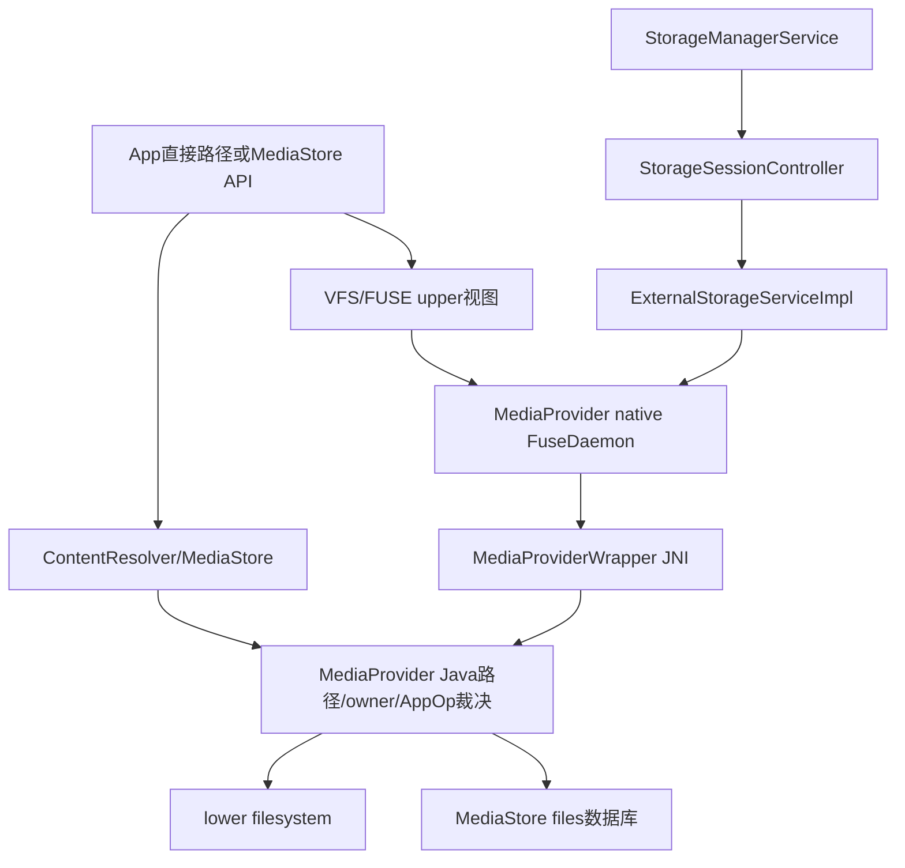
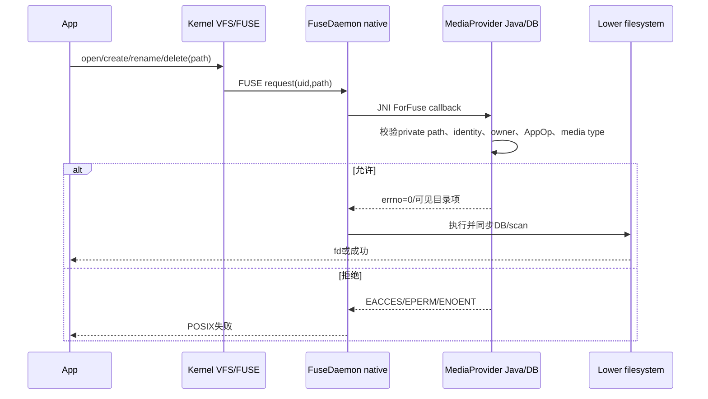
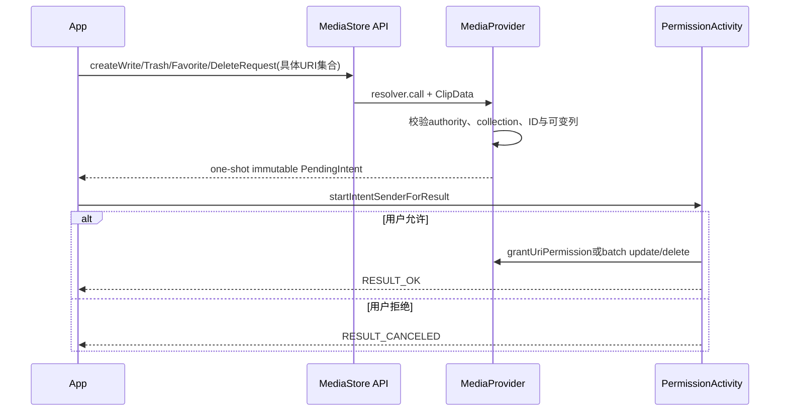

# 273 Android 11 scoped storage：MediaProvider/FUSE、应用隔离目录、MediaStore授权与MANAGE_EXTERNAL_STORAGE主链

## 1. 本章目标

第272章算出了legacy storage AppOp，本章继续回答文件操作真正怎样被执行与拒绝：卷如何建立FUSE session，内核请求怎样进入MediaProvider，数据库owner与路径规则如何协同，MediaStore URI授权如何补足非owner访问，以及“所有文件访问”仍有哪些边界。

## 2. Android 11版本边界

本文基于本地`android-11.0.0_r48`。r48的MediaProvider已是可更新模块并承载ExternalStorageService/FUSE；后续版本的Photo Picker、READ_MEDIA_* runtime permissions和更严格MANAGE_EXTERNAL_STORAGE政策不属于本章。

## 3. scoped storage的核心不是一张权限表

它把应用可见文件视图、MediaStore数据库行、owner package、媒体类型AppOp、URI临时授权、app-specific目录和compat状态组合起来。一次`open()`可能不走ContentResolver API，却仍在FUSE层回调MediaProvider做同类裁决。

## 4. 三条访问路径

第一条是MediaStore ContentProvider query/insert/openFile；第二条是`/storage/emulated/...`直接文件路径，经内核FUSE；第三条是`Android/data|obb/<package>`等bind-mounted app-specific目录。三者入口不同，最终政策有交集但并非完全相同。

## 5. 本章源码地图

```text
frameworks/base/services/core/java/com/android/server/
  StorageManagerService.java
  storage/StorageSessionController.java
  storage/StorageUserConnection.java
packages/providers/MediaProvider/
  src/com/android/providers/media/MediaProvider.java
  src/com/android/providers/media/LocalCallingIdentity.java
  src/com/android/providers/media/PermissionActivity.java
  src/com/android/providers/media/fuse/ExternalStorageServiceImpl.java
  src/com/android/providers/media/fuse/FuseDaemon.java
  jni/FuseDaemon.cpp
  jni/MediaProviderWrapper.cpp
  apex/framework/java/android/provider/MediaStore.java
```

## 6. MediaProvider模块身份

Manifest包名是`com.android.providers.media.module`，provider authority仍为`media`。它声明WRITE_MEDIA_STORAGE、MANAGE_EXTERNAL_STORAGE、WATCH_APPOPS等系统权限，并同时发布ContentProvider与受`BIND_EXTERNAL_STORAGE_SERVICE`保护的ExternalStorageService。

## 7. FUSE默认开关

StorageManagerService从`persist.sys.fuse`读取，构造默认值为true；Settings侧flag与持久属性不一致时会设置属性并硬重启，让init、zygote、installd、vold共同使用同一选择。源码支持关闭回退，但Android 11主设计是新FUSE路径。

## 8. FUSE不等于AppFuseBridge

`AppFuseBridge`是应用通过StorageManager创建的`/mnt/appfuse`小型文件桥；本章的新scoped storage FUSE由MediaProvider的ExternalStorageService承载整卷。名字相似，session、调用方和安全模型不同。

## 9. upper与lower路径

vold提供FUSE device FD、应用可见upper filesystem path和真实lower path。ExternalStorageServiceImpl注释说MediaProvider进程以PASS_THROUGH挂载运行，所以Java daemon只使用upper路径，MediaProvider本身仍可见lower绑定。

## 10. 总体架构图



## 11. ExternalStorageService组件发现

system user解锁时，StorageSessionController先以SYSTEM_ONLY解析MediaStore provider，再把Intent限定到同一package寻找ExternalStorageService，并强制service声明`BIND_EXTERNAL_STORAGE_SERVICE`。任意三方服务不能抢占整卷FUSE。

## 12. 为什么由MediaStore包提供服务

MediaProvider同时拥有媒体数据库、扫描器和文件政策，FUSE路径可以复用owner、MIME、pending、URI grant等语义。拆到无数据库上下文的守护进程会造成两套授权规则。

## 13. 每用户connection

StorageSessionController以userId缓存`StorageUserConnection`；一个connection又可管理该用户多个volume session。user停止会清session，reset会遍历所有用户并必要时kill ExternalStorageService。

## 14. 每volume session

sessionId使用VolumeInfo id，保存upper/lower路径；重复id会抛IllegalArgumentException。卷mount创建并同步等待start，unmount/remove结束并等待FUSE线程退出。

## 15. 20秒远端操作超时

StorageUserConnection的ExternalStorageService调用通过CompletableFuture等待，默认20秒。service death会取消remote future和outstanding operations，避免StorageManager永久挂起。

## 16. FUSE daemon启动等待

Java `FuseDaemon.start()`启动Thread后轮询native状态，1秒一次、最多5次。native_start随后阻塞直到lower filesystem卸载；启动5秒未ready抛IllegalStateException。

## 17. 结束也有5秒门

onEndSession先从静态map移除daemon，再`join(5秒)`确认线程退出；仍alive则失败。StorageSessionController reset无法确认时会kill MediaProvider作为最后手段。

## 18. 静态daemon map

ExternalStorageServiceImpl以sessionId→FuseDaemon静态HashMap保存会话。重复start只日志不替换；重复end只告警，生命周期设计要求StorageManager端保证代际。

## 19. volume状态与数据库

MOUNTED时MediaProvider attachVolume，UNMOUNTED/EJECTING/REMOVED/BAD_REMOVAL时detach，并更新缓存卷列表。FUSE session存在与数据库volume attached是相关但不同的状态。

## 20. FUSE线程跨Java/native

Java创建native FuseDaemon，native lib处理内核请求；需要政策时通过`MediaProviderWrapper`attach JNI线程并调用名字带`ForFuse`的Java方法。Java异常/errno最终要翻译成POSIX文件操作结果。

## 21. root的native旁路

native wrapper对部分操作让ROOT_UID直接通过或直接unlink/rename；shell并非全部旁路，rename特意经过MediaProvider以更新数据库。不要把root与shell行为混同。

## 22. 主要FUSE回调

创建、删除、open、mkdir/rmdir、opendir、readdir、rename、UID/package校验、redaction ranges和文件创建通知都可回Java。FUSE不是只在open时查一次权限。

## 23. LocalCallingIdentity解决什么

ContentProvider Binder调用可从Binder pid/uid/package/tag构造；FUSE只有内核传来的UID，便从UID包数组第一项构造并缓存shared package names。对象延迟解析package、targetSdk和各类permission，减少高频重复查询。

## 24. package名必须验证

Binder路径用`AppOpsManager.checkPackage(uid, packageNameUnchecked)`验证归属；FUSE external路径从PackageManager按UID取包。数据库owner判断不能信任客户端自报包名。

## 25. shared UID身份

LocalCallingIdentity缓存UID全部包名，owner条件常用`IN getSharedPackages()`。同shared UID成员可共享拥有行的访问，这是Linux UID共享身份的延续。

## 26. calling identity位图

它懒加载self、shell、manager、delegator、legacy、redaction、读写audio/video/images及system gallery等能力。一个布尔“有存储权限”不足以表达MediaProvider的细粒度裁决。

## 27. shell用户限制

若shell UID且user存在`DISALLOW_USB_FILE_TRANSFER`，能力解析直接抛SecurityException。shell调试特权仍受用户级外部存储限制。

## 28. legacy granted的判断

先按package/user查询DEFAULT_SCOPED_STORAGE与FORCE_ENABLE_SCOPED_STORAGE compat changes：严格scoped直接false，严格disabled直接true，中间态才raw查OP_LEGACY_STORAGE。与Environment公式一致。

## 29. legacy read/write还要permission

`isLegacyReadInternal()`要求legacy granted且READ_EXTERNAL_STORAGE通过；legacy write还要求WRITE。extra AppOp不是脱离runtime permission的全文件通行证。

## 30. manager能力的真实公式

`checkPermissionManager()`先用data-delivery方式检查MANAGE_EXTERNAL_STORAGE及对应AppOp；失败后回退到隐藏`OPSTR_NO_ISOLATED_STORAGE`，主要供`am instrument --no-isolated-storage`测试。声明permission本身不够。

## 31. manager mode会被监听

MediaProvider监听MANAGE_EXTERNAL_STORAGE、NO_ISOLATED_STORAGE、LEGACY_STORAGE、ACCESS_MEDIA_LOCATION及默认gallery写op。mode变化会清相关身份缓存，使后续调用重新求值。

## 32. MANAGE不是传统“root”

它让MediaProvider全局row check和许多路径放行，并允许在更多目录创建文件，但仍经过用户隔离、私有目录、volume和系统服务规则。名字“所有文件访问”不能理解为跨用户任意路径。

## 33. 其他App私有目录先拒绝

FUSE创建、删除、rename等先调用`isPrivatePackagePathNotOwnedByCaller()`，命中其他包`Android/data`或`Android/obb`便拒绝，检查发生在manager bypass之前。MANAGE_EXTERNAL_STORAGE也不能穿透。

## 34. Android/media例外

`Android/media/<package>`不被视为私有，因为其中内容会被扫描并共享；它仍受媒体类型、owner和FUSE规则，而不是像data/obb完全隐藏。

## 35. data与obb为何不经FUSE

rename代码明确注释Android/data与Android/obb是bind mount，这些路径不经过MediaProvider FUSE。隔离由StorageManager/vold构造的专属绑定视图实现。

## 36. 自己的app-specific目录

路径能解析出owner package且属于calling shared packages时，FUSE restrictions可旁路。应用无需广泛存储permission访问自己的外部私有目录。

## 37. 直接文件路径为何仍可用

Android 11的MediaStore.DATA文档承认现有文件可用直接路径，但“路径存在”不保证可访问。VFS/FUSE会用相同UID政策过滤，推荐ContentResolver打开以获得稳定URI授权语义。

## 38. owner_package_name

MediaProvider files表以owner package记录创建/插入者。包被完全移除或data cleared时可将其内容orphan；owner不是文件inode uid的简单镜像。

## 39. own row无需广泛collection权限

查询构建器在无全局/媒体类型权限时追加`owner_package_name IN sharedPackages`。现代App可以访问自己创建的媒体，而无需为了自有内容申请整个集合读取权限。

## 40. collection权限按媒体类型

Local identity分别检查READ/WRITE_MEDIA_AUDIO、VIDEO、IMAGES AppOps，并结合旧READ/WRITE_EXTERNAL_STORAGE兼容。Android 11内部已有细分AppOp，即使公开runtime permission仍主要是READ/WRITE_EXTERNAL_STORAGE。

## 41. legacy对细分AppOp的兜底

`checkAppOpAllowingLegacy()`若细分媒体op拒绝，但OP_LEGACY_STORAGE ALLOWED，仍返回true。迁移App维持旧式广泛访问；scoped App则必须符合owner或细分op。

## 42. 非legacy写permission的特殊处理

`checkPermissionAllowingNonLegacy()`在OP_LEGACY_STORAGE不是ALLOWED时直接true，现代scoped App写自有媒体不必被旧WRITE_EXTERNAL_STORAGE门挡住；legacy App仍需通过旧permission。

## 43. system gallery能力

WRITE_MEDIA_IMAGES或WRITE_MEDIA_VIDEO AppOp标识默认/系统gallery，允许相应媒体类型的特殊路径和数据库旁路；它与MANAGE_EXTERNAL_STORAGE不是同一角色。

## 44. delegator能力

BACKUP或UPDATE_DEVICE_STATS持有者可把自己代理创建的媒体owner转交目标App，服务backup/restore和DownloadManager。普通App不能任意改OWNER_PACKAGE_NAME。

## 45. 全局URI访问的四条路

self/shell、manager、当前identity已缓存own id、或系统UriGrantsManager授予的具体read/write URI均可快速通过。否则进入数据库query证明是否能看见/修改该row。

## 46. URI grant独立于collection permission

某App没有整个图片集合读取权限，仍可因Intent ClipData的单项URI grant访问指定row。它是对象级能力，不扩大到同目录或同collection。

## 47. query构建器就是授权过滤器

MediaProvider不是查询后再逐行丢弃，而是按caller在SQLiteQueryBuilder追加owner、media_type、volume、pending、trashed条件。返回空Cursor可能表示无匹配或无可见权限，不能总解释为文件不存在。

## 48. strict SQL防注入

非self调用启用strict columns与strict grammar，并设置targetSdk。调用方selection不是自由拼接进入数据库；授权where还与用户where共同AND。

## 49. volume过滤

URI为`external`聚合卷时展开当前external volume names；具名volume只匹配自身。MediaStore URI中的volume是数据库路由和可见性的一部分。

## 50. pending默认可见性

普通ContentProvider调用默认排除pending；item URI会强制include以便对特定对象操作。FUSE线程写操作include，读取采用VISIBLE_FOR_FILEPATH，反映直接路径创建过程。

## 51. FUSE创建时先pending

`insertFileForFuse()`写owner、MIME并置`IS_PENDING=1`，然后按legacy与否使用DATA或VOLUME_NAME/RELATIVE_PATH/DISPLAY_NAME插入。文件真正创建和扫描完成后再校准状态。

## 52. FUSE pending的特殊识别

通过文件路径正则区分FUSE产生的pending，它与App通过MediaStore显式设置pending的语义略有不同。open helper对普通pending要求owner，对FUSE pending不重复该ownership门。

## 53. trashed与favorite

QUERY_ARG_MATCH_TRASHED/FAVORITE控制数据库可见性。favorite默认include，pending/trashed默认更保守；它们是row状态，不等于物理文件立即删除。

## 54. IS_TRASHED的文件重命名

Provider会把trashed/pending状态编码到实际文件名/路径并维护expiry等字段，更新可能触发move、dentry invalidation和重扫。不能只把IS_TRASHED看成UI标签。

## 55. RELATIVE_PATH是现代创建接口

Android 11建议创建/更新时使用DISPLAY_NAME与RELATIVE_PATH，不写绝对DATA。Provider根据collection允许的顶级目录、MIME和volume生成安全路径。

## 56. collection限制目录

图片、视频、音频、下载等collection各有允许顶级目录。related URI在MIME主类型与relative path一致时可放宽；自己`Android/media`目录和manager也有额外路径资格。

## 57. manager创建目录仍有Provider逻辑

MANAGE可让`ensureFileColumns`接受任意路径，但FUSE目录操作仍不允许修改其他App私有目录，且volume/path必须可规范化。ContentProvider放行不代表任意Linux绝对路径。

## 58. 默认顶级目录

scoped App只能创建平台已知默认顶级目录；FUSE直接在根创建非默认顶级目录会EPERM。删除/rename默认目录同样受保护，避免破坏公共媒体组织。

## 59. 文件类型与目录匹配

Provider按扩展名/MIME推导media type，并要求放入兼容collection目录。把`.mp3`伪装放进错误位置可能在insert/rename阶段被拒或重新扫描纠正。

## 60. 路径规范化

FUSE创建/rename比较传入路径与`getAbsoluteSanitizedPath()`，拒绝无效字符或逃逸；ContentProvider对canonical file和storage root也做检查。数据库授权不能用`..`绕过路径边界。

## 61. 创建文件的完整裁决

先拒其他包私有目录与非法路径；manager/legacy+permission/自有目录/合适媒体写能力可bypass；否则legacy但缺旧写permission拒绝；现代App插入owner+pending row，只有MediaProvider接受collection/path才允许内核创建。

## 62. 已有孤立row的owner转移

FUSE创建发现数据库已有row但物理文件不存在时，legacy创建者可把owner更新为自己，避免原row owner观察到新内容。数据库与文件系统竞态被显式处理。

## 63. 删除文件

先拒其他包私有目录；可数据库旁路者直接lower unlink；否则通过MediaProvider delete按owner/URI grant/权限过滤。若DB无row但caller具路径bypass，才fallback直接删除。

## 64. rename比open更复杂

同时验证old/new私有目录、规范路径、默认目录、Android/media边界、MIME/RELATIVE_PATH和owner；成功后更新数据库并在lower fs rename，处理`.nomedia`还会触发目录扫描。

## 65. manager可绕database但不绕private path

非shell manager的`shouldBypassDatabaseForFuse()`为true，可直接lower操作；但create/delete/rename在此之前已经检查其他包private path。这是“所有文件访问”最重要的负边界之一。

## 66. legacy system gallery数据库旁路

legacy write且system gallery也可bypass DB，源码标注为临时兼容方案。它不适用于普通gallery，也不应外推到新版本永久合同。

## 67. readdir如何过滤

native请求Java取得可见文件名；若路径数据库未知返回特殊`["/"]`让native读lower fs，完全不可访问返回`[""]`，普通情况合并数据库可见文件与lower目录。返回协议不是普通文件名列表。

## 68. 数据库与VFS缓存一致性

Provider更新/移动文件后调用FuseDaemon invalidation。若ContentProvider从lower fs打开写文件，还需判断upper FUSE是否已有缓存并必要时改从FUSE打开，避免双page cache造成损坏。

## 69. shouldOpenWithFuse的锁

Java把lower fd传native，以fcntl读/写锁及缓存状态决定是否必须通过upper打开。它解决性能优化后的缓存一致性，不是额外授权门。

## 70. openFile先查row再查path

Provider按URI读取DATA、owner和pending，canonicalize文件后`checkAccess()`先做row级权限，再保证路径位于storage root或满足world-read规则。URI可见不允许映射任意系统文件。

## 71. 写关闭后的重扫

非pending文件以write打开时，PFD包装OnCloseListener；关闭后失效缩略图、FUSE dentry并重新scan元数据。应用写字节完成不等数据库元数据已同步。

## 72. pending写为何不包装

pending对象仍由owner构建，发布时再扫描/更新；open helper对pending write不安装普通close listener，避免每次中间写都触发对外可见元数据流程。

## 73. ACCESS_MEDIA_LOCATION

非owner读取图片时，若没有permission或其AppOp data-delivery不允许，identity标记需redaction。self/shell不脱敏；permission位与AppOp都必须通过。

## 74. EXIF位置范围脱敏

MediaProvider解析需隐藏的GPS EXIF byte ranges。FUSE开启时可返回upper fd由FUSE读处理；旧路径使用RedactingFileDescriptor。不是把整张图片拒绝，而是定点隐藏位置元数据。

## 75. requireOriginal

URI要求original而调用者需redaction时抛UnsupportedOperationException，提示必须持ACCESS_MEDIA_LOCATION。API显式要求原始内容不会静默返回已脱敏版本。

## 76. owner为何免redaction

open helper比较calling package与owner；owner读取自己创建的文件不脱敏。shared UID/owner语义在其他路径还需结合shared package判断，不能只按文件目录猜owner。

## 77. MediaStore批量用户确认

Android 11提供createWrite/Trash/Favorite/DeleteRequest，客户端经resolver.call让Provider校验URI和columns并返回immutable、one-shot PendingIntent，随后由PermissionActivity展示确认。

## 78. 只接受具体媒体item

请求URI必须是images/audio/video的带ID item；FILES、DOWNLOADS、collection URI或无ID均拒绝。用户授权的最小单位是列出的媒体对象，不是任意SQL selection。

## 79. 可修改列白名单

favorite请求只允许IS_FAVORITE，trash只允许IS_TRASHED，write/delete无额外ContentValues。Provider在创建特权PendingIntent前验证，防止篡改bundle注入任意列。

## 80. PermissionActivity防遮挡

Activity隐藏非系统overlay、不可点外部取消、back键被消费。输入已在PendingIntent生成时验证，但仍重新解析calling app/label/verb/volume。

## 81. write同意的效果

对每个URI调用`grantUriPermission(callingPackage, READ|WRITE)`，授权与请求Activity生命周期相关；不是把collection AppOp改成ALLOWED。

## 82. trash/favorite/delete同意

Activity以批量ContentProviderOperation实际执行update/delete，并允许单项exception；RESULT_OK在操作完成后返回。favorite在r48暂时自动同意，仍保留同一API流程以便未来提示。

## 83. 拒绝的效果

记录metric并返回RESULT_CANCELED，不改变row与URI grant。PendingIntent one-shot且cancel-current，同一requestCode意味着新的请求会替换旧token。

## 84. RecoverableSecurityException兼容流

调用者对具体image/audio/video item有read却无write时，Provider可创建单项write request并抛RecoverableSecurityException，RemoteAction带用户确认入口。无read或非强类型item则直接SecurityException。

## 85. 新批量API与异常流的关系

createWriteRequest允许调用方主动组合多项；RecoverableSecurityException是在旧式直接写失败时为一个item提供恢复动作。二者最终都落到PermissionActivity/URI grant，但触发方式不同。

## 86. URI grant不支持persistable/prefix

MediaStore文档明确这些request不支持PERSISTABLE或PREFIX。若后台组件需要延续访问，应通过ClipData/Intent/JobInfo传递带mode的grant，不能假设永久保存。

## 87. MANAGE_EXTERNAL_STORAGE取得链

应用Manifest声明permission后仍需Settings/系统授予对应AppOp；MediaProvider用PermissionChecker data-delivery记录真实使用。Play政策资格不在AOSP这段运行时代码中，但设备裁决仍是permission+AppOp。

## 88. Environment.isExternalStorageManager

应用API最终检查OP_MANAGE_EXTERNAL_STORAGE是否ALLOWED；它是能力探测，不发起授权UI。请求入口应使用Settings相应Intent，并准备用户拒绝。

## 89. manager能做什么

可全局通过MediaProvider row check、在多数共享目录直接路径访问、创建非标准路径并bypass数据库操作；StorageManager还会在mode拒绝时kill UID使挂载/GID状态更新。

## 90. manager不能做什么

不能访问其他App外部private data/obb，不能跨user绕过UID隔离，不能任意读取内部`/data/data`，也不能绕过SELinux。它是共享外部存储管理能力，不是root。

## 91. NO_ISOLATED_STORAGE测试后门

隐藏AppOp是manager检查的fallback，为instrumentation `--no-isolated-storage`服务。MediaProvider启动时尝试watch，若op未定义捕获IllegalArgumentException并警告；正常第三方产品功能不应依赖它。

## 92. mode变化为何清缓存

LocalCallingIdentity是ThreadLocal/UID cache，能力首次解析后会记住。AppOps listener变化时必须失效，否则授予/撤销manager、legacy、location或gallery后旧线程继续用陈旧结果。

## 93. mode撤销为何可能kill

StorageManagerService在FUSE下MANAGE_EXTERNAL_STORAGE被拒时kill UID，使external_storage GID/视图在新进程中收敛；授予时刻不主动kill以避免差体验，下一次自然重启获得新GID。

## 94. direct path与MediaStore不是二选一

同一文件可以由MediaStore URI插入并用直接path让native库读取；FUSE仍将直接读取映射回MediaProvider授权。推荐URI是为了生命周期和授权清晰，不是说Android 11完全禁止File API。

## 95. 数据库可能滞后文件系统

App直接创建文件时FUSE先插pending row，后台通知更新quota并扫描；异常退出可能留下pending/孤立状态。ModernMediaScanner对FUSE pending有专门清理/发布逻辑。

## 96. 文件系统也可能滞后数据库

App先insert MediaStore row再写文件，row已存在而字节尚未完成。IS_PENDING让非owner默认看不到，owner完成写入后清pending再公开。

## 97. owner卸载后的内容

包完全移除/data cleared时Provider可把owner置null而保留共享媒体，避免用户照片随App数据一起消失。之后访问按collection权限/授权而非旧owner。

## 98. volume卸载竞态

Provider query可能已解析row，卷随后unmount；open仍可FileNotFound。MediaStore DATA文档要求调用方处理文件I/O错误，数据库存在不保证介质在线。

## 99. 多用户隔离

每user有独立StorageUserConnection和挂载视图，MediaProvider identity按UID user查询compat/package。`/storage/emulated/<user>`路径与数据库volume共同限制，MANAGE不跨用户扩权。

## 100. isolated与instant App

StorageManager mountMode对两者返回NONE；MediaProvider legacy判断也不赋予旧视图。即使宿主应用有存储权限，isolated进程不会自动继承普通文件访问。

## 101. 性能设计

Local identity惰性缓存、FUSE native执行快速路径、manager/system gallery可绕DB、readdir批量过滤、ContentProvider lower-fs直开减少开销；与此同时dentry invalidation和fcntl锁保持一致性。

## 102. 安全失败形式

ContentProvider多抛SecurityException、IllegalArgumentException或FileNotFoundException；FUSE必须返回EACCES、EPERM、ENOENT、EEXIST等errno。相同政策在Java API与POSIX API表现不同。

## 103. 排障：MediaStore查不到文件

查volume、owner/shared packages、媒体类型读AppOp、pending/trashed match参数、URI grant与manager；再确认scanner是否已建立row。不要先断定物理文件不存在。

## 104. 排障：File.exists为false

检查是否访问其他包private path、FUSE readdir是否过滤、compat/legacy/manager mode、用户与卷、MediaProvider row是否可见。scoped storage可用“不可见”模拟ENOENT。

## 105. 排障：有MANAGE仍打不开

先验证permission data-delivery与AppOp而非只看Manifest；再判断路径是否其他App Android/data/obb、是否跨user/internal data、SELinux拒绝或卷离线。

## 106. 排障：写完元数据没更新

确认PFD是否pending、是否触发OnCloseListener、直接FUSE创建是否完成scan，查看dentry invalidation和ModernMediaScanner任务。字节落盘与DB scan是两个完成点。

## 107. 排障：用户确认后仍失败

确认请求的是带ID强类型media URI、PendingIntent未被新请求cancel、Activity返回OK、URI grant是否传递到实际后台组件，以及对象/volume是否在确认期间变化。

## 108. 直接文件操作时序图



## 109. MediaStore用户授权时序图



## 110. 五层心智模型

先看用户/卷挂载；再看private path；再看identity的legacy/manager/media-type能力；再看数据库owner/pending/trashed和URI grant；最后看FUSE cache、scan与实际lower I/O。任何一层都可能造成不同错误表象。

## 111. 阅读完成检查

应能画出StorageManager→ExternalStorageService→FuseDaemon→JNI→MediaProvider；能解释own row、collection权限和URI grant；能说清pending发布、EXIF脱敏、manager边界，以及直接path为什么仍受MediaProvider控制。

## 112. macOS只读练习一：追FUSE session

```bash
cd /Users/ninebot/androidSource
sed -n '40,210p' frameworks/base/services/core/java/com/android/server/storage/StorageSessionController.java
sed -n '35,150p' packages/providers/MediaProvider/src/com/android/providers/media/fuse/ExternalStorageServiceImpl.java
sed -n '35,145p' packages/providers/MediaProvider/src/com/android/providers/media/fuse/FuseDaemon.java
```

标出per-user connection、per-volume session、5秒daemon start/exit与20秒远端callback四个超时/生命周期边界。

## 113. macOS只读练习二：手算路径访问

```bash
cd /Users/ninebot/androidSource
sed -n '6240,6335p' packages/providers/MediaProvider/src/com/android/providers/media/MediaProvider.java
sed -n '6680,7025p' packages/providers/MediaProvider/src/com/android/providers/media/MediaProvider.java
```

分别推演普通scoped App、legacy App、manager和system gallery创建公共图片及访问其他包Android/data时的结果；明确哪个检查发生在manager bypass之前。

## 114. macOS只读练习三：MediaStore row可见性

```bash
cd /Users/ninebot/androidSource
sed -n '3660,3825p' packages/providers/MediaProvider/src/com/android/providers/media/MediaProvider.java
rg -n "OWNER_PACKAGE_NAME|IS_PENDING|IS_TRASHED|QUERY_ARG_MATCH" \
  packages/providers/MediaProvider/src/com/android/providers/media/MediaProvider.java
```

用SQL伪条件写出无collection权限App为何只能看shared owner，并比较普通Binder查询和FUSE线程的pending默认策略。

## 115. macOS只读练习四：用户确认与脱敏

```bash
cd /Users/ninebot/androidSource
sed -n '800,1000p' packages/providers/MediaProvider/apex/framework/java/android/provider/MediaStore.java
sed -n '4630,4730p' packages/providers/MediaProvider/src/com/android/providers/media/MediaProvider.java
sed -n '5900,6145p' packages/providers/MediaProvider/src/com/android/providers/media/MediaProvider.java
```

列出request支持的URI/列、PendingIntent flags和允许后的实际操作，再追ACCESS_MEDIA_LOCATION不足时upper FUSE与旧RedactingFileDescriptor两条脱敏路径。

## 116. 易混点一：FUSE不是数据库代理而已

它既过滤目录和open，也参与create/delete/rename、owner插入、扫描、redaction与VFS cache一致性；数据库只是政策与索引的一部分。

## 117. 易混点二：所有文件不包含私有目录

MANAGE_EXTERNAL_STORAGE扩大共享外部存储访问，但其他App的Android/data/obb在manager bypass前就拒绝，内部data与跨用户还受更外层隔离。

## 118. 易混点三：URI grant不改变AppOps

用户允许write request后获得具体对象read/write URI grant；它不会把MANAGE或整个collection写op设为ALLOWED，也不支持prefix/persistable扩张。

## 119. 复读纠偏记录

复读后修正八点：新FUSE与AppFuseBridge不同；data/obb是bind mount不走MediaProvider FUSE；manager也不能进其他包私有目录；own row无需广泛collection权限；pending的Binder/FUSE默认可见性不同；直接path仍受JNI回调裁决；ACCESS_MEDIA_LOCATION是内容范围脱敏而非整文件拒绝；批量request与RecoverableSecurityException是主动/失败恢复两种入口。另记录daemon启停5秒、远端20秒、favorite自动同意和NO_ISOLATED_STORAGE测试后门等r48边界。

## 120. 本章小结与下一章

Android 11 scoped storage把文件系统视图与MediaStore授权统一到MediaProvider：系统按用户/卷建立FUSE session，内核文件操作以UID回调Java政策，数据库owner和URI grant决定对象级访问，pending/scan保证发布过程，manager只扩大共享空间而不打穿私有目录。下一章继续深入MediaProvider数据库、volume attach、scanner、文件与row一致性、pending/trashed过期清理及升级迁移。
