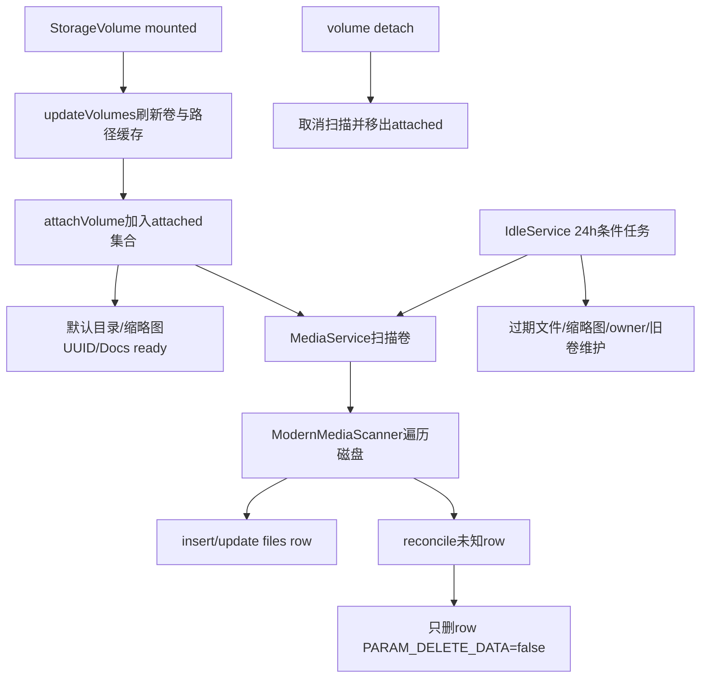
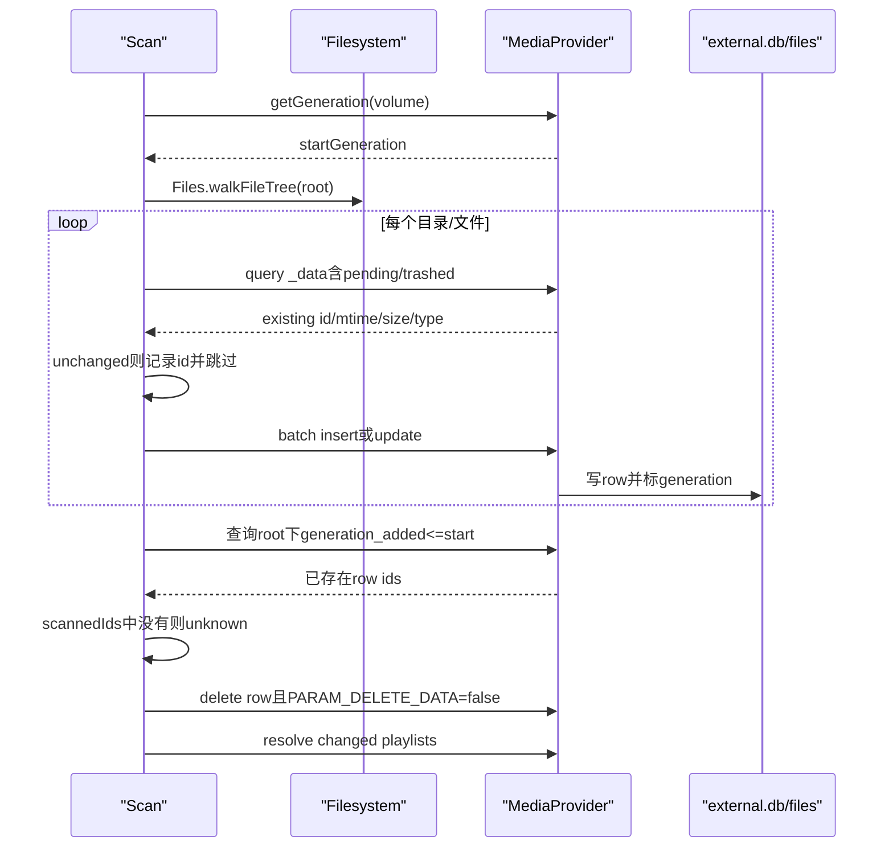

# 274 Android MediaProvider数据库、volume attach、ModernMediaScanner、文件与row一致性及过期清理链

## 1. 本章目标

第273章解释了App与FUSE怎样进入MediaProvider，本章继续研究“文件已经存在”和“MediaStore能查到一行”为什么不是同一件事。我们会从数据库初始化、卷attach、扫描器遍历与批处理一路追到row回收、pending/trashed到期删除和卸载卷的历史索引保留。

## 2. Android 11版本边界

本文只依据本地`android-11.0.0_r48`。后续Android版本的MediaProvider数据库结构、扫描规则和后台维护可能变化；这里出现的7天pending、30天trash、32条batch以及24小时idle job都应理解为r48实现，而不是永恒API契约。

## 3. 先建立正确心智模型

真实文件系统负责字节、目录项和mtime，MediaStore的SQLite负责可查询索引、媒体元数据、owner与状态列。扫描器是二者之间的“对账器”，ContentProvider/FUSE写入链则尽量在操作当下同步两边；任何崩溃、拔盘或绕过写入都会留下短暂甚至持久差异。

## 4. “数据库是真相”只对查询成立

App通过MediaStore查询时，看到的是经过权限和volume过滤的数据库结果；但文件最终能否打开还取决于磁盘对象与FUSE政策。反过来，一个刚被其他程序写入磁盘的文件，在扫描完成前也可能没有row，因而不会出现在collection查询中。

## 5. 本章源码地图

```text
packages/providers/MediaProvider/src/com/android/providers/media/MediaProvider.java
packages/providers/MediaProvider/src/com/android/providers/media/DatabaseHelper.java
packages/providers/MediaProvider/src/com/android/providers/media/MediaService.java
packages/providers/MediaProvider/src/com/android/providers/media/IdleService.java
packages/providers/MediaProvider/src/com/android/providers/media/scan/MediaScanner.java
packages/providers/MediaProvider/src/com/android/providers/media/scan/ModernMediaScanner.java
packages/providers/MediaProvider/src/com/android/providers/media/util/FileUtils.java
packages/providers/MediaProvider/src/com/android/providers/media/util/SQLiteQueryBuilder.java
packages/providers/MediaProvider/apex/framework/java/android/provider/MediaStore.java
```

## 6. 本章的五个问题

第一，internal.db与external.db怎样分工；第二，卷挂载怎样成为可查询状态；第三，ModernMediaScanner怎样判断insert、update、skip或delete；第四，扫描期间的新写入怎样避免误删；第五，pending、trash、owner、缩略图和旧卷如何在idle maintenance中维护。

## 7. 关键名词：具体卷与合成卷

`internal`是系统内置媒体资源；`external_primary`以及UUID样式名称代表具体外部卷；`external`是聚合视图名称。调用`content://media/external/...`时，许多写入场景会解析到primary，查询则可展开为当前挂载外部卷的合成视图，不能把二者当同一个物理卷。

## 8. 关键名词：attach不等于mount

mount是StorageManager/vold层的文件系统状态；attach是MediaProvider把卷名加入自身可服务集合。卷可以已经由内核挂载，但MediaProvider尚未attach；此时`getDatabaseForUri()`仍会抛VolumeNotFoundException。

## 9. 关键名词：scan不等于import

扫描既可能插入新row，也可能更新已有row、跳过未变化文件、删除磁盘上已不存在的row并解析playlist。它不是单向“把新文件导入数据库”，而是限定目录范围内的双向对账。

## 10. 总体状态流



## 11. onCreate先构造扫描器

MediaProvider启动时先创建`ModernMediaScanner(context)`，随后构造两套DatabaseHelper。扫描器通过本地ContentProviderClient回到同一个MediaProvider，因此仍复用正常的insert、update、delete、权限旁路和通知机制，而不是直接任意改SQLite。

## 12. 只有两份主数据库

`internal.db`对应internal volume，`external.db`承载所有具体外部卷。看到SD卡、USB盘和primary时，不要推断r48会为每个卷新建一份现代数据库；它们主要依靠files表的`volume_name`列分区。

## 13. 外置卷共库的意义

共库让`external`合成视图可以跨当前挂载卷查询，也便于保留近期拔出卷的索引。代价是所有外部查询必须正确加入volume过滤，否则会把已经弹出的卷的旧row泄露给调用者。

## 14. DatabaseHelper不是普通SQLiteOpenHelper用法

它重写公开的`getReadableDatabase()`和`getWritableDatabase()`并直接抛异常，要求内部调用走`runWithTransaction()`或`runWithoutTransaction()`。原因是schema变更需要读写锁协调SQLite连接，避免一条连接改schema、另一条等待transaction造成死锁。

## 15. WAL与schema读写锁

构造器启用write-ahead logging。一般数据库操作拿schema read lock，升级和重建view拿write lock；这不是用来替代SQLite事务，而是在连接池与schema更新之间再加一层进程内秩序。

## 16. files表是一张宽表

`files`同时保存路径、大小、mtime、MIME、media_type、音视频图片元数据、owner、pending、trashed、favorite、relative_path、volume_name和generation等。audio、video、images、downloads主要是这张表上的view，不是彼此完全独立的数据副本。

## 17. _data具有NOCASE唯一性

schema中`_data TEXT UNIQUE COLLATE NOCASE`，同一数据库不能保存仅大小写不同的重复路径row。这会把外部文件系统的命名语义与SQLite的NOCASE约束连接起来，插入冲突在target R与旧target上的异常兼容行为也可能不同。

## 18. 目录也有row

ModernMediaScanner会把目录作为普通访问节点扫描，写入`FORMAT_ASSOCIATION`且MIME为空。目录row帮助维护parent关系；DatabaseHelper统计媒体item时用`mime_type IS NOT NULL`排除这些目录，所以“files表行数”不等于“媒体数量”。

## 19. view按media_type投影

audio、video、images和downloads view从files筛出对应media_type或download标志，再应用列投影。查询某个collection只是换了视图与权限，不意味着磁盘上存在四套索引。

## 20. volume过滤写进view

DatabaseHelper维护`mFilterVolumeNames`。集合变化时，它在schema write lock和事务中重建最新views，把当前可见卷名嵌入SQL；因此拔盘后可隐藏旧row，而无需立刻抹掉其全部元数据。

## 21. 初始外部过滤值

external helper构造时先把`external_primary`作为默认过滤值，之后`updateVolumes()`异步用当前外部卷集合刷新。初始化窗口与测试环境因此可能先看到默认值，正式状态以刷新后的集合为准。

## 22. attached集合是第一道门

`getDatabaseForUri()`先把`external`解析为`external_primary`，再确认卷名位于`mAttachedVolumeNames`。只有通过后才选择internal或external helper；共用external.db不代表任意历史volume_name都随时可操作。

## 23. 为什么历史row仍不能直接访问

一个SD卡的row可能仍在external.db，但detach后具体卷名不在attached集合，查询入口会先失败；合成view也只包含当前filter volume names。保留数据与对外可访问是两个独立维度。

## 24. attachVolume只允许本进程

方法检查calling identity的pid必须等于MediaProvider自己的pid，外部App不能用`content://media/.../volumes`任意打开数据库。随后还用`MediaStore.checkArgumentVolumeName()`拒绝不合法卷名。

## 25. validate参数的作用

validate为true且非internal时，会调用`getVolumePath()`确认卷当前存在；MediaService主动扫描时使用true。ExternalStorageService接收系统卷状态时使用false，因为StorageManager已经给出了可信状态，且路径缓存可能正处在更新窗口。

## 26. attach先加入集合

通过检查后，卷名在同步块内加入`mAttachedVolumeNames`，然后对具体volume URI发送notifyChange。若是外部具体卷，还会同时通知`external`合成URI，使观察聚合collection的客户端重新查询。

## 27. attach不创建新external数据库

代码选择helper时仍是internal→mInternalDatabase，其他→mExternalDatabase。attach的主要效果是开放路由、通知观察者和安排卷级准备工作，不是执行SQL `ATTACH DATABASE`。

## 28. 外部卷准备放到前台执行器

非internal卷的默认目录与缩略图检查通过ForegroundThread executor异步执行。attach返回不意味着这些准备动作已经全部完成，但attached门已经开放；这解释了生命周期与卷准备之间的短暂并发窗口。

## 29. 默认目录只主动创建一次

`ensureDefaultFolders()`仅针对primary等卷按SharedPreferences key判断，遍历系统默认目录，不存在才`mkdirs()`并插入目录row。标记提交后，即使用户手动删除目录，也不会每次挂载都强行重建。

## 30. 非primary使用卷专属key

primary用`created_default_folders`，其他卷的key附加MediaStore volume name。这样一个卷完成初始化不会错误阻止另一张SD卡创建默认目录。

## 31. 缩略图数据库UUID配对

MediaProvider从数据库取得或创建UUID，并与缩略图目录中的标记文件比较。标记缺失时写入当前UUID；若磁盘UUID与数据库不同，就遍历删除缩略图，防止重建数据库后旧文件名碰巧对应新的row id。

## 32. MediaDocumentsProvider ready信号

默认目录和缩略图事务完成后调用`MediaDocumentsProvider.onMediaStoreReady()`。注释强调数据库已能回答查询，DocumentsProvider此时再服务可降低ANR风险；它不是卷attach的前置授权判断。

## 33. updateVolumes刷新四组缓存

它清空并重建外部卷名、volumeName→路径、volumeName→扫描路径、volume root→StorageVolume id四类缓存。StorageVolume callback与ExternalStorageService的volume state回调都会触发刷新。

## 34. 哪些状态算当前外部卷

`MediaStore.getExternalVolumeNames()`遍历StorageManager volumes，只纳入`MEDIA_MOUNTED`与`MEDIA_MOUNTED_READ_ONLY`且volume name非空的项。只读卷可以参与查询与扫描，但具体写入仍可能在文件系统层失败。

## 35. external是合成名字

`FileUtils.getVolumeScanPaths(external)`会展开所有当前具体外部卷；而`getVolumePath(external)`直接抛FileNotFoundException，因为合成视图没有单一挂载根。凡是需要真实路径的代码必须先解析到具体卷。

## 36. scan path有边界

internal扫描`Environment.getInternalMediaDirectories()`；具体external扫描该StorageVolume根；合成external展开各根。MediaProvider对传入`_data`还会canonicalize并确认落在目标卷允许扫描路径下，不能靠伪造volume URI写到另一个根。

## 37. MediaService是扫描编排器

它是JobIntentService，处理MEDIA_MOUNTED、MEDIA_SCANNER_SCAN_FILE、locale与package事件。真正的目录遍历仍委托给MediaProvider中的scanner，服务本身负责规范化路径、attach、广播和扫描状态标记。

## 38. 外部卷扫描前先扫internal

`onScanVolume()`若目标不是internal，先扫描internal并调用`RingtoneManager.ensureDefaultRingtones()`。这样系统铃声尽快可用，不必等潜在很久的整张外置盘扫描结束。

## 39. 扫描根先canonicalize

来自Intent的文件URI先构造File并调用`getCanonicalFile()`，再根据真实路径求volume name。这样`..`或符号路径别名不会轻易把扫描范围与卷判断分离。

## 40. 扫描开始与结束标记

MediaService向MediaStore的media_scanner URI插入volume name，MediaProvider记录`mMediaScannerVolume`和helper的scan start time；完成后删除该URI并记录stop time。这个特殊URI是扫描状态控制面，不是普通媒体row。

## 41. 广播包住整个外部扫描

外部卷发送MEDIA_SCANNER_STARTED，finally中发送MEDIA_SCANNER_FINISHED。broadcast URI在扫描前一次解析，因此即使中途拔盘，结束广播仍可引用原卷；异常不会跳过finally。

## 42. ModernMediaScanner的定位

源码称它是用纯managed code重写的legacy scanner，目标是bug-compatible、更易测试维护。元数据原则是先填文件属性，再由MediaMetadataRetriever、ExifInterface、XmpInterface按更高信任度覆盖有效字段。

## 43. 每次扫描创建Scan对象

Scan持有本地ContentProviderClient、root、reason、volumeName、files URI、CancellationSignal、ownerPackage以及统计数据。try-with-resources确保pending操作被检查、目录锁释放、client关闭。

## 44. volume级CancellationSignal

scanner以volumeName缓存CancellationSignal，同卷扫描共享它。detach会从map移除并cancel当前signal，遍历、查询和清理阶段多处调用`throwIfCanceled()`，让拔盘尽快终止工作。

## 45. detach不是等待扫描自然结束

MediaProvider先调用`mMediaScanner.onDetachVolume(volume)`发取消，再从attached集合移除并通知具体卷和external观察者。扫描线程捕获OperationCanceledException并安静返回，避免把正常拔盘当致命错误。

## 46. 构造时抓取start generation

Scan通过`MediaStore.getGeneration()`记录`mStartGeneration`。后面清理row时，只考虑`generation_added <= startGeneration`，保护扫描开始后由并发操作新插入、但尚未被本次遍历看到的row。

## 47. 单文件与目录扫描不同

`mSingleFile = mRoot.isFile()`。单文件扫描会锁住父目录，若正好扫描并识别到一个既有或新row，可跳过全范围reconcile；目录扫描则完成walk后必须对扫描范围内数据库row做对账。

## 48. 扫描的三阶段

第一阶段`walkFileTree()`收集并upsert；第二阶段`reconcileAndClean()`找磁盘未见的旧row；第三阶段`resolvePlaylists()`处理本次generation之后更新的playlist。顺序确保playlist解析能看到先写入的媒体row。

## 49. 扫描与对账时序图



## 50. 路径是否可扫描先看父链

单文件扫描检查父目录，目录扫描检查root；`shouldScanPathAndIsPathHidden()`一路向上。任何父路径命中固定不可扫描模式便返回false；否则累计“是否位于隐藏目录”状态，用来把媒体类型降为NONE。

## 51. 固定可见根会删除异常.nomedia

存储根等`PATTERN_VISIBLE`路径必须可见，扫描器会删除该处非标准`.nomedia`。这是防止一个根级标记隐藏整卷，而不是说所有子目录的`.nomedia`都被忽略。

## 52. 固定不可扫描目录

Android/data、Android/obb以及Movies/Music/Pictures下的`.thumbnails`目录命中`PATTERN_INVISIBLE`，扫描器尝试创建`.nomedia`并跳过子树。创建标记是为了SD卡拿到旧设备时，旧scanner也能识别不可扫描区域。

## 53. 普通.nomedia的准确语义

r48的`shouldScanDirectory()`并未因任意目录存在`.nomedia`就返回false；隐藏状态由`FileUtils.isDirectoryHidden()`沿父链累计。目录仍可能被遍历，但其中普通媒体会被标成`MEDIA_TYPE_NONE`，这与“完全不读文件树”不同。

## 54. 每个目录有独占锁

scanner以Path→DirectoryLock引用计数表协调并发扫描。preVisitDirectory获取锁，postVisitDirectory先flush本目录pending操作再释放；单文件扫描则显式锁父目录，避免两个重叠扫描互相误判unknown row。

## 55. 锁不是全卷串行化

只要目录不重叠，不同扫描仍可并行；重叠路径在对应目录上排队。close还会快照并释放异常路径中遗留的锁，防止一次扫描失败永久堵住后来任务。

## 56. visitFile先解析类型

目录的MIME为null；文件由MimeUtils根据路径解析。DRM MIME会交给DrmManagerClient求原始类型，然后结合隐藏状态和路径得到media_type；专辑封面样式图片也会降为MEDIA_TYPE_NONE，避免进入用户图片collection。

## 57. “未变化”由四项共同决定

scanner按`_data=?`查询既有row，并显式包含pending、trashed、favorite。只有mtime、size、MIME、media_type都相同且不是FUSE pending，普通文件才跳过；目录无条件可跳过内容元数据提取，但其id仍被记为已扫描。

## 58. 为什么先记录scanned id

即便文件未变化而跳过，也必须把existingId加入`mScannedIds`。否则后面的reconcile只看到“没有产生update”，就会把这个完全正常的row当成unknown并删除。

## 59. FUSE pending强制重扫

如果row的IS_PENDING非0，但真实文件名并不匹配`.pending-时间-原名`，scanner判定它是FUSE创建的pending。即使mtime/size未变化，也不能走unchanged快路，必须更新row并把pending发布为普通状态。

## 60. scanner识别隐藏状态而非删除内容

文件隐藏或位于隐藏父目录时，media_type改为NONE，但row仍可存在files表。MediaStore图片/音视频view不再展示它，文件字节也不会仅因隐藏就被scanner删除。

## 61. upsert其实是insert或定点update

源码虽称newUpsert，但r48还没有使用SQLite UPSERT：existingId为-1构造insert，否则构造带具体id、expectedCount=1的update。两者都允许单项exception，避免一个坏文件拖垮整批扫描。

## 62. generic values先清旧字段

`withGenericValues()`不只写_data、size、mtime和title，还先把date taken、宽高、文档id、方向、音频标签等大量字段设null或默认值。这样文件内容改成不含某元数据时，旧扫描值不会幽灵般残留。

## 63. 元数据覆盖顺序

基础值来自BasicFileAttributes与文件名；音视频使用MediaMetadataRetriever；图片使用ExifInterface；容器还能解析XMP并写入脱敏后的XMP。只有Optional有效值才覆盖，空串、-1和纯空白会被忽略。

## 64. 图片元数据

image扫描读取宽高、resolution、date taken、orientation、description、exposure、f-number、ISO与scene capture type。读取异常只记录trouble，仍返回带基础字段的operation，因此“EXIF坏了”不必然导致整张图片没有row。

## 65. 音视频元数据

audio初始化UNKNOWN artist与父目录album，再根据Ringtones、Notifications、Alarms、Podcasts、Audiobooks、Music路径设置用途；video还清空并重建color standard/transfer/range。Retriever失败时同样保留通用索引。

## 66. owner只写给新文件

调用`scanFile(file, reason, ownerPackage)`时，只有新insert、非目录且ownerPackage非null才附加OWNER_PACKAGE_NAME。更新既有row不会因为一次扫描请求随意夺走原owner，目录也不设置调用方owner。

## 67. DRM的特殊补丁

DRM文件先求原始MIME，且operation最终强制`IS_DRM=1`，因为更低层metadata stack可能没有正确设置。这里展示scanner不仅搬运属性，还承担兼容修正。

## 68. batch阈值是超过32

`BATCH_SIZE=32`，`maybeApplyPending()`在pending size大于32时提交，所以常见一批可达到33项，而不是严格每32项提交。离开目录前和walk结束后还会强制apply。

## 69. batch通过MediaProvider写回

scanner调用`ContentResolver.applyBatch(media, operations)`，结果URI中的id加入scannedIds。它没有直接调用db.insert，因此路径派生、generation、trigger、通知与其他MediaProvider规则仍生效。

## 70. 单项失败不会中止整批意图

operation使用`withExceptionAllowed(true)`，result可携带exception；scanner记录警告后继续处理其他结果。整批RemoteException或OperationApplicationException也只记录，但pending最终会清空，这意味着失败项要靠后续扫描再修复。

## 71. first result如何选择URI

扫描保存第一个遇到的id，结束后再查询其media_type，返回audio、video、image、playlist的具体collection URI；无法分类时返回files URI。返回URI类型是扫描后数据库分类结果，不只由扩展名直接拼出。

## 72. reconcile先快照scannedIds

walk完成后把LongArray转数组排序，后续用binarySearch判断数据库id是否在本次遍历见过。这个集合同时包含未变化existing row和成功insert返回的row，因而覆盖skip与write两条路径。

## 73. reconcile只看root范围

SQL要求`_data LIKE root/% OR _data LIKE root`，并用escapeForLike处理路径中的通配字符。扫描一个子目录只对账这个子树，不会把同卷其他目录row误删。

## 74. abstract playlist被排除

没有磁盘文件的MTP abstract AV playlist不参加“磁盘没见到就删row”判断。它本来就是纯数据库抽象对象，若套用普通文件一致性规则会被错误回收。

## 75. pending默认排除、trash包含

对账查询设置MATCH_PENDING_EXCLUDE、MATCH_TRASHED_INCLUDE、MATCH_FAVORITE_INCLUDE。普通pending可能正处在未发布写入期，不应因扫描没看到而清掉；trashed实体仍对应磁盘上的隐藏重命名文件，需要参与一致性核对。

## 76. generation保护并发新row

查询额外要求`generation_added <= mStartGeneration`。扫描开始后另一个App新插入row，即使文件尚未出现在当前walk结果，也不会被本次clean判为unknown；这是比“加一把全卷大锁”更细的并发保护。

## 77. generation不保护所有竞争

它主要保护扫描启动后的新insert。已经存在的row若在扫描期间被移动、删除或更改，仍需目录锁、MediaProvider同步更新和下一轮扫描共同收敛；generation不是文件系统事务日志。

## 78. 查询与删除分两阶段

scanner先完整收集unknownIds，再逐个构造delete operation。注释说明这样分页查询时，删除不会让当前Cursor窗口与排序发生漂移；稳定快照比边查边删更容易推理。

## 79. clean只删数据库row

删除URI附加`PARAM_DELETE_DATA=false`。因此对账发现“数据库有、扫描未见”时，只移除索引，不尝试再删除磁盘文件；既然walk没看见它，贸然对路径执行unlink既无必要也可能误伤竞争中新建的对象。

## 80. 文件存在但未被扫描的窗口

直接路径写入后，FUSE通常触发scan，但进程崩溃或特殊旁路可能留下“有文件无row”。下一次需求扫描、卷扫描或idle full scan会插入；在此前MediaStore collection查询可能看不到它。

## 81. row存在但文件消失的窗口

App绕过Provider删除、拔盘异常或I/O失败可能留下“有row无文件”。目录扫描的reconcile会删row；单个open也可能因文件不存在失败，不能因为query返回一行就假定字节仍可读取。

## 82. Provider删除与scanner clean不同

普通MediaProvider delete默认先`deleteIfAllowed()`删除数据文件，再删row；scanner clean显式关闭delete data。二者都调用delete API，却用query parameter表达完全不同的意图。

## 83. FUSE删除后的兼容缓存

第273章看到FUSE路径删除会同步删row；若App随后又按URI删同一row，MediaProvider可从UID缓存的deleted row id识别并静默返回0，避免旧App因“已经删掉”反而收到SecurityException。

## 84. pending的两种物理表示

通过普通MediaStore insert设置IS_PENDING时，`computeDataFromValues()`常把文件名变为`.pending-到期秒-显示名`；FUSE按真实路径创建时可留下正常文件名但row为pending。scanner正是通过文件名pattern区分二者。

## 85. computeDateExpires不信任外部值

外部修改的ContentValues先移除DATE_EXPIRES，调用方不能任意把自动清理时间设到遥远未来。只有操作实际改变IS_PENDING或IS_TRASHED时，MediaProvider才根据系统当前时间计算或清空expires。

## 86. pending默认保留7天

FileUtils的`DEFAULT_DURATION_PENDING`为7天。其语义是给生产者一个完成写入并发布的窗口；pending不是永久私有仓库，长期不发布的内容会进入idle到期删除候选。

## 87. trash默认保留30天

`DEFAULT_DURATION_TRASHED`为30天。置trash时路径可改写为`.trashed-到期秒-显示名`并记录IS_TRASHED与DATE_EXPIRES；恢复时状态清零、expires置null并恢复显示名对应路径。

## 88. 文件名pattern反推状态

`PATTERN_EXPIRES_FILE`匹配`.pending|trashed-数字-原名`。`computeValuesFromData()`能由_data反推volume、relative path、display name、pending/trashed与expires，使磁盘重命名和数据库状态在再次扫描时重新对齐。

## 89. FUSE pending为何不改名

`computeDataFromValues(values, isForFuse)`在isForFuse且pending时不把真实路径改成`.pending-*`，因为文件已经按路径创建；FileUtils还保留TODO，说明扫描发生在create之后，不能简单在每次由DATA计算时都清pending。

## 90. 发布FUSE文件依赖扫描

ModernMediaScanner查询row时若发现“pending=1但文件名不是expires pattern”，就认定pending来自FUSE并强制重扫。MediaProvider处理scanner update时允许将该pending归零，最终让文件进入普通collection可见状态。

## 91. trash不是只改一个布尔值

状态、到期时间、display name、_data真实路径可能联动，实际rename失败也会影响操作结果。读源码时必须同时看`computeDateExpires()`、`computeDataFromValues()`和Provider update/rename链，不能只看IS_TRASHED列。

## 92. 默认查询隐藏状态项

普通查询通常排除他人pending与trashed，owner/FUSE/system路径可通过MATCH参数选择包含。扫描器为了对账显式指定include/exclude，说明这些参数既是UI可见性政策，也是内部一致性工具。

## 93. IdleService怎样调度

MediaReceiver安排job id -200，周期24小时，同时要求充电和设备idle。JobService启动新线程调用MediaProvider.onIdleMaintenance；停止job时cancel CancellationSignal并返回false，不请求系统自动重试。

## 94. idle首先全扫当前外部卷

维护遍历`getExternalVolumeNames()`，每卷调用MediaService的REASON_IDLE扫描；这又会先保证internal与默认铃声。它让长期绕过Provider产生的文件/row差异有周期性收敛机会。

## 95. idle不是精确24小时闹钟

JobScheduler的periodic、charging和device idle都是调度条件，实际运行可延后。7天或30天表示计算出的expires，真正删除要等某次符合条件的maintenance，不能承诺到秒清理。

## 96. 缩略图清理

`pruneThumbnails()`先收集files所有已知id并排序，再遍历当前卷缩略图目录。除数据库UUID标记外，文件名能解析为已知id就保留，否则删除并invalidate；无效名字也会被视为stale。

## 97. 卸载包只清owner

package fully removed或data cleared触发`onPackageOrphaned()`，把匹配OWNER_PACKAGE_NAME的row更新为null，不删除用户媒体文件。idle还会遍历数据库owner，发现包既未安装也不在installer session中时做同样孤儿化。

## 98. installer session为何算已知

备份恢复或安装进行中时，包可能暂时查不到PackageInfo，但PackageInstaller已有session。把这种owner立即清空会破坏恢复语义，所以`isPackageKnown()`把两种来源都视为存在。

## 99. 到期删除只看最近一周窗口

idle用`DATE_EXPIRES BETWEEN now-7days AND now`查询。注释说这是防御系统时钟剧烈变化；它不是简单的`DATE_EXPIRES <= now`，因此极老的过期row不会在这条查询中无条件批量扫掉。

## 100. 到期删除会删真实内容

查询得到volume_name与id后，调用普通`delete(Files.getContentUri(volume,id))`，没有设置PARAM_DELETE_DATA=false。因此pending/trash过期维护与scanner unknown clean不同：前者意图删除文件和row，后者只修数据库索引。

## 101. maintenance事务的重入边界

到期遍历包在`mExternalDatabase.runWithTransaction()`中，而内部delete再取同一helper时，DatabaseHelper检测thread-local transaction已存在便直接复用，避免嵌套transaction。通知与后台任务统一等外层成功后分阶段发出。

## 102. idle维护全景


## 103. recent volume保留策略

MediaStore从StorageManager的recent storage volumes取得近期卷名。external.db中已知volume减去recent集合得到真正stale卷，再按volume_name批量删row；暂时拔出的常用SD卡仍可保留索引，永久消失的旧卷最终被遗忘。

## 104. current与recent不要混同

current external names用于view过滤、扫描与对外访问；recent names用于决定历史索引是否值得保留。一个卷可以“不current但recent”，此时row保留却不可通过attached/current视图正常访问。

## 105. maintenance最后清目录cache

所有维护完成后清空`mDirectoryCache`，重新计算真实媒体item count并记录duration、stale thumbnails和expired count。缓存失效是收尾动作，不是证明磁盘与数据库绝对一致的事务提交点。

## 106. generation每个事务先加一

DatabaseHelper开始transaction时执行`UPDATE local_metadata SET generation=generation+1`。因此generation是单调事务代际，不是精确“变更row数”；事务可能一次写多row，也可能因内部使用产生跳号。

## 107. insert与update如何盖章

定制SQLiteQueryBuilder会移除调用方伪造的generation列：insert把generation_added和generation_modified都设为当前local generation；update只更新generation_modified。App不能自己倒填代际来逃避scanner并发保护。

## 108. generation比mtime可靠但仍需version

MediaStore文档建议增量同步先比较`getVersion(volume)`，版本由数据库schema version与数据库UUID组成；version改变说明generation可能重置，应全量同步。版本不变时，再用generation_added/modified做算术比较，比受系统时钟和File.setLastModified影响的时间列稳健。

## 109. trigger负责副作用而非generation

files insert/update/delete triggers调用DatabaseHelper注册的`_INSERT/_UPDATE/_DELETE`自定义函数，收集通知、owner变化、路径等副作用；generation值由定制SQL builder写入。把trigger误认为代际来源会读错责任边界。

## 110. 一致性的五层防线

即时Provider/FUSE操作尽量同时改文件与row；目录锁约束重叠扫描；generation保护并发新insert；reconcile修复扫描范围内孤儿row；idle full scan与维护处理长期遗漏。它追求最终收敛，而不是把Linux VFS与SQLite变成一个原子数据库。

## 111. 阅读完成检查

你应能解释为什么只有两份数据库、external view怎样过滤当前卷、attach为何不是SQL ATTACH、scanner何时skip/update/delete、generation为何能防误删新row，以及pending到期删除和scanner clean为什么一个删文件、一个只删row。

## 112. macOS只读练习一：画出卷与数据库映射

```bash
cd /Users/ninebot/androidSource
sed -n '300,420p' packages/providers/MediaProvider/src/com/android/providers/media/MediaProvider.java
sed -n '7340,7465p' packages/providers/MediaProvider/src/com/android/providers/media/MediaProvider.java
sed -n '88,230p' packages/providers/MediaProvider/src/com/android/providers/media/DatabaseHelper.java
```

写出internal、external_primary、一个UUID卷和external合成名分别经过哪个helper、attached门与view filter；特别标注“共用external.db”不等于“卸载后仍可访问”。

## 113. macOS只读练习二：手推一次目录扫描

```bash
cd /Users/ninebot/androidSource
sed -n '250,470p' packages/providers/MediaProvider/src/com/android/providers/media/scan/ModernMediaScanner.java
sed -n '510,755p' packages/providers/MediaProvider/src/com/android/providers/media/scan/ModernMediaScanner.java
```

假设root下有未变化图片A、新图片B、数据库有但磁盘消失的C、扫描启动后并发插入的D：逐个写出scannedIds、unknownIds和最终操作，并解释generation clause怎样保护D。

## 114. macOS只读练习三：比较pending与trash

```bash
cd /Users/ninebot/androidSource
sed -n '840,875p' packages/providers/MediaProvider/src/com/android/providers/media/util/FileUtils.java
sed -n '1040,1165p' packages/providers/MediaProvider/src/com/android/providers/media/util/FileUtils.java
sed -n '570,615p' packages/providers/MediaProvider/src/com/android/providers/media/scan/ModernMediaScanner.java
```

分别列出普通MediaStore pending、FUSE pending和trashed文件的真实文件名、row状态、默认到期时间与scanner行为；说明为什么FUSE pending必须绕开unchanged fast path。

## 115. macOS只读练习四：审计idle清理

```bash
cd /Users/ninebot/androidSource
sed -n '1,105p' packages/providers/MediaProvider/src/com/android/providers/media/IdleService.java
sed -n '950,1075p' packages/providers/MediaProvider/src/com/android/providers/media/MediaProvider.java
sed -n '3670,3730p' packages/providers/MediaProvider/apex/framework/java/android/provider/MediaStore.java
```

按顺序记录full scan、thumbnail、owner、expires、recent volume与cache步骤；比较`DATE_EXPIRES BETWEEN now-7d AND now`和直觉中的`<=now`，再区分current与recent volume集合。

## 116. 易混点一：不是每卷一库

r48现代MediaProvider只有internal.db与external.db主helper，多个外部具体卷靠volume_name共享external.db。源码里兼容识别`external-*.db`名称不等于当前attach会为每个卷创建独立库。

## 117. 易混点二：mount、cache、attach、filter四态不同

StorageManager mounted决定系统卷存在；MediaProvider cache保存卷路径；attached集合决定URI能否路由；database view filter决定合成查询显示哪些row。正常生命周期让它们快速收敛，但调试并发问题时必须逐层核对。

## 118. 易混点三：pending与trash不是虚拟文件夹

它们首先是row状态，也可能编码到隐藏文件名；FUSE pending又可能保持普通真实文件名。扫描、查询和idle用不同规则处理，不能只凭路径前缀判断所有情况。

## 119. 复读纠偏记录

复读后修正九点：attach不是SQLite ATTACH；多个外卷共用external.db；历史row由attached门和view filter共同隐藏；普通`.nomedia`在r48主要造成hidden/media_type NONE而非一律skip subtree；batch条件是size>32；scanner clean显式只删row；expired maintenance会删真实文件且只查最近一周到期窗；generation是事务代际而非row计数；current volume与recent volume承担访问过滤和历史保留两种责任。

## 120. 本章小结与下一章

MediaProvider以两份数据库索引多卷，用attached与动态view把当前挂载状态投影给调用者；ModernMediaScanner通过属性比较、批量upsert、scanned id和start generation完成限定范围对账；IdleService再周期性扫描并维护缩略图、owner、过期内容与旧卷。下一章继续深入MediaProvider的insert/update/delete、路径放置、rename事务、文件I/O与通知分发链。
